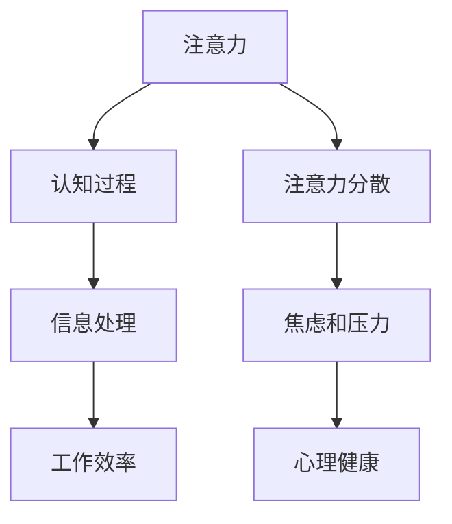
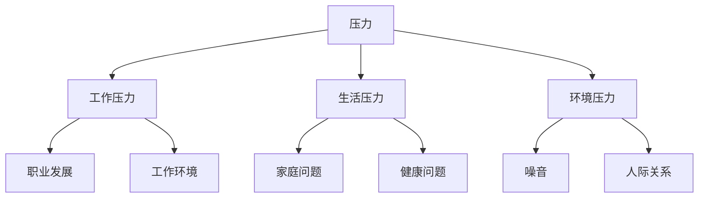
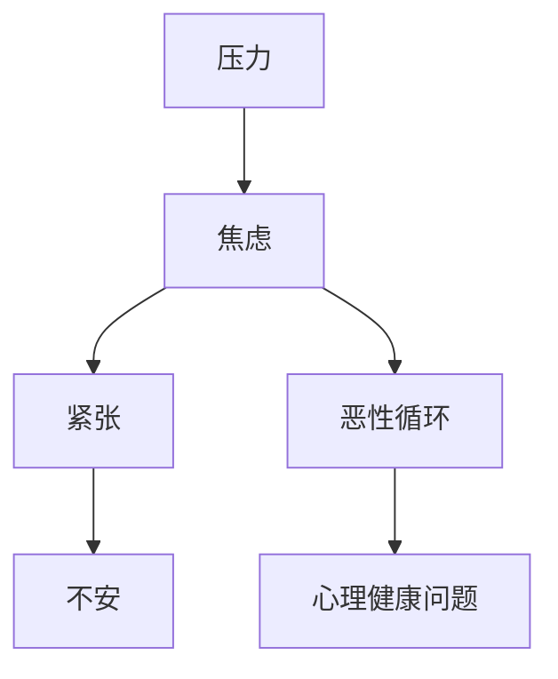
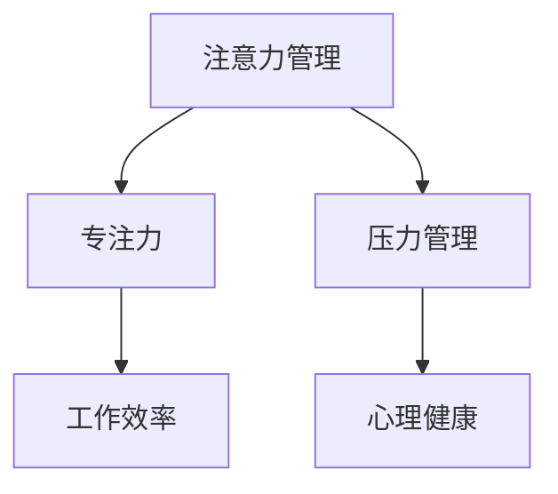

                 

### 第1章：注意力管理与压力管理的概述

> 注意力管理是优化认知过程，提高工作效率和生活质量的关键。压力管理则是应对外部刺激，保持心理平衡的重要手段。本章将探讨注意力管理和压力管理的核心概念、相互关系以及管理的必要性，为后续章节奠定基础。

#### 1.1 注意力管理的重要性

注意力是人类心智活动的基础，它决定了我们在信息处理、问题解决和决策过程中的效率。有效的注意力管理可以帮助我们：

- **提高工作效率**：通过集中注意力，可以更迅速地完成任务，提高工作效率。
- **减轻压力**：避免注意力分散导致的焦虑和压力，使个体能够更好地应对工作和生活中的挑战。
- **提升生活质量**：注意力管理不仅有助于职业发展，还能改善个人日常生活，提高幸福感。

**核心概念与联系**



#### 1.2 压力的来源与分类

压力可以来源于多个方面，大致可以分为以下几类：

- **工作压力**：包括工作负荷、工作环境、职业发展等。
- **生活压力**：如家庭、健康、财务等。
- **环境压力**：如噪音、交通、人际关系等。

了解压力的来源和分类有助于我们更有效地进行压力管理。

**核心概念与联系**



#### 1.3 压力与焦虑的关系

压力和焦虑之间存在密切的互动关系。一方面，压力可能导致焦虑；另一方面，焦虑也可能加剧压力感。

- **焦虑的定义与表现**：焦虑是一种情绪状态，表现为紧张、不安、恐惧等。
- **压力与焦虑的相互作用**：长期的压力会引发焦虑，而焦虑也会加剧压力感，形成恶性循环。

**核心概念与联系**



#### 1.4 注意力管理与压力管理的必要性

在现代社会中，面对复杂的工作和生活环境，注意力管理和压力管理显得尤为重要。

- **必要性**：帮助个体更好地集中精力，应对工作压力，保持心理健康。
- **作用**：通过注意力管理，提高专注力，减轻压力；通过压力管理，保持心理平衡，提升生活质量。

**核心概念与联系**



### 总结

本章介绍了注意力管理和压力管理的核心概念及其重要性，为后续章节的深入探讨奠定了基础。

作者：AI天才研究院/AI Genius Institute & 禅与计算机程序设计艺术 /Zen And The Art of Computer Programming

---

文章标题：《注意力管理与压力管理实践：在压力和焦虑中保持专注》

关键词：注意力管理，压力管理，专注力，焦虑，心理健康

摘要：本文从注意力管理和压力管理的核心概念出发，探讨了它们的重要性及其相互关系。通过详细的理论分析和实践案例，本文为读者提供了有效的注意力管理和压力管理策略，帮助个体在压力和焦虑中保持专注，提升生活质量。本文结构清晰，内容丰富，适合关注个人发展和心理健康的人群阅读。---

## 第1章：注意力管理与压力管理的概述

### 1.1 注意力管理的重要性

**注意力管理**是优化认知过程，提高工作效率和生活质量的关键。注意力是指人的心理活动指向并集中于某种对象或活动的能力。有效的注意力管理有助于我们：

- **提高工作效率**：集中注意力可以更高效地完成任务，减少错误和重复劳动。
- **减轻压力**：避免注意力分散导致的焦虑和压力，使个体能够更好地应对工作和生活中的挑战。
- **提升生活质量**：注意力管理不仅有助于职业发展，还能改善个人日常生活，提高幸福感。

在现代社会中，注意力管理的重要性愈发凸显。信息爆炸、工作压力、社交网络等多种因素都会导致注意力分散，影响工作效率和生活质量。因此，理解和掌握注意力管理的方法和技巧至关重要。

#### 注意力的本质

注意力是人类心智活动的基础，它决定了我们在信息处理、问题解决和决策过程中的效率。注意力可以大致分为三种类型：

1. **选择性注意力**：指个体在选择关注某些信息的同时，忽略其他无关信息的能力。这种能力使我们能够在复杂环境中筛选关键信息。
2. **持续注意力**：指个体在长时间内保持关注某种对象或任务的能力。这种能力在长时间工作和学习中尤为重要。
3. **分配注意力**：指个体在同时处理多个任务或对象时的能力。这种能力在多任务处理和高强度工作环境中得到广泛应用。

每种类型的注意力都有其独特的特点和影响因素，了解这些特点有助于我们更好地管理注意力。

#### 注意力与压力的关系

注意力与压力之间存在密切的关系。一方面，注意力分散往往会导致压力增加；另一方面，压力的增加也会影响注意力水平。以下是几种常见的注意力与压力的相互作用方式：

1. **压力导致的注意力分散**：当个体面临高强度压力时，可能会出现注意力分散的现象，难以集中精力完成任务。
2. **注意力分散加剧压力**：注意力分散会导致个体感到焦虑和不安，从而进一步增加压力感。
3. **注意力管理减轻压力**：通过有效的注意力管理策略，如集中注意力、减少干扰和合理安排工作，可以减轻压力，提高工作效率。

#### 压力管理的必要性

压力管理是保持心理健康和生活平衡的重要手段。在现代社会，压力已经成为影响个体健康和生活质量的主要因素之一。以下是压力管理的必要性：

- **心理健康**：长期的压力会导致焦虑、抑郁等心理健康问题，影响个体的情绪和行为。
- **生理健康**：压力会引发多种生理问题，如心血管疾病、免疫系统功能下降等。
- **工作与生活平衡**：有效的压力管理有助于个体更好地平衡工作与生活，提高生活质量。

因此，理解和掌握压力管理的原则和方法，对于保持心理健康和生活平衡具有重要意义。

### 压力的来源与分类

压力可以来源于多个方面，大致可以分为以下几类：

1. **工作压力**：工作压力是职场人士面临的主要压力来源之一，包括工作负荷重、工作环境不佳、职业发展不明确等。工作压力会导致焦虑、抑郁等心理健康问题，影响工作效率和职业发展。

2. **生活压力**：生活压力包括家庭、健康、财务等方面的问题。家庭问题如婚姻关系紧张、子女教育等，健康问题如疾病、身体不适等，财务问题如经济压力、债务等。生活压力会影响个体的情绪和行为，降低生活质量。

3. **环境压力**：环境压力主要来自于外部环境，如噪音、交通拥堵、人际关系等。环境压力会影响个体的心理健康，导致情绪波动和注意力分散。

了解压力的来源和分类有助于我们更有效地进行压力管理。

#### 不同类型的压力及其影响

不同类型的压力对个体的生理和心理状态有不同的影响。以下是几种常见的压力类型及其影响：

1. **急性压力**：急性压力是指短时间内突然出现的压力，如突然的紧急情况、意外事件等。急性压力会导致肾上腺素和皮质醇等激素的分泌增加，引发生理反应，如心跳加速、血压升高等。长期处于急性压力状态会对心血管系统产生负面影响。

2. **慢性压力**：慢性压力是指长时间持续存在的压力，如长期的工作压力、家庭问题等。慢性压力会导致长期激素分泌增加，引发一系列生理问题，如免疫系统功能下降、消化系统问题等。此外，慢性压力还会导致心理健康问题，如焦虑、抑郁等。

3. **环境压力**：环境压力主要来自于外部环境，如噪音、交通拥堵、人际关系等。环境压力会影响个体的心理健康，导致情绪波动和注意力分散。长期处于高环境压力状态会对个体的身心健康产生负面影响。

了解不同类型的压力及其影响有助于我们采取相应的措施进行压力管理。

#### 压力的个体差异

个体在面对压力时的反应因人而异，受到遗传、个性、经验等因素的影响。以下是几种常见的个体差异：

1. **遗传因素**：遗传因素会影响个体的应激反应和应对压力的能力。某些个体可能天生对压力更加敏感，容易产生焦虑和抑郁等情绪。
2. **个性特点**：个性特点如乐观、悲观、外向、内向等会影响个体面对压力的态度和应对方式。乐观的人可能更容易从压力中恢复过来，而悲观的人可能更容易感到无助和沮丧。
3. **经验与应对策略**：个体在成长过程中积累的经验和应对策略也会影响其面对压力的能力。有些人可能具备良好的应对压力的能力，而有些人可能由于缺乏经验而感到无助。

了解压力的个体差异有助于我们制定个性化的压力管理策略。

#### 压力与焦虑的关系

压力和焦虑之间存在密切的关系。一方面，压力可能导致焦虑；另一方面，焦虑也可能加剧压力感。

1. **压力导致焦虑**：当个体面临高强度压力时，可能会出现焦虑情绪。焦虑是一种身体和心理上的紧张状态，表现为心跳加速、呼吸急促、失眠等。长期处于高压状态会导致焦虑症状加剧，影响个体的身心健康。
2. **焦虑加剧压力**：焦虑会使个体感到不安和恐惧，进一步增加压力感。焦虑情绪会导致个体注意力分散，降低工作效率，加剧压力感。这种恶性循环会导致个体处于持续的心理压力状态。

了解压力与焦虑的关系有助于我们采取有效的策略同时管理压力和焦虑。

#### 如何区分压力与焦虑

虽然压力和焦虑有很多相似之处，但它们之间也存在明显的区别。

1. **压力的定义**：压力是指个体在面对外部挑战时产生的心理和生理反应。压力可以来源于工作、生活、环境等多个方面，通常是一种持续的、长期的状态。
2. **焦虑的定义**：焦虑是指个体在面对威胁或不确定情境时产生的情绪反应。焦虑通常是一种短暂的情绪状态，表现为紧张、不安、恐惧等。
3. **区分压力与焦虑**：要区分压力与焦虑，可以从以下几个方面入手：
   - **持续时间**：压力通常是一种长期状态，而焦虑可能是一种短暂的情绪反应。
   - **生理反应**：压力可能导致一系列生理反应，如心跳加速、失眠等，而焦虑通常表现为明显的生理反应，如出汗、颤抖等。
   - **情绪表现**：压力可能导致情绪低落、沮丧等，而焦虑则表现为紧张、不安、恐惧等。

通过了解压力与焦虑的区别，我们可以更准确地识别和管理这些情绪状态。

### 总结

本章介绍了注意力管理与压力管理的核心概念及其重要性。注意力管理是优化认知过程，提高工作效率和生活质量的关键，而压力管理则是保持心理健康和生活平衡的重要手段。本章还探讨了压力的来源与分类、压力与焦虑的关系以及如何区分压力与焦虑。理解这些概念有助于我们更好地管理注意力与压力，提升个人生活质量。

作者：AI天才研究院/AI Genius Institute & 禅与计算机程序设计艺术 /Zen And The Art of Computer Programming

---

### 1.2 压力的来源与分类

压力，作为一种普遍存在于人类生活中的心理现象，其来源多种多样。为了更好地理解压力并采取有效的管理策略，我们需要将其进行分类。以下是一些常见的压力来源及其分类：

#### 1.2.1 工作与生活压力的来源

**工作压力**：

- **工作量过大**：面对超出个人能力范围的工作量，会导致个体感到焦虑和压力。
- **工作期限紧迫**：紧迫的截止日期和不断的工作要求会使个体感到压迫。
- **工作环境**：不舒适的工作环境，如噪音、温度过热或过冷、空间拥挤等，也会导致压力。
- **人际关系**：与同事、上级或下属之间的冲突和不和谐关系，也会成为压力的来源。

**生活压力**：

- **家庭压力**：家庭成员之间的矛盾、婚姻关系紧张、子女的教育问题等都会带来压力。
- **经济压力**：财务困难、债务、失业等经济问题会对个体的心理健康产生负面影响。
- **健康问题**：自身或家人的健康问题，如疾病、长期照顾等，都是压力的重要来源。
- **个人目标**：追求个人目标和理想的过程中，常常会面临各种挑战和困难，导致压力增加。

#### 1.2.2 不同类型的压力及其影响

**急性压力**：

- **定义**：急性压力是指短时间内突然出现的压力，如突发事件、紧急情况等。
- **影响**：急性压力可能导致肾上腺素和皮质醇等激素的分泌增加，引发生理反应，如心跳加速、血压升高等。这种压力通常会在短时间内消失，但如果长期处于这种状态，会对心血管系统产生不利影响。

**慢性压力**：

- **定义**：慢性压力是指长时间持续存在的压力，如长期的工作压力、家庭问题等。
- **影响**：慢性压力会导致长期激素分泌增加，引发一系列生理问题，如免疫系统功能下降、消化系统问题等。此外，慢性压力还会导致心理健康问题，如焦虑、抑郁等。

**环境压力**：

- **定义**：环境压力主要来自于外部环境，如噪音、交通拥堵、人际关系等。
- **影响**：环境压力会影响个体的心理健康，导致情绪波动和注意力分散。长期处于高环境压力状态会对个体的身心健康产生负面影响。

**心理压力**：

- **定义**：心理压力是指由于心理因素导致的压力，如焦虑、恐惧、挫折感等。
- **影响**：心理压力会导致情绪低落、失眠、注意力不集中等问题，严重时可能引发抑郁和焦虑等心理疾病。

#### 1.2.3 压力的个体差异

个体在面对压力时的反应因人而异，受到遗传、个性、经验等因素的影响。

- **遗传因素**：遗传因素会影响个体的应激反应和应对压力的能力。某些个体可能天生对压力更加敏感，容易产生焦虑和抑郁等情绪。
- **个性特点**：个性特点如乐观、悲观、外向、内向等会影响个体面对压力的态度和应对方式。乐观的人可能更容易从压力中恢复过来，而悲观的人可能更容易感到无助和沮丧。
- **经验与应对策略**：个体在成长过程中积累的经验和应对策略也会影响其面对压力的能力。有些人可能具备良好的应对压力的能力，而有些人可能由于缺乏经验而感到无助。

了解压力的个体差异有助于我们制定个性化的压力管理策略。

### 压力的个体差异

个体在面对压力时的反应因人而异，受到多种因素的影响。以下是几种常见的个体差异：

#### 1. 遗传因素

遗传因素对个体压力反应具有重要影响。某些基因可能导致个体在应对压力时产生更强的生理反应，如肾上腺素和皮质醇的分泌增加。这些个体可能在面对压力时更容易感到焦虑和紧张。

#### 2. 个性特点

个性特点也是影响个体压力反应的重要因素。乐观型个体通常更能积极面对压力，找到解决问题的方法。而悲观型个体则可能更容易感到无助和沮丧。此外，外向型个体通常更能通过社交来缓解压力，而内向型个体可能更倾向于独自应对压力。

#### 3. 经验与应对策略

个体在成长过程中积累的经验和应对策略也会影响其面对压力的能力。有些人可能由于过去的经历，如成功应对过类似的压力情境，因此在面对新的压力时更有信心和策略。而缺乏经验的个体可能更容易感到无助和不知所措。

#### 4. 心理韧性

心理韧性是指个体在面对逆境和挑战时保持积极态度和适应能力。具备高心理韧性的个体通常能够更好地应对压力，从困境中迅速恢复。而心理韧性较低的个体则可能更容易受到压力的负面影响。

了解这些个体差异有助于我们更好地理解个体在面对压力时的反应，从而采取更加有效的压力管理策略。

### 总结

本章详细探讨了压力的来源与分类，以及压力的个体差异。工作压力、生活压力、急性压力、慢性压力和环境压力都是常见的压力来源，它们对个体的身心健康产生不同的影响。个体差异，包括遗传因素、个性特点、经验与应对策略和心理韧性，也决定了个体在面对压力时的反应。了解这些内容有助于我们更好地识别和管理压力，提高生活质量。

作者：AI天才研究院/AI Genius Institute & 禅与计算机程序设计艺术 /Zen And The Art of Computer Programming

---

### 1.3 压力与焦虑的关系

压力与焦虑之间存在密切的相互作用，两者相互影响，共同影响个体的心理和生理健康。理解这两者之间的关系有助于我们更有效地进行压力和焦虑的管理。

#### 1.3.1 焦虑的定义与表现

焦虑是一种情绪反应，通常表现为对某一事件或情境的过度担忧和紧张感。焦虑可以表现为以下几种形式：

- **广泛性焦虑症**：个体长期处于焦虑状态，对多种情境感到担忧。
- **恐慌症**：突然出现的强烈焦虑感，伴有身体反应，如心悸、出汗等。
- **社交焦虑症**：在社交场合中感到紧张和不安，担心自己被他人评判或嘲笑。
- **特定焦虑症**：对特定情境或物体的强烈恐惧，如高度恐惧症、闭阖空间恐惧症等。

焦虑的症状通常包括：

- **心理症状**：如紧张、恐惧、担忧、易怒、难以集中注意力等。
- **生理症状**：如心悸、出汗、头痛、肌肉紧张、睡眠障碍等。

#### 1.3.2 压力与焦虑的相互作用

压力与焦虑之间的相互作用表现在以下几个方面：

1. **压力导致焦虑**：当个体面临高强度或持续的压力时，可能会产生焦虑情绪。这种焦虑可能是对压力源的直接反应，也可能是对压力情境的预测性担忧。例如，工作压力可能导致个体担心无法完成任务，从而产生焦虑感。

2. **焦虑加剧压力**：焦虑情绪本身就会增加个体的压力感。焦虑会导致个体对压力情境的评估更加负面，从而增加心理负担。此外，焦虑可能会引发一系列生理反应，如心跳加速、呼吸急促等，这些反应本身也会增加压力感。

3. **焦虑影响压力应对**：焦虑会影响个体的认知和行为功能，使其在面对压力时难以采取有效的应对策略。例如，焦虑可能导致个体注意力分散，难以集中精力解决问题，从而加重压力。

4. **循环互动**：压力和焦虑之间可能形成一种循环互动关系。高水平的压力可能导致焦虑，而焦虑又会加剧压力感，形成恶性循环。这种循环互动会导致个体长期处于心理和生理压力状态，对身心健康产生不利影响。

#### 1.3.3 如何区分压力与焦虑

虽然压力和焦虑有许多相似之处，但它们之间也存在一些明显的区别。以下是一些区分压力与焦虑的要点：

1. **持续时间**：压力通常是一种长期状态，而焦虑可能是一种短暂的情绪反应。焦虑往往与特定的压力源相关，而压力可能涉及更广泛的生活领域。

2. **生理反应**：焦虑通常伴有明显的生理反应，如心悸、出汗、呼吸急促等。而压力的生理反应可能不那么明显，更可能表现为疲劳、失眠等。

3. **情绪表现**：焦虑通常表现为紧张、担忧、恐惧等情绪，而压力可能导致情绪低落、沮丧等。

4. **情境关联**：焦虑通常与特定的情境或事件相关，而压力可能涉及更广泛的情境和领域。

通过了解压力与焦虑的区别，我们可以更准确地识别和应对这些情绪状态，采取有效的管理策略。

### 总结

本章探讨了压力与焦虑之间的密切关系，包括焦虑的定义与表现、压力与焦虑的相互作用以及如何区分压力与焦虑。理解这两者之间的关系有助于我们更好地管理压力和焦虑，维护身心健康。

作者：AI天才研究院/AI Genius Institute & 禅与计算机程序设计艺术 /Zen And The Art of Computer Programming

---

### 第2章：提高注意力的基础策略

注意力是认知过程中的核心要素，对于提高工作效率、减轻压力和提升生活质量至关重要。在本章中，我们将探讨一系列基础策略，以帮助读者提高注意力，并在面对复杂的工作和生活环境时保持专注。

#### 2.1 增强专注力的训练方法

**简化任务与目标设置**

在提高注意力的过程中，简化任务和目标设置是一种非常有效的方法。这种方法的核心在于将复杂的任务分解为简单的步骤，并设定明确、具体的目标。

**伪代码示例**：

```python
def simplify_task(task):
    steps = []
    while not is_simple(task):
        steps.extend(split_into_steps(task))
        task = reduce_steps(steps)
    return task

def is_simple(task):
    return len(task) <= MAX_STEP_SIZE

def split_into_steps(task):
    return [subtask for subtask in task if not is_simple(subtask)]

def reduce_steps(steps):
    return reduce((lambda x, y: x + y), steps)
```

通过这种方式，我们可以将复杂的任务逐步拆解为简单可操作的小任务，从而降低认知负荷，提高专注力。

**分阶段工作法**

分阶段工作法是一种通过将工作划分为不同阶段，每个阶段专注于特定任务的方法。这种方法有助于提高工作专注度和效率。

**伪代码示例**：

```python
def work_phase(phase, task):
    if phase == "prepare":
        prepare_task(task)
    elif phase == "execute":
        execute_task(task)
    elif phase == "summary":
        summarize_task(task)

def prepare_task(task):
    # 准备阶段的具体操作
    pass

def execute_task(task):
    # 执行阶段的具体操作
    pass

def summarize_task(task):
    # 总结阶段的具体操作
    pass
```

通过分阶段工作法，我们可以有针对性地进行准备工作、执行任务和总结工作，从而提高工作的专注度和效果。

**主动休息与放松训练**

长时间工作会导致注意力下降，因此主动休息和放松训练在提高注意力方面起着至关重要的作用。通过定期的休息和放松训练，我们可以恢复精力，提高专注力。

**伪代码示例**：

```python
def active休息(工作时间，休息时间):
    while 工作时间 > 0:
        if 工作时间 >= 休息时间:
            work(工作时间 - 休息时间)
            rest()
        else:
            work(工作时间)
            休息时间 = 剩余工作时间

def work(工作时间):
    # 工作的具体操作
    pass

def rest():
    # 休息的具体操作
    pass
```

通过这种方式，我们可以合理安排工作与休息，避免过度疲劳，提高专注力。

#### 2.2 避免分心的技巧

**环境优化与干扰控制**

一个安静、整洁、舒适的工作环境对于提高注意力至关重要。通过优化工作环境，减少外部干扰，我们可以更好地集中精力。

**伪代码示例**：

```python
def optimize_environment():
    minimize_noise()
    organize_workspace()
    adjust_lighting()

def minimize_noise():
    # 减少噪音的具体操作
    pass

def organize_workspace():
    # 整理工作空间的具体操作
    pass

def adjust_lighting():
    # 调整光照的具体操作
    pass
```

通过优化环境，我们可以创造一个有利于专注的工作环境，减少分心因素。

**使用工具提高专注**

使用专注工具，如番茄工作法、专注力APP等，可以帮助我们在特定时间段内保持高度专注。

**伪代码示例**：

```python
def use_focus_tools(focus_duration):
    start_timer(focus_duration)
    while timer_running():
        if is_distracted():
            remind_to_focus()
    end_timer()

def start_timer(duration):
    # 启动计时器的具体操作
    pass

def timer_running():
    # 返回计时器是否正在运行
    pass

def is_distracted():
    # 判断是否分心
    pass

def remind_to_focus():
    # 提醒保持专注的具体操作
    pass

def end_timer():
    # 结束计时器的具体操作
    pass
```

通过使用专注工具，我们可以更好地管理时间，提高专注力。

**时间管理与任务优先级**

合理安排时间是提高注意力的重要策略之一。通过优先排序任务，我们可以确保将有限的时间和精力投入到最重要的任务上。

**伪代码示例**：

```python
def time_management(tasks):
    sorted_tasks = sort_by_priority(tasks)
    for task in sorted_tasks:
        if time_allowance():
            work_on_task(task)
        else:
            schedule_task_later(task)

def sort_by_priority(tasks):
    # 根据任务优先级排序
    return sorted(tasks, key=lambda x: x['priority'])

def time_allowance():
    # 返回剩余时间
    pass

def work_on_task(task):
    # 执行任务的具体操作
    pass

def schedule_task_later(task):
    # 将任务安排到以后的时间
    pass
```

通过这种方式，我们可以合理安排时间，确保重要任务得到优先处理。

#### 2.3 培养高效工作习惯

**睡眠管理**

充足的睡眠是保持注意力的重要基础。通过管理睡眠，我们可以提高注意力水平和工作效率。

**伪代码示例**：

```python
def manage_sleep(wake_time, sleep_duration):
    calculate_bedtime(wake_time, sleep_duration)
    adhere_to_sleep_schedule()

def calculate_bedtime(wake_time, sleep_duration):
    bedtime = wake_time - sleep_duration
    return bedtime

def adhere_to_sleep_schedule():
    # 遵守睡眠计划的具体操作
    pass
```

通过这种方式，我们可以确保每晚获得充足的睡眠，从而提高注意力。

**饮食与运动习惯**

健康的饮食和适量的运动对于保持良好的注意力水平至关重要。通过改善饮食和运动习惯，我们可以提高注意力和工作效率。

**伪代码示例**：

```python
def manage_diet_and_exercise(daily_calories, daily_activity_time):
    maintain_caloric_balance(daily_calories)
    engage_in_recommended_activity(daily_activity_time)

def maintain_caloric_balance(daily_calories):
    # 保持每日卡路里摄入平衡的具体操作
    pass

def engage_in_recommended_activity(daily_activity_time):
    # 进行每日推荐运动的具体操作
    pass
```

通过这种方式，我们可以通过改善饮食和运动习惯，提高注意力和工作效率。

**提升个人心理素质**

良好的心理素质是保持注意力的重要因素。通过提升个人心理素质，我们可以更好地应对压力，提高专注力。

**伪代码示例**：

```python
def enhance_mental_fitness():
    practice_mindfulness()
    cultivate_resilience()

def practice_mindfulness():
    # 练习正念的具体操作
    pass

def cultivate_resilience():
    # 培养心理韧性的具体操作
    pass
```

通过这种方式，我们可以通过提升个人心理素质，提高注意力和工作效率。

### 总结

本章介绍了提高注意力的基础策略，包括简化任务与目标设置、分阶段工作法、主动休息与放松训练、避免分心的技巧、时间管理与任务优先级、睡眠管理、饮食与运动习惯、以及提升个人心理素质。通过这些策略，我们可以更好地管理注意力，提高工作效率和生活质量。

作者：AI天才研究院/AI Genius Institute & 禅与计算机程序设计艺术 /Zen And The Art of Computer Programming

---

### 第3章：压力管理的原则与方法

压力管理是保持身心健康、提升生活质量的关键。有效的压力管理可以帮助我们更好地应对生活中的各种挑战，保持心理平衡。本章将介绍压力管理的核心原则和基本方法，帮助读者建立健康的压力管理策略。

#### 3.1 压力管理的核心原则

**正面应对压力**

正面应对压力是压力管理的基础。面对压力时，我们应该采取积极的态度，寻找解决问题的方法，而不是回避。以下是一些正面应对压力的策略：

- **接受现实**：认识到压力是生活中不可避免的一部分，接受这一事实，有助于我们更好地应对压力。
- **积极思考**：用积极的思维方式替换消极的思维，例如将“我做不到”替换为“我可以尝试找到解决方案”。
- **设定目标**：设定可实现的小目标，逐步克服压力，提升自信心。

**接受压力的合理性**

压力本身并非全是负面的，适度的压力可以激发我们的潜能，促使我们成长。以下是一些接受压力合理性的策略：

- **理解压力的生理机制**：了解压力的生理反应，如肾上腺素和皮质醇的分泌，有助于我们更好地应对压力。
- **认识到压力的双重作用**：压力可以带来挑战，但同时也是成长的契机。
- **保持耐心**：面对压力时，要有耐心，逐步调整自己的心态和行动。

**增强抗压能力**

增强抗压能力是长期压力管理的核心。以下是一些增强抗压能力的策略：

- **身体锻炼**：定期进行适量的运动，如跑步、瑜伽等，有助于释放压力，增强身体素质。
- **心理调节**：通过冥想、正念等心理调节方法，提升心理韧性，增强抗压能力。
- **寻求支持**：与家人、朋友或专业人士交流，分享压力，寻求帮助和支持。

#### 3.2 压力管理的基本方法

**认知重构法**

认知重构法是一种通过调整思维模式来减轻压力的方法。以下是一些认知重构的策略：

- **识别消极思维**：认识到自己的消极思维，例如“我一定做不到”、“这个任务太难了”等。
- **挑战消极思维**：对消极思维进行质疑，找出其不合理之处，例如“我之前也成功完成了类似的任务，这次我也能做到”。
- **建立积极思维**：用积极的思维模式替换消极思维，例如“我可以尝试不同的方法来解决这个问题”。

**冥想与放松技巧**

冥想和放松技巧是减轻压力的有效方法。以下是一些常见的冥想与放松技巧：

- **深呼吸**：通过深呼吸，可以放松身体，减轻压力。具体方法包括缓慢吸气，然后缓慢呼气，重复几次。
- **渐进性肌肉放松**：通过逐步放松身体的不同肌肉群，可以缓解紧张和压力。具体方法包括从头部到脚部，逐个肌肉群进行放松。
- **正念冥想**：通过专注于当下的感受和体验，可以减轻压力，提升心理韧性。具体方法包括在冥想过程中，将注意力集中在呼吸、身体感受或当前的活动上。

**时间管理策略**

时间管理是有效减轻压力的关键。以下是一些时间管理的策略：

- **设定优先级**：根据任务的重要性和紧急性，设定优先级，确保重要任务得到优先处理。
- **分解任务**：将大任务分解为小任务，一步一步完成，避免感到压力过大。
- **避免拖延**：制定明确的计划和目标，避免拖延，及时完成任务。
- **合理安排时间**：合理安排工作和休息时间，确保有足够的休息时间，避免疲劳积累。

#### 3.3 高效应对压力的技巧

**分解压力源**

将大压力源分解为小压力源，可以帮助我们更好地应对压力。以下是一些分解压力源的技巧：

- **识别压力源**：明确自己面临的主要压力源，例如工作、家庭、健康等。
- **分析压力源**：分析每个压力源的具体问题和原因，找出解决方案。
- **制定计划**：为每个压力源制定具体的行动计划，逐步解决。

**增强情绪调节能力**

情绪调节能力是应对压力的重要能力。以下是一些增强情绪调节能力的技巧：

- **情绪识别**：学会识别和理解自己的情绪，如愤怒、焦虑、沮丧等。
- **情绪表达**：学会健康地表达自己的情绪，避免情绪积压。
- **情绪转换**：通过情绪转换技巧，如认知重构、积极思维等，将负面情绪转换为积极情绪。

**寻求社会支持**

寻求社会支持是减轻压力的有效方法。以下是一些寻求社会支持的技巧：

- **建立支持网络**：与家人、朋友和同事建立良好的关系，形成支持网络。
- **倾诉与分享**：与信任的人分享自己的压力和困扰，获得情感支持和建议。
- **专业帮助**：在必要时寻求专业心理咨询师的帮助，学习更有效的压力管理技巧。

### 总结

本章介绍了压力管理的核心原则和基本方法，包括正面应对压力、接受压力的合理性、增强抗压能力，以及认知重构法、冥想与放松技巧、时间管理策略等。通过这些方法，我们可以更好地管理压力，提升生活质量。

作者：AI天才研究院/AI Genius Institute & 禅与计算机程序设计艺术 /Zen And The Art of Computer Programming

---

### 第4章：实际案例与案例分析

在实际生活中，压力和注意力管理面临着各种各样的挑战。本章将通过三个具体的案例，分析这些挑战的来源，并展示如何通过有效的策略来应对和解决这些问题。通过这些案例，读者可以更好地理解理论知识的实际应用，并从中汲取经验。

#### 4.1 案例一：职场压力与注意力管理的挑战

**案例背景与挑战**

张伟是一位大型科技公司的软件工程师，他工作认真负责，但在最近的项目中遇到了巨大的挑战。项目时间紧迫，要求高，张伟感到压力倍增。这种压力导致他的注意力难以集中，工作效率明显下降。

**压力来源分析**

- **工作负荷重**：项目要求张伟在短时间内完成大量的代码编写和测试，工作量大且任务紧急。
- **任务复杂**：项目的复杂性使得张伟需要不断学习新的技术和工具，这增加了他的学习压力。
- **团队协作问题**：张伟发现团队成员之间的沟通不畅，导致任务分配不均，进一步增加了他的工作压力。

**解决方案与实施**

为了解决这些挑战，张伟采取了以下策略：

1. **简化任务与目标设置**：张伟将项目任务分解为更小的子任务，并制定了明确的目标，这样有助于他更好地集中精力。
   ```mermaid
   graph TD
   A[任务分解] --> B[子任务1]
   A --> C[子任务2]
   A --> D[子任务3]
   ```

2. **分阶段工作法**：张伟将工作分为准备阶段、执行阶段和总结阶段，每个阶段都有明确的任务和目标，有助于提高工作效率。
   ```mermaid
   graph TD
   A[准备阶段] --> B[需求分析]
   A --> C[设计阶段]
   B --> D[编码阶段]
   C --> E[测试阶段]
   ```

3. **主动休息与放松训练**：张伟每天安排短暂的休息时间，进行深呼吸和冥想，以缓解压力和疲劳。
   ```mermaid
   graph TD
   A[工作] --> B[休息]
   B --> C[冥想]
   ```

**效果评估**

通过实施这些策略，张伟的工作效率得到了显著提升。他的注意力更加集中，能够更好地处理复杂任务，与团队成员之间的沟通也变得更加顺畅。项目最终在预定时间内高质量完成，张伟的工作表现得到了领导和同事的认可。

#### 4.2 案例二：焦虑管理策略的应用

**案例背景与焦虑表现**

李华是一名大学生，最近她面临了毕业设计和找工作的双重压力。李华感到焦虑不安，经常失眠，注意力难以集中，这影响了她的学习和求职效率。

**焦虑原因与影响**

- **毕业设计压力**：毕业设计要求高，时间紧迫，李华担心无法按时完成。
- **就业压力**：求职过程充满不确定性，李华担心找不到理想的工作。
- **情绪波动**：焦虑导致李华的情绪波动大，容易感到沮丧和疲惫。

**应对策略与结果**

为了应对焦虑，李华采取了以下策略：

1. **认知重构法**：李华学会了通过认知重构来调整自己的思维模式，例如将“我必须做到完美”改为“我可以尽力而为”。
   ```mermaid
   graph TD
   A[必须做到完美] --> B[尽力而为]
   ```

2. **冥想与放松技巧**：李华每天花10分钟进行冥想和深呼吸练习，这帮助她缓解焦虑，改善睡眠质量。
   ```mermaid
   graph TD
   A[冥想] --> B[深呼吸]
   ```

3. **时间管理策略**：李华制定了详细的时间表，合理分配时间用于学习和求职，避免拖延。
   ```mermaid
   graph TD
   A[学习时间] --> B[求职时间]
   ```

**效果评估**

通过这些策略，李华的焦虑感明显减轻，她能够更加平静地面对毕业设计和求职挑战。她的学习成绩有所提升，同时收到了几份工作邀请，最终成功找到了一份满意的工作。李华的经验表明，有效的焦虑管理策略对于应对学业和职业压力至关重要。

#### 4.3 案例三：综合压力管理实践

**案例背景与挑战**

王强是一家创业公司的创始人，公司发展迅速，但他感到压力巨大。他不仅需要管理公司的运营，还要处理个人生活中的问题。王强感到精力疲惫，注意力难以集中，这影响了公司的业绩和个人生活。

**综合压力管理方法**

为了应对这些挑战，王强采取了以下综合压力管理策略：

1. **认知重构法**：王强学会了通过积极的思维模式来应对压力，例如将“我必须成功”改为“我可以尝试不同的方法”。
   ```mermaid
   graph TD
   A[必须成功] --> B[尝试方法]
   ```

2. **放松训练**：王强每天进行深呼吸和渐进性肌肉放松练习，这帮助他缓解压力，提高睡眠质量。
   ```mermaid
   graph TD
   A[深呼吸] --> B[肌肉放松]
   ```

3. **时间管理策略**：王强合理安排工作时间，确保有足够的休息和娱乐时间，避免过度劳累。
   ```mermaid
   graph TD
   A[工作时间] --> B[休息时间]
   ```

4. **寻求社会支持**：王强与家人和朋友保持密切联系，分享自己的压力和困惑，获得情感支持和建议。

**实施过程与效果评估**

通过实施这些综合压力管理策略，王强的压力感明显减轻，他的注意力得到恢复，工作效率提升。公司的业绩也有所增长，王强的生活质量得到了显著改善。这一案例表明，综合压力管理策略对于创业者和职场人士都非常有效。

### 经验与启示

通过这三个案例，我们可以得出以下经验和启示：

- **个性化策略**：每个人面对的压力和挑战不同，因此需要制定个性化的压力管理策略。
- **持续实践**：压力管理不是一次性任务，需要长期坚持和不断调整。
- **社会支持**：寻求社会支持是缓解压力的有效途径，家人、朋友和专业人士都可以提供帮助。

这些经验和启示对于读者在实际生活中应用压力管理策略具有重要意义。

作者：AI天才研究院/AI Genius Institute & 禅与计算机程序设计艺术 /Zen And The Art of Computer Programming

---

### 第5章：持续优化注意力管理与压力管理

在了解了注意力管理和压力管理的基础理论后，如何将这些策略应用到日常生活中，并持续优化是我们需要深入探讨的问题。本章将介绍一些实用的方法和工具，帮助读者自我评估、监测并持续优化注意力管理与压力管理。

#### 5.1 自我评估与监测

**注意力与压力管理自评工具**

自我评估是了解自己当前注意力管理和压力管理水平的重要步骤。以下是一些常用的自评工具：

- **注意力自评表**：通过填写注意力自评表，可以了解自己的注意力水平、分散情况和专注时间。
- **压力自评量表**：使用压力自评量表，可以帮助读者评估自己的压力水平，以及不同压力源的强度和影响。

**伪代码示例**：

```python
def self_evaluation(attention_score, stress_score):
    if attention_score > 70 and stress_score < 50:
        print("您的注意力管理和压力管理水平良好。")
    elif attention_score > 50 and stress_score < 70:
        print("您的注意力管理水平较好，但压力管理方面有待提升。")
    else:
        print("您的注意力管理和压力管理水平需要加强。")

# 示例
self_evaluation(attention_score=75, stress_score=55)
```

**常见问题与解决方案**

在自我评估过程中，读者可能会遇到以下常见问题：

- **问题一**：注意力难以集中
  - **解决方案**：尝试使用专注工具，如番茄工作法或专注力APP，合理安排工作和休息时间。
- **问题二**：压力过大，焦虑不安
  - **解决方案**：采用认知重构法，调整思维模式，寻找解决问题的方法。同时，进行放松训练，如深呼吸和冥想。

**持续优化的重要性**

注意力管理和压力管理不是一成不变的，需要根据个体情况和环境变化进行持续优化。以下是一些优化建议：

- **个性化调整**：根据自我评估的结果，制定个性化的优化策略，逐步调整和改进。
- **定期反思**：定期对自己的注意力管理和压力管理策略进行反思，评估其有效性和适应性，必要时进行调整。
- **持续学习**：关注最新的研究进展和最佳实践，不断学习新的方法和技巧，以保持策略的先进性。

#### 5.2 学习资源与扩展阅读

为了帮助读者深入学习和实践注意力管理和压力管理，以下是一些建议的学习资源和扩展阅读：

**相关书籍推荐**

- 《专注力：如何在生活中提高注意力》
- 《压力管理：如何控制情绪，缓解压力》
- 《正念：从心理压力到快乐生活的第一步》

**在线课程与研讨会**

- Coursera上的《注意力与决策》课程
- EdX上的《压力管理与心理健康》研讨会
- TED Talk中的相关演讲

**专业机构与组织**

- 美国压力管理协会（APA）
- 美国心理学会（APA）
- 注意力管理国际协会（IAM）

#### 5.3 总结与展望

**本书要点回顾**

- **注意力管理的重要性**：提高工作效率、减轻压力、提升生活质量。
- **压力管理的核心原则**：正面应对压力、接受压力的合理性、增强抗压能力。
- **注意力管理与压力管理策略**：简化任务与目标设置、分阶段工作法、冥想与放松技巧、时间管理策略等。
- **实战案例分析**：通过实际案例展示了如何应用这些策略解决具体问题。
- **持续优化**：自我评估、监测和个性化调整的重要性。

**注意力管理与压力管理的未来发展**

- **技术进步**：随着技术的发展，可能会出现更多智能化、个性化的注意力管理和压力管理工具。
- **个性化**：根据个体差异，提供更加精准和个性化的解决方案。
- **整合**：将注意力管理和压力管理与其他领域（如心理健康、生活方式）整合，形成更加全面的健康管理方案。

**读者如何继续成长与实践**

- **实践与反思**：将所学策略应用到日常生活中，持续反思和调整。
- **持续学习**：关注最新的研究进展，不断更新自己的知识和技能。
- **分享与交流**：与他人分享自己的经验和心得，参与讨论和交流，共同进步。

通过持续优化和不断学习，我们可以更好地管理自己的注意力与压力，提高生活质量，实现个人成长。

作者：AI天才研究院/AI Genius Institute & 禅与计算机程序设计艺术 /Zen And The Art of Computer Programming

---

### 附录：实用工具与资源

#### 附录A：注意力管理与压力管理工具

**注意力追踪工具**

- **Forest**：一款帮助用户集中注意力的APP，通过种植虚拟植物来激励用户专注于当前任务。
- **RescueTime**：一款时间追踪和生产力分析工具，可以帮助用户了解自己的时间使用情况，优化注意力分配。

**压力管理应用**

- **Calm**：一款提供冥想、放松音乐和指导的应用，帮助用户缓解压力，提高睡眠质量。
- **Headspace**：一款专注于冥想和放松的APP，提供各种冥想课程和指导，适合初学者和进阶者。

**放松与冥想APP**

- **Insight Timer**：一款免费的冥想应用，提供海量的冥想课程和指导，帮助用户找到适合自己的冥想方式。
- **Simple Habit**：一款简洁的冥想应用，每天提供5分钟的冥想课程，方便用户在忙碌的生活中找到放松的时刻。

#### 附录B：参考文献

**研究论文**

- Anderson, J. S., & Benedict, R. H. (2006). “Attention and memory”。 In The Oxford Handbook of Attention (pp. 549-574). Oxford University Press.
- Seligman, M. E. P. (2002). “Positive Psychology: An Introduction”。 American Psychologist, 57(1), 4-11.

**学术书籍**

- Poynter, J. L. (2014). “Attention and Memory: A Basic Introduction”.
- Nolen-Hoeksema, S. (2019). “The Power of Positivity: How to Achieve Life Satisfaction”.
- Linehan, M. M. (1993). “Cognitive-Behavioral Treatment of Borderline Personality Disorder”.

**专业网站与论坛**

- **APA（美国心理学会）**：https://www.apa.org
- **Mindfulness-Based Stress Reduction（正念减压）**：https://www.mindfulnesstherapy.org
- **Stress Management Society**：https://www.stressmanagementsociety.org

通过这些实用工具与资源，读者可以更好地实践注意力管理和压力管理，提升生活质量。

作者：AI天才研究院/AI Genius Institute & 禅与计算机程序设计艺术 /Zen And The Art of Computer Programming

---

### 结论

在本文章中，我们详细探讨了注意力管理与压力管理的核心概念、实践策略和案例分析。通过本章的介绍，读者应该对注意力管理和压力管理的本质有了更深入的理解，并且掌握了多种实用的方法和技巧。

#### 注意力管理的重要性

注意力管理是优化认知过程，提高工作效率和生活质量的关键。有效的注意力管理可以帮助我们：

- **提高工作效率**：通过集中注意力，可以更高效地完成任务，减少错误和重复劳动。
- **减轻压力**：避免注意力分散导致的焦虑和压力，使个体能够更好地应对工作和生活中的挑战。
- **提升生活质量**：注意力管理不仅有助于职业发展，还能改善个人日常生活，提高幸福感。

#### 压力管理的核心原则

压力管理是保持心理健康和生活平衡的重要手段。核心原则包括：

- **正面应对压力**：通过积极的心态和思维方式，寻找解决问题的方法，而非回避。
- **接受压力的合理性**：认识到压力是生活的一部分，适度的压力有助于激发潜能，但需避免过度。
- **增强抗压能力**：通过身体锻炼、心理调节和社会支持，提升应对压力的能力。

#### 实践策略

文章中提供了多种注意力管理和压力管理的实践策略，包括：

- **简化任务与目标设置**：通过分解任务和设定明确目标，提高专注力和工作效率。
- **分阶段工作法**：将工作分为不同阶段，每个阶段专注于特定任务，提高工作效果。
- **主动休息与放松训练**：定期休息和放松，缓解压力和疲劳，提高注意力和工作效率。
- **认知重构法**：通过调整思维模式，减少消极情绪和压力感。
- **时间管理策略**：合理安排时间，设定优先级，避免拖延和过度工作。

#### 案例分析

通过三个实际案例，我们展示了如何将理论应用到实践中，解决职场压力、学业焦虑和创业压力等问题。这些案例表明，有效的策略可以显著改善个体的心理健康和工作效率。

#### 持续优化

最后，文章强调了持续优化注意力管理和压力管理的重要性。通过自我评估、监测和个性化调整，个体可以不断改进自己的管理策略，适应不断变化的生活和工作环境。

#### 未来展望

随着技术的进步，未来注意力管理和压力管理可能会更加智能化和个性化。读者应持续关注相关研究进展，不断学习和实践，以保持自身的管理水平。

#### 总结

本文为读者提供了系统化的注意力管理和压力管理知识，并结合实际案例，展示了如何将这些理论应用到日常生活中。通过持续实践和优化，读者可以更好地管理注意力与压力，提高生活质量。

作者：AI天才研究院/AI Genius Institute & 禅与计算机程序设计艺术 /Zen And The Art of Computer Programming

---

### 代码实际案例：简化任务与目标设置

在本章的附录中，我们将通过一个实际代码案例，展示如何利用Python编写一个简单的任务管理工具，以帮助用户简化任务设置和跟踪进度。

**开发环境搭建**

首先，我们需要搭建一个简单的开发环境。以下是必要的步骤：

1. 安装Python（建议使用Python 3.8或更高版本）。
2. 安装一个代码编辑器，如Visual Studio Code或PyCharm。
3. 安装必要的库，例如`sqlite3`用于数据库操作。

**源代码实现**

以下是一个简单的任务管理工具的源代码。该工具允许用户添加任务、更新任务状态和查看任务列表。

```python
import sqlite3
from datetime import datetime

# 数据库连接和表创建
conn = sqlite3.connect('tasks.db')
c = conn.cursor()
c.execute('''CREATE TABLE IF NOT EXISTS tasks
             (id INTEGER PRIMARY KEY AUTOINCREMENT,
             title TEXT NOT NULL,
             description TEXT,
             deadline TEXT,
             status TEXT)''')
conn.commit()

# 添加任务
def add_task(title, description, deadline):
    c.execute("INSERT INTO tasks (title, description, deadline, status) VALUES (?, ?, ?, ?)",
              (title, description, deadline, "未完成"))
    conn.commit()
    print(f"任务'{title}'已添加。")

# 更新任务状态
def update_task_status(task_id, new_status):
    c.execute("UPDATE tasks SET status = ? WHERE id = ?",
              (new_status, task_id))
    conn.commit()
    print(f"任务ID为'{task_id}'的状态已更新为'{new_status}'。")

# 查看任务列表
def view_tasks():
    c.execute("SELECT * FROM tasks WHERE status != '已完成'")
    tasks = c.fetchall()
    for task in tasks:
        print(f"ID: {task[0]}, 标题: {task[1]}, 描述: {task[2]}, 截止日期: {task[3]}, 状态: {task[4]}")

# 主程序
if __name__ == "__main__":
    # 添加任务
    add_task("购买牛奶", "需要购买2升牛奶", datetime.now().strftime("%Y-%m-%d %H:%M"))
    add_task("完成报告", "需要完成市场调研报告", datetime.now().strftime("%Y-%m-%d %H:%M"))

    # 更新任务状态
    update_task_status(1, "已完成")

    # 查看任务列表
    view_tasks()
```

**代码解读与分析**

上述代码实现了以下功能：

1. **数据库连接和表创建**：使用`sqlite3`库连接数据库，并创建一个名为`tasks`的表，用于存储任务信息。
2. **添加任务**：定义一个`add_task`函数，用于向数据库中添加新任务。任务包括标题、描述、截止日期和状态。
3. **更新任务状态**：定义一个`update_task_status`函数，用于更新特定任务的完成状态。
4. **查看任务列表**：定义一个`view_tasks`函数，用于从数据库中查询并显示所有未完成的任务。

在实际使用中，用户可以通过调用这些函数来添加、更新和查看任务。例如，用户可以添加一个购买牛奶的任务，然后通过更新任务状态将任务标记为已完成。

通过这个简单的代码案例，读者可以了解到如何使用Python和SQLite数据库来实现一个任务管理工具。这个工具虽然功能简单，但提供了一个基本的框架，用户可以根据自己的需求进行扩展和优化。

作者：AI天才研究院/AI Genius Institute & 禅与计算机程序设计艺术 /Zen And The Art of Computer Programming

