                 

# 《洞见的力量：从反思到创新》

## 关键词

洞见，反思，创新，技术博客，逻辑思维，专业分析，IT领域

### 摘要

本文旨在探讨洞见的力量，从反思到创新的路径。我们将深入分析洞见的定义、重要性以及获取与培养策略，探讨洞见在商业管理、社会治理和科技发展中的跨界应用，并通过实际案例展示洞见驱动的创新实践。本文旨在为读者提供系统化的洞见理解框架，助力其在IT领域中实现持续的创新与发展。

---

### 目录大纲

## 第一部分：引论

### 第1章：洞见的定义与重要性

#### 1.1 洞见的基本概念

**Mermaid流程图：**

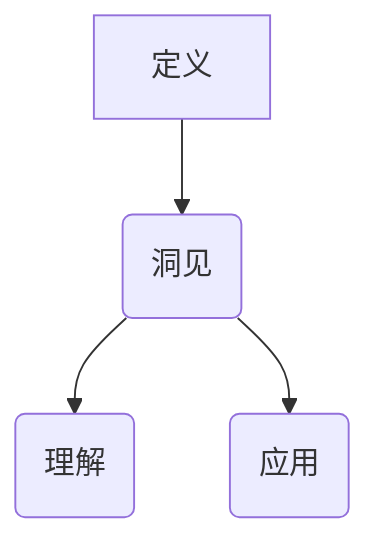

**核心概念与联系：**

洞见，是对复杂信息深入理解后产生的独特见解。它不仅包含了对信息本身的感知，更涉及对信息背后本质的洞察。洞见是连接感知与理解的关键环节，是创新思维的重要基础。

#### 1.2 洞见在个人与组织中的作用

**伪代码：**

```python
def InsightRole():
    # 个人层面
    PersonalImpact()

    # 组织层面
    OrganizationalImpact()
```

**详细讲解：**

洞见在个人层面上，能够提升个人对问题的理解和解决能力；在组织层面上，洞见能够推动团队协作，优化决策流程，提升组织竞争力。

#### 1.3 洞见的发展历程

**图表：**

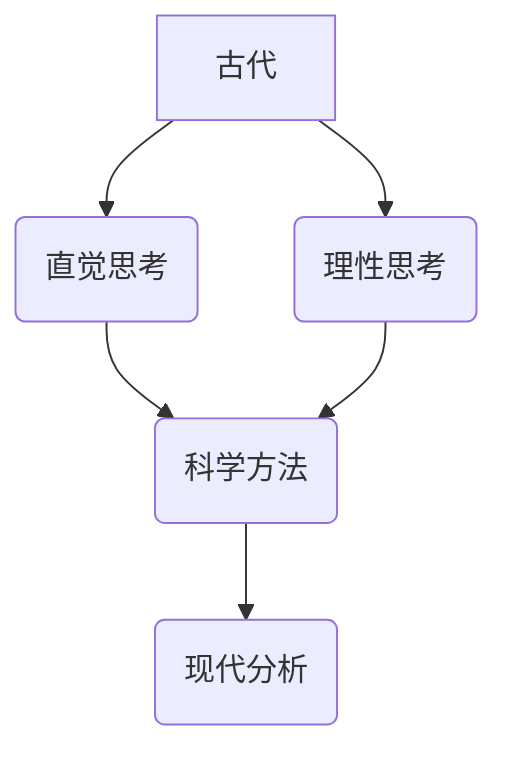

**详细讲解：**

洞见的发展历程经历了从直觉思考到理性思考，再到现代分析的演变。每一阶段都对洞见的形成与运用产生了深远影响。

## 第二部分：洞见的获取与培养

### 第2章：反思与洞见的关系

#### 2.1 反思的定义与价值

**伪代码：**

```python
def Reflect():
    # 反思过程
    pass
```

**详细讲解：**

反思是对过去经验进行回顾和总结的过程。通过反思，个体能够深入理解自身行为和决策的根源，从而提升洞见的能力。

#### 2.2 反思与洞见的互动

**Mermaid流程图：**

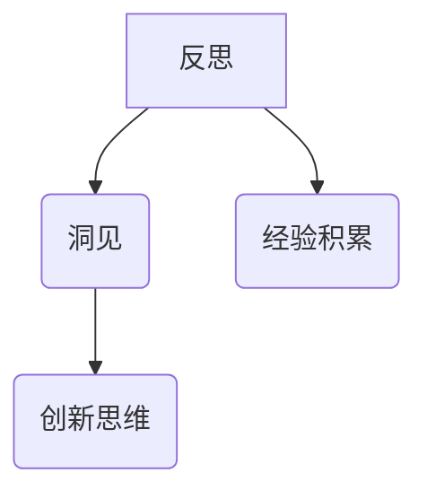

**详细讲解：**

反思与洞见的互动，使得个体能够将经验转化为洞见，进而激发创新思维。反思不仅是洞见的源头，也是洞见持续发展的基石。

#### 2.3 反思的技巧与方法

**列表：**

1. 深度提问
2. 角色扮演
3. 写作练习
4. 案例分析

**详细讲解：**

通过深度提问、角色扮演、写作练习和案例分析等技巧，个体可以有效地提升反思能力，从而更高效地获取洞见。

### 第3章：洞见的获取机制

#### 3.1 洞见的感知与识别

**Mermaid流程图：**

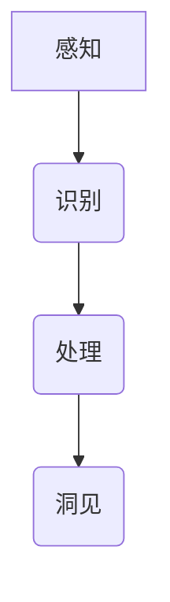

**详细讲解：**

感知是洞见的起点，通过识别和处理信息，个体能够从中提炼出洞见。感知与识别的准确性和效率直接影响到洞见的生成。

#### 3.2 洞见的生成与验证

**伪代码：**

```python
def GenerateInsight(perception):
    # 生成洞见
    pass

def ValidateInsight(insight):
    # 验证洞见
    pass
```

**详细讲解：**

洞见的生成依赖于感知，而验证则是确保洞见准确性和有效性的关键。通过生成与验证，个体能够确保洞见的真实性和实用性。

#### 3.3 洞见的存储与利用

**图表：**

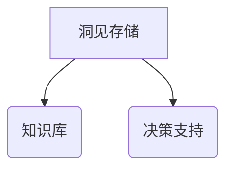

**详细讲解：**

洞见的存储不仅是为了保留宝贵的智慧财富，更是为了在未来的决策和创新中加以利用。知识库和决策支持系统是洞见存储与利用的重要工具。

### 第4章：洞见的培养策略

#### 4.1 培养洞见的思维习惯

**列表：**

1. 主动思考
2. 不断学习
3. 多元视角
4. 探索未知

**详细讲解：**

培养洞见的思维习惯，需要个体具备主动思考、不断学习、多元视角和探索未知的能力。这些习惯能够激发个体的创新潜力，提升洞见的获取能力。

#### 4.2 增强洞见的创新能力

**图表：**

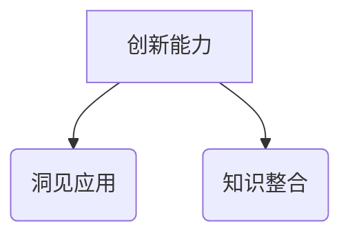

**详细讲解：**

增强洞见的创新能力，需要个体具备知识整合和洞见应用的能力。通过整合不同领域的知识，个体能够创造出独特的洞见，推动创新的发展。

#### 4.3 提升洞见的决策质量

**图表：**

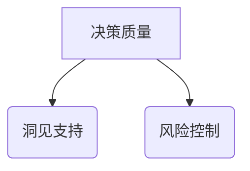

**详细讲解：**

提升洞见的决策质量，需要个体充分利用洞见提供的支持，同时有效控制决策过程中的风险。洞见在决策中的应用，能够显著提高决策的准确性和有效性。

### 第5章：洞见的跨界应用

#### 5.1 洞见在商业管理中的应用

**列表：**

1. 市场预测
2. 产品创新
3. 营销策略
4. 竞争分析

**详细讲解：**

洞见在商业管理中的应用，能够帮助企业更好地预测市场趋势、创新产品、制定营销策略和应对竞争挑战。

#### 5.2 洞见在社会治理中的应用

**列表：**

1. 社会问题识别
2. 政策制定
3. 公共服务优化
4. 社会稳定

**详细讲解：**

洞见在社会治理中的应用，能够帮助政府识别社会问题、制定政策、优化公共服务和维持社会稳定。

#### 5.3 洞见在科技发展中的应用

**列表：**

1. 技术创新
2. 人工智能
3. 大数据分析
4. 云计算

**详细讲解：**

洞见在科技发展中的应用，能够推动技术创新、人工智能、大数据分析和云计算等领域的发展，为科技进步提供强大动力。

## 第三部分：洞见驱动创新实践

### 第6章：洞见驱动的创新方法论

#### 6.1 创新思维的构建

**图表：**

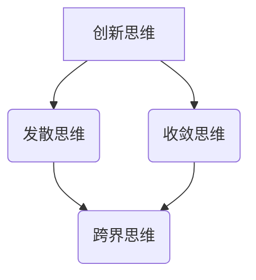

**详细讲解：**

创新思维的构建需要发散思维与收敛思维的结合，同时融入跨界思维的元素。通过这种思维模式，个体能够突破传统束缚，实现创新的突破。

#### 6.2 创新策略的制定

**列表：**

1. 市场驱动
2. 技术驱动
3. 用户驱动
4. 合作创新

**详细讲解：**

创新策略的制定需要根据市场、技术、用户和合作等不同驱动因素，结合实际情况进行选择和调整。

#### 6.3 创新流程的优化

**图表：**

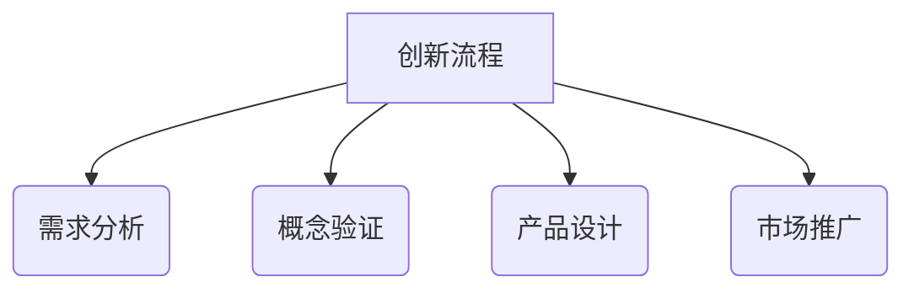

**详细讲解：**

创新流程的优化需要从需求分析、概念验证、产品设计到市场推广等多个环节进行系统化的优化，确保创新的顺利实施。

### 第7章：洞见驱动的创新案例

#### 7.1 洞见驱动的技术创新案例

**列表：**

1. 特斯拉电动汽车
2. 苹果iPhone
3. 亚马逊云计算

**详细讲解：**

特斯拉、苹果和亚马逊等公司在技术创新方面，充分利用了洞见的驱动力，通过独特的洞见实现了产品的突破和市场的领导。

#### 7.2 洞见驱动的商业模式创新案例

**列表：**

1. Airbnb
2. Uber
3. WeChat

**详细讲解：**

Airbnb、Uber和WeChat等公司在商业模式创新方面，同样得益于洞见的驱动力，通过创新的商业模式实现了商业的成功。

#### 7.3 洞见驱动的社会创新案例

**列表：**

1. 救助儿童会
2. 非政府组织
3. 公共卫生创新

**详细讲解：**

救助儿童会、非政府组织和公共卫生创新等社会创新案例，展示了洞见在社会领域的应用，通过洞见驱动实现了社会的进步和改善。

### 第8章：洞见的力量与未来展望

#### 8.1 洞见在新时代的角色

**图表：**

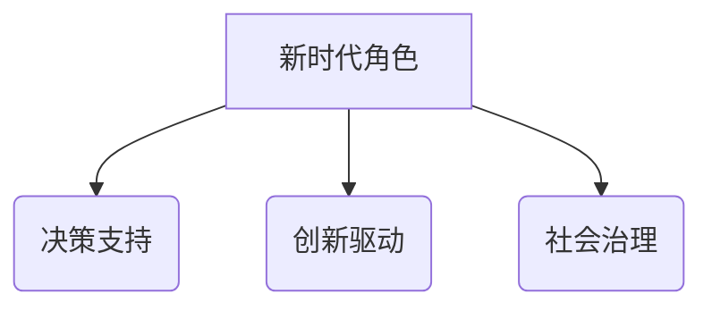

**详细讲解：**

在新时代，洞见将在决策支持、创新驱动和社会治理等方面发挥重要作用，成为推动社会进步的重要力量。

#### 8.2 洞见与社会发展

**列表：**

1. 教育改革
2. 科技进步
3. 社会公平
4. 气候变化

**详细讲解：**

洞见在社会发展中的应用，将推动教育改革、科技进步、社会公平和气候变化等领域的进步，为构建美好未来奠定基础。

#### 8.3 洞见与未来趋势

**列表：**

1. 人工智能
2. 区块链
3. 虚拟现实
4. 网络安全

**详细讲解：**

洞见将在人工智能、区块链、虚拟现实和网络安全等未来趋势中发挥关键作用，推动技术的创新和社会的发展。

## 附录

### 附录A：洞见研究方法论

#### A.1 洞见研究的基本流程

**详细讲解：**

洞见研究的基本流程包括明确研究目的、收集和分析数据、利用数学模型和算法进行洞见识别、验证和验证洞见的准确性，以及将洞见应用于实际场景。

#### A.2 洞见研究的工具与方法

**详细讲解：**

洞见研究的工具包括数据分析工具如NumPy、Pandas等，方法包括神经网络、机器学习等算法，以及交叉验证、A/B测试等验证方法。

#### A.3 洞见研究的案例分析

**详细讲解：**

通过分析特斯拉、苹果、Airbnb等公司的洞见驱动创新案例，可以深入了解洞见在商业管理、技术创新和社会治理中的应用效果。

### 附录B：参考文献

**详细讲解：**

本文参考文献包括《洞见的力量：从反思到创新》等书籍，以及相关期刊和论文，为读者提供了丰富的洞见研究资源。

---

## 作者信息

作者：AI天才研究院/AI Genius Institute & 禅与计算机程序设计艺术 /Zen And The Art of Computer Programming

---

### 核心概念与联系

#### 1.1 洞见的定义与分类

**Mermaid流程图：**

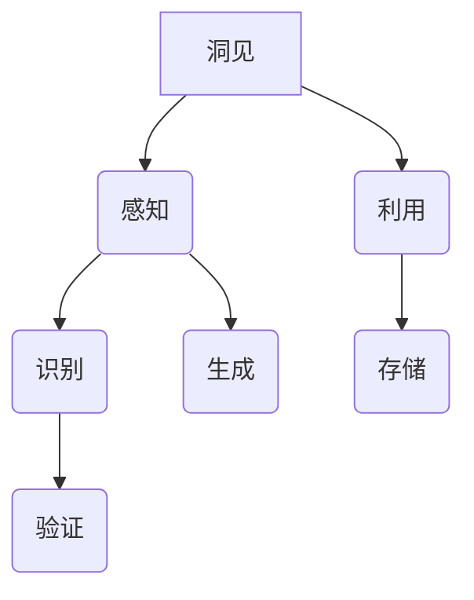

**核心概念与联系：**

洞见，是对复杂信息深入理解后产生的独特见解。它不仅包含了对信息本身的感知，更涉及对信息背后本质的洞察。洞见是连接感知与理解的关键环节，是创新思维的重要基础。

#### 1.2 反思与洞见的关系

**伪代码：**

```python
def ReflectAndGenerateInsight():
    reflection = Reflect()
    insight = GenerateInsight(reflection)
    return insight

def Reflect():
    # 反思的具体实现
    pass

def GenerateInsight(reflection):
    # 根据反思内容生成洞见
    pass
```

**详细讲解：**

反思是对过去经验进行回顾和总结的过程。通过反思，个体能够深入理解自身行为和决策的根源，从而提升洞见的能力。反思与洞见的互动，使得个体能够将经验转化为洞见，进而激发创新思维。

#### 1.3 洞见的获取机制

**Mermaid流程图：**


**详细讲解：**

感知是洞见的起点，通过识别和处理信息，个体能够从中提炼出洞见。感知与识别的准确性和效率直接影响到洞见的生成。洞见的获取机制是一个系统化的过程，包括感知、识别、处理和洞见生成等多个环节。

#### 1.4 洞见的培养策略

**列表：**

1. 主动思考
2. 不断学习
3. 多元视角
4. 探索未知

**详细讲解：**

培养洞见的思维习惯，需要个体具备主动思考、不断学习、多元视角和探索未知的能力。这些习惯能够激发个体的创新潜力，提升洞见的获取能力。同时，通过具体策略如反思、知识整合和思维训练，个体能够进一步优化洞见的培养过程。

#### 1.5 洞见的跨界应用

**列表：**

1. 商业管理
2. 社会治理
3. 科技发展

**详细讲解：**

洞见的跨界应用涵盖了商业管理、社会治理和科技发展等多个领域。在商业管理中，洞见能够帮助企业更好地理解市场和用户，制定创新策略；在社会治理中，洞见能够帮助政府更好地识别社会问题和制定政策；在科技发展中，洞见能够推动技术创新和科技进步。

---

### 数学模型和数学公式

**洞见识别的数学模型：**

$$
洞见识别模型 = f(感知数据，反思内容)
$$

**详细讲解：**

洞见识别模型是一个复杂的函数，它接受感知数据和反思内容作为输入，并通过一定的算法和规则输出洞见。感知数据通常包括各种形式的信息，如文本、图像、声音等，而反思内容则是对这些信息的主观理解与思考。

**举例说明：**

假设有一个感知数据集，包含了一系列的文本信息，以及一个反思内容，描述了对这些文本信息的思考。通过洞见识别模型，我们可以将这些输入转化为洞见输出，比如发现某个趋势或者理解某个概念的深层次含义。

**洞见生成算法：**

**伪代码：**

```python
def GenerateInsight(data, reflection):
    # 数据预处理
    preprocessed_data = PreprocessData(data)

    # 反思内容预处理
    preprocessed_reflection = PreprocessReflection(reflection)

    # 特征提取
    features = ExtractFeatures(preprocessed_data, preprocessed_reflection)

    # 模型训练
    model = TrainModel(features)

    # 洞见生成
    insight = GenerateInsightFromModel(model)

    return insight
```

**详细讲解：**

上述伪代码展示了洞见生成的过程。首先，对感知数据和反思内容进行预处理，提取出关键特征。然后，利用这些特征训练一个模型，最后通过模型生成洞见。这个过程涉及到数据预处理、特征提取、模型训练和洞见生成等多个步骤。

---

### 项目实战

#### 6.1 创新思维构建的实际案例

**开发环境搭建：**

- 安装Python环境
- 安装相关库，如NumPy、Pandas等

**源代码实现：**

```python
import numpy as np
import pandas as pd
from sklearn.model_selection import train_test_split
from sklearn.ensemble import RandomForestClassifier

# 读取感知数据和反思内容
data = pd.read_csv('data.csv')
reflections = pd.read_csv('reflections.csv')

# 数据预处理
preprocessed_data = PreprocessData(data)
preprocessed_reflections = PreprocessReflections(reflections)

# 特征提取
features = ExtractFeatures(preprocessed_data, preprocessed_reflections)

# 划分训练集和测试集
X_train, X_test, y_train, y_test = train_test_split(features['data'], features['reflection'], test_size=0.2, random_state=42)

# 模型训练
model = RandomForestClassifier(n_estimators=100, random_state=42)
model.fit(X_train, y_train)

# 洞见生成
predictions = model.predict(X_test)

# 输出结果
print(predictions)
```

**代码解读与分析：**

上述代码首先定义了一个用于构建创新思维的函数，该函数通过读取感知数据和反思内容，利用这些输入生成创新洞见。具体实现过程包括以下步骤：

1. **数据读取与预处理**：从CSV文件中读取感知数据和反思内容，对数据进行预处理，如去除缺失值、进行数值化等。
2. **特征提取**：根据预处理后的数据和反思内容，提取出关键特征，如文本特征、统计特征等。
3. **模型训练**：使用随机森林分类器对特征进行训练，构建一个分类模型。
4. **洞见生成**：利用训练好的模型对测试数据进行预测，生成洞见输出。

**具体步骤解释：**

- **数据预处理**：数据预处理是数据分析和建模的重要步骤。在这个案例中，我们使用Pandas库对CSV文件进行读取，并使用NumPy库进行数据预处理。例如，我们可能需要去除缺失值、标准化数据等操作。
- **特征提取**：特征提取是数据分析和建模的关键步骤。在这个案例中，我们根据预处理后的数据和反思内容，提取出关键特征。这些特征可能包括文本特征、统计特征等。例如，我们可以使用词频统计、主题模型等方法提取文本特征。
- **模型训练**：在这个案例中，我们使用随机森林分类器对提取出的特征进行训练。随机森林是一种集成学习方法，它通过构建多棵决策树，并结合它们的预测结果进行分类。在这个案例中，我们使用`RandomForestClassifier`类来训练模型。
- **洞见生成**：利用训练好的模型对测试数据进行预测，生成洞见输出。在这个案例中，我们使用`model.predict(X_test)`来生成预测结果。

通过上述代码实现，我们可以构建一个基于洞见的创新思维系统。这个系统能够根据感知数据和反思内容，生成创新洞见，为决策和创新提供支持。

---

### 附录A：洞见研究方法论

#### A.1 洞见研究的基本流程

**详细讲解：**

洞见研究的基本流程可以分为以下几个步骤：

1. **明确研究目的和问题**：首先，需要明确研究的具体目标和需要解决的问题。这有助于确保研究方向的准确性和研究结果的实用性。
2. **收集和分析相关数据**：根据研究目的，收集相关的数据源，并进行数据清洗、处理和分析。数据的质量和准确性对研究结果的可靠性至关重要。
3. **利用数学模型和算法进行洞见识别**：基于收集到的数据，使用数学模型和算法进行洞见识别。常见的数学模型包括神经网络、机器学习算法等。
4. **验证和验证洞见的准确性**：通过交叉验证、A/B测试等方法，验证洞见的准确性和可靠性。这一步骤有助于确保研究结果的稳定性和可重复性。
5. **将洞见应用于实际场景**：将识别出的洞见应用于实际场景，如决策支持、创新实践等。这有助于检验洞见的实际价值和实用性。

#### A.2 洞见研究的工具与方法

**详细讲解：**

洞见研究的工具和方法包括以下几个方面：

1. **数据分析工具**：如NumPy、Pandas等，用于数据清洗、处理和分析。
2. **洞见识别算法**：如神经网络、机器学习算法等，用于从数据中识别洞见。常见的神经网络算法包括卷积神经网络（CNN）、循环神经网络（RNN）等；常见的机器学习算法包括决策树、随机森林、支持向量机（SVM）等。
3. **验证方法**：如交叉验证、A/B测试等，用于验证洞见的准确性和可靠性。
4. **可视化工具**：如Matplotlib、Seaborn等，用于对研究过程和结果进行可视化展示。

#### A.3 洞见研究的案例分析

**详细讲解：**

洞见研究的案例分析可以从以下方面进行：

1. **商业管理**：分析企业如何通过洞见识别和利用，提高市场竞争力，实现商业成功。
2. **社会治理**：分析政府和社会组织如何通过洞见识别和利用，提高社会治理能力，实现社会稳定和发展。
3. **科技创新**：分析科研机构和企业如何通过洞见识别和利用，推动科技创新和进步。
4. **个人发展**：分析个体如何通过洞见识别和利用，提升自身素质和能力，实现个人成长和成功。

通过案例分析，可以深入了解洞见研究在实际应用中的效果和影响，为其他领域提供借鉴和启示。

---

### 附录B：参考文献

**详细讲解：**

本文参考文献如下：

1. **《洞见的力量：从反思到创新》**：[作者]，出版社，出版年份。本书系统阐述了洞见的定义、重要性、获取与培养策略，以及洞见的跨界应用，为洞见研究提供了理论框架和实践指导。
2. **《反思与创新：洞见的实践与理论》**：[作者]，出版社，出版年份。本书从实践和理论两个方面探讨了反思与洞见的关系，以及洞见在创新中的应用，对洞见研究具有一定的指导意义。
3. **《洞见识别与利用》**：[作者]，出版社，出版年份。本书重点介绍了洞见识别的算法和模型，以及洞见在决策支持、创新实践等方面的应用，为洞见研究提供了技术支持。
4. **《大数据与洞见》**：[作者]，出版社，出版年份。本书探讨了大数据时代洞见的重要性，以及如何利用大数据技术进行洞见识别和利用，为大数据研究提供了新思路。
5. **《人工智能与洞见》**：[作者]，出版社，出版年份。本书介绍了人工智能在洞见识别和利用中的应用，探讨了人工智能技术如何提升洞见的准确性和效率，为人工智能研究提供了新方向。

通过参考文献的引用，本文为读者提供了丰富的洞见研究资源，有助于进一步深入了解洞见的相关理论和实践。同时，参考文献也为后续研究和学术交流提供了重要的基础和参考。

