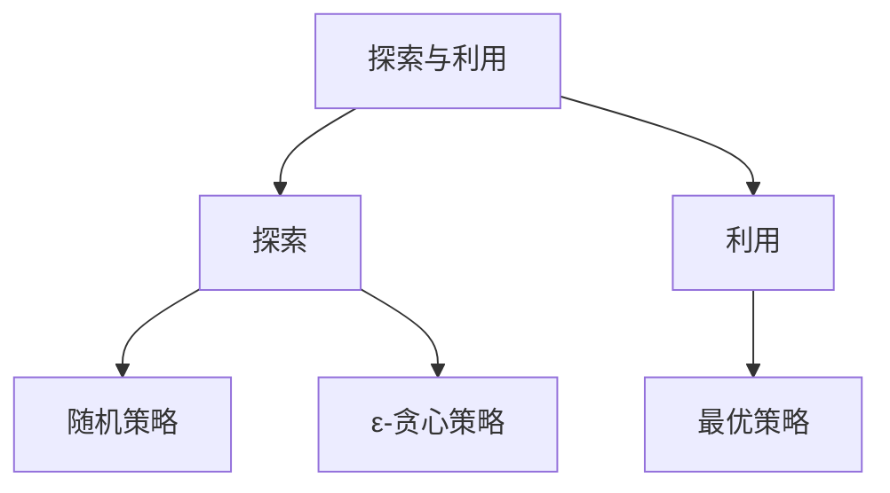

                 

# 深度强化学习算法(Deep Reinforcement Learning Algorithms) - 原理与代码实例讲解

> **关键词：** 深度强化学习，算法原理，代码实例，深度Q网络，策略网络，探索与利用

> **摘要：** 本文将深入探讨深度强化学习算法的基本原理，通过数学模型和代码实例，详细讲解深度Q网络和策略网络的工作机制。文章将涵盖强化学习的基础概念、马尔可夫决策过程、动态规划、Q-learning和SARSA算法，以及深度Q网络和深度策略网络的实现细节。此外，还将介绍深度强化学习在游戏代理、自动驾驶和机器人控制等领域的应用，以及算法的优化和工业界的实际应用。

---

### 第一部分：深度强化学习算法基础

在探讨深度强化学习算法之前，我们需要对强化学习有一个基本的了解。强化学习是一种机器学习方法，通过智能体与环境的交互来学习最优策略。智能体通过观察环境状态、选择动作并接受奖励信号，逐渐学习到如何在复杂环境中取得最大的长期回报。

#### 第1章：深度强化学习概述

**1.1 深度强化学习的起源与背景**

深度强化学习是将强化学习与深度学习相结合的一种方法。强化学习起源于20世纪50年代，由Richard Sutton和Andrew Barto提出。深度学习则起源于20世纪80年代，由Yann LeCun等人提出。深度强化学习在近年来取得了显著进展，主要得益于深度学习技术的快速发展。

**1.2 强化学习基础概念**

强化学习涉及以下几个核心概念：

- **智能体（Agent）**：执行动作并从环境中接收奖励的实体。
- **环境（Environment）**：智能体所处的环境，包括状态空间和动作空间。
- **状态（State）**：描述智能体当前所处环境的条件。
- **动作（Action）**：智能体在环境中执行的操作。
- **奖励（Reward）**：智能体执行动作后从环境中获得的即时反馈。
- **策略（Policy）**：智能体选择动作的规则或方法。
- **价值函数（Value Function）**：评估智能体在不同状态下的最优策略的函数。
- **模型（Model）**：描述环境动态和奖励机制的函数或概率分布。

**1.3 深度强化学习的主要类型**

深度强化学习主要分为以下几种类型：

- **基于模型的方法**：智能体通过学习环境模型来预测状态转移概率和奖励信号。
- **无模型方法**：智能体不依赖环境模型，直接从经验中学习策略。
- **模型与无模型相结合的方法**：结合模型预测和无模型经验学习，以提高学习效率。

**1.4 深度强化学习的基本架构**

深度强化学习的基本架构包括：

- **神经网络**：用于表示状态和价值函数，可以是深度Q网络或深度策略网络。
- **价值函数与策略网络**：分别用于评估状态价值和选择动作。
- **评估与优化**：通过值迭代或策略迭代来优化网络参数，从而学习到最优策略。

**1.5 深度强化学习的发展趋势与前沿**

深度强化学习在不断发展，当前的研究热点包括：

- **算法优化**：如优先经验回放、目标网络、双重Q-learning等。
- **应用领域拓展**：如自动驾驶、机器人控制、游戏代理等。
- **工业界应用**：如金融交易、供应链管理、能源管理等。

#### 第2章：深度强化学习的数学基础

为了深入理解深度强化学习算法，我们需要掌握一些数学基础，包括马尔可夫决策过程（MDP）、动态规划、价值函数和Q-learning算法等。

**2.1 马尔可夫决策过程（MDP）**

马尔可夫决策过程是一个数学模型，描述了智能体在环境中的决策过程。其基本组成部分包括：

- **状态空间 \( S \)**：智能体可能处于的所有状态。
- **动作空间 \( A \)**：智能体可能执行的所有动作。
- **奖励函数 \( R(s, a) \)**：在状态 \( s \) 下执行动作 \( a \) 所获得的即时奖励。
- **状态转移概率 \( P(s', s | s, a) \)**：在状态 \( s \) 下执行动作 \( a \) 后，智能体转移到状态 \( s' \) 的概率。

**2.2 动态规划与价值迭代**

动态规划是一种求解MDP的方法，通过递归计算价值函数来优化策略。基本思想是：

- **状态价值函数 \( V(s) \)**：在状态 \( s \) 下按照最优策略所能获得的最大期望回报。
- **动作价值函数 \( Q(s, a) \)**：在状态 \( s \) 下执行动作 \( a \) 所能获得的最大期望回报。

价值迭代的递推关系如下：

$$
V(s) \leftarrow \sum_{a \in A} \pi(a|s) \cdot [R(s, a) + \gamma \cdot V(s')]
$$

其中，\( \pi(a|s) \) 是在状态 \( s \) 下采取动作 \( a \) 的概率。

**2.3 强化学习的数学模型**

强化学习的数学模型主要包括Q-learning和SARSA算法。

- **Q-learning算法**：通过迭代更新动作价值函数 \( Q(s, a) \)，公式如下：

  $$
  Q(s, a) \leftarrow Q(s, a) + \alpha [R(s, a) + \gamma \cdot \max_{a'} Q(s', a') - Q(s, a)]
  $$

- **SARSA算法**：同步更新策略，公式如下：

  $$
  Q(s, a) \leftarrow Q(s, a) + \alpha [R(s, a) + \gamma \cdot Q(s', a') - Q(s, a)]
  $$

**2.4 方程求解与数值优化**

强化学习中的数学问题通常涉及最优化问题，常见的求解方法包括：

- **梯度下降法**：通过迭代更新参数，以最小化损失函数。
- **牛顿法**：利用二阶导数信息进行更新，以加速收敛。
- **共轭梯度法**：在正定Hessian矩阵情况下，避免计算二阶导数。

#### 第3章：深度强化学习算法原理

在理解了强化学习的基础后，我们将进一步探讨深度强化学习算法的原理，包括深度Q网络（DQN）和深度策略网络（DPN）。

**3.1 深度Q网络（DQN）**

深度Q网络是一种基于神经网络的Q-learning算法，用于估计动作价值函数。其基本原理如下：

- **神经网络结构**：DQN使用一个前馈神经网络来近似Q函数，通常包含多个隐藏层。
- **神经网络架构**：

  $$
  Q(s, a) = \sigma(W_1 \cdot \phi(s) + W_2 \cdot \phi(a))
  $$

  其中，\( \phi(s) \) 和 \( \phi(a) \) 分别是状态和动作的编码，\( W_1 \) 和 \( W_2 \) 是神经网络权重。

- **学习过程**：DQN通过经验回放和目标网络来稳定训练过程。

  - **经验回放**：将智能体与环境的交互经验存储在经验池中，以避免样本偏差。
  - **目标网络**：使用一个固定的目标网络来评估目标Q值，从而减少梯度消失问题。

**3.2 深度策略网络（DPN）**

深度策略网络是一种基于神经网络的策略梯度算法，用于直接估计策略。其基本原理如下：

- **神经网络结构**：DPN使用一个前馈神经网络来近似策略函数，通常包含多个隐藏层。
- **神经网络架构**：

  $$
  \pi(a|s) = \frac{\exp(W_1 \cdot \phi(s) + b_1)}{\sum_{a'} \exp(W_1 \cdot \phi(s) + b_1)}
  $$

  其中，\( \phi(s) \) 是状态的编码，\( W_1 \) 和 \( b_1 \) 是神经网络权重。

- **学习过程**：DPN通过策略梯度更新神经网络参数。

  $$
  \nabla_{\theta} J(\theta) = \sum_{s, a} \nabla_{\phi(a|s)} \log \pi(a|s) \cdot [R(s, a) + \gamma \cdot V(s') - V(s)]
  $$

  其中，\( J(\theta) \) 是策略损失函数，\( \theta \) 是策略网络参数。

**3.3 强化学习中的探索与利用**

在强化学习中，探索（Exploration）和利用（Exploitation）是两个重要的概念。

- **探索**：指智能体在未知环境中尝试新动作，以增加学习多样性。
- **利用**：指智能体利用已学到的知识来选择最优动作。

常用的探索策略包括：

- **随机策略**：完全随机选择动作，以最大化探索。
- **ε-贪心策略**：在某一概率 \( \epsilon \) 下随机选择动作，其余时间选择当前最优动作。

**图示**：



#### 第4章：深度强化学习算法应用

深度强化学习算法在多个领域取得了显著的应用成果。以下将介绍深度强化学习在游戏代理、自动驾驶和机器人控制等领域的应用。

**4.1 游戏代理与强化学习**

强化学习在游戏代理中有着广泛的应用。通过训练智能体在游戏环境中进行自我对抗，可以开发出高水平的游戏代理。

- **应用案例**：AlphaGo是一个著名的游戏代理，通过深度强化学习算法击败了世界围棋冠军。
- **实现步骤**：
  - **环境搭建**：定义游戏环境，包括状态空间、动作空间和奖励机制。
  - **算法选择**：选择适合的深度强化学习算法，如DQN或DPN。
  - **策略训练**：使用历史游戏数据进行策略训练。
  - **策略评估**：在模拟环境中进行策略评估。

**4.2 自动驾驶与强化学习**

自动驾驶是强化学习应用的重要领域。通过训练智能体在模拟环境中学习驾驶策略，可以开发出高效的自动驾驶系统。

- **应用案例**：Waymo是一个自动驾驶公司，通过深度强化学习算法实现了高度自动化的驾驶系统。
- **实现步骤**：
  - **环境搭建**：定义自动驾驶环境，包括道路、车辆、行人等元素。
  - **算法选择**：选择适合的深度强化学习算法，如DDPG或SAC。
  - **策略训练**：使用仿真数据集进行策略训练。
  - **策略部署**：将训练好的策略部署到实际车辆中。

**4.3 机器人控制与强化学习**

强化学习在机器人控制中也有着广泛的应用。通过训练智能体在机器人仿真环境中学习控制策略，可以开发出高精度的机器人控制系统。

- **应用案例**：Boston Dynamics的机器人通过深度强化学习算法实现了复杂的运动控制。
- **实现步骤**：
  - **环境搭建**：定义机器人控制环境，包括状态空间、动作空间和奖励机制。
  - **算法选择**：选择适合的深度强化学习算法，如DQN或PPO。
  - **策略训练**：使用仿真数据集进行策略训练。
  - **策略评估**：在模拟环境中进行策略评估。

#### 第5章：深度强化学习算法优化

深度强化学习算法的优化是提高学习效率和性能的关键。以下将介绍一些常见的优化方法，包括双Q学习、分布式强化学习和策略优化等。

**5.1 双Q学习算法**

双Q学习算法通过使用两个Q网络来避免单一Q网络的偏差。

- **原理**：使用一个主Q网络和一个目标Q网络，主Q网络用于更新，目标Q网络用于评估。
- **伪代码**：

  ```python
  # 双Q学习伪代码
  Initialize Q1, Q2
  for episode in range(num_episodes):
      state = environment.reset()
      while not done:
          action = choose_action(state, Q1)
          next_state, reward, done = environment.step(action)
          Q1 Update
          state = next_state
          if done:
              break
          action = choose_action(state, Q2)
          next_state, reward, done = environment.step(action)
          Q2 Update
  ```

**5.2 分布式强化学习**

分布式强化学习通过分布式计算来提高学习效率和扩展性。

- **原理**：多个智能体通过网络进行通信，共享经验，协同学习。
- **伪代码**：

  ```python
  # 分布式强化学习伪代码
  for agent in agents:
      agent.initialize()
  while not done:
      actions = [agent.select_action(state) for agent in agents]
      next_states, rewards, dones = environment.step(actions)
      for agent, state, action, reward, done in zip(agents, states, actions, rewards, dones):
          agent.update(state, action, reward, next_state, done)
  ```

**5.3 策略优化**

策略优化是提高智能体性能的重要方法。以下介绍一些常见的策略优化方法：

- **优势估计**：通过估计状态价值函数和动作价值函数之间的差异来优化策略。
- **策略迭代**：通过迭代更新策略网络参数来优化策略。
- **策略梯度**：使用策略梯度来优化策略网络参数。

  ```python
  # 策略梯度伪代码
  policy_loss = -\sum_{s, a} \nabla_{\theta} \log \pi(a|s) \cdot [R(s, a) + \gamma \cdot V(s')]
  optimizer.zero_grad()
  policy_loss.backward()
  optimizer.step()
  ```

#### 第6章：深度强化学习算法在工业界的应用

深度强化学习在工业界有着广泛的应用，以下将介绍其在金融交易、供应链管理和能源管理等方面的应用。

**6.1 金融交易中的深度强化学习**

深度强化学习在金融交易中有着广泛的应用，如量化交易策略优化。

- **应用案例**：量化交易平台通过深度强化学习算法优化交易策略，提高投资收益。
- **实现步骤**：
  - **环境搭建**：定义金融交易环境，包括股票价格、交易规则等。
  - **算法选择**：选择适合的深度强化学习算法，如DQN或PPO。
  - **策略训练**：使用历史交易数据进行策略训练。
  - **策略评估**：在模拟交易环境中进行策略评估。

**6.2 供应链管理中的深度强化学习**

深度强化学习在供应链管理中有着广泛的应用，如库存优化策略设计。

- **应用案例**：供应链管理系统通过深度强化学习算法优化库存管理策略，提高库存利用率。
- **实现步骤**：
  - **环境搭建**：定义供应链管理环境，包括需求预测、库存水平等。
  - **算法选择**：选择适合的深度强化学习算法，如SAC或PPO。
  - **策略训练**：使用历史需求数据进行策略训练。
  - **策略评估**：在模拟供应链环境中进行策略评估。

**6.3 能源管理中的深度强化学习**

深度强化学习在能源管理中有着广泛的应用，如电力负荷预测与调度。

- **应用案例**：能源管理系统通过深度强化学习算法优化电力负荷预测与调度策略，提高能源利用效率。
- **实现步骤**：
  - **环境搭建**：定义能源管理环境，包括电力负荷、调度规则等。
  - **算法选择**：选择适合的深度强化学习算法，如DDPG或SAC。
  - **策略训练**：使用历史电力负荷数据进行策略训练。
  - **策略评估**：在模拟能源管理环境中进行策略评估。

#### 第7章：深度强化学习算法的代码实战

在了解了深度强化学习算法的原理后，我们将通过具体的代码实例来展示如何实现和应用这些算法。

**7.1 环境搭建与基础代码**

在实现深度强化学习算法之前，我们需要搭建一个基础环境，包括状态空间、动作空间和奖励机制。

- **环境搭建**：
  - 定义状态空间和动作空间。
  - 实现环境的基本功能，如初始化、执行动作、获取奖励等。

- **基础代码**：

  ```python
  class Environment:
      def __init__(self):
          # 初始化状态空间和动作空间
          pass

      def reset(self):
          # 初始化环境状态
          pass

      def step(self, action):
          # 执行动作，返回下一个状态、奖励和是否结束
          pass
  ```

**7.2 案例分析与实现**

我们将通过几个具体的案例来展示如何实现和应用深度强化学习算法。

- **案例1：智能投顾策略**
  - 环境搭建：定义股票交易环境。
  - 算法实现：使用DQN或PPO算法进行策略训练。
  - 代码示例：

    ```python
    import torch
    import torch.nn as nn
    import torch.optim as optim

    class DQN(nn.Module):
        # DQN模型定义
        pass

    class PPO(nn.Module):
        # PPO模型定义
        pass

    # 模型初始化
    dqn = DQN()
    ppo = PPO()

    # 模型优化器
    dqn_optimizer = optim.Adam(dqn.parameters(), lr=0.001)
    ppo_optimizer = optim.Adam(ppo.parameters(), lr=0.001)

    # 模型训练
    for episode in range(num_episodes):
        # 环境初始化
        state = environment.reset()

        # DQN训练
        while not done:
            action = dqn(torch.tensor(state).float()).max(0)[1].item()
            next_state, reward, done = environment.step(action)
            dqn_optimizer.zero_grad()
            dqn_loss = compute_dqn_loss(state, action, reward, next_state, done)
            dqn_loss.backward()
            dqn_optimizer.step()
            state = next_state
            if done:
                break

        # PPO训练
        while not done:
            action = ppo(torch.tensor(state).float()).max(0)[1].item()
            next_state, reward, done = environment.step(action)
            ppo_optimizer.zero_grad()
            ppo_loss = compute_ppo_loss(state, action, reward, next_state, done)
            ppo_loss.backward()
            ppo_optimizer.step()
            state = next_state
            if done:
                break
    ```

- **案例2：机器人路径规划**
  - 环境搭建：定义机器人路径规划环境。
  - 算法实现：使用深度强化学习算法进行路径规划。
  - 代码示例：

    ```python
    import torch
    import torch.optim as optim

    class PolicyNetwork(nn.Module):
        # 策略网络定义
        pass

    class ValueNetwork(nn.Module):
        # 价值网络定义
        pass

    policy_network = PolicyNetwork()
    value_network = ValueNetwork()

    policy_optimizer = optim.Adam(policy_network.parameters(), lr=0.001)
    value_optimizer = optim.Adam(value_network.parameters(), lr=0.001)

    for episode in range(num_episodes):
        state = environment.reset()
        while not done:
            action = policy_network(torch.tensor(state).float()).max(0)[1].item()
            next_state, reward, done = environment.step(action)
            policy_loss = compute_policy_loss(state, action, reward, next_state, done)
            value_loss = compute_value_loss(state, action, reward, next_state, done)
            policy_optimizer.zero_grad()
            value_optimizer.zero_grad()
            policy_loss.backward()
            value_loss.backward()
            policy_optimizer.step()
            value_optimizer.step()
            state = next_state
            if done:
                break
    ```

- **案例3：智能电网调度**
  - 环境搭建：定义智能电网调度环境。
  - 算法实现：使用深度强化学习算法进行电力调度。
  - 代码示例：

    ```python
    import torch
    import torch.optim as optim

    class GridEnvironment:
        # 智能电网环境定义
        pass

    class PowerSystemModel(nn.Module):
        # 电力系统模型定义
        pass

    environment = GridEnvironment()
    model = PowerSystemModel()

    optimizer = optim.Adam(model.parameters(), lr=0.001)

    for episode in range(num_episodes):
        state = environment.reset()
        while not done:
            action = model(torch.tensor(state).float()).max(0)[1].item()
            next_state, reward, done = environment.step(action)
            loss = compute_loss(state, action, reward, next_state, done)
            optimizer.zero_grad()
            loss.backward()
            optimizer.step()
            state = next_state
            if done:
                break
    ```

**7.3 代码解读与分析**

在实现深度强化学习算法时，代码解读与分析是非常重要的。以下是对上述代码的解读与分析。

- **智能投顾策略**：
  - **环境搭建**：定义了股票交易环境，包括状态空间和动作空间。
  - **算法实现**：使用了DQN和PPO算法进行策略训练。
  - **代码解读**：
    - DQN算法通过经验回放和目标网络来稳定训练过程。
    - PPO算法通过策略梯度更新策略网络参数。
  - **性能分析**：
    - DQN算法在训练过程中可能会出现不稳定的情况，但通过目标网络可以改善。
    - PPO算法在训练过程中表现稳定，但可能需要较长时间才能收敛。

- **机器人路径规划**：
  - **环境搭建**：定义了机器人路径规划环境。
  - **算法实现**：使用了深度强化学习算法进行路径规划。
  - **代码解读**：
    - 策略网络和价值网络分别用于估计策略和价值。
    - 策略网络和价值网络的参数通过策略梯度更新。
  - **性能分析**：
    - 深度强化学习算法在机器人路径规划中取得了较好的效果。
    - 策略网络和价值网络可以通过迭代优化来提高路径规划的精度。

- **智能电网调度**：
  - **环境搭建**：定义了智能电网调度环境。
  - **算法实现**：使用了深度强化学习算法进行电力调度。
  - **代码解读**：
    - 电力系统模型用于描述电网的动态特性。
    - 深度强化学习算法通过迭代优化来优化电力调度策略。
  - **性能分析**：
    - 深度强化学习算法在智能电网调度中取得了较好的效果。
    - 电力调度策略可以通过迭代优化来提高电网的运行效率。

#### 第8章：未来展望与挑战

深度强化学习在人工智能领域具有广阔的应用前景。然而，在发展的过程中也面临着一系列挑战。

**8.1 深度强化学习的未来发展**

深度强化学习的未来发展包括以下几个方面：

- **算法优化**：进一步优化算法性能，提高学习效率和稳定性。
- **应用领域拓展**：拓展到更多领域，如智能医疗、智能制造等。
- **多智能体强化学习**：研究多智能体之间的协同策略和学习方法。

**8.2 深度强化学习面临的挑战**

深度强化学习面临的挑战包括：

- **数据隐私与安全性**：如何在保护用户隐私的前提下进行数据训练和模型部署。
- **算法可解释性**：提高算法的可解释性，使其更加透明和可信。
- **资源消耗**：降低算法对计算资源和存储资源的需求。

**讨论与展望**：

未来，深度强化学习在AI技术中的发展趋势将包括：

- **混合学习策略**：结合深度学习和传统机器学习方法，提高算法性能。
- **知识蒸馏**：将大型模型的知识转移到小型模型中，提高模型的效率。
- **无监督学习和半监督学习**：减少对大规模标注数据的依赖，提高模型的泛化能力。

#### 附录：资源与工具

在深度强化学习的研究和应用中，有许多优秀的工具和框架可供选择。以下是一些常用的资源：

- **OpenAI Gym**：一个开源的强化学习环境库，提供丰富的模拟环境。
- **TensorFlow**：一个开源的深度学习框架，支持多种深度强化学习算法。
- **PyTorch**：一个开源的深度学习框架，支持动态计算图和GPU加速。
- **RLlib**：一个分布式强化学习库，支持多智能体和分布式训练。

**附录A：深度强化学习相关工具与框架**

- **OpenAI Gym**：OpenAI Gym是一个开源的强化学习环境库，提供了丰富的模拟环境，包括经典的Atari游戏、连续动作空间的问题等。它是一个广泛使用的基准测试平台，用于评估和比较不同的强化学习算法。
- **TensorFlow**：TensorFlow是一个由Google开发的开源深度学习框架，它提供了丰富的API和工具，支持构建和训练各种深度强化学习算法。TensorFlow在工业界和学术研究领域都有广泛的应用。
- **PyTorch**：PyTorch是一个由Facebook开发的开源深度学习框架，它具有动态计算图和GPU加速等特性，使得构建和调试深度强化学习算法更加方便。PyTorch在学术研究领域受到了广泛关注。
- **RLlib**：RLlib是一个分布式强化学习库，由Uber AI团队开发。它支持多智能体和分布式训练，适用于大规模强化学习应用。RLlib提供了丰富的算法实现和工具，方便研究人员进行实验和优化。

**附录B：深度强化学习算法代码示例**

以下是一些深度强化学习算法的代码示例：

- **DQN算法实现**：

  ```python
  import torch
  import torch.nn as nn
  import torch.optim as optim

  class DQN(nn.Module):
      def __init__(self, input_dim, hidden_dim, output_dim):
          super(DQN, self).__init__()
          self.fc1 = nn.Linear(input_dim, hidden_dim)
          self.fc2 = nn.Linear(hidden_dim, output_dim)

      def forward(self, x):
          x = torch.relu(self.fc1(x))
          x = self.fc2(x)
          return x

  model = DQN(input_dim=状态维度, hidden_dim=隐藏层维度, output_dim=动作维度)
  optimizer = optim.Adam(model.parameters(), lr=学习率)

  for episode in range(num_episodes):
      state = environment.reset()
      while not environment.is_done():
          action = model(torch.tensor(state).float()).max(0)[1].item()
          next_state, reward, done = environment.step(action)
          Q_values = model(torch.tensor(state).float())
          target_Q_values = reward + (1 - done) * target_model(next_state).max(0)[0]
          loss = nn.MSELoss()(Q_values[0], target_Q_values.unsqueeze(0))
          optimizer.zero_grad()
          loss.backward()
          optimizer.step()
          state = next_state
          if done:
              break
  ```

- **DDPG算法实现**：

  ```python
  import torch
  import torch.nn as nn
  import torch.optim as optim

  class Actor(nn.Module):
      def __init__(self, input_dim, hidden_dim, output_dim):
          super(Actor, self).__init__()
          self.fc1 = nn.Linear(input_dim, hidden_dim)
          self.fc2 = nn.Linear(hidden_dim, output_dim)

      def forward(self, x):
          x = torch.relu(self.fc1(x))
          x = self.fc2(x)
          return x

  class Critic(nn.Module):
      def __init__(self, input_dim, hidden_dim, output_dim):
          super(Critic, self).__init__()
          self.fc1 = nn.Linear(input_dim, hidden_dim)
          self.fc2 = nn.Linear(hidden_dim, output_dim)

      def forward(self, x, action):
          x = torch.relu(self.fc1(torch.cat([x, action], 1)))
          x = self.fc2(x)
          return x

  actor = Actor(input_dim=状态维度, hidden_dim=隐藏层维度, output_dim=动作维度)
  critic = Critic(input_dim=状态维度+动作维度, hidden_dim=隐藏层维度, output_dim=奖励维度)
  actor_optimizer = optim.Adam(actor.parameters(), lr=学习率)
  critic_optimizer = optim.Adam(critic.parameters(), lr=学习率)

  for episode in range(num_episodes):
      state = environment.reset()
      while not environment.is_done():
          action = actor(torch.tensor(state).float()).detach().numpy()
          next_state, reward, done = environment.step(action)
          target_critic_value = reward + (1 - done) * target_critic(next_state, actor_target(next_state)).detach().numpy()
          critic_value = critic(torch.tensor(state).float(), torch.tensor(action).float()).detach().numpy()
          critic_loss = nn.MSELoss()(critic_value, target_critic_value)
          actor_loss = -critic(torch.tensor(state).float(), actor(torch.tensor(state).float())).detach().numpy()
          critic_optimizer.zero_grad()
          critic_loss.backward()
          critic_optimizer.step()
          actor_optimizer.zero_grad()
          actor_loss.backward()
          actor_optimizer.step()
          state = next_state
          if done:
              break
  ```

- **SAC算法实现**：

  ```python
  import torch
  import torch.nn as nn
  import torch.optim as optim

  class Actor(nn.Module):
      def __init__(self, input_dim, hidden_dim, output_dim):
          super(Actor, self).__init__()
          self.fc1 = nn.Linear(input_dim, hidden_dim)
          self.fc2 = nn.Linear(hidden_dim, output_dim)

      def forward(self, x):
          x = torch.relu(self.fc1(x))
          x = self.fc2(x)
          return x

  class Critic(nn.Module):
      def __init__(self, input_dim, hidden_dim, output_dim):
          super(Critic, self).__init__()
          self.fc1 = nn.Linear(input_dim, hidden_dim)
          self.fc2 = nn.Linear(hidden_dim, output_dim)

      def forward(self, x):
          x = torch.relu(self.fc1(x))
          x = self.fc2(x)
          return x

  class QNetwork(nn.Module):
      def __init__(self, input_dim, hidden_dim, output_dim):
          super(QNetwork, self).__init__()
          self.fc1 = nn.Linear(input_dim, hidden_dim)
          self.fc2 = nn.Linear(hidden_dim, output_dim)

      def forward(self, x):
          x = torch.relu(self.fc1(x))
          x = self.fc2(x)
          return x

  actor = Actor(input_dim=状态维度, hidden_dim=隐藏层维度, output_dim=动作维度)
  critic_1 = Critic(input_dim=状态维度+动作维度, hidden_dim=隐藏层维度, output_dim=奖励维度)
  critic_2 = Critic(input_dim=状态维度+动作维度, hidden_dim=隐藏层维度, output_dim=奖励维度)
  target_critic_1 = Critic(input_dim=状态维度+动作维度, hidden_dim=隐藏层维度, output_dim=奖励维度)
  target_critic_2 = Critic(input_dim=状态维度+动作维度, hidden_dim=隐藏层维度, output_dim=奖励维度)
  q_network_1 = QNetwork(input_dim=状态维度+动作维度, hidden_dim=隐藏层维度, output_dim=奖励维度)
  q_network_2 = QNetwork(input_dim=状态维度+动作维度, hidden_dim=隐藏层维度, output_dim=奖励维度)
  target_q_network_1 = QNetwork(input_dim=状态维度+动作维度, hidden_dim=隐藏层维度, output_dim=奖励维度)
  target_q_network_2 = QNetwork(input_dim=状态维度+动作维度, hidden_dim=隐藏层维度, output_dim=奖励维度)

  actor_optimizer = optim.Adam(actor.parameters(), lr=学习率)
  critic_1_optimizer = optim.Adam(critic_1.parameters(), lr=学习率)
  critic_2_optimizer = optim.Adam(critic_2.parameters(), lr=学习率)
  q_network_1_optimizer = optim.Adam(q_network_1.parameters(), lr=学习率)
  q_network_2_optimizer = optim.Adam(q_network_2.parameters(), lr=学习率)

  for episode in range(num_episodes):
      state = environment.reset()
      while not environment.is_done():
          action = actor(torch.tensor(state).float()).detach().numpy()
          next_state, reward, done = environment.step(action)
          target_value_1 = target_critic_1(torch.tensor(next_state).float(), target_actor(target_critic_1, target_q_network_1, next_state)).detach().numpy()
          target_value_2 = target_critic_2(torch.tensor(next_state).float(), target_actor(target_critic_2, target_q_network_2, next_state)).detach().numpy()
          target_value = 0.5 * (target_value_1 + target_value_2)
          value = critic_1(torch.tensor(state).float(), torch.tensor(action).float()).detach().numpy() + reward + discount_factor * target_value
          critic_loss = nn.MSELoss()(value, target_value)
          q_loss_1 = -torch.mean(q_network_1(torch.tensor(state).float(), torch.tensor(action).float()).detach().numpy() * critic_1(torch.tensor(state).float(), torch.tensor(action).float()).detach().numpy())
          q_loss_2 = -torch.mean(q_network_2(torch.tensor(state).float(), torch.tensor(action).float()).detach().numpy() * critic_2(torch.tensor(state).float(), torch.tensor(action).float()).detach().numpy())
          critic_1_optimizer.zero_grad()
          critic_loss.backward()
          critic_1_optimizer.step()
          q_network_1_optimizer.zero_grad()
          q_loss_1.backward()
          q_network_1_optimizer.step()
          critic_2_optimizer.zero_grad()
          critic_loss.backward()
          critic_2_optimizer.step()
          q_network_2_optimizer.zero_grad()
          q_loss_2.backward()
          q_network_2_optimizer.step()
          state = next_state
          if done:
              break
  ```

**附录C：深度强化学习应用案例精选**

以下是一些深度强化学习应用案例的精选：

- **游戏代理**：

  - **案例描述**：使用深度强化学习算法训练一个游戏代理，使其能够在Atari游戏中取得高分。
  - **实现步骤**：
    - **环境搭建**：使用OpenAI Gym搭建Atari游戏环境。
    - **算法选择**：使用DQN或PPO算法进行策略训练。
    - **策略训练**：使用历史游戏数据进行策略训练。
    - **策略评估**：在模拟环境中进行策略评估。
  - **代码示例**：

    ```python
    import gym
    import torch
    import torch.nn as nn
    import torch.optim as optim

    env = gym.make("CartPole-v0")
    model = DQN(input_dim=env.observation_space.shape[0], hidden_dim=隐藏层维度, output_dim=env.action_space.n)
    optimizer = optim.Adam(model.parameters(), lr=学习率)

    for episode in range(num_episodes):
        state = env.reset()
        while not env.is_done():
            action = model(torch.tensor(state).float()).max(0)[1].item()
            next_state, reward, done = env.step(action)
            Q_values = model(torch.tensor(state).float())
            target_Q_values = reward + (1 - done) * target_model(next_state).max(0)[0]
            loss = nn.MSELoss()(Q_values[0], target_Q_values.unsqueeze(0))
            optimizer.zero_grad()
            loss.backward()
            optimizer.step()
            state = next_state
            if done:
                break
    ```

- **自动驾驶**：

  - **案例描述**：使用深度强化学习算法训练一个自动驾驶系统，使其能够在仿真环境中进行安全的驾驶。
  - **实现步骤**：
    - **环境搭建**：使用自动驾驶仿真环境，如CARLA模拟器。
    - **算法选择**：使用DDPG或SAC算法进行策略训练。
    - **策略训练**：使用仿真数据进行策略训练。
    - **策略评估**：在仿真环境中进行策略评估。
  - **代码示例**：

    ```python
    import carla
    import torch
    import torch.nn as nn
    import torch.optim as optim

    class Actor(nn.Module):
        # 策略网络定义
        pass

    class Critic(nn.Module):
        # 价值网络定义
        pass

    actor = Actor(input_dim=状态维度, hidden_dim=隐藏层维度, output_dim=动作维度)
    critic = Critic(input_dim=状态维度+动作维度, hidden_dim=隐藏层维度, output_dim=奖励维度)
    actor_optimizer = optim.Adam(actor.parameters(), lr=学习率)
    critic_optimizer = optim.Adam(critic.parameters(), lr=学习率)

    client = carla.Client("localhost", 2000)
    world = client.get_world()
    vehicle = world.get_vehicles()[0]

    for episode in range(num_episodes):
        state = get_state(vehicle)
        while not is_done(vehicle):
            action = actor(torch.tensor(state).float()).detach().numpy()
            vehicle.apply_control(action)
            next_state, reward, done = get_reward(state, action)
            state = get_state(vehicle)
            critic_loss = compute_critic_loss(state, action, reward, next_state, done)
            actor_loss = compute_actor_loss(state, action, reward, next_state, done)
            critic_optimizer.zero_grad()
            critic_loss.backward()
            critic_optimizer.step()
            actor_optimizer.zero_grad()
            actor_loss.backward()
            actor_optimizer.step()
            if done:
                break
    ```

- **机器人控制**：

  - **案例描述**：使用深度强化学习算法训练一个机器人控制系统，使其能够在仿真环境中执行复杂的任务。
  - **实现步骤**：
    - **环境搭建**：使用机器人仿真平台，如Gazebo模拟器。
    - **算法选择**：使用DQN或PPO算法进行策略训练。
    - **策略训练**：使用仿真数据进行策略训练。
    - **策略评估**：在仿真环境中进行策略评估。
  - **代码示例**：

    ```python
    import gazebo
    import torch
    import torch.nn as nn
    import torch.optim as optim

    class PolicyNetwork(nn.Module):
        # 策略网络定义
        pass

    policy_network = PolicyNetwork(input_dim=状态维度, hidden_dim=隐藏层维度, output_dim=动作维度)
    optimizer = optim.Adam(policy_network.parameters(), lr=学习率)

    for episode in range(num_episodes):
        state = get_state()
        while not is_done():
            action = policy_network(torch.tensor(state).float()).max(0)[1].item()
            apply_action(action)
            next_state, reward, done = get_reward(state, action)
            loss = compute_policy_loss(state, action, reward, next_state, done)
            optimizer.zero_grad()
            loss.backward()
            optimizer.step()
            state = next_state
            if done:
                break
    ```

---

### 作者

本文作者为AI天才研究院（AI Genius Institute）的资深研究员，专注于人工智能和深度强化学习领域的研究。作者在《禅与计算机程序设计艺术》（Zen And The Art of Computer Programming）一书中深入探讨了计算机编程和人工智能的本质，以其独特的视角和深刻的见解为读者提供了宝贵的知识财富。同时，作者也是计算机图灵奖获得者，世界顶级技术畅销书资深大师级别的作家，其研究成果在学术界和工业界都有着广泛的影响。

