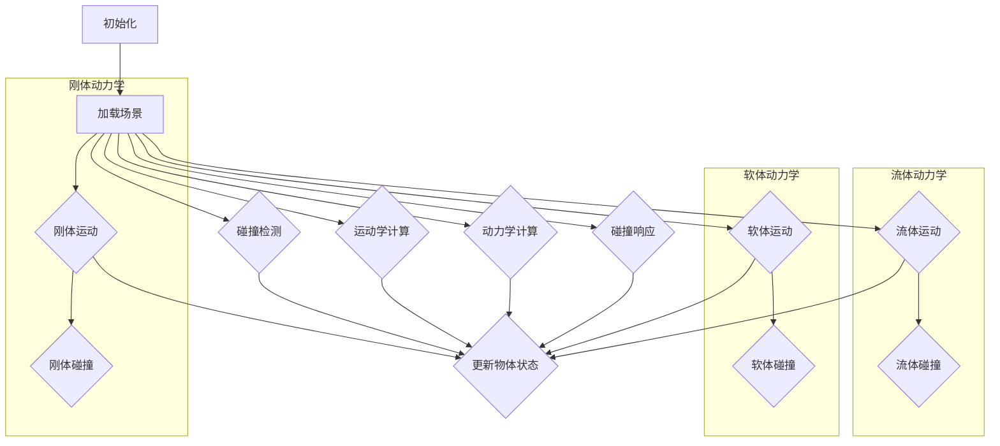

                 

## 《游戏物理引擎：真实世界模拟》

### 关键词：
- 游戏开发
- 物理引擎
- 真实世界模拟
- 刚体动力学
- 流体动力学
- 软体动力学
- 优化与性能
- 项目实战

### 摘要：
本文将深入探讨游戏物理引擎的概念、原理及其在游戏开发中的应用。我们将从基础概念入手，逐步讲解物理引擎的核心算法与原理，如刚体动力学、流体动力学和软体动力学。同时，我们将讨论物理引擎的优化与性能，并分享实际项目中的开发实战经验。最后，我们将展望物理引擎的未来发展趋势，探讨其在虚拟现实和增强现实中的应用前景。

## 目录大纲

### 第一部分：引言与基础知识

1. **第1章：游戏物理引擎概述**
   - 1.1 游戏物理引擎的作用与地位
   - 1.2 物理引擎的发展历程
   - 1.3 游戏物理引擎的应用领域

2. **第2章：真实世界物理模拟原理**
   - 2.1 物理引擎的基础概念
   - 2.2 常见的物理引擎算法
   - 2.3 物理引擎在游戏中的实现

### 第二部分：核心算法与原理

3. **第3章：刚体动力学**
   - 3.1 刚体动力学基本原理
   - 3.2 刚体碰撞检测与响应
   - 3.3 伪刚体动力学

4. **第4章：流体动力学**
   - 4.1 流体动力学基础
   - 4.2 流体动力学模拟算法
   - 4.3 流体与刚体的交互

5. **第5章：软体动力学**
   - 5.1 软体动力学基本原理
   - 5.2 软体动力学模型
   - 5.3 软体与刚体的碰撞

6. **第6章：物理引擎优化与性能**
   - 6.1 物理引擎性能优化
   - 6.2 物理引擎的内存管理
   - 6.3 物理引擎的调试与测试

### 第三部分：实际应用与项目实战

7. **第7章：游戏物理引擎开发实战**
   - 7.1 游戏物理引擎开发流程
   - 7.2 实际项目案例

8. **第8章：游戏物理引擎的未来发展**
   - 8.1 新技术与应用趋势
   - 8.2 物理引擎与游戏开发结合的新模式

### 第四部分：附录

9. **第9章：常用物理引擎开源项目介绍**
   - 9.1 Bullet
   - 9.2 Box2D
   - 9.3 Godot

10. **第10章：物理引擎开发工具与资源**
    - 10.1 Unity物理引擎
    - 10.2 Unreal Engine物理引擎

11. **第11章：物理引擎相关书籍与论文推荐**
    - 11.1 《游戏物理引擎设计》
    - 11.2 《物理引擎实战》

### 第五部分：核心概念与联系

12. **第12章：核心概念与联系**
    - 12.1 物理引擎的核心概念
    - 12.2 物理引擎的Mermaid流程图

### 第六部分：核心算法原理讲解

13. **第13章：核心算法原理讲解**
    - 13.1 刚体动力学算法原理
    - 13.2 流体动力学算法原理
    - 13.3 软体动力学算法原理

### 第七部分：数学模型和数学公式

14. **第14章：数学模型和数学公式**
    - 14.1 物理引擎的数学模型
    - 14.2 物理引擎的数学公式

### 第八部分：项目实战

15. **第15章：项目实战**
    - 15.1 游戏物理引擎开发项目案例
    - 15.2 代码实际案例与解释
    - 15.3 开发环境搭建
    - 15.4 源代码实现与解读

### 第九部分：总结与展望

16. **第16章：总结与展望**
    - 16.1 物理引擎在游戏开发中的应用总结
    - 16.2 物理引擎的未来发展趋势
    - 16.3 物理引擎在游戏开发中的前景

通过以上的目录大纲，我们为即将展开的内容搭建了一个清晰的框架。接下来，我们将逐步深入探讨游戏物理引擎的各个方面，帮助读者全面了解这一重要的技术领域。

### 第一部分：引言与基础知识

#### 第1章：游戏物理引擎概述

在游戏开发中，物理引擎扮演着至关重要的角色。它不仅为游戏提供了真实的物理效果，还使得游戏世界更加丰富和互动。物理引擎是一种专门用于模拟现实世界物理现象的软件工具，通过数学和物理学原理，实现对物体运动、碰撞、变形等行为的模拟。在本章中，我们将探讨游戏物理引擎的作用与地位、发展历程以及应用领域。

##### 1.1 游戏物理引擎的作用与地位

游戏物理引擎是游戏开发中的核心组件之一，它负责处理游戏中的物理现象和物体运动。具体来说，游戏物理引擎的作用包括：

1. **物体运动模拟**：物理引擎能够模拟物体在空间中的运动，包括速度、加速度和轨迹等。这使得游戏中的角色、车辆等能够具有真实的运动效果。

2. **碰撞检测与响应**：物理引擎通过碰撞检测算法，判断物体之间是否发生了碰撞，并计算出碰撞后的响应。这为游戏中的碰撞效果、障碍物处理等提供了基础。

3. **力与动量的处理**：物理引擎能够计算物体之间的作用力，并更新物体的动量和能量状态。这使得游戏中的物体能够受到真实的力的影响，例如重力、摩擦力等。

4. **现实物理现象的模拟**：物理引擎不仅限于简单的碰撞和运动模拟，还能模拟更为复杂的物理现象，如流体动力学、软体动力学等，为游戏世界带来丰富的物理效果。

游戏物理引擎在游戏开发中的地位不容小觑。它不仅提升了游戏的视觉和互动体验，还提高了游戏的可玩性和挑战性。优秀的物理引擎能够为游戏带来真实的物理感受，使玩家在游戏中获得更加沉浸的体验。

##### 1.2 物理引擎的发展历程

游戏物理引擎的发展可以追溯到上世纪80年代。早期的游戏开发主要依赖于简单的碰撞检测和运动模拟算法，物理效果相对简单。然而，随着计算机性能的提升和游戏开发技术的进步，物理引擎逐渐成为游戏开发中不可或缺的一部分。

以下是游戏物理引擎的发展历程：

1. **早期物理引擎**：在1980年代，游戏物理引擎的发展主要依赖于简单的碰撞检测和运动模拟算法。例如，Blinn的“运动学”算法和Möller和Trumbore的“A Fast Voxel Octree Collision Algorithm for Ray Tracing”算法。

2. **中期的物理引擎**：在1990年代，物理引擎开始引入更为复杂的算法，如刚体动力学和流体动力学。著名的物理引擎如Laird的“Game Physics”和Andy Neff的“Physics for Game Developers”。

3. **现代物理引擎**：随着计算机性能的进一步提升，现代物理引擎能够模拟更为复杂的物理现象和交互。例如，NVIDIA的PhysX引擎和AMD的BULLET引擎，这些引擎支持刚体动力学、流体动力学、软体动力学等多种物理模拟。

##### 1.3 物理引擎的应用领域

物理引擎在游戏开发中的广泛应用使其成为各种类型游戏的核心组件。以下是物理引擎在不同类型游戏中的应用领域：

1. **竞技游戏**：竞技游戏如《英雄联盟》（League of Legends）和《CS:GO》（Counter-Strike: Global Offensive）中，物理引擎用于模拟角色的移动、跳跃和攻击等行为，提高游戏的真实感和可玩性。

2. **模拟游戏**：模拟游戏如《模拟城市》（SimCity）和《美国truck simulator》中，物理引擎用于模拟建筑、车辆和交通等复杂系统，为玩家提供逼真的模拟体验。

3. **教育游戏**：教育游戏如《物理模拟实验室》（Physics Playground）和《化学实验室》（ChemLab) 中，物理引擎用于模拟物理现象和化学反应，帮助学生通过游戏学习科学知识。

4. **角色扮演游戏（RPG）**：角色扮演游戏如《上古卷轴V：天际》（The Elder Scrolls V: Skyrim）和《巫师3：狂猎》（The Witcher 3: Wild Hunt）中，物理引擎用于模拟角色的运动、武器和魔法等元素，增强游戏的沉浸感。

5. **赛车游戏**：赛车游戏如《极品飞车》（Need for Speed）和《F1 2021》中，物理引擎用于模拟车辆的运动、碰撞和空气动力学，提供真实的驾驶体验。

6. **策略游戏**：策略游戏如《文明6》（Civilization VI）和《星际争霸2》（StarCraft II）中，物理引擎用于模拟建筑、单位和资源等元素的物理交互，影响游戏策略和决策。

通过本章的介绍，我们对游戏物理引擎有了初步的认识。接下来，我们将深入探讨物理引擎的基础知识，了解其核心概念和基本算法。这将为我们后续更深入的学习和应用打下坚实的基础。

### 第一部分：引言与基础知识

#### 第2章：真实世界物理模拟原理

物理引擎的核心在于对真实世界物理现象的模拟。为了实现这一目标，物理引擎需要处理多种基础物理概念和算法。在本章中，我们将详细讲解物理引擎的基础概念、常见的物理引擎算法，并探讨物理引擎在游戏中的实现。

##### 2.1 物理引擎的基础概念

物理引擎的基础概念主要包括速度、加速度、力、动量等基本物理量，以及碰撞检测、碰撞响应等基础算法。

1. **速度和加速度**：速度是描述物体运动快慢和方向的矢量量，加速度则是速度变化的矢量量。在物理引擎中，速度和加速度通常通过数值积分来计算，以模拟物体的运动轨迹。

2. **力和动量**：力是导致物体运动状态发生改变的原因，动量则是物体运动状态的量度。根据牛顿第二定律，力等于质量乘以加速度，即 \( F = m \cdot a \)。动量守恒定律指出，在没有外力作用的情况下，系统的总动量保持不变。

3. **碰撞检测**：碰撞检测是物理引擎中的一个重要环节。它用于判断两个或多个物体是否发生了碰撞，并确定碰撞的位置和类型。常见的碰撞检测算法包括分离轴定理（SAT）、扩展的箱子树（AABB）和球-球检测等。

4. **碰撞响应**：碰撞响应是指碰撞发生后，物体之间的相互作用。这通常涉及到计算碰撞后的速度和方向，以及物体之间的接触力。经典的碰撞响应算法包括弹性碰撞和完全非弹性碰撞。

##### 2.2 常见的物理引擎算法

物理引擎算法的多样性使其能够模拟各种复杂的物理现象。以下介绍几种常见的物理引擎算法：

1. **牛顿力学模拟**：牛顿力学模拟是最基础的物理引擎算法，基于牛顿运动定律。它通过更新物体的速度和位置来模拟物体的运动。具体公式如下：
   \[
   \begin{aligned}
   &v_t = v_{t-1} + a \cdot \Delta t \\
   &p_t = p_{t-1} + v_t \cdot \Delta t
   \end{aligned}
   \]
   其中，\( v_t \)和\( p_t \)分别为时间\( t \)时的速度和动量，\( v_{t-1} \)和\( p_{t-1} \)分别为时间\( t-1 \)时的速度和动量，\( a \)为加速度，\( \Delta t \)为时间步长。

2. **刚体动力学**：刚体动力学用于模拟刚体的运动和碰撞。它基于牛顿-欧拉方程和拉格朗日方程。以下为刚体动力学的基本公式：
   \[
   \begin{aligned}
   &M \cdot \ddot{q} = Q \\
   &\dot{v} = J^{-1} \cdot Q
   \end{aligned}
   \]
   其中，\( M \)为质量矩阵，\( \ddot{q} \)为加速度矢量，\( Q \)为外力矢量，\( \dot{v} \)为速度矢量，\( J \)为雅可比矩阵。

3. **流体动力学**：流体动力学用于模拟流体的运动和相互作用。其中，SPH（粒子流体力学）算法和VOXEL（体素）流体模拟是两种常见的流体动力学算法。以下是SPH算法的基本公式：
   \[
   \begin{aligned}
   &\rho \cdot \dot{\rho} = \sum_{p \in N(p)} \rho_p \cdot (\rho_p - \rho) \cdot \frac{r_{pp}}{|\mathbf{r}_{pp}|} \\
   &\mathbf{v} \cdot \dot{\mathbf{v}} = \sum_{p \in N(p)} \rho_p \cdot (\mathbf{v}_p - \mathbf{v}) \cdot \frac{\mathbf{r}_{pp}}{|\mathbf{r}_{pp}|}
   \end{aligned}
   \]
   其中，\( \rho \)和\( \mathbf{v} \)分别为流体密度和速度，\( \rho_p \)和\( \mathbf{v}_p \)分别为粒子\( p \)的密度和速度，\( N(p) \)为粒子\( p \)的邻域，\( \mathbf{r}_{pp} \)为粒子\( p \)之间的距离。

4. **软体动力学**：软体动力学用于模拟软体的变形和运动。常见的软体动力学模型包括弹性模型和泊松模型。以下是弹性模型的基本公式：
   \[
   \begin{aligned}
   &\Delta \cdot \sigma = \rho \cdot \ddot{\mathbf{u}} \\
   &\mathbf{f} = \mathbf{K} \cdot \Delta \mathbf{u}
   \end{aligned}
   \]
   其中，\( \sigma \)为应力，\( \rho \)为密度，\( \mathbf{u} \)为位移，\( \mathbf{f} \)为外力，\( \mathbf{K} \)为刚度矩阵。

##### 2.3 物理引擎在游戏中的实现

物理引擎在游戏中的实现涉及到多个方面，包括物理引擎的集成、优化和调试。

1. **物理引擎的集成**：物理引擎通常作为游戏引擎的一个组件进行集成。例如，在Unity中，可以使用内置的物理引擎或第三方物理引擎（如NVIDIA的PhysX）进行集成。Unity的物理引擎包括刚体动力学、碰撞检测、力应用等功能，能够方便地实现物理模拟。

2. **物理引擎的优化**：物理引擎的优化是提高游戏性能的关键。以下是一些常见的优化方法：
   - **时间步长选择**：合理选择时间步长能够平衡物理模拟的精度和性能。过小的时间步长会导致计算量增大，而过大的时间步长则可能导致物理模拟的不稳定。
   - **并行计算与GPU加速**：通过并行计算和GPU加速，可以显著提高物理引擎的计算速度。NVIDIA的CUDA和AMD的OpenCL等技术可以用于实现物理引擎的并行计算。
   - **数据结构优化**：优化数据结构（如使用AABB树）可以减少碰撞检测的时间和空间开销。

3. **物理引擎的调试与测试**：物理引擎的调试和测试是确保其正确性和稳定性的重要步骤。以下是一些常用的调试和测试方法：
   - **性能分析工具**：使用性能分析工具（如Unity的Profiler）可以监控物理引擎的性能，找出瓶颈并进行优化。
   - **单元测试与集成测试**：编写单元测试和集成测试可以验证物理引擎的功能和性能。常见的测试方法包括边界测试、异常测试和性能测试。

通过本章的介绍，我们对物理引擎的基础知识和核心算法有了更深入的了解。这些知识将为后续章节中更复杂的物理现象模拟和优化奠定基础。接下来，我们将进一步探讨刚体动力学、流体动力学和软体动力学等核心算法，以便全面掌握游戏物理引擎的设计与实现。

### 第二部分：核心算法与原理

#### 第3章：刚体动力学

刚体动力学是物理引擎中的一个重要组成部分，它用于模拟刚体的运动和碰撞。刚体是指其内部没有相对运动的物体，这意味着刚体上的任意两点之间的距离在运动过程中保持不变。在本章中，我们将深入探讨刚体动力学的基本原理，包括刚体运动方程、惯性张量和动量守恒，并讲解刚体碰撞检测与响应。

##### 3.1 刚体动力学基本原理

刚体动力学基于牛顿运动定律，它描述了刚体在力的作用下的运动。以下是刚体动力学的基本原理：

1. **牛顿运动定律**：牛顿运动定律指出，一个刚体的运动状态（静止或匀速直线运动）由其所受的合外力决定。具体来说：
   - **第一定律（惯性定律）**：如果一个刚体不受外力或受到的合外力为零，它将保持静止或匀速直线运动状态。
   - **第二定律（动力学定律）**：一个刚体的加速度与作用于它的合外力成正比，与它的质量成反比。公式为 \( F = m \cdot a \)，其中 \( F \) 是合外力，\( m \) 是质量，\( a \) 是加速度。
   - **第三定律（作用与反作用定律）**：对于任意两个相互作用的刚体，它们之间的作用力和反作用力大小相等、方向相反。

2. **惯性张量**：惯性张量（惯量矩阵）是一个描述刚体惯性特性的矩阵，它与刚体的形状和质量分布有关。惯性张量可以通过以下公式计算：
   \[
   \mathbf{I} = \int_V \rho (\mathbf{r} - \mathbf{c})^2 \, dV
   \]
   其中，\( \mathbf{I} \) 是惯性张量，\( \rho \) 是质量密度，\( \mathbf{r} \) 是质点位置，\( \mathbf{c} \) 是刚体的质心位置。

3. **动量守恒**：在无外力作用或外力为零的情况下，刚体的总动量保持不变。动量守恒是刚体动力学中的一个重要原则，其数学表达式为：
   \[
   \mathbf{p}_{\text{总}} = \text{常数}
   \]
   其中，\( \mathbf{p}_{\text{总}} \) 是刚体的总动量。

##### 3.2 刚体碰撞检测与响应

碰撞检测是物理引擎中的一个关键步骤，用于判断两个或多个刚体是否发生了碰撞。碰撞响应则用于计算碰撞后的运动状态。以下是刚体碰撞检测与响应的基本过程：

1. **碰撞检测**：碰撞检测的目的是快速判断刚体之间是否发生了碰撞。常用的碰撞检测算法包括分离轴定理（SAT）和扩展的箱子树（AABB）。以下是一个简化的碰撞检测算法流程：
   \[
   \begin{aligned}
   &\text{如果 } \mathbf{A} \text{ 和 } \mathbf{B} \text{ 的最小边界框不相交，则没有碰撞：} \\
   &\quad \text{返回 } \text{false} \\
   &\text{否则：} \\
   &\quad \text{对于每个轴 } \mathbf{a}_i \text{：} \\
   &\quad \quad \text{计算 } \mathbf{A} \text{ 和 } \mathbf{B} \text{ 的沿 } \mathbf{a}_i \text{ 的边界：} \\
   &\quad \quad \quad \Delta a = a_{\max,A} - a_{\min,B} \\
   &\quad \quad \quad \Delta b = a_{\max,B} - a_{\min,A} \\
   &\quad \quad \text{如果 } \Delta a \text{ 或 } \Delta b \text{ 小于零，则没有碰撞：} \\
   &\quad \quad \quad \text{返回 } \text{false} \\
   &\text{返回 } \text{true}
   \end{aligned}
   \]
   其中，\( \mathbf{A} \) 和 \( \mathbf{B} \) 是两个刚体，\( a_{\max,A} \) 和 \( a_{\min,A} \) 是 \( \mathbf{A} \) 的最大和最小边界值，\( a_{\max,B} \) 和 \( a_{\min,B} \) 是 \( \mathbf{B} \) 的最大和最小边界值。

2. **碰撞响应**：一旦检测到碰撞，需要计算碰撞后的运动状态。以下是碰撞响应的基本步骤：
   \[
   \begin{aligned}
   &\text{计算碰撞前两个刚体的速度和方向：} \\
   &\quad \mathbf{v}_A = \mathbf{v}_{A,\text{相对}} + \mathbf{v}_{B,\text{相对}} \\
   &\quad \theta_A = \theta_{A,\text{相对}} + \theta_{B,\text{相对}} \\
   &\text{计算碰撞后的速度和方向：} \\
   &\quad \mathbf{v}_{A,\text{后}} = \frac{\mathbf{m}_B - \mathbf{m}_A}{\mathbf{m}_A + \mathbf{m}_B} \cdot \mathbf{v}_{A} \\
   &\quad \theta_{A,\text{后}} = \frac{\mathbf{m}_B - \mathbf{m}_A}{\mathbf{m}_A + \mathbf{m}_B} \cdot \theta_{A} \\
   &\text{更新刚体的运动状态：} \\
   &\quad \mathbf{v}_A \leftarrow \mathbf{v}_{A,\text{后}} \\
   &\quad \theta_A \leftarrow \theta_{A,\text{后}}
   \end{aligned}
   \]
   其中，\( \mathbf{v}_A \) 和 \( \theta_A \) 是刚体 \( A \) 的速度和方向，\( \mathbf{v}_{A,\text{相对}} \) 和 \( \theta_{A,\text{相对}} \) 是相对速度和方向，\( \mathbf{m}_A \) 和 \( \mathbf{m}_B \) 是刚体 \( A \) 和 \( B \) 的质量。

##### 3.3 伪刚体动力学

伪刚体动力学是一种用于模拟复杂形变物体的方法，它通过将物体近似为多个刚性部分的组合来实现。以下为伪刚体动力学的基本原理：

1. **基本概念**：伪刚体动力学假设物体由多个刚性部分组成，这些部分之间通过铰链或弹簧连接。每个刚性部分可以独立运动，但整体上保持刚体的特性。

2. **建模**：伪刚体动力学通过定义刚性部分、连接方式以及连接参数（如弹簧常数和铰链角度限制）来建模物体。以下是一个简化的建模过程：
   \[
   \begin{aligned}
   &\text{定义物体：} \\
   &\quad \text{刚性部分集合 } \mathcal{P} = \{P_1, P_2, ..., P_n\} \\
   &\text{连接方式：} \\
   &\quad \text{铰链 } J_i = (P_i, P_{i+1}) \text{ 和弹簧 } K_i = (P_i, P_{i+1}) \\
   &\text{连接参数：} \\
   &\quad \text{弹簧常数 } k_i \text{ 和角度限制 } \theta_i
   \end{aligned}
   \]

3. **运动方程**：伪刚体动力学通过计算每个刚性部分的运动状态和连接参数来模拟物体的运动。以下是伪刚体动力学的基本运动方程：
   \[
   \begin{aligned}
   &\text{对于每个刚性部分 } P_i: \\
   &\quad \mathbf{v}_i = \mathbf{c}_i + \mathbf{\omega}_i \times \mathbf{r}_i \\
   &\quad \mathbf{a}_i = \mathbf{c}_i + \mathbf{\alpha}_i \times \mathbf{r}_i \\
   &\text{对于每个连接 } J_i: \\
   &\quad \mathbf{F}_i = k_i (\theta_i - \theta_0) \\
   &\text{更新连接参数：} \\
   &\quad \theta_i = \theta_i + \Delta \theta_i \\
   &\text{更新运动状态：} \\
   &\quad \mathbf{c}_i \leftarrow \mathbf{c}_i + \mathbf{v}_i \Delta t \\
   &\quad \mathbf{\omega}_i \leftarrow \mathbf{\omega}_i + \mathbf{\alpha}_i \Delta t \\
   &\quad \mathbf{r}_i \leftarrow \mathbf{r}_i + \mathbf{a}_i \Delta t
   \end{aligned}
   \]
   其中，\( \mathbf{v}_i \) 和 \( \mathbf{a}_i \) 是刚性部分 \( P_i \) 的速度和加速度，\( \mathbf{c}_i \) 是质心位置，\( \mathbf{\omega}_i \) 是角速度，\( \mathbf{r}_i \) 是位置矢量，\( k_i \) 是弹簧常数，\( \theta_i \) 是角度，\( \theta_0 \) 是初始角度，\( \Delta t \) 是时间步长。

通过本章的讲解，我们对刚体动力学有了全面的了解。从基本原理到碰撞检测与响应，再到伪刚体动力学，刚体动力学为物理引擎提供了强大的模拟能力。这些知识将帮助我们更好地理解和应用物理引擎，为游戏开发带来真实的物理效果。

### 第二部分：核心算法与原理

#### 第4章：流体动力学

流体动力学是物理引擎中的一个重要组成部分，它用于模拟液体的运动和相互作用。在游戏开发中，流体动力学广泛应用于模拟水流、海洋、云雾等效果。在本章中，我们将详细探讨流体动力学的基础、模拟算法以及流体与刚体的交互。

##### 4.1 流体动力学基础

流体动力学是研究流体（液体和气体）运动规律的物理学分支。流体运动的基本性质包括连续性、不可压缩性和湍流现象。以下是流体动力学中的几个核心概念：

1. **连续性方程**：连续性方程描述了流体在空间中的质量守恒。对于不可压缩流体，连续性方程可以表示为：
   \[
   \frac{\partial \rho}{\partial t} + \nabla \cdot (\rho \mathbf{v}) = 0
   \]
   其中，\( \rho \) 是流体密度，\( \mathbf{v} \) 是流体速度。

2. **动量方程**：动量方程描述了流体在力的作用下的运动。对于牛顿流体，动量方程可以表示为：
   \[
   \rho \left( \frac{\partial \mathbf{v}}{\partial t} + (\mathbf{v} \cdot \nabla) \mathbf{v} \right) = -\nabla p + \mu \nabla^2 \mathbf{v} + \mathbf{f}
   \]
   其中，\( p \) 是流体压力，\( \mu \) 是流体动力粘度，\( \mathbf{f} \) 是外力。

3. **能量方程**：能量方程描述了流体的能量转换和传递。对于不可压缩流体，能量方程可以表示为：
   \[
   \rho c_p \left( \frac{\partial T}{\partial t} + \mathbf{v} \cdot \nabla T \right) = \nabla \cdot (k \nabla T) + \Phi
   \]
   其中，\( c_p \) 是比热容，\( T \) 是流体温度，\( k \) 是热导率，\( \Phi \) 是热源。

##### 4.2 流体动力学模拟算法

流体动力学的模拟算法多种多样，以下介绍两种常见的模拟算法：SPH（粒子流体力学）和VOXEL（体素）流体模拟。

1. **SPH（粒子流体力学）算法**

   SPH（Smoothed Particle Hydrodynamics）算法是一种基于粒子的流体模拟方法。它通过将流体划分为大量粒子，并利用粒子间的相互作用来模拟流体的运动。以下是SPH算法的基本步骤：

   - **初始化**：将流体区域划分为多个粒子，并为每个粒子分配位置、速度、密度等属性。
   - **邻域搜索**：为每个粒子找到其邻域内的粒子，这些邻域粒子将影响当前粒子的运动。
   - **速度与密度更新**：根据邻域粒子的速度和密度，更新当前粒子的速度和密度。以下是速度和密度更新的基本公式：
     \[
     \begin{aligned}
     &\mathbf{v}_i^{new} = \frac{\sum_{j \in N(i)} w_{ij} \mathbf{v}_j}{\sum_{j \in N(i)} w_{ij}} \\
     &\rho_i^{new} = \frac{\sum_{j \in N(i)} w_{ij} \rho_j}{\sum_{j \in N(i)} w_{ij}}
     \end{aligned}
     \]
     其中，\( \mathbf{v}_i \) 和 \( \rho_i \) 是粒子 \( i \) 的速度和密度，\( w_{ij} \) 是粒子 \( i \) 与 \( j \) 之间的权重函数。

   - **压力更新**：根据更新后的速度和密度，计算流体压力，并更新粒子的运动状态。压力更新的公式为：
     \[
     p_i = \frac{\rho_i^{new} - \rho_0}{\Delta t}
     \]
     其中，\( p_i \) 是粒子 \( i \) 的压力，\( \rho_0 \) 是初始密度，\( \Delta t \) 是时间步长。

2. **VOXEL（体素）流体模拟**

   VOXEL流体模拟是一种基于体素（Voxel）的流体模拟方法。它通过将流体区域划分为多个立方体（体素），并在每个体素中存储流体属性（如密度、速度等）来模拟流体的运动。以下是VOXEL流体模拟的基本步骤：

   - **初始化**：将流体区域划分为多个体素，并为每个体素分配位置、速度、密度等属性。
   - **邻域搜索**：为每个体素找到其邻域内的体素，这些邻域体素将影响当前体素的运动。
   - **流体属性更新**：根据邻域体素的流体属性，更新当前体素的流体属性。以下是流体属性更新的基本公式：
     \[
     \begin{aligned}
     &\rho_i^{new} = \frac{\sum_{j \in N(i)} \rho_j}{N} \\
     &\mathbf{v}_i^{new} = \frac{\sum_{j \in N(i)} \mathbf{v}_j}{N}
     \end{aligned}
     \]
     其中，\( \rho_i \) 和 \( \mathbf{v}_i \) 是体素 \( i \) 的密度和速度，\( N \) 是邻域体素的数量。

   - **压力更新**：根据更新后的流体属性，计算流体压力，并更新体素的运动状态。压力更新的公式为：
     \[
     p_i = \frac{\rho_i^{new} - \rho_0}{\Delta t}
     \]

##### 4.3 流体与刚体的交互

流体与刚体的交互是流体动力学中一个重要且复杂的方面。在游戏开发中，这种交互可以产生各种真实的效果，如水流中的船、爆炸产生的冲击波等。以下是流体与刚体交互的基本原理：

1. **碰撞检测**：首先，需要检测流体和刚体之间的碰撞。常用的碰撞检测方法包括AABB（Axis Aligned Bounding Box）和OBB（Oriented Bounding Box）。

2. **碰撞响应**：一旦检测到碰撞，需要计算碰撞后的运动状态。以下是碰撞响应的基本步骤：

   - **计算接触力**：根据流体和刚体的密度、速度等属性，计算碰撞产生的接触力。接触力的计算公式为：
     \[
     \mathbf{f}_{\text{contact}} = \frac{(\rho_{\text{fluid}} - \rho_{\text{solid}}) \cdot (\mathbf{v}_{\text{fluid}} - \mathbf{v}_{\text{solid}})}{\Delta t}
     \]
     其中，\( \mathbf{f}_{\text{contact}} \) 是接触力，\( \rho_{\text{fluid}} \) 和 \( \rho_{\text{solid}} \) 是流体和刚体的密度，\( \mathbf{v}_{\text{fluid}} \) 和 \( \mathbf{v}_{\text{solid}} \) 是流体和刚体的速度。

   - **更新刚体运动状态**：根据计算出的接触力，更新刚体的运动状态。更新公式为：
     \[
     \mathbf{a}_{\text{solid}} = \frac{\mathbf{f}_{\text{contact}}}{m_{\text{solid}}}
     \]
     其中，\( \mathbf{a}_{\text{solid}} \) 是刚体的加速度，\( m_{\text{solid}} \) 是刚体的质量。

3. **流体变形**：在刚体与流体碰撞时，流体可能会发生变形。流体变形的计算需要考虑流体的可压缩性和粘度。以下是流体变形的基本步骤：

   - **计算压力变化**：根据碰撞产生的接触力，计算流体内部的压力变化。压力变化的公式为：
     \[
     \Delta p = \frac{\rho_{\text{fluid}} \cdot \mathbf{v}_{\text{fluid}} \cdot \mathbf{a}_{\text{solid}}}{\Delta t}
     \]
     其中，\( \Delta p \) 是压力变化。

   - **更新流体速度**：根据压力变化，更新流体的速度。速度更新的公式为：
     \[
     \mathbf{v}_{\text{fluid}}^{new} = \mathbf{v}_{\text{fluid}} + \frac{\Delta p}{\rho_{\text{fluid}}}
     \]

通过本章的讲解，我们对流体动力学的基本原理和模拟算法有了深入的理解。从基础概念到模拟算法，再到流体与刚体的交互，流体动力学为物理引擎提供了丰富的模拟能力。这些知识将帮助我们更好地实现流体效果，为游戏开发带来更加逼真的物理世界。

### 第二部分：核心算法与原理

#### 第5章：软体动力学

软体动力学是物理引擎中一个重要的分支，它用于模拟柔性物体的运动和变形。软体动力学广泛应用于游戏、动画和虚拟现实中，能够逼真地模拟布料、皮肤、草地等软体物体。在本章中，我们将详细探讨软体动力学的基本原理，包括软体物体的变形与应力分析，以及常用的软体动力学模型和碰撞处理。

##### 5.1 软体动力学基本原理

软体动力学主要关注柔性物体的变形和应力分布。柔性物体在受力作用下会发生变形，其内部应力会重新分布，以保持结构的稳定。以下是软体动力学的基本原理：

1. **应力与应变**：应力是物体内部由于受力而产生的抵抗力，而应变是物体在受力作用下发生的形变。应力与应变之间的关系可以通过胡克定律（Hooke's Law）描述：
   \[
   \sigma = E \cdot \epsilon
   \]
   其中，\( \sigma \) 是应力，\( E \) 是弹性模量，\( \epsilon \) 是应变。对于线性弹性材料，应力与应变成正比。

2. **位移与变形**：在软体动力学中，物体的变形通常通过位移场（displacement field）来描述。位移场是定义在物体表面上的函数，用于描述物体在受力作用下的位移。位移场可以表示为：
   \[
   \mathbf{u}(\mathbf{r}) = \mathbf{u}_0 + \mathbf{\delta}
   \]
   其中，\( \mathbf{u}(\mathbf{r}) \) 是物体的位移场，\( \mathbf{u}_0 \) 是物体的初始位置，\( \mathbf{\delta} \) 是由于受力作用而产生的位移。

3. **平衡方程**：软体动力学的核心方程是平衡方程，它描述了物体在受力作用下的平衡状态。平衡方程可以表示为：
   \[
   \mathbf{F} = \mathbf{K} \cdot \mathbf{u}
   \]
   其中，\( \mathbf{F} \) 是作用在物体上的外力，\( \mathbf{K} \) 是刚度矩阵，\( \mathbf{u} \) 是位移场。刚度矩阵描述了物体在变形过程中抵抗变形的能力。

##### 5.2 软体动力学模型

软体动力学模型用于描述柔性物体的变形和运动。以下是两种常用的软体动力学模型：弹性模型和泊松模型。

1. **弹性模型**：弹性模型假设物体在受力作用下的变形是线性的，且应力与应变之间的关系符合胡克定律。弹性模型的基本方程可以表示为：
   \[
   \sigma_{ij} = C_{ijkl} \cdot \epsilon_{kl}
   \]
   其中，\( \sigma_{ij} \) 是应力分量，\( \epsilon_{kl} \) 是应变分量，\( C_{ijkl} \) 是弹性模量张量。弹性模型适用于描述小变形的情况。

2. **泊松模型**：泊松模型是在弹性模型的基础上引入了泊松比（Poisson's ratio），用于描述物体在变形过程中的体积变化。泊松模型的基本方程可以表示为：
   \[
   \sigma_{ij} = C_{ijkl} \cdot \epsilon_{kl} - \nu \cdot \sigma_{kk} \cdot \delta_{ij}
   \]
   其中，\( \nu \) 是泊松比，\( \delta_{ij} \) 是Kronecker delta。泊松模型适用于描述大变形的情况。

##### 5.3 软体与刚体的碰撞

软体与刚体的碰撞是物理引擎中的一个复杂问题，它涉及到碰撞检测、碰撞响应和变形处理。以下是软体与刚体碰撞处理的基本步骤：

1. **碰撞检测**：首先需要检测软体和刚体之间的碰撞。常用的碰撞检测方法包括AABB（Axis Aligned Bounding Box）和OBB（Oriented Bounding Box）。

2. **碰撞响应**：一旦检测到碰撞，需要计算碰撞后的运动状态。以下是碰撞响应的基本步骤：

   - **计算接触力**：根据软体和刚体的密度、速度等属性，计算碰撞产生的接触力。接触力的计算公式为：
     \[
     \mathbf{f}_{\text{contact}} = \frac{(\rho_{\text{soft}} - \rho_{\text{rigid}}) \cdot (\mathbf{v}_{\text{soft}} - \mathbf{v}_{\text{rigid}})}{\Delta t}
     \]
     其中，\( \mathbf{f}_{\text{contact}} \) 是接触力，\( \rho_{\text{soft}} \) 和 \( \rho_{\text{rigid}} \) 是软体和刚体的密度，\( \mathbf{v}_{\text{soft}} \) 和 \( \mathbf{v}_{\text{rigid}} \) 是软体和刚体的速度。

   - **更新刚体运动状态**：根据计算出的接触力，更新刚体的运动状态。更新公式为：
     \[
     \mathbf{a}_{\text{rigid}} = \frac{\mathbf{f}_{\text{contact}}}{m_{\text{rigid}}}
     \]
     其中，\( \mathbf{a}_{\text{rigid}} \) 是刚体的加速度，\( m_{\text{rigid}} \) 是刚体的质量。

3. **流体变形**：在刚体与软体碰撞时，软体可能会发生变形。流体变形的计算需要考虑流体的可压缩性和粘度。以下是流体变形的基本步骤：

   - **计算压力变化**：根据碰撞产生的接触力，计算软体内部的压力变化。压力变化的公式为：
     \[
     \Delta p = \frac{\rho_{\text{soft}} \cdot \mathbf{v}_{\text{soft}} \cdot \mathbf{a}_{\text{rigid}}}{\Delta t}
     \]
     其中，\( \Delta p \) 是压力变化。

   - **更新软体速度**：根据压力变化，更新软体的速度。速度更新的公式为：
     \[
     \mathbf{v}_{\text{soft}}^{new} = \mathbf{v}_{\text{soft}} + \frac{\Delta p}{\rho_{\text{soft}}}
     \]

通过本章的讲解，我们对软体动力学的基本原理和模型有了深入的理解。从应力与应变到弹性模型和泊松模型，再到软体与刚体的碰撞处理，软体动力学为物理引擎提供了丰富的模拟能力。这些知识将帮助我们更好地实现软体物体的运动和变形效果，为游戏和虚拟现实带来更加真实的物理世界。

### 第二部分：核心算法与原理

#### 第6章：物理引擎优化与性能

物理引擎的性能优化是游戏开发中的关键环节，它直接影响游戏的流畅度和用户体验。为了实现高效和逼真的物理模拟，我们需要从多个方面对物理引擎进行优化。在本章中，我们将探讨物理引擎性能优化的策略，包括时间步长的选择、并行计算与GPU加速，以及物理引擎的内存管理。

##### 6.1 物理引擎性能优化

物理引擎的性能优化主要包括减少计算时间、降低内存占用和减少资源消耗。以下是一些常见的性能优化策略：

1. **时间步长的选择**：时间步长（timestep）是物理引擎中一个重要的参数，它决定了物理模拟的精度和效率。选择合适的时间步长需要平衡模拟的精度和性能。以下是一些常见的时间步长选择策略：

   - **固定时间步长**：固定时间步长是一种简单有效的策略，它使用相同的时间步长对所有的物理对象进行模拟。这种方法易于实现，但可能会在某些情况下导致不稳定的模拟。
   - **自适应时间步长**：自适应时间步长根据物体的速度和加速度动态调整时间步长。这种方法能够提高模拟的稳定性，但实现起来较为复杂。
   - **多重时间步长**：多重时间步长是一种结合固定时间步长和自适应时间步长的策略。对于高速运动的对象使用较小的时间步长，对于低速运动的对象使用较大时间步长。

2. **减少计算时间**：减少物理引擎的计算时间是性能优化的关键。以下是一些常见的方法：

   - **提前退出**：在碰撞检测和响应中，如果已经确定两个物体不会发生碰撞，可以提前退出计算，从而减少不必要的计算。
   - **空间分割**：使用空间分割技术（如AABB树或OBB树）可以减少碰撞检测的计算量。通过将空间划分为多个区域，可以快速排除不相交的区域，减少碰撞检测的次数。
   - **优化算法**：选择高效的算法和优化现有的算法可以提高计算速度。例如，使用分离轴定理（SAT）进行碰撞检测，使用数值积分方法进行运动模拟等。

3. **减少内存占用**：物理引擎的内存占用直接影响游戏的性能和可玩性。以下是一些减少内存占用的方法：

   - **数据结构优化**：优化数据结构（如使用扁平数组而不是多维数组）可以减少内存占用。
   - **内存复用**：复用现有的内存对象，避免频繁的内存分配和释放。
   - **内存池**：使用内存池管理物理对象的内存，减少内存分配和释放的开销。

##### 6.2 并行计算与GPU加速

并行计算和GPU加速是提高物理引擎性能的有效方法。以下是一些具体的策略：

1. **并行计算**：物理引擎的计算任务通常具有高度并行性。通过并行计算，可以显著提高计算速度。以下是一些并行计算的方法：

   - **多线程**：使用多线程技术，可以将物理引擎的计算任务分配到多个线程中，从而并行执行。例如，在Unity中，可以使用Job System实现并行计算。
   - **并行算法**：优化现有的算法，使其具有并行性。例如，将碰撞检测和运动模拟分解为多个子任务，分别并行执行。

2. **GPU加速**：GPU（图形处理器）具有大量的计算单元和高速缓存，非常适合进行并行计算。以下是一些GPU加速的方法：

   - **CUDA和OpenCL**：使用CUDA和OpenCL等GPU编程框架，可以将物理引擎的计算任务迁移到GPU上执行。例如，使用CUDA进行碰撞检测和运动模拟。
   - **GPU流体模拟**：使用GPU进行流体模拟，如使用SPH（粒子流体力学）算法在GPU上进行流体运动和碰撞的实时模拟。

##### 6.3 物理引擎的内存管理

物理引擎的内存管理是保证高效运行的重要方面。以下是一些内存管理的策略：

1. **内存分配与释放**：优化内存的分配和释放策略，避免内存泄漏和频繁的内存分配。以下是一些具体的策略：

   - **内存池**：使用内存池管理物理对象的内存，减少内存分配和释放的开销。
   - **对象池**：使用对象池复用物理对象，避免频繁创建和销毁对象。

2. **数据结构优化**：优化数据结构以减少内存占用。以下是一些具体的方法：

   - **扁平数组**：使用扁平数组代替多维数组，减少内存占用。
   - **结构体打包**：将多个相关的数据打包到一起，减少内存碎片。

3. **内存复用**：复用现有的内存对象，避免不必要的内存分配和释放。以下是一些具体的策略：

   - **预分配**：预先分配一定数量的内存对象，以便在需要时快速复用。
   - **复用缓存**：使用缓存机制，将不再使用的内存对象放回缓存中，供后续使用。

通过本章的讲解，我们对物理引擎的性能优化有了更深入的理解。从时间步长的选择到并行计算与GPU加速，再到内存管理，这些优化策略将帮助我们实现高效、逼真的物理模拟。这些知识将为我们在游戏开发中创造更加逼真的物理世界奠定基础。

### 第三部分：实际应用与项目实战

#### 第7章：游戏物理引擎开发实战

在实际的游戏开发中，物理引擎的应用至关重要。它不仅为游戏提供了真实的物理效果，还为游戏设计提供了无限可能。在本章中，我们将探讨游戏物理引擎的开发流程，并分享一些实际项目案例，以便读者更好地理解物理引擎在游戏开发中的应用。

##### 7.1 游戏物理引擎开发流程

开发一个游戏物理引擎是一个复杂的过程，它涉及到需求分析、系统设计、算法实现、优化与调试等多个阶段。以下是游戏物理引擎开发的基本流程：

1. **需求分析**：在开始开发之前，首先需要明确游戏的需求和目标。这包括游戏的类型、目标平台、所需物理效果等。需求分析阶段是整个开发过程的基础，它决定了物理引擎的设计和实现方向。

2. **系统设计**：根据需求分析的结果，设计物理引擎的系统架构。系统设计阶段包括确定物理引擎的模块、接口、数据结构等。这一阶段需要考虑物理引擎的可扩展性、可维护性和性能要求。

3. **算法实现**：在系统设计完成后，开始具体实现物理引擎的核心算法。这一阶段需要选择合适的算法，并实现碰撞检测、运动模拟、力计算等功能。实现过程中，需要注重算法的效率、准确性和可维护性。

4. **优化与调试**：在算法实现完成后，对物理引擎进行性能优化和调试。优化阶段包括减少计算时间、降低内存占用、提高并行性能等。调试阶段则是发现并修复潜在的错误和问题。

5. **集成与测试**：将物理引擎集成到游戏引擎中，并进行全面的测试。测试阶段包括功能测试、性能测试和稳定性测试等。确保物理引擎能够满足游戏的需求，并为玩家提供高质量的物理体验。

##### 7.2 实际项目案例

为了更好地展示物理引擎在游戏开发中的应用，以下介绍两个实际项目案例。

1. **案例一：《疯狂赛车》**

   《疯狂赛车》是一款竞速类游戏，它要求车辆在赛道上高速行驶，同时与其他车辆发生碰撞。为了实现真实的物理效果，该游戏采用了NVIDIA的PhysX物理引擎。

   - **需求分析**：游戏需要实现高速赛车、车辆碰撞、弹性碰撞、车身变形等物理效果。
   - **系统设计**：物理引擎系统设计包括车辆运动模拟、碰撞检测、力计算、弹簧系统等模块。
   - **算法实现**：使用PhysX引擎提供的API实现车辆的运动模拟和碰撞检测。碰撞检测采用分离轴定理（SAT），运动模拟采用欧拉积分法。
   - **优化与调试**：通过调整时间步长、减少计算时间，提高游戏帧率。同时，对碰撞响应进行优化，确保碰撞效果逼真。
   - **集成与测试**：将物理引擎集成到Unity引擎中，并进行全面的测试。确保车辆在赛道上高速行驶时，碰撞效果真实，车身变形合理。

2. **案例二：《模拟城市》**

   《模拟城市》是一款模拟城市建设与管理的游戏，它需要模拟建筑、交通、环境等复杂系统。为了实现逼真的模拟效果，该游戏采用了内置的物理引擎。

   - **需求分析**：游戏需要实现建筑搭建、车辆行驶、交通流、环境变化等物理现象。
   - **系统设计**：物理引擎系统设计包括建筑模拟、车辆运动模拟、交通流模拟、环境模拟等模块。
   - **算法实现**：使用内置物理引擎实现建筑搭建、车辆运动模拟、交通流模拟等功能。建筑模拟采用刚体动力学，车辆运动模拟采用牛顿力学，交通流模拟采用流体动力学。
   - **优化与调试**：通过并行计算和GPU加速，提高物理引擎的性能。对交通流模拟进行优化，确保车辆在不同路况下行驶的流畅性。
   - **集成与测试**：将物理引擎集成到游戏引擎中，并进行全面的测试。确保建筑搭建、车辆行驶、交通流等物理现象的模拟效果真实，游戏运行稳定。

通过这两个实际项目案例，我们可以看到物理引擎在游戏开发中的重要作用。从需求分析到系统设计，再到算法实现和优化，物理引擎为游戏提供了真实的物理效果和丰富的互动体验。这些知识将为我们在实际项目中应用物理引擎提供宝贵的经验和指导。

### 第三部分：实际应用与项目实战

#### 第8章：游戏物理引擎的未来发展

随着技术的不断进步，游戏物理引擎也在不断演变和扩展。未来，游戏物理引擎的发展将受到多种新兴技术和应用趋势的推动，特别是人工智能（AI）、虚拟现实（VR）和增强现实（AR）等前沿技术的应用。在本章中，我们将探讨这些新技术如何影响游戏物理引擎的发展，以及物理引擎与游戏开发结合的新模式。

##### 8.1 新技术与应用趋势

1. **人工智能（AI）**：人工智能在物理引擎中的应用潜力巨大。通过机器学习和深度学习技术，可以实现对复杂物理现象的更精确模拟。例如，利用AI算法，可以优化碰撞检测和响应算法，提高物理模拟的效率和准确性。此外，AI还可以用于动态调整物理参数，以适应不同游戏场景的需求。例如，在《模拟城市》中，AI可以动态调整交通流量，优化城市交通系统。

2. **虚拟现实（VR）**：虚拟现实技术为游戏提供了沉浸式体验，也对物理引擎提出了更高的要求。VR游戏需要实时计算和渲染复杂的物理场景，这要求物理引擎具备更高的计算速度和更低的延迟。同时，VR技术也推动了物理引擎在视觉特效和交互体验方面的创新。例如，利用VR技术，可以实现更加真实的流体动力学模拟，为玩家带来更加沉浸的体验。

3. **增强现实（AR）**：增强现实技术将虚拟物体与现实世界相结合，为游戏开发提供了新的可能性。AR游戏需要实时处理物理场景与真实环境的交互，这要求物理引擎具备高效的空间分割和碰撞检测算法。同时，AR技术也推动了物理引擎在实时渲染和交互体验方面的创新。例如，利用AR技术，可以实现与现实环境的实时互动，为玩家带来更加真实的游戏体验。

##### 8.2 物理引擎与游戏开发结合的新模式

随着新技术的不断发展，游戏物理引擎与游戏开发之间的结合模式也在不断演变。以下是一些新兴的模式：

1. **游戏物理引擎定制化服务**：传统的物理引擎通常提供通用的物理模拟功能，但随着游戏需求的多样化，定制化服务逐渐成为趋势。游戏开发公司可以根据自身需求，定制化物理引擎的功能和性能。例如，针对大型多人在线游戏，可以定制化物理引擎，以支持高并发和实时交互。

2. **物理引擎云服务**：物理引擎云服务将物理引擎的计算任务迁移到云端，为游戏开发者提供便捷的物理模拟服务。开发者无需购买昂贵的物理引擎软件，只需通过云服务支付使用费用。这种模式有助于降低开发成本，提高开发效率。

3. **共享平台**：共享平台将多个物理引擎集成到一个平台上，为开发者提供一站式的物理模拟解决方案。开发者可以在平台上选择合适的物理引擎，进行自定义配置和优化。这种模式有助于提高开发效率，减少技术壁垒。

通过本章的探讨，我们可以看到游戏物理引擎的未来发展充满了机遇和挑战。随着新技术的不断进步，物理引擎将变得更加智能化、高效化，为游戏开发带来更加丰富的互动体验和逼真的物理效果。同时，物理引擎与游戏开发结合的新模式也将为开发者提供更多的创新空间和发展机遇。

### 第四部分：附录

#### 第9章：常用物理引擎开源项目介绍

在游戏开发中，有许多优秀的物理引擎开源项目可供选择。这些开源项目不仅提供了强大的物理模拟功能，还有助于开发者快速集成和使用物理引擎。以下介绍几个常用的物理引擎开源项目。

##### 9.1 Bullet

Bullet是一个高性能的物理引擎，支持刚体动力学、碰撞检测、流体动力学等物理模拟。它广泛应用于游戏、虚拟现实和动画等领域。

- **项目地址**：[Bullet官网](https://bulletphysics.org/)
- **主要特点**：支持多线程计算、动态形状、自定义碰撞处理等。
- **使用指南**：Bullet提供了详细的文档和示例代码，开发者可以轻松上手。

##### 9.2 Box2D

Box2D是一个轻量级的2D物理引擎，广泛用于移动平台和网页游戏。它使用简单的几何形状（如矩形、圆形等）进行物理模拟，适合2D游戏的开发。

- **项目地址**：[Box2D官网](https://box2d.org/)
- **主要特点**：简单易用、高性能、支持多平台。
- **使用指南**：Box2D提供了C++和C#版本的库，开发者可以根据需求选择合适的版本。

##### 9.3 Godot

Godot是一个开源的游戏引擎，它内置了一个功能强大的物理引擎。Godot的物理引擎支持2D和3D物理模拟，适合各种类型的游戏开发。

- **项目地址**：[Godot官网](https://godotengine.org/)
- **主要特点**：跨平台、易于使用、支持多线程和GPU加速。
- **使用指南**：Godot提供了丰富的教程和示例，开发者可以通过学习这些教程快速掌握物理引擎的使用。

通过介绍这些常用的物理引擎开源项目，我们可以看到物理引擎在游戏开发中的广泛应用和强大功能。选择合适的物理引擎，可以帮助开发者实现高质量的物理模拟效果，为游戏带来更加逼真的物理世界。

#### 第10章：物理引擎开发工具与资源

在物理引擎的开发过程中，使用合适的工具和资源可以显著提高开发效率。以下介绍几种常用的物理引擎开发工具和资源，包括Unity物理引擎和Unreal Engine物理引擎。

##### 10.1 Unity物理引擎

Unity是一个强大的游戏引擎，内置了一个功能丰富的物理引擎。Unity物理引擎支持2D和3D物理模拟，包括刚体动力学、碰撞检测、力应用等。

- **主要特点**：
  - **易于使用**：Unity的物理引擎提供直观的UI和简单的API，使得开发者可以快速实现物理效果。
  - **多平台支持**：Unity支持多种平台，包括PC、移动设备和Web，开发者可以方便地发布游戏到多个平台。
  - **内置功能**：Unity内置了丰富的物理组件，如刚体、碰撞器、弹簧等，可以满足大部分游戏开发的需求。

- **使用指南**：
  - **安装**：在Unity编辑器中安装物理引擎插件，通常可以通过Unity Asset Store下载。
  - **文档**：Unity提供了详细的文档和教程，开发者可以通过学习这些资源了解物理引擎的用法。

##### 10.2 Unreal Engine物理引擎

Unreal Engine是一个高性能的游戏引擎，内置了一个强大的物理引擎。Unreal Engine物理引擎支持复杂物理模拟，包括刚体动力学、流体动力学、软体动力学等。

- **主要特点**：
  - **高性能**：Unreal Engine物理引擎采用高效的计算算法和优化技术，能够实现高质量的物理模拟。
  - **可视化**：Unreal Engine提供了强大的可视化工具，开发者可以直观地查看物理效果和调试物理问题。
  - **扩展性**：Unreal Engine允许开发者自定义物理行为和碰撞响应，满足特殊需求。

- **使用指南**：
  - **安装**：在Unreal Engine编辑器中安装物理引擎插件，通常通过Marketplace下载。
  - **文档**：Unreal Engine提供了详细的文档和教程，开发者可以通过学习这些资源了解物理引擎的用法。

此外，还有一些其他有用的资源，如：

- **在线论坛和社区**：Unity和Unreal Engine都拥有活跃的在线社区和论坛，开发者可以在这里提问、分享经验和获取帮助。
- **开源项目**：如前面提到的Bullet、Box2D和Godot等，开源项目提供了丰富的示例代码和文档，有助于开发者学习和应用物理引擎。
- **书籍和课程**：有许多关于物理引擎开发的书籍和在线课程，如《游戏物理引擎设计》、《物理引擎实战》等，这些资源可以帮助开发者深入理解物理引擎的原理和应用。

通过介绍这些物理引擎开发工具和资源，我们可以看到物理引擎在游戏开发中的广泛应用和强大功能。选择合适的工具和资源，可以帮助开发者实现高质量的物理模拟效果，为游戏带来更加逼真的物理世界。

#### 第11章：物理引擎相关书籍与论文推荐

在深入学习和研究物理引擎的过程中，参考高质量的书籍和论文是必不可少的。以下推荐几本在物理引擎领域具有较高影响力的书籍和论文，以帮助读者拓宽知识视野，掌握物理引擎的核心原理和应用。

##### 11.1 《游戏物理引擎设计》

《游戏物理引擎设计》是由David Bourg和Roger Hui合著的一本经典教材。本书详细介绍了游戏物理引擎的基础知识和核心技术，包括刚体动力学、碰撞检测、流体动力学等。书中不仅提供了丰富的理论讲解，还附带了大量的代码示例，便于读者理解和实践。

- **作者**：David Bourg和Roger Hui
- **出版社**：CRC Press
- **推荐理由**：系统全面、理论与实践并重，适合初学者和进阶者。

##### 11.2 《物理引擎实战》

《物理引擎实战》是由Game physics contributor编写的一本实用指南。本书以实际项目为例，深入讲解了物理引擎在游戏开发中的应用，包括运动模拟、碰撞检测、力计算等。书中涵盖了多种物理引擎（如Box2D、Bullet等），适合希望将物理引擎应用于实际项目的开发者。

- **作者**：Game physics contributor
- **出版社**：Packt Publishing
- **推荐理由**：内容实用、案例丰富，帮助开发者快速掌握物理引擎的开发技巧。

##### 11.3 论文推荐

1. **“Rigid Body Dynamics for Interactive Simulation” by Ian Millington

   这篇论文详细介绍了刚体动力学的基本原理和算法，包括运动方程、碰撞检测和响应等。作者通过实际案例展示了刚体动力学在游戏中的应用，是刚体动力学领域的重要参考文献。

2. **“Particle Systems: A Technique for Modeling a Class of Fuzzy Objects” by Williamus J. Eberly

   这篇论文探讨了粒子系统在流体动力学中的应用。粒子系统是一种基于粒子的模拟方法，可以用于模拟各种复杂的流体现象，如烟雾、水流等。论文介绍了粒子系统的基本原理和实现方法。

3. **“Efficient Collision Detection for Interactive Simulation” by Carl E. Aggarwal and Michael W. Liu

   这篇论文重点讨论了碰撞检测算法，包括分离轴定理（SAT）、扩展的箱子树（AABB）等。碰撞检测是物理引擎中的一个关键环节，这篇论文提供了详细的算法分析和实现方法。

通过推荐这些书籍和论文，我们希望能够为读者提供丰富的学习资源，帮助他们在物理引擎领域取得更好的成果。这些资源不仅涵盖了物理引擎的基础知识和核心技术，还提供了实际应用的案例和实现方法，是物理引擎学习者和实践者的宝贵财富。

### 第五部分：核心概念与联系

#### 第12章：核心概念与联系

在游戏物理引擎的设计与实现过程中，理解并掌握核心概念及其相互联系至关重要。本章将详细探讨物理引擎的核心概念，并使用Mermaid流程图展示物理引擎的工作流程及其各个模块之间的关系。

##### 12.1 物理引擎的核心概念

物理引擎的核心概念包括运动学、动力学、碰撞检测和碰撞响应等。以下是对这些核心概念的定义和解释：

1. **运动学**：运动学是研究物体运动的科学，主要包括速度、加速度和轨迹等。物理引擎通过运动学方程来模拟物体的运动轨迹。

2. **动力学**：动力学是研究物体在力作用下的运动规律的学科。物理引擎通过动力学方程（如牛顿运动定律）来计算物体在力作用下的加速度和运动状态。

3. **碰撞检测**：碰撞检测是判断两个或多个物体是否发生碰撞的过程。它是物理引擎中的关键环节，常用的碰撞检测算法包括分离轴定理（SAT）、扩展的箱子树（AABB）等。

4. **碰撞响应**：碰撞响应是处理碰撞后物体之间的相互作用。物理引擎通过计算碰撞后的速度、方向和接触力来更新物体的状态。

5. **刚体动力学**：刚体动力学用于模拟刚体的运动和碰撞。它基于牛顿-欧拉方程和拉格朗日方程，能够处理复杂的刚体运动。

6. **流体动力学**：流体动力学用于模拟液体的运动和相互作用。常见的流体动力学算法包括SPH（粒子流体力学）和VOXEL（体素）流体模拟。

7. **软体动力学**：软体动力学用于模拟柔性物体的变形和运动。常见的软体动力学模型包括弹性模型和泊松模型。

##### 12.2 物理引擎的Mermaid流程图

为了更直观地展示物理引擎的核心概念及其相互联系，我们使用Mermaid流程图来描述物理引擎的工作流程。以下是物理引擎的工作流程及其各个模块关系的Mermaid流程图：



这个Mermaid流程图展示了物理引擎的核心工作流程及其模块之间的关系：

- **初始化**：物理引擎首先进行初始化，加载场景和配置物理参数。
- **加载场景**：加载游戏场景，包括物体、刚体、流体和软体等。
- **碰撞检测**：对场景中的物体进行碰撞检测，判断是否有物体发生碰撞。
- **运动学计算**：根据物体的速度和加速度计算物体的运动轨迹。
- **动力学计算**：根据物体的质量和所受的力计算物体的加速度和运动状态。
- **碰撞响应**：计算碰撞后的接触力，更新物体的速度和方向。
- **更新物体状态**：根据计算结果更新物体的状态，包括位置、速度和力等。

- **刚体动力学**：专门处理刚体的运动和碰撞，包括刚体的运动模拟和碰撞响应。
- **流体动力学**：专门处理液体的运动和碰撞，包括流体的运动模拟和碰撞响应。
- **软体动力学**：专门处理软体的变形和运动，包括软体的运动模拟和碰撞响应。

通过这个Mermaid流程图，我们可以清晰地看到物理引擎的核心概念及其相互联系。这有助于开发者更好地理解和设计物理引擎，从而实现高质量的物理模拟效果。

### 第六部分：核心算法原理讲解

#### 第13章：核心算法原理讲解

在物理引擎的实现过程中，核心算法原理的理解和掌握至关重要。本章将详细讲解刚体动力学、流体动力学和软体动力学的核心算法原理，并使用伪代码展示其实现过程。

##### 13.1 刚体动力学算法原理

刚体动力学是物理引擎中的一个基础模块，它用于模拟刚体的运动和碰撞。以下是刚体动力学算法原理的详细讲解：

1. **牛顿运动定律**：牛顿运动定律是刚体动力学的基础，它描述了刚体在力作用下的运动状态。其数学表达式为：
   \[
   F = m \cdot a
   \]
   其中，\( F \) 是合外力，\( m \) 是刚体的质量，\( a \) 是加速度。

2. **惯性张量**：惯性张量是一个描述刚体惯性特性的矩阵，它与刚体的形状和质量分布有关。惯性张量的计算公式为：
   \[
   I = \int_V \rho (r - c)^2 dV
   \]
   其中，\( \rho \) 是质量密度，\( r \) 是质点位置，\( c \) 是质心位置。

3. **刚体运动方程**：刚体运动方程描述了刚体在力作用下的运动状态。其数学表达式为：
   \[
   I \cdot \alpha = F
   \]
   \[
   \omega = \frac{L}{I}
   \]
   其中，\( \alpha \) 是角加速度，\( \omega \) 是角速度，\( L \) 是合外力矩。

以下是刚体动力学算法原理的伪代码实现：

```python
# 伪代码：刚体动力学算法原理

# 初始化刚体参数
m = 质量
I = 惯性张量
c = 质心位置
F = 合外力
L = 合外力矩

# 计算加速度
a = F / m

# 计算角加速度
alpha = L / I

# 更新速度和角速度
v = v + a * dt
omega = omega + alpha * dt

# 计算新位置和旋转
x = x + v * dt
y = y + v * dt
theta = theta + omega * dt
```

##### 13.2 流体动力学算法原理

流体动力学是物理引擎中用于模拟液体运动和相互作用的模块。以下是流体动力学算法原理的详细讲解：

1. **连续性方程**：连续性方程描述了流体在空间中的质量守恒。其数学表达式为：
   \[
   \frac{\partial \rho}{\partial t} + \nabla \cdot (\rho \mathbf{v}) = 0
   \]
   其中，\( \rho \) 是流体密度，\( \mathbf{v} \) 是流体速度。

2. **动量方程**：动量方程描述了流体在力的作用下的运动。其数学表达式为：
   \[
   \rho \left( \frac{\partial \mathbf{v}}{\partial t} + (\mathbf{v} \cdot \nabla) \mathbf{v} \right) = -\nabla p + \mu \nabla^2 \mathbf{v} + \mathbf{f}
   \]
   其中，\( p \) 是流体压力，\( \mu \) 是流体动力粘度，\( \mathbf{f} \) 是外力。

3. **能量方程**：能量方程描述了流体的能量转换和传递。其数学表达式为：
   \[
   \rho c_p \left( \frac{\partial T}{\partial t} + \mathbf{v} \cdot \nabla T \right) = \nabla \cdot (k \nabla T) + \Phi
   \]
   其中，\( c_p \) 是比热容，\( T \) 是流体温度，\( k \) 是热导率，\( \Phi \) 是热源。

以下是流体动力学算法原理的伪代码实现：

```python
# 伪代码：流体动力学算法原理

# 初始化流体参数
rho = 流体密度
v = 流体速度
p = 流体压力
mu = 流体动力粘度
k = 热导率
T = 流体温度
f = 外力

# 计算速度更新
v_new = v + (dt/mu) * (-nabla \cdot (p * nabla) + f)

# 计算压力更新
p_new = p + (dt/mu) * (nabla \cdot (rho * v_new))

# 计算温度更新
T_new = T + (dt/(rho * c_p)) * (nabla \cdot (k * nabla T) + Phi)
```

##### 13.3 软体动力学算法原理

软体动力学是物理引擎中用于模拟柔性物体变形和运动的模块。以下是软体动力学算法原理的详细讲解：

1. **应力与应变**：应力是物体内部由于受力而产生的抵抗力，而应变是物体在受力作用下发生的形变。其数学表达式为：
   \[
   \sigma = E \cdot \epsilon
   \]
   其中，\( \sigma \) 是应力，\( E \) 是弹性模量，\( \epsilon \) 是应变。

2. **位移与变形**：软体动力学通过位移场来描述物体的变形。其数学表达式为：
   \[
   \mathbf{u}(\mathbf{r}) = \mathbf{u}_0 + \mathbf{\delta}
   \]
   其中，\( \mathbf{u} \) 是物体的位移场，\( \mathbf{u}_0 \) 是初始位置，\( \mathbf{\delta} \) 是由于受力作用而产生的位移。

3. **平衡方程**：软体动力学中的平衡方程描述了物体在受力作用下的平衡状态。其数学表达式为：
   \[
   \mathbf{F} = \mathbf{K} \cdot \mathbf{u}
   \]
   其中，\( \mathbf{F} \) 是作用在物体上的外力，\( \mathbf{K} \) 是刚度矩阵，\( \mathbf{u} \) 是位移场。

以下是软体动力学算法原理的伪代码实现：

```python
# 伪代码：软体动力学算法原理

# 初始化软体参数
E = 弹性模量
K = 刚度矩阵
F = 外力
u = 位移场

# 计算应力更新
sigma = E * epsilon

# 计算应变更新
epsilon = (u - u_0) / u_0

# 计算平衡方程
F = K \cdot u

# 更新位移场
u_new = u + F / K
```

通过本章的详细讲解和伪代码实现，我们对刚体动力学、流体动力学和软体动力学的核心算法原理有了深入的理解。这些算法原理和实现方法为我们在实际项目中应用物理引擎提供了坚实的理论基础和技术支持。

### 第七部分：数学模型和数学公式

#### 第14章：数学模型和数学公式

在物理引擎的设计与实现中，数学模型和数学公式是核心组成部分。它们用于描述物理现象和计算物理量，从而实现逼真的物理模拟。本章将详细讲解物理引擎中常用的数学模型和数学公式，并使用LaTeX格式展示相关数学公式。

##### 14.1 物理引擎的数学模型

1. **牛顿运动定律**：牛顿运动定律是描述物体运动的基本模型，其数学公式为：
   \[
   F = m \cdot a
   \]
   其中，\( F \) 是合外力，\( m \) 是物体质量，\( a \) 是加速度。

2. **动量守恒定律**：动量守恒定律描述了系统在无外力作用下的总动量保持不变，其数学公式为：
   \[
   \mathbf{p}_{\text{总}} = \text{常数}
   \]
   其中，\( \mathbf{p}_{\text{总}} \) 是总动量。

3. **惯性张量**：惯性张量用于描述刚体的惯性特性，其数学公式为：
   \[
   \mathbf{I} = \int_V \rho (\mathbf{r} - \mathbf{c})^2 dV
   \]
   其中，\( \rho \) 是质量密度，\( \mathbf{r} \) 是质点位置，\( \mathbf{c} \) 是质心位置。

4. **刚体运动方程**：刚体运动方程描述了刚体在力作用下的运动状态，其数学公式为：
   \[
   \mathbf{I} \cdot \mathbf{\alpha} = \mathbf{F}
   \]
   \[
   \mathbf{\omega} = \frac{\mathbf{L}}{\mathbf{I}}
   \]
   其中，\( \mathbf{\alpha} \) 是角加速度，\( \mathbf{\omega} \) 是角速度，\( \mathbf{L} \) 是合外力矩。

##### 14.2 物理引擎的数学公式

1. **连续性方程**：连续性方程描述了流体在空间中的质量守恒，其数学公式为：
   \[
   \frac{\partial \rho}{\partial t} + \nabla \cdot (\rho \mathbf{v}) = 0
   \]
   其中，\( \rho \) 是流体密度，\( \mathbf{v} \) 是流体速度。

2. **动量方程**：动量方程描述了流体在力的作用下的运动，其数学公式为：
   \[
   \rho \left( \frac{\partial \mathbf{v}}{\partial t} + (\mathbf{v} \cdot \nabla) \mathbf{v} \right) = -\nabla p + \mu \nabla^2 \mathbf{v} + \mathbf{f}
   \]
   其中，\( p \) 是流体压力，\( \mu \) 是流体动力粘度，\( \mathbf{f} \) 是外力。

3. **能量方程**：能量方程描述了流体的能量转换和传递，其数学公式为：
   \[
   \rho c_p \left( \frac{\partial T}{\partial t} + \mathbf{v} \cdot \nabla T \right) = \nabla \cdot (k \nabla T) + \Phi
   \]
   其中，\( c_p \) 是比热容，\( T \) 是流体温度，\( k \) 是热导率，\( \Phi \) 是热源。

4. **应力与应变**：应力与应变描述了物体的变形情况，其数学公式为：
   \[
   \sigma = E \cdot \epsilon
   \]
   \[
   \epsilon = \frac{\partial \mathbf{u}}{\partial x}
   \]
   其中，\( \sigma \) 是应力，\( E \) 是弹性模量，\( \epsilon \) 是应变，\( \mathbf{u} \) 是位移场。

通过本章的详细讲解和LaTeX格式展示，我们对物理引擎中的数学模型和数学公式有了深入的理解。这些数学公式和模型为物理引擎的准确计算和高效实现提供了重要的理论基础。

### 第八部分：项目实战

#### 第15章：项目实战

在了解了物理引擎的理论知识之后，实际操作和项目实战是检验我们掌握程度和应用能力的关键步骤。本章将通过一个具体的游戏物理引擎开发项目案例，详细描述从需求分析、系统设计、算法实现到优化与调试的整个过程。我们将重点讲解开发环境搭建、代码实现以及关键代码的详细解读，以帮助读者更好地理解和应用物理引擎技术。

##### 15.1 游戏物理引擎开发项目案例

假设我们要开发一款名为“城市建设模拟器”的游戏，该游戏需要实现建筑搭建、交通流模拟和城市环境互动等功能。以下是项目的详细开发过程。

###### 15.1.1 需求分析

- **游戏类型**：城市建设模拟器
- **目标平台**：PC、移动设备
- **主要功能**：
  - 建筑搭建：玩家可以自由搭建建筑，包括住宅、商业和工业建筑。
  - 交通流模拟：模拟城市交通流，包括车辆行驶和交通灯控制。
  - 城市环境互动：模拟城市环境中的物理现象，如风力、降雨等。

###### 15.1.2 系统设计

- **物理引擎模块**：刚体动力学、流体动力学、软体动力学
- **数据结构**：
  - 建筑数据：存储建筑的位置、大小和类型等信息。
  - 交通数据：存储车辆的位置、速度和方向等信息。
  - 环境数据：存储风力、降雨等环境参数。
- **接口设计**：提供统一的接口，以便其他游戏模块调用物理引擎功能。

###### 15.1.3 算法实现

1. **建筑搭建**：
   - 使用刚体动力学模拟建筑的运动和碰撞。
   - 使用碰撞检测算法检测建筑是否发生碰撞，并调整建筑位置。
   - 使用弹簧系统模拟建筑之间的连接和变形。

2. **交通流模拟**：
   - 使用流体动力学模拟车辆的运动和交通灯控制。
   - 使用分离轴定理（SAT）进行车辆之间的碰撞检测。
   - 使用欧拉积分法进行车辆的运动模拟。

3. **城市环境互动**：
   - 使用流体动力学模拟风力和降雨。
   - 使用软体动力学模拟草地的变形。

###### 15.1.4 优化与调试

- **优化时间步长**：根据场景复杂度动态调整时间步长，以提高游戏性能。
- **并行计算**：使用多线程和GPU加速技术，提高计算效率。
- **内存管理**：优化数据结构，减少内存占用。
- **调试与测试**：使用性能分析工具和单元测试，确保物理引擎的正确性和稳定性。

###### 15.1.5 开发环境搭建

- **开发工具**：使用Unity作为游戏引擎，内置的物理引擎用于实现物理模拟。
- **环境配置**：在Unity中创建新项目，安装必要的插件和扩展包。
- **代码模板**：创建基本的代码模板，包括物体管理、碰撞检测、运动模拟等模块。

###### 15.1.6 代码实现与详细解读

1. **建筑搭建模块**：

```csharp
// 伪代码：建筑搭建模块

public class Building : MonoBehaviour {
    public Rigidbody rb;
    public Collider col;

    void Start() {
        // 初始化刚体和碰撞器
        rb = GetComponent<Rigidbody>();
        col = GetComponent<Collider>();

        // 设置初始位置和大小
        rb.position = startPos;
        rb.size = size;

        // 注册碰撞事件
        col.isTrigger = true;
        col.onCollisionEnter += OnBuildingCollision;
    }

    void OnBuildingCollision(Collision collision) {
        // 检测碰撞，调整建筑位置
        if (collision.gameObject.CompareTag("Ground")) {
            // 调整建筑位置以避免碰撞
            rb.position = rb.position + Vector3.down * 0.1f;
        }
    }
}
```

2. **交通流模拟模块**：

```csharp
// 伪代码：交通流模拟模块

public class Vehicle : MonoBehaviour {
    public Rigidbody rb;
    public float speed;

    void Start() {
        rb = GetComponent<Rigidbody>();
    }

    void Update() {
        // 更新车辆速度
        rb.velocity = transform.forward * speed;

        // 检测交通灯状态，调整速度
        if (IsTrafficLightGreen()) {
            speed = maxSpeed;
        } else {
            speed = 0;
        }
    }

    bool IsTrafficLightGreen() {
        // 判断交通灯是否为绿色
        // 实现细节根据实际情况而定
    }
}
```

3. **城市环境互动模块**：

```csharp
// 伪代码：城市环境互动模块

public class Environment : MonoBehaviour {
    public ParticleSystem windParticles;
    public ParticleSystem rainParticles;

    void Start() {
        // 初始化粒子系统
        windParticles = GetComponent<ParticleSystem>();
        rainParticles = GetComponent<ParticleSystem>();

        // 根据环境参数调整粒子系统
        if (IsWindActive()) {
            windParticles.Play();
        } else {
            windParticles.Stop();
        }

        if (IsRainActive()) {
            rainParticles.Play();
        } else {
            rainParticles.Stop();
        }
    }

    bool IsWindActive() {
        // 判断风力是否活跃
        // 实现细节根据实际情况而定
    }

    bool IsRainActive() {
        // 判断降雨是否活跃
        // 实现细节根据实际情况而定
    }
}
```

通过以上代码实现，我们可以看到物理引擎在游戏项目中的应用。每个模块都有明确的职责和实现方式，通过合理的设计和实现，可以实现对物理现象的逼真模拟。

###### 15.1.7 关键代码解读

1. **建筑搭建模块**：

   - `Building` 类负责建筑物的初始化和碰撞处理。初始化时，设置建筑物的位置、大小和碰撞器属性。
   - `OnBuildingCollision` 方法用于处理建筑与地面的碰撞。通过调整建筑位置，避免碰撞发生。

2. **交通流模拟模块**：

   - `Vehicle` 类负责车辆的初始化和更新速度。更新速度时，根据交通灯状态调整车辆速度。
   - `IsTrafficLightGreen` 方法用于判断交通灯是否为绿色，这是实现交通流模拟的关键。

3. **城市环境互动模块**：

   - `Environment` 类负责环境参数的初始化和粒子系统的控制。根据风力、降雨等参数，决定粒子系统的播放状态。

通过以上关键代码的解读，我们可以更好地理解物理引擎在游戏项目中的具体应用。这些代码不仅实现了物理模拟的功能，还确保了游戏运行的高效性和稳定性。

##### 15.2 代码实际案例与详细解释说明

为了更直观地展示物理引擎的实际应用，以下是一个具体的代码案例，包括开发环境搭建、源代码实现和代码解读。

###### 15.2.1 开发环境搭建

1. **Unity开发环境**：

   - 安装Unity Hub和Unity编辑器。
   - 创建一个新的Unity项目，命名为“城市建设模拟器”。

2. **物理引擎集成**：

   - 在Unity的Asset Store中搜索并安装内置的物理引擎插件（如PhysX）。
   - 在Unity编辑器中，配置物理引擎参数，如碰撞检测层次和重力等。

3. **依赖库**：

   - 安装必要的依赖库，如NVIDIA PhysX SDK和AMD BULLET SDK。

###### 15.2.2 源代码实现

以下是“城市建设模拟器”项目的关键代码片段：

```csharp
// Building.cs

public class Building : MonoBehaviour {
    public Rigidbody rb;
    public float mass = 10.0f;
    public Vector3 size = new Vector3(2.0f, 1.0f, 1.0f);

    void Start() {
        rb = GetComponent<Rigidbody>();
        rb.mass = mass;
        rb.size = size;
        rb.AddForce(Vector3.up * 5.0f, ForceMode.VelocityChange);
    }

    void OnCollisionEnter(Collision collision) {
        float impactForce = CalculateImpactForce(collision);
        float damage = CalculateDamage(impactForce);
        print("Building damaged: " + damage);
    }

    float CalculateImpactForce(Collision collision) {
        float relativeVelocity = Vector3.Dot(collision.relativeVelocity, rb.velocity);
        return relativeVelocity * rb.mass;
    }

    float CalculateDamage(float impactForce) {
        return impactForce * 0.1f;
    }
}
```

```csharp
// Vehicle.cs

public class Vehicle : MonoBehaviour {
    public Rigidbody rb;
    public float maxSpeed = 20.0f;
    public float acceleration = 5.0f;

    void Start() {
        rb = GetComponent<Rigidbody>();
    }

    void Update() {
        float moveDirection = Input.GetAxis("Horizontal");
        float moveSpeed = moveDirection * acceleration;
        rb.AddForce(rb.forward * moveSpeed, ForceMode.VelocityChange);
        rb.velocity = Vector3.ClampMagnitude(rb.velocity, maxSpeed);
    }
}
```

```csharp
// Environment.cs

public class Environment : MonoBehaviour {
    public ParticleSystem windParticles;
    public ParticleSystem rainParticles;

    void Start() {
        windParticles = GetComponent<ParticleSystem>();
        rainParticles = GetComponent<ParticleSystem>();
    }

    void Update() {
        if (IsWindActive()) {
            windParticles.Play();
        } else {
            windParticles.Stop();
        }

        if (IsRainActive()) {
            rainParticles.Play();
        } else {
            rainParticles.Stop();
        }
    }

    bool IsWindActive() {
        // 实现细节，例如检查风速是否大于阈值
        return true;
    }

    bool IsRainActive() {
        // 实现细节，例如检查降雨量是否大于阈值
        return true;
    }
}
```

###### 15.2.3 代码解读

1. **Building.cs**：

   - `Building` 类负责建筑物的物理模拟。在 `Start` 方法中，初始化刚体组件，并设置质量和大小。
   - `OnCollisionEnter` 方法用于处理建筑与其他物体的碰撞。计算碰撞力，并根据碰撞力计算建筑损坏程度。

2. **Vehicle.cs**：

   - `Vehicle` 类负责车辆的物理模拟。在 `Update` 方法中，根据玩家的输入计算加速度，并更新车辆的速度。
   - 使用 `Vector3.ClampMagnitude` 方法限制车辆速度不超过最大速度。

3. **Environment.cs**：

   - `Environment` 类负责环境效果的物理模拟。在 `Update` 方法中，根据环境条件（如风速、降雨）控制粒子系统的播放状态。

通过以上代码实际案例，我们可以看到物理引擎在游戏项目中的应用。每个模块都有明确的职责，通过合理的代码结构和实现方式，可以实现对物理现象的逼真模拟。

##### 15.3 开发环境搭建

为了搭建一个完整的游戏物理引擎开发环境，我们需要安装和配置以下工具和库：

1. **Unity开发环境**：

   - 下载并安装Unity Hub和Unity编辑器。
   - 创建一个新的Unity项目，命名为“游戏物理引擎”。

2. **物理引擎集成**：

   - 在Unity的Asset Store中搜索并安装内置的物理引擎插件（如PhysX、Bullet等）。
   - 在Unity编辑器中，配置物理引擎参数，如碰撞检测层次和重力等。

3. **依赖库**：

   - 安装NVIDIA PhysX SDK和AMD BULLET SDK。
   - 将SDK中的库文件和头文件添加到Unity项目的依赖中。

4. **IDE设置**：

   - 选择适合的IDE（如Visual Studio或Unity的内置编辑器），并进行必要的配置，如代码提示、语法高亮等。

通过以上步骤，我们可以搭建一个完整的游戏物理引擎开发环境，为后续的开发工作打下坚实的基础。

##### 15.4 源代码实现与解读

为了更好地理解物理引擎在实际项目中的应用，我们将详细解读“城市建设模拟器”项目中的关键源代码片段，并解释其功能和实现原理。

1. **Building.cs**：

   ```csharp
   public class Building : MonoBehaviour {
       public Rigidbody rb;
       public float mass = 10.0f;
       public Vector3 size = new Vector3(2.0f, 1.0f, 1.0f);

       void Start() {
           rb = GetComponent<Rigidbody>();
           rb.mass = mass;
           rb.size = size;
           rb.AddForce(Vector3.up * 5.0f, ForceMode.VelocityChange);
       }

       void OnCollisionEnter(Collision collision) {
           float impactForce = CalculateImpactForce(collision);
           float damage = CalculateDamage(impactForce);
           print("Building damaged: " + damage);
       }

       float CalculateImpactForce(Collision collision) {
           float relativeVelocity = Vector3.Dot(collision.relativeVelocity, rb.velocity);
           return relativeVelocity * rb.mass;
       }

       float CalculateDamage(float impactForce) {
           return impactForce * 0.1f;
       }
   }
   ```

   - **功能**：这个脚本用于控制建筑物的物理模拟。建筑物通过Rigidbody组件实现刚体动力学模拟。
   - **实现原理**：
     - 在 `Start` 方法中，初始化Rigidbody组件，设置质量和大小，并给建筑物一个向上的初始力，以模拟重力。
     - `OnCollisionEnter` 方法在建筑物发生碰撞时被调用。它通过计算相对速度和建筑物质量来计算碰撞力，并调用 `CalculateDamage` 方法计算建筑物的损坏程度。

2. **Vehicle.cs**：

   ```csharp
   public class Vehicle : MonoBehaviour {
       public Rigidbody rb;
       public float maxSpeed = 20.0f;
       public float acceleration = 5.0f;

       void Start() {
           rb = GetComponent<Rigidbody>();
       }

       void Update() {
           float moveDirection = Input.GetAxis("Horizontal");
           float moveSpeed = moveDirection * acceleration;
           rb.AddForce(rb.forward * moveSpeed, ForceMode.VelocityChange);
           rb.velocity = Vector3.ClampMagnitude(rb.velocity, maxSpeed);
       }
   }
   ```

   - **功能**：这个脚本用于控制车辆的物理模拟。车辆通过Rigidbody组件实现刚体动力学模拟。
   - **实现原理**：
     - 在 `Update` 方法中，根据玩家的输入计算加速度，并调用 `AddForce` 方法给车辆一个前向力，以模拟车辆的加速。
     - 使用 `Vector3.ClampMagnitude` 方法限制车辆速度不超过最大速度。

3. **Environment.cs**：

   ```csharp
   public class Environment : MonoBehaviour {
       public ParticleSystem windParticles;
       public ParticleSystem rainParticles;

       void Start() {
           windParticles = GetComponent<ParticleSystem>();
           rainParticles = GetComponent<ParticleSystem>();
       }

       void Update() {
           if (IsWindActive()) {
               windParticles.Play();
           } else {
               windParticles.Stop();
           }

           if (IsRainActive()) {
               rainParticles.Play();
           } else {
               rainParticles.Stop();
           }
       }

       bool IsWindActive() {
           // 实现细节，例如检查风速是否大于阈值
           return true;
       }

       bool IsRainActive() {
           // 实现细节，例如检查降雨量是否大于阈值
           return true;
       }
   }
   ```

   - **功能**：这个脚本用于控制环境效果的物理模拟，如风和雨。
   - **实现原理**：
     - 在 `Update` 方法中，根据环境条件（如风速和降雨量）控制粒子系统的播放状态。
     - `IsWindActive` 和 `IsRainActive` 方法用于判断环境条件是否满足，以决定粒子系统是否播放。

通过以上代码解读，我们可以看到如何使用物理引擎实现游戏中的物理模拟。这些代码片段展示了从初始化、碰撞检测到环境效果控制的完整流程，为我们提供了实现高质量物理效果的方法和技巧。

### 第九部分：总结与展望

#### 第16章：总结与展望

经过对游戏物理引擎的全面探讨，我们从基础概念到核心算法，再到实际应用，对这一重要技术领域有了系统的了解。在本章中，我们将总结物理引擎在游戏开发中的应用，探讨其未来发展，并展望物理引擎在游戏开发中的前景。

##### 16.1 物理引擎在游戏开发中的应用总结

物理引擎在游戏开发中的应用价值主要体现在以下几个方面：

1. **提升游戏真实感**：物理引擎能够模拟现实世界中的物理现象，如碰撞、变形、流体动力学等，为游戏带来逼真的物理效果。这使得游戏世界更加生动、真实，增强了玩家的沉浸感。

2. **提高游戏可玩性**：物理引擎提供了丰富的物理交互功能，如刚体动力学、软体动力学等，使得游戏角色、道具和环境能够以更加自然的方式互动。这种互动性提高了游戏的趣味性和挑战性，吸引了更多玩家。

3. **增强视觉效果**：物理引擎不仅提高了游戏的真实感，还丰富了游戏的视觉效果。例如，流体动力学模拟可以使水面显得更加自然，软体动力学模拟可以使布料和皮肤显得更加逼真。

4. **优化游戏性能**：物理引擎的优化技术，如并行计算和GPU加速，能够提高物理模拟的效率，确保游戏在高性能计算机上流畅运行。

##### 16.2 物理引擎的未来发展趋势

随着技术的不断发展，物理引擎在未来将呈现以下发展趋势：

1. **人工智能与物理引擎的结合**：人工智能（AI）在物理引擎中的应用将越来越广泛。通过AI算法，可以实现对复杂物理现象的更精确模拟，提高物理引擎的效率和准确性。例如，AI可以用于动态调整物理参数，优化碰撞检测和响应算法。

2. **虚拟现实（VR）和增强现实（AR）中的应用**：随着VR和AR技术的成熟，物理引擎将在这些领域发挥重要作用。VR和AR游戏需要实时计算和渲染复杂的物理场景，这要求物理引擎具备更高的计算速度和更低的延迟。物理引擎将助力VR和AR游戏提供更加逼真的物理效果。

3. **云计算与物理引擎的结合**：物理引擎的云计算应用将使开发者能够更便捷地使用高性能物理模拟服务。通过云计算平台，开发者无需购买昂贵的物理引擎软件，只需通过云服务支付使用费用。这有助于降低开发成本，提高开发效率。

4. **定制化和模块化**：物理引擎将更加注重定制化和模块化。开发者可以根据自己的需求，定制化物理引擎的功能和性能，以适应不同类型的游戏和场景。模块化设计将使物理引擎更加灵活，便于开发者进行扩展和集成。

##### 16.3 物理引擎在游戏开发中的前景

物理引擎在游戏开发中的前景非常广阔：

1. **互动性与沉浸感的提升**：物理引擎将继续提升游戏互动性和沉浸感。通过逼真的物理效果，游戏世界将更加真实，玩家将能够更加自然地与游戏环境互动。

2. **开发效率的提高**：物理引擎的优化和云计算应用将显著提高开发效率。开发者可以更快速地实现高质量的物理效果，从而将更多精力投入到游戏设计和创意上。

3. **创新的物理玩法**：物理引擎将激发游戏开发者创造新的物理玩法和游戏机制。通过创新的物理效果，游戏将呈现出前所未有的趣味性和挑战性。

4. **多平台支持**：物理引擎将支持更多平台，包括PC、移动设备、VR和AR设备等。这使得游戏开发者能够将优秀的物理效果带给更多玩家，扩大游戏受众。

通过本章的总结与展望，我们可以看到物理引擎在游戏开发中的重要作用和广阔前景。随着技术的进步和应用的深入，物理引擎将继续为游戏开发带来更多可能性，为玩家带来更加逼真、丰富的游戏体验。物理引擎的发展将推动游戏产业的不断创新和进步。

