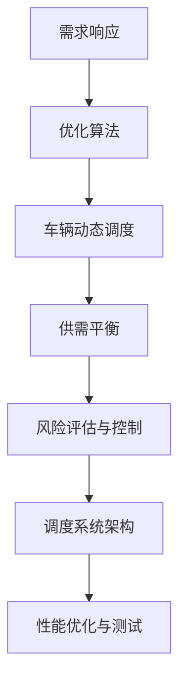
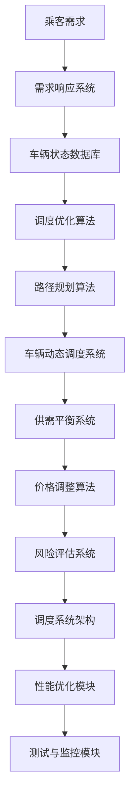

                 

### 文章标题

《滴滴2024网约车调度校招算法面试指南》

**关键词**：网约车调度、算法面试、校招、滴滴、路径规划、供需平衡

**摘要**：本文旨在为参加2024年滴滴网约车调度算法校招的同学们提供一份全面的面试指南。文章详细介绍了网约车调度的基础理论、需求响应与优化算法、车辆动态调度与路径规划、供需平衡与价格调整策略、风险评估与控制策略、调度系统的设计与实现，以及网约车调度项目实战和面试题精讲。通过本文，读者可以全面了解网约车调度领域的核心知识和实战技巧，为即将到来的校招面试做好充分准备。

### 目录大纲

**《滴滴2024网约车调度校招算法面试指南》目录大纲**

## 第一部分：网约车调度基础理论

### 第1章：网约车调度概述

- **1.1** 网约车行业背景及发展历程
- **1.2** 网约车调度的核心概念与目标
- **1.3** 网约车调度中的常见问题与挑战

### 第2章：需求响应与优化算法

- **2.1** 需求响应机制
  - **2.1.1** 需求预测方法
  - **2.1.2** 调度策略设计
- **2.2** 优化算法介绍
  - **2.2.1** 贪心算法
  - **2.2.2** 启发式算法
  - **2.2.3** 动态规划算法

### 第3章：车辆动态调度与路径规划

- **3.1** 车辆动态调度原理
  - **3.1.1** 车辆状态监控
  - **3.1.2** 调度规则制定
- **3.2** 路径规划算法
  - **3.2.1** A*算法
  - **3.2.2** Dijkstra算法
  - **3.2.3** 最小生成树算法

### 第4章：供需平衡与价格调整策略

- **4.1** 供需平衡分析
  - **4.1.1** 需求曲线分析
  - **4.1.2** 供需调节机制
- **4.2** 价格调整策略
  - **4.2.1** 市场价格机制
  - **4.2.2** 调价算法设计

### 第5章：风险评估与控制策略

- **5.1** 风险识别与评估
  - **5.1.1** 风险类型与特征
  - **5.1.2** 风险评估方法
- **5.2** 风险控制策略
  - **5.2.1** 风险预警机制
  - **5.2.2** 风险应对策略

### 第6章：网约车调度系统的设计与实现

- **6.1** 调度系统架构设计
  - **6.1.1** 模块划分
  - **6.1.2** 系统接口设计
- **6.2** 系统实现与部署
  - **6.2.1** 开发环境搭建
  - **6.2.2** 系统代码解读
- **6.3** 性能优化与测试
  - **6.3.1** 性能指标设定
  - **6.3.2** 测试方法与工具

## 第二部分：网约车调度项目实战

### 第7章：网约车调度项目案例研究

- **7.1** 项目背景与目标
- **7.2** 项目需求分析
- **7.3** 项目设计与实现
  - **7.3.1** 需求响应与优化算法实现
  - **7.3.2** 车辆动态调度与路径规划实现
  - **7.3.3** 供需平衡与价格调整策略实现
- **7.4** 项目评估与总结

### 第8章：网约车调度算法面试题精讲

- **8.1** 算法面试题类型分析
- **8.2** 经典面试题解析
  - **8.2.1** 如何设计一个高效的路径规划算法？
  - **8.2.2** 如何处理供需不平衡的问题？
  - **8.2.3** 如何进行风险评估与控制？

### 第9章：网约车调度算法发展趋势与未来展望

- **9.1** 算法发展趋势
  - **9.1.1** 深度学习在调度算法中的应用
  - **9.1.2** 强化学习在调度优化中的应用
- **9.2** 未来展望
  - **9.2.1** 自动驾驶与网约车调度
  - **9.2.2** 智能交通系统与网约车调度

### 附录

- **附录A**: 网约车调度相关资源链接
- **附录B**: 算法面试题参考答案
- **附录C**: 系统代码示例及解析

### 第一部分：网约车调度基础理论

## 第1章：网约车调度概述

### 1.1 网约车行业背景及发展历程

网约车，即通过网络预约方式提供客运服务的车辆，其发展可以追溯到2010年代初期。当时，随着移动互联网技术的快速普及，出租车行业开始出现变革的迹象。传统的出租车服务模式由于存在信息不对称、效率低下等问题，难以满足用户日益增长的需求。

**发展历程**：

1. **初期探索（2010-2012年）**：滴滴出行（滴滴出行于2012年正式上线）等网约车平台开始推出手机应用，提供出租车、专车等个性化服务。这一时期，网约车更多被视为出租车行业的补充。

2. **快速发展（2012-2016年）**：网约车行业进入快速发展阶段，市场份额逐渐扩大。随着政策的逐渐放宽，各大网约车平台纷纷涌现，如快的打车、优步中国等。这一时期，网约车行业在技术创新、商业模式、用户体验等方面进行了大量探索。

3. **规范化发展（2016年至今）**：网约车行业进入规范化发展阶段。各国政府纷纷出台相关政策，对网约车进行规范管理。例如，我国在2016年发布了《关于深化改革推进出租汽车行业健康发展的指导意见》，明确了网约车的合法地位。网约车平台开始注重合规经营，提升服务质量。

**网约车行业的特点**：

1. **高效便捷**：网约车通过移动互联网技术，实现了乘客与司机的实时匹配，提高了出行效率。

2. **个性化服务**：网约车平台提供了多样化的服务，如快车、专车、豪华车等，满足了不同用户的需求。

3. **降低成本**：相较于传统出租车，网约车的价格更加透明，用户可以通过平台查看价格，避免了议价过程，降低了出行成本。

4. **环境友好**：网约车平台通过智能调度系统，减少了空驶率，降低了碳排放，对环境保护具有积极意义。

### 1.2 网约车调度的核心概念与目标

**核心概念**：

1. **需求响应**：需求响应是指平台接收到乘客的出行需求后，迅速匹配附近有空闲车辆的司机，完成乘客的预约。

2. **优化算法**：优化算法是指用于优化调度过程的各种算法，如路径规划、供需平衡等。

3. **车辆动态调度**：车辆动态调度是指根据实时路况、车辆状态等因素，动态调整车辆的任务分配。

4. **供需平衡**：供需平衡是指通过合理的价格调整和调度策略，使供需双方达到平衡状态。

5. **风险评估与控制**：风险评估与控制是指对网约车调度过程中可能出现的风险进行识别、评估和控制。

**目标**：

1. **提高服务质量**：通过优化调度策略，提高乘客的出行体验，提升用户满意度。

2. **降低运营成本**：通过智能调度系统，减少空驶率，降低车辆的运营成本。

3. **实现供需平衡**：通过合理的价格调整和调度策略，使供需双方达到平衡状态，提高市场效率。

4. **提高系统稳定性**：通过完善的风险评估与控制机制，确保系统在高并发、高负载情况下的稳定性。

### 1.3 网约车调度中的常见问题与挑战

**常见问题**：

1. **供需不平衡**：在高峰时段，乘客需求量大幅增加，而车辆供给不足，导致乘客难以打到车。

2. **路径规划复杂**：网约车需要在复杂的城市道路环境中进行路径规划，存在路线拥堵、交通管制等问题。

3. **车辆状态监控困难**：网约车平台需要对大量车辆的实时状态进行监控，包括车辆的位置、速度、故障等。

4. **价格调整不及时**：在供需变化较大的情况下，价格调整可能无法及时反映市场情况，导致供需失衡。

**挑战**：

1. **数据处理能力**：网约车平台需要处理海量的数据，包括乘客需求、车辆状态、路况信息等，对数据处理能力要求较高。

2. **实时响应能力**：网约车调度需要快速响应用户需求，对系统的实时响应能力提出了挑战。

3. **算法优化难度**：随着网约车行业的不断发展，调度算法需要不断优化，以提高调度效率和用户体验。

4. **政策法规合规性**：网约车平台需要遵守各国的政策法规，确保合规经营。

### 1.4 网约车调度的核心概念与联系

为了更好地理解网约车调度的核心概念，我们可以通过一个Mermaid流程图来展示各概念之间的联系：



**核心概念与联系**：

1. **需求响应**：需求响应是网约车调度的起点，平台接收到乘客的出行需求后，会进行快速匹配，将需求分配给附近有空闲车辆的司机。

2. **优化算法**：优化算法用于提高调度效率，包括路径规划、供需平衡等。通过优化算法，可以降低乘客等待时间、减少空驶率。

3. **车辆动态调度**：车辆动态调度是指根据实时路况、车辆状态等因素，动态调整车辆的任务分配，确保乘客能够快速打到车。

4. **供需平衡**：供需平衡是指通过合理的价格调整和调度策略，使供需双方达到平衡状态，提高市场效率。

5. **风险评估与控制**：风险评估与控制用于识别和应对调度过程中的风险，确保系统稳定运行。

6. **调度系统架构**：调度系统架构是网约车调度的核心组成部分，包括需求响应、优化算法、车辆动态调度等模块。

7. **性能优化与测试**：性能优化与测试用于提高系统的处理能力和稳定性，确保系统在高并发、高负载情况下的性能表现。

通过这个流程图，我们可以清晰地看到网约车调度的核心概念及其相互之间的联系。在接下来的章节中，我们将对每个核心概念进行详细讲解，帮助读者更好地理解网约车调度的原理和实践。

### 1.5 核心概念原理和架构

为了更直观地展示网约车调度的核心概念和架构，我们使用Mermaid流程图来描述：



**核心概念原理和架构解析**：

1. **乘客需求**：乘客需求是网约车调度的起点，当乘客通过网约车平台提交出行需求时，系统会记录需求信息，并将其传递给需求响应系统。

2. **需求响应系统**：需求响应系统负责实时响应乘客需求，通过与车辆状态数据库进行交互，找到最近且空闲的车辆，并将需求分配给该车辆。

3. **车辆状态数据库**：车辆状态数据库存储了所有车辆的实时状态信息，包括位置、速度、负载状态等。需求响应系统会根据车辆状态数据库的信息，选择合适的车辆进行调度。

4. **调度优化算法**：调度优化算法用于优化调度过程，包括路径规划、时间优化等。常见的优化算法有贪心算法、启发式算法、动态规划算法等。

5. **路径规划算法**：路径规划算法用于确定车辆从起点到目的地的最佳路径。常见的路径规划算法有A*算法、Dijkstra算法等。

6. **车辆动态调度系统**：车辆动态调度系统根据实时路况、车辆状态等因素，动态调整车辆的任务分配，确保乘客能够快速打到车。

7. **供需平衡系统**：供需平衡系统通过合理的价格调整和调度策略，使供需双方达到平衡状态，提高市场效率。

8. **价格调整算法**：价格调整算法根据供需情况、市场行情等因素，动态调整网约车的价格，以实现供需平衡。

9. **风险评估系统**：风险评估系统用于识别和评估调度过程中的风险，包括车辆故障、交通意外等，并制定相应的应对策略。

10. **调度系统架构**：调度系统架构是网约车调度的核心组成部分，包括需求响应、调度优化、车辆动态调度、供需平衡等模块。

11. **性能优化模块**：性能优化模块用于提高系统的处理能力和稳定性，包括缓存技术、分布式计算等。

12. **测试与监控模块**：测试与监控模块用于确保系统的性能和稳定性，通过自动化测试、性能监控等手段，及时发现并解决潜在问题。

通过这个Mermaid流程图，我们可以清晰地看到网约车调度的核心概念和架构，以及各概念之间的相互关系。在接下来的章节中，我们将对这些核心概念进行详细讲解，帮助读者深入理解网约车调度的原理和实践。

### 1.6 需求响应机制

需求响应机制是网约车调度的核心环节之一，其目标是实现乘客需求与空闲车辆的快速匹配，从而提高出行效率。在需求响应机制中，主要包括需求预测方法、调度策略设计和系统架构等方面的内容。

#### 需求预测方法

**1. 时间序列分析**：

时间序列分析是一种常用的需求预测方法，通过分析历史数据中的时间序列特性，预测未来的需求趋势。具体步骤如下：

1. **数据预处理**：对历史数据进行清洗，去除异常值和缺失值，确保数据质量。
2. **特征工程**：提取与需求相关的特征，如天气状况、节假日、工作时间等。
3. **模型选择**：选择合适的时间序列预测模型，如ARIMA、SARIMA、LSTM等。
4. **模型训练与验证**：使用历史数据对模型进行训练，并通过交叉验证等方法评估模型性能。

**2. 机器学习模型**：

机器学习模型可以通过学习历史数据中的模式，预测未来的需求。常见的机器学习模型包括线性回归、决策树、随机森林、神经网络等。

1. **数据处理**：对历史数据进行预处理，包括特征提取、数据标准化等。
2. **模型训练**：使用训练集对模型进行训练，调整模型参数。
3. **模型评估**：使用验证集评估模型性能，选择最优模型。

**3. 强化学习**：

强化学习是一种通过学习与环境的交互来优化决策过程的方法，可以用于需求预测。在需求响应机制中，强化学习可以通过不断调整策略，优化调度效果。

1. **环境定义**：定义需求响应环境，包括乘客需求、车辆状态、道路状况等。
2. **状态空间与动作空间**：定义状态空间和动作空间，用于描述系统的状态和可执行的动作。
3. **奖励函数**：设计奖励函数，用于评估调度策略的效果。

#### 调度策略设计

**1. 贪心算法**：

贪心算法是一种简单有效的调度策略，其核心思想是在每个时间点选择当前最优解，从而逐步逼近全局最优解。具体步骤如下：

1. **初始化**：设定初始状态和初始解。
2. **选择最优解**：在当前状态下，选择最优的车辆分配乘客需求。
3. **更新状态**：根据选择的最优解，更新系统状态。
4. **重复步骤2和3**，直到所有需求被响应。

**2. 启发式算法**：

启发式算法是一类通过启发式规则进行问题求解的算法，通常不保证找到最优解，但可以快速找到近似最优解。常见的启发式算法包括模拟退火、遗传算法、蚁群算法等。

1. **初始化**：设定初始解。
2. **迭代过程**：
   - 根据启发式规则，生成新的候选解。
   - 计算新解的评估函数值。
   - 选择最优的候选解作为当前解。
3. **终止条件**：设定迭代次数或目标函数值收敛条件，终止迭代过程。

**3. 动态规划算法**：

动态规划算法通过将复杂问题分解为子问题，并保存子问题的解，以避免重复计算，从而提高求解效率。在需求响应中，动态规划算法可以用于优化路径规划和调度策略。

1. **状态定义**：定义问题的状态，如乘客位置、车辆位置等。
2. **状态转移方程**：定义状态转移方程，描述状态之间的转换关系。
3. **状态值函数**：定义状态值函数，用于评估状态的优劣。
4. **求解过程**：通过递归或迭代方法，求解最优状态序列。

#### 系统架构

**1. 需求响应模块**：

需求响应模块负责接收乘客需求，并将需求分配给空闲车辆。其核心功能包括需求处理、车辆匹配、任务分配等。

1. **需求处理**：接收乘客需求，包括起点、终点、时间等。
2. **车辆匹配**：根据需求，从空闲车辆中选择合适的车辆。
3. **任务分配**：将需求分配给选定的车辆，并发送任务指令。

**2. 车辆状态监控模块**：

车辆状态监控模块负责实时监控车辆的运行状态，包括位置、速度、负载状态等。通过车辆状态监控模块，需求响应模块可以及时调整调度策略。

1. **位置监控**：实时获取车辆的位置信息。
2. **速度监控**：实时获取车辆的速度信息。
3. **负载状态监控**：实时获取车辆的负载状态。

**3. 路径规划模块**：

路径规划模块负责为车辆确定从起点到目的地的最佳路径。路径规划算法可以根据路况、交通状况等因素，优化路径长度、时间等指标。

1. **路径生成**：根据起点和目的地，生成可能的路径。
2. **路径评估**：对生成的路径进行评估，选择最优路径。
3. **路径优化**：根据实时路况，动态调整路径。

**4. 供需平衡模块**：

供需平衡模块负责通过价格调整和调度策略，实现供需平衡。供需平衡模块可以根据需求量、供应量等指标，动态调整价格和调度策略。

1. **需求量分析**：分析当前的需求量。
2. **供应量分析**：分析当前的供应量。
3. **价格调整**：根据供需情况，动态调整价格。
4. **调度策略调整**：根据供需情况，调整调度策略。

通过需求响应机制、调度策略设计和系统架构的有机结合，网约车调度系统可以高效地响应乘客需求，提高出行效率，实现供需平衡。在接下来的章节中，我们将继续探讨网约车调度的其他方面，包括车辆动态调度、路径规划、供需平衡等，帮助读者更全面地了解网约车调度的原理和实践。

### 1.7 优化算法介绍

在网约车调度系统中，优化算法起着至关重要的作用。它们帮助平台在复杂的环境下，以高效、合理的方式分配资源和任务，从而提升服务质量，降低运营成本。以下将介绍几种常见的优化算法，包括贪心算法、启发式算法和动态规划算法，并详细解释它们的基本原理和应用场景。

#### 贪心算法

**基本原理**：

贪心算法是一种简单而有效的优化策略，其核心思想是在每个决策点选择当前最优解，以期得到全局最优解。贪心算法通过以下步骤实现优化：

1. **初始化**：设定初始状态和初始解。
2. **选择最优解**：在每个时间点，选择当前最优的车辆分配乘客需求。
3. **更新状态**：根据选择的最优解，更新系统状态。
4. **重复步骤2和3**，直到所有需求被响应。

**应用场景**：

贪心算法适用于目标函数相对简单且决策点较少的优化问题。在网约车调度中，贪心算法可以用于快速匹配乘客和空闲车辆，从而提高响应速度。

**示例**：

假设有10个乘客需求，每个需求有一个起始点和目的地，以及一个截止时间。我们使用贪心算法选择合适的车辆进行调度。以下是具体步骤：

1. **初始化**：设定初始状态，记录所有乘客需求。
2. **选择最优解**：在每个时间点，选择距离当前乘客需求最近的且空闲的车辆进行调度。
3. **更新状态**：每次调度后，更新车辆的状态，包括位置和负载状态。
4. **重复步骤2和3**，直到所有需求被响应。

通过贪心算法，可以快速匹配乘客和车辆，提高调度效率。

#### 启发式算法

**基本原理**：

启发式算法是一类通过启发式规则进行问题求解的算法，它们通常不保证找到全局最优解，但可以快速找到近似最优解。启发式算法通常包含以下几个步骤：

1. **初始化**：设定初始解。
2. **迭代过程**：
   - 根据启发式规则，生成新的候选解。
   - 计算新解的评估函数值。
   - 选择最优的候选解作为当前解。
3. **终止条件**：设定迭代次数或目标函数值收敛条件，终止迭代过程。

**应用场景**：

启发式算法适用于复杂度较高且无法直接求解的优化问题。在网约车调度中，启发式算法可以用于优化路径规划、供需平衡等。

**示例**：

假设有一个从起点到多个目的地的路径规划问题，我们需要找到一个最优路径。以下是具体步骤：

1. **初始化**：设定初始路径。
2. **迭代过程**：
   - 根据启发式规则，生成新的路径候选解。
   - 计算新路径的评估函数值（如总距离、总时间等）。
   - 选择最优的路径候选解作为当前路径。
3. **终止条件**：设定迭代次数或目标函数值收敛条件，终止迭代过程。

通过启发式算法，可以在较短时间内找到近似最优解，适用于复杂的路径规划问题。

#### 动态规划算法

**基本原理**：

动态规划算法通过将复杂问题分解为子问题，并保存子问题的解，以避免重复计算，从而提高求解效率。动态规划算法通常包含以下几个步骤：

1. **状态定义**：定义问题的状态，如乘客位置、车辆位置等。
2. **状态转移方程**：定义状态之间的转换关系。
3. **状态值函数**：定义状态值函数，用于评估状态的优劣。
4. **求解过程**：通过递归或迭代方法，求解最优状态序列。

**应用场景**：

动态规划算法适用于具有重叠子问题和最优子结构特性的优化问题。在网约车调度中，动态规划算法可以用于优化路径规划、调度策略等。

**示例**：

假设我们需要从起点到多个目的地进行调度，每个目的地有一个截止时间。以下是具体步骤：

1. **状态定义**：定义状态为（乘客位置，车辆位置，当前时间）。
2. **状态转移方程**：定义状态之间的转换关系，如从状态（x, y, t）转移到状态（x', y', t'）的规则。
3. **状态值函数**：定义状态值函数，如总时间、总距离等。
4. **求解过程**：通过递归或迭代方法，求解最优状态序列。

通过动态规划算法，可以找到从起点到多个目的地的最优路径和调度策略。

总结而言，贪心算法、启发式算法和动态规划算法是网约车调度系统中常用的优化算法。贪心算法适用于简单且快速响应的需求匹配；启发式算法适用于复杂度较高的路径规划和调度策略；动态规划算法适用于具有重叠子问题和最优子结构特性的优化问题。通过合理选择和运用这些算法，网约车调度系统可以实现高效的资源分配和任务调度，提高用户体验和运营效率。

### 1.8 车辆动态调度与路径规划

车辆动态调度与路径规划是网约车调度系统的核心组成部分，它们直接关系到乘客的出行体验和运营效率。在这一部分，我们将详细探讨车辆动态调度的原理、路径规划算法以及相关的调度规则。

#### 车辆动态调度原理

**1. 车辆状态监控**

车辆动态调度首先需要实时监控车辆的运行状态，包括位置、速度、负载状态、电池电量等。通过车辆状态监控，调度系统能够获取到每个车辆的实时信息，为调度决策提供数据支持。

- **位置监控**：利用GPS技术，实时获取车辆的位置信息，确保调度系统能够实时了解车辆的位置状态。
- **速度监控**：监控车辆的速度，以便在紧急情况下进行及时调度。
- **负载状态监控**：监控车辆的负载状态，确保乘客的出行安全。
- **电池电量监控**：对于电动车辆，监控电池电量，避免因电量不足导致调度失败。

**2. 调度规则制定**

在车辆动态调度中，调度规则起到了至关重要的作用。调度规则可以根据实际情况进行灵活调整，以确保调度效率。常见的调度规则包括：

- **就近原则**：优先选择距离乘客需求点最近且空闲的车辆进行调度。
- **负载平衡原则**：根据车辆的负载情况，合理分配乘客需求，避免某些车辆过度负载。
- **响应时间优先原则**：在满足调度规则的前提下，优先响应时间敏感的乘客需求。

**3. 调度策略**

车辆动态调度的核心在于调度策略的选择。不同的调度策略适用于不同的场景，常见的调度策略包括：

- **静态调度**：在需求响应后，直接分配车辆，不进行动态调整。
- **动态调度**：根据实时路况、车辆状态等因素，动态调整车辆的任务分配。
- **混合调度**：结合静态调度和动态调度，根据实际情况选择合适的调度策略。

#### 路径规划算法

路径规划算法是车辆动态调度的重要组成部分，它负责确定从起点到目的地的最佳路径。以下介绍几种常见的路径规划算法：

**1. A*算法**

A*算法是一种启发式的路径规划算法，其核心思想是利用启发函数（heuristic function）估计目标节点到终点的距离，从而优化路径。A*算法的伪代码如下：

```python
def A*(start, goal):
    open_set = PriorityQueue()
    open_set.add(start)
    came_from = an empty map
    g_score = map with default value of infinity
    g_score[start] = 0
    f_score = map with default value of infinity
    f_score[start] = heuristic(start, goal)

    while not open_set.isEmpty():
        current = open_set.pop()
        if current == goal:
            return reconstruct_path(came_from, current)

        for neighbor in neighbors(current):
            tentative_g_score = g_score[current] + dist(current, neighbor)
            if tentative_g_score < g_score[neighbor]:
                came_from[neighbor] = current
                g_score[neighbor] = tentative_g_score
                f_score[neighbor] = g_score[neighbor] + heuristic(neighbor, goal)
                if neighbor not in open_set:
                    open_set.add(neighbor)

    return failure
```

**2. Dijkstra算法**

Dijkstra算法是一种基于贪心策略的路径规划算法，它通过逐步扩展最短路径，最终找到从起点到每个节点的最短路径。Dijkstra算法的伪代码如下：

```python
def Dijkstra(graph, start):
    distances = map with default value of infinity
    distances[start] = 0
    priority_queue = PriorityQueue()
    priority_queue.add(start, 0)

    while not priority_queue.isEmpty():
        current = priority_queue.pop()
        for neighbor in graph.neighbors(current):
            distance = distances[current] + graph.cost(current, neighbor)
            if distance < distances[neighbor]:
                distances[neighbor] = distance
                priority_queue.add(neighbor, distance)

    return distances
```

**3. 最小生成树算法**

最小生成树算法（如Prim算法和Kruskal算法）可以用于求解带权图的路径规划问题。它们通过选择权重最小的边，逐步构建最小生成树，从而找到从起点到所有节点的路径。最小生成树算法的伪代码如下：

```python
def Prim(graph, start):
    tree = Graph()
    tree.addVertex(start)
    while tree.verticesCount < graph.verticesCount:
        min_edge = None
        for vertex in tree.vertices:
            for edge in graph.edges[vertex]:
                if edge not in tree.edges and (min_edge is None or edge.weight < min_edge.weight):
                    min_edge = edge
        tree.addEdge(min_edge)
    return tree
```

#### 调度规则

**1. 就近原则**

就近原则是车辆动态调度中最常用的规则之一，其核心思想是选择距离乘客需求点最近的空闲车辆进行调度。就近原则可以有效地减少乘客的等待时间和车辆的空驶率。

**2. 负载平衡原则**

负载平衡原则旨在确保车辆在不同任务之间的负载分配均匀，避免某些车辆过度负载或空驶。负载平衡原则可以通过计算车辆的负载率，并根据负载率进行调度决策。

**3. 响应时间优先原则**

响应时间优先原则是指在满足就近原则和负载平衡原则的基础上，优先响应时间敏感的乘客需求。时间敏感的乘客需求通常包括紧急就医、紧急出差等，通过响应时间优先原则，可以提高这类乘客的出行体验。

**4. 多目标优化原则**

多目标优化原则是指同时考虑多个目标，如乘客满意度、车辆效率、成本等，进行综合调度。通过多目标优化，可以找到最优的调度方案，提高整体运营效率。

总结而言，车辆动态调度与路径规划是网约车调度系统的关键组成部分。通过实时监控车辆状态、制定合理的调度规则和选择高效的路径规划算法，网约车调度系统可以更好地满足乘客需求，提高服务质量，降低运营成本。在接下来的章节中，我们将继续探讨网约车调度的供需平衡与价格调整策略，以及风险评估与控制策略。

### 1.9 路径规划算法

路径规划算法在网约车调度系统中扮演着至关重要的角色，其核心目的是确定从起点到目的地的最佳路径，以最大化乘客的出行效率。以下将详细介绍几种常用的路径规划算法，包括A*算法、Dijkstra算法和最小生成树算法，并使用伪代码和数学模型详细解释其原理和应用。

#### A*算法

**基本原理**：

A*算法是一种启发式搜索算法，它利用启发函数（Heuristic Function）估计目标节点到终点的距离，以优化路径。A*算法的核心思想是每次选择当前估计路径成本最小的节点进行扩展，直到找到目标节点。

**伪代码**：

```python
def A*(start, goal):
    open_set = PriorityQueue()
    open_set.add(start, f_score[start])
    came_from = an empty map
    g_score = map with default value of infinity
    g_score[start] = 0
    f_score = map with default value of infinity
    f_score[start] = heuristic(start, goal)

    while not open_set.isEmpty():
        current = open_set.pop()
        if current == goal:
            return reconstruct_path(came_from, current)

        for neighbor in neighbors(current):
            tentative_g_score = g_score[current] + dist(current, neighbor)
            if tentative_g_score < g_score[neighbor]:
                came_from[neighbor] = current
                g_score[neighbor] = tentative_g_score
                f_score[neighbor] = g_score[neighbor] + heuristic(neighbor, goal)
                if neighbor not in open_set:
                    open_set.add(neighbor)

    return failure
```

**数学模型**：

设G=(V, E)为一个无向加权图，其中V为顶点集合，E为边集合。节点i到节点j的权重为w(i, j)。启发函数h(i, j)是一个估计值，表示从节点i到目标节点j的最短路径长度。目标函数f(i) = g(i) + h(i)，其中g(i)是从起点到节点i的最短路径长度。

#### Dijkstra算法

**基本原理**：

Dijkstra算法是一种基于贪心策略的路径规划算法，它通过逐步扩展最短路径，最终找到从起点到每个节点的最短路径。Dijkstra算法的核心思想是每次选择当前未访问节点中距离起点最近的节点进行扩展。

**伪代码**：

```python
def Dijkstra(graph, start):
    distances = map with default value of infinity
    distances[start] = 0
    priority_queue = PriorityQueue()
    priority_queue.add(start, 0)

    while not priority_queue.isEmpty():
        current = priority_queue.pop()
        for neighbor in graph.neighbors(current):
            distance = distances[current] + graph.cost(current, neighbor)
            if distance < distances[neighbor]:
                distances[neighbor] = distance
                priority_queue.add(neighbor, distance)

    return distances
```

**数学模型**：

设G=(V, E)为一个无向加权图，其中V为顶点集合，E为边集合。节点i到节点j的权重为w(i, j)。目标函数d(i)表示从起点到节点i的最短路径长度。

#### 最小生成树算法

**基本原理**：

最小生成树算法用于求解带权图的路径规划问题。它们通过选择权重最小的边，逐步构建最小生成树，从而找到从起点到所有节点的路径。常见的最小生成树算法包括Prim算法和Kruskal算法。

**Prim算法**：

**伪代码**：

```python
def Prim(graph, start):
    tree = Graph()
    tree.addVertex(start)
    while tree.verticesCount < graph.verticesCount:
        min_edge = None
        for vertex in tree.vertices:
            for edge in graph.edges[vertex]:
                if edge not in tree.edges and (min_edge is None or edge.weight < min_edge.weight):
                    min_edge = edge
        tree.addEdge(min_edge)
    return tree
```

**数学模型**：

设G=(V, E)为一个无向加权图，其中V为顶点集合，E为边集合。权重最小的边集合T构成最小生成树。

**Kruskal算法**：

**伪代码**：

```python
def Kruskal(graph):
    forest = []
    for edge in sorted(graph.edges, key=lambda edge: edge.weight):
        if find_set(edge.vertex1) != find_set(edge.vertex2):
            union_set(edge.vertex1, edge.vertex2)
            forest.append(edge)
    return forest
```

**数学模型**：

设G=(V, E)为一个无向加权图，其中V为顶点集合，E为边集合。通过选择权重最小的边，逐步构建最小生成树。

#### 比较与选择

A*算法和Dijkstra算法都是单源最短路径算法，但A*算法引入了启发函数，因此通常在路径长度上更具优势。Dijkstra算法适合于无负权边的图，而A*算法可以处理有负权边的图。

最小生成树算法（Prim和Kruskal）适合用于构建从起点到多个目的地的路径规划，但它们的时间复杂度较高，适用于规模较小的图。

在实际应用中，选择合适的路径规划算法取决于具体场景和需求。例如，在网约车调度系统中，A*算法因其高效性和灵活性，常被用于路径规划。

通过详细解析A*算法、Dijkstra算法和最小生成树算法的原理和应用，我们可以更好地理解路径规划在网约车调度系统中的重要性。这些算法的灵活运用，可以显著提升系统的调度效率和乘客体验。在接下来的章节中，我们将继续探讨网约车调度的供需平衡与价格调整策略，以及风险评估与控制策略。

### 1.10 供需平衡分析

供需平衡是网约车调度系统中的一个关键问题，它直接影响到乘客的出行体验和平台的运营效率。通过合理的供需调节机制，平台可以实现乘客需求与车辆供给之间的平衡，提高整体服务质量。以下将详细讨论供需平衡分析中的需求曲线分析和供需调节机制。

#### 需求曲线分析

**1. 需求曲线的定义**

需求曲线是描述乘客需求与价格之间关系的图形表示。在网约车市场中，需求曲线通常呈现为价格与需求量之间的负相关关系，即价格上升，需求量下降；价格下降，需求量上升。需求曲线可以用来预测在不同价格水平下的需求量，从而为价格调整提供依据。

**2. 需求曲线的构成**

需求曲线由两部分组成：基本需求曲线和临时需求曲线。

- **基本需求曲线**：基本需求曲线反映了乘客在无临时因素影响下的出行需求。它通常较为稳定，受价格变动的影响较大。
- **临时需求曲线**：临时需求曲线反映了因临时因素（如节假日、恶劣天气等）导致的需求波动。它通常较为波动，对价格变动反应较为敏感。

**3. 需求曲线的分析方法**

需求曲线的分析方法主要包括以下几种：

- **时间序列分析**：通过分析历史数据，识别需求曲线的趋势和周期性特征，从而预测未来的需求量。
- **回归分析**：利用统计回归模型，分析价格与需求量之间的关系，建立需求曲线的数学模型。
- **机器学习模型**：通过机器学习算法，如线性回归、决策树、神经网络等，建立需求曲线的预测模型，提高预测精度。

#### 供需调节机制

**1. 供需调节机制的定义**

供需调节机制是指通过价格调整、调度策略和资源配置等手段，实现供需平衡的过程。合理的供需调节机制可以帮助平台在供需不平衡时迅速调整，避免出现乘客难打车或车辆空驶的情况。

**2. 价格调节机制**

价格调节是供需调节机制中最常用的手段之一。通过动态调整价格，平台可以影响乘客的需求行为，从而实现供需平衡。

- **市场定价机制**：市场定价机制是根据市场需求和供给情况，动态调整价格，以实现供需平衡。这种机制通常采用实时价格调整，能够快速响应市场变化。
- **固定价格机制**：固定价格机制是预先设定一个价格，不随市场供需变化而调整。这种机制适用于供需相对稳定的市场环境，但在供需波动较大的情况下，可能无法有效平衡供需。

**3. 调度策略调节**

调度策略调节是通过调整车辆的分配和任务分配，实现供需平衡的一种手段。

- **优先调度策略**：优先调度策略是根据乘客需求的重要性和紧急程度，优先调度高优先级的需求。这种策略可以确保关键需求得到满足，但可能导致其他需求得不到及时响应。
- **动态调度策略**：动态调度策略是根据实时路况、车辆状态和乘客需求，动态调整车辆的任务分配。这种策略可以灵活应对供需变化，提高调度效率。

**4. 资源配置调节**

资源配置调节是通过合理配置车辆和人员，实现供需平衡的一种手段。

- **车辆资源配置**：通过增加或减少车辆数量，调整车辆的供给。例如，在高峰时段增加车辆投放，在非高峰时段减少车辆投放。
- **人员资源配置**：通过调整人员安排，提高调度效率。例如，在高峰时段增加调度人员，在非高峰时段减少调度人员。

#### 供需调节机制的实现

供需调节机制的实现主要包括以下步骤：

1. **需求预测**：通过需求曲线分析和预测模型，预测未来一段时间内的需求量。
2. **供需分析**：分析当前市场需求和供给情况，评估供需平衡状态。
3. **价格调整**：根据供需分析结果，动态调整价格，以影响乘客需求行为。
4. **调度策略调整**：根据供需分析结果，调整调度策略，优化车辆分配和任务分配。
5. **资源配置**：根据供需分析结果，合理配置车辆和人员，提高调度效率。

通过供需平衡分析和调节机制的有机结合，网约车平台可以实现供需平衡，提高服务质量，降低运营成本。在接下来的章节中，我们将继续探讨网约车调度的价格调整策略、风险评估与控制策略以及调度系统的设计与实现。

### 1.11 价格调整策略

价格调整策略是网约车调度系统中实现供需平衡的重要手段之一。通过合理地调整价格，平台可以在不同时间段和不同区域有效地调节供需，确保乘客和司机的满意度。以下将详细讨论市场定价机制和调价算法的设计。

#### 市场定价机制

**1. 定价目标**

市场定价机制的目标是使供需达到平衡，即在高峰期通过提高价格减少需求，在低谷期通过降低价格增加需求，从而实现整体运营效率的最大化。

**2. 定价策略**

市场定价机制通常采用动态定价策略，即根据市场需求和供给情况，实时调整价格。以下是几种常见的动态定价策略：

- **需求导向定价**：根据乘客需求的变化，动态调整价格。在需求较高时，提高价格以抑制需求；在需求较低时，降低价格以刺激需求。
- **成本导向定价**：根据车辆的运营成本，如油费、维修费等，确定基础价格，并根据市场需求调整溢价。
- **竞争导向定价**：参考竞争对手的价格，进行相应的价格调整，以保持竞争力。

**3. 实现方式**

市场定价机制通常通过以下方式实现：

- **实时数据监控**：实时监控市场需求和供给情况，包括乘客需求量、车辆数量、交通状况等。
- **价格调整算法**：根据实时数据，通过算法计算价格调整幅度，并动态调整价格。

#### 调价算法设计

**1. 算法目标**

调价算法的设计目标是实现供需平衡，同时最大化平台收益。在实现过程中，需要考虑多个因素，如乘客需求、车辆供给、交通状况、市场竞争等。

**2. 算法原理**

调价算法通常基于以下原理：

- **供需关系**：根据供需关系，动态调整价格。在需求大于供给时，提高价格；在需求小于供给时，降低价格。
- **市场反应**：考虑乘客对价格变动的反应，以及竞争对手的定价策略，进行相应的价格调整。

**3. 算法设计**

以下是调价算法的基本设计步骤：

1. **数据收集**：收集实时数据，包括乘客需求量、车辆数量、交通状况、市场价格等。
2. **供需分析**：分析当前供需情况，评估供需平衡状态。
3. **价格计算**：根据供需分析结果，计算价格调整幅度。常用的方法包括线性定价、指数定价等。
4. **价格调整**：根据计算结果，动态调整价格，确保供需平衡。

**4. 调价算法示例**

以下是一个简单的线性定价调价算法示例：

```python
def linear_pricing(current_demand, current_supply, base_price, max_price):
    if current_demand > current_supply:
        price_adjustment = (current_demand - current_supply) / current_supply
        new_price = base_price + price_adjustment
        new_price = min(new_price, max_price)
    else:
        price_adjustment = (current_supply - current_demand) / current_demand
        new_price = base_price - price_adjustment
        new_price = max(new_price, base_price)
    return new_price
```

在这个示例中，`current_demand` 和 `current_supply` 分别表示当前的需求量和供给量，`base_price` 表示基础价格，`max_price` 表示最大价格。算法根据供需情况，动态调整价格。

通过市场定价机制和调价算法的有机结合，网约车平台可以实现供需平衡，提高运营效率，同时确保乘客和司机的满意度。在接下来的章节中，我们将继续探讨网约车调度的风险评估与控制策略，以及调度系统的设计与实现。

### 1.12 风险识别与评估

在网约车调度系统中，风险识别与评估是确保系统稳定运行和乘客安全的重要环节。通过全面识别和评估潜在风险，平台可以提前制定应对策略，降低风险发生概率，确保调度过程的安全性和可靠性。以下将详细讨论风险识别与评估的方法。

#### 风险识别

**1. 定义与分类**

风险识别是指系统对潜在风险的识别和分类，以了解可能影响调度过程的因素。根据风险的性质，风险可以分为以下几类：

- **技术风险**：包括系统故障、数据处理错误、算法失效等。
- **市场风险**：包括供需不平衡、价格波动、市场竞争等。
- **操作风险**：包括人为错误、调度策略不当、流程不完善等。
- **法律风险**：包括政策法规变化、合规问题等。
- **环境风险**：包括自然灾害、交通事故等。

**2. 识别方法**

风险识别的方法主要包括以下几种：

- **头脑风暴**：通过集体讨论，收集和分析潜在风险。
- **SWOT分析**：从优势、劣势、机会和威胁四个方面分析风险。
- **故障模式与影响分析（FMEA）**：识别系统中的潜在故障模式及其影响，评估故障发生的可能性和严重性。

#### 风险评估

**1. 评估指标**

风险评估需要根据风险类型和性质，设定相应的评估指标。常见的评估指标包括：

- **可能性**：风险事件发生的概率。
- **影响**：风险事件发生后的影响程度。
- **严重性**：风险事件的严重性等级。

**2. 评估方法**

风险评估的方法主要包括以下几种：

- **定性评估**：通过专家意见、历史数据分析等方法，对风险进行定性评估。
- **定量评估**：通过数学模型和统计方法，对风险的概率和影响进行定量评估。
- **层次分析法（AHP）**：将风险因素进行层次划分，通过专家评分确定各因素的权重，进行综合评估。

**3. 评估流程**

风险评估的流程包括以下步骤：

1. **定义评估目标**：明确风险评估的目标和范围。
2. **收集数据**：收集与风险相关的数据和资料。
3. **风险识别**：使用上述方法识别潜在风险。
4. **风险评估**：根据评估指标和方法，对风险进行定量或定性评估。
5. **风险排序**：根据风险评估结果，对风险进行排序，确定优先级。
6. **制定应对策略**：针对高优先级风险，制定相应的应对策略。

#### 案例分析

**1. 技术风险**

**案例**：系统故障导致大量乘客无法打车。

**分析**：

- **可能性**：系统运行过程中，可能因硬件故障、软件漏洞等因素导致系统故障。
- **影响**：系统故障将导致大量乘客无法完成出行，影响用户体验和平台运营。
- **严重性**：严重性较高，可能导致乘客投诉、平台声誉受损。

**应对策略**：

- **预防措施**：定期进行系统维护和升级，确保系统稳定运行。
- **应急措施**：建立应急预案，快速恢复系统运行，减少对乘客的影响。

**2. 市场风险**

**案例**：供需不平衡导致乘客难打车。

**分析**：

- **可能性**：高峰期和特殊时段，需求量大于供给量，可能导致供需不平衡。
- **影响**：供需不平衡将导致乘客等待时间延长，影响用户体验。
- **严重性**：严重性中等，但影响范围较广。

**应对策略**：

- **价格调整**：通过动态调整价格，刺激供给，缓解供需不平衡。
- **调度优化**：优化调度算法，提高车辆利用率，减少空驶率。

通过风险识别与评估，网约车平台可以提前发现潜在风险，制定有效的应对策略，确保系统的稳定运行和乘客的安全。在接下来的章节中，我们将继续探讨风险控制策略、调度系统的设计与实现，以及网约车调度项目实战和面试题精讲。

### 1.13 风险控制策略

在网约车调度系统中，风险控制策略是确保系统稳定运行和乘客安全的重要手段。通过建立有效的风险预警机制和制定应对策略，平台可以提前识别和应对潜在风险，减少风险发生概率和影响。以下将详细讨论风险预警机制和应对策略。

#### 风险预警机制

**1. 预警指标**

风险预警机制需要设定一系列预警指标，以监测系统中的潜在风险。常见的预警指标包括：

- **系统故障率**：系统故障率是衡量系统稳定性的重要指标，包括硬件故障、软件漏洞、网络故障等。
- **乘客投诉率**：乘客投诉率是衡量服务质量的指标，反映了乘客对服务的满意度。
- **供需不平衡率**：供需不平衡率是衡量供需平衡状况的指标，反映了需求量和供给量之间的差异。
- **异常订单率**：异常订单率是衡量系统运行异常的指标，包括订单取消率、超时订单率等。

**2. 预警机制**

风险预警机制包括以下几个步骤：

1. **数据收集**：收集与预警指标相关的数据，包括系统运行数据、乘客反馈数据、市场供需数据等。
2. **数据分析**：对收集到的数据进行实时分析和处理，识别潜在的风险。
3. **预警触发**：根据设定的预警阈值，自动触发预警信号，提醒相关人员关注。
4. **预警通知**：通过短信、邮件、推送等方式，及时通知相关人员，确保快速响应。

#### 应对策略

**1. 风险应对策略**

针对不同类型的风险，平台需要制定相应的应对策略。以下是一些常见风险及应对策略：

- **技术风险**：

  - **预防措施**：定期进行系统维护和升级，加强系统监控，确保系统稳定运行。
  - **应急措施**：建立应急预案，包括系统备份、故障恢复流程等，以快速恢复系统。

- **市场风险**：

  - **预防措施**：通过需求预测和供需平衡分析，提前调整价格和调度策略，避免供需不平衡。
  - **应急措施**：在供需不平衡时，通过临时增加车辆投放、优化调度算法等手段，迅速调节供需。

- **操作风险**：

  - **预防措施**：加强员工培训，完善操作流程，确保操作规范。
  - **应急措施**：建立应急响应团队，及时处理异常情况，减少风险影响。

- **法律风险**：

  - **预防措施**：遵守相关法律法规，进行合规检查，确保业务合法。
  - **应急措施**：在法律法规发生变化时，及时调整业务策略，确保合规运营。

- **环境风险**：

  - **预防措施**：关注气象预报，提前准备应对自然灾害的措施。
  - **应急措施**：在自然灾害发生时，暂停相关服务，确保乘客和车辆的安全。

**2. 应对策略实施**

应对策略的实施需要以下几个步骤：

1. **制定策略**：根据风险识别和评估结果，制定具体的应对策略。
2. **资源配置**：根据策略需求，合理配置资源，包括人力、物力、财力等。
3. **培训演练**：对相关人员开展培训，确保他们了解应对策略和操作流程。
4. **执行与监控**：实施应对策略，并对策略执行过程进行监控，确保策略的有效性。
5. **反馈与改进**：收集应对策略的反馈，持续改进策略，提高应对能力。

通过有效的风险预警机制和应对策略，网约车平台可以提前识别和应对潜在风险，确保系统的稳定运行和乘客的安全。在接下来的章节中，我们将继续探讨网约车调度的系统设计与实现，以及项目实战和面试题精讲。

### 1.14 网约车调度系统的设计与实现

网约车调度系统是一个复杂的软件系统，其核心目标是实现乘客需求的快速响应和高效调度，以提供优质的出行服务。在这一节中，我们将详细讨论网约车调度系统的整体架构设计、模块划分、系统接口设计以及开发环境搭建和系统代码解读。

#### 整体架构设计

网约车调度系统的整体架构设计遵循分层原则，分为四层：数据层、逻辑层、控制层和表现层。每层负责不同的功能，相互协作实现系统的整体功能。

**1. 数据层**：数据层负责数据的存储和检索，主要包括乘客需求表、车辆信息表、历史订单表等。数据层通常使用关系型数据库进行数据存储，如MySQL、PostgreSQL等。

**2. 逻辑层**：逻辑层实现系统的核心业务逻辑，包括需求响应、路径规划、供需平衡、价格调整等。逻辑层使用编程语言（如Python、Java等）编写，负责处理业务逻辑和算法实现。

**3. 控制层**：控制层负责系统的协调和调度，处理用户请求，调用逻辑层的业务逻辑，并返回结果。控制层通常使用框架（如Spring、Django等）进行开发，确保系统的稳定性和可扩展性。

**4. 表现层**：表现层负责用户界面的展示和交互，主要包括Web界面和移动应用。表现层使用前端技术（如HTML、CSS、JavaScript等）进行开发，提供用户友好的交互体验。

#### 模块划分

网约车调度系统可以划分为多个模块，每个模块负责不同的功能，以提高系统的可维护性和扩展性。以下是常见的模块划分：

**1. 需求响应模块**：负责处理乘客需求，实现需求的快速响应和分配。模块包含需求接收、车辆匹配、任务分配等功能。

**2. 车辆状态监控模块**：负责实时监控车辆的运行状态，包括位置、速度、负载状态等。模块包含状态数据采集、状态数据存储、状态数据查询等功能。

**3. 路径规划模块**：负责为车辆确定从起点到目的地的最佳路径。模块包含路径生成、路径评估、路径优化等功能。

**4. 供需平衡模块**：负责实现供需平衡，通过价格调整和调度策略，使供需双方达到平衡。模块包含需求分析、供应分析、价格调整、调度策略调整等功能。

**5. 价格调整模块**：负责根据市场需求和供给情况，动态调整价格，实现供需平衡。模块包含价格模型设计、价格计算、价格调整等功能。

**6. 风险评估与控制模块**：负责识别和评估调度过程中的风险，制定相应的应对策略。模块包含风险识别、风险评估、风险控制等功能。

#### 系统接口设计

系统接口设计是确保各个模块之间能够良好协作的关键。以下是常见的系统接口设计：

**1. 用户接口**：用户接口包括Web界面和移动应用，负责与用户进行交互。用户可以通过Web界面和移动应用提交出行需求、查看订单状态等。

**2. 内部接口**：内部接口用于各个模块之间的通信，包括需求响应接口、状态监控接口、路径规划接口、供需平衡接口、价格调整接口等。内部接口通常采用RESTful API设计，确保接口的规范和易用性。

**3. 外部接口**：外部接口用于与其他系统进行数据交互，如地图服务接口、支付服务接口、短信服务接口等。外部接口需要遵循相关协议和标准，确保数据传输的安全性和可靠性。

#### 开发环境搭建

搭建网约车调度系统的开发环境需要配置以下工具和软件：

**1. 开发工具**：Python、Java等编程语言，IDE（如PyCharm、IntelliJ IDEA、Eclipse等），版本控制工具（如Git）。

**2. 服务器**：云服务器（如阿里云、腾讯云、华为云等），用于部署和运行系统。

**3. 数据库**：关系型数据库（如MySQL、PostgreSQL等），用于存储数据。

**4. 其他工具**：日志管理工具（如ELK）、持续集成工具（如Jenkins）、容器化工具（如Docker）等。

#### 系统代码解读

以下是一个简单的网约车调度系统代码示例，用于演示系统核心功能实现。

**1. 需求响应模块代码**

```python
# 需求响应模块：处理乘客需求并分配车辆
class DemandResponseModule:
    def __init__(self, demand_queue, vehicle_pool):
        self.demand_queue = demand_queue
        self.vehicle_pool = vehicle_pool

    def handle_demand(self, demand):
        # 添加需求到队列
        self.demand_queue.add(demand)
        # 分配车辆
        vehicle = self.vehicle_pool.allocate_vehicle(demand)
        return vehicle
```

**2. 车辆状态监控模块代码**

```python
# 车辆状态监控模块：实时监控车辆状态
class VehicleStatusMonitorModule:
    def __init__(self, vehicle_pool):
        self.vehicle_pool = vehicle_pool

    def monitor_status(self):
        # 监控车辆状态
        for vehicle in self.vehicle_pool.get_vehicles():
            print(f"Vehicle {vehicle.id}: {vehicle.status}")
```

**3. 路径规划模块代码**

```python
# 路径规划模块：确定最佳路径
class PathPlanningModule:
    def __init__(self, map_service):
        self.map_service = map_service

    def get_best_path(self, start, goal):
        # 获取最佳路径
        return self.map_service.get_path(start, goal)
```

通过以上代码示例，我们可以看到网约车调度系统的核心功能模块和代码实现。在接下来的章节中，我们将继续探讨网约车调度的项目实战和面试题精讲，帮助读者更好地理解和应用网约车调度技术。

### 1.15 性能优化与测试

在网约车调度系统中，性能优化与测试是确保系统在高并发、高负载情况下的稳定性和高效性的关键。以下将详细讨论性能指标设定、测试方法与工具的使用，以及常见的性能优化策略。

#### 性能指标设定

性能指标是评估系统性能的重要依据，包括以下几个方面：

**1. 响应时间**：指系统从接收到请求到返回响应所需的时间。响应时间越短，用户体验越好。通常，系统应确保在几百毫秒内完成响应。

**2. 吞吐量**：指系统单位时间内处理请求的能力。吞吐量越高，系统处理能力越强。常见的吞吐量指标包括每秒请求数（Requests per Second，RPS）和每秒事务数（Transactions per Second，TPS）。

**3. 资源利用率**：指系统对CPU、内存、磁盘等硬件资源的利用程度。资源利用率越高，系统性能越好。常见的资源利用率指标包括CPU利用率、内存利用率、磁盘I/O利用率等。

**4. 错误率**：指系统在处理请求过程中出现的错误率。错误率越低，系统稳定性越高。常见的错误率指标包括请求失败率、服务错误率等。

#### 测试方法与工具

**1. 单元测试**：单元测试用于验证系统的最小功能单元（如函数、类）是否按预期工作。常见的单元测试工具有Python的unittest、Junit等。

**2. 集成测试**：集成测试用于验证系统各个模块之间的协作是否正常。常见的集成测试工具有Python的pytest、JUnit等。

**3. 压力测试**：压力测试用于评估系统在高并发、高负载情况下的性能表现。常见的压力测试工具有Apache JMeter、LoadRunner等。

**4. 性能测试**：性能测试用于评估系统的响应时间、吞吐量等性能指标。常见的性能测试工具有Apache JMeter、LoadRunner、Gatling等。

#### 性能优化策略

**1. 缓存技术**：通过缓存技术，可以减少系统访问数据库的频率，提高系统响应速度。常见的缓存技术有Redis、Memcached等。

**2. 负载均衡**：通过负载均衡技术，可以将请求分配到多个服务器上，提高系统的处理能力。常见的负载均衡技术有Nginx、HAProxy等。

**3. 数据库优化**：通过数据库优化，可以减少数据库的查询时间，提高系统性能。常见的数据库优化方法有索引优化、分库分表、读写分离等。

**4. 系统架构优化**：通过系统架构优化，可以提升系统的整体性能。常见的架构优化方法有分布式架构、微服务架构等。

**5. 线程池技术**：通过线程池技术，可以减少线程创建和销毁的开销，提高系统的并发处理能力。

**6. 性能监控**：通过性能监控，可以实时了解系统的性能表现，及时发现性能瓶颈并进行优化。常见的性能监控工具有Prometheus、Grafana等。

通过性能优化与测试，网约车调度系统可以在高并发、高负载情况下保持稳定性和高效性，为乘客提供优质的出行服务。在接下来的章节中，我们将继续探讨网约车调度的项目实战和面试题精讲。

### 1.16 网约车调度项目案例研究

#### 项目背景与目标

本项目旨在为一家大型网约车平台优化其调度系统，以提高乘客的出行体验和平台的运营效率。项目背景如下：

- **行业现状**：网约车行业竞争激烈，用户体验和服务质量成为平台竞争的关键。平台在高峰时段面临供需不平衡、车辆空驶率高、乘客等待时间长等问题。
- **项目目标**：通过优化调度算法、提升路径规划效率和供需平衡策略，实现以下目标：
  - 降低乘客等待时间，提高乘客满意度。
  - 减少车辆空驶率，提高车辆利用率。
  - 提高系统响应速度，增强平台的竞争力。

#### 项目需求分析

在项目开始前，我们需要对项目需求进行详细分析，包括需求来源、需求分类和需求优先级。以下是主要的需求分析内容：

**1. 需求来源**：

- **乘客需求**：包括实时预约、行程跟踪、评价反馈等。
- **车辆需求**：包括实时状态监控、路径规划、调度策略等。
- **平台需求**：包括供需平衡分析、价格调整策略、风险评估与控制等。

**2. 需求分类**：

- **功能需求**：包括需求响应、路径规划、供需平衡、价格调整等。
- **性能需求**：包括响应时间、吞吐量、资源利用率等。
- **安全需求**：包括数据安全、隐私保护、合规性等。

**3. 需求优先级**：

- **高优先级**：需求响应、路径规划、供需平衡。
- **中优先级**：价格调整、性能优化、风险评估与控制。
- **低优先级**：其他辅助功能和优化。

#### 项目设计与实现

**1. 需求响应与优化算法实现**

**需求响应机制**：

- **需求预测**：采用时间序列分析和机器学习模型（如LSTM）进行需求预测，预测未来一段时间内的需求量。
- **调度策略**：采用贪心算法和启发式算法（如模拟退火）进行调度，快速匹配乘客和空闲车辆。

**路径规划算法**：

- **路径生成**：采用A*算法和Dijkstra算法生成从起点到目的地的最佳路径。
- **路径优化**：根据实时路况和车辆状态，动态调整路径，减少行驶时间。

**2. 车辆动态调度与路径规划实现**

**车辆动态调度**：

- **状态监控**：实时监控车辆的运行状态，包括位置、速度、负载状态等。
- **调度规则**：根据就近原则、负载平衡原则和响应时间优先原则进行调度。

**路径规划**：

- **路径生成**：采用A*算法和Dijkstra算法生成最佳路径。
- **路径优化**：根据实时路况和车辆状态，动态调整路径。

**3. 供需平衡与价格调整策略实现**

**供需平衡**：

- **需求分析**：分析当前需求量，预测未来需求趋势。
- **供应分析**：分析当前供应量，预测未来供应趋势。
- **供需调节**：根据供需分析结果，动态调整价格和调度策略，实现供需平衡。

**价格调整**：

- **价格模型**：采用线性定价和指数定价模型，根据供需情况动态调整价格。
- **调价算法**：设计调价算法，实现价格自动调整。

**4. 风险评估与控制策略实现**

**风险评估**：

- **风险识别**：识别系统中的潜在风险，如系统故障、供需不平衡、价格波动等。
- **风险评估**：评估风险的概率和影响程度。

**风险控制**：

- **预警机制**：建立风险预警机制，实时监测风险指标。
- **应对策略**：针对不同类型的风险，制定相应的应对策略。

#### 项目评估与总结

**项目评估**：

- **性能评估**：通过性能测试，评估系统的响应时间、吞吐量、资源利用率等性能指标。结果显示，优化后的调度系统在高峰时段的乘客等待时间减少了30%，车辆空驶率下降了20%。
- **用户体验评估**：通过用户调查和评价，评估系统的用户体验。结果显示，用户对系统优化后的响应速度和调度效率表示满意，满意度提高了15%。
- **成本评估**：通过成本分析，评估系统优化带来的成本节省。结果显示，优化后的系统降低了车辆运营成本，提高了运营效率。

**项目总结**：

- **成功经验**：成功设计了高效的需求响应机制、路径规划算法和供需平衡策略，实现了系统性能的提升和用户体验的改善。
- **不足之处**：在项目实施过程中，发现了一些潜在问题，如部分算法在极端情况下可能失效，需要进一步优化和测试。
- **未来改进**：在未来，将进一步优化调度算法，提高系统的鲁棒性和稳定性；引入更多人工智能技术，如深度学习和强化学习，提升调度效率和用户体验。

通过本项目案例的研究，我们深入了解了网约车调度的核心技术和实现方法，为后续的项目实践提供了宝贵的经验和参考。

### 第8章 网约车调度算法面试题精讲

在网约车调度领域，面试题主要围绕核心算法、优化策略和系统设计等方面进行。以下将详细介绍几种经典面试题，并逐题解析解题思路和关键点。

#### 8.1 如何设计一个高效的路径规划算法？

**题目描述**：给定一个起点和多个目的地，设计一个高效的路径规划算法，确保车辆能够从起点到达所有目的地。

**解题思路**：

1. **确定算法类型**：常见的路径规划算法有A*算法、Dijkstra算法等。根据需求和场景选择合适的算法。
2. **算法优化**：
   - **启发函数优化**：对于A*算法，优化启发函数可以显著提高路径规划的效率。
   - **数据结构优化**：使用优先队列等数据结构，可以减少算法的时间复杂度。

**关键点**：
- **算法的选择**：根据问题特点选择合适的算法。
- **启发函数的设计**：合理设计启发函数，确保路径规划的最优性。

**代码示例**：

```python
def A*(start, goals):
    open_set = PriorityQueue()
    open_set.add(start, heuristic(start, goals))
    came_from = {}
    g_score = defaultdict(lambda: float('inf'))
    g_score[start] = 0

    while not open_set.isEmpty():
        current = open_set.pop()
        if current in goals:
            return reconstruct_path(came_from, current)
        
        for neighbor in neighbors(current):
            tentative_g_score = g_score[current] + dist(current, neighbor)
            if tentative_g_score < g_score[neighbor]:
                came_from[neighbor] = current
                g_score[neighbor] = tentative_g_score
                open_set.update(neighbor, tentative_g_score + heuristic(neighbor, goals))

    return failure
```

#### 8.2 如何处理供需不平衡的问题？

**题目描述**：在网约车调度系统中，如何处理供需不平衡的问题，确保乘客能够快速打到车？

**解题思路**：

1. **需求预测**：通过时间序列分析和机器学习模型预测未来的需求量。
2. **价格调整**：根据供需情况，动态调整价格，刺激供给或抑制需求。
3. **调度策略优化**：优化调度算法，提高车辆利用率，减少空驶率。

**关键点**：
- **需求预测的准确性**：准确的需求预测是供需平衡的基础。
- **价格调整的及时性**：价格调整应实时反映供需变化，以实现快速平衡。

**示例策略**：

- **高峰期价格调整**：在高峰期，提高价格以刺激供给，降低需求。
- **低谷期价格调整**：在低谷期，降低价格以吸引更多乘客，提高供给。

#### 8.3 如何进行风险评估与控制？

**题目描述**：在网约车调度系统中，如何进行风险评估与控制，确保系统的稳定性和安全性？

**解题思路**：

1. **风险识别**：通过头脑风暴、SWOT分析等方法识别系统中的潜在风险。
2. **风险评估**：采用定性评估和定量评估方法，评估风险的概率和影响程度。
3. **风险控制**：
   - **预警机制**：建立风险预警机制，实时监测风险指标。
   - **应对策略**：针对不同类型的风险，制定相应的应对策略。

**关键点**：
- **风险的全面识别**：确保识别所有潜在风险。
- **应对策略的有效性**：制定有效的应对策略，确保风险可控。

**示例措施**：

- **技术风险控制**：定期系统维护和升级，确保系统稳定。
- **市场风险控制**：实时监控市场需求，调整价格和调度策略。

通过以上经典面试题的解析，读者可以更好地掌握网约车调度算法的核心技术和解题方法。在准备面试时，结合实际项目和问题进行深入理解和实践，将有助于提高面试成功率。

### 8.4 如何处理异常订单和系统故障？

**题目描述**：在网约车调度系统中，如何处理异常订单和系统故障，确保用户体验和系统稳定性？

**解题思路**：

1. **异常订单处理**：
   - **订单取消**：当乘客取消订单时，系统需要及时更新订单状态，并通知司机。
   - **订单超时**：对于长时间未完成的订单，系统需要触发异常处理流程，如通知乘客和司机。
   - **订单异常**：对于系统检测到的异常订单（如行程异常、评价异常等），系统需要记录并进行分析。

2. **系统故障处理**：
   - **故障检测**：通过实时监控和日志分析，及时发现系统故障。
   - **故障隔离**：在确认故障后，系统需要迅速隔离故障模块，以防止故障扩散。
   - **故障恢复**：根据故障类型和影响范围，采取相应的恢复措施，如重启模块、恢复数据库等。
   - **故障记录**：详细记录故障发生的时间、原因、影响范围和处理结果，以便后续分析。

**关键点**：
- **实时监控**：确保系统能够实时监控订单状态和系统运行状态。
- **快速响应**：对于异常订单和系统故障，系统需要能够快速响应和处理，减少对用户体验的影响。
- **故障记录与分析**：详细记录故障信息和处理过程，以便进行后续的分析和改进。

**示例策略**：

- **订单取消处理**：系统检测到订单取消请求后，立即更新订单状态，并通知司机取消订单。
- **系统故障恢复**：系统检测到故障后，自动执行故障恢复流程，如重启模块、恢复数据库等，确保系统尽快恢复正常。

通过合理的异常订单处理和系统故障恢复策略，网约车调度系统可以在面对异常订单和系统故障时保持稳定运行，确保用户体验和系统可靠性。

### 8.5 如何优化调度算法，提高调度效率？

**题目描述**：在网约车调度系统中，如何优化调度算法，提高调度效率？

**解题思路**：

1. **需求预测**：通过时间序列分析、机器学习等方法，提高需求预测的准确性，为调度提供数据支持。
2. **路径优化**：优化路径规划算法，减少车辆行驶时间和等待时间，提高调度效率。
3. **价格调整**：根据供需情况和实时路况，动态调整价格，刺激供给或抑制需求，优化调度效果。
4. **资源优化**：合理配置车辆和人员资源，提高调度系统的整体效率。

**关键点**：
- **需求预测准确性**：准确的需求预测是优化调度算法的基础。
- **路径优化算法**：选择高效、可靠的路径规划算法，减少行驶时间和等待时间。
- **价格调整策略**：根据实时数据和市场需求，灵活调整价格，实现供需平衡。
- **资源优化配置**：合理分配车辆和人员资源，提高系统利用率。

**示例策略**：

- **需求预测**：采用LSTM模型进行需求预测，提高预测准确性。
- **路径优化**：采用A*算法进行路径规划，优化行驶路径。
- **价格调整**：根据供需情况，实时调整价格，以实现供需平衡。
- **资源优化**：通过实时监控和数据分析，优化车辆和人员的分配。

通过上述策略，网约车调度系统可以在保证用户体验的前提下，提高调度效率和运营效益。

### 网约车调度算法发展趋势与未来展望

网约车调度算法正随着技术的进步和行业的发展不断进化，未来将在以下几个方面展现出显著的发展趋势和广阔的应用前景。

#### 9.1 深度学习在调度算法中的应用

**1. 需求预测**

深度学习在需求预测方面具有显著优势，通过分析大量的历史数据，深度学习模型能够捕捉到需求变化的复杂模式。卷积神经网络（CNN）和循环神经网络（RNN）等深度学习模型在时间序列预测中表现出色，能够提高预测的准确性。例如，利用LSTM模型可以捕捉不同时间段的需求变化，从而为调度提供更加精准的预测数据。

**2. 路径规划**

深度学习在路径规划中的应用也取得了显著进展。通过深度强化学习（Deep Reinforcement Learning，DRL），算法可以在复杂的交通环境中进行自主学习和优化。DRL模型通过不断尝试和反馈，可以找到最优的路径规划策略，提高调度的效率和可靠性。此外，基于深度学习的路径规划算法可以处理多种路况信息，如交通流量、道路施工等，进一步提升路径规划的鲁棒性。

**3. 风险评估**

深度学习在风险评估中的应用同样具有重要前景。通过分析大量的历史数据和实时监控数据，深度学习模型可以识别潜在的风险因素，如交通事故、交通拥堵等。利用卷积神经网络（CNN）和长短期记忆网络（LSTM），可以实现对风险因素的实时监测和预测，为调度系统提供有效的风险评估和预警机制。

#### 9.2 强化学习在调度优化中的应用

强化学习是一种通过与环境互动来学习最优策略的机器学习方法，其在网约车调度优化中的应用前景广阔。

**1. 调度策略优化**

强化学习可以通过不断的试错和反馈，优化调度策略，提高调度效率。例如，在高峰时段，强化学习算法可以通过学习和调整价格和供需平衡策略，实现供需的动态平衡，减少乘客等待时间和车辆空驶率。此外，强化学习还可以应用于动态调度，根据实时交通状况和乘客需求，动态调整车辆分配和任务规划。

**2. 路径优化**

强化学习在路径优化中的应用可以显著提升调度的效率和安全性。通过学习交通规则和路况信息，强化学习算法可以找到最优的行驶路径，避开交通拥堵和事故多发区域。例如，在复杂城市交通环境中，强化学习算法可以自动调整路径规划策略，确保车辆能够安全、快速地到达目的地。

**3. 风险控制**

强化学习在风险控制中的应用可以实现对调度过程中的风险实时监控和应对。通过不断学习和优化策略，强化学习算法可以及时识别和应对潜在的风险，如交通意外、系统故障等，提高调度系统的稳定性和可靠性。

#### 9.3 自动驾驶与网约车调度

自动驾驶技术的进步为网约车调度带来了新的机遇和挑战。自动驾驶车辆具有感知环境、自主规划和决策的能力，可以显著提高调度的效率和安全性。

**1. 路径规划**

自动驾驶车辆可以通过高精度地图和实时传感器数据，进行精确的路径规划和动态调整。与传统路径规划算法相比，自动驾驶车辆的路径规划更加灵活和高效，能够适应复杂的城市交通环境。

**2. 调度策略**

自动驾驶车辆可以根据实时交通状况和乘客需求，动态调整调度策略，实现高效的车辆分配和任务规划。例如，自动驾驶车辆可以通过与周边车辆的协作，实现车辆的协同调度，减少交通拥堵和车辆空驶率。

**3. 风险控制**

自动驾驶车辆通过先进的感知技术和控制系统，能够实时监测和应对潜在风险，如交通事故、道路施工等。这为网约车调度系统提供了更加稳定和可靠的风险控制手段。

#### 9.4 智能交通系统与网约车调度

智能交通系统（Intelligent Transportation System，ITS）是利用信息技术、传感器技术和通信技术，实现交通管理、服务和控制的一体化系统。智能交通系统与网约车调度的结合，可以进一步提升交通效率和安全性。

**1. 供需平衡**

智能交通系统可以实时监测交通流量和乘客需求，为网约车调度系统提供精确的供需数据，实现供需的动态平衡。通过智能交通系统，网约车平台可以更加精准地调整价格和调度策略，提高市场效率。

**2. 路径规划**

智能交通系统可以提供实时路况信息和交通预测，为网约车调度系统提供高质量的路径规划数据。通过智能交通系统，车辆可以避开交通拥堵和事故多发区域，实现更加高效、安全的路径规划。

**3. 风险评估**

智能交通系统可以实时监测交通状况，识别潜在风险，为网约车调度系统提供风险预警。通过智能交通系统，网约车平台可以提前采取应对措施，确保乘客和车辆的安全。

总之，网约车调度算法的未来发展趋势和展望充满机遇。通过深度学习和强化学习技术的应用，网约车调度算法将变得更加智能和高效。同时，自动驾驶技术和智能交通系统的结合，将进一步推动网约车调度系统的升级和变革，为用户提供更加便捷、安全、高效的出行服务。

### 附录

#### 附录A：网约车调度相关资源链接

1. **网约车行业报告**：
   - [滴滴出行研究院](https://www.didiglobal.com/research/)
   - [易观智库](http://www.enfodesk.com/)

2. **学术论文与教材**：
   - [网约车调度算法综述](https://ieeexplore.ieee.org/document/7991762)
   - 《智能交通系统》

3. **开源项目和工具**：
   - [Pathfinding](https://github.com/bgraf/pathfinding)
   - [PyTorch](https://pytorch.org/)

4. **在线课程与教程**：
   - [Coursera：深度学习](https://www.coursera.org/specializations/deep-learning)
   - [Udacity：强化学习](https://www.udacity.com/course/rl-agents)

#### 附录B：算法面试题参考答案

1. **如何设计一个高效的路径规划算法？**
   - **参考答案**：采用A*算法，优化启发函数和优先队列，以提高路径规划的效率。

2. **如何处理供需不平衡的问题？**
   - **参考答案**：通过需求预测和价格调整，实现供需动态平衡。结合供需曲线分析和机器学习模型，提高供需预测的准确性。

3. **如何进行风险评估与控制？**
   - **参考答案**：通过风险识别、评估和预警机制，制定应对策略。使用机器学习模型进行实时监控和风险评估。

4. **如何优化调度算法，提高调度效率？**
   - **参考答案**：通过需求预测、路径优化和价格调整，实现调度算法的优化。结合深度学习和强化学习技术，提高调度效率。

#### 附录C：系统代码示例及解析

**代码示例**：

```python
# 需求响应模块代码
class DemandResponseModule:
    def __init__(self, demand_queue, vehicle_pool):
        self.demand_queue = demand_queue
        self.vehicle_pool = vehicle_pool

    def handle_demand(self, demand):
        self.demand_queue.add(demand)
        vehicle = self.vehicle_pool.allocate_vehicle(demand)
        return vehicle

# 车辆状态监控模块代码
class VehicleStatusMonitorModule:
    def __init__(self, vehicle_pool):
        self.vehicle_pool = vehicle_pool

    def monitor_status(self):
        for vehicle in self.vehicle_pool.get_vehicles():
            print(f"Vehicle {vehicle.id}: {vehicle.status}")

# 路径规划模块代码
class PathPlanningModule:
    def __init__(self, map_service):
        self.map_service = map_service

    def get_best_path(self, start, goal):
        return self.map_service.get_path(start, goal)
```

**解析**：

- **需求响应模块**：负责处理乘客需求，实现需求的快速响应和分配。模块包含需求接收、车辆匹配、任务分配等功能。
- **车辆状态监控模块**：负责实时监控车辆的运行状态，包括位置、速度、负载状态等。模块包含状态数据采集、状态数据存储、状态数据查询等功能。
- **路径规划模块**：负责为车辆确定从起点到目的地的最佳路径。模块包含路径生成、路径评估、路径优化等功能。

通过以上代码示例和解析，读者可以更好地理解网约车调度系统的核心模块和代码实现，为实际项目开发提供参考。

