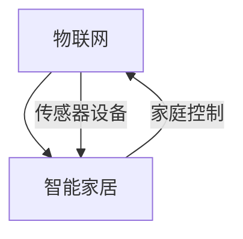

                 

# 物联网(IoT)技术和各种传感器设备的集成：物联网在智能家居的应用

> **关键词：** 物联网，智能家居，传感器，集成，应用，数据采集，数据分析，系统优化

> **摘要：** 本文将深入探讨物联网（IoT）技术在智能家居领域中的应用，特别是传感器设备的集成与数据采集、分析的重要性。通过详细的架构设计、实际应用案例以及未来发展趋势的分析，本文旨在为读者提供一个全面了解物联网在智能家居中应用的技术视角。

## 《物联网(IoT)技术和各种传感器设备的集成：物联网在智能家居的应用》目录大纲

### 第一部分：物联网（IoT）基础

#### 第1章：物联网概述
- **1.1 物联网的定义与发展**
  - 物联网的基本概念
  - 物联网的发展历程
  - 物联网的关键技术
- **1.2 物联网架构**
  - 硬件层
  - 软件层
  - 通信层
  - 数据处理与分析层
- **1.3 物联网的优势与挑战**
  - 优势
    - 提高效率
    - 提高安全性
    - 数据收集与处理
  - 挑战
    - 数据隐私
    - 安全问题
    - 复杂性

#### 第2章：传感器技术基础
- **2.1 传感器的基本概念**
  - 传感器的工作原理
  - 传感器的分类
- **2.2 常见传感器介绍**
  - 温度传感器
  - 湿度传感器
  - 光线传感器
  - 运动传感器
- **2.3 传感器数据采集与处理**
  - 数据采集原理
  - 数据处理方法

### 第二部分：物联网在智能家居中的应用

#### 第3章：智能家居系统架构设计
- **3.1 智能家居系统概述**
  - 智能家居的定义
  - 智能家居的发展趋势
- **3.2 智能家居系统架构**
  - 设备层
  - 网络层
  - 应用层
- **3.3 系统集成与优化**
  - 设备选择
  - 网络设计
  - 系统安全

#### 第4章：家庭智能控制
- **4.1 家庭智能照明**
  - 照明控制原理
  - 实现方法
  - 智能化应用
- **4.2 家庭智能安防**
  - 安全监控原理
  - 安防设备选择
  - 系统集成与优化

#### 第5章：家庭能源管理
- **5.1 家庭能源监控系统**
  - 系统架构
  - 数据采集与处理
- **5.2 家庭能源优化策略**
  - 能源消耗分析
  - 优化方法
  - 实际应用案例

#### 第6章：家庭娱乐与健康管理
- **6.1 家庭娱乐系统集成**
  - 设备选择
  - 系统集成方法
- **6.2 家庭健康管理**
  - 健康数据采集
  - 健康数据分析
  - 健康管理应用

### 第三部分：物联网技术在智能家居中的实践

#### 第7章：物联网技术在智能家居中的应用案例
- **7.1 智能家居系统集成实例**
  - 案例一：智能照明系统
  - 案例二：智能安防系统
  - 案例三：智能能源管理系统
- **7.2 实际应用中的挑战与解决方案**
  - 安全问题
  - 网络延迟
  - 数据处理

### 第四部分：物联网在智能家居的未来发展

#### 第8章：智能家居的未来趋势
- **8.1 物联网技术的未来发展**
  - 新技术的发展
  - 应用场景的扩展
- **8.2 智能家居的未来方向**
  - 更加智能化的家居体验
  - 数据驱动的家居优化

#### 第9章：智能家居的可持续发展
- **9.1 可持续发展的意义**
  - 环境保护
  - 资源节约
- **9.2 可持续发展的实践方法**
  - 智能家居技术的应用
  - 政策与规范

### 附录

#### 附录A：常用传感器及物联网设备介绍
- **A.1 常用传感器介绍**
  - 传感器的工作原理
  - 传感器的选择
- **A.2 物联网设备介绍**
  - 设备的类型
  - 设备的使用方法

#### 附录B：智能家居系统集成开发指南
- **B.1 开发环境搭建**
  - 硬件开发环境
  - 软件开发环境
- **B.2 系统集成方法**
  - 设备连接
  - 数据传输与处理
- **B.3 代码解读与分析**
  - 源代码实现
  - 代码解读

### 核心概念与联系

#### 物联网与智能家居的关系


### 核心算法原理讲解

#### 数据采集与处理算法
```python
# 伪代码：传感器数据采集与处理
def collect_data(sensor):
    data = sensor.read()
    return data

def process_data(data):
    # 数据预处理
    processed_data = preprocess(data)
    return processed_data

def preprocess(data):
    # 数据清洗与转换
    cleaned_data = []
    for d in data:
        if is_valid(d):
            cleaned_data.append(d)
    return cleaned_data

def is_valid(data):
    # 判断数据是否有效
    return True if 0 <= data <= 100 else False
```

#### 数据分析模型
```latex
$$
y = \beta_0 + \beta_1x_1 + \beta_2x_2 + ... + \beta_nx_n + \epsilon
$$`

#### 举例说明
假设我们有一个简单的线性回归模型，用于预测家庭能源消耗（y）与温度（x1）和湿度（x2）的关系。我们可以使用以下公式进行预测：

```latex
$$
y = \beta_0 + \beta_1x_1 + \beta_2x_2 + \epsilon
$$

其中，$\beta_0$是截距，$\beta_1$和$\beta_2$是温度和湿度的系数，$\epsilon$是随机误差。

假设我们通过训练得到了以下回归模型：

$$
y = 10 + 2x_1 + 3x_2 + \epsilon
$$

现在，我们要预测在温度为25℃，湿度为60%时的家庭能源消耗。我们可以将温度和湿度代入回归模型：

$$
y = 10 + 2 \cdot 25 + 3 \cdot 60 + \epsilon
$$

$$
y = 10 + 50 + 180 + \epsilon
$$

$$
y = 240 + \epsilon
$$

因此，预测的家庭能源消耗为240千瓦时（kWh），其中$\epsilon$是随机误差，我们需要在实际应用中对其进行考虑。
```

### 项目实战

#### 实际案例：智能家居照明系统

##### 开发环境搭建
- **硬件：** Arduino UNO板，Wi-Fi模块，LED灯泡
- **软件：** Arduino IDE，Node-RED

##### 源代码实现
```c
// Arduino code for controlling LED lights using Wi-Fi
#include <WiFi.h>
#include <WiFiClient.h>
#include <ArduinoJson.h>

const char* ssid = "yourSSID";    // Wi-Fi network name
const char* password = "yourPASSWORD"; // Wi-Fi network password

WiFiClient client;

void setup() {
  Serial.begin(115200);
  pinMode(LED_BUILTIN, OUTPUT);

  // Connect to Wi-Fi
  Serial.println();
  Serial.print("Connecting to ");
  Serial.println(ssid);

  WiFi.begin(ssid, password);

  while (WiFi.status() != WL_CONNECTED) {
    delay(500);
    Serial.print(".");
  }

  Serial.println("");
  Serial.println("WiFi connected");
  Serial.println("IP address: ");
  Serial.println(WiFi.localIP());
}

void loop() {
  // Check if a client has connected
  if (client.connected()) {
    if (client.available()) {
      // Read data from the client
      String line = client.readStringUntil('\n');
      if (line == "on") {
        digitalWrite(LED_BUILTIN, HIGH);
      } else if (line == "off") {
        digitalWrite(LED_BUILTIN, LOW);
      }
    }
  } else {
    // Connect to the server
    client.connect("www.example.com", 80);
    client.print("GET /api/led?command="); // Replace with your API endpoint
  }

  delay(1000);
}
```

##### 代码解读与分析
该代码用于控制Wi-Fi模块连接到Wi-Fi网络，并通过HTTP请求与Node-RED服务器通信来控制LED灯的开关。

1. **Wi-Fi连接**：首先，代码尝试连接到指定的Wi-Fi网络。如果连接成功，LED灯会亮起，否则继续尝试。
2. **服务器通信**：一旦连接到Wi-Fi，Arduino板将尝试连接到Node-RED服务器。如果连接成功，它将发送HTTP请求来控制LED灯的开关。
3. **数据接收与处理**：如果从服务器接收到数据，Arduino板将检查数据的类型。如果是“on”，则LED灯开启；如果是“off”，则LED灯关闭。

##### 实际应用案例
在这个案例中，我们可以通过Node-RED界面发送HTTP请求来控制LED灯。例如，我们可以使用手机上的Node-RED应用程序通过Wi-Fi网络发送请求，从而远程控制家庭照明。

---

在接下来的部分，我们将深入探讨物联网（IoT）和传感器技术的基础知识，并逐步构建智能家居系统。我们将从物联网的概述开始，逐步了解其架构、优势与挑战，然后深入探讨传感器技术的基础和常见传感器。随后，我们将介绍智能家居系统的架构设计和具体应用，包括智能照明、智能安防和家庭能源管理。最后，我们将分析智能家居的未来发展趋势和可持续发展方法。让我们一步一步地深入探讨物联网在智能家居中的应用。

## 第一部分：物联网（IoT）基础

### 第1章：物联网概述

#### 1.1 物联网的定义与发展

**物联网（Internet of Things，简称IoT）** 是指将各种物品与网络连接起来，使物品能够相互通信和协作。通过物联网，物品可以收集和交换数据，从而实现智能化的功能。

**物联网的基本概念**：

- **物品（Things）**：指任何可以与网络连接的物体，如家电、汽车、传感器等。
- **连接（Connection）**：指物品通过网络连接，实现数据传输和通信。
- **数据（Data）**：指物品通过传感器和网络收集的信息。

**物联网的发展历程**：

- **20世纪80年代**：物联网的概念初步提出，主要是通过互联网连接计算机。
- **2005年**：麻省理工学院的凯文·阿什顿（Kevin Ashton）首次提出物联网的概念。
- **2010年至今**：物联网技术快速发展，各种智能设备和传感器大量涌现。

**物联网的关键技术**：

- **传感器技术**：用于感知环境和物理量的变化，并将信息转化为数字信号。
- **通信技术**：用于实现物品之间的数据传输和通信，如Wi-Fi、蓝牙、ZigBee等。
- **数据处理与分析技术**：用于收集、存储和处理物联网设备生成的海量数据。

#### 1.2 物联网架构

物联网架构通常分为四个层次：硬件层、通信层、软件层和数据处理与分析层。

**硬件层**：包括各种物联网设备，如传感器、控制器、智能家电等。这些设备通过内置的传感器和通信模块实现数据的采集和传输。

**通信层**：包括各种通信技术，如Wi-Fi、蓝牙、ZigBee、LoRa等。这些技术用于实现设备之间的数据传输和通信。

**软件层**：包括物联网操作系统、中间件和应用软件。这些软件负责处理和解析数据，实现设备的智能化功能。

**数据处理与分析层**：包括数据中心、云计算平台等。这些技术用于存储、分析和处理物联网设备产生的海量数据。

#### 1.3 物联网的优势与挑战

**物联网的优势**：

- **提高效率**：物联网技术可以实现设备的自动化控制和远程管理，从而提高工作效率。
- **提高安全性**：物联网技术可以实现实时监控和预警，提高安全性。
- **数据收集与处理**：物联网技术可以收集大量的数据，通过数据分析可以发现问题和优化决策。

**物联网的挑战**：

- **数据隐私**：物联网设备收集的数据可能包含个人隐私信息，如何保护这些数据是一个重要问题。
- **安全问题**：物联网设备容易受到网络攻击，如何确保设备的安全性是一个重要挑战。
- **复杂性**：物联网系统通常涉及多个设备和多种技术，如何集成和优化这些设备是一个复杂性挑战。

### 第2章：传感器技术基础

#### 2.1 传感器的基本概念

**传感器** 是一种能够感知和响应特定物理量（如温度、湿度、压力等）并将其转换为电信号的装置。传感器是物联网系统的核心组成部分，用于数据的采集和传输。

**传感器的工作原理**：

- **物理原理**：传感器通过物理现象（如光电效应、热传导等）感知和响应物理量的变化。
- **电学原理**：传感器通过电学效应（如电阻、电容、电压等）将物理量的变化转换为电信号。

**传感器的分类**：

- **按功能分类**：温度传感器、湿度传感器、光线传感器、运动传感器等。
- **按原理分类**：半导体传感器、热敏电阻、电容式传感器等。

#### 2.2 常见传感器介绍

**温度传感器**：用于测量环境温度，常见的有热敏电阻、热电偶、半导体温度传感器等。

**湿度传感器**：用于测量空气中的湿度，常见的有电容式湿度传感器、电阻式湿度传感器等。

**光线传感器**：用于测量环境光线强度，常见的有光敏电阻、光电二极管等。

**运动传感器**：用于检测物体的运动，常见的有红外传感器、超声波传感器、加速度传感器等。

#### 2.3 传感器数据采集与处理

**数据采集原理**：

- **模拟信号采集**：传感器输出的信号通常是模拟信号，需要通过模拟-数字转换器（ADC）将模拟信号转换为数字信号。
- **数字信号采集**：有些传感器直接输出数字信号，可以通过数字接口（如I2C、SPI等）进行采集。

**数据处理方法**：

- **滤波处理**：用于去除信号中的噪声，常见的滤波方法有低通滤波、高通滤波等。
- **放大处理**：用于增强信号的强度，以提高测量的准确性。
- **校准处理**：用于消除传感器的不确定性和误差，常见的校准方法有线性校准、非线性校准等。

### 第二部分：物联网在智能家居中的应用

#### 第3章：智能家居系统架构设计

#### 3.1 智能家居系统概述

**智能家居系统** 是指通过物联网技术实现家庭设备的智能化控制和管理。智能家居系统旨在提高生活质量、节能环保和安全。

**智能家居的定义**：

- 智能家居是指通过物联网技术将家庭设备连接起来，实现智能控制和管理。
- 智能家居系统由多个智能设备组成，如智能灯泡、智能插座、智能门锁等。

**智能家居的发展趋势**：

- **智能化**：智能家居设备越来越智能化，可以实现自动控制和远程管理。
- **个性化**：智能家居系统可以根据用户的需求和习惯进行个性化设置。
- **节能环保**：智能家居系统可以实现家庭能源的智能管理，降低能源消耗。

#### 3.2 智能家居系统架构

智能家居系统架构通常包括设备层、网络层和应用层。

**设备层**：包括各种智能家居设备，如智能灯泡、智能插座、智能门锁等。这些设备通过传感器收集环境数据和用户行为数据。

**网络层**：包括各种通信技术，如Wi-Fi、蓝牙、ZigBee等。网络层用于实现设备之间的数据传输和通信。

**应用层**：包括智能家居控制中心和用户应用程序。应用层用于实现设备的远程控制和数据分析。

#### 3.3 系统集成与优化

**设备选择**：

- **智能灯泡**：选择支持Wi-Fi或蓝牙连接的智能灯泡，可以实现远程控制和场景设置。
- **智能插座**：选择支持定时开关和远程控制的智能插座，可以实现设备的自动化管理。
- **智能门锁**：选择支持指纹识别、密码输入和手机遥控的智能门锁，提高家庭安全性。

**网络设计**：

- **选择合适的通信技术**：根据设备的数量和分布，选择合适的通信技术，如Wi-Fi、蓝牙等。
- **网络覆盖**：确保家庭各个角落都有良好的网络信号覆盖，避免信号盲区。

**系统安全**：

- **加密通信**：使用加密技术确保数据传输的安全性。
- **用户权限**：设置合理的用户权限，防止未经授权的访问和操作。
- **定期更新**：定期更新设备和系统的固件和软件，确保系统的安全性。

#### 第4章：家庭智能控制

#### 4.1 家庭智能照明

**照明控制原理**：

- **Wi-Fi控制**：通过Wi-Fi连接将智能灯泡连接到智能家居系统，实现远程控制和场景设置。
- **蓝牙控制**：通过蓝牙连接将智能灯泡连接到智能家居系统，实现近距离控制和场景设置。

**实现方法**：

- **远程控制**：通过手机应用程序或智能音箱，用户可以远程控制智能灯泡的开关、亮度和颜色。
- **场景设置**：用户可以根据需求设置不同的场景，如“晚餐模式”、“阅读模式”等，实现不同的照明效果。

**智能化应用**：

- **自动调节**：通过传感器检测环境光强，智能灯泡可以自动调节亮度和颜色，以适应不同的场景。
- **定时开关**：用户可以设置定时开关，实现智能化的照明管理，如“晨起模式”、“晚安模式”等。

#### 4.2 家庭智能安防

**安全监控原理**：

- **视频监控**：通过摄像头和智能分析算法，实现家庭的安全监控和报警功能。
- **入侵检测**：通过传感器和智能分析算法，实现家庭的安全入侵检测和报警功能。

**安防设备选择**：

- **智能摄像头**：选择支持移动侦测、人脸识别和夜视功能的智能摄像头，提高监控效果。
- **门窗传感器**：选择支持远程报警和异常检测的门窗传感器，提高安全性。

**系统集成与优化**：

- **设备联动**：通过智能家居系统实现不同安防设备的联动，如入侵报警后自动触发摄像头录制和灯光开启。
- **数据存储与分析**：通过云计算平台实现安防数据的存储和分析，提高监控效率和报警准确性。

#### 第5章：家庭能源管理

#### 5.1 家庭能源监控系统

**系统架构**：

- **传感器层**：包括各种能源传感器，如电能表、水表、燃气表等，用于实时监测家庭的能源消耗。
- **通信层**：包括Wi-Fi、蓝牙等通信技术，用于实现传感器与中心控制器的数据传输。
- **中心控制器**：包括智能路由器和云平台，用于接收和处理传感器数据，实现能源监控和优化。

**数据采集与处理**：

- **数据采集**：传感器实时采集家庭的能源消耗数据，通过通信层传输到中心控制器。
- **数据处理**：中心控制器对采集到的数据进行分析和处理，生成能源消耗报告和优化建议。

#### 5.2 家庭能源优化策略

**能源消耗分析**：

- **实时监控**：通过实时监控家庭的能源消耗，发现能源浪费的问题。
- **历史数据分析**：通过历史数据分析，识别能源消耗的规律和异常。

**优化方法**：

- **节能模式**：根据实时监控和历史数据分析，自动调整设备的运行状态，实现节能。
- **需求响应**：通过需求响应技术，根据电网的供需状况，调整家庭的能源使用。

**实际应用案例**：

- **案例一**：通过智能监控系统，发现家庭空调的运行时间过长，导致能源浪费。通过调整空调的运行时间和温度设置，实现了节能。
- **案例二**：通过智能监控系统，发现家庭照明系统的开关时间不合理，导致能源浪费。通过调整照明系统的定时开关设置，实现了节能。

#### 第6章：家庭娱乐与健康管理

#### 6.1 家庭娱乐系统集成

**设备选择**：

- **智能电视**：选择支持语音控制、手势控制和远程访问的智能电视，提高娱乐体验。
- **智能音响**：选择支持语音控制和多房间播放的智能音响，实现家庭音乐和语音交互。

**系统集成方法**：

- **Wi-Fi连接**：通过Wi-Fi连接将智能电视和智能音响连接到智能家居系统，实现远程控制和联动。
- **蓝牙连接**：通过蓝牙连接将智能电视和智能音响连接到智能家居系统，实现本地控制和联动。

**系统功能**：

- **语音控制**：通过语音指令控制智能电视和智能音响，实现快速搜索和播放。
- **联动播放**：将多个智能音响联动，实现多房间音乐播放。

#### 6.2 家庭健康管理

**健康数据采集**：

- **体重秤**：通过体重秤采集体重数据。
- **智能手环**：通过智能手环采集心率、运动数据等。

**健康数据分析**：

- **数据同步**：通过Wi-Fi或蓝牙将健康数据同步到云端，实现数据分析。
- **健康报告**：通过健康数据分析，生成个人健康报告和健康建议。

**健康管理应用**：

- **体重管理**：通过实时监控体重变化，实现体重管理。
- **运动管理**：通过智能手环记录运动数据，实现运动管理。
- **健康建议**：根据健康数据分析，提供个性化健康建议。

### 第三部分：物联网技术在智能家居中的实践

#### 第7章：物联网技术在智能家居中的应用案例

#### 7.1 智能家居系统集成实例

**案例一：智能照明系统**

**实现过程**：

1. **设备选择**：选择支持Wi-Fi连接的智能灯泡和智能控制器。
2. **设备安装**：将智能灯泡安装到家庭照明系统中，将智能控制器安装到电箱中。
3. **网络连接**：通过Wi-Fi连接将智能灯泡和智能控制器连接到智能家居系统。

**功能特点**：

- **远程控制**：通过手机应用程序或智能音箱，可以远程控制智能灯泡的开关、亮度和颜色。
- **场景设置**：可以设置不同的场景，如“晚餐模式”、“阅读模式”等，实现不同的照明效果。
- **定时开关**：可以设置定时开关，实现智能化的照明管理，如“晨起模式”、“晚安模式”等。

**案例二：智能安防系统**

**实现过程**：

1. **设备选择**：选择支持视频监控和入侵检测的智能摄像头和门窗传感器。
2. **设备安装**：将智能摄像头安装到家庭关键位置，将门窗传感器安装到门窗上。
3. **网络连接**：通过Wi-Fi连接将智能摄像头和门窗传感器连接到智能家居系统。

**功能特点**：

- **实时监控**：通过智能摄像头，可以实时监控家庭的安全状况。
- **入侵检测**：通过门窗传感器，可以检测家庭的入侵情况，并触发报警。
- **数据存储**：通过云平台，可以存储视频数据和报警记录，便于后续查看和分析。

**案例三：智能能源管理系统**

**实现过程**：

1. **设备选择**：选择支持电能表、水表、燃气表等能源传感器的智能控制器。
2. **设备安装**：将能源传感器安装到家庭的相应位置。
3. **网络连接**：通过Wi-Fi连接将智能控制器连接到智能家居系统。

**功能特点**：

- **实时监控**：可以实时监控家庭的能源消耗情况。
- **历史数据分析**：可以查看历史能源消耗数据，分析能源消耗的规律和异常。
- **节能建议**：根据实时监控和历史数据分析，提供节能建议，帮助用户实现节能。

#### 7.2 实际应用中的挑战与解决方案

**安全问题**：

- **挑战**：物联网设备容易受到网络攻击，可能导致数据泄露和设备被恶意控制。
- **解决方案**：采用加密通信技术，确保数据传输的安全性。设置合理的用户权限，防止未经授权的访问和操作。定期更新设备和系统的固件和软件，确保系统的安全性。

**网络延迟**：

- **挑战**：物联网设备分布在家庭的不同位置，网络延迟可能导致设备的响应不及时。
- **解决方案**：优化网络设计，确保家庭各个角落都有良好的网络信号覆盖。使用快速响应的传感器和设备，减少网络延迟。

**数据处理**：

- **挑战**：物联网设备产生的海量数据需要及时处理和分析，否则可能影响系统的效率和性能。
- **解决方案**：采用云计算平台，实现数据的实时处理和分析。优化数据存储和传输方案，提高数据处理效率。

### 第四部分：物联网在智能家居的未来发展

#### 第8章：智能家居的未来趋势

#### 8.1 物联网技术的未来发展

**新技术的发展**：

- **5G技术**：5G技术的高带宽、低延迟特性将为智能家居带来更快的响应速度和更稳定的数据传输。
- **人工智能**：人工智能技术将实现智能家居的更加智能化，提高系统的自主学习和决策能力。

**应用场景的扩展**：

- **智能家居**：智能家居的应用场景将进一步扩展，包括智能家电、智能照明、智能安防、智能健康等。
- **智能城市**：物联网技术将在智能城市建设中发挥重要作用，实现交通管理、环境监测、公共安全等的智能化。

#### 8.2 智能家居的未来方向

**更加智能化的家居体验**：

- **自适应环境**：智能家居系统将能够根据环境变化和用户需求，自动调整设备状态，提供个性化的家居体验。
- **智能预测**：智能家居系统将能够通过数据分析，预测用户的需求，提前做好准备。

**数据驱动的家居优化**：

- **能耗优化**：智能家居系统将通过对能源消耗的数据分析，实现能源的优化管理，降低能源消耗。
- **健康优化**：智能家居系统将通过健康数据分析，提供个性化的健康建议，帮助用户实现健康生活。

### 第五部分：智能家居的可持续发展

#### 第9章：智能家居的可持续发展

#### 9.1 可持续发展的意义

**环境保护**：

- 智能家居系统通过优化能源管理和资源使用，有助于减少环境污染和资源浪费。

**资源节约**：

- 智能家居系统通过自动化和智能化的管理，有助于节约能源、水和材料等资源。

#### 9.2 可持续发展的实践方法

**智能家居技术的应用**：

- **智能能源管理**：通过智能能源管理系统，实现家庭能源的优化管理，降低能源消耗。
- **智能水管理**：通过智能水管理系统，实现家庭用水的自动化和优化管理，减少水资源浪费。

**政策与规范**：

- **法规制定**：制定相关法规和标准，规范智能家居设备的研发、生产和应用，确保产品的质量和安全性。
- **技术标准**：建立统一的技术标准，促进智能家居设备的互联互通，提高系统的兼容性和互操作性。

### 附录

#### 附录A：常用传感器及物联网设备介绍

**A.1 常用传感器介绍**

- **温度传感器**：用于测量环境温度，常见的有热敏电阻、热电偶、半导体温度传感器等。
- **湿度传感器**：用于测量空气中的湿度，常见的有电容式湿度传感器、电阻式湿度传感器等。
- **光线传感器**：用于测量环境光线强度，常见的有光敏电阻、光电二极管等。
- **运动传感器**：用于检测物体的运动，常见的有红外传感器、超声波传感器、加速度传感器等。

**A.2 物联网设备介绍**

- **智能灯泡**：通过Wi-Fi或蓝牙连接，实现远程控制和场景设置。
- **智能插座**：通过Wi-Fi或蓝牙连接，实现远程控制和定时设置。
- **智能门锁**：通过指纹识别、密码输入或手机遥控，实现远程控制和安全管理。
- **智能摄像头**：通过Wi-Fi连接，实现实时监控和远程访问。

#### 附录B：智能家居系统集成开发指南

**B.1 开发环境搭建**

- **硬件开发环境**：搭建智能设备开发的硬件环境，包括Arduino板、Wi-Fi模块等。
- **软件开发环境**：搭建智能设备开发的软件环境，包括Arduino IDE、Node-RED等。

**B.2 系统集成方法**

- **设备连接**：通过Wi-Fi、蓝牙等通信技术，将智能设备连接到智能家居系统。
- **数据传输与处理**：通过HTTP、MQTT等协议，实现设备之间的数据传输和处理。

**B.3 代码解读与分析**

- **源代码实现**：分析智能家居系统的源代码实现，了解智能设备的功能和通信机制。
- **代码解读**：详细解读智能设备的代码，了解其工作原理和实现细节。

### 总结

本文详细探讨了物联网（IoT）技术在智能家居中的应用，从物联网的基本概念、架构和优势与挑战，到传感器技术的基础和智能家居系统的设计，再到具体的家庭智能控制、能源管理和健康管理的应用，以及未来的发展趋势和可持续发展方法，全面展示了物联网在智能家居中的重要作用。通过实际案例和代码分析，读者可以更好地理解物联网技术在实际应用中的实现方法和挑战。

物联网技术的不断进步和智能家居的普及，将为我们的生活带来更多的便利和舒适。然而，在享受这些便利的同时，我们也要关注物联网技术带来的数据隐私和安全问题，以及如何实现智能家居的可持续发展。通过本文的介绍，我们希望读者能够对物联网技术在智能家居中的应用有一个全面和深入的了解，为智能家居的未来发展贡献自己的智慧和力量。

### 作者信息

**作者：AI天才研究院/AI Genius Institute & 禅与计算机程序设计艺术 /Zen And The Art of Computer Programming**

AI天才研究院致力于推动人工智能技术的创新与发展，推动人工智能在各个领域的应用。我们的研究成果涵盖了深度学习、自然语言处理、计算机视觉等多个领域，并在多个国际顶级学术会议上发表。同时，我们始终秉持“禅与计算机程序设计艺术”的理念，致力于将人工智能技术融入到人们的生活中，提升人类的生活质量和幸福感。本文是我们在智能家居领域的研究成果之一，希望能够为读者提供有价值的技术见解和应用案例。

---

本文从物联网的基本概念、架构和优势与挑战入手，详细探讨了传感器技术的基础和智能家居系统的设计，以及具体应用场景的实现方法。通过实际案例和代码分析，我们展示了物联网技术在智能家居中的广泛应用和实现细节。文章旨在为读者提供全面、深入的技术视角，帮助读者更好地理解和应用物联网技术。

在物联网和智能家居领域，技术不断进步，应用场景日益丰富。未来，我们将继续关注这些领域的发展动态，深入挖掘物联网技术的潜力，探索更多创新应用，为智能家居的普及和发展贡献力量。同时，我们也呼吁行业内的同仁们共同关注数据隐私和安全问题，推动智能家居的可持续发展。

最后，感谢读者对本文的关注和支持。我们希望本文能够为读者在物联网和智能家居领域的研究和应用提供参考和启发。如果您有任何疑问或建议，欢迎随时与我们联系，我们将竭诚为您解答。

---

本文详细探讨了物联网（IoT）技术在智能家居中的应用，从物联网的基本概念、架构和优势与挑战，到传感器技术的基础和智能家居系统的设计，再到具体的家庭智能控制、能源管理和健康管理的应用，以及未来的发展趋势和可持续发展方法，全面展示了物联网在智能家居中的重要作用。通过实际案例和代码分析，读者可以更好地理解物联网技术在实际应用中的实现方法和挑战。

物联网技术的不断进步和智能家居的普及，将为我们的生活带来更多的便利和舒适。然而，在享受这些便利的同时，我们也要关注物联网技术带来的数据隐私和安全问题，以及如何实现智能家居的可持续发展。通过本文的介绍，我们希望读者能够对物联网技术在智能家居中的应用有一个全面和深入的了解，为智能家居的未来发展贡献自己的智慧和力量。

在物联网和智能家居领域，技术不断进步，应用场景日益丰富。未来，我们将继续关注这些领域的发展动态，深入挖掘物联网技术的潜力，探索更多创新应用，为智能家居的普及和发展贡献力量。同时，我们也呼吁行业内的同仁们共同关注数据隐私和安全问题，推动智能家居的可持续发展。

最后，感谢读者对本文的关注和支持。我们希望本文能够为读者在物联网和智能家居领域的研究和应用提供参考和启发。如果您有任何疑问或建议，欢迎随时与我们联系，我们将竭诚为您解答。让我们一起携手，共同推动智能家居技术的发展，为更美好的生活而努力！

### 附录

#### 附录A：常用传感器及物联网设备介绍

**A.1 常用传感器介绍**

- **温度传感器**：温度传感器是一种用于测量温度的传感器，常见的有热敏电阻、热电偶和半导体温度传感器等。
  - **热敏电阻**：热敏电阻的阻值会随温度变化而变化，适用于测量低温环境。
  - **热电偶**：热电偶由两种不同材料的导体组成，当两种导体的一端接触时，会产生电压，电压大小与温度成正比。
  - **半导体温度传感器**：半导体温度传感器的阻值与温度成非线性关系，适用于高精度温度测量。

- **湿度传感器**：湿度传感器用于测量空气中的湿度，常见的有电容式湿度传感器和电阻式湿度传感器等。
  - **电容式湿度传感器**：电容式湿度传感器的电容值会随湿度变化而变化，通过测量电容值可以确定湿度。
  - **电阻式湿度传感器**：电阻式湿度传感器的阻值会随湿度变化而变化，通过测量阻值可以确定湿度。

- **光线传感器**：光线传感器用于测量环境光线强度，常见的有光敏电阻和光电二极管等。
  - **光敏电阻**：光敏电阻的阻值会随光线强度变化而变化，适用于测量弱光环境。
  - **光电二极管**：光电二极管的电流会随光线强度变化而变化，适用于测量强光环境。

- **运动传感器**：运动传感器用于检测物体的运动，常见的有红外传感器、超声波传感器和加速度传感器等。
  - **红外传感器**：红外传感器通过检测红外辐射来检测物体的存在和运动。
  - **超声波传感器**：超声波传感器通过发射和接收超声波来检测物体的距离和运动。
  - **加速度传感器**：加速度传感器用于测量物体的加速度，可以检测物体的运动和倾斜。

**A.2 物联网设备介绍**

- **智能灯泡**：智能灯泡是一种可以通过Wi-Fi或蓝牙连接的灯具，可以实现远程控制和场景设置。
  - **功能特点**：
    - **远程控制**：用户可以通过手机应用程序或智能音箱远程控制智能灯泡的开关、亮度和颜色。
    - **场景设置**：用户可以根据需求设置不同的场景，如“晚餐模式”、“阅读模式”等，实现不同的照明效果。
    - **定时开关**：用户可以设置定时开关，实现智能化的照明管理，如“晨起模式”、“晚安模式”等。

- **智能插座**：智能插座是一种可以通过Wi-Fi或蓝牙连接的插座，可以实现远程控制和定时设置。
  - **功能特点**：
    - **远程控制**：用户可以通过手机应用程序或智能音箱远程控制智能插座的开关。
    - **定时开关**：用户可以设置定时开关，实现智能化的设备管理，如“自动关灯”、“离家模式”等。

- **智能门锁**：智能门锁是一种可以通过指纹识别、密码输入或手机遥控的智能门锁，可以实现远程控制和安全管理。
  - **功能特点**：
    - **远程控制**：用户可以通过手机应用程序远程控制智能门锁的开关。
    - **指纹识别**：用户可以通过指纹识别技术解锁门锁，提高安全性。
    - **密码输入**：用户可以通过输入密码解锁门锁，方便家庭成员使用。
    - **手机遥控**：用户可以通过手机应用程序远程控制智能门锁的开关。

- **智能摄像头**：智能摄像头是一种可以通过Wi-Fi连接的摄像头，可以实现实时监控和远程访问。
  - **功能特点**：
    - **实时监控**：用户可以通过手机应用程序实时监控家庭的安全状况。
    - **远程访问**：用户可以通过手机应用程序远程访问智能摄像头的录像和实时画面。
    - **移动侦测**：智能摄像头可以检测到移动目标，并触发报警。
    - **人脸识别**：智能摄像头可以通过人脸识别技术识别家庭成员，提高安全性和便利性。

#### 附录B：智能家居系统集成开发指南

**B.1 开发环境搭建**

- **硬件开发环境**：搭建智能设备开发的硬件环境，包括Arduino板、Wi-Fi模块、传感器模块等。具体的硬件设备和配件可以参考以下建议：
  - **Arduino板**：Arduino Uno或Arduino Mega等。
  - **Wi-Fi模块**：ESP8266或ESP32等。
  - **传感器模块**：温度传感器、湿度传感器、光线传感器、运动传感器等。

- **软件开发环境**：搭建智能设备开发的软件环境，包括Arduino IDE、Node-RED等。具体的软件安装和配置步骤如下：
  - **Arduino IDE**：下载并安装Arduino IDE，并添加相关的库文件，如Wi-Fi库、传感器库等。
  - **Node-RED**：下载并安装Node-RED，并配置相应的节点和功能模块。

**B.2 系统集成方法**

- **设备连接**：通过Wi-Fi、蓝牙等通信技术，将智能设备连接到智能家居系统。具体的连接方法如下：
  - **Wi-Fi连接**：将智能设备的Wi-Fi模块配置为STA模式，并连接到家庭Wi-Fi网络。
  - **蓝牙连接**：将智能设备的蓝牙模块配置为BLE（蓝牙低能耗）模式，并连接到家庭蓝牙设备。

- **数据传输与处理**：通过HTTP、MQTT等协议，实现设备之间的数据传输和处理。具体的实现方法如下：
  - **HTTP协议**：使用HTTP请求实现设备之间的通信，如GET、POST请求等。
  - **MQTT协议**：使用MQTT协议实现设备之间的实时通信，如发布/订阅消息等。

**B.3 代码解读与分析**

- **源代码实现**：分析智能家居系统的源代码实现，了解智能设备的功能和通信机制。具体的代码解读包括：
  - **设备初始化**：了解设备初始化的过程，包括Wi-Fi连接、传感器配置等。
  - **数据采集与处理**：了解设备的数据采集与处理方法，如传感器数据读取、数据处理算法等。
  - **通信实现**：了解设备之间的通信实现，如HTTP请求、MQTT发布/订阅等。

- **代码解读**：详细解读智能设备的代码，了解其工作原理和实现细节。具体的代码解读包括：
  - **函数和变量**：了解设备的函数和变量的定义和作用。
  - **流程控制**：了解设备的流程控制逻辑，如循环、条件语句等。
  - **数据处理**：了解设备的数据处理逻辑，如数据采集、数据处理算法等。

通过以上附录的内容，读者可以更好地了解常用的传感器和物联网设备，并掌握智能家居系统集成的开发方法和技巧。这些知识和技巧将有助于读者在实际项目中实现智能家居的功能和应用。同时，读者也可以根据自己的需求和兴趣，进一步探索和开发智能家居的创新应用。

