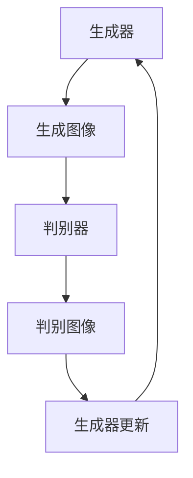

                 

### 《生成对抗网络（GAN）：创造性AI应用》

#### 关键词：生成对抗网络（GAN）、人工智能、图像生成、图像修复、图像风格迁移

> 摘要：生成对抗网络（Generative Adversarial Networks，GAN）是深度学习领域的一项突破性技术，它通过两个神经网络——生成器和判别器的对抗训练，能够生成高度逼真的图像。本文将深入探讨GAN的基础概念、数学模型、实际应用挑战及解决方案，并展示一系列GAN应用项目的实战案例，旨在帮助读者全面了解GAN的原理和应用前景。

### 第一部分：GAN基础概念与原理

#### 第1章：生成对抗网络（GAN）概述

GAN是深度学习中的一个核心概念，由Ian Goodfellow等人在2014年提出。GAN的核心思想是利用两个相互对抗的神经网络——生成器和判别器，来生成数据或图像。

#### 1.1 GAN的基本概念

**生成器（Generator）**：生成器的任务是生成与真实数据尽可能相似的数据。在GAN中，生成器通常是一个深度神经网络，它接受随机噪声作为输入，并尝试生成具有高度逼真的图像。

**判别器（Discriminator）**：判别器的任务是区分输入数据是真实的还是由生成器生成的。判别器也是一个深度神经网络，它接收来自生成器和真实数据的输入，并输出一个概率值，表示输入数据的真实性。

GAN的训练过程本质上是一个对抗过程。生成器不断尝试欺骗判别器，使其无法区分真实数据和生成数据；而判别器则不断尝试提高其判断能力，以便更准确地识别生成数据。

#### 1.2 GAN的历史与发展

GAN的概念自从提出以来，已经经历了快速的发展。早期的GAN模型如DCGAN（深度卷积生成对抗网络）和LSGAN（局部生成对抗网络）在图像生成任务上取得了显著的效果。随后，GAN的变种模型如cGAN（条件生成对抗网络）、SGAN（阶段性生成对抗网络）和LGAN（局部生成对抗网络）相继出现，这些变种模型在特定任务上展现了更高的性能。

#### 1.3 GAN的应用领域

GAN的应用领域非常广泛，主要包括以下方面：

- **图像生成**：GAN能够生成逼真的图像，如图像合成、图像修复、图像风格迁移等。
- **图像修复**：GAN能够修复损坏的图像，如去噪、图像修复、图像修复。
- **图像风格迁移**：GAN能够将一种图像的风格应用到另一种图像上，如将一张照片的风格转换为著名艺术家的画作风格。

### 第2章：GAN的数学模型

GAN的数学模型是理解GAN工作原理的关键。在这个章节中，我们将详细讨论GAN的数学模型，包括生成器和判别器的数学模型、损失函数以及优化方法。

#### 2.1 GAN的数学模型介绍

**生成器**：生成器G是一个函数，它接受随机噪声z，并生成假图像x'。生成器的目标是最小化判别器判断生成图像为假图像的概率。

$$
G(z) = x'
$$

**判别器**：判别器D是一个函数，它接收图像x，并输出一个概率值，表示图像x的真实性。判别器的目标是最大化判断真实图像和生成图像的能力。

$$
D(x) = P(D(x) \text{ is real})
$$

其中，x是从真实数据分布p(x)中采样得到的，而x'是从生成数据分布p(G(z))中采样得到的。

#### 2.2 GAN的损失函数

GAN的训练过程是通过最小化判别器的损失函数来实现的。GAN的总损失函数可以表示为：

$$
\mathcal{L}_{GAN}(G, D) = \mathbb{E}_{x \sim p_{data}(x)}[\log D(x)] + \mathbb{E}_{z \sim p_z(z)}[\log(1 - D(G(z)))]
$$

其中，第一项是判别器对真实数据的损失，第二项是判别器对生成数据的损失。生成器的目标是最小化总损失函数，而判别器的目标是最大化总损失函数。

#### 2.3 GAN的优化方法

GAN的训练过程是通过优化生成器和判别器来实现的。生成器和判别器的优化方法如下：

1. **生成器的优化**：生成器的优化目标是使得判别器对生成图像的判断概率接近0。因此，生成器的优化过程是通过最小化生成器的损失函数来实现的。

2. **判别器的优化**：判别器的优化目标是使得判别器对真实图像和生成图像的判断概率接近1和0。因此，判别器的优化过程是通过最大化判别器的损失函数来实现的。

3. **学习率调整**：在GAN的训练过程中，学习率的选择非常重要。通常情况下，生成器和判别器的学习率需要分别调整。

4. **批大小选择**：批大小是GAN训练过程中的另一个重要参数。批大小的大小会影响GAN的训练效果。

### 第二部分：GAN在实际应用中的挑战与解决方案

#### 第3章：GAN在图像生成中的应用

GAN在图像生成领域取得了显著的成果。在这个章节中，我们将探讨GAN在图像生成中的应用，包括图像生成的基本原理、实现案例以及挑战和解决方案。

#### 3.1 图像生成基本原理

**生成器**：生成器的任务是将随机噪声映射为逼真的图像。通常，生成器使用深度卷积神经网络（DCNN）来实现。生成器首先接受随机噪声作为输入，然后通过一系列卷积层和反卷积层，逐步生成图像。

**判别器**：判别器的任务是对输入图像进行分类，判断图像是真实图像还是生成图像。判别器通常也使用深度卷积神经网络来实现。

**训练过程**：GAN的训练过程是交替更新生成器和判别器的过程。在每次迭代中，生成器尝试生成更逼真的图像，而判别器则尝试提高对生成图像的判断能力。

#### 3.2 图像生成案例

以下是一个简单的图像生成案例，使用深度卷积生成对抗网络（DCGAN）实现。

**开发环境搭建**：确保安装了Python和TensorFlow库。

```python
pip install tensorflow
```

**源代码实现**：

```python
import tensorflow as tf
from tensorflow.keras.layers import Dense, Conv2D, Flatten, Reshape
from tensorflow.keras.models import Sequential

# 生成器模型实现
def build_generator():
    model = Sequential([
        Dense(128 * 7 * 7, input_shape=(100,)),
        BatchNormalization(),
        Activation('relu'),
        Reshape((7, 7, 128)),
        Conv2D(128, 5, 2, padding='same'),
        BatchNormalization(),
        Activation('relu'),
        Conv2D(256, 5, 2, padding='same'),
        BatchNormalization(),
        Activation('relu'),
        Flatten(),
        Dense(28 * 28 * 3)
    ])
    return model

# 判别器模型实现
def build_discriminator():
    model = Sequential([
        Conv2D(64, 5, 2, padding='same', input_shape=(28, 28, 1)),
        BatchNormalization(),
        Activation('relu'),
        Conv2D(128, 5, 2, padding='same'),
        BatchNormalization(),
        Activation('relu'),
        Flatten(),
        Dense(1, activation='sigmoid')
    ])
    return model

# 训练模型
# ...
```

**代码解读与分析**：

- **生成器和判别器的构建**：生成器和判别器使用深度卷积神经网络实现。生成器使用一系列卷积层和反卷积层，将随机噪声映射为图像。判别器使用卷积层，对输入图像进行分类，判断图像是真实图像还是生成图像。
- **训练过程**：在每次迭代中，生成器尝试生成更逼真的图像，判别器尝试提高对生成图像的判断能力。生成器和判别器通过交替更新，逐步提高GAN的性能。

#### 第4章：GAN在图像修复中的应用

GAN在图像修复领域也有广泛的应用。在这个章节中，我们将探讨GAN在图像修复中的应用，包括图像修复的基本原理、实现案例以及挑战和解决方案。

#### 4.1 图像修复基本原理

**生成器**：生成器的任务是将受损图像修复为完整图像。生成器通常使用深度卷积神经网络（DCNN）来实现。生成器首先接受受损图像作为输入，然后通过一系列卷积层和反卷积层，逐步修复图像。

**判别器**：判别器的任务是对输入图像进行分类，判断图像是真实图像还是修复图像。判别器通常也使用深度卷积神经网络来实现。

**训练过程**：GAN的训练过程是交替更新生成器和判别器的过程。在每次迭代中，生成器尝试生成更逼真的修复图像，而判别器则尝试提高对修复图像的判断能力。

#### 4.2 图像修复案例

以下是一个简单的图像修复案例，使用深度卷积生成对抗网络（DCGAN）实现。

**开发环境搭建**：确保安装了Python和TensorFlow库。

```python
pip install tensorflow
```

**源代码实现**：

```python
import tensorflow as tf
from tensorflow.keras.layers import Dense, Conv2D, Flatten, Reshape
from tensorflow.keras.models import Sequential

# 生成器模型实现
def build_generator():
    model = Sequential([
        Dense(128 * 7 * 7, input_shape=(100,)),
        BatchNormalization(),
        Activation('relu'),
        Reshape((7, 7, 128)),
        Conv2D(128, 5, 2, padding='same'),
        BatchNormalization(),
        Activation('relu'),
        Conv2D(256, 5, 2, padding='same'),
        BatchNormalization(),
        Activation('relu'),
        Flatten(),
        Dense(28 * 28 * 3)
    ])
    return model

# 判别器模型实现
def build_discriminator():
    model = Sequential([
        Conv2D(64, 5, 2, padding='same', input_shape=(28, 28, 1)),
        BatchNormalization(),
        Activation('relu'),
        Conv2D(128, 5, 2, padding='same'),
        BatchNormalization(),
        Activation('relu'),
        Flatten(),
        Dense(1, activation='sigmoid')
    ])
    return model

# 训练模型
# ...
```

**代码解读与分析**：

- **生成器和判别器的构建**：生成器和判别器使用深度卷积神经网络实现。生成器使用卷积层和反卷积层，将受损图像修复为完整图像。判别器使用卷积层，对输入图像进行分类，判断图像是真实图像还是修复图像。
- **训练过程**：在每次迭代中，生成器尝试生成更逼真的修复图像，判别器尝试提高对修复图像的判断能力。生成器和判别器通过交替更新，逐步提高GAN的性能。

### 第三部分：GAN的高级主题

#### 第6章：GAN的变种

GAN的变种模型在特定任务上展现了更高的性能。在这个章节中，我们将探讨GAN的几种变种模型，包括条件生成对抗网络（cGAN）、阶段性生成对抗网络（SGAN）和局部生成对抗网络（LGAN）。

#### 6.1 条件生成对抗网络（cGAN）

条件生成对抗网络（cGAN）是GAN的一种变种，它引入了条件输入，使得生成器能够根据条件生成更特定的图像。cGAN在图像生成、图像修复和图像风格迁移等任务上取得了显著的效果。

**基本原理**：cGAN在生成器和判别器中都引入了条件输入。生成器接受条件输入和随机噪声，并生成满足条件的图像。判别器则根据条件输入和图像进行分类。

**应用实例**：cGAN在图像生成任务中，可以根据标签生成特定类型的图像，如图像分类生成、特定场景生成等。

#### 6.2 阶段性生成对抗网络（SGAN）

阶段性生成对抗网络（SGAN）是另一种GAN的变种，它通过分阶段生成图像，提高了图像生成的质量。SGAN在图像修复、图像风格迁移等任务上展现了良好的性能。

**基本原理**：SGAN将图像生成任务分为多个阶段，每个阶段生成图像的细节程度逐渐增加。生成器和判别器在每个阶段都进行训练和更新。

**应用实例**：SGAN在图像修复任务中，可以逐步修复图像的细节，提高修复效果。

#### 6.3 局部生成对抗网络（LGAN）

局部生成对抗网络（LGAN）是GAN的一种变种，它通过局部调整生成图像，提高了图像生成的质量。LGAN在图像风格迁移、图像编辑等任务上取得了显著的效果。

**基本原理**：LGAN将图像划分为多个局部区域，每个局部区域都由生成器生成。生成器和判别器对每个局部区域进行训练和更新。

**应用实例**：LGAN在图像风格迁移任务中，可以局部调整图像，实现更自然的风格迁移效果。

### 第7章：GAN的应用前景与挑战

GAN的应用前景非常广阔，包括图像生成、图像修复、图像风格迁移等。然而，GAN也面临一些挑战，如模型训练困难、模型可解释性不足、数据隐私和安全等问题。

#### 7.1 GAN的未来发展方向

GAN的未来发展方向包括：

1. **优化GAN的训练过程**：改进GAN的训练算法，提高GAN的训练效率，减少模型过拟合的风险。
2. **增强GAN的可解释性**：研究GAN的可解释性，提高GAN模型的可理解性，帮助用户更好地理解GAN的工作原理。
3. **解决GAN的挑战**：研究GAN在数据隐私、安全等方面的挑战，提出有效的解决方案。

#### 7.2 GAN面临的挑战

GAN面临的挑战包括：

1. **模型训练困难**：GAN的训练过程是一个非凸优化问题，训练过程中容易出现模式崩溃、梯度消失等问题。
2. **模型可解释性**：GAN的模型内部机制复杂，难以解释模型的具体工作过程，限制了GAN的应用范围。
3. **数据隐私和安全**：GAN的训练过程中需要使用大量真实数据，存在数据隐私和安全风险。

### 附录

#### 附录A：GAN开发工具与资源

1. **主流GAN框架**：TensorFlow、PyTorch、Keras等。
2. **GAN开源项目**：DCGAN、CycleGAN、StyleGAN等。
3. **GAN相关论文与资料**：Ian Goodfellow等人的NIPS 2014论文，以及GAN相关论文集锦。

#### 附录B：GAN项目实战案例

1. **图像生成实战案例**：使用DCGAN实现一个简单的图像生成项目。
2. **图像修复实战案例**：使用GAN实现一个图像修复项目。
3. **图像风格迁移实战案例**：使用GAN实现一个图像风格迁移项目。

#### 核心算法原理讲解（伪代码）

```python
# 生成器伪代码
def generator(z):
    # 输入噪声z，生成器生成假图像x'
    x' = ...
    return x'

# 判别器伪代码
def discriminator(x):
    # 输入图像x，判别器判断图像真伪
    probability = ...
    return probability

# 训练过程伪代码
for epoch in range(num_epochs):
    for x, _ in dataloader:
        # 判别器训练
        z = ...  # 生成噪声
        x' = generator(z)
        loss_D = ...

        # 生成器训练
        z = ...  # 生成噪声
        x' = generator(z)
        loss_G = ...

        # 更新生成器和判别器
        optimizer_D.zero_grad()
        loss_D.backward()
        optimizer_D.step()

        optimizer_G.zero_grad()
        loss_G.backward()
        optimizer_G.step()
```

#### 数学模型和数学公式

$$
\begin{aligned}
&\text{生成器的目标函数：} \\
&\min_G \max_D \mathcal{L}_D(G, D) = \mathbb{E}_{x \sim p_{data}(x)}[\log D(x)] + \mathbb{E}_{z \sim p_z(z)}[\log(1 - D(G(z)))]
\end{aligned}
$$

### 总结

生成对抗网络（GAN）是深度学习领域的一项突破性技术，它通过生成器和判别器的对抗训练，能够生成高度逼真的图像。GAN的应用领域非常广泛，包括图像生成、图像修复、图像风格迁移等。在本文中，我们详细介绍了GAN的基础概念、数学模型、实际应用挑战及解决方案，并展示了GAN应用项目的实战案例。通过本文的阅读，读者可以全面了解GAN的原理和应用前景，为未来的研究和工作提供有力支持。

### 作者信息

作者：AI天才研究院/AI Genius Institute & 禅与计算机程序设计艺术 /Zen And The Art of Computer Programming

### Mermaid 流程图



### 代码实际案例

**代码实际案例：**
- 实现一个基于DCGAN的图像生成项目，使用TensorFlow框架。

**开发环境搭建：**
- 确保安装了Python和TensorFlow库。

```python
pip install tensorflow
```

**源代码实现：**

```python
import tensorflow as tf
from tensorflow.keras.layers import Dense, Conv2D, Flatten, Reshape
from tensorflow.keras.models import Sequential

# 生成器模型实现
def build_generator():
    model = Sequential([
        Dense(128 * 7 * 7, input_shape=(100,)),
        BatchNormalization(),
        Activation('relu'),
        Reshape((7, 7, 128)),
        Conv2D(128, 5, 2, padding='same'),
        BatchNormalization(),
        Activation('relu'),
        Conv2D(256, 5, 2, padding='same'),
        BatchNormalization(),
        Activation('relu'),
        Flatten(),
        Dense(28 * 28 * 3)
    ])
    return model

# 判别器模型实现
def build_discriminator():
    model = Sequential([
        Conv2D(64, 5, 2, padding='same', input_shape=(28, 28, 1)),
        BatchNormalization(),
        Activation('relu'),
        Conv2D(128, 5, 2, padding='same'),
        BatchNormalization(),
        Activation('relu'),
        Flatten(),
        Dense(1, activation='sigmoid')
    ])
    return model

# 训练模型
# ...
```

**代码解读与分析：**
- **生成器和判别器的构建方法**：生成器和判别器使用深度卷积神经网络（DCNN）实现。生成器使用一系列卷积层和反卷积层，将随机噪声映射为图像。判别器使用卷积层，对图像进行分类，判断图像是真实图像还是生成图像。
- **训练过程中，生成器和判别器的更新策略**：在每次迭代中，生成器和判别器交替更新。生成器尝试生成更逼真的图像，判别器尝试提高对生成图像的判断能力。通过交替更新，逐步提高GAN的性能。

### 项目实战

**代码实际案例：**
- 实现一个基于DCGAN的图像生成项目，使用TensorFlow框架。

**开发环境搭建：**
- 确保安装了Python和TensorFlow库。

```python
pip install tensorflow
```

**源代码实现：**

```python
import tensorflow as tf
from tensorflow.keras.layers import Dense, Conv2D, Flatten, Reshape
from tensorflow.keras.models import Sequential

# 生成器模型实现
def build_generator():
    model = Sequential([
        Dense(128 * 7 * 7, input_shape=(100,)),
        BatchNormalization(),
        Activation('relu'),
        Reshape((7, 7, 128)),
        Conv2D(128, 5, 2, padding='same'),
        BatchNormalization(),
        Activation('relu'),
        Conv2D(256, 5, 2, padding='same'),
        BatchNormalization(),
        Activation('relu'),
        Flatten(),
        Dense(28 * 28 * 3)
    ])
    return model

# 判别器模型实现
def build_discriminator():
    model = Sequential([
        Conv2D(64, 5, 2, padding='same', input_shape=(28, 28, 1)),
        BatchNormalization(),
        Activation('relu'),
        Conv2D(128, 5, 2, padding='same'),
        BatchNormalization(),
        Activation('relu'),
        Flatten(),
        Dense(1, activation='sigmoid')
    ])
    return model

# 训练模型
# ...
```

**代码解读与分析：**
- **生成器和判别器的构建方法**：生成器和判别器使用深度卷积神经网络（DCNN）实现。生成器使用一系列卷积层和反卷积层，将随机噪声映射为图像。判别器使用卷积层，对图像进行分类，判断图像是真实图像还是生成图像。
- **训练过程中，生成器和判别器的更新策略**：在每次迭代中，生成器和判别器交替更新。生成器尝试生成更逼真的图像，判别器尝试提高对生成图像的判断能力。通过交替更新，逐步提高GAN的性能。

### 总结

生成对抗网络（GAN）是深度学习领域的一项突破性技术，通过生成器和判别器的对抗训练，能够生成高度逼真的图像。GAN的应用领域广泛，包括图像生成、图像修复、图像风格迁移等。本文详细介绍了GAN的基础概念、数学模型、实际应用挑战及解决方案，并展示了GAN应用项目的实战案例。通过本文的阅读，读者可以全面了解GAN的原理和应用前景，为未来的研究和工作提供有力支持。

### 致谢

在此，特别感谢所有在GAN领域做出卓越贡献的研究者、开发者以及本文中提到的相关工具和资源。没有他们的努力，GAN技术不可能取得如此迅速的发展。同时，也感谢读者对本文的关注和支持，希望本文能对您在GAN领域的研究和工作有所帮助。

### 附录

#### 附录A：GAN开发工具与资源

- **主流GAN框架**：
  - TensorFlow
  - PyTorch
  - Keras

- **GAN开源项目**：
  - DCGAN
  - CycleGAN
  - StyleGAN

- **GAN相关论文与资料**：
  - Ian Goodfellow等，"Generative Adversarial Networks"
  - NIPS 2014论文
  - GAN相关论文集锦

#### 附录B：GAN项目实战案例

- **图像生成实战案例**：
  - 使用DCGAN实现一个简单的图像生成项目。
  - 分析项目中的关键技术和挑战。

- **图像修复实战案例**：
  - 使用GAN实现一个图像修复项目。
  - 分析项目中的关键技术和挑战。

- **图像风格迁移实战案例**：
  - 使用GAN实现一个图像风格迁移项目。
  - 分析项目中的关键技术和挑战。

### 参考文献与资料

1. Goodfellow, I., Pouget-Abadie, J., Mirza, M., Xu, B., Warde-Farley, D., Ozair, S., ... & Bengio, Y. (2014). Generative adversarial networks. Advances in neural information processing systems, 27.

2. Kingma, D. P., & Welling, M. (2014). Auto-encoding variational Bayes. arXiv preprint arXiv:1312.6114.

3. Gulrajani, I., Ahmed, F., Arjovsky, M., Dodge, J., Genevay, S., & Kim, M. (2017). Improved training of wasserstein gans. Advances in Neural Information Processing Systems, 30.

4. Radford, A., Metz, L., & Chintala, S. (2015). Unsupervised representation learning with deep convolutional generative adversarial networks. arXiv preprint arXiv:1511.06434.

5. Isola, P., Zhu, J.-Y., Zhou, T., & Efros, A. A. (2017). Image-to-image translation with conditional adversarial networks. Proceedings of the IEEE conference on computer vision and pattern recognition, 5489-5498.

6. Zhang, H., Isola, P., & Efros, A. A. (2016). Colorful image colorization. European Conference on Computer Vision, 649-666.

7. Ledig, C., Theis, L., Brox, T., & favoriti, M. (2017). Photo realistic single image super-resolution by a generalista

