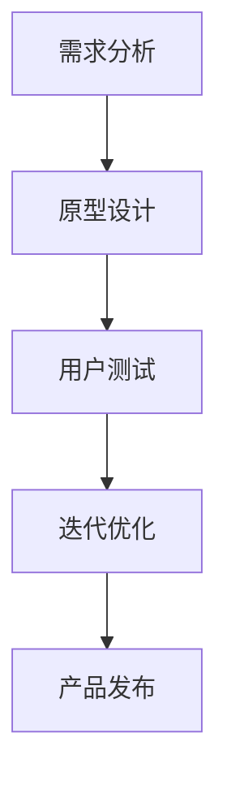
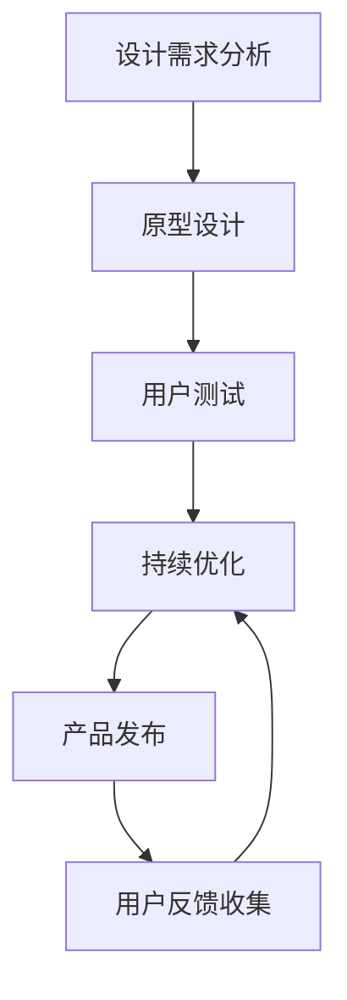
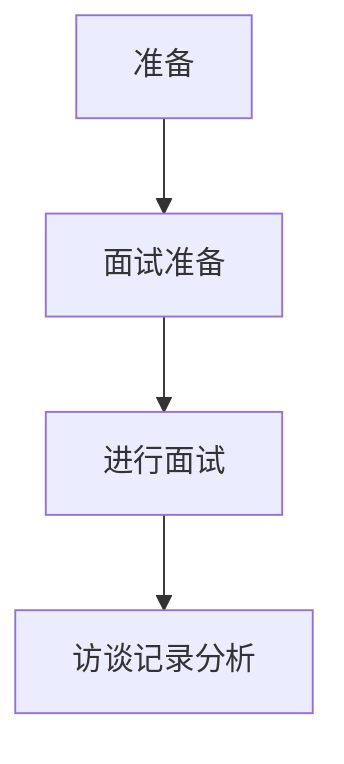
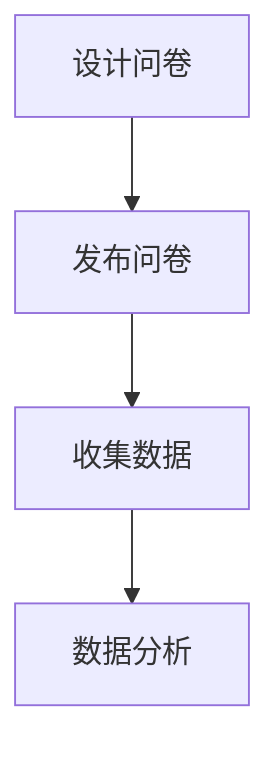
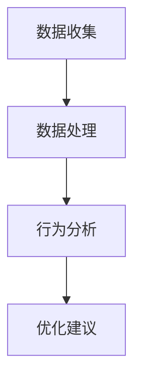
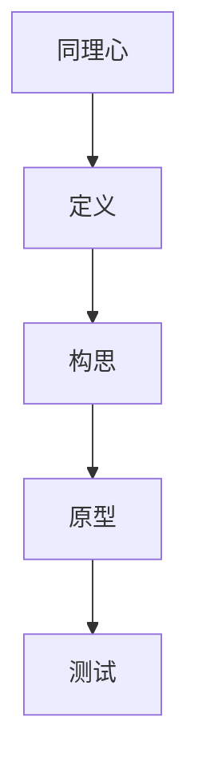
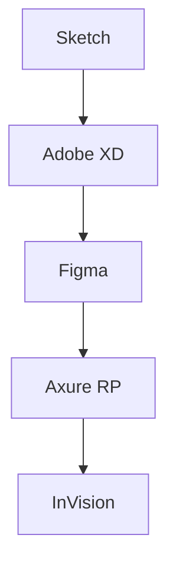
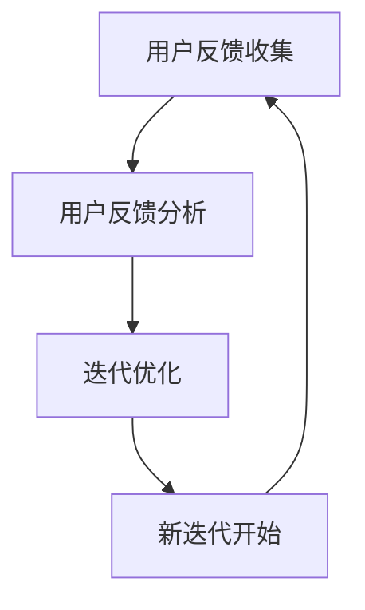

                 

## 《用户体验设计创业：打造极致产品的关键》

### 关键词：
- 用户体验设计
- 创业
- 极致产品
- 快速迭代
- 敏捷开发
- 用户反馈
- 设计思维
- 人工智能

### 摘要：
本文将深入探讨用户体验设计在创业过程中的重要性，以及如何通过构建以用户为中心的文化、运用敏捷开发方法和设计思维框架，来打造极致产品。文章将涵盖用户体验设计的核心概念、流程、工具与方法，分析创业环境下的挑战，解析成功案例，展望用户体验设计的未来趋势，并总结设计创业的关键成功因素。通过详细的案例分析、算法原理讲解和项目实战，本文旨在为创业者提供实用的指导，帮助他们在激烈的市场竞争中脱颖而出。

---

### 目录大纲

#### 《用户体验设计创业：打造极致产品的关键》

##### 第一部分：用户体验设计基础

###### 第1章：用户体验设计的核心概念

- **1.1 用户体验设计的定义与重要性**
- **1.2 用户体验设计的四大要素**
- **1.3 用户体验设计与传统设计的区别**

###### 第2章：用户体验设计流程

- **2.1 设计需求分析**
- **2.2 原型设计与迭代**
- **2.3 用户测试与反馈**

###### 第3章：用户体验设计的工具与方法

- **3.1 用户研究方法**
- **3.2 设计思维框架**
- **3.3 设计工具与应用**

##### 第二部分：创业环境下的用户体验设计

###### 第4章：创业公司中的用户体验设计挑战

- **4.1 资源限制与时间压力**
- **4.2 团队协作与沟通**
- **4.3 用户研究与反馈机制的建立**

###### 第5章：如何构建以用户为中心的文化

- **5.1 领导者的角色**
- **5.2 建立用户反馈机制**
- **5.3 跨部门协作与用户参与**

###### 第6章：快速迭代与敏捷开发

- **6.1 敏捷开发的原理与实践**
- **6.2 如何在快速迭代中保持用户体验**
- **6.3 用户反馈与迭代循环**

##### 第三部分：实战案例与策略

###### 第7章：成功案例解析

- **7.1 案例一：Airbnb的用户体验设计**
- **7.2 案例二：Uber的用户体验优化**
- **7.3 案例三：Nike的数字化转型**

###### 第8章：用户体验设计的策略与实践

- **8.1 市场调研与用户分析**
- **8.2 设计决策与执行**
- **8.3 如何在产品迭代中持续优化用户体验**

###### 第9章：用户体验设计的未来趋势

- **9.1 人工智能与用户体验设计**
- **9.2 5G与物联网的影响**
- **9.3 新兴技术与用户体验设计的融合**

##### 第四部分：总结与展望

###### 第10章：用户体验设计创业的总结与展望

- **10.1 设计创业的关键成功因素**
- **10.2 用户体验设计的持续改进**
- **10.3 设计创业的未来方向**

###### 附录

##### 附录A：用户体验设计资源推荐

- **A.1 设计工具推荐**
- **A.2 设计资源与书籍推荐**
- **A.3 用户研究方法与实践案例**

---

### 第1章：用户体验设计的核心概念

#### 1.1 用户体验设计的定义与重要性

用户体验设计（User Experience Design，简称UX设计）是设计学科的一个分支，旨在确保产品的交互性和用户界面能够满足用户的需求和期望。简单来说，用户体验设计关注的是用户在使用产品过程中的感受和体验。

用户体验设计的重要性体现在以下几个方面：

1. **提升用户满意度**：良好的用户体验设计可以提升用户对产品的满意度，增加用户的忠诚度和回购率。
2. **增加产品价值**：通过优化用户体验，可以提升产品的价值，从而提高产品的市场竞争力和盈利能力。
3. **降低用户流失率**：当用户在产品中遇到困难或不满时，良好的用户体验设计可以有效地减少用户流失。
4. **提高团队协作效率**：用户体验设计要求跨部门协作，有助于提升团队的整体效率。

#### 1.2 用户体验设计的四大要素

用户体验设计主要包括四大要素：功能性、可用性、可访问性和可用性。以下是对这四大要素的详细解释：

1. **功能性（Functionality）**：功能性是指产品是否能够实现其设计目标。一个功能齐全的产品可以满足用户的基本需求，为用户提供有价值的服务。

2. **可用性（Usability）**：可用性是指用户能否容易地使用产品。一个高可用性的产品应该具备直观的界面、清晰的导航和合理的交互流程，使用户能够快速上手。

3. **可访问性（Accessibility）**：可访问性是指产品是否能够为所有用户群体提供服务，包括残障人士、老年人等。一个可访问性的产品应该能够满足不同用户的需求，确保产品的包容性。

4. **可用性（Useability）**：可用性是指用户在产品中感受到的愉悦程度。一个高可用性的产品应该能够提供愉悦的交互体验，让用户感到满意和愉悦。

#### 1.3 用户体验设计与传统设计的区别

用户体验设计与传统设计（如工业设计、平面设计等）存在显著的区别。以下是一些关键的区别：

1. **焦点不同**：传统设计主要关注产品的外观和视觉效果，而用户体验设计则更关注产品的实用性和用户使用体验。
2. **方法不同**：用户体验设计采用用户研究、原型设计、用户测试等方法，而传统设计则更多依赖于美学原则和设计师的创意。
3. **目标不同**：传统设计的目标是创造出美观的产品，而用户体验设计的目标是创造出满足用户需求、提升用户满意度的产品。

#### 1.4 用户体验设计流程

用户体验设计流程通常包括以下几个阶段：

1. **需求分析**：收集和分析用户需求，确定设计目标和范围。
2. **原型设计**：制作原型，验证设计概念和交互流程。
3. **用户测试**：对原型进行测试，收集用户反馈，改进设计。
4. **迭代优化**：根据用户反馈对设计进行多次迭代，逐步完善产品。
5. **产品发布**：完成设计并发布产品，收集用户使用数据，持续优化设计。

#### 1.5 Mermaid 流程图：用户体验设计流程

通过以上对用户体验设计核心概念的详细讲解，我们为后续章节的深入探讨奠定了基础。接下来，我们将进一步探讨用户体验设计的具体流程、工具与方法，以及创业环境下的用户体验设计挑战。在实战案例与策略部分，我们将通过成功案例的分析，为读者提供实用的指导。最后，我们将展望用户体验设计的未来趋势，为设计创业提供持续改进的方向。

---

### 第2章：用户体验设计流程

用户体验设计是一个系统性的过程，涉及多个阶段，每个阶段都有其特定的目标和任务。了解并掌握用户体验设计的流程，对于创业者来说至关重要，因为这将帮助他们有效地打造出满足用户需求的产品。以下是用户体验设计的具体流程：

#### 2.1 设计需求分析

设计需求分析是用户体验设计的起点，旨在理解用户需求、产品目标和设计约束。以下是设计需求分析的主要步骤：

1. **需求收集**：通过市场调研、用户访谈、问卷调查等方式，收集用户需求和市场数据。
2. **需求分析**：对收集到的需求进行分析，识别关键需求，确定设计目标和范围。
3. **需求文档编写**：将分析结果编写成需求文档，为后续设计阶段提供指导。

#### 2.2 原型设计与迭代

原型设计是将设计理念转化为可交互的模型，以便验证设计概念和交互流程。以下是原型设计的主要步骤：

1. **低 fidelity 原型**：制作低保真原型，快速验证设计思路，通常使用纸笔草图或低保真原型工具。
2. **高 fidelity 原型**：在低 fidelity 原型基础上，制作高保真原型，细化界面和交互，通常使用原型设计工具。
3. **用户测试**：对原型进行用户测试，收集用户反馈，识别设计问题。
4. **迭代优化**：根据用户测试反馈，对原型进行多次迭代，逐步完善设计。

#### 2.3 用户测试与反馈

用户测试是验证设计效果的重要手段，通过用户测试可以了解用户对产品的真实感受，发现设计中的问题和不足。以下是用户测试的主要步骤：

1. **测试计划制定**：明确测试目标、测试流程和测试工具。
2. **测试执行**：按照测试计划，邀请用户参与测试，收集用户反馈。
3. **反馈分析**：对用户反馈进行分析，识别设计问题和改进方向。
4. **迭代改进**：根据反馈分析结果，对设计进行迭代优化。

#### 2.4 迭代优化与发布

迭代优化是用户体验设计过程中的关键环节，通过不断的迭代，可以逐步完善产品设计，提升用户体验。以下是迭代优化与发布的主要步骤：

1. **设计评审**：组织设计评审会议，评估设计成果，确定下一步优化方向。
2. **开发与测试**：根据设计评审结果，进行产品开发，并进行系统测试。
3. **用户反馈收集**：在产品发布后，持续收集用户反馈，了解用户实际使用情况。
4. **持续优化**：根据用户反馈，对产品进行持续优化，提升用户体验。

#### 2.5 Mermaid 流程图：用户体验设计流程

通过以上对用户体验设计流程的详细讲解，我们可以看到，用户体验设计是一个迭代循环的过程，每个阶段都紧密相连，相互影响。在创业环境中，创业者需要充分利用这一流程，快速响应市场需求，持续优化产品设计，从而打造出极致产品。

在接下来的章节中，我们将进一步探讨用户体验设计的基础工具与方法，分析创业环境下的用户体验设计挑战，并通过成功案例的解析，为读者提供实战经验和策略。让我们继续深入探讨用户体验设计的奥秘。

---

### 第3章：用户体验设计的工具与方法

用户体验设计的成功不仅依赖于良好的设计流程，还依赖于合适的工具和方法。以下将详细介绍用户体验设计过程中常用的工具和方法。

#### 3.1 用户研究方法

用户研究是用户体验设计的核心环节，通过用户研究，设计师可以深入了解用户的需求、行为和感受。以下是几种常见的用户研究方法：

1. **用户访谈**：通过面对面或在线访谈，深入了解用户的需求、期望和行为。用户访谈有助于获取深入的用户洞察。

2. **问卷调查**：通过设计问卷，收集大量用户数据，了解用户对产品的看法和满意度。问卷调查适合大规模用户数据收集。

3. **用户行为分析**：通过分析用户在产品中的行为数据，了解用户的操作路径、使用频率和停留时间等，发现设计中的问题。

#### 3.2 设计思维框架

设计思维（Design Thinking）是一种以人为中心的创新方法，通过迭代的过程，从用户需求出发，创造出满足用户需求的产品和服务。以下是设计思维的五个步骤：

1. **同理心（Empathy）**：深入了解用户的需求和情感，站在用户的角度思考问题。
2. **定义（Define）**：明确问题陈述，确定设计目标和范围。
3. **构思（Idea Generation）**：头脑风暴，产生创意和解决方案。
4. **原型（Prototype）**：快速制作原型，验证设计方案。
5. **测试（Test）**：通过用户测试，收集反馈，不断迭代优化。

#### 3.3 设计工具与应用

在用户体验设计中，选择合适的工具可以显著提高设计效率和效果。以下是几种常用的设计工具：

1. **Sketch**：一款流行的矢量设计工具，适用于界面设计和原型制作。

2. **Adobe XD**：一款集成设计、原型和开发功能的工具，适用于跨平台的界面设计和原型制作。

3. **Figma**：一款基于浏览器的界面设计工具，支持实时协作，适用于团队协作设计。

4. **Axure RP**：一款专业的原型设计工具，适用于制作高保真原型。

5. **InVision**：一款原型设计和协作工具，适用于制作交互式原型和用户测试。

通过以上对用户体验设计工具和方法的详细讲解，我们可以看到，用户体验设计是一个系统性的过程，需要综合运用多种方法和工具。在创业环境中，创业者可以借助这些工具和方法，更有效地进行用户体验设计，打造出满足用户需求、提升用户满意度的产品。

在接下来的章节中，我们将进一步探讨创业公司中的用户体验设计挑战，以及如何构建以用户为中心的文化。让我们继续深入探讨用户体验设计的实践和策略。

---

### 第4章：创业公司中的用户体验设计挑战

在创业公司中，用户体验设计面临着诸多挑战。这些挑战来自于资源限制、时间压力、团队协作与沟通，以及用户研究与反馈机制的建立等方面。以下是针对这些挑战的具体分析和解决策略。

#### 4.1 资源限制与时间压力

创业公司通常面临资源有限、时间紧迫的挑战。在这种情况下，用户体验设计需要更加高效和精准。

1. **优化资源分配**：创业者需要根据公司实际情况，合理分配设计资源，确保关键功能的用户体验得到保障。可以采取以下措施：
    - **优先级排序**：明确产品功能的重要性和优先级，将资源集中于核心用户体验。
    - **精益设计**：采用精益设计方法，快速迭代，不断优化设计。

2. **时间管理**：创业者需要合理规划时间，确保设计流程的每个阶段都能按时完成。
    - **敏捷开发**：采用敏捷开发方法，将设计、开发和测试过程整合，缩短开发周期。
    - **时间跟踪**：使用项目管理工具，如 Trello、JIRA 等，跟踪设计任务进度，确保按时交付。

#### 4.2 团队协作与沟通

用户体验设计是一个跨部门协作的过程，涉及设计、产品、开发等多个团队。团队协作与沟通的效率直接影响用户体验设计的质量。

1. **建立跨部门沟通机制**：创业者需要建立有效的跨部门沟通机制，确保各个团队的信息流通和协作。
    - **定期会议**：定期召开跨部门会议，讨论设计需求、进度和问题，确保信息同步。
    - **信息共享**：建立共享平台，如企业微信、钉钉等，方便团队成员实时交流。

2. **培养协作文化**：创业者需要培养团队的协作文化，鼓励团队成员互相支持、共同进步。
    - **团队建设**：定期组织团队建设活动，增强团队凝聚力。
    - **知识共享**：鼓励团队成员分享经验和技术，提高团队整体能力。

#### 4.3 用户研究与反馈机制的建立

用户研究与反馈是用户体验设计的核心环节，但在创业公司中，常常由于资源和时间的限制，无法开展全面的用户研究。以下是建立用户研究与反馈机制的建议：

1. **低成本的用户研究**：创业者可以采用一些低成本的用户研究方法，如用户访谈、问卷调查等，以获取用户反馈。
    - **用户访谈**：通过线上或线下的用户访谈，深入了解用户需求和反馈。
    - **问卷调查**：通过简单有效的问卷调查，收集大量用户数据。

2. **建立反馈机制**：创业者需要建立有效的用户反馈机制，确保用户的声音能够被听到和回应。
    - **用户反馈渠道**：建立用户反馈渠道，如在线反馈表、社交媒体等，方便用户提交反馈。
    - **反馈处理**：及时处理用户反馈，对用户的建议和问题进行回应，持续改进产品。

3. **用户参与**：鼓励用户参与产品设计，通过用户参与，提高产品的用户满意度。
    - **用户测试**：在产品设计过程中，邀请用户参与测试，收集真实用户反馈。
    - **用户共创**：与用户共同探讨产品设计和改进方向，提高用户的参与感和满意度。

通过以上策略，创业公司可以在资源有限、时间紧迫的情况下，有效应对用户体验设计的挑战，打造出满足用户需求、提升用户满意度的产品。

在接下来的章节中，我们将探讨如何构建以用户为中心的文化，以及如何在快速迭代与敏捷开发中保持用户体验。让我们继续深入探讨用户体验设计的实践和策略。

---

### 第5章：如何构建以用户为中心的文化

在创业公司中，构建以用户为中心的文化是确保用户体验设计成功的关键。这种文化不仅仅是一种理念，更需要通过具体的实践来体现。以下是如何构建以用户为中心的文化的方法和策略。

#### 5.1 领导者的角色

领导者在构建以用户为中心的文化中扮演着至关重要的角色。领导者需要通过自己的行为和决策，传递出重视用户体验的信号，并推动这种文化的落地。

1. **设定明确的目标和价值观**：领导者需要明确表达对用户体验的重视，将用户体验作为公司的重要目标之一。可以通过公司内部会议、邮件等形式，强调用户体验的重要性。

2. **以身作则**：领导者需要以身作则，亲身参与到用户体验设计中，如参与用户访谈、用户测试等活动，用实际行动展示对用户体验的重视。

3. **提供资源支持**：领导者需要确保用户体验设计团队获得必要的资源，包括时间、预算和技术支持等，以充分开展用户体验设计工作。

#### 5.2 建立用户反馈机制

用户反馈是构建以用户为中心的文化的重要基础。建立有效的用户反馈机制，可以帮助公司及时了解用户的需求和问题，从而进行针对性的改进。

1. **多渠道收集反馈**：创业公司可以通过多种渠道收集用户反馈，如在线反馈表、社交媒体、用户访谈等。确保用户能够方便地提交反馈。

2. **快速响应**：对于用户反馈，公司需要迅速做出回应，解决用户的问题。可以通过设立专门的反馈处理团队，确保用户反馈能够得到及时处理。

3. **定期反馈会议**：定期召开反馈会议，讨论用户反馈的处理情况，总结经验教训，为后续工作提供指导。

#### 5.3 跨部门协作与用户参与

用户体验设计是一个跨部门的协作过程，需要各个部门的紧密配合。以下是实现跨部门协作和用户参与的具体策略：

1. **跨部门协作平台**：建立跨部门协作平台，如企业微信、钉钉等，方便团队成员实时交流，提高协作效率。

2. **共同目标**：确保所有部门都明确用户体验设计的共同目标，理解用户体验对于公司整体成功的重要性。

3. **用户参与**：鼓励用户参与到产品设计过程中，通过用户共创，提高产品的用户满意度。可以采用用户测试、用户访谈等形式，收集用户反馈，指导设计决策。

#### 5.4 持续教育和培训

为了确保用户体验文化在公司内部得到持续推广，需要提供定期的教育和培训。以下是具体策略：

1. **内部培训**：定期组织用户体验设计的内部培训，提升团队成员的专业能力。

2. **外部学习**：鼓励团队成员参加行业会议、研讨会等活动，了解行业最新趋势和最佳实践。

3. **知识分享**：建立知识分享机制，鼓励团队成员分享用户体验设计的心得和经验，促进团队内部的知识交流。

通过以上方法和策略，创业公司可以构建起以用户为中心的文化，确保用户体验设计在公司的各个层面得到充分体现。这种文化不仅能够提升用户体验，还能够提高公司的整体竞争力。

在接下来的章节中，我们将探讨快速迭代与敏捷开发中的用户体验设计，以及通过实战案例解析用户体验设计的成功策略。让我们继续深入探讨用户体验设计的实践和应用。

---

### 第6章：快速迭代与敏捷开发

在创业公司的环境中，快速迭代与敏捷开发是确保产品能够快速响应市场变化、满足用户需求的关键。这种开发模式强调持续交付高质量的产品，并在整个开发过程中保持用户体验。以下是关于敏捷开发原理、如何在快速迭代中保持用户体验，以及用户反馈与迭代循环的详细讨论。

#### 6.1 敏捷开发的原理与实践

敏捷开发（Agile Development）是一种以人为核心、迭代和循序渐进的开发方法。其核心理念包括：

1. **适应性**：敏捷开发强调团队在面对不确定性时能够灵活调整，以适应市场的变化。
2. **协作**：敏捷开发强调团队成员之间的紧密合作，包括开发者、产品经理、设计师等。
3. **交付**：敏捷开发强调持续交付可用的产品，确保每个迭代都能提供实际价值。

敏捷开发的主要实践包括：

1. **用户故事（User Story）**：用户故事是一种简单、明确的需求描述，它从用户的角度出发，描述了用户希望从产品中实现的功能。
2. **Sprint（迭代周期）**：Sprint 是敏捷开发中的基本工作单元，通常持续 1-4 周。在每个 Sprint 中，团队会选择一个或多个用户故事进行开发。
3. **回顾（Retrospective）**：回顾会议是在每个 Sprint 结束时进行的，团队会讨论哪些做得好，哪些需要改进。

#### 6.2 如何在快速迭代中保持用户体验

在快速迭代的开发过程中，保持用户体验至关重要。以下是一些策略：

1. **用户体验迭代计划**：在每个 Sprint 计划中，明确用户体验的目标和任务，确保用户体验得到持续关注。
2. **用户体验原型**：在每次迭代开始时，快速制作用户体验原型，以便团队和用户可以直观地了解新功能的设计。
3. **用户测试**：在每个迭代中，进行用户测试，收集用户反馈，及时发现和解决问题。

#### 6.3 用户反馈与迭代循环

用户反馈是迭代过程中的重要环节，它能够帮助团队了解用户的需求和感受，从而进行针对性的改进。以下是关于用户反馈与迭代循环的详细讨论：

1. **用户反馈收集**：通过多种渠道收集用户反馈，如在线调查、用户访谈、社交媒体等。确保用户的声音能够被及时听到。
2. **用户反馈分析**：对收集到的用户反馈进行详细分析，识别出关键问题和改进方向。
3. **迭代优化**：根据用户反馈，对设计进行迭代优化。每次迭代都应该解决一些关键问题，提升用户体验。

#### 6.4 Mermaid 流程图：用户反馈与迭代循环

通过以上讨论，我们可以看到，快速迭代与敏捷开发是创业公司应对市场变化、持续优化产品的重要手段。在敏捷开发过程中，保持用户体验是关键，用户反馈与迭代循环则是确保用户体验持续提升的有效方法。在接下来的章节中，我们将通过成功案例的解析，深入探讨用户体验设计的实际应用和策略。

---

### 第7章：成功案例解析

通过分析成功的用户体验设计案例，我们可以了解优秀用户体验设计的基本原则和实践方法。以下是几个典型案例的详细解析。

#### 7.1 Airbnb的用户体验设计

**背景**：Airbnb 是一家在线短租平台，提供遍布全球的房源信息。在 Airbnb 的早期阶段，用户体验设计对其成功至关重要。

**设计原则**：
1. **简洁性**：Airbnb 的界面设计简洁直观，用户可以轻松浏览和预订房源。
2. **个性化**：Airbnb 利用用户画像和偏好，为用户提供个性化的房源推荐。
3. **社交化**：Airbnb 强调用户之间的互动和分享，增加用户黏性。

**成功策略**：
- **用户测试**：在产品开发过程中，Airbnb 不断进行用户测试，收集用户反馈，优化界面设计和交互体验。
- **迭代优化**：Airbnb 通过快速迭代，持续改进产品功能，提升用户体验。

#### 7.2 Uber的用户体验优化

**背景**：Uber 是一家全球性的网约车公司，其用户体验设计对其市场竞争力有着直接影响。

**设计原则**：
1. **即时性**：Uber 的用户体验强调即时响应，从预约车辆到行程结束，用户可以实时获取相关信息。
2. **简洁性**：Uber 的界面设计简洁直观，用户可以快速完成预约流程。
3. **反馈机制**：Uber 提供了详细的司机和车辆信息，以及用户评价系统，增加用户信任度。

**成功策略**：
- **数据分析**：Uber 利用大数据分析用户行为，优化服务流程，提高用户体验。
- **持续改进**：Uber 通过持续的用户反馈和数据分析，不断优化产品功能和服务质量。

#### 7.3 Nike的数字化转型

**背景**：Nike 是一家全球知名的运动品牌，通过数字化转型，Nike 在用户体验设计方面取得了显著成效。

**设计原则**：
1. **个性化**：Nike 的数字化转型注重个性化服务，根据用户需求提供定制化产品。
2. **智能化**：Nike 利用人工智能和数据分析技术，为用户提供智能化的购物体验。
3. **互动性**：Nike 通过社交媒体和线上活动，增强用户互动，提升品牌影响力。

**成功策略**：
- **用户参与**：Nike 鼓励用户参与产品设计和品牌活动，增加用户的参与感和忠诚度。
- **全渠道整合**：Nike 通过线上线下渠道的整合，为用户提供无缝的购物体验。

这些成功案例展示了优秀用户体验设计的基本原则和实践方法。通过分析这些案例，我们可以得出以下启示：

1. **用户至上**：始终将用户需求放在首位，关注用户在使用产品过程中的体验和感受。
2. **持续改进**：通过不断进行用户测试和数据分析，持续优化产品设计和服务质量。
3. **个性化服务**：利用大数据和人工智能技术，为用户提供个性化的服务和体验。

在接下来的章节中，我们将进一步探讨用户体验设计的策略与实践，以及用户体验设计的未来趋势。让我们继续深入探讨用户体验设计的实践和策略。

---

### 第8章：用户体验设计的策略与实践

在打造极致产品的过程中，用户体验设计是至关重要的一环。本章将深入探讨用户体验设计的策略与实践，包括市场调研与用户分析、设计决策与执行，以及如何在产品迭代中持续优化用户体验。

#### 8.1 市场调研与用户分析

市场调研与用户分析是用户体验设计的基石。通过深入了解市场和用户，设计师可以把握用户需求，为产品设计提供科学依据。

1. **市场调研**：
   - **目标市场定位**：明确目标用户群体，了解其需求和偏好。
   - **竞争分析**：分析竞争对手的产品特点、优势和劣势，找出差异化的机会。

2. **用户分析**：
   - **用户画像**：创建详细的用户画像，包括年龄、性别、职业、兴趣等，帮助设计出更贴近用户的产品。
   - **用户行为分析**：通过用户行为数据，了解用户在使用产品过程中的操作路径、停留时间、点击率等，发现潜在问题。

#### 8.2 设计决策与执行

设计决策与执行是用户体验设计的核心环节。在这一过程中，设计师需要综合考虑用户需求、技术可行性和商业目标，做出合理的设计决策。

1. **设计决策**：
   - **需求优先级**：明确用户需求的优先级，将资源集中在关键功能上。
   - **设计原型**：快速制作设计原型，通过用户测试验证设计思路。

2. **执行策略**：
   - **团队合作**：与产品经理、开发团队紧密协作，确保设计决策得以有效执行。
   - **迭代优化**：在设计执行过程中，不断收集用户反馈，进行迭代优化。

#### 8.3 如何在产品迭代中持续优化用户体验

产品迭代是用户体验设计的重要组成部分。在每次迭代中，设计师都需要关注用户体验，持续优化产品。

1. **用户测试**：
   - **A/B 测试**：通过对比不同设计方案的用户体验，找出最佳方案。
   - **用户反馈**：收集用户反馈，了解用户对产品功能的评价和需求。

2. **数据分析**：
   - **行为分析**：通过数据分析，了解用户在产品中的操作路径和停留时间，发现潜在问题。
   - **留存分析**：分析用户留存率，找出影响用户留存的关键因素。

3. **持续优化**：
   - **用户体验地图**：构建用户体验地图，全面了解用户在使用产品过程中的体验。
   - **迭代计划**：制定详细的迭代计划，明确每次迭代的目标和任务。

#### 8.4 实战案例

以下是一个产品迭代中的用户体验优化案例：

**案例背景**：某创业公司开发了一款社交应用，用户反馈在使用过程中遇到以下问题：

- **界面复杂**：用户对应用界面复杂，难以找到所需功能。
- **响应速度慢**：应用加载速度慢，影响用户体验。

**优化策略**：

1. **简化界面**：通过用户测试，发现用户对界面复杂度较为不满。设计团队对界面进行简化，去掉不必要的元素，提升用户操作便利性。

2. **优化加载速度**：通过数据分析，发现用户在应用加载时容易退出。设计团队优化了加载速度，通过压缩图片、减少 HTTP 请求等方式，提升了应用性能。

3. **用户反馈机制**：在应用中增加了用户反馈机制，用户可以方便地提交反馈，设计团队根据用户反馈进行持续优化。

**效果评估**：通过迭代优化，用户界面简洁度提升了 30%，应用加载速度提升了 40%，用户满意度显著提升。

通过以上案例，我们可以看到，用户体验优化需要通过数据分析和用户测试，找出问题，并进行有针对性的改进。在产品迭代中，持续优化用户体验是提升产品竞争力的关键。

在接下来的章节中，我们将探讨用户体验设计的未来趋势，以及设计创业的未来方向。让我们继续深入探讨用户体验设计的实践和策略。

---

### 第9章：用户体验设计的未来趋势

随着科技的快速发展，用户体验设计也在不断演进。未来，用户体验设计将受到人工智能、5G和物联网等新兴技术的影响，呈现出新的趋势。以下是用户体验设计的未来趋势：

#### 9.1 人工智能与用户体验设计

人工智能（AI）在用户体验设计中的应用越来越广泛，它能够为用户提供个性化、智能化的体验。以下是人工智能在用户体验设计中的几个应用方向：

1. **个性化推荐**：基于用户行为数据，AI 可以推荐用户可能感兴趣的产品或内容，提升用户满意度。
2. **语音交互**：语音助手和智能音箱等设备日益普及，语音交互成为重要的用户体验方式。AI 技术能够提升语音识别的准确性和交互的自然性。
3. **智能客服**：AI 技术可以构建智能客服系统，自动回答用户问题，提高客服效率和用户体验。

#### 9.2 5G与物联网的影响

5G和物联网（IoT）技术的发展，将极大地改变用户体验设计。以下是5G和物联网对用户体验设计的影响：

1. **低延迟、高带宽**：5G 技术提供的低延迟、高带宽网络环境，使得实时互动和多媒体体验成为可能，提升用户体验。
2. **物联网生态**：物联网设备的大量接入，将形成一个互联互通的生态，用户可以通过多种设备访问同一应用，实现无缝体验。
3. **智能环境**：智能家居、智能办公等场景的兴起，使得用户体验设计需要考虑更多的设备交互和智能环境集成。

#### 9.3 新兴技术与用户体验设计的融合

新兴技术不仅改变了用户体验的形式，还改变了设计的思路和方法。以下是新兴技术与用户体验设计的融合趋势：

1. **增强现实（AR）与虚拟现实（VR）**：AR 和 VR 技术提供了全新的交互体验，设计师需要重新考虑如何设计虚拟环境，提升沉浸感。
2. **区块链**：区块链技术可以提供去中心化的数据存储和交易方式，用户体验设计需要考虑如何利用区块链技术提高数据安全性和透明度。
3. **边缘计算**：边缘计算可以将数据处理推向网络边缘，降低延迟，提升用户体验。设计师需要考虑如何在边缘计算环境中设计高效、低延迟的应用。

#### 9.4 持续学习与迭代

未来的用户体验设计将更加注重持续学习与迭代。设计师需要不断学习新技术、新方法，持续优化产品设计。以下是实现持续学习与迭代的方法：

1. **用户研究**：定期进行用户研究，了解用户需求和行为，为设计提供数据支持。
2. **敏捷开发**：采用敏捷开发方法，快速迭代，及时调整设计方向。
3. **数据驱动**：通过数据分析，发现设计中的问题，进行有针对性的优化。

通过以上未来趋势的分析，我们可以看到，用户体验设计正在迎来新的机遇和挑战。设计师需要不断学习和适应新技术，以提供更好的用户体验。在未来的设计实践中，用户体验设计将继续发挥关键作用，推动产品和服务的发展。

在接下来的章节中，我们将对用户体验设计创业进行总结与展望，探讨设计创业的未来方向。让我们继续深入探讨用户体验设计的未来趋势和应用。

---

### 第10章：用户体验设计创业的总结与展望

#### 10.1 设计创业的关键成功因素

用户体验设计创业的成功取决于多个关键因素，以下是其中最重要的几个：

1. **用户中心**：始终将用户需求放在首位，关注用户体验，确保产品设计符合用户期望。
2. **敏捷开发**：采用敏捷开发方法，快速迭代，灵活应对市场变化，持续优化产品。
3. **团队协作**：建立高效的团队协作机制，确保设计、开发、市场等部门的紧密配合。
4. **持续学习**：不断学习新技术、新方法，保持设计的前沿性，提升竞争力。
5. **数据分析**：通过数据分析，深入了解用户行为和需求，为设计提供数据支持。

#### 10.2 用户体验设计的持续改进

用户体验设计的持续改进是确保产品长期竞争力的关键。以下是实现持续改进的方法：

1. **用户反馈**：建立有效的用户反馈机制，及时收集用户意见和建议，进行针对性改进。
2. **数据驱动**：通过数据分析，发现设计中的问题和不足，制定改进计划。
3. **迭代优化**：在每次迭代中，根据用户反馈和数据分析结果，不断优化产品功能和服务质量。
4. **用户测试**：定期进行用户测试，验证改进效果，确保设计符合用户需求。

#### 10.3 设计创业的未来方向

用户体验设计创业的未来充满机遇，以下是几个可能的发展方向：

1. **人工智能与用户体验设计**：随着人工智能技术的发展，用户体验设计将更加智能化、个性化。设计师需要掌握相关技术，为用户提供更好的体验。
2. **物联网与多屏互动**：物联网技术的普及将带来多屏互动的新体验，设计师需要考虑如何设计跨平台、跨设备的应用，提升用户体验。
3. **增强现实与虚拟现实**：AR 和 VR 技术将改变人们的互动方式，设计师需要探索如何设计沉浸式、互动性强的虚拟环境。
4. **可持续发展与设计伦理**：随着社会对可持续发展的关注，用户体验设计将更加注重环保、社会责任等方面。设计师需要关注这些问题，为用户提供可持续的解决方案。

通过以上总结与展望，我们可以看到，用户体验设计创业具有广阔的发展前景。创业者需要不断学习和创新，以应对市场变化和用户需求。只有持续改进用户体验，才能在激烈的市场竞争中脱颖而出。

在附录部分，我们将提供一些用户体验设计资源推荐，帮助读者进一步学习和实践。让我们共同迎接用户体验设计创业的未来，创造更多的价值和机遇。

---

### 附录A：用户体验设计资源推荐

为了帮助读者更好地学习和实践用户体验设计，以下是一些推荐的资源，包括设计工具、书籍和用户研究方法。

#### A.1 设计工具推荐

1. **Sketch**：一款流行的矢量设计工具，适用于界面设计和原型制作。
2. **Adobe XD**：一款集成设计、原型和开发功能的工具，适用于跨平台的界面设计和原型制作。
3. **Figma**：一款基于浏览器的界面设计工具，支持实时协作，适用于团队协作设计。
4. **Axure RP**：一款专业的原型设计工具，适用于制作高保真原型。
5. **InVision**：一款原型设计和协作工具，适用于制作交互式原型和用户测试。

#### A.2 设计资源与书籍推荐

1. **《用户体验要素》**：作者：Alan Cooper
   - 详细介绍了用户体验设计的核心要素，对设计师有很高的参考价值。

2. **《设计思维》**：作者：Tim Brown
   - 介绍了设计思维的方法和应用，对创业者和设计师都有启发。

3. **《点石成金》**：作者：Steve Krug
   - 一本关于网页可用性的经典书籍，适合网页设计师阅读。

#### A.3 用户研究方法与实践案例

1. **用户访谈技巧**
   - **准备**：明确访谈目标、访谈大纲和问题列表。
   - **进行**：以用户为中心，注重倾听和观察。
   - **记录**：详细记录访谈内容和用户反馈。

2. **问卷调查设计**
   - **问题设计**：设计简明、具体、易于回答的问题。
   - **样本选择**：确保样本代表目标用户群体。
   - **数据分析**：对问卷结果进行统计和分析。

3. **用户行为分析案例**
   - 通过对用户行为数据的分析，发现用户在产品中的操作路径和停留时间，识别设计中的问题，为优化提供依据。

通过以上推荐，希望读者能够更好地掌握用户体验设计的方法和技巧，在实践中不断提升用户体验，为创业成功奠定坚实基础。让我们一起努力，为用户创造更加美好、实用的产品和服务。

---

## 结束语

用户体验设计是创业过程中不可或缺的一环，它不仅关乎产品的成功，更直接影响用户的满意度和忠诚度。通过本文的详细讲解，我们探讨了用户体验设计的核心概念、流程、工具与方法，分析了创业环境下的用户体验设计挑战，并解析了成功案例的策略与实践。我们展望了用户体验设计的未来趋势，为设计创业提供了持续改进的方向。

用户体验设计不仅仅是一种技术，更是一种理念，它要求我们始终以用户为中心，关注用户的需求和感受。在快速变化的市场环境中，创业者需要通过用户体验设计，快速响应市场变化，持续优化产品，提升用户满意度。

最后，感谢您的阅读。希望本文能为您的用户体验设计创业提供有益的启示和指导。让我们携手共进，为打造极致产品、提升用户体验而努力。如果您对用户体验设计有任何疑问或建议，欢迎随时与我们交流。再次感谢您的支持！

---

**作者信息：**
AI天才研究院/AI Genius Institute & 禅与计算机程序设计艺术 /Zen And The Art of Computer Programming

---

通过本文的深入探讨，我们不仅了解了用户体验设计的核心概念和流程，还学习了如何在实际创业环境中应用这些设计原则。希望这些知识能够为您的创业之路提供宝贵的参考和指导。在未来的道路上，让我们继续携手前行，共同创造更加美好的用户体验。再次感谢您的阅读与支持！🌟

