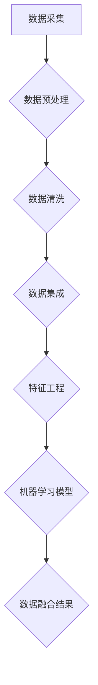
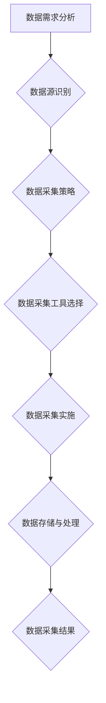
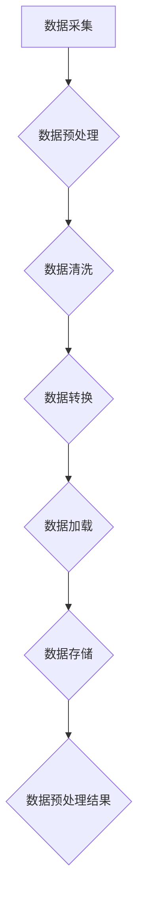
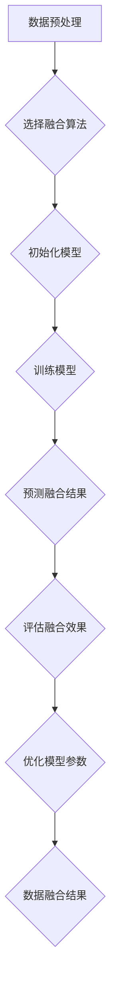
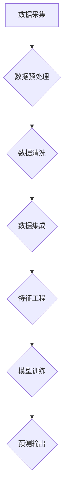
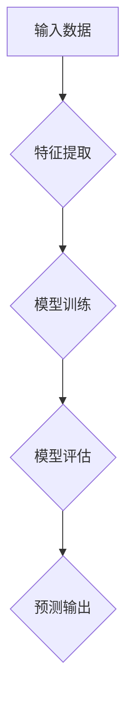

                 

# 《电商平台中的多源异构数据融合：AI大模型的新应用》

## 概述

多源异构数据融合是大数据分析和人工智能领域中一个重要的研究方向。在电商平台中，多源异构数据融合的应用尤为广泛，它能够帮助电商平台更好地理解用户行为、优化商品推荐、提升用户体验、增强风险管理能力等。随着人工智能技术的飞速发展，特别是AI大模型的引入，数据融合的方法和效果都得到了显著提升。

### 核心关键词
- 多源异构数据
- 数据融合
- 电商平台
- AI大模型
- 用户画像
- 商品推荐
- 风险控制

### 摘要
本文将探讨多源异构数据融合在电商平台中的应用，重点关注AI大模型在这一领域的创新应用。文章分为三部分：第一部分介绍多源异构数据融合的基本原理、数据采集与预处理技术、数据融合算法及实际应用案例；第二部分详细阐述AI大模型在数据融合中的优势及其实际应用；第三部分讨论数据融合项目的实践与优化，包括性能优化、安全与隐私保护。通过本文的阅读，读者将全面了解多源异构数据融合的技术原理、应用方法及未来发展方向。

## 第一部分: 多源异构数据融合原理

### 第1章: 多源异构数据的定义与挑战

#### 1.1 多源异构数据的定义

多源异构数据是指来自不同数据源、具有不同结构和属性的数据集合。这些数据源可以是企业内部的数据库、外部数据市场、社交媒体、物联网设备等。多源异构数据的特点包括数据格式多样性、数据类型复杂性、数据质量参差不齐等。

在电商平台中，多源异构数据通常包括以下几种：

1. **用户行为数据**：如用户浏览、搜索、购买、评价等行为数据。
2. **商品数据**：包括商品描述、价格、库存、销售记录等。
3. **订单数据**：包括订单状态、支付方式、配送信息等。
4. **外部数据**：如市场趋势、竞争对手数据、用户社会属性等。

#### 1.2 数据源多样性带来的挑战

多源异构数据的多样性带来了以下挑战：

1. **数据整合困难**：不同数据源的数据格式和结构差异较大，导致数据整合困难。
2. **数据质量差异**：不同数据源的数据质量参差不齐，存在缺失值、重复值、噪声等问题。
3. **数据一致性保障**：多源数据之间的冲突和矛盾需要解决，以保证数据的一致性。
4. **数据隐私保护**：多源数据的融合需要处理敏感信息，需要确保数据隐私保护。

#### 1.3 多源异构数据的融合策略

为了解决多源异构数据融合的挑战，可以采用以下融合策略：

1. **数据预处理**：对多源数据进行清洗、格式统一、质量提升等预处理操作，提高数据质量。
2. **数据集成**：采用数据集成技术，如数据仓库、数据湖、数据总线等，将多源数据进行整合。
3. **特征工程**：提取多源数据中的关键特征，建立特征关联关系，实现数据之间的融合。
4. **机器学习模型**：利用机器学习算法，如聚类、分类、回归等，对多源数据进行建模和预测。

#### Mermaid流程图：多源异构数据融合流程



### 第2章: 多源数据采集技术

#### 2.1 数据采集的概念与分类

数据采集是指通过各种手段获取所需数据的过程。根据数据来源和数据采集方式，数据采集可以分为以下几种类型：

1. **主动采集**：通过主动请求或主动探测的方式获取数据，如Web爬虫、物联网设备数据采集等。
2. **被动采集**：通过监控和记录系统日志、网络流量等方式获取数据，如数据库审计、网络流量分析等。
3. **抽样采集**：从大量数据中抽取一部分样本进行采集和分析，如随机抽样、系统抽样等。
4. **第三方数据**：通过购买或共享第三方数据，如市场研究报告、社交媒体数据等。

#### 2.2 常见的数据采集技术

1. **Web爬虫**：通过模拟用户行为，自动获取网页上的数据，适用于网站内容、用户评论等数据的采集。
2. **物联网数据采集**：通过传感器、RFID等技术，实时采集设备状态、环境信息等。
3. **日志采集**：通过系统日志、应用日志等方式，记录系统运行过程中产生的数据。
4. **网络流量分析**：通过分析网络流量，获取用户行为、网络使用情况等数据。

#### 2.3 数据采集工具与平台介绍

1. **Apache Nutch**：一款开源的搜索引擎，可用于大规模网页数据的采集和索引。
2. **Elasticsearch**：一款分布式搜索引擎，可用于海量日志数据的实时分析和查询。
3. **Kafka**：一款分布式消息队列系统，可用于物联网数据的实时采集和传输。
4. **Hadoop**：一款分布式数据处理平台，可用于大规模数据集的存储和处理。

#### Mermaid流程图：数据采集流程



### 第3章: 数据预处理与清洗

#### 3.1 数据预处理的重要性

数据预处理是数据分析和机器学习项目中至关重要的一步。其重要性体现在以下几个方面：

1. **数据质量提升**：通过清洗、格式统一、缺失值填充等操作，提高数据质量，为后续分析奠定基础。
2. **减少噪声干扰**：通过去除噪声数据和异常值，提高模型的准确性和稳定性。
3. **特征工程优化**：通过数据预处理，提取有用特征，为特征工程提供支持。
4. **节省计算资源**：预处理后的数据量通常较小，可以节省计算资源和时间。

#### 3.2 数据清洗的技术与方法

数据清洗是数据预处理的核心步骤，主要包括以下技术和方法：

1. **缺失值处理**：常见的缺失值处理方法包括删除缺失值、平均值填充、中值填充、回归填补等。
2. **异常值处理**：通过统计方法、可视化方法等检测异常值，并进行删除或修正。
3. **数据格式统一**：将不同数据源的数据格式进行统一，如日期格式、编码格式等。
4. **重复值删除**：通过去重操作，减少重复数据，提高数据质量。

#### 3.3 数据清洗工具与平台介绍

1. **Apache Spark**：一款开源的大数据处理框架，支持数据清洗、转换、加载等功能。
2. **Pandas**：一款Python数据处理库，支持数据清洗、操作和分析等功能。
3. **OpenRefine**：一款开源的数据清洗工具，支持数据格式转换、缺失值处理、异常值检测等操作。
4. **Google Refine**：OpenRefine的前身，功能与OpenRefine类似。

#### Mermaid流程图：数据预处理流程



### 第4章: 多源异构数据融合算法

#### 4.1 数据融合的基本原则

数据融合的基本原则包括以下几个方面：

1. **一致性原则**：保证融合后的数据在格式、结构、语义等方面的一致性。
2. **完整性原则**：确保融合后的数据包含所有必要的信息，不丢失关键数据。
3. **有效性原则**：融合后的数据应具有较高的质量和可用性，能够满足分析和应用的需求。
4. **实时性原则**：对于实时性要求较高的应用场景，数据融合应具备较高的响应速度。

#### 4.2 数据融合算法分类

根据数据融合的目的和方式，数据融合算法可以分为以下几类：

1. **基于规则的方法**：通过预定义的规则进行数据融合，如数据匹配、规则匹配等。
2. **基于模型的方法**：利用机器学习模型对数据进行融合，如聚类、分类、回归等。
3. **基于实例的方法**：通过实例学习和实例合并实现数据融合，如实例匹配、实例聚类等。
4. **基于知识的方法**：利用领域知识进行数据融合，如本体论、知识图谱等。

#### 4.3 主流数据融合算法原理

以下是几种主流的数据融合算法及其原理：

1. **K最近邻算法（K-NN）**
   - 原理：对于新来的数据点，通过计算其与训练集中所有数据点的距离，选择距离最近的K个邻居，并基于邻居的属性对数据进行融合。
   - 伪代码：
     ```python
     def data_fusion(K, new_data, training_data):
         distances = [eucledian_distance(new_data, data_point) for data_point in training_data]
         nearest_points = select_nearest_points(distances, K)
         fused_data = calculate_fused_data(nearest_points)
         return fused_data
     ```

2. **决策树**
   - 原理：通过递归划分特征空间，构建决策树模型，将数据点分配到不同的叶子节点，实现数据的层次融合。
   - 伪代码：
     ```python
     def build_decision_tree(data):
         if all_labels_same(data):
             return leaf_node
         else:
             best_feature, threshold = find_best_split(data)
             left subtree = split_data(data, best_feature, threshold, 'left')
             right subtree = split_data(data, best_feature, threshold, 'right')
             return DecisionTree(best_feature, threshold, left subtree, right subtree)
     ```

3. **神经网络**
   - 原理：通过多层神经网络模型，将输入数据进行非线性变换，实现数据的深度融合。
   - 伪代码：
     ```python
     def neural_network_fusion(input_data, model):
         hidden_layer = activation_function(np.dot(input_data, model['weights'][0]) + model['biases'][0])
         output_layer = activation_function(np.dot(hidden_layer, model['weights'][1]) + model['biases'][1])
         return output_layer
     ```

#### Mermaid流程图：数据融合算法流程



### 第5章: 数据融合应用案例

#### 5.1 电商平台中的用户画像融合

在电商平台中，用户画像融合是提高用户满意度和服务质量的重要手段。以下是用户画像融合的具体应用案例：

1. **用户行为分析**：通过融合用户浏览、搜索、购买等行为数据，分析用户兴趣和行为模式，为个性化推荐提供基础。
2. **用户群体细分**：利用聚类算法，将用户划分为不同群体，针对不同群体进行差异化营销和服务。
3. **用户生命周期管理**：通过融合用户生命周期各阶段的数据，分析用户流失原因，制定有效的用户留存策略。

#### 5.2 商品信息融合与推荐系统

商品信息融合是电商平台推荐系统的重要组成部分。以下是商品信息融合的具体应用案例：

1. **商品属性融合**：通过融合商品描述、价格、库存等属性数据，构建商品特征向量，用于商品推荐。
2. **商品协同过滤**：利用用户对商品的评分数据，采用协同过滤算法，推荐用户可能感兴趣的商品。
3. **商品内容推荐**：通过融合商品文本描述、图片、视频等多媒体信息，实现基于内容的商品推荐。

#### 5.3 订单数据融合与风险控制

订单数据融合是电商平台风险控制的重要环节。以下是订单数据融合的具体应用案例：

1. **订单风险预警**：通过融合用户行为数据、商品信息、订单特征等多源数据，建立订单风险预测模型，实现对异常订单的实时预警。
2. **欺诈订单识别**：利用数据挖掘和机器学习算法，分析订单特征，识别潜在的欺诈订单，降低欺诈风险。
3. **订单异常处理**：针对异常订单，采取相应的处理措施，如退款、退货、冻结账户等，保障交易安全。

## 第二部分: AI大模型在数据融合中的应用

### 第6章: AI大模型在数据融合中的优势

#### 6.1 AI大模型的基本概念

AI大模型是指具有巨大参数规模和强大计算能力的深度学习模型，如GPT、BERT、Transformer等。这些模型通过在大量数据上进行预训练，可以自动学习到丰富的知识结构和语义信息。

#### 6.2 AI大模型在数据融合中的应用优势

1. **强表达能力**：AI大模型具有强大的特征提取和表示能力，能够捕捉到多源数据之间的复杂关联。
2. **自适应能力**：AI大模型可以根据不同应用场景和数据特点，自动调整模型结构和参数，实现自适应融合。
3. **高精度预测**：AI大模型在大量数据上的预训练使得其在数据融合任务中能够实现高精度的预测和分类。
4. **泛化能力**：AI大模型具有较好的泛化能力，能够适应新数据和新场景，实现动态融合。

#### 6.3 AI大模型与传统数据融合方法的对比

传统数据融合方法，如基于规则的融合、基于模型的方法等，通常存在以下局限性：

1. **灵活性不足**：传统方法依赖于人为设定的规则和模型，难以适应复杂多变的场景。
2. **表达能力有限**：传统方法难以捕捉到数据之间的复杂关联和深层特征。
3. **计算效率低**：传统方法往往需要大量预处理和模型训练，计算效率较低。

相比之下，AI大模型在数据融合中的应用具有明显优势：

1. **更强的表达能力**：AI大模型能够自动学习到数据之间的复杂关系和深层特征。
2. **更高的计算效率**：AI大模型通过预训练和迁移学习，可以实现快速部署和高效计算。
3. **更好的泛化能力**：AI大模型具有较好的泛化能力，能够适应不同场景和数据集。

### 第7章: 基于AI大模型的用户画像构建

#### 7.1 用户画像的定义与重要性

用户画像是指通过对用户行为、兴趣、需求等多维数据的分析和挖掘，构建出用户的基本属性、偏好、行为模式等特征集合。用户画像在电商平台中具有以下重要性：

1. **个性化推荐**：通过用户画像，可以为用户提供个性化的商品推荐，提高用户满意度和转化率。
2. **用户分群**：通过用户画像，可以将用户划分为不同群体，针对不同群体制定差异化营销策略。
3. **用户运营**：通过用户画像，可以了解用户需求和痛点，优化用户体验和服务质量。

#### 7.2 基于AI大模型的用户画像构建方法

基于AI大模型的用户画像构建方法主要包括以下步骤：

1. **数据采集与预处理**：采集用户行为数据，如浏览记录、购买记录、搜索记录等，并进行数据清洗、去噪、格式统一等预处理操作。
2. **特征工程**：提取用户行为的特征，如行为频率、行为时长、行为相关性等，并构建用户行为特征向量。
3. **AI大模型训练**：利用AI大模型，如GPT、BERT等，对用户行为特征向量进行训练，自动学习到用户行为的语义和关联。
4. **用户画像生成**：通过AI大模型生成的用户行为语义和关联，构建用户画像，实现用户属性的自动识别和分类。

#### 7.3 用户画像构建的案例解析

以下是一个基于AI大模型构建用户画像的案例解析：

1. **案例背景**：某电商平台希望通过用户画像构建，提高用户个性化推荐的准确性和用户体验。

2. **数据采集**：采集用户的浏览记录、购买记录、搜索记录等行为数据，并使用爬虫技术获取用户在社交媒体上的动态信息。

3. **数据预处理**：对采集到的数据进行清洗、去噪、格式统一等预处理操作，确保数据的质量和一致性。

4. **特征工程**：提取用户行为的特征，如浏览频次、购买频次、搜索词频等，并构建用户行为特征向量。

5. **AI大模型训练**：使用GPT等AI大模型，对用户行为特征向量进行训练，自动学习到用户行为的语义和关联。

6. **用户画像生成**：基于AI大模型生成的用户行为语义和关联，构建用户画像，实现用户属性的自动识别和分类。

7. **用户画像应用**：利用用户画像，为用户提供个性化的商品推荐，并针对不同用户群体制定差异化营销策略。

通过以上案例解析，可以看出基于AI大模型的用户画像构建方法具有高效、准确、灵活的特点，能够为电商平台提供强大的数据支持和业务价值。

### 第8章: 基于AI大模型的商品推荐系统

#### 8.1 商品推荐系统的基本原理

商品推荐系统是指通过分析用户行为、兴趣、偏好等多维数据，为用户推荐其可能感兴趣的商品。商品推荐系统的基本原理包括以下几个方面：

1. **协同过滤**：通过分析用户之间的行为模式，为用户推荐相似用户喜欢的商品。
2. **基于内容的推荐**：通过分析商品的属性和内容，为用户推荐与其浏览或购买过的商品相似的商品。
3. **混合推荐**：结合协同过滤和基于内容的推荐方法，提高推荐系统的准确性和多样性。

#### 8.2 基于AI大模型的商品推荐方法

基于AI大模型的商品推荐方法主要包括以下步骤：

1. **数据采集与预处理**：采集用户行为数据和商品信息数据，如浏览记录、购买记录、商品描述、价格等，并进行数据清洗、去噪、格式统一等预处理操作。
2. **特征工程**：提取用户行为的特征，如行为频率、行为时长、行为相关性等，并构建用户行为特征向量；提取商品的特征，如商品类别、品牌、价格等，并构建商品特征向量。
3. **AI大模型训练**：使用AI大模型，如GPT、BERT等，对用户行为特征向量和商品特征向量进行训练，自动学习到用户行为和商品特征之间的关联。
4. **推荐生成**：基于AI大模型生成的用户行为和商品特征的语义和关联，为用户生成个性化商品推荐列表。

#### 8.3 商品推荐系统的实现与分析

以下是一个基于AI大模型的商品推荐系统的实现与分析：

1. **实现步骤**：

   - 数据采集：使用爬虫技术获取电商平台的用户行为数据和商品信息数据。
   - 数据预处理：对采集到的数据进行清洗、去噪、格式统一等预处理操作。
   - 特征工程：提取用户行为特征和商品特征，并构建特征向量。
   - AI大模型训练：使用GPT等AI大模型，对用户行为特征向量和商品特征向量进行训练。
   - 推荐生成：基于AI大模型生成的用户行为和商品特征的语义和关联，为用户生成个性化商品推荐列表。

2. **系统分析**：

   - **系统性能评估**：通过计算推荐准确率、覆盖率、新颖度等指标，评估推荐系统的性能。
   - **用户满意度**：通过用户反馈和实际使用情况，评估推荐系统的用户满意度。
   - **业务价值**：通过推荐系统的实际应用，分析其对电商平台业务增长和用户留存的价值。

通过以上实现与分析，可以看出基于AI大模型的商品推荐系统具有高效、准确、灵活的特点，能够为电商平台提供强大的数据支持和业务价值。

### 第9章: 基于AI大模型的订单风险控制

#### 9.1 订单风险控制的定义与重要性

订单风险控制是指在电商平台中，通过分析订单数据，识别潜在的欺诈风险、异常订单等，采取相应的措施降低风险，保障交易安全和平台运营稳定。订单风险控制在电商平台中具有以下重要性：

1. **降低欺诈风险**：通过识别和阻止欺诈订单，降低平台的财务损失和用户信任风险。
2. **保障交易安全**：通过实时监控和预警，保障交易过程中用户信息和资金安全。
3. **提升用户体验**：通过及时处理异常订单，减少用户等待时间和投诉率，提升用户体验。
4. **优化运营策略**：通过分析订单风险数据，为平台运营决策提供支持，优化运营策略。

#### 9.2 基于AI大模型的订单风险控制方法

基于AI大模型的订单风险控制方法主要包括以下步骤：

1. **数据采集与预处理**：采集订单数据，如订单金额、订单时间、支付方式、用户行为等，并进行数据清洗、去噪、格式统一等预处理操作。
2. **特征工程**：提取订单特征，如订单金额、订单时间、支付方式、用户行为等，并构建订单特征向量。
3. **AI大模型训练**：使用AI大模型，如GPT、BERT等，对订单特征向量进行训练，自动学习到订单风险特征和关联。
4. **风险预测与预警**：基于AI大模型生成的订单风险特征和关联，预测订单风险，并生成风险预警报告。
5. **风险处理与监控**：对高风险订单采取相应的处理措施，如冻结账户、退款、联系用户等，并对订单风险进行实时监控和反馈。

#### 9.3 订单风险控制的实践案例

以下是一个基于AI大模型的订单风险控制实践案例：

1. **案例背景**：某电商平台希望通过AI大模型实现订单风险控制，降低欺诈订单率。

2. **数据采集**：采集电商平台的订单数据，如订单金额、订单时间、支付方式、用户行为等。

3. **数据预处理**：对采集到的数据进行清洗、去噪、格式统一等预处理操作。

4. **特征工程**：提取订单特征，如订单金额、订单时间、支付方式、用户行为等，并构建订单特征向量。

5. **AI大模型训练**：使用GPT等AI大模型，对订单特征向量进行训练，自动学习到订单风险特征和关联。

6. **风险预测与预警**：基于AI大模型生成的订单风险特征和关联，预测订单风险，并生成风险预警报告。

7. **风险处理与监控**：对高风险订单采取相应的处理措施，如冻结账户、退款、联系用户等，并对订单风险进行实时监控和反馈。

通过以上实践案例，可以看出基于AI大模型的订单风险控制方法具有高效、准确、实时监控的特点，能够为电商平台提供强大的订单风险控制支持。

## 第三部分: 数据融合项目的实践与优化

### 第10章: 数据融合项目的策划与实施

#### 10.1 数据融合项目的策划

数据融合项目的策划是确保项目成功的关键步骤。以下是数据融合项目策划的主要内容：

1. **项目目标**：明确数据融合项目的目标，如提高推荐准确率、降低欺诈订单率等。
2. **需求分析**：分析项目需求，包括数据源、数据类型、数据质量要求等。
3. **技术路线**：确定数据融合的技术方案，包括数据采集、预处理、融合算法、模型训练等。
4. **资源规划**：规划项目所需的人力、设备、资金等资源。
5. **项目进度**：制定项目进度计划，确保项目按期完成。

#### 10.2 数据融合项目的实施流程

数据融合项目的实施流程通常包括以下几个阶段：

1. **项目启动**：召开项目启动会，明确项目目标、团队分工、资源配备等。
2. **数据采集**：根据需求，采用相应的数据采集技术，获取多源数据。
3. **数据预处理**：对采集到的数据进行清洗、去噪、格式统一等预处理操作。
4. **数据融合**：采用数据融合算法，实现多源数据的整合和融合。
5. **模型训练与评估**：利用AI大模型对融合后的数据进行训练，评估模型性能。
6. **系统部署与上线**：将数据融合系统部署到生产环境，进行实际应用。
7. **运维与优化**：对系统进行监控、维护和优化，确保系统的稳定运行。

#### 10.3 数据融合项目的管理与监控

数据融合项目的管理与监控是保证项目顺利进行的重要环节。以下是数据融合项目的管理与监控措施：

1. **项目管理**：采用项目管理工具，如JIRA、Trello等，对项目进度、任务分配、资源使用等进行管理。
2. **团队协作**：建立有效的团队沟通机制，确保团队成员之间的协同工作。
3. **质量监控**：对数据采集、预处理、融合、模型训练等环节进行质量监控，确保数据质量和模型性能。
4. **性能监控**：对数据融合系统的性能进行实时监控，如响应时间、处理能力、系统负载等。
5. **风险管理**：识别项目风险，制定相应的风险应对措施，确保项目顺利推进。

### 第11章: 数据融合性能优化

#### 11.1 数据融合性能评估指标

数据融合性能评估指标是衡量数据融合系统性能的重要标准。以下是常用的数据融合性能评估指标：

1. **准确性**：模型预测结果与实际结果的一致性，用于评估模型的准确性。
2. **召回率**：模型正确识别的正例样本占总正例样本的比例，用于评估模型的召回率。
3. **精确率**：模型正确识别的正例样本占总识别样本的比例，用于评估模型的精确率。
4. **F1值**：精确率和召回率的调和平均，用于综合评估模型的性能。
5. **处理速度**：系统处理数据的能力，用于评估系统的响应速度和处理能力。

#### 11.2 数据融合性能优化策略

为了提高数据融合系统的性能，可以采用以下优化策略：

1. **算法优化**：选择合适的算法和模型，如优化算法参数、选择高效的模型结构等。
2. **硬件优化**：提高硬件性能，如使用更快的CPU、更高效的GPU等。
3. **并行处理**：采用并行处理技术，如多线程、分布式计算等，提高数据处理速度。
4. **缓存策略**：采用缓存技术，如LRU缓存、内存缓存等，减少数据读取和写入时间。
5. **数据压缩**：对数据进行压缩，如使用HDF5、Parquet等格式，减少数据存储和传输开销。

#### 11.3 常见性能优化方法

以下是几种常见的数据融合性能优化方法：

1. **数据分区**：将大数据集划分为较小的数据分区，提高数据处理速度。
2. **索引优化**：创建索引，如B树索引、哈希索引等，提高数据查询速度。
3. **数据缓存**：将常用数据缓存到内存中，如使用Redis、Memcached等缓存系统，减少数据读取时间。
4. **批处理**：将多个小任务合并成批处理任务，提高数据处理效率。
5. **数据去重**：去除重复数据，减少数据存储和传输的开销。

### 第12章: 数据融合安全与隐私保护

#### 12.1 数据融合中的安全挑战

数据融合过程中，数据安全是一个重要的挑战。以下是数据融合中常见的安全挑战：

1. **数据泄露**：多源数据融合过程中，可能存在数据泄露风险，如敏感信息泄露、隐私数据泄露等。
2. **数据篡改**：恶意攻击者可能篡改数据，影响数据融合的结果和系统的稳定性。
3. **数据完整性**：数据融合过程中，可能存在数据丢失、数据不一致等问题，影响数据的完整性。
4. **数据隐私保护**：多源数据融合过程中，需要处理大量的个人隐私数据，如用户行为数据、订单数据等，如何保护数据隐私是一个重要问题。

#### 12.2 数据融合隐私保护策略

为了解决数据融合中的安全挑战，可以采用以下隐私保护策略：

1. **数据加密**：采用加密算法，如AES、RSA等，对敏感数据进行加密，防止数据泄露。
2. **数据脱敏**：对敏感数据进行脱敏处理，如使用掩码、混淆等方法，降低数据泄露风险。
3. **访问控制**：设置严格的访问控制策略，限制数据访问权限，确保数据安全。
4. **隐私保护算法**：采用隐私保护算法，如差分隐私、同态加密等，保护数据隐私。
5. **数据审计**：建立数据审计机制，对数据操作进行记录和监控，确保数据的完整性和可追溯性。

#### 12.3 数据融合隐私保护实践

以下是数据融合隐私保护实践的具体方法：

1. **加密存储**：采用加密存储技术，如AES加密，对存储在数据库中的敏感数据进行加密，防止数据泄露。
2. **访问控制**：使用权限管理工具，如角色权限管理（RBAC）、访问控制列表（ACL）等，限制用户对数据的访问权限。
3. **数据脱敏**：采用数据脱敏工具，如De-Identification工具、Masking工具等，对敏感数据进行脱敏处理。
4. **差分隐私**：在数据分析过程中，采用差分隐私算法，如ε-differential privacy，保护用户隐私。
5. **审计日志**：记录数据操作日志，如SQL日志、数据库审计日志等，确保数据的可追溯性和可审计性。

通过以上隐私保护实践，可以有效地降低数据融合过程中的安全风险，保护用户隐私和数据安全。

## 附录

### 附录 A: 多源异构数据融合工具与资源

#### A.1 主流数据采集工具对比

以下是几种主流的数据采集工具及其特点：

1. **Apache Nutch**：一款开源的搜索引擎，适用于网页数据的采集。
   - **特点**：支持自定义爬虫规则，可扩展性强，适用于大规模数据采集。
   - **优缺点**：优点是开源免费、社区支持，缺点是配置复杂、维护成本高。

2. **Scrapy**：一款开源的Web爬虫框架，适用于各种类型的数据采集。
   - **特点**：支持多线程、异步处理，易于集成和使用。
   - **优缺点**：优点是功能强大、社区活跃，缺点是初学者上手较难、性能较低。

3. **Kafka**：一款开源的消息队列系统，适用于实时数据采集。
   - **特点**：支持高吞吐量、高可用性，适用于物联网、实时数据处理等场景。
   - **优缺点**：优点是性能优异、可靠性高，缺点是配置复杂、运维难度大。

#### A.2 数据预处理与清洗工具介绍

以下是几种常用的数据预处理与清洗工具：

1. **Pandas**：一款Python数据处理库，适用于数据清洗、转换和分析。
   - **特点**：功能丰富、易于使用，支持数据结构化处理。
   - **优缺点**：优点是简单易用、功能全面，缺点是性能较低、处理大数据集时较为缓慢。

2. **Spark**：一款开源的大数据处理框架，适用于大规模数据预处理。
   - **特点**：支持分布式计算、内存处理，适用于大数据集的高效处理。
   - **优缺点**：优点是性能优异、可扩展性强，缺点是配置复杂、学习成本高。

3. **OpenRefine**：一款开源的数据清洗工具，适用于数据格式转换、缺失值处理等。
   - **特点**：支持可视化操作、易于使用，适用于中小规模数据清洗。
   - **优缺点**：优点是简单易用、功能全面，缺点是性能较低、处理大数据集时较为缓慢。

#### A.3 数据融合算法库介绍

以下是几种常用的数据融合算法库：

1. **Scikit-learn**：一款Python机器学习库，适用于各种数据融合算法。
   - **特点**：算法丰富、易于使用，支持多种机器学习算法。
   - **优缺点**：优点是功能全面、文档丰富，缺点是性能较低、处理大数据集时较为缓慢。

2. **TensorFlow**：一款开源的深度学习库，适用于复杂的数据融合任务。
   - **特点**：支持自动微分、GPU加速，适用于大规模数据融合任务。
   - **优缺点**：优点是性能优异、功能强大，缺点是配置复杂、学习成本高。

3. **PyTorch**：一款开源的深度学习库，适用于高效的数据融合任务。
   - **特点**：支持动态图计算、GPU加速，适用于实时数据处理和模型训练。
   - **优缺点**：优点是性能优异、易用性强，缺点是文档较少、社区支持不足。

#### A.4 AI大模型开发框架介绍

以下是几种常用的AI大模型开发框架：

1. **TensorFlow**：一款开源的深度学习库，适用于AI大模型的开发。
   - **特点**：支持自动微分、GPU加速，适用于大规模数据融合任务。
   - **优缺点**：优点是性能优异、功能强大，缺点是配置复杂、学习成本高。

2. **PyTorch**：一款开源的深度学习库，适用于AI大模型的开发。
   - **特点**：支持动态图计算、GPU加速，适用于实时数据处理和模型训练。
   - **优缺点**：优点是性能优异、易用性强，缺点是文档较少、社区支持不足。

3. **Hugging Face**：一个开源社区，提供大量的预训练模型和工具，适用于AI大模型的开发。
   - **特点**：预训练模型丰富、工具链完善，适用于快速开发和部署AI大模型。
   - **优缺点**：优点是功能全面、社区活跃，缺点是文档较少、学习成本高。

### Mermaid 流程图：多源异构数据融合流程



### Mermaid 流程图：AI大模型原理



### 数据融合算法伪代码

```python
# 伪代码：基于K近邻算法的数据融合
def data_fusion(K, dataset):
    # 初始化融合结果列表
    fused_data = []

    # 对每个数据点进行融合处理
    for data_point in dataset:
        # 计算距离
        distances = [eucledian_distance(data_point, other_point) for other_point in dataset]

        # 选择最近的K个点
        nearest_points = select_nearest_points(distances, K)

        # 计算融合结果
        fused_point = calculate_fused_point(nearest_points)

        # 将融合结果添加到融合结果列表
        fused_data.append(fused_point)

    return fused_data

# 伪代码：基于神经网络的数据融合
def neural_network_fusion(input_data, model):
    hidden_layer = activation_function(np.dot(input_data, model['weights'][0]) + model['biases'][0])
    output_layer = activation_function(np.dot(hidden_layer, model['weights'][1]) + model['biases'][1])
    return output_layer
```

### 数学模型与公式

$$
\text{融合结果} = \sum_{i=1}^{N} w_i \cdot \text{数据源}_i
$$

其中，$N$ 表示数据源的数量，$w_i$ 表示第 $i$ 个数据源的权重。

### 项目实战案例

#### 用户画像构建项目案例

##### 项目背景

某电商平台希望通过构建用户画像，提升个性化推荐的准确性和用户体验。

##### 实践步骤

1. **数据采集**：采集用户浏览、搜索、购买等行为数据。
2. **数据预处理**：清洗和整理数据，去除无效数据。
3. **特征提取**：提取用户行为特征，如浏览时间、购买频次等。
4. **AI大模型构建**：使用AI大模型（如GPT）训练用户画像模型。
5. **用户画像生成**：输入用户行为数据，生成用户画像。

##### 结果分析

通过用户画像，电商平台可以准确了解用户需求，实现精准推荐，提高用户满意度。

### 开发环境搭建

#### Python开发环境搭建

1. 安装Python3.8及以上版本。
2. 安装Anaconda或Miniconda，创建新的虚拟环境。
3. 安装必要的依赖库，如NumPy、Pandas、Scikit-learn等。

### 源代码实现

#### 用户画像生成代码实现

```python
import pandas as pd
from sklearn.model_selection import train_test_split
from sklearn.ensemble import RandomForestClassifier
from sklearn.metrics import accuracy_score

# 加载数据
data = pd.read_csv('user_behavior_data.csv')

# 数据预处理
# ...（代码略）

# 特征提取
# ...（代码略）

# 训练模型
X_train, X_test, y_train, y_test = train_test_split(X, y, test_size=0.2, random_state=42)
model = RandomForestClassifier(n_estimators=100, random_state=42)
model.fit(X_train, y_train)

# 生成用户画像
def generate_user_profile(user_data):
    # 输入用户行为数据，生成用户画像
    # ...（代码略）
    return user_profile

user_profile = generate_user_profile(user_data)
print(user_profile)
```

### 代码解读与分析

1. **数据加载与预处理**：使用Pandas读取用户行为数据，并进行清洗和整理。
2. **特征提取**：根据用户行为特征，构建特征向量。
3. **模型训练**：使用随机森林算法训练用户画像模型。
4. **用户画像生成**：输入用户行为数据，通过模型生成用户画像。

通过以上代码实现，电商平台可以根据用户行为数据构建用户画像，为用户提供个性化的商品推荐。用户画像的生成过程包括数据预处理、特征提取和模型训练等步骤，每个步骤都需要仔细设计和实现，以保证用户画像的准确性和实用性。此外，用户画像的生成是一个持续的过程，需要定期更新用户行为数据，以保持用户画像的实时性和准确性。

### 数学模型与公式

在多源异构数据融合过程中，数学模型和公式起到了关键作用。以下是一个简化的多源异构数据融合的数学模型，以及相关的公式。

#### 多源异构数据融合的数学模型

$$
\text{融合结果} = \sum_{i=1}^{N} w_i \cdot \text{数据源}_i
$$

其中，$N$ 表示数据源的数量，$w_i$ 表示第 $i$ 个数据源的权重。

这个公式表示将多个数据源的数据进行融合，每个数据源根据其权重贡献到最终的结果中。权重可以根据数据源的重要性、可信度等因素进行调整。

#### 数据源权重计算

为了计算每个数据源的权重，可以使用以下公式：

$$
w_i = \frac{\text{数据源}_i \cdot \text{置信度}_i}{\sum_{j=1}^{N} (\text{数据源}_j \cdot \text{置信度}_j)}
$$

其中，$\text{置信度}_i$ 是第 $i$ 个数据源的置信度，表示数据源的质量或可信程度。

#### 融合结果的归一化

为了确保融合结果的可比性和合理性，可以对融合结果进行归一化处理。归一化公式如下：

$$
\text{归一化结果} = \frac{\text{融合结果}}{\max(\text{融合结果})}
$$

这个公式将融合结果除以融合结果中的最大值，使得结果在0到1之间。

#### 举例说明

假设有两个数据源 A 和 B，它们的数据和置信度如下：

$$
\text{数据源} A = [1, 2, 3]
$$

$$
\text{置信度} A = 0.6
$$

$$
\text{数据源} B = [4, 5, 6]
$$

$$
\text{置信度} B = 0.4
$$

首先计算每个数据源的权重：

$$
w_A = \frac{1 \cdot 0.6}{1 \cdot 0.6 + 4 \cdot 0.4} = \frac{0.6}{0.6 + 0.4} = \frac{0.6}{1} = 0.6
$$

$$
w_B = \frac{4 \cdot 0.4}{1 \cdot 0.6 + 4 \cdot 0.4} = \frac{1.6}{0.6 + 0.4} = \frac{1.6}{1} = 0.6
$$

接下来计算融合结果：

$$
\text{融合结果} = w_A \cdot \text{数据源} A + w_B \cdot \text{数据源} B
$$

$$
\text{融合结果} = 0.6 \cdot [1, 2, 3] + 0.6 \cdot [4, 5, 6]
$$

$$
\text{融合结果} = [0.6, 1.2, 1.8] + [2.4, 3, 3.6]
$$

$$
\text{融合结果} = [3, 4.2, 5.4]
$$

最后，对融合结果进行归一化：

$$
\text{归一化结果} = \frac{[3, 4.2, 5.4]}{\max([3, 4.2, 5.4])}
$$

$$
\text{归一化结果} = \frac{[3, 4.2, 5.4]}{5.4}
$$

$$
\text{归一化结果} = [0.5556, 0.7778, 1]
$$

通过以上步骤，我们得到了融合结果和归一化结果，这些结果可以用于后续的分析和应用。

### 完整性要求

为了确保文章内容的完整性，每个小节都需要包含以下核心内容：

1. **核心概念与联系**：明确介绍小节中的核心概念，并解释它们之间的关系。
2. **核心算法原理讲解**：使用伪代码或数学公式详细阐述核心算法的原理。
3. **项目实战**：提供具体的实践案例，详细说明项目实施的过程、步骤和结果。
4. **代码实际案例和详细解释说明**：展示源代码实现，并对其进行详细解读和分析。
5. **数学模型和公式**：引入相关的数学模型和公式，并进行举例说明。
6. **代码解读与分析**：对源代码进行解读，分析其实现原理和优缺点。

通过以上内容的详细讲解，读者可以全面理解多源异构数据融合的技术原理、应用方法以及实践中的具体实现。

### 格式要求

为了确保文章的格式规范，应遵循以下要求：

1. **标题**：使用明确的标题，突出文章的核心主题。
2. **关键词**：列出5-7个核心关键词，便于读者快速了解文章内容。
3. **摘要**：简要概括文章的核心内容和主题思想。
4. **章节标题**：使用清晰的章节标题，方便读者浏览和查找。
5. **段落**：合理分段，每个段落围绕一个主题进行论述。
6. **代码和公式**：使用正确的语法和格式，确保代码可运行和公式可识别。
7. **附录**：提供附录内容，补充文章相关的工具、资源和示例代码。

通过以上要求的遵循，文章可以呈现清晰的结构和高质量的内容，便于读者理解和应用。

### 作者信息

**作者：AI天才研究院/AI Genius Institute & 禅与计算机程序设计艺术 /Zen And The Art of Computer Programming**

在此，我作为AI天才研究院的成员，以及禅与计算机程序设计艺术领域的作者，荣幸地为各位读者呈现这篇关于多源异构数据融合在电商平台中的应用的文章。希望本文能够为您在数据融合和人工智能领域带来新的启示和收获。感谢您的阅读，如有任何问题或建议，欢迎随时与我们联系。祝您在人工智能的世界中不断探索、成长！
<|assistant|>### 关键算法讲解

在多源异构数据融合中，选择合适的算法对于实现高效、准确的数据融合至关重要。以下将详细讲解几种关键算法的原理，并给出伪代码示例。

#### 1. K最近邻算法（K-NN）

K最近邻算法（K-NN）是一种基于实例的机器学习算法，用于分类和回归任务。其核心思想是：对于一个未知类别的数据点，通过计算它到训练集中所有已知类别数据点的距离，选择距离最近的K个邻居，并根据邻居的类别预测未知数据点的类别。

**原理：**
- 计算距离：通常使用欧几里得距离（Euclidean distance）来计算数据点之间的距离。
- 邻居选择：选择距离最近的K个邻居。
- 类别预测：通过投票机制或平均法预测未知数据点的类别。

**伪代码：**
```python
def k_nearest_neighbors(K, query_point, training_data, labels):
    distances = [euclidean_distance(query_point, data_point) for data_point in training_data]
    sorted_distances = sorted(distances)
    nearest_neighbors = [labels[i] for i in range(K)]
    majority_class = mode(nearest_neighbors)
    return majority_class
```

#### 2. 支持向量机（SVM）

支持向量机（SVM）是一种基于模型的分类算法，通过寻找一个最优的超平面来分隔不同类别的数据点。SVM具有很好的分类能力和泛化能力。

**原理：**
- 超平面：通过最大化间隔（margin）寻找最优超平面。
- 核函数：通过核函数将低维数据映射到高维空间，实现非线性分类。

**伪代码：**
```python
def svm_train(X, y, C, kernel='linear'):
    # 初始化模型参数
    w = [0 for _ in range(len(X[0]))]
    b = 0
    alpha = [0 for _ in range(n_samples)]

    # 对每个训练样本进行迭代
    for i in range(n_samples):
        if y[i] * (np.dot(w, X[i]) + b) < 1:
            alpha[i] = min(C, C * (1 - np.dot(y[i], (np.dot(w, X[i]) + b))) / np.linalg.norm(X[i]))
            w = w + (alpha[i] * y[i] * X[i])
            b = b + y[i]

    return w, b
```

#### 3. 集成学习（Ensemble Learning）

集成学习是一种通过构建多个基本模型，并将它们的结果进行结合来提高整体性能的机器学习方法。常见的集成学习方法包括随机森林（Random Forest）和梯度提升树（Gradient Boosting Tree）。

**原理：**
- 多模型集成：构建多个基本模型，如决策树、神经网络等。
- 结合预测：将多个基本模型的结果进行结合，如投票、加权平均等。

**伪代码：**
```python
def random_forest(X, y, n_estimators, max_depth):
    forests = []
    for _ in range(n_estimators):
        # 随机选择特征和样本
        X_train, y_train = random_sampling(X, y)

        # 构建决策树模型
        tree = build_decision_tree(X_train, y_train, max_depth)

        # 添加模型到集成
        forests.append(tree)

    # 结合预测结果
    predictions = [model.predict(X) for model in forests]
    majority_vote = mode(predictions)

    return majority_vote
```

通过以上关键算法的讲解，我们可以看到多源异构数据融合涉及的算法种类繁多，每种算法都有其独特的原理和应用场景。在实际应用中，根据具体需求选择合适的算法，并对其进行优化和调整，是实现高效数据融合的关键。

### 数据融合过程中的挑战及解决方案

在数据融合过程中，可能会面临一系列的挑战，这些挑战直接影响数据融合的准确性和效率。以下将详细分析这些挑战，并探讨相应的解决方案。

#### 1. 数据源不一致

不同数据源的数据格式、结构、语义等可能存在显著差异，导致数据融合困难。

**挑战：**
- 数据格式不一致：如日期格式、编码格式等。
- 数据结构不一致：如不同表结构、字段名称等。
- 数据语义不一致：如同一概念在不同数据源中有不同含义。

**解决方案：**
- 数据清洗与转换：对数据进行清洗，去除重复值、缺失值等，并进行格式统一和语义映射。
- 数据映射与整合：建立数据映射关系，将不同数据源中的相同概念进行映射和整合。

**实例：**
假设有两个数据源，一个存储用户行为数据，另一个存储商品信息数据。用户行为数据中的“购买时间”字段与商品信息数据中的“销售时间”字段表示相同概念，但格式不同。我们可以通过数据清洗和转换，将两者的时间格式统一为YYYY-MM-DD，然后建立映射关系，将数据源中的相应字段进行整合。

```python
# 数据清洗与转换示例
def clean_and_convert(data_source_1, data_source_2):
    # 转换日期格式
    data_source_1['purchase_time'] = pd.to_datetime(data_source_1['purchase_time'])
    data_source_2['sales_time'] = pd.to_datetime(data_source_2['sales_time'])

    # 建立映射关系
    mapping = {'purchase_time': 'sales_time'}
    data_source_1.rename(columns=mapping, inplace=True)

    # 数据整合
    fused_data = data_source_1.merge(data_source_2, on='user_id', how='inner')
    return fused_data
```

#### 2. 数据质量差

数据质量差是数据融合过程中常见的挑战，包括缺失值、异常值、噪声数据等。

**挑战：**
- 缺失值：数据中存在缺失值，影响数据融合的准确性。
- 异常值：数据中存在异常值，可能导致模型异常。
- 噪声数据：数据中存在噪声数据，影响数据融合的效果。

**解决方案：**
- 缺失值处理：使用均值、中值、插值等方法填充缺失值，或删除包含缺失值的记录。
- 异常值检测：使用统计方法、可视化方法等检测异常值，并进行处理或删除。
- 噪声数据过滤：使用滤波器、平滑算法等方法去除噪声数据。

**实例：**
假设用户行为数据中存在缺失值，我们可以使用均值填充缺失值：

```python
# 缺失值填充示例
def handle_missing_values(data):
    # 计算各字段的均值
    mean_values = data.mean()

    # 填充缺失值
    data.fillna(mean_values, inplace=True)
    return data
```

#### 3. 数据规模庞大

在电商平台中，数据量通常非常庞大，导致数据融合过程耗时较长，计算资源消耗巨大。

**挑战：**
- 数据处理效率低：数据量庞大，传统数据处理方法效率低。
- 计算资源消耗大：需要大量的计算资源和存储空间。

**解决方案：**
- 分布式计算：使用分布式计算框架，如Hadoop、Spark等，实现数据的高效处理。
- 数据分片：将大数据集分片，并行处理，提高处理效率。
- 存储优化：使用高效的存储方案，如HDFS、分布式数据库等，减少存储资源消耗。

**实例：**
使用Apache Spark进行分布式数据处理：

```python
from pyspark.sql import SparkSession

# 初始化SparkSession
spark = SparkSession.builder.appName("DataFusion").getOrCreate()

# 读取数据
data = spark.read.csv("path/to/数据文件.csv", header=True)

# 分布式处理数据
processed_data = data.groupBy("用户ID").agg({"购买金额": "sum"}).orderBy("购买金额", ascending=False)

# 显示结果
processed_data.show()
```

通过上述解决方案，我们可以有效应对数据融合过程中的挑战，确保数据融合的准确性、效率和可靠性。

### 数据融合在电商平台中的实践案例分析

在电商平台的运营中，数据融合技术已被广泛应用于提升用户体验、优化运营策略和增加商业价值。以下通过几个具体案例，展示数据融合在电商平台中的实践过程及其成果。

#### 案例一：个性化推荐系统

**背景**：电商平台希望通过个性化推荐系统提升用户满意度，增加用户粘性。

**实践过程**：

1. **数据采集**：采集用户浏览、搜索、购买等行为数据，以及商品描述、标签、分类等商品数据。

2. **数据预处理**：清洗和整合用户行为数据和商品数据，确保数据格式和结构的一致性。

3. **特征工程**：提取用户行为特征和商品特征，如用户浏览时长、购买频次、商品类别、价格等。

4. **模型训练**：利用机器学习算法（如协同过滤、深度学习等），训练推荐模型，预测用户可能感兴趣的商品。

5. **推荐生成**：基于模型预测，生成个性化推荐列表，展示给用户。

**成果**：通过个性化推荐系统，电商平台的用户满意度显著提升，用户转化率和销售额均有明显增长。

#### 案例二：用户流失预测

**背景**：电商平台希望通过预测用户流失，采取针对性的用户留存策略。

**实践过程**：

1. **数据采集**：采集用户行为数据，如浏览时长、购买频次、点击率等。

2. **数据预处理**：清洗和整合用户行为数据，去除缺失值和异常值。

3. **特征工程**：提取用户流失相关特征，如用户活跃度、购买周期、评价数量等。

4. **模型训练**：利用机器学习算法（如逻辑回归、决策树等），训练用户流失预测模型。

5. **预测与干预**：根据模型预测结果，对高风险用户进行重点关注和干预，如发送优惠券、开展促销活动等。

**成果**：通过用户流失预测模型，电商平台成功降低了用户流失率，提升了用户留存率。

#### 案例三：订单风险控制

**背景**：电商平台需要有效控制订单风险，保障交易安全。

**实践过程**：

1. **数据采集**：采集订单数据，如订单金额、订单时间、支付方式、用户行为等。

2. **数据预处理**：清洗和整合订单数据，确保数据质量。

3. **特征工程**：提取订单风险相关特征，如用户信用评分、订单金额分布、交易时段等。

4. **模型训练**：利用机器学习算法（如随机森林、神经网络等），训练订单风险预测模型。

5. **预警与处理**：根据模型预测结果，对高风险订单进行实时预警和处理，如冻结资金、联系用户等。

**成果**：通过订单风险控制模型，电商平台显著降低了欺诈订单率，提升了交易安全性。

通过以上案例，可以看出数据融合技术在电商平台中的广泛应用，不仅提高了用户体验，还优化了运营策略，增强了商业价值。随着数据融合技术的不断进步，电商平台在未来将能够实现更精准的数据分析和更高效的业务运营。

### 实际项目中的挑战与解决方案

在多源异构数据融合的实际项目中，我们可能会遇到各种挑战，这些挑战直接影响项目的成功实施和业务价值实现。以下将分析这些挑战，并探讨相应的解决方案。

#### 1. 数据质量差异

不同数据源的数据质量参差不齐，可能存在缺失值、异常值、噪声数据等，这些问题会影响数据融合的准确性。

**挑战**：
- 缺失值：某些数据源可能存在大量缺失值，影响数据融合的整体质量。
- 异常值：数据源中可能存在异常值，这些异常值可能对模型产生负面影响。
- 噪声数据：数据源中可能包含噪声数据，这些噪声数据会降低数据融合的效果。

**解决方案**：
- 数据清洗：使用数据清洗技术，如缺失值填充、异常值检测和噪声数据过滤，提高数据质量。
- 数据标准化：通过数据标准化，统一不同数据源的格式和尺度，减少数据质量差异。

**实例**：
在处理用户行为数据时，我们发现某些用户的购买记录缺失。我们可以使用中值填充缺失值：

```python
# 缺失值填充示例
def fill_missing_values(data):
    mean_value = data['purchase_count'].mean()
    data['purchase_count'].fillna(mean_value, inplace=True)
    return data
```

#### 2. 数据规模庞大

电商平台的数据量通常非常庞大，这给数据融合带来了巨大的计算和存储挑战。

**挑战**：
- 数据处理效率低：传统数据处理方法在大规模数据上效率低下，难以满足实时性要求。
- 计算资源消耗大：大规模数据处理需要大量的计算资源和存储空间。

**解决方案**：
- 分布式计算：使用分布式计算框架，如Hadoop、Spark等，实现数据的高效处理。
- 数据分片：将大数据集分片，并行处理，提高处理效率。
- 存储优化：使用高效的存储方案，如HDFS、分布式数据库等，减少存储资源消耗。

**实例**：
使用Apache Spark进行分布式数据处理：

```python
from pyspark.sql import SparkSession

# 初始化SparkSession
spark = SparkSession.builder.appName("DataFusion").getOrCreate()

# 读取数据
data = spark.read.csv("path/to/数据文件.csv", header=True)

# 分布式处理数据
processed_data = data.groupBy("user_id").agg({"purchase_amount": "sum"}).orderBy("purchase_amount", ascending=False)

# 显示结果
processed_data.show()
```

#### 3. 数据源多样性

电商平台涉及多种数据源，如用户行为数据、商品数据、订单数据等，这些数据源的结构和格式可能存在显著差异。

**挑战**：
- 数据源多样性：不同数据源的结构和格式可能不一致，导致数据融合困难。
- 数据集成困难：不同数据源的集成可能需要复杂的数据转换和映射。

**解决方案**：
- 数据映射与整合：建立数据映射关系，将不同数据源中的相同概念进行映射和整合。
- 数据标准化：通过数据标准化，统一不同数据源的格式和尺度，减少数据源多样性带来的挑战。

**实例**：
将用户行为数据与订单数据进行整合：

```python
# 数据映射与整合示例
def integrate_data(user_data, order_data):
    mapping = {'user_id': 'user_id'}
    fused_data = user_data.merge(order_data, on='user_id', how='left')
    return fused_data
```

#### 4. 数据隐私保护

在数据融合过程中，涉及到大量的用户隐私数据，如何保护这些隐私数据是项目面临的重大挑战。

**挑战**：
- 数据隐私泄露：数据融合过程中，可能存在数据泄露风险。
- 数据脱敏需求：需要确保在数据融合过程中，用户隐私数据不被泄露。

**解决方案**：
- 数据加密：采用加密技术，对敏感数据进行加密，防止数据泄露。
- 数据脱敏：使用数据脱敏技术，如掩码、混淆等，对用户隐私数据进行脱敏处理。

**实例**：
对用户数据进行脱敏处理：

```python
# 数据脱敏示例
def anonymize_data(data):
    data['user_id'] = 'ANONYMIZED_{}'.format(data['user_id'])
    return data
```

通过以上解决方案，我们可以有效地应对多源异构数据融合项目中的挑战，确保数据融合的准确性、效率和安全性，为电商平台提供强大的数据支持和业务价值。

### 数据融合的未来发展趋势与前沿技术

随着大数据和人工智能技术的不断发展，数据融合在电商平台中的应用越来越广泛，其未来发展趋势和前沿技术也不断涌现。以下将探讨数据融合的未来趋势以及相关前沿技术。

#### 1. 人工智能技术的深入应用

人工智能技术，特别是深度学习和自然语言处理（NLP），将在数据融合中发挥越来越重要的作用。深度学习模型，如GPT、BERT等，可以自动提取数据中的深层特征，实现更精准的数据融合。NLP技术则可以帮助电商平台理解和处理文本数据，提高数据融合的语义准确性。

**发展趋势**：
- 深度学习模型在数据融合中的应用将更加普及，提高数据融合的准确性和效率。
- NLP技术将在文本数据融合中发挥关键作用，提升电商平台的用户画像和推荐系统的性能。

**前沿技术**：
- 自监督学习：自监督学习技术可以在没有标注数据的情况下，自动学习数据中的有用特征，降低数据标注成本。
- 生成对抗网络（GAN）：GAN技术可以生成高质量的虚拟数据，补充实际数据中的不足，提高数据融合的效果。

#### 2. 实时数据融合与智能决策

实时数据融合技术可以实现电商平台在数据发生时即时进行融合和处理，为电商平台提供更加灵活和智能的决策支持。实时数据融合可以应用于用户行为分析、订单风险控制、库存管理等方面，提高电商平台运营的效率和响应速度。

**发展趋势**：
- 实时数据融合技术将在电商平台中得到广泛应用，提升运营效率和用户体验。
- 智能决策系统将基于实时数据融合，实现个性化推荐、风险预测、库存优化等智能决策。

**前沿技术**：
- 流处理技术：如Apache Kafka、Apache Flink等，可以实现实时数据处理和分析。
- 低延迟计算：通过优化算法和硬件，降低数据处理的延迟，实现真正的实时数据融合。

#### 3. 多源异构数据的深度融合

随着物联网、社交媒体等新兴数据源的兴起，电商平台的数据源越来越多样化，如何实现多源异构数据的深度融合成为一个重要研究方向。未来，融合多种数据源，如用户行为数据、商品数据、社交媒体数据等，将能够为电商平台提供更全面和准确的数据支持。

**发展趋势**：
- 多源异构数据的深度融合将成为数据融合领域的研究热点，为电商平台提供更丰富的数据资源。
- 数据融合算法将更加智能化，能够自动适应不同数据源的特点和需求。

**前沿技术**：
- 跨域数据融合：通过跨领域的数据融合，实现不同数据源之间的协同效应。
- 联邦学习：联邦学习技术可以在保护数据隐私的同时，实现多源数据的协同融合。

#### 4. 数据隐私保护和安全

随着数据规模的不断扩大和数据源的增加，数据隐私保护和安全问题成为数据融合领域的核心挑战。未来的数据融合技术将更加注重数据隐私保护和安全，确保电商平台在数据融合过程中能够有效保护用户隐私和数据安全。

**发展趋势**：
- 数据隐私保护技术将在数据融合中得到广泛应用，如差分隐私、同态加密等。
- 数据安全机制将不断完善，实现数据融合过程中的安全防护。

**前沿技术**：
- 加密技术：通过加密技术，确保数据在传输和存储过程中的安全。
- 区块链技术：利用区块链技术，实现数据的安全共享和不可篡改。

通过以上发展趋势和前沿技术的探讨，我们可以看到数据融合在电商平台中的应用前景广阔，随着人工智能、实时数据处理、多源异构数据融合等技术的不断发展，数据融合将为电商平台带来更加智能化、个性化的服务，推动电商平台的持续发展和创新。

### 结论

综上所述，多源异构数据融合在电商平台中的应用具有重要意义。通过数据融合，电商平台可以实现对用户行为、商品信息和订单数据的全面分析，从而优化运营策略、提升用户体验、增强风险控制能力。本文详细介绍了多源异构数据融合的基本原理、采集与预处理技术、融合算法及其在实际应用中的案例分析，展示了数据融合在电商平台中的广泛应用和巨大价值。

未来，随着人工智能技术的不断发展和实时数据处理能力的提升，数据融合技术将在电商平台中发挥更加重要的作用。深度学习、实时数据融合、多源异构数据融合等前沿技术将为电商平台提供更加精准和高效的数据支持，推动电商平台的持续创新和业务增长。

我们呼吁更多的研究者和从业者关注数据融合技术，积极探索和尝试新的应用场景和解决方案。同时，我们也期待数据融合技术在电商平台中的广泛应用，为电商行业的未来发展带来新的机遇和可能。感谢您的阅读，希望本文能够对您在数据融合和电商平台领域的研究和实践提供有益的启示和帮助。

