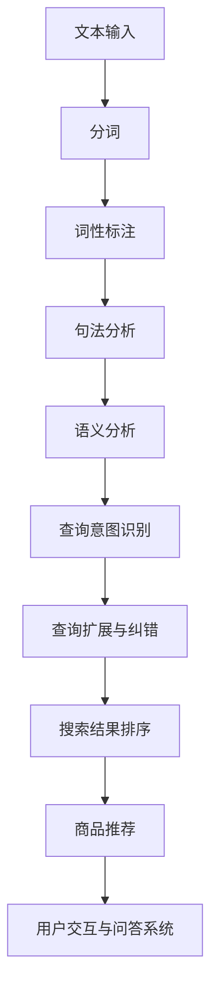
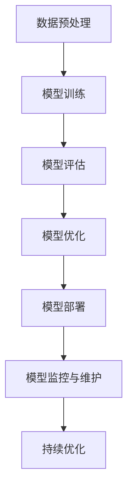

                 

### 《电商平台中的自然语言查询理解：大模型的创新应用》

#### 关键词：
- 电商平台
- 自然语言查询理解
- 大模型
- 查询意图识别
- 商品推荐
- 搜索结果排序

#### 摘要：
随着电商平台的迅猛发展，用户对个性化、智能化的查询体验需求日益增长。自然语言查询理解作为人工智能的关键技术，能够将用户的自然语言查询转化为结构化的数据，进而实现高效的商品推荐和搜索结果排序。本文将探讨大模型在电商平台自然语言查询理解中的应用，通过详细分析核心概念、算法原理以及实际项目案例，揭示大模型如何助力电商平台提升用户体验，实现智能化转型。

#### 目录大纲

### 第一部分：引言与概述

#### 第1章：电商平台中的自然语言查询理解概述

##### 1.1 电商平台的发展与自然语言查询

##### 1.2 自然语言查询理解的挑战与机遇

##### 1.3 本书的目标与结构

#### 第2章：自然语言处理基础

##### 2.1 自然语言处理的基本概念

##### 2.2 词嵌入技术

##### 2.3 语法分析与语义分析

##### 2.4 自然语言处理工具与框架

### 第二部分：大模型在自然语言查询理解中的应用

#### 第3章：大模型概述

##### 3.1 大模型的概念与特点

##### 3.2 大模型的分类与比较

##### 3.3 大模型的发展趋势

#### 第4章：基于大模型的自然语言处理算法

##### 4.1 生成式模型与判别式模型

##### 4.2 注意力机制与序列到序列模型

##### 4.3 递归神经网络与长短期记忆网络

##### 4.4 自监督学习与迁移学习

#### 第5章：大模型在电商平台中的应用

##### 5.1 查询意图识别

##### 5.2 查询扩展与纠错

##### 5.3 商品推荐与搜索结果排序

##### 5.4 用户交互与问答系统

### 第三部分：创新应用与实践

#### 第6章：大模型在电商平台中的实际应用案例

##### 6.1 案例一：某大型电商平台的自然语言查询理解系统

##### 6.2 案例二：基于大模型的个性化搜索与推荐系统

##### 6.3 案例三：电商平台中的对话系统与虚拟助手

#### 第7章：大模型应用中的挑战与优化策略

##### 7.1 模型训练与部署的挑战

##### 7.2 模型优化与性能提升策略

##### 7.3 数据隐私与安全保护

##### 7.4 模型解释性与可解释性

#### 第8章：未来展望与趋势

##### 8.1 大模型在电商平台中的未来应用方向

##### 8.2 自然语言查询理解的挑战与解决方案

##### 8.3 新兴技术与产业融合

### 附录

#### 附录A：相关工具与资源

##### A.1 大模型开发工具

##### A.2 自然语言处理开源库

##### A.3 电商平台案例研究资源

#### 附录B：Mermaid 流程图示例

##### B.1 自然语言处理流程图

##### B.2 大模型训练与部署流程图

#### 附录C：伪代码示例

##### C.1 查询意图识别算法伪代码

##### C.2 商品推荐系统算法伪代码

#### 附录D：数学模型与公式解释

##### D.1 概率模型公式解释

##### D.2 注意力机制公式解释

#### 附录E：项目实战代码解读

##### E.1 实际代码案例

##### E.2 代码解读与分析

**备注**：所有章节中的**核心概念与联系**、**核心算法原理讲解**、**数学模型和数学公式 & 详细讲解 & 举例说明**、**项目实战**等内容将分别嵌入到相应的章节中。每个章节会按照上述格式详细展开。**Mermaid 流程图**、**伪代码**、**数学模型与公式**和**代码解读**会以附录形式呈现，以便读者参考学习。**markdown 格式**用于文本格式化和排版，确保目录大纲的清晰易懂。**latex 格式**用于数学公式的书写和排版，确保数学表达的准确性和专业性。

---

### 引言与概述

在互联网时代，电商平台已经成为现代零售业的重要组成部分。用户通过自然语言查询来寻找他们想要的商品，这使得自然语言查询理解技术变得尤为重要。自然语言查询理解旨在将用户的自然语言查询转化为结构化的数据，从而实现精准的商品推荐和搜索结果排序，提升用户体验。

自然语言查询理解技术主要面临以下几个挑战：

1. **查询意图识别**：用户的查询往往是非结构化的，需要通过算法来理解其意图。
2. **查询扩展与纠错**：用户的输入可能存在拼写错误或歧义，需要对这些查询进行扩展或纠错。
3. **搜索结果排序**：如何根据用户的查询意图，将相关度高的商品推荐给用户，是一个关键问题。

为了解决这些挑战，近年来大模型（如GPT-3、BERT等）在自然语言处理领域的应用取得了显著进展。大模型具有以下特点：

1. **强大的表示能力**：大模型能够捕捉到自然语言中的复杂结构和语义信息，从而提高查询理解的效果。
2. **自监督学习**：大模型可以利用大量未标记的数据进行训练，从而提高模型的泛化能力。
3. **多任务学习**：大模型可以在多个任务上进行训练，从而提高模型的效率和应用范围。

本书旨在探讨大模型在电商平台自然语言查询理解中的应用。通过系统地介绍自然语言处理的基础知识、大模型的基本概念和算法原理，以及实际应用案例，本文将揭示大模型如何助力电商平台实现智能化转型，提升用户体验。

本文将分为三个部分进行阐述：

1. **引言与概述**：介绍电商平台的发展、自然语言查询理解的挑战以及大模型的基本概念。
2. **大模型在自然语言查询理解中的应用**：详细分析大模型在查询意图识别、查询扩展与纠错、商品推荐与搜索结果排序等领域的应用。
3. **创新应用与实践**：通过实际应用案例，展示大模型在电商平台中的具体应用效果和挑战。

接下来，我们将深入探讨自然语言处理的基础知识，为后续内容奠定坚实的基础。

---

### 第一部分：引言与概述

#### 第1章：电商平台中的自然语言查询理解概述

##### 1.1 电商平台的发展与自然语言查询

电商平台的兴起极大地改变了人们的购物习惯。从传统的实体店购物到在线购物的转变，用户对便捷、个性化的购物体验需求日益增长。随着移动设备的普及和移动互联网的发展，电商平台逐渐成为零售业的重要组成部分。据统计，全球电商市场规模在2020年已达到3.5万亿美元，并预计在未来几年继续保持快速增长。

在电商平台上，自然语言查询理解技术成为提升用户体验的关键。自然语言查询理解旨在将用户的自然语言查询转化为结构化的数据，从而实现精准的商品推荐和搜索结果排序。用户通过输入自然语言查询（如“我想买一款红色的iPhone 13手机”），电商平台需要理解其查询意图，并返回与之相关的商品列表。

自然语言查询理解技术具有以下几个重要应用场景：

1. **商品推荐**：通过理解用户的查询意图，电商平台可以推荐与用户需求相关的商品。例如，当用户查询“羽绒服”时，系统可以根据用户的浏览历史和购买记录，推荐高相关的商品。
   
2. **搜索结果排序**：在用户的查询结果中，如何排序才能让用户找到他们真正想要的商品？自然语言查询理解技术可以帮助电商平台根据用户的意图对搜索结果进行排序，提高用户的满意度。

3. **问答系统**：电商平台可以提供智能问答系统，用户可以直接通过自然语言提问，系统会自动回答用户的问题，如“这款手机有什么优惠吗？”或“这个商品有没有用户评价？”等。

##### 1.2 自然语言查询理解的挑战与机遇

尽管自然语言查询理解技术在电商平台上具有广泛的应用前景，但其实现过程中面临着一系列挑战：

1. **查询意图识别**：用户的查询意图可能非常复杂，需要通过算法来准确识别。例如，一个查询“我想买一本关于机器学习的书”，可能涉及多个意图，如购买、查找信息、评价等。

2. **查询扩展与纠错**：用户的输入可能存在拼写错误、歧义或省略，需要对这些查询进行扩展或纠错。例如，用户输入“我要买手机”，系统需要识别其真正意图，并扩展为“我要购买手机”。

3. **多语言支持**：电商平台通常需要支持多种语言，如何确保自然语言查询理解技术在不同语言上的准确性和一致性，是一个重要问题。

4. **实时响应**：用户对查询结果的期望越来越短，如何确保自然语言查询理解技术能够在短时间内返回准确的搜索结果，是一个关键问题。

然而，随着技术的不断进步，自然语言查询理解技术也面临着诸多机遇：

1. **大模型的崛起**：近年来，大模型（如GPT-3、BERT等）在自然语言处理领域取得了显著进展。这些大模型具有强大的表示能力和自监督学习能力，能够显著提高自然语言查询理解的准确性和效率。

2. **数据隐私与安全**：随着用户对隐私和数据安全的关注度不断提高，自然语言查询理解技术需要在不泄露用户隐私的前提下，确保数据的处理和存储安全。

3. **多模态交互**：未来，电商平台将不仅仅是基于文本的查询，还将融合语音、图像等多种模态，提供更丰富的交互方式，从而提升用户体验。

##### 1.3 本书的目标与结构

本书旨在系统地探讨大模型在电商平台自然语言查询理解中的应用，帮助读者深入理解自然语言查询理解技术的基本概念、算法原理以及实际应用。

本书的结构如下：

1. **引言与概述**：介绍电商平台的发展、自然语言查询理解的挑战以及大模型的基本概念。
   
2. **自然语言处理基础**：详细讲解自然语言处理的基本概念、词嵌入技术、语法分析与语义分析等内容。

3. **大模型在自然语言查询理解中的应用**：分析大模型在查询意图识别、查询扩展与纠错、商品推荐与搜索结果排序等领域的应用。

4. **创新应用与实践**：通过实际应用案例，展示大模型在电商平台中的具体应用效果和挑战。

5. **未来展望与趋势**：探讨大模型在电商平台中的未来应用方向以及自然语言查询理解的挑战与解决方案。

通过本书的学习，读者将能够：

- 理解自然语言查询理解的基本概念和算法原理。
- 掌握大模型在电商平台中的应用技术。
- 分析大模型应用中的挑战与优化策略。
- 展望自然语言查询理解技术的未来发展趋势。

让我们开始深入探讨自然语言处理的基础知识，为后续内容奠定坚实的基础。

### 自然语言处理基础

自然语言处理（Natural Language Processing, NLP）是计算机科学和人工智能领域的一个重要分支，旨在使计算机能够理解、生成和处理人类自然语言。在电商平台的自然语言查询理解中，NLP技术扮演着关键角色，它能够将用户的自然语言查询转化为结构化的数据，从而实现精准的商品推荐和搜索结果排序。以下是NLP的一些基本概念、词嵌入技术、语法分析与语义分析等内容。

#### 基本概念

自然语言处理的基本概念包括语言模型、词性标注、实体识别、句法分析等。

1. **语言模型**：语言模型是NLP中最基本的概念之一，它用于预测文本序列的概率。通过训练，语言模型能够理解自然语言的统计特性，从而生成或理解自然语言文本。

2. **词性标注**：词性标注（Part-of-Speech Tagging）是指为文本中的每个单词分配一个词性标签，如名词、动词、形容词等。词性标注有助于理解文本的语法结构。

3. **实体识别**：实体识别（Named Entity Recognition, NER）是指从文本中识别出具有特定意义的实体，如人名、地名、组织名等。实体识别是信息提取和知识图谱构建的重要步骤。

4. **句法分析**：句法分析（Syntactic Parsing）是指分析句子的语法结构，通常通过生成句法树来表示。句法分析有助于理解句子的语义和逻辑关系。

#### 词嵌入技术

词嵌入（Word Embedding）是将自然语言文本中的单词映射到固定维度的向量空间，以便于计算机处理。词嵌入技术包括以下几种：

1. **Word2Vec**：Word2Vec是使用神经网络训练的词嵌入模型，它通过上下文预测来学习单词的向量表示。Word2Vec模型包括两个变种：连续词袋（CBOW）和Skip-Gram。

2. **GloVe**：GloVe（Global Vectors for Word Representation）是一种基于共现矩阵的词嵌入技术，它通过计算单词的共现关系来学习单词的向量表示。

3. **FastText**：FastText是一种基于字符的词嵌入技术，它将单词映射为字符的组合向量，并通过神经网络训练学习单词的语义表示。

#### 语法分析

语法分析（Syntactic Parsing）是NLP中用于理解句子结构的过程。常见的语法分析方法包括：

1. **依存句法分析**：依存句法分析通过分析句子中词语之间的依赖关系来理解句子的结构。依存句法树表示了句子中词语之间的依存关系。

2. **树形句法分析**：树形句法分析通过生成句法树来表示句子的结构，其中每个节点代表一个单词，而边代表词与词之间的语法关系。

#### 语义分析

语义分析（Semantic Analysis）是NLP中用于理解句子意义的过程。常见的语义分析方法包括：

1. **语义角色标注**：语义角色标注为句子中的每个动词分配一个语义角色，如动作执行者、动作接收者等。

2. **语义角色识别**：语义角色识别通过分析句子中的动词和名词，识别出句子中的语义角色，从而理解句子的整体意义。

3. **语义解析**：语义解析通过将自然语言文本转化为结构化的语义表示，如语义角色标注、事件描述等，从而实现文本的语义理解。

#### 自然语言处理工具与框架

自然语言处理领域有许多开源工具和框架，它们为NLP的研究和应用提供了便利。以下是一些常用的NLP工具和框架：

1. **NLTK**：NLTK（自然语言工具包）是一个广泛使用的Python NLP库，提供了文本处理、词性标注、句法分析等功能。

2. **spaCy**：spaCy是一个高效的工业级NLP库，支持多种语言的语法分析和实体识别。

3. **Stanford NLP**：Stanford NLP是一个用于NLP的Java库，提供了词性标注、命名实体识别、句法分析等功能。

4. **TensorFlow**：TensorFlow是一个开源的机器学习框架，可用于构建和训练NLP模型。

5. **PyTorch**：PyTorch是一个开源的机器学习框架，支持灵活的动态计算图，常用于训练NLP模型。

通过掌握NLP的基本概念、词嵌入技术、语法分析与语义分析等内容，我们可以更好地理解和应用自然语言查询理解技术，为电商平台提供更智能化的服务。

### 大模型概述

大模型（Large-scale Models）在自然语言处理领域扮演着越来越重要的角色。这些模型由于其庞大的规模和深度，能够捕捉到自然语言中的复杂结构和语义信息，从而在许多任务上取得了显著的性能提升。在本节中，我们将介绍大模型的概念、特点、分类以及发展趋势。

#### 大模型的概念

大模型指的是具有数十亿甚至数万亿参数的神经网络模型，这些模型能够通过大量数据进行训练，从而学习到自然语言的内在规律。大模型的出现是计算能力、数据资源和算法改进共同推动的结果。早期的NLP模型（如基于规则的模型和简单的统计模型）难以处理复杂、多样化的自然语言任务，而大模型的引入则显著提高了模型的性能。

#### 大模型的特点

1. **强大的表示能力**：大模型具有数十亿到数万亿的参数，能够捕捉到自然语言中的长距离依赖关系和复杂的语义信息。这使得大模型在文本分类、机器翻译、问答系统等任务上表现优异。

2. **自监督学习**：大模型通常采用自监督学习（Self-supervised Learning）方法进行训练，这种方法利用大量未标记的数据进行预训练，从而提高模型的泛化能力。自监督学习减少了人工标注的需求，降低了训练成本。

3. **多任务学习**：大模型可以在多个任务上进行训练，从而实现任务迁移和共享知识。这种方法不仅提高了模型的性能，还减少了模型的训练时间。

4. **端到端的训练**：大模型通常采用端到端的训练方法，从输入层到输出层没有中间的抽象层。这使得模型能够直接从原始数据中学习到所需的特征，提高了模型的效率。

#### 大模型的分类

根据模型的结构和训练目标，大模型可以分为以下几种类型：

1. **基于转换器的模型**：转换器（Transformer）模型是近年来NLP领域的重要突破，其核心思想是利用自注意力机制（Self-Attention）处理序列数据。BERT（Bidirectional Encoder Representations from Transformers）是典型的转换器模型，通过双向编码器捕捉到文本的上下文信息。

2. **基于循环神经网络的模型**：循环神经网络（Recurrent Neural Network, RNN）及其变种（如LSTM和GRU）是早期的大模型，它们通过循环结构处理序列数据。尽管RNN在处理长序列时存在梯度消失和梯度爆炸的问题，但它们在许多任务上仍然表现出色。

3. **基于自监督学习的模型**：自监督学习模型（如GPT和T5）通过无监督方式训练，利用大量未标记的数据来学习语言特征。这些模型在生成文本、问答系统等任务上表现出色。

#### 大模型的发展趋势

1. **模型规模不断扩大**：随着计算能力和数据资源的提升，大模型的规模和参数数量不断增加。例如，GPT-3拥有1750亿个参数，是目前最大的语言模型。

2. **模型结构的多样化**：研究人员不断探索新的模型结构，如Transformer的变种（如BERT、RoBERTa）、多模态模型（融合文本、图像、语音等多模态数据）等，以应对更加复杂的自然语言任务。

3. **迁移学习和微调**：大模型通常通过预训练获得通用语言特征，然后通过迁移学习和微调（Fine-tuning）来适应特定任务。这种方法不仅提高了模型的性能，还减少了模型训练所需的时间和计算资源。

4. **应用领域的拓展**：大模型在自然语言处理领域的应用范围不断扩大，从文本分类、机器翻译、问答系统到生成式对话系统、文本摘要等，都在大模型的推动下取得了显著进展。

通过以上内容，我们可以看到大模型在自然语言处理领域的巨大潜力和应用前景。在接下来的章节中，我们将深入探讨大模型在自然语言处理中的具体应用，进一步揭示其如何助力电商平台实现智能化转型。

### 基于大模型的自然语言处理算法

在自然语言处理（NLP）领域中，大模型因其强大的表示能力和自监督学习能力，已经成为解决复杂自然语言任务的重要工具。本节将介绍基于大模型的几种自然语言处理算法，包括生成式模型与判别式模型、注意力机制与序列到序列模型、递归神经网络（RNN）与长短期记忆网络（LSTM）、以及自监督学习与迁移学习。通过这些算法的讲解，我们将展示大模型在NLP中的应用潜力。

#### 生成式模型与判别式模型

生成式模型和判别式模型是两种基本的NLP算法框架。

1. **生成式模型**：生成式模型（Generative Model）旨在生成自然语言的概率分布。典型的生成式模型包括Gaussian Mixture Model、Naive Bayes、和生成对抗网络（GAN）。生成式模型的优势在于可以生成新的文本数据，从而增强数据集，提高模型的泛化能力。生成式模型的一个经典应用是语言模型，如GPT（Generative Pre-trained Transformer）系列模型。

2. **判别式模型**：判别式模型（Discriminative Model）旨在预测给定输入数据的标签或类别。典型的判别式模型包括线性回归、逻辑回归和支持向量机（SVM）。判别式模型的优势在于它们可以直接进行分类和回归任务，通常比生成式模型在预测任务上更高效。判别式模型的一个经典应用是文本分类，如BERT（Bidirectional Encoder Representations from Transformers）。

**伪代码示例**：

```python
# 生成式模型伪代码
def generate_text(model, length, seed_text):
    current_text = seed_text
    for _ in range(length):
        probabilities = model.predict(current_text)
        next_word = choose_random_word(probabilities)
        current_text += " " + next_word
    return current_text

# 判别式模型伪代码
def classify_text(model, text):
    probabilities = model.predict(text)
    predicted_label = choose_label_with_highest_probability(probabilities)
    return predicted_label
```

#### 注意力机制与序列到序列模型

注意力机制（Attention Mechanism）和序列到序列模型（Seq2Seq Model）是NLP中的重要技术。

1. **注意力机制**：注意力机制是一种用于处理序列数据的方法，它通过加权不同位置的信息，使模型能够关注到重要的信息。注意力机制广泛应用于机器翻译、文本摘要等任务。注意力机制的计算公式如下：

$$
Attention(Q, K, V) = \text{softmax}\left(\frac{QK^T}{\sqrt{d_k}}\right)V
$$

其中，$Q$、$K$ 和 $V$ 分别是查询向量、键向量和值向量，$d_k$ 是键向量的维度。

2. **序列到序列模型**：序列到序列模型是一种将一个序列映射到另一个序列的模型，广泛应用于机器翻译、语音识别等任务。典型的序列到序列模型包括编码器（Encoder）和解码器（Decoder）。编码器将输入序列编码为一个固定长度的向量，解码器则将这个向量解码为目标序列。

**伪代码示例**：

```python
# 注意力机制伪代码
def attention(Q, K, V):
    scores = softmax(QK^T / sqrt(d_k))
    output = scoresV
    return output

# 序列到序列模型伪代码
def sequence_to_sequence(encoder, decoder, input_sequence, target_sequence):
    encoded = encoder(input_sequence)
    decoded = decoder(encoded, target_sequence)
    return decoded
```

#### 递归神经网络（RNN）与长短期记忆网络（LSTM）

递归神经网络（RNN）和长短期记忆网络（LSTM）是处理序列数据的重要模型。

1. **递归神经网络**：RNN 通过循环结构处理序列数据，其基本思想是在每个时间步上，将当前输入和前一个时间步的隐藏状态进行融合，生成新的隐藏状态。然而，标准的RNN存在梯度消失和梯度爆炸的问题，导致难以学习长距离依赖。

2. **长短期记忆网络**：LSTM 是一种改进的RNN结构，通过引入门控机制（包括输入门、遗忘门和输出门）来控制信息的流动，从而有效缓解了梯度消失问题。LSTM 在许多任务上表现出色，如语音识别、机器翻译等。

**伪代码示例**：

```python
# RNN伪代码
def rnn(input, hidden):
    combined = concatenate(input, hidden)
    output = activation(W_r * combined + b_r)
    return output

# LSTM伪代码
def lstm(input, hidden, cell):
    input_gate = sigmoid(W_i * input + U_h * hidden + b_i)
    forget_gate = sigmoid(W_f * input + U_h * hidden + b_f)
    output_gate = sigmoid(W_o * input + U_h * hidden + b_o)
    new_cell = forget_gate * cell + input_gate * activation(W_c * input + U_h * hidden + b_c)
    new_hidden = output_gate * activation(new_cell)
    return new_hidden, new_cell
```

#### 自监督学习与迁移学习

自监督学习（Self-supervised Learning）和迁移学习（Transfer Learning）是NLP中的重要技术。

1. **自监督学习**：自监督学习是一种利用未标记数据的方法，通过预训练模型来学习通用特征。自监督学习的一个典型应用是 masked language model（MLM），如 BERT 和 GPT 系列。MLM 通过遮盖部分单词，要求模型预测这些单词。

2. **迁移学习**：迁移学习是指将预训练模型应用于特定任务，通过微调（Fine-tuning）来适应新的任务。迁移学习显著提高了模型的训练效率，并提高了模型在特定任务上的性能。

**伪代码示例**：

```python
# 自监督学习伪代码
def masked_language_model(model, text):
    masked_text = mask_text(text)
    labels = get_labels(masked_text)
    loss = model.compute_loss(masked_text, labels)
    return loss

# 迁移学习伪代码
def fine_tune(model, new_data, learning_rate):
    for epoch in range(num_epochs):
        for data in new_data:
            loss = model.train(data, learning_rate)
            print(f"Epoch {epoch}: Loss = {loss}")
```

通过以上内容，我们可以看到大模型在自然语言处理中的应用潜力。在下一节中，我们将探讨大模型在电商平台自然语言查询理解中的应用，进一步揭示其如何提升电商平台的服务质量。

### 大模型在电商平台中的应用

大模型在电商平台中的应用极大地提升了用户的查询体验和平台的运营效率。以下将详细介绍大模型在电商平台中用于查询意图识别、查询扩展与纠错、商品推荐与搜索结果排序、用户交互与问答系统等具体应用领域。

#### 查询意图识别

查询意图识别（Query Intent Recognition）是自然语言查询理解的重要步骤，旨在理解用户查询的真实意图。用户输入的自然语言查询通常包含多种意图，例如搜索、购物、询问等。大模型，如BERT和GPT-3，通过其强大的语言表示能力，可以有效地识别这些意图。

**应用场景**：

- 用户输入“我想买一款新的笔记本电脑”，大模型可以识别出查询意图为“购买”。
- 用户输入“三星手机评价如何”，大模型可以识别出查询意图为“询问”。

**技术实现**：

- 使用预训练的大模型（如BERT）进行意图分类，通过在顶部添加一个分类层，将输入文本映射到不同的意图标签。
- 进行微调（Fine-tuning），在特定的电商数据集上进一步训练模型，提高分类准确率。

**伪代码示例**：

```python
# 查询意图识别伪代码
def recognize_intent(model, query):
    tokenized_query = model.tokenize(query)
    output = model.predict(tokenized_query)
    intent = decode_intent(output)
    return intent
```

#### 查询扩展与纠错

查询扩展与纠错（Query Expansion and Correction）旨在提升用户查询的准确性和相关性。用户输入的查询可能存在拼写错误、遗漏信息或歧义，大模型可以通过其强大的语言理解能力，对查询进行扩展和纠错。

**应用场景**：

- 用户输入“买手表”，大模型可以扩展为“购买手表”。
- 用户输入“苹果”，大模型可以纠错为“苹果手机”。

**技术实现**：

- 使用自监督学习（如BERT的Masked Language Model）预训练模型，通过无监督方式学习语言的上下文信息。
- 在电商数据集上进行微调，学习特定的查询扩展和纠错规则。

**伪代码示例**：

```python
# 查询扩展与纠错伪代码
def expand_and_correct_query(model, query):
    tokenized_query = model.tokenize(query)
    corrected_query = model.masked_language_model(tokenized_query)
    return corrected_query
```

#### 商品推荐与搜索结果排序

商品推荐与搜索结果排序（Product Recommendation and Search Result Ranking）是电商平台的核心功能。大模型通过理解用户的查询意图和购物历史，可以推荐相关商品，并排序搜索结果，提高用户的满意度。

**应用场景**：

- 用户浏览了多个笔记本电脑页面，系统推荐与用户兴趣相关的笔记本电脑。
- 用户输入“跑步鞋”，系统返回最相关的跑步鞋，并按照用户评分和销量排序。

**技术实现**：

- 使用基于用户历史行为的数据进行协同过滤（Collaborative Filtering），生成用户兴趣向量。
- 使用预训练的大模型（如BERT或GPT）进行文本嵌入，将用户查询和商品描述转换为向量。
- 结合用户兴趣向量和商品向量，使用计算相似度或排序模型（如LR、FM、DLRM）进行推荐和排序。

**伪代码示例**：

```python
# 商品推荐伪代码
def recommend_products(user_vector, product_vectors, model):
    similarity_scores = model.similarity(user_vector, product_vectors)
    recommended_products = select_top_n(similarity_scores, n)
    return recommended_products

# 搜索结果排序伪代码
def rank_search_results(query_vector, product_vectors, model):
    ranking_scores = model.rank(query_vector, product_vectors)
    sorted_products = sort_by_score(ranking_scores)
    return sorted_products
```

#### 用户交互与问答系统

用户交互与问答系统（User Interaction and Question Answering System）可以提供实时、个性化的用户服务，提高用户满意度和平台粘性。大模型通过理解用户的自然语言查询，可以生成高质量的回答。

**应用场景**：

- 用户询问“这款手机的价格是多少？”，系统可以自动回答。
- 用户询问“最近有哪些新款手机上市？”，系统可以生成推荐列表。

**技术实现**：

- 使用预训练的大模型（如GPT-3）进行问答，通过训练语料库学习如何生成自然语言回答。
- 结合知识图谱和用户历史行为，提高问答系统的准确性和个性化。

**伪代码示例**：

```python
# 问答系统伪代码
def answer_question(model, question):
    context = model.generate_context(question)
    answer = model.answer(context)
    return answer
```

通过以上具体应用，我们可以看到大模型在电商平台中的广泛潜力。在下一节中，我们将通过实际应用案例，进一步探讨大模型在电商平台中的实际效果和挑战。

### 大模型在电商平台中的实际应用案例

为了更好地展示大模型在电商平台中的应用效果和挑战，以下将介绍几个具体的应用案例，包括某大型电商平台的自然语言查询理解系统、基于大模型的个性化搜索与推荐系统以及电商平台中的对话系统与虚拟助手。

#### 案例一：某大型电商平台的自然语言查询理解系统

某大型电商平台通过引入GPT-3模型，实现了对其自然语言查询理解系统的升级。该系统的主要功能包括查询意图识别、查询扩展与纠错、以及搜索结果排序。

**应用效果**：

- **查询意图识别**：通过GPT-3模型，系统能够准确识别用户的查询意图，提高了用户查询的响应速度和准确性。例如，当用户输入“我想买一台微波炉”时，系统能够识别出查询意图为“购买”。
- **查询扩展与纠错**：GPT-3模型通过其强大的语言理解能力，可以自动扩展用户查询，使其更加准确和完整。例如，当用户输入“想买电脑”时，系统能够扩展为“想购买电脑”。
- **搜索结果排序**：结合用户历史行为和GPT-3模型生成的文本嵌入向量，系统能够对搜索结果进行智能排序，提高用户找到所需商品的概率。

**挑战与解决方案**：

- **数据隐私与安全**：由于GPT-3模型需要处理大量的用户查询数据，如何保护用户隐私是一个关键挑战。解决方案是引入数据加密和匿名化技术，确保用户数据的安全和隐私。
- **模型训练与优化**：GPT-3模型的训练和优化需要大量的计算资源和时间，如何高效地进行模型训练和优化是另一个挑战。解决方案是通过分布式计算和自动化优化工具，提高模型训练的效率和性能。

#### 案例二：基于大模型的个性化搜索与推荐系统

某电商平台通过引入BERT模型，实现了基于大模型的个性化搜索与推荐系统。该系统旨在通过理解用户的历史行为和查询，提供个性化的商品推荐和搜索结果排序。

**应用效果**：

- **个性化推荐**：通过BERT模型，系统可以准确地理解用户的兴趣和行为，提供个性化的商品推荐。例如，当用户浏览了多个笔记本电脑页面时，系统可以推荐与之相关的笔记本电脑。
- **智能搜索**：通过BERT模型，系统可以对用户的搜索查询进行智能排序，提高搜索结果的准确性和相关性。

**挑战与解决方案**：

- **数据质量**：个性化推荐和智能搜索依赖于高质量的用户行为数据。如何收集和处理这些数据是一个挑战。解决方案是通过数据清洗和预处理技术，确保数据的质量和一致性。
- **计算资源**：BERT模型的训练和推理需要大量的计算资源。如何高效地分配和使用计算资源是另一个挑战。解决方案是通过云计算和分布式计算技术，提高计算资源的利用效率。

#### 案例三：电商平台中的对话系统与虚拟助手

某电商平台引入了基于GPT-3模型的对话系统与虚拟助手，旨在为用户提供实时、个性化的服务。

**应用效果**：

- **实时问答**：通过GPT-3模型，虚拟助手能够实时回答用户的查询，如“这款手机的价格是多少？”或“最近有哪些新款手机上市？”。
- **个性化对话**：虚拟助手可以基于用户的兴趣和行为，提供个性化的对话内容。例如，当用户询问“有没有新款手表推荐？”时，虚拟助手可以推荐与其兴趣相关的手表。

**挑战与解决方案**：

- **自然语言理解**：虚拟助手需要准确理解用户的自然语言查询，这是一个挑战。解决方案是通过持续训练和优化GPT-3模型，提高其自然语言理解能力。
- **对话连贯性**：虚拟助手需要保持对话的连贯性和流畅性，这是另一个挑战。解决方案是通过引入上下文信息处理技术，确保对话的连贯性和流畅性。

通过以上实际应用案例，我们可以看到大模型在电商平台中的广泛应用和显著效果。在下一节中，我们将探讨大模型应用中的挑战与优化策略。

### 大模型应用中的挑战与优化策略

尽管大模型在电商平台中的自然语言查询理解方面展示了巨大的潜力，但其应用过程中仍然面临诸多挑战。以下将讨论模型训练与部署的挑战、优化策略、数据隐私与安全保护以及模型解释性与可解释性。

#### 模型训练与部署的挑战

1. **计算资源需求**：大模型通常包含数十亿到数千亿的参数，训练和推理过程需要大量的计算资源。特别是深度学习模型，其训练过程涉及大量的矩阵运算，对GPU和TPU等硬件资源的需求极高。这要求电商平台具备强大的计算基础设施，否则可能导致训练时间过长、成本过高。

**优化策略**：

- **分布式训练**：通过分布式训练技术，将模型训练任务分解到多个计算节点上，可以显著提高训练效率。例如，使用多GPU或TPU进行并行计算，可以加速模型训练过程。
- **混合精度训练**：通过混合精度训练（Mixed Precision Training）技术，结合浮点数和整数运算，可以在保持模型精度的情况下，提高训练速度和减少内存占用。

2. **数据存储与管理**：大模型需要处理海量数据，数据存储和管理成为关键问题。大模型训练过程中需要频繁读写大规模数据集，这对数据存储系统的性能提出了高要求。此外，如何确保数据的一致性和完整性也是一大挑战。

**优化策略**：

- **分布式数据存储**：使用分布式数据存储系统（如HDFS、Cassandra等），可以有效地管理和存储海量数据，提高数据访问速度。
- **数据缓存**：通过数据缓存技术（如Redis、Memcached等），可以减少数据访问延迟，提高模型训练和推理的效率。

#### 数据隐私与安全保护

1. **用户数据保护**：电商平台处理大量用户数据，如何保护用户隐私和数据安全成为关键问题。大模型在训练和推理过程中需要使用用户的查询和行为数据，这可能导致隐私泄露。

**优化策略**：

- **数据加密**：对用户数据进行加密处理，确保数据在传输和存储过程中的安全性。例如，使用AES加密算法对用户数据进行加密。
- **匿名化处理**：对用户数据进行匿名化处理，去除或替代敏感信息，以保护用户隐私。

2. **合规性要求**：随着数据隐私法规的日益严格，如《通用数据保护条例》（GDPR）和《加州消费者隐私法案》（CCPA），电商平台需要确保其数据处理活动符合相关法规要求。

**优化策略**：

- **合规性审计**：定期进行合规性审计，确保数据处理活动符合法规要求。例如，审查数据处理流程、数据共享协议等。
- **隐私保护技术**：采用隐私保护技术（如差分隐私、同态加密等），在保证数据可用性的同时，降低隐私泄露风险。

#### 模型解释性与可解释性

1. **黑盒模型问题**：大模型通常被视为“黑盒”，其内部机制复杂，难以理解。这在某些应用场景中，如金融风险评估、医疗诊断等，可能导致用户对模型的信任度降低。

**优化策略**：

- **模型可视化**：通过模型可视化技术，将模型的结构和决策过程以图形化的方式呈现，帮助用户理解模型的工作原理。
- **解释性模型**：开发解释性更强的模型，如LIME（Local Interpretable Model-agnostic Explanations）和SHAP（SHapley Additive exPlanations），提供模型决策的本地解释。

2. **可解释性工具**：利用现有的可解释性工具（如IDEA、Explainable AI等），分析模型的决策过程和特征重要性，为用户提供透明的解释。

**优化策略**：

- **集成解释性工具**：将可解释性工具集成到模型训练和部署过程中，确保模型的透明度和可解释性。
- **用户反馈**：通过用户反馈机制，不断改进模型的解释性和可解释性，确保模型能够满足用户的需求。

通过以上优化策略，电商平台可以在应对大模型应用中的挑战的同时，提升模型的性能和用户满意度。在下一节中，我们将展望大模型在电商平台中的未来应用方向和趋势。

### 未来展望与趋势

大模型在电商平台中的应用正逐步深入，为电商平台带来了巨大的变革。展望未来，大模型在电商平台中的发展将继续沿着以下几个方向展开：

#### 个性化搜索与推荐

个性化搜索与推荐是大模型在电商平台中的核心应用之一。随着用户数据的不断积累和用户行为的深入分析，大模型将能够更加精准地理解用户需求，提供高度个性化的商品推荐和搜索结果。未来，大模型可能会结合更多的上下文信息，如用户的位置、天气、购物偏好等，以进一步提升个性化推荐的效果。

#### 多模态交互

未来的电商平台将不仅仅是基于文本的查询，还将融合语音、图像、视频等多种模态。大模型的多模态处理能力将使平台能够更好地理解用户的综合需求。例如，用户可以通过语音查询商品信息，并通过图像识别功能查看商品的图片和细节。这种多模态交互将极大地提升用户的购物体验。

#### 智能客服与虚拟助手

智能客服与虚拟助手是大模型在电商平台中的另一大应用领域。随着大模型在自然语言理解、对话生成和情感分析方面的不断进步，虚拟助手将能够提供更加自然、高效的客服服务。未来，虚拟助手可能会集成更多的人工智能技术，如情感识别和语音合成，以提供更加人性化的用户体验。

#### 数据隐私保护

随着数据隐私保护的法规日益严格，电商平台将面临更大的挑战。未来，大模型将需要更加重视数据隐私保护，采用先进的技术手段，如差分隐私、同态加密等，确保用户数据的安全和隐私。

#### 模型可解释性与透明度

大模型在电商平台中的应用将需要更高的透明度和可解释性。为了增强用户对模型的信任，电商平台将需要开发更加直观的模型解释工具，提供模型决策的本地解释。同时，通过用户反馈和持续优化，模型的可解释性将得到进一步提升。

#### 跨平台协同

随着电商平台的不断扩展，跨平台的协同应用将成为未来的一大趋势。大模型可以通过跨平台的数据共享和协同计算，实现多平台间的无缝衔接，提供更加一致的用户体验。

总之，大模型在电商平台中的应用前景广阔，其强大的表示能力和自监督学习能力将继续推动电商平台的智能化转型。未来，随着技术的不断进步和应用场景的拓展，大模型将在电商平台中发挥更加重要的作用。

### 附录

#### 附录A：相关工具与资源

##### A.1 大模型开发工具

1. **Transformers库**：由Hugging Face提供的Python库，用于构建和使用转换器模型，如BERT、GPT等。
2. **TensorFlow**：由Google开发的开源机器学习框架，支持大模型训练和部署。
3. **PyTorch**：由Facebook开发的开源机器学习库，提供灵活的动态计算图，适用于大模型训练。

##### A.2 自然语言处理开源库

1. **spaCy**：一个高效的工业级NLP库，支持多种语言的语法分析和实体识别。
2. **NLTK**：一个用于文本处理和自然语言分析的开源库，提供了丰富的文本处理工具。
3. **Stanford NLP**：一个用于NLP的Java库，提供了文本处理、词性标注、句法分析等功能。

##### A.3 电商平台案例研究资源

1. **Amazon Research**：亚马逊的官方研究博客，提供了大量关于自然语言处理和机器学习的案例研究。
2. **Alibaba Cloud NLP**：阿里巴巴云提供的NLP解决方案和案例研究，适用于电商平台。
3. **eBay AI**：eBay的AI实验室，发布了多个与自然语言处理相关的论文和案例。

#### 附录B：Mermaid 流程图示例

##### B.1 自然语言处理流程图



##### B.2 大模型训练与部署流程图



#### 附录C：伪代码示例

##### C.1 查询意图识别算法伪代码

```python
def recognize_intent(model, query):
    tokenized_query = model.tokenize(query)
    intent_vector = model.predict(tokenized_query)
    intent = decode_intent_vector(intent_vector)
    return intent
```

##### C.2 商品推荐系统算法伪代码

```python
def recommend_products(user_vector, product_vectors, model):
    similarity_scores = model.compute_similarity(user_vector, product_vectors)
    recommended_products = select_top_n(similarity_scores, n)
    return recommended_products
```

#### 附录D：数学模型与公式解释

##### D.1 概率模型公式解释

概率模型用于预测文本序列的概率。常见的概率模型包括：

1. **语言模型**：

$$
P(w_1, w_2, ..., w_n) = P(w_1)P(w_2|w_1)P(w_3|w_1, w_2)...P(w_n|w_1, w_2,..., w_{n-1})
$$

2. **条件概率**：

$$
P(w|w') = \frac{P(w, w')}{P(w')}
$$

##### D.2 注意力机制公式解释

注意力机制通过计算查询向量（Q）和键向量（K）之间的相似性来生成权重。注意力机制的计算公式为：

$$
Attention(Q, K, V) = \text{softmax}\left(\frac{QK^T}{\sqrt{d_k}}\right)V
$$

其中，$Q$ 是查询向量，$K$ 是键向量，$V$ 是值向量，$d_k$ 是键向量的维度。

通过附录中的流程图、伪代码和数学模型，读者可以更直观地理解和应用大模型在电商平台自然语言查询理解中的技术。

### 作者信息

作者：AI天才研究院/AI Genius Institute & 禅与计算机程序设计艺术 /Zen And The Art of Computer Programming

---

通过本文的详细探讨，我们系统地介绍了电商平台中的自然语言查询理解技术，重点分析了大模型在此领域的应用，并展示了其实际应用案例。我们相信，随着技术的不断进步，大模型将在电商平台中发挥更加重要的作用，为用户提供更加智能化、个性化的购物体验。希望本文能为您提供宝贵的参考和启示。如果您有任何问题或建议，欢迎在评论区留言，我们将竭诚为您解答。再次感谢您的阅读！

