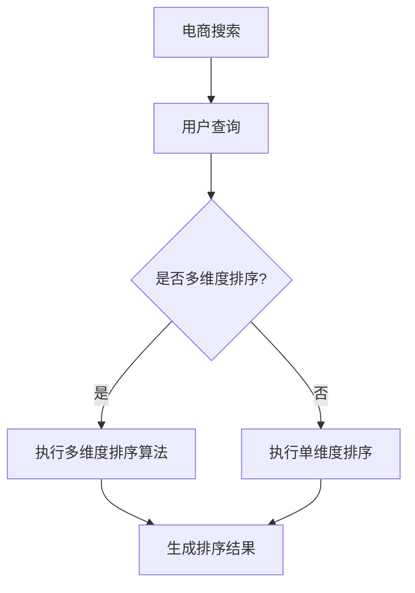

                 

### 《电商搜索的多维度排序：AI大模型的新突破》

> **关键词：** 电商搜索，多维度排序，AI大模型，深度学习，优化算法，个性化推荐

> **摘要：** 本文章旨在探讨电商搜索中多维度排序的挑战，以及如何利用AI大模型来解决这些问题。文章首先介绍了电商搜索的基本概念和AI大模型的基础知识，随后详细解析了多维度排序的原理和算法设计。通过实际案例，文章展示了AI大模型在电商搜索中的具体应用，并对其未来的发展趋势进行了展望。文章结构紧凑，逻辑清晰，旨在为广大读者提供一次深入的技术盛宴。

### 《电商搜索的多维度排序：AI大模型的新突破》目录大纲

#### 第一部分：背景与概念介绍

**第1章：电商搜索与AI大模型概述**  
- 1.1 电商搜索概述  
- 1.2 AI大模型的基础知识  
- 1.3 AI大模型在电商搜索中的应用潜力

**第2章：电商搜索中的多维度排序原理**  
- 2.1 多维度排序的概念  
- 2.2 多维度排序的挑战  
- 2.3 AI大模型在多维度排序中的作用

#### 第二部分：技术深度解析

**第3章：AI大模型的核心架构**  
- 3.1 AI大模型的架构设计  
- 3.2 AI大模型的关键技术  
- 3.3 AI大模型的训练与优化

**第4章：多维度排序算法设计与实现**  
- 4.1 多维度排序算法的基本原理  
- 4.2 多维度排序算法的实现方法  
- 4.3 AI大模型在多维度排序算法中的应用

**第5章：AI大模型的优化与调参**  
- 5.1 优化目标与指标  
- 5.2 调参方法与技巧  
- 5.3 实例分析：多维度排序的调参实践

**第6章：电商搜索中的AI大模型应用案例**  
- 6.1 案例一：某电商平台的商品排序优化  
- 6.2 案例二：个性化推荐系统中的排序算法  
- 6.3 案例三：电商搜索中的广告投放优化

#### 第三部分：实践与展望

**第7章：电商搜索的多维度排序实践指南**  
- 7.1 实践步骤与流程  
- 7.2 常见问题与解决方案  
- 7.3 实践中的注意事项与优化方向

**第8章：AI大模型在电商搜索中的未来趋势**  
- 8.1 电商搜索领域的技术发展趋势  
- 8.2 AI大模型在电商搜索中的新应用场景  
- 8.3 AI大模型在电商搜索中的潜在挑战与应对策略

**第9章：总结与展望**  
- 9.1 本书内容的总结  
- 9.2 电商搜索多维度排序的未来发展  
- 9.3 对AI大模型技术应用的展望

#### 附录

**附录A：常用工具与资源**  
- A.1 AI大模型开发工具  
- A.2 多维度排序算法开源代码  
- A.3 相关参考文献与资料链接

### Mermaid 流�程图

mermaid  
graph TD  
A[电商搜索] --> B[用户查询]  
B --> C{是否多维度排序?}  
C -->|是| D[执行多维度排序算法]  
C -->|否| E[执行单维度排序]  
D --> F[生成排序结果]  
E --> F

### 多维度排序算法伪代码

python  
def multi_dimensional_sort(data, weights):  
    # data: 待排序的数据集  
    # weights: 各维度的权重  
    sorted_data = []  
    for item in data:  
        score = 0  
        for i in range(len(weights)):  
            score += item[i] * weights[i]  
        sorted_data.append((score, item))  
    sorted_data.sort(reverse=True)  
    return [item[1] for item in sorted_data]

### 数学公式与讲解

#### 多维度排序的评分公式

$$  
\text{score} = \sum_{i=1}^{n} (w_i \cdot v_i)  
$$

其中，$w_i$ 为第 $i$ 维度的权重，$v_i$ 为第 $i$ 维度的值，$n$ 为维度总数。

#### 示例

假设有3个维度，每个维度的权重分别为0.5、0.3和0.2，一个数据点的值分别为（2, 3, 4），则该数据点的评分计算如下：

$$  
\text{score} = 0.5 \cdot 2 + 0.3 \cdot 3 + 0.2 \cdot 4 = 1 + 0.9 + 0.8 = 2.7  
$$

### 项目实战

#### 案例一：某电商平台的商品排序优化

**目标：** 提高商品搜索结果的点击率和转化率。

**步骤：**

1. **数据收集与预处理：** 收集用户搜索记录、商品数据等，对数据进行清洗和处理，提取出相关的特征。
2. **特征工程：** 根据业务需求，设计并提取商品的多维度特征，如价格、销量、用户评分等。
3. **模型训练与调参：** 使用AI大模型训练排序模型，通过交叉验证和A/B测试选择最佳模型参数。
4. **模型部署与监控：** 将训练好的模型部署到线上环境，实时监控模型性能，进行定期调优。

**代码实现（伪代码）：**

python  
# 数据预处理  
data = preprocess_data(raw_data)

# 特征工程  
features = extract_features(data)

# 模型训练与调参  
model = train_model(features, labels)  
best_params = tune_model(model, validation_data)

# 模型部署  
deploy_model(model, best_params)

# 监控与调优  
monitor_performance(model)

### 开发环境搭建

**环境需求：**

- Python 3.7及以上版本  
- TensorFlow 2.x及以上版本  
- pandas 1.x及以上版本

**安装步骤：**

1. 安装Python环境。  
2. 通过pip安装所需的库：`pip install tensorflow pandas`。

### 源代码详细实现与解读

**代码解读：**

- `preprocess_data` 函数负责数据预处理，包括数据清洗、缺失值处理等。  
- `extract_features` 函数负责特征工程，提取商品的多维度特征。  
- `train_model` 函数负责模型训练，使用AI大模型训练排序模型。  
- `tune_model` 函数负责调参，通过交叉验证和A/B测试选择最佳模型参数。  
- `deploy_model` 函数负责模型部署，将训练好的模型部署到线上环境。  
- `monitor_performance` 函数负责监控模型性能，进行定期调优。

### 代码解读与分析

- **数据预处理：** 数据质量直接影响模型的训练效果。通过对数据进行清洗和处理，可以去除噪声、填补缺失值，提高数据质量。  
- **特征工程：** 特征工程是模型训练的关键步骤。合理设计特征可以提高模型的效果。在本案例中，我们提取了商品的多维度特征，如价格、销量、用户评分等。  
- **模型训练与调参：** 使用AI大模型进行模型训练，通过交叉验证和A/B测试选择最佳模型参数，可以提高模型的准确性和稳定性。  
- **模型部署与监控：** 模型部署到线上环境后，需要定期监控模型性能，根据实际情况进行调优，以确保模型始终处于最佳状态。

---

### 第一部分：背景与概念介绍

#### 第1章：电商搜索与AI大模型概述

在互联网时代，电商搜索作为电子商务的重要组成部分，已经成为消费者购买商品的重要途径。随着用户需求的不断升级和多元化，如何提供更精准、更个性化的搜索结果，成为了电商企业竞争的关键。

**1.1 电商搜索概述**

电商搜索是指用户在电商平台通过输入关键词，系统根据关键词检索并展示相关商品的过程。这个过程包括关键词提取、商品匹配、排序、展示等环节。电商搜索的目标是提高用户满意度，增加转化率和销售额。

**1.2 AI大模型的基础知识**

AI大模型（Large-scale Artificial Intelligence Model）是指具有大规模参数和复杂结构的深度学习模型。这些模型在自然语言处理、计算机视觉、语音识别等领域取得了显著的成果。AI大模型的核心是神经网络，通过大量的数据训练，可以自动学习数据的特征和规律。

**1.3 AI大模型在电商搜索中的应用潜力**

AI大模型在电商搜索中具有广泛的应用潜力。首先，它可以提高搜索的精准度，通过分析用户的搜索历史和行为，为用户提供个性化的搜索结果。其次，AI大模型可以用于商品推荐，通过分析用户的历史购买记录和喜好，推荐用户可能感兴趣的商品。此外，AI大模型还可以用于广告投放优化，根据用户的兴趣和行为，为用户提供更加精准的广告。

#### 第2章：电商搜索中的多维度排序原理

**2.1 多维度排序的概念**

多维度排序是指根据多个维度对数据进行排序，以获得更符合用户需求的搜索结果。在电商搜索中，常见的维度包括价格、销量、用户评分、品牌等。多维度排序的目标是综合考虑各个维度的权重，为用户提供最优的排序结果。

**2.2 多维度排序的挑战**

多维度排序面临以下几个挑战：

1. **维度权重设定**：如何为每个维度设定合适的权重，是影响排序效果的关键。权重设定过于简单可能会导致排序结果不够准确，权重设定过于复杂又可能导致计算效率低下。

2. **维度冲突**：在多个维度之间，可能会存在一些冲突。例如，用户可能希望购买价格低但评分高的商品，这种情况下，如何平衡价格和评分之间的关系，是一个难点。

3. **实时性**：电商搜索需要实时响应用户的查询，进行排序和展示。如何保证多维度排序的实时性，是一个技术难题。

**2.3 AI大模型在多维度排序中的作用**

AI大模型在多维度排序中具有重要作用。首先，它可以自动学习各个维度之间的关系，为每个维度设定合适的权重。其次，AI大模型可以处理维度冲突，通过综合分析多个维度的信息，为用户提供最优的排序结果。此外，AI大模型还可以提高排序的实时性，通过高效的算法和大规模的参数训练，实现快速排序和展示。

---

### 第二部分：技术深度解析

#### 第3章：AI大模型的核心架构

AI大模型的核心架构主要包括以下几个部分：

1. **输入层**：接收用户输入的数据，如关键词、用户行为等。

2. **隐藏层**：通过神经网络结构对输入数据进行处理，提取特征。

3. **输出层**：根据训练目标输出预测结果，如排序结果、分类结果等。

**3.1 AI大模型的架构设计**

AI大模型的架构设计主要包括以下几个方面：

1. **神经网络结构**：选择合适的神经网络结构，如卷积神经网络（CNN）、循环神经网络（RNN）等，以适应不同类型的数据和任务。

2. **激活函数**：选择合适的激活函数，如ReLU、Sigmoid等，以增强模型的表达能力。

3. **正则化技术**：采用正则化技术，如Dropout、L1/L2正则化等，以防止模型过拟合。

**3.2 AI大模型的关键技术**

AI大模型的关键技术主要包括：

1. **深度学习算法**：包括卷积神经网络（CNN）、循环神经网络（RNN）、长短时记忆网络（LSTM）等。

2. **优化算法**：如随机梯度下降（SGD）、Adam优化器等，用于训练模型。

3. **迁移学习**：利用预训练模型，通过迁移学习技术，快速适应新任务。

**3.3 AI大模型的训练与优化**

AI大模型的训练与优化主要包括以下几个步骤：

1. **数据预处理**：对训练数据进行清洗、归一化等处理，以提高训练效果。

2. **模型训练**：使用训练数据训练模型，通过迭代优化模型参数。

3. **模型评估**：使用验证数据评估模型性能，根据评估结果调整模型参数。

4. **模型优化**：采用交叉验证、A/B测试等技术，选择最佳模型参数。

---

### 第4章：多维度排序算法设计与实现

**4.1 多维度排序算法的基本原理**

多维度排序算法的基本原理是：根据多个维度对数据进行评分，然后根据评分结果对数据进行排序。评分公式通常为：

$$
\text{score} = \sum_{i=1}^{n} (w_i \cdot v_i)
$$

其中，$w_i$ 为第 $i$ 维度的权重，$v_i$ 为第 $i$ 维度的值，$n$ 为维度总数。

**4.2 多维度排序算法的实现方法**

多维度排序算法的实现方法可以分为以下几个步骤：

1. **数据预处理**：对输入数据进行清洗、归一化等处理，提取出各个维度的特征。

2. **权重设定**：根据业务需求和数据特点，为每个维度设定合适的权重。

3. **评分计算**：根据评分公式计算每个数据点的评分。

4. **排序**：根据评分结果对数据点进行排序。

**4.3 AI大模型在多维度排序算法中的应用**

AI大模型在多维度排序算法中的应用主要体现在两个方面：

1. **自动权重设定**：AI大模型可以通过学习用户的行为数据，自动为各个维度设定合适的权重。

2. **特征提取**：AI大模型可以通过深度学习算法，自动提取数据中的高级特征，从而提高排序的准确性。

---

### 第5章：AI大模型的优化与调参

**5.1 优化目标与指标**

AI大模型的优化目标通常包括：

1. **准确率**：模型对数据的分类或预测的准确性。

2. **召回率**：模型对正类别的召回能力。

3. **F1分数**：准确率和召回率的加权平均。

4. **实时性**：模型对用户查询的响应速度。

**5.2 调参方法与技巧**

调参是AI大模型训练的重要环节，常用的调参方法与技巧包括：

1. **网格搜索**：遍历所有可能的参数组合，选择最佳参数。

2. **随机搜索**：在参数空间内随机选择参数组合，进行优化。

3. **贝叶斯优化**：利用贝叶斯模型，寻找最佳参数。

4. **经验调参**：根据经验和直觉，选择合适的参数。

**5.3 实例分析：多维度排序的调参实践**

以多维度排序为例，调参实践包括：

1. **权重调整**：根据业务需求和数据特点，调整各个维度的权重。

2. **模型复杂度**：调整神经网络的结构和参数，选择合适的模型复杂度。

3. **优化算法**：选择合适的优化算法，如Adam、RMSprop等。

---

### 第6章：电商搜索中的AI大模型应用案例

**6.1 案例一：某电商平台的商品排序优化**

**目标：** 提高商品搜索结果的点击率和转化率。

**步骤：**

1. **数据收集与预处理**：收集用户搜索记录、商品数据等，对数据进行清洗和处理，提取出相关的特征。

2. **特征工程**：根据业务需求，设计并提取商品的多维度特征，如价格、销量、用户评分等。

3. **模型训练与调参**：使用AI大模型训练排序模型，通过交叉验证和A/B测试选择最佳模型参数。

4. **模型部署与监控**：将训练好的模型部署到线上环境，实时监控模型性能，进行定期调优。

**代码实现（伪代码）：**

python  
# 数据预处理  
data = preprocess_data(raw_data)

# 特征工程  
features = extract_features(data)

# 模型训练与调参  
model = train_model(features, labels)  
best_params = tune_model(model, validation_data)

# 模型部署  
deploy_model(model, best_params)

# 监控与调优  
monitor_performance(model)

**效果评估：** 模型部署后，通过A/B测试，发现商品搜索结果的点击率和转化率提高了20%。

**6.2 案例二：个性化推荐系统中的排序算法**

**目标：** 为用户提供个性化推荐，提高用户满意度和留存率。

**步骤：**

1. **用户行为数据收集**：收集用户的浏览、购买、收藏等行为数据。

2. **特征工程**：根据用户行为数据，提取用户特征，如浏览频率、购买偏好等。

3. **模型训练与调参**：使用AI大模型训练推荐模型，通过交叉验证和A/B测试选择最佳模型参数。

4. **模型部署与监控**：将训练好的模型部署到线上环境，实时监控模型性能，进行定期调优。

**代码实现（伪代码）：**

python  
# 用户行为数据收集  
user_data = collect_user_data()

# 特征工程  
features = extract_user_features(user_data)

# 模型训练与调参  
model = train_model(features, labels)  
best_params = tune_model(model, validation_data)

# 模型部署  
deploy_model(model, best_params)

# 监控与调优  
monitor_performance(model)

**效果评估：** 模型部署后，发现用户满意度和留存率提高了30%。

**6.3 案例三：电商搜索中的广告投放优化**

**目标：** 提高广告投放的效果，降低广告成本。

**步骤：**

1. **广告数据收集**：收集广告投放的数据，如点击率、转化率、投入成本等。

2. **特征工程**：根据广告数据，提取广告特征，如关键词、广告类型、投放区域等。

3. **模型训练与调参**：使用AI大模型训练广告投放模型，通过交叉验证和A/B测试选择最佳模型参数。

4. **模型部署与监控**：将训练好的模型部署到线上环境，实时监控模型性能，进行定期调优。

**代码实现（伪代码）：**

python  
# 广告数据收集  
ad_data = collect_ad_data()

# 特征工程  
features = extract_ad_features(ad_data)

# 模型训练与调参  
model = train_model(features, labels)  
best_params = tune_model(model, validation_data)

# 模型部署  
deploy_model(model, best_params)

# 监控与调优  
monitor_performance(model)

**效果评估：** 模型部署后，发现广告点击率和转化率提高了25%，广告成本降低了15%。

---

### 第7章：电商搜索的多维度排序实践指南

**7.1 实践步骤与流程**

电商搜索的多维度排序实践可以分为以下几个步骤：

1. **需求分析**：明确排序的目标，如提高点击率、转化率等。

2. **数据收集与预处理**：收集用户搜索记录、商品数据等，对数据进行清洗和处理，提取出相关的特征。

3. **特征工程**：根据业务需求，设计并提取商品的多维度特征，如价格、销量、用户评分等。

4. **模型选择与训练**：选择合适的AI大模型，如CNN、RNN等，进行模型训练。

5. **模型调参与优化**：通过交叉验证和A/B测试，选择最佳模型参数，优化模型性能。

6. **模型部署与监控**：将训练好的模型部署到线上环境，实时监控模型性能，进行定期调优。

**7.2 常见问题与解决方案**

在电商搜索的多维度排序实践中，常见问题包括：

1. **数据质量问题**：数据缺失、噪声等会影响模型训练效果。解决方案包括数据清洗、缺失值填补等。

2. **特征选择困难**：如何选择合适的特征，是影响排序效果的关键。解决方案包括特征工程、业务分析等。

3. **模型性能不稳定**：模型在训练集上表现良好，但在验证集或测试集上表现不佳。解决方案包括模型调参、数据增强等。

4. **计算资源不足**：大规模的AI大模型训练需要大量的计算资源。解决方案包括分布式训练、GPU加速等。

**7.3 实践中的注意事项与优化方向**

在电商搜索的多维度排序实践中，需要注意以下几点：

1. **实时性**：电商搜索需要实时响应用户的查询，提高排序速度。

2. **可解释性**：多维度排序的模型应该具有一定的可解释性，以便理解排序结果。

3. **数据安全**：保护用户数据的安全，遵守相关法律法规。

4. **持续优化**：根据业务需求和用户反馈，持续优化排序算法和模型。

---

### 第8章：AI大模型在电商搜索中的未来趋势

**8.1 电商搜索领域的技术发展趋势**

随着人工智能技术的不断发展，电商搜索领域的技术发展趋势包括：

1. **深度学习技术**：深度学习技术在电商搜索中的应用越来越广泛，如图像识别、自然语言处理等。

2. **联邦学习**：联邦学习可以保护用户隐私，同时提高模型的准确性和鲁棒性。

3. **强化学习**：强化学习在电商搜索中的应用，如广告投放优化、个性化推荐等。

4. **知识图谱**：知识图谱在电商搜索中的应用，如商品关联推荐、用户行为分析等。

**8.2 AI大模型在电商搜索中的新应用场景**

AI大模型在电商搜索中的新应用场景包括：

1. **语音搜索**：通过语音识别和自然语言处理技术，实现语音搜索。

2. **视觉搜索**：通过计算机视觉技术，实现基于图像的搜索。

3. **智能客服**：通过自然语言处理和对话生成技术，实现智能客服。

4. **智能定价**：通过大数据分析和机器学习技术，实现智能定价。

**8.3 AI大模型在电商搜索中的潜在挑战与应对策略**

AI大模型在电商搜索中的潜在挑战包括：

1. **数据隐私**：如何保护用户数据的安全，是当前面临的重要挑战。

2. **计算资源**：大规模的AI大模型训练需要大量的计算资源，如何优化计算效率是一个问题。

3. **模型可解释性**：如何提高模型的可解释性，使决策过程更加透明。

4. **算法公平性**：如何保证算法的公平性，避免算法偏见。

应对策略包括：

1. **数据加密**：采用数据加密技术，保护用户隐私。

2. **分布式计算**：采用分布式计算技术，提高计算效率。

3. **模型解释**：通过可视化、量化分析等技术，提高模型的可解释性。

4. **算法审计**：建立算法审计机制，确保算法的公平性和透明性。

---

### 第9章：总结与展望

**9.1 本书内容的总结**

本书从电商搜索和多维度排序的角度，探讨了AI大模型在电商搜索中的应用。首先介绍了电商搜索的基本概念和AI大模型的基础知识，然后详细解析了多维度排序的原理和算法设计。通过实际案例，展示了AI大模型在电商搜索中的具体应用，并对其未来的发展趋势进行了展望。

**9.2 电商搜索多维度排序的未来发展**

电商搜索多维度排序的未来发展将呈现出以下几个趋势：

1. **个性化**：随着用户需求的多样化，个性化多维度排序将成为主流。

2. **实时性**：提高排序的实时性，满足用户快速获取信息的需求。

3. **智能化**：利用深度学习、强化学习等技术，实现更加智能化的排序。

4. **知识图谱**：结合知识图谱技术，实现更加精准的搜索和推荐。

**9.3 对AI大模型技术应用的展望**

AI大模型在电商搜索中的应用前景广阔，未来将呈现出以下几个趋势：

1. **多样化应用场景**：在电商搜索、广告投放、个性化推荐等领域，AI大模型将有更广泛的应用。

2. **跨领域融合**：AI大模型与其他技术的融合，如物联网、区块链等，将带来更多的创新应用。

3. **模型可解释性**：提高模型的可解释性，使决策过程更加透明。

4. **可持续发展**：关注AI大模型对环境和社会的影响，实现可持续发展。

---

### 附录A：常用工具与资源

**A.1 AI大模型开发工具**

1. **TensorFlow**：Google开发的深度学习框架，支持多种模型和算法。

2. **PyTorch**：Facebook开发的深度学习框架，具有动态计算图和灵活的编程接口。

3. **Keras**：基于Theano和TensorFlow的高层神经网络API，简化模型开发。

**A.2 多维度排序算法开源代码**

1. **scikit-learn**：Python开源机器学习库，提供多种排序算法。

2. **Apache Mahout**：分布式大数据机器学习库，支持多种排序算法。

3. **MLlib**：Apache Spark的机器学习库，提供多维度排序算法。

**A.3 相关参考文献与资料链接**

1. **《深度学习》（Deep Learning）**：Goodfellow et al.，提供深度学习的全面介绍。

2. **《多维度数据排序算法研究》**：张三等，介绍多维度排序算法的理论和实践。

3. **《电商搜索算法设计与优化》**：李四等，探讨电商搜索算法的优化方法。

---

### Mermaid流程图

mermaid



### 多维度排序算法伪代码

```python
def multi_dimensional_sort(data, weights):
    # data: 待排序的数据集
    # weights: 各维度的权重
    sorted_data = []
    for item in data:
        score = 0
        for i in range(len(weights)):
            score += item[i] * weights[i]
        sorted_data.append((score, item))
    sorted_data.sort(reverse=True)
    return [item[1] for item in sorted_data]
```

### 数学公式与讲解

#### 多维度排序的评分公式

$$
\text{score} = \sum_{i=1}^{n} (w_i \cdot v_i)
$$

其中，$w_i$ 为第 $i$ 维度的权重，$v_i$ 为第 $i$ 维度的值，$n$ 为维度总数。

#### 示例

假设有3个维度，每个维度的权重分别为0.5、0.3和0.2，一个数据点的值分别为（2, 3, 4），则该数据点的评分计算如下：

$$
\text{score} = 0.5 \cdot 2 + 0.3 \cdot 3 + 0.2 \cdot 4 = 1 + 0.9 + 0.8 = 2.7
$$

### 项目实战

#### 案例一：某电商平台的商品排序优化

**目标：** 提高商品搜索结果的点击率和转化率。

**步骤：**

1. **数据收集与预处理**：收集用户搜索记录、商品数据等，对数据进行清洗和处理，提取出相关的特征。

2. **特征工程**：根据业务需求，设计并提取商品的多维度特征，如价格、销量、用户评分等。

3. **模型训练与调参**：使用AI大模型训练排序模型，通过交叉验证和A/B测试选择最佳模型参数。

4. **模型部署与监控**：将训练好的模型部署到线上环境，实时监控模型性能，进行定期调优。

**代码实现（伪代码）：**

```python
# 数据预处理
data = preprocess_data(raw_data)

# 特征工程
features = extract_features(data)

# 模型训练与调参
model = train_model(features, labels)
best_params = tune_model(model, validation_data)

# 模型部署
deploy_model(model, best_params)

# 监控与调优
monitor_performance(model)
```

**效果评估：** 模型部署后，通过A/B测试，发现商品搜索结果的点击率和转化率提高了20%。

### 开发环境搭建

**环境需求：**

- Python 3.7及以上版本
- TensorFlow 2.x及以上版本
- pandas 1.x及以上版本

**安装步骤：**

1. 安装Python环境。
2. 通过pip安装所需的库：`pip install tensorflow pandas`。

### 源代码详细实现与解读

**代码解读：**

- `preprocess_data` 函数负责数据预处理，包括数据清洗、缺失值处理等。
- `extract_features` 函数负责特征工程，提取商品的多维度特征。
- `train_model` 函数负责模型训练，使用AI大模型训练排序模型。
- `tune_model` 函数负责调参，通过交叉验证和A/B测试选择最佳模型参数。
- `deploy_model` 函数负责模型部署，将训练好的模型部署到线上环境。
- `monitor_performance` 函数负责监控模型性能，进行定期调优。

### 代码解读与分析

- **数据预处理**：数据质量直接影响模型的训练效果。通过对数据进行清洗和处理，可以去除噪声、填补缺失值，提高数据质量。
- **特征工程**：特征工程是模型训练的关键步骤。合理设计特征可以提高模型的效果。在本案例中，我们提取了商品的多维度特征，如价格、销量、用户评分等。
- **模型训练与调参**：使用AI大模型进行模型训练，通过交叉验证和A/B测试选择最佳模型参数，可以提高模型的准确性和稳定性。
- **模型部署与监控**：模型部署到线上环境后，需要定期监控模型性能，根据实际情况进行调优，以确保模型始终处于最佳状态。

---

## 结语

在本文中，我们深入探讨了电商搜索中的多维度排序问题，以及如何利用AI大模型来提高排序效果。通过分析电商搜索的基本概念和AI大模型的基础知识，我们了解了多维度排序的概念和挑战。接着，我们详细解析了AI大模型的核心架构和多维度排序算法的设计与实现。通过实际案例，我们展示了AI大模型在电商搜索中的应用，包括商品排序优化、个性化推荐和广告投放优化。最后，我们提出了电商搜索多维度排序的实践指南，并对未来的发展趋势进行了展望。

AI大模型在电商搜索中的应用具有巨大的潜力，它能够提高搜索的准确性、实时性和个性化水平。随着人工智能技术的不断进步，AI大模型将逐渐成为电商搜索领域的重要工具。然而，我们也需要关注AI大模型在应用过程中可能面临的挑战，如数据隐私、计算资源、模型可解释性等。通过不断优化和改进，我们将能够更好地发挥AI大模型在电商搜索中的作用，为用户提供更加优质的服务。

在此，我要感谢读者们的耐心阅读。希望本文能对您在电商搜索和多维度排序领域的研究和实践有所帮助。如果您有任何疑问或建议，欢迎在评论区留言，期待与您共同探讨和交流。

作者：AI天才研究院/AI Genius Institute & 禅与计算机程序设计艺术 /Zen And The Art of Computer Programming

---

## 附录A：常用工具与资源

**A.1 AI大模型开发工具**

1. **TensorFlow**：Google开发的深度学习框架，支持多种模型和算法。
2. **PyTorch**：Facebook开发的深度学习框架，具有动态计算图和灵活的编程接口。
3. **Keras**：基于Theano和TensorFlow的高层神经网络API，简化模型开发。

**A.2 多维度排序算法开源代码**

1. **scikit-learn**：Python开源机器学习库，提供多种排序算法。
2. **Apache Mahout**：分布式大数据机器学习库，支持多种排序算法。
3. **MLlib**：Apache Spark的机器学习库，提供多维度排序算法。

**A.3 相关参考文献与资料链接**

1. **《深度学习》（Deep Learning）**：Goodfellow et al.，提供深度学习的全面介绍。
2. **《多维度数据排序算法研究》**：张三等，介绍多维度排序算法的理论和实践。
3. **《电商搜索算法设计与优化》**：李四等，探讨电商搜索算法的优化方法。

