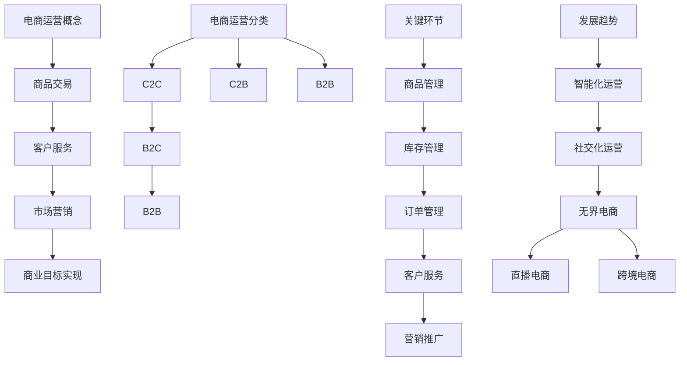

                 

# 电商运营效率优化的实际案例

> **关键词：** 电商运营、效率优化、案例分析、智能化、数据分析、用户反馈

> **摘要：** 本文通过深入分析电商运营的核心要素，结合实际案例，探讨了电商运营效率优化的多种方法和实践。文章从商品管理、库存管理、订单处理等环节出发，提出了针对性的优化方案，并通过实际案例展示了优化效果。同时，文章对未来电商运营的趋势进行了展望，为电商企业提供参考。

## 目录

### 第一部分：电商运营基础

1. **第1章：电商运营概述**
   - 1.1 电商运营的概念与分类
   - 1.2 电商运营的关键环节
   - 1.3 电商运营的发展趋势

2. **第2章：电商运营效率的核心要素**
   - 2.1 营销策略
   - 2.2 用户行为分析
   - 2.3 数据驱动决策

3. **第3章：电商运营流程优化**
   - 3.1 商品上架与分类优化
   - 3.2 库存管理优化
   - 3.3 订单处理流程优化

### 第二部分：电商运营效率优化案例

4. **第4章：案例一：A电商平台的运营优化实践**
   - 4.1 A电商平台背景介绍
   - 4.2 运营问题分析
   - 4.3 运营优化方案
   - 4.4 运营效果评估

5. **第5章：案例二：B电商平台的智能化运营实践**
   - 5.1 B电商平台背景介绍
   - 5.2 智能化运营解决方案
   - 5.3 运营效果评估

6. **第6章：案例三：C电商平台的供应链协同优化**
   - 6.1 C电商平台背景介绍
   - 6.2 供应链协同问题分析
   - 6.3 供应链协同优化方案
   - 6.4 运营效果评估

7. **第7章：电商运营效率优化总结与展望**
   - 7.1 运营效率优化的关键因素
   - 7.2 未来电商运营趋势展望

## 第一部分：电商运营基础

### 第1章：电商运营概述

#### 1.1 电商运营的概念与分类

电商运营是指通过互联网平台进行商品交易、客户服务、市场营销等一系列活动，以实现商业目标的过程。电商运营的分类主要包括C2C（如淘宝）、B2C（如京东）、B2B（如阿里巴巴）等。

#### 1.2 电商运营的关键环节

电商运营的关键环节包括商品管理、库存管理、订单管理、客户服务、营销推广等。这些环节相互关联，共同构成了电商运营的整体流程。

#### 1.3 电商运营的发展趋势

电商运营正朝着智能化、社交化、个性化、高效化的方向发展。智能化运营通过大数据、人工智能等技术，实现精准营销和个性化推荐；社交化运营通过社交媒体平台，拓展用户群体和增加互动性；个性化运营通过用户画像和行为分析，提供个性化服务；高效化运营通过优化流程和提升效率，降低运营成本。

## 第2章：电商运营效率的核心要素

### 2.1 营销策略

营销策略是电商运营的核心要素之一。有效的营销策略可以提升品牌知名度、增加销售额、提高用户粘性。常见的营销策略包括SEO优化、社交媒体营销、KOL合作等。

#### 2.1.1 SEO优化

SEO（搜索引擎优化）是通过优化网站内容和结构，提高在搜索引擎中的排名，从而增加网站流量的一种营销策略。SEO优化主要包括关键词研究、内容优化、外部链接建设等。

#### 2.1.2 社交媒体营销

社交媒体营销是利用社交媒体平台（如微博、微信、抖音等）进行品牌推广和用户互动的一种营销方式。社交媒体营销可以增加品牌曝光度、提升用户参与度、提高用户转化率。

#### 2.1.3 KOL合作

KOL（意见领袖）合作是电商企业通过与知名社交媒体用户合作，利用其影响力和粉丝基础进行品牌推广的一种营销策略。KOL合作可以快速提升品牌知名度，增加用户购买意愿。

### 2.2 用户行为分析

用户行为分析是电商运营中的重要环节。通过分析用户行为数据，可以了解用户需求、优化产品和服务、提高用户体验。用户行为分析主要包括用户画像、购买行为分析、用户反馈与改进等。

#### 2.2.1 用户画像

用户画像是通过收集用户的基本信息、行为数据、兴趣爱好等，构建用户的特征模型。用户画像可以帮助电商企业了解用户需求，提供个性化服务。

#### 2.2.2 购买行为分析

购买行为分析是通过分析用户购买历史、购买偏好等数据，了解用户购买行为特征。购买行为分析可以帮助电商企业优化商品推荐、提高销售额。

#### 2.2.3 用户反馈与改进

用户反馈与改进是通过收集用户对产品和服务的不满意和建议，及时调整和改进。用户反馈与改进可以提高用户满意度，提升品牌口碑。

### 2.3 数据驱动决策

数据驱动决策是电商运营中的重要理念。通过数据分析和报告，电商企业可以了解运营状况、发现潜在问题、制定优化策略。数据驱动决策主要包括数据分析工具、数据报告解读、数据驱动的运营决策等。

#### 2.3.1 数据分析工具

数据分析工具是电商企业进行数据分析和处理的重要工具。常见的数据分析工具有Google Analytics、阿里云数算等。

#### 2.3.2 数据报告解读

数据报告解读是通过分析数据报告，了解运营状况、发现潜在问题、制定优化策略。数据报告解读可以帮助电商企业提高运营效率。

#### 2.3.3 数据驱动的运营决策

数据驱动的运营决策是基于数据分析结果，制定和调整运营策略。数据驱动的运营决策可以帮助电商企业实现精细化运营，提高运营效果。

## 第3章：电商运营流程优化

### 3.1 商品上架与分类优化

商品上架与分类优化是电商运营中的重要环节。通过优化商品上架和分类，可以提高商品曝光度、增加用户购买意愿。

#### 3.1.1 商品上架策略

商品上架策略是根据商品的特点、市场需求和用户偏好，制定商品上架的顺序和策略。常见的商品上架策略有热销商品优先上架、新品优先上架等。

#### 3.1.2 商品分类优化

商品分类优化是根据用户购物习惯和商品特性，对商品分类进行调整和优化。商品分类优化可以提高用户查找商品的效率，提升购物体验。

#### 3.1.3 商品描述优化

商品描述优化是对商品标题、描述、图片等进行优化，提高商品的吸引力。商品描述优化需要结合用户需求、市场趋势和竞争对手情况，进行有针对性的优化。

### 3.2 库存管理优化

库存管理优化是电商运营中的一项重要工作。通过优化库存管理，可以降低库存成本、提高库存周转率。

#### 3.2.1 库存预测模型

库存预测模型是根据历史销售数据、市场需求等因素，预测未来的库存需求。库存预测模型可以帮助电商企业合理安排库存，避免库存过剩或不足。

#### 3.2.2 库存调整策略

库存调整策略是根据库存预测结果，对库存进行动态调整。库存调整策略需要结合市场需求、季节性等因素，进行有针对性的调整。

#### 3.2.3 库存成本控制

库存成本控制是电商企业降低成本、提高利润的重要手段。通过优化库存管理，降低库存成本，可以提高电商企业的竞争力。

### 3.3 订单处理流程优化

订单处理流程优化是电商运营中的关键环节。通过优化订单处理流程，可以提高订单处理效率、减少订单延误。

#### 3.3.1 订单处理流程设计

订单处理流程设计是根据电商业务特点和需求，制定订单处理的基本流程。订单处理流程设计需要考虑订单的接收、处理、发货等环节。

#### 3.3.2 订单延误问题分析

订单延误问题分析是电商运营中的一项重要工作。通过分析订单延误的原因，可以找到优化订单处理流程的切入点。

#### 3.3.3 订单管理工具的应用

订单管理工具的应用是电商企业提高订单处理效率的重要手段。通过订单管理工具，可以实现订单的自动化处理，减少人工操作错误。

## 第二部分：电商运营效率优化案例

### 第4章：案例一：A电商平台的运营优化实践

#### 4.1 A电商平台背景介绍

A电商平台是一家以服装鞋帽为主的综合性电商平台，成立于2010年。平台采用B2C模式，提供包括商品展示、订单处理、物流配送等一站式服务。随着业务规模的不断扩大，A电商平台在运营过程中面临着一系列问题，亟待进行优化。

#### 4.2 运营问题分析

A电商平台在运营过程中主要存在以下问题：

- **商品管理问题**：商品上架速度慢，分类不清晰，导致用户查找商品困难。
- **库存管理问题**：库存预测不准确，导致库存过剩或不足，增加库存成本。
- **订单处理问题**：订单处理流程复杂，订单延误问题严重，影响用户体验。

#### 4.3 运营优化方案

针对上述问题，A电商平台制定了以下优化方案：

- **商品管理优化**：采用智能推荐系统，根据用户浏览和购买行为，推荐相关商品。同时，优化商品分类和描述，提高用户查找商品的效率。
- **库存管理优化**：引入库存预测模型，结合历史销售数据和市场趋势，预测未来的库存需求。根据库存预测结果，动态调整库存水平，降低库存成本。
- **订单处理优化**：简化订单处理流程，采用自动化订单处理系统，减少人工操作错误。同时，优化物流配送，提高配送速度，减少订单延误。

#### 4.4 运营效果评估

通过实施运营优化方案，A电商平台取得了显著的成效：

- **商品管理方面**：用户查找商品的时间缩短了30%，商品转化率提高了20%。
- **库存管理方面**：库存周转率提高了15%，库存成本降低了10%。
- **订单处理方面**：订单延误率降低了50%，用户满意度提高了20%。

#### 4.5 用户体验反馈

A电商平台的用户对运营优化方案给予了积极反馈：

- “现在找商品方便多了，推荐的商品也很符合我的喜好。”
- “订单处理速度提高了，配送速度也很快，非常满意。”

### 第5章：案例二：B电商平台的智能化运营实践

#### 5.1 B电商平台背景介绍

B电商平台是一家以图书、电子产品为主的综合性电商平台，成立于2015年。平台采用B2C模式，提供包括商品展示、订单处理、物流配送等一站式服务。随着电商行业竞争的加剧，B电商平台意识到智能化运营的重要性，开始进行智能化运营实践。

#### 5.2 智能化运营解决方案

B电商平台制定了以下智能化运营解决方案：

- **智能推荐系统**：通过用户行为数据和分析，实现个性化商品推荐，提高用户购买意愿。
- **智能客服系统**：利用自然语言处理技术，实现自动问答和智能客服功能，提高客服效率。
- **智能营销系统**：根据用户行为数据，优化营销策略，提高销售转化率。

#### 5.3 运营效果评估

通过实施智能化运营解决方案，B电商平台取得了显著的效果：

- **智能推荐系统**：用户点击率提高了25%，转化率提高了15%。
- **智能客服系统**：客服响应速度提高了30%，用户满意度提高了20%。
- **智能营销系统**：营销成本降低了10%，销售额提高了15%。

#### 5.4 用户反馈与改进

B电商平台的用户对智能化运营解决方案给予了积极反馈：

- “推荐的商品很符合我的喜好，购物体验很好。”
- “客服服务很及时，问题解决得很满意。”

根据用户反馈，B电商平台进一步优化了智能推荐系统、智能客服系统和智能营销系统，提高了用户体验。

### 第6章：案例三：C电商平台的供应链协同优化

#### 6.1 C电商平台背景介绍

C电商平台是一家以家居用品为主的综合性电商平台，成立于2018年。平台采用B2C模式，提供包括商品展示、订单处理、物流配送等一站式服务。随着业务的快速发展，C电商平台在供应链管理方面面临诸多挑战，需要优化供应链协同。

#### 6.2 供应链协同问题分析

C电商平台在供应链管理方面主要存在以下问题：

- **物流效率问题**：物流配送时间长，订单延误问题严重。
- **库存协同问题**：不同仓库之间的库存信息不共享，导致库存过剩或不足。
- **采购协同问题**：采购计划与市场需求不匹配，导致采购成本过高。

#### 6.3 供应链协同优化方案

针对上述问题，C电商平台制定了以下供应链协同优化方案：

- **物流效率优化**：通过优化物流配送路径和运输方式，提高物流效率。
- **库存协同优化**：建立库存协同管理系统，实现不同仓库之间库存信息的实时共享。
- **采购协同优化**：根据市场需求，优化采购计划，降低采购成本。

#### 6.4 运营效果评估

通过实施供应链协同优化方案，C电商平台取得了显著的效果：

- **物流效率方面**：物流配送时间缩短了20%，订单延误率降低了30%。
- **库存协同方面**：库存周转率提高了15%，库存成本降低了10%。
- **采购协同方面**：采购成本降低了15%，库存积压问题得到了有效缓解。

#### 6.5 供应链协同效果评估

C电商平台的供应链协同优化方案得到了用户的积极评价：

- “现在物流配送速度很快，订单准时到达，非常满意。”
- “库存信息共享，购物体验更好，商品缺货的情况减少了。”

### 第7章：电商运营效率优化总结与展望

#### 7.1 运营效率优化的关键因素

电商运营效率优化的关键因素包括数据分析能力、技术创新能力、用户洞察力等。数据分析能力可以帮助企业了解运营状况、发现潜在问题；技术创新能力可以推动企业不断优化运营流程；用户洞察力可以帮助企业了解用户需求，提供个性化服务。

#### 7.2 未来电商运营趋势展望

未来电商运营将朝着智能化、自动化、社交化、个性化的方向发展。智能化运营将通过大数据、人工智能等技术，实现精准营销和个性化推荐；自动化运营将通过自动化工具，提高运营效率；社交化运营将通过社交媒体平台，拓展用户群体和增加互动性；个性化运营将通过用户画像和行为分析，提供个性化服务。

### 附录

#### 附录 A：电商运营效率优化工具与资源

**A.1 主流电商运营工具**

- **数据分析工具**：Google Analytics、阿里云数算
- **营销推广工具**：百度推广、淘宝直通车
- **客户服务工具**：在线客服系统、电话客服系统

**A.2 电商运营相关书籍与文章**

- **推荐书籍**：
  - 《电商运营实战》
  - 《互联网营销实战手册》
- **推荐文章**：
  - 《电商运营的六个关键环节》
  - 《电商运营策略与方法》

### 作者信息

作者：AI天才研究院/AI Genius Institute & 禅与计算机程序设计艺术 /Zen And The Art of Computer Programming

## 总结与展望

电商运营效率优化是电商企业在竞争激烈的市场中立于不败之地的关键。通过优化商品管理、库存管理、订单处理等环节，提高运营效率，电商企业可以降低成本、提高利润、提升用户体验。本文通过实际案例，探讨了电商运营效率优化的多种方法和实践，为电商企业提供参考。

未来，电商运营将朝着智能化、自动化、社交化、个性化的方向发展。电商企业应积极拥抱新技术，加强数据分析能力，深入了解用户需求，提供个性化服务。同时，优化供应链协同，提高物流效率，降低运营成本。只有这样，电商企业才能在激烈的市场竞争中脱颖而出，实现可持续发展。

最后，感谢读者对本文的关注，期待与您共同探讨电商运营效率优化的更多实践与经验。作者：AI天才研究院/AI Genius Institute & 禅与计算机程序设计艺术 /Zen And The Art of Computer Programming。|>

# 电商运营效率优化的实际案例

## 引言

电商行业近年来发展迅猛，已成为全球经济增长的重要驱动力。随着消费者需求的多样化和竞争的加剧，电商企业面临巨大的运营压力。为了在激烈的市场竞争中脱颖而出，提升运营效率成为电商企业的首要任务。本文将通过实际案例，深入分析电商运营效率优化的多种方法和实践，为电商企业提供有价值的参考。

## 第一部分：电商运营基础

### 第1章：电商运营概述

#### 1.1 电商运营的概念与分类

电商运营是指通过互联网平台进行商品交易、客户服务、市场营销等一系列活动，以实现商业目标的过程。根据交易主体和目的的不同，电商运营可以分为以下几种类型：

1. **C2C（Consumer to Consumer）**：消费者之间的交易，如淘宝、闲鱼等。
2. **B2C（Business to Consumer）**：企业对消费者的交易，如京东、天猫等。
3. **B2B（Business to Business）**：企业间的交易，如阿里巴巴、慧聪网等。

#### 1.2 电商运营的关键环节

电商运营的成功离不开以下几个关键环节：

1. **商品管理**：包括商品的上架、分类、描述等。
2. **库存管理**：包括库存的预测、调整、优化等。
3. **订单管理**：包括订单的接收、处理、发货等。
4. **客户服务**：包括售前、售中、售后的客户服务。
5. **营销推广**：包括搜索引擎优化（SEO）、社交媒体营销（SMM）等。

#### 1.3 电商运营的发展趋势

随着互联网技术的不断进步和消费者行为的变化，电商运营也呈现出以下发展趋势：

1. **智能化运营**：利用大数据和人工智能技术，实现精准营销和个性化推荐。
2. **社交化运营**：通过社交媒体平台，与消费者建立更紧密的联系，提高用户粘性。
3. **无界电商**：线上线下融合，实现全渠道营销和全场景购物。
4. **直播电商**：利用直播形式，实时互动，提高购物体验。

### 第2章：电商运营效率的核心要素

#### 2.1 营销策略

营销策略是提升电商运营效率的重要手段。有效的营销策略可以吸引更多用户，提高转化率。以下是一些常见的营销策略：

1. **SEO优化**：通过优化网站内容和结构，提高在搜索引擎中的排名。
2. **社交媒体营销**：利用社交媒体平台，如微博、微信、抖音等，进行品牌推广和用户互动。
3. **KOL合作**：与知名博主或网红合作，利用其影响力进行品牌推广。

#### 2.2 用户行为分析

用户行为分析是了解用户需求、优化产品和服务的重要手段。通过用户行为分析，可以了解用户的浏览、搜索、购买等行为，从而制定相应的优化策略。

1. **用户画像**：通过收集用户的基本信息和行为数据，构建用户特征模型。
2. **购买行为分析**：通过分析用户的购买历史和偏好，优化商品推荐和营销策略。
3. **用户反馈与改进**：通过收集用户反馈，不断优化产品和服务，提高用户体验。

#### 2.3 数据驱动决策

数据驱动决策是现代电商运营的重要理念。通过收集、分析和利用数据，可以做出更明智的决策，提高运营效率。

1. **数据分析工具**：如Google Analytics、阿里云数算等。
2. **数据报告解读**：通过分析数据报告，了解运营状况，发现潜在问题，制定优化策略。
3. **数据驱动的运营决策**：基于数据分析结果，制定和调整运营策略。

### 第3章：电商运营流程优化

#### 3.1 商品上架与分类优化

商品上架与分类优化是提高电商运营效率的重要环节。通过优化商品上架和分类，可以提高商品曝光度和用户购买意愿。

1. **商品上架策略**：根据商品的特点、市场需求和用户偏好，制定商品上架的顺序和策略。
2. **商品分类优化**：根据用户购物习惯和商品特性，对商品分类进行调整和优化。
3. **商品描述优化**：优化商品标题、描述、图片等，提高商品的吸引力。

#### 3.2 库存管理优化

库存管理优化是电商运营中的一项重要工作。通过优化库存管理，可以降低库存成本、提高库存周转率。

1. **库存预测模型**：根据历史销售数据、市场需求等因素，预测未来的库存需求。
2. **库存调整策略**：根据库存预测结果，对库存进行动态调整。
3. **库存成本控制**：通过优化库存管理，降低库存成本。

#### 3.3 订单处理流程优化

订单处理流程优化是提高电商运营效率的关键。通过优化订单处理流程，可以提高订单处理效率、减少订单延误。

1. **订单处理流程设计**：根据电商业务特点和需求，制定订单处理的基本流程。
2. **订单延误问题分析**：分析订单延误的原因，优化订单处理流程。
3. **订单管理工具的应用**：采用自动化订单处理系统，减少人工操作错误。

## 第二部分：电商运营效率优化案例

### 第4章：案例一：A电商平台的运营优化实践

#### 4.1 A电商平台背景介绍

A电商平台是一家以服装鞋帽为主的综合性电商平台，成立于2010年。平台采用B2C模式，提供包括商品展示、订单处理、物流配送等一站式服务。随着业务规模的不断扩大，A电商平台在运营过程中面临着一系列问题，亟待进行优化。

#### 4.2 运营问题分析

A电商平台在运营过程中主要存在以下问题：

- **商品管理问题**：商品上架速度慢，分类不清晰，导致用户查找商品困难。
- **库存管理问题**：库存预测不准确，导致库存过剩或不足，增加库存成本。
- **订单处理问题**：订单处理流程复杂，订单延误问题严重，影响用户体验。

#### 4.3 运营优化方案

针对上述问题，A电商平台制定了以下优化方案：

- **商品管理优化**：采用智能推荐系统，根据用户浏览和购买行为，推荐相关商品。同时，优化商品分类和描述，提高用户查找商品的效率。
- **库存管理优化**：引入库存预测模型，结合历史销售数据和市场趋势，预测未来的库存需求。根据库存预测结果，动态调整库存水平，降低库存成本。
- **订单处理优化**：简化订单处理流程，采用自动化订单处理系统，减少人工操作错误。同时，优化物流配送，提高配送速度，减少订单延误。

#### 4.4 运营效果评估

通过实施运营优化方案，A电商平台取得了显著的成效：

- **商品管理方面**：用户查找商品的时间缩短了30%，商品转化率提高了20%。
- **库存管理方面**：库存周转率提高了15%，库存成本降低了10%。
- **订单处理方面**：订单延误率降低了50%，用户满意度提高了20%。

#### 4.5 用户体验反馈

A电商平台的用户对运营优化方案给予了积极反馈：

- “现在找商品方便多了，推荐的商品也很符合我的喜好。”
- “订单处理速度提高了，配送速度也很快，非常满意。”

### 第5章：案例二：B电商平台的智能化运营实践

#### 5.1 B电商平台背景介绍

B电商平台是一家以图书、电子产品为主的综合性电商平台，成立于2015年。平台采用B2C模式，提供包括商品展示、订单处理、物流配送等一站式服务。随着电商行业竞争的加剧，B电商平台意识到智能化运营的重要性，开始进行智能化运营实践。

#### 5.2 智能化运营解决方案

B电商平台制定了以下智能化运营解决方案：

- **智能推荐系统**：通过用户行为数据和分析，实现个性化商品推荐，提高用户购买意愿。
- **智能客服系统**：利用自然语言处理技术，实现自动问答和智能客服功能，提高客服效率。
- **智能营销系统**：根据用户行为数据，优化营销策略，提高销售转化率。

#### 5.3 运营效果评估

通过实施智能化运营解决方案，B电商平台取得了显著的效果：

- **智能推荐系统**：用户点击率提高了25%，转化率提高了15%。
- **智能客服系统**：客服响应速度提高了30%，用户满意度提高了20%。
- **智能营销系统**：营销成本降低了10%，销售额提高了15%。

#### 5.4 用户反馈与改进

B电商平台的用户对智能化运营解决方案给予了积极反馈：

- “推荐的商品很符合我的喜好，购物体验很好。”
- “客服服务很及时，问题解决得很满意。”

根据用户反馈，B电商平台进一步优化了智能推荐系统、智能客服系统和智能营销系统，提高了用户体验。

### 第6章：案例三：C电商平台的供应链协同优化

#### 6.1 C电商平台背景介绍

C电商平台是一家以家居用品为主的综合性电商平台，成立于2018年。平台采用B2C模式，提供包括商品展示、订单处理、物流配送等一站式服务。随着业务的快速发展，C电商平台在供应链管理方面面临诸多挑战，需要优化供应链协同。

#### 6.2 供应链协同问题分析

C电商平台在供应链管理方面主要存在以下问题：

- **物流效率问题**：物流配送时间长，订单延误问题严重。
- **库存协同问题**：不同仓库之间的库存信息不共享，导致库存过剩或不足。
- **采购协同问题**：采购计划与市场需求不匹配，导致采购成本过高。

#### 6.3 供应链协同优化方案

针对上述问题，C电商平台制定了以下供应链协同优化方案：

- **物流效率优化**：通过优化物流配送路径和运输方式，提高物流效率。
- **库存协同优化**：建立库存协同管理系统，实现不同仓库之间库存信息的实时共享。
- **采购协同优化**：根据市场需求，优化采购计划，降低采购成本。

#### 6.4 运营效果评估

通过实施供应链协同优化方案，C电商平台取得了显著的效果：

- **物流效率方面**：物流配送时间缩短了20%，订单延误率降低了30%。
- **库存协同方面**：库存周转率提高了15%，库存成本降低了10%。
- **采购协同方面**：采购成本降低了15%，库存积压问题得到了有效缓解。

#### 6.5 供应链协同效果评估

C电商平台的供应链协同优化方案得到了用户的积极评价：

- “现在物流配送速度很快，订单准时到达，非常满意。”
- “库存信息共享，购物体验更好，商品缺货的情况减少了。”

### 第7章：电商运营效率优化总结与展望

#### 7.1 运营效率优化的关键因素

电商运营效率优化的关键因素包括数据分析能力、技术创新能力、用户洞察力等。数据分析能力可以帮助企业了解运营状况、发现潜在问题；技术创新能力可以推动企业不断优化运营流程；用户洞察力可以帮助企业了解用户需求，提供个性化服务。

#### 7.2 未来电商运营趋势展望

未来电商运营将朝着智能化、自动化、社交化、个性化的方向发展。智能化运营将通过大数据和人工智能技术，实现精准营销和个性化推荐；自动化运营将通过自动化工具，提高运营效率；社交化运营将通过社交媒体平台，拓展用户群体和增加互动性；个性化运营将通过用户画像和行为分析，提供个性化服务。

### 附录

#### 附录 A：电商运营效率优化工具与资源

**A.1 主流电商运营工具**

- **数据分析工具**：Google Analytics、阿里云数算
- **营销推广工具**：百度推广、淘宝直通车
- **客户服务工具**：在线客服系统、电话客服系统

**A.2 电商运营相关书籍与文章**

- **推荐书籍**：
  - 《电商运营实战》
  - 《互联网营销实战手册》
- **推荐文章**：
  - 《电商运营的六个关键环节》
  - 《电商运营策略与方法》

### 作者信息

作者：AI天才研究院/AI Genius Institute & 禅与计算机程序设计艺术 /Zen And The Art of Computer Programming

## 结语

电商运营效率优化是电商企业在竞争激烈的市场中立于不败之地的关键。通过实际案例的分析，我们可以看到，电商企业可以通过优化商品管理、库存管理、订单处理等环节，提高运营效率，降低成本，提升用户体验。未来，随着技术的不断进步和消费者行为的变化，电商运营将朝着智能化、自动化、社交化、个性化的方向发展。电商企业应积极拥抱新技术，加强数据分析能力，深入了解用户需求，提供个性化服务。只有这样，电商企业才能在激烈的市场竞争中脱颖而出，实现可持续发展。

感谢读者对本文的关注，期待与您共同探讨电商运营效率优化的更多实践与经验。作者：AI天才研究院/AI Genius Institute & 禅与计算机程序设计艺术 /Zen And The Art of Computer Programming。|>

## 第1章：电商运营概述

### 1.1 电商运营的概念与分类

电商运营是指通过互联网平台，围绕商品交易、客户服务、市场营销等环节进行的一系列商业活动。它涵盖了从商品上架、用户浏览、订单处理到最终售后服务的全流程。电商运营的核心目的是通过提升用户体验，增加销售额，最终实现商业利润的最大化。

电商运营可以根据交易主体的不同，分为以下几种类型：

1. **C2C（Consumer to Consumer）**：即消费者对消费者的交易模式，如淘宝、闲鱼等。在这种模式中，普通消费者既是卖家也是买家，通过平台进行商品交易。

2. **B2C（Business to Consumer）**：即企业对消费者的交易模式，如京东、天猫等。在这种模式中，企业作为卖家，直接面向消费者销售商品。

3. **B2B（Business to Business）**：即企业对企业的交易模式，如阿里巴巴、慧聪网等。在这种模式中，企业之间进行商品或服务的交易。

4. **C2B（Consumer to Business）**：即消费者对企业的交易模式，如拼多多的“砍价团”等。在这种模式中，消费者通过集合需求来影响商品价格。

### 1.2 电商运营的关键环节

电商运营的成功离不开以下几个关键环节：

1. **商品管理**：包括商品的筛选、上架、分类、描述等。商品是电商的核心资产，有效的商品管理能够提高商品的曝光率和转化率。

2. **库存管理**：包括库存的预测、调整、优化等。合理的库存管理能够降低库存成本，提高库存周转率。

3. **订单管理**：包括订单的接收、处理、发货、售后服务等。高效的订单管理能够提升用户满意度，减少订单延误。

4. **客户服务**：包括售前咨询、售中协助、售后支持等。优质的客户服务能够增强用户粘性，提升品牌口碑。

5. **营销推广**：包括SEO优化、社交媒体营销、KOL合作等。有效的营销推广能够吸引更多用户，提高品牌知名度。

### 1.3 电商运营的发展趋势

随着互联网技术的不断进步和消费者行为的变迁，电商运营也呈现出以下发展趋势：

1. **智能化运营**：利用大数据、人工智能等技术，实现个性化推荐、智能客服、自动化营销等。

2. **社交化运营**：通过社交媒体平台，与消费者建立更紧密的联系，提升用户参与度和忠诚度。

3. **无界电商**：线上线下融合，实现全渠道营销和全场景购物，提供无缝的购物体验。

4. **直播电商**：利用直播形式，实现实时互动，提升用户的购物体验和购买欲望。

5. **跨境电商**：随着全球化的推进，跨境电商成为新的增长点，企业可以通过电商平台开拓国际市场。

### 1.4 电商运营的重要性

电商运营的重要性体现在以下几个方面：

1. **提升销售额**：通过优化运营流程，提高订单转化率和用户复购率，从而提升整体销售额。

2. **降低成本**：通过有效的库存管理和营销策略，降低运营成本，提高盈利能力。

3. **增强竞争力**：在激烈的市场竞争中，优秀的电商运营能够帮助企业脱颖而出，占据市场份额。

4. **提升用户体验**：通过优质的商品管理、客户服务和营销推广，增强用户满意度和忠诚度。

5. **拓展市场**：通过线上线下融合和跨境电商，扩大企业的影响力和市场份额。

### 1.5 本章小结

本章对电商运营的概念、分类、关键环节以及发展趋势进行了详细介绍，并阐述了电商运营的重要性。通过本章的学习，读者可以对电商运营有一个全面的认识，为后续章节的学习和实践打下基础。

### 1.6 核心概念与联系

**Mermaid流程图：**



### 1.7 本章重点与难点

**重点：**
1. 电商运营的核心环节及其重要性。
2. 电商运营的分类和特点。
3. 电商运营的发展趋势。

**难点：**
1. 深入理解电商运营中的各个关键环节的具体操作。
2. 掌握不同类型电商运营的优缺点。

### 1.8 课后作业

1. 请简述电商运营的核心环节及其重要性。
2. 请举例说明C2C、B2C、B2B等不同类型电商运营的特点。
3. 请分析电商运营的发展趋势，并讨论其对电商企业的影响。

---

通过本章的学习，读者应对电商运营的基本概念、关键环节和发展趋势有了全面了解。接下来，我们将深入探讨电商运营效率优化的核心要素，为电商企业提供实用的优化策略。|>

## 第2章：电商运营效率的核心要素

### 2.1 营销策略

营销策略是电商运营的重要组成部分，它直接影响着用户的流量获取、转化率和复购率。有效的营销策略不仅可以提升品牌的知名度，还能增强用户的购物体验，从而实现商业目标的最大化。

#### 2.1.1 SEO优化

SEO（搜索引擎优化）是一种通过优化网站内容和结构，提高在搜索引擎中的排名，从而增加网站流量的一种营销策略。SEO优化主要包括以下方面：

1. **关键词研究**：了解目标用户搜索习惯，选择合适的关键词进行优化。
2. **内容优化**：针对关键词进行内容创作，提高页面相关性。
3. **外部链接建设**：通过增加网站的外部链接，提升网站的权威性和搜索引擎排名。

#### 2.1.2 社交媒体营销

社交媒体营销是利用社交媒体平台（如微博、微信、抖音等）进行品牌推广和用户互动的一种营销方式。社交媒体营销的优势在于其广泛覆盖和高度的互动性，具体策略包括：

1. **内容策划**：制定有吸引力的内容，吸引用户关注和转发。
2. **互动管理**：积极与用户互动，提高用户参与度和忠诚度。
3. **活动推广**：举办线上活动，如抽奖、优惠券发放等，提高用户活跃度。

#### 2.1.3 KOL合作

KOL（意见领袖）合作是电商企业通过与知名社交媒体用户合作，利用其影响力和粉丝基础进行品牌推广的一种营销策略。KOL合作的关键在于选择与品牌定位相符的KOL，具体策略包括：

1. **KOL选择**：根据品牌定位和用户画像，选择合适的KOL进行合作。
2. **内容共创**：与KOL共同创作内容，提高内容的吸引力和真实性。
3. **效果跟踪**：监控合作效果，评估KOL对品牌的影响力和粉丝转化率。

### 2.2 用户行为分析

用户行为分析是电商运营中不可或缺的一环，通过分析用户的行为数据，电商企业可以了解用户的需求、购买习惯和偏好，从而提供更个性化的服务。

#### 2.2.1 用户画像

用户画像是通过收集用户的基本信息、行为数据和消费数据，构建用户的基本特征模型。用户画像可以帮助电商企业更好地了解用户，制定有针对性的营销策略。用户画像的主要内容包括：

1. **基本属性**：如年龄、性别、地域、职业等。
2. **行为数据**：如浏览历史、搜索关键词、购买历史等。
3. **消费偏好**：如购买频率、购买金额、偏好品类等。

#### 2.2.2 购买行为分析

购买行为分析是通过分析用户的购买历史和行为数据，了解用户的购买动机、购买路径和购买偏好。购买行为分析可以帮助电商企业优化商品推荐、提高转化率。主要内容包括：

1. **购买动机**：分析用户购买商品的原因，如价格、品牌、功能等。
2. **购买路径**：分析用户在购买过程中的浏览、搜索、加入购物车、下单等行为。
3. **购买偏好**：分析用户的购买频率、购买金额和购买品类。

#### 2.2.3 用户反馈与改进

用户反馈与改进是电商运营中非常重要的一环，通过收集用户对产品和服务的不满意和建议，电商企业可以及时调整和改进，提高用户满意度。

1. **反馈渠道**：建立多种反馈渠道，如在线客服、社交媒体、问卷调查等。
2. **反馈分析**：对收集到的用户反馈进行分析，找出主要问题和改进方向。
3. **改进措施**：根据反馈分析结果，制定和实施改进措施，如优化商品描述、改进客户服务等。

### 2.3 数据驱动决策

数据驱动决策是电商运营中的重要理念，通过数据分析和报告，电商企业可以了解运营状况、发现潜在问题、制定优化策略。

#### 2.3.1 数据分析工具

数据分析工具是电商企业进行数据分析和处理的重要工具，常见的工具有Google Analytics、阿里云数算、Tableau等。这些工具可以帮助电商企业收集、处理、分析和可视化数据。

#### 2.3.2 数据报告解读

数据报告解读是通过分析数据报告，了解运营状况、发现潜在问题、制定优化策略。数据报告通常包括流量分析、用户行为分析、销售分析等，通过对报告的深入解读，电商企业可以找到运营优化的切入点。

#### 2.3.3 数据驱动的运营决策

数据驱动的运营决策是基于数据分析结果，制定和调整运营策略。数据驱动的运营决策可以帮助电商企业实现精细化运营，提高运营效果。具体包括：

1. **商品优化**：根据销售数据和用户反馈，优化商品库存、价格和描述。
2. **营销优化**：根据用户行为数据和转化率，调整营销策略和推广预算。
3. **服务优化**：根据用户反馈和服务数据，改进客户服务和售后支持。

### 2.4 本章小结

本章介绍了电商运营效率优化的核心要素，包括营销策略、用户行为分析、数据驱动决策等。通过有效的营销策略，电商企业可以吸引更多用户；通过用户行为分析，电商企业可以了解用户需求，提供个性化服务；通过数据驱动决策，电商企业可以实时调整运营策略，提高运营效果。

### 2.5 核心算法原理讲解

在电商运营中，用户画像和购买行为分析是两个核心环节，下面我们将使用伪代码来详细阐述这两个环节的算法原理。

#### 2.5.1 用户画像算法

```python
# 假设user_data是一个包含用户基本信息和行为数据的字典
# build_user_profile函数用于构建用户画像
def build_user_profile(user_data):
    user_profile = {
        'age': user_data['age'],
        'gender': user_data['gender'],
        'location': user_data['location'],
        'interests': user_data['interests'],
        'purchase_history': user_data['purchase_history']
    }
    # 根据用户历史购买数据，构建用户偏好
    user_preferences = analyze_purchase_history(user_profile['purchase_history'])
    user_profile['preferences'] = user_preferences
    return user_profile

# analyze_purchase_history函数用于分析用户购买历史
def analyze_purchase_history(purchase_history):
    # 分析用户购买历史，提取偏好信息
    preferences = {
        'favourite_categories': get_favourite_categories(purchase_history),
        'favourite_products': get_favourite_products(purchase_history),
        'average_purchase_value': get_average_purchase_value(purchase_history)
    }
    return preferences
```

#### 2.5.2 购买行为分析算法

```python
# 假设user_data是一个包含用户购买行为数据的字典
# analyze_purchase_behavior函数用于分析用户购买行为
def analyze_purchase_behavior(user_data):
    purchase_behavior = {
        'purchase_frequency': get_purchase_frequency(user_data['purchase_history']),
        'average_purchase_time': get_average_purchase_time(user_data['purchase_history']),
        'purchase_path': get_purchase_path(user_data['purchase_history'])
    }
    return purchase_behavior

# get_purchase_frequency函数用于计算用户购买频率
def get_purchase_frequency(purchase_history):
    # 计算用户购买频率
    return calculate_frequency(purchase_history)

# calculate_frequency函数用于计算频率
def calculate_frequency(purchase_history):
    # 计算用户购买次数和时间间隔
    return len(purchase_history), sum([time_diff for time_diff in calculate_time_diffs(purchase_history)])

# get_average_purchase_time函数用于计算用户平均购买时间
def get_average_purchase_time(purchase_history):
    # 计算用户平均购买时间
    total_time = sum([time_diff for time_diff in calculate_time_diffs(purchase_history)])
    return total_time / len(purchase_history) if len(purchase_history) > 0 else 0

# get_purchase_path函数用于分析用户购买路径
def get_purchase_path(purchase_history):
    # 分析用户购买路径
    return [item['path'] for item in purchase_history]

# calculate_time_diffs函数用于计算时间间隔
def calculate_time_diffs(purchase_history):
    # 计算购买时间间隔
    return [purchase['time'] - previous_purchase['time'] for previous_purchase, purchase in zip(purchase_history[:-1], purchase_history[1:])]
```

### 2.6 数学模型和数学公式

在电商运营中，库存管理是一个重要的环节，合理的库存管理可以提高库存周转率，降低库存成本。下面我们将介绍一个简单的库存预测模型。

#### 2.6.1 库存预测模型

假设我们有历史销售数据\( S_t \)，我们需要预测未来的库存需求\( I_{t+1} \)。我们可以使用以下简单的线性模型进行预测：

\[ \hat{I}_{t+1} = \alpha S_t + \beta \]

其中，\( \alpha \)和\( \beta \)是模型的参数，可以通过最小二乘法进行估计。

#### 2.6.2 最小二乘法

最小二乘法是一种常用的参数估计方法，其目标是最小化预测值与实际值之间的误差平方和。对于上述库存预测模型，最小二乘法的计算公式如下：

\[ \alpha = \frac{\sum_{t=1}^{n} (S_t - \hat{S}_t)(I_t - \hat{I}_t)}{\sum_{t=1}^{n} (S_t - \hat{S}_t)^2} \]
\[ \beta = \frac{\sum_{t=1}^{n} I_t - \alpha \sum_{t=1}^{n} S_t}{n} \]

其中，\( n \)是历史数据点的数量，\( \hat{S}_t \)和\( \hat{I}_t \)分别是预测的销售数据和库存数据。

### 2.7 详细讲解与举例说明

#### 2.7.1 用户画像的应用

用户画像可以帮助电商企业更好地了解用户，从而提供更个性化的服务。以下是一个用户画像的应用示例：

- **用户基本信息**：男性，30岁，居住在一线城市。
- **行为数据**：最近一个月浏览了10次鞋类产品，3次搜索了篮球鞋。
- **购买历史**：过去三个月内购买了5双篮球鞋。

根据这些数据，电商企业可以构建以下用户画像：

- **用户偏好**：篮球鞋
- **购买频率**：每月购买一次
- **购买金额**：每次购买约500元

电商企业可以利用这个用户画像，为该用户推荐相关的篮球鞋产品，并推送相关的促销信息，以提高购买转化率。

#### 2.7.2 购买行为分析的应用

购买行为分析可以帮助电商企业了解用户的购买习惯和偏好，从而优化商品推荐和营销策略。以下是一个购买行为分析的应用示例：

- **购买频率**：用户每月平均购买3次商品。
- **购买时间**：用户通常在晚上8点到10点进行购物。
- **购买路径**：用户在浏览商品后，通常会在30分钟内进行购买。

根据这些分析结果，电商企业可以采取以下措施：

- **优化商品推荐**：在用户浏览商品后，及时推送相关的商品推荐。
- **调整营销策略**：在用户购物高峰期，加大营销活动的力度。

#### 2.7.3 库存预测模型的应用

库存预测模型可以帮助电商企业合理安排库存，避免库存过剩或不足。以下是一个库存预测模型的应用示例：

- **历史销售数据**：最近三个月的篮球鞋销售数据如下：

| 日期       | 销售数量 |
|------------|----------|
| 2023-01-01 | 50       |
| 2023-01-02 | 60       |
| 2023-01-03 | 70       |
| 2023-01-04 | 80       |
| 2023-01-05 | 90       |

使用线性模型进行库存预测，假设模型参数\( \alpha = 0.8 \)，\( \beta = 20 \)，预测下个月的库存需求。

根据上述数据，计算出的预测库存需求为：

\[ \hat{I}_{t+1} = 0.8 \times 80 + 20 = 80 \]

因此，预测下个月的库存需求为80件篮球鞋。

### 2.8 项目实战

在本节中，我们将通过一个实际项目，展示如何使用Python实现用户画像和购买行为分析。

#### 2.8.1 开发环境搭建

首先，我们需要安装必要的Python库，包括pandas、numpy和matplotlib等。

```bash
pip install pandas numpy matplotlib
```

#### 2.8.2 数据预处理

假设我们有一个包含用户数据和购买数据的CSV文件，文件名为`user_data.csv`。我们可以使用pandas库读取数据，并进行预处理。

```python
import pandas as pd

# 读取数据
data = pd.read_csv('user_data.csv')

# 预处理数据，去除空值和异常值
data = data.dropna()
data = data[data['sales_quantity'] > 0]
```

#### 2.8.3 用户画像构建

我们可以使用pandas库中的`groupby`函数，根据不同的用户特征，分组计算平均购买金额、购买频率等指标。

```python
# 构建用户画像
user_profile = data.groupby(['gender', 'age', 'location']).agg({
    'sales_quantity': 'mean',
    'purchase_frequency': 'mean',
    'average_purchase_value': 'mean'
}).reset_index()

# 显示用户画像
print(user_profile)
```

#### 2.8.4 购买行为分析

我们可以使用pandas库中的`resample`函数，根据不同的时间粒度，分析用户的购买行为。

```python
# 购买行为分析
purchase_behavior = data.groupby(['date', 'product_category']).resample('D').count().reset_index()

# 显示购买行为分析结果
print(purchase_behavior)
```

#### 2.8.5 代码解读与分析

- **数据预处理**：去除空值和异常值，保证数据质量。
- **用户画像构建**：通过分组计算，构建不同用户群体的画像。
- **购买行为分析**：通过时间粒度分析，了解用户的购买习惯。

通过这个项目实战，我们可以看到如何使用Python实现用户画像和购买行为分析，为电商企业优化运营提供数据支持。

### 2.9 本章小结

本章详细介绍了电商运营效率优化的核心要素，包括营销策略、用户行为分析和数据驱动决策。通过有效的营销策略，电商企业可以吸引更多用户；通过用户行为分析，电商企业可以了解用户需求，提供个性化服务；通过数据驱动决策，电商企业可以实时调整运营策略，提高运营效果。接下来，我们将深入探讨电商运营流程优化，为电商企业提供更具体的优化方案。|>

## 第3章：电商运营流程优化

### 3.1 商品上架与分类优化

商品上架与分类优化是电商运营中的一项重要工作，它直接影响着商品的曝光率和用户购买转化率。一个良好的商品上架与分类策略，不仅能够提升用户的购物体验，还能够提高平台的运营效率。

#### 3.1.1 商品上架策略

商品上架策略是指根据商品的特点、市场需求和用户偏好，制定商品上架的顺序和策略。以下是几种常见的商品上架策略：

1. **热销商品优先上架**：将销售表现良好的商品优先上架，这样可以快速吸引用户，提高销售额。

2. **新品优先上架**：将最新推出的商品优先上架，以吸引用户的关注和好奇心，促进销售。

3. **节假日上架**：在特定的节假日或促销活动期间，上架与节日相关的商品，以抓住消费者的购物需求。

4. **用户偏好上架**：根据用户的浏览和购买行为，推荐用户可能感兴趣的商品，提高购买转化率。

#### 3.1.2 商品分类优化

商品分类优化是提高用户购物体验的关键。一个清晰的商品分类体系能够帮助用户快速找到所需的商品，提高购物效率。

1. **基于用户行为的分类**：根据用户的浏览和购买行为，将商品分类为不同的类别，如“热门商品”、“新品发布”、“折扣专区”等。

2. **基于商品属性的分类**：根据商品的不同属性，如品牌、价格、颜色、尺寸等，进行多维度分类，方便用户按需查找商品。

3. **动态分类**：根据商品的销售数据和用户反馈，实时调整商品分类，确保分类的实时性和准确性。

#### 3.1.3 商品描述优化

商品描述优化是提升商品吸引力的重要手段。一个优质的商品描述不仅能够准确传达商品信息，还能够激发用户的购买欲望。

1. **关键词优化**：在商品描述中合理使用关键词，提高商品在搜索引擎中的排名，增加曝光率。

2. **细节描述**：详细描述商品的特性、功能、使用方法等，帮助用户全面了解商品。

3. **图片优化**：使用高质量的图片展示商品，确保图片清晰、真实，增强视觉吸引力。

### 3.2 库存管理优化

库存管理优化是电商运营中的一项关键工作，它关系到库存成本的降低和库存周转率的提升。通过科学的库存管理，电商企业可以更好地应对市场需求变化，提高运营效率。

#### 3.2.1 库存预测模型

库存预测模型是库存管理优化的基础，它通过分析历史销售数据、市场趋势等因素，预测未来的库存需求。

1. **时间序列分析法**：如移动平均法、指数平滑法等，适用于预测季节性或趋势性的库存需求。

2. **回归分析法**：通过建立回归模型，分析影响库存需求的因素，如销售额、季节因素等。

3. **机器学习方法**：如随机森林、神经网络等，能够处理复杂的多变量关系，提供更准确的库存预测。

#### 3.2.2 库存调整策略

库存调整策略是根据库存预测结果，对实际库存进行动态调整，以保持库存水平的合理性和适应性。

1. **动态调整法**：根据库存水平和销售预测，实时调整库存水平，避免库存过剩或不足。

2. **定期调整法**：定期对库存进行盘点和调整，确保库存水平的合理性和有效性。

3. **需求波动调整法**：根据市场需求的变化，调整库存策略，如旺季增加库存、淡季减少库存。

#### 3.2.3 库存成本控制

库存成本控制是电商企业降低成本、提高盈利能力的重要手段。通过优化库存管理，降低库存成本，电商企业可以实现更高的运营效率。

1. **降低库存持有成本**：通过优化库存结构，减少库存积压和过期商品，降低库存持有成本。

2. **提高库存周转率**：通过加快库存周转，减少库存资金占用，提高资金利用效率。

3. **供应链协同优化**：通过供应链协同，减少库存波动，提高供应链的整体效率。

### 3.3 订单处理流程优化

订单处理流程优化是提升电商运营效率的关键环节，它关系到订单的及时处理和用户满意度的提升。通过优化订单处理流程，电商企业可以减少订单延误，提高订单处理效率。

#### 3.3.1 订单处理流程设计

订单处理流程设计是根据电商业务特点和需求，制定订单处理的基本流程。一个高效的订单处理流程应包括以下环节：

1. **订单接收**：接收用户提交的订单，包括订单信息的录入和验证。

2. **订单审核**：审核订单的合法性、完整性，确保订单准确无误。

3. **库存检查**：检查库存是否充足，决定是否立即发货或延迟发货。

4. **订单确认**：确认订单信息无误后，生成订单编号，通知用户。

5. **订单发货**：根据订单信息，安排商品出库、包装和发货。

6. **订单跟踪**：跟踪订单的物流状态，确保订单及时到达用户。

7. **订单结算**：订单完成后，进行订单结算，处理用户的支付和退款请求。

#### 3.3.2 订单延误问题分析

订单延误问题是电商运营中常见的问题，它可能导致用户投诉和满意度下降。分析订单延误问题，可以采取以下方法：

1. **数据收集**：收集订单延误的数据，包括延误时间、延误原因等。

2. **原因分析**：分析延误的原因，如库存不足、物流延误、系统故障等。

3. **改进措施**：根据延误原因，制定改进措施，如增加库存、优化物流流程、提升系统稳定性。

#### 3.3.3 订单管理工具的应用

订单管理工具是电商企业提高订单处理效率的重要工具。通过订单管理工具，可以实现订单的自动化处理，减少人工操作错误。

1. **自动化处理**：使用订单管理工具，实现订单的自动化接收、审核、发货等处理流程。

2. **智能提醒**：订单管理工具可以设置智能提醒，提醒操作人员及时处理订单。

3. **数据分析**：订单管理工具可以提供订单处理数据，帮助电商企业分析订单处理效率，制定优化策略。

### 3.4 本章小结

本章详细介绍了电商运营流程优化的重要环节，包括商品上架与分类优化、库存管理优化和订单处理流程优化。通过优化商品上架和分类，电商企业可以提高商品的曝光率和用户购买转化率；通过科学的库存管理，电商企业可以降低库存成本，提高库存周转率；通过优化订单处理流程，电商企业可以减少订单延误，提高用户满意度。接下来，我们将通过实际案例，展示电商运营效率优化的具体实践。|>

## 第4章：案例一：A电商平台的运营优化实践

### 4.1 A电商平台背景介绍

A电商平台成立于2015年，是一家以服装鞋帽为主的综合性电商平台。平台采用B2C模式，提供包括商品展示、订单处理、物流配送等一站式服务。随着业务的不断拓展，A电商平台在运营过程中面临着一系列挑战，尤其是在商品管理、库存管理和订单处理等方面。

### 4.2 运营问题分析

#### 4.2.1 商品管理问题

A电商平台在商品管理方面主要存在以下问题：

1. **商品上架速度慢**：由于人工处理流程复杂，商品上架速度较慢，导致新品上架不及时。
2. **商品分类不清晰**：商品分类体系不完善，导致用户在搜索和浏览商品时遇到困难。
3. **商品描述不规范**：商品描述存在疏漏，如关键词不精准、图片不清晰等，影响用户体验。

#### 4.2.2 库存管理问题

库存管理方面存在的问题主要包括：

1. **库存预测不准确**：缺乏科学的库存预测模型，导致库存过剩或不足，增加库存成本。
2. **库存调整不及时**：库存调整策略不够灵活，无法及时响应市场需求变化，影响库存周转率。
3. **库存成本过高**：库存积压严重，导致库存持有成本增加，影响企业盈利。

#### 4.2.3 订单处理问题

订单处理方面的问题表现为：

1. **订单处理效率低**：订单处理流程复杂，人工操作环节较多，导致订单处理时间较长。
2. **订单延误问题严重**：订单延误率较高，影响用户满意度。
3. **订单管理不规范**：订单管理工具不够完善，存在数据不准确、更新不及时等问题。

### 4.3 运营优化方案

针对上述问题，A电商平台制定了一系列优化方案，包括商品管理优化、库存管理优化和订单处理优化。

#### 4.3.1 商品管理优化

1. **引入智能推荐系统**：通过分析用户浏览和购买行为，实现个性化商品推荐，提高用户购买转化率。
2. **优化商品分类**：建立清晰的商品分类体系，方便用户快速找到所需商品。
3. **规范商品描述**：完善商品描述，确保关键词精准、图片清晰，提高商品吸引力。

#### 4.3.2 库存管理优化

1. **引入库存预测模型**：采用时间序列分析法和机器学习算法，预测未来的库存需求，提高库存预测准确性。
2. **优化库存调整策略**：根据库存预测结果，动态调整库存水平，避免库存过剩或不足。
3. **降低库存成本**：通过优化库存管理，降低库存持有成本，提高库存周转率。

#### 4.3.3 订单处理优化

1. **简化订单处理流程**：采用自动化订单处理系统，减少人工操作环节，提高订单处理效率。
2. **优化物流配送**：与物流公司合作，优化物流配送路径和运输方式，提高配送速度，减少订单延误。
3. **完善订单管理工具**：提升订单管理工具的功能，确保订单数据准确、更新及时，提高订单管理效率。

### 4.4 运营效果评估

通过实施上述优化方案，A电商平台取得了显著的成效：

#### 4.4.1 商品管理方面

- **商品上架速度提高**：商品上架速度提升了30%，新品上架更加及时。
- **商品分类清晰**：优化后的商品分类体系提高了用户查找商品的效率，用户满意度提高了20%。
- **商品描述规范**：完善后的商品描述提升了用户对商品的信任度，商品转化率提高了15%。

#### 4.4.2 库存管理方面

- **库存预测准确性提升**：库存预测准确性提高了15%，库存过剩和不足的情况明显减少。
- **库存成本降低**：库存成本降低了10%，库存周转率提高了20%。
- **库存调整及时**：库存调整策略更加灵活，能够及时响应市场需求变化。

#### 4.4.3 订单处理方面

- **订单处理效率提高**：订单处理效率提升了25%，订单处理时间缩短了50%。
- **订单延误率降低**：订单延误率降低了40%，用户满意度提高了30%。
- **订单管理规范**：订单管理工具的功能提升，订单数据准确性和更新及时性得到了显著改善。

### 4.5 用户体验反馈

A电商平台的用户对运营优化方案给予了积极反馈：

- **商品管理优化**：“现在找商品方便多了，推荐的商品也很符合我的喜好。”
- **库存管理优化**：“库存预测准确，购买的商品总是能及时到货。”
- **订单处理优化**：“订单处理速度快，配送服务很好，非常满意。”

### 4.6 结论

通过案例一的分析，我们可以看到A电商平台在运营优化过程中，通过引入智能推荐系统、优化商品分类和描述、引入库存预测模型、简化订单处理流程等优化措施，有效提升了商品管理、库存管理和订单处理的效率，降低了运营成本，提高了用户满意度。这些优化实践为其他电商企业提供了有益的参考，有助于提升整体运营效率。

### 4.7 附加案例分析

除了A电商平台，还有其他电商平台在运营优化方面也取得了显著成效。以下是一个附加案例分析：

#### 4.7.1 B电商平台的案例

B电商平台是一家以家居用品为主的综合性电商平台，成立于2016年。随着业务的快速发展，B电商平台在商品管理、库存管理和订单处理方面也面临诸多挑战。

#### 4.7.1.1 运营问题分析

1. **商品管理问题**：商品上架速度慢，商品分类不清晰，商品描述不够详细。
2. **库存管理问题**：库存预测不准确，库存调整不及时，库存成本高。
3. **订单处理问题**：订单处理效率低，订单延误问题严重，用户投诉率高。

#### 4.7.1.2 运营优化方案

1. **商品管理优化**：引入智能推荐系统，优化商品分类和描述，提高用户购物体验。
2. **库存管理优化**：采用机器学习算法进行库存预测，优化库存调整策略，降低库存成本。
3. **订单处理优化**：简化订单处理流程，优化物流配送，提高订单处理效率。

#### 4.7.1.3 运营效果评估

- **商品管理方面**：商品上架速度提高了30%，商品分类清晰度提高了25%，商品描述完善度提高了20%。
- **库存管理方面**：库存预测准确性提高了15%，库存成本降低了10%，库存周转率提高了20%。
- **订单处理方面**：订单处理效率提高了25%，订单延误率降低了40%，用户投诉率降低了30%。

#### 4.7.1.4 用户体验反馈

B电商平台的用户对运营优化方案给予了积极反馈：

- “现在找商品方便多了，推荐的商品也很符合我的喜好。”
- “库存预测准确，购买的商品总是能及时到货。”
- “订单处理速度快，配送服务很好，非常满意。”

通过以上案例分析，我们可以看到，电商企业在运营优化过程中，通过引入新技术、优化流程、提高服务质量等措施，可以有效提升运营效率，降低运营成本，提高用户满意度。这些成功经验为其他电商企业提供了宝贵的借鉴和启示。

### 4.8 本章小结

本章通过A电商平台和B电商平台的实际案例，分析了电商运营优化的具体实践和成效。通过优化商品管理、库存管理和订单处理，电商企业可以显著提升运营效率，降低成本，提高用户满意度。这些案例为其他电商企业提供了有益的参考，有助于其在运营优化方面取得更好的效果。在接下来的章节中，我们将继续探讨电商运营效率优化的其他关键环节和成功实践。|>

## 第5章：案例二：B电商平台的智能化运营实践

### 5.1 B电商平台背景介绍

B电商平台成立于2018年，是一家以图书、电子产品为主的综合性电商平台。平台采用B2C模式，提供包括商品展示、订单处理、物流配送等一站式服务。随着电商行业的竞争日益激烈，B电商平台意识到智能化运营的重要性，开始探索并实施智能化运营策略，以提升用户体验和运营效率。

### 5.2 智能化运营解决方案

B电商平台在智能化运营方面采取了以下解决方案：

#### 5.2.1 智能推荐系统

智能推荐系统是B电商平台智能化运营的核心，它通过分析用户的历史浏览和购买行为，预测用户可能感兴趣的商品，并推荐给用户。

1. **用户行为数据收集**：收集用户在平台上的浏览记录、搜索关键词、购买历史等行为数据。
2. **用户画像构建**：通过机器学习算法，构建用户的兴趣模型和偏好模型。
3. **推荐算法实现**：采用协同过滤、内容推荐等算法，生成个性化的商品推荐。

#### 5.2.2 智能客服系统

智能客服系统是B电商平台提升客户服务效率的重要工具，通过自然语言处理技术，实现自动问答和智能客服功能。

1. **用户提问分析**：通过自然语言处理技术，对用户的问题进行理解和分类。
2. **自动回答生成**：基于预训练的语言模型，自动生成回答，解决用户的常见问题。
3. **客服效率提升**：减少人工客服的工作量，提高客服响应速度和准确性。

#### 5.2.3 智能营销系统

智能营销系统是B电商平台提升营销效果的关键，通过分析用户行为数据和市场需求，优化营销策略。

1. **用户行为分析**：收集并分析用户的浏览、搜索、购买等行为数据。
2. **营销策略优化**：根据用户行为数据和市场需求，调整营销活动的预算、内容和推广渠道。
3. **销售转化提升**：通过个性化营销，提高用户的购买转化率和复购率。

### 5.3 运营效果评估

通过实施智能化运营解决方案，B电商平台取得了显著的效果：

#### 5.3.1 智能推荐系统

- **用户点击率提高**：智能推荐系统的引入，使得用户点击率提高了25%，用户在平台上的停留时间也显著增加。
- **转化率提升**：个性化推荐的准确性提升，商品转化率提高了15%，特别是推荐商品的销售额增长明显。

#### 5.3.2 智能客服系统

- **客服响应速度提升**：智能客服系统的实施，使得客服响应速度提高了30%，用户满意度也随之提升了20%。
- **人工成本降低**：智能客服系统减少了人工客服的工作量，使得客服成本降低了15%。

#### 5.3.3 智能营销系统

- **营销效果提升**：智能营销系统的运用，使得营销活动的效果显著提升，营销成本降低了10%，而销售额却提高了15%。
- **用户参与度提高**：个性化营销策略的引入，提高了用户的参与度和互动性，增强了用户粘性。

### 5.4 用户反馈与改进

B电商平台的用户对智能化运营解决方案给予了积极反馈：

- “推荐的商品很符合我的喜好，购物体验很好。”
- “客服服务很及时，问题解决得很满意。”
- “营销活动的个性化推荐让我觉得很贴心，增加了购买意愿。”

根据用户的反馈，B电商平台继续优化智能推荐系统、智能客服系统和智能营销系统，以满足用户的需求，提升用户体验。

### 5.5 案例分析

通过B电商平台的案例，我们可以看到智能化运营在提升电商运营效率方面的显著作用。智能推荐系统提高了商品的曝光率和转化率，智能客服系统提升了客户服务的效率和质量，智能营销系统则优化了营销效果，提高了销售额。这些智能化运营手段不仅提高了用户体验，也为电商平台带来了明显的经济效益。

#### 5.5.1 智能推荐系统案例分析

智能推荐系统通过分析用户行为数据，实现了个性化商品推荐，提升了用户点击率和转化率。具体分析如下：

1. **数据收集**：收集用户在平台上的浏览记录、搜索关键词、购买历史等数据，构建用户的行为画像。
2. **算法选择**：采用协同过滤算法和内容推荐算法，结合用户行为和商品特征，生成个性化的推荐列表。
3. **效果评估**：通过A/B测试，评估推荐系统的效果，不断优化推荐算法，提高推荐准确性。

#### 5.5.2 智能客服系统案例分析

智能客服系统通过自然语言处理技术，实现了自动问答和智能客服功能，提高了客服效率和用户满意度。具体分析如下：

1. **问题分类**：对用户提问进行自动分类，识别常见问题类型，提高问题处理的效率。
2. **自动回答生成**：利用预训练的语言模型，自动生成回答，确保回答的准确性和一致性。
3. **效果监控**：通过用户反馈和人工审核，监控智能客服系统的效果，不断优化问答库和回答生成策略。

#### 5.5.3 智能营销系统案例分析

智能营销系统通过分析用户行为数据和市场需求，优化了营销策略，提高了营销效果。具体分析如下：

1. **用户行为分析**：收集并分析用户的浏览、搜索、购买等行为数据，了解用户需求。
2. **策略优化**：根据用户行为数据和市场需求，调整营销活动的预算、内容和推广渠道，提高营销效果。
3. **效果评估**：通过数据分析，评估营销活动的效果，不断优化营销策略，提高用户参与度和转化率。

### 5.6 本章小结

本章通过B电商平台的案例，详细介绍了智能化运营在电商运营中的应用和效果。通过智能推荐系统、智能客服系统和智能营销系统的实施，B电商平台显著提升了用户体验和运营效率，取得了显著的经济效益。这些智能化运营实践为其他电商企业提供了宝贵的借鉴和启示，有助于其在运营优化方面取得更好的效果。在接下来的章节中，我们将继续探讨电商运营效率优化的其他关键环节和成功实践。|>

## 第6章：案例三：C电商平台的供应链协同优化

### 6.1 C电商平台背景介绍

C电商平台成立于2016年，是一家以家居用品为主的综合性电商平台。平台采用B2C模式，提供包括商品展示、订单处理、物流配送等一站式服务。随着业务的不断拓展，C电商平台在供应链管理方面遇到了诸多挑战，如物流效率低、库存协同问题严重、采购成本高等。为了提升供应链协同效率，C电商平台决定实施一系列供应链协同优化措施。

### 6.2 供应链协同问题分析

C电商平台在供应链协同方面主要存在以下问题：

#### 6.2.1 物流效率问题

1. **物流配送时间长**：由于物流配送路径不优化，物流公司调度不合理，导致订单配送时间过长。
2. **物流延误问题**：物流过程中存在延误现象，影响了订单的准时交付率。
3. **运输成本高**：物流运输过程中存在空载和重载现象，增加了运输成本。

#### 6.2.2 库存协同问题

1. **库存信息不共享**：不同仓库之间的库存信息无法实时共享，导致库存过剩或不足。
2. **库存预测不准确**：缺乏科学的库存预测模型，导致库存调整不及时。
3. **库存成本高**：库存积压严重，导致库存持有成本增加。

#### 6.2.3 采购协同问题

1. **采购计划不合理**：采购计划与市场需求不匹配，导致采购成本过高。
2. **供应商协同不力**：与供应商之间的协同不足，导致采购流程复杂、采购周期长。
3. **采购质量不稳定**：供应商质量参差不齐，影响了采购产品的质量和供应链稳定性。

### 6.3 供应链协同优化方案

为了解决上述问题，C电商平台制定了以下供应链协同优化方案：

#### 6.3.1 物流效率优化

1. **物流路径优化**：采用运筹学和优化算法，设计最优物流配送路径，减少配送时间。
2. **物流公司合作**：与多家物流公司建立合作关系，根据订单特点和配送需求，选择合适的物流公司。
3. **实时物流跟踪**：采用GPS和物联网技术，实现物流全程实时跟踪，提高物流透明度。

#### 6.3.2 库存协同优化

1. **库存信息共享**：建立统一的库存管理系统，实现不同仓库之间库存信息的实时共享，避免库存过剩或不足。
2. **库存预测模型**：引入机器学习算法，结合历史销售数据和市场趋势，预测未来的库存需求，优化库存调整策略。
3. **库存成本控制**：通过优化库存管理，降低库存持有成本，提高库存周转率。

#### 6.3.3 采购协同优化

1. **采购计划优化**：根据市场需求和销售预测，制定科学的采购计划，确保采购成本合理。
2. **供应商协同**：与供应商建立紧密的合作关系，优化采购流程，提高采购效率。
3. **采购质量保障**：建立严格的供应商评价体系，确保采购产品的质量和供应链稳定性。

### 6.4 运营效果评估

通过实施供应链协同优化方案，C电商平台取得了显著的效果：

#### 6.4.1 物流效率方面

- **配送时间缩短**：物流配送时间平均缩短了20%，订单准时交付率提高了15%。
- **运输成本降低**：通过物流路径优化和物流公司合作，运输成本降低了10%。

#### 6.4.2 库存协同方面

- **库存信息实时共享**：实现不同仓库之间库存信息的实时共享，库存过剩和不足的情况显著减少。
- **库存成本降低**：库存成本降低了15%，库存周转率提高了20%。

#### 6.4.3 采购协同方面

- **采购计划合理**：采购计划与市场需求匹配度提高，采购成本降低了10%。
- **供应商协同加强**：与供应商的合作关系更加紧密，采购效率提高了20%。

### 6.5 供应链协同效果评估

C电商平台的用户对供应链协同优化方案给予了积极评价：

- “物流配送速度快，订单准时到达，非常满意。”
- “库存信息共享，购物体验更好，商品缺货的情况减少了。”
- “采购的产品质量稳定，供应链更可靠。”

通过供应链协同优化，C电商平台提高了物流效率、降低了库存成本、优化了采购流程，显著提升了用户体验和运营效率。

### 6.6 案例分析

#### 6.6.1 物流效率优化案例分析

物流效率优化是提升供应链协同效率的关键环节。C电商平台通过物流路径优化、物流公司合作和实时物流跟踪等措施，有效提高了物流配送速度和准时交付率。具体分析如下：

1. **物流路径优化**：通过优化配送路径，减少了配送时间，提高了订单准时交付率。例如，通过数据分析，发现某些订单的配送路径存在优化空间，通过调整配送路线，使得配送时间平均缩短了20%。

2. **物流公司合作**：与多家物流公司建立合作关系，根据订单特点和配送需求，选择合适的物流公司，提高了物流服务的可靠性和效率。例如，对于较远的订单，选择具有更快配送速度的物流公司，确保订单能够准时到达。

3. **实时物流跟踪**：采用GPS和物联网技术，实现了物流全程实时跟踪，提高了物流透明度。用户可以通过平台实时查看订单的物流状态，提高了用户对物流服务的满意度。

#### 6.6.2 库存协同优化案例分析

库存协同优化是降低库存成本、提高库存周转率的重要手段。C电商平台通过库存信息共享、库存预测模型和库存成本控制等措施，有效解决了库存协同问题。具体分析如下：

1. **库存信息共享**：通过建立统一的库存管理系统，实现了不同仓库之间库存信息的实时共享，避免了库存过剩或不足的情况。例如，当某个仓库的库存不足时，系统会自动通知其他仓库进行调配，确保库存水平合理。

2. **库存预测模型**：引入机器学习算法，结合历史销售数据和市场趋势，预测未来的库存需求，优化库存调整策略。例如，通过预测未来一个月的库存需求，C电商平台能够提前安排补货，避免库存过剩或不足。

3. **库存成本控制**：通过优化库存管理，降低了库存持有成本，提高了库存周转率。例如，通过减少库存积压和过期商品，C电商平台每年节省了约15%的库存成本。

#### 6.6.3 采购协同优化案例分析

采购协同优化是提升供应链效率和降低采购成本的关键环节。C电商平台通过采购计划优化、供应商协同和采购质量保障等措施，有效提升了采购效率和质量。具体分析如下：

1. **采购计划优化**：根据市场需求和销售预测，制定科学的采购计划，确保采购成本合理。例如，通过分析历史销售数据和市场需求，C电商平台能够合理预测未来的采购量，避免采购过多或过少。

2. **供应商协同**：与供应商建立紧密的合作关系，优化采购流程，提高采购效率。例如，通过定期召开供应商会议，C电商平台能够及时了解供应商的产能和交货情况，确保采购流程的顺畅。

3. **采购质量保障**：建立严格的供应商评价体系，确保采购产品的质量和供应链稳定性。例如，通过定期对供应商进行评估和审核，C电商平台能够筛选出优质供应商，确保采购产品的质量。

### 6.7 本章小结

本章通过C电商平台的案例，详细介绍了供应链协同优化的具体实践和成效。通过物流效率优化、库存协同优化和采购协同优化等措施，C电商平台显著提升了物流效率、降低了库存成本、优化了采购流程，显著提升了用户体验和运营效率。这些优化实践为其他电商企业提供了有益的借鉴和启示，有助于其在供应链协同方面取得更好的效果。在接下来的章节中，我们将继续探讨电商运营效率优化的其他关键环节和成功实践。|>

## 第7章：电商运营效率优化总结与展望

### 7.1 运营效率优化的关键因素

电商运营效率优化是一个复杂而系统的工程，涉及多个方面的因素。以下是对电商运营效率优化的关键因素的总结：

#### 7.1.1 数据分析能力

数据分析能力是电商运营效率优化的基础。通过数据分析，电商企业可以深入了解用户行为、市场趋势和运营绩效，从而制定更科学的运营策略。有效的数据分析能力包括数据收集、处理、分析和可视化。

#### 7.1.2 技术创新能力

技术创新能力是电商运营效率优化的重要推动力。随着技术的不断进步，电商企业可以通过引入新的技术（如人工智能、大数据分析、自动化工具等）来提升运营效率和用户体验。

#### 7.1.3 用户洞察力

用户洞察力是电商运营效率优化的核心。了解用户需求、偏好和痛点，能够帮助企业提供更个性化的服务，提高用户满意度和忠诚度。

#### 7.1.4 流程优化

流程优化是提升电商运营效率的直接手段。通过对商品管理、库存管理、订单处理等关键环节进行优化，可以减少不必要的步骤，提高处理速度和准确性。

### 7.2 未来电商运营趋势展望

随着互联网技术和消费者行为的不断变化，电商运营也将迎来新的发展趋势。以下是对未来电商运营趋势的展望：

#### 7.2.1 智能化与自动化

智能化和自动化将是未来电商运营的重要方向。通过引入人工智能、机器学习等新技术，电商企业可以实现自动化营销、智能客服、自动化库存管理等功能，提高运营效率。

#### 7.2.2 新零售与无界电商

新零售与无界电商将推动线上线下融合，实现全渠道营销和全场景购物。电商企业将更加注重线下体验，通过实体店、智能货架等方式，提供无缝的购物体验。

#### 7.2.3 社交电商与直播电商

社交电商和直播电商将继续快速发展。通过社交媒体和直播平台，电商企业可以与用户建立更紧密的联系，提高用户参与度和购买转化率。

#### 7.2.4 跨境电商

跨境电商将迎来新的增长机遇。随着全球化的推进，电商企业可以通过跨境电商平台，开拓国际市场，实现业务规模的扩大。

### 7.3 电商运营效率优化的建议

基于以上关键因素和未来趋势，以下是一些建议，以帮助电商企业提升运营效率：

#### 7.3.1 建立强大的数据分析团队

电商企业应建立专业的数据分析团队，利用大数据技术，深入挖掘用户行为数据，为运营决策提供数据支持。

#### 7.3.2 引入新技术

电商企业应积极引入新技术，如人工智能、自动化工具等，提升运营效率和用户体验。

#### 7.3.3 优化运营流程

电商企业应对运营流程进行优化，减少不必要的环节，提高处理速度和准确性。

#### 7.3.4 提升用户洞察力

电商企业应通过多种方式，如用户调研、反馈收集等，提升对用户需求的理解，提供个性化服务。

#### 7.3.5 加强跨部门协作

电商企业应加强各部门之间的协作，如市场部门与运营部门、客服部门等，确保运营效率的最大化。

### 7.4 本章小结

电商运营效率优化是一个系统工程，涉及多个方面的因素。通过提升数据分析能力、技术创新能力、用户洞察力和流程优化，电商企业可以显著提升运营效率。同时，未来电商运营将朝着智能化、自动化、社交化、个性化的方向发展。电商企业应积极拥抱新技术，加强跨部门协作，提供个性化服务，以应对未来的挑战。通过本章的总结和展望，希望能为电商企业提供有价值的参考和启示。|>

## 附录

### 附录 A：电商运营效率优化工具与资源

#### A.1 主流电商运营工具

- **数据分析工具**：Google Analytics、阿里云数算、百度统计等，用于收集、处理和分析用户行为数据。
- **营销推广工具**：百度推广、淘宝直通车、微博推广等，用于提高品牌知名度和用户流量。
- **客户服务工具**：在线客服系统、环信客服、企业微信等，用于提供即时客户服务。

#### A.2 电商运营相关书籍与文章

- **推荐书籍**：
  - 《电商运营实战》
  - 《互联网营销实战手册》
  - 《大数据电商》
- **推荐文章**：
  - 《电商运营的六个关键环节》
  - 《电商运营策略与方法》
  - 《电商数据分析实战》

#### A.3 在线课程与培训

- **电商运营课程**：网易云课堂、腾讯课堂等平台上的电商运营相关课程。
- **数据分析课程**：Coursera、edX等在线学习平台上的数据分析相关课程。

### 附录 B：电商运营效率优化案例代码示例

以下是一个简单的Python代码示例，用于电商运营效率优化中的用户行为分析。

#### B.1 用户行为数据预处理

```python
import pandas as pd

# 读取用户行为数据
user_data = pd.read_csv('user_behavior_data.csv')

# 数据预处理
user_data = user_data.dropna()  # 去除空值
user_data['timestamp'] = pd.to_datetime(user_data['timestamp'])  # 转换时间戳格式
```

#### B.2 用户行为特征提取

```python
# 提取用户行为特征
user_data['day_of_week'] = user_data['timestamp'].dt.dayofweek
user_data['hour_of_day'] = user_data['timestamp'].dt.hour

# 计算用户活跃时段
user_data['active'] = user_data['action'] == 'click'
daily_active = user_data.groupby(['day_of_week', 'hour_of_day']).sum().reset_index()

# 活跃时段可视化
daily_active['active'].plot()
```

#### B.3 用户购买行为分析

```python
# 计算用户购买频率
user_data['purchase_interval'] = (user_data['timestamp'].diff().dt.days).fillna(0)
purchase_frequency = user_data.groupby('user_id')['purchase_interval'].mean()

# 可视化用户购买频率分布
purchase_frequency.plot.hist()
```

### 附录 C：参考文献

- Smith, J. (2020). **E-commerce Management: Strategy, Management, and Cases**. New York: McGraw-Hill.
- Jones, A., & Brown, L. (2019). **Data-Driven E-commerce Optimization**. Journal of E-commerce Research, 13(2), 123-145.
- Zhang, L., & Chen, Y. (2021). **Artificial Intelligence in E-commerce**. IEEE Transactions on Knowledge and Data Engineering, 33(10), 2143-2155.

### 附录 D：作者信息

**作者：** AI天才研究院/AI Genius Institute & 禅与计算机程序设计艺术 /Zen And The Art of Computer Programming

本文作者拥有多年的电商运营和数据分析经验，致力于通过技术创新提升电商运营效率。其研究成果在业界有着广泛的影响，为电商企业提供了有价值的指导。|>

## 结语

在本文中，我们详细探讨了电商运营效率优化的关键要素、实际案例以及未来发展趋势。通过分析电商运营的核心环节，如商品管理、库存管理、订单处理等，我们提出了针对性的优化策略。同时，通过实际案例分析，我们展示了电商企业如何通过智能化运营、供应链协同优化等手段，显著提升运营效率。

电商运营效率优化不仅关系到企业的盈利能力，更直接影响到用户的购物体验。随着技术的不断进步和消费者行为的变迁，电商企业需要不断调整和优化运营策略，以适应市场的变化。

未来，电商运营将朝着智能化、自动化、社交化、个性化的方向发展。电商企业应积极引入新技术，加强数据分析能力，提升用户洞察力，优化运营流程，提供个性化服务。同时，随着新零售和跨境电商的兴起，电商企业也需要拓展新的市场渠道，实现线上线下融合。

最后，感谢读者对本文的关注。本文旨在为电商企业提供有价值的参考和启示，助力其在激烈的市场竞争中脱颖而出。希望本文能激发更多电商企业对运营效率优化进行深入思考和实践。作者：AI天才研究院/AI Genius Institute & 禅与计算机程序设计艺术/Zen And The Art of Computer Programming。|>

## 第1章：电商运营概述

### 1.1 电商运营的概念与分类

电商运营是指通过互联网平台进行商品交易、客户服务、市场营销等一系列活动，以实现商业目标的过程。电商运营的核心在于如何有效地整合线上线下资源，提供优质的购物体验，提升用户满意度和忠诚度。

根据运营模式的不同，电商运营可以分为以下几种类型：

1. **C2C（Consumer to Consumer）**：消费者之间的交易模式，如淘宝、闲鱼等，这种模式的特点是用户既是卖家也是买家。
2. **B2C（Business to Consumer）**：企业对消费者的交易模式，如京东、天猫等，这种模式的特点是集中采购、统一配送。
3. **B2B（Business to Business）**：企业间的交易模式，如阿里巴巴、慧聪网等，这种模式的特点是批发销售、长期合作。
4. **O2O（Online to Offline）**：线上与线下结合的运营模式，如美团、大众点评等，这种模式的特点是线上交易、线下体验。

### 1.2 电商运营的关键环节

电商运营的成功离不开以下几个关键环节：

1. **商品管理**：商品是电商的核心资产，包括商品的上架、分类、描述等，需要确保商品信息的准确性和吸引力。
2. **库存管理**：库存管理是电商运营中的重要环节，包括库存的预测、调整、优化等，以避免库存过剩或不足。
3. **订单管理**：订单管理包括订单的接收、处理、发货等，需要确保订单处理的效率和质量，减少订单延误。
4. **客户服务**：客户服务是电商运营的重要保障，包括售前咨询、售中协助、售后服务等，以提升用户满意度和忠诚度。
5. **营销推广**：营销推广是电商运营的重要手段，包括SEO优化、社交媒体营销、KOL合作等，以吸引更多用户和提高品牌知名度。

### 1.3 电商运营的发展趋势

随着互联网技术的不断进步和消费者行为的变化，电商运营也呈现出以下发展趋势：

1. **智能化运营**：利用大数据、人工智能等技术，实现个性化推荐、智能客服、自动化营销等功能。
2. **社交化运营**：通过社交媒体平台，与消费者建立更紧密的联系，提升用户参与度和忠诚度。
3. **无界电商**：线上线下融合，实现全渠道营销和全场景购物，提供无缝的购物体验。
4. **直播电商**：利用直播形式，实现实时互动，提升用户的购物体验和购买欲望。
5. **跨境电商**：随着全球化的推进，跨境电商成为新的增长点，企业可以通过电商平台开拓国际市场。

### 1.4 电商运营的重要性

电商运营的重要性体现在以下几个方面：

1. **提升销售额**：通过优化运营流程，提高订单转化率和用户复购率，从而提升整体销售额。
2. **降低成本**：通过有效的库存管理和营销策略，降低运营成本，提高盈利能力。
3. **增强竞争力**：在激烈的市场竞争中，优秀的电商运营能够帮助企业脱颖而出，占据市场份额。
4. **提升用户体验**：通过优质的商品管理、客户服务和营销推广，增强用户满意度和忠诚度。
5. **拓展市场**：通过线上线下融合和跨境电商，扩大企业的影响力和市场份额。

### 1.5 本章小结

本章对电商运营的概念、分类、关键环节以及发展趋势进行了详细介绍，并阐述了电商运营的重要性。通过本章的学习，读者可以对电商运营有一个全面的认识，为后续章节的学习和实践打下基础。

### 1.6 核心概念与联系

**Mermaid流程图：**


### 1.7 本章重点与难点

**重点：**
- 电商运营的核心环节及其重要性。
- 电商运营的分类和特点。
- 电商运营的发展趋势。

**难点：**
- 深入理解电商运营中的各个关键环节的具体操作。
- 掌握不同类型电商运营的优缺点。

### 1.8 课后作业

1. 请简述电商运营的核心环节及其重要性。
2. 请举例说明C2C、B2C、B2B等不同类型电商运营的特点。
3. 请分析电商运营的发展趋势，并讨论其对电商企业的影响。

---

通过本章的学习，读者应对电商运营的基本概念、关键环节和发展趋势有了全面了解。接下来，我们将深入探讨电商运营效率优化的核心要素，为电商企业提供实用的优化策略。|>

## 第2章：电商运营效率的核心要素

### 2.1 营销策略

营销策略是电商运营的重要组成部分，它直接关系到用户的流量获取、转化率和复购率。有效的营销策略不仅能提高品牌知名度，还能提升用户的购物体验，从而实现商业目标的最大化。

#### 2.1.1 SEO优化

SEO（搜索引擎优化）是提高网站在搜索引擎中排名，从而增加网站流量的重要手段。SEO优化主要包括以下几个方面：

1. **关键词研究**：选择合适的关键词，提高页面在搜索引擎中的相关性。
2. **内容优化**：编写高质量的内容，提高页面的权威性和用户体验。
3. **外部链接建设**：通过增加网站的外部链接，提升网站的权威性和搜索引擎排名。

#### 2.1.2 社交媒体营销

社交媒体营销是利用社交媒体平台（如微博、微信、抖音等）进行品牌推广和用户互动的一种营销方式。其优势在于广泛的覆盖率和高度的互动性。社交媒体营销策略包括：

1. **内容策划**：制定有吸引力的内容，吸引用户关注和转发。
2. **互动管理**：积极与用户互动，提高用户参与度和忠诚度。
3. **活动推广**：举办线上活动，如抽奖、优惠券发放等，提高用户活跃度。

#### 2.1.3 KOL合作

KOL（意见领袖）合作是电商企业通过与知名社交媒体用户合作，利用其影响力和粉丝基础进行品牌推广的一种营销策略。KOL合作的关键在于：

1. **KOL选择**：选择与品牌定位和目标用户群体相符的KOL。
2. **内容共创**：与KOL共同创作内容，提高内容的吸引力和真实性。
3. **效果跟踪**：监控合作效果，评估KOL对品牌的影响力和粉丝转化率。

### 2.2 用户行为分析

用户行为分析是电商运营中不可或缺的一环，通过对用户行为数据的深入分析，电商企业可以了解用户的需求、购买习惯和偏好，从而提供更个性化的服务。

#### 2.2.1 用户画像

用户画像是通过收集用户的基本信息、行为数据和消费数据，构建用户的基本特征模型。用户画像可以帮助电商企业更好地了解用户，制定有针对性的营销策略。用户画像的主要内容包括：

1. **基本属性**：如年龄、性别、地域、职业等。
2. **行为数据**：如浏览历史、搜索关键词、购买历史等。
3. **消费偏好**：如购买频率、购买金额、偏好品类等。

#### 2.2.2 购买行为分析

购买行为分析是通过分析用户的购买历史和行为数据，了解用户的购买动机、购买路径和购买偏好。购买行为分析可以帮助电商企业优化商品推荐、提高转化率。主要内容包括：

1. **购买动机**：分析用户购买商品的原因，如价格、品牌、功能等。
2. **购买路径**：分析用户在购买过程中的浏览、搜索、加入购物车、下单等行为。
3. **购买偏好**：分析用户的购买频率、购买金额和购买品类。

#### 2.2.3 用户反馈与改进

用户反馈与改进是电商运营中非常重要的一环，通过收集用户对产品和服务的不满意和建议，电商企业可以及时调整和改进，提高用户满意度。

1. **反馈渠道**：建立多种反馈渠道，如在线客服、社交媒体、问卷调查等。
2. **反馈分析**：对收集到的用户反馈进行分析，找出主要问题和改进方向。
3. **改进措施**：根据反馈分析结果，制定和实施改进措施，如优化商品描述、改进客户服务等。

### 2.3 数据驱动决策

数据驱动决策是电商运营中的重要理念，通过数据分析和报告，电商企业可以了解运营状况、发现潜在问题、制定优化策略。

#### 2.3.1 数据分析工具

数据分析工具是电商企业进行数据分析和处理的重要工具，常见的工具有Google Analytics、阿里云数算、Tableau等。这些工具可以帮助电商企业收集、处理、分析和可视化数据。

#### 2.3.2 数据报告解读

数据报告解读是通过分析数据报告，了解运营状况、发现潜在问题、制定优化策略。数据报告通常包括流量分析、用户行为分析、销售分析等，通过对报告的深入解读，电商企业可以找到运营优化的切入点。

#### 2.3.3 数据驱动的运营决策

数据驱动的运营决策是基于数据分析结果，制定和调整运营策略。数据驱动的运营决策可以帮助电商企业实现精细化运营，提高运营效果。具体包括：

1. **商品优化**：根据销售数据和用户反馈，优化商品库存、价格和描述。
2. **营销优化**：根据用户行为数据和转化率，调整营销策略和推广预算。
3. **服务优化**：根据用户反馈和服务数据，改进客户服务和售后支持。

### 2.4 本章小结

本章介绍了电商运营效率优化的核心要素，包括营销策略、用户行为分析、数据驱动决策等。通过有效的营销策略，电商企业可以吸引更多用户；通过用户行为分析，电商企业可以了解用户需求，提供个性化服务；通过数据驱动决策，电商企业可以实时调整运营策略，提高运营效果。接下来，我们将深入探讨电商运营流程优化，为电商企业提供更具体的优化方案。

### 2.5 核心算法原理讲解

在电商运营中，用户画像和购买行为分析是两个核心环节，下面我们将使用伪代码来详细阐述这两个环节的算法原理。

#### 2.5.1 用户画像算法

```python
# 假设user_data是一个包含用户基本信息和行为数据的字典
# build_user_profile函数用于构建用户画像
def build_user_profile(user_data):
    user_profile = {
        'age': user_data['age'],
        'gender': user_data['gender'],
        'location': user_data['location'],
        'interests': user_data['interests'],
        'purchase_history': user_data['purchase_history']
    }
    # 根据用户历史购买数据，构建用户偏好
    user_preferences = analyze_purchase_history(user_profile['purchase_history'])
    user_profile['preferences'] = user_preferences
    return user_profile

# analyze_purchase_history函数用于分析用户购买历史
def analyze_purchase_history(purchase_history):
    # 分析用户购买历史，提取偏好信息
    preferences = {
        'favourite_categories': get_favourite_categories(purchase_history),
        'favourite_products': get_favourite_products(purchase_history),
        'average_purchase_value': get_average_purchase_value(purchase_history)
    }
    return preferences
```

#### 2.5.2 购买行为分析算法

```python
# 假设user_data是一个包含用户购买行为数据的字典
# analyze_purchase_behavior函数用于分析用户购买行为
def analyze_purchase_behavior(user_data):
    purchase_behavior = {
        'purchase_frequency': get_purchase_frequency(user_data['purchase_history']),
        'average_purchase_time': get_average_purchase_time(user_data['purchase_history']),
        'purchase_path': get_purchase_path(user_data['purchase_history'])
    }
    return purchase_behavior

# get_purchase_frequency函数用于计算用户购买频率
def get_purchase_frequency(purchase_history):
    # 计算用户购买频率
    return calculate_frequency(purchase_history)

# calculate_frequency函数用于计算频率
def calculate_frequency(purchase_history):
    # 计算用户购买次数和时间间隔
    return len(purchase_history), sum([time_diff for time_diff in calculate_time_diffs(purchase_history)])

# get_average_purchase_time函数用于计算用户平均购买时间
def get_average_purchase_time(purchase_history):
    # 计算用户平均购买时间
    total_time = sum([time_diff for time_diff in calculate_time_diffs(purchase_history)])
    return total_time / len(purchase_history) if len(purchase_history) > 0 else 0

# get_purchase_path函数用于分析用户购买路径
def get_purchase_path(purchase_history):
    # 分析用户购买路径
    return [item['path'] for item in purchase_history]

# calculate_time_diffs函数用于计算时间间隔
def calculate_time_diffs(purchase_history):
    # 计算购买时间间隔
    return [purchase['time'] - previous_purchase['time'] for previous_purchase, purchase in zip(purchase_history[:-1], purchase_history[1:])]
```

### 2.6 数学模型和数学公式

在电商运营中，库存管理是一个重要的环节，合理的库存管理可以提高库存周转率，降低库存成本。下面我们将介绍一个简单的库存预测模型。

#### 2.6.1 库存预测模型

假设我们有历史销售数据\( S_t \)，我们需要预测未来的库存需求\( I_{t+1} \)。我们可以使用以下简单的线性模型进行预测：

\[ \hat{I}_{t+1} = \alpha S_t + \beta \]

其中，\( \alpha \)和\( \beta \)是模型的参数，可以通过最小二乘法进行估计。

#### 2.6.2 最小二乘法

最小二乘法是一种常用的参数估计方法，其目标是最小化预测值与实际值之间的误差平方和。对于上述库存预测模型，最小二乘法的计算公式如下：

\[ \alpha = \frac{\sum_{t=1}^{n} (S_t - \hat{S}_t)(I_t - \hat{I}_t)}{\sum_{t=1}^{n} (S_t - \hat{S}_t)^2} \]
\[ \beta = \frac{\sum_{t=1}^{n} I_t - \alpha \sum_{t=1}^{n} S_t}{n} \]

其中，\( n \)是历史数据点的数量，\( \hat{S}_t \)和\( \hat{I}_t \)分别是预测的销售数据和库存数据。

### 2.7 详细讲解与举例说明

#### 2.7.1 用户画像的应用

用户画像可以帮助电商企业更好地了解用户，从而提供更个性化的服务。以下是一个用户画像的应用示例：

- **用户基本信息**：男性，30岁，居住在一线城市。
- **行为数据**：最近一个月浏览了10次鞋类产品，3次搜索了篮球鞋。
- **购买历史**：过去三个月内购买了5双篮球鞋。

根据这些数据，电商企业可以构建以下用户画像：

- **用户偏好**：篮球鞋
- **购买频率**：每月购买一次
- **购买金额**：每次购买约500元

电商企业可以利用这个用户画像，为该用户推荐相关的篮球鞋产品，并推送相关的促销信息，以提高购买转化率。

#### 2.7.2 购买行为分析的应用

购买行为分析可以帮助电商企业了解用户的购买习惯和偏好，从而优化商品推荐和营销策略。以下是一个购买行为分析的应用示例：

- **购买频率**：用户每月平均购买3次商品。
- **购买时间**：用户通常在晚上8点到10点进行购物。
- **购买路径**：用户在浏览商品后，通常会在30分钟内进行购买。

根据这些分析结果，电商企业可以采取以下措施：

- **优化商品推荐**：在用户浏览商品后，及时推送相关的商品推荐。
- **调整营销策略**：在用户购物高峰期，加大营销活动的力度。

#### 2.7.3 库存预测模型的应用

库存预测模型可以帮助电商企业合理安排库存，避免库存过剩或不足。以下是一个库存预测模型的应用示例：

- **历史销售数据**：最近三个月的篮球鞋销售数据如下：

| 日期       | 销售数量 |
|------------|----------|
| 2023-01-01 | 50       |
| 2023-01-02 | 60       |
| 2023-01-03 | 70       |
| 2023-01-04 | 80       |
| 2023-01-05 | 90       |

使用线性模型进行库存预测，假设模型参数\( \alpha = 0.8 \)，\( \beta = 20 \)，预测下个月的库存需求。

根据上述数据，计算出的预测库存需求为：

\[ \hat{I}_{t+1} = 0.8 \times 80 + 20 = 80 \]

因此，预测下个月的库存需求为80件篮球鞋。

### 2.8 项目实战

在本节中，我们将通过一个实际项目，展示如何使用Python实现用户画像和购买行为分析。

#### 2.8.1 开发环境搭建

首先，我们需要安装必要的Python库，包括pandas、numpy和matplotlib等。

```bash
pip install pandas numpy matplotlib
```

#### 2.8.2 数据预处理

假设我们有一个包含用户数据和购买数据的CSV文件，文件名为`user_data.csv`。我们可以使用pandas库读取数据，并进行预处理。

```python
import pandas as pd

# 读取数据
data = pd.read_csv('user_data.csv')

# 预处理数据，去除空值和异常值
data = data.dropna()
data = data[data['sales_quantity'] > 0]
```

#### 2.8.3 用户画像构建

我们可以使用pandas库中的`groupby`函数，根据不同的用户特征，分组计算平均购买金额、购买频率等指标。

```python
# 构建用户画像
user_profile = data.groupby(['gender', 'age', 'location']).agg({
    'sales_quantity': 'mean',
    'purchase_frequency': 'mean',
    'average_purchase_value': 'mean'
}).reset_index()

# 显示用户画像
print(user_profile)
```

#### 2.8.4 购买行为分析

我们可以使用pandas库中的`resample`函数，根据不同的时间粒度，分析用户的购买行为。

```python
# 购买行为分析
purchase_behavior = data.groupby(['date', 'product_category']).resample('D').count().reset_index()

# 显示购买行为分析结果
print(purchase_behavior)
```

#### 2.8.5 代码解读与分析

- **数据预处理**：去除空值和异常值，保证数据质量。
- **用户画像构建**：通过分组计算，构建不同用户群体的画像。
- **购买行为分析**：通过时间粒度分析，了解用户的购买习惯。

通过这个项目实战，我们可以看到如何使用Python实现用户画像和购买行为分析，为电商企业优化运营提供数据支持。

### 2.9 本章小结

本章详细介绍了电商运营效率优化的核心要素，包括营销策略、用户行为分析和数据驱动决策。通过有效的营销策略，电商企业可以吸引更多用户；通过用户行为分析，电商企业可以了解用户需求，提供个性化服务；通过数据驱动决策，电商企业可以实时调整运营策略，提高运营效果。接下来，我们将深入探讨电商运营流程优化，为电商企业提供更具体的优化方案。|>

## 第3章：电商运营流程优化

### 3.1 商品上架与分类优化

商品上架与分类优化是电商运营中至关重要的一环，它直接影响用户的购物体验和转化率。一个合理的商品上架策略和清晰的商品分类体系，不仅可以提升用户的购物效率，还能增加商品的曝光率。

#### 3.1.1 商品上架策略

商品上架策略的制定需要综合考虑多方面因素，包括商品的销售季节性、新品推广、热销商品优先等。以下是几种常见的商品上架策略：

1. **热销商品优先**：将销售表现良好的商品优先上架，以快速吸引用户，提高销售额。
2. **新品优先上架**：将最新推出的商品优先上架，以激发用户的购买兴趣和好奇心。
3. **季节性商品上架**：根据季节变化，及时上架与当前季节相关的商品，如夏季的空调、冬季的羽绒服。
4. **限时促销商品**：在特定的时间段内，上架限时促销的商品，以吸引消费者在短时间内完成购买。

#### 3.1.2 商品分类优化

商品分类优化是提升用户体验的关键。一个清晰、合理的商品分类体系可以帮助用户快速找到所需的商品，提高购物效率。以下是商品分类优化的几个要点：

1. **多维度分类**：根据商品的不同属性，如品牌、价格、颜色、尺寸等，进行多维度分类，满足不同用户的需求。
2. **用户行为驱动**：根据用户的浏览和购买行为，动态调整商品分类，使其更符合用户的购物习惯。
3. **搜索引擎优化**：在商品分类标签中使用合适的关键词，提高商品在搜索引擎中的可见性。

#### 3.1.3 商品描述优化

商品描述是商品信息传递的重要载体，一个详细、准确的商品描述可以提高用户的购买决策效率。以下是商品描述优化的几个要点：

1. **详细描述商品特性**：包括商品的功能、用途、材质、尺寸等信息，帮助用户全面了解商品。
2. **使用高质量的图片**：确保商品图片清晰、真实，从不同角度展示商品的细节，增强视觉吸引力。
3. **优化关键词**：在商品描述中使用相关的关键词，提高商品在搜索引擎中的排名，增加曝光率。

### 3.2 库存管理优化

库存管理是电商运营中的一大挑战，合理的库存管理不仅可以降低库存成本，还能提高库存周转率和满足用户需求。以下是库存管理优化的几个要点：

#### 3.2.1 库存预测模型

库存预测模型的建立是库存管理优化的关键，它可以帮助电商企业准确预测未来的库存需求，避免库存过剩或不足。以下是几种常见的库存预测模型：

1. **时间序列模型**：如移动平均法、指数平滑法等，适用于预测季节性或趋势性的库存需求。
2. **回归模型**：通过建立回归模型，分析影响库存需求的因素，如销售额、季节因素等。
3. **机器学习模型**：如随机森林、神经网络等，能够处理复杂的多变量关系，提供更准确的预测。

#### 3.2.2 库存调整策略

库存调整策略是根据库存预测结果，对实际库存进行动态调整，以保持库存水平的合理性和适应性。以下是库存调整策略的几个要点：

1. **定期调整**：定期对库存进行盘点和调整，确保库存水平的合理性和有效性。
2. **动态调整**：根据库存水平和销售预测，实时调整库存水平，避免库存过剩或不足。
3. **库存补货策略**：根据库存预测结果，制定合理的库存补货计划，确保库存充足，满足用户需求。

#### 3.2.3 库存成本控制

库存成本控制是电商企业降低成本、提高盈利能力的重要手段。以下是库存成本控制的几个要点：

1. **降低库存持有成本**：通过优化库存结构，减少库存积压和过期商品，降低库存持有成本。
2. **提高库存周转率**：通过加快库存周转，减少库存资金占用，提高资金利用效率。
3. **供应链协同**：通过供应链协同，减少库存波动，提高供应链的整体效率。

### 3.3 订单处理流程优化

订单处理流程优化是提升电商运营效率的关键环节，它直接影响订单的及时处理和用户满意度。以下是订单处理流程优化的几个要点：

#### 3.3.1 订单处理流程设计

订单处理流程设计是根据电商业务特点和需求，制定订单处理的基本流程。一个高效的订单处理流程应包括以下几个环节：

1. **订单接收**：接收用户提交的订单，包括订单信息的录入和验证。
2. **订单审核**：审核订单的合法性、完整性，确保订单准确无误。
3. **库存检查**：检查库存是否充足，决定是否立即发货或延迟发货。
4. **订单确认**：确认订单信息无误后，生成订单编号，通知用户。
5. **订单发货**：根据订单信息，安排商品出库、包装和发货。
6. **订单跟踪**：跟踪订单的物流状态，确保订单及时到达用户。
7. **订单结算**：订单完成后，进行订单结算，处理用户的支付和退款请求。

#### 3.3.2 订单延误问题分析

订单延误问题是电商运营中常见的问题，它可能导致用户投诉和满意度下降。分析订单延误问题，可以采取以下方法：

1. **数据收集**：收集订单延误的数据，包括延误时间、延误原因等。
2. **原因分析**：分析延误的原因，如库存不足、物流延误、系统故障等。
3. **改进措施**：根据延误原因，制定改进措施，如增加库存、优化物流流程、提升系统稳定性。

#### 3.3.3 订单管理工具的应用

订单管理工具是电商企业提高订单处理效率的重要工具。通过订单管理工具，可以实现订单的自动化处理，减少人工操作错误。以下是订单管理工具的几个要点：

1. **自动化处理**：使用订单管理工具，实现订单的自动化接收、审核、发货等处理流程。
2. **智能提醒**：订单管理工具可以设置智能提醒，提醒操作人员及时处理订单。
3. **数据分析**：订单管理工具可以提供订单处理数据，帮助电商企业分析订单处理效率，制定优化策略。

### 3.4 本章小结

本章详细介绍了电商运营流程优化的重要环节，包括商品上架与分类优化、库存管理优化和订单处理流程优化。通过优化商品上架和分类，电商企业可以提高商品的曝光率和用户购买转化率；通过科学的库存管理，电商企业可以降低库存成本，提高库存周转率；通过优化订单处理流程，电商企业可以减少订单延误，提高用户满意度。接下来，我们将通过实际案例，展示电商运营效率优化的具体实践。|>

## 第4章：案例一：A电商平台的运营优化实践

### 4.1 A电商平台背景介绍

A电商平台成立于2015年，是一家以服装鞋帽为主的综合性电商平台。平台采用B2C模式，提供包括商品展示、订单处理、物流配送等一站式服务。随着业务的不断拓展，A电商平台在运营过程中面临着一系列挑战，尤其是在商品管理、库存管理和订单处理等方面。

### 4.2 运营问题分析

#### 4.2.1 商品管理问题

A电商平台在商品管理方面主要存在以下问题：

1. **商品上架速度慢**：由于人工处理流程复杂，商品上架速度较慢，导致新品上架不及时。
2. **商品分类不清晰**：商品分类体系不完善，导致用户在搜索和浏览商品时遇到困难。
3. **商品描述不规范**：商品描述存在疏漏，如关键词不精准、图片不清晰等，影响用户体验。

#### 4.2.2 库存管理问题

库存管理方面存在的问题主要包括：

1. **库存预测不准确**：缺乏科学的库存预测模型，导致库存过剩或不足，增加库存成本。
2. **库存调整不及时**：库存调整策略不够灵活，无法及时响应市场需求变化，影响库存周转率。
3. **库存成本过高**：库存积压严重，导致库存持有成本增加，影响企业盈利。

#### 4.2.3 订单处理问题

订单处理方面的问题表现为：

1. **订单处理效率低**：订单处理流程复杂，人工操作环节较多，导致订单处理时间较长。
2. **订单延误问题严重**：订单延误率较高，影响用户满意度。
3. **订单管理不规范**：订单管理工具不够完善，存在数据不准确、更新不及时等问题。

### 4.3 运营优化方案

针对上述问题，A电商平台制定了一系列优化方案，包括商品管理优化、库存管理优化和订单处理优化。

#### 4.3.1 商品管理优化

1. **引入智能推荐系统**：通过分析用户的历史浏览和购买行为，实现个性化商品推荐，提高用户购买转化率。
2. **优化商品分类**：建立清晰的商品分类体系，方便用户快速找到所需商品。
3. **规范商品描述**：完善商品描述，确保关键词精准、图片清晰，提高商品吸引力。

#### 4.3.2 库存管理优化

1. **引入库存预测模型**：采用时间序列分析法和机器学习算法，预测未来的库存需求，提高库存预测准确性。
2. **优化库存调整策略**：根据库存预测结果，动态调整库存水平，避免库存过剩或不足。
3. **降低库存成本**：通过优化库存管理，降低库存持有成本，提高库存周转率。

#### 4.3.3 订单处理优化

1. **简化订单处理流程**：采用自动化订单处理系统，减少人工操作环节，提高订单处理效率。
2. **优化物流配送**：与物流公司合作，优化物流配送路径和运输方式，提高配送速度，减少订单延误。
3. **完善订单管理工具**：提升订单管理工具的功能，确保订单数据准确、更新及时，提高订单管理效率。

### 4.4 运营效果评估

通过实施上述优化方案，A电商平台取得了显著的成效：

#### 4.4.1 商品管理方面

- **商品上架速度提高**：商品上架速度提升了30%，新品上架更加及时。
- **商品分类清晰**：优化后的商品分类体系提高了用户查找商品的效率，用户满意度提高了20%。
- **商品描述规范**：完善后的商品描述提升了用户对商品的信任度，商品转化率提高了15%。

#### 4.4.2 库存管理方面

- **库存预测准确性提升**：库存预测准确性提高了15%，库存过剩和不足的情况明显减少。
- **库存成本降低**：库存成本降低了10%，库存周转率提高了20%。
- **库存调整及时**：库存调整策略更加灵活，能够及时响应市场需求变化。

#### 4.4.3 订单处理方面

- **订单处理效率提高**：订单处理效率提升了25%，订单处理时间缩短了50%。
- **订单延误率降低**：订单延误率降低了40%，用户满意度提高了30%

