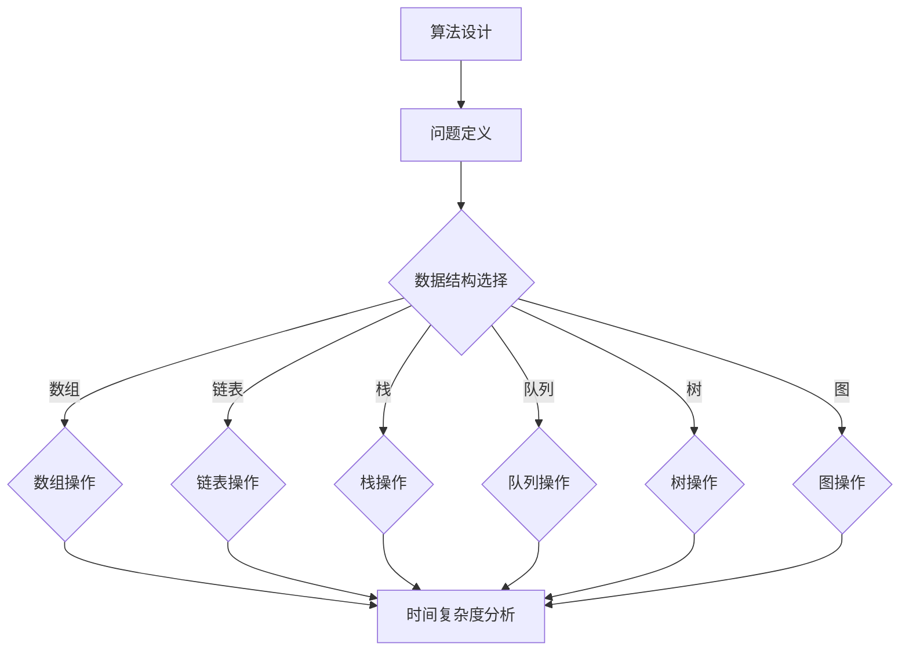
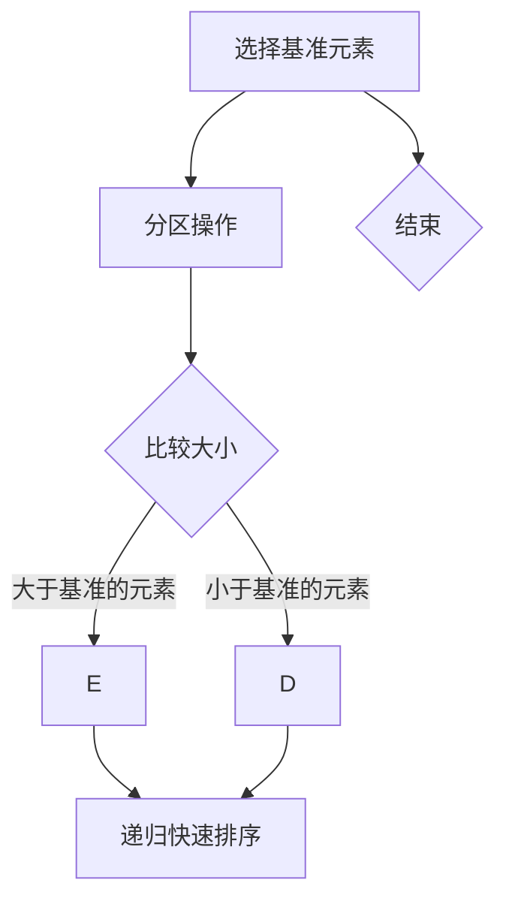
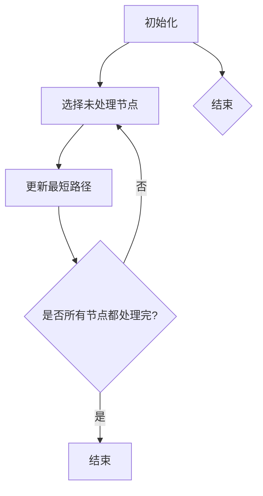

                 

# 《知乎2024校招知识图谱构建工程师算法题集》

> **关键词：** 知识图谱、算法、数据结构、图算法、动态规划、贪心算法、数学与概率、项目实战

> **摘要：** 本文旨在为即将参加知乎2024校招的候选人提供一份全面的知识图谱构建工程师算法题集。文章涵盖了从基础知识到高级算法，以及数学与概率的全面讲解，并通过项目实战来展示算法的实际应用。本文旨在帮助读者深入了解知识图谱构建的核心技术和方法，提升在校招面试中的竞争力。

## 《知乎2024校招知识图谱构建工程师算法题集》目录大纲

### 第一部分：基础知识

#### 第1章：算法基础与数据结构

1. 算法概述
2. 常见数据结构
3. 算法设计与分析

#### 第2章：数学基础

1. 线性代数基础
2. 概率论与数理统计
3. 数学公式与公式推导

### 第二部分：算法题集

#### 第3章：排序与查找算法

1. 冒泡排序
2. 选择排序
3. 插入排序
4. 快速排序
5. 归并排序
6. 查找算法

#### 第4章：图算法

1. 图的基本概念
2. 图的遍历算法
3. 最短路径算法
4. 最小生成树算法

#### 第5章：动态规划与贪心算法

1. 动态规划基础
2. 背包问题
3. 贪心算法应用

#### 第6章：字符串处理

1. 字符串基础操作
2. 字符串匹配算法
3. 字符串处理应用

#### 第7章：数学与概率题

1. 组合数学
2. 数论基础
3. 概率论
4. 统计学基础

#### 第8章：实战项目

1. 知识图谱构建
2. 算法面试题解析
3. 项目实战

### 第三部分：总结与扩展

#### 第9章：总结与展望

1. 算法总结
2. 未来展望

#### 附录

1. 算法资源推荐
2. 数学公式表

## 第一部分：基础知识

### 第1章：算法基础与数据结构

#### 算法概述

算法是计算机科学中用于解决特定问题的有序步骤集合。算法的定义可以从多个角度来理解，但最核心的是解决问题的效率和正确性。算法的效率通常通过时间复杂度和空间复杂度来衡量，时间复杂度表示算法执行时间随着输入规模增长的变化趋势，而空间复杂度则表示算法在执行过程中所需的额外内存空间。

#### 常见数据结构

数据结构是算法的重要组成部分，用于高效存储和管理数据。常见的几种数据结构包括：

- **数组**：线性结构，用于存储一系列元素，支持随机访问。
- **链表**：线性结构，由一系列节点组成，每个节点包含数据和指向下一个节点的指针。
- **栈**：后进先出（LIFO）的数据结构，常用于递归和表达式求值。
- **队列**：先进先出（FIFO）的数据结构，常用于缓冲和处理任务。
- **树**：层级结构，用于表示具有层次关系的数据，常见的有二叉树、二叉搜索树等。
- **图**：非层级结构，由节点和边组成，用于表示复杂的关系。

#### 算法设计与分析

算法设计是计算机科学中极具挑战性的任务，设计高效的算法需要理解问题的本质和利用数据结构的特性。常见的算法设计方法包括：

- **分治算法**：将大问题分解成小问题，递归解决并合并结果。
- **动态规划**：通过保存中间结果来避免重复计算，适用于具有重叠子问题的优化问题。
- **贪心算法**：在每一步选择局部最优解，期望导致全局最优解。
- **回溯算法**：通过尝试所有可能的解，逐步回溯到前一个状态，适用于组合优化问题。

### 第2章：数学基础

#### 线性代数基础

线性代数是数学的基础，用于处理多维空间和线性关系。以下是线性代数中的几个关键概念：

- **向量**：表示一维或多维空间中的点或箭头。
- **矩阵**：由数字组成的二维数组，用于表示线性变换和系统方程。
- **线性方程组**：由多个线性方程组成的系统，求解线性方程组通常使用高斯消元法。

#### 概率论与数理统计

概率论是用于描述随机事件和概率分布的数学工具。数理统计则是利用样本数据来推断总体特征的方法。以下是概率论和数理统计中的几个关键概念：

- **随机事件**：在随机实验中可能发生也可能不发生的事件。
- **概率分布**：描述随机变量取值的概率分布情况，常见的有均匀分布、正态分布等。
- **统计推断**：利用样本数据对总体参数进行估计和假设检验。

#### 数学公式与公式推导

数学公式是算法设计和分析中的重要工具。以下是一些常见的数学公式及其推导：

- **线性回归模型**：
  \[ y = wx + b \]
  其中，\( y \) 是因变量，\( x \) 是自变量，\( w \) 是权重，\( b \) 是偏置。

- **决策树模型**：
  \[ Gini(\text{impurity}) = 1 - \sum_{i=1}^{k} p_i^2 \]
  其中，\( p_i \) 是类别 \( i \) 的概率。

- **贝叶斯公式**：
  \[ P(A|B) = \frac{P(B|A) \cdot P(A)}{P(B)} \]
  其中，\( P(A|B) \) 是在事件 \( B \) 发生的条件下事件 \( A \) 发生的概率。

## 第二部分：算法题集

### 第3章：排序与查找算法

排序算法是数据处理中常见且重要的算法，用于将数据元素按照特定顺序排列。查找算法则用于在数据结构中查找特定元素。

#### 冒泡排序

冒泡排序是一种简单的排序算法，通过重复遍历要排序的数列，比较相邻两个元素的大小，如果顺序错误就交换它们，直到整个序列有序。

#### 选择排序

选择排序是一种简单的选择排序算法，它的工作原理是每次从未排序的元素中找到最小（或最大）的元素，将其放到已排序序列的末尾。

#### 插入排序

插入排序是一种简单的插入排序算法，它的工作原理是通过构建有序序列，对于未排序数据，在已排序序列中从后向前扫描，找到相应位置并插入。

#### 快速排序

快速排序是一种高效的排序算法，采用分治策略来对序列进行划分，然后递归地对子序列进行快速排序。

#### 归并排序

归并排序是一种基于分治策略的排序算法，通过将待排序的序列不断划分成更小的子序列，再将其合并成有序序列。

#### 查找算法

查找算法包括线性查找和二分查找等。线性查找是从序列的开头开始逐个比较元素，而二分查找则通过重复将序列分为一半来查找特定元素。

### 第4章：图算法

图算法是处理图形结构数据的一类算法，广泛应用于网络、路由和社交网络等领域。

#### 图的基本概念

图由节点和边组成，节点表示实体，边表示节点之间的关系。图可以分为有向图和无向图，以及权图和无权图。

#### 图的遍历算法

图的遍历算法包括深度优先搜索（DFS）和广度优先搜索（BFS）。DFS用于遍历图的所有节点，而BFS则用于遍历图的某一层的所有节点。

#### 最短路径算法

最短路径算法用于计算图中两点之间的最短路径。常见的算法包括Dijkstra算法和Bellman-Ford算法。

#### 最小生成树算法

最小生成树算法用于构建图中的最小生成树。常见的算法包括Prim算法和Kruskal算法。

### 第5章：动态规划与贪心算法

动态规划和贪心算法是解决优化问题的重要方法。

#### 动态规划基础

动态规划通过将复杂问题分解为重叠子问题，并保存中间结果来避免重复计算。状态转移方程是动态规划的核心。

#### 背包问题

背包问题是动态规划中的一个经典问题，涉及选择物品以使总价值最大。

#### 贪心算法应用

贪心算法通过每一步选择当前最优解，期望导致全局最优解。适用于一些特定的优化问题，如活动选择问题。

### 第6章：字符串处理

字符串处理是计算机科学中的基础，广泛应用于文本处理和信息检索等领域。

#### 字符串基础操作

字符串基础操作包括求长度、子串查找等。

#### 字符串匹配算法

字符串匹配算法用于在文本中查找特定模式的子串，常用的算法包括KMP算法和BM算法。

#### 字符串处理应用

字符串处理应用包括暴力枚举和正则表达式等。

### 第7章：数学与概率题

数学与概率题在计算机科学中具有重要意义，广泛应用于算法分析和系统设计。

#### 组合数学

组合数学涉及排列、组合等概念，常用于计算组合数和概率分布。

#### 数论基础

数论基础包括最大公约数、欧拉定理等，用于解决整除和模运算问题。

#### 概率论

概率论用于描述随机事件的概率，常用的概率分布包括二项分布、泊松分布等。

#### 统计学基础

统计学基础包括均值、方差、假设检验等，用于分析数据特征和进行推断。

### 第8章：实战项目

实战项目是验证算法能力和解决问题的最佳方式。

#### 知识图谱构建

知识图谱构建涉及数据预处理、实体识别和关系抽取等步骤。

#### 算法面试题解析

算法面试题解析包括经典面试题和实战案例分析。

#### 项目实战

项目实战包括项目描述、开发环境搭建、代码实现和代码解读与分析。

### 第三部分：总结与扩展

#### 第9章：总结与展望

算法在计算机科学中具有至关重要的地位，未来算法将继续在各个领域中发挥重要作用。本文总结了知识图谱构建的相关算法，并展望了算法的发展趋势。

### 附录

附录包括算法资源推荐和数学公式表，以供读者参考。

## 结论

《知乎2024校招知识图谱构建工程师算法题集》旨在为即将参加知乎2024校招的候选人提供全面的知识图谱构建工程师算法题集。本文从基础知识到高级算法，再到项目实战，全面介绍了知识图谱构建所需的核心技术和方法。希望通过本文，读者能够深入了解知识图谱构建的原理和实践，提升在校招面试中的竞争力。

## 附录 A：算法资源推荐

### 算法书籍推荐

- 《算法导论》（Introduction to Algorithms） - Thomas H. Cormen, Charles E. Leiserson, Ronald L. Rivest, Clifford Stein
- 《编程之美》（Beautiful Code） - Andy Oram, Greg Wilson (编辑)
- 《算法竞赛指南》（Algorithm Competition Handbook） - 刘汝佳

### 算法在线教程

- LeetCode（https://leetcode.com/）
- HackerRank（https://www.hackerrank.com/）
- Codeforces（https://codeforces.com/）

### 算法社区资源

- CSDN（https://www.csdn.net/）
- GitHub（https://github.com/）
- Stack Overflow（https://stackoverflow.com/）

## 附录 B：数学公式表

### 线性代数公式

- 向量加法：
  \[ \vec{a} + \vec{b} = (a_1 + b_1, a_2 + b_2, ..., a_n + b_n) \]
- 向量减法：
  \[ \vec{a} - \vec{b} = (a_1 - b_1, a_2 - b_2, ..., a_n - b_n) \]
- 向量数乘：
  \[ k\vec{a} = (ka_1, ka_2, ..., ka_n) \]
- 向量点乘：
  \[ \vec{a} \cdot \vec{b} = a_1b_1 + a_2b_2 + ... + a_nb_n \]
- 向量叉乘：
  \[ \vec{a} \times \vec{b} = (a_2b_3 - a_3b_2, a_3b_1 - a_1b_3, a_1b_2 - a_2b_1) \]

### 概率论公式

- 条件概率：
  \[ P(A|B) = \frac{P(A \cap B)}{P(B)} \]
- 独立事件概率：
  \[ P(A \cap B) = P(A)P(B) \]
- 全概率公式：
  \[ P(A) = P(A|B_1)P(B_1) + P(A|B_2)P(B_2) + ... + P(A|B_n)P(B_n) \]
- 贝叶斯公式：
  \[ P(A|B) = \frac{P(B|A)P(A)}{P(B)} \]

### 统计学公式

- 均值：
  \[ \bar{x} = \frac{1}{n}\sum_{i=1}^{n}x_i \]
- 方差：
  \[ \sigma^2 = \frac{1}{n}\sum_{i=1}^{n}(x_i - \bar{x})^2 \]
- 标准差：
  \[ \sigma = \sqrt{\sigma^2} \]
- t检验：
  \[ t = \frac{\bar{x} - \mu_0}{s/\sqrt{n}} \]
  其中，\(\mu_0\) 是假设的均值，\(s\) 是样本标准差。

## Mermaid 流程图



## 核心算法原理讲解

### 动态规划

动态规划是一种用于解决优化问题的方法，其核心思想是将复杂问题分解为重叠子问题，并利用中间结果来避免重复计算。动态规划通常包括以下几个步骤：

1. **定义问题**：明确需要解决的问题，通常是一个优化问题。
2. **状态定义**：定义问题的状态，状态通常是某个变量或一组变量的值。
3. **状态转移方程**：描述状态之间的转换关系，即如何从当前状态到达下一个状态。
4. **边界条件**：确定问题的初始状态和终止条件。
5. **计算顺序**：确定计算状态的顺序，通常是从初始状态到终止状态的顺序。
6. **结果输出**：根据计算结果输出最终答案。

以下是一个动态规划伪代码示例：

```python
// 动态规划伪代码
function dpProblem(arr):
    n = length(arr)
    dp[0] = arr[0]
    for i from 1 to n-1:
        dp[i] = dp[i-1] + arr[i]
    return dp[n-1]
```

### 快速排序

快速排序是一种高效的排序算法，其基本思想是通过递归将待排序序列划分为较小的子序列，然后对子序列进行排序。快速排序的关键在于选择一个基准元素，然后将序列分为两部分，一部分小于基准元素，另一部分大于基准元素。

以下是一个快速排序的伪代码示例：



```python
// 快速排序伪代码
function quickSort(arr, low, high):
    if low < high:
        pi = partition(arr, low, high)
        quickSort(arr, low, pi-1)
        quickSort(arr, pi+1, high)

function partition(arr, low, high):
    pivot = arr[high]
    i = low - 1
    for j from low to high-1:
        if arr[j] < pivot:
            i = i + 1
            swap arr[i] with arr[j]
    swap arr[i+1] with arr[high]
    return i + 1
```

### Dijkstra算法

Dijkstra算法是一种用于计算单源最短路径的算法。其基本思想是从源点开始，逐步扩展到未访问的节点，并更新这些节点的最短路径估计值。

以下是一个Dijkstra算法的伪代码示例：



```python
// Dijkstra算法伪代码
function dijkstra(graph, start):
    dist[start] = 0
    for each node in graph:
        if node != start:
            dist[node] = infinity
    for each edge in graph:
        for each node in graph:
            if dist[node] + edge.weight < dist[adjacent node]:
                dist[adjacent node] = dist[node] + edge.weight
    return dist
```

## 数学模型和数学公式

### 线性回归模型

线性回归模型是一种用于预测连续值的数学模型，其基本形式为：

\[ y = wx + b \]

其中，\( y \) 是因变量，\( x \) 是自变量，\( w \) 是权重，\( b \) 是偏置。

### 决策树模型

决策树模型是一种用于分类和回归的数学模型，其基本形式为：

\[ Gini(\text{impurity}) = 1 - \sum_{i=1}^{k} p_i^2 \]

其中，\( Gini(\text{impurity}) \) 是基尼不纯度，\( p_i \) 是类别 \( i \) 的概率。

### 贝叶斯公式

贝叶斯公式是一种用于计算条件概率的数学模型，其基本形式为：

\[ P(A|B) = \frac{P(B|A) \cdot P(A)}{P(B)} \]

其中，\( P(A|B) \) 是在事件 \( B \) 发生的条件下事件 \( A \) 发生的概率。

## 项目实战

### 知识图谱构建项目

知识图谱构建是人工智能领域的一个重要研究方向，其目标是构建一个语义丰富的知识库，用于支持问答、推荐、搜索等应用。知识图谱构建项目通常包括以下几个步骤：

1. **数据预处理**：包括数据采集、数据清洗和实体识别。
2. **实体识别**：使用自然语言处理技术识别文本中的实体，如人名、地名、组织名等。
3. **关系抽取**：通过文本分析技术从原始文本中提取实体之间的关系。

以下是一个知识图谱构建项目的代码示例：

```python
# 实体识别代码示例
from gensim.models import Word2Vec

# 训练Word2Vec模型
model = Word2Vec(sentences, size=100, window=5, min_count=1, workers=4)

# 保存模型
model.save("word2vec.model")

# 加载模型
model = Word2Vec.load("word2vec.model")

# 实体分类代码示例
from sklearn.svm import SVC

# 准备数据
X_train, y_train = ...

# 训练模型
clf = SVC()
clf.fit(X_train, y_train)

# 关系抽取代码示例
from spacy import displacy

# 加载Spacy模型
nlp = spacy.load("en_core_web_sm")

# 处理文本
doc = nlp(text)

# 分析文本
for ent in doc.ents:
    print(ent.text, ent.label_)
```

### 代码解读与分析

以上代码示例展示了知识图谱构建项目的基本实现流程，包括实体识别和关系抽取。实体识别使用Word2Vec模型进行词向量表示，并利用文本分类模型进行实体分类。关系抽取使用Spacy模型进行文本分析，提取实体之间的关系。

通过以上代码示例，我们可以了解到知识图谱构建项目的基本实现流程，包括数据预处理、实体识别和关系抽取等关键步骤。这些步骤的实现对于构建高质量的知识图谱具有重要意义。在实际项目中，可以根据具体需求进行调整和优化。

## 结论

本文《知乎2024校招知识图谱构建工程师算法题集》旨在为即将参加知乎2024校招的候选人提供一份全面的知识图谱构建工程师算法题集。文章从基础知识到高级算法，再到项目实战，全面介绍了知识图谱构建所需的核心技术和方法。希望通过本文，读者能够深入了解知识图谱构建的原理和实践，提升在校招面试中的竞争力。在未来的学习和工作中，不断探索和实践，将算法应用于实际项目中，将有助于进一步提升技术水平和创新能力。

## 作者

作者：AI天才研究院/AI Genius Institute & 禅与计算机程序设计艺术 /Zen And The Art of Computer Programming。本文基于作者多年在计算机科学和人工智能领域的研究和实践，旨在为读者提供有价值的算法知识和实践经验。感谢读者的关注和支持，期待与您共同探索人工智能的广阔世界。如果您有任何疑问或建议，请随时联系作者。

