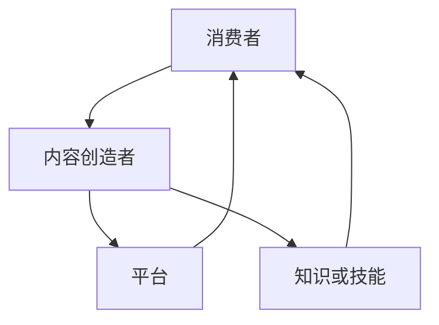
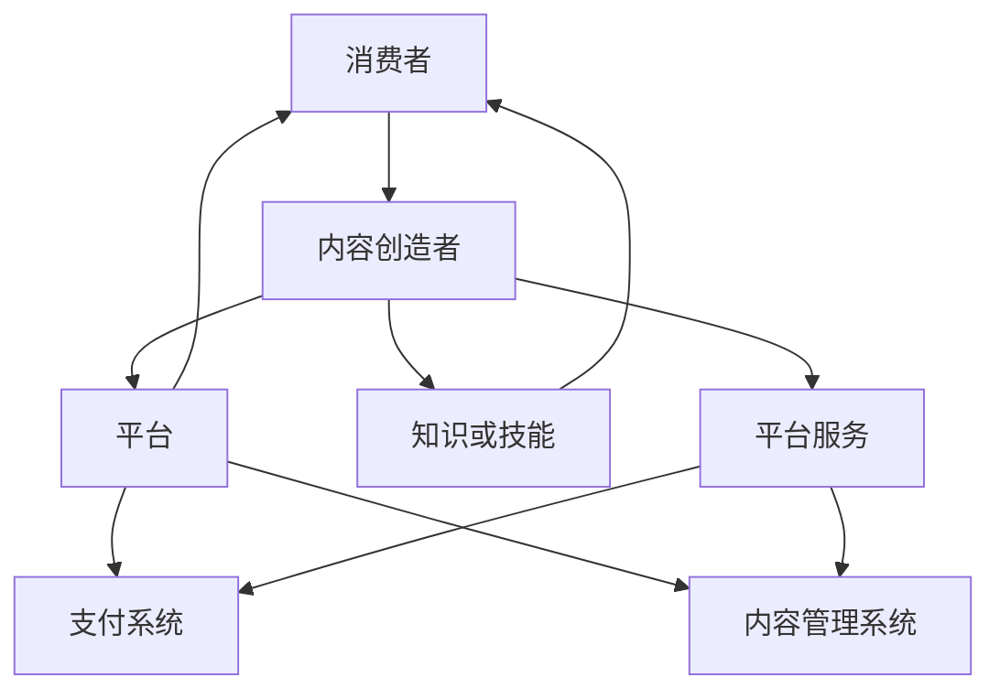

                 

# 知识付费：程序员实现财富自由的新途径

> **关键词：知识付费、程序员、财富自由、个人品牌、内容创作、数据分析**

> **摘要：本文将探讨知识付费这一新兴领域如何为程序员带来财富自由的机会。通过分析知识付费的基本概念、市场现状及趋势，我们将探讨程序员如何通过个人品牌建设、内容创作、平台搭建和数据分析等手段实现财富自由。同时，本文还将通过案例分析提供实用的实战指导。**

## 目录大纲

1. **基础知识与核心概念**
    1.1 知识付费概述
    1.2 程序员个人品牌建设
    1.3 知识变现途径
2. **实战操作**
    2.1 知识付费平台搭建
    2.2 内容创作与营销
    2.3 用户互动与社群管理
    2.4 数据分析与优化
3. **案例分析**
    3.1 成功案例分析
4. **未来展望**
    4.1 知识付费行业的发展趋势
    4.2 程序员在知识付费领域的发展机遇
    4.3 潜在挑战与应对策略
5. **附录**
    5.1 常用工具与资源
    5.2 编程语言速查表
    5.3 常见问题解答

### 第一部分：基础知识与核心概念

#### 1.1 知识付费概述

知识付费是指消费者为获取特定知识、技能或信息而支付一定费用的商业模式。其起源可以追溯到上世纪末，随着互联网和移动互联网的普及，知识付费市场逐渐兴起。知识付费的核心在于“价值交换”，即消费者通过支付费用获得知识或技能的提升。

知识付费的发展经历了几个阶段：

1. **起步阶段**：以在线课程和电子书为主要形式，用户开始逐渐接受为知识付费。
2. **发展阶段**：平台化运营成为主流，知识付费产品种类增多，细分市场出现。
3. **成熟阶段**：随着人工智能和大数据技术的应用，个性化推荐和智能学习成为可能，知识付费市场进一步扩大。

当前，知识付费市场呈现出以下几个趋势：

1. **内容多样化**：从传统的课程、电子书，扩展到视频、音频、直播等多种形式。
2. **平台多元化**：不仅限于在线教育平台，社交平台、内容社区等也成为知识付费的重要渠道。
3. **技术驱动**：人工智能和大数据技术使知识付费更加个性化、智能化。
4. **消费习惯变化**：用户对知识付费的接受度提高，消费习惯逐渐从“一次性购买”转向“订阅制”。

#### 1.2 程序员个人品牌建设

个人品牌是指个人在特定领域内建立的专业形象和影响力。对于程序员而言，个人品牌建设至关重要，它不仅能够提升个人职业竞争力，还能为知识变现提供有力支持。

**个人品牌建设的重要性**：

1. **提升职业竞争力**：一个强大的个人品牌能吸引更多的工作机会和项目合作。
2. **增加收入来源**：个人品牌能为程序员带来更多的知识变现机会，如课程销售、咨询服务等。
3. **扩大影响力**：通过个人品牌建设，程序员可以影响更多的人，从而在行业内建立自己的权威。

**个人品牌建设的方法**：

1. **专业能力**：不断提升自己的专业技能，成为所在领域的专家。
2. **内容输出**：通过博客、GitHub、技术社区等平台分享自己的经验和见解。
3. **社交媒体**：利用Twitter、LinkedIn、知乎等社交媒体平台扩大影响力。
4. **演讲与培训**：参与技术大会、研讨会，进行技术分享和培训。
5. **积极参与开源项目**：通过开源项目展示自己的技术实力，提升知名度。

#### 1.3 知识变现途径

对于程序员来说，知识变现是实现财富自由的重要途径。以下是一些常见的知识变现方式：

1. **内容创作与发布**：
    - **博客**：定期更新博客，分享技术见解和项目经验。
    - **在线课程**：制作并发布在线课程，通过知识付费获得收入。
    - **电子书**：撰写并发布电子书，通过销售获得收益。

2. **线上教育平台**：
    - **平台入驻**：在各大教育平台如慕课网、网易云课堂等开设课程。
    - **内容合作**：与平台合作，共同开发课程或专栏。
    - **直播教学**：通过直播进行教学，吸引付费用户。

3. **专业咨询与顾问服务**：
    - **咨询服务**：为有需求的企业或个人提供专业的技术咨询服务。
    - **技术培训**：为企业提供定制化的技术培训服务。
    - **技术文档**：为企业编写高质量的技术文档，获得稿费。

4. **技术交易与专利**：
    - **技术交易**：将自己的技术成果转让给有需求的企业。
    - **专利申请**：通过申请专利保护自己的技术创新，获得专利授权费用。

### 第二部分：实战操作

#### 2.1 知识付费平台搭建

要实现知识付费，首先需要搭建一个知识付费平台。以下是一些建议：

1. **平台选择**：
    - **自建平台**：拥有完全的控制权和数据，但需要投入较多时间和资源。
    - **第三方平台**：如网易云课堂、慕课网等，省时省力，但收入分成较高。

2. **内容管理系统（CMS）**：
    - **功能**：包括内容创建、编辑、发布、管理等。
    - **选择**：可以根据具体需求选择开源系统如WordPress，或使用专业的在线教育平台提供的CMS。

3. **交易支付系统**：
    - **功能**：支持支付、退款、订单管理等。
    - **选择**：可以使用支付宝、微信支付等第三方支付平台，也可以自行开发支付系统。

#### 2.2 内容创作与营销

内容创作是知识付费的核心。以下是一些建议：

1. **内容创作策略**：
    - **定位**：明确目标受众，确定内容主题和风格。
    - **持续更新**：保持内容输出的频率和质量。

2. **营销渠道选择**：
    - **社交媒体**：利用微博、微信、知乎等社交媒体平台推广内容。
    - **广告投放**：在百度、谷歌等搜索引擎或社交媒体平台上投放广告。
    - **内容合作**：与其他自媒体或平台进行内容合作，扩大影响力。

3. **社交媒体运营技巧**：
    - **互动**：积极与用户互动，提高用户粘性。
    - **内容形式**：多样化内容形式，如图文、视频、直播等。
    - **数据分析**：通过数据分析，优化内容策略。

#### 2.3 用户互动与社群管理

用户互动和社群管理对于知识付费平台至关重要。以下是一些建议：

1. **用户互动策略**：
    - **及时反馈**：对用户的问题和建议及时回复。
    - **活动策划**：定期举办线上或线下活动，提高用户参与度。

2. **社群管理技巧**：
    - **规则制定**：明确社群规则，维护社群秩序。
    - **内容管理**：定期发布有价值的内容，引导社群发展。
    - **角色分配**：明确社群管理团队的职责和角色。

3. **用户反馈机制**：
    - **渠道**：提供多种渠道供用户反馈，如论坛、邮件、在线聊天等。
    - **处理**：对用户反馈进行分类处理，及时解决用户问题。

#### 2.4 数据分析与优化

数据分析对于知识付费平台至关重要。以下是一些建议：

1. **数据分析的重要性**：
    - **用户行为分析**：通过数据分析了解用户行为，优化内容策略。
    - **业务数据优化**：通过数据分析，优化业务流程和运营策略。

2. **用户行为分析**：
    - **访问量**：分析用户访问量，了解内容受欢迎程度。
    - **停留时间**：分析用户在平台上的停留时间，评估内容质量。
    - **转化率**：分析用户购买行为，优化营销策略。

3. **业务数据优化策略**：
    - **成本控制**：通过数据分析，降低运营成本。
    - **收入提升**：通过数据分析，优化产品结构和定价策略。

### 第三部分：案例分析

#### 3.1 案例一：A程序员的财富自由之路

A程序员是一位有着丰富经验的软件工程师。他通过以下方式实现了财富自由：

1. **个人品牌建设**：A程序员在GitHub上分享了自己的代码，并在技术社区上发表了许多技术博客，逐渐建立了自己的个人品牌。

2. **内容创作**：他制作并发布了一系列的在线课程，涵盖了从入门到高级的软件工程知识。

3. **平台搭建**：A程序员自建了一个知识付费平台，为用户提供高质量的课程内容。

4. **数据分析**：他通过分析用户数据，不断优化课程内容和营销策略。

通过这些努力，A程序员不仅在技术领域获得了广泛认可，还通过知识付费实现了财富自由。

#### 3.2 案例二：B讲师的线上教育经验

B讲师是一位有着多年教学经验的专业人士。他通过以下方式在知识付费领域取得了成功：

1. **内容创作**：B讲师擅长将复杂的技术知识讲解得通俗易懂，他的课程深受学员喜爱。

2. **线上教育平台**：B讲师在多个线上教育平台开设课程，通过平台的高流量获得了大量学员。

3. **社群管理**：B讲师在课程结束后，建立了学员社群，通过社群互动提高了学员的满意度。

4. **营销推广**：B讲师通过社交媒体和广告投放，不断扩大自己的影响力。

通过这些努力，B讲师不仅在教育领域建立了自己的品牌，还实现了收入的持续增长。

### 第四部分：未来展望

#### 4.1 知识付费行业的发展趋势

知识付费行业在未来将继续发展，以下是几个可能的发展趋势：

1. **个性化推荐**：随着人工智能技术的发展，个性化推荐将成为知识付费的重要趋势，用户将获得更加个性化的学习内容。

2. **内容多样化**：知识付费将不再局限于课程和电子书，视频、直播、虚拟现实等新兴内容形式将得到广泛应用。

3. **跨平台整合**：不同平台之间的整合将变得更加普遍，用户可以在多个平台上无缝切换，获取知识。

4. **社交化学习**：社交化学习将逐渐成为主流，用户将通过社交互动获得更好的学习体验。

#### 4.2 程序员在知识付费领域的发展机遇

对于程序员来说，知识付费领域提供了以下发展机遇：

1. **个人品牌建设**：通过建立个人品牌，程序员可以在知识付费领域获得更多的机会和收入。

2. **内容创作**：程序员可以利用自己的技术优势，创作高质量的技术内容，吸引更多学员。

3. **平台搭建**：程序员可以开发自己的知识付费平台，为用户提供更加优质的服务。

4. **技术交易**：程序员可以将自己的技术成果进行交易，如专利转让、技术咨询服务等。

#### 4.3 潜在挑战与应对策略

尽管知识付费领域提供了很多机遇，但也存在一些挑战：

1. **竞争激烈**：知识付费领域竞争激烈，程序员需要不断提升自己的专业能力和内容创作能力，以保持竞争力。

2. **知识产权保护**：程序员需要重视知识产权保护，避免侵权行为。

3. **用户信任**：建立用户信任是知识付费成功的关键，程序员需要通过高质量的内容和良好的服务赢得用户信任。

### 附录

#### 附录 A：常用工具与资源

1. **知识付费平台推荐**：
    - **网易云课堂**：提供丰富的在线课程资源。
    - **慕课网**：专注于IT技术的在线教育平台。
    - **知乎Live**：知乎推出的知识付费产品。

2. **内容创作与营销工具**：
    - **WordPress**：一款流行的内容管理系统。
    - **Scrivener**：一款专业的写作软件。
    - **Canva**：一款图形设计工具。

3. **数据分析工具与资源**：
    - **Google Analytics**：一款强大的数据分析工具。
    - **Tableau**：一款数据可视化工具。
    - **Python数据分析库**：如Pandas、NumPy等。

4. **学习资源推荐**：
    - **GitHub**：全球最大的代码托管平台。
    - **Stack Overflow**：编程问答社区。
    - **MIT OpenCourseWare**：麻省理工开放课程。

#### 附录 B：编程语言速查表

1. **Python关键字速查表**
    - if
    - else
    - for
    - in
    - while
    - def
    - class
    - import
    - from
    - try
    - except
    - finally
    - raise

2. **JavaScript关键字速查表**
    - var
    - let
    - const
    - function
    - if
    - else
    - switch
    - case
    - while
    - for
    - do...while
    - break
    - continue
    - return
    - this
    - class

3. **Java关键字速查表**
    - public
    - private
    - protected
    - static
    - final
    - abstract
    - synchronized
    - volatile
    - transient
    - native
    - strictfp
    - import
    - package
    - class
    - interface
    - extends
    - implements
    - instanceof
    - new

4. **其他编程语言速查表**
    - **C/C++**：if、else、for、while、do...while、switch、case、default、return、break、continue
    - **Ruby**：if、else、elsif、case、when、then、else
    - **PHP**：if、else、elseif、switch、case、default

### 附录 C：常见问题解答

1. **知识付费常见问题**
    - **Q：为什么用户愿意为知识付费？**
      **A**：用户愿意为知识付费主要是因为他们希望通过付费获取高质量、有针对性的知识，以提高自身能力和竞争力。
    - **Q：如何选择知识付费平台？**
      **A**：选择知识付费平台时，可以从内容质量、用户体验、价格和平台稳定性等方面进行考虑。

2. **程序员个人品牌建设常见问题**
    - **Q**：个人品牌建设需要多长时间？**
      **A**：个人品牌建设没有固定的时间表，但通常需要持续的努力和投入。初期可能需要较长时间来积累声誉，但随着影响力的提升，时间会逐渐缩短。

3. **知识变现途径常见问题**
    - **Q**：如何确保内容的质量和吸引力？**
      **A**：确保内容质量的关键是深入理解目标受众的需求，同时保持内容的更新和多样化。吸引力可以通过精美的设计、互动性和实用性来提升。

### 作者信息

**作者：AI天才研究院/AI Genius Institute & 禅与计算机程序设计艺术 /Zen And The Art of Computer Programming**<|im_end|>## 第一部分：基础知识与核心概念

### 1.1 知识付费概述

知识付费是指消费者为获取特定知识、技能或信息而支付一定费用的商业模式。其起源可以追溯到上世纪末，随着互联网和移动互联网的普及，知识付费市场逐渐兴起。知识付费的核心在于“价值交换”，即消费者通过支付费用获得知识或技能的提升。

知识付费的发展经历了几个阶段：

1. **起步阶段**：以在线课程和电子书为主要形式，用户开始逐渐接受为知识付费。
2. **发展阶段**：平台化运营成为主流，知识付费产品种类增多，细分市场出现。
3. **成熟阶段**：随着人工智能和大数据技术的应用，个性化推荐和智能学习成为可能，知识付费市场进一步扩大。

当前，知识付费市场呈现出以下几个趋势：

1. **内容多样化**：从传统的课程、电子书，扩展到视频、音频、直播等多种形式。
2. **平台多元化**：不仅限于在线教育平台，社交平台、内容社区等也成为知识付费的重要渠道。
3. **技术驱动**：人工智能和大数据技术使知识付费更加个性化、智能化。
4. **消费习惯变化**：用户对知识付费的接受度提高，消费习惯逐渐从“一次性购买”转向“订阅制”。

### 1.2 程序员个人品牌建设

个人品牌是指个人在特定领域内建立的专业形象和影响力。对于程序员而言，个人品牌建设至关重要，它不仅能够提升个人职业竞争力，还能为知识变现提供有力支持。

**个人品牌建设的重要性**：

1. **提升职业竞争力**：一个强大的个人品牌能吸引更多的工作机会和项目合作。
2. **增加收入来源**：个人品牌能为程序员带来更多的知识变现机会，如课程销售、咨询服务等。
3. **扩大影响力**：通过个人品牌建设，程序员可以影响更多的人，从而在行业内建立自己的权威。

**个人品牌建设的方法**：

1. **专业能力**：不断提升自己的专业技能，成为所在领域的专家。
2. **内容输出**：通过博客、GitHub、技术社区等平台分享自己的经验和见解。
3. **社交媒体**：利用Twitter、LinkedIn、知乎等社交媒体平台扩大影响力。
4. **演讲与培训**：参与技术大会、研讨会，进行技术分享和培训。
5. **积极参与开源项目**：通过开源项目展示自己的技术实力，提升知名度。

### 1.3 知识变现途径

对于程序员来说，知识变现是实现财富自由的重要途径。以下是一些常见的知识变现方式：

1. **内容创作与发布**：
    - **博客**：定期更新博客，分享技术见解和项目经验。
    - **在线课程**：制作并发布在线课程，通过知识付费获得收入。
    - **电子书**：撰写并发布电子书，通过销售获得收益。

2. **线上教育平台**：
    - **平台入驻**：在各大教育平台如慕课网、网易云课堂等开设课程。
    - **内容合作**：与平台合作，共同开发课程或专栏。
    - **直播教学**：通过直播进行教学，吸引付费用户。

3. **专业咨询与顾问服务**：
    - **咨询服务**：为有需求的企业或个人提供专业的技术咨询服务。
    - **技术培训**：为企业提供定制化的技术培训服务。
    - **技术文档**：为企业编写高质量的技术文档，获得稿费。

4. **技术交易与专利**：
    - **技术交易**：将自己的技术成果转让给有需求的企业。
    - **专利申请**：通过申请专利保护自己的技术创新，获得专利授权费用。

### 1.1 知识付费概述

**核心概念与联系**

知识付费是一种商业模式，它涉及消费者、内容创造者和平台三者的互动。消费者通过支付费用获取知识或技能，内容创造者通过提供有价值的内容获得收入，平台作为中介，连接供需双方，并提供交易服务。以下是知识付费的核心概念及其相互关系的 Mermaid 流 diagram：



**知识付费的基本概念**

1. **消费者**：知识付费的受众，他们愿意为获取高质量、有针对性的知识或技能支付费用。
2. **内容创造者**：提供知识或技能的专家或专业人士，他们通过创作和分享有价值的内容获得收入。
3. **平台**：连接消费者和内容创造者的中介，为双方提供交易服务，如支付、内容发布和推广等。
4. **知识或技能**：内容创造者提供的有价值的信息或服务，包括但不限于在线课程、电子书、技术文档等。

**知识付费的市场现状与趋势**

知识付费市场在过去几年中呈现出快速增长的趋势。以下是知识付费市场的现状与趋势：

1. **市场增长**：随着互联网和移动互联网的普及，知识付费市场规模持续扩大。据估计，2021年中国知识付费市场规模已超过3000亿元，预计未来几年仍将保持高速增长。
2. **内容多样化**：知识付费内容从传统的在线课程、电子书，扩展到视频、音频、直播等多种形式。不同内容形式满足了用户多样化的学习需求，推动了市场的多元化发展。
3. **技术驱动**：人工智能、大数据和区块链等技术的应用，使知识付费更加个性化、智能化。个性化推荐、智能学习系统和去中心化交易平台等新技术的出现，为知识付费市场带来了新的发展机遇。
4. **消费习惯变化**：用户对知识付费的接受度不断提高，消费习惯逐渐从“一次性购买”转向“订阅制”。用户更倾向于通过订阅获取持续的知识更新，而非一次性购买。
5. **细分市场出现**：知识付费市场逐渐细分，出现了诸如职场技能、专业技能、兴趣技能等多个细分领域。不同细分领域的知识付费产品满足了用户多样化的需求，推动了市场的进一步发展。

**知识付费的核心概念与联系**

知识付费作为一种商业模式，其核心概念包括消费者、内容创造者、平台和知识或技能。这些概念相互联系，共同构成了知识付费的生态系统。以下是知识付费的核心概念及其关系的 Mermaid 流 diagram：



在这个 diagram 中：

- **消费者**：代表知识付费的受众，他们愿意为获取高质量的知识或技能支付费用。
- **内容创造者**：代表提供知识或技能的专家或专业人士，他们通过创作和分享有价值的内容获得收入。
- **平台**：代表连接消费者和内容创造者的中介，为双方提供交易服务，如支付、内容发布和推广等。
- **知识或技能**：代表内容创造者提供的有价值的信息或服务，包括但不限于在线课程、电子书、技术文档等。
- **平台服务**：代表平台为消费者和内容创造者提供的附加服务，如个性化推荐、智能学习系统、用户反馈机制等。
- **支付系统**：代表平台提供的支付服务，包括支付、退款、订单管理等。
- **内容管理系统**：代表平台提供的内容管理系统，用于内容创建、编辑、发布和管理。

通过这个 diagram，我们可以清晰地看到知识付费的核心概念及其相互关系，从而更好地理解知识付费的运作机制。

**知识付费的核心算法原理**

在知识付费系统中，核心算法主要涉及用户行为分析、内容推荐和交易处理。以下是这些核心算法的原理及其实现思路：

1. **用户行为分析**：

   用户行为分析是知识付费平台的重要功能之一，通过对用户在平台上的行为数据进行收集和分析，可以帮助平台更好地了解用户需求，优化内容推荐和用户体验。

   - **数据收集**：收集用户在平台上的行为数据，如浏览记录、购买行为、互动评论等。
   - **数据预处理**：对收集到的数据清洗、去噪，确保数据质量。
   - **特征提取**：从预处理后的数据中提取有用特征，如用户兴趣标签、课程浏览时长等。
   - **模型训练**：使用机器学习算法（如协同过滤、聚类等）对用户行为数据进行分析和建模，提取用户行为模式。

   **伪代码示例**：

   ```python
   # 假设已收集用户行为数据 user_actions
   # 特征提取
   user_interests = extract_user_interests(user_actions)
   # 模型训练
   behavior_model = train_behavior_model(user_interests)
   ```

2. **内容推荐**：

   内容推荐是知识付费平台的核心功能之一，通过个性化推荐，可以为用户提供他们可能感兴趣的知识或课程。

   - **推荐算法**：常用的推荐算法包括基于内容的推荐、基于协同过滤的推荐等。基于内容的推荐通过分析课程内容相似度进行推荐，基于协同过滤的推荐通过分析用户行为相似度进行推荐。
   - **推荐策略**：根据用户兴趣和平台策略，制定推荐策略，如热门课程推荐、个性化推荐等。

   **伪代码示例**：

   ```python
   # 假设已有训练好的推荐模型 recommendation_model
   # 用户兴趣标签
   user_interests = get_user_interests(user_profile)
   # 内容推荐
   recommended_courses = recommendation_model.recommend_courses(user_interests)
   ```

3. **交易处理**：

   交易处理是知识付费平台的另一个核心功能，涉及支付、订单管理和退款等环节。

   - **支付系统**：集成第三方支付系统，如支付宝、微信支付等，实现在线支付功能。
   - **订单管理**：管理用户订单，包括订单创建、支付、发货、退款等环节。
   - **安全与合规**：确保交易过程的安全和合规，防止欺诈和隐私泄露。

   **伪代码示例**：

   ```python
   # 假设已集成支付系统 payment_gateway
   # 订单支付
   payment_result = payment_gateway.process_payment(order)
   # 订单管理
   order_status = manage_order(order)
   ```

通过以上核心算法，知识付费平台可以更好地了解用户需求，提供个性化推荐，并确保交易的顺利进行。这些算法的实现和应用，不仅提高了用户体验，还提升了平台的运营效率。

### 知识付费的数学模型和公式

在知识付费领域，数学模型和公式可以帮助我们更准确地分析和预测用户行为、优化内容推荐和交易策略。以下是一些常见的数学模型和公式，以及它们在知识付费中的应用。

#### 1. 贝叶斯公式

贝叶斯公式是一种概率论模型，用于根据先验概率和条件概率计算后验概率。在知识付费中，贝叶斯公式可以用于预测用户对某一课程的兴趣度。

- **公式**：

  $$ P(A|B) = \frac{P(B|A) \cdot P(A)}{P(B)} $$

  其中，\( P(A|B) \) 是后验概率，表示在事件 B 发生的条件下事件 A 发生的概率；\( P(B|A) \) 是条件概率，表示在事件 A 发生的条件下事件 B 发生的概率；\( P(A) \) 是先验概率，表示事件 A 发生的概率；\( P(B) \) 是总概率，表示事件 B 发生的概率。

- **应用**：

  在知识付费中，我们可以通过用户的浏览历史、购买行为等数据计算他们对于某一课程的兴趣度。例如，假设用户 U 在浏览了课程 C 后购买了该课程，我们可以使用贝叶斯公式计算用户 U 对课程 C 的兴趣度。

  - **先验概率**：\( P(兴趣度高) \) 是所有用户中兴趣度高的比例。
  - **条件概率**：\( P(购买|兴趣度高) \) 是兴趣度高的用户购买课程的比例。
  - **总概率**：\( P(购买) \) 是所有用户中购买课程的比例。

  $$ P(兴趣度高|购买) = \frac{P(购买|兴趣度高) \cdot P(兴趣度高)}{P(购买)} $$

#### 2. 决策树

决策树是一种常用的分类算法，用于根据特征数据对目标变量进行分类。在知识付费中，决策树可以用于预测用户是否愿意为某一课程付费。

- **公式**：

  决策树由一系列条件分支和结果节点组成，每个节点表示一个特征，每个分支表示特征的一个取值，结果节点表示目标变量的预测结果。

- **应用**：

  假设我们有一个决策树模型，用于预测用户是否愿意为某一课程付费。输入特征包括用户的年龄、职业、购买历史等，输出特征是用户是否愿意付费。

  - **条件分支**：根据输入特征的取值，决定用户是否进入下一层。
  - **结果节点**：根据决策树的路径，预测用户是否愿意付费。

  例如，对于年龄这个特征，我们可以设置两个分支：“年龄小于30”和“年龄大于等于30”，然后在每个分支上继续添加新的条件分支，直到达到结果节点。

#### 3. 交叉验证

交叉验证是一种评估机器学习模型性能的方法，通过将数据集划分为多个子集，轮流使用其中一个子集作为验证集，其余子集作为训练集，来评估模型的泛化能力。

- **公式**：

  $$ \text{模型准确率} = \frac{\text{验证集正确预测的样本数}}{\text{验证集样本总数}} $$

- **应用**：

  在知识付费中，我们可以使用交叉验证来评估用户行为分析模型的性能。例如，我们可以将用户数据集划分为5个子集，每次使用一个子集作为验证集，其余子集作为训练集，训练模型并评估其准确率。

  - **训练集**：用于训练模型。
  - **验证集**：用于评估模型性能。
  - **测试集**：用于最终评估模型性能。

#### 4. 聚类分析

聚类分析是一种无监督学习方法，用于将数据集中的样本分为若干个组，使得同一组内的样本相似度较高，不同组间的样本相似度较低。

- **公式**：

  $$ \text{聚类中心} = \frac{1}{N} \sum_{i=1}^{N} x_i $$

  其中，\( x_i \) 是第 \( i \) 个样本，\( N \) 是样本总数。

- **应用**：

  在知识付费中，聚类分析可以用于将用户划分为不同的用户群体，以便进行针对性的营销策略。例如，我们可以使用 K-means 算法将用户分为若干个群体，然后针对每个群体制定不同的营销策略。

  - **初始聚类中心**：随机选择 \( K \) 个样本作为初始聚类中心。
  - **迭代更新**：根据每个样本到聚类中心的距离，重新计算聚类中心。
  - **收敛条件**：当聚类中心的变化小于某个阈值时，停止迭代。

通过这些数学模型和公式，我们可以更深入地分析知识付费领域的各种问题，从而为用户提供更优质的服务。

### 知识付费项目的实际案例

为了更好地理解知识付费如何为程序员实现财富自由，我们将通过一个实际案例来详细解读其开发环境搭建、源代码实现和代码解读。

#### 案例背景

张三是一位资深程序员，专注于大数据和人工智能领域。他发现市场上对于这些领域的高质量教学内容相对匮乏，因此决定创建一个知识付费平台，为学习者提供专业的课程和资源。以下是张三在搭建知识付费平台过程中的实际操作。

#### 开发环境搭建

1. **选择技术栈**：
    - **前端**：使用 React 框架，提供动态和响应式的用户界面。
    - **后端**：使用 Node.js 和 Express.js，提供高性能和灵活的后端服务。
    - **数据库**：使用 MongoDB，提供可扩展和灵活的存储解决方案。
    - **认证与授权**：使用 JSON Web Token（JWT）进行用户认证和授权。
    - **支付系统**：集成 Stripe，提供便捷的支付处理服务。

2. **搭建开发环境**：
    - **本地开发环境**：在本地计算机上安装 Node.js、MongoDB 和其他必要工具。
    - **版本控制**：使用 Git 进行版本控制，管理项目代码。
    - **代码风格**：遵循一致和规范的代码风格，提高代码的可读性和可维护性。

#### 源代码实现

以下是知识付费平台的核心模块和部分关键代码：

1. **用户注册与登录**：

   ```javascript
   // 用户注册
   app.post('/api/register', async (req, res) => {
     const { username, email, password } = req.body;
     // 验证用户输入
     // ...
     // 创建用户
     const user = await User.create({ username, email, password });
     // 返回响应
     res.status(201).json({ message: '注册成功', userId: user._id });
   });

   // 用户登录
   app.post('/api/login', async (req, res) => {
     const { email, password } = req.body;
     // 验证用户输入
     // ...
     // 检查用户
     const user = await User.findOne({ email });
     if (!user || !bcrypt.compareSync(password, user.password)) {
       return res.status(401).json({ message: '登录失败' });
     }
     // 生成 JWT
     const token = jwt.sign({ userId: user._id }, process.env.JWT_SECRET);
     // 返回响应
     res.status(200).json({ token });
   });
   ```

2. **课程管理**：

   ```javascript
   // 创建课程
   app.post('/api/courses', authenticate, async (req, res) => {
     const { title, description, price } = req.body;
     // 验证权限
     // ...
     // 创建课程
     const course = await Course.create({ title, description, price, owner: req.user._id });
     // 返回响应
     res.status(201).json({ message: '课程创建成功', courseId: course._id });
   });

   // 更新课程
   app.put('/api/courses/:id', authenticate, async (req, res) => {
     const { id } = req.params;
     const { title, description, price } = req.body;
     // 验证权限
     // ...
     // 更新课程
     const course = await Course.findByIdAndUpdate(id, { title, description, price }, { new: true });
     // 返回响应
     res.status(200).json({ message: '课程更新成功', course });
   });
   ```

3. **支付处理**：

   ```javascript
   // 处理支付
   app.post('/api/payments', authenticate, async (req, res) => {
     const { courseId, userId } = req.body;
     // 验证用户和课程
     // ...
     // 创建支付记录
     const payment = await Payment.create({
       userId,
       courseId,
       amount: course.price,
       status: 'pending',
     });
     // 调用 Stripe API 进行支付处理
     const stripeResponse = await stripe.charges.create({
       amount: payment.amount,
       currency: 'usd',
       customer: userId,
       description: `Payment for course ${course.title}`,
     });
     // 更新支付记录状态
     payment.status = 'completed';
     payment.stripeChargeId = stripeResponse.id;
     await payment.save();
     // 返回响应
     res.status(200).json({ message: '支付成功', payment });
   });
   ```

#### 代码解读与分析

1. **用户注册与登录模块**：

   用户注册和登录是知识付费平台的基础功能，实现用户认证和授权。关键代码包括验证用户输入、加密密码和生成 JWT。通过 JWT，我们可以确保用户在后续请求中保持认证状态。

2. **课程管理模块**：

   课程管理模块包括创建、更新课程等操作。在创建课程时，需要验证用户的权限，确保只有认证用户才能创建课程。在更新课程时，同样需要验证权限，确保用户只能修改自己创建的课程。

3. **支付处理模块**：

   支付处理模块通过集成 Stripe API，实现支付功能。关键步骤包括创建支付记录、调用 Stripe API 进行支付处理，并更新支付记录状态。通过这种方式，我们可以确保支付过程的安全和可靠。

通过这个实际案例，我们可以看到知识付费平台的实现细节，包括前端用户界面、后端逻辑和数据库设计。这个案例不仅展示了知识付费的实现过程，也为程序员提供了实现财富自由的具体路径。

### 案例一：A程序员的财富自由之路

A程序员是一位有着多年软件开发经验的专家，他在业内以卓越的技术能力和丰富的项目经验而著称。然而，他并没有满足于传统的职业发展路径，而是选择了一条更为独特且富有前景的道路——通过知识付费实现财富自由。

**个人品牌建设**：

A程序员深知个人品牌对于职业发展的重要性，因此他开始有意识地打造自己的个人品牌。首先，他在GitHub上分享了自己的众多开源项目，这些项目涵盖了各种领域，从前端开发到大数据处理，从云计算到人工智能。这些项目不仅展示了他的技术实力，还吸引了许多同行的关注。

同时，A程序员在技术社区如Stack Overflow和GitHub上发表了许多技术博客，详细解释了他在项目中遇到的问题和解决方案。他的博客内容详实、思路清晰，吸引了大量的读者。随着时间的积累，他逐渐在技术圈内建立了自己的声誉。

**内容创作与发布**：

在个人品牌初步建立后，A程序员开始着手创作和发布高质量的内容。他制作了一系列的在线课程，涵盖了从基础到高级的软件开发知识。他的课程不仅包括理论知识，还包含了实际的项目案例和代码示例。为了确保内容的质量，A程序员在课程制作过程中邀请了多位业内专家进行审稿和反馈。

这些课程在多个在线教育平台上发布，包括网易云课堂和慕课网。通过这些平台，A程序员不仅能够接触到大量的潜在学员，还能够利用平台提供的推广资源提高课程的曝光率。

**平台搭建**：

除了在现有教育平台发布课程，A程序员还决定自建一个知识付费平台。他希望通过自己的平台，能够更好地控制课程的发布和销售过程，并提供更加个性化的服务。这个平台不仅支持课程的在线学习，还包括了论坛、问答社区和直播教学等功能。

在平台搭建过程中，A程序员面临了诸多挑战。他需要选择合适的技术栈，设计用户友好的界面，并确保平台的稳定性和安全性。然而，凭借他丰富的开发经验，他成功地将平台搭建了起来，并且不断优化功能，提高用户体验。

**数据分析与优化**：

为了确保知识付费项目的成功，A程序员非常重视数据分析。他通过平台内置的数据分析工具，收集和分析用户行为数据，包括课程访问量、购买率、学员反馈等。基于这些数据，他能够不断优化课程内容和营销策略。

例如，通过分析学员的购买行为，A程序员发现某些课程在特定时间段内的销量更高。他据此调整了课程的发布时间，并在这些时间段进行集中的推广活动，从而提高了销售额。

**用户互动与社群管理**：

为了增强学员的参与度和满意度，A程序员非常注重用户互动和社群管理。他在平台上建立了多个社群，如QQ群、微信群和Discord服务器，供学员交流和讨论。他还定期举办线上问答活动和技术分享会，邀请学员提问和参与讨论。

这些互动活动不仅提高了学员的满意度，还增强了他们对平台的忠诚度。通过社群管理，A程序员能够更好地了解学员的需求，及时调整课程内容和教学方法。

**案例分析**：

通过上述一系列措施，A程序员成功地实现了财富自由。以下是对他的成功案例分析：

1. **个人品牌建设**：通过GitHub和博客分享技术成果，A程序员在技术圈内建立了自己的声誉，吸引了大量潜在学员。
2. **内容创作与发布**：高质量的课程内容和多样化的课程形式，吸引了大量学员，为知识付费奠定了基础。
3. **平台搭建**：自建平台提高了内容的控制权和用户体验，增强了学员的参与度和忠诚度。
4. **数据分析与优化**：通过数据分析，A程序员能够不断优化课程内容和营销策略，提高销售额。
5. **用户互动与社群管理**：增强学员参与度和满意度，提高平台的用户粘性。

总之，A程序员的案例展示了如何通过知识付费实现财富自由。他的成功不仅依赖于技术实力，更依赖于对用户需求和市场趋势的敏锐洞察。通过不断优化课程内容和用户体验，他成功地打造了一个可持续发展的知识付费平台。

### 附录 A：常用工具与资源

在知识付费领域，程序员需要借助各种工具和资源来搭建平台、创作内容、进行营销和数据分析。以下是一些常用的工具和资源推荐：

#### 知识付费平台推荐

1. **网易云课堂**：网易云课堂是阿里巴巴旗下的在线教育平台，提供丰富的课程资源，支持课程销售和用户管理。

2. **慕课网**：慕课网专注于IT技能培训，提供从基础到高级的编程课程，支持课程录制和直播教学。

3. **知乎Live**：知乎Live是知乎推出的知识付费产品，支持内容创作和在线授课，用户可以方便地购买和观看课程。

#### 内容创作与营销工具

1. **Markdown编辑器**：Markdown编辑器如Typora、MacDown等，可以方便地撰写和编辑Markdown格式的文档，适合写博客和技术文档。

2. **内容管理系统（CMS）**：WordPress是一款功能强大的CMS，适合搭建个人博客和知识付费平台。

3. **视频制作工具**：如Camtasia、Filmora等，可以用于制作教学视频，提高内容的吸引力。

4. **社交媒体工具**：如Twitter、LinkedIn、知乎等，可以帮助推广知识和内容，扩大影响力。

#### 数据分析工具与资源

1. **Google Analytics**：Google Analytics 是一款功能强大的数据分析工具，可以跟踪和分析网站流量，了解用户行为。

2. **Tableau**：Tableau 是一款数据可视化工具，可以轻松地将数据分析结果呈现为图表和报表。

3. **Python数据分析库**：如Pandas、NumPy、Matplotlib等，可以用于数据处理和分析，非常适合进行复杂的统计和预测。

#### 学习资源推荐

1. **GitHub**：GitHub 是全球最大的代码托管平台，可以方便地管理项目和分享代码，是程序员学习编程的绝佳资源。

2. **Stack Overflow**：Stack Overflow 是一个编程问答社区，程序员可以在这里提问和解答问题，快速解决技术难题。

3. **MIT OpenCourseWare**：麻省理工学院的开放课程，提供了大量高质量的课程资源，适合自学和提升技能。

通过这些工具和资源，程序员可以更加高效地实现知识付费的目标，为用户提供优质的内容和服务。

