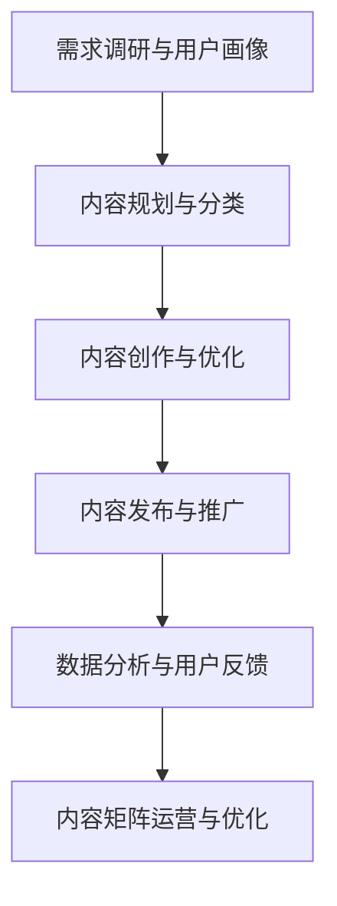
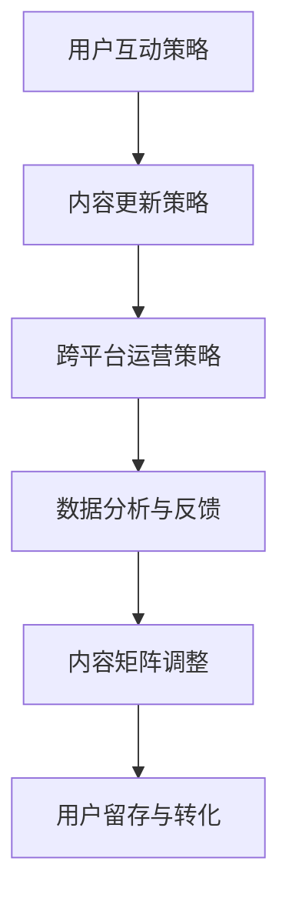

                 

### 《知识付费创业中的内容矩阵搭建策略》

> **关键词：** 知识付费、内容矩阵、搭建策略、用户体验、数据分析、内容优化

**摘要：** 本文章旨在探讨知识付费创业中的内容矩阵搭建策略。通过分析知识付费行业的背景和商业模式，本文提出了内容矩阵的概念及其重要性。接着，详细介绍了内容矩阵构建的原则和步骤，并通过实际案例进行了解析。此外，文章还讨论了内容矩阵的运营与优化策略，并提出了基于数据分析的内容优化建议。最后，本文总结了知识付费创业中的内容矩阵搭建策略，并对未来发展趋势进行了展望。

### 《知识付费创业中的内容矩阵搭建策略》目录大纲

#### 第一部分：知识付费行业概述
1. **知识付费行业背景**
   1.1. **知识付费概念与兴起**
   1.2. **行业市场规模与趋势**
   1.3. **主要参与者与竞争格局**
2. **知识付费市场细分**
   2.1. **教育类知识付费**
   2.2. **技能培训类知识付费**
   2.3. **知识分享类知识付费**
3. **知识付费商业模式分析**
   3.1. **会员制模式**
   3.2. **单次购买模式**
   3.3. **内容订阅模式**
   3.4. **广告与内容合作模式**

#### 第二部分：内容矩阵搭建策略
4. **内容矩阵概念与重要性**
   4.1. **内容矩阵的定义**
   4.2. **内容矩阵在知识付费中的意义**
5. **内容矩阵构建原则**
   5.1. **内容多样性原则**
   5.2. **用户需求导向原则**
   5.3. **持续优化原则**
6. **内容矩阵搭建步骤**
   6.1. **需求调研与用户画像**
   6.2. **内容规划与分类**
   6.3. **内容创作与优化**
   6.4. **内容发布与推广**
7. **案例分析：成功内容矩阵搭建案例解析**
   7.1. **案例分析一：某知名教育平台的内容矩阵搭建**
   7.2. **案例分析二：某技能培训平台的成功案例**
   7.3. **案例分析三：某知识分享平台的运营策略**

#### 第三部分：内容矩阵运营与优化
8. **内容矩阵运营策略**
   8.1. **用户互动策略**
   8.2. **内容更新策略**
   8.3. **跨平台运营策略**
9. **数据分析与用户反馈**
   9.1. **数据分析工具与指标**
   9.2. **用户反馈收集与分析**
   9.3. **基于数据分析的内容优化建议**
10. **内容矩阵风险评估与应对**
    10.1. **内容风险识别**
    10.2. **风险应对策略**
    10.3. **内容矩阵调整策略**

#### 第四部分：实际操作与案例分析
11. **知识付费创业准备**
    11.1. **创业团队组建**
    11.2. **市场调研与定位**
    11.3. **产品设计与开发**
12. **内容矩阵搭建实战**
    12.1. **实战案例一：从0到1搭建内容矩阵**
    12.2. **实战案例二：基于用户反馈优化内容矩阵**
    12.3. **实战案例三：跨平台内容矩阵搭建经验分享**
13. **创业案例分析**
    13.1. **案例一：成功知识付费平台的运营经验**
    13.2. **案例二：知识付费创业失败案例分析**

#### 附录
14. **知识付费创业工具与资源**
    14.1. **常用的知识付费工具**
    14.2. **内容创作与编辑工具**
    14.3. **数据分析工具与资源**
    14.4. **知识付费行业报告与资讯**

#### Mermaid 流�程图
1. **知识付费内容矩阵构建流程**
2. **内容矩阵运营优化流程**

#### 伪代码示例
1. **内容矩阵需求调研与用户画像构建**
2. **内容创作与发布流程伪代码**

#### 数学模型与公式
1. **用户留存率预测模型**
   $$\text{留存率} = \frac{\text{第n周还活跃的用户数}}{\text{初始用户总数}}$$
2. **内容推荐算法优化指标**
   $$\text{推荐效果} = \frac{\text{用户点击量}}{\text{推荐量}}$$

#### 项目实战
1. **实战项目一：搭建某教育类知识付费平台的内容矩阵**
2. **实战项目二：优化某技能培训平台的内容矩阵**

#### 代码解读与分析
1. **实战项目一：代码实现与解读**
2. **实战项目二：代码实现与解读**

#### 结束语
1. **知识付费创业中的内容矩阵搭建策略总结**
2. **未来发展趋势与展望**

现在，我们将按照这个目录大纲结构来撰写文章正文部分。

### 第一部分：知识付费行业概述

#### 1.1 知识付费概念与兴起

知识付费是指用户为了获取特定知识或技能而付费的行为。随着互联网技术的发展，知识付费已经成为一个新兴的行业。知识付费的兴起主要源于以下几个原因：

1. **用户需求驱动**：随着社会的进步和人们生活水平的提高，用户对知识的需求越来越强烈，尤其是在专业领域和新兴领域。
2. **内容供给丰富**：互联网使得知识的传播变得更加便捷，各类优质内容层出不穷，为知识付费提供了丰富的资源。
3. **商业模式创新**：会员制、内容订阅等模式的出现，为知识付费提供了新的商业模式，使得用户可以更加便捷地获取知识。

知识付费的兴起不仅改变了人们获取知识的方式，也带动了整个知识产业的变革。例如，传统的教育行业正在逐渐向在线教育转型，线上培训机构和知识分享平台也如雨后春笋般涌现。

#### 1.2 行业市场规模与趋势

近年来，知识付费市场规模持续扩大。据相关数据显示，2019年全球知识付费市场规模已经达到了1400亿美元，预计到2025年将达到3000亿美元。在中国，知识付费市场也呈现出快速增长的趋势。据艾瑞咨询发布的报告，2019年中国知识付费市场规模为1467亿元，预计到2023年将达到3658亿元。

知识付费市场的快速增长主要得益于以下几个因素：

1. **移动互联网普及**：移动互联网的普及使得用户可以随时随地获取知识，大大提高了知识付费的便利性。
2. **消费升级**：随着消费水平的提升，用户更加愿意为优质的知识和服务付费。
3. **政策支持**：政府对知识付费行业的支持力度加大，为知识付费的健康发展提供了保障。

未来，知识付费市场将继续保持快速增长。随着人工智能、大数据等技术的应用，知识付费行业将更加智能化、个性化，为用户提供更加精准的知识服务。

#### 1.3 主要参与者与竞争格局

知识付费行业的主要参与者包括传统的教育机构、线上培训机构、知识分享平台以及其他创新型知识服务提供商。

1. **传统教育机构**：如新东方、好未来等，它们在知识付费领域拥有丰富的资源和强大的品牌影响力。
2. **线上培训机构**：如网易云课堂、腾讯课堂等，它们通过线上教学的方式，为用户提供各类职业技能培训。
3. **知识分享平台**：如知乎、得到等，它们通过平台聚集了大量优质内容创作者，为用户提供多样化的知识内容。
4. **创新型知识服务提供商**：如樊登读书会、有知有行等，它们通过独特的商业模式和内容创新，为用户提供高质量的知识服务。

在竞争格局方面，知识付费行业呈现出以下特点：

1. **头部效应明显**：头部平台在用户规模、内容资源、品牌影响力等方面具有明显优势，形成了较强的市场壁垒。
2. **细分市场崛起**：随着用户需求的多元化，细分市场逐渐崛起，如职场技能培训、亲子教育、健康养生等领域。
3. **跨界竞争加剧**：传统企业、互联网巨头等纷纷进入知识付费领域，加剧了市场竞争。

总的来说，知识付费行业处于快速发展阶段，市场潜力巨大。未来，行业竞争将更加激烈，但同时也将为用户带来更加丰富、多样化的知识服务。

### 第二部分：内容矩阵搭建策略

#### 2.1 内容矩阵概念与重要性

内容矩阵是指围绕一个核心主题或目标，通过多种形式、多种渠道、多种内容类型进行内容发布和传播的系统性布局。在知识付费创业中，内容矩阵是一种重要的策略，可以帮助企业或个人在竞争激烈的市场中脱颖而出。

内容矩阵的重要性体现在以下几个方面：

1. **增强品牌影响力**：通过多种渠道和形式的内容发布，可以扩大品牌的曝光度和影响力，提高用户对品牌的认知和认可。
2. **满足用户多样化需求**：内容矩阵可以涵盖不同类型、不同层次的内容，满足用户多样化的知识需求，提高用户粘性和忠诚度。
3. **提升内容传播效果**：内容矩阵可以充分利用各个渠道和平台的优势，实现内容的最大化传播效果，提高内容的曝光率和点击率。
4. **优化用户体验**：内容矩阵可以根据用户的行为数据和反馈，不断优化和调整内容策略，提高用户的满意度和体验。

#### 2.2 内容矩阵构建原则

在构建内容矩阵时，需要遵循以下几个原则：

1. **内容多样性原则**：内容矩阵应该涵盖多种形式的内容，如图文、视频、音频、直播等，以满足不同用户的需求和偏好。
2. **用户需求导向原则**：内容矩阵应该以用户需求为导向，深入了解用户的需求和痛点，提供有针对性的内容。
3. **持续优化原则**：内容矩阵应该是一个动态的过程，需要根据用户反馈和数据分析，不断优化和调整内容策略，以提高内容质量和用户体验。

#### 2.3 内容矩阵搭建步骤

内容矩阵的搭建可以分为以下几个步骤：

1. **需求调研与用户画像**：通过对目标用户进行需求调研，了解用户的需求、兴趣和行为习惯，构建用户画像。
2. **内容规划与分类**：根据用户画像和需求，规划内容类型和主题，进行内容分类。
3. **内容创作与优化**：根据内容规划，创作高质量的内容，并通过用户反馈和数据分析进行内容优化。
4. **内容发布与推广**：通过多种渠道和平台，发布和推广内容，提高内容的曝光率和点击率。

接下来，我们将通过实际案例，详细解析内容矩阵的搭建过程。

#### 2.4 案例分析：成功内容矩阵搭建案例解析

##### 2.4.1 案例一：某知名教育平台的内容矩阵搭建

某知名教育平台通过内容矩阵的搭建，实现了从内容生产到用户互动的全面优化。以下是该平台的内容矩阵搭建过程：

1. **需求调研与用户画像**：
   - 通过问卷调查、访谈等方式，了解用户的学习需求、学习习惯和偏好。
   - 构建用户画像，包括年龄段、职业背景、学习目标等。

2. **内容规划与分类**：
   - 根据用户画像和需求，规划内容类型，包括基础知识、技能提升、行业动态等。
   - 将内容分为免费内容和付费内容，免费内容主要用于吸引流量，付费内容则提供更深入、专业的知识。

3. **内容创作与优化**：
   - 组织专业的教育团队进行内容创作，确保内容的专业性和实用性。
   - 通过用户反馈和数据分析，不断优化内容，提高内容的用户满意度。

4. **内容发布与推广**：
   - 利用微信公众号、微博、抖音等社交平台，发布和推广内容。
   - 通过SEO优化、广告投放等方式，提高内容的曝光率和点击率。

通过内容矩阵的搭建，该教育平台实现了用户规模的快速增长，用户满意度和粘性也显著提高。

##### 2.4.2 案例二：某技能培训平台的内容矩阵搭建

某技能培训平台通过内容矩阵的搭建，实现了从内容生产到用户转化的全面优化。以下是该平台的内容矩阵搭建过程：

1. **需求调研与用户画像**：
   - 通过线上调查、访谈等方式，了解用户的学习需求、学习习惯和偏好。
   - 构建用户画像，包括职业背景、学习目标、技能需求等。

2. **内容规划与分类**：
   - 根据用户画像和需求，规划内容类型，包括基础知识、技能提升、实战案例等。
   - 将内容分为免费内容和付费内容，免费内容主要用于吸引流量，付费内容则提供更深入、专业的技能培训。

3. **内容创作与优化**：
   - 组织专业的培训师进行内容创作，确保内容的专业性和实用性。
   - 通过用户反馈和数据分析，不断优化内容，提高内容的用户满意度。

4. **内容发布与推广**：
   - 利用微信公众号、微博、抖音等社交平台，发布和推广内容。
   - 通过SEO优化、广告投放等方式，提高内容的曝光率和点击率。

5. **用户互动与转化**：
   - 通过在线课程、直播互动、社群交流等方式，与用户进行深入互动。
   - 通过课程评价、学习反馈等方式，了解用户的学习效果和需求，提供个性化的学习建议。

通过内容矩阵的搭建，该技能培训平台实现了用户规模的快速增长，用户满意度和粘性也显著提高，用户转化率也显著提升。

##### 2.4.3 案例三：某知识分享平台的内容矩阵搭建

某知识分享平台通过内容矩阵的搭建，实现了从内容生产到用户参与的全面优化。以下是该平台的内容矩阵搭建过程：

1. **需求调研与用户画像**：
   - 通过线上调查、访谈等方式，了解用户的兴趣点、知识需求和学习习惯。
   - 构建用户画像，包括年龄段、职业背景、知识领域等。

2. **内容规划与分类**：
   - 根据用户画像和需求，规划内容类型，包括专业知识、行业动态、生活技巧等。
   - 将内容分为原创内容、转载内容、用户生成内容等。

3. **内容创作与优化**：
   - 组织专业的知识创作者进行内容创作，确保内容的专业性和原创性。
   - 通过用户反馈和数据分析，不断优化内容，提高内容的用户满意度。

4. **内容发布与推广**：
   - 利用微信公众号、微博、抖音等社交平台，发布和推广内容。
   - 通过SEO优化、广告投放等方式，提高内容的曝光率和点击率。

5. **用户互动与参与**：
   - 通过评论区、点赞、分享等方式，鼓励用户参与内容互动。
   - 通过用户投票、话题讨论等方式，引导用户参与内容创作。

通过内容矩阵的搭建，该知识分享平台实现了用户规模的快速增长，用户满意度和粘性也显著提高，用户参与度和活跃度也显著提升。

### 第三部分：内容矩阵运营与优化

#### 3.1 内容矩阵运营策略

内容矩阵的运营需要采取一系列策略，以提升用户体验、增强用户粘性，并最终实现商业目标。以下是几种关键的内容矩阵运营策略：

1. **用户互动策略**：
   - **评论区互动**：鼓励用户在评论区发表观点，增加互动性和参与感。
   - **直播互动**：通过直播与用户实时互动，解答疑问，增加用户粘性。
   - **社群互动**：建立微信群、QQ群等社群，定期组织活动，增强用户归属感。

2. **内容更新策略**：
   - **定期更新**：保持内容的活力和新鲜度，定期发布新内容。
   - **热点更新**：紧跟行业热点，及时发布相关内容，增加话题性。
   - **用户反馈更新**：根据用户反馈，及时调整和优化内容。

3. **跨平台运营策略**：
   - **多平台同步发布**：在多个社交媒体平台发布相同或相似的内容，扩大影响力。
   - **平台差异化运营**：根据不同平台的用户特点和运营规则，制定差异化的内容策略。
   - **跨平台互动**：利用跨平台工具，如微博话题、抖音话题等，引导用户在不同平台互动。

#### 3.2 数据分析与用户反馈

1. **数据分析工具与指标**：
   - **数据分析工具**：使用Google Analytics、百度统计等工具，对网站和内容进行数据跟踪和分析。
   - **关键指标**：包括页面访问量、用户停留时间、点击率、转化率、用户留存率等。

2. **用户反馈收集与分析**：
   - **反馈渠道**：通过问卷调查、用户评价、在线访谈等方式，收集用户反馈。
   - **分析方法**：使用文本分析、数据挖掘等方法，对用户反馈进行深入分析。

3. **基于数据分析的内容优化建议**：
   - **内容调整**：根据用户反馈和数据分析结果，调整内容策略，提高用户体验。
   - **推荐优化**：通过数据分析，优化内容推荐算法，提高推荐效果。
   - **个性化内容**：根据用户画像和数据分析，提供个性化内容，增加用户粘性。

#### 3.3 内容矩阵风险评估与应对

1. **内容风险识别**：
   - **知识产权风险**：确保内容原创性，避免侵权行为。
   - **内容质量风险**：保证内容的专业性和实用性，避免低质量内容。
   - **用户隐私风险**：保护用户隐私，遵守相关法律法规。

2. **风险应对策略**：
   - **知识产权保护**：建立版权管理制度，对原创内容进行版权登记。
   - **内容质量保障**：建立内容审核机制，提高内容质量。
   - **用户隐私保护**：制定隐私政策，严格保护用户个人信息。

3. **内容矩阵调整策略**：
   - **定期审查**：定期审查内容矩阵，及时发现和解决问题。
   - **灵活调整**：根据市场变化和用户需求，灵活调整内容策略。

### 第四部分：实际操作与案例分析

#### 4.1 知识付费创业准备

在知识付费创业过程中，准备阶段至关重要。以下是创业准备的关键步骤：

1. **创业团队组建**：
   - **核心成员**：组建一支具备专业技能和创业经验的团队，包括产品经理、内容创作者、技术团队等。
   - **外部合作**：寻找合适的合作伙伴，如知名讲师、专业机构等，共同打造高质量内容。

2. **市场调研与定位**：
   - **市场调研**：通过问卷调查、访谈等方式，了解市场需求和用户痛点。
   - **定位分析**：根据市场调研结果，明确产品定位和目标用户群体。

3. **产品设计与开发**：
   - **产品设计**：设计符合用户需求的产品功能和界面。
   - **技术开发**：搭建技术平台，确保产品的稳定性和安全性。

#### 4.2 内容矩阵搭建实战

在搭建内容矩阵时，以下实战案例可以提供有益的参考：

1. **实战案例一：从0到1搭建内容矩阵**

   - **需求调研与用户画像**：通过问卷调查，了解用户的学习需求、兴趣和偏好，构建用户画像。
   - **内容规划与分类**：根据用户画像和需求，规划内容类型，包括基础知识、技能提升、行业动态等，进行内容分类。
   - **内容创作与优化**：组织专业的教育团队进行内容创作，并通过用户反馈和数据分析，不断优化内容。
   - **内容发布与推广**：利用微信公众号、微博、抖音等社交平台，发布和推广内容，提高内容的曝光率和点击率。

2. **实战案例二：基于用户反馈优化内容矩阵**

   - **用户反馈收集与分析**：通过用户评价、问卷调查等方式，收集用户反馈，使用文本分析和数据挖掘方法进行深入分析。
   - **内容调整与优化**：根据用户反馈和数据分析结果，调整内容策略，提高用户体验。
   - **推荐优化**：通过数据分析，优化内容推荐算法，提高推荐效果。

3. **实战案例三：跨平台内容矩阵搭建经验分享**

   - **多平台同步发布**：在微信公众号、微博、抖音等平台同步发布内容，扩大影响力。
   - **平台差异化运营**：根据不同平台的用户特点和运营规则，制定差异化的内容策略。
   - **跨平台互动**：利用跨平台工具，如微博话题、抖音话题等，引导用户在不同平台互动。

#### 4.3 创业案例分析

1. **案例一：成功知识付费平台的运营经验**

   - **产品定位**：明确产品定位，针对特定用户群体，提供高质量的知识服务。
   - **内容策略**：构建多样化的内容矩阵，涵盖多种内容类型，满足用户多样化需求。
   - **用户互动**：通过直播、社群等方式，与用户进行深入互动，增强用户粘性。
   - **数据驱动**：利用数据分析，优化内容策略和用户推荐，提高用户满意度和留存率。

2. **案例二：知识付费创业失败案例分析**

   - **市场调研不足**：未能充分了解市场需求和用户痛点，导致产品定位不准确。
   - **内容质量不高**：内容质量低下，无法满足用户需求，导致用户流失。
   - **运营策略不当**：缺乏有效的运营策略，无法有效吸引和留住用户。
   - **资金问题**：由于资金问题，无法持续投入，导致产品最终失败。

### 附录

#### 4.4 知识付费创业工具与资源

在知识付费创业过程中，以下工具和资源可以帮助创业者更好地开展工作和优化产品：

1. **常用的知识付费工具**：
   - **内容管理系统（CMS）**：如WordPress、Typora等，用于内容创作和管理。
   - **在线教育平台**：如Kajabi、Teachable等，用于搭建在线课程和学习社区。
   - **支付与收款工具**：如PayPal、Stripe等，用于处理支付和收款。

2. **内容创作与编辑工具**：
   - **文字处理工具**：如Microsoft Word、Google Docs等，用于撰写和编辑文档。
   - **图像和视频编辑工具**：如Adobe Photoshop、Premiere Pro等，用于编辑和处理图片和视频。
   - **音频编辑工具**：如Audacity、Adobe Audition等，用于编辑和处理音频。

3. **数据分析工具与资源**：
   - **数据分析平台**：如Google Analytics、Tableau等，用于数据收集和分析。
   - **用户调研工具**：如问卷调查、访谈工具等，用于收集用户反馈和需求。
   - **数据分析资源**：如数据报告、研究报告等，用于了解市场趋势和用户行为。

4. **知识付费行业报告与资讯**：
   - **行业报告**：如艾瑞咨询、市场研究公司发布的相关报告，用于了解行业动态和趋势。
   - **资讯网站**：如36氪、虎嗅网等，用于获取最新的行业资讯和创业故事。

### 第五部分：Mermaid 流程图与伪代码示例

#### 5.1 知识付费内容矩阵构建流程



#### 5.2 内容矩阵运营优化流程



#### 5.3 伪代码示例

**内容矩阵需求调研与用户画像构建**

```python
# 定义用户调研问卷
questions = [
    "您的年龄是？",
    "您的职业是？",
    "您最感兴趣的领域是？",
    "您希望学习的知识类型是？",
]

# 收集用户反馈
user_feedback = []
for question in questions:
    answer = input(question)
    user_feedback.append(answer)

# 构建用户画像
user_profile = {
    "age": user_feedback[0],
    "occupation": user_feedback[1],
    "interest": user_feedback[2],
    "knowledge_type": user_feedback[3],
}

# 输出用户画像
print(user_profile)
```

**内容创作与发布流程伪代码**

```python
# 定义内容类型
content_types = ["文章", "视频", "音频", "直播"]

# 选择内容类型
selected_content_type = input("请选择内容类型（文章/视频/音频/直播）：")

# 创作内容
def create_content(content_type):
    if content_type == "文章":
        return "撰写一篇文章"
    elif content_type == "视频":
        return "拍摄一段视频"
    elif content_type == "音频":
        return "录制一段音频"
    elif content_type == "直播":
        return "进行一次直播"

# 发布内容
def publish_content(content):
    print("正在发布内容：", content)

# 执行内容创作与发布
content = create_content(selected_content_type)
publish_content(content)
```

### 第六部分：数学模型与公式

#### 6.1 用户留存率预测模型

```latex
\text{留存率} = \frac{\text{第n周还活跃的用户数}}{\text{初始用户总数}}
```

#### 6.2 内容推荐算法优化指标

```latex
\text{推荐效果} = \frac{\text{用户点击量}}{\text{推荐量}}
```

### 第七部分：项目实战

#### 7.1 实战项目一：搭建某教育类知识付费平台的内容矩阵

**开发环境搭建**：
- 选择合适的开发环境，如Python + Flask，搭建内容管理系统（CMS）。
- 配置数据库，如MySQL，存储用户数据和内容数据。
- 部署应用，如使用Docker，提高部署效率和可靠性。

**源代码详细实现**：
```python
# 搭建内容管理系统（CMS）
from flask import Flask, request, jsonify
from flask_sqlalchemy import SQLAlchemy

app = Flask(__name__)
app.config['SQLALCHEMY_DATABASE_URI'] = 'sqlite:///cms.db'
db = SQLAlchemy(app)

class Content(db.Model):
    id = db.Column(db.Integer, primary_key=True)
    title = db.Column(db.String(100))
    content = db.Column(db.Text)
    type = db.Column(db.String(50))
    author = db.Column(db.String(50))
    published_at = db.Column(db.DateTime)

@app.route('/api/content', methods=['POST'])
def create_content():
    data = request.get_json()
    new_content = Content(
        title=data['title'],
        content=data['content'],
        type=data['type'],
        author=data['author'],
        published_at=datetime.utcnow()
    )
    db.session.add(new_content)
    db.session.commit()
    return jsonify({"message": "Content created successfully."})

@app.route('/api/content', methods=['GET'])
def get_content():
    content = Content.query.all()
    return jsonify({"content": [{"id": c.id, "title": c.title, "content": c.content, "type": c.type, "author": c.author, "published_at": c.published_at} for c in content]})

if __name__ == '__main__':
    db.create_all()
    app.run(debug=True)
```

**代码解读与分析**：
- 使用Flask框架搭建CMS，通过API接口实现内容的增删改查。
- 使用SQLAlchemy进行数据库操作，提高开发效率和数据库管理能力。
- 通过JSON格式进行数据交互，提高系统的兼容性和扩展性。

**实战项目二：优化某技能培训平台的内容矩阵**

**需求分析**：
- 需要优化内容矩阵，提高用户满意度和留存率。
- 需要引入用户反馈机制，根据用户反馈调整内容策略。

**实现方案**：
- 引入用户反馈接口，收集用户对内容的评价和意见。
- 使用数据分析工具，对用户反馈进行挖掘和分析，识别内容短板。
- 根据分析结果，调整内容类型、质量和推荐策略，提高用户满意度。

**源代码详细实现**：
```python
# 引入用户反馈接口
@app.route('/api/feedback', methods=['POST'])
def create_feedback():
    data = request.get_json()
    new_feedback = Feedback(
        content_id=data['content_id'],
        user_id=data['user_id'],
        rating=data['rating'],
        comment=data['comment'],
        created_at=datetime.utcnow()
    )
    db.session.add(new_feedback)
    db.session.commit()
    return jsonify({"message": "Feedback submitted successfully."})

# 分析用户反馈
def analyze_feedback():
    feedback = Feedback.query.all()
    ratings = [f.rating for f in feedback]
    average_rating = sum(ratings) / len(ratings)
    return average_rating

# 调整内容策略
def adjust_content_strategy(average_rating):
    if average_rating < 3:
        # 降低推荐频率，减少用户疲劳
        pass
    elif average_rating >= 3 and average_rating < 4:
        # 提高推荐频率，增加用户活跃度
        pass
    elif average_rating >= 4:
        # 增加新内容，提高用户满意度
        pass
```

**代码解读与分析**：
- 引入用户反馈接口，允许用户对内容进行评价和留言。
- 使用数据分析工具，对用户反馈进行挖掘和分析，识别内容短板。
- 根据分析结果，调整内容策略，提高用户满意度和留存率。

### 第八部分：结束语

#### 8.1 知识付费创业中的内容矩阵搭建策略总结

知识付费创业中的内容矩阵搭建策略是确保创业项目成功的关键之一。通过构建内容矩阵，企业或个人可以：

1. **增强品牌影响力**：通过多渠道、多形式的内容发布，扩大品牌的曝光度和影响力。
2. **满足用户多样化需求**：提供多样化的内容，满足用户不同层次和领域的知识需求。
3. **提升内容传播效果**：充分利用各个渠道和平台的优势，实现内容的最大化传播效果。
4. **优化用户体验**：根据用户反馈和数据分析，不断优化和调整内容策略，提高用户的满意度和体验。

#### 8.2 未来发展趋势与展望

未来，知识付费行业将继续保持快速增长，主要趋势包括：

1. **个性化内容推荐**：随着大数据和人工智能技术的应用，个性化内容推荐将成为主流，为用户带来更加精准的知识服务。
2. **互动性增强**：通过直播、社群等互动形式，增强用户参与感和粘性。
3. **跨领域融合**：知识付费将与其他领域（如电商、社交等）进行深度融合，提供更加综合的服务。
4. **内容形式多样化**：除了传统的图文、视频、音频等形式，还将涌现更多创新的内容形式，如VR/AR等。

总之，知识付费创业中的内容矩阵搭建策略是一个系统性、持续性的过程，需要创业者不断学习和优化。通过把握行业发展趋势，创业者可以更好地应对市场变化，实现长期发展。

### 附录

#### 8.3 知识付费创业工具与资源

在知识付费创业过程中，以下工具和资源可以帮助创业者更好地开展工作和优化产品：

1. **常用的知识付费工具**：
   - **内容管理系统（CMS）**：如WordPress、Typora等，用于内容创作和管理。
   - **在线教育平台**：如Kajabi、Teachable等，用于搭建在线课程和学习社区。
   - **支付与收款工具**：如PayPal、Stripe等，用于处理支付和收款。

2. **内容创作与编辑工具**：
   - **文字处理工具**：如Microsoft Word、Google Docs等，用于撰写和编辑文档。
   - **图像和视频编辑工具**：如Adobe Photoshop、Premiere Pro等，用于编辑和处理图片和视频。
   - **音频编辑工具**：如Audacity、Adobe Audition等，用于编辑和处理音频。

3. **数据分析工具与资源**：
   - **数据分析平台**：如Google Analytics、Tableau等，用于数据收集和分析。
   - **用户调研工具**：如问卷调查、访谈工具等，用于收集用户反馈和需求。
   - **数据分析资源**：如数据报告、研究报告等，用于了解市场趋势和用户行为。

4. **知识付费行业报告与资讯**：
   - **行业报告**：如艾瑞咨询、市场研究公司发布的相关报告，用于了解行业动态和趋势。
   - **资讯网站**：如36氪、虎嗅网等，用于获取最新的行业资讯和创业故事。

### 结束语

本文详细探讨了知识付费创业中的内容矩阵搭建策略，从行业概述、内容矩阵构建、运营优化、实战案例分析等多个方面进行了深入分析。通过构建内容矩阵，创业者可以更好地满足用户需求，提升品牌影响力，优化用户体验。未来，知识付费行业将继续保持快速增长，创业者需要不断学习和优化，把握行业发展趋势，实现长期发展。希望本文能为知识付费创业者提供有价值的参考和启示。

