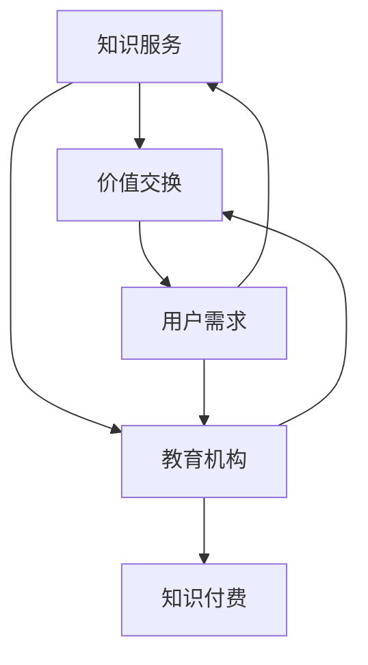

                 

### 《知识付费创业的用户价值 Maximization》

> **关键词：** 知识付费、用户价值、商业模式、内容制作、案例分析

> **摘要：** 本文将探讨知识付费创业领域的用户价值最大化问题。通过分析知识付费的背景、市场机遇、核心概念、创业策略以及成功案例，本文旨在为创业者提供有价值的指导，帮助他们在激烈的市场竞争中实现可持续发展。

### 《知识付费创业的用户价值 Maximization》目录大纲

# 第一部分：知识付费创业概述

## 第1章：知识付费的背景与市场机遇

### 1.1.1 知识付费的概念与演变
### 1.1.2 知识付费市场的现状与趋势
### 1.1.3 创业者如何抓住知识付费的机遇

## 第2章：知识付费创业的核心概念

### 2.1.1 用户价值与用户需求分析
### 2.1.2 用户价值的衡量与评估
### 2.1.3 用户价值最大化策略

# 第二部分：知识付费创业策略

## 第3章：内容制作与营销策略

### 3.1.1 内容制作的要点
### 3.1.2 内容营销的策略
### 3.1.3 社交媒体与内容推广

## 第4章：用户互动与忠诚度提升

### 4.1.1 用户互动策略
### 4.1.2 用户忠诚度提升方法
### 4.1.3 会员体系与增值服务

## 第5章：商业模式创新与盈利模式

### 5.1.1 商业模式创新的方法
### 5.1.2 盈利模式的探索
### 5.1.3 成本控制与效率提升

# 第三部分：案例研究

## 第6章：成功知识付费创业案例分析

### 6.1.1 案例一：某知名知识付费平台的成功经验
### 6.1.2 案例二：小而美知识付费项目的崛起
### 6.1.3 案例三：跨界融合的创新实践

## 第7章：知识付费创业的挑战与应对策略

### 7.1.1 创业初期面临的挑战
### 7.1.2 持续创新与竞争力保持
### 7.1.3 风险管理策略

# 附录

## 附录A：知识付费创业工具与资源

### A.1.1 知识付费平台介绍
### A.1.2 内容创作工具与资源
### A.1.3 数据分析与营销工具推荐

# 后记

## 第8章：知识付费创业的启示与未来展望

### 8.1.1 创业者的经验与建议
### 8.1.2 知识付费创业的挑战与机遇
### 8.1.3 未来知识付费创业的展望

### 第一部分：知识付费创业概述

## 第1章：知识付费的背景与市场机遇

### 1.1.1 知识付费的概念与演变

知识付费，是指用户为了获取特定的知识或技能，愿意支付一定费用的一种商业模式。这一概念并非新生事物，而是随着互联网的普及和信息消费习惯的改变逐渐演变而来的。在传统时代，知识的获取往往依赖于教育资源，如学校、培训机构等，而知识的传播主要依赖于教师和教材。然而，随着互联网技术的进步，尤其是移动互联网的普及，知识付费的形态发生了深刻变革。

#### 核心概念与联系

知识付费的核心概念包括知识服务、价值交换、用户需求等。知识服务是指通过特定的渠道和形式，向用户传递有用、有价值的知识和信息。价值交换则是指用户通过支付费用来获取知识服务的过程。用户需求是知识付费商业模式的基础，它决定了知识服务的方向和内容。

以下是知识付费相关概念及联系的 Mermaid 流程图：

#### 演变历程

知识付费的演变历程可以分为以下几个阶段：

1. **传统教育阶段**：在这个阶段，知识的获取主要通过实体教育机构和教材实现。用户支付学费来获取知识，这种模式被称为“学费模式”。

2. **在线教育阶段**：随着互联网的普及，在线教育成为知识传播的重要途径。用户可以在网上学习各种课程，这种模式被称为“在线课程模式”。

3. **知识付费阶段**：在这个阶段，用户为了获取特定领域的知识或技能，愿意支付额外的费用。知识付费平台如雨后春笋般涌现，这种模式被称为“知识付费模式”。

#### 市场机遇

知识付费市场的机遇主要表现在以下几个方面：

1. **用户需求增加**：随着社会经济的发展，人们对知识的渴求不断增加。尤其是在知识经济时代，知识成为了提升个人竞争力的重要手段。

2. **互联网普及**：互联网的普及使得知识付费更加便捷，用户可以随时随地获取所需的知识。

3. **内容多样化**：知识付费平台提供了丰富多样的知识内容，从专业技能到兴趣爱好，满足了不同用户的需求。

4. **创新商业模式**：知识付费领域不断涌现新的商业模式，如订阅模式、会员模式等，为创业者提供了广阔的舞台。

### 1.1.2 知识付费市场的现状与趋势

#### 市场规模

全球知识付费市场正以惊人的速度增长。根据市场研究机构的报告，2019年全球知识付费市场规模约为1500亿美元，预计到2025年将达到3500亿美元。这一增长速度远超传统教育市场，显示出知识付费市场的巨大潜力。

#### 主要参与者

知识付费市场的主要参与者包括：

1. **知识付费平台**：如得到、知乎Live、喜马拉雅等，这些平台提供了丰富的知识内容，吸引了大量用户。

2. **内容创作者**：包括专业人士、行业专家、爱好者等，他们通过平台发布知识内容，获得收益。

3. **用户**：他们是知识付费的主要消费者，通过支付费用获取知识。

#### 市场趋势

知识付费市场的趋势主要体现在以下几个方面：

1. **内容多样化**：随着用户需求的增加，知识付费平台逐渐提供更广泛、更深入的知识内容。

2. **技术驱动**：人工智能、大数据等技术的应用，使得知识付费内容更加个性化、精准化。

3. **跨界融合**：知识付费与其他行业的融合，如在线教育、社交娱乐等，为市场注入了新的活力。

4. **国际化**：知识付费市场不再局限于国内，国际市场也逐渐成为重要增长点。

### 1.1.3 创业者如何抓住知识付费的机遇

#### 市场调研

创业者首先需要进行市场调研，了解目标用户群体的需求、竞争对手的情况以及市场趋势。通过调研，可以明确自己的市场定位和竞争优势。

1. **目标用户群体**：分析用户的需求、兴趣和行为，确定自己的目标用户群体。

2. **竞争对手**：了解竞争对手的产品、服务、市场份额等，找到自己的差异化优势。

3. **市场趋势**：关注市场的新动态、新技术、新商业模式等，把握市场机遇。

#### 内容创新

内容是知识付费的核心，创业者需要提供有价值、有差异化、有吸引力的内容。以下是一些建议：

1. **热门领域**：关注当前热门领域，如人工智能、区块链、健康养生等。

2. **专业深度**：提供专业、深入的内容，满足用户的学习需求。

3. **创新形式**：尝试多种内容形式，如视频、音频、图文等，增加内容的吸引力。

4. **互动体验**：增加用户互动，如问答、讨论、社群等，提升用户体验。

#### 平台选择

创业者需要选择合适的知识付费平台，如得到、知乎Live、喜马拉雅等。选择平台时，需要考虑以下因素：

1. **用户规模**：选择用户规模较大的平台，有利于提高内容的曝光度。

2. **平台特性**：了解平台的特性，如内容形式、用户群体、盈利模式等，选择与自己内容定位相符的平台。

3. **合作政策**：了解平台对内容创作者的政策，如分成比例、推广支持等，选择对自己有利的平台。

### 第二部分：知识付费创业的核心概念

## 第2章：知识付费创业的核心概念

### 2.1.1 用户价值与用户需求分析

#### 用户价值

用户价值是指知识付费产品或服务对用户产生的影响和价值。它可以从以下几个方面来衡量：

1. **需求满足**：知识付费产品或服务是否能够满足用户的需求，如提升技能、解决问题等。

2. **学习效率**：知识付费产品或服务是否能够提高用户的学习效率，如通过专业讲解、实战案例等。

3. **用户体验**：知识付费产品或服务是否能够提供良好的用户体验，如内容质量、交互设计等。

#### 用户需求分析

用户需求分析是知识付费创业的重要基础，它涉及到以下几个方面：

1. **目标用户**：确定目标用户群体，如职场人士、学生、爱好者等。

2. **需求调研**：通过调查问卷、用户访谈等方式收集用户需求，了解用户对知识付费的期望。

3. **需求分类**：对用户需求进行分类，如知识学习、技能提升、兴趣拓展等。

#### 用户价值的衡量与评估

衡量和评估用户价值是知识付费创业的关键环节，以下是一些常用的方法和工具：

1. **用户满意度**：通过用户满意度调查，了解用户对知识付费产品或服务的满意度。

2. **用户留存率**：通过用户留存率指标，衡量用户对知识付费产品或服务的忠诚度。

3. **用户活跃度**：通过用户活跃度指标，衡量用户对知识付费产品或服务的参与度。

4. **用户转化率**：通过用户转化率指标，衡量用户从免费到付费的转化情况。

#### 用户价值最大化策略

为了实现用户价值的最大化，创业者可以采取以下策略：

1. **内容质量提升**：提供高质量的内容，满足用户的学习需求。

2. **用户体验优化**：优化用户体验，提高用户满意度。

3. **个性化推荐**：通过数据分析，为用户推荐个性化内容，提升用户参与度。

4. **增值服务**：提供增值服务，如一对一咨询、线下活动等，提升用户价值。

### 2.1.2 用户价值的衡量与评估

#### 衡量方法

衡量用户价值的方法主要包括以下几个方面：

1. **用户满意度**：通过用户满意度调查，了解用户对知识付费产品或服务的满意度。用户满意度可以通过评分、反馈等方式进行量化。

2. **用户留存率**：用户留存率是指在一定时间内，用户持续使用知识付费产品或服务的比例。用户留存率越高，说明用户对知识付费产品或服务的依赖性越强。

3. **用户活跃度**：用户活跃度是指用户在一定时间内，对知识付费产品或服务的参与程度。用户活跃度可以通过用户登录次数、课程学习时长、互动次数等指标进行衡量。

4. **用户转化率**：用户转化率是指用户从免费到付费的转化比例。用户转化率越高，说明知识付费产品或服务的吸引力越强。

#### 评估模型

为了更全面地评估用户价值，可以采用以下评估模型：

1. **平衡计分卡**：平衡计分卡是一种综合评估方法，包括财务、客户、内部业务、学习与成长四个方面。通过平衡计分卡，可以从多个维度评估用户价值。

2. **客户终身价值（CLV）**：客户终身价值是指客户在整个生命周期内为知识付费产品或服务带来的总价值。CLV 可以通过以下公式计算：

   $$CLV = \sum_{t=1}^{n} \frac{R_t}{(1+r)^t}$$

   其中，$R_t$ 表示第 $t$ 年的收入，$r$ 表示折现率。

3. **用户价值评估模型**：用户价值评估模型可以根据具体业务需求进行设计，如基于用户行为数据的评估模型、基于用户反馈的评估模型等。

### 2.1.3 用户价值最大化策略

#### 提升内容质量

提升内容质量是用户价值最大化的基础。以下是一些建议：

1. **专业团队**：组建专业的课程研发团队，确保内容的专业性和权威性。

2. **实战案例**：结合实际案例，深入讲解知识点的应用，提高用户的学习效果。

3. **持续更新**：定期更新内容，保持内容的时效性和实用性。

#### 优化用户体验

优化用户体验是提升用户价值的关键。以下是一些建议：

1. **交互设计**：优化交互设计，提高用户操作的便捷性和舒适度。

2. **个性化推荐**：通过数据分析，为用户推荐个性化内容，提高用户的参与度和满意度。

3. **客户服务**：提供优质的客户服务，及时解决用户的问题和反馈。

#### 创新商业模式

创新商业模式可以增加用户价值的实现途径。以下是一些建议：

1. **多元化收入来源**：如课程销售、广告收入、会员费等，提高收入稳定性。

2. **跨界合作**：与其他行业合作，实现资源共享和互利共赢。

3. **平台模式**：构建开放、共享的知识付费平台，吸引更多创作者和用户。

### 第三部分：知识付费创业策略

## 第3章：内容制作与营销策略

### 3.1.1 内容制作的要点

#### 选题

选题是内容制作的第一步，直接影响到内容的价值和吸引力。以下是一些建议：

1. **热门领域**：关注当前热门领域，如人工智能、区块链、健康养生等，这些领域具有广泛的市场需求。

2. **用户需求**：深入了解目标用户的需求，选择用户感兴趣的主题。

3. **差异化**：选择具有差异化的主题，避免与市场上已有的内容雷同。

#### 制作

制作是内容制作的核心环节，以下是一些建议：

1. **专业团队**：组建专业的制作团队，确保内容的专业性和权威性。

2. **形式多样**：结合文字、图片、视频等多种形式，提高内容的趣味性和可读性。

3. **实战案例**：结合实际案例，深入讲解知识点的应用，提高用户的学习效果。

#### 编辑

编辑是内容制作的重要环节，以下是一些建议：

1. **内容质量**：确保内容的专业性、准确性和易懂性。

2. **排版美观**：优化排版，提高内容的可读性。

3. **校对修正**：认真校对内容，修正错误，提高内容的可信度。

### 3.1.2 内容营销的策略

#### 社交媒体营销

社交媒体营销是知识付费内容推广的重要手段，以下是一些建议：

1. **微博**：利用微博的大数据分析功能，精准定位目标用户。

2. **抖音**：通过短视频形式，提高内容的趣味性和传播性。

3. **微信公众号**：发布高质量文章，提升用户粘性。

#### KOL合作

KOL（Key Opinion Leader，关键意见领袖）合作是知识付费内容推广的有效策略，以下是一些建议：

1. **选择合适的KOL**：根据内容特点和目标用户，选择具有影响力的KOL。

2. **合作形式**：可以采用内容合作、广告投放等形式，与KOL共同推广内容。

3. **效果跟踪**：对合作效果进行跟踪和分析，优化合作策略。

#### 广告投放

广告投放是知识付费内容推广的一种重要手段，以下是一些建议：

1. **精准定位**：根据目标用户的特点，选择合适的广告投放平台。

2. **优化投放策略**：通过数据分析，不断优化广告投放策略，提高投放效果。

3. **成本控制**：合理控制广告投放成本，确保广告投放的性价比。

### 3.1.3 社交媒体与内容推广

#### 社交媒体策略

社交媒体策略是知识付费内容推广的重要一环，以下是一些建议：

1. **内容发布计划**：制定内容发布计划，确保内容的连续性和规律性。

2. **互动运营**：积极与用户互动，提升用户参与度。

3. **社群运营**：建立用户社群，增强用户归属感。

#### 内容推广

内容推广是知识付费创业的关键，以下是一些建议：

1. **SEO优化**：通过搜索引擎优化（SEO）提高内容在搜索引擎中的排名。

2. **合作推广**：与其他平台或机构合作，共同推广内容。

3. **口碑营销**：通过用户口碑传播，提高内容的知名度。

### 第四部分：用户互动与忠诚度提升

## 第4章：用户互动与忠诚度提升

### 4.1.1 用户互动策略

#### 评论互动

评论互动是用户互动的基础，以下是一些建议：

1. **鼓励评论**：在内容页面的显著位置放置评论框，鼓励用户发表评论。

2. **优质评论奖励**：对优质评论进行奖励，如赠送课程优惠券等，提高用户的积极性。

3. **管理员回复**：管理员应积极回复用户的评论，解答用户的问题，提升用户体验。

#### 问答互动

问答互动是用户互动的重要形式，以下是一些建议：

1. **专业解答**：邀请专业人士或领域专家进行问答，提供权威解答。

2. **互动式教学**：通过问答形式，引导用户进行互动式学习。

3. **定期举办**：定期举办问答活动，提高用户的参与度。

#### 社群互动

社群互动是用户互动的有效手段，以下是一些建议：

1. **建立社群**：建立用户社群，如微信群、QQ群等，方便用户交流和互动。

2. **社群管理**：任命社群管理员，负责社群的日常运营和管理。

3. **社群活动**：定期举办社群活动，如线上讲座、线下聚会等，增强用户归属感。

### 4.1.2 用户忠诚度提升方法

#### 会员体系

会员体系是提升用户忠诚度的重要手段，以下是一些建议：

1. **会员权益**：为会员提供专属权益，如免费课程、优惠券等。

2. **会员分级**：根据会员的消费金额或学习时长，设置不同级别的会员，提供差异化的服务。

3. **会员积分**：通过会员积分系统，激励用户持续学习和消费。

#### 增值服务

增值服务是提升用户忠诚度的重要途径，以下是一些建议：

1. **一对一咨询**：提供一对一咨询服务，解答用户的个性化问题。

2. **线下活动**：举办线下活动，如讲座、研讨会等，增加用户之间的交流。

3. **行业报告**：定期发布行业报告，提供有价值的信息。

#### 用户调研

用户调研是了解用户需求和提升用户忠诚度的重要手段，以下是一些建议：

1. **定期调研**：定期进行用户调研，了解用户的需求和满意度。

2. **反馈机制**：建立反馈机制，鼓励用户提出建议和反馈。

3. **改进措施**：根据用户反馈，不断改进产品和服务。

### 4.1.3 会员体系与增值服务

#### 会员权益

会员权益是会员体系的核心，以下是一些建议：

1. **免费课程**：为会员提供免费课程，提升会员的学习价值。

2. **优惠券**：为会员提供优惠券，鼓励会员消费。

3. **会员日**：设立会员日，为会员提供特别的优惠和服务。

#### 增值服务

增值服务是提升用户忠诚度和满意度的关键，以下是一些建议：

1. **一对一咨询**：提供一对一咨询服务，解答用户的个性化问题。

2. **线下活动**：举办线下活动，如讲座、研讨会等，增加用户之间的交流。

3. **行业报告**：定期发布行业报告，提供有价值的信息。

#### 会员反馈

会员反馈是优化会员体系和增值服务的重要依据，以下是一些建议：

1. **反馈渠道**：建立多种反馈渠道，如在线客服、用户调研等，方便用户提出反馈。

2. **反馈处理**：及时处理用户反馈，对反馈问题进行改进。

3. **奖励机制**：对积极反馈的用户进行奖励，如赠送课程优惠券等。

### 第五部分：商业模式创新与盈利模式

## 第5章：商业模式创新与盈利模式

### 5.1.1 商业模式创新的方法

#### 多元化收入来源

多元化收入来源是知识付费创业的重要策略，以下是一些建议：

1. **课程销售**：直接销售课程，是最基本的收入来源。

2. **广告收入**：在平台上投放广告，获取广告收入。

3. **会员费**：提供会员服务，收取会员费。

4. **增值服务**：如一对一咨询、行业报告、线下活动等，提供增值服务，获取额外收入。

#### 跨界合作

跨界合作是知识付费创业的创新方式，以下是一些建议：

1. **行业合作**：与相关行业的企业合作，实现资源共享和互利共赢。

2. **跨界产品**：开发跨界产品，如与电商、游戏等领域的合作。

3. **跨界营销**：通过跨界营销活动，提升品牌知名度和用户参与度。

#### 平台模式

平台模式是知识付费创业的一种有效方式，以下是一些建议：

1. **开放平台**：构建开放、共享的知识付费平台，吸引更多创作者和用户。

2. **生态系统**：建立完整的生态系统，包括内容制作、用户运营、市场推广等环节。

3. **平台治理**：建立有效的平台治理机制，维护平台秩序，保障用户权益。

### 5.1.2 盈利模式的探索

#### 课程销售

课程销售是最常见的盈利模式，以下是一些建议：

1. **定价策略**：根据课程内容、时长、受众等因素，制定合理的定价策略。

2. **推广策略**：通过SEO、广告投放、KOL合作等方式，提高课程的销售量。

3. **复购策略**：通过提供优质课程、增值服务等方式，提高用户的复购率。

#### 广告收入

广告收入是知识付费平台的次要收入来源，以下是一些建议：

1. **广告位选择**：合理选择广告位，提高广告的曝光率。

2. **广告形式**：结合平台特点，选择合适的广告形式，如横幅广告、视频广告等。

3. **广告管理**：优化广告管理，确保广告不影响用户体验。

#### 会员费

会员费是知识付费平台的主要收入来源之一，以下是一些建议：

1. **会员权益**：为会员提供丰富的权益，如免费课程、优惠券等。

2. **会员分级**：根据会员的消费金额或学习时长，设置不同级别的会员，提供差异化的服务。

3. **会员推广**：通过会员推荐、活动等方式，提高会员的转化率和留存率。

### 5.1.3 成本控制与效率提升

#### 精细化运营

精细化运营是提高知识付费创业效率的重要手段，以下是一些建议：

1. **数据分析**：通过数据分析，了解用户行为和需求，优化运营策略。

2. **流程优化**：优化运营流程，减少不必要的环节，提高运营效率。

3. **用户反馈**：及时收集用户反馈，对运营问题进行改进。

#### 自动化工具

自动化工具是提高知识付费创业效率的有效手段，以下是一些建议：

1. **内容发布**：使用自动化工具，实现内容发布的自动化。

2. **用户管理**：使用自动化工具，实现用户管理的自动化。

3. **数据分析**：使用自动化工具，实现数据分析的自动化。

#### 合作伙伴关系

合作伙伴关系是降低成本、提高效率的重要途径，以下是一些建议：

1. **供应链合作**：与供应链合作伙伴建立长期稳定的合作关系，降低采购成本。

2. **技术合作**：与技术合作伙伴建立合作关系，共同开发新技术、新产品。

3. **营销合作**：与营销合作伙伴建立合作关系，共同推广产品和服务。

### 第六部分：案例研究

## 第6章：成功知识付费创业案例分析

### 6.1.1 案例一：某知名知识付费平台的成功经验

#### 成功因素

某知名知识付费平台的成功经验主要表现在以下几个方面：

1. **内容质量**：平台提供的课程内容质量高，深受用户好评。

2. **用户体验**：平台注重用户体验，提供便捷、流畅的服务。

3. **创新模式**：平台采用多元化的商业模式，如会员模式、广告模式等，实现稳定盈利。

4. **持续创新**：平台不断推出新功能、新产品，满足用户需求。

#### 案例分析

从平台建设、内容制作、用户运营等方面对某知名知识付费平台进行深入分析，以下是具体的案例分析：

1. **平台建设**：平台采用先进的互联网技术，实现内容发布、用户管理、数据分析等功能，为用户提供便捷的服务。

2. **内容制作**：平台与专业的内容创作者合作，确保课程内容的专业性和权威性。同时，平台注重内容形式的创新，提供多种内容形式，如视频、音频、图文等。

3. **用户运营**：平台通过精细化运营，提高用户的满意度和留存率。例如，平台定期举办线上讲座、线下活动，增加用户互动，提高用户忠诚度。

### 6.1.2 案例二：小而美知识付费项目的崛起

#### 成功因素

小而美知识付费项目的成功主要表现在以下几个方面：

1. **专注领域**：项目专注于某一细分领域，提供专业、深入的内容。

2. **内容创新**：项目通过创新的内容形式，如互动式教学、实战案例等，提高用户的学习体验。

3. **用户体验**：项目注重用户体验，提供优质、便捷的服务。

4. **精准营销**：项目通过精准营销，吸引目标用户，提高用户转化率。

#### 案例分析

从小而美知识付费项目的市场定位、内容创作、运营策略等方面进行深入分析，以下是具体的案例分析：

1. **市场定位**：项目明确自己的市场定位，专注于某一细分领域，满足用户的专业需求。

2. **内容创作**：项目与专业的内容创作者合作，确保课程内容的专业性和实用性。同时，项目注重内容形式的创新，提供多种内容形式，如视频、音频、图文等。

3. **运营策略**：项目通过精细化运营，提高用户的满意度和留存率。例如，项目定期举办线上讲座、线下活动，增加用户互动，提高用户忠诚度。

### 6.1.3 案例三：跨界融合的创新实践

#### 成功因素

跨界融合的创新实践在知识付费领域取得了显著的成功，主要表现在以下几个方面：

1. **跨界合作**：项目与不同行业的合作伙伴建立跨界合作，实现资源共享和互利共赢。

2. **创新模式**：项目通过创新模式，如会员模式、广告模式等，实现多元化收入来源。

3. **用户体验**：项目注重用户体验，提供优质、便捷的服务。

4. **品牌传播**：项目通过跨界合作，提升品牌知名度和影响力。

#### 案例分析

从跨界融合的创新实践的合作模式、业务拓展、用户反馈等方面进行深入分析，以下是具体的案例分析：

1. **合作模式**：项目与不同行业的合作伙伴建立跨界合作，如与电商平台合作，提供课程优惠券；与线下培训机构合作，提供线下课程。

2. **业务拓展**：项目通过业务拓展，实现多元化发展。例如，项目不仅提供线上课程，还提供线下培训、行业报告等服务。

3. **用户反馈**：项目注重用户反馈，不断优化产品和服务。通过用户反馈，项目了解到用户的需求和痛点，及时进行调整。

### 第七部分：知识付费创业的挑战与应对策略

## 第7章：知识付费创业的挑战与应对策略

### 7.1.1 创业初期面临的挑战

知识付费创业在初期阶段面临着诸多挑战，以下是一些常见的问题：

1. **市场竞争激烈**：知识付费市场已经涌现出大量平台和创作者，市场竞争激烈，创业者需要找到自己的差异化竞争优势。

2. **用户获取成本高**：获取新用户需要投入大量的人力、物力和财力，而用户获取成本高，可能影响创业项目的盈利能力。

3. **内容质量难以保证**：知识付费的核心是内容，但创业初期可能缺乏专业的内容创作者和团队，导致内容质量难以保证。

4. **用户忠诚度低**：用户忠诚度低，可能导致用户流失，影响平台的长期发展。

### 7.1.2 持续创新与竞争力保持

为了在激烈的市场竞争中保持竞争力，知识付费创业者需要持续进行创新，以下是一些建议：

1. **技术创新**：引入新技术，如人工智能、大数据等，提高产品和服务质量，提升用户体验。

2. **内容创新**：提供高质量、有差异化的内容，满足用户多样化的需求。可以通过合作、原创等多种方式，确保内容的竞争力。

3. **商业模式创新**：探索新的商业模式，如会员模式、订阅模式等，提供更多的增值服务，增加用户粘性。

4. **用户体验优化**：不断优化用户体验，提高用户满意度。可以通过用户调研、反馈机制等方式，及时了解用户需求，进行改进。

### 7.1.3 风险管理策略

知识付费创业过程中，创业者需要关注并管理各种风险，以下是一些建议：

1. **市场风险**：通过市场调研、风险评估等方法，降低市场风险。例如，了解市场需求、竞争对手情况等。

2. **运营风险**：通过精细化运营、自动化工具等方法，降低运营风险。例如，优化运营流程、提高工作效率等。

3. **财务风险**：通过多元化收入来源、成本控制等方法，降低财务风险。例如，合理规划预算、控制成本等。

4. **法律风险**：了解并遵守相关法律法规，确保创业项目的合法性。例如，版权问题、合同签订等。

### 第八部分：知识付费创业工具与资源

## 附录A：知识付费创业工具与资源

### A.1.1 知识付费平台介绍

以下是几个主流的知识付费平台介绍：

1. **得到**：得到是一款知名的知识付费平台，提供各种领域的优质课程，用户可以通过付费购买课程进行学习。

2. **知乎Live**：知乎Live是知乎推出的知识付费产品，用户可以通过付费收听专业人士的分享和直播。

3. **喜马拉雅**：喜马拉雅是一款音频分享平台，提供大量的有声书、课程、节目等，用户可以通过付费购买进行收听。

### A.1.2 内容创作工具与资源

以下是一些常用的内容创作工具和资源：

1. **Markdown编辑器**：Markdown编辑器是一种轻量级的文本编辑工具，支持Markdown语法，便于内容创作。

2. **Photoshop**：Photoshop是一款专业的图像处理软件，适用于图片创作和编辑。

3. **Canva**：Canva是一款图形设计工具，提供丰富的模板和素材，适用于海报、名片等设计。

### A.1.3 数据分析与营销工具推荐

以下是一些常用的数据分析与营销工具：

1. **Google Analytics**：Google Analytics是一款强大的数据分析工具，可以追踪用户行为、网站流量等。

2. **百度统计**：百度统计是一款与Google Analytics类似的数据分析工具，适用于国内网站。

3. **SEO优化工具**：SEO优化工具可以帮助创业者进行网站优化，提高搜索引擎排名。

### 第八部分：知识付费创业的启示与未来展望

## 第8章：知识付费创业的启示与未来展望

### 8.1.1 创业者的经验与建议

**抓住市场机遇**

创业者应紧跟市场趋势，抓住知识付费领域的机遇。以下是一些建议：

1. **关注热门领域**：关注人工智能、区块链、健康养生等热门领域，提供有价值的内容。

2. **满足用户需求**：深入了解用户需求，提供满足用户需求的内容和服务。

3. **创新商业模式**：不断探索新的商业模式，如会员模式、订阅模式等，提高收入稳定性。

**注重用户体验**

创业者应注重用户体验，提供优质的产品和服务。以下是一些建议：

1. **优化内容质量**：提供高质量、有差异化的内容，提升用户满意度。

2. **提升服务质量**：提供优质的客户服务，及时解决用户的问题和反馈。

3. **优化用户体验**：不断优化用户体验，提高用户粘性。

**持续创新**

创业者应持续创新，保持竞争力。以下是一些建议：

1. **技术创新**：引入新技术，提高产品和服务质量。

2. **内容创新**：提供创新的内容形式，如互动式教学、实战案例等。

3. **商业模式创新**：探索新的商业模式，提供更多的增值服务。

### 8.1.2 知识付费创业的挑战与机遇

**挑战**

1. **市场竞争激烈**：知识付费市场竞争激烈，创业者需要找到自己的差异化竞争优势。

2. **用户获取成本高**：用户获取成本高，可能影响创业项目的盈利能力。

3. **内容质量难以保证**：创业初期可能缺乏专业的内容创作者和团队，导致内容质量难以保证。

**机遇**

1. **市场潜力巨大**：随着互联网的普及和用户消费习惯的改变，知识付费市场仍有巨大的发展空间。

2. **技术进步**：人工智能、大数据等技术的应用，将推动知识付费内容更加个性化、精准化。

3. **跨界融合**：知识付费与其他行业的融合，如在线教育、社交娱乐等，将创造新的市场机遇。

### 8.1.3 未来知识付费创业的展望

**技术驱动**

未来知识付费创业将更加依赖技术的驱动，以下是一些建议：

1. **人工智能**：通过人工智能技术，实现个性化推荐、智能客服等功能，提升用户体验。

2. **大数据**：通过大数据分析，了解用户需求、市场趋势等，为内容创作和运营提供数据支持。

3. **区块链**：通过区块链技术，确保知识付费内容的版权和安全性。

**内容多元化**

未来知识付费内容将更加多元化，以下是一些建议：

1. **垂直领域**：专注于某一细分领域，提供专业、深入的内容。

2. **跨领域融合**：与其他领域结合，提供跨界知识付费产品，如教育与娱乐、教育与电商等。

3. **新兴领域**：关注新兴领域，如人工智能、虚拟现实等，提供前沿知识付费内容。

**商业模式创新**

未来知识付费创业将不断探索新的商业模式，以下是一些建议：

1. **会员模式**：提供会员服务，为用户提供更多优惠和增值服务。

2. **订阅模式**：通过订阅模式，实现持续收入。

3. **跨界合作**：与其他行业合作，实现资源共享和互利共赢。

### 后记

本文从知识付费的背景与市场机遇、核心概念、创业策略、案例研究等方面进行了全面探讨。通过本文的阅读，创业者可以深入了解知识付费创业的各个方面，为创业实践提供有价值的指导。

知识付费创业是一个充满机遇和挑战的领域，创业者需要抓住市场机遇，注重用户体验，持续创新。未来，随着技术的进步和市场的变化，知识付费创业将迎来更多的发展机遇。

最后，感谢读者对本文的关注，希望本文能为您的创业之路提供一些启示和帮助。祝您在知识付费创业的道路上取得成功！

