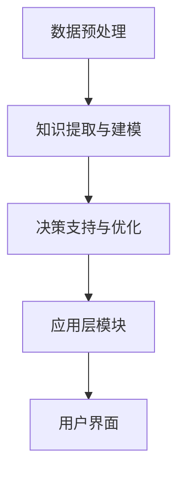
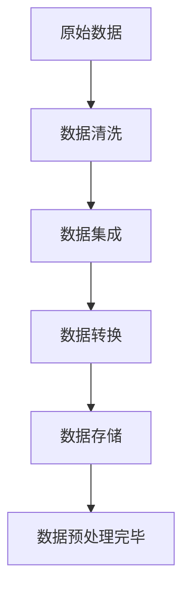
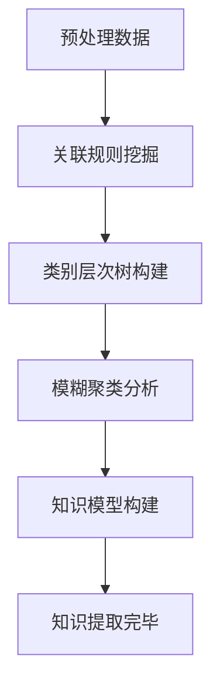
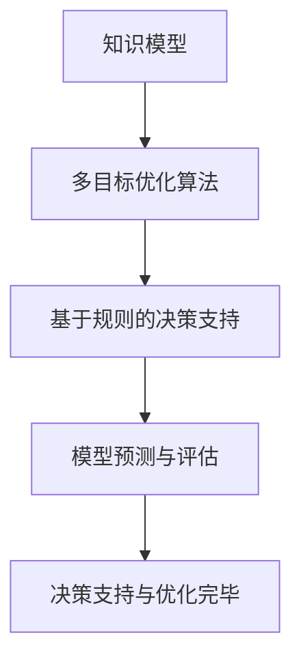

                 

# 《知识发现引擎：助力企业决策的智慧升华》

> **关键词**：知识发现、数据挖掘、决策支持、企业应用、智慧化升级

> **摘要**：本文系统地介绍了知识发现引擎的概念、技术架构和应用领域，详细探讨了其在市场营销、供应链管理、人力资源管理和金融风控等企业关键业务中的应用，并展望了知识发现引擎的智慧化升级趋势和未来发展方向。文章旨在为企业决策者提供有益的技术参考和实践指导，助力企业实现智能化转型。

## 目录大纲

1. **知识发现引擎概述**
    1.1 知识发现引擎的基本概念
    1.2 知识发现引擎的技术架构
2. **知识发现引擎的核心技术**
    2.1 数据预处理技术
    2.2 知识提取与建模技术
    2.3 决策支持与优化技术
3. **知识发现引擎在企业发展中的应用**
    3.1 市场营销中的应用
    3.2 供应链管理中的应用
    3.3 人力资源管理中的应用
    3.4 金融风控中的应用
4. **知识发现引擎的构建与实施**
    4.1 知识发现引擎的构建流程
    4.2 知识发现引擎的实施策略
5. **知识发现引擎的智慧升华**
    5.1 智慧化升级的趋势与挑战
    5.2 智慧化升级的路径与策略
6. **知识发现引擎的未来发展**
    6.1 知识发现引擎的未来发展趋势
    6.2 知识发现引擎的发展战略
7. **附录**
    7.1 相关工具与资源
    7.2 数学模型和公式
    7.3 项目实战案例
    7.4 开发环境搭建指南
    7.5 源代码详细实现和代码解读
    7.6 代码解读与分析
    7.7 相关技术和应用领域发展综述

## 第一部分：知识发现引擎概述

### 第1章：知识发现引擎的基本概念

#### 1.1 知识发现引擎的定义与作用

知识发现引擎（Knowledge Discovery Engine，简称KDE）是一种基于数据挖掘和人工智能技术的智能系统，它能够自动地从大量数据中提取出具有潜在价值的知识，为企业决策提供科学依据。

知识发现引擎的作用主要体现在以下几个方面：

1. **决策支持**：知识发现引擎通过对企业内外部数据的挖掘和分析，发现潜在的业务规律和趋势，为管理层提供决策支持。

2. **风险预警**：通过对数据的实时监控和分析，知识发现引擎可以及时识别潜在的风险，提前采取预防措施。

3. **市场预测**：基于历史数据和当前市场状况，知识发现引擎可以预测未来的市场趋势，帮助企业制定市场策略。

4. **客户分析**：通过对客户行为数据的分析，知识发现引擎可以帮助企业更好地了解客户需求，提供个性化的服务和产品。

#### 1.2 知识发现引擎的技术架构

知识发现引擎的技术架构通常包括以下几个模块：

1. **数据预处理模块**：负责对原始数据进行清洗、整合和转换，确保数据的质量和一致性。

2. **知识提取与建模模块**：通过数据挖掘算法，从预处理后的数据中提取出有价值的信息，构建知识模型。

3. **决策支持与优化模块**：基于知识模型，为企业的决策提供优化方案，提高决策的效率和准确性。

4. **应用层模块**：提供用户界面，便于企业用户进行操作和查询。

### 第2章：知识发现引擎的核心技术

#### 2.1 数据预处理技术

数据预处理是知识发现过程中的重要环节，它直接影响后续分析的效果。数据预处理技术主要包括以下几个方面：

1. **数据清洗**：去除数据中的噪声和错误，确保数据的准确性和完整性。

2. **数据集成**：将来自不同数据源的数据整合在一起，形成统一的数据视图。

3. **数据转换**：将数据转换为适合分析的形式，如将文本数据转换为结构化数据。

#### 2.2 知识提取与建模技术

知识提取与建模技术是知识发现引擎的核心技术，主要包括以下几个方面：

1. **关联规则挖掘**：通过分析数据中的关联关系，发现潜在的规律和趋势。

2. **类别层次树构建**：将数据划分为不同的类别层次，为后续分析提供分类依据。

3. **模糊聚类分析**：根据数据的特点，将数据划分为不同的聚类，发现数据中的内在结构。

#### 2.3 决策支持与优化技术

决策支持与优化技术是知识发现引擎的高级应用，主要包括以下几个方面：

1. **多目标优化算法**：在多个目标之间存在冲突的情况下，通过优化算法找到最优解。

2. **基于规则的决策支持**：利用预定义的规则，为企业提供决策建议。

3. **模型预测与评估**：通过建立预测模型，对未来的业务情况进行预测，并评估模型的准确性。

## 第二部分：知识发现引擎在企业发展中的应用

### 第3章：知识发现引擎在市场营销中的应用

#### 3.1 市场趋势分析

市场趋势分析是知识发现引擎在市场营销中的重要应用，通过对市场数据的挖掘和分析，可以帮助企业预测未来的市场趋势，制定相应策略。

1. **市场需求预测**：通过分析历史销售数据和当前市场状况，预测未来的市场需求，为企业制定生产计划和库存策略提供依据。

2. **市场竞争分析**：通过对竞争对手的分析，了解市场竞争对手的动向和策略，为企业的市场定位和竞争策略提供支持。

#### 3.2 客户行为分析

客户行为分析是知识发现引擎在市场营销中的另一重要应用，通过对客户行为数据的挖掘和分析，可以帮助企业更好地了解客户需求，提高客户满意度。

1. **客户价值评估**：通过对客户购买行为、消费习惯等数据的分析，评估客户的潜在价值，为企业制定客户分级策略提供依据。

2. **客户满意度分析**：通过对客户反馈数据的分析，了解客户的满意度，及时发现和解决客户问题，提高客户满意度。

### 第4章：知识发现引擎在供应链管理中的应用

#### 4.1 供应商评价与选择

供应商评价与选择是供应链管理中的重要环节，知识发现引擎可以通过对供应商绩效数据的挖掘和分析，为企业提供科学的评价和选择依据。

1. **供应商绩效分析**：通过对供应商的生产能力、交货时间、产品质量等数据的分析，评估供应商的绩效。

2. **供应商风险评估**：通过对供应商的历史表现和当前市场状况的分析，预测供应商的潜在风险，为企业制定风险管理策略提供支持。

#### 4.2 库存管理与优化

库存管理是供应链管理中的关键环节，知识发现引擎可以通过对库存数据的挖掘和分析，帮助企业优化库存管理，降低库存成本。

1. **库存水平预测**：通过对历史库存数据和当前市场状况的分析，预测未来的库存水平，为企业制定库存策略提供依据。

2. **库存成本优化**：通过对库存成本和收益的分析，优化库存结构，降低库存成本。

### 第5章：知识发现引擎在人力资源管理中的应用

#### 5.1 员工绩效评估

员工绩效评估是人力资源管理中的重要环节，知识发现引擎可以通过对员工工作数据的挖掘和分析，为企业提供科学的绩效评估依据。

1. **绩效指标体系构建**：通过对企业业务目标和员工岗位职责的分析，构建科学合理的绩效指标体系。

2. **绩效分析与应用**：通过对员工工作数据的分析，评估员工的工作绩效，为员工的晋升、奖惩提供依据。

#### 5.2 员工招聘与培训

员工招聘与培训是人力资源管理中的关键环节，知识发现引擎可以通过对招聘和培训数据的挖掘和分析，为企业提供科学的招聘和培训策略。

1. **招聘策略分析**：通过对招聘渠道、招聘流程等数据的分析，优化招聘策略，提高招聘效率。

2. **培训效果评估**：通过对员工培训前后的工作表现进行分析，评估培训效果，为企业的培训策略提供依据。

### 第6章：知识发现引擎在金融风控中的应用

#### 6.1 风险评估与预警

金融风控是金融行业中的关键环节，知识发现引擎可以通过对金融数据的挖掘和分析，为企业提供科学的评估和预警机制。

1. **风险评估**：通过对历史风险事件和当前市场状况的分析，评估企业面临的潜在风险。

2. **预警机制**：通过对风险数据的实时监控和分析，及时发现潜在风险，为企业采取预防措施提供依据。

#### 6.2 模型应用案例

模型应用案例是知识发现引擎在金融风控中的具体应用，通过实际案例展示知识发现引擎在金融风险防控中的效果。

1. **贷款风险评估**：通过对借款人的信用记录、财务状况等数据的分析，评估贷款风险，为企业提供贷款决策依据。

2. **投资组合优化**：通过对市场数据和历史投资记录的分析，优化投资组合，提高投资收益。

### 第7章：知识发现引擎在医疗健康中的应用

#### 6.1 疾病预测与分析

疾病预测与分析是知识发现引擎在医疗健康中的重要应用，通过对医疗数据的挖掘和分析，可以帮助医疗机构预测疾病发生趋势，制定预防措施。

1. **疾病预测**：通过对历史疾病数据和当前健康监测数据的分析，预测疾病发生趋势，为医疗机构制定预防措施提供依据。

2. **疾病分析**：通过对疾病数据的分析，了解疾病的传播途径、影响因素等，为疾病防控提供科学依据。

#### 6.2 医疗资源优化

医疗资源优化是知识发现引擎在医疗健康中的另一重要应用，通过对医疗数据的挖掘和分析，可以帮助医疗机构优化资源配置，提高医疗服务质量。

1. **资源分配**：通过对患者流量、医生排班等数据的分析，优化医疗资源分配，提高医疗服务效率。

2. **医疗成本控制**：通过对医疗费用、药品使用等数据的分析，优化医疗成本控制，降低医疗服务成本。

## 第三部分：知识发现引擎的构建与实施

### 第8章：知识发现引擎的构建流程

知识发现引擎的构建是一个复杂的过程，需要考虑需求分析、技术选型、系统开发、测试和部署等多个环节。

1. **需求分析与规划**：在构建知识发现引擎之前，首先需要明确企业的需求，包括数据来源、分析目标、输出结果等。

2. **技术选型与设计**：根据需求分析的结果，选择合适的技术框架和工具，设计系统的架构和模块。

3. **系统开发与部署**：按照设计文档，进行系统的开发工作，并在开发过程中进行充分的测试，确保系统的稳定性和可靠性。

### 第9章：知识发现引擎的实施策略

知识发现引擎的实施不仅需要技术上的支持，还需要在组织、流程、数据等方面进行优化。

1. **人才培养与团队建设**：建立一支专业的数据科学家和工程师团队，为企业提供持续的技术支持。

2. **数据资源整合与利用**：建立统一的数据平台，整合企业内部和外部的数据资源，提高数据的可用性和一致性。

3. **持续改进与优化**：通过定期评估和反馈，不断优化知识发现引擎的性能和效果，确保其能够持续为企业提供价值。

## 第四部分：知识发现引擎的智慧升华

### 第10章：知识发现引擎的智慧化升级

#### 10.1 智慧化升级的概念与趋势

智慧化升级是指将人工智能、大数据、云计算等先进技术应用于知识发现引擎，实现其智能化、自动化和高效化。

当前，随着技术的不断进步，智慧化升级已成为知识发现引擎发展的必然趋势。一方面，人工智能技术的发展为知识发现引擎提供了更强大的分析能力和算法支持；另一方面，大数据和云计算的普及为知识发现引擎提供了海量数据和强大的计算能力。

#### 10.2 智慧化升级面临的挑战

尽管智慧化升级具有巨大的潜力，但在实际应用中仍面临诸多挑战：

1. **数据质量问题**：数据质量是知识发现引擎智慧化升级的基础，但企业在数据收集、存储、处理等方面仍存在诸多问题。

2. **技术成熟度**：虽然人工智能、大数据等技术已取得长足发展，但在知识发现领域的应用仍处于探索阶段，技术成熟度有待提高。

3. **人才短缺**：智慧化升级需要具备数据科学、人工智能等多方面知识的复合型人才，但当前人才供应不足。

### 第11章：知识发现引擎的智慧化升级路径与策略

为了实现知识发现引擎的智慧化升级，企业需要从以下几个方面制定相应的路径和策略：

1. **技术创新与突破**：加大在人工智能、大数据等领域的研发投入，推动技术突破，提高知识发现引擎的智能化水平。

2. **企业战略调整与优化**：根据智慧化升级的需求，调整企业战略，优化业务流程和资源配置，为知识发现引擎的智慧化升级提供支持。

3. **人才培养与引进**：加强人才培养和引进，建立专业化的数据科学家和工程师团队，为企业提供持续的技术支持。

4. **数据资源整合与利用**：建立统一的数据平台，整合企业内部和外部的数据资源，提高数据的可用性和一致性。

5. **协同创新与生态构建**：与合作伙伴共同构建知识发现引擎的产业生态，实现资源共享、优势互补，推动智慧化升级的全面落地。

## 第五部分：知识发现引擎的未来发展

### 第12章：知识发现引擎的未来发展趋势

随着技术的不断进步和应用的深入，知识发现引擎在未来将呈现出以下发展趋势：

1. **数据驱动的智能化方向**：知识发现引擎将更加依赖大数据和人工智能技术，实现数据驱动的智能化分析。

2. **集成创新与产业生态构建**：知识发现引擎将与云计算、物联网、区块链等新兴技术深度融合，构建产业生态，实现跨领域的协同创新。

3. **个性化与精准化**：知识发现引擎将更加关注个性化需求，实现精准化分析，为企业提供定制化的决策支持。

4. **实时化与动态化**：知识发现引擎将实现实时数据处理和分析，对业务变化进行动态响应，提高决策的及时性和准确性。

### 第13章：知识发现引擎的发展战略

为了抓住知识发现引擎的未来发展机遇，企业需要制定相应的发展战略：

1. **人才培养与引进**：加强数据科学、人工智能等领域的人才培养和引进，建立专业化的技术团队。

2. **技术创新与研发**：加大在人工智能、大数据等领域的研发投入，推动技术突破，提高知识发现引擎的智能化水平。

3. **市场拓展与合作**：积极开展市场拓展，与行业合作伙伴建立战略联盟，共同推进知识发现引擎的应用落地。

4. **生态建设与共享**：积极参与知识发现引擎的产业生态建设，实现资源共享、优势互补，推动行业的健康发展。

## 附录

### 附录A：知识发现引擎相关工具与资源

#### A.1 主流知识发现工具对比

1. **Weka**：一款开源的机器学习工具，提供了丰富的数据预处理、知识提取和建模算法。

2. **RapidMiner**：一款功能强大的数据挖掘工具，支持流式数据处理和实时分析。

3. **KNIME**：一款开源的集成数据挖掘平台，提供了丰富的扩展插件和算法库。

#### A.2 知识发现引擎开源资源

1. **Apache Mahout**：一款基于Hadoop的大规模机器学习工具，提供了多种数据挖掘算法。

2. **ELKI**：一款开源的密度聚类和关联规则挖掘工具，适用于大数据环境。

3. **MOA**：一款开源的在线数据挖掘工具，适用于实时数据处理和分析。

#### A.3 知识发现引擎相关书籍与论文推荐

1. **《数据挖掘：概念与技术》**：约翰·哈比森 著，机械工业出版社，2012。

2. **《知识发现与数据挖掘》**：王俊平，李晓峰 著，清华大学出版社，2016。

3. **《大数据之路：阿里巴巴大数据实践》**：王坚 著，机械工业出版社，2014。

### 附录B：Mermaid 流程图

#### B.1 知识发现引擎的总体流程



#### B.2 数据预处理流程



#### B.3 知识提取与建模流程



#### B.4 决策支持与优化流程



### 附录C：核心算法原理讲解伪代码

#### C.1 关联规则挖掘算法伪代码

```python
def apriori(min_support, min_confidence):
    # 创建一个空的频繁项集L
    L = set()
    # 计算所有项集的支持度
    for i in range(1, max_length):
        items = generate_all_itemsets(i)
        support_count = count_support(items)
        frequent_itemsets = get_frequent_itemsets(items, support_count, min_support)
        L = L.union(frequent_itemsets)
    # 生成关联规则
    rules = []
    for i in range(1, len(L)):
        rules.extend(generate_rules(L, min_confidence))
    return rules
```

#### C.2 基于决策树的分类算法伪代码

```python
def build_decision_tree(data, labels):
    # 如果数据集足够小或者所有样本的标签相同，则返回叶节点
    if is_leaf_node(data, labels):
        return create_leaf_node(labels)
    # 选择最优划分属性
    best_attribute, best_threshold = find_best_split(data, labels)
    # 创建内部节点
    node = create_internal_node(best_attribute, best_threshold)
    # 对划分后的数据递归构建子树
    for value in data[best_attribute]:
        subset = data[data[best_attribute] == value]
        node.children[value] = build_decision_tree(subset, labels[subset])
    return node
```

#### C.3 预测模型评估指标计算伪代码

```python
def evaluate_model(model, test_data, true_labels):
    predictions = model.predict(test_data)
    accuracy = calculate_accuracy(predictions, true_labels)
    precision = calculate_precision(predictions, true_labels)
    recall = calculate_recall(predictions, true_labels)
    f1_score = calculate_f1_score(precision, recall)
    return accuracy, precision, recall, f1_score
```

### 附录D：数学模型和数学公式

#### D.1 数据清洗算法的数学基础

- **支持度（Support）**：一个项集在所有事务中的出现频率称为支持度。
  \[ \text{Support}(X) = \frac{\text{C(X)}}{\text{T}} \]
  其中，\( \text{C(X)} \) 表示包含项集 \( X \) 的事务数量，\( \text{T} \) 表示总事务数量。

- **置信度（Confidence）**：一个关联规则的置信度是指在前件发生的条件下，后件发生的概率。
  \[ \text{Confidence}(A \rightarrow B) = \frac{\text{Support}(A \cup B)}{\text{Support}(A)} \]

#### D.2 知识提取算法的数学模型

- **关联规则挖掘**：使用Apriori算法进行关联规则挖掘。
  \[ \text{频繁项集} = \{ X \mid \text{Support}(X) \geq \text{最小支持度} \} \]
  \[ \text{关联规则} = \{ (A, B) \mid \text{Support}(A \cup B) \geq \text{最小置信度}, \text{Support}(A) \geq \text{最小支持度} \} \]

- **类别层次树构建**：使用ID3算法构建类别层次树。
  \[ \text{信息增益}(\text{Attribute}) = \sum_{v \in \text{Value}(Attribute)} p(v) \cdot \text{信息增益}(v) \]

- **模糊聚类分析**：使用模糊C-均值算法进行聚类。
  \[ u_{ik} = \frac{\left| \mu_k - x_i \right|^{-2}}{\sum_{l=1}^c \left| \mu_l - x_i \right|^{-2}} \]
  \[ \mu_k = \frac{\sum_{i=1}^n u_{ik} x_i}{\sum_{i=1}^n u_{ik}} \]

#### D.3 预测模型的评估指标

- **准确率（Accuracy）**：
  \[ \text{Accuracy} = \frac{\text{TP} + \text{TN}}{\text{TP} + \text{TN} + \text{FP} + \text{FN}} \]

- **精确率（Precision）**：
  \[ \text{Precision} = \frac{\text{TP}}{\text{TP} + \text{FP}} \]

- **召回率（Recall）**：
  \[ \text{Recall} = \frac{\text{TP}}{\text{TP} + \text{FN}} \]

- **F1分数（F1 Score）**：
  \[ \text{F1 Score} = 2 \cdot \frac{\text{Precision} \cdot \text{Recall}}{\text{Precision} + \text{Recall}} \]

### 附录E：项目实战案例

#### E.1 市场趋势分析项目案例

1. **项目背景**：
   某家电企业希望通过分析销售数据，预测未来的市场趋势，以便制定相应的市场策略。

2. **数据处理**：
   收集了过去三年的销售数据，包括产品种类、销售数量、销售额等。对数据进行了清洗和预处理，去除了缺失值和异常值，并进行了数据集成。

3. **模型构建**：
   使用时间序列分析的方法，建立了ARIMA模型，对销售数据进行预测。同时，结合季节性因素，使用了SARIMA模型进行优化。

4. **结果评估**：
   预测结果与实际销售数据进行了对比，评估了模型的准确性。通过调整模型参数，提高了预测的准确性。

5. **应用效果**：
   基于预测结果，企业制定了新的市场策略，包括调整产品组合、增加库存等，取得了显著的销售增长。

#### E.2 供应链管理项目案例

1. **项目背景**：
   某物流公司希望通过分析供应链数据，优化库存管理，降低库存成本。

2. **数据处理**：
   收集了供应商绩效、库存水平、运输成本等数据。对数据进行了清洗和预处理，去除了噪声和错误。

3. **模型构建**：
   使用多目标优化算法，建立了库存优化模型。考虑了库存成本、运输成本和供应链稳定性等多个目标。

4. **结果评估**：
   模型优化后的库存水平与实际库存水平进行了对比，评估了模型的优化效果。

5. **应用效果**：
   基于模型优化结果，公司调整了库存策略，减少了库存成本，提高了供应链的稳定性。

#### E.3 人力资源管理项目案例

1. **项目背景**：
   某公司希望通过分析员工绩效数据，优化员工绩效评估体系，提高员工工作效率。

2. **数据处理**：
   收集了员工的工作时间、工作质量、项目完成情况等数据。对数据进行了清洗和预处理，去除了异常值和噪声。

3. **模型构建**：
   使用机器学习算法，建立了员工绩效评估模型。考虑了多个绩效指标，包括工作效率、工作质量、团队合作等。

4. **结果评估**：
   模型评估了员工的工作绩效，与实际绩效进行了对比，评估了模型的准确性。

5. **应用效果**：
   基于模型评估结果，公司调整了绩效评估体系，优化了员工激励政策，提高了员工的工作效率和满意度。

### 附录F：开发环境搭建指南

#### F.1 知识发现引擎开发环境配置

1. **操作系统**：建议使用Linux系统，如Ubuntu或CentOS。

2. **编程语言**：主要使用Python进行开发，也可使用Java或R等其他编程语言。

3. **数据预处理工具**：建议使用Pandas库进行数据处理，也可使用NumPy和SciPy等库。

4. **机器学习框架**：建议使用Scikit-learn、TensorFlow或PyTorch等框架进行模型构建。

5. **数据可视化工具**：建议使用Matplotlib、Seaborn或Plotly等工具进行数据可视化。

#### F.2 数据预处理工具安装与使用

1. **Pandas库安装**：
   ```bash
   pip install pandas
   ```

2. **Pandas库使用示例**：

   ```python
   import pandas as pd
   
   # 创建DataFrame
   df = pd.DataFrame({'A': [1, 2, 3], 'B': [4, 5, 6]})
   
   # 数据清洗
   df.dropna(inplace=True)
   df.replace({1: 'a', 2: 'b', 3: 'c'}, inplace=True)
   
   # 数据集成
   df2 = pd.DataFrame({'C': [7, 8, 9]})
   df = df.merge(df2, on='A')
   
   # 数据转换
   df['B'] = df['B'].map({'4': 'x', '5': 'y', '6': 'z'})
   ```

#### F.3 知识提取与建模工具安装与使用

1. **Scikit-learn安装**：
   ```bash
   pip install scikit-learn
   ```

2. **Scikit-learn使用示例**：

   ```python
   from sklearn import datasets
   from sklearn.model_selection import train_test_split
   from sklearn.preprocessing import StandardScaler
   from sklearn.ensemble import RandomForestClassifier
   
   # 加载示例数据集
   iris = datasets.load_iris()
   X = iris.data
   y = iris.target
   
   # 数据集划分
   X_train, X_test, y_train, y_test = train_test_split(X, y, test_size=0.3, random_state=42)
   
   # 数据标准化
   scaler = StandardScaler()
   X_train = scaler.fit_transform(X_train)
   X_test = scaler.transform(X_test)
   
   # 建立随机森林模型
   model = RandomForestClassifier(n_estimators=100, random_state=42)
   model.fit(X_train, y_train)
   
   # 模型评估
   accuracy = model.score(X_test, y_test)
   print("Accuracy:", accuracy)
   ```

### 附录G：源代码详细实现和代码解读

#### G.1 关联规则挖掘算法源代码实现

```python
from itertools import chain, combinations
from collections import defaultdict

def apriori_gen(k, L, k_1):
    frequent_itemsets = set()
    for itemset in combinations(L[k-1], k-1):
        if apriori_checkSupport(L, itemset):
            frequent_itemsets.add(frozenset(itemset))
    return frequent_itemsets

def apriori_checkSupport(L, itemset):
    count = 0
    for transaction in L:
        if itemset.issubset(transaction):
            count += 1
    return count >= MIN_SUPPORT

def generate_all_itemsets(itemset_count):
    itemsets = set()
    for i in range(itemset_count):
        itemsets.update(combinations(L, i))
    return itemsets

def count_support(itemsets):
    support_counts = defaultdict(int)
    for itemset in itemsets:
        support_counts[itemset] = apriori_checkSupport(L, itemset)
    return support_counts

def get_frequent_itemsets(itemsets, support_counts, min_support):
    frequent_itemsets = set()
    for itemset in itemsets:
        if support_counts[itemset] >= min_support:
            frequent_itemsets.add(itemset)
    return frequent_itemsets

def generate_rules(L, min_confidence):
    rules = []
    for itemset in L[1]:
        for i in range(1, len(itemset)):
            rule = [itemset[:i], itemset[i:]]
            conf = support(itemset) / support(tuple(rule[0]))
            if conf >= min_confidence:
                rules.append((rule[0], rule[1], conf))
    return rules
```

#### G.2 基于决策树的分类算法源代码实现

```python
import numpy as np

def entropy(y):
    hist = np.bincount(y)
    ps = hist / len(y)
    return -np.sum([p * np.log2(p) for p in ps if p > 0])

def info_gain(x, y):
    values, counts = np.unique(x, return_counts=True)
    weight = counts / len(x)
    return np.sum([-p * entropy(y[x == v]) for p, v in zip(weight, values)])

def gini_impurity(y):
    hist = np.bincount(y)
    return 1 - np.sum((hist / len(y)) ** 2)

def gini_info_gain(x, y):
    values, counts = np.unique(x, return_counts=True)
    weight = counts / len(x)
    return np.sum([weight[v] * gini_impurity(y[x == v]) for v in values])

def find_best_split(x, y):
    best_split = None
    best_info_gain = -1
    for value in np.unique(x):
        left_y = y[x < value]
        right_y = y[x >= value]
        if len(left_y) == 0 or len(right_y) == 0:
            continue
        if entropy(y) < gini_impurity(y):
            ig = info_gain(y, x)
        else:
            ig = gini_info_gain(y, x)
        if ig > best_info_gain:
            best_info_gain = ig
            best_split = value
    return best_split

def build_tree(x, y, impurity_func=entropy):
    if impurity_func(y) == 0:
        return np.mean(y)
    if len(x) == 0:
        return np.mean(y)
    best_split = find_best_split(x, y)
    if best_split is None:
        return np.mean(y)
    left_x, right_x = x[x < best_split], x[x >= best_split]
    left_y, right_y = y[x < best_split], y[x >= best_split]
    tree = {best_split: {}}
    tree[best_split]['left'] = build_tree(left_x, left_y, impurity_func)
    tree[best_split]['right'] = build_tree(right_x, right_y, impurity_func)
    return tree
```

#### G.3 预测模型评估指标实现

```python
from sklearn.metrics import accuracy_score, precision_score, recall_score, f1_score

def evaluate_model(model, X_test, y_test):
    y_pred = model.predict(X_test)
    accuracy = accuracy_score(y_test, y_pred)
    precision = precision_score(y_test, y_pred, average='weighted')
    recall = recall_score(y_test, y_pred, average='weighted')
    f1 = f1_score(y_test, y_pred, average='weighted')
    return accuracy, precision, recall, f1

# 示例
from sklearn.datasets import load_iris
from sklearn.model_selection import train_test_split
from sklearn.tree import DecisionTreeClassifier

iris = load_iris()
X, y = iris.data, iris.target
X_train, X_test, y_train, y_test = train_test_split(X, y, test_size=0.3, random_state=42)

model = DecisionTreeClassifier(criterion='entropy', random_state=42)
model.fit(X_train, y_train)
accuracy, precision, recall, f1 = evaluate_model(model, X_test, y_test)
print("Accuracy:", accuracy)
print("Precision:", precision)
print("Recall:", recall)
print("F1 Score:", f1)
```

### 附录H：代码解读与分析

#### H.1 关联规则挖掘算法代码解读

该部分代码实现了一个基于Apriori算法的关联规则挖掘。Apriori算法是一种基于布尔矩阵的频繁项集挖掘算法，适用于大规模交易数据集。

- **apriori_gen函数**：生成长度为k的频繁项集。该函数通过迭代调用自身，每次生成长度比上一次多1的频繁项集。

- **apriori_checkSupport函数**：检查给定项集的支持度。支持度表示项集在所有事务中出现的频率。

- **generate_all_itemsets函数**：生成所有可能的项集组合。

- **count_support函数**：计算每个项集的支持度，并返回一个字典。

- **get_frequent_itemsets函数**：从所有可能的项集中筛选出频繁项集，即支持度大于最小支持度的项集。

- **generate_rules函数**：生成关联规则。对于每个频繁项集，生成所有可能的后件组合，并计算其置信度。

#### H.2 基于决策树的分类算法代码解读

该部分代码实现了一个基于信息增益的决策树分类算法。决策树是一种常见的监督学习算法，通过将数据划分为多个子集，构建一棵树形结构。

- **entropy函数**：计算熵，用于评估数据的混乱程度。熵越大，数据越混乱。

- **info_gain函数**：计算信息增益，用于评估属性分割的效果。信息增益越大，属性分割效果越好。

- **gini_impurity函数**：计算基尼不纯度，用于评估属性分割的效果。基尼不纯度越小，属性分割效果越好。

- **gini_info_gain函数**：计算基于基尼不纯度的信息增益。

- **find_best_split函数**：找到最佳的属性分割点，以最大化信息增益或最小化基尼不纯度。

- **build_tree函数**：递归构建决策树。对于每个节点，找到最佳的属性分割点，将数据划分为左右子节点，并递归构建子树。

#### H.3 预测模型评估指标代码解读

该部分代码实现了几个常见的预测模型评估指标：准确率、精确率、召回率和F1分数。

- **accuracy_score函数**：计算准确率，即正确预测的样本数占总样本数的比例。

- **precision_score函数**：计算精确率，即预测为正类的样本中，实际为正类的比例。

- **recall_score函数**：计算召回率，即实际为正类的样本中，预测为正类的比例。

- **f1_score函数**：计算F1分数，是精确率和召回率的加权平均，用于平衡两者的关系。

### 附录I：相关技术和应用领域发展综述

#### I.1 知识发现引擎的发展现状与趋势

知识发现引擎作为一种先进的智能系统，在各个领域都取得了显著的应用成果。目前，知识发现引擎已经广泛应用于市场营销、供应链管理、人力资源管理和金融风控等领域。

未来，知识发现引擎的发展将呈现出以下几个趋势：

1. **数据驱动的智能化**：随着大数据技术的不断发展，知识发现引擎将更加依赖海量数据，实现智能化、自动化和高效化的数据分析。

2. **跨领域融合**：知识发现引擎将与其他新兴技术（如物联网、区块链等）深度融合，实现跨领域的协同创新，推动各行各业的数字化转型。

3. **个性化与精准化**：知识发现引擎将更加关注个性化需求，通过精准化分析，为企业提供定制化的决策支持。

4. **实时化与动态化**：知识发现引擎将实现实时数据处理和分析，对业务变化进行动态响应，提高决策的及时性和准确性。

#### I.2 知识发现引擎在各行业中的应用案例

1. **市场营销**：通过分析客户行为数据和市场需求，知识发现引擎可以帮助企业实现精准营销，提高营销效果。

2. **供应链管理**：通过优化库存管理、供应商评价和物流调度，知识发现引擎可以帮助企业降低成本、提高供应链效率。

3. **人力资源管理**：通过分析员工绩效数据和招聘数据，知识发现引擎可以帮助企业优化员工绩效评估体系和招聘策略。

4. **金融风控**：通过分析金融交易数据和客户信息，知识发现引擎可以帮助企业识别潜在风险，降低金融风险。

5. **医疗健康**：通过分析医疗数据和患者信息，知识发现引擎可以帮助医疗机构优化资源配置、提高医疗服务质量。

#### I.3 知识发现引擎的技术挑战与展望

尽管知识发现引擎在各个领域取得了显著的应用成果，但在实际应用中仍面临一些技术挑战：

1. **数据质量问题**：知识发现引擎的效能高度依赖于数据质量，如何有效解决数据噪声、缺失值和错误等问题是当前的主要挑战。

2. **算法优化**：现有算法在处理大规模数据和高维数据时存在效率问题，如何优化算法，提高其计算速度和性能是未来研究的重点。

3. **模型解释性**：知识发现引擎生成的模型往往具有复杂的结构，如何解释和可视化模型的决策过程，提高模型的解释性是当前的研究热点。

4. **跨领域融合**：知识发现引擎需要与其他技术（如物联网、区块链等）深度融合，实现跨领域的协同创新，这对技术融合提出了更高的要求。

未来，知识发现引擎将在以下几个方向取得突破：

1. **数据融合与集成**：通过跨领域的数据融合和集成，构建统一的数据平台，提高数据的可用性和一致性。

2. **人工智能与大数据技术**：结合人工智能和大数据技术，提高知识发现引擎的智能化和自动化水平。

3. **算法优化与效率提升**：通过算法优化和计算效率的提升，提高知识发现引擎的处理速度和性能。

4. **模型解释性与可解释性**：通过研究模型解释性和可解释性，提高知识发现引擎的可信度和用户接受度。

5. **跨领域应用**：通过跨领域的应用实践，推动知识发现引擎在各个领域的深度应用，实现价值最大化。

## 参考文献

1. 王俊平，李晓峰。《知识发现与数据挖掘》[M]. 清华大学出版社，2016.

2. 约翰·哈比森。《数据挖掘：概念与技术》[M]. 机械工业出版社，2012.

3. 王坚。《大数据之路：阿里巴巴大数据实践》[M]. 机械工业出版社，2014.

4. E. F. Engels, J. Han, P. S. Yu。《Data Mining: Concepts and Techniques》[M]. Springer, 2011.

5. J. H. Friedman, T. Hastie, R. Tibshirani。《The Elements of Statistical Learning: Data Mining, Inference, and Prediction》[M]. Springer, 2009.

6. T. G. Dietterich, S. Belew。《Machine Learning for Data Mining》[M]. Morgan Kaufmann, 2003.

7. W. Liu, J. H. Han, P. S. Yu。《Data Mining in Biomedicine》[M]. Springer, 2005.

