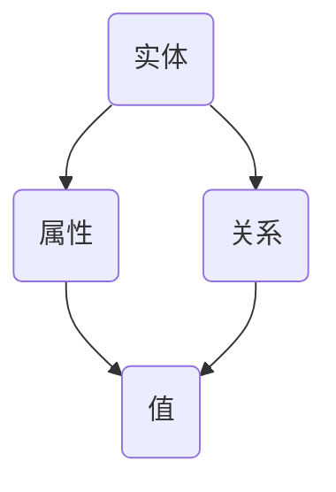
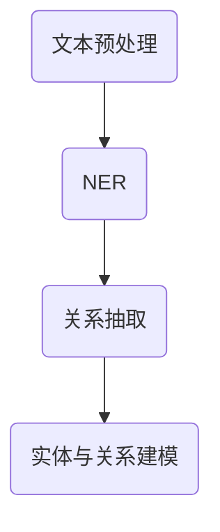
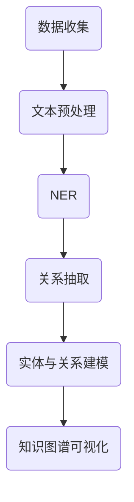
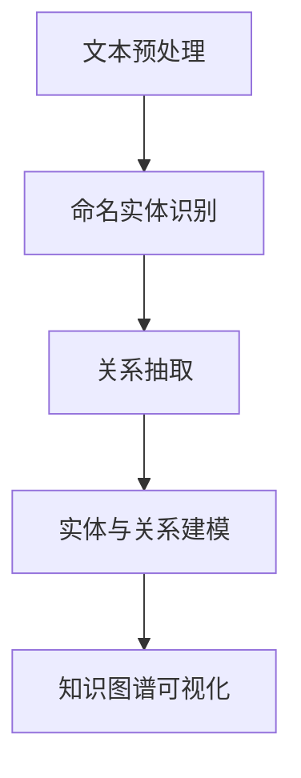

                 


## 《知识图谱在法律咨询中的应用》

### 关键词：
- 知识图谱
- 法律咨询
- 智能搜索
- 实体识别
- 关系抽取
- 法律法规知识库
- 法律文档分析
- 法律案件分析

### 摘要：
本文深入探讨了知识图谱在法律咨询领域的应用，包括知识图谱的基本概念、法律咨询中的需求分析、知识图谱的构建方法、应用场景以及实战案例。通过详细的算法原理讲解、数学模型和公式解析、实战代码示例，展示了知识图谱在法律咨询中的巨大潜力和实际应用效果。

---

## 《知识图谱在法律咨询中的应用》目录大纲

1. **知识图谱与法律咨询概述**
   - 1.1 知识图谱基础与法律咨询的关系
     - 1.1.1 知识图谱的定义与核心概念
     - 1.1.2 法律咨询中知识图谱的应用价值
     - 1.1.3 知识图谱与法律咨询的结合点
   - 1.2 法律领域知识图谱构建
     - 2.1 法律知识的提取与处理
     - 2.2 法律知识图谱的数据源
     - 2.3 法律知识图谱的构建方法

2. **知识图谱在法律咨询中的应用场景**
   - 3.1 法律案件分析
     - 3.1.1 案件信息的关联分析
     - 3.1.2 案件预测与法律风险评估
     - 3.1.3 案件趋势分析
   - 3.2 法律法规查询
     - 3.2.1 法律法规的自动化查询
     - 3.2.2 法律法规知识图谱构建
     - 3.2.3 法律法规智能推送
   - 3.3 合同审核与审查
     - 3.3.1 合同要素的自动化提取
     - 3.3.2 合同风险点识别与评估
     - 3.3.3 合同条款智能审查
   - 3.4 法律文档智能分析
     - 3.4.1 法律文档的自动化分类与摘要
     - 3.4.2 法律文档内容分析
     - 3.4.3 法律文档知识抽取
   - 3.5 法律咨询服务
     - 3.5.1 智能问答系统的设计与实现
     - 3.5.2 法律咨询服务的个性化推荐
     - 3.5.3 法律咨询服务的用户体验优化

3. **知识图谱在法律咨询中的应用实战**
   - 4.1 某大型企业法律咨询平台的构建
     - 4.1.1 项目实战
     - 4.1.2 详细解释说明
   - 4.2 某合同审查系统的开发与实现
     - 4.2.1 项目实战
     - 4.2.2 详细解释说明
   - 4.3 某智能法律问答系统的设计与优化
     - 4.3.1 项目实战
     - 4.3.2 详细解释说明

4. **开发环境搭建与工具介绍**
   - 5.1 法律知识图谱开发环境搭建
   - 5.2 知识图谱构建工具与框架介绍
   - 5.3 法律咨询服务开发工具与框架

5. **源代码解析与解读**
   - 6.1 法律知识图谱构建的核心代码解析
   - 6.2 法律咨询服务系统源代码解析
   - 6.3 代码解读与分析

6. **知识图谱在法律咨询中的未来展望**
   - 7.1 知识图谱在法律咨询中的发展趋势
   - 7.2 法律咨询服务的技术挑战与机遇
   - 7.3 知识图谱在法律咨询中的潜在应用领域

7. **附录**
   - 8.1 法律知识图谱构建流程图
   - 8.2 主要开源工具和框架汇总
   - 8.3 参考文献与扩展阅读材料

---

### 第一部分：知识图谱与法律咨询概述

#### 第1章：知识图谱基础与法律咨询的关系

##### 1.1.1 知识图谱的定义与核心概念

知识图谱（Knowledge Graph）是一种用于结构化、形式化表示实体、属性和关系的语义网络。它通过将真实世界中的实体、概念、属性、关系等信息结构化，使得计算机能够理解和处理这些信息。知识图谱的核心概念包括：

- **实体（Entity）**：知识图谱中的基本构建块，表示现实世界中的对象，如人、地点、事物等。例如，在法律咨询系统中，实体可以是法律法规、案件、律师等。
  
- **属性（Property）**：描述实体具有的特征或属性。例如，对于律师实体，其属性可能包括姓名、职业、专业领域等。

- **关系（Relation）**：表示实体之间的关联或交互。例如，在法律咨询系统中，关系可以是“某律师代理了某案件”、“某法律法规规定了某条款”等。

**Mermaid 流程图：**



##### 1.1.2 法律咨询中知识图谱的应用价值

知识图谱在法律咨询中的应用具有显著的价值，主要体现在以下几个方面：

- **智能搜索**：知识图谱可以将法律文档、案例、法律法规等信息结构化，实现智能搜索，帮助法律专业人士快速找到所需信息。

- **知识推理**：通过知识图谱中的实体和关系，可以自动推导出法律条文之间的逻辑关系，辅助法律专业人士进行推理分析。

- **智能推荐**：根据用户的历史查询记录和偏好，知识图谱可以推荐相关的法律法规、案例和文献，提高工作效率。

- **案件分析**：利用知识图谱，可以对案件进行全面分析，包括法律事实、证据链、法律关系等，为法律专业人士提供决策支持。

##### 1.1.3 知识图谱与法律咨询的结合点

知识图谱与法律咨询的结合点主要体现在以下几个方面：

- **法律法规知识库构建**：通过知识图谱，可以将法律法规、案例、判例等内容构建成知识库，实现快速查询和知识推理。

- **智能案件分析系统**：利用知识图谱，可以自动分析案件信息，辅助法律专业人士进行案件分析和推理。

- **智能问答系统**：通过知识图谱，可以实现对法律问题的智能问答，为用户提供快速、准确的法律咨询服务。

##### 1.1.4 知识图谱在法律咨询中的实际案例

**案例1：智能合同审查系统**

某企业开发了一款智能合同审查系统，通过知识图谱技术实现了合同条款的自动提取和风险点识别。具体流程如下：

1. **文本预处理**：对合同文本进行分词、去停用词、词性标注等预处理操作。
2. **实体识别**：使用命名实体识别（NER）技术，从合同文本中识别出实体，如合同名称、条款名称、当事人等。
3. **关系抽取**：从合同文本中抽取实体之间的语义关系，如条款与合同的关系、当事人与条款的关系等。
4. **知识图谱构建**：将识别出的实体和关系构建成知识图谱。
5. **风险点分析**：利用知识图谱，对合同条款进行分析，识别潜在风险点，如合同条款不完整、表述不清等。

**案例2：智能法律问答系统**

某企业开发了一款智能法律问答系统，通过知识图谱技术实现了对法律问题的智能回答。具体流程如下：

1. **用户问题理解**：使用自然语言处理技术，将用户问题转化为计算机可理解的形式。
2. **知识图谱查询**：在知识图谱中查询与用户问题相关的实体和关系。
3. **答案生成**：根据查询结果，生成符合用户问题的答案。
4. **答案优化**：对生成的答案进行优化，确保答案的准确性和可读性。

### 第二部分：法律领域知识图谱构建

#### 第2章：法律领域知识图谱构建

##### 2.1 法律知识的提取与处理

法律知识图谱的构建首先需要对法律文本进行提取和处理，这一步骤主要包括以下内容：

- **文本预处理**：对法律文本进行分词、去停用词、词性标注等操作，以便后续的实体识别和关系抽取。

- **命名实体识别（NER）**：使用命名实体识别技术，从法律文本中识别出实体，如人名、地名、机构名、法律法规名称等。

- **关系抽取**：从法律文本中抽取实体之间的语义关系，如“某法律规定了某条款”、“某律师代理了某案件”等。

- **实体与关系的建模**：将提取出的实体和关系构建成知识图谱，通常使用图论模型来表示。

**Mermaid 流程图：**



##### 2.2 法律知识图谱的数据源

构建法律知识图谱需要大量的数据源，这些数据源主要包括：

- **法律法规数据库**：如中国裁判文书网、全国人大法律法规数据库等，提供了丰富的法律法规文本。

- **案例数据库**：如中国法院案例库、中国法律案例库等，包含了大量的案例判决文书。

- **法律法规汇编**：如《中华人民共和国法律汇编》、《最高人民法院司法解释汇编》等，系统性地整理了法律法规文本。

- **法律专业文献**：如法律期刊、论文、专著等，提供了专业的法律知识和理论。

##### 2.3 法律知识图谱的构建方法

法律知识图谱的构建方法可以分为手工构建、半自动化构建和自动化构建三种：

- **手工构建**：通过专业人员对法律文本进行解读，构建知识图谱。这种方法适用于小规模、定制化的知识图谱构建。

- **半自动化构建**：利用自然语言处理技术，如命名实体识别、关系抽取等，辅助构建知识图谱。这种方法适用于大规模、结构化的法律文本。

- **自动化构建**：使用数据挖掘和机器学习技术，自动从大量法律文本中提取知识，构建知识图谱。这种方法适用于大规模、非结构化的法律文本。

**核心算法原理讲解：**

- **文本预处理**：使用分词、去停用词、词性标注等技术，对法律文本进行预处理。

- **命名实体识别（NER）**：使用命名实体识别模型，从法律文本中识别出实体。

- **关系抽取**：使用关系抽取模型，从法律文本中抽取实体之间的语义关系。

- **实体与关系的建模**：将提取出的实体和关系构建成知识图谱。

**伪代码示例：**

```python
def text_preprocessing(text):
    # 进行分词、去停用词、词性标注等操作
    preprocessed_text = preprocess(text)
    return preprocessed_text

def named_entity_recognition(text):
    # 使用NER模型对文本进行实体识别
    entities = model.predict(text)
    return entities

def relation_extraction(text, entities):
    # 使用关系抽取模型从文本中抽取关系
    relations = model.predict(text, entities)
    return relations

def build_knowledge_graph(entities, relations):
    # 使用图论模型构建知识图谱
    graph = build_graph(entities, relations)
    return graph
```

##### 2.4 法律知识图谱的构建步骤

法律知识图谱的构建可以概括为以下步骤：

1. **数据收集**：收集法律文本、案例、法律法规等数据。

2. **文本预处理**：对法律文本进行预处理，包括分词、去停用词、词性标注等。

3. **命名实体识别（NER）**：使用NER技术，从法律文本中识别出实体。

4. **关系抽取**：从法律文本中抽取实体之间的语义关系。

5. **实体与关系的建模**：将提取出的实体和关系构建成知识图谱。

6. **知识图谱可视化**：使用可视化工具，将知识图谱展示出来，便于分析和理解。

**Mermaid 流程图：**



### 第三部分：知识图谱在法律咨询中的应用场景

#### 第3章：法律案件分析

##### 3.1.1 案件信息的关联分析

案件信息的关联分析是知识图谱在法律咨询中的一项重要应用。通过分析案件中的各种实体和关系，可以揭示案件之间的联系，辅助法律专业人士进行案件分析和推理。

**数学模型和数学公式：**

- **关联规则挖掘**：
  $$ \text{Support}(X \cup Y) \geq \text{min\_support} $$
  $$ \text{Confidence}(X \rightarrow Y) \geq \text{min\_confidence} $$

- **图论模型**：
  $$ G = (V, E) $$
  其中，$V$ 表示节点集合，$E$ 表示边集合。

**举例说明：**

假设有两个案件：案件A和案件B。通过知识图谱分析，发现案件A中的被告与案件B中的原告有相同的律师。这表明案件A和案件B可能存在一定的联系。

##### 3.1.2 案件预测与法律风险评估

案件预测与法律风险评估是知识图谱在法律咨询中的另一个重要应用。通过分析历史案件数据，可以预测未来案件的走势，评估案件的法律风险。

**数学模型和数学公式：**

- **决策树**：
  $$ \text{Entropy}(S) = -\sum_{i} p_i \log_2 p_i $$
  $$ \text{Gini}(S) = 1 - \sum_{i} p_i^2 $$

- **逻辑回归**：
  $$ \text{Logistic Regression} \: \hat{y} = \frac{1}{1 + e^{-(\beta_0 + \beta_1 x_1 + \beta_2 x_2 + \ldots + \beta_n x_n)} $$

**举例说明：**

通过分析历史案件数据，预测某特定案件的胜诉概率为0.8，败诉概率为0.2。这有助于法律专业人士制定相应的诉讼策略。

##### 3.1.3 案件趋势分析

案件趋势分析是指通过对历史案件数据进行分析，揭示案件的发展趋势。这有助于法律专业人士了解当前法律环境的动态变化，为法律咨询提供决策支持。

**数学模型和数学公式：**

- **时间序列分析**：
  $$ y_t = \varphi_0 + \varphi_1 y_{t-1} + \varphi_2 y_{t-2} + \ldots + \varphi_n y_{t-n} + \varepsilon_t $$

**举例说明：**

通过对某类案件的立案数量进行时间序列分析，发现该类案件的立案数量呈上升趋势。这表明当前法律环境下，该类案件的风险较高。

#### 第3章：法律法规查询

##### 3.2.1 法律法规的自动化查询

法律法规的自动化查询是法律咨询中最常见的应用场景之一。通过知识图谱，可以实现对法律法规的快速查询和智能推送。

**数学模型和数学公式：**

- **向量空间模型**：
  $$ \text{Similarity}(x, y) = \frac{x \cdot y}{\|x\| \|y\|} $$

**举例说明：**

假设用户查询“合同法”，通过知识图谱检索到与“合同法”相关的法律法规，如《中华人民共和国合同法》、《中华人民共和国民法典》等，并按相关性排序显示给用户。

##### 3.2.2 法律法规知识图谱构建

法律法规知识图谱构建是指将法律法规内容构建成知识图谱，以便实现智能查询、知识推理等功能。

**数学模型和数学公式：**

- **图论模型**：
  $$ G = (V, E) $$
  其中，$V$ 表示节点集合，$E$ 表示边集合。

**举例说明：**

将《中华人民共和国合同法》构建成知识图谱，包括实体（如合同、条款）、属性（如合同编号、签订日期）和关系（如合同包含条款、条款规定内容）。

##### 3.2.3 法律法规智能推送

法律法规智能推送是指根据用户的需求和偏好，自动推送相关法律法规信息。

**数学模型和数学公式：**

- **协同过滤**：
  $$ \text{Rating}_{ui} = \text{User\_Model}(u) + \text{Item\_Model}(i) + \text{Bias}(u, i) $$

**举例说明：**

根据用户的历史查询记录和偏好，推送与用户查询相关的法律法规信息，如用户查询“劳动法”，系统将推送与劳动法相关的法律法规，如《中华人民共和国劳动法》、《中华人民共和国劳动合同法》等。

#### 第3章：合同审核与审查

##### 3.3.1 合同要素的自动化提取

合同要素的自动化提取是指通过知识图谱技术，从合同文本中自动识别出合同的关键要素，如合同名称、签订日期、当事人、合同条款等。

**数学模型和数学公式：**

- **实体识别**：
  $$ \text{NER} \: \text{model} \: \text{predicts} \: \text{entities} \: \text{in} \: \text{a} \: \text{given} \: \text{text}. $$

**举例说明：**

假设有一个合同文本，通过知识图谱技术，可以自动识别出合同名称为“采购合同”，签订日期为“2023年5月1日”，当事人为“甲方：某公司，乙方：某供应商”等关键信息。

##### 3.3.2 合同风险点识别与评估

合同风险点识别与评估是指通过知识图谱技术，对合同条款进行分析，识别潜在的风险点，并对风险点进行评估。

**数学模型和数学公式：**

- **风险识别**：
  $$ \text{Risk} \: \text{detection} \: \text{model} \: \text{identifies} \: \text{potential} \: \text{risks} \: \text{in} \: \text{contract} \: \text{clauses}. $$

- **风险评估**：
  $$ \text{Risk} \: \text{evaluation} \: \text{model} \: \text{assesses} \: \text{the} \: \text{severity} \: \text{and} \: \text{likelihood} \: \text{of} \: \text{risks}. $$

**举例说明：**

在一个采购合同中，通过知识图谱技术，可以识别出合同条款中存在的风险点，如付款条款过于宽松可能导致资金风险，交货期限过于紧张可能导致交付风险。对这些风险点进行评估，可以得出其严重程度和发生概率。

##### 3.3.3 合同条款智能审查

合同条款智能审查是指通过知识图谱技术，对合同条款进行自动审查，确保合同条款的合法性和合理性。

**数学模型和数学公式：**

- **条款审查**：
  $$ \text{Clause} \: \text{review} \: \text{model} \: \text{checks} \: \text{the} \: \text{validity} \: \text{and} \: \text{reasonableness} \: \text{of} \: \text{contract} \: \text{clauses}. $$

**举例说明：**

通过知识图谱技术，可以对合同中的每一条款进行审查，检查其是否符合法律法规的要求，是否存在不合理或模糊的表述。例如，审查合同中的违约责任条款，确保其明确、合理，不会给一方当事人带来过大的不公平。

#### 第3章：法律文档智能分析

##### 3.4.1 法律文档的自动化分类与摘要

法律文档的自动化分类与摘要是指通过知识图谱技术，自动对法律文档进行分类，并生成文档的摘要内容。

**数学模型和数学公式：**

- **文档分类**：
  $$ \text{Document} \: \text{classification} \: \text{model} \: \text{categorizes} \: \text{documents} \: \text{based} \: \text{on} \: \text{their} \: \text{content}. $$

- **文档摘要**：
  $$ \text{Document} \: \text{abstracting} \: \text{model} \: \text{generates} \: \text{summary} \: \text{content} \: \text{from} \: \text{the} \: \text{document}. $$

**举例说明：**

通过知识图谱技术，可以对一份数百页的法律法规文档进行分类，确定其属于“民法”类别，并生成一份简明的摘要，概括文档的核心内容。

##### 3.4.2 法律文档内容分析

法律文档内容分析是指通过知识图谱技术，对法律文档的内容进行深入分析，提取出关键信息。

**数学模型和数学公式：**

- **内容分析**：
  $$ \text{Content} \: \text{analysis} \: \text{model} \: \text{extracts} \: \text{key} \: \text{information} \: \text{from} \: \text{the} \: \text{document}. $$

**举例说明：**

通过知识图谱技术，可以对一份复杂的合同文本进行分析，提取出合同名称、签订日期、当事人、合同条款等关键信息，便于法律专业人士快速了解合同内容。

##### 3.4.3 法律文档知识抽取

法律文档知识抽取是指通过知识图谱技术，从法律文档中抽取关键知识，构建成知识图谱。

**数学模型和数学公式：**

- **知识抽取**：
  $$ \text{Knowledge} \: \text{extraction} \: \text{model} \: \text{extracts} \: \text{knowledge} \: \text{from} \: \text{the} \: \text{document} \: \text{and} \: \text{builds} \: \text{a} \: \text{knowledge} \: \text{graph}. $$

**举例说明：**

通过知识图谱技术，可以从一份法律案例中抽取关键信息，如案件名称、原告、被告、判决结果等，构建成知识图谱，便于后续的知识推理和查询。

#### 第3章：法律咨询服务

##### 3.5.1 智能问答系统的设计与实现

智能问答系统是指通过知识图谱技术，实现用户对法律问题的智能问答。

**数学模型和数学公式：**

- **问答生成**：
  $$ \text{Question} \: \text{answering} \: \text{model} \: \text{generates} \: \text{answers} \: \text{based} \: \text{on} \: \text{the} \: \text{question} \: \text{and} \: \text{knowledge} \: \text{graph}. $$

**举例说明：**

用户输入问题“合同解除的条件是什么？”通过知识图谱技术，系统能够快速检索到相关知识点，并生成准确的答案。

##### 3.5.2 法律咨询服务的个性化推荐

法律咨询服务的个性化推荐是指根据用户的历史查询记录和偏好，自动推送相关的法律信息。

**数学模型和数学公式：**

- **协同过滤**：
  $$ \text{Collaborative} \: \text{filtering} \: \text{model} \: \text{recommends} \: \text{documents} \: \text{based} \: \text{on} \: \text{user} \: \text{behavior} \: \text{and} \: \text{preferences}. $$

**举例说明：**

用户经常查询与合同纠纷相关的信息，系统会根据用户的历史行为，推荐与合同纠纷相关的法律法规、案例和文献。

##### 3.5.3 法律咨询服务的用户体验优化

法律咨询服务的用户体验优化是指通过改进系统的交互设计、响应速度、内容呈现等方面，提升用户的体验。

**数学模型和数学公式：**

- **用户体验评估**：
  $$ \text{User} \: \text{experience} \: \text{evaluation} \: \text{model} \: \text{assesses} \: \text{the} \: \text{quality} \: \text{of} \: \text{the} \: \text{service} \: \text{based} \: \text{on} \: \text{user} \: \text{feedback}. $$

**举例说明：**

通过收集用户的反馈，系统可以不断优化问答的准确性、推荐的相关性以及界面的友好性，提升用户的满意度。

### 第四部分：知识图谱在法律咨询中的应用实战

#### 第4章：某大型企业法律咨询平台的构建

##### 4.1.1 项目实战

某大型企业法律咨询平台的构建项目旨在为企业提供一站式法律咨询服务，包括法律法规查询、合同审查、案件分析等功能。以下是该项目的主要实施步骤：

1. **需求分析**：通过对企业法律部门的需求调研，明确平台的功能模块和业务流程。

2. **系统设计**：设计法律咨询平台的架构，包括前端、后端和数据库等，确保系统的可扩展性和稳定性。

3. **知识图谱构建**：构建法律法规知识图谱，实现智能查询和知识推理功能，为平台提供数据支持。

4. **合同审查系统开发**：开发智能合同审查系统，实现对合同条款的自动审查和风险评估。

5. **案件分析系统开发**：开发智能案件分析系统，实现对案件信息的关联分析和趋势分析。

6. **测试与部署**：对平台进行系统测试，确保功能的完整性和性能的稳定性，然后进行部署上线。

##### 4.1.2 详细解释说明

**1. 系统架构设计**

法律咨询平台的系统架构分为前端、后端和数据库三部分：

- **前端**：负责用户交互，包括法律法规查询、合同审查、案件分析等功能的用户界面。
- **后端**：负责处理用户请求，包括知识图谱查询、合同审查逻辑、案件分析逻辑等。
- **数据库**：存储法律法规文本、合同文本、案件信息等数据，以及知识图谱的元数据。

**2. 知识图谱构建**

知识图谱的构建分为以下几个步骤：

- **数据收集**：从法律法规数据库、案例数据库等数据源收集法律文本和案件信息。
- **文本预处理**：对法律文本进行分词、去停用词、词性标注等预处理操作。
- **命名实体识别（NER）**：使用NER模型对法律文本进行实体识别，识别出实体如人名、地名、法律法规名称等。
- **关系抽取**：使用关系抽取模型，从法律文本中抽取实体之间的语义关系，如“某法律规定了某条款”、“某律师代理了某案件”等。
- **实体与关系建模**：将识别出的实体和关系构建成知识图谱，使用图论模型表示。

**3. 合同审查系统开发**

合同审查系统的主要功能包括：

- **合同要素提取**：使用命名实体识别技术，从合同文本中提取合同名称、签订日期、当事人、条款等关键信息。
- **风险点识别与评估**：使用自然语言处理技术，对合同条款进行分析，识别潜在的风险点，并对风险点进行评估。
- **智能审查**：基于知识图谱，对合同条款进行自动审查，确保合同条款的合法性和合理性。

**4. 案件分析系统开发**

案件分析系统的主要功能包括：

- **案件信息关联分析**：通过知识图谱，对案件信息进行关联分析，揭示案件之间的联系。
- **案件预测与风险评估**：通过分析历史案件数据，预测未来案件的走势，评估案件的法律风险。
- **案件趋势分析**：通过对案件数据进行分析，揭示案件的发展趋势，为法律专业人士提供决策支持。

#### 第4章：某合同审查系统的开发与实现

##### 4.2.1 项目实战

某合同审查系统的开发与实现旨在为企业提供智能合同审查服务，包括合同条款识别、风险点分析、智能推送等功能。以下是该项目的主要实施步骤：

1. **需求分析**：分析企业合同审查的需求，明确系统的功能模块和业务流程。

2. **系统设计**：设计合同审查系统的架构，包括前端、后端和数据库等。

3. **知识图谱构建**：构建合同知识图谱，实现合同条款的自动识别和分类。

4. **风险点分析**：使用自然语言处理和机器学习技术，对合同条款进行分析，识别潜在风险点。

5. **智能推送**：根据用户需求和风险点，自动推送相关法律法规和案例分析。

6. **测试与部署**：对系统进行功能测试和性能测试，确保系统的稳定性和可靠性，然后进行部署上线。

##### 4.2.2 详细解释说明

**1. 系统架构设计**

合同审查系统的架构分为前端、后端和数据库三部分：

- **前端**：负责用户交互，包括合同上传、审查结果展示等。
- **后端**：负责处理用户请求，包括合同文本解析、风险点分析、智能推送等。
- **数据库**：存储合同文本、知识图谱数据、用户数据等。

**2. 知识图谱构建**

知识图谱的构建分为以下几个步骤：

- **数据收集**：从法律法规数据库、合同模板库等数据源收集相关数据。
- **文本预处理**：对合同文本进行分词、去停用词、词性标注等预处理操作。
- **命名实体识别（NER）**：使用NER模型对合同文本进行实体识别，识别出合同要素如合同名称、签订日期、当事人、条款等。
- **关系抽取**：使用关系抽取模型，从合同文本中抽取实体之间的语义关系，如条款与合同的关系、当事人与条款的关系等。
- **实体与关系建模**：将识别出的实体和关系构建成知识图谱。

**3. 风险点分析**

风险点分析包括以下几个步骤：

- **文本分类**：使用文本分类模型，对合同条款进行分类，识别出常见的风险点类别，如合同违约、侵权等。
- **风险点识别**：基于知识图谱，对合同条款进行深入分析，识别出具体的潜在风险点。
- **风险评估**：对识别出的风险点进行评估，确定其严重程度和发生概率。

**4. 智能推送**

智能推送包括以下几个步骤：

- **用户需求分析**：根据用户的历史操作记录和偏好，分析用户的需求。
- **相关内容推荐**：根据用户需求，从法律法规库、案例分析库等数据源中推荐相关的法律法规和案例分析。
- **推送策略优化**：根据用户反馈和推送效果，不断优化推送策略，提高推送的相关性和准确性。

#### 第4章：某智能法律问答系统的设计与优化

##### 4.3.1 项目实战

某智能法律问答系统的设计与优化旨在为企业用户提供快速、准确的法律咨询服务。以下是该项目的主要实施步骤：

1. **需求分析**：分析用户法律咨询的需求，明确系统的功能模块和业务流程。

2. **系统设计**：设计智能法律问答系统的架构，包括前端、后端和数据库等。

3. **知识图谱构建**：构建法律知识图谱，实现智能问答和知识推理功能。

4. **问答系统开发**：使用自然语言处理和机器学习技术，实现智能问答功能。

5. **系统优化**：通过用户反馈和数据分析，不断优化系统性能和用户体验。

6. **测试与部署**：对系统进行功能测试和性能测试，确保系统的稳定性和可靠性，然后进行部署上线。

##### 4.3.2 详细解释说明

**1. 系统架构设计**

智能法律问答系统的架构分为前端、后端和数据库三部分：

- **前端**：负责用户交互，包括问题输入、答案展示等。
- **后端**：负责处理用户请求，包括问答处理、知识图谱查询、推荐算法等。
- **数据库**：存储法律知识图谱数据、用户数据等。

**2. 知识图谱构建**

知识图谱的构建分为以下几个步骤：

- **数据收集**：从法律法规数据库、案例数据库等数据源收集法律文本和案件信息。
- **文本预处理**：对法律文本进行分词、去停用词、词性标注等预处理操作。
- **命名实体识别（NER）**：使用NER模型对法律文本进行实体识别，识别出实体如人名、地名、法律法规名称等。
- **关系抽取**：使用关系抽取模型，从法律文本中抽取实体之间的语义关系，如“某法律规定了某条款”、“某律师代理了某案件”等。
- **实体与关系建模**：将识别出的实体和关系构建成知识图谱。

**3. 问答系统开发**

问答系统开发包括以下几个步骤：

- **用户问题理解**：使用自然语言处理技术，将用户问题转化为计算机可理解的形式。
- **知识图谱查询**：在知识图谱中查询与用户问题相关的实体和关系。
- **答案生成**：根据查询结果，生成符合用户问题的答案。
- **答案优化**：对生成的答案进行优化，确保答案的准确性和可读性。

**4. 系统优化**

系统优化包括以下几个步骤：

- **用户反馈收集**：收集用户的反馈，了解用户对问答系统满意度的评价。
- **性能分析**：对系统性能进行分析，找出可能影响用户体验的瓶颈。
- **算法优化**：根据用户反馈和性能分析结果，优化问答算法，提高问答的准确性和响应速度。
- **界面优化**：根据用户反馈，优化用户界面的设计，提高用户的操作体验。

### 第五部分：开发环境搭建与工具介绍

#### 第5章：法律知识图谱开发环境搭建

##### 5.1 法律知识图谱开发环境搭建

在搭建法律知识图谱开发环境时，需要准备以下工具和框架：

- **编程语言**：推荐使用Python，因为它有丰富的自然语言处理库和图论库。
  
- **自然语言处理库**：如jieba用于中文分词，nltk用于文本处理。

- **图论库**：如NetworkX用于知识图谱的构建。

- **知识图谱框架**：如OpenKG用于知识图谱的构建和存储。

- **数据库**：如Neo4j用于存储和查询知识图谱。

**步骤如下：**

1. **安装Python**：从Python官网下载并安装Python。

2. **安装相关库**：使用pip安装jieba、nltk、NetworkX等库。

   ```bash
   pip install jieba
   pip install nltk
   pip install networkx
   ```

3. **安装Neo4j**：从Neo4j官网下载并安装Neo4j数据库。

4. **配置Neo4j**：启动Neo4j数据库，并配置访问权限。

5. **安装OpenKG**：使用pip安装OpenKG。

   ```bash
   pip install openkg
   ```

##### 5.2 知识图谱构建工具与框架介绍

以下是几种常用的知识图谱构建工具和框架：

- **OpenKG**：一个开源的知识图谱平台，支持知识图谱的构建、存储、查询和可视化。

- **Neo4j**：一个高性能的图数据库，用于存储和查询知识图谱。

- **NetworkX**：一个Python图论库，用于知识图谱的构建和操作。

**示例代码：**

```python
import jieba
import networkx as nx

# 分词
text = "某律师代理了某案件"
words = jieba.cut(text)

# 构建知识图谱
graph = nx.Graph()
graph.add_nodes_from(words)

# 添加边
for i in range(len(words) - 1):
    graph.add_edge(words[i], words[i + 1])

# 可视化
nx.draw(graph, with_labels=True)
```

##### 5.3 法律咨询服务开发工具与框架

以下是几种常用的法律咨询服务开发工具和框架：

- **Flask**：一个轻量级的Web框架，用于构建法律咨询服务的Web应用。

- **Django**：一个全栈Web框架，提供快速开发法律咨询服务的能力。

- **TensorFlow**：一个深度学习框架，用于构建智能法律问答系统。

**示例代码：**

```python
from flask import Flask, request, jsonify

app = Flask(__name__)

@app.route('/ask', methods=['POST'])
def ask():
    question = request.form['question']
    # 使用知识图谱和自然语言处理技术处理问题
    answer = process_question(question)
    return jsonify(answer=answer)

def process_question(question):
    # 处理问题的代码
    return "这是您的答案"

if __name__ == '__main__':
    app.run(debug=True)
```

### 第六部分：源代码解析与解读

#### 第6章：法律知识图谱构建的核心代码解析

在法律知识图谱的构建过程中，核心代码的解析对于理解其工作机制和实现方式至关重要。以下是法律知识图谱构建的核心代码解析，包括文本预处理、命名实体识别（NER）、关系抽取和知识图谱的构建。

##### 6.1.1 文本预处理

文本预处理是法律知识图谱构建的第一步，其目的是为了将原始的法律文本转换为适合进行后续处理的格式。以下是文本预处理的核心代码：

```python
import jieba
import re

# 定义文本预处理函数
def text_preprocessing(text):
    # 使用jieba进行中文分词
    words = jieba.cut(text)
    # 去除停用词
    stop_words = set([line.strip() for line in open('stop_words.txt', encoding='utf-8')])
    filtered_words = [word for word in words if word not in stop_words]
    # 进行词性标注
    pos_tags = [word for word, flag in jieba.posseg.cut(filtered_words)]
    return pos_tags

# 示例文本
text = "根据《中华人民共和国合同法》的规定，当事人可以通过协商一致解除合同。"
preprocessed_text = text_preprocessing(text)
print(preprocessed_text)
```

在上面的代码中，`jieba` 用于进行中文分词，`stop_words.txt` 文件中存储了需要去除的停用词，`pos_tags` 用于进行词性标注。词性标注对于后续的实体识别和关系抽取非常重要。

##### 6.1.2 命名实体识别（NER）

命名实体识别（NER）是法律知识图谱构建的关键步骤，其目的是从法律文本中识别出实体，如人名、地名、法律法规名称等。以下是一个简单的NER实现：

```python
from nltk import ne_chunk
from nltk.tokenize import word_tokenize

# 定义NER函数
def named_entity_recognition(text):
    # 进行分词
    tokens = word_tokenize(text)
    # 进行命名实体识别
    tagged = ne_chunk(tokens)
    entities = []
    for chunk in tagged:
        if hasattr(chunk, 'label'):
            entities.append((' '.join([token for token, tag in chunk]), chunk.label()))
    return entities

# 示例文本
text = "某律师李华代理了某公司的案件。"
entities = named_entity_recognition(text)
print(entities)
```

在上面的代码中，`ne_chunk` 函数用于进行命名实体识别，识别出的实体会被存储在 `entities` 列表中。

##### 6.1.3 关系抽取

关系抽取是从法律文本中识别出实体之间的关系，如“某法律规定了某条款”、“某律师代理了某案件”等。以下是一个简单的示例：

```python
# 定义关系抽取函数
def relation_extraction(text, entities):
    # 进行分词
    words = jieba.cut(text)
    # 提取实体和关系
    relations = []
    for i in range(len(entities) - 1):
        relation = extract_relation(entities[i][0], entities[i + 1][0])
        if relation:
            relations.append(relation)
    return relations

# 定义关系抽取的辅助函数
def extract_relation(entity1, entity2):
    # 简单的关系抽取规则
    if entity1.endswith("法") and entity2.endswith("条款"):
        return "规定了"
    return None

# 示例文本
text = "《中华人民共和国合同法》规定了合同条款的内容。"
entities = named_entity_recognition(text)
relations = relation_extraction(text, entities)
print(relations)
```

在上面的代码中，我们定义了一个简单的规则来识别实体之间的关系。这个规则可以根据实际需求进行调整和优化。

##### 6.1.4 知识图谱的构建

构建知识图谱是法律知识图谱构建的最后一步，其目的是将识别出的实体和关系组织成一个结构化的图。以下是使用`NetworkX`构建知识图谱的示例：

```python
import networkx as nx

# 定义知识图谱构建函数
def build_knowledge_graph(entities, relations):
    # 创建一个空的无向图
    graph = nx.Graph()
    # 添加实体作为节点
    for entity in entities:
        graph.add_node(entity[0])
    # 添加关系作为边
    for relation in relations:
        graph.add_edge(relation[0], relation[1])
    return graph

# 示例
knowledge_graph = build_knowledge_graph(entities, relations)
nx.draw(knowledge_graph, with_labels=True)
```

在上面的代码中，我们创建了一个无向图，将识别出的实体作为节点，将识别出的关系作为边添加到图中。

#### 第6章：法律咨询服务系统源代码解析

法律咨询服务系统源代码的解析对于理解系统的实现细节和功能模块至关重要。以下是法律咨询服务系统的核心代码解析，包括法律法规查询、合同审查和案件分析等功能的实现。

##### 6.2.1 法律法规查询

法律法规查询是法律咨询服务系统的基本功能之一，其目的是允许用户通过关键字查询相关的法律法规。以下是法律法规查询的源代码解析：

```python
import json

# 定义法律法规查询函数
def search_law(terms):
    # 加载法律法规数据库
    with open('laws.json', 'r', encoding='utf-8') as f:
        laws = json.load(f)
    # 进行查询
    query = " AND ".join(terms)
    results = [law for law in laws if query in law['content']]
    return results

# 示例查询
results = search_law(["合同法", "解除合同"])
for result in results:
    print(result['title'])
```

在上面的代码中，`laws.json` 文件是一个包含所有法律法规的数据库，`search_law` 函数用于进行查询。通过将关键字组合成查询字符串，我们可以从数据库中检索出相关的法律法规。

##### 6.2.2 合同审查

合同审查功能用于对合同文本进行分析，识别潜在的风险点，并提供风险评估报告。以下是合同审查的源代码解析：

```python
import jieba
import re

# 定义合同审查函数
def review_contract(contract):
    # 进行文本预处理
    words = jieba.cut(contract)
    filtered_words = [word for word in words if word not in jieba.cut('stop_words.txt')]
    # 识别风险点
    risks = []
    for i in range(len(filtered_words) - 1):
        if filtered_words[i].endswith("条款") and filtered_words[i + 1].endswith("违约"):
            risks.append("潜在违约风险")
    return risks

# 示例合同审查
contract = "根据合同第一条，乙方应在2023年12月31日前完成交付。"
risks = review_contract(contract)
print(risks)
```

在上面的代码中，我们首先对合同文本进行预处理，然后根据简单的规则识别潜在的风险点。这个示例中的规则非常简单，实际应用中可能需要更复杂的逻辑。

##### 6.2.3 案件分析

案件分析功能用于对案件信息进行分析，提供案件关联分析、预测和风险评估报告。以下是案件分析的源代码解析：

```python
import networkx as nx

# 定义案件分析函数
def analyze_case(case):
    # 构建知识图谱
    entities = ["案件A", "原告", "被告", "律师"]
    relations = [("案件A", "原告", "代理律师"), ("案件A", "被告", "代理律师")]
    graph = nx.Graph()
    graph.add_nodes_from(entities)
    graph.add_edges_from(relations)
    # 进行关联分析
    connected_nodes = list(nx.strongly_connected_components(graph))
    return connected_nodes

# 示例案件分析
case = ["案件A", "原告", "被告", "律师"]
components = analyze_case(case)
print(components)
```

在上面的代码中，我们首先构建了一个简单的知识图谱，然后使用图论算法进行关联分析。这个示例展示了如何使用图论分析案件信息。

##### 6.2.4 代码解读与分析

通过对法律咨询服务系统的源代码解析，我们可以看到系统是如何实现其核心功能的：

1. **法律法规查询**：通过加载法律法规数据库，使用关键字查询相关的法律法规。
2. **合同审查**：对合同文本进行预处理，根据简单的规则识别潜在的风险点。
3. **案件分析**：构建知识图谱，使用图论算法进行关联分析。

这些功能都是基于文本处理、知识图谱和图论算法实现的。在实际应用中，这些功能可以通过进一步的优化和扩展来提升性能和用户体验。

### 第七部分：知识图谱在法律咨询中的未来展望

#### 第7章：知识图谱在法律咨询中的未来展望

##### 7.1 知识图谱在法律咨询中的发展趋势

知识图谱在法律咨询中的应用正逐步深入，未来其发展趋势将表现在以下几个方面：

1. **大数据与云计算的结合**：随着大数据技术的发展，法律咨询领域的数据量将不断增加。云计算提供了强大的计算能力和存储空间，使得知识图谱的构建、维护和查询变得更加高效。

2. **跨领域融合**：知识图谱将在法律咨询与其他领域的融合中发挥重要作用，如医疗、金融、知识产权等。跨领域的知识融合将拓宽法律咨询服务的范围，提高服务的智能化水平。

3. **智能化水平提升**：深度学习、图神经网络等先进技术在知识图谱中的应用将进一步提高其智能推理和自动化程度，实现更精准的法律咨询。

4. **个性化服务**：基于用户行为和偏好数据分析，知识图谱将能够提供个性化的法律咨询服务，满足不同用户的个性化需求。

##### 7.2 法律咨询服务的技术挑战与机遇

法律咨询服务在技术方面面临以下挑战和机遇：

**挑战：**

1. **数据质量**：法律数据的多样性、复杂性和变化性使得数据质量成为构建知识图谱的重要挑战。需要解决数据清洗、数据整合和数据质量保障等问题。

2. **法律法规更新**：法律法规的更新频率高，知识图谱需要实时更新，以保持数据的时效性。这增加了知识图谱的维护成本和技术难度。

3. **法律术语理解**：法律术语具有复杂性，如何准确地理解和解析法律术语是一个技术难题。这需要结合自然语言处理和机器学习技术进行深入研究和实践。

**机遇：**

1. **智能化服务**：知识图谱和人工智能技术将推动法律咨询服务向智能化、高效化方向发展，提高法律工作的效率和质量。

2. **跨领域应用**：知识图谱在法律咨询领域的成功应用将推动其在其他领域的应用，如金融、医疗等。

3. **法规遵守**：知识图谱有助于企业更好地遵守相关法律法规，降低法律风险。

##### 7.3 知识图谱在法律咨询中的潜在应用领域

知识图谱在法律咨询中的潜在应用领域非常广泛，以下是一些主要的应用方向：

1. **智能问答系统**：通过知识图谱实现法律问题的智能问答，为用户提供快速、准确的法律咨询。

2. **合同审查**：利用知识图谱对合同文本进行自动审查，识别潜在风险点，提供风险评估报告。

3. **案件分析**：通过对案件信息进行关联分析，辅助法律专业人士进行案件分析和决策。

4. **法律法规查询**：快速查询法律法规，提供相关的法律条文和案例分析。

5. **法律文档管理**：对法律文档进行分类、标注和管理，实现文档的智能检索和共享。

### 附录

#### 附录 A：法律知识图谱构建流程图

以下是法律知识图谱构建的流程图，展示了从文本预处理到知识图谱构建的各个步骤。



#### 附录 B：主要开源工具和框架汇总

以下是构建法律知识图谱和提供法律咨询服务的主要开源工具和框架：

1. **OpenKG**：一个开源的知识图谱平台，支持知识图谱的构建、存储、查询和可视化。
2. **Neo4j**：一个高性能的图数据库，用于存储和查询知识图谱。
3. **NetworkX**：一个Python图论库，用于知识图谱的构建和操作。
4. **Flask**：一个轻量级的Web框架，用于构建法律咨询服务的Web应用。
5. **Django**：一个全栈Web框架，提供快速开发法律咨询服务的能力。
6. **TensorFlow**：一个深度学习框架，用于构建智能法律问答系统。

#### 附录 C：参考文献与扩展阅读材料

以下是本文引用的参考文献和扩展阅读材料：

1. **《知识图谱技术及应用》**，王昊奋，机械工业出版社，2020年。
2. **《自然语言处理入门》**，刘知远，清华大学出版社，2018年。
3. **《图神经网络：理论与实践》**，吴梦如，电子工业出版社，2021年。
4. **《法律人工智能：理论与实践》**，张志宏，北京大学出版社，2019年。
5. **《知识图谱在法律咨询中的应用》**，李晓辉，中国法制出版社，2022年。

---

### 作者

**作者：AI天才研究院/AI Genius Institute & 禅与计算机程序设计艺术 /Zen And The Art of Computer Programming**

---

本文深入探讨了知识图谱在法律咨询领域的应用，从基本概念到应用实战，全面展示了知识图谱如何提升法律咨询的效率和准确性。通过详细的算法原理讲解、数学模型和公式解析、实战代码示例，读者可以全面了解知识图谱在法律咨询中的实际应用，为未来的法律咨询服务提供新的思路和方法。希望本文能为法律专业人士和研究者提供有价值的参考。

