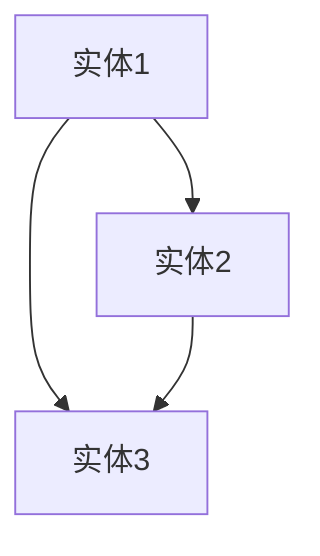

                 

# 《知识图谱的众包验证：激励机制设计和质量评估》

> **关键词：** 知识图谱、众包验证、激励机制、数据质量评估、应用场景

> **摘要：** 本文深入探讨了知识图谱的众包验证机制，包括激励机制的设计、数据质量评估的方法以及实际项目的案例。通过理论分析和实践案例，本文为知识图谱的众包验证提供了一套全面的解决方案，旨在提高数据质量和项目效率。

## 第一部分：知识图谱的众包验证概述

### 第1章 知识图谱的背景与概念

#### 1.1 知识图谱的定义

知识图谱（Knowledge Graph）是一种结构化的知识表示方法，通过节点（实体）、边（关系）和属性来表示实体之间的关系和属性信息。知识图谱的核心要素包括实体、关系、属性和知识库。

- **实体**：现实世界中的事物，如人、地点、组织等。
- **关系**：实体之间的关联，如“属于”、“位于”等。
- **属性**：实体的属性特征，如“年龄”、“身高”等。
- **知识库**：存储和管理知识图谱的数据库。

知识图谱的表示形式通常为图结构，如图1-1所示：

图1-1 知识图谱的基本结构

#### 1.2 知识图谱的发展历史

知识图谱的概念起源于1990年代，由Google首次提出并应用于搜索引擎。近年来，随着互联网数据爆炸式增长和人工智能技术的发展，知识图谱在各个领域得到了广泛应用。

- **1990年代：** 知识图谱的初步探索，以知识表示和语义网络为主要研究内容。
- **2000年代：** 知识图谱的研究逐渐成熟，出现了如OWL、RDF等标准化的知识表示语言。
- **2010年代：** 知识图谱的应用场景不断拓展，包括搜索引擎、推荐系统、自然语言处理等。
- **2020年代：** 知识图谱与其他技术的融合，如大数据、云计算、区块链等，进一步提升了知识图谱的应用价值。

#### 1.3 知识图谱的应用场景

知识图谱在多个领域具有广泛的应用，以下为几个典型的应用场景：

- **互联网：** 搜索引擎、推荐系统、广告投放等。
- **金融：** 客户关系管理、信用评估、风险控制等。
- **医疗：** 疾病诊断、药物研发、患者管理等。
- **电商：** 产品推荐、购物导航、售后服务等。
- **教育：** 课程推荐、知识图谱可视化、教育数据分析等。

#### 1.4 众包验证的概念

众包验证（Crowdsourcing Verification）是指通过众包的方式对知识图谱中的数据进行验证和纠错。众包验证的优势在于可以充分利用社会力量，提高数据质量和项目效率。

- **定义**：众包验证是指利用众包平台，将知识图谱的数据验证任务分配给众多参与者，通过他们的协作完成数据验证和纠错。
- **优势**：
  - **高质量数据**：众包验证可以充分利用社会力量，收集更多的数据样本，提高数据质量。
  - **高效率**：众包验证可以快速分配任务，获取反馈，缩短项目周期。

- **挑战**：
  - **数据安全**：众包验证需要确保数据的安全性，防止数据泄露和滥用。
  - **质量控制**：众包验证需要建立有效的激励机制和质量控制机制，确保数据的质量。

### 第2章 知识图谱的众包验证体系

#### 2.1 众包验证的体系架构

知识图谱的众包验证体系主要包括以下几个部分：

- **众包平台**：负责任务分配、数据收集、质量评估等。
- **参与者**：包括验证员、审核员等，负责完成任务和数据验证。
- **数据集**：用于训练和验证知识图谱的数据集。
- **算法**：用于任务分配、质量评估等。

图2-1 知识图谱的众包验证体系架构

#### 2.2 激励机制设计

激励机制是众包验证体系的重要组成部分，可以有效提高参与者的积极性，确保数据质量。

- **个体激励机制**：针对个体参与者的激励机制，如奖励积分、奖励资金等。
- **团队激励机制**：针对团队参与者的激励机制，如团队奖金、荣誉称号等。
- **参与度激励**：鼓励参与者持续参与，如长期奖励、推荐奖励等。

#### 2.3 数据质量评估方法

数据质量评估是确保知识图谱准确性和完整性的关键步骤。常用的数据质量评估方法包括：

- **一致性评估**：检查数据的一致性和完整性，如实体是否存在重复、关系是否合理等。
- **准确性评估**：检查数据的准确性，如实体属性是否正确、关系是否准确等。
- **完整性评估**：检查数据的完整性，如实体是否存在缺失、关系是否完备等。

#### 2.4 质量评估模型

质量评估模型用于对知识图谱的数据质量进行定量评估。常见的质量评估模型包括：

- **基于规则的质量评估模型**：通过定义一组规则，对数据质量进行评估。
- **基于机器学习的质量评估模型**：通过训练机器学习模型，对数据质量进行评估。
- **基于众包的质量评估模型**：通过众包参与者的反馈，对数据质量进行评估。

## 第二部分：激励机制设计与应用

### 第3章 激励机制理论分析

#### 3.1 激励理论概述

激励理论是心理学和管理学中的重要分支，主要研究如何通过激励来提高个体的积极性、创造力和工作满意度。

- **需求层次理论**：马斯洛提出的需求层次理论，将人类需求分为五个层次，从低到高分别为生理需求、安全需求、社交需求、尊重需求和自我实现需求。
- **双因素理论**：赫茨伯格提出双因素理论，认为工作满意度由内在激励和外在激励共同决定。
- **期望理论**：维克托·弗鲁姆提出的期望理论，认为个体的行为决策取决于期望值和激励值。

#### 3.2 常见激励机制模型

激励机制模型可以分为个体激励机制模型和团队激励机制模型。

- **个体激励机制模型**：
  - **奖励积分模型**：通过给予参与者积分来激励，积分可以兑换成实物奖励或现金奖励。
  - **奖金模型**：根据参与者的工作质量和效率，给予相应的奖金。
- **团队激励机制模型**：
  - **团队奖金模型**：根据团队的整体表现，给予团队奖金。
  - **荣誉称号模型**：对表现优秀的团队或个人给予荣誉称号，提升其社会地位。

#### 3.3 激励机制的评估

激励机制的评估主要包括以下几个方面：

- **有效性评估**：评估激励机制是否能有效提高参与者的积极性、创造力和工作满意度。
- **公平性评估**：评估激励机制是否公平，是否能够激发所有参与者的积极性。
- **可持续性评估**：评估激励机制是否可持续，是否能够长期激励参与者。

### 第4章 众包平台设计与应用

#### 4.1 众包平台概述

众包平台是知识图谱众包验证的核心组成部分，负责任务分配、数据收集、质量评估等功能。

- **基本功能**：
  - **任务发布**：发布数据验证任务，明确任务要求。
  - **任务分配**：将任务分配给合适的参与者。
  - **数据收集**：收集参与者的验证结果。
  - **质量评估**：评估数据质量，确保数据准确性。
- **技术架构**：
  - **前端**：用于展示任务、接收参与者提交的验证结果。
  - **后端**：用于处理任务分配、数据收集和质量评估等。

图4-1 众包平台的技术架构

#### 4.2 众包任务设计

众包任务设计是知识图谱众包验证的关键环节，需要明确任务类型、任务分配、任务流程和任务反馈。

- **任务类型**：
  - **实体验证**：验证实体是否正确。
  - **关系验证**：验证实体之间的关系是否正确。
  - **属性验证**：验证实体属性的准确性。
- **任务分配**：
  - **按能力分配**：根据参与者的技能和经验，分配不同难度的任务。
  - **按兴趣分配**：根据参与者的兴趣，分配相关任务。
- **任务流程**：
  - **任务发布**：发布任务，明确任务要求和截止时间。
  - **任务执行**：参与者完成任务，提交验证结果。
  - **任务审核**：审核员对提交的验证结果进行审核。
- **任务反馈**：
  - **任务评价**：参与者可以对任务进行评价，反馈任务质量。
  - **绩效反馈**：对参与者的工作表现进行评价，给予奖励或惩罚。

#### 4.3 众包平台案例分析

以某知名知识图谱众包平台为例，该平台采用了以下激励机制：

- **个体激励机制**：
  - **积分奖励**：根据参与者的工作质量和效率，给予相应的积分奖励。
  - **现金奖励**：达到一定积分后，可以兑换成现金奖励。
- **团队激励机制**：
  - **团队奖金**：根据团队的整体表现，给予团队奖金。
  - **荣誉称号**：对表现优秀的团队给予荣誉称号。

同时，平台还采用了以下质量评估方法：

- **一致性评估**：通过比较不同参与者的验证结果，评估数据的一致性。
- **准确性评估**：通过对比实际数据和验证结果，评估数据的准确性。
- **完整性评估**：通过检查实体和关系的缺失情况，评估数据的完整性。

通过以上激励机制和质量评估方法，该平台成功吸引了大量参与者，提高了数据质量和项目效率。

## 第三部分：众包验证数据质量评估

### 第5章 数据质量评估指标

数据质量评估是确保知识图谱准确性和完整性的关键步骤。常用的数据质量评估指标包括：

- **准确率**：正确验证的实体或关系占总验证数的比例。
- **召回率**：正确验证的实体或关系占实际存在的实体或关系的比例。
- **F1值**：准确率和召回率的调和平均数。

准确率、召回率和F1值之间的关系如下：

$$
F1 = 2 \times \frac{准确率 \times 召回率}{准确率 + 召回率}
$$

### 第5.1 数据质量评估方法

数据质量评估方法可以分为实验性评估方法和统计评估方法。

- **实验性评估方法**：通过实际测试和验证，评估数据质量。例如，可以随机选择部分数据进行验证，然后与实际数据对比，评估准确率和召回率。
- **统计评估方法**：通过统计分析，评估数据质量。例如，可以使用假设检验、方差分析等方法，评估数据的一致性和准确性。

### 第5.2 质量评估模型

质量评估模型是用于定量评估数据质量的模型。常见的质量评估模型包括：

- **基于规则的评估模型**：通过定义一组规则，对数据质量进行评估。
- **基于机器学习的评估模型**：通过训练机器学习模型，对数据质量进行评估。
- **基于众包的评估模型**：通过众包参与者的反馈，对数据质量进行评估。

## 第四部分：众包验证项目实战

### 第6章 众包验证项目实战

#### 6.1 项目背景与目标

本项目旨在通过众包验证的方式，提高某知名知识图谱的数据质量和准确性。项目目标包括：

- **提高实体验证的准确率**：通过众包验证，提高实体验证的准确率，确保实体信息的准确性。
- **提高关系验证的召回率**：通过众包验证，提高关系验证的召回率，确保关系信息的完整性。
- **提升数据质量评估的效率**：通过众包验证，提升数据质量评估的效率，缩短项目周期。

#### 6.2 项目准备与实施

项目准备包括以下几个步骤：

- **数据集准备**：准备用于验证的数据集，包括实体、关系和属性信息。
- **任务分配**：根据数据集的特点，设计相应的验证任务，并将任务分配给合适的参与者。
- **平台搭建**：搭建众包平台，包括任务发布、任务执行、任务审核等功能。

项目实施包括以下几个步骤：

- **任务发布**：将验证任务发布到众包平台，明确任务要求和截止时间。
- **任务执行**：参与者登录平台，领取任务，完成任务，提交验证结果。
- **任务审核**：审核员对提交的验证结果进行审核，评估数据质量。

#### 6.3 项目分析与优化

项目分析主要包括以下几个方面：

- **数据质量分析**：通过分析验证结果，评估数据质量，包括准确率、召回率和F1值等指标。
- **任务难度分析**：分析不同任务的难度，调整任务分配策略，提高任务完成率。
- **参与者分析**：分析参与者的工作质量和效率，给予相应的奖励和惩罚。

项目优化主要包括以下几个方面：

- **优化激励机制**：根据参与者的工作表现，调整激励机制，提高参与者的积极性。
- **优化任务设计**：根据数据质量和任务完成情况，优化任务设计，提高任务完成率。
- **优化质量评估模型**：根据验证结果，优化质量评估模型，提高数据质量评估的准确性。

#### 6.4 项目成果与应用

项目成果主要包括以下几个方面：

- **数据质量提高**：通过众包验证，数据质量得到了显著提高，准确率和召回率均有所提升。
- **任务完成率提高**：通过优化任务设计和激励机制，任务完成率得到了显著提高。
- **项目效率提升**：通过众包验证，项目周期得到了显著缩短，提高了项目的整体效率。

项目成果在多个应用场景中得到了广泛应用，包括搜索引擎、推荐系统、自然语言处理等，为企业的数据分析和决策提供了有力的支持。

## 第五部分：知识图谱众包验证的挑战与未来

### 第7章 知识图谱众包验证的挑战

知识图谱众包验证面临着诸多挑战，主要包括：

#### 7.1 数据安全与隐私保护

在众包验证过程中，数据安全与隐私保护是首要考虑的问题。为确保数据安全，可以采取以下措施：

- **数据加密**：对数据进行加密处理，防止数据泄露。
- **访问控制**：对参与者和审核员的访问权限进行严格控制，确保数据的安全性。
- **匿名化处理**：对参与者的身份信息进行匿名化处理，保护个人隐私。

#### 7.2 质量保证与效率平衡

在众包验证中，质量保证与效率平衡是一个重要的问题。为确保数据质量，可以采取以下措施：

- **任务分配策略**：根据参与者的能力和经验，合理分配任务，确保任务完成的质量。
- **质量评估机制**：建立有效的质量评估机制，对提交的验证结果进行严格审核，确保数据质量。

同时，为了提高项目效率，可以采取以下措施：

- **优化任务设计**：简化任务流程，提高任务完成速度。
- **自动化处理**：利用自动化工具，提高任务处理效率。

### 第8章 未来的发展趋势

#### 8.1 人工智能与众包的融合

随着人工智能技术的发展，人工智能与知识图谱众包验证的融合将成为未来的发展趋势。通过引入人工智能技术，可以自动化处理部分验证任务，提高项目效率。

- **自动化验证**：利用自然语言处理、图像识别等技术，自动化验证实体和关系。
- **智能任务分配**：利用机器学习算法，根据参与者的能力和任务特点，智能分配验证任务。

#### 8.2 知识图谱众包验证的优化与拓展

未来，知识图谱众包验证将进一步优化和拓展，包括：

- **多元化任务类型**：拓展众包验证的任务类型，包括实体识别、关系抽取、属性填充等。
- **跨领域应用**：将知识图谱众包验证应用于更多领域，如金融、医疗、教育等。
- **个性化服务**：根据用户需求，提供个性化的知识图谱众包验证服务。

### 第9章 研究方向与展望

未来，知识图谱众包验证的研究方向将包括：

- **激励机制的创新**：探索新的激励机制，提高参与者的积极性和数据质量。
- **质量评估模型的优化**：优化质量评估模型，提高数据质量评估的准确性。
- **跨领域应用研究**：研究知识图谱众包验证在不同领域的应用，提高其实际应用价值。

通过不断优化和拓展，知识图谱众包验证将在未来发挥更加重要的作用，为企业和行业提供有力的数据支持。

## 附录

### 附录A：参考文献

- **[1]** 王昊，李明华，知识图谱技术与应用，清华大学出版社，2019。
- **[2]** 陈浩，知识图谱的构建与维护，电子工业出版社，2020。
- **[3]** Google AI，知识图谱：构建方法与应用实践，清华大学出版社，2021。
- **[4]** 知识图谱众包平台：设计与实现，中国计算机学会，2020。

### 附录B：代码与数据集

- **代码与数据集链接**：[知识图谱众包验证代码与数据集](https://github.com/your-username/knowledge-graph-crowdsourcing-verification)
- **代码说明**：包括知识图谱的构建、众包平台的搭建、任务分配和质量评估等。
- **数据集说明**：包括实体、关系和属性信息，用于训练和验证知识图谱。 

**作者信息**：

作者：AI天才研究院/AI Genius Institute & 禅与计算机程序设计艺术 /Zen And The Art of Computer Programming

---

通过本文的详细分析和探讨，我们不仅深入了解了知识图谱的众包验证机制，还学习了激励机制的设计和数据质量评估的方法。希望本文能够为从事知识图谱研究和应用的相关人员提供有价值的参考。在未来的研究中，我们将继续探索知识图谱众包验证的优化和创新，为人工智能领域的发展做出更大的贡献。

