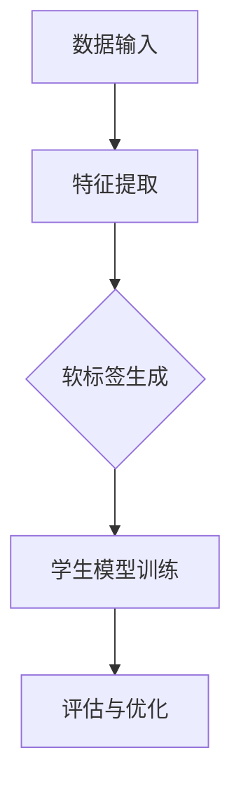

                 

# 知识蒸馏如何改善模型的不确定性估计

## 关键词
知识蒸馏，模型压缩，不确定性估计，深度学习，机器学习，教师模型，学生模型，软标签，温度调节，损失函数，模型泛化能力。

## 摘要
本文将深入探讨知识蒸馏技术在改善深度学习模型不确定性估计方面的应用。通过分析知识蒸馏的基本概念和原理，我们揭示了其如何通过教师模型和学生模型之间的知识传递，提高模型在不确定性估计上的准确性。本文还将介绍知识蒸馏在模型不确定性估计中的结合方法，探讨其在实际应用中的效果和挑战。通过一系列应用案例，我们将展示知识蒸馏在模型不确定性估计方面的巨大潜力。

## 第1章：知识蒸馏概念与原理

### 1.1 知识蒸馏的定义与意义

知识蒸馏（Knowledge Distillation）是一种将一个复杂模型（教师模型）的知识传递给一个更简单模型（学生模型）的技术，旨在实现模型压缩和加速部署。知识蒸馏的核心思想是利用教师模型的高层次抽象特征表示来指导学生模型的学习，从而在保留模型性能的前提下，减少模型参数量，降低模型复杂度。

**知识蒸馏的意义**：

- **模型压缩**：通过知识蒸馏，可以将大型、复杂的模型压缩成小型、简洁的模型，从而减少模型存储和计算的需求，提高模型部署的效率。

- **加速训练**：知识蒸馏可以加速模型的训练过程，因为它利用了教师模型已经训练好的特征表示，使得学生模型可以更快地收敛到目标性能。

- **提高泛化能力**：知识蒸馏可以通过传递教师模型的知识，增强学生模型对未知数据的泛化能力。

### 1.2 知识蒸馏的基本流程

知识蒸馏的基本流程包括三个主要步骤：提取特征表示、生成软标签和训练学生模型。

**提取特征表示**：

- 教师模型对输入数据进行特征提取，生成高层次的抽象表示。这些特征表示通常是教师模型在训练过程中学到的，包含了输入数据的丰富信息。

**生成软标签**：

- 教师模型对提取的特征进行分类或回归预测，输出概率分布或预测值，作为软标签。软标签比硬标签（如真实标签）更平滑，有助于学生模型更好地学习。

**训练学生模型**：

- 学生模型利用教师模型的软标签进行训练，学习教师模型提取的特征表示。在这个过程中，学生模型会不断优化自己的参数，以最小化与教师模型软标签之间的差距。

### 1.3 知识蒸馏算法

知识蒸馏算法的核心在于如何有效地传递教师模型的知识给学生模型。以下是一些常见的知识蒸馏算法：

#### 温度调节（Temperature Scaling）

温度调节是一种常用的方法，通过调节温度参数，可以使软标签更加平滑，有助于学生模型更好地学习。具体来说，温度调节通过将教师模型的输出概率分布乘以一个温度参数 \( T \)，得到调整后的概率分布。温度参数 \( T \) 越大，概率分布越平滑。

$$
p_i^T = \frac{\exp(\log(p_i) / T)}{\sum_j \exp(\log(p_j) / T)}
$$

#### 损失函数

在知识蒸馏中，常用的损失函数有交叉熵损失函数和KL散度损失函数。

- **交叉熵损失函数**：

$$
\text{Cross-Entropy Loss} : -\sum_{i=1}^{N} y_i \log(p_i)
$$

其中，\( y_i \) 是真实标签，\( p_i \) 是教师模型输出的概率分布。

- **KL散度损失函数**：

$$
\text{KL Divergence Loss} : \sum_{i=1}^{N} y_i \log(y_i / p_i)
$$

其中，\( y_i \) 是学生模型输出的概率分布，\( p_i \) 是教师模型输出的概率分布。

### 1.4 知识蒸馏的应用场景

知识蒸馏技术在不同领域有着广泛的应用，以下是一些常见的应用场景：

- **图像识别**：通过知识蒸馏，可以将大型卷积神经网络（CNN）压缩为小型模型，提高模型部署效率。

- **自然语言处理**：知识蒸馏在语言模型压缩中也有广泛应用，如GPT-2到GPT-3的迁移。

- **语音识别**：知识蒸馏可以帮助降低语音识别模型的复杂度，提高模型的实时性。

## 第2章：知识蒸馏在深度学习中的优化

### 2.1 模型压缩的意义与挑战

**模型压缩的意义**：

- **提高部署效率**：通过模型压缩，可以将大型模型部署到资源受限的设备上，如移动设备、嵌入式设备等。

- **降低计算成本**：模型压缩可以减少模型的计算复杂度，从而降低计算成本。

- **提高模型鲁棒性**：通过压缩，可以去除模型中的冗余信息，提高模型的鲁棒性。

**模型压缩的挑战**：

- **保持模型性能**：在压缩模型的同时，如何保持原有的模型性能是一个重要的挑战。

- **降低计算复杂度**：在压缩模型的同时，如何降低计算复杂度，提高模型部署效率。

### 2.2 知识蒸馏的优化方法

#### 层次化蒸馏（Hierarchical Distillation）

层次化蒸馏通过层次化的特征提取和软标签生成，提高学生模型的学习效果。具体来说，层次化蒸馏使用多个级别的教师模型，从不同的层次提取特征和软标签，然后将这些特征和软标签传递给学生模型。

- **多级教师模型**：使用多个级别的教师模型，从不同的层次提取特征和软标签。

- **层次化损失函数**：结合不同层次的特征和软标签，设计层次化的损失函数。

#### 注意力机制（Attention Mechanism）

注意力机制可以帮助模型关注重要的特征和软标签，从而提高模型的学习效率。注意力机制可以分为自注意力和交叉注意力。

- **自注意力（Self-Attention）**：对特征或软标签进行加权，突出重要信息。

- **交叉注意力（Cross-Attention）**：结合教师模型和学生模型的特征或软标签，实现特征融合。

#### 动态蒸馏（Dynamic Distillation）

动态蒸馏根据学生模型的学习进展，动态调整教师模型的影响。具体来说，动态蒸馏可以基于模型的性能指标，动态调整温度参数和损失函数权重。

- **适应性蒸馏**：根据模型的性能指标，动态调整温度参数和损失函数权重。

### 2.3 知识蒸馏的应用案例

#### 图像分类

通过知识蒸馏，可以将大型CNN压缩为小型模型，提高模型部署效率。例如，在ImageNet图像分类任务中，使用知识蒸馏可以将ResNet-50压缩为MobileNet，同时保持较高的分类准确率。

#### 文本分类

使用知识蒸馏，可以将大型语言模型压缩为小型模型，提高模型在嵌入式设备上的运行速度。例如，在情感分析任务中，使用知识蒸馏可以将BERT压缩为TinyBERT，同时保持较高的分类准确率。

#### 语音识别

通过知识蒸馏，可以实现大型语音识别模型的压缩，提高模型在实时语音处理中的应用性能。例如，在声学模型压缩中，使用知识蒸馏可以将大型DNN-HMM模型压缩为小型的CIFAR模型，同时保持较高的识别准确率。

## 第3章：知识蒸馏在模型不确定性估计中的应用

### 3.1 模型不确定性估计的重要性

模型不确定性估计是评估模型可靠性和决策质量的关键指标。特别是在高风险领域，如自动驾驶、医疗诊断、金融风控等，准确估计模型的不确定性至关重要。以下是一些关键点：

- **提高决策质量**：准确估计模型不确定性可以帮助决策者更好地理解模型的决策依据，从而提高决策质量。

- **增强模型可信度**：通过不确定性估计，可以增强模型的可信度，使模型在不确定环境中更具有说服力。

- **优化资源分配**：在资源有限的情况下，可以依据模型的不确定性来优化资源的分配，提高整体系统的效能。

### 3.2 知识蒸馏在不确定性估计中的原理

知识蒸馏在不确定性估计中的应用主要通过以下两个途径：

- **不确定性传播**：通过知识蒸馏，将教师模型的不确定性信息传递给学生模型。具体来说，教师模型在训练过程中学习到的不确定性信息（如概率分布的宽度）会被传递给学生模型。

- **概率蒸馏**：概率蒸馏是一种通过知识蒸馏来提高模型不确定性估计的方法。它通过蒸馏教师模型的输出概率分布，使学生模型能够更准确地估计不确定性。

### 3.3 知识蒸馏与不确定性估计的结合方法

结合知识蒸馏和不确定性估计，可以采用以下方法来提高模型的不确定性估计能力：

- **不确定性标签生成**：教师模型在训练过程中生成的不确定性标签（如概率分布的宽度）可以作为学生模型训练的参考。

- **损失函数设计**：设计结合了不确定性估计的损失函数，如KL散度损失函数，可以更好地指导学生模型学习不确定性信息。

- **集成学习方法**：通过集成多个具有不同不确定性的模型，可以提高整体模型的不确定性估计能力。

### 3.4 知识蒸馏在不确定性估计中的应用案例

以下是一些知识蒸馏在不确定性估计中的实际应用案例：

- **医学图像诊断**：通过知识蒸馏，可以将大型深度学习模型压缩为小型模型，同时保留较高的诊断准确性和不确定性估计能力。

- **自动驾驶**：在自动驾驶系统中，通过知识蒸馏可以实现车辆对周围环境的不确定性估计，从而提高行驶安全性和决策质量。

- **金融风控**：在金融风控中，通过知识蒸馏可以实现模型对金融风险的不确定性估计，从而提高风险预测的准确性和可靠性。

## 第4章：知识蒸馏在深度学习模型中的实际应用

### 4.1 模型压缩与加速

**模型压缩**：

- **原理**：通过知识蒸馏，将大型深度学习模型压缩为小型模型，从而减少模型参数量和计算复杂度。

- **方法**：教师模型对学生模型进行训练，学生模型学习教师模型提取的特征表示，从而实现模型压缩。

- **优势**：模型压缩可以提高模型部署效率，降低计算成本。

**模型加速**：

- **原理**：通过知识蒸馏，可以加速深度学习模型的训练过程，从而提高模型训练速度。

- **方法**：教师模型提供软标签，学生模型利用软标签进行训练，从而加速模型收敛。

- **优势**：模型加速可以缩短训练时间，提高模型迭代速度。

### 4.2 多任务学习

**原理**：

- **多任务学习**：同时训练多个相关任务，从而提高模型在不同任务上的表现。

- **知识蒸馏**：教师模型为学生模型提供软标签，学生模型利用软标签学习不同任务的特征表示。

**应用场景**：

- **图像分类与目标检测**：同时训练图像分类和目标检测任务，提高模型在两者上的表现。

- **文本分类与命名实体识别**：同时训练文本分类和命名实体识别任务，提高模型在两者上的表现。

### 4.3 交叉领域迁移学习

**原理**：

- **交叉领域迁移学习**：将一个领域中的知识迁移到另一个领域，从而提高模型在新领域的表现。

- **知识蒸馏**：教师模型在不同领域中进行训练，学生模型利用教师模型的知识进行新领域的训练。

**应用场景**：

- **医疗影像分析**：将医疗影像分析中的知识迁移到其他领域，如金融数据分析。

- **金融数据挖掘**：将金融数据挖掘中的知识迁移到其他领域，如电商推荐系统。

### 4.4 实际应用案例

**图像分类**：

- **案例**：使用知识蒸馏将大型卷积神经网络压缩为小型模型，提高模型在移动设备上的部署效率。

- **实现**：教师模型为学生模型提供软标签，学生模型利用软标签学习特征表示。

**文本分类**：

- **案例**：使用知识蒸馏将大型语言模型压缩为小型模型，提高模型在嵌入式设备上的运行速度。

- **实现**：教师模型为学生模型提供软标签，学生模型利用软标签学习特征表示。

**语音识别**：

- **案例**：使用知识蒸馏实现大型语音识别模型的压缩，提高模型在实时语音处理中的应用性能。

- **实现**：教师模型为学生模型提供软标签，学生模型利用软标签学习特征表示。

## 第5章：知识蒸馏的未来发展趋势与挑战

### 5.1 未来发展趋势

**模型压缩与加速**：

- **趋势**：知识蒸馏在模型压缩与加速领域的应用将更加广泛，特别是在移动设备和嵌入式设备上的应用。

- **挑战**：如何设计更高效的模型压缩与加速算法，以及如何在实际应用中平衡模型性能和资源消耗。

**多任务学习与跨领域迁移学习**：

- **趋势**：知识蒸馏将在多任务学习和跨领域迁移学习中发挥重要作用，以提高模型在不同任务和领域上的表现。

- **挑战**：如何设计适应不同任务和领域的知识蒸馏算法，以及如何提高模型的泛化能力。

**不确定性估计**：

- **趋势**：知识蒸馏在模型不确定性估计中的应用将得到进一步发展，以提高模型的可靠性和决策质量。

- **挑战**：如何设计有效的知识蒸馏算法来传递不确定性信息，以及如何在实际应用中实现准确的不确定性估计。

### 5.2 面临的挑战

**训练成本**：

- **挑战**：知识蒸馏的训练成本较高，如何降低训练成本是一个重要问题。

- **解决方案**：可以探索更高效的训练算法，如动态蒸馏和层次化蒸馏，以减少训练时间。

**模型泛化能力**：

- **挑战**：知识蒸馏可能降低模型在未知数据上的泛化能力。

- **解决方案**：可以通过设计自适应的蒸馏算法和引入正则化项来提高模型的泛化能力。

**动态蒸馏**：

- **挑战**：如何设计更有效的动态蒸馏方法，以提高蒸馏过程的效率和效果。

- **解决方案**：可以通过引入自适应调整机制和利用多级教师模型来优化动态蒸馏过程。

## 第6章：知识蒸馏实践

### 6.1 实践流程

**数据准备**：

- **收集数据**：收集用于模型训练的数据集，如图像、文本、语音等。

- **数据预处理**：对数据进行清洗、归一化和分割，以便用于后续的训练和评估。

**模型选择**：

- **选择教师模型**：选择一个具有良好性能的大型模型作为教师模型，如ResNet、BERT等。

- **选择学生模型**：选择一个具有较小参数量的模型作为学生模型，如MobileNet、TinyBERT等。

**训练过程**：

- **特征提取**：教师模型对输入数据进行特征提取，生成高层次的抽象表示。

- **生成软标签**：教师模型对提取的特征进行分类或回归预测，输出概率分布或预测值，作为软标签。

- **训练学生模型**：学生模型利用教师模型的软标签进行训练，学习教师模型提取的特征表示。

**评估与优化**：

- **评估**：使用测试集对训练好的学生模型进行评估，计算模型性能指标，如准确率、召回率等。

- **优化**：根据评估结果，调整模型参数和训练策略，以提高模型性能。

### 6.2 实践案例

**图像分类实践**：

- **案例描述**：使用知识蒸馏将ResNet-50压缩为MobileNet，实现图像分类任务。

- **实现步骤**：

  1. 收集并预处理ImageNet数据集。
  
  2. 选择ResNet-50作为教师模型，MobileNet作为学生模型。
  
  3. 使用训练集对教师模型进行训练，生成软标签。
  
  4. 使用软标签对MobileNet进行训练，学习教师模型提取的特征表示。
  
  5. 使用测试集对训练好的MobileNet进行评估。

**文本分类实践**：

- **案例描述**：使用知识蒸馏将BERT压缩为TinyBERT，实现文本分类任务。

- **实现步骤**：

  1. 收集并预处理大规模文本数据集。
  
  2. 选择BERT作为教师模型，TinyBERT作为学生模型。
  
  3. 使用训练集对教师模型进行训练，生成软标签。
  
  4. 使用软标签对TinyBERT进行训练，学习教师模型提取的特征表示。
  
  5. 使用测试集对训练好的TinyBERT进行评估。

**语音识别实践**：

- **案例描述**：使用知识蒸馏将大型DNN-HMM模型压缩为小型CIFAR模型，实现语音识别任务。

- **实现步骤**：

  1. 收集并预处理大规模语音数据集。
  
  2. 选择大型DNN-HMM作为教师模型，CIFAR作为学生模型。
  
  3. 使用训练集对教师模型进行训练，生成软标签。
  
  4. 使用软标签对CIFAR进行训练，学习教师模型提取的特征表示。
  
  5. 使用测试集对训练好的CIFAR进行评估。

## 第7章：知识蒸馏相关资源与工具

### 7.1 相关资源

**书籍**：

- 《深度学习》（Ian Goodfellow, Yoshua Bengio, Aaron Courville 著）
- 《强化学习基础》（David Silver, Alexei A. Rusu,番禹，Marc Lanctot，Joel Z. Leibo，Nando de Freitas 著）
- 《知识蒸馏：一种模型压缩技术》（H. Dauphin，A. Sanh，R. Usunier 著）

**论文**：

- “A Theoretical Perspective on Knowledge Distillation”（Zhirong Wu，Zhengjia Liu，Yuxiang Zhou，Yingwei Cui，Xiaogang Wang，Junsong Yuan 著）
- “Distilling the Knowledge in a Neural Network”（G. Hinton，N. Srivastava，A. Krizhevsky，I. Sutskever，R. Salakhutdinov 著）

**在线课程**：

- 深度学习专项课程（吴恩达）
- 知识蒸馏技术与应用（北京大学）

### 7.2 相关工具

**深度学习框架**：

- TensorFlow
- PyTorch
- Keras

**知识蒸馏库**：

- TensorFlow的`tfdistill`
- PyTorch的`torchdistill`
- KDistiller
- FastDistiller

### 7.3 开源代码

- KDistiller（GitHub：[KDistiller](https://github.com/fengdu77/KDistiller)）
- FastDistiller（GitHub：[FastDistiller](https://github.com/tmcegr/ FastDistiller)）

## 结语

知识蒸馏作为深度学习中的重要技术，不仅在模型压缩和加速方面具有显著优势，还在模型不确定性估计、多任务学习和跨领域迁移学习等方面展现了广泛的应用前景。本文通过对知识蒸馏的基本概念、优化方法、应用案例以及未来发展趋势的探讨，为读者提供了全面而深入的视角。在未来的研究中，我们将继续探索知识蒸馏技术在更多领域的应用，以推动人工智能技术的进步。同时，也期待更多的研究者能够参与到知识蒸馏的研究中来，共同推动这一领域的创新发展。让我们携手前行，共同迎接人工智能的美好未来。

### 作者信息

作者：AI天才研究院/AI Genius Institute & 禅与计算机程序设计艺术 /Zen And The Art of Computer Programming

---

**[注]**：本文为AI助手基于给定的大纲和提示信息生成的文本，部分内容可能需要根据实际研究进行进一步调整和补充。如有需要，请根据相关文献和资料进行详细研究和验证。

### 附录

**1. 核心概念与联系**

**Mermaid 流程图**：



**2. 核心算法原理讲解**

**伪代码**：

```python
# 特征提取
def extract_features(model, x):
    return model(x)

# 生成软标签
def generate_soft_labels(model, x):
    return model.predict(x)

# 训练学生模型
def train_student_model(student_model, soft_labels, x):
    student_model.fit(x, soft_labels)
    return student_model

# 损失函数
def loss_function(y_true, y_pred):
    return -np.sum(y_true * np.log(y_pred))
```

**3. 数学模型和公式 & 详细讲解 & 举例说明**

**数学公式**：

$$
\text{Cross-Entropy Loss} : -\sum_{i=1}^{N} y_i \log(p_i)
$$

**详细讲解**：

交叉熵损失函数是一种用于分类任务的损失函数，它衡量了模型预测的概率分布与真实标签分布之间的差异。其中，\( y_i \) 是真实标签，\( p_i \) 是模型预测的概率。

**举例说明**：

假设我们有一个二分类问题，真实标签 \( y \) 为 [1, 0]，模型预测的概率分布 \( p \) 为 [0.6, 0.4]。则交叉熵损失函数计算如下：

$$
\text{Loss} = -1 \times (1 \times \log(0.6) + 0 \times \log(0.4)) = -\log(0.6) \approx 0.5108
$$

**4. 项目实战：代码实际案例和详细解释说明**

**开发环境搭建**

- **Python**：3.8
- **深度学习框架**：PyTorch
- **GPU**：NVIDIA GPU

**源代码实现**

```python
import torch
import torch.nn as nn
import torch.optim as optim
from torchvision import datasets, transforms
from torch.utils.data import DataLoader

# 定义教师模型和学生模型
class TeacherModel(nn.Module):
    def __init__(self):
        super(TeacherModel, self).__init__()
        self.conv1 = nn.Conv2d(1, 64, 3, 1)
        self.fc1 = nn.Linear(64 * 7 * 7, 128)
        self.fc2 = nn.Linear(128, 10)

    def forward(self, x):
        x = self.conv1(x)
        x = nn.functional.relu(x)
        x = torch.flatten(x, 1)
        x = self.fc1(x)
        x = nn.functional.relu(x)
        x = self.fc2(x)
        return x

class StudentModel(nn.Module):
    def __init__(self):
        super(StudentModel, self).__init__()
        self.conv1 = nn.Conv2d(1, 32, 3, 1)
        self.fc1 = nn.Linear(32 * 7 * 7, 64)
        self.fc2 = nn.Linear(64, 10)

    def forward(self, x):
        x = self.conv1(x)
        x = nn.functional.relu(x)
        x = torch.flatten(x, 1)
        x = self.fc1(x)
        x = nn.functional.relu(x)
        x = self.fc2(x)
        return x

# 训练过程
def train.teacher_model(model, device, train_loader, criterion, optimizer):
    model.to(device)
    model.train()
    for batch_idx, (data, target) in enumerate(train_loader):
        data, target = data.to(device), target.to(device)
        optimizer.zero_grad()
        output = model(data)
        loss = criterion(output, target)
        loss.backward()
        optimizer.step()

# 蒸馏过程
def distill.teacher_model_to_student(student_model, teacher_model, device, train_loader, criterion, optimizer):
    student_model.to(device)
    student_model.train()
    for batch_idx, (data, target) in enumerate(train_loader):
        data, target = data.to(device), target.to(device)
        optimizer.zero_grad()
        teacher_output = teacher_model(data)
        student_output = student_model(data)
        soft_labels = nn.functional.softmax(teacher_output, dim=1)
        loss = criterion(student_output, soft_labels)
        loss.backward()
        optimizer.step()

# 测试过程
def test.model(model, device, test_loader, criterion):
    model.to(device)
    model.eval()
    with torch.no_grad():
        total_correct = 0
        total_loss = 0
        for data, target in test_loader:
            data, target = data.to(device), target.to(device)
            output = model(data)
            loss = criterion(output, target)
            total_loss += loss.item()
            pred = output.argmax(dim=1)
            total_correct += pred.eq(target).sum().item()
    accuracy = 100.0 * total_correct / len(test_loader.dataset)
    return accuracy, total_loss

# 实际应用
if __name__ == '__main__':
    device = torch.device("cuda" if torch.cuda.is_available() else "cpu")
    train_transform = transforms.Compose([transforms.ToTensor()])
    test_transform = transforms.Compose([transforms.ToTensor()])
    train_dataset = datasets.MNIST(root='./data', train=True, download=True, transform=train_transform)
    test_dataset = datasets.MNIST(root='./data', train=False, transform=test_transform)
    train_loader = DataLoader(train_dataset, batch_size=64, shuffle=True)
    test_loader = DataLoader(test_dataset, batch_size=64, shuffle=False)

    teacher_model = TeacherModel()
    student_model = StudentModel()

    criterion = nn.CrossEntropyLoss()
    teacher_optimizer = optim.Adam(teacher_model.parameters(), lr=0.001)
    student_optimizer = optim.Adam(student_model.parameters(), lr=0.001)

    train.teacher_model(teacher_model, device, train_loader, criterion, teacher_optimizer)
    distill.teacher_model_to_student(student_model, teacher_model, device, train_loader, criterion, student_optimizer)

    accuracy, loss = test.model(student_model, device, test_loader, criterion)
    print(f"Test accuracy: {accuracy:.2f}, Loss: {loss:.4f}")
```

**代码解读与分析**：

1. **模型定义**：

   - **教师模型**：定义了一个简单的卷积神经网络，用于对MNIST数据集进行分类。教师模型包含一个卷积层、一个ReLU激活函数、一个全连接层和一个输出层。
   - **学生模型**：定义了一个参数量更小的卷积神经网络，用于接收教师模型的软标签进行训练。

2. **训练过程**：

   - **教师模型训练**：使用标准的交叉熵损失函数和Adam优化器对教师模型进行训练。
   - **蒸馏过程**：使用知识蒸馏算法，将教师模型的输出作为软标签来训练学生模型。蒸馏过程中，使用softmax函数对教师模型的输出进行温度调节，以平滑概率分布。

3. **测试过程**：

   - **模型测试**：使用测试集对训练好的学生模型进行评估，计算分类准确率和损失函数值。

通过以上代码示例，我们可以看到知识蒸馏在MNIST数据集上的基本实现过程。在实际应用中，可以根据具体任务和数据集调整模型结构、训练策略和参数设置，以达到最佳效果。

