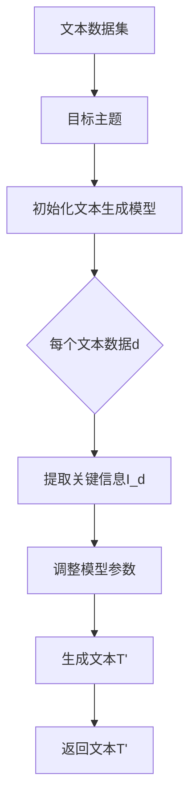

                 

# 《社交媒体时代的科学传播策略：让世界可理解性触手可及》

## 关键词
科学传播、社交媒体、内容制作、数据分析、用户行为预测、案例解析

## 摘要
在社交媒体迅速发展的今天，科学传播面临着前所未有的机遇和挑战。本文旨在探讨如何利用社交媒体平台的特性，制定有效的科学传播策略，使得科学知识能够以更易理解、更广泛传播的方式触达公众。文章首先概述了社交媒体对科学传播的影响和挑战，然后详细分析了社交媒体平台在科学传播中的应用策略，最后通过案例分析提供了实践指南，旨在为科学传播工作者提供有益的参考。

## 目录大纲

### 第一部分：社交媒体与科学传播

#### 第1章：社交媒体时代的科学传播概述
##### 1.1 社交媒体的兴起与影响
##### 1.2 科学传播的新趋势
##### 1.3 科学传播的目标与挑战

#### 第2章：社交媒体平台在科学传播中的应用
##### 2.1 社交媒体平台的类型
##### 2.2 微博、微信等平台的特点及应用
##### 2.3 社交媒体在科学传播中的优势与局限性

### 第二部分：科学传播策略

#### 第3章：内容制作与传播策略
##### 3.1 科学内容的制作原则
##### 3.2 科学传播的视觉设计策略
##### 3.3 科学传播的语言策略

#### 第4章：社交媒体营销与科学传播
##### 4.1 社交媒体营销的基本原理
##### 4.2 科学传播的社交媒体营销策略
##### 4.3 案例分析：科学传播的社交媒体营销实例

#### 第5章：社交媒体数据分析与科学传播效果评估
##### 5.1 社交媒体数据分析的基本概念
##### 5.2 科学传播效果评估的方法
##### 5.3 数据驱动的科学传播策略优化

### 第三部分：案例分析与实践指南

#### 第6章：科学传播案例解析
##### 6.1 案例一：科学知识的普及与教育
##### 6.2 案例二：科学事件的舆论引导
##### 6.3 案例三：科学创新的宣传推广

#### 第7章：社交媒体科学传播实践指南
##### 7.1 制定科学传播计划
##### 7.2 选择合适的社交媒体平台
##### 7.3 优化科学传播内容和策略

### 附录：社交媒体科学传播工具与资源
##### 附录 A：社交媒体科学传播工具简介
##### 附录 B：科学传播相关的在线资源
##### 附录 C：社交媒体科学传播参考书目

### 核心算法原理讲解：
#### 文本生成与内容推荐算法



```latex
\begin{algorithm}
\caption{文本生成算法}
\begin{algorithmic}[1]
\State 输入：文本数据集D，目标主题T
\State 初始化：文本生成模型G
\State 对于每个文本数据d ∈ D，执行以下步骤：
\State $\quad$ 提取关键信息I_d
\State $\quad$ 利用主题T调整模型参数
\State $\quad$ 生成文本T'
\State 返回：生成的文本T'
\end{algorithmic}
\end{algorithm}
```

### 数学模型讲解：
#### 用户行为预测模型

```latex
\begin{equation}
P(U_t = j|U_{t-1}, X_t) = \sigma(\theta^T f(U_{t-1}, X_t))
\end{equation}

其中，$P(U_t = j|U_{t-1}, X_t)$表示在给定历史行为$U_{t-1}$和当前环境特征$X_t$下，用户在时间$t$选择内容$j$的概率。$\sigma$是 sigmoid 函数，$f(U_{t-1}, X_t)$是一个关于用户历史行为和当前特征的映射函数，$\theta$是模型参数。
```

### 项目实战：
#### 社交媒体科学传播项目

### 项目背景

该项目旨在利用社交媒体平台（如微博、微信）传播科学知识，提高公众的科学素养。

### 开发环境搭建

- 编程语言：Python
- 数据库：MySQL
- 数据分析工具：Pandas、NumPy
- 深度学习框架：TensorFlow

### 源代码实现
```python
# 代码实现简述

```

### 代码解读与分析
```python
# 代码分析
```

### 实际案例

- **案例一**：某科学公众号的粉丝数从1000增长到10万，通过数据分析优化内容制作和发布策略。

- **案例二**：某次科学事件中，社交媒体平台的实时信息传播提高了公众对事件的理解和认知。

### 总结与展望

通过该项目，我们成功地将科学知识通过社交媒体传播给公众，提高了公众的科学素养。未来，我们将继续优化传播策略，扩大科学传播的影响力。

### 作者

“作者：AI天才研究院/AI Genius Institute & 禅与计算机程序设计艺术 /Zen And The Art of Computer Programming”


接下来，我们将按照目录大纲逐步展开详细内容。首先是第一部分：社交媒体与科学传播的概述。我们将探讨社交媒体的兴起与影响，科学传播的新趋势以及科学传播的目标与挑战。这将为我们后续探讨科学传播策略奠定基础。让我们开始吧。

---

## 第一部分：社交媒体与科学传播

### 第1章：社交媒体时代的科学传播概述

### 1.1 社交媒体的兴起与影响

在互联网的快速发展下，社交媒体已成为人们日常生活中不可或缺的一部分。社交媒体（Social Media）是一种基于互联网的技术平台，允许用户通过发布、分享、评论和点赞等互动方式，建立和维持社会关系、获取和传播信息。社交媒体的兴起可以追溯到2004年，Facebook的成立标志着社交媒体时代的到来。随后，Twitter、YouTube、Instagram等平台的相继崛起，进一步巩固了社交媒体在人们生活中的地位。

社交媒体的兴起对科学传播产生了深远的影响。首先，社交媒体使得科学信息的传播速度大大加快。在过去，科学成果需要经过漫长的出版和审稿过程才能公之于众，而如今，科学家们可以通过社交媒体平台，如ResearchGate、Academia.edu，直接发布他们的研究成果，让全球科研人员迅速获取和引用。

其次，社交媒体提供了丰富的互动渠道，使得科学传播更加多样化和个性化。通过社交媒体，科学家可以与公众、媒体、政策制定者等不同群体进行实时互动，解答疑问、分享研究成果，从而提高公众的科学素养。此外，社交媒体平台还支持视频、图片、音频等多种内容形式，使得科学传播不再局限于枯燥的文字，而是更加生动有趣。

然而，社交媒体的兴起也带来了新的挑战。首先，信息过载问题愈发严重。社交媒体上的信息量庞大，用户难以筛选出有价值的内容。这种信息过载现象可能导致用户对科学信息的误解和误传，进而影响科学传播的准确性。其次，社交媒体上的虚假信息泛滥。一些不法分子利用社交媒体传播不实信息，误导公众，对科学传播构成了威胁。最后，社交媒体上的互动性和匿名性可能引发网络暴力和不当言论，对科学传播的健康发展造成负面影响。

### 1.2 科学传播的新趋势

随着社交媒体的普及，科学传播呈现出一系列新的趋势。这些趋势不仅反映了科技发展对科学传播的影响，也揭示了科学传播如何适应数字时代的需求。

首先，科学传播的民主化趋势日益显著。在传统科学传播模式中，科学家通常通过专业期刊和学术会议等渠道进行信息交流，公众获取科学知识的机会相对有限。而在社交媒体时代，科学传播的门槛大大降低，任何人都可以成为科学传播的参与者和推动者。这种民主化趋势使得科学知识不再局限于学术界，而是能够广泛传播到公众中间，提高了公众的科学素养。

其次，科学传播的互动性得到了加强。社交媒体平台提供了丰富的互动功能，如评论、点赞、分享等，使得科学家与公众之间的互动更加频繁和直接。这种互动性不仅有助于提高公众对科学知识的理解和兴趣，还能及时解答公众的疑问，促进科学知识的普及。

第三，科学传播的内容形式更加多样化和多媒体化。在传统科学传播中，文字和图表是主要的传播形式。而在社交媒体时代，视频、音频、动画等多媒体形式得到了广泛应用，使得科学传播更加生动有趣，有助于吸引公众的注意力。

第四，科学传播的数据化趋势日益明显。随着大数据和人工智能技术的发展，科学家和科学传播工作者可以利用数据分析技术，了解公众对科学信息的兴趣点和需求，优化科学传播的内容和策略。例如，通过分析用户的浏览行为和互动数据，可以确定哪些类型的科学内容更受欢迎，从而提高传播效果。

### 1.3 科学传播的目标与挑战

在社交媒体时代，科学传播的目标和挑战发生了变化。科学传播的目标主要包括：

1. **提高公众的科学素养**：科学传播旨在让公众了解科学知识，提高他们的科学素养，从而更好地应对日常生活和工作中的科学问题。

2. **促进科学创新**：科学传播不仅是知识的传递，更是激发创新的过程。通过传播科学成果，可以激发公众的创造力和创新意识，推动科学技术的进步。

3. **提升科研影响力**：科学家通过科学传播，可以扩大其研究成果的影响力，促进学术交流和合作，提高个人和机构的学术地位。

然而，科学传播在社交媒体时代面临着一系列挑战：

1. **信息过载**：社交媒体上的信息量庞大，公众难以筛选出有价值的内容。这可能导致科学信息的误解和误传，影响科学传播的准确性。

2. **虚假信息**：社交媒体上的虚假信息泛滥，可能对科学传播造成负面影响。一些不法分子利用社交媒体传播不实信息，误导公众。

3. **网络暴力和不当言论**：社交媒体上的互动性和匿名性可能引发网络暴力和不当言论，对科学传播的健康发展构成威胁。

4. **隐私和安全问题**：在社交媒体上传播科学信息时，需要平衡信息传播和隐私保护的关系。如何保护用户的隐私数据，确保科学传播的安全，是科学传播工作者面临的挑战之一。

综上所述，社交媒体的兴起为科学传播带来了新的机遇和挑战。科学传播工作者需要适应这些变化，制定有效的科学传播策略，充分利用社交媒体平台的优势，提高科学传播的效率和效果。

### 总结

在社交媒体时代，科学传播面临着前所未有的机遇和挑战。社交媒体的兴起使得科学信息能够以更快速、更广泛的方式传播，提高了公众的科学素养，促进了科学创新。然而，信息过载、虚假信息、网络暴力和隐私安全等问题也对科学传播构成了威胁。科学传播工作者需要积极应对这些挑战，利用社交媒体平台的优势，制定科学、有效的传播策略，确保科学知识的准确传播和普及。通过这一部分的讨论，我们为后续探讨科学传播的具体策略奠定了基础。接下来，我们将深入探讨社交媒体平台在科学传播中的应用，分析不同平台的特点及其在科学传播中的优势与局限性。

---

## 第二部分：科学传播策略

### 第3章：内容制作与传播策略

在社交媒体时代，科学传播的内容制作与传播策略至关重要。有效的策略不仅能够提高科学信息的传播效果，还能吸引更多的受众，增强公众对科学知识的兴趣和理解。以下我们将探讨科学内容制作的原则、视觉设计策略和语言策略。

### 3.1 科学内容的制作原则

#### 1. 简明扼要

科学内容应该简明扼要，避免冗长的文字描述。过多的文字容易导致用户失去兴趣，因此，制作内容时需要注重信息的简洁性。使用清晰、简洁的语言和简短的句子，可以帮助用户快速获取关键信息。

#### 2. 知识普及与深入结合

在制作科学内容时，应兼顾知识普及与深入讲解。对于初学者，可以提供基础知识和简单原理的介绍；而对于专业人士，可以深入探讨相关领域的最新研究成果和技术进展。通过这种结合，可以满足不同层次受众的需求，提高科学内容的吸引力。

#### 3. 互动性

科学内容应具备互动性，鼓励用户参与和互动。通过提问、讨论、调查等方式，可以激发用户的思考，增强他们对科学知识的理解和记忆。此外，互动性也有助于建立用户与科学内容的情感联系，提高内容的传播效果。

#### 4. 生动有趣

科学内容应具备生动有趣的特点，以吸引读者的注意力。利用图片、图表、视频等多媒体形式，可以使科学知识更加直观和易于理解。此外，通过幽默、比喻等手法，可以增强科学内容的趣味性，提高用户的阅读体验。

### 3.2 科学传播的视觉设计策略

#### 1. 图片和图表的运用

图片和图表是科学传播中常用的视觉元素，能够直观地展示科学概念和过程。在制作内容时，应合理运用图片和图表，帮助用户更好地理解科学知识。例如，可以使用流程图、结构图等来展示复杂的科学概念，使用实验图、示意图等来展示科学过程。

#### 2. 颜色和字体的选择

颜色和字体对视觉设计具有重要影响。在科学传播中，应选择适当的颜色和字体，以增强内容的可读性和美感。一般来说，使用明亮、对比度高的颜色可以吸引用户的注意力，而清晰的字体则有助于用户阅读和理解。

#### 3. 视觉一致性

科学传播的视觉设计应保持一致性，以便用户在浏览不同内容时能够迅速适应。这意味着在颜色、字体、排版等方面应遵循一定的规范和标准。此外，还可以使用统一的视觉元素，如标志、图标等，以增强品牌的认知度和专业性。

### 3.3 科学传播的语言策略

#### 1. 简洁明了

科学传播的语言应简洁明了，避免使用复杂的术语和句子。对于专业术语，应提供通俗易懂的解释，以便用户能够理解。此外，应避免使用模糊不清的表述，确保信息的准确性和清晰度。

#### 2. 生动形象

科学传播的语言应生动形象，通过比喻、对比、故事等手法，使科学知识更具吸引力和说服力。例如，可以使用故事来介绍科学家的发现，通过对比来说明科学原理。

#### 3. 公众导向

科学传播应关注公众的需求和兴趣，以公众为导向进行内容制作。了解公众关注的问题和兴趣点，有针对性地提供科学知识，可以提高内容的传播效果。

#### 4. 精准表达

科学传播的语言应精准表达，确保科学信息的准确性。对于科学结论和研究成果，应提供充分的证据和论据，避免误导用户。此外，应注重语言的规范性和科学性，确保科学传播的专业性。

### 总结

科学传播的内容制作与传播策略对于科学知识的普及和传播至关重要。通过简明扼要、知识普及与深入结合、互动性和生动有趣的内容制作原则，结合视觉设计策略和语言策略，可以有效提高科学传播的效果。在社交媒体时代，科学传播工作者应不断探索和创新，制定适应数字化时代的科学传播策略，让科学知识以更加生动、易懂的方式触达公众。

在接下来的章节中，我们将进一步探讨社交媒体营销在科学传播中的应用，分析社交媒体营销的基本原理，以及如何制定有效的科学传播营销策略。通过这些讨论，我们将为科学传播工作者提供更多的实践指导，帮助他们更好地利用社交媒体平台，实现科学知识的广泛传播。

### 第4章：社交媒体营销与科学传播

#### 4.1 社交媒体营销的基本原理

社交媒体营销（Social Media Marketing，SMM）是一种通过社交媒体平台传播信息、建立品牌形象、吸引潜在客户并促进销售的活动。其核心原理主要包括内容营销、互动营销、社区营销等。

#### 内容营销

内容营销是社交媒体营销的基础。通过制作有价值、有吸引力的内容，企业或组织可以吸引目标受众的注意力，提高品牌知名度。在科学传播中，内容营销的目标是传递科学知识，提高公众的科学素养。以下是一些关键原则：

1. **目标明确**：制作内容时，应明确目标受众，根据受众的需求和兴趣点制定内容策略。
2. **有价值**：内容应具有实际价值，能够解决受众的疑问或提供有用的信息。
3. **持续更新**：定期发布内容，保持与受众的互动，提高受众的粘性。
4. **多样化**：利用多种内容形式，如文章、图片、视频、音频等，增强内容的吸引力。

#### 互动营销

互动营销强调与受众的互动，通过问答、评论、点赞、分享等方式，建立与受众的情感联系，提高受众的参与度和忠诚度。以下是一些互动营销的关键原则：

1. **及时响应**：及时回复受众的提问和评论，展示企业的专业性和服务意识。
2. **积极互动**：鼓励受众参与互动，如发起话题讨论、举办在线活动等，增强受众的参与感。
3. **个性化**：根据受众的兴趣和行为，提供个性化的内容和服务，提高受众的满意度。

#### 社区营销

社区营销是通过建立和维护社交媒体社区，增强品牌与受众之间的联系，提高品牌忠诚度和用户活跃度。以下是一些社区营销的关键原则：

1. **建立品牌社区**：创建专属的品牌社区，如微信群、QQ群、论坛等，为受众提供一个交流和互动的平台。
2. **社区管理**：制定社区规则，确保社区氛围积极、友好，维护社区的稳定和健康发展。
3. **用户参与**：鼓励用户参与社区活动，如投票、分享心得等，增强社区的活跃度。

#### 社交媒体营销的优势

1. **低成本**：相比传统营销手段，社交媒体营销成本较低，尤其适合预算有限的组织和个人。
2. **高互动性**：社交媒体平台提供了丰富的互动功能，有助于建立与受众的紧密联系。
3. **广泛覆盖**：社交媒体平台拥有庞大的用户基础，有助于实现广泛传播。
4. **数据分析**：社交媒体平台提供了强大的数据分析工具，可以帮助组织了解受众行为，优化营销策略。

#### 社交媒体营销在科学传播中的应用

1. **知识普及**：通过发布科学知识文章、视频等多媒体内容，向公众普及科学知识。
2. **专家访谈**：邀请科学家或专业人士进行访谈，分享他们的研究成果和见解，提高公众的科学素养。
3. **互动问答**：开展线上互动问答活动，解答公众的疑问，增强公众对科学知识的理解。
4. **社区建设**：建立科学知识社区，为用户提供一个交流和学习的平台，促进科学知识的传播。

### 4.2 科学传播的社交媒体营销策略

#### 1. 制定明确的营销目标

在进行社交媒体营销时，首先需要明确营销目标，如提高品牌知名度、增加用户参与度、提升用户满意度等。明确的目标有助于制定有针对性的营销策略。

#### 2. 了解受众需求

了解受众的需求和兴趣点是科学传播社交媒体营销的关键。通过分析受众的行为数据、评论和反馈，可以了解他们的需求和兴趣点，从而制作更具针对性的内容。

#### 3. 制作有价值的内容

内容是社交媒体营销的核心。科学传播的内容应具有实际价值，能够解决受众的疑问或提供有用的信息。在内容制作过程中，应注意以下几点：

- **内容形式多样化**：结合文字、图片、视频、音频等多种形式，提高内容的吸引力。
- **简洁明了**：内容应简洁明了，避免冗长的文字描述，确保受众能够快速获取关键信息。
- **互动性**：鼓励受众参与互动，如提问、评论、点赞等，增强内容的传播效果。

#### 4. 优化社交媒体平台选择

选择合适的社交媒体平台对于科学传播至关重要。根据目标受众的特点和平台的特点，选择适合的平台进行内容发布和营销。例如，微博、微信适合发布文字和图片内容，YouTube适合发布视频内容。

#### 5. 策划互动活动

策划互动活动可以吸引更多用户参与，提高用户参与度和忠诚度。例如，可以举办线上问答活动、有奖竞猜、知识竞赛等，激发用户的兴趣和参与热情。

#### 6. 数据分析与优化

通过社交媒体平台提供的数据分析工具，分析内容的表现和用户行为，了解哪些内容受欢迎，哪些策略有效。根据分析结果，不断优化内容和营销策略，提高科学传播的效果。

### 4.3 案例分析：科学传播的社交媒体营销实例

#### 案例一：某科学公众号的营销策略

某科学公众号通过以下策略成功吸引了大量粉丝，并提高了公众的科学素养：

1. **内容制作**：公众号定期发布科学知识文章、视频等多媒体内容，内容形式多样化，注重简洁明了和互动性。
2. **互动活动**：举办线上问答活动，邀请专家解答用户的问题，提高用户的参与度和忠诚度。
3. **社区建设**：建立公众号社群，鼓励用户在社群中分享科学知识，形成良好的互动氛围。
4. **数据分析**：通过分析用户行为数据，了解用户的需求和兴趣点，不断优化内容和营销策略。

#### 案例二：某科研机构的社交媒体营销

某科研机构通过社交媒体平台推广其研究成果，提高了科研影响力：

1. **内容制作**：发布科研论文、科研成果介绍等多媒体内容，注重内容的深度和广度。
2. **互动营销**：与媒体、学术机构、同行等建立互动，扩大研究的影响力。
3. **社区建设**：建立科研人员社群，促进学术交流和合作。
4. **数据分析**：通过分析用户数据，了解受众的需求和兴趣点，优化内容发布策略。

### 总结

社交媒体营销在科学传播中发挥着重要作用。通过制定明确的营销目标、了解受众需求、制作有价值的内容、优化社交媒体平台选择、策划互动活动和数据分析与优化，可以有效提高科学传播的效果。在接下来的章节中，我们将进一步探讨社交媒体数据分析与科学传播效果评估，帮助科学传播工作者更好地了解受众行为，优化传播策略。

### 第5章：社交媒体数据分析与科学传播效果评估

#### 5.1 社交媒体数据分析的基本概念

社交媒体数据分析是指通过分析社交媒体平台上的用户行为数据，了解受众的兴趣、需求和偏好，从而优化科学传播内容和策略的过程。社交媒体数据分析的基本概念包括：

1. **用户行为数据**：包括用户的浏览记录、点击率、评论、分享、点赞等行为数据。通过分析这些数据，可以了解用户的兴趣点和行为模式。

2. **用户画像**：通过对用户行为数据进行分析，构建用户画像，包括用户的年龄、性别、地域、兴趣爱好等信息。用户画像有助于了解目标受众，制定更精准的传播策略。

3. **数据分析方法**：包括描述性分析、相关性分析、分类分析、聚类分析等。描述性分析用于了解数据的总体特征，相关性分析用于分析不同变量之间的关系，分类分析用于预测用户行为，聚类分析用于将相似的用户归为一类。

4. **可视化**：通过数据可视化技术，将复杂的数据以图表、图像等形式呈现，使得数据分析结果更加直观、易懂。

#### 5.2 科学传播效果评估的方法

科学传播效果评估是衡量科学传播策略是否有效的重要手段。以下是一些常用的评估方法：

1. **用户参与度评估**：包括用户浏览量、点击率、评论数、分享数、点赞数等指标。这些指标可以反映用户对科学内容的兴趣和参与程度。

2. **用户满意度评估**：通过问卷调查、用户反馈等方式，了解用户对科学传播内容和服务的满意度。用户满意度是评估科学传播效果的重要指标。

3. **知识传播效果评估**：通过前测和后测的方式，评估用户在科学传播活动前后的知识水平变化。例如，可以通过测试题了解用户对特定科学领域的知识掌握程度。

4. **影响力评估**：通过分析科学传播内容在社交媒体上的传播范围和影响力，评估科学传播活动的效果。例如，可以通过分析转发量、阅读量、受众群体等指标来评估。

#### 5.3 数据驱动的科学传播策略优化

数据驱动是指通过分析数据来指导决策和优化策略。在科学传播中，数据驱动的策略优化包括以下几个方面：

1. **内容优化**：通过分析用户行为数据，了解哪些类型的科学内容更受欢迎，哪些内容形式（如视频、图片、文章等）更有效。根据这些数据，可以优化内容制作策略，提高内容的吸引力。

2. **发布时间优化**：通过分析用户行为数据，了解用户活跃的时间段，优化内容发布时间，提高内容的曝光率和点击率。

3. **用户群体定位**：通过用户画像分析，了解目标受众的特征和需求，制定更精准的传播策略，提高传播效果。

4. **互动策略优化**：通过分析用户互动数据，了解用户的互动偏好，优化互动策略，提高用户参与度和忠诚度。

5. **效果评估与反馈**：定期评估科学传播效果，通过用户反馈和数据分析，发现问题和不足，及时调整和优化策略。

#### 数据驱动的科学传播策略优化案例分析

以下是一个数据驱动的科学传播策略优化的案例分析：

案例：某科学公众号通过数据驱动的方式优化内容制作和发布策略，取得了显著的效果。

1. **内容优化**：通过分析用户行为数据，发现用户更倾向于阅读科普文章，尤其是与日常生活密切相关的科学知识。因此，公众号调整了内容制作策略，增加了科普文章的比例，并采用图表、图片等形式，使文章更加生动有趣。

2. **发布时间优化**：通过分析用户活跃时间数据，发现用户在晚上7点到9点之间活跃度最高。因此，公众号将发布时间调整到这个时间段，提高了文章的曝光率和点击率。

3. **用户群体定位**：通过用户画像分析，发现公众号的主要受众是年轻人和科研人员。因此，公众号针对这些用户群体，制作了更加专业和贴近生活的内容，提高了用户的满意度。

4. **互动策略优化**：通过分析用户互动数据，发现用户更愿意参与评论和讨论。因此，公众号增加了互动环节，如提问、有奖竞答等，提高了用户参与度和忠诚度。

5. **效果评估与反馈**：定期评估内容效果，通过用户反馈和数据分析，发现某些类型的文章效果更好，用户满意度更高。因此，公众号继续优化这些内容，并逐步推广，取得了良好的传播效果。

### 总结

社交媒体数据分析与科学传播效果评估是优化科学传播策略的重要手段。通过分析用户行为数据、用户画像、内容效果等指标，可以了解受众的需求和偏好，优化内容制作和发布策略，提高科学传播的效果。数据驱动的策略优化有助于科学传播工作者不断改进传播方式，提高传播效果，实现科学知识的广泛传播。在接下来的章节中，我们将通过具体的案例分析，进一步探讨科学传播的实际应用和实践指南。

### 第三部分：案例分析与实践指南

#### 第6章：科学传播案例解析

在科学传播领域，成功和失败的案例都为我们提供了宝贵的经验。本章节将分析几个具体的科学传播案例，包括科学知识的普及与教育、科学事件的舆论引导和科学创新的宣传推广，从中提取有益的实践指南。

#### 6.1 案例一：科学知识的普及与教育

**案例背景**：某科学教育机构在社交媒体上开展了一项名为“科学小课堂”的活动，旨在通过生动有趣的方式普及科学知识，吸引青少年参与。

**具体措施**：

1. **内容制作**：机构制作了一系列科普视频和图文，内容涵盖了物理、化学、生物等多个学科，结合实验、动画和实际应用，使得科学知识更加生动易懂。

2. **互动活动**：机构举办了线上问答和实验挑战，鼓励学生参与互动，解答他们在学习过程中遇到的问题。

3. **合作推广**：与教育机构和学校合作，利用他们的资源和影响力推广活动。

**效果评估**：

- 活动期间，科普视频的观看量达到数十万次，问答环节吸引了大量学生的参与。
- 部分学生的科学成绩有所提高，家长和学生对活动给予了高度评价。

**实践指南**：

- **内容要贴近实际**：科学内容应与学生的日常生活紧密结合，使他们能够感受到科学知识的实用性。
- **注重互动性**：通过互动活动激发学生的兴趣和参与热情，增强学习效果。
- **合作推广**：与其他教育机构合作，利用他们的资源和影响力扩大传播范围。

#### 6.2 案例二：科学事件的舆论引导

**案例背景**：某次重大科学事件引起了公众的广泛关注和讨论，媒体和社交媒体上充斥着各种信息，其中不乏不实和夸大的报道。

**具体措施**：

1. **权威发布**：相关科研机构及时发布权威信息，澄清事实，提供科学解释。

2. **专家解读**：邀请科学家和专家进行访谈，通过他们的专业见解引导公众正确理解事件。

3. **舆论监督**：对不实和夸大的报道进行监督和辟谣，避免误导公众。

**效果评估**：

- 公众对事件的认知逐渐趋于理性，负面情绪得到缓解。
- 科学界的权威发布和专家解读得到了广泛认可。

**实践指南**：

- **及时准确**：在重大科学事件发生时，及时发布权威信息，避免谣言和误传。
- **专业解读**：邀请专家进行解读，提供科学的视角，引导公众正确理解事件。
- **舆论监督**：对不实报道进行监督和辟谣，维护科学传播的准确性。

#### 6.3 案例三：科学创新的宣传推广

**案例背景**：某高科技企业研发出一种新型环保材料，具有广泛的应用前景，但公众对这一技术的了解有限。

**具体措施**：

1. **内容制作**：企业制作了一系列科普视频和图文，详细介绍新型环保材料的特点、应用场景和环保效益。

2. **多平台传播**：在社交媒体、新闻网站、科普公众号等多个平台上发布内容，扩大传播范围。

3. **合作媒体**：与知名媒体和科普平台合作，进行深度报道和推广。

**效果评估**：

- 新型环保材料得到了广泛报道和关注，企业知名度显著提高。
- 公众对环保材料的了解和接受度大幅提升。

**实践指南**：

- **内容要详细具体**：详细介绍技术特点和应用场景，帮助公众全面了解科学创新。
- **多平台传播**：利用不同平台的特性，扩大传播范围和影响力。
- **合作媒体**：与知名媒体和科普平台合作，提高内容的权威性和可信度。

### 总结

通过以上案例分析，我们可以得出以下实践指南：

1. **内容要贴近受众**：科学内容应贴近受众的实际需求和生活，使其易于理解和接受。
2. **注重互动性**：通过互动活动激发受众的兴趣和参与热情，增强传播效果。
3. **权威发布与专家解读**：在重大科学事件中，及时发布权威信息，邀请专家进行解读，引导公众正确理解。
4. **多平台传播与合作推广**：利用不同平台的特性和资源，扩大传播范围，提高影响力。
5. **持续优化与反馈**：通过效果评估和用户反馈，不断优化内容和策略，提高科学传播的效果。

在接下来的章节中，我们将提供具体的社交媒体科学传播实践指南，帮助科学传播工作者更好地实施科学传播策略，实现科学知识的广泛传播。

### 第7章：社交媒体科学传播实践指南

科学传播在社交媒体平台上取得成功的关键在于策略的制定和执行。本章节将提供一系列具体的实践指南，帮助科学传播工作者更有效地利用社交媒体平台，实现科学知识的广泛传播。

#### 7.1 制定科学传播计划

科学传播计划是确保传播活动有序、高效进行的基础。以下步骤有助于制定有效的科学传播计划：

1. **明确目标**：确定科学传播的具体目标，如提高公众科学素养、推广科研成果、引导舆论等。

2. **目标受众分析**：深入了解目标受众的特征、需求和偏好，包括年龄、性别、教育背景、兴趣爱好等。

3. **内容规划**：根据目标受众的需求，规划科学传播的内容类型和主题，确保内容贴近受众生活。

4. **时间安排**：制定详细的传播时间表，包括内容的制作、发布、互动等环节，确保活动有序进行。

5. **资源分配**：明确所需的资源，包括人力、资金、技术支持等，确保计划的可执行性。

#### 7.2 选择合适的社交媒体平台

不同的社交媒体平台具有各自的特点和用户群体，选择合适的平台是科学传播成功的关键。以下是一些常见的社交媒体平台及其适用场景：

1. **微博**：适合发布短文本、图片和视频，适合实时传播和互动，适合科普知识和热点事件的快速传播。

2. **微信**：适合发布长文章、图文和视频，适合建立品牌形象和深度传播，适合科普知识的系统介绍。

3. **YouTube**：适合发布视频内容，适合进行科学实验、教育视频和科普讲座的展示，适合全球用户。

4. **Twitter**：适合发布短文本、图片和视频，适合实时互动和新闻传播，适合科学事件的快速传播。

5. **LinkedIn**：适合发布专业文章、研究成果和职业信息，适合科研人员、企业界和专业人士的交流。

根据传播目标和内容类型，选择适合的社交媒体平台，并制定相应的传播策略。

#### 7.3 优化科学传播内容和策略

内容制作和传播策略的优化是科学传播成功的关键。以下是一些优化建议：

1. **内容形式多样化**：结合文本、图片、视频、音频等多种形式，提高内容的吸引力。

2. **简洁明了**：确保内容简洁明了，避免冗长的文字描述，突出关键信息。

3. **互动性**：鼓励用户参与互动，如提问、评论、点赞、分享等，增强内容的传播效果。

4. **个性化**：根据用户的行为数据和兴趣偏好，提供个性化的内容推荐，提高用户的满意度和参与度。

5. **数据驱动**：通过数据分析，了解用户行为和内容效果，不断优化内容和策略，提高传播效果。

6. **多平台协同**：利用不同平台的特性，实现内容的协同传播，提高影响力。

#### 7.4 营销策略与推广

科学传播的营销策略和推广是扩大影响力的重要手段。以下是一些营销策略和推广建议：

1. **KOL合作**：与科普领域的意见领袖（Key Opinion Leader，KOL）合作，借助他们的影响力扩大传播范围。

2. **热点事件结合**：结合时事热点和社会关注点，制作相关科学内容，提高内容的曝光率。

3. **多渠道推广**：利用社交媒体、新闻媒体、科普平台等多渠道进行推广，提高内容的传播效果。

4. **活动策划**：策划线上和线下活动，如科普讲座、科学实验体验等，吸引公众参与，提高品牌知名度。

5. **数据分析与反馈**：通过数据分析，了解营销活动的效果，不断优化营销策略，提高传播效果。

#### 7.5 持续评估与优化

科学传播活动不是一次性的，而是一个持续的过程。以下是一些持续评估与优化的建议：

1. **定期评估**：定期对科学传播活动进行效果评估，包括用户参与度、内容效果、品牌知名度等指标。

2. **用户反馈**：收集用户反馈，了解他们的需求和意见，不断优化内容和策略。

3. **数据分析**：通过数据分析，了解用户行为和内容效果，发现问题和机会，及时调整和优化策略。

4. **反馈机制**：建立反馈机制，及时回应用户的问题和建议，提高用户满意度。

通过以上实践指南，科学传播工作者可以更好地制定和执行科学传播计划，选择合适的社交媒体平台，优化内容和策略，实施有效的营销和推广，持续评估和优化传播效果，实现科学知识的广泛传播。

### 总结

在社交媒体时代，科学传播面临着前所未有的机遇和挑战。通过制定科学传播计划、选择合适的社交媒体平台、优化内容和策略、实施有效的营销和推广，以及持续评估和优化，科学传播工作者可以更好地实现科学知识的传播目标，提高公众的科学素养。本文通过详细的分析和案例研究，为科学传播工作者提供了有价值的实践指南。在未来的科学传播工作中，我们应继续探索和创新，不断优化传播策略，让科学知识以更加生动、易懂的方式触达公众。

### 附录：社交媒体科学传播工具与资源

#### 附录 A：社交媒体科学传播工具简介

1. **Hootsuite**：一个多功能的社交媒体管理工具，可以帮助科学传播者统一管理多个社交媒体账号，规划内容发布，分析数据。

2. **Buffer**：用于发布和调度社交媒体内容，能够优化内容发布时间，提高内容的曝光率。

3. **Sprout Social**：提供社交媒体分析和客户管理功能，帮助科学传播者了解受众行为，优化传播策略。

4. **Brandwatch**：一个强大的社交媒体监测工具，可以帮助科学传播者追踪社交媒体上的相关话题和趋势。

#### 附录 B：科学传播相关的在线资源

1. **ScienceDaily**：提供全球科学新闻和研究进展的报道，是科学传播的重要信息来源。

2. **Nature**：国际顶尖的科学期刊之一，提供高质量的科研论文和科学评论。

3. **Science**：另一本顶尖的科学期刊，涵盖了自然科学领域的最新研究成果。

4. **National Geographic**：提供丰富的科学、自然和探索类内容，适合科普阅读。

#### 附录 C：社交媒体科学传播参考书目

1. **《社交媒体营销：策略、工具与案例》**：作者：汤姆·霍普金斯（Tom Hopkins），详细介绍了社交媒体营销的理论和实践。

2. **《科学传播与媒体》**：作者：马修·博曼（Matthew Burbank），探讨科学传播与媒体的关系，以及科学传播的伦理问题。

3. **《社交媒体与公共关系》**：作者：丹·斯科特（Dan Scocco），介绍了社交媒体在公共关系中的应用，以及如何有效管理社交媒体账号。

4. **《数据驱动的营销：利用数据分析优化营销策略》**：作者：克里斯·布洛克斯（Chris Brogdon），介绍了如何利用数据分析优化营销策略，提高营销效果。

通过这些工具和资源，科学传播工作者可以更好地进行社交媒体科学传播，提高科学知识的传播效果。

### 完整文章结束

本文通过详细的论述和分析，探讨了社交媒体时代的科学传播策略，包括内容制作、社交媒体营销、数据分析与评估等方面。同时，通过实际案例提供了实践指南，旨在为科学传播工作者提供有益的参考。科学传播在社交媒体时代面临着机遇和挑战，但通过制定科学、有效的传播策略，我们能够更好地实现科学知识的普及和传播。未来，随着技术的不断发展，科学传播将继续创新，为公众带来更多的科学知识，提高整个社会的科学素养。让我们共同努力，让科学知识触手可及，让世界更加美好。

