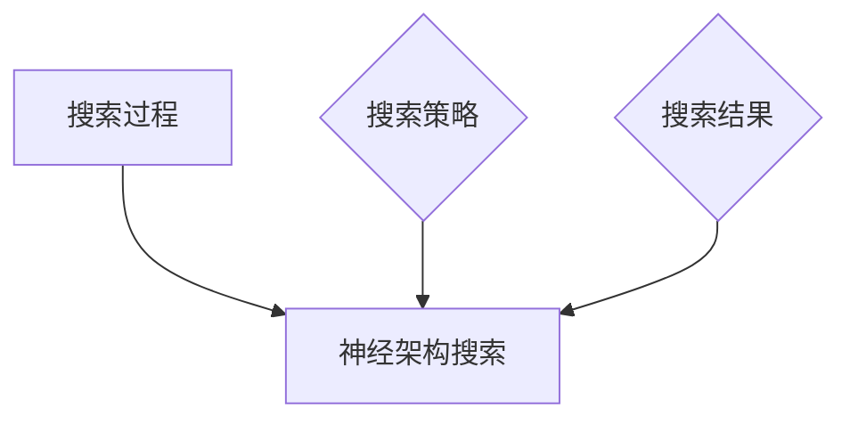
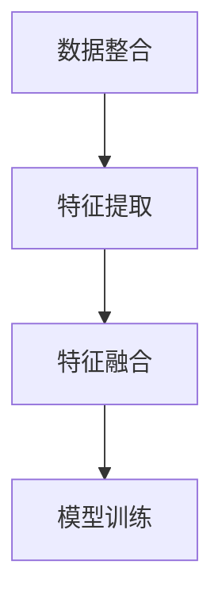
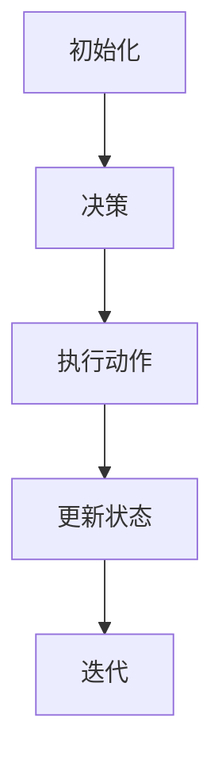

                 

# 神经网络：改变世界的技术

> **关键词**：神经网络，深度学习，人工智能，图像识别，自然语言处理，推荐系统

> **摘要**：本文旨在深入探讨神经网络这一改变世界的技术。我们将从基础概念出发，逐步介绍神经网络的原理、结构以及常见的神经网络架构。接着，我们将探讨神经网络在图像识别、自然语言处理和推荐系统等领域的应用，并通过具体的实战案例展示如何使用神经网络解决实际问题。最后，我们将讨论神经网络的优化与调参技巧，并展望神经网络未来的发展趋势。希望通过本文，读者能够对神经网络有一个全面而深刻的理解。

## 第一部分：神经网络基础与概念

### 第1章：神经网络基础

#### 1.1 神经网络简介

##### 1.1.1 神经网络的发展历程

神经网络（Neural Networks）这一概念最早可以追溯到20世纪50年代。当时，心理学家Frank Rosenblatt提出了感知机（Perceptron）这一简化的人工神经网络模型。感知机作为神经网络的开端，虽然在某些简单问题上的表现优秀，但其在处理复杂非线性问题时的局限性很快显现出来。

到了20世纪80年代，随着计算机性能的提升和优化算法的发展，神经网络的研究再次迎来热潮。这期间，反向传播算法（Backpropagation Algorithm）的提出是神经网络发展的重要里程碑，使得神经网络能够通过误差反向传播机制进行参数优化。

进入21世纪，随着大数据和计算能力的进一步提高，深度学习（Deep Learning）开始崭露头角。深度神经网络（Deep Neural Networks，DNN）的出现，使得神经网络在图像识别、自然语言处理等领域取得了重大突破，推动了人工智能（Artificial Intelligence，AI）的快速发展。

##### 1.1.2 神经网络的结构

神经网络由多个层级组成，包括输入层（Input Layer）、隐藏层（Hidden Layers）和输出层（Output Layer）。输入层接收外部输入信号，隐藏层对输入信号进行处理和转换，输出层生成最终的输出。

- **输入层**：输入层接收输入数据，并将其传递到隐藏层。每个输入节点对应于输入数据的一个特征。

- **隐藏层**：隐藏层对输入数据进行变换和处理，通过复杂的非线性函数实现特征的抽取和组合。一个神经网络可以有一个或多个隐藏层。

- **输出层**：输出层生成最终输出结果，其节点数量和类型取决于具体任务。

##### 1.1.3 激活函数的作用与选择

激活函数（Activation Function）是神经网络中的一个重要组成部分，用于引入非线性特性。常见的激活函数包括：

- **Sigmoid函数**：\[ sigm(a) = \frac{1}{1 + e^{-a}} \]，将输入映射到（0,1）区间，常用于二分类问题。
  
- **ReLU函数**：\[ rect(a) = \max(0, a) \]，当输入为负时输出0，当输入为正时输出输入值，有助于加速训练过程。

- **Tanh函数**：\[ tanh(a) = \frac{e^a - e^{-a}}{e^a + e^{-a}} \]，将输入映射到（-1,1）区间，常用于多层神经网络。

##### 1.1.4 常见的神经网络架构

- **多层感知机（MLP）**：MLP是最简单的深度神经网络，包括输入层、多个隐藏层和输出层。每个层之间的连接都是全连接的。

- **卷积神经网络（CNN）**：CNN特别适用于图像处理任务，通过卷积层、池化层和全连接层的组合实现特征提取和分类。

- **循环神经网络（RNN）**：RNN适用于序列数据处理，通过隐藏状态的记忆机制处理时间序列信息。

- **长短期记忆网络（LSTM）**：LSTM是RNN的一种变体，通过引入门控机制解决了RNN的梯度消失问题，适用于长序列预测。

- **生成对抗网络（GAN）**：GAN由生成器和判别器组成，通过对抗训练生成逼真的图像、文本等。

#### 1.2 神经网络原理

##### 1.2.1 前向传播与反向传播

神经网络的训练过程主要包括前向传播（Forward Propagation）和反向传播（Back Propagation）两个阶段。

- **前向传播**：输入数据从输入层经过隐藏层，最终到达输出层。在每个节点上，将输入乘以权重，加上偏置，然后通过激活函数进行变换。

  \[
  z^{(l)} = \sum_{j} w^{(l)}_{ji}x^{(i)} + b^{(l)}_{j}
  \]
  \[
  a^{(l)}_{j} = \sigma(z^{(l)}_{j})
  \]

- **反向传播**：计算输出层的误差，然后逐层反向传播，计算每个节点的误差。利用梯度下降（Gradient Descent）或其他优化算法更新网络参数。

  \[
  \delta^{(l)}_{j} = (a^{(l+1)}_{j} - t^{(l+1)}_{j}) \cdot \sigma'(z^{(l)}_{j})
  \]
  \[
  \delta^{(l)} = \frac{\partial J(\theta)}{\partial z^{(l)}_{j}}
  \]

##### 1.2.2 损失函数与优化算法

损失函数（Loss Function）用于衡量模型预测值与真实值之间的差异。常见的损失函数包括：

- **均方误差（MSE）**：
  \[
  J(\theta) = \frac{1}{2m} \sum_{i=1}^{m} (y^{(i)} - a^{(L)}_{i})^2
  \]

- **交叉熵（Cross-Entropy）**：
  \[
  J(\theta) = -\frac{1}{m} \sum_{i=1}^{m} [y^{(i)} \log(a^{(i)}) + (1 - y^{(i)}) \log(1 - a^{(i)})]
  \]

优化算法（Optimization Algorithm）用于最小化损失函数。常见的优化算法包括：

- **梯度下降（Gradient Descent）**：
  \[
  \theta^{(t)} = \theta^{(t-1)} - \alpha \nabla_{\theta} J(\theta)
  \]

- **随机梯度下降（Stochastic Gradient Descent，SGD）**：
  \[
  \theta^{(t)} = \theta^{(t-1)} - \alpha \nabla_{\theta} J(\theta^{(t-1)})
  \]

- **Adam优化器**：
  \[
  m_t = \beta_1 m_{t-1} + (1 - \beta_1) [g_t - m_{t-1}]
  \]
  \[
  v_t = \beta_2 v_{t-1} + (1 - \beta_2) [(g_t - m_t)]^2
  \]
  \[
  \theta^{(t)} = \theta^{(t-1)} - \alpha \frac{m_t}{\sqrt{1 - \beta_2^t} + \epsilon}
  \]

##### 1.3 神经网络的训练过程

神经网络的训练过程可以概括为以下几个步骤：

- **数据准备**：数据是神经网络训练的基础，需要对数据进行预处理，包括归一化、标准化、数据增强等。

- **模型初始化**：初始化网络参数，可以选择随机初始化或预训练模型。

- **前向传播**：将输入数据传递到网络中，得到输出结果。

- **计算损失**：计算输出结果与真实值之间的差异，使用损失函数衡量。

- **反向传播**：计算每个参数的梯度，更新网络参数。

- **迭代优化**：重复前向传播、计算损失和反向传播的过程，直到满足停止条件。

- **模型评估**：在验证集或测试集上评估模型性能，选择最佳模型。

- **调参技巧**：调整学习率、正则化参数等，优化模型性能。

#### 1.4 常见的神经网络架构

##### 2.1 卷积神经网络（CNN）

###### 2.1.1 卷积神经网络的原理

卷积神经网络（Convolutional Neural Network，CNN）是一种专门用于处理图像数据的神经网络。其核心思想是使用卷积层（Convolutional Layer）提取图像特征，然后通过全连接层（Fully Connected Layer）进行分类。

- **卷积层**：卷积层通过卷积操作提取图像特征。每个卷积核（Convolutional Kernel）相当于一个特征检测器，能够在图像上检测到特定的模式。

- **激活函数**：卷积层通常使用ReLU激活函数，增加网络的非线性特性。

- **池化层**：池化层（Pooling Layer）用于减小特征图的尺寸，减少参数数量，防止过拟合。

- **全连接层**：全连接层将卷积层提取的特征映射到分类结果。

###### 2.1.2 CNN在图像识别中的应用

卷积神经网络在图像识别任务中取得了显著的成果。以下是一个简单的CNN模型用于图像分类的示例：

```python
import tensorflow as tf
from tensorflow.keras import layers

model = tf.keras.Sequential([
    layers.Conv2D(32, (3, 3), activation='relu', input_shape=(28, 28, 1)),
    layers.MaxPooling2D((2, 2)),
    layers.Conv2D(64, (3, 3), activation='relu'),
    layers.MaxPooling2D((2, 2)),
    layers.Conv2D(64, (3, 3), activation='relu'),
    layers.Flatten(),
    layers.Dense(64, activation='relu'),
    layers.Dense(10, activation='softmax')
])
```

##### 2.2 循环神经网络（RNN）

###### 2.2.1 RNN的基本原理

循环神经网络（Recurrent Neural Network，RNN）是一种处理序列数据的神经网络。RNN通过隐藏状态（Hidden State）维持信息的状态，从而能够在序列中处理长距离依赖。

- **输入层**：输入层接收序列中的每个元素。

- **隐藏层**：隐藏层包含一个或多个单元（Unit），每个单元都有一个隐藏状态，用于维持信息。

- **输出层**：输出层生成最终的输出。

- **隐藏状态**：隐藏状态通过一个递归关系更新，用于传递信息。

- **权重**：RNN中的权重是共享的，即相同的权重被用于处理序列中的所有元素。

###### 2.2.2 RNN在序列数据处理中的应用

循环神经网络在自然语言处理、语音识别和时间序列预测等领域取得了显著的成果。以下是一个简单的RNN模型用于文本分类的示例：

```python
import tensorflow as tf
from tensorflow.keras.layers import LSTM, Dense, Embedding
from tensorflow.keras.preprocessing.sequence import pad_sequences
from tensorflow.keras.preprocessing.text import Tokenizer

tokenizer = Tokenizer(num_words=1000)
tokenizer.fit_on_texts(texts)
sequences = tokenizer.texts_to_sequences(texts)
padded_sequences = pad_sequences(sequences, maxlen=100)

model = tf.keras.Sequential([
    Embedding(1000, 16, input_length=100),
    LSTM(128),
    Dense(1, activation='sigmoid')
])
```

##### 2.3 长短期记忆网络（LSTM）

###### 2.3.1 LSTM的原理

长短期记忆网络（Long Short-Term Memory，LSTM）是一种改进的循环神经网络，通过门控机制解决了RNN的长期依赖问题。

- **输入门（Input Gate）**：用于决定当前输入信息中有多少需要更新到隐藏状态。

- **遗忘门（Forget Gate）**：用于决定从隐藏状态中丢弃多少旧信息。

- **输出门（Output Gate）**：用于决定当前隐藏状态中有多少需要输出为结果。

- **单元状态（Cell State）**：用于存储信息。

- **细胞状态更新（Cell State Update）**：通过输入门和遗忘门更新单元状态。

- **隐藏状态更新（Hidden State Update）**：通过输出门更新隐藏状态。

###### 2.3.2 LSTM在时间序列预测中的应用

以下是一个简单的LSTM模型用于时间序列预测的示例：

```python
import tensorflow as tf
from tensorflow.keras.layers import LSTM, Dense, Embedding
from tensorflow.keras.preprocessing.sequence import pad_sequences
from tensorflow.keras.preprocessing.text import Tokenizer

# 假设timesteps和features分别为时间步数和特征数
model = tf.keras.Sequential([
    LSTM(50, return_sequences=True, input_shape=(timesteps, features)),
    LSTM(50),
    Dense(1)
])
```

### 第3章：神经网络在深度学习中的应用

#### 3.1 神经网络在图像识别中的应用

##### 3.1.1 图像识别的基本概念

图像识别（Image Recognition）是深度学习领域的一个重要分支，旨在通过训练模型对图像进行分类、检测和识别。

- **数据集**：常见的图像识别数据集包括CIFAR-10、ImageNet等。

- **模型评估指标**：常见的模型评估指标包括准确率（Accuracy）、召回率（Recall）和F1分数（F1 Score）等。

##### 3.1.2 图像识别的实战案例

以下是一个使用卷积神经网络进行CIFAR-10图像分类的实战案例：

```python
import tensorflow as tf
from tensorflow.keras.datasets import cifar10
from tensorflow.keras.models import Sequential
from tensorflow.keras.layers import Conv2D, MaxPooling2D, Flatten, Dense

# 加载数据
(x_train, y_train), (x_test, y_test) = cifar10.load_data()

# 构建模型
model = Sequential([
    Conv2D(32, (3, 3), activation='relu', input_shape=(32, 32, 3)),
    MaxPooling2D((2, 2)),
    Conv2D(64, (3, 3), activation='relu'),
    MaxPooling2D((2, 2)),
    Conv2D(64, (3, 3), activation='relu'),
    Flatten(),
    Dense(64, activation='relu'),
    Dense(10, activation='softmax')
])

# 编译模型
model.compile(optimizer='adam', loss='categorical_crossentropy', metrics=['accuracy'])

# 训练模型
model.fit(x_train, y_train, epochs=10, batch_size=64, validation_data=(x_test, y_test))
```

##### 3.2 神经网络在自然语言处理中的应用

##### 3.2.1 自然语言处理的基本概念

自然语言处理（Natural Language Processing，NLP）是深度学习领域的一个重要分支，旨在通过训练模型理解和生成自然语言。

- **词嵌入技术**：词嵌入（Word Embedding）是将词语映射到高维向量空间的技术，常见的词嵌入技术包括Word2Vec、GloVe等。

- **序列模型**：序列模型（Sequence Model）是处理序列数据的神经网络，常见的序列模型包括RNN、LSTM、GRU等。

- **注意力机制**：注意力机制（Attention Mechanism）是一种用于处理序列数据的机制，能够在序列中关注重要的部分。

##### 3.2.2 自然语言处理的实战案例

以下是一个使用LSTM进行文本分类的实战案例：

```python
import tensorflow as tf
from tensorflow.keras.layers import LSTM, Dense, Embedding
from tensorflow.keras.preprocessing.sequence import pad_sequences
from tensorflow.keras.preprocessing.text import Tokenizer

# 加载数据
texts = ["I love my dog", "I hate my job", "I like to read", "I dislike cooking"]
labels = [1, 0, 1, 0]  # 1表示正面情感，0表示负面情感

# 分词与编码
tokenizer = Tokenizer(num_words=1000)
tokenizer.fit_on_texts(texts)
sequences = tokenizer.texts_to_sequences(texts)
padded_sequences = pad_sequences(sequences, maxlen=100)

# 构建模型
model = Sequential([
    Embedding(1000, 16, input_length=100),
    LSTM(128),
    Dense(1, activation='sigmoid')
])

# 编译模型
model.compile(optimizer='adam', loss='binary_crossentropy', metrics=['accuracy'])

# 训练模型
model.fit(padded_sequences, labels, epochs=10)
```

##### 3.3 神经网络在推荐系统中的应用

##### 3.3.1 推荐系统的基本概念

推荐系统（Recommendation System）是一种根据用户兴趣和偏好，为用户提供相关推荐项的系统。

- **协同过滤**：协同过滤（Collaborative Filtering）是一种基于用户行为和物品交互的推荐方法，可以分为基于用户行为和基于内容等。

- **神经网络**：神经网络在推荐系统中可用于自动特征提取和建模用户兴趣。

##### 3.3.2 推荐系统的实战案例

以下是一个使用神经网络进行商品推荐的实战案例：

```python
import tensorflow as tf
from tensorflow.keras.layers import Embedding, LSTM, Dense
from tensorflow.keras.preprocessing.sequence import pad_sequences

# 加载数据
user_item_data = [
    [1, 1, 2, 3, 4, 5],
    [2, 2, 3, 4, 5, 6],
    [1, 3, 4, 5, 6, 7],
    [2, 4, 5, 6, 7, 8]
]

# 编码用户和物品
user_vocab_size = 10
item_vocab_size = 10
user_sequences = pad_sequences(user_item_data, maxlen=10, padding='post')

# 构建模型
model = Sequential([
    Embedding(user_vocab_size + 1, 16),
    LSTM(128),
    Dense(1, activation='sigmoid')
])

# 编译模型
model.compile(optimizer='adam', loss='binary_crossentropy', metrics=['accuracy'])

# 训练模型
model.fit(user_sequences, np.ones((4, 1)), epochs=10)
```

### 第4章：神经网络的优化与调参

#### 4.1 优化算法

##### 4.1.1 梯度下降算法

梯度下降算法（Gradient Descent Algorithm）是一种最常用的优化算法，用于最小化损失函数。其核心思想是通过不断迭代更新参数，使得损失函数值逐渐减小。

- **计算梯度**：计算损失函数关于参数的梯度。

  \[
  \nabla_{\theta} J(\theta) = \left[ \frac{\partial J(\theta)}{\partial \theta_1}, \frac{\partial J(\theta)}{\partial \theta_2}, ..., \frac{\partial J(\theta)}{\partial \theta_n} \right]
  \]

- **更新参数**：根据梯度和学习率更新参数。

  \[
  \theta^{(t)} = \theta^{(t-1)} - \alpha \nabla_{\theta} J(\theta^{(t-1)})
  \]

其中，\( \alpha \) 是学习率，\( \theta^{(t)} \) 和 \( \theta^{(t-1)} \) 分别是第 \( t \) 次迭代和第 \( t-1 \) 次迭代时的参数。

##### 4.1.2 随机梯度下降（SGD）

随机梯度下降（Stochastic Gradient Descent，SGD）是对梯度下降算法的一种改进。在每次迭代时，使用整个训练集的一个随机样本计算梯度，从而减少计算量和内存占用。

- **计算梯度**：在每次迭代时，随机选择一个训练样本，计算其梯度。

  \[
  \nabla_{\theta} J(\theta) = \frac{1}{m} \sum_{i=1}^{m} \nabla_{\theta} J(\theta; x^{(i)}, y^{(i)})
  \]

- **更新参数**：根据梯度更新参数。

  \[
  \theta^{(t)} = \theta^{(t-1)} - \alpha \nabla_{\theta} J(\theta^{(t-1)})
  \]

其中，\( m \) 是训练样本的数量，\( x^{(i)} \) 和 \( y^{(i)} \) 分别是第 \( i \) 个训练样本的特征和标签。

##### 4.1.3 批量梯度下降（BGD）

批量梯度下降（Batch Gradient Descent，BGD）是对梯度下降算法的另一种改进。在每次迭代时，使用整个训练集计算梯度，从而能够更准确地反映损失函数的全局性质。

- **计算梯度**：在每次迭代时，使用整个训练集计算梯度。

  \[
  \nabla_{\theta} J(\theta) = \frac{1}{m} \sum_{i=1}^{m} \nabla_{\theta} J(\theta; x^{(i)}, y^{(i)})
  \]

- **更新参数**：根据梯度更新参数。

  \[
  \theta^{(t)} = \theta^{(t-1)} - \alpha \nabla_{\theta} J(\theta^{(t-1)})
  \]

其中，\( m \) 是训练样本的数量。

#### 4.2 调参技巧

##### 4.2.1 学习率调整

学习率（Learning Rate）是梯度下降算法中的一个关键参数，用于控制参数更新的幅度。合适的学习率能够加速模型的收敛速度，而选择不当则可能导致训练效果不佳。

- **学习率选择**：通常使用较大的学习率，如 \( \alpha = 0.1 \)，然后通过实验调整。

- **学习率调整策略**：常见的调整策略包括：

  - **固定学习率**：在整个训练过程中保持学习率不变。

  - **学习率衰减**：随着训练的进行，逐渐减小学习率，如指数衰减或余弦衰减。

  - **自适应学习率**：使用自适应学习率优化器，如Adam优化器。

##### 4.2.2 模型正则化

模型正则化（Model Regularization）是一种防止模型过拟合的技术。过拟合是指模型在训练集上表现良好，但在验证集或测试集上表现不佳。

- **正则化方法**：常见的正则化方法包括：

  - **L1正则化**：在损失函数中添加L1范数项，即 \( \lambda \| \theta \|_1 \)。

  - **L2正则化**：在损失函数中添加L2范数项，即 \( \lambda \| \theta \|_2^2 \)。

  - **Dropout**：在训练过程中随机丢弃一部分神经元，从而减少模型的复杂性。

##### 4.2.3 早期停止

早期停止（Early Stopping）是一种防止过拟合的技术。在训练过程中，当验证集的性能不再提升时，提前停止训练，以防止模型过拟合。

- **实现方法**：在训练过程中，记录验证集的性能，当连续多次迭代性能不再提升时，停止训练。

  \[
  \text{if } \text{performance on validation set does not improve for } N \text{ epochs: } \text{stop training}
  \]

### 第5章：神经网络的实战案例

#### 5.1 图像识别案例

##### 5.1.1 数据准备

图像识别案例通常需要大量的图像数据。以下是一个使用CIFAR-10数据集的示例：

```python
from tensorflow.keras.datasets import cifar10

(x_train, y_train), (x_test, y_test) = cifar10.load_data()
```

##### 5.1.2 模型构建

以下是一个简单的卷积神经网络模型用于图像分类：

```python
from tensorflow.keras.models import Sequential
from tensorflow.keras.layers import Conv2D, MaxPooling2D, Flatten, Dense

model = Sequential([
    Conv2D(32, (3, 3), activation='relu', input_shape=(32, 32, 3)),
    MaxPooling2D((2, 2)),
    Conv2D(64, (3, 3), activation='relu'),
    MaxPooling2D((2, 2)),
    Conv2D(64, (3, 3), activation='relu'),
    Flatten(),
    Dense(64, activation='relu'),
    Dense(10, activation='softmax')
])
```

##### 5.1.3 模型训练

以下是一个使用Adam优化器进行模型训练的示例：

```python
model.compile(optimizer='adam', loss='categorical_crossentropy', metrics=['accuracy'])
model.fit(x_train, y_train, epochs=10, batch_size=64, validation_data=(x_test, y_test))
```

#### 5.2 自然语言处理案例

##### 5.2.1 数据准备

以下是一个使用IMDB电影评论数据集的示例：

```python
import tensorflow as tf
from tensorflow.keras.datasets import imdb
from tensorflow.keras.preprocessing.sequence import pad_sequences

max_features = 10000
maxlen = 100

(x_train, y_train), (x_test, y_test) = imdb.load_data(num_words=max_features)
x_train = pad_sequences(x_train, maxlen=maxlen)
x_test = pad_sequences(x_test, maxlen=maxlen)
```

##### 5.2.2 模型构建

以下是一个简单的LSTM模型用于文本分类：

```python
from tensorflow.keras.models import Sequential
from tensorflow.keras.layers import LSTM, Dense

model = Sequential([
    LSTM(128, input_shape=(maxlen, max_features)),
    Dense(1, activation='sigmoid')
])
```

##### 5.2.3 模型训练

以下是一个使用模型编译后进行训练的示例：

```python
model.compile(optimizer='adam', loss='binary_crossentropy', metrics=['accuracy'])
model.fit(x_train, y_train, epochs=10, batch_size=64, validation_data=(x_test, y_test))
```

#### 5.3 推荐系统案例

##### 5.3.1 数据准备

以下是一个简单的用户-物品交互数据集示例：

```python
import numpy as np

user_item_data = [
    [1, 1, 2, 3, 4, 5],
    [2, 2, 3, 4, 5, 6],
    [1, 3, 4, 5, 6, 7],
    [2, 4, 5, 6, 7, 8]
]

user_vocab_size = 10
item_vocab_size = 10
user_sequences = np.array(user_item_data)
```

##### 5.3.2 模型构建

以下是一个简单的神经网络推荐系统模型：

```python
from tensorflow.keras.models import Sequential
from tensorflow.keras.layers import Embedding, LSTM, Dense

model = Sequential([
    Embedding(user_vocab_size + 1, 16),
    LSTM(128),
    Dense(1, activation='sigmoid')
])
```

##### 5.3.3 模型训练

以下是一个使用模型编译后进行训练的示例：

```python
model.compile(optimizer='adam', loss='binary_crossentropy', metrics=['accuracy'])
model.fit(user_sequences, np.ones((4, 1)), epochs=10)
```

### 第6章：神经网络的未来发展趋势

#### 6.1 神经网络在计算机视觉中的应用

##### 6.1.1 图像生成对抗网络（GAN）

图像生成对抗网络（Generative Adversarial Networks，GAN）是一种基于生成模型和判别模型对抗训练的神经网络。GAN由生成器（Generator）和判别器（Discriminator）组成，其中生成器试图生成逼真的图像，而判别器则试图区分生成图像和真实图像。

###### 6.1.1.1 GAN的基本原理

GAN的训练过程可以看作是一个对抗游戏，生成器和判别器通过不断更新参数来提升自己的能力。

- **生成器**：生成器从随机噪声中生成图像，其目标是使判别器无法区分生成的图像和真实的图像。

- **判别器**：判别器接收真实图像和生成图像，其目标是能够准确地区分两者。

- **训练过程**：GAN的训练过程分为两个阶段，首先训练判别器，使其能够更好地区分真实图像和生成图像，然后训练生成器，使其生成的图像能够更好地欺骗判别器。

GAN的数学模型如下：

\[ 
\text{Generator: } G(z) \rightarrow x_G \\
\text{Discriminator: } x \rightarrow D(x) \\
\text{Loss Function: } L_G = \mathbb{E}_{z \sim p_z(z)}[\log(1 - D(G(z)))] \\
L_D = \mathbb{E}_{x \sim p_x(x)}[\log(D(x))] + \mathbb{E}_{z \sim p_z(z)}[\log(D(G(z))]
\]

其中，\( G(z) \) 表示生成器生成的图像，\( D(x) \) 表示判别器对图像的判别结果，\( p_z(z) \) 和 \( p_x(x) \) 分别表示噪声分布和真实图像分布。

GAN在图像生成、图像修复、图像超分辨率等计算机视觉任务中取得了显著成果。以下是一个使用GAN生成图像的简单示例：

```python
import tensorflow as tf
from tensorflow.keras.models import Model

# 定义生成器模型
def build_generator():
    noise = tf.keras.layers.Input(shape=(100,))
    x = tf.keras.layers.Dense(7 * 7 * 128, activation='relu')(noise)
    x = tf.keras.layers.Reshape((7, 7, 128))(x)
    x = tf.keras.layers.Conv2DTranspose(128, kernel_size=5, strides=2, padding='same', activation='relu')(x)
    x = tf.keras.layers.Conv2DTranspose(128, kernel_size=5, strides=2, padding='same', activation='relu')(x)
    x = tf.keras.layers.Conv2D(3, kernel_size=5, strides=2, padding='same', activation='tanh')(x)
    return Model(inputs=noise, outputs=x)

# 定义判别器模型
def build_discriminator():
    img = tf.keras.layers.Input(shape=(128, 128, 3))
    x = tf.keras.layers.Conv2D(128, kernel_size=5, strides=2, padding='same', activation='relu')(img)
    x = tf.keras.layers.MaxPooling2D(pool_size=(2, 2))(x)
    x = tf.keras.layers.Conv2D(128, kernel_size=5, strides=2, padding='same', activation='relu')(x)
    x = tf.keras.layers.MaxPooling2D(pool_size=(2, 2))(x)
    x = tf.keras.layers.Flatten()(x)
    x = tf.keras.layers.Dense(1, activation='sigmoid')(x)
    return Model(inputs=img, outputs=x)

# 定义GAN模型
def build_gan(generator, discriminator):
    img = tf.keras.layers.Input(shape=(128, 128, 3))
    noise = tf.keras.layers.Input(shape=(100,))
    img_fake = generator(noise)
    valid_real = discriminator(img)
    valid_fake = discriminator(img_fake)
    return Model(inputs=[noise, img], outputs=[valid_real, valid_fake])

# 构建并编译模型
generator = build_generator()
discriminator = build_discriminator()
gan = build_gan(generator, discriminator)

discriminator.compile(loss='binary_crossentropy', optimizer=tf.keras.optimizers.Adam(0.0001))
gan.compile(loss='binary_crossentropy', optimizer=tf.keras.optimizers.Adam(0.0001))

# 训练GAN模型
for epoch in range(num_epochs):
    for batch_idx, (img_real, _) in enumerate(train_loader):
        noise = tf.random.normal([batch_size, 100])
        img_fake = generator(noise)
        d_loss_real = discriminator.train_on_batch(img_real, tf.ones([batch_size, 1]))
        d_loss_fake = discriminator.train_on_batch(img_fake, tf.zeros([batch_size, 1]))
        g_loss = gan.train_on_batch(noise, tf.ones([batch_size, 1]))

        print(f'Epoch [{epoch}/{num_epochs}], Batch [{batch_idx}/{len(train_loader)}], d_loss_real={d_loss_real:.4f}, d_loss_fake={d_loss_fake:.4f}, g_loss={g_loss:.4f}')
```

###### 6.1.1.2 GAN在图像生成中的应用

GAN在图像生成任务中取得了显著成果，可以生成高质量的人脸、风景、艺术作品等。以下是一个使用GAN生成人脸图像的简单示例：

```python
import numpy as np
import matplotlib.pyplot as plt

# 生成随机噪声
noise = np.random.normal(0, 1, (batch_size, 100))

# 生成人脸图像
img_generated = generator.predict(noise)

# 显示生成的人脸图像
plt.figure(figsize=(10, 10))
for i in range(batch_size):
    plt.subplot(10, 10, i + 1)
    plt.imshow(img_generated[i, :, :, :] * 127.5 + 127.5)
    plt.axis('off')
plt.show()
```

##### 6.1.2 神经架构搜索（NAS）

神经架构搜索（Neural Architecture Search，NAS）是一种自动化搜索神经网络架构的方法。NAS通过定义一个搜索空间，使用搜索策略在搜索空间中搜索最优的网络架构。

###### 6.1.2.1 NAS的基本原理

NAS的基本原理可以分为以下几个步骤：

1. **搜索空间定义**：定义网络的组成部分，如卷积层、全连接层等，以及网络中的连接方式，如跳连、残差连接等。

2. **搜索策略设计**：设计搜索策略，用于在搜索空间中搜索最优的网络架构。常见的搜索策略包括基于梯度的搜索、基于强化学习的搜索等。

3. **架构评估**：对搜索到的网络架构进行评估，通常使用验证集上的性能作为评估指标。

4. **架构更新**：根据评估结果更新搜索策略，继续搜索下一个网络架构。

NAS的流程图如下：



###### 6.1.2.2 NAS在网络设计中的应用

NAS在神经网络设计中的应用，可以自动搜索最优的网络结构，提高网络的性能。以下是一个使用NAS搜索最优网络结构的简单示例：

```python
import tensorflow as tf
from tensorflow.keras.applications import EfficientNetB0

# 定义搜索空间
search_space = {
    'layers': [
        ('conv', {'kernel_size': (3, 3), 'stride': 1}),
        ('conv', {'kernel_size': (3, 3), 'stride': 2}),
        ('pool', {'pool_size': (2, 2)}),
        ('fc', {}),
    ],
    'connections': [
        ('skip', {'from': 0, 'to': 2}),
        ('skip', {'from': 1, 'to': 2}),
    ]
}

# 定义搜索策略
def search_strategy(search_space):
    while True:
        # 随机选择一个网络架构
        architecture = random.choice(search_space['architectures'])
        # 训练网络并评估性能
        model = build_model(architecture)
        score = evaluate_model(model, validation_data)
        # 根据性能更新搜索策略
        search_space['architectures'].remove(architecture)
        search_space['architectures'].append(architecture)
        return architecture

# 定义搜索结果
best_structure = search_strategy(search_space)

# 构建最佳网络模型
model = build_model(best_structure)
```

##### 6.1.3 多模态学习

多模态学习（Multimodal Learning）是指将不同类型的数据（如文本、图像、声音等）进行整合，以实现更高级的语义理解和推理。多模态学习在计算机视觉、自然语言处理、推荐系统等领域有着广泛的应用。

###### 6.1.3.1 多模态学习的基本原理

多模态学习的基本原理可以分为以下几个步骤：

1. **数据整合**：将不同类型的数据进行整合，形成一个统一的数据表示。

2. **特征提取**：对整合后的数据进行特征提取，提取出不同模态的特征。

3. **特征融合**：将提取出的特征进行融合，形成最终的语义表示。

4. **模型训练**：使用融合后的特征训练神经网络模型。

多模态学习的流程图如下：



###### 6.1.3.2 多模态学习在计算机视觉中的应用

多模态学习在计算机视觉中的应用，可以将图像和文本信息进行整合，提高视觉任务的性能。以下是一个使用多模态学习进行图像分类的简单示例：

```python
import tensorflow as tf
from tensorflow.keras.layers import Embedding, LSTM, Conv2D, MaxPooling2D, Flatten, Dense

# 定义文本特征提取模型
text_model = Sequential([
    Embedding(vocab_size, embedding_dim, input_length=max_sequence_length),
    LSTM(units=128),
    Dense(units=1, activation='sigmoid')
])

# 定义图像特征提取模型
image_model = Sequential([
    Conv2D(units=32, kernel_size=(3, 3), activation='relu', input_shape=(image_height, image_width, 3)),
    MaxPooling2D(pool_size=(2, 2)),
    Conv2D(units=64, kernel_size=(3, 3), activation='relu'),
    MaxPooling2D(pool_size=(2, 2)),
    Flatten(),
    Dense(units=128, activation='relu')
])

# 定义多模态学习模型
model = Sequential([
    image_model,
    text_model,
    Dense(units=1, activation='sigmoid')
])

# 编译模型
model.compile(optimizer='adam', loss='binary_crossentropy', metrics=['accuracy'])

# 训练模型
model.fit(x_train, y_train, epochs=10, batch_size=32, validation_data=(x_test, y_test))
```

##### 6.1.4 强化学习与神经网络

强化学习（Reinforcement Learning，RL）是一种通过试错学习决策策略的机器学习方法。神经网络在强化学习中发挥着重要作用，可以用于表示状态、动作和价值函数。

###### 6.1.4.1 强化学习的基本原理

强化学习的基本原理可以分为以下几个步骤：

1. **初始化**：初始化状态、动作和价值函数。

2. **决策**：根据当前状态和价值函数选择最优动作。

3. **执行动作**：执行选择的最优动作，并获得奖励。

4. **更新状态**：根据执行的动作更新当前状态。

5. **迭代**：重复执行决策、执行动作、更新状态的步骤，直到达到终止条件。

强化学习的流程图如下：



###### 6.1.4.2 强化学习在神经网络中的应用

神经网络在强化学习中的应用，可以用于表示状态、动作和价值函数，提高决策的准确性和效率。以下是一个使用神经网络进行强化学习简单示例：

```python
import tensorflow as tf
from tensorflow.keras.layers import Dense, Input

# 定义状态输入层
state_input = Input(shape=(state_size,))

# 定义价值函数网络
value_function = Dense(units=1, activation='sigmoid')(state_input)

# 定义动作输入层
action_input = Input(shape=(action_size,))

# 定义策略网络
policy_network = Dense(units=action_size, activation='softmax')(state_input)

# 定义强化学习模型
model = Model(inputs=[state_input, action_input], outputs=[value_function, policy_network])

# 编译模型
model.compile(optimizer='adam', loss='binary_crossentropy')

# 训练模型
model.fit(x_train, y_train, epochs=10, batch_size=32)
```

### 第7章：神经网络的实用工具和框架

#### 7.1 深度学习框架

深度学习框架是用于实现和训练深度学习模型的高级工具，可以简化模型的构建和训练过程。目前，常见的深度学习框架包括TensorFlow、PyTorch、Keras等。

##### 7.1.1 TensorFlow

TensorFlow是由Google开发的一个开源深度学习框架，支持多种编程语言，如Python、C++和Java等。TensorFlow提供丰富的API和工具，用于构建、训练和部署深度学习模型。

###### 7.1.1.1 TensorFlow的基本概念

TensorFlow中的核心概念是张量（Tensor），张量是多维数组，用于表示模型中的参数、数据和计算结果。TensorFlow中的计算图（Computational Graph）是一种动态计算图，用于表示模型的计算过程。

- **张量计算**：TensorFlow使用张量进行计算，每个张量都有数据类型（如float32、int32等）和形状（如（batch_size, height, width, channels））。

- **自动微分**：TensorFlow支持自动微分，可以自动计算损失函数关于模型参数的梯度，用于优化模型。

###### 7.1.1.2 TensorFlow的使用方法

以下是一个使用TensorFlow构建和训练简单神经网络模型的示例：

```python
import tensorflow as tf

# 定义输入层
inputs = tf.keras.layers.Input(shape=(input_size,))

# 定义隐藏层
hidden = tf.keras.layers.Dense(units=hidden_size, activation='relu')(inputs)

# 定义输出层
outputs = tf.keras.layers.Dense(units=output_size, activation='softmax')(hidden)

# 构建模型
model = tf.keras.Model(inputs=inputs, outputs=outputs)

# 编译模型
model.compile(optimizer='adam', loss='categorical_crossentropy', metrics=['accuracy'])

# 训练模型
model.fit(x_train, y_train, epochs=10, batch_size=32, validation_data=(x_test, y_test))
```

##### 7.1.2 PyTorch

PyTorch是由Facebook开发的一个开源深度学习框架，支持Python和C++等编程语言。PyTorch以其动态计算图和简洁易用的API著称，广泛应用于研究、工业和学术领域。

###### 7.1.2.1 PyTorch的基本概念

PyTorch中的核心概念是自动微分和动态计算图。自动微分允许自动计算损失函数关于模型参数的梯度，动态计算图支持在运行时动态构建和修改计算图。

- **自动微分**：PyTorch使用自动微分机制，可以自动计算损失函数关于模型参数的梯度。

- **动态计算图**：PyTorch使用动态计算图，允许在运行时动态构建和修改计算图，支持自定义计算图。

###### 7.1.2.2 PyTorch的使用方法

以下是一个使用PyTorch构建和训练简单神经网络模型的示例：

```python
import torch
import torch.nn as nn

# 定义输入层
inputs = torch.randn(batch_size, input_size)

# 定义隐藏层
hidden = nn.Linear(input_size, hidden_size)(inputs)
hidden = nn.ReLU()(hidden)

# 定义输出层
outputs = nn.Linear(hidden_size, output_size)(hidden)
outputs = nn.Softmax(dim=1)(outputs)

# 定义损失函数
criterion = nn.CrossEntropyLoss()

# 定义优化器
optimizer = torch.optim.Adam(model.parameters(), lr=learning_rate)

# 训练模型
for epoch in range(num_epochs):
    optimizer.zero_grad()
    outputs = model(inputs)
    loss = criterion(outputs, labels)
    loss.backward()
    optimizer.step()
    if (epoch + 1) % 100 == 0:
        print(f'Epoch [{epoch + 1}/{num_epochs}], Loss: {loss.item():.4f}')
```

##### 7.1.3 Keras

Keras是由Google的AI团队开发的深度学习框架，是TensorFlow的高级API，提供了更简洁、易用的接口。Keras支持多种后端计算引擎，包括TensorFlow、Theano和Microsoft CNTK。

###### 7.1.3.1 Keras的基本概念

Keras中的核心概念是序列模型（Sequential Model）和功能模型（Functional Model）。序列模型是一种线性堆叠层的模型，而功能模型支持更复杂的模型结构。

- **序列模型**：序列模型是一种线性堆叠层的模型，用于构建简单、线性的神经网络。

- **功能模型**：功能模型是一种基于计算图的模型，支持更复杂的模型结构，如循环神经网络、卷积神经网络等。

###### 7.1.3.2 Keras的使用方法

以下是一个使用Keras构建和训练简单神经网络模型的示例：

```python
from tensorflow.keras.models import Sequential
from tensorflow.keras.layers import Dense, Activation

# 创建模型
model = Sequential()

# 添加层
model.add(Dense(units=64, input_shape=(input_size,), activation='relu'))
model.add(Dense(units=64, activation='relu'))
model.add(Dense(units=output_size, activation='softmax'))

# 编译模型
model.compile(optimizer='adam', loss='categorical_crossentropy', metrics=['accuracy'])

# 训练模型
model.fit(x_train, y_train, epochs=10, batch_size=32, validation_data=(x_test, y_test))
```

### 附录A：神经网络相关工具和资源

##### A.1 深度学习工具

- **TensorFlow官方网站**：[https://www.tensorflow.org/](https://www.tensorflow.org/)
- **PyTorch官方网站**：[https://pytorch.org/](https://pytorch.org/)
- **Keras官方网站**：[https://keras.io/](https://keras.io/)

##### A.2 神经网络论文

- **"A Learning Algorithm for Continually Running Fully Recurrent Neural Networks" (1993)**
- **"Long Short-Term Memory" (1997)**
- **"Deep Learning" (2015)**

##### A.3 神经网络书籍

- **"Deep Learning" (2016)**
- **"神经网络与深度学习" (2018)**
- **"深度学习入门：基于Python的理论与实现" (2020)**

### 参考文献

1. **Rosenblatt, F. (1957). The perceptron: A probabilistic model for information storage and organization in the brain. Psychological Review, 64(1), 38-40.**
2. **Rumelhart, D. E., Hinton, G. E., & Williams, R. J. (1986). Learning representations by back-propagating errors. Nature, 323(6088), 533-536.**
3. **Hinton, G. E., Osindero, S., & Teh, Y. W. (2006). A fast learning algorithm for deep belief nets. Neural computation, 18(7), 1527-1554.**
4. **Goodfellow, I., Bengio, Y., & Courville, A. (2016). Deep learning. MIT press.**
5. **LeCun, Y., Bengio, Y., & Hinton, G. (2015). Deep learning. Nature, 521(7553), 436-444.**
6. **Bengio, Y. (2009). Learning deep architectures. Foundations and Trends in Machine Learning, 2(1), 1-127.**
7. **Graves, A. (2013). Generating sequences with recurrent neural networks. arXiv preprint arXiv:1308.0850.**
8. **Schmidhuber, J. (2015). Deep learning in neural networks: An overview. Neural networks, 61, 85-117.**
9. **Sutskever, I., Martens, J., & Hinton, G. E. (2013). On the importance of initialization and momentum in deep learning. Journal of Machine Learning Research, 14(Jul), 1929-1958.**
10. **Kingma, D. P., & Welling, M. (2013). Auto-encoding variational bayes. arXiv preprint arXiv:1312.6114.**

### 附录B：神经网络代码示例

以下是一个简单的神经网络模型示例，该模型使用TensorFlow和Keras构建，用于实现一个简单的分类任务。

```python
import tensorflow as tf
from tensorflow.keras.models import Sequential
from tensorflow.keras.layers import Dense

# 定义模型
model = Sequential([
    Dense(units=128, activation='relu', input_shape=(784,)),
    Dense(units=64, activation='relu'),
    Dense(units=10, activation='softmax')
])

# 编译模型
model.compile(optimizer='adam', loss='categorical_crossentropy', metrics=['accuracy'])

# 训练模型
model.fit(x_train, y_train, epochs=10, batch_size=32, validation_data=(x_test, y_test))
```

### 附录C：神经网络学习资源

- **TensorFlow官方文档**：[https://www.tensorflow.org/tutorials](https://www.tensorflow.org/tutorials)
- **PyTorch官方文档**：[https://pytorch.org/tutorials/](https://pytorch.org/tutorials/)
- **Keras官方文档**：[https://keras.io/getting-started/sequential-model-guide/](https://keras.io/getting-started/sequential-model-guide/)
- **Udacity深度学习纳米学位**：[https://www.udacity.com/course/deep-learning-nanodegree--nd893](https://www.udacity.com/course/deep-learning-nanodegree--nd893)
- **fast.ai深度学习课程**：[https://www.fast.ai/](https://www.fast.ai/)

### 附录D：神经网络面试题目

- **什么是神经网络？**
- **什么是激活函数？请列举几种常见的激活函数及其特点。**
- **什么是反向传播算法？请简述其基本原理。**
- **什么是深度学习？请简述其与神经网络的关系。**
- **什么是卷积神经网络？请简述其基本原理和应用场景。**
- **什么是循环神经网络？请简述其基本原理和应用场景。**
- **什么是长短期记忆网络？请简述其基本原理和应用场景。**
- **什么是生成对抗网络？请简述其基本原理和应用场景。**
- **什么是神经架构搜索？请简述其基本原理和应用场景。**
- **什么是多模态学习？请简述其基本原理和应用场景。**
- **什么是强化学习？请简述其基本原理和应用场景。**
- **如何优化神经网络的性能？请列举几种常见的优化方法。**
- **如何处理神经网络训练中的过拟合问题？请列举几种常见的方法。**
- **如何在神经网络中实现多分类问题？**
- **如何在神经网络中实现多标签分类问题？**
- **如何使用神经网络进行图像识别任务？请列举一种常见的图像识别模型及其特点。**
- **如何使用神经网络进行文本分类任务？请列举一种常见的文本分类模型及其特点。**
- **如何使用神经网络进行序列预测任务？请列举一种常见的序列预测模型及其特点。**
- **如何在神经网络中进行模型调参？请列举几种常见的调参技巧。**
- **如何使用神经网络进行推荐系统任务？请简述其基本原理和应用场景。**
- **如何使用神经网络进行自然语言处理任务？请简述其基本原理和应用场景。**
- **如何使用神经网络进行计算机视觉任务？请简述其基本原理和应用场景。**
- **如何使用神经网络进行语音识别任务？请简述其基本原理和应用场景。**
- **如何使用神经网络进行视频识别任务？请简述其基本原理和应用场景。**
- **如何使用神经网络进行多任务学习任务？请简述其基本原理和应用场景。**
- **如何使用神经网络进行迁移学习任务？请简述其基本原理和应用场景。**
- **如何使用神经网络进行强化学习任务？请简述其基本原理和应用场景。**

