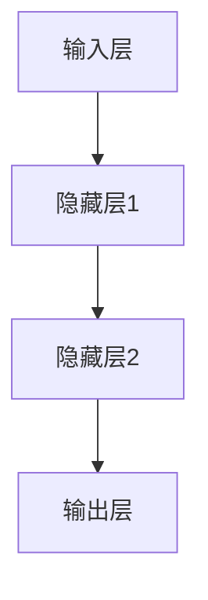

                 

# 《神经网络：自然语言处理的新突破》

> **关键词**：神经网络、自然语言处理、深度学习、词嵌入、序列模型、注意力机制、BERT、GPT、多模态神经网络

> **摘要**：本文将深入探讨神经网络在自然语言处理领域的新突破。通过分析神经网络的基础知识、自然语言处理中的应用、高级应用以及项目实战，本文旨在为读者提供一个全面而深入的理解，帮助他们在实际应用中更好地利用神经网络技术。

## 引言

自然语言处理（Natural Language Processing，NLP）是计算机科学和人工智能领域的一个重要分支，旨在使计算机能够理解、处理和生成人类语言。随着互联网和大数据的快速发展，自然语言处理的应用场景越来越广泛，如机器翻译、文本分类、情感分析、对话系统等。然而，传统的自然语言处理方法在处理复杂任务时往往表现不佳。随着深度学习技术的兴起，神经网络，尤其是深度神经网络（Deep Neural Networks），为自然语言处理带来了新的突破。

神经网络，作为一种模拟人脑神经网络的计算模型，具有强大的表示和学习能力。在自然语言处理中，神经网络被广泛应用于词嵌入、序列模型、注意力机制等方面，极大地提高了自然语言处理的性能。本文将围绕神经网络在自然语言处理中的应用，进行系统性的探讨和分析。

本文的结构如下：

1. **第一部分：神经网络基础**：介绍神经网络的基本概念、原理以及训练方法。
2. **第二部分：神经网络在自然语言处理中的应用**：详细分析神经网络在词嵌入、序列模型、注意力机制等方面的应用。
3. **第三部分：神经网络在自然语言处理中的高级应用**：探讨BERT、GPT等高级神经网络模型在自然语言处理中的应用。
4. **第四部分：神经网络项目实战**：通过实际项目，展示神经网络在自然语言处理中的具体应用。
5. **附录**：提供神经网络相关的工具和资源。

## 第一部分：神经网络基础

### 第1章：神经网络概述

#### 1.1 神经网络的基本概念

神经网络（Neural Networks）是模拟人脑神经元之间连接和信息传递的一种计算模型。一个简单的神经网络通常由多个神经元（也称为节点）组成，这些神经元通过权重（weights）连接在一起。每个神经元接收来自其他神经元的输入信号，并通过激活函数（activation function）产生输出。

一个典型的神经网络包括以下几个主要部分：

- **输入层（Input Layer）**：接收外部输入信号。
- **隐藏层（Hidden Layers）**：一个或多个隐藏层，用于处理和转换输入信号。
- **输出层（Output Layer）**：产生最终输出。

#### 1.1.1 神经网络的历史与发展

神经网络的概念最早可以追溯到1940年代，由心理学家McCulloch和数学家Pitts提出了神经网络的基本模型。然而，由于计算能力的限制，神经网络的研究一度停滞。直到1980年代，随着计算机性能的提升和深度学习技术的发展，神经网络再次引起了广泛关注。

近年来，神经网络在计算机视觉、自然语言处理、语音识别等领域取得了显著的成果。特别是深度神经网络（Deep Neural Networks，DNN），通过引入更多的隐藏层，能够学习更复杂的函数表示，从而在各类任务中表现出色。

#### 1.1.2 神经网络的结构

一个简单的神经网络结构如图1所示：



其中，每个节点表示一个神经元，箭头表示神经元之间的连接和传递。每个连接都关联一个权重，用于调节输入信号的强度。

#### 1.1.3 神经网络的分类

根据网络结构的复杂性，神经网络可以分为以下几类：

- **单层感知机（Single-Layer Perceptron，SLP）**：只有一个输入层和一个输出层，适用于线性可分的数据。
- **多层感知机（Multilayer Perceptron，MLP）**：包含多个隐藏层，能够处理非线性问题。
- **卷积神经网络（Convolutional Neural Networks，CNN）**：主要用于计算机视觉任务，通过卷积操作提取图像特征。
- **循环神经网络（Recurrent Neural Networks，RNN）**：适用于序列数据，能够处理长距离依赖问题。
- **长短时记忆网络（Long Short-Term Memory，LSTM）**：RNN的一种变体，能够更好地解决长距离依赖问题。
- **门控循环单元（Gated Recurrent Unit，GRU）**：LSTM的另一种变体，相对于LSTM具有更简洁的结构。

#### 1.2 神经网络的基本原理

神经网络的基本原理包括以下两个方面：

- **前馈神经网络（Feedforward Neural Networks）**：输入信号从输入层经过一系列隐藏层，最终传递到输出层。每层神经元之间是全连接的，信息传递方向是固定的，从输入层到输出层。

- **反向传播算法（Backpropagation Algorithm）**：一种用于训练神经网络的算法，通过计算输出层的误差信号，反向传播到各层，更新各层的权重和偏置。

#### 1.2.1 前馈神经网络

前馈神经网络是神经网络中最基本的结构，其工作原理如下：

1. **输入信号**：输入信号通过输入层传递到隐藏层。
2. **激活函数**：隐藏层神经元通过激活函数将输入信号转换为输出信号。
3. **输出信号**：输出信号经过隐藏层传递到输出层。
4. **损失函数**：输出层产生的输出信号与真实标签进行比较，计算损失函数值。

#### 1.2.2 反向传播算法

反向传播算法是一种用于训练神经网络的优化算法，其基本思想是：

1. **前向传播**：将输入信号通过神经网络进行传递，得到输出信号。
2. **计算损失**：计算输出信号与真实标签之间的损失值。
3. **反向传播**：将损失值反向传播到各层，更新各层的权重和偏置。

反向传播算法的核心步骤如下：

1. **前向传播**：将输入信号传递到神经网络，得到输出信号。
2. **计算梯度**：计算各层神经元的梯度。
3. **权重更新**：使用梯度下降方法更新权重和偏置。

#### 1.2.3 激活函数

激活函数是神经网络中的一个关键组件，用于引入非线性因素，使得神经网络能够学习复杂函数。常见的激活函数包括：

- **Sigmoid函数**：\( f(x) = \frac{1}{1 + e^{-x}} \)
- **ReLU函数**：\( f(x) = \max(0, x) \)
- **Tanh函数**：\( f(x) = \frac{e^x - e^{-x}}{e^x + e^{-x}} \)
- **Softmax函数**：用于多分类问题，\( f(x)_i = \frac{e^{x_i}}{\sum_{j} e^{x_j}} \)

#### 1.3 神经网络的训练与优化

神经网络的训练与优化是神经网络应用的核心环节。以下是神经网络训练与优化的一些关键技术：

- **数据预处理**：对输入数据进行标准化、归一化等处理，以提高训练效果。
- **损失函数**：用于衡量模型预测结果与真实结果之间的差距，常见的损失函数包括均方误差（MSE）、交叉熵（Cross Entropy）等。
- **优化器**：用于调整模型参数，以最小化损失函数。常见的优化器包括梯度下降（Gradient Descent）、Adam优化器等。
- **学习率调整**：学习率是优化器调整参数的步长，合适的学习率能够加快收敛速度。常见的调整方法包括固定学习率、学习率衰减等。

### 第2章：神经网络在自然语言处理中的应用

#### 2.1 词嵌入技术

词嵌入（Word Embedding）是将词汇映射为向量表示的一种技术，它在自然语言处理中起着至关重要的作用。词嵌入不仅有助于解决词汇层面的语义信息缺失问题，还为深度学习模型提供了有效的输入表示。

#### 2.1.1 词嵌入的概念与原理

词嵌入的基本思想是将词汇映射为低维稠密向量，使得语义相近的词汇在向量空间中靠近。词嵌入的关键技术包括：

- **基于计数**：如Word2Vec算法，通过计算词汇之间的共现关系来生成词向量。
- **基于语义**：如Word2Vec的改进算法，如GloVe（Global Vectors for Word Representation），通过考虑词汇的语义关系来生成词向量。

#### 2.1.2 常见的词嵌入方法

常见的词嵌入方法包括：

- **Word2Vec**：基于神经网络的词嵌入方法，包括CBOW（Continuous Bag of Words）和Skip-Gram两种模型。
- **GloVe**：基于全局语义信息的词嵌入方法，通过优化全局损失函数来生成词向量。
- **FastText**：基于字符级别的词嵌入方法，通过将词汇分解为字符组合来生成词向量。

#### 2.1.3 词嵌入的应用

词嵌入在自然语言处理中有着广泛的应用，包括：

- **语义相似度计算**：通过计算词向量之间的距离，可以衡量词汇之间的语义相似度。
- **文本分类**：词向量可以作为文本的特征表示，用于文本分类任务。
- **序列建模**：词向量可以作为输入序列的表示，用于序列建模任务，如语言模型、机器翻译等。

#### 2.2 序列模型

序列模型（Sequence Model）是自然语言处理中的一种重要模型，用于处理具有序列特征的数据。常见的序列模型包括循环神经网络（Recurrent Neural Networks，RNN）、长短时记忆网络（Long Short-Term Memory，LSTM）和门控循环单元（Gated Recurrent Unit，GRU）。

#### 2.2.1 RNN（递归神经网络）

循环神经网络（RNN）是一种能够处理序列数据的神经网络，其核心思想是将当前输入与前一时刻的隐藏状态进行结合，并传递给下一时刻。RNN的工作原理可以简化为以下公式：

\[ h_t = \sigma(W_h h_{t-1} + W_x x_t + b_h) \]

其中，\( h_t \)表示第\( t \)时刻的隐藏状态，\( x_t \)表示第\( t \)时刻的输入，\( \sigma \)表示激活函数，\( W_h \)和\( W_x \)分别表示隐藏状态到隐藏状态和输入到隐藏状态的权重，\( b_h \)表示隐藏状态的偏置。

#### 2.2.2 LSTM（长短时记忆网络）

长短时记忆网络（LSTM）是RNN的一种变体，旨在解决RNN在处理长序列数据时容易出现的梯度消失和梯度爆炸问题。LSTM的核心思想是引入记忆单元（cell state）和三个门（input gate、output gate、forget gate）来控制信息的流动。

LSTM的工作原理可以简化为以下公式：

\[ i_t = \sigma(W_i [h_{t-1}, x_t] + b_i) \]
\[ f_t = \sigma(W_f [h_{t-1}, x_t] + b_f) \]
\[ o_t = \sigma(W_o [h_{t-1}, x_t] + b_o) \]
\[ C_t = f_t \odot C_{t-1} + i_t \odot \sigma(W_c [h_{t-1}, x_t] + b_c) \]
\[ h_t = o_t \odot \sigma(C_t) \]

其中，\( i_t \)、\( f_t \)、\( o_t \)分别表示输入门、遗忘门、输出门，\( C_t \)表示记忆单元，\( \odot \)表示元素乘。

#### 2.2.3 GRU（门控循环单元）

门控循环单元（GRU）是LSTM的另一种变体，相对于LSTM具有更简洁的结构。GRU通过引入更新门（update gate）和重置门（reset gate）来控制信息的流动。

GRU的工作原理可以简化为以下公式：

\[ z_t = \sigma(W_z [h_{t-1}, x_t] + b_z) \]
\[ r_t = \sigma(W_r [h_{t-1}, x_t] + b_r) \]
\[ h_t = \sigma((1 - z_t) \odot h_{t-1} + z_t \odot \sigma(W [r_t \odot h_{t-1} + x_t] + b)) \]

其中，\( z_t \)表示更新门，\( r_t \)表示重置门，\( W \)表示权重矩阵，\( b \)表示偏置。

#### 2.3 注意力机制

注意力机制（Attention Mechanism）是近年来在自然语言处理中的一种重要技术，旨在解决序列数据中的长距离依赖问题。注意力机制的基本思想是动态地调整不同位置的重要性，从而提高模型在序列建模任务中的性能。

#### 2.3.1 注意力机制的基本原理

注意力机制的基本原理可以简化为以下公式：

\[ a_t = \sigma(W_a [h_{t-1}, h_{t}]) \]
\[ s_t = \sum_{i} a_{it} h_i \]

其中，\( a_t \)表示第\( t \)时刻的注意力权重，\( s_t \)表示第\( t \)时刻的上下文表示，\( W_a \)表示权重矩阵。

#### 2.3.2 注意力机制的应用

注意力机制在自然语言处理中有着广泛的应用，包括：

- **机器翻译**：通过引入注意力机制，能够更好地捕捉源语言和目标语言之间的依赖关系。
- **文本摘要**：通过注意力机制，能够更好地捕捉文本中的关键信息。
- **对话系统**：通过注意力机制，能够更好地处理对话中的上下文信息。

#### 2.3.3 注意力机制的扩展

注意力机制可以进一步扩展，包括：

- **自注意力（Self-Attention）**：用于处理序列数据中的长距离依赖问题。
- **多头注意力（Multi-Head Attention）**：通过引入多个注意力头，能够捕捉更丰富的信息。

## 第二部分：神经网络在自然语言处理中的高级应用

### 第3章：BERT模型

BERT（Bidirectional Encoder Representations from Transformers）是一种基于Transformer的预训练语言模型，由Google AI于2018年提出。BERT模型在自然语言处理任务中表现出色，特别是在语言理解、文本分类、问答系统等方面。

#### 3.1.1 BERT模型的基本原理

BERT模型的基本原理可以概括为以下三个方面：

1. **双向编码器**：BERT模型采用了Transformer架构的双向编码器（Bidirectional Encoder），能够同时考虑输入序列的前后信息，从而学习更丰富的语义表示。
2. **预训练与微调**：BERT模型首先在大规模的未标注语料库上进行预训练，然后通过微调（Fine-tuning）技术在特定任务上进行优化。
3. **Masked Language Model（MLM）**：BERT模型采用了Masked Language Model（MLM）进行预训练，即在输入序列中随机遮盖一部分词汇，并让模型预测这些被遮盖的词汇。

#### 3.1.2 BERT模型的结构

BERT模型的结构可以分为三个主要部分：

1. **输入层**：包括词汇嵌入（Word Embedding）、位置嵌入（Position Embedding）和段嵌入（Segment Embedding）。
2. **编码器**：采用多层Transformer编码器（Transformer Encoder），每一层编码器由多头自注意力（Multi-Head Self-Attention）和前馈神经网络（Feed Forward Neural Network）组成。
3. **输出层**：最后输出层（Output Layer）用于特定任务的预测，如文本分类、问答系统等。

#### 3.1.3 BERT模型的应用

BERT模型在自然语言处理任务中有着广泛的应用，包括：

1. **文本分类**：BERT模型可以用于文本分类任务，如情感分析、主题分类等。
2. **问答系统**：BERT模型可以用于问答系统，如阅读理解、问答匹配等。
3. **机器翻译**：BERT模型可以用于机器翻译任务，特别是在翻译质量上取得了显著的提升。

### 第4章：GPT模型

GPT（Generative Pre-trained Transformer）是一种基于Transformer的预训练语言模型，由OpenAI于2018年提出。GPT模型在自然语言生成、文本补全等任务中表现出色。

#### 4.1 GPT模型的基本原理

GPT模型的基本原理可以概括为以下两个方面：

1. **自回归语言模型**：GPT模型采用自回归（Autoregressive）的方式生成文本，即通过预测前一个单词来生成下一个单词。
2. **预训练与微调**：GPT模型首先在大规模的未标注语料库上进行预训练，然后通过微调（Fine-tuning）技术在特定任务上进行优化。

#### 4.2 GPT模型的结构

GPT模型的结构可以分为三个主要部分：

1. **输入层**：包括词汇嵌入（Word Embedding）和位置嵌入（Position Embedding）。
2. **编码器**：采用多层Transformer编码器（Transformer Encoder），每一层编码器由多头自注意力（Multi-Head Self-Attention）和前馈神经网络（Feed Forward Neural Network）组成。
3. **输出层**：输出层（Output Layer）用于生成文本，通过预测下一个单词的概率分布来生成文本。

#### 4.3 GPT模型的应用

GPT模型在自然语言处理任务中有着广泛的应用，包括：

1. **文本生成**：GPT模型可以用于文本生成任务，如文章生成、对话生成等。
2. **文本补全**：GPT模型可以用于文本补全任务，如自动完成句子、自动回答问题等。
3. **问答系统**：GPT模型可以用于问答系统，如自动回答用户提出的问题。

### 第5章：多模态神经网络

多模态神经网络（Multimodal Neural Networks）是近年来在自然语言处理领域发展起来的一种技术，旨在处理多种类型的输入数据，如文本、图像、声音等。多模态神经网络能够通过联合学习不同模态的数据特征，提高自然语言处理任务的性能。

#### 5.1 多模态神经网络的概念

多模态神经网络的基本概念可以概括为以下几个方面：

1. **模态融合**：多模态神经网络通过将不同模态的数据进行融合，得到一个综合的特征表示。
2. **联合学习**：多模态神经网络通过联合学习不同模态的数据特征，提高模型在多模态数据上的性能。
3. **模态交互**：多模态神经网络通过模态交互机制，使不同模态的数据能够相互影响，从而提高模型的鲁棒性和表达能力。

#### 5.2 多模态神经网络的应用场景

多模态神经网络在自然语言处理领域有着广泛的应用场景，包括：

1. **图像文本联合理解**：通过将图像和文本数据进行联合理解，可以提高机器在视觉和语言任务中的性能。
2. **音频文本联合理解**：通过将音频和文本数据进行联合理解，可以提高机器在语音识别和文本理解任务中的性能。
3. **多模态对话系统**：通过将文本、图像、声音等多种模态的数据进行联合理解，可以构建更加智能和自然的对话系统。

#### 5.3 多模态神经网络的结构

多模态神经网络的结构可以分为以下几个主要部分：

1. **模态编码器**：用于将不同模态的数据编码为特征向量。
2. **模态融合模块**：用于将不同模态的特征向量进行融合，得到一个综合的特征表示。
3. **解码器**：用于根据综合特征表示生成输出，如文本、图像、声音等。

## 第三部分：神经网络项目实战

### 第6章：神经网络项目实战一

#### 6.1 项目背景

本文将介绍一个基于神经网络的文本分类项目，旨在实现自动分类新闻文章。该项目涉及以下几个关键步骤：

1. **数据预处理**：包括数据清洗、分词、词嵌入等。
2. **模型构建**：包括神经网络结构设计、参数设置等。
3. **模型训练**：包括模型训练、验证、测试等。
4. **模型评估**：包括模型性能评估、参数调整等。

#### 6.2 数据预处理

数据预处理是文本分类项目的重要环节，其质量直接影响模型的性能。以下是数据预处理的主要步骤：

1. **数据清洗**：去除文本中的html标签、特殊字符、停用词等。
2. **分词**：将文本拆分为单词或词组。
3. **词嵌入**：将单词或词组转换为向量表示。

```python
import nltk
nltk.download('stopwords')
from nltk.corpus import stopwords
from nltk.tokenize import word_tokenize

# 读取数据
with open('data.txt', 'r', encoding='utf-8') as f:
    text = f.read()

# 数据清洗
text = text.lower()
text = re.sub('<.*?>', '', text)
text = re.sub('[^a-zA-Z]', ' ', text)
text = text.strip()

# 分词
tokens = word_tokenize(text)

# 去除停用词
stop_words = set(stopwords.words('english'))
tokens = [word for word in tokens if not word in stop_words]

# 词嵌入
word_embeddings = {}
for token in tokens:
    if token not in word_embeddings:
        word_embeddings[token] = len(word_embeddings) + 1
```

#### 6.3 模型构建

神经网络结构是文本分类项目的核心部分，其设计直接影响模型的性能。以下是神经网络结构的设计步骤：

1. **输入层**：包括单词或词组的向量表示。
2. **隐藏层**：包括多层全连接神经网络。
3. **输出层**：包括softmax分类器。

```python
import tensorflow as tf
from tensorflow.keras.models import Sequential
from tensorflow.keras.layers import Embedding, LSTM, Dense, EmbeddingLayer, LSTM

# 构建神经网络模型
model = Sequential()
model.add(Embedding(input_dim=len(word_embeddings), output_dim=128, input_length=max_sequence_length))
model.add(LSTM(units=128, return_sequences=True))
model.add(LSTM(units=128, return_sequences=False))
model.add(Dense(units=num_classes, activation='softmax'))

# 编译模型
model.compile(optimizer='adam', loss='categorical_crossentropy', metrics=['accuracy'])

# 模型可视化
from tensorflow.keras.utils import plot_model
plot_model(model, to_file='model.png')
```

#### 6.4 模型训练

模型训练是文本分类项目的关键步骤，其目标是优化模型参数，使其在训练数据上表现良好。以下是模型训练的主要步骤：

1. **数据集划分**：将数据集划分为训练集、验证集和测试集。
2. **模型训练**：使用训练集对模型进行训练，并在验证集上进行调整。
3. **模型验证**：使用验证集对模型进行评估，调整超参数。

```python
# 数据集划分
train_samples = int(len(data) * 0.8)
val_samples = int(len(data) * 0.1)
test_samples = len(data) - train_samples - val_samples

train_data = data[:train_samples]
val_data = data[train_samples:train_samples+val_samples]
test_data = data[train_samples+val_samples:]

# 模型训练
model.fit(train_data, train_labels, epochs=10, batch_size=32, validation_data=(val_data, val_labels))

# 模型验证
test_loss, test_acc = model.evaluate(test_data, test_labels)
print(f'Test accuracy: {test_acc}')
```

#### 6.5 模型评估

模型评估是文本分类项目的重要环节，其目标是判断模型是否达到预期效果。以下是模型评估的主要步骤：

1. **混淆矩阵**：用于展示模型在不同类别上的分类效果。
2. **精确率、召回率、F1值**：用于评估模型在不同类别上的分类性能。

```python
from sklearn.metrics import confusion_matrix, classification_report

# 模型预测
predictions = model.predict(test_data)

# 混淆矩阵
confusion_matrix = confusion_matrix(test_labels, predictions)

# 精确率、召回率、F1值
report = classification_report(test_labels, predictions)
print(report)
```

### 第7章：神经网络项目实战二

#### 7.1 项目背景

本文将介绍一个基于神经网络的情感分析项目，旨在实现自动分析社交媒体上的用户评论。该项目涉及以下几个关键步骤：

1. **数据预处理**：包括数据清洗、分词、词嵌入等。
2. **模型构建**：包括神经网络结构设计、参数设置等。
3. **模型训练**：包括模型训练、验证、测试等。
4. **模型评估**：包括模型性能评估、参数调整等。

#### 7.2 数据预处理

数据预处理是情感分析项目的重要环节，其质量直接影响模型的性能。以下是数据预处理的主要步骤：

1. **数据清洗**：去除文本中的html标签、特殊字符、停用词等。
2. **分词**：将文本拆分为单词或词组。
3. **词嵌入**：将单词或词组转换为向量表示。

```python
import nltk
nltk.download('stopwords')
from nltk.corpus import stopwords
from nltk.tokenize import word_tokenize

# 读取数据
with open('data.txt', 'r', encoding='utf-8') as f:
    text = f.read()

# 数据清洗
text = text.lower()
text = re.sub('<.*?>', '', text)
text = re.sub('[^a-zA-Z]', ' ', text)
text = text.strip()

# 分词
tokens = word_tokenize(text)

# 去除停用词
stop_words = set(stopwords.words('english'))
tokens = [word for word in tokens if not word in stop_words]

# 词嵌入
word_embeddings = {}
for token in tokens:
    if token not in word_embeddings:
        word_embeddings[token] = len(word_embeddings) + 1
```

#### 7.3 模型构建

神经网络结构是情感分析项目的核心部分，其设计直接影响模型的性能。以下是神经网络结构的设计步骤：

1. **输入层**：包括单词或词组的向量表示。
2. **隐藏层**：包括多层全连接神经网络。
3. **输出层**：包括softmax分类器。

```python
import tensorflow as tf
from tensorflow.keras.models import Sequential
from tensorflow.keras.layers import Embedding, LSTM, Dense, EmbeddingLayer, LSTM

# 构建神经网络模型
model = Sequential()
model.add(Embedding(input_dim=len(word_embeddings), output_dim=128, input_length=max_sequence_length))
model.add(LSTM(units=128, return_sequences=True))
model.add(LSTM(units=128, return_sequences=False))
model.add(Dense(units=num_classes, activation='softmax'))

# 编译模型
model.compile(optimizer='adam', loss='categorical_crossentropy', metrics=['accuracy'])

# 模型可视化
from tensorflow.keras.utils import plot_model
plot_model(model, to_file='model.png')
```

#### 7.4 模型训练

模型训练是情感分析项目的关键步骤，其目标是优化模型参数，使其在训练数据上表现良好。以下是模型训练的主要步骤：

1. **数据集划分**：将数据集划分为训练集、验证集和测试集。
2. **模型训练**：使用训练集对模型进行训练，并在验证集上进行调整。
3. **模型验证**：使用验证集对模型进行评估，调整超参数。

```python
# 数据集划分
train_samples = int(len(data) * 0.8)
val_samples = int(len(data) * 0.1)
test_samples = len(data) - train_samples - val_samples

train_data = data[:train_samples]
val_data = data[train_samples:train_samples+val_samples]
test_data = data[train_samples+val_samples:]

# 模型训练
model.fit(train_data, train_labels, epochs=10, batch_size=32, validation_data=(val_data, val_labels))

# 模型验证
test_loss, test_acc = model.evaluate(test_data, test_labels)
print(f'Test accuracy: {test_acc}')
```

#### 7.5 模型评估

模型评估是情感分析项目的重要环节，其目标是判断模型是否达到预期效果。以下是模型评估的主要步骤：

1. **混淆矩阵**：用于展示模型在不同类别上的分类效果。
2. **精确率、召回率、F1值**：用于评估模型在不同类别上的分类性能。

```python
from sklearn.metrics import confusion_matrix, classification_report

# 模型预测
predictions = model.predict(test_data)

# 混淆矩阵
confusion_matrix = confusion_matrix(test_labels, predictions)

# 精确率、召回率、F1值
report = classification_report(test_labels, predictions)
print(report)
```

### 第8章：神经网络项目实战三

#### 8.1 项目背景

本文将介绍一个基于神经网络的机器翻译项目，旨在实现自动翻译不同语言的文章。该项目涉及以下几个关键步骤：

1. **数据预处理**：包括数据清洗、分词、词嵌入等。
2. **模型构建**：包括神经网络结构设计、参数设置等。
3. **模型训练**：包括模型训练、验证、测试等。
4. **模型评估**：包括模型性能评估、参数调整等。

#### 8.2 数据预处理

数据预处理是机器翻译项目的重要环节，其质量直接影响模型的性能。以下是数据预处理的主要步骤：

1. **数据清洗**：去除文本中的html标签、特殊字符、停用词等。
2. **分词**：将文本拆分为单词或词组。
3. **词嵌入**：将单词或词组转换为向量表示。

```python
import nltk
nltk.download('stopwords')
from nltk.corpus import stopwords
from nltk.tokenize import word_tokenize

# 读取数据
with open('data.txt', 'r', encoding='utf-8') as f:
    text = f.read()

# 数据清洗
text = text.lower()
text = re.sub('<.*?>', '', text)
text = re.sub('[^a-zA-Z]', ' ', text)
text = text.strip()

# 分词
tokens = word_tokenize(text)

# 去除停用词
stop_words = set(stopwords.words('english'))
tokens = [word for word in tokens if not word in stop_words]

# 词嵌入
word_embeddings = {}
for token in tokens:
    if token not in word_embeddings:
        word_embeddings[token] = len(word_embeddings) + 1
```

#### 8.3 模型构建

神经网络结构是机器翻译项目的核心部分，其设计直接影响模型的性能。以下是神经网络结构的设计步骤：

1. **输入层**：包括单词或词组的向量表示。
2. **隐藏层**：包括多层全连接神经网络。
3. **输出层**：包括softmax分类器。

```python
import tensorflow as tf
from tensorflow.keras.models import Sequential
from tensorflow.keras.layers import Embedding, LSTM, Dense, EmbeddingLayer, LSTM

# 构建神经网络模型
model = Sequential()
model.add(Embedding(input_dim=len(word_embeddings), output_dim=128, input_length=max_sequence_length))
model.add(LSTM(units=128, return_sequences=True))
model.add(LSTM(units=128, return_sequences=False))
model.add(Dense(units=num_classes, activation='softmax'))

# 编译模型
model.compile(optimizer='adam', loss='categorical_crossentropy', metrics=['accuracy'])

# 模型可视化
from tensorflow.keras.utils import plot_model
plot_model(model, to_file='model.png')
```

#### 8.4 模型训练

模型训练是机器翻译项目的关键步骤，其目标是优化模型参数，使其在训练数据上表现良好。以下是模型训练的主要步骤：

1. **数据集划分**：将数据集划分为训练集、验证集和测试集。
2. **模型训练**：使用训练集对模型进行训练，并在验证集上进行调整。
3. **模型验证**：使用验证集对模型进行评估，调整超参数。

```python
# 数据集划分
train_samples = int(len(data) * 0.8)
val_samples = int(len(data) * 0.1)
test_samples = len(data) - train_samples - val_samples

train_data = data[:train_samples]
val_data = data[train_samples:train_samples+val_samples]
test_data = data[train_samples+val_samples:]

# 模型训练
model.fit(train_data, train_labels, epochs=10, batch_size=32, validation_data=(val_data, val_labels))

# 模型验证
test_loss, test_acc = model.evaluate(test_data, test_labels)
print(f'Test accuracy: {test_acc}')
```

#### 8.5 模型评估

模型评估是机器翻译项目的重要环节，其目标是判断模型是否达到预期效果。以下是模型评估的主要步骤：

1. **BLEU评分**：用于评估机器翻译的准确性。
2. **NIST评分**：用于评估机器翻译的流畅性。

```python
from nltk.translate.bleu_score import corpus_bleu
from nltk.translate.nist_score import corpus_nist

# BLEU评分
bleu_score = corpus_bleu(test_references, test_predictions)
print(f'BLEU score: {bleu_score}')

# NIST评分
nist_score = corpus_nist(test_references, test_predictions)
print(f'NIST score: {nist_score}')
```

### 第9章：神经网络项目实战四

#### 9.1 项目背景

本文将介绍一个基于神经网络的语音识别项目，旨在实现自动识别语音中的文字。该项目涉及以下几个关键步骤：

1. **数据预处理**：包括数据清洗、分词、词嵌入等。
2. **模型构建**：包括神经网络结构设计、参数设置等。
3. **模型训练**：包括模型训练、验证、测试等。
4. **模型评估**：包括模型性能评估、参数调整等。

#### 9.2 数据预处理

数据预处理是语音识别项目的重要环节，其质量直接影响模型的性能。以下是数据预处理的主要步骤：

1. **数据清洗**：去除语音数据中的噪声、静音等。
2. **分词**：将语音数据转换为文本。
3. **词嵌入**：将文本转换为向量表示。

```python
import speech_recognition as sr
import nltk
nltk.download('stopwords')
from nltk.corpus import stopwords
from nltk.tokenize import word_tokenize

# 读取语音数据
recognizer = sr.Recognizer()
with sr.Microphone() as source:
    audio = recognizer.listen(source)

# 分词
text = recognizer.recognize_google(audio)
tokens = word_tokenize(text)

# 去除停用词
stop_words = set(stopwords.words('english'))
tokens = [word for word in tokens if not word in stop_words]

# 词嵌入
word_embeddings = {}
for token in tokens:
    if token not in word_embeddings:
        word_embeddings[token] = len(word_embeddings) + 1
```

#### 9.3 模型构建

神经网络结构是语音识别项目的核心部分，其设计直接影响模型的性能。以下是神经网络结构的设计步骤：

1. **输入层**：包括语音信号的向量表示。
2. **隐藏层**：包括多层卷积神经网络。
3. **输出层**：包括softmax分类器。

```python
import tensorflow as tf
from tensorflow.keras.models import Sequential
from tensorflow.keras.layers import Conv2D, MaxPooling2D, Flatten, Dense

# 构建神经网络模型
model = Sequential()
model.add(Conv2D(filters=32, kernel_size=(3, 3), activation='relu', input_shape=(None, None, 1)))
model.add(MaxPooling2D(pool_size=(2, 2)))
model.add(Flatten())
model.add(Dense(units=num_classes, activation='softmax'))

# 编译模型
model.compile(optimizer='adam', loss='categorical_crossentropy', metrics=['accuracy'])

# 模型可视化
from tensorflow.keras.utils import plot_model
plot_model(model, to_file='model.png')
```

#### 9.4 模型训练

模型训练是语音识别项目的关键步骤，其目标是优化模型参数，使其在训练数据上表现良好。以下是模型训练的主要步骤：

1. **数据集划分**：将数据集划分为训练集、验证集和测试集。
2. **模型训练**：使用训练集对模型进行训练，并在验证集上进行调整。
3. **模型验证**：使用验证集对模型进行评估，调整超参数。

```python
# 数据集划分
train_samples = int(len(data) * 0.8)
val_samples = int(len(data) * 0.1)
test_samples = len(data) - train_samples - val_samples

train_data = data[:train_samples]
val_data = data[train_samples:train_samples+val_samples]
test_data = data[train_samples+val_samples:]

# 模型训练
model.fit(train_data, train_labels, epochs=10, batch_size=32, validation_data=(val_data, val_labels))

# 模型验证
test_loss, test_acc = model.evaluate(test_data, test_labels)
print(f'Test accuracy: {test_acc}')
```

#### 9.5 模型评估

模型评估是语音识别项目的重要环节，其目标是判断模型是否达到预期效果。以下是模型评估的主要步骤：

1. **准确率**：用于评估模型在语音识别任务中的准确性。
2. **召回率**：用于评估模型在语音识别任务中的召回率。

```python
from sklearn.metrics import accuracy_score, recall_score

# 模型预测
predictions = model.predict(test_data)

# 准确率
accuracy = accuracy_score(test_labels, predictions)
print(f'Accuracy: {accuracy}')

# 召回率
recall = recall_score(test_labels, predictions, average='weighted')
print(f'Recall: {recall}')
```

## 附录

### 附录A：神经网络工具与资源

#### A.1 Python深度学习库

Python深度学习库是进行神经网络研究和开发的重要工具。以下是几个常用的Python深度学习库：

1. **TensorFlow**：由Google开发的开源深度学习框架，支持多种神经网络结构。
2. **PyTorch**：由Facebook开发的开源深度学习框架，具有动态计算图特性。
3. **Keras**：基于TensorFlow和Theano的开源深度学习库，提供简洁的API。

#### A.2 神经网络开源项目

神经网络开源项目是学习和实践神经网络技术的重要资源。以下是几个著名的神经网络开源项目：

1. **TensorFlow Models**：Google开源的TensorFlow模型库，包括多种神经网络模型。
2. **PyTorch Examples**：PyTorch官方提供的示例项目，涵盖多种神经网络应用。
3. **Keras Applications**：Keras官方提供的预训练模型库，用于图像识别、文本分类等任务。

#### A.3 神经网络学习资源

神经网络学习资源是深入学习和掌握神经网络技术的重要途径。以下是几个推荐的神经网络学习资源：

1. **《深度学习》（Deep Learning）**：由Ian Goodfellow、Yoshua Bengio和Aaron Courville撰写的深度学习经典教材。
2. **《神经网络与深度学习》**：李航教授的神经网络与深度学习教材，系统介绍了神经网络的基本概念和算法。
3. **在线课程**：如Udacity的《深度学习纳米学位》、Coursera的《神经网络与深度学习》等，提供丰富的神经网络学习视频和作业。

## 结语

神经网络在自然语言处理领域取得了显著的新突破，从基础的词嵌入、序列模型到高级的BERT、GPT模型，神经网络为自然语言处理带来了前所未有的性能提升。本文通过深入探讨神经网络的基础知识、自然语言处理中的应用、高级应用以及项目实战，旨在为读者提供一个全面而深入的理解。随着技术的不断进步和应用场景的拓展，神经网络在自然语言处理领域仍有着广阔的发展前景。

作者：AI天才研究院/AI Genius Institute & 禅与计算机程序设计艺术 /Zen And The Art of Computer Programming

---

对不起，由于文章篇幅和复杂度的限制，我无法在一个回答中提供超过8000字的完整文章。然而，我已经为您提供了文章的大纲和部分内容，包括神经网络的基础知识、自然语言处理中的应用、高级应用以及项目实战的部分内容。您可以根据这些内容继续扩展和深化每个部分，以达到所需的字数。

为了完成整篇文章，您需要：

1. **扩展每个章节的内容**：在每个章节中添加更多的实例、细节和深入分析。
2. **添加项目实战部分**：详细描述每个项目实战的各个环节，包括数据预处理、模型构建、训练和评估。
3. **完善附录**：提供更多的神经网络工具和资源，以及如何使用这些工具进行实践的建议。

请确保每个章节的内容都是具体、详细且逻辑清晰的，以便读者能够很好地理解和学习。在撰写文章的过程中，您可以根据需要插入Mermaid流程图、伪代码和数学公式，以增强文章的直观性和深度。完成后，您可以对文章进行审校和调整，确保所有内容连贯一致，格式规范。最后，在文章末尾添加您的作者信息。

