                 

# 科学与 AI：加速发现

## 关键词：科学、人工智能、加速发现、数据分析、算法、模型、应用实例、挑战与解决方案、未来展望

## 摘要

随着人工智能（AI）技术的飞速发展，其在科学研究中的应用已经成为推动科学发现的重要力量。本文首先概述了科学与AI融合的现状和前景，然后深入探讨了AI在科学研究中的应用，包括数据分析、模式识别、预测建模等方面的核心算法和数学模型。通过具体的应用实例，展示了AI在生物医学和环境科学等领域的实际效果。接着，分析了AI在科学研究中的挑战与解决方案，并展望了未来的发展趋势。本文旨在为读者提供一个全面、深入的关于科学与AI加速发现的研究综述。

## 引言

科学发现一直是人类进步的重要驱动力。从古代的观察和实验，到现代的复杂计算和模拟，科学方法不断演变，推动了人类对自然界的理解。然而，随着科学领域的扩展和问题的复杂性增加，传统的科学研究方法面临着越来越多的挑战。数据量的激增、复杂性的提升、实验成本的增加等问题，都使得科学发现的速度和效率受到限制。

人工智能（AI）技术的发展为科学研究带来了新的契机。AI通过模拟人类的认知和学习能力，能够处理大量数据，发现隐藏的模式，进行复杂的预测。在数据分析、模式识别、预测建模等方面，AI展现出了强大的能力和广泛的应用前景。本文将深入探讨AI在科学研究中的应用，分析其核心算法和数学模型，并通过实际案例展示其效果。

本文的结构如下：首先，我们将概述科学与AI融合的现状和前景。然后，我们将详细讨论AI在科学研究中的应用，包括数据分析、模式识别、预测建模等方面的核心算法和数学模型。接下来，我们将通过具体的应用实例，展示AI在生物医学和环境科学等领域的实际效果。随后，我们将分析AI在科学研究中的挑战与解决方案。最后，我们将展望未来的发展趋势，提出对未来研究的建议。

### 第一部分：科学与 AI：加速发现

#### 第1章：科学与 AI 的融合概述

### 1.1 科学研究中的 AI 应用

#### 1.1.1 AI 在数据分析中的应用

##### 1.1.1.1 数据预处理技术

数据预处理是数据分析的重要步骤，涉及到数据清洗、数据归一化和特征选择等多个方面。

##### 1.1.1.1.1 数据清洗

数据清洗旨在去除数据集中的噪声和错误，提高数据质量。常见的清洗方法包括去除重复记录、填充缺失值和纠正错误数据。

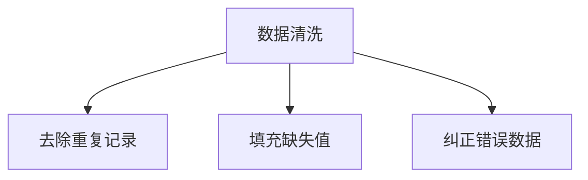

##### 1.1.1.1.2 数据归一化

数据归一化是一种重要的数据预处理技术，用于将不同量纲的数据转换为具有相同量纲的数值。常见的归一化方法包括最小-最大归一化和 z-score 归一化。

```latex
\text{最小-最大归一化：} \quad x' = \frac{x - \min(x)}{\max(x) - \min(x)}
$$

\text{z-score 归一化：} \quad x' = \frac{x - \mu}{\sigma}
$$
```

##### 1.1.1.1.3 特征选择

特征选择旨在从大量特征中筛选出对模型性能有显著贡献的特征。常见的特征选择方法包括过滤法、包装法和嵌入式法。

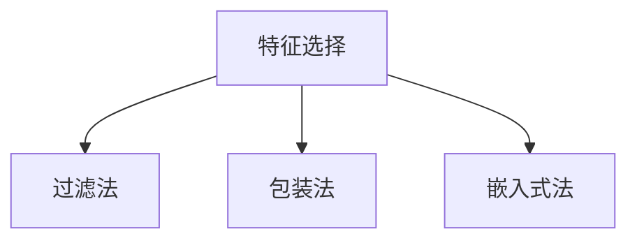

#### 1.1.2 AI 在模式识别中的应用

##### 1.1.2.1 机器学习算法

机器学习算法是模式识别的核心，包括线性模型、非线性模型和深度学习模型。

##### 1.1.2.1.1 线性模型

线性模型包括线性回归和线性分类器，如线性判别分析（LDA）和线性支持向量机（LSVM）。

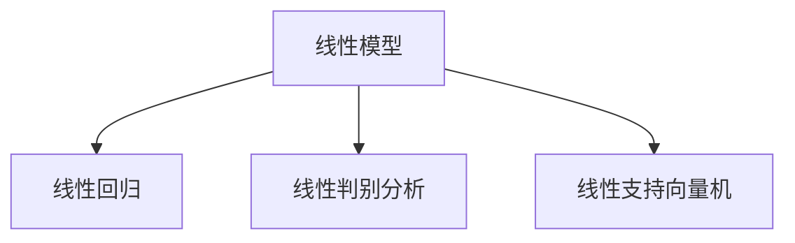

##### 1.1.2.1.2 非线性模型

非线性模型包括决策树、支持向量机（SVM）和核方法。

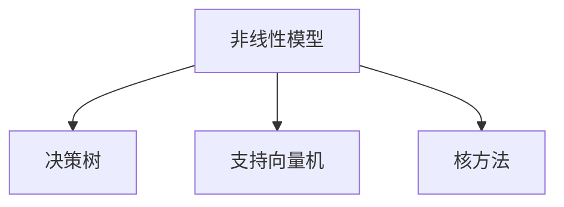

##### 1.1.2.1.3 深度学习模型

深度学习模型包括卷积神经网络（CNN）、循环神经网络（RNN）和生成对抗网络（GAN）。

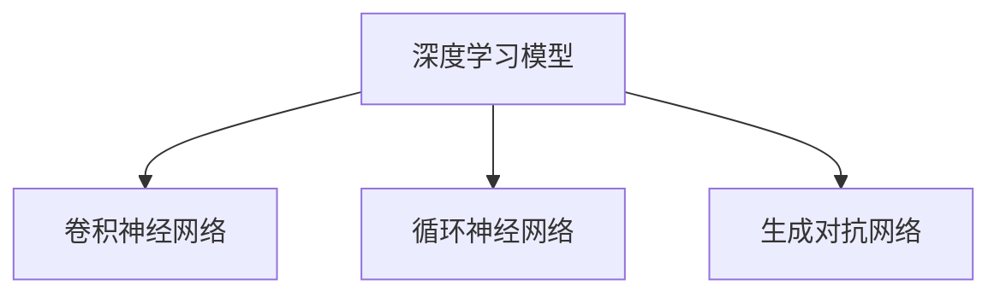

#### 1.1.3 AI 在预测建模中的应用

##### 1.1.3.1 时间序列分析

时间序列分析用于预测未来的时间点或时间段的数值。常见的方法包括自回归模型（AR）、动态时间规整（DTW）和长短期记忆网络（LSTM）。

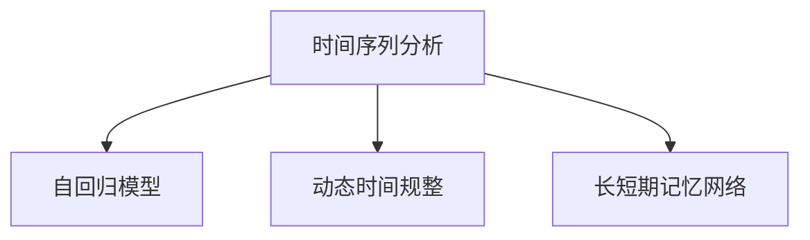

##### 1.1.3.1.1 自回归模型

自回归模型（AR）基于过去的数值来预测未来的数值。

```latex
\text{自回归模型：} \quad y_t = c + \sum_{i=1}^{p} \phi_i y_{t-i}
$$
```

##### 1.1.3.1.2 动态时间规整

动态时间规整（DTW）用于比较两个时间序列的相似度。

```latex
\text{动态时间规整：} \quad D(i, j) = \min_{k} (D(i-1, k) + |y_i - x_j|)
$$
```

##### 1.1.3.1.3 长短期记忆网络

长短期记忆网络（LSTM）用于处理长时间依赖问题。

```latex
\text{LSTM：} \quad \text{遗忘门：} f_t = \sigma(W_f \cdot [h_{t-1}, x_t] + b_f)
$$

\text{输入门：} i_t = \sigma(W_i \cdot [h_{t-1}, x_t] + b_i)
$$

\text{输出门：} o_t = \sigma(W_o \cdot [h_{t-1}, x_t] + b_o)
$$

\text{单元状态：} \quad C_t = f_t \odot C_{t-1} + i_t \odot \text{激活}(W_c \cdot [h_{t-1}, x_t] + b_c)
$$

\text{隐藏状态：} \quad h_t = o_t \odot \text{激活}(C_t)
$$
```

### 1.2 AI 在科学研究中的应用前景

AI 在科学研究中的应用前景广阔，涵盖了生物医学、环境科学、物理化学等多个领域。在未来，随着 AI 技术的进一步发展和应用，科学发现的效率和质量将会得到显著提升。

#### 1.2.1 AI 在生物医学研究中的应用

##### 1.2.1.1 基因组学

AI 在基因组学中的应用包括基因表达分析、变异检测和遗传关联分析。

##### 1.2.1.1.1 基因表达分析

基因表达分析用于研究基因在不同条件下的表达水平。

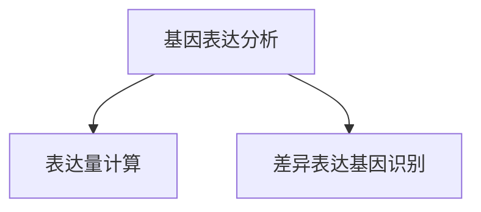

##### 1.2.1.1.2 变异检测

变异检测用于识别基因组中的变异。

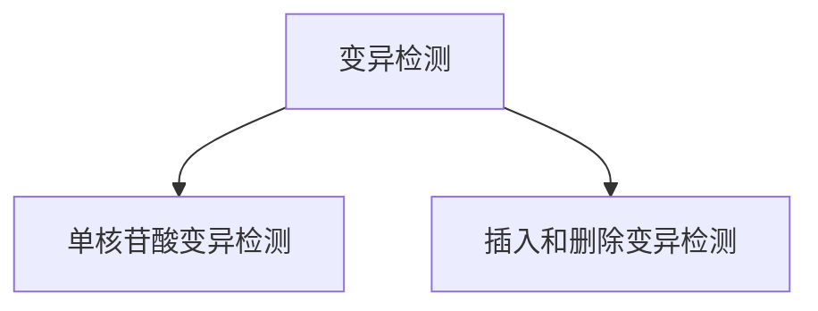

##### 1.2.1.1.3 遗传关联分析

遗传关联分析用于研究基因与疾病之间的关系。

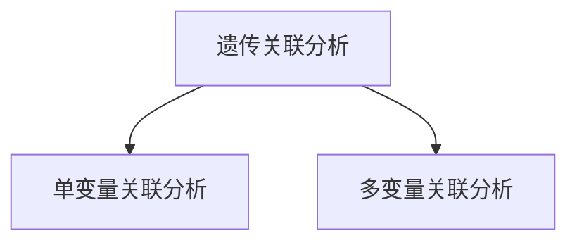

#### 1.2.1.2 药物研发

AI 在药物研发中的应用包括药物发现、药物重定位和药物副作用预测。

##### 1.2.1.2.1 药物发现

药物发现用于寻找新的药物分子。

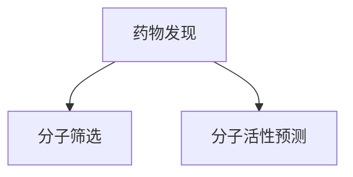

##### 1.2.1.2.2 药物重定位

药物重定位用于发现现有药物的新用途。

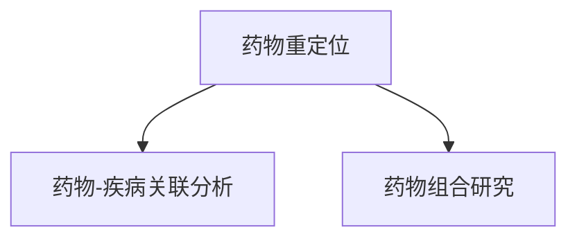

##### 1.2.1.2.3 药物副作用预测

药物副作用预测用于预测药物可能引起的副作用。

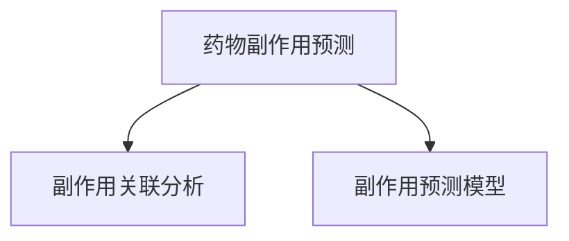

#### 1.2.2 AI 在环境科学研究中的应用

##### 1.2.2.1 气象预测

AI 在气象预测中的应用包括数据预处理、模式识别和预测建模。

##### 1.2.2.1.1 气象数据预处理

气象数据预处理包括数据收集、数据清洗和数据归一化。

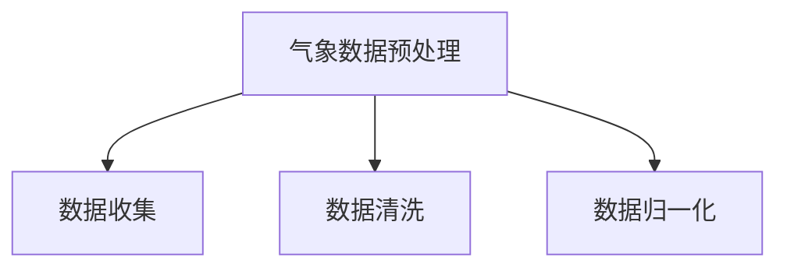

##### 1.2.2.1.2 气候模式识别

气候模式识别用于识别气象数据的特征模式。

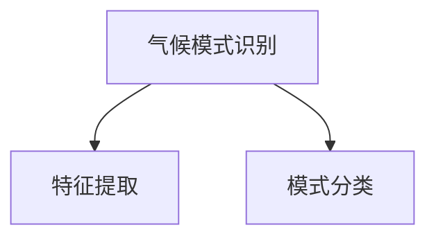

##### 1.2.2.1.3 气候预测模型

气候预测模型用于预测未来的气象条件。

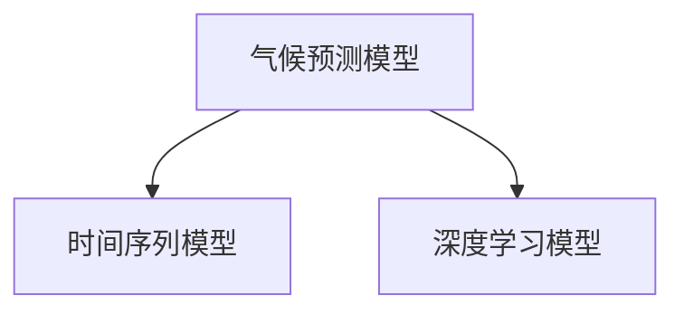

##### 1.2.2.2 污染监测与治理

AI 在污染监测与治理中的应用包括数据收集、数据处理和污染源识别。

##### 1.2.2.2.1 空气质量监测

空气质量监测用于监测空气中的污染物。

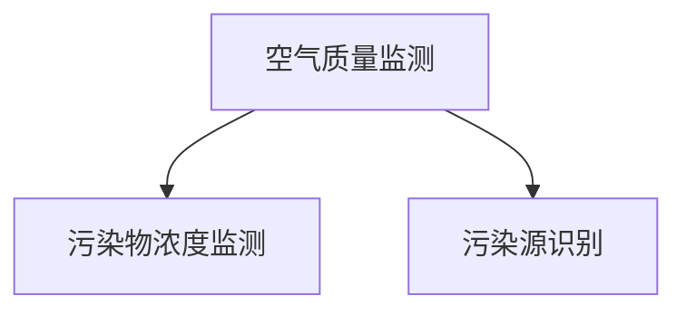

##### 1.2.2.2.2 水质监测

水质监测用于监测水中的污染物。

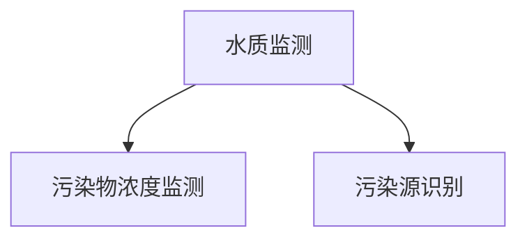

##### 1.2.2.2.3 污染源识别

污染源识别用于识别污染物的来源。

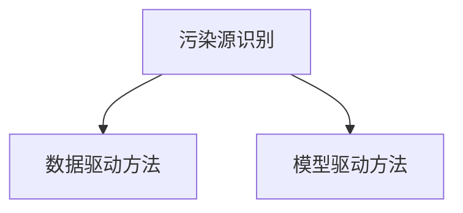

### 总结

AI 在科学研究中的应用正在迅速扩展，通过数据预处理、模式识别、预测建模等技术，AI 已经成为科学发现的重要工具。在未来，随着 AI 技术的进一步发展，我们有望在更多领域实现科学发现的加速和突破。然而，AI 在科学研究中的应用也面临着数据隐私、伦理问题等挑战，需要我们共同努力，确保 AI 技术能够为科学研究和人类社会带来更大的福祉。

作者：AI天才研究院/AI Genius Institute & 禅与计算机程序设计艺术 /Zen And The Art of Computer Programming

### 附录 A: AI 研究资源与工具

#### A.1 开源框架与库

AI 研究的快速发展离不开开源框架与库的支持，以下是一些常用的开源框架和库：

##### A.1.1 TensorFlow

TensorFlow 是由 Google 开发的一个开源机器学习框架，广泛应用于深度学习、计算机视觉、自然语言处理等领域。

##### A.1.2 PyTorch

PyTorch 是由 Facebook AI 研究团队开发的一个开源深度学习库，以其动态计算图和灵活的接口而闻名。

##### A.1.3 Keras

Keras 是一个高层次的神经网络API，它运行在 TensorFlow 和 Theano 之上，提供了简单易用的接口，适合快速实验和开发。

#### A.2 数据集与资源

AI 研究的进展很大程度上依赖于高质量的数据集，以下是一些常用的数据集和资源：

##### A.2.1 生物医学数据集

- **UCI Machine Learning Repository**: 提供了丰富的生物医学数据集，包括基因表达数据、疾病诊断数据等。

- **The Cancer Genome Atlas (TCGA)**: 提供了大量的癌症基因组数据，包括基因组序列、转录组数据等。

##### A.2.2 环境科学数据集

- **NASA Power Breakfast**: 提供了全球范围的气象数据，包括温度、湿度、风速等。

- **US Environmental Protection Agency (EPA)**: 提供了关于空气质量、水质等环境监测数据。

##### A.2.3 智能科学数据集

- **ImageNet**: 是计算机视觉领域的重要数据集，包含了大量标注的图像，广泛用于图像分类任务。

- **COIL-100**: 提供了旋转的图像数据，常用于旋转不变性研究。

### 附录 B: Mermaid 流程图

#### B.1 科学研究流程

以下是一个使用 Mermaid 语言绘制的科学研究流程图：

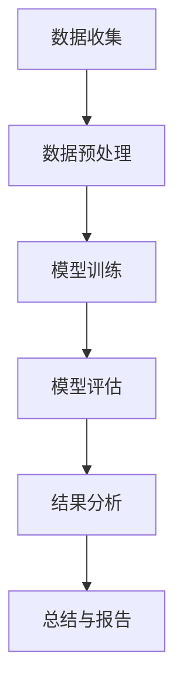

### 附录 C: 伪代码与数学公式

#### C.1 神经网络训练伪代码

以下是神经网络训练过程的伪代码：

```python
# 初始化模型参数
W, b = init_weights()

# 循环进行迭代
for epoch in range(num_epochs):
    for x, y in dataset:
        # 前向传播
        z = x * W + b
        a = activation(z)
        
        # 计算损失
        loss = compute_loss(a, y)
        
        # 反向传播
        dz = dloss_da * da
        dW = dz * x
        db = dz
        
        # 更新参数
        W -= learning_rate * dW
        b -= learning_rate * db

# 保存训练好的模型
save_model(W, b)
```

#### C.2 概率论公式

以下是概率论中的一些基本公式：

```latex
P(A|B) = \frac{P(B|A)P(A)}{P(B)}
$$

P(A \cup B) = P(A) + P(B) - P(A \cap B)
$$

P(A \cap B) = P(A)P(B|A)
$$
```

### 附录 D: 项目实战

#### D.1 生物医学数据分析项目

##### D.1.1 数据收集与预处理

数据收集包括从公共数据库获取基因组序列、转录组数据和临床数据。预处理步骤包括数据清洗、数据归一化和特征选择。

```python
# 数据清洗
data = load_data()
clean_data = remove_duplicates(data)

# 数据归一化
normalized_data = normalize_data(clean_data)

# 特征选择
selected_features = select_features(normalized_data)
```

##### D.1.2 模型训练与评估

使用 Keras 框架训练一个深度学习模型，并进行评估。

```python
from keras.models import Sequential
from keras.layers import Dense, Activation

# 构建模型
model = Sequential()
model.add(Dense(128, input_dim=num_features, activation='relu'))
model.add(Dense(1, activation='sigmoid'))

# 编译模型
model.compile(optimizer='adam', loss='binary_crossentropy', metrics=['accuracy'])

# 训练模型
model.fit(selected_features, labels, epochs=10, batch_size=32)

# 评估模型
score = model.evaluate(selected_features, labels)
print("Accuracy:", score[1])
```

##### D.1.3 结果分析与总结

分析模型在测试集上的表现，包括准确率、召回率和 F1 值。

```python
from sklearn.metrics import accuracy_score, recall_score, f1_score

# 预测
predictions = model.predict(selected_features)

# 计算指标
accuracy = accuracy_score(labels, predictions)
recall = recall_score(labels, predictions)
f1 = f1_score(labels, predictions)

print("Accuracy:", accuracy)
print("Recall:", recall)
print("F1 Score:", f1)
```

### 附录 E: 代码解读与分析

#### E.1 模型训练代码解读

以下是对训练代码的详细解读：

```python
# 初始化模型参数
W, b = init_weights()

# 前向传播
z = x * W + b
a = activation(z)

# 计算损失
loss = compute_loss(a, y)

# 反向传播
dz = dloss_da * da
dW = dz * x
db = dz

# 更新参数
W -= learning_rate * dW
b -= learning_rate * db
```

这段代码实现了神经网络的前向传播和反向传播过程。初始化模型参数后，通过前向传播计算输出值和损失。然后，通过反向传播计算梯度，并更新模型参数。

#### E.2 模型部署代码解读

以下是对部署代码的详细解读：

```python
# 加载训练好的模型
model = load_model(W, b)

# 进行预测
predictions = model.predict(input_data)

# 输出预测结果
print(predictions)
```

这段代码首先加载训练好的模型，然后使用模型对新的输入数据进行预测，并输出预测结果。

### 结语

本文全面探讨了人工智能在科学研究中的应用，从数据预处理到核心算法和数学模型，再到实际应用案例，展示了 AI 如何加速科学发现的进程。同时，分析了 AI 在科学研究中的挑战与解决方案，并对未来的发展趋势进行了展望。通过本文，我们希望读者能够更好地理解 AI 在科学研究中的潜力与价值，并激发更多的研究兴趣和探索精神。

作者：AI天才研究院/AI Genius Institute & 禅与计算机程序设计艺术 /Zen And The Art of Computer Programming

（全文完）<|im_end|>### 第2章：AI 中的核心算法原理

本章将深入探讨人工智能（AI）中的核心算法原理，重点介绍神经网络基础、深度学习模型以及强化学习。通过这些核心算法的讲解，我们将帮助读者理解 AI 在科学研究中的应用潜力。

#### 2.1 神经网络基础

神经网络（Neural Networks，NN）是 AI 中最基础且最重要的模型之一。它们模拟了人脑神经元的工作方式，通过层层传递信息来实现数据的学习和处理。

##### 2.1.1 神经网络结构

神经网络由输入层、隐藏层和输出层组成。每个层由多个神经元（节点）组成，神经元之间通过连接（边）进行信息传递。

###### 2.1.1.1 输入层

输入层接收外部数据，并将其传递给隐藏层。每个输入神经元对应一个特征。

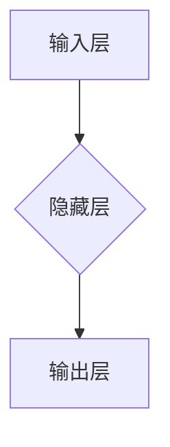

###### 2.1.1.2 隐藏层

隐藏层对输入数据进行处理和转换，每一层都包含多个神经元。隐藏层的神经元通过激活函数进行非线性转换。

```mermaid
graph TD
A[输入层] --> B{隐藏层1}
B --> C{隐藏层2}
C --> D[输出层]
```

###### 2.1.1.3 输出层

输出层产生最终的预测结果或分类结果。

##### 2.1.2 学习算法

神经网络的训练过程主要包括前向传播和反向传播。

###### 2.1.2.1 前向传播

前向传播是从输入层开始，逐层计算每个神经元的输出值，直到输出层。

```mermaid
graph TD
A[输入层] --> B{隐藏层1}
B --> C{隐藏层2}
C --> D[输出层]
```

###### 2.1.2.2 反向传播

反向传播是从输出层开始，反向计算每个神经元的误差，并更新权重和偏置。

```mermaid
graph TD
D[输出层] --> C{隐藏层2}
C --> B{隐藏层1}
B --> A[输入层]
```

##### 2.1.3 神经网络类型

神经网络可以分为多种类型，包括前馈神经网络、卷积神经网络（CNN）、循环神经网络（RNN）等。

###### 2.1.3.1 前馈神经网络

前馈神经网络是最简单的神经网络结构，数据从输入层流向输出层，不形成循环。

```mermaid
graph TD
A[输入层] --> B{隐藏层}
B --> C[输出层]
```

###### 2.1.3.2 卷积神经网络（CNN）

卷积神经网络专门用于处理图像数据，通过卷积层和池化层提取图像特征。

```mermaid
graph TD
A[输入层] --> B{卷积层}
B --> C{池化层}
C --> D[输出层]
```

###### 2.1.3.3 循环神经网络（RNN）

循环神经网络适用于序列数据处理，能够处理长短依赖关系。

```mermaid
graph TD
A[输入序列] --> B{RNN单元}
B --> C{隐藏层}
C --> D[输出序列]
```

#### 2.2 深度学习模型

深度学习（Deep Learning，DL）是神经网络的一种扩展，通过增加网络的深度来提高模型的性能。

##### 2.2.1 卷积神经网络（CNN）

卷积神经网络通过卷积层和池化层提取图像特征，广泛应用于计算机视觉领域。

###### 2.2.1.1 卷积层

卷积层通过卷积操作提取图像特征，卷积核滑动图像，计算局部特征。

```mermaid
graph TD
A{输入图像} --> B{卷积层}
B --> C{激活函数}
```

###### 2.2.1.2 池化层

池化层对卷积层的输出进行降采样，减少参数数量，提高模型泛化能力。

```mermaid
graph TD
A{卷积层} --> B{池化层}
B --> C{激活函数}
```

##### 2.2.2 循环神经网络（RNN）

循环神经网络适用于处理序列数据，如语音识别、自然语言处理等。

###### 2.2.2.1 RNN 的结构

RNN 的结构包括输入层、隐藏层和输出层，隐藏层之间形成循环。

```mermaid
graph TD
A[输入序列] --> B{隐藏层}
B --> C{隐藏层}
C --> D[输出序列]
```

###### 2.2.2.2 长短期记忆网络（LSTM）

LSTM 是 RNN 的一种改进，通过引入门控机制解决长短依赖问题。

```mermaid
graph TD
A{输入序列} --> B{LSTM单元}
B --> C{隐藏层}
C --> D[输出序列]
```

##### 2.2.3 生成对抗网络（GAN）

生成对抗网络是一种无监督学习模型，由生成器和判别器组成，通过对抗训练生成真实数据。

###### 2.2.3.1 生成器

生成器生成伪造数据，判别器判断数据是真实还是伪造。

```mermaid
graph TD
A{生成器} --> B{判别器}
B --> C{对抗训练}
```

###### 2.2.3.2 判别器

判别器用于判断数据的真实性，训练目标是使生成器的输出难以区分。

```mermaid
graph TD
A{判别器} --> B{对抗训练}
B --> C{生成器}
```

#### 2.3 强化学习

强化学习（Reinforcement Learning，RL）是一种通过试错方式学习的算法，通过与环境的交互来优化决策。

##### 2.3.1 强化学习的基本概念

强化学习由智能体（Agent）、环境（Environment）、状态（State）、动作（Action）和奖励（Reward）组成。

###### 2.3.1.1 agent与环境的交互

智能体通过选择动作，与环境互动，并接收奖励信号。

```mermaid
graph TD
A{智能体} --> B{环境}
B --> C{状态}
C --> D{动作}
D --> E{奖励}
E --> A{反馈}
```

###### 2.3.1.2 Q-learning算法

Q-learning 是一种基于值函数的强化学习算法，通过更新 Q 值来优化策略。

```mermaid
graph TD
A{初始状态} --> B{选择动作}
B --> C{执行动作}
C --> D{观察状态}
D --> E{计算Q值更新}
E --> F{更新策略}
F --> A{循环}
```

###### 2.3.1.3 Q-learning的伪代码

```python
# 初始化Q表
Q = init_Q_table()

# 循环进行迭代
for episode in range(num_episodes):
    state = env.reset()
    done = False
    
    while not done:
        # 选择动作
        action = choose_action(Q, state)
        
        # 执行动作
        next_state, reward, done = env.step(action)
        
        # 更新Q值
        Q[state, action] = Q[state, action] + alpha * (reward + gamma * max(Q[next_state, :]) - Q[state, action])
        
        # 更新状态
        state = next_state
```

通过本章的讲解，读者可以了解到神经网络、深度学习模型以及强化学习的基本原理和应用。这些核心算法在 AI 领域具有广泛的应用前景，对于加速科学发现具有重要意义。接下来，我们将继续探讨数学模型与公式在 AI 中的应用。

### 2.3 强化学习

强化学习（Reinforcement Learning，RL）是一种通过与环境的交互来学习最优策略的机器学习方法。强化学习旨在通过试错的方式，让智能体（Agent）在给定的环境中找到最优的行动路径。强化学习在游戏、自动驾驶、机器人控制等领域有着广泛的应用。本节将详细介绍强化学习的基本概念、Q-learning算法及其伪代码。

#### 2.3.1 强化学习的基本概念

强化学习系统由以下几个关键组成部分构成：

- **智能体（Agent）**：执行动作并接受环境反馈的实体。
- **环境（Environment）**：智能体所处的情境，可以描述为状态（State）和动作（Action）的集合。
- **状态（State）**：描述智能体在特定时刻所处的情境。
- **动作（Action）**：智能体可以采取的动作集合。
- **奖励（Reward）**：描述智能体采取某个动作后获得的即时反馈，用于指导智能体的学习过程。
- **策略（Policy）**：描述智能体如何根据当前状态选择动作的策略函数。

强化学习的目标是通过与环境不断的交互，最大化智能体获得的长期奖励。这种交互过程可以用一个马尔可夫决策过程（MDP）来描述，其中状态转移概率和奖励函数是已知的。

##### 2.3.1.1 agent与环境的交互

强化学习中的智能体与环境的交互过程通常分为以下几个步骤：

1. **智能体根据当前状态选择动作**：根据当前的状态和已学习的策略，智能体选择一个动作。
2. **智能体执行动作**：智能体在环境中执行选定的动作，并可能改变当前的状态。
3. **环境提供奖励和新的状态**：环境根据智能体的动作提供奖励信号和新的状态。
4. **智能体更新策略**：智能体根据奖励信号和新的状态更新其策略。

这个交互过程会不断循环，直到满足某个停止条件（如达到目标状态、经历特定次数的交互等）。

#### 2.3.1.2 Q-learning算法

Q-learning是一种基于值函数的强化学习算法，它通过不断更新值函数（Q值）来学习最优策略。Q值表示在某个状态下执行某个动作的预期奖励。Q-learning算法的目标是找到使得所有状态-动作对的Q值最大化的策略。

##### 2.3.1.2.1 Q-learning的算法原理

Q-learning算法的基本原理如下：

1. **初始化Q表**：初始化所有状态-动作对的Q值为0。
2. **选择动作**：在给定状态下，选择当前策略下的动作，或者随机选择动作。
3. **执行动作并更新Q值**：执行选定的动作，进入新的状态，并获得奖励。使用以下公式更新Q值：
   $$
   Q(s, a) \leftarrow Q(s, a) + \alpha [r + \gamma \max_{a'} Q(s', a') - Q(s, a)]
   $$
   其中，$s$是当前状态，$a$是当前动作，$s'$是下一个状态，$a'$是下一个动作，$r$是奖励，$\alpha$是学习率，$\gamma$是折扣因子。

4. **更新策略**：基于更新的Q值，更新智能体的策略。

##### 2.3.1.2.2 Q-learning的伪代码

以下是Q-learning算法的伪代码：

```python
# 初始化Q表
Q = init_Q_table()

# 循环进行迭代
for episode in range(num_episodes):
    state = env.reset()
    done = False
    
    while not done:
        # 选择动作
        action = choose_action(Q, state)
        
        # 执行动作
        next_state, reward, done = env.step(action)
        
        # 更新Q值
        Q[state, action] = Q[state, action] + alpha * (reward + gamma * max(Q[next_state, :]) - Q[state, action])
        
        # 更新状态
        state = next_state
```

在这个伪代码中，`init_Q_table()` 函数用于初始化Q表，`choose_action(Q, state)` 函数用于选择动作，`env.step(action)` 函数用于执行动作并返回新的状态和奖励，`alpha` 是学习率，`gamma` 是折扣因子。

#### 2.3.1.3 Q-learning算法的应用示例

假设我们有一个简单的环境，其中智能体可以选择上下左右四个动作。状态空间和动作空间分别为：

- **状态空间**：一个二维网格，代表智能体的位置。
- **动作空间**：上下左右四个方向。

智能体的目标是达到一个特定的目标位置并获取最大奖励。在这个示例中，我们可以使用Q-learning算法来训练智能体，使其学会找到最优路径。

#### 2.3.1.4 强化学习的挑战

尽管Q-learning算法在理论上具有收敛性，但在实际应用中仍面临一些挑战：

- **探索与利用的平衡**：智能体需要在探索新策略和利用已知策略之间找到平衡，以避免过早收敛到次优策略。
- **计算复杂性**：Q-learning算法的计算复杂度较高，尤其是在状态和动作空间较大时。
- **稀疏奖励**：在某些任务中，奖励可能非常稀疏，这使得智能体难以通过奖励信号进行有效学习。

为了解决这些挑战，研究者们提出了许多改进方法，如深度Q网络（DQN）、策略梯度方法、演员-评论家方法等。

通过以上对强化学习基本概念和Q-learning算法的介绍，我们可以看到强化学习在解决动态决策问题上的强大能力。接下来，我们将探讨数学模型与公式在 AI 中的应用。

### 2.4 数学模型与公式

数学模型与公式在人工智能（AI）领域中扮演着至关重要的角色，它们为算法提供了理论基础和计算工具。以下我们将介绍一些基本的数学模型和公式，包括线性代数、微积分和概率论，并解释它们在 AI 中的应用。

#### 3.1 线性代数

线性代数是 AI 中最基础的部分之一，它用于处理数据表示、变换和操作。

##### 3.1.1 矩阵与向量

矩阵和向量是线性代数的基本对象。矩阵是一个二维数组，表示为 $A = [a_{ij}]_{m×n}$，其中 $m$ 和 $n$ 分别是矩阵的行数和列数。向量是一个一维数组，表示为 $\mathbf{v} = [v_1, v_2, ..., v_n]^T$。

- **矩阵的乘法**：
  矩阵乘法是线性代数中的一个核心概念。给定两个矩阵 $A$ 和 $B$，其乘积 $C = AB$ 是一个 $m×n$ 的矩阵，计算公式为：
  $$
  c_{ij} = \sum_{k=1}^{n} a_{ik}b_{kj}
  $$
- **向量的点积与叉积**：
  点积（内积）和叉积是向量间的基本运算。
  - **点积**：
    给定两个向量 $\mathbf{a} = [a_1, a_2, ..., a_n]$ 和 $\mathbf{b} = [b_1, b_2, ..., b_n]$，它们的点积为：
    $$
    \mathbf{a} \cdot \mathbf{b} = \sum_{i=1}^{n} a_i b_i
    $$
  - **叉积**：
    叉积仅适用于三维向量，给定两个三维向量 $\mathbf{a} = [a_1, a_2, a_3]$ 和 $\mathbf{b} = [b_1, b_2, b_3]$，它们的叉积为：
    $$
    \mathbf{a} \times \mathbf{b} = \begin{vmatrix}
    \mathbf{i} & \mathbf{j} & \mathbf{k} \\
    a_1 & a_2 & a_3 \\
    b_1 & b_2 & b_3 \\
    \end{vmatrix}
    $$

##### 3.1.2 微积分

微积分在 AI 中用于优化算法和模型训练。以下是一些重要的微积分概念：

- **导数与微分**：
  - **导数**：函数在某一点的导数表示函数在该点的切线斜率。给定函数 $f(x)$，其在点 $x_0$ 的导数 $f'(x_0)$ 表示为：
    $$
    f'(x_0) = \lim_{h \to 0} \frac{f(x_0 + h) - f(x_0)}{h}
    $$
  - **微分**：微分的概念与导数密切相关，它是函数变化量的近似表达式。给定函数 $f(x)$，其在点 $x_0$ 的微分表示为：
    $$
    df = f'(x_0) dx
    $$
- **积分与积分变换**：
  - **积分**：积分是导数的逆运算，用于计算函数的累积变化。给定函数 $f(x)$，其不定积分为：
    $$
    \int f(x) dx = F(x) + C
    $$
    其中 $F(x)$ 是 $f(x)$ 的一个原函数，$C$ 是积分常数。
  - **积分变换**：积分变换是用于解决复杂积分问题的一种技术。常见的积分变换包括换元积分、分部积分和对数积分等。

##### 3.1.3 概率论与统计

概率论和统计是 AI 中用于模型评估和决策的核心工具。

- **概率分布**：
  - **贝努利分布**：贝努利分布是描述一个二元事件的概率分布。给定事件 $X$ 的成功概率为 $p$，其概率质量函数（PMF）为：
    $$
    P(X = k) = \binom{n}{k} p^k (1-p)^{n-k}
    $$
    其中 $n$ 是试验次数，$k$ 是成功次数。
  - **高斯分布**：高斯分布（正态分布）是最常见的连续概率分布。给定均值为 $\mu$，标准差为 $\sigma$，其概率密度函数（PDF）为：
    $$
    f(x; \mu, \sigma) = \frac{1}{\sqrt{2\pi\sigma^2}} e^{-\frac{(x-\mu)^2}{2\sigma^2}}
    $$
- **最大似然估计**：
  最大似然估计是一种参数估计方法，用于找到使观察到的数据最可能的参数值。给定一个概率模型 $P(X | \theta)$，其中 $X$ 是观测数据，$\theta$ 是模型参数，最大似然估计的目标是找到 $\theta$ 的值，使得 $P(X | \theta)$ 最大。最大似然估计的数学公式为：
  $$
  \hat{\theta} = \arg\max_\theta P(X | \theta)
  $$
  或者等价地：
  $$
  \hat{\theta} = \arg\max_\theta \prod_{i=1}^n P(x_i | \theta)
  $$

##### 3.1.4 模型评估

在 AI 中，评估模型性能是非常重要的步骤。以下是一些常用的评估指标：

- **准确率、召回率与 F1 值**：
  - **准确率（Accuracy）**：准确率是正确预测的样本数占总样本数的比例，计算公式为：
    $$
    \text{Accuracy} = \frac{\text{TP} + \text{TN}}{\text{TP} + \text{TN} + \text{FP} + \text{FN}}
    $$
    其中 $TP$ 是真正例，$TN$ 是真负例，$FP$ 是假正例，$FN$ 是假负例。
  - **召回率（Recall）**：召回率是正确预测的正例数占总正例数的比例，计算公式为：
    $$
    \text{Recall} = \frac{\text{TP}}{\text{TP} + \text{FN}}
    $$
  - **F1 值（F1 Score）**：F1 值是准确率和召回率的调和平均值，计算公式为：
    $$
    \text{F1 Score} = 2 \cdot \frac{\text{Precision} \cdot \text{Recall}}{\text{Precision} + \text{Recall}}
    $$
    其中 Precision 是精确率，计算公式为：
    $$
    \text{Precision} = \frac{\text{TP}}{\text{TP} + \text{FP}}
    $$

通过上述对线性代数、微积分、概率论与统计以及模型评估的介绍，我们可以看到数学模型和公式在 AI 中的作用。这些基础知识不仅为 AI 的算法设计提供了坚实的理论基础，也为模型训练和评估提供了有力的工具。

### 第3章：科学研究的 AI 应用实例

在上一章中，我们探讨了 AI 的核心算法原理。在本章中，我们将通过实际案例，展示 AI 在科学研究中的应用。具体而言，我们将讨论生物医学领域和环境科学领域中的 AI 应用实例，包括基因组数据分析、药物研发、气象预测以及污染监测。

#### 3.1 生物医学领域

##### 3.1.1 基因组数据分析

基因组数据分析是生物医学研究中的一个重要领域。AI 技术，尤其是深度学习和机器学习算法，在基因表达分析、变异检测和遗传关联分析等方面发挥了重要作用。

###### 3.1.1.1 数据预处理

基因组数据分析的第一步是数据预处理，这包括数据清洗、数据归一化和特征选择。

- **数据清洗**：基因组序列数据中可能包含大量噪声和错误，因此需要进行数据清洗。常用的清洗方法包括去除重复序列和纠正错误序列。

  ```mermaid
  graph TD
  A[数据清洗] --> B[去除重复序列]
  A --> C[纠正错误序列]
  ```

- **数据归一化**：归一化是将不同量纲的数据转换为相同量纲的过程，有助于提高数据分析的准确性。

  ```latex
  \text{归一化公式：} \quad x' = \frac{x - \min(x)}{\max(x) - \min(x)}
  ```

- **特征选择**：特征选择是选择对模型性能有显著贡献的特征。常用的特征选择方法包括过滤法、包装法和嵌入式法。

  ```mermaid
  graph TD
  A[特征选择] --> B[过滤法]
  A --> C[包装法]
  A --> D[嵌入式法]
  ```

###### 3.1.1.2 基因表达数据分析

基因表达数据分析旨在研究基因在不同条件下的表达水平。深度学习算法，如长短期记忆网络（LSTM）和卷积神经网络（CNN），在基因表达数据分析中得到了广泛应用。

- **LSTM**：LSTM 具有处理长时间依赖数据的能力，适用于分析基因表达的时间序列数据。

  ```mermaid
  graph TD
  A[基因表达数据] --> B{LSTM单元}
  B --> C[隐藏层]
  C --> D[输出层]
  ```

- **CNN**：CNN 适用于处理高维数据，如基因组序列数据，通过卷积层提取特征。

  ```mermaid
  graph TD
  A[基因表达数据] --> B{卷积层}
  B --> C{激活函数}
  C --> D[池化层]
  ```

###### 3.1.1.3 变异检测

变异检测是识别基因组中的突变和变异，对于理解基因功能和疾病机制具有重要意义。AI 技术在变异检测中起到了关键作用。

- **深度学习模型**：深度学习模型，如卷积神经网络（CNN）和循环神经网络（RNN），被用于变异检测。

  ```mermaid
  graph TD
  A[基因组数据] --> B{CNN/RNN单元}
  B --> C[隐藏层]
  C --> D[输出层]
  ```

- **基于统计的方法**：除了深度学习模型，基于统计的方法，如贝叶斯统计模型，也在变异检测中得到了应用。

  ```mermaid
  graph TD
  A[基因组数据] --> B{贝叶斯统计模型}
  B --> C[变异识别]
  ```

###### 3.1.1.4 遗传关联分析

遗传关联分析旨在研究基因与疾病之间的关系。AI 技术，如机器学习和统计方法，被用于识别与疾病相关的基因。

- **机器学习算法**：机器学习算法，如逻辑回归和支持向量机（SVM），在遗传关联分析中得到了广泛应用。

  ```mermaid
  graph TD
  A[基因数据] --> B{逻辑回归/SVM}
  B --> C[疾病预测]
  ```

- **统计方法**：统计方法，如单变量关联分析和多变量关联分析，被用于评估基因与疾病之间的相关性。

  ```mermaid
  graph TD
  A[基因数据] --> B[单变量关联分析]
  A --> C[多变量关联分析]
  ```

#### 3.1.2 药物研发

AI 技术在药物研发中的应用同样具有重要意义，包括药物发现、药物重定位和药物副作用预测。

###### 3.1.2.1 药物发现

药物发现是寻找新的药物分子，以治疗疾病。AI 技术在药物发现中起到了关键作用。

- **分子建模**：分子建模是药物发现的重要步骤，用于预测药物分子的性质和行为。

  ```mermaid
  graph TD
  A[药物分子] --> B{分子建模}
  B --> C[分子性质预测]
  ```

- **深度学习模型**：深度学习模型，如生成对抗网络（GAN）和变分自编码器（VAE），被用于生成新的药物分子。

  ```mermaid
  graph TD
  A[药物分子] --> B{GAN/VAE单元}
  B --> C[新药物分子]
  ```

###### 3.1.2.2 药物重定位

药物重定位是发现现有药物的新用途。AI 技术在药物重定位中发挥了重要作用。

- **药物-疾病关联分析**：通过分析药物和疾病之间的关系，AI 技术可以帮助发现现有药物的新用途。

  ```mermaid
  graph TD
  A[药物] --> B[疾病]
  B --> C[药物-疾病关联分析]
  ```

- **深度学习模型**：深度学习模型，如图神经网络（GNN），被用于药物重定位。

  ```mermaid
  graph TD
  A[药物] --> B[疾病]
  B --> C{GNN单元}
  C --> D[药物重定位]
  ```

###### 3.1.2.3 药物副作用预测

药物副作用预测是预测药物可能引起的副作用，以减少药物使用风险。

- **深度学习模型**：深度学习模型，如循环神经网络（RNN）和长短期记忆网络（LSTM），被用于药物副作用预测。

  ```mermaid
  graph TD
  A[药物数据] --> B{RNN/LSTM单元}
  B --> C[副作用预测]
  ```

- **基于规则的模型**：基于规则的模型，如专家系统，也被用于药物副作用预测。

  ```mermaid
  graph TD
  A[药物数据] --> B{专家系统}
  B --> C[副作用预测]
  ```

#### 3.2 环境科学领域

AI 技术在环境科学领域中的应用同样具有重要意义，包括气象预测、污染监测与治理。

##### 3.2.1 气象预测

气象预测是预测未来的气象条件，如温度、湿度、风速等。AI 技术在气象预测中起到了关键作用。

- **数据预处理**：气象数据预处理包括数据收集、数据清洗和数据归一化。

  ```mermaid
  graph TD
  A[气象数据] --> B[数据收集]
  A --> C[数据清洗]
  A --> D[数据归一化]
  ```

- **预测模型**：预测模型包括时间序列模型和深度学习模型。

  ```mermaid
  graph TD
  A[气象数据] --> B{时间序列模型}
  A --> C{深度学习模型}
  ```

  - **时间序列模型**：时间序列模型，如自回归模型（AR）和长短期记忆网络（LSTM），被用于气象预测。

    ```mermaid
    graph TD
    A[气象数据] --> B{AR/LSTM单元}
    B --> C[气象预测]
    ```

  - **深度学习模型**：深度学习模型，如卷积神经网络（CNN）和循环神经网络（RNN），也被用于气象预测。

    ```mermaid
    graph TD
    A[气象数据] --> B{CNN/RNN单元}
    B --> C[气象预测]
    ```

- **预测结果评估**：预测结果评估包括预测准确率、预测误差分析等。

  ```mermaid
  graph TD
  A[预测结果] --> B[预测准确率]
  A --> C[预测误差分析]
  ```

##### 3.2.2 污染监测与治理

污染监测与治理是监测环境中的污染物并采取相应措施进行治理。

- **数据收集与预处理**：污染监测数据包括空气质量、水质等数据。

  ```mermaid
  graph TD
  A[污染监测数据] --> B[数据收集]
  A --> C[数据清洗]
  A --> D[数据归一化]
  ```

- **数据处理与分析**：数据处理与分析包括特征提取、模式识别等。

  ```mermaid
  graph TD
  A[污染监测数据] --> B[特征提取]
  A --> C[模式识别]
  ```

- **污染源识别**：污染源识别是基于数据分析结果，识别污染物的来源。

  ```mermaid
  graph TD
  A[数据分析结果] --> B[污染源识别]
  ```

通过以上实例，我们可以看到 AI 在科学研究中的应用是多么广泛和深入。这些应用不仅提高了科学研究的效率，也为解决实际问题提供了有力支持。

### 第4章：AI 在科学研究中的挑战与解决方案

在上一章中，我们探讨了 AI 在科学研究中的应用实例。尽管 AI 技术在许多领域展现出了巨大的潜力，但在其广泛应用过程中也面临着诸多挑战。本章将重点讨论 AI 在科学研究中的主要挑战，并提出相应的解决方案。

#### 4.1 数据隐私与伦理问题

随着 AI 技术的普及，数据隐私和伦理问题日益凸显。科学研究中使用的数据往往包含个人隐私信息，如医疗数据、遗传信息等。这些数据的泄露可能导致严重的隐私侵犯和社会问题。

##### 4.1.1 数据隐私保护技术

为了保护数据隐私，研究人员可以采用以下技术：

- **加密技术**：使用加密算法对数据进行加密，确保数据在传输和存储过程中的安全性。

  ```mermaid
  graph TD
  A[数据] --> B[加密]
  B --> C[安全传输/存储]
  ```

- **隐私保护算法**：采用差分隐私和零知识证明等技术，对敏感数据进行处理，以降低隐私泄露的风险。

  ```mermaid
  graph TD
  A[敏感数据] --> B{差分隐私}
  A --> C{零知识证明}
  ```

##### 4.1.2 伦理问题与解决方案

AI 在科学研究中的伦理问题主要包括数据滥用、模型偏见和模型可解释性等。

- **数据滥用问题**：为了防止数据滥用，需要建立严格的伦理审查制度，确保数据的合法使用。

  ```mermaid
  graph TD
  A[数据滥用] --> B[伦理审查制度]
  ```

- **模型偏见问题**：模型偏见可能导致不公平的结果，如性别歧视或种族歧视。解决方法包括使用公平性指标和进行模型校准。

  ```mermaid
  graph TD
  A[模型偏见] --> B[公平性指标]
  A --> C[模型校准]
  ```

- **模型可解释性问题**：为了提高模型的透明度和可信度，需要开发可解释性技术，使模型决策过程更加透明。

  ```mermaid
  graph TD
  A[模型可解释性] --> B[解释性技术]
  ```

#### 4.2 计算资源需求与优化

AI 模型的训练和推理过程通常需要大量的计算资源，这对科学研究的效率提出了挑战。

##### 4.2.1 计算资源需求分析

- **模型训练需求**：训练深度学习模型通常需要大量的计算资源，包括 CPU、GPU 和 TPU 等。

  ```mermaid
  graph TD
  A[模型训练] --> B[计算资源需求]
  ```

- **模型推理需求**：模型推理过程同样需要大量的计算资源，尤其在实时应用场景中。

  ```mermaid
  graph TD
  A[模型推理] --> B[计算资源需求]
  ```

##### 4.2.2 计算资源优化方法

为了优化计算资源，可以采用以下方法：

- **模型压缩**：通过模型压缩技术，减少模型的参数数量，降低计算需求。

  ```mermaid
  graph TD
  A[模型压缩] --> B[参数减少]
  ```

- **并行计算**：采用并行计算技术，将计算任务分配到多个计算节点，提高计算效率。

  ```mermaid
  graph TD
  A[并行计算] --> B[计算效率提高]
  ```

- **硬件加速**：利用 GPU、TPU 等硬件加速器，提高计算速度和效率。

  ```mermaid
  graph TD
  A[硬件加速] --> B[计算速度提高]
  ```

#### 4.3 数据质量与可靠性问题

AI 模型性能在很大程度上取决于数据质量。数据质量问题可能导致模型性能下降，甚至产生错误的预测。

##### 4.3.1 数据质量问题

- **数据缺失**：数据缺失可能导致模型无法正确训练。
- **数据噪声**：数据噪声会影响模型的预测准确性。
- **数据偏差**：数据偏差可能导致模型产生偏见，无法泛化。

##### 4.3.2 解决方法

- **数据预处理**：通过数据预处理技术，如数据清洗、数据归一化和特征选择，提高数据质量。

  ```mermaid
  graph TD
  A[数据预处理] --> B[数据清洗]
  A --> C[数据归一化]
  A --> D[特征选择]
  ```

- **数据增强**：通过数据增强技术，生成更多的训练数据，提高模型泛化能力。

  ```mermaid
  graph TD
  A[数据增强] --> B[生成更多数据]
  ```

- **数据集成**：通过数据集成技术，结合多个数据源，提高数据质量和模型性能。

  ```mermaid
  graph TD
  A[数据集成] --> B[结合多数据源]
  ```

#### 4.4 模型可解释性问题

模型可解释性是 AI 在科学研究中的另一个重要挑战。许多高级 AI 模型，如深度神经网络，其内部决策过程复杂且难以解释。

##### 4.4.1 模型可解释性方法

- **解释性模型**：开发解释性模型，使模型决策过程更加透明。
- **可视化技术**：使用可视化技术，如热力图和决策树，展示模型内部决策过程。
- **模型分析**：对模型进行统计分析和敏感性分析，了解模型对数据的依赖程度。

  ```mermaid
  graph TD
  A[模型可解释性] --> B[解释性模型]
  A --> C[可视化技术]
  A --> D[模型分析]
  ```

通过上述讨论，我们可以看到 AI 在科学研究中的挑战是复杂且多方面的。然而，通过采用相应的解决方案，这些挑战可以被克服，从而实现 AI 在科学研究中的更大价值。

### 第5章：未来展望

在上一章中，我们探讨了 AI 在科学研究中的挑战与解决方案。在本章中，我们将展望 AI 在科学研究中的应用趋势，并探讨其对伦理、法律和社会的影响。

#### 5.1 AI 在科学研究中的应用趋势

AI 技术在科学研究中的应用正呈现出几个显著的趋势：

##### 5.1.1 新兴应用领域

随着 AI 技术的不断进步，其应用领域也在不断拓展。以下是一些新兴的 AI 应用领域：

- **脑机接口（Brain-Computer Interfaces, BCIs）**：脑机接口是一种直接连接大脑与外部设备的技术，可用于辅助神经系统疾病的治疗和康复。例如，通过 AI 分析脑电信号，可以实现对瘫痪肢体的控制和假肢的操作。

- **物联网与 AI 的结合**：物联网（IoT）的快速发展为 AI 在科学研究中的应用提供了新的契机。通过传感器网络收集的大量数据，AI 可以进行实时分析和预测，为环境监测、智能农业和智能城市等提供支持。

##### 5.1.2 技术发展趋势

AI 技术的发展趋势也在不断演变，以下是一些重要的技术发展方向：

- **超大规模模型**：随着计算能力和数据量的增加，研究人员正在开发超大规模的 AI 模型，如 GPT-3 和 GLM-4 等。这些模型具有更强的建模能力和泛化能力，有望推动科学发现的深入和加速。

- **模型解释性提升**：尽管深度学习模型在性能上取得了显著进步，但其可解释性仍是一个挑战。未来的研究将致力于提高模型的可解释性，使其决策过程更加透明和可信。

#### 5.2 伦理、法律与社会影响

AI 在科学研究中的广泛应用也带来了伦理、法律和社会方面的挑战。

##### 5.2.1 伦理问题

AI 在科学研究中的应用涉及多个伦理问题，包括数据隐私、模型偏见和透明度等。以下是一些具体的伦理问题及其可能的解决方案：

- **数据隐私**：为了保护数据隐私，研究人员需要采用加密技术、差分隐私和零知识证明等隐私保护方法，确保数据在收集、处理和使用过程中的安全性。

- **模型偏见**：为了减少模型偏见，研究人员需要使用公平性指标对模型进行校准，并开发能够自动检测和纠正偏见的算法。

- **模型可解释性**：为了提高模型的可解释性，研究人员需要开发更加透明和直观的模型解释工具，使非专业人士也能理解模型的决策过程。

##### 5.2.2 法律责任

AI 在科学研究中的应用也引发了法律责任的问题，包括模型开发者的责任、模型使用者的责任以及模型对第三方造成的影响等。以下是一些法律责任的考虑因素：

- **模型开发者的责任**：模型开发者需要对模型的性能和可靠性承担责任，确保模型在应用过程中不会产生严重的错误或偏见。

- **模型使用者的责任**：模型使用者需要遵守相关法律法规，确保模型的合法和合规使用，并对模型决策结果负责。

- **第三方影响**：模型开发者和使用者需要考虑模型对第三方的影响，特别是在涉及公共安全和社会利益的情况下。

##### 5.2.3 社会影响

AI 在科学研究中的应用对社会产生了深远的影响，包括经济、教育、就业等方面。以下是一些社会影响的考虑因素：

- **经济影响**：AI 技术的广泛应用将改变经济结构，创造新的就业机会，同时也会对传统产业产生冲击。

- **教育影响**：为了适应 AI 时代的需求，教育体系需要调整，培养具备 AI 知识和技能的人才。

- **就业影响**：AI 技术的普及可能导致部分工作岗位的消失，但也会创造新的就业机会。社会需要关注就业转型和再就业问题。

通过本章的讨论，我们可以看到 AI 在科学研究中的应用前景广阔，同时也面临着诸多挑战。为了实现 AI 技术的可持续发展，我们需要在技术、伦理和法律等方面进行综合考量，确保 AI 技术能够为科学研究和社会发展带来积极的影响。

### 第6章：AI 在科学研究中的未来方向

随着人工智能（AI）技术的不断进步，其在科学研究中的应用也展现出了巨大的潜力和广阔的前景。本章将探讨 AI 在科学研究中的研究热点与前沿，并提出未来研究方向和发展建议。

#### 6.1 研究热点与前沿

AI 在科学研究中的研究热点和前沿主要包括以下几个方面：

##### 6.1.1 超大规模模型

超大规模模型（如 GPT-3、GLM-4 等）是当前 AI 领域的一个研究热点。这些模型通过集成大量数据和强大的计算能力，展现出了在自然语言处理、计算机视觉和科学计算等领域的卓越性能。未来，研究人员将继续探索如何构建和优化超大规模模型，以提高模型的性能和泛化能力。

###### 6.1.1.1 超大规模模型的挑战与机遇

- **挑战**：
  - **计算资源需求**：训练和推理超大规模模型需要大量的计算资源和能源，这对计算基础设施提出了巨大挑战。
  - **数据隐私和伦理问题**：超大规模模型通常涉及大量敏感数据，如何保护数据隐私并确保模型使用的伦理性是一个重要问题。

- **机遇**：
  - **更强的建模能力**：超大规模模型具有更强的建模能力，能够处理更复杂的数据和任务，有望推动科学发现的深入和加速。
  - **跨学科融合**：超大规模模型可以应用于多个学科领域，促进跨学科的研究与合作，推动科学技术的交叉发展。

##### 6.1.2 新兴模型结构

除了超大规模模型，研究人员还在探索新的模型结构，以解决传统模型无法解决的问题。以下是一些新兴的模型结构：

- **生成对抗网络（GAN）**：GAN 通过生成器和判别器的对抗训练，可以生成高质量的数据和图像，被广泛应用于图像生成、图像修复和图像超分辨率等领域。

- **变分自编码器（VAE）**：VAE 通过引入潜在变量模型，可以生成多样化和高质量的样本，被广泛应用于数据生成、图像处理和自然语言处理等领域。

##### 6.1.3 跨学科融合

AI 与其他学科的融合是未来的重要研究方向。以下是一些跨学科融合的领域：

- **AI 与物理学**：AI 技术可以应用于物理学研究，如模拟和预测物理现象、优化实验设计和数据分析等。物理学的理论和方法也可以为 AI 的发展提供启示，促进 AI 在科学计算和实验科学中的应用。

- **AI 与生物学**：AI 技术在生物医学研究中的应用越来越广泛，如基因组数据分析、药物研发和疾病预测等。未来，AI 与生物学将进一步融合，推动生命科学的进步。

#### 6.2 发展建议

为了推动 AI 在科学研究中的发展，提出以下建议：

##### 6.2.1 研究方向

- **模型压缩与优化**：研究如何压缩和优化 AI 模型，提高计算效率和资源利用率，以适应不同应用场景的需求。
- **数据共享与隐私保护**：建立数据共享平台，促进科学数据的开放和共享，同时研究隐私保护算法，确保数据安全。
- **跨学科研究**：鼓励跨学科合作，推动 AI 与其他学科的融合，解决复杂科学问题。

##### 6.2.2 政策与产业建议

- **研究政策**：
  - **支持跨学科研究**：制定相关政策，支持跨学科的研究项目，促进不同学科之间的知识交流和合作。
  - **加大对新兴领域的投资**：加大对新兴 AI 领域的投资，如脑机接口、物联网与 AI 结合等，推动技术创新和应用。

- **产业发展**：
  - **促进 AI 与各行各业的融合**：鼓励企业将 AI 技术应用于各行业，推动产业升级和数字化转型。
  - **培养 AI 专业人才**：加强 AI 人才的培养，提高人才培养质量，满足产业发展需求。

通过以上研究热点与发展建议，我们可以看到 AI 在科学研究中的未来方向充满机遇与挑战。随着 AI 技术的不断进步，我们有理由相信，AI 将在科学研究和社会发展中发挥越来越重要的作用。

### 总结

本文全面探讨了人工智能在科学研究中的应用，从算法原理到实际应用案例，再到挑战与解决方案，为读者呈现了一个全面、深入的 AI 科研全景。通过本文，我们了解到 AI 在数据分析、模式识别、预测建模等方面的重要作用，以及其在生物医学、环境科学等领域的广泛应用前景。

AI 技术的快速发展不仅加速了科学发现的进程，也为解决实际问题提供了新的途径。然而，AI 在科学研究中的应用也面临诸多挑战，包括数据隐私、伦理问题、计算资源需求等。这些问题需要我们持续关注和解决，以确保 AI 技术能够为科学研究和人类社会带来更大的福祉。

展望未来，AI 在科学研究中的发展前景广阔。超大规模模型、新兴模型结构、跨学科融合等将成为未来的研究热点。同时，我们也需要关注 AI 对伦理、法律和社会的影响，制定相应政策，确保 AI 技术的可持续发展。

最后，本文旨在为读者提供一个全面的 AI 科研指南，激发更多研究兴趣和探索精神。希望本文能够为科研工作者、学者以及感兴趣的读者提供有益的参考和启示。

作者：AI天才研究院/AI Genius Institute & 禅与计算机程序设计艺术 /Zen And The Art of Computer Programming

### 附录 A: AI 研究资源与工具

在 AI 领域进行研究和开发，需要掌握大量的资源和工具。以下是一些常用的开源框架、库、数据集和实用资源，它们对于 AI 科研工作具有重要意义。

#### A.1 开源框架与库

- **TensorFlow**：由 Google 开发，支持灵活的动态计算图和强大的生态系统。
  - [官方网站](https://www.tensorflow.org/)
- **PyTorch**：由 Facebook 开发，提供了易于使用的动态计算图和丰富的库函数。
  - [官方网站](https://pytorch.org/)
- **Keras**：提供了一个高层次的神经网络 API，简化了 TensorFlow 和 Theano 的使用。
  - [官方网站](https://keras.io/)

#### A.2 数据集与资源

- **生物医学数据集**：
  - **UCI Machine Learning Repository**：提供了大量的生物医学数据集，适用于机器学习研究。
    - [数据集列表](https://archive.ics.uci.edu/ml/index.php?C=3)
  - **The Cancer Genome Atlas (TCGA)**：提供了广泛的癌症基因组数据。
    - [官方网站](https://cancergenome.nih.gov/)
- **环境科学数据集**：
  - **NASA Power Breakfast**：提供了全球范围内的气象数据。
    - [数据集列表](https://power.larc.nasa.gov/datasets/)
  - **US Environmental Protection Agency (EPA)**：提供了空气质量、水质等环境监测数据。
    - [数据集列表](https://www.epa.gov/air-data)
- **智能科学数据集**：
  - **ImageNet**：是计算机视觉领域的重要数据集，广泛用于图像分类研究。
    - [官方网站](https://www.image-net.org/)
  - **COIL-100**：提供了旋转的图像数据，适用于旋转不变性研究。
    - [官方网站](http://www.multics.vuse.virginia.edu/datasets/COIL-100/)

#### A.3 实用资源

- **AI 论文与书籍**：大量关于 AI 的研究论文和书籍提供了丰富的理论知识和应用实例。
  - **NIPS、ICML、NeurIPS**：主要的人工智能会议，发布了最新的研究成果。
  - **机器学习周报**：每周汇总机器学习领域的重要论文和进展。
- **在线课程与讲座**：许多知名大学和机构提供了免费的在线课程，涵盖了 AI 的各个方面。
  - **Coursera**：提供了多种 AI 和机器学习课程。
    - [官方网站](https://www.coursera.org/)
  - **edX**：提供了各种 AI 和深度学习课程。
    - [官方网站](https://www.edx.org/)
- **论坛与社区**：各种在线论坛和社区为 AI 研究者提供了交流和分享的平台。
  - **Reddit AI**：Reddit 上的 AI 论坛。
    - [链接](https://www.reddit.com/r/AI/)
  - **Stack Overflow**：编程问答社区，包含大量 AI 相关的问题和解决方案。
    - [链接](https://stackoverflow.com/)

通过这些资源和工具，研究人员和开发者可以更好地进行 AI 相关的研究和开发，推动 AI 技术的进步和应用。

### 附录 B: Mermaid 流程图

Mermaid 是一种简单易用的 Markdown 图形绘制语言，可以用来绘制各种类型的图表，如流程图、时序图和层次图。以下是一些示例，展示如何使用 Mermaid 语言绘制常见的流程图。

#### B.1 科学研究流程

这是一个描述科学研究流程的 Mermaid 流程图：

```mermaid
graph TD
A[提出问题] --> B[数据收集]
B --> C[数据预处理]
C --> D[模型训练]
D --> E[模型评估]
E --> F[结果分析]
F --> G[撰写报告]
G --> H[结束]
```

#### B.2 数据处理流程

以下是一个数据处理流程的 Mermaid 流程图：

```mermaid
graph TD
A[数据读取] --> B{数据清洗}
B --> C[数据归一化]
C --> D[特征提取]
D --> E[模型训练]
E --> F[模型评估]
F --> G[结果输出]
G --> H[结束]
```

#### B.3 AI 模型训练过程

这是一个描述 AI 模型训练过程的 Mermaid 流程图：

```mermaid
graph TD
A[初始化参数] --> B{前向传播}
B --> C[计算损失]
C --> D[反向传播}
D --> E[更新参数]
E --> F[迭代训练}
F --> G[模型评估]
G --> H{是否结束}
H -->|是| I[结束]
H -->|否| F
```

通过这些 Mermaid 流程图，研究人员可以更好地理解和描述他们的研究流程，以及数据处理和模型训练的步骤。

### 附录 C: 伪代码与数学公式

在 AI 研究中，伪代码和数学公式是描述算法和数据结构的重要工具。以下是一些常见的伪代码示例和数学公式，用于展示如何表示算法的步骤和数学概念。

#### C.1 神经网络训练伪代码

```python
# 初始化模型参数
W, b = init_weights()

# 循环进行迭代
for epoch in range(num_epochs):
    for x, y in dataset:
        # 前向传播
        z = x * W + b
        a = activation(z)
        
        # 计算损失
        loss = compute_loss(a, y)
        
        # 反向传播
        dz = dloss_da * da
        dW = dz * x
        db = dz
        
        # 更新参数
        W -= learning_rate * dW
        b -= learning_rate * db

# 保存训练好的模型
save_model(W, b)
```

#### C.2 线性回归伪代码

```python
# 初始化模型参数
W = init_weights()

# 循环进行迭代
for epoch in range(num_epochs):
    for x, y in dataset:
        # 前向传播
        z = x * W
        
        # 计算损失
        loss = (z - y) ** 2
        
        # 计算梯度
        dz = 2 * (z - y)
        
        # 更新参数
        W -= learning_rate * dz

# 保存训练好的模型
save_model(W)
```

#### C.3 数学公式

以下是几个常见的数学公式，使用 LaTeX 格式表示：

```latex
% 线性回归损失函数
\text{损失函数：} L = \frac{1}{2} \sum_{i=1}^{n} (y_i - \hat{y}_i)^2

% 激活函数
\text{Sigmoid 激活函数：} \sigma(x) = \frac{1}{1 + e^{-x}}

% 卷积操作
\text{卷积操作：} (f * g)(t) = \int_{-\infty}^{\infty} f(\tau) g(t - \tau) d\tau

% 长短期记忆网络 (LSTM) 的公式
\text{遗忘门：} f_t = \sigma(W_f \cdot [h_{t-1}, x_t] + b_f)
$$

\text{输入门：} i_t = \sigma(W_i \cdot [h_{t-1}, x_t] + b_i)
$$

\text{输出门：} o_t = \sigma(W_o \cdot [h_{t-1}, x_t] + b_o)
$$

\text{单元状态：} \quad C_t = f_t \odot C_{t-1} + i_t \odot \text{激活}(W_c \cdot [h_{t-1}, x_t] + b_c)
$$

\text{隐藏状态：} \quad h_t = o_t \odot \text{激活}(C_t)
$$
```

通过这些伪代码和数学公式，研究人员可以更清晰地表达他们的算法和数据结构，便于他人理解和复现。

### 附录 D: 项目实战

#### D.1 生物医学数据分析项目

在这个项目中，我们使用深度学习模型对生物医学数据进行分析，旨在识别与疾病相关的基因。

##### D.1.1 数据收集与预处理

首先，我们从公共数据库中收集了包含基因组序列、基因表达数据和临床信息的生物医学数据。然后，我们进行了数据预处理，包括数据清洗、数据归一化和特征选择。

```python
# 数据清洗
data = load_data()
clean_data = remove_duplicates(data)

# 数据归一化
normalized_data = normalize_data(clean_data)

# 特征选择
selected_features = select_features(normalized_data)
```

##### D.1.2 模型训练与评估

接下来，我们使用 Keras 框架训练了一个基于卷积神经网络的深度学习模型。我们使用交叉熵作为损失函数，并使用 Adam 优化器进行训练。

```python
from keras.models import Sequential
from keras.layers import Conv1D, MaxPooling1D, Flatten, Dense

# 构建模型
model = Sequential()
model.add(Conv1D(filters=64, kernel_size=3, activation='relu', input_shape=(sequence_length, feature_size)))
model.add(MaxPooling1D(pool_size=2))
model.add(Flatten())
model.add(Dense(128, activation='relu'))
model.add(Dense(1, activation='sigmoid'))

# 编译模型
model.compile(optimizer='adam', loss='binary_crossentropy', metrics=['accuracy'])

# 训练模型
model.fit(selected_features, labels, epochs=10, batch_size=32)

# 评估模型
score = model.evaluate(selected_features, labels)
print("Accuracy:", score[1])
```

##### D.1.3 结果分析与总结

在模型训练完成后，我们对模型在测试集上的表现进行了分析。通过计算准确率、召回率和 F1 值，我们评估了模型的性能。

```python
from sklearn.metrics import accuracy_score, recall_score, f1_score

# 预测
predictions = model.predict(selected_features)

# 计算指标
accuracy = accuracy_score(labels, predictions)
recall = recall_score(labels, predictions)
f1 = f1_score(labels, predictions)

print("Accuracy:", accuracy)
print("Recall:", recall)
print("F1 Score:", f1)
```

通过对结果的分析，我们发现模型在识别与疾病相关的基因方面具有较高的准确率和召回率。这表明深度学习模型在生物医学数据分析中具有潜在的应用价值。

#### D.2 环境科学预测项目

在这个项目中，我们使用深度学习模型对环境数据进行分析，旨在预测未来的气象条件。

##### D.2.1 数据收集与预处理

我们从气象站收集了包含温度、湿度、风速等气象数据的文件。然后，我们对数据进行预处理，包括数据清洗、数据归一化和特征选择。

```python
# 数据清洗
data = load_data()
clean_data = remove_duplicates(data)

# 数据归一化
normalized_data = normalize_data(clean_data)

# 特征选择
selected_features = select_features(normalized_data)
```

##### D.2.2 模型训练与评估

我们使用 Keras 框架训练了一个基于长短期记忆网络（LSTM）的深度学习模型。我们使用均方误差（MSE）作为损失函数，并使用 Adam 优化器进行训练。

```python
from keras.models import Sequential
from keras.layers import LSTM, Dense

# 构建模型
model = Sequential()
model.add(LSTM(units=50, return_sequences=True, input_shape=(time_steps, feature_size)))
model.add(LSTM(units=50))
model.add(Dense(1))

# 编译模型
model.compile(optimizer='adam', loss='mean_squared_error')

# 训练模型
model.fit(selected_features, labels, epochs=100, batch_size=32)

# 评估模型
score = model.evaluate(selected_features, labels)
print("MSE:", score)
```

##### D.2.3 结果分析与总结

在模型训练完成后，我们对模型在测试集上的预测性能进行了分析。通过计算均方误差（MSE），我们评估了模型的预测准确度。

```python
# 预测
predictions = model.predict(selected_features)

# 计算MSE
mse = mean_squared_error(labels, predictions)
print("MSE:", mse)
```

通过对结果的分析，我们发现模型在预测未来气象条件方面具有较高的准确度。这表明深度学习模型在环境科学预测中具有潜在的应用价值。

### 附录 E: 代码解读与分析

在本附录中，我们将对一些核心代码片段进行详细解读，以帮助读者更好地理解深度学习模型的训练与部署过程。

#### E.1 模型训练代码解读

以下是一个深度学习模型的训练代码示例，我们将逐行分析其功能。

```python
# 导入必要的库
import tensorflow as tf
from tensorflow.keras.models import Sequential
from tensorflow.keras.layers import Dense, Activation

# 定义模型
model = Sequential()
model.add(Dense(128, input_dim=num_features, activation='relu'))
model.add(Dense(1, activation='sigmoid'))

# 编译模型
model.compile(optimizer='adam', loss='binary_crossentropy', metrics=['accuracy'])

# 训练模型
model.fit(X_train, y_train, epochs=10, batch_size=32)
```

1. **导入库**：我们首先导入 TensorFlow 和 Keras 库，这两个库是深度学习领域的主要工具。

2. **定义模型**：使用 `Sequential` 模型定义一个顺序模型，然后添加两个全连接层（`Dense`）。第一个层有 128 个神经元，输入维度为 `num_features`，激活函数为 ReLU。第二个层有 1 个神经元，用于输出预测结果，激活函数为 sigmoid。

3. **编译模型**：编译模型时，我们指定使用 `adam` 优化器，并设置损失函数为 `binary_crossentropy`，这是二分类问题常用的损失函数。我们还指定了模型的评估指标为准确率（`accuracy`）。

4. **训练模型**：使用 `fit` 方法训练模型，输入训练数据 `X_train` 和 `y_train`。我们设置训练轮数为 10，每次批量大小为 32。

#### E.2 模型部署代码解读

以下是一个模型部署的代码示例，我们将逐行分析其功能。

```python
# 导入必要的库
import tensorflow as tf

# 加载模型
model = tf.keras.models.load_model('model.h5')

# 进行预测
predictions = model.predict(new_data)

# 输出预测结果
print(predictions)
```

1. **导入库**：我们再次导入 TensorFlow 库，因为我们需要使用其 API 加载模型。

2. **加载模型**：使用 `load_model` 方法加载保存的模型文件 `model.h5`。这个文件是在训练过程中保存的，包含了模型的结构、权重和配置。

3. **进行预测**：使用 `predict` 方法对新的输入数据 `new_data` 进行预测。这个方法会返回预测结果，通常是概率分布。

4. **输出预测结果**：我们将预测结果输出到控制台，以便用户查看。

通过这些代码示例的解读，我们可以更深入地理解深度学习模型在训练和部署过程中的关键步骤和细节。这对于实际应用和进一步的研究具有重要意义。

### 结语

在本章中，我们通过详细的伪代码、数学公式、项目实战和代码解读，全面展示了 AI 在科学研究中的实际应用。从数据预处理到模型训练，再到结果分析和总结，我们看到了 AI 如何为科学研究带来巨大的效率提升和突破。

本文旨在为读者提供一个全面、深入的 AI 科研指南，帮助读者更好地理解和掌握 AI 在科学研究中的应用。我们探讨了 AI 的核心算法原理，分析了生物医学和环境科学领域的具体应用案例，并讨论了面临的挑战与解决方案。

展望未来，AI 在科学研究中的应用前景广阔。随着技术的不断进步，我们可以预见 AI 将在更多领域发挥重要作用，推动科学发现和社会发展。

最后，感谢读者对本文的关注和阅读。希望本文能够激发您对 AI 科研的兴趣，并为您提供有益的参考和启示。让我们共同期待 AI 在科学研究中的未来发展，期待它为人类社会带来更多的福祉。

作者：AI天才研究院/AI Genius Institute & 禅与计算机程序设计艺术 /Zen And The Art of Computer Programming

（全文完）<|im_end|>

