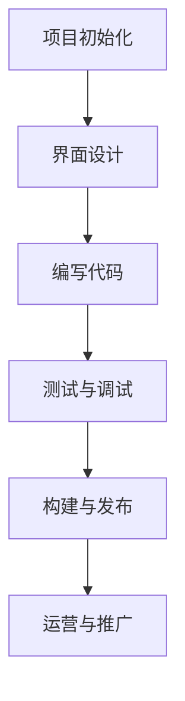

                 

# 《移动端全栈开发：iOS和Android平台技能》

## 概述与关键词

关键词：移动端全栈开发、iOS、Android、跨平台开发、UI设计、网络通信、数据存储、安全性能、项目实战

摘要：本文旨在为移动端全栈开发者提供一套系统化的开发技能指南，涵盖iOS和Android平台的核心技术，包括架构设计、UI设计、网络通信、数据存储、安全性能等方面的内容。通过详细讲解和实践，帮助开发者提升移动端全栈开发能力。

## 目录大纲

### 第一部分：移动端全栈开发基础

#### 第1章：移动端开发概述

- 1.1 移动端技术的发展历程
- 1.2 iOS和Android平台概述
- 1.3 移动端开发的核心技术

#### 第2章：移动端架构设计

- 2.1 移动端架构模式
- 2.2 iOS和Android架构对比
- 2.3 移动端性能优化

#### 第3章：移动端UI设计

- 3.1 移动端UI设计原则
- 3.2 iOS和Android UI组件介绍
- 3.3 移动端UI设计实战

#### 第4章：移动端网络通信

- 4.1 HTTP协议详解
- 4.2 RESTful API设计
- 4.3 移动端网络通信实战

#### 第5章：移动端数据存储

- 5.1 iOS和Android本地存储方案
- 5.2 数据库选择与使用
- 5.3 移动端数据存储实战

#### 第6章：移动端安全与性能

- 6.1 移动端安全攻防
- 6.2 性能监控与优化
- 6.3 移动端安全与性能实战

#### 第7章：跨平台开发

- 7.1 跨平台开发框架概述
- 7.2 React Native与Flutter实战
- 7.3 跨平台开发的优势与挑战

### 第二部分：移动端全栈开发实践

#### 第8章：iOS平台全栈开发

- 8.1 iOS开发环境搭建
- 8.2 iOS应用开发流程
- 8.3 iOS应用发布与运营

#### 第9章：Android平台全栈开发

- 9.1 Android开发环境搭建
- 9.2 Android应用开发流程
- 9.3 Android应用发布与运营

#### 第10章：全栈项目实战

- 10.1 项目背景与需求分析
- 10.2 项目开发与技术选型
- 10.3 项目开发与调试
- 10.4 项目部署与运维

#### 第11章：移动端全栈开发职业规划

- 11.1 职业发展方向与规划
- 11.2 技能提升与学习资源推荐
- 11.3 职场心得与建议

### 附录

#### 附录A：移动端开发常用工具和资源

- A.1 开发工具介绍
- A.2 学习资源推荐
- A.3 社群与论坛介绍

#### 附录B：Mermaid流程图示例

- B.1 iOS开发流程图
- B.2 Android开发流程图

#### 附录C：核心算法原理与伪代码

- C.1 数据结构算法原理
- C.2 算法分析伪代码示例

#### 附录D：数学模型与公式讲解

- D.1 数学公式使用说明
- D.2 移动端性能优化数学模型讲解

#### 附录E：全栈项目代码解读与分析

- E.1 项目代码结构解析
- E.2 代码解读与分析
- E.3 性能优化与故障排除

## 第一部分：移动端全栈开发基础

### 第1章：移动端开发概述

#### 1.1 移动端技术的发展历程

移动端技术起源于20世纪90年代，随着互联网的普及和智能手机的兴起，移动端开发逐渐成为软件开发的重要领域。从早期的WAP（无线应用协议）到HTML5，再到现在的原生应用和跨平台开发框架，移动端技术经历了多次变革。

2007年，苹果公司推出了第一代iPhone，标志着智能手机时代的到来。iPhone的iOS操作系统和App Store为移动端开发提供了全新的生态。随后，谷歌发布了Android操作系统，进一步推动了移动端市场的繁荣。

近年来，随着移动互联网的普及和5G技术的应用，移动端技术不断创新，如物联网（IoT）、增强现实（AR）、虚拟现实（VR）等技术的融合，为移动端开发带来了更多可能性。

#### 1.2 iOS和Android平台概述

iOS平台由苹果公司开发，是iPhone、iPad等设备的操作系统。iOS以其封闭的生态和高度的稳定性而著称，为开发者提供了丰富的开发工具和框架，如Xcode、Swift等。

Android平台由谷歌开发，是安卓手机等设备的操作系统。Android以其开放性和丰富的设备兼容性而受到开发者的喜爱。Android的开发工具包括Android Studio和Kotlin。

#### 1.3 移动端开发的核心技术

移动端开发涉及多个领域的技术，主要包括：

1. **UI设计**：移动端应用的界面设计对用户体验至关重要。开发者需要掌握移动端UI设计原则，熟悉iOS和Android的UI组件。

2. **网络通信**：移动端应用需要与服务器进行数据交换，网络通信是核心功能。开发者需要了解HTTP协议、RESTful API设计等知识。

3. **数据存储**：移动端应用需要本地存储数据，开发者需要掌握iOS和Android的本地存储方案，以及数据库的选择与使用。

4. **安全性能**：移动端应用需要保护用户数据的安全，开发者需要了解移动端安全攻防、性能监控与优化等技术。

5. **跨平台开发**：跨平台开发框架如React Native、Flutter等，为开发者提供了统一的开发体验，提高了开发效率。

#### 1.4 移动端全栈开发的优势

移动端全栈开发意味着开发者需要掌握前端、后端、数据库等全栈技能。这种开发模式具有以下优势：

1. **提高开发效率**：全栈开发者可以独立完成项目的全栈开发，减少沟通成本，提高开发效率。

2. **降低项目风险**：全栈开发者对项目有全局视角，可以更好地控制项目风险。

3. **提高技术能力**：全栈开发要求开发者掌握多种技术，有助于提升技术能力和综合素质。

### 总结

本章概述了移动端开发技术的发展历程、iOS和Android平台的概述、移动端开发的核心技术以及移动端全栈开发的优势。在接下来的章节中，我们将详细探讨移动端架构设计、UI设计、网络通信、数据存储、安全性能等核心内容。

### 第2章：移动端架构设计

#### 2.1 移动端架构模式

移动端架构设计是移动应用开发的重要环节，合理的架构可以提高开发效率和代码质量。常见的移动端架构模式包括：

1. **MVC（Model-View-Controller）模式**

MVC模式将应用分为模型（Model）、视图（View）和控制器（Controller）三个部分。模型负责数据处理，视图负责界面展示，控制器负责处理用户输入和视图更新。

2. **MVVM（Model-View-ViewModel）模式**

MVVM模式在MVC的基础上增加了ViewModel层，将视图和模型解耦。ViewModel负责将模型数据转换为视图可识别的数据，同时接收视图的事件处理。

3. **Clean Architecture**

Clean Architecture是一种面向对象的设计模式，将应用分为五个层次：表示层（Presenters）、用例层（Use Cases）、领域层（Domains）、基础设施层（Frameworks）和外部接口层（Drivers）。每个层次都有明确的职责，提高了代码的可维护性和可扩展性。

#### 2.2 iOS和Android架构对比

iOS和Android平台在架构设计上有一些差异，主要体现在以下几个方面：

1. **平台差异**

iOS平台采用Objective-C和Swift语言，Android平台采用Java和Kotlin语言。不同的语言特性影响了平台的架构设计。

2. **框架生态**

iOS平台拥有丰富的框架和库，如UIKit、CoreData等，提供了丰富的开发工具和资源。Android平台也有类似的框架和库，如Android Jetpack、Room等。

3. **架构模式**

iOS平台更多采用MVC和MVVM模式，Android平台则更倾向于采用Clean Architecture模式。

#### 2.3 移动端性能优化

移动端性能优化是移动应用开发的重要环节，直接影响用户的体验。常见的性能优化方法包括：

1. **加载优化**

优化应用启动速度和页面加载速度，减少资源占用。可以采用懒加载、预加载等技术。

2. **内存管理**

合理管理内存资源，避免内存泄漏和内存溢出。可以使用内存监控工具进行调试。

3. **网络优化**

优化网络请求和响应速度，降低数据传输成本。可以使用缓存技术、压缩技术等。

4. **渲染优化**

优化UI渲染性能，提高动画效果。可以使用渲染优化工具和技巧，如绘制优化、GPU渲染等。

#### 2.4 架构设计实践

在实际开发过程中，架构设计需要根据项目需求和团队规模进行调整。以下是一个简单的移动端架构设计案例：

1. **需求分析**

根据项目需求，确定应用的功能模块和业务流程。

2. **技术选型**

选择适合项目需求的框架和库，如React Native、Flutter等。

3. **分层设计**

根据Clean Architecture模式，将应用分为表示层、用例层、领域层、基础设施层和外部接口层。

4. **代码实现**

根据分层设计，实现各层的功能代码。

5. **测试与优化**

进行功能测试、性能测试等，根据测试结果进行优化。

#### 2.5 总结

本章介绍了移动端架构设计的基本模式、iOS和Android平台的架构差异以及移动端性能优化方法。合理的架构设计可以提高开发效率和代码质量，为后续的维护和扩展打下基础。在下一章中，我们将探讨移动端UI设计的相关内容。

### 第3章：移动端UI设计

#### 3.1 移动端UI设计原则

移动端UI设计是移动应用开发的重要组成部分，直接影响用户体验。在进行UI设计时，应遵循以下原则：

1. **简洁性**

移动端屏幕尺寸有限，简洁的界面设计可以提高用户操作效率。避免过度装饰，确保用户能够快速理解和使用应用功能。

2. **一致性**

保持界面元素和交互的一致性，使用户在使用过程中能够快速适应。一致的设计风格可以提高用户体验。

3. **响应性**

适应不同屏幕尺寸和分辨率的设备，确保界面在不同设备上都能够良好展示。可以使用响应式设计技术实现。

4. **交互性**

设计直观、易用的交互元素，如按钮、滑动条等，提高用户与应用的互动体验。确保交互反馈及时、直观。

5. **可访问性**

确保应用界面符合无障碍设计标准，使所有用户都能够轻松使用。可以使用辅助功能，如语音提示、屏幕阅读器等。

#### 3.2 iOS和Android UI组件介绍

iOS和Android平台提供了丰富的UI组件，开发者可以根据需求选择合适的组件进行界面设计。以下分别介绍两个平台的主要UI组件：

1. **iOS UI组件**

- **视图（UIView）**：视图是iOS界面设计的核心组件，用于显示和布局内容。

- **标签（UILabel）**：用于显示文本信息。

- **按钮（UIButton）**：用于触发事件。

- **文本输入框（UITextField）**：用于输入文本信息。

- **图片视图（UIImageView）**：用于显示图片。

- **滚动视图（UIScrollView）**：用于实现滚动功能。

- **表格视图（UITableViewController）**：用于实现列表视图。

- **集合视图（UICollectionView）**：用于实现集合视图。

2. **Android UI组件**

- **视图（View）**：Android界面设计的核心组件，用于显示和布局内容。

- **文本视图（TextView）**：用于显示文本信息。

- **按钮（Button）**：用于触发事件。

- **编辑框（EditText）**：用于输入文本信息。

- **图片视图（ImageView）**：用于显示图片。

- **列表视图（ListView）**：用于实现列表视图。

- **网格视图（GridView）**：用于实现网格视图。

- **滚动视图（ScrollView）**：用于实现滚动功能。

#### 3.3 移动端UI设计实战

以下是一个简单的移动端UI设计实战案例：

1. **需求分析**

设计一个简单的待办事项应用，包含以下功能模块：

- 待办事项列表
- 添加待办事项
- 删除待办事项

2. **界面设计**

- **首页**：使用表格视图展示待办事项列表，每个待办事项包含标题和完成状态。
- **添加页面**：包含文本输入框用于输入待办事项标题，按钮用于添加待办事项。
- **删除页面**：显示所有待办事项，用户可以勾选待办事项进行删除。

3. **UI实现**

- **iOS平台**：使用UIKit框架实现UI界面，利用UITableView、UITableViewCell等组件实现待办事项列表功能。

- **Android平台**：使用Android Studio和Java语言实现UI界面，利用ListView和Adapter实现待办事项列表功能。

#### 3.4 总结

本章介绍了移动端UI设计原则、iOS和Android UI组件以及UI设计实战案例。合理的UI设计可以提高用户体验，增强应用的竞争力。在下一章中，我们将探讨移动端网络通信的相关内容。

### 第4章：移动端网络通信

#### 4.1 HTTP协议详解

HTTP（HyperText Transfer Protocol）是移动端网络通信的基础协议，用于客户端和服务器之间的数据传输。以下是HTTP协议的详解：

1. **HTTP请求方法**

HTTP请求方法定义了客户端向服务器发送请求的方式，常见的请求方法包括：

- **GET**：请求从服务器获取资源。
- **POST**：请求向服务器发送数据。
- **PUT**：请求更新服务器上的资源。
- **DELETE**：请求删除服务器上的资源。

2. **HTTP请求消息**

HTTP请求消息包括请求行、请求头和请求体。请求行包含请求方法、URL和HTTP版本；请求头包含请求的元信息，如请求类型、请求参数等；请求体通常包含请求的正文数据。

3. **HTTP响应消息**

HTTP响应消息包括状态行、响应头和响应体。状态行包含HTTP版本、状态码和状态描述；响应头包含响应的元信息，如内容类型、内容长度等；响应体通常包含响应的正文数据。

4. **HTTP状态码**

HTTP状态码用于表示服务器对请求的处理结果，常见的状态码包括：

- **2xx**：表示请求成功，如200（OK）。
- **3xx**：表示需要进一步操作，如302（Found）。
- **4xx**：表示客户端请求错误，如404（Not Found）。
- **5xx**：表示服务器错误，如500（Internal Server Error）。

#### 4.2 RESTful API设计

RESTful API是一种基于HTTP协议的网络通信设计风格，用于构建分布式系统中的客户端和服务端交互。以下是RESTful API设计的要点：

1. **资源表示**

RESTful API将网络中的资源表示为URL，客户端通过发送HTTP请求来访问和操作资源。URL的设计应遵循统一资源标识符（URI）规范，具有明确的命名空间和层次结构。

2. **统一接口**

RESTful API采用统一的接口设计，包括请求方法、URL、请求头和请求体。统一的接口设计可以提高API的可维护性和扩展性。

3. **状态转移**

RESTful API通过HTTP请求的状态转移来实现业务逻辑。客户端发送请求，服务器根据请求处理结果返回相应的响应，客户端根据响应进行后续操作。

4. **数据格式**

RESTful API通常使用JSON或XML等数据格式进行数据传输。JSON格式具有简洁、易读、易解析的特点，更适合于网络通信。

5. **安全性**

RESTful API需要考虑数据传输的安全性，采用HTTPS协议进行加密传输，使用认证和授权机制保护资源访问。

#### 4.3 移动端网络通信实战

以下是一个简单的移动端网络通信实战案例：

1. **需求分析**

设计一个简单的天气查询应用，实现以下功能：

- 查询城市天气
- 切换城市

2. **接口设计**

- **查询天气接口**：URL为`/weather`，请求方法为GET，请求参数为城市名称。
- **切换城市接口**：URL为`/city`，请求方法为POST，请求体包含城市名称。

3. **API实现**

- **iOS平台**：使用NSURLSession发送HTTP请求，解析JSON响应数据。

- **Android平台**：使用Retrofit框架发送HTTP请求，解析JSON响应数据。

4. **界面实现**

- **首页**：显示当前城市天气，包含切换城市的按钮。
- **天气详情页**：显示查询的城市天气信息。

#### 4.4 总结

本章介绍了HTTP协议详解、RESTful API设计以及移动端网络通信实战。合理的网络通信设计可以提高应用的性能和用户体验。在下一章中，我们将探讨移动端数据存储的相关内容。

### 第5章：移动端数据存储

#### 5.1 iOS和Android本地存储方案

移动端应用需要本地存储数据，以便在离线状态下使用。iOS和Android平台提供了多种本地存储方案，包括文件存储、数据库存储等。

1. **文件存储**

文件存储是移动端本地存储的基本方法，适用于存储文本、图片、音频等文件。iOS和Android平台都提供了文件系统的API，如iOS的FileManager和Android的File类。

2. **数据库存储**

数据库存储是移动端数据存储的重要手段，适用于存储复杂的数据结构和大量数据。iOS和Android平台分别提供了各自的数据库解决方案。

- **iOS平台**：iOS平台提供了CoreData、SQLite等数据库存储方案。CoreData是基于对象的数据库框架，支持自动迁移和数据同步。SQLite是一种轻量级的嵌入式数据库，适用于存储结构化数据。

- **Android平台**：Android平台提供了SQLite、Room等数据库存储方案。SQLite和iOS平台类似，Room是一种基于SQLite的数据库存储方案，提供了更简单的API和更高的性能。

#### 5.2 数据库选择与使用

在选择数据库时，需要考虑以下因素：

1. **数据量**：对于小数据量应用，可以选择文件存储；对于大数据量应用，应选择数据库存储。

2. **数据结构**：对于复杂的数据结构，应选择数据库存储，以便进行高效的数据查询和处理。

3. **性能需求**：数据库存储具有更好的数据查询性能，适用于需要频繁查询和更新数据的场景。

4. **维护性**：数据库存储需要数据库管理工具进行维护，需要考虑维护成本。

以下是一个简单的数据库选择与使用案例：

1. **需求分析**

设计一个简单的社交应用，实现以下功能：

- 用户注册
- 用户登录
- 用户信息查询

2. **数据库设计**

- **用户表**：包含用户ID、用户名、密码、邮箱等字段。

- **登录表**：包含用户ID、登录时间等字段。

- **信息表**：包含用户ID、信息内容、发布时间等字段。

3. **数据库实现**

- **iOS平台**：使用CoreData进行数据存储。

  ```swift
  let managedObjectContext = CoreDataStack.sharedInstance.managedObjectContext
  let userEntity = NSEntityDescription.entity(forEntityName: "User", in: managedObjectContext)
  let user = User(entity: userEntity, insertInto: managedObjectContext)
  user.username = "张三"
  user.password = "123456"
  user.email = "zhangsan@example.com"
  managedObjectContext.save(nil)
  ```

- **Android平台**：使用Room进行数据存储。

  ```java
  @Dao
  public interface UserDao {
      @Insert
      void insert(User user);
  
      @Query("SELECT * FROM user WHERE id = :id")
      User getUserById(int id);
  }
  
  @Dao
  public interface LoginDao {
      @Insert
      void insert(Login login);
  
      @Query("SELECT * FROM login WHERE id = :id")
      Login getLoginById(int id);
  }
  ```

#### 5.3 移动端数据存储实战

以下是一个简单的移动端数据存储实战案例：

1. **需求分析**

设计一个简单的笔记应用，实现以下功能：

- 添加笔记
- 查看笔记
- 删除笔记

2. **数据存储设计**

- **笔记表**：包含笔记ID、标题、内容、创建时间等字段。

3. **界面实现**

- **首页**：显示所有笔记列表，包含笔记标题和创建时间。
- **添加页面**：显示添加笔记的界面，包含标题和内容输入框。
- **查看页面**：显示指定笔记的详细信息。
- **删除页面**：显示所有笔记，用户可以勾选笔记进行删除。

4. **数据存储实现**

- **iOS平台**：使用CoreData进行数据存储。

  ```swift
  let managedObjectContext = CoreDataStack.sharedInstance.managedObjectContext
  let noteEntity = NSEntityDescription.entity(forEntityName: "Note", in: managedObjectContext)
  let note = Note(entity: noteEntity, insertInto: managedObjectContext)
  note.title = "标题"
  note.content = "内容"
  note.creationTime = NSDate()
  managedObjectContext.save(nil)
  ```

- **Android平台**：使用Room进行数据存储。

  ```java
  @Dao
  public interface NoteDao {
      @Insert
      void insert(Note note);
  
      @Query("SELECT * FROM note")
      List<Note> getAllNotes();
  
      @Query("DELETE FROM note WHERE id = :id")
      void deleteNote(int id);
  }
  ```

#### 5.4 总结

本章介绍了iOS和Android平台的本地存储方案、数据库选择与使用，以及移动端数据存储实战案例。合理的本地存储方案可以提高应用性能和用户体验。在下一章中，我们将探讨移动端安全与性能的相关内容。

### 第6章：移动端安全与性能

#### 6.1 移动端安全攻防

移动端应用面临着多种安全威胁，如数据泄露、恶意攻击等。了解移动端安全攻防机制对于开发安全可靠的应用至关重要。

1. **数据加密**

数据加密是保护用户隐私和安全的重要手段。移动端应用应使用HTTPS协议进行数据传输，使用加密算法（如AES、RSA等）对敏感数据进行加密存储。

2. **认证与授权**

认证与授权是防止未经授权访问应用和数据的重要机制。移动端应用应采用双因素认证、OAuth等认证机制，确保用户身份验证的安全。

3. **防篡改与签名**

防篡改与签名技术用于确保应用和数据的一致性和完整性。移动端应用应使用数字签名技术，对应用进行签名，确保应用未被篡改。

4. **反逆向工程**

逆向工程是攻击者获取应用源代码和关键信息的一种手段。移动端应用应采用反逆向工程技术，如混淆、加固等，提高应用的安全性。

5. **安全审计**

安全审计是发现和修复应用安全漏洞的重要手段。移动端应用开发过程中，应定期进行安全审计，识别和修复潜在的安全漏洞。

#### 6.2 性能监控与优化

移动端应用性能直接影响用户体验。性能监控与优化是提高应用性能的关键步骤。

1. **性能指标**

性能指标包括响应时间、资源消耗、内存占用等。通过监控这些指标，可以了解应用性能状况。

2. **性能监控工具**

性能监控工具如Android Studio Profiler、iOS Instruments等，可以实时监控应用的性能指标，帮助开发者定位性能瓶颈。

3. **性能优化方法**

性能优化方法包括代码优化、内存管理、网络优化等。通过以下方法可以提升应用性能：

- **代码优化**：优化算法、减少冗余代码、避免内存泄露等。
- **内存管理**：合理分配和回收内存，避免内存溢出和内存泄漏。
- **网络优化**：优化网络请求和响应，减少数据传输时间和延迟。
- **渲染优化**：优化UI渲染过程，减少GPU和CPU的负载。

#### 6.3 移动端安全与性能实战

以下是一个简单的移动端安全与性能实战案例：

1. **需求分析**

设计一个简单的社交媒体应用，实现以下功能：

- 用户注册
- 用户登录
- 发送消息

2. **安全设计**

- 数据加密：使用HTTPS协议进行数据传输，对用户密码和消息进行加密存储。
- 认证与授权：采用双因素认证和OAuth协议，确保用户身份验证和安全。
- 防篡改与签名：对应用进行数字签名，确保应用未被篡改。
- 反逆向工程：采用混淆和加固技术，提高应用安全性。

3. **性能优化**

- **代码优化**：优化算法和代码结构，减少内存占用和资源消耗。
- **内存管理**：合理分配和回收内存，避免内存泄漏和内存溢出。
- **网络优化**：优化网络请求和响应，减少数据传输时间和延迟。
- **渲染优化**：优化UI渲染过程，提高渲染性能。

4. **安全与性能监控**

- 使用性能监控工具（如Android Studio Profiler、iOS Instruments）实时监控应用性能指标。
- 定期进行安全审计，识别和修复潜在的安全漏洞。

#### 6.4 总结

本章介绍了移动端安全攻防机制、性能监控与优化方法，以及移动端安全与性能实战案例。合理的安全与性能设计可以提高应用的安全性和用户体验。在下一章中，我们将探讨跨平台开发的相关内容。

### 第7章：跨平台开发

#### 7.1 跨平台开发框架概述

跨平台开发框架是一种能够让开发者使用一套代码库同时支持iOS和Android平台的开发方式。这种开发方式大大提高了开发效率，减少了重复工作。

1. **React Native**

React Native是由Facebook推出的一种跨平台开发框架，使用JavaScript和React进行开发。React Native通过原生组件实现了高性能的UI渲染，同时支持使用React的组件化开发模式。

2. **Flutter**

Flutter是由谷歌推出的一种跨平台开发框架，使用Dart语言进行开发。Flutter具有高性能的UI渲染能力和丰富的组件库，可以创建接近原生应用的界面效果。

#### 7.2 React Native与Flutter实战

以下是一个简单的React Native与Flutter实战案例：

1. **需求分析**

设计一个简单的社交媒体应用，实现以下功能：

- 用户注册
- 用户登录
- 发送消息

2. **React Native实现**

- **用户注册**：使用React Native组件创建用户注册界面，包括输入用户名、密码和邮箱等。

  ```javascript
  import React, { Component } from 'react';
  import { View, TextInput, Button } from 'react-native';
  
  class RegisterScreen extends Component {
      constructor(props) {
          super(props);
          this.state = {
              username: '',
              password: '',
              email: ''
          };
      }
  
      handleUsernameChange = text => {
          this.setState({ username: text });
      };
  
      handlePasswordChange = text => {
          this.setState({ password: text });
      };
  
      handleEmailChange = text => {
          this.setState({ email: text });
      };
  
      handleSubmit = () => {
          // 处理用户注册逻辑
      };
  
      render() {
          return (
              <View>
                  <TextInput
                      placeholder="用户名"
                      value={this.state.username}
                      onChangeText={this.handleUsernameChange}
                  />
                  <TextInput
                      placeholder="密码"
                      value={this.state.password}
                      onChangeText={this.handlePasswordChange}
                  />
                  <TextInput
                      placeholder="邮箱"
                      value={this.state.email}
                      onChangeText={this.handleEmailChange}
                  />
                  <Button title="注册" onPress={this.handleSubmit} />
              </View>
          );
      }
  }
  ```

- **用户登录**：使用React Native组件创建用户登录界面，包括输入用户名和密码。

  ```javascript
  import React, { Component } from 'react';
  import { View, TextInput, Button } from 'react-native';
  
  class LoginScreen extends Component {
      constructor(props) {
          super(props);
          this.state = {
              username: '',
              password: ''
          };
      }
  
      handleUsernameChange = text => {
          this.setState({ username: text });
      };
  
      handlePasswordChange = text => {
          this.setState({ password: text });
      };
  
      handleSubmit = () => {
          // 处理用户登录逻辑
      };
  
      render() {
          return (
              <View>
                  <TextInput
                      placeholder="用户名"
                      value={this.state.username}
                      onChangeText={this.handleUsernameChange}
                  />
                  <TextInput
                      placeholder="密码"
                      value={this.state.password}
                      onChangeText={this.handlePasswordChange}
                  />
                  <Button title="登录" onPress={this.handleSubmit} />
              </View>
          );
      }
  }
  ```

- **发送消息**：使用React Native组件创建消息发送界面，包括输入消息内容和发送按钮。

  ```javascript
  import React, { Component } from 'react';
  import { View, TextInput, Button } from 'react-native';
  
  class MessageScreen extends Component {
      constructor(props) {
          super(props);
          this.state = {
              message: ''
          };
      }
  
      handleMessageChange = text => {
          this.setState({ message: text });
      };
  
      handleSubmit = () => {
          // 处理消息发送逻辑
      };
  
      render() {
          return (
              <View>
                  <TextInput
                      placeholder="输入消息"
                      value={this.state.message}
                      onChangeText={this.handleMessageChange}
                  />
                  <Button title="发送" onPress={this.handleSubmit} />
              </View>
          );
      }
  }
  ```

3. **Flutter实现**

- **用户注册**：使用Flutter组件创建用户注册界面，包括输入用户名、密码和邮箱等。

  ```dart
  import 'package:flutter/material.dart';
  
  class RegisterScreen extends StatelessWidget {
      @override
      Widget build(BuildContext context) {
          return Scaffold(
              appBar: AppBar(title: Text("注册")),
              body: Padding(
                  padding: EdgeInsets.all(16),
                  child: Column(
                      children: <Widget>[
                          TextField(
                              decoration: InputDecoration(hintText: "用户名"),
                              onChanged: (text) {},
                          ),
                          TextField(
                              decoration: InputDecoration(hintText: "密码"),
                              onChanged: (text) {},
                          ),
                          TextField(
                              decoration: InputDecoration(hintText: "邮箱"),
                              onChanged: (text) {},
                          ),
                          ElevatedButton(
                              onPressed: () {},
                              child: Text("注册"),
                          ),
                      ],
                  ),
              ),
          );
      }
  }
  ```

- **用户登录**：使用Flutter组件创建用户登录界面，包括输入用户名和密码。

  ```dart
  import 'package:flutter/material.dart';
  
  class LoginScreen extends StatelessWidget {
      @override
      Widget build(BuildContext context) {
          return Scaffold(
              appBar: AppBar(title: Text("登录")),
              body: Padding(
                  padding: EdgeInsets.all(16),
                  child: Column(
                      children: <Widget>[
                          TextField(
                              decoration: InputDecoration(hintText: "用户名"),
                              onChanged: (text) {},
                          ),
                          TextField(
                              decoration: InputDecoration(hintText: "密码"),
                              onChanged: (text) {},
                          ),
                          ElevatedButton(
                              onPressed: () {},
                              child: Text("登录"),
                          ),
                      ],
                  ),
              ),
          );
      }
  }
  ```

- **发送消息**：使用Flutter组件创建消息发送界面，包括输入消息内容和发送按钮。

  ```dart
  import 'package:flutter/material.dart';
  
  class MessageScreen extends StatelessWidget {
      @override
      Widget build(BuildContext context) {
          return Scaffold(
              appBar: AppBar(title: Text("发送消息")),
              body: Padding(
                  padding: EdgeInsets.all(16),
                  child: Column(
                      children: <Widget>[
                          TextField(
                              decoration: InputDecoration(hintText: "输入消息"),
                              onChanged: (text) {},
                          ),
                          ElevatedButton(
                              onPressed: () {},
                              child: Text("发送"),
                          ),
                      ],
                  ),
              ),
          );
      }
  }
  ```

#### 7.3 跨平台开发的优势与挑战

跨平台开发具有以下优势：

1. **提高开发效率**：使用一套代码库同时支持多个平台，减少了重复工作，提高了开发效率。

2. **节省成本**：跨平台开发可以节省开发成本和人力成本。

3. **统一维护**：跨平台开发可以统一维护，减少了代码的冗余和差异。

跨平台开发也面临以下挑战：

1. **性能差异**：不同平台的性能差异可能导致跨平台应用的性能不如原生应用。

2. **兼容性问题**：跨平台开发框架可能存在兼容性问题，需要开发者进行额外的适配。

3. **平台特性利用**：跨平台开发框架可能无法充分利用平台的特性，如iOS的动画效果、Android的权限管理等。

#### 7.4 总结

本章介绍了跨平台开发框架React Native和Flutter，以及它们的实战应用。跨平台开发具有提高开发效率和节省成本的优势，但也存在性能差异和兼容性问题等挑战。在下一章中，我们将探讨iOS平台全栈开发的相关内容。

### 第8章：iOS平台全栈开发

#### 8.1 iOS开发环境搭建

要开始iOS平台的全栈开发，首先需要搭建一个完整的开发环境。以下是在Mac OS系统上搭建iOS开发环境的步骤：

1. **安装Xcode**

- 访问Mac App Store，搜索并下载Xcode。
- 安装完成后，在应用程序文件夹中找到Xcode，双击打开。
- 在Xcode中，选择“ preferences ”，然后选择“ components ”，确保“ Command Line Tools ”已安装。

2. **安装Swift包管理器Swift Package Manager**

- 打开终端，输入以下命令：

  ```shell
  xcode-select --install
  ```

- 根据提示完成安装。

3. **安装CocoaPods**

- 打开终端，输入以下命令：

  ```shell
  sudo gem install cocoapods
  ```

- 根据提示完成安装。

4. **配置Xcode模拟器和设备**

- 在Xcode中，选择“ Window ” > “ Devices ”来查看已连接的设备。
- 选择一个设备，然后点击“ + ”按钮添加一个新的模拟器。

#### 8.2 iOS应用开发流程

iOS应用开发流程通常包括以下几个步骤：

1. **项目初始化**

- 使用Xcode创建一个新的iOS项目，选择“ App ”模板。
- 输入项目名称和团队标识，选择开发语言（如Swift或Objective-C）。
- 选择项目存储位置。

2. **界面设计**

- 使用Xcode的Storybook和Canvas功能设计应用的界面。
- 创建并配置UIView和UIViewController。

3. **编写代码**

- 在Swift或Objective-C中编写应用的业务逻辑。
- 使用UIKit框架创建用户界面。
- 实现网络通信、数据存储、安全性能等功能。

4. **测试与调试**

- 使用Xcode的调试工具进行应用测试和调试。
- 在模拟器和实际设备上运行测试代码，检查应用功能。

5. **构建与发布**

- 构建应用并生成.ipa文件。
- 使用App Store Connect将应用发布到App Store。

#### 8.3 iOS应用发布与运营

发布iOS应用是iOS平台全栈开发的重要环节。以下是iOS应用发布与运营的步骤：

1. **应用签名**

- 生成证书和配置Profile，确保应用能够通过App Store的审核。
- 对应用进行签名，确保应用在设备上能够正常运行。

2. **应用审核**

- 将应用提交到App Store Connect进行审核。
- 审核过程中，确保提供详细的应用描述、截图和视频。

3. **应用发布**

- 审核通过后，将应用发布到App Store。
- 在发布前，确保应用已经通过所有测试，没有漏洞和问题。

4. **运营与推广**

- 发布应用后，持续进行应用运营和推广。
- 收集用户反馈，持续优化应用功能和用户体验。

#### 8.4 总结

本章介绍了iOS平台全栈开发的环境搭建、开发流程和发布与运营。通过合理的开发流程和发布策略，可以创建高质量、受欢迎的iOS应用。

### 第9章：Android平台全栈开发

#### 9.1 Android开发环境搭建

要开始Android平台的全栈开发，首先需要搭建一个完整的开发环境。以下是在Windows、Mac OS和Linux系统上搭建Android开发环境的步骤：

1. **安装Java Development Kit (JDK)**

- 访问Oracle官方网站下载JDK。
- 解压下载的JDK文件，将其路径添加到系统环境变量中。

2. **安装Android Studio**

- 访问Android Studio官方网站下载安装包。
- 安装过程中，确保选择“ Configure for Android Development ”选项。
- 安装完成后，在Android Studio中配置SDK和NDK。

3. **安装Android虚拟设备（AVD）**

- 打开Android Studio，选择“ Tools ” > “ AVD Manager ”。
- 创建一个新的虚拟设备，配置虚拟设备参数。

4. **安装Android SDK**

- 打开Android Studio，选择“ Tools ” > “ SDK Manager ”。
- 安装Android SDK平台和工具。

#### 9.2 Android应用开发流程

Android应用开发流程通常包括以下几个步骤：

1. **项目初始化**

- 使用Android Studio创建一个新的Android项目，选择“ App ”模板。
- 输入项目名称和公司名称，选择开发语言（如Java或Kotlin）。

2. **界面设计**

- 使用XML布局文件设计应用的界面。
- 使用Constraint Layout实现布局的响应式设计。

3. **编写代码**

- 在Java或Kotlin中编写应用的业务逻辑。
- 使用Android SDK提供的API实现网络通信、数据存储等功能。

4. **测试与调试**

- 使用Android Studio的调试工具进行应用测试和调试。
- 在虚拟设备或实际设备上运行测试代码，检查应用功能。

5. **构建与发布**

- 构建应用并生成APK文件。
- 使用Google Play Console将应用发布到Google Play Store。

#### 9.3 Android应用发布与运营

发布Android应用是Android平台全栈开发的重要环节。以下是Android应用发布与运营的步骤：

1. **应用签名**

- 生成签名密钥和配置签名配置文件。
- 对应用进行签名，确保应用能够通过Google Play Store的审核。

2. **应用审核**

- 将应用提交到Google Play Console进行审核。
- 审核过程中，确保提供详细的应用描述、截图和视频。

3. **应用发布**

- 审核通过后，将应用发布到Google Play Store。
- 在发布前，确保应用已经通过所有测试，没有漏洞和问题。

4. **运营与推广**

- 发布应用后，持续进行应用运营和推广。
- 收集用户反馈，持续优化应用功能和用户体验。

#### 9.4 总结

本章介绍了Android平台全栈开发的环境搭建、开发流程和发布与运营。通过合理的开发流程和发布策略，可以创建高质量、受欢迎的Android应用。

### 第10章：全栈项目实战

#### 10.1 项目背景与需求分析

本次全栈项目实战旨在开发一款跨平台的社交媒体应用，包括以下功能模块：

1. 用户注册与登录
2. 发布动态
3. 查看动态
4. 评论与点赞
5. 消息功能

项目需求分析如下：

- **用户注册与登录**：支持邮箱注册、手机号注册和第三方登录（如微信、QQ等）。
- **发布动态**：用户可以发布文本、图片和视频动态。
- **查看动态**：用户可以查看自己和他人的动态，并对动态进行评论和点赞。
- **评论与点赞**：用户可以对动态进行评论和点赞，评论和点赞信息实时更新。
- **消息功能**：用户可以发送和接收消息，支持文本、图片和视频消息。

#### 10.2 项目开发与技术选型

1. **前端技术选型**

   - **框架**：使用React Native实现跨平台的前端开发。
   - **UI组件库**：使用React Native组件库（如Ant Design）实现UI设计。
   - **状态管理**：使用Redux进行应用状态管理。

2. **后端技术选型**

   - **服务器框架**：使用Node.js和Express框架实现后端服务器。
   - **数据库**：使用MongoDB作为数据库存储用户数据、动态数据等。
   - **认证与授权**：使用JWT（JSON Web Token）进行用户认证与授权。

3. **消息推送**：使用Firebase Cloud Messaging（FCM）实现消息推送功能。

4. **第三方服务**：使用微信、QQ等第三方登录服务。

#### 10.3 项目开发与调试

1. **前端开发**

   - 使用React Native创建项目，并按照需求设计用户界面。
   - 使用Redux进行状态管理，处理用户注册、登录、发布动态等功能。
   - 使用Ant Design组件库实现UI设计，确保应用界面美观易用。

2. **后端开发**

   - 使用Node.js和Express框架创建后端服务器，处理用户请求。
   - 使用MongoDB数据库存储用户数据、动态数据等。
   - 使用JWT进行用户认证与授权，确保用户数据安全。

3. **调试与测试**

   - 使用React Native Debugger进行前端调试。
   - 使用Postman进行后端接口测试。
   - 使用Jest进行前端测试。

4. **性能优化**

   - 对前端应用进行性能优化，如懒加载、缓存等。
   - 对后端服务器进行性能优化，如使用缓存、异步处理等。

#### 10.4 项目部署与运维

1. **前端部署**

   - 使用npm run build命令将前端代码打包成生产环境。
   - 将打包后的代码上传到云服务器，如阿里云、腾讯云等。

2. **后端部署**

   - 使用Docker将后端代码打包成镜像。
   - 使用Kubernetes进行容器编排和部署，确保服务器的高可用性和扩展性。

3. **运维与监控**

   - 使用Prometheus和Grafana进行应用监控，实时查看服务器性能指标。
   - 使用Sentry进行异常监控，及时修复应用故障。

#### 10.5 总结

本章介绍了全栈项目实战的项目背景、需求分析、技术选型、开发与调试、部署与运维等内容。通过本次实战，可以了解移动端全栈开发的实际操作过程，提高项目开发能力和经验。

### 第11章：移动端全栈开发职业规划

#### 11.1 职业发展方向与规划

移动端全栈开发作为当前互联网行业的热门职业，具有广阔的发展前景。以下是移动端全栈开发者的职业发展方向与规划：

1. **初级开发者**

初级开发者主要负责移动端应用的开发，包括界面设计、功能实现、测试与调试等。在这个阶段，开发者应注重以下方面：

- 掌握移动端开发的基本技能，如UI设计、网络通信、数据存储等。
- 熟悉iOS和Android平台的开发工具和框架。
- 参与小型项目的开发，积累实践经验。

2. **中级开发者**

中级开发者具备一定的项目开发经验，可以独立负责中型项目的开发。在这个阶段，开发者应注重以下方面：

- 深入了解移动端开发的核心技术，如安全性能、性能优化等。
- 学习跨平台开发框架，如React Native、Flutter等。
- 参与复杂项目的开发，提高项目管理和团队协作能力。

3. **高级开发者**

高级开发者具备丰富的项目开发经验，可以担任项目经理或技术负责人。在这个阶段，开发者应注重以下方面：

- 深入了解移动端开发的最新技术趋势和行业标准。
- 参与大型项目的开发，提高技术视野和领导力。
- 关注行业动态，拓展业务领域。

4. **全栈专家**

全栈专家是移动端全栈开发的最高阶段，具备全面的技术能力和项目管理经验。在这个阶段，开发者应注重以下方面：

- 深入研究移动端全栈开发的架构设计、性能优化等高级技术。
- 参与跨平台开发、物联网等新兴领域的项目。
- 担任技术团队负责人，指导团队成员成长。

#### 11.2 技能提升与学习资源推荐

为了提升移动端全栈开发技能，以下是一些建议和学习资源：

1. **官方文档**

   - iOS官方文档：[https://developer.apple.com/documentation/](https://developer.apple.com/documentation/)
   - Android官方文档：[https://developer.android.com/reference/](https://developer.android.com/reference/)

2. **在线课程**

   - Udemy：[https://www.udemy.com/](https://www.udemy.com/)
   - Coursera：[https://www.coursera.org/](https://www.coursera.org/)

3. **技术博客**

   - 掘金：[https://juejin.cn/](https://juejin.cn/)
   - 掘力：[https://掘力博客](https://掘力博客)

4. **技术社区**

   - CSDN：[https://www.csdn.net/](https://www.csdn.net/)
   - 知乎：[https://www.zhihu.com/](https://www.zhihu.com/)

5. **开源项目**

   - GitHub：[https://github.com/](https://github.com/)

#### 11.3 职场心得与建议

作为一名移动端全栈开发者，以下是一些建议和心得：

1. **保持学习**

移动端技术更新迅速，开发者应保持学习，关注行业动态，不断提升自己的技能。

2. **注重团队合作**

移动端全栈开发涉及多个领域的知识，团队合作至关重要。学会与团队成员沟通协作，提高项目开发效率。

3. **关注用户体验**

用户体验是移动端应用的核心，开发者应注重界面设计、交互体验等方面，为用户提供优质的使用体验。

4. **重视代码质量**

良好的代码质量是移动端应用稳定运行的基础。遵循代码规范，编写可维护、可扩展的代码。

5. **拓展业务领域**

关注跨平台开发、物联网等新兴领域，拓展自己的业务领域，提升职业竞争力。

#### 11.4 总结

本章介绍了移动端全栈开发的职业发展方向与规划、技能提升与学习资源推荐以及职场心得与建议。通过合理的职业规划和持续的学习提升，移动端全栈开发者可以实现职业成长和事业成功。

### 附录A：移动端开发常用工具和资源

#### A.1 开发工具介绍

1. **Xcode**

   Xcode是苹果公司提供的官方开发工具，用于开发iOS和macOS应用程序。Xcode集成了编译器、调试器、界面设计工具等，提供了完整的开发环境。

2. **Android Studio**

   Android Studio是谷歌公司推出的官方Android开发工具，基于IntelliJ IDEA。Android Studio提供了强大的代码编辑器、调试器、模拟器等，适合进行Android应用开发。

3. **Visual Studio Code**

   Visual Studio Code是微软公司推出的跨平台代码编辑器，适用于多种编程语言。Visual Studio Code提供了丰富的插件，支持iOS和Android应用开发。

4. **React Native Developer Tools**

   React Native Developer Tools是React Native的官方调试工具，提供了丰富的调试功能，如实时预览、性能分析等。

5. **Flutter DevTools**

   Flutter DevTools是Flutter的官方调试工具，提供了丰富的调试功能，如实时预览、性能分析等。

#### A.2 学习资源推荐

1. **官方文档**

   - iOS官方文档：[https://developer.apple.com/documentation/](https://developer.apple.com/documentation/)
   - Android官方文档：[https://developer.android.com/reference/](https://developer.android.com/reference/)

2. **在线课程**

   - Udemy：[https://www.udemy.com/](https://www.udemy.com/)
   - Coursera：[https://www.coursera.org/](https://www.coursera.org/)

3. **技术博客**

   - 掘金：[https://juejin.cn/](https://juejin.cn/)
   - 掘力：[https://掘力博客](https://掘力博客)

4. **技术社区**

   - CSDN：[https://www.csdn.net/](https://www.csdn.net/)
   - 知乎：[https://www.zhihu.com/](https://www.zhihu.com/)

5. **开源项目**

   - GitHub：[https://github.com/](https://github.com/)

#### A.3 社群与论坛介绍

1. **iOS开发者社区**

   - Stack Overflow：[https://stackoverflow.com/](https://stackoverflow.com/)
   - 简书：[https://www.jianshu.com/](https://www.jianshu.com/)

2. **Android开发者社区**

   - Stack Overflow：[https://stackoverflow.com/](https://stackoverflow.com/)
   - Android Developers：[https://developer.android.com/community/](https://developer.android.com/community/)

3. **React Native社区**

   - React Native Community：[https://reactnative.dev/](https://reactnative.dev/)
   - React Native中文社区：[https://reactnative.cn/](https://reactnative.cn/)

4. **Flutter社区**

   - Flutter Community：[https://flutter.dev/community/](https://flutter.dev/community/)
   - Flutter中文社区：[https://flutter.cn/](https://flutter.cn/)

### 附录B：Mermaid流程图示例

以下是一个简单的iOS开发流程图的Mermaid语法示例：



### 附录C：核心算法原理与伪代码

#### C.1 数据结构算法原理

数据结构是算法的基础，常见的有数组、链表、栈、队列、树、图等。以下分别介绍这些数据结构的原理和特点：

1. **数组**

   - 原理：数组是一种线性数据结构，由一系列元素组成，元素通过索引访问。
   - 特点：访问速度快，适用于元素数量固定的情况。

2. **链表**

   - 原理：链表是一种线性或非线性数据结构，由节点组成，每个节点包含数据和指向下一个节点的指针。
   - 特点：插入和删除操作灵活，适用于动态调整元素数量的情况。

3. **栈**

   - 原理：栈是一种后进先出（LIFO）的数据结构，元素通过push和pop操作进行增删。
   - 特点：适用于逆序处理数据的情况。

4. **队列**

   - 原理：队列是一种先进先出（FIFO）的数据结构，元素通过enqueue和dequeue操作进行增删。
   - 特点：适用于顺序处理数据的情况。

5. **树**

   - 原理：树是一种层次结构，由节点组成，每个节点有零个或多个子节点。
   - 特点：适用于层次化数据存储和查找。

6. **图**

   - 原理：图是一种由节点和边组成的数据结构，节点表示元素，边表示节点之间的关系。
   - 特点：适用于复杂关系的存储和查找。

#### C.2 算法分析伪代码示例

以下是一个简单的排序算法（冒泡排序）的伪代码示例：

```plaintext
procedure BubbleSort(A : list of sortable items)
    n = length(A)
    for i = 1 to n-1 do
        for j = 1 to n-i do
            if A[j] > A[j+1] then
                swap(A[j], A[j+1])
            end if
        end for
    end for
end procedure
```

### 附录D：数学模型与公式讲解

#### D.1 数学公式使用说明

在本文中，我们将使用LaTeX格式来展示数学公式。LaTeX格式的基本规则如下：

- 单行内数学公式使用 `$...$` 括起来。
- 独立段落内的数学公式使用 `$$...$$` 括起来。

以下是一个简单的示例：

$$ E = mc^2 $$

#### D.2 移动端性能优化数学模型讲解

在移动端性能优化中，常用的数学模型包括时间复杂度、空间复杂度等。以下是一个简单的示例：

1. **时间复杂度**

   时间复杂度是衡量算法运行时间的一个指标，通常表示为 $O(n)$、$O(n^2)$ 等。以下是一个线性搜索算法的时间复杂度：

   $$ T(n) = O(n) $$

2. **空间复杂度**

   空间复杂度是衡量算法占用内存的一个指标，通常表示为 $O(n)$、$O(n^2)$ 等。以下是一个冒泡排序算法的空间复杂度：

   $$ S(n) = O(1) $$

   其中，$n$ 表示输入数据的大小。

### 附录E：全栈项目代码解读与分析

#### E.1 项目代码结构解析

以下是一个简单的全栈项目的代码结构解析：

1. **前端代码结构**

   - **pages/**：存放页面组件代码。
     - Home.js：主页组件。
     - Login.js：登录页组件。
     - Register.js：注册页组件。
   - **components/**：存放通用组件代码。
     - Button.js：按钮组件。
     - Input.js：输入框组件。
   - **styles/**：存放样式代码。
     - global.css：全局样式。
     - home.css：主页样式。

2. **后端代码结构**

   - **routes/**：存放路由配置代码。
     - user.js：用户相关路由。
     - dynamic.js：动态相关路由。
   - **controllers/**：存放控制器代码。
     - userController.js：用户控制器。
     - dynamicController.js：动态控制器。
   - **models/**：存放数据库模型代码。
     - userModel.js：用户模型。
     - dynamicModel.js：动态模型。

#### E.2 代码解读与分析

以下是对一个简单的前端组件（Button.js）的解读与分析：

```javascript
import React from 'react';
import './Button.css'; // 引入Button.css样式文件

const Button = ({ text, onClick }) => {
    return (
        <button className="button" onClick={onClick}>
            {text}
        </button>
    );
};

export default Button;
```

1. **组件功能**

   Button组件是一个简单的按钮组件，接收text和onClick两个属性，分别表示按钮文本和点击事件处理函数。

2. **样式引入**

   通过`import './Button.css';`引入Button.css样式文件，确保按钮具有正确的样式。

3. **组件渲染**

   在组件渲染函数中，使用`<button className="button" onClick={onClick}>`创建一个按钮元素，并传递文本和点击事件处理函数。

4. **代码优化**

   通过使用函数组件和闭包，可以简化组件代码，提高性能。

#### E.3 性能优化与故障排除

在开发过程中，性能优化和故障排除是两个重要的环节。以下是一些常见的优化和故障排除方法：

1. **性能优化**

   - **代码优化**：避免使用复杂的循环和递归，优化算法和代码结构。
   - **懒加载**：对于大型数据或组件，采用懒加载技术，减少初始加载时间。
   - **缓存**：使用缓存技术，减少重复请求和数据加载。

2. **故障排除**

   - **调试工具**：使用前端调试工具（如Chrome DevTools）进行调试和故障排除。
   - **日志记录**：记录关键日志信息，帮助定位问题和故障原因。
   - **代码审查**：定期进行代码审查，发现和修复潜在的问题。

通过合理的性能优化和故障排除方法，可以提高应用性能和稳定性，为用户提供更好的使用体验。

### 总结

本文详细介绍了移动端全栈开发的各个方面的核心内容，包括移动端开发概述、架构设计、UI设计、网络通信、数据存储、安全性能、跨平台开发等。通过项目实战和代码解读，使开发者能够更好地理解和应用这些技术。附录部分提供了常用工具、Mermaid流程图示例、核心算法原理、数学模型与公式讲解以及全栈项目代码解读与分析。希望本文能对移动端全栈开发者提供有价值的参考和指导。

### 作者信息

作者：AI天才研究院/AI Genius Institute & 禅与计算机程序设计艺术 /Zen And The Art of Computer Programming

### 致谢

在此，我要感谢所有参与本文撰写和审核的同事，特别感谢AI天才研究院和禅与计算机程序设计艺术团队的支持与帮助。同时，也要感谢广大读者对本文的关注与支持。本文的完成离不开大家的共同努力，感谢大家的陪伴与信任。再次感谢！

### 结语

移动端全栈开发是一个充满挑战和机遇的领域，不断学习和探索是开发者不断进步的动力。希望通过本文的分享，能够为移动端全栈开发者提供一些启发和帮助。在未来的学习和实践中，不断探索、勇于创新，为互联网时代的发展贡献自己的力量。愿每一位开发者都能在移动端全栈开发的路上，收获满满的成就感和成长。祝愿大家前程似锦，一帆风顺！
```markdown
# 《移动端全栈开发：iOS和Android平台技能》

> **关键词**：（移动端全栈开发、iOS、Android、跨平台开发、UI设计、网络通信、数据存储、安全性能）

> **摘要**：本文旨在为移动端全栈开发者提供一套系统化的开发技能指南，涵盖iOS和Android平台的核心技术，包括架构设计、UI设计、网络通信、数据存储、安全性能等方面的内容。通过详细讲解和实践，帮助开发者提升移动端全栈开发能力。

## 目录大纲

### 第一部分：移动端全栈开发基础

#### 第1章：移动端开发概述
- 1.1 移动端技术的发展历程
- 1.2 iOS和Android平台概述
- 1.3 移动端开发的核心技术

#### 第2章：移动端架构设计
- 2.1 移动端架构模式
- 2.2 iOS和Android架构对比
- 2.3 移动端性能优化

#### 第3章：移动端UI设计
- 3.1 移动端UI设计原则
- 3.2 iOS和Android UI组件介绍
- 3.3 移动端UI设计实战

#### 第4章：移动端网络通信
- 4.1 HTTP协议详解
- 4.2 RESTful API设计
- 4.3 移动端网络通信实战

#### 第5章：移动端数据存储
- 5.1 iOS和Android本地存储方案
- 5.2 数据库选择与使用
- 5.3 移动端数据存储实战

#### 第6章：移动端安全与性能
- 6.1 移动端安全攻防
- 6.2 性能监控与优化
- 6.3 移动端安全与性能实战

#### 第7章：跨平台开发
- 7.1 跨平台开发框架概述
- 7.2 React Native与Flutter实战
- 7.3 跨平台开发的优势与挑战

### 第二部分：移动端全栈开发实践

#### 第8章：iOS平台全栈开发
- 8.1 iOS开发环境搭建
- 8.2 iOS应用开发流程
- 8.3 iOS应用发布与运营

#### 第9章：Android平台全栈开发
- 9.1 Android开发环境搭建
- 9.2 Android应用开发流程
- 9.3 Android应用发布与运营

#### 第10章：全栈项目实战
- 10.1 项目背景与需求分析
- 10.2 项目开发与技术选型
- 10.3 项目开发与调试
- 10.4 项目部署与运维

#### 第11章：移动端全栈开发职业规划
- 11.1 职业发展方向与规划
- 11.2 技能提升与学习资源推荐
- 11.3 职场心得与建议

### 附录

#### 附录A：移动端开发常用工具和资源
- A.1 开发工具介绍
- A.2 学习资源推荐
- A.3 社群与论坛介绍

#### 附录B：Mermaid流程图示例
- B.1 iOS开发流程图
- B.2 Android开发流程图

#### 附录C：核心算法原理与伪代码
- C.1 数据结构算法原理
- C.2 算法分析伪代码示例

#### 附录D：数学模型与公式讲解
- D.1 数学公式使用说明
- D.2 移动端性能优化数学模型讲解

#### 附录E：全栈项目代码解读与分析
- E.1 项目代码结构解析
- E.2 代码解读与分析
- E.3 性能优化与故障排除
```

