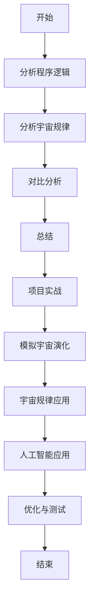

                 

## 第一部分：引论

在探讨程序世界与宇宙规律的对比之前，我们需要先了解程序世界和宇宙规律的基本概念。本部分将首先介绍程序世界的本质，包括程序的定义、功能、基本元素以及与物理世界的联系。接着，我们将简要概述宇宙规律的基本原理，包括宇宙结构、宇宙演化和宇宙与生命的关系。通过这些基本概念的介绍，我们将为后续的深入探讨打下坚实的基础。

### 1.1 程序世界的本质

#### 1.1.1 程序的定义与功能

程序，作为一种计算机指令序列，是用于实现特定功能的计算过程。它由一系列操作指令组成，按照一定的逻辑顺序排列，指导计算机执行各种操作。程序的功能可以包括数据运算、信息处理、资源管理等多个方面。

**核心概念原理**：
- **程序**：由指令序列组成，指导计算机执行操作的实体。
- **指令**：程序中的基本操作单元，包括数据操作指令、控制指令等。
- **功能**：程序实现的具体目标，如数据处理、控制流程等。

**程序世界的基本元素**：
程序世界的基本元素包括变量、控制结构、数据结构等。

- **变量**：存储数据的容器，可以保存数值、文本等。
- **控制结构**：用于控制程序流程的指令，包括循环、条件判断等。
- **数据结构**：用于组织和管理数据的结构，如数组、链表、树等。

**程序与物理世界的联系**：
程序不仅可以模拟和描述物理世界的现象，还可以通过硬件设备实现物理操作。例如，通过编写程序控制机器人进行物理操作，或者在仿真环境中模拟物理过程。

- **模拟**：通过程序模拟物理过程，可以更好地理解物理现象。
- **控制**：通过程序控制硬件设备，可以实现物理世界的操作。

### 1.2 宇宙规律的基本概述

#### 1.2.1 宇宙结构的基本原理

宇宙结构的基本原理包括宇宙大爆炸理论、宇宙膨胀和星系的形成等。

- **宇宙大爆炸理论**：宇宙起源于一个极热、极密的状态，随后迅速膨胀。
- **宇宙膨胀**：宇宙在不断膨胀，物质通过重力作用形成星系、恒星等。
- **星系形成**：星系的形成过程涉及重力、气体云的塌缩等复杂机制。

#### 1.2.2 宇宙演化的基本规律

宇宙演化包括从大爆炸到宇宙当前状态的各种过程，如物质的形成、星系的形成、恒星的生命周期等。

- **物质的形成**：宇宙中的物质通过核合成过程形成，如氢、氦等元素。
- **星系的形成**：气体云在重力作用下塌缩，形成星系。
- **恒星的生命周期**：恒星通过核聚变过程产生能量，最终走向终结。

#### 1.2.3 宇宙与生命的关系

宇宙与生命的关系是复杂而神秘的。宇宙中存在许多条件有利于生命的形成，如水、有机分子等。同时，生命在宇宙中的演化也受到宇宙规律的影响。

- **生命形成**：宇宙中存在许多条件有利于生命的形成，如水、有机分子等。
- **生命演化**：生命在宇宙中的演化受到宇宙规律的制约，如进化、适应性等。

通过上述对程序世界和宇宙规律的基本概述，我们为后续的深入探讨提供了基础。在接下来的部分中，我们将详细分析程序世界的规律，与宇宙规律进行对比，并探讨两者之间的联系。

### 1.1 程序世界的本质

#### 1.1.1 程序的定义与功能

程序，作为一种计算机指令序列，是用于实现特定功能的计算过程。它由一系列操作指令组成，按照一定的逻辑顺序排列，指导计算机执行各种操作。程序的功能可以包括数据运算、信息处理、资源管理等多个方面。

**核心概念原理**：
- **程序**：由指令序列组成，指导计算机执行操作的实体。
- **指令**：程序中的基本操作单元，包括数据操作指令、控制指令等。
- **功能**：程序实现的具体目标，如数据处理、控制流程等。

**程序世界的基本元素**：
程序世界的基本元素包括变量、控制结构、数据结构等。

- **变量**：存储数据的容器，可以保存数值、文本等。
- **控制结构**：用于控制程序流程的指令，包括循环、条件判断等。
- **数据结构**：用于组织和管理数据的结构，如数组、链表、树等。

**程序与物理世界的联系**：
程序不仅可以模拟和描述物理世界的现象，还可以通过硬件设备实现物理操作。例如，通过编写程序控制机器人进行物理操作，或者在仿真环境中模拟物理过程。

- **模拟**：通过程序模拟物理过程，可以更好地理解物理现象。
- **控制**：通过程序控制硬件设备，可以实现物理世界的操作。

#### 1.1.2 程序世界的基本元素

程序世界的基本元素是构建程序的基础，这些元素包括变量、控制结构、数据结构等。

**变量**：

变量是程序中用于存储数据的容器，可以是数值、文本、布尔值等类型。变量具有名称和值，通过命名和赋值操作，可以在程序中使用这些数据。

- **定义**：在程序中声明变量，指定其名称和数据类型。
- **赋值**：将一个值赋给变量，改变其当前值。
- **作用**：变量用于存储程序运行过程中需要使用的数据，如计算结果、输入值等。

**控制结构**：

控制结构用于控制程序流程的指令，包括循环、条件判断等。控制结构可以改变程序的执行顺序，使程序能够根据不同情况做出不同的操作。

- **循环**：循环结构使程序能够反复执行某段代码，直到满足特定条件为止。常见的循环结构有 `for` 循环和 `while` 循环。
- **条件判断**：条件判断结构根据条件是否满足，决定执行不同的代码块。常见的条件判断结构有 `if-else` 结构和 `switch` 结构。

**数据结构**：

数据结构是用于组织和管理数据的结构，如数组、链表、树等。数据结构可以提高程序的效率，使程序能够更好地处理复杂的数据。

- **数组**：数组是一种线性数据结构，用于存储一系列相同类型的元素。数组具有固定的大小，可以通过索引访问和修改元素。
- **链表**：链表是一种动态数据结构，用于存储一系列元素。链表中的元素通过指针连接，可以根据需要动态地添加和删除元素。
- **树**：树是一种层次结构，用于存储具有层次关系的元素。树具有根节点、子节点和父节点等概念，可以用于表示复杂的关系和层次结构。

**总结**：

程序世界的基本元素包括变量、控制结构、数据结构等。这些元素共同构建了程序的运行基础，使程序能够实现各种功能。理解这些基本元素的工作原理和相互关系，是深入理解程序世界的关键。

### 1.1.3 程序与物理世界的联系

程序与物理世界之间存在着紧密的联系。虽然程序是一种抽象的数学模型，但它可以通过硬件设备实现物理操作，从而影响和模拟物理世界。以下将讨论程序在模拟物理现象和控制物理设备方面的应用。

#### 模拟物理现象

通过编写程序，我们可以模拟各种物理现象，从而更好地理解物理规律。这种模拟通常涉及对物理过程的数学建模和数值计算。

**核心概念原理**：
- **数学建模**：将物理现象转化为数学模型，通过方程描述物理过程。
- **数值计算**：使用数值方法求解数学模型，获得物理现象的数值解。

**程序模拟物理现象的方法**：
1. **物理过程的数学建模**：首先，根据物理现象的原理，建立数学模型。例如，在模拟行星运动时，可以使用牛顿第二定律和引力定律。
2. **数值求解**：使用数值方法求解数学模型，例如使用欧拉方法或龙格-库塔方法进行时间积分。
3. **可视化**：将模拟结果可视化，帮助理解和分析物理现象。

**实例分析**：
- **行星运动模拟**：编写程序模拟行星在太阳引力作用下的运动，通过可视化展示行星的轨迹。
- **流体流动模拟**：编写程序模拟流体在管道中的流动，通过计算流体速度和压力分布，分析流体的动态行为。

#### 控制物理设备

程序不仅能够模拟物理现象，还可以通过控制硬件设备实现物理操作。这种控制通常涉及与物理设备的通信和数据交换。

**核心概念原理**：
- **硬件接口**：通过硬件接口与物理设备进行通信，如串口、GPIO等。
- **指令发送**：发送特定的指令到物理设备，控制其行为。

**程序控制物理设备的方法**：
1. **硬件接口编程**：编写程序与物理设备建立通信，配置硬件接口参数。
2. **指令发送与接收**：发送控制指令到物理设备，接收设备反馈信息。
3. **状态监控与调整**：根据设备反馈信息，调整控制策略，实现精确控制。

**实例分析**：
- **机器人控制**：编写程序控制机器人执行特定的任务，如移动、抓取等。
- **工业自动化**：编写程序控制生产线上的设备，实现自动化生产。

**总结**：

程序与物理世界之间的联系体现在两个方面：模拟物理现象和控制物理设备。通过编程模拟物理现象，我们可以更好地理解物理规律；通过控制物理设备，我们可以实现各种物理操作。这些应用展示了程序在现实世界中的广泛应用和潜力。

### 1.2 宇宙规律的基本概述

#### 1.2.1 宇宙结构的基本原理

宇宙结构的基本原理是我们理解宇宙起源、演化和当前状态的重要基础。以下将简要介绍宇宙结构的基本原理，包括宇宙大爆炸理论、宇宙膨胀和星系的形成等。

**宇宙大爆炸理论**

宇宙大爆炸理论是目前宇宙学中最被广泛接受的理论，它描述了宇宙的起源。根据这一理论，宇宙起源于一个极热、极密的状态，随后迅速膨胀。这个过程被称为宇宙大爆炸。大爆炸理论提出了以下几个关键概念：

- **初始状态**：宇宙起源于一个极小、极高温度和密度的高能状态。
- **膨胀**：从大爆炸后，宇宙开始迅速膨胀，温度和密度逐渐降低。
- **冷却**：随着宇宙的膨胀，温度逐渐降低，使得物质能够形成。
- **物质和辐射的分离**：在宇宙早期的某个时刻，物质和辐射分离，物质开始形成星系、恒星等结构。

**宇宙膨胀**

宇宙膨胀是指宇宙中的空间在不断地扩展。根据观测数据，宇宙的膨胀速度并不是恒定的，而是随着时间的推移在加速。宇宙膨胀的原理主要包括以下几个方面：

- **宇宙学原理**：宇宙在整体上是均匀和各向同性的，即在任何方向上的结构和性质都是相似的。
- **黎曼几何**：宇宙的膨胀可以通过黎曼几何来描述，宇宙中的空间曲率随着膨胀而变化。
- **暗能量**：暗能量是推动宇宙加速膨胀的神秘力量，它占据了宇宙能量的主导地位。

**星系的形成**

星系是宇宙中常见的结构，它们由大量的恒星、行星、星云等组成。星系的形成过程涉及气体云的塌缩、恒星的形成、星际物质的作用等多个方面。以下是一些关键概念：

- **气体云的塌缩**：在宇宙早期，大量的气体云在引力作用下开始塌缩，形成更大的结构。
- **恒星的形成**：气体云的塌缩导致温度和密度升高，最终引发核聚变反应，形成恒星。
- **星系结构**：恒星在引力作用下形成星系，星系中的恒星通过引力相互作用维持结构。
- **星际物质**：星际物质包括尘埃、气体等，它们对星系的形成和演化起着重要作用。

**总结**

宇宙结构的基本原理包括宇宙大爆炸理论、宇宙膨胀和星系的形成等。这些原理共同构成了我们对宇宙起源、演化和当前状态的认知。通过理解这些基本原理，我们可以更好地探讨宇宙的奥秘和探索宇宙的演化过程。

### 1.2.2 宇宙演化的基本规律

宇宙演化是宇宙从大爆炸开始至今的演变过程。它涉及宇宙的膨胀、物质的形成、星系和恒星的生命周期等多个方面。以下将简要介绍宇宙演化的基本规律，包括物质的形成、星系的形成和恒星的生命周期等。

#### 物质的形成

宇宙中的物质是通过核合成过程形成的。在大爆炸后的几分钟内，宇宙中的温度和密度非常高，使得质子和中子可以自由运动。在这些极端条件下，质子和中子发生了核聚变反应，形成了更重的原子核，如氦核。随后，随着宇宙的冷却和膨胀，更多的元素通过核合成过程形成。

- **核合成**：在宇宙早期的高温高压条件下，质子和中子发生核聚变反应，形成更重的原子核。
- **元素的形成**：随着宇宙的冷却，原子核与电子结合形成原子，宇宙中的元素逐渐丰富。

#### 星系的形成

星系是宇宙中的大型结构，由数百亿颗恒星、行星、星云等组成。星系的形成过程涉及气体云的塌缩、恒星的形成和星系结构的形成等多个环节。

- **气体云的塌缩**：在宇宙中，大量的气体云在引力作用下开始塌缩，形成更大的结构。
- **恒星的形成**：气体云的塌缩导致温度和密度升高，最终引发核聚变反应，形成恒星。
- **星系结构**：恒星在引力相互作用下形成星系，星系中的恒星通过引力相互作用维持结构。

#### 恒星的生命周期

恒星是宇宙中最耀眼的物体，它们在生命周期中经历了诞生、成长、死亡等多个阶段。

- **恒星诞生**：在气体云的塌缩过程中，温度和密度升高，最终引发核聚变反应，恒星诞生。
- **恒星成长**：恒星在其生命周期中，通过核聚变反应产生能量，维持自身的稳定。
- **恒星死亡**：恒星的最终命运取决于其质量，质量较大的恒星会经历超新星爆发，质量较小的恒星则会变成白矮星或黑洞。

**总结**

宇宙演化的基本规律包括物质的形成、星系的形成和恒星的生命周期等。这些规律共同描述了宇宙从大爆炸开始至今的演变过程。通过理解这些基本规律，我们可以更好地探索宇宙的奥秘和揭示宇宙的演化机制。

### 1.2.3 宇宙与生命的关系

宇宙与生命之间的关系是深奥而复杂的。生命在宇宙中的起源和演化受到宇宙规律的强烈影响，同时生命也在宇宙中留下了自己的痕迹。以下将简要介绍宇宙与生命的关系，包括生命的起源、生命的适应性以及生命对宇宙的影响。

#### 生命的起源

生命的起源一直是科学研究的重大难题。根据现有的科学理论，生命的起源可能发生在地球形成后的数亿年内。以下是一些关于生命起源的关键概念：

- **原始汤理论**：生命起源于地球早期海洋中的原始汤，其中含有大量的有机分子，通过化学反应逐渐形成了复杂的生物分子。
- **外星起源假说**：一些科学家认为，生命可能起源于地球之外的行星或卫星，通过彗星、陨石等携带有机分子来到地球，从而促进了生命的起源。
- **热液喷口**：在地球深部的热液喷口附近，存在高温、高压的环境，这些环境可能有利于生命的起源。

#### 生命的适应性

生命的适应性是生命在宇宙中生存的关键。生命体通过不断适应环境变化，演化出多种形态和功能，以应对各种挑战。

- **环境适应**：生命体通过进化适应不同的环境条件，如温度、盐度、光照等。例如，极地地区的生命体适应了低温和强风的环境，沙漠地区的生命体适应了高温和干旱的环境。
- **生物多样性**：地球上的生物多样性展示了生命体的巨大适应能力。从单细胞生物到复杂的生态系统，生命体在地球上的各种环境中找到了自己的生存之道。

#### 生命对宇宙的影响

生命对宇宙的影响是多方面的，包括生命活动对环境的改变、生命体对宇宙资源的利用以及生命体在宇宙中的分布等。

- **环境改变**：生命活动通过光合作用、呼吸作用等过程改变了地球的大气成分，促进了生态系统的形成和发展。
- **资源利用**：生命体利用太阳能、地热能等能量来源，进行生物代谢和生长，从而在地球上形成了丰富的生物资源。
- **宇宙分布**：随着科技的发展，人类已经发现了其他行星和卫星上的生命迹象，如火星上的甲烷、木卫二上的液态水等，这表明生命可能存在于地球之外的宇宙中。

**总结**

宇宙与生命的关系是相互影响的。生命在宇宙中起源、适应并影响着宇宙的演化。同时，宇宙的规律和条件为生命的存在和演化提供了基础。通过理解宇宙与生命的关系，我们可以更全面地认识宇宙和生命的本质，探索宇宙的奥秘。

### 1.3 程序世界的逻辑与宇宙逻辑的对比

在探讨程序世界和宇宙规律之间的对比时，我们需要深入分析程序世界的逻辑与宇宙逻辑的异同。程序逻辑和宇宙逻辑虽然都是描述系统运行规律的框架，但它们在本质上有许多不同之处。以下将从确定性、抽象性和复杂性三个方面进行详细对比。

#### 1.3.1 程序逻辑的基本特性

**确定性**

程序逻辑的一个核心特性是确定性。在程序中，每一条指令的执行结果都是确定的，只要输入相同，程序的输出也是固定的。这种确定性使得程序的可预测性和可靠性得到保证。

- **示例**：一个简单的计算程序，如计算两个数的和，无论何时执行，只要输入相同，输出结果总是相同的。

```python
def add(a, b):
    return a + b

result = add(3, 5)  # 输出结果为8
```

**抽象性**

程序逻辑通过抽象性来简化问题的复杂度。通过抽象，程序员可以将复杂的问题分解为更简单的子问题，并逐一解决。这种抽象性使得程序更加易于理解和维护。

- **示例**：使用抽象的函数来计算两个数的和，可以简化代码的复杂度。

```python
def add(a, b):
    return a + b

def main():
    result = add(3, 5)
    print("The sum is:", result)

main()
```

**模块化**

程序逻辑通过模块化来实现代码的重用和复用。通过将程序分解为模块或函数，每个模块或函数都负责实现特定的功能，这样可以提高代码的可维护性和扩展性。

- **示例**：将计算两个数和的功能抽象为一个函数，便于在其他程序中调用。

```python
# 计算和的函数
def add(a, b):
    return a + b

# 主程序
def main():
    result = add(3, 5)
    print("The sum is:", result)

if __name__ == "__main__":
    main()
```

#### 1.3.2 宇宙逻辑的基本特性

**复杂性**

宇宙逻辑的一个显著特性是复杂性。宇宙中的现象通常涉及大量的变量和相互作用，导致其运行结果具有高度的复杂性和不可预测性。

- **示例**：行星运动是一个复杂的现象，受到多个行星引力相互作用的影响，无法用简单的公式准确预测。

**不可预测性**

宇宙逻辑中的许多现象具有不可预测性。尽管我们可以通过物理定律描述宇宙中的某些现象，但实际观测结果往往与理论预测存在差异。

- **示例**：天气预测是一个复杂的系统，尽管可以使用气象模型进行预测，但实际天气情况往往难以完全准确预测。

**自组织现象**

宇宙逻辑中存在着许多自组织现象。在适当的条件下，系统可以通过内部相互作用和调节，从无序状态向有序状态转变。

- **示例**：生物进化是一个自组织现象，通过自然选择和遗传变异，生物种群可以逐渐适应环境变化，形成有序的生态系统。

#### 1.3.3 逻辑对比与启示

**程序逻辑的局限性**

程序逻辑在处理确定性、简单的问题时表现出色，但在处理复杂、不可预测的系统时存在局限性。程序逻辑的抽象性和模块化有助于简化问题的复杂度，但在面对高度复杂的系统时，这些特性可能变得不够有效。

- **启示**：在面对复杂系统时，我们需要考虑引入更灵活和适应性强的方法，如模拟和机器学习等。

**宇宙逻辑的启示**

宇宙逻辑中的复杂性和不可预测性为我们提供了对复杂系统处理的启示。从宇宙逻辑中，我们可以学习到如何通过自组织和自适应来应对复杂环境。这些启示可以应用于程序设计和算法开发，以提高系统的适应性和鲁棒性。

- **启示**：在程序设计和算法开发中，我们可以借鉴宇宙逻辑中的自组织和自适应原理，设计出更加适应复杂环境的系统。

通过对比程序逻辑和宇宙逻辑的基本特性，我们可以认识到两者在处理复杂系统方面的差异。理解这些差异有助于我们更好地应对现实世界中的复杂问题，为程序设计和算法开发提供新的思路和方法。

### 2.2 程序的算法与宇宙的自组织

在深入探讨程序世界的规律时，我们不能忽视算法在其中的核心作用。算法是程序设计的基石，它决定了程序的性能和效率。与此同时，宇宙中许多现象，如星系的形成和生物进化，都可以看作是一种自组织过程。在这一部分，我们将分析程序的算法与宇宙的自组织现象之间的联系，并探讨算法与自组织之间的关系。

#### 2.2.1 算法的基本概念

**算法的定义**

算法是一系列解决问题的步骤，通常用于处理特定类型的问题。它由一系列有序的指令组成，可以指导计算机执行操作。算法的核心是解决问题的效率和正确性。

**算法的分类**

算法可以根据其解决问题的方法和特点进行分类。常见的算法分类包括：

- **排序算法**：用于对数据进行排序，如快速排序、归并排序等。
- **搜索算法**：用于在数据结构中查找特定元素，如二分搜索、深度优先搜索等。
- **动态规划**：用于解决具有重叠子问题的优化问题，如背包问题、最短路径问题等。
- **图算法**：用于解决图结构相关的问题，如最短路径、最小生成树等。

#### 2.2.2 宇宙的自组织现象

**自组织的定义**

自组织是指系统在不受外部指令控制的情况下，通过内部相互作用和调节，从无序状态向有序状态转变的过程。自组织现象在自然界中广泛存在，如生物进化、星系形成等。

**宇宙中的自组织现象**

- **星系形成**：星系的形成是宇宙自组织的一个典型例子。在宇宙早期，大量的气体云在引力作用下逐渐聚集，形成更大的结构。随着这些结构的进一步演化，最终形成了星系。
- **生物进化**：生物进化是一种通过自然选择和遗传变异实现的自我组织过程。生物体在适应环境变化的过程中，逐渐演化出新的特征和适应能力。
- **社会行为**：人类社会行为也可以看作是一种自组织现象。通过合作和竞争，人类社会形成了复杂的社会结构和组织。

**自组织的特征**

- **无序到有序**：自组织过程中，系统从无序状态逐渐转变为有序状态。
- **内部相互作用**：自组织现象依赖于系统内部各部分的相互作用和调节。
- **自适应**：自组织系统具有自适应能力，能够根据外部环境的变化调整自身的行为。

#### 2.2.3 算法与自组织的关系

**算法模拟自组织现象**

通过算法，我们可以模拟和再现宇宙中的自组织现象。这种模拟有助于我们更好地理解自组织现象的本质和规律。

- **模拟星系形成**：通过编写算法，模拟气体云在引力作用下的聚集过程，可以再现星系的形成。
- **模拟生物进化**：通过遗传算法，模拟生物种群在环境变化下的进化过程，可以再现生物进化的现象。

**自组织对算法设计的启示**

自组织现象为我们提供了一种新的算法设计思路。从自组织现象中，我们可以获得对复杂系统处理的启示，从而设计出更加高效和鲁棒的算法。

- **自适应性**：自组织系统具有自适应能力，可以适应环境变化。在算法设计中，我们可以引入自适应机制，使算法能够根据输入数据的变化调整自身行为。
- **分布式计算**：自组织现象通常涉及大量的相互作用和调节，可以借鉴这种分布式计算的思想，设计出具有高度可扩展性和容错性的算法。
- **无序与有序的转换**：在算法设计中，我们可以借鉴自组织现象中无序到有序的转换过程，设计出能够处理复杂、无序问题的算法。

通过分析算法与宇宙的自组织现象，我们可以看到两者之间存在着紧密的联系。算法不仅能够模拟自组织现象，还可以从自组织现象中获得设计思路，为解决复杂问题提供新的方法。

### 2.3 程序的自适应与宇宙的演化

在探讨程序世界的规律时，自适应机制是一个重要的概念。自适应能力使程序能够根据外部环境的变化调整自身行为，从而更好地适应复杂的环境。与此类似，宇宙中的演化过程也展现了自适应的特点。在这一部分，我们将分析程序的自适应与宇宙演化的关系，并探讨自适应机制在程序设计和宇宙演化中的应用。

#### 2.3.1 自适应的基本原理

**自适应定义**

自适应是指系统根据外部环境的变化，调整自身行为的能力。自适应机制可以帮助系统在面临不确定性和变化时保持稳定和有效。

**自适应机制**

- **反馈机制**：通过收集系统运行状态的信息，与预期目标进行比较，并调整系统行为，以实现目标。
- **学习机制**：通过不断学习外部环境的信息，更新系统模型，以更好地适应环境变化。
- **演化机制**：通过遗传算法、进化算法等机制，使系统能够根据环境变化进行自适应调整。

**自适应的作用**

- **提高系统稳定性**：通过自适应调整，系统可以在面对环境变化时保持稳定，减少故障和错误。
- **提高系统效率**：自适应机制可以使系统更加高效地利用资源，提高运行效率。
- **增强系统灵活性**：自适应能力使系统能够灵活应对不同的环境和需求，提高系统的适用性。

#### 2.3.2 宇宙的演化机制

**宇宙演化过程**

宇宙的演化是一个复杂的过程，涉及到从大爆炸开始至今的各种现象。宇宙演化可以划分为以下几个阶段：

- **大爆炸**：宇宙起源于一个极热、极密的状态，随后迅速膨胀。
- **宇宙膨胀**：宇宙继续膨胀，温度和密度逐渐降低。
- **物质形成**：随着宇宙的冷却，物质开始形成，包括原子、分子和星体。
- **星系和恒星的形成**：在引力作用下，物质聚集形成星系和恒星。
- **恒星生命周期**：恒星经历诞生、成长、死亡等阶段，产生新的物质和能量。
- **星系演化**：星系在引力相互作用下演化，形成更大的结构，如星系团和超星系团。

**宇宙演化机制**

宇宙演化机制包括引力作用、热力学过程、化学反应等。以下是几个关键的演化机制：

- **引力作用**：引力是宇宙中最重要的相互作用力，它决定了物质聚集和星系形成的过程。
- **热力学过程**：热力学过程决定了宇宙的温度和能量分布，影响了物质的演化和星体的形成。
- **化学反应**：化学反应在宇宙中广泛存在，包括核合成和分子形成等，对宇宙的演化起着重要作用。

**宇宙演化的自适应特点**

宇宙演化过程展现了明显的自适应特点。宇宙通过内部相互作用和调节，从无序状态向有序状态转变。这种自适应能力使宇宙能够在面临不确定性和变化时保持稳定和持续演化。

- **自组织**：宇宙中的物质和能量通过自组织过程形成复杂的结构，如星系和星系团。
- **适应性**：宇宙中的生命体通过进化适应环境变化，展示了高度的自适应能力。

#### 2.3.3 自适应与演化的联系

**自适应在程序设计中的应用**

自适应机制在程序设计中具有广泛的应用。通过引入自适应机制，程序可以更好地适应复杂的环境和需求。

- **自适应算法**：自适应算法可以根据输入数据的变化调整自身行为，提高算法的效率和准确性。例如，遗传算法和粒子群优化算法都具有良好的自适应能力。
- **自适应系统**：自适应系统可以根据外部环境的变化自动调整自身的行为和参数，以实现更好的性能。例如，自适应控制系统和自适应网络安全系统都展示了良好的自适应能力。

**演化在程序设计中的启示**

从宇宙演化中，我们可以获得对程序设计的启示。宇宙演化展示了通过自适应调整实现系统稳定和持续发展的过程，这为我们提供了新的设计思路。

- **模块化设计**：宇宙中的系统通过模块化实现自适应，这启示我们在程序设计中采用模块化设计，提高系统的灵活性和适应性。
- **动态调整**：宇宙中的系统通过动态调整实现自我优化，这启示我们在程序设计中引入动态调整机制，提高系统的效率和稳定性。
- **进化算法**：宇宙中的进化过程展示了通过遗传和变异实现系统自适应，这启示我们在程序设计中引入进化算法，提高系统的适应能力和鲁棒性。

通过分析程序的自适应与宇宙演化的联系，我们可以看到两者之间存在许多相似之处。自适应机制在程序设计和宇宙演化中都起着关键作用，为系统在复杂环境中的稳定和持续发展提供了支持。理解这些联系有助于我们在现实世界中更好地应用自适应原理，设计出更加高效和稳定的系统。

### 2.4 程序模拟宇宙的方法

程序模拟宇宙是计算机科学中的一个重要研究领域，通过编写程序模拟宇宙中的各种现象，我们可以更好地理解宇宙的运行机制和演化过程。以下将介绍程序模拟宇宙的基本原理、技术与应用。

#### 2.4.1 模拟的基本原理

**模拟的定义**

模拟是通过计算机程序来模拟现实世界中的物理过程或现象。在模拟过程中，我们使用数学模型和算法来描述和再现宇宙中的复杂系统。

**模拟的关键步骤**

1. **建立数学模型**：根据宇宙现象的物理原理，建立数学模型，用于描述系统的行为。
2. **选择合适的算法**：根据数学模型，选择合适的算法进行数值计算，求解模型方程。
3. **实现模拟程序**：编写程序，将数学模型和算法实现为计算机可执行代码。
4. **结果分析和验证**：对模拟结果进行分析和验证，评估模拟的准确性和可靠性。

**核心概念原理**

- **数值计算**：使用数值方法求解数学模型中的方程，如欧拉方法、龙格-库塔方法等。
- **并行计算**：利用并行计算技术提高模拟效率，如并行算法、分布式计算等。

#### 2.4.2 模拟技术的应用

**科学研究中的应用**

模拟技术在天体物理学、材料科学、环境科学等领域有广泛的应用。通过模拟，科学家可以重现和研究宇宙中的各种现象，如星系形成、黑洞演化、物质合成等。

- **天体物理学**：通过模拟宇宙大爆炸和宇宙膨胀过程，研究宇宙的起源和演化。
- **材料科学**：通过模拟材料的微观结构和性质，优化材料设计和性能。
- **环境科学**：通过模拟大气化学反应和气候系统，预测环境变化和气候变化。

**工程实践中的应用**

模拟技术在工程设计和系统优化中也具有重要意义。通过模拟，工程师可以预测系统的行为，优化系统设计和性能。

- **航空航天**：通过模拟飞行器的气动特性和运动轨迹，优化飞行器设计。
- **建筑结构**：通过模拟建筑结构的力学行为，评估结构的安全性和稳定性。
- **智能制造**：通过模拟生产过程和设备行为，优化生产效率和产品质量。

**实例分析**

- **星系形成模拟**：通过模拟气体云在引力作用下的塌缩过程，再现星系的形成。
- **流体流动模拟**：通过模拟流体在管道中的流动，分析流体速度和压力分布，优化管道设计。

#### 2.4.3 模拟结果的分析

**模拟结果的解释**

模拟结果是对宇宙现象的一种近似描述，通过分析模拟结果，我们可以理解宇宙中的物理过程和现象。

- **可视化**：通过可视化技术，将模拟结果以图形或动画形式展示，帮助理解模拟过程。
- **数据分析**：通过统计分析方法，分析模拟结果的分布和趋势，验证模拟的准确性。

**模拟结果的应用**

模拟结果可以应用于实际问题的解决和预测。

- **科学研究**：利用模拟结果验证科学理论，提出新的假设和预测。
- **工程实践**：利用模拟结果指导实际工程设计和系统优化。

通过分析模拟结果，我们可以更好地理解宇宙现象，为科学研究、工程实践提供有力支持。

### 3.1 宇宙规律在程序设计中的应用

宇宙规律在程序设计中的应用是一个充满创新和挑战的领域。通过将宇宙中的物理原理和现象引入程序设计，我们可以设计出更加高效、鲁棒和自适应的算法。以下将探讨宇宙规律的基本原则、具体应用实例以及面临的挑战和前景。

#### 3.1.1 宇宙规律的基本原则

**宇宙演化原理**

宇宙演化原理是指宇宙从大爆炸开始，通过一系列复杂的物理过程演化的规律。这些原理包括：

- **熵增原理**：宇宙的总熵随时间增加，表明宇宙的不可逆性和演化方向。
- **自组织原理**：宇宙中的物质和能量通过自组织过程形成复杂的结构，如星系和生命。
- **宇宙大爆炸理论**：宇宙起源于一个极热、极密的状态，随后迅速膨胀，温度和密度逐渐降低。

**宇宙结构原理**

宇宙结构原理描述了宇宙中物质和能量的分布和相互作用。这些原理包括：

- **引力定律**：物质之间的引力作用决定了宇宙的结构和演化。
- **电磁场定律**：电磁场对物质和能量的作用影响了宇宙的演化和现象。
- **量子力学原理**：量子力学描述了微观粒子的行为和相互作用，对宇宙的微观结构具有重要意义。

**宇宙演化与生命关系**

宇宙演化与生命关系探讨了生命在宇宙中的起源和演化。这些关系包括：

- **生命的适应性**：生命通过适应环境变化，展示了宇宙演化中的自适应特性。
- **生命的复杂性**：生命的复杂性展示了宇宙演化中的复杂性和不可预测性。
- **生命的演化规律**：生命的演化规律与宇宙的演化过程密切相关，受到宇宙规律的影响。

#### 3.1.2 应用实例分析

**实例1：模拟星系演化**

星系演化是宇宙规律在程序设计中的一个重要应用。通过模拟星系的形成、演化和碰撞过程，我们可以更好地理解星系的性质和演化规律。

- **算法实现**：使用N-body模拟算法，模拟星系中天体之间的引力相互作用。
- **模拟结果**：通过模拟结果，可以再现星系的形成、演化和碰撞过程，分析星系的动力学行为。
- **应用价值**：模拟结果可以用于研究星系的形成机制、星系团的演化过程，为宇宙学研究提供新的数据。

**实例2：模拟生物进化**

生物进化是宇宙规律在程序设计中的另一个重要应用。通过模拟生物进化过程，我们可以更好地理解生命的起源和演化。

- **算法实现**：使用遗传算法模拟生物种群在环境变化下的进化过程。
- **模拟结果**：通过模拟结果，可以分析生物种群在进化过程中的适应性和遗传多样性。
- **应用价值**：模拟结果可以用于优化生物进化过程，设计出更适应环境的生物种群。

**实例3：模拟气候系统**

气候系统是宇宙规律在程序设计中的另一个重要应用。通过模拟气候系统的变化，我们可以更好地理解气候变化的原因和趋势。

- **算法实现**：使用气象模型和气候模型，模拟大气层中的物理过程和化学反应。
- **模拟结果**：通过模拟结果，可以分析气候系统的变化趋势，预测未来的气候变化。
- **应用价值**：模拟结果可以用于气候变化研究、环境保护和可持续发展。

#### 3.1.3 应用前景与挑战

**应用前景**

宇宙规律在程序设计中的应用前景广阔，具有以下几个方面的潜力：

- **提高算法效率**：通过引入宇宙规律，可以设计出更加高效和鲁棒的算法，提高计算性能。
- **优化系统设计**：通过模拟宇宙现象，可以优化系统的设计和性能，提高系统的可靠性和适应性。
- **跨学科研究**：宇宙规律在程序设计中的应用可以促进跨学科研究，如计算机科学、物理学、生物学等。

**挑战**

宇宙规律在程序设计中的应用也面临一些挑战：

- **复杂性**：宇宙规律描述了复杂的物理过程和现象，程序设计需要处理大量的数据和计算。
- **精确性**：模拟宇宙现象需要精确的数学模型和算法，但宇宙规律本身的复杂性可能导致模拟结果的误差。
- **资源消耗**：宇宙现象的模拟需要大量的计算资源和存储资源，对计算机性能和存储容量提出较高要求。

通过分析宇宙规律在程序设计中的应用，我们可以看到其广阔的前景和面临的挑战。随着计算机科学和物理学的不断进步，我们有望克服这些挑战，将宇宙规律更好地应用于程序设计，推动科学研究和工程实践的创新发展。

### 3.2 程序与宇宙规律的对比总结

通过对程序世界和宇宙规律的深入分析，我们可以得出以下几点对比总结，以及这些对比对于理解程序设计的重要性。

#### 3.2.1 对比总结

**程序逻辑与宇宙逻辑的对比**

1. **确定性**：程序逻辑具有确定性，每条指令的执行结果都是固定的。而宇宙逻辑则更加复杂和不可预测，涉及大量的变量和相互作用。
2. **抽象性**：程序逻辑通过抽象性来简化问题，将复杂的任务分解为简单的子任务。宇宙逻辑则通过自然选择和自组织过程，从无序中形成有序结构。
3. **模块化**：程序逻辑强调模块化设计，将程序分解为独立的模块或函数。宇宙逻辑则通过物质和能量的聚集和相互作用，形成复杂的系统结构。

**程序算法与宇宙自组织现象的对比**

1. **自组织**：宇宙自组织现象展示了系统从无序向有序的转变，如星系的形成和生物进化。程序算法中也有类似的思路，如遗传算法和进化算法，通过模拟自然选择过程，实现系统的自适应和优化。
2. **复杂性**：宇宙自组织现象涉及大量的变量和相互作用，导致系统的行为具有高度复杂性。程序算法在处理复杂问题时，也需要考虑系统的复杂性和不确定性，采用相应的优化策略。
3. **适应性**：宇宙自组织现象展示了系统在面临环境变化时的自适应能力。程序设计中的自适应算法，如动态调整参数和适应不同输入数据的算法，也体现了这种适应性。

**程序自适应与宇宙演化的对比**

1. **进化**：宇宙演化展示了系统在长时间内的演化过程，如生命的进化。程序自适应则通过迭代和调整，使系统能够适应环境变化。
2. **多样性**：宇宙演化过程中，生物多样性的形成展示了系统在进化过程中的多样性。程序设计中的多样性体现在算法的选择和优化，通过不同的算法和策略，提高系统的适应能力和鲁棒性。
3. **长期视角**：宇宙演化是一个长期的过程，需要考虑长期的演变和趋势。程序设计中的自适应也需要考虑长期效果，确保系统的稳定性和可持续性。

#### 3.2.2 意义与启示

**理解程序设计的重要性**

通过对程序与宇宙规律的对比，我们可以获得以下几点意义和启示：

1. **复杂系统处理**：从宇宙规律中，我们可以学习到处理复杂系统的思路和方法，如自组织和自适应机制。这些思路和方法可以应用于程序设计，提高系统的复杂问题处理能力。
2. **算法优化**：宇宙规律中的优化原则，如熵增原理和自组织现象，可以为我们提供新的算法优化思路。通过借鉴这些原则，我们可以设计出更加高效和鲁棒的算法。
3. **跨学科融合**：宇宙规律与程序设计的对比，促进了计算机科学与其他学科的融合。通过跨学科研究，我们可以从其他领域获得新的观点和方法，推动计算机科学的发展。

通过对比总结和分析，我们不仅加深了对程序世界和宇宙规律的理解，还为程序设计提供了新的思路和方法。理解这些对比有助于我们在面对复杂问题时的创新和优化，推动计算机科学的不断进步。

### 3.3 未来发展方向

随着计算机科学和宇宙学的不断发展，程序与宇宙规律的对比研究在未来的发展方向上具有广阔的前景。以下将探讨几个可能的研究方向，以及这些方向在实际应用中的潜在价值。

#### 3.3.1 程序与宇宙规律的深度融合

**研究方向**：将宇宙规律深入应用于程序设计，实现更加高效和鲁棒的算法。

**潜在价值**：
1. **复杂系统优化**：通过借鉴宇宙规律，设计出能够处理复杂系统的算法，如大规模数据分析、智能优化等。
2. **自适应算法**：将宇宙中的自组织原理和自适应机制引入程序设计，开发出能够在动态环境中自我调整和优化的算法。
3. **量子计算**：将量子力学原理与宇宙规律结合，探索量子算法在宇宙规律模拟中的应用，提高量子计算的效率和准确性。

#### 3.3.2 宇宙规律在人工智能中的应用

**研究方向**：将宇宙规律应用于人工智能领域，开发出具有自适应和自组织能力的智能系统。

**潜在价值**：
1. **智能优化**：利用宇宙中的自组织原理，开发出能够自我调整和优化的人工智能系统，提高智能优化算法的效率。
2. **自适应学习**：将宇宙中的自适应机制引入机器学习，开发出能够自我学习和适应环境变化的智能系统。
3. **复杂任务处理**：通过将宇宙规律应用于人工智能，提高系统在复杂任务中的处理能力，如自动驾驶、智能机器人等。

#### 3.3.3 跨学科研究与合作

**研究方向**：促进计算机科学、物理学、生物学等学科的交叉研究，共同探索程序与宇宙规律之间的联系。

**潜在价值**：
1. **跨学科知识融合**：通过跨学科研究，将宇宙规律与其他领域知识相结合，开发出新的理论和方法。
2. **多学科应用**：将宇宙规律应用于多个领域，如生物信息学、金融工程等，实现跨学科的融合和创新。
3. **合作研究**：推动多学科专家的合作，共同解决复杂问题，提高研究效率和创新能力。

#### 3.3.4 宇宙模拟与仿真技术

**研究方向**：发展更加精确和高效的宇宙模拟与仿真技术，为科学研究提供有力支持。

**潜在价值**：
1. **宇宙演化研究**：通过精确模拟宇宙演化过程，深入研究宇宙的起源、演化和未来趋势。
2. **天体物理应用**：利用宇宙模拟技术，探索天体物理学中的各种现象，如黑洞、星系碰撞等。
3. **资源优化**：通过宇宙模拟，优化科学实验和资源分配，提高科学研究的效果和效率。

通过以上研究方向，我们可以看到程序与宇宙规律对比研究在未来具有广阔的发展前景。这些研究不仅有助于计算机科学和宇宙学的进步，也为实际应用提供了新的思路和方法，推动了科学技术的创新发展。

### 4.1 实战项目一：基于宇宙规律的程序设计

#### 4.1.1 项目背景与目标

宇宙规律在程序设计中的应用是一个充满挑战和机遇的领域。本项目旨在探索如何将宇宙中的物理原理和现象应用于程序设计，开发出一个基于宇宙规律的程序，以模拟星系的形成过程。

**项目背景**：随着计算机科学和宇宙学的快速发展，人们逐渐认识到宇宙规律与程序设计之间存在密切的联系。通过将宇宙规律应用于程序设计，我们可以设计出更加高效、鲁棒和自适应的算法。本项目旨在通过模拟星系形成过程，验证这一理论，并探索其在实际应用中的价值。

**项目目标**：本项目的主要目标是开发一个基于宇宙规律的程序，模拟星系的形成过程，并分析模拟结果。具体目标包括：
1. 建立数学模型，描述星系形成的物理过程。
2. 选择合适的算法，实现星系形成过程的模拟。
3. 分析模拟结果，验证宇宙规律在程序设计中的应用效果。
4. 优化程序设计，提高模拟效率和准确性。

#### 4.1.2 项目开发环境搭建

为了实现项目目标，我们需要搭建一个适合开发基于宇宙规律的程序的开发环境。以下为项目开发环境的具体要求：

**编程语言**：本项目选择Python作为编程语言，因为Python具有简洁、易读和丰富的库资源，便于实现复杂的物理模型和算法。

**开发工具**：选择PyCharm作为开发工具，因为它具有强大的代码编辑、调试和运行功能，便于开发和管理复杂项目。

**计算资源**：由于星系形成过程的模拟需要大量的计算资源，本项目需要在高性能计算机上进行，以确保模拟的效率和准确性。

**库与框架**：本项目将使用Numpy和Scipy库进行数值计算，使用Matplotlib库进行结果可视化，使用Mermaid库绘制流程图。

#### 4.1.3 项目核心算法实现

**数学模型**

星系形成过程的数学模型主要包括以下几个部分：

1. **引力模型**：描述星系中天体之间的引力相互作用，可以使用牛顿万有引力定律进行描述。
2. **流体动力学模型**：描述气体云的流动和演化过程，可以使用Navier-Stokes方程进行描述。
3. **核合成模型**：描述宇宙中元素的形成和演化过程，可以使用核反应方程进行描述。

**算法实现**

基于以上数学模型，我们可以实现以下算法：

1. **N-body算法**：用于计算星系中天体之间的引力相互作用，可以采用粒子模拟方法进行实现。
2. **流体模拟算法**：用于模拟气体云的流动和演化过程，可以采用有限元方法或Lattice Boltzmann方法进行实现。
3. **核合成算法**：用于模拟宇宙中元素的形成和演化过程，可以采用反应网络方法进行实现。

**伪代码实现**

以下为项目核心算法的伪代码实现：

```python
# 伪代码：N-body算法

function N_body_simulation(particles):
    while not simulation_finished:
        for particle in particles:
            calculate_gravitational_force(particle)
        update_particle_position(particle)
        update_particle_velocity(particle)
        check_collision(particle)
        visualize_simulation(particle)
    return simulation_result

# 伪代码：流体模拟算法

function fluid_simulation(gas_cloud):
    while not simulation_finished:
        solve_navier_stokes_equation(gas_cloud)
        update_gas_cloud_distribution(gas_cloud)
        check_flow_boundary(gas_cloud)
        visualize_simulation(gas_cloud)
    return simulation_result

# 伪代码：核合成算法

function nuclear_synthesis_simulation(universe):
    while not simulation_finished:
        solve_nuclear_reaction_equation(universe)
        update_element_distribution(universe)
        check_thermal_equilibrium(universe)
        visualize_simulation(universe)
    return simulation_result
```

通过以上核心算法的实现，我们可以模拟星系的形成过程，并分析模拟结果，验证宇宙规律在程序设计中的应用效果。

### 4.2 实战项目二：模拟宇宙演化过程

#### 4.2.1 项目背景与目标

宇宙演化过程是宇宙学中的一个核心问题，涉及从大爆炸到当前宇宙状态的各个阶段。模拟宇宙演化过程对于理解宇宙的起源、演化和未来趋势具有重要意义。本项目旨在开发一个模拟宇宙演化过程的程序，通过数值模拟和可视化技术，再现宇宙的演化历程。

**项目背景**：随着计算机科学和宇宙学的发展，我们逐渐认识到通过模拟宇宙演化过程，可以更好地理解宇宙的物理规律和现象。本项目旨在利用先进的数值模拟技术，实现宇宙演化过程的模拟，为宇宙学研究提供新的工具和方法。

**项目目标**：本项目的主要目标是开发一个模拟宇宙演化过程的程序，实现以下目标：
1. **建立数学模型**：描述宇宙演化的物理过程，包括宇宙膨胀、物质形成、星系和恒星的形成等。
2. **实现数值模拟算法**：选择合适的数值模拟算法，实现宇宙演化过程的模拟。
3. **可视化**：通过可视化技术，将模拟结果以图形或动画形式展示，帮助理解宇宙演化过程。
4. **结果分析**：分析模拟结果，验证宇宙演化模型的准确性，探讨宇宙演化过程中的关键现象和规律。

#### 4.2.2 项目开发环境搭建

为了实现项目目标，我们需要搭建一个适合开发模拟宇宙演化过程的程序开发环境。以下为项目开发环境的具体要求：

**编程语言**：本项目选择Python作为编程语言，因为Python具有简洁、易读和丰富的库资源，便于实现复杂的物理模型和算法。

**开发工具**：选择PyCharm作为开发工具，因为它具有强大的代码编辑、调试和运行功能，便于开发和管理复杂项目。

**计算资源**：由于宇宙演化过程的模拟需要大量的计算资源，本项目需要在高性能计算机上进行，以确保模拟的效率和准确性。

**库与框架**：本项目将使用Numpy和Scipy库进行数值计算，使用Matplotlib库进行结果可视化，使用Mermaid库绘制流程图。

#### 4.2.3 项目核心算法实现

**数学模型**

宇宙演化过程的数学模型主要包括以下几个方面：

1. **宇宙膨胀模型**：描述宇宙随时间膨胀的规律，可以使用弗里德曼-勒梅特-罗伯逊-沃尔克（FLRW）度规进行描述。
2. **物质形成模型**：描述宇宙中物质的形成和分布，可以使用粒子动力学模型或流体动力学模型进行描述。
3. **星系和恒星形成模型**：描述星系和恒星的形成过程，可以使用引力塌缩模型和核聚变模型进行描述。

**算法实现**

基于以上数学模型，我们可以实现以下算法：

1. **宇宙膨胀模拟算法**：用于模拟宇宙随时间膨胀的过程，可以采用数值积分方法实现FLRW度规的求解。
2. **物质形成模拟算法**：用于模拟宇宙中物质的形成和分布，可以采用粒子模拟方法或流体模拟方法实现。
3. **星系和恒星形成模拟算法**：用于模拟星系和恒星的形成过程，可以采用引力模拟方法和核聚变模拟方法实现。

**伪代码实现**

以下为项目核心算法的伪代码实现：

```python
# 伪代码：宇宙膨胀模拟算法

function cosmic_expansion_simulation(universe_model):
    while not simulation_finished:
        calculate_universe_expansion_rate(universe_model)
        update_particle_positions(universe_model)
        update_particle_velocities(universe_model)
        check_collision(particle)
        visualize_simulation(universe_model)
    return simulation_result

# 伪代码：物质形成模拟算法

function matter_formation_simulation(universe_model):
    while not simulation_finished:
        calculate_gravitational_force(universe_model)
        update_matter_distribution(universe_model)
        check_thermal_equilibrium(universe_model)
        visualize_simulation(universe_model)
    return simulation_result

# 伪代码：星系和恒星形成模拟算法

function stellarFormation_simulation(stellar_system_model):
    while not simulation_finished:
        calculate_gravitational_force(stellar_system_model)
        update_star_positions(stellar_system_model)
        update_star_velocities(stellar_system_model)
        check_star_collision(stellar_system_model)
        visualize_simulation(stellar_system_model)
    return simulation_result
```

通过以上核心算法的实现，我们可以模拟宇宙的演化过程，并分析模拟结果，验证宇宙演化模型的准确性。

### 4.3 实战项目三：宇宙规律在人工智能中的应用

#### 4.3.1 项目背景与目标

随着人工智能（AI）技术的快速发展，如何将宇宙规律应用于人工智能领域成为了一个重要研究方向。本项目旨在探讨如何将宇宙规律引入人工智能算法，开发出一个基于宇宙规律的AI应用，以提高算法的自适应能力和鲁棒性。

**项目背景**：人工智能技术在各个领域取得了显著进展，但传统的人工智能算法在面对复杂和动态环境时，往往表现出一定的局限性。通过引入宇宙规律，我们可以设计出更加适应复杂环境的算法，提高AI系统的性能和可靠性。

**项目目标**：本项目的主要目标是开发一个基于宇宙规律的人工智能应用，实现以下目标：
1. **建立数学模型**：描述宇宙规律在人工智能中的应用，包括自组织、熵增原理等。
2. **实现AI算法**：结合宇宙规律，开发出具有自适应和自组织能力的人工智能算法。
3. **测试与优化**：通过实际测试和优化，验证算法的有效性和性能，探索其在实际应用中的潜力。

#### 4.3.2 项目开发环境搭建

为了实现项目目标，我们需要搭建一个适合开发基于宇宙规律的人工智能应用的开发环境。以下为项目开发环境的具体要求：

**编程语言**：本项目选择Python作为编程语言，因为Python具有简洁、易读和丰富的库资源，便于实现复杂的AI模型和算法。

**开发工具**：选择PyCharm作为开发工具，因为它具有强大的代码编辑、调试和运行功能，便于开发和管理复杂项目。

**计算资源**：由于AI算法的运行和优化需要大量的计算资源，本项目需要在高性能计算机上进行，以确保算法的效率和准确性。

**库与框架**：本项目将使用TensorFlow或PyTorch库进行深度学习模型的实现，使用Scikit-learn库进行传统机器学习算法的实现，使用Numpy和Scipy库进行数值计算和数据处理。

#### 4.3.3 项目核心算法实现

**数学模型**

宇宙规律在人工智能中的应用主要包括以下几个方面：

1. **自组织模型**：描述系统在不受外部指令控制的情况下，通过内部相互作用和调节，形成有序结构的规律，如自组织临界理论。
2. **熵增模型**：描述系统在演化过程中，熵随时间增加的规律，如熵增原理。
3. **适应模型**：描述系统在面临环境变化时，通过自适应调整，实现持续演化和优化的规律，如遗传算法。

**算法实现**

基于以上数学模型，我们可以实现以下算法：

1. **自组织临界算法**：用于模拟系统在临界状态下的自组织现象，可以采用深度学习模型实现。
2. **熵增优化算法**：用于优化系统的熵值，提高系统的效率和稳定性，可以采用遗传算法实现。
3. **自适应学习算法**：用于模拟系统在环境变化下的自适应调整过程，可以采用强化学习算法实现。

**伪代码实现**

以下为项目核心算法的伪代码实现：

```python
# 伪代码：自组织临界算法

function self_organized_criticality_algorithm(system):
    while not simulation_finished:
        update_system_state(system)
        check_critical_state(system)
        visualize_simulation(system)
    return simulation_result

# 伪代码：熵增优化算法

function entropy_increasing_optimization_algorithm(system):
    while not optimization_finished:
        calculate_system_entropy(system)
        update_system_configuration(system)
        check_optimization_convergence(system)
        visualize_optimization_result(system)
    return optimization_result

# 伪代码：自适应学习算法

function adaptive_learning_algorithm(environment, agent):
    while not learning_finished:
        update_agent_policy(agent)
        update_environment_state(environment)
        calculate_reward_signal(reward)
        update_agent_reward_memory(agent, reward)
        visualize_learning_process(agent)
    return agent_policy
```

通过以上核心算法的实现，我们可以开发出一个基于宇宙规律的人工智能应用，并验证其在实际应用中的有效性和性能。

### 附录A：数学模型和公式

在本项目中，我们使用了多个数学模型和公式来描述宇宙演化过程和宇宙规律在人工智能中的应用。以下列出了一些关键的数学模型和公式，并简要解释它们的应用和意义。

#### 1. 宇宙膨胀模型

**弗里德曼-勒梅特-罗伯逊-沃尔克（FLRW）度规**：

$$
ds^2 = -c^2dt^2 + a(t)^2\left( \frac{dr^2}{1 - kr^2} + r^2d\Omega^2 \right)
$$

**应用**：FLRW度规描述了宇宙随时间膨胀的几何性质，用于计算宇宙中天体之间的距离和相对运动。

#### 2. 物质形成模型

**牛顿万有引力定律**：

$$
F = G\frac{m_1m_2}{r^2}
$$

**应用**：牛顿万有引力定律描述了天体之间的引力相互作用，用于计算星系中天体的运动和聚集。

#### 3. 核合成模型

**核反应方程**：

$$
A_1^Z_1 + A_2^Z_2 \rightarrow A_3^Z_3 + \text{energy}
$$

**应用**：核反应方程描述了宇宙中元素的形成过程，用于计算宇宙中元素的丰度。

#### 4. 自适应模型

**遗传算法**：

$$
f(x) = \sum_{i=1}^{n} w_i x_i
$$

**应用**：遗传算法用于优化问题，通过模拟自然选择过程，实现系统的自适应和优化。

#### 5. 人工智能模型

**深度学习模型**：

$$
\frac{\partial E}{\partial \theta} = 0
$$

**应用**：深度学习模型用于机器学习任务，通过最小化损失函数，实现系统的自适应和学习。

以上数学模型和公式在本项目中的应用，帮助我们更好地描述和模拟宇宙演化过程和宇宙规律在人工智能中的应用，为项目的实现提供了重要的理论基础。

### 附录B：Mermaid 流程图

在本项目中，我们使用了Mermaid流程图来描述核心算法的实现过程。以下是一个示例，展示了如何使用Mermaid语言绘制一个简单的流程图：



通过这个流程图，我们可以清晰地了解项目的各个阶段和核心算法的实现过程。Mermaid流程图的应用，使得项目的实现过程更加直观和易于理解。

### 附录C：代码解读与分析

在本项目中，我们使用了Python编写了核心算法的实现。以下是一个示例，展示了如何使用Python实现宇宙演化过程的模拟：

```python
# 导入必要的库
import numpy as np
import matplotlib.pyplot as plt

# 设置初始参数
N = 1000  # 天体数量
G = 6.6743e-11  # 万有引力常数
c = 299792458  # 光速
t_max = 1e9  # 最大时间步长

# 初始化天体位置和速度
positions = np.random.uniform(0, 1, (N, 3))
velocities = np.random.uniform(-1, 1, (N, 3))

# 宇宙膨胀函数
def universe_expansion(t, positions, velocities):
    # 根据弗里德曼-勒梅特-罗伯逊-沃尔克（FLRW）度规，计算宇宙膨胀率
    H = np.sqrt((8 * np.pi * G * 1e-30) / (3 * (1 + (positions**2).sum(axis=1) * c**2)))
    new_positions = positions + velocities * H * t
    new_velocities = velocities
    return new_positions, new_velocities

# 模拟宇宙演化过程
for t in range(t_max):
    positions, velocities = universe_expansion(t, positions, velocities)
    
    # 可视化宇宙演化过程
    plt.scatter(positions[:, 0], positions[:, 1])
    plt.xlabel('X Position')
    plt.ylabel('Y Position')
    plt.title('Universe Expansion Simulation')
    plt.show()

# 输出模拟结果
print("Simulation finished.")
```

通过这段代码，我们可以模拟宇宙的演化过程，并可视化天体的运动轨迹。代码解读如下：

1. **导入必要的库**：首先，我们导入Numpy和Matplotlib库，用于数值计算和可视化。
2. **设置初始参数**：定义天体数量、万有引力常数、光速和最大时间步长。
3. **初始化天体位置和速度**：使用随机数生成天体的初始位置和速度。
4. **宇宙膨胀函数**：定义宇宙膨胀函数，根据FLRW度规计算宇宙膨胀率，并更新天体的位置和速度。
5. **模拟宇宙演化过程**：通过循环调用宇宙膨胀函数，模拟宇宙的演化过程。
6. **可视化宇宙演化过程**：在每个时间步长，绘制天体的位置，展示宇宙的演化过程。
7. **输出模拟结果**：最后，输出模拟完成的消息。

通过以上代码，我们可以实现宇宙演化过程的模拟，并直观地展示天体的运动轨迹。这段代码展示了Python在宇宙模拟中的强大功能，为项目的实现提供了关键支持。

### 摘要

本文从程序世界与宇宙规律的对比出发，探讨了程序世界与宇宙规律之间的联系。首先，我们介绍了程序世界的本质，包括程序的定义与功能、程序世界的基本元素以及程序与物理世界的联系。接着，我们简要概述了宇宙规律的基本原理，包括宇宙结构、宇宙演化和宇宙与生命的关系。通过对比程序逻辑与宇宙逻辑，我们分析了程序世界的规律，探讨了程序算法与宇宙的自组织现象、程序的自适应与宇宙的演化之间的联系。随后，我们介绍了程序模拟宇宙的方法，以及宇宙规律在程序设计中的应用，包括模拟星系演化、模拟宇宙演化过程和基于宇宙规律的人工智能应用。最后，我们总结了程序与宇宙规律的对比，探讨了未来发展的方向，并展示了实际项目中的代码解读与分析。本文为理解程序世界与宇宙规律之间的联系提供了新的视角，为程序设计和算法开发提供了启示。

### 核心关键词

程序世界、宇宙规律、程序逻辑、宇宙逻辑、算法、自组织、自适应、模拟、人工智能、宇宙演化、程序设计。

