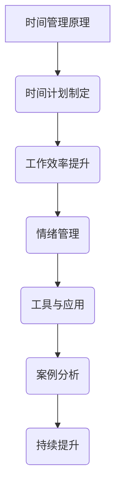

                 

### 文章标题

《程序员创业者的时间管理与工作效率提升技巧》

---

**关键词：**时间管理，工作效率，程序员，创业者，时间计划，工具与应用

**摘要：**本文旨在探讨程序员创业者如何通过有效的时间管理和工作效率提升技巧，优化个人及团队的工作流程，实现创业目标。文章从时间管理的基本概念与原理出发，详细介绍了制定时间计划、提高工作效率的方法、情绪管理对时间管理的影响以及时间管理工具与应用。通过案例分析，总结出成功与失败的时间管理经验，为程序员创业者提供实用的策略和建议。

---

### 目录大纲

#### 第一部分：时间管理原理与技巧

1. **第1章：时间管理的基本概念与原理**
    1.1 **时间管理的定义与重要性**
    1.2 **时间管理的基本原则**
    1.3 **时间管理中的常见误区**

2. **第2章：制定高效的时间计划**
    2.1 **个人时间日志的记录与分析**
    2.2 **目标设定与优先级划分**
    2.3 **计划执行与调整**

3. **第3章：提高工作效率的方法**
    3.1 **工作流程优化**
    3.2 **避免分心的策略**
    3.3 **时间区块管理与番茄工作法**

4. **第4章：情绪管理对时间管理的影响**
    4.1 **情绪管理与时间管理的关系**
    4.2 **情绪管理技巧提升工作效率**
    4.3 **压力管理与时间管理**

#### 第二部分：时间管理工具与应用

5. **第5章：时间管理工具介绍与应用**
    5.1 **传统的纸笔时间管理工具**
    5.2 **电子时间管理软件**
    5.3 **时间管理手机应用**

6. **第6章：时间管理在软件开发中的应用**
    6.1 **软件开发中的时间管理挑战**
    6.2 **时间追踪工具在软件开发中的应用**
    6.3 **团队协作与时间管理**

7. **第7章：时间管理案例分析**
    7.1 **程序员创业者的时间管理案例**
    7.2 **成功的时间管理经验分享**
    7.3 **时间管理失败案例分析及教训**

8. **第8章：持续提升工作效率**
    8.1 **工作习惯的养成**
    8.2 **学习与实践，持续改进**
    8.3 **高效工作者的时间管理策略**

#### 附录

9. **附录A：时间管理资源汇总**
    9.1 **在线时间管理课程与书籍推荐**
    9.2 **时间管理工具下载与使用教程**
    9.3 **社交媒体与论坛推荐**

### Mermaid 流�程图

---

接下来，我们将逐一探讨这些章节的主题，通过详细的讲解和实际案例，帮助程序员创业者更好地管理时间和提高工作效率。

---

### 第1章：时间管理的基本概念与原理

时间管理是优化个人时间使用，以实现个人目标的过程。对于程序员创业者而言，时间管理尤为重要，因为他们通常需要在有限的时间内完成大量的任务，同时保持团队的协作和项目的进度。以下将详细介绍时间管理的定义、基本原理以及常见误区。

#### 1.1 时间管理的定义与重要性

**时间管理的定义：**时间管理是指通过计划和合理安排时间，使个人的活动、任务和目标能够高效、有序地完成。它不仅仅是对时间的安排，更是一种对自我管理、目标设定和优先级划分的能力。

**时间管理的重要性：**对于程序员创业者来说，时间管理的重要性体现在以下几个方面：

1. **提高工作效率：**合理的时间管理可以帮助程序员创业者更好地规划工作，减少无效时间，从而提高工作效率。
2. **确保项目进度：**在创业过程中，项目进度是关键。通过时间管理，可以确保每个阶段的工作按时完成，避免项目延期。
3. **优化团队协作：**良好的时间管理能够提高团队协作效率，减少沟通成本，使团队成员能够更好地配合。
4. **平衡工作与生活：**程序员创业者往往面临工作与生活的平衡问题。通过有效的时间管理，可以确保在追求事业成功的同时，也能够享受生活。

#### 1.2 时间管理的基本原则

为了实现高效的时间管理，程序员创业者应该遵循以下基本原则：

1. **目标导向：**所有时间管理活动都应围绕目标进行。明确目标可以帮助创业者更好地安排时间，确保每项任务都有明确的方向。
2. **优先级划分：**合理安排任务的优先级是时间管理的关键。创业者应该学会区分任务的紧急程度和重要性，优先处理重要且紧急的任务。
3. **计划执行：**制定详细的计划并严格执行是成功的关键。创业者应该确保每项任务都有明确的时间安排，并在规定的时间内完成。
4. **持续反馈：**时间管理是一个持续改进的过程。创业者应该定期对时间管理效果进行评估和反馈，根据实际情况调整计划。
5. **灵活调整：**在执行时间计划时，应保持灵活性，根据实际情况进行调整。灵活调整可以帮助创业者应对突发事件，确保计划的有效执行。

#### 1.3 时间管理中的常见误区

尽管时间管理对程序员创业者至关重要，但在实际操作中，很多人容易陷入一些误区：

1. **过分追求完美：**创业者常常试图完美地完成每一项任务，导致耗时过长，反而降低了整体效率。
2. **任务堆砌：**有些创业者喜欢一次性安排过多的任务，导致时间安排过于紧凑，容易造成压力和疲劳。
3. **忽略休息：**长时间工作会导致疲劳和效率下降。创业者应该合理安排休息时间，确保身心健康。
4. **缺乏计划：**没有明确的计划和目标，时间管理就会变得混乱，任务难以按时完成。
5. **忽视优先级：**不重视任务的优先级，容易导致重要任务被延误，影响项目进度。

#### 1.4 时间管理的核心要素

为了实现高效的时间管理，创业者应该关注以下核心要素：

1. **时间日志：**记录每天的时间使用情况，了解自己的时间分配情况，有助于发现问题并进行改进。
2. **任务清单：**列出所有待办任务，并按照优先级排序，确保每项任务都有明确的处理顺序。
3. **日程安排：**提前规划每天的工作内容，确保时间得到充分利用。
4. **提醒系统：**使用提醒工具，如闹钟、手机应用等，确保不会错过重要任务和会议。
5. **反馈与调整：**定期对时间管理效果进行评估，并根据实际情况进行调整，以持续改进时间管理方法。

通过遵循上述原则和关注核心要素，程序员创业者可以更好地管理时间，提高工作效率，实现个人和团队的共同成长。

---

在下一章中，我们将探讨如何制定高效的时间计划，帮助程序员创业者更好地安排日常工作和实现目标。

---

### 第2章：制定高效的时间计划

制定高效的时间计划是程序员创业者成功管理时间的关键。一个良好的时间计划不仅能够帮助创业者合理安排每日的工作，还能够提高工作效率，确保项目进度，同时保持工作与生活的平衡。以下将详细介绍如何制定高效的时间计划，包括个人时间日志的记录与分析、目标设定与优先级划分，以及计划执行与调整的方法。

#### 2.1 个人时间日志的记录与分析

记录个人时间日志是制定有效时间计划的基础。通过详细记录每天的时间使用情况，创业者可以清楚地了解自己的时间分配，发现时间浪费的环节，从而进行改进。

**记录时间日志的步骤：**

1. **选择记录工具：**创业者可以选择纸笔记录或电子工具，如日历应用、时间管理软件等。纸笔记录简单易行，而电子工具则更加便捷和自动化。
2. **详细记录每日活动：**每天结束前，记录当天的所有活动，包括工作时间、休息时间、会议、任务完成情况等。
3. **分类时间使用：**将时间活动按照工作、休息、个人事务等分类，有助于分析时间的具体使用情况。

**分析时间日志的方法：**

1. **识别时间浪费点：**通过分析时间日志，创业者可以发现哪些活动耗时过长，哪些时间被浪费。例如，过多的会议、频繁的社交媒体浏览等。
2. **优化时间分配：**根据时间日志的分析结果，创业者可以调整时间分配，减少低效活动的时间，增加高效活动的时间。

#### 2.2 目标设定与优先级划分

制定明确的目标和合理的优先级是时间计划的核心。创业者应该确保每个时间计划都围绕目标展开，并根据任务的紧急程度和重要性进行优先级划分。

**设定目标的步骤：**

1. **明确目标：**创业者应该设定清晰、具体的目标。这些目标可以是短期目标（如本周完成某个项目）或长期目标（如半年内达到某个业务里程碑）。
2. **分解目标：**将大目标分解为小目标，使每个目标都具有可操作性和可实现性。
3. **量化目标：**尽量使用量化指标来描述目标，如“完成报告”可以分解为“完成报告大纲”和“完成报告初稿”。

**划分优先级的步骤：**

1. **确定任务的紧急程度：**根据任务的紧急程度进行排序。紧急任务通常需要立即处理，而紧急且重要的任务则需要优先处理。
2. **评估任务的重要性：**不仅考虑任务的紧急程度，还要评估任务对目标实现的重要性。重要任务可能会对项目产生重大影响，即使不是立即需要处理。
3. **使用优先级矩阵：**可以使用优先级矩阵（如埃森豪威尔矩阵）来帮助划分任务优先级。矩阵将任务分为四个象限，根据紧急程度和重要性进行分类。

#### 2.3 计划执行与调整

制定计划只是第一步，关键在于执行和调整。创业者需要确保计划能够得到有效执行，并根据实际情况进行调整。

**执行计划的步骤：**

1. **分解任务：**将大任务分解为小任务，使每个任务都具体、可操作。
2. **设定时间限制：**为每个任务设定明确的时间限制，确保任务能够在规定时间内完成。
3. **分配资源：**根据任务的性质和所需资源，合理分配人力、物力和时间资源。
4. **监控进度：**定期检查任务的进度，确保计划按照预期进行。

**调整计划的步骤：**

1. **定期评估：**在执行计划的过程中，定期评估计划的执行情况，识别存在的问题。
2. **灵活调整：**根据实际情况和评估结果，灵活调整计划。例如，如果某个任务进度过慢，可以重新安排资源或调整任务优先级。
3. **保持沟通：**与团队成员保持良好的沟通，确保每个人都能清楚了解计划的调整和变化。

#### 2.4 时间计划的示例

以下是一个时间计划的示例，帮助创业者更好地理解如何制定和执行时间计划。

**时间计划示例：**

**目标：**完成一个重要的软件开发项目。

**任务列表：**
- **需求分析（3天）**
- **系统设计（5天）**
- **编码实现（10天）**
- **测试与调试（4天）**
- **项目交付（3天）**

**优先级划分：**
- **需求分析（重要且紧急）**
- **编码实现（重要但非紧急）**
- **测试与调试（非紧急但重要）**
- **项目交付（紧急但不重要）**
- **系统设计（非紧急且非重要）**

**时间计划：**
- **第一天：**
  - 需求分析（1天）
  - 系统设计（1天）

- **第二天至第四天：**
  - 需求分析（2天）
  - 系统设计（2天）
  - 编码实现（1天）

- **第五天至第十四天：**
  - 编码实现（4天）
  - 测试与调试（3天）
  - 需求分析（2天）
  - 系统设计（2天）

- **第十五天至第十八天：**
  - 测试与调试（2天）
  - 项目交付（2天）

通过上述示例，创业者可以看到如何将一个大项目分解为多个小任务，并根据优先级和紧急程度进行时间安排。在实际执行过程中，可以根据实际情况进行灵活调整。

---

在下一章中，我们将探讨如何通过优化工作流程和避免分心来提高工作效率。请继续阅读，以获取更多实用的技巧。

---

### 第3章：提高工作效率的方法

作为程序员创业者，提升工作效率不仅关乎个人的职业发展，也对团队的整体绩效和项目的成功至关重要。以下章节将详细探讨几种实用的方法，帮助您优化工作流程，避免分心，并通过时间区块管理和番茄工作法来提高工作效率。

#### 3.1 工作流程优化

工作流程优化是提高工作效率的基础。一个流畅、高效的工作流程可以减少重复劳动，降低错误率，并提高整体生产力。

**优化工作流程的步骤：**

1. **分析现有流程：**首先，需要详细分析现有的工作流程，了解各个环节的耗时和存在的问题。
2. **识别瓶颈：**在分析过程中，识别出影响工作效率的瓶颈环节，如重复的任务、冗长的审批流程或频繁的协调问题。
3. **简化流程：**通过消除不必要的步骤和简化流程，减少耗时的环节。例如，采用自动化工具来处理重复性工作，或通过工作分解来减少任务复杂性。
4. **标准化流程：**制定标准化的工作流程，确保所有团队成员都能按照统一的方法进行工作，减少误解和错误。
5. **持续改进：**工作流程不是一成不变的，需要根据实际情况进行持续改进。定期评估和优化流程，以适应不断变化的工作需求。

**案例分析：**

假设您是一家初创公司的程序员创业者，负责管理多个软件开发项目。通过分析，发现以下问题：

- 项目需求经常变更，导致开发流程频繁中断。
- 开发人员和测试人员之间的沟通不畅，导致测试阶段返工率高。

**优化方案：**

1. 引入敏捷开发方法，通过迭代和增量开发来适应需求变更。
2. 建立明确的沟通渠道，如每日站会和即时通讯工具，确保团队成员之间的信息畅通。
3. 采用持续集成和持续交付（CI/CD）工具，自动化测试和部署流程，减少人工干预。

通过上述优化措施，可以提高项目的开发效率和交付质量。

#### 3.2 避免分心的策略

在高效工作过程中，分心是一个常见的挑战。分心不仅会降低工作效率，还会影响工作质量。以下是一些避免分心的策略：

**避免分心的方法：**

1. **设定专注时间段：**在一天中设定几个专注时间段，例如使用番茄工作法，每个时间段专注工作25分钟，然后休息5分钟。
2. **关闭干扰源：**在工作时，关闭不必要的通知和社交媒体，避免被外部信息干扰。
3. **使用专注工具：**利用专注工具，如Forest或Freedom，帮助自己保持专注。
4. **单一任务原则：**每次专注于一项任务，避免同时处理多个任务，这样可以减少任务切换的时间和错误率。
5. **环境优化：**创造一个有助于专注的工作环境，如安静的办公室或独立的办公空间。

**案例分析：**

一位程序员创业者发现，在多任务处理时，经常出现错误和遗漏。通过采用单一任务原则和专注时间段，他显著提高了工作效率，减少了错误率。

#### 3.3 时间区块管理与番茄工作法

时间区块管理是一种通过将时间划分为若干块来提高工作效率的方法。番茄工作法是一种基于时间区块管理的技术，它通过设定专注时间段和休息时间来保持工作效率。

**番茄工作法的步骤：**

1. **设定工作时间段：**将一天划分为若干个25分钟的工作时间段，称为“番茄钟”。
2. **专注于任务：**在每个番茄钟内，专注于当前任务，尽量避免分心。
3. **休息：**完成一个番茄钟后，休息5分钟，进行短暂的活动，如走动或喝水。
4. **完成四个番茄钟后：**进行一次更长的休息，通常为15-30分钟。
5. **记录与反思：**在每天结束时，记录完成的番茄钟数量和工作效率，并反思哪些因素影响了专注力。

**案例分析：**

一位程序员创业者采用番茄工作法后，发现工作效率显著提高。通过设定专注时间段和休息时间，他能够更好地保持专注，减少分心，同时避免了疲劳和过度工作。

---

通过以上方法，程序员创业者可以优化工作流程，避免分心，并通过时间区块管理和番茄工作法来提高工作效率。在下一章中，我们将探讨情绪管理对时间管理的影响，帮助您更好地处理工作中的情绪压力。

---

### 第4章：情绪管理对时间管理的影响

情绪管理是时间管理的重要组成部分，尤其是在程序员创业者的日常工作中。情绪波动不仅会影响工作效率，还会对时间管理产生负面影响。了解情绪管理的重要性，掌握有效的情绪管理技巧，对于提升工作效率和时间管理能力至关重要。

#### 4.1 情绪管理与时间管理的关系

情绪管理与时间管理之间存在密切的关系。有效的情绪管理可以帮助创业者更好地应对工作压力，提高工作效率，从而实现时间管理的目标。

1. **情绪波动与时间浪费：**情绪波动，如焦虑、沮丧或愤怒，会导致创业者无法集中注意力，从而浪费时间。情绪不稳定会使任务难以按时完成，进而影响整体时间计划。

2. **情绪管理对工作效率的影响：**积极的情绪可以提高工作效率，而消极的情绪则会降低工作效率。情绪稳定有助于创业者更好地规划时间，执行任务，提高工作效率。

3. **情绪管理对目标实现的影响：**情绪管理不仅影响个人的工作效率，还影响团队的协作和项目的整体进度。情绪稳定有助于建立良好的团队合作氛围，推动项目目标的实现。

#### 4.2 情绪管理技巧提升工作效率

掌握有效的情绪管理技巧，可以帮助程序员创业者更好地应对工作压力，提高工作效率。

1. **自我意识：**了解自己的情绪状态，是情绪管理的第一步。创业者可以通过日记、反思或与朋友交流等方式，了解自己的情绪波动，并学会识别情绪触发点。

2. **情绪调节：**学会调节情绪，是情绪管理的核心。以下是一些常用的情绪调节技巧：

   - **深呼吸：**在感到紧张或焦虑时，进行几次深呼吸，有助于放松身心，缓解情绪。
   - **正面思考：**积极的心态有助于应对挑战，提高工作效率。创业者可以通过自我激励和积极思考来调节情绪。
   - **身体运动：**适量的身体运动，如散步、跑步或瑜伽，可以释放压力，提高情绪稳定性。

3. **情绪释放：**适当地释放情绪，可以帮助创业者避免情绪积累。以下是一些情绪释放的方法：

   - **倾诉：**与朋友、家人或心理咨询师倾诉，释放内心的压力。
   - **书写：**通过写日记或写信，表达自己的情感和想法，有助于情绪释放。
   - **艺术创作：**参与艺术创作，如绘画、音乐或手工艺，可以帮助创业者释放情绪。

4. **情绪管理工具：**利用情绪管理工具，如情绪管理手机应用或在线课程，可以帮助创业者更好地了解和管理自己的情绪。

#### 4.3 压力管理与时间管理

工作压力是程序员创业者面临的常见挑战。有效的压力管理不仅有助于情绪稳定，还能提高时间管理能力。

1. **识别压力源：**了解自己工作中的压力源，是进行压力管理的第一步。创业者可以通过反思和分析，识别出导致压力的具体因素。

2. **设定合理目标：**避免过高的工作目标和期限，设定合理的目标可以帮助创业者减少压力。通过逐步实现小目标，创业者可以积累信心，减少焦虑。

3. **时间管理技巧：**通过前面章节介绍的时间管理技巧，如工作流程优化、避免分心和番茄工作法，创业者可以更好地控制工作进度，减少压力。

4. **心理支持：**在压力过大时，寻求心理支持是非常重要的。创业者可以通过参加专业培训、阅读心理学书籍或寻求心理咨询师的帮助，提升自己的压力管理能力。

#### 4.4 情绪管理与时间管理的综合实践

以下是一个综合实践的案例，帮助创业者更好地理解如何将情绪管理与时间管理结合起来：

**案例：**

一位程序员创业者，经常感到工作压力巨大，导致时间管理困难。通过以下实践，他逐渐改善了情绪管理，提高了时间管理能力。

1. **自我意识：**他开始记录每日的情绪波动，了解自己的情绪触发点，如接收到大量任务或面临项目挑战时。

2. **情绪调节：**他学会了通过深呼吸和正念冥想来缓解紧张情绪。每天早上和晚上，他都会花5分钟进行深呼吸练习，帮助自己放松。

3. **情绪释放：**他每周会安排一次与朋友的聚会，倾诉自己的压力和困惑。此外，他还通过写日记和画画来释放情绪。

4. **时间管理技巧：**他采用了番茄工作法，将工作划分为多个专注时间段，并设定了明确的休息时间。通过这种方式，他提高了专注力，减少了工作压力。

5. **压力管理：**他设定了合理的目标，并学会了拒绝不合理的任务请求。通过优先处理重要任务，他减少了工作压力，提高了工作效率。

通过上述实践，这位创业者不仅改善了情绪管理，还提高了时间管理能力，实现了工作与生活的平衡。

---

通过有效的情绪管理，程序员创业者可以更好地应对工作压力，提高工作效率，实现时间管理的目标。在下一章中，我们将探讨时间管理工具的介绍与应用，帮助您选择合适的工具来提升时间管理能力。

---

### 第5章：时间管理工具介绍与应用

在当今快节奏的工作环境中，程序员创业者需要高效地管理时间，以确保项目按时完成并保持工作与生活的平衡。时间管理工具能够帮助创业者更好地规划时间、跟踪任务和提升工作效率。以下将介绍几种常见的时间管理工具，包括传统的纸笔时间管理工具、电子时间管理软件以及时间管理手机应用。

#### 5.1 传统的纸笔时间管理工具

**优点：**

- **简单易用：**纸笔工具不需要依赖电子设备，可以随时随地记录。
- **无需技术：**不需要掌握复杂的技术知识，易于上手。
- **隐私保护：**纸笔记录较为私密，不易被他人查看。

**缺点：**

- **易丢失：**纸笔记录容易丢失或损坏，无法长期保存。
- **不易共享：**无法方便地与他人共享或同步记录。

**适用场景：**

- **轻度时间管理需求：**适用于需要简单记录日常任务的创业者。
- **无电子设备：**适用于在无电子设备的环境中工作的人。

**案例：**

一位程序员创业者，习惯使用纸质日程本记录每日任务。通过每天记录任务完成情况，他能够清晰了解自己的时间分配，并逐步优化时间管理方法。

#### 5.2 电子时间管理软件

**优点：**

- **便捷性：**可以随时随地进行记录和查看，便于同步和共享。
- **功能丰富：**提供多种时间管理功能，如任务列表、日历视图、提醒系统等。
- **数据分析：**能够提供详细的时间使用报告，帮助创业者分析时间管理效果。

**缺点：**

- **依赖技术：**需要依赖电子设备，如智能手机或电脑。
- **学习成本：**部分软件功能复杂，需要一定的学习成本。

**适用场景：**

- **高强度时间管理需求：**适用于需要高效管理时间和任务的创业者。
- **团队协作：**适用于需要与团队成员共享时间计划和任务的团队。

**常见软件：**

1. **Trello：**一款基于看板的项目管理工具，适合任务管理。
2. **Asana：**一款功能强大的项目管理软件，适合团队协作和时间跟踪。
3. **Google Calendar：**谷歌日历提供日历视图和提醒功能，方便个人和时间管理。
4. **Evernote：**一款笔记应用，可以记录任务和日程，同时支持跨平台同步。

**案例：**

一位程序员创业者，选择使用Trello进行任务管理。通过创建不同的看板和卡片，他将项目任务分解为具体的工作项，并设置提醒和截止日期，有效提高了任务管理效率。

#### 5.3 时间管理手机应用

**优点：**

- **便携性：**可以随时随地使用，便于快速记录和查看。
- **提醒功能：**提供即时提醒，确保不会错过重要任务和事件。
- **数据同步：**支持与电脑和其他设备同步，方便跨平台使用。

**缺点：**

- **依赖网络：**部分应用需要网络连接，在无网络环境下无法使用。
- **广告和付费功能：**免费应用可能包含广告和付费功能。

**适用场景：**

- **移动办公：**适用于经常外出或需要在移动设备上进行工作的人。
- **快速记录：**适用于需要快速记录任务和日程的人。

**常见应用：**

1. **Wunderlist：**一款简单易用的任务管理应用，适合个人和团队使用。
2. **Todoist：**一款功能全面的任务管理应用，支持多种平台同步。
3. **Google Keep：**谷歌笔记应用，可以记录任务和便签，方便快速查看。
4. **Forest：**一款专注于避免分心的应用，通过种树游戏激励用户保持专注。

**案例：**

一位程序员创业者，使用Forest应用来管理时间。每次开始工作前，他设定专注时间段，应用会种下一棵树。如果分心，树会枯萎。通过这种方式，他有效地提高了自己的专注力和工作效率。

---

通过选择合适的工具，程序员创业者可以更好地管理时间，提高工作效率。在下一章中，我们将探讨时间管理在软件开发中的应用，分析时间管理工具在软件开发项目中的实际使用效果和挑战。

---

### 第6章：时间管理在软件开发中的应用

在软件开发项目中，时间管理的重要性不言而喻。合理的时间管理能够帮助团队在有限的资源下高效地完成任务，确保项目按时交付。以下章节将探讨软件开发中常见的时间管理挑战，分析时间追踪工具在实际项目中的应用，并讨论如何通过团队协作来优化时间管理。

#### 6.1 软件开发中的时间管理挑战

软件开发项目通常涉及多个环节，包括需求分析、设计、编码、测试和部署。在这些环节中，时间管理面临以下挑战：

1. **任务复杂度高：**软件开发任务通常复杂且多样化，不同任务之间的依赖关系和执行顺序需要仔细规划。
2. **任务变动频繁：**需求变更和bug修复是软件开发过程中常见的问题，这些变动会影响原定的时间计划。
3. **团队协作要求高：**软件开发通常需要多个团队成员的协作，沟通和协调是确保项目进度的重要环节。
4. **技术难点：**遇到技术难题时，开发者可能需要额外的时间进行研究和解决，这会影响整体时间管理。

#### 6.2 时间追踪工具在软件开发中的应用

时间追踪工具是帮助软件开发团队进行时间管理的有效手段。以下将介绍几种常见的时间追踪工具，并分析它们在实际项目中的应用效果。

**1. Toggl Track**

**特点：**Toggl Track是一款广泛使用的时间追踪工具，支持桌面、网页和移动设备，方便团队成员随时随地记录工作时间。

**应用效果：**通过Toggl Track，团队可以实时了解每个人的工作时间分配，识别出低效环节和浪费时间的原因。此外，Toggl Track还提供详细的时间报告，帮助团队进行项目评估和优化。

**案例：**一家软件开发公司使用Toggl Track来跟踪开发人员的日常工作时间。通过分析时间报告，公司发现某些任务耗时过长，进而优化了工作流程，提高了整体效率。

**2. Harvest**

**特点：**Harvest是一款功能强大的时间追踪和管理工具，提供全面的报告和预算功能，适用于中小型团队和企业。

**应用效果：**Harvest可以帮助团队制定预算，监控项目进度，确保项目在预算范围内按时完成。同时，Harvest还支持发票和账单管理，方便团队进行财务管理。

**案例：**一家初创公司使用Harvest来管理其多个开发项目。通过Harvest的时间追踪功能，公司能够实时了解项目进度和成本，及时调整计划，确保项目顺利推进。

**3. RescueTime**

**特点：**RescueTime是一款专注于提高个人和时间管理效率的工具，可以自动记录用户的电脑和移动设备使用情况。

**应用效果：**RescueTime可以帮助用户了解自己的时间分配情况，识别出浪费时间的行为，并提供建议和解决方案。通过改善个人时间管理，团队成员可以更高效地完成工作。

**案例：**一位软件开发工程师使用RescueTime来监控自己的工作时间。通过分析报告，他发现自己在社交媒体上花费了过多时间，于是采取了措施减少社交媒体使用，提高了工作效率。

#### 6.3 团队协作与时间管理

在软件开发项目中，团队协作是实现时间管理的关键。以下是一些通过团队协作来优化时间管理的策略：

1. **设立明确的目标和里程碑：**确保每个团队成员都清楚项目的目标、任务和进度，共同设定合理的里程碑，确保项目按时推进。
2. **定期会议和沟通：**通过定期召开团队会议，讨论项目进展、问题和解决方案，确保团队成员之间的信息畅通，减少沟通成本。
3. **任务分配和跟进：**根据团队成员的技能和专长，合理分配任务，并设立明确的任务责任人和截止日期，确保任务按时完成。
4. **使用项目管理工具：**选择适合团队的项目管理工具，如Jira、Trello等，以便团队成员能够实时查看任务进度、状态和依赖关系，协同工作。
5. **激励机制：**通过设立激励机制，如奖励、荣誉等，鼓励团队成员积极参与项目，提高工作积极性和效率。

#### 6.4 案例分析：敏捷开发团队的时间管理

以下是一个敏捷开发团队的时间管理案例分析，展示如何通过有效的策略和工具来提高工作效率。

**案例背景：**

一家初创公司开发一款社交应用，采用敏捷开发模式进行项目实施。团队成员包括产品经理、设计师、开发人员和测试人员。

**时间管理策略：**

1. **设立明确的里程碑：**团队在项目开始时，与产品经理共同制定了每月的里程碑，确保项目按计划推进。
2. **使用Trello进行任务管理：**团队成员将任务分解为具体的工作项，并使用Trello进行任务分配和跟进。每个任务都设置了明确的负责人和截止日期。
3. **定期Scrum会议：**每周召开Scrum会议，讨论项目进展、问题和解决方案。团队成员在会议中分享各自的任务进展，确保信息透明。
4. **使用Harvest进行时间追踪：**团队使用Harvest来记录工作时间，确保项目在预算范围内完成。
5. **迭代和反馈：**每个迭代结束后，团队进行回顾会议，分析时间管理和工作流程中的问题，并不断优化。

**效果分析：**

通过上述策略和工具，敏捷开发团队能够高效地管理项目进度和时间。以下为具体效果：

- **任务按时完成率提高：**通过明确的任务分配和跟进，任务按时完成率显著提高，项目按计划推进。
- **沟通成本降低：**定期的Scrum会议和透明的任务状态，减少了团队成员之间的沟通成本，提高了协作效率。
- **时间追踪与预算管理：**Harvest的时间追踪功能帮助团队监控项目进度和成本，确保项目在预算范围内完成。
- **团队协作氛围改善：**通过迭代和反馈，团队成员不断优化工作流程和时间管理策略，改善了团队协作氛围。

---

通过有效的团队协作和时间管理策略，软件开发团队能够在复杂的项目中保持高效运作，确保项目按时交付。在下一章中，我们将通过具体的案例分析，深入探讨程序员创业者的时间管理实践，分享成功经验和失败教训。

---

### 第7章：时间管理案例分析

在程序员创业者的世界里，时间管理不仅是一种技能，更是一种生存法则。以下将通过具体案例，深入探讨程序员创业者的时间管理实践，分析成功的时间管理经验，以及时间管理失败的原因和教训。

#### 7.1 程序员创业者的时间管理案例

**案例一：成功的时间管理经验**

**背景：**张华是一位独立开发者，他创立了一家专注于移动应用开发的初创公司。在创业初期，张华面临着时间紧张、任务繁多的挑战。

**措施：**

1. **明确目标和优先级：**张华通过设立明确的目标和优先级，将任务分为“重要且紧急”、“重要但不紧急”、“不重要但紧急”和“不重要且不紧急”四个类别，确保每项任务都有明确的处理顺序。

2. **使用时间管理工具：**张华采用了Trello和Harvest两款工具。Trello帮助他清晰地规划任务和进度，Harvest帮助他记录工作时间，确保项目在预算范围内完成。

3. **定期反思和调整：**张华每周会进行一次时间管理反思，总结一周的工作情况，评估计划的执行效果，并根据实际情况进行调整。

**效果：**

通过上述措施，张华成功提高了工作效率，确保了项目的按时交付，同时保持了工作与生活的平衡。他的公司逐步稳定发展，客户满意度不断提高。

**案例二：成功的时间管理经验**

**背景：**李明是一位经验丰富的程序员创业者，他在创业前曾担任多家科技公司的CTO。在创业过程中，李明面临团队管理、项目管理等多重挑战。

**措施：**

1. **团队协作：**李明重视团队协作，定期召开团队会议，讨论项目进展和问题。他采用了敏捷开发方法，通过迭代和增量开发来适应需求变更。

2. **任务分解和跟进：**李明将大任务分解为小任务，并设立了明确的负责人和截止日期，确保任务按时完成。他使用了Jira来跟踪任务进度，提高了团队的协作效率。

3. **灵活调整计划：**李明根据项目进展和实际情况，灵活调整计划。他鼓励团队成员提出建议和反馈，不断优化工作流程和时间管理方法。

**效果：**

通过有效的团队协作和时间管理方法，李明的公司成功完成了多个大型项目，并在市场上建立了良好的口碑。团队士气高涨，工作效率显著提升。

#### 7.2 成功的时间管理经验分享

从上述案例中，我们可以总结出以下成功的时间管理经验：

1. **明确目标和优先级：**设定明确的目标和优先级，有助于创业者更好地安排时间和任务，确保每项任务都有明确的处理顺序。

2. **使用时间管理工具：**选择合适的工具，如Trello、Harvest等，可以帮助创业者更高效地规划任务和记录时间，提高整体工作效率。

3. **定期反思和调整：**定期反思时间管理效果，并根据实际情况进行调整，有助于不断优化时间管理方法，适应不断变化的工作需求。

4. **团队协作：**重视团队协作，定期召开会议，讨论项目进展和问题，有助于提高团队协作效率，确保项目按时交付。

5. **灵活调整计划：**根据项目进展和实际情况，灵活调整计划，有助于应对突发事件和需求变更，保持项目的稳定推进。

#### 7.3 时间管理失败案例分析及教训

**案例一：时间管理失败的教训**

**背景：**王强是一位年轻创业者，他在创业初期热衷于尝试各种新兴技术和项目。由于时间管理不当，他陷入了多项目并行推进的困境。

**问题：**

1. **任务过多，无法集中精力：**王强同时处理多个项目，导致注意力分散，无法专注于任何一个项目。

2. **时间安排不合理：**王强在项目之间切换频繁，导致时间浪费和效率降低。

3. **缺乏优先级划分：**王强没有明确的项目优先级，导致重要任务被拖延，项目进度受到影响。

**教训：**

1. **避免任务堆积：**创业者应避免同时处理过多任务，确保每个任务都能得到足够的关注和资源。

2. **合理安排时间：**合理分配时间，确保每个项目都有充足的执行时间，避免频繁切换任务。

3. **明确优先级：**设定明确的项目优先级，优先处理重要且紧急的任务，确保关键项目按时完成。

**案例二：情绪管理失败的教训**

**背景：**赵杰是一位程序员创业者，他在创业过程中因长期处于高压状态，情绪管理出现问题。

**问题：**

1. **情绪波动大：**赵杰经常因压力过大而产生焦虑和沮丧，影响工作效率和时间管理。

2. **缺乏情绪调节：**赵杰没有有效的方法来调节情绪，导致工作效率下降，时间管理混乱。

3. **忽视身心健康：**长期高压状态导致赵杰身心健康受损，影响了工作质量和时间管理能力。

**教训：**

1. **学会情绪调节：**创业者应学会调节情绪，通过深呼吸、运动、社交等方式缓解压力，保持情绪稳定。

2. **关注身心健康：**保持良好的身心健康，是提高工作效率和时间管理能力的基础。

3. **定期休息和放松：**合理安排休息时间，确保身心健康，避免因疲劳而影响工作效率。

通过分析成功和失败的时间管理案例，我们可以得出以下结论：

1. **明确目标和优先级：**设定明确的目标和优先级，是时间管理成功的关键。

2. **使用合适工具：**选择合适的工具，可以提高时间管理效率和效果。

3. **团队协作：**重视团队协作，提高团队整体效率。

4. **情绪管理：**学会调节情绪，保持情绪稳定，有助于提高工作效率和时间管理能力。

5. **灵活调整：**根据实际情况调整计划，确保项目稳定推进。

在下一章中，我们将探讨如何通过养成良好习惯、持续学习和实践，不断提升工作效率和时间管理能力。

---

### 第8章：持续提升工作效率

作为一名程序员创业者，持续提升工作效率和时间管理能力是实现长期成功的关键。在这一章节中，我们将探讨如何通过养成良好习惯、持续学习和实践，以及采用高效的工作策略，来不断提高工作效率。

#### 8.1 工作习惯的养成

良好的工作习惯是高效工作的基石。以下是一些有助于提高工作效率的工作习惯：

1. **早起：**养成早起的习惯，可以让你在一天开始时头脑清晰，安排更多的任务。

2. **固定工作时间和休息时间：**设立固定的工作时间和休息时间，有助于提高工作效率和保持精力充沛。

3. **定期反思：**每天或每周花时间反思自己的工作，总结经验教训，不断优化工作方法和策略。

4. **保持工作环境整洁：**一个整洁的工作环境有助于提高工作专注度，减少分心。

5. **学会说“不”：**合理拒绝那些不符合你优先级和目标的工作请求，避免时间和精力的浪费。

#### 8.2 学习与实践，持续改进

持续学习和实践是提升工作效率的重要途径。以下是一些建议：

1. **阅读和学习：**定期阅读相关书籍、文章和博客，了解行业最新动态和技术趋势，不断提升自己的知识储备。

2. **参加培训：**参加专业培训和研讨会，学习新的时间管理和工作效率提升技巧。

3. **实践应用：**将学到的知识和技巧应用到实际工作中，通过实践来检验和提升自己的能力。

4. **反思和总结：**在学习和实践过程中，定期反思自己的方法和效果，总结成功经验和失败教训，不断改进。

#### 8.3 高效工作者的时间管理策略

以下是一些高效工作者的时间管理策略，可以帮助你更好地管理时间和提高工作效率：

1. **时间区块管理：**将工作时间划分为若干个区块，每个区块专注于一项任务，避免任务切换导致的效率损失。

2. **优先级排序：**根据任务的紧急程度和重要性进行排序，优先处理重要且紧急的任务，确保关键任务按时完成。

3. **避免分心：**关闭不必要的通知和社交媒体，创造一个专注的工作环境，避免被外界干扰。

4. **番茄工作法：**使用番茄工作法，将工作时间划分为25分钟的工作段和5分钟的休息时间，提高专注力和工作效率。

5. **委托和合作：**学会将一些任务委托给团队成员或外部合作伙伴，避免自己承担过多的工作负担。

6. **定期评估和调整：**定期评估时间管理的效果，根据实际情况调整计划和方法，确保时间管理策略的有效性。

#### 8.4 实际案例与效果分析

以下是一个实际案例，展示如何通过持续学习和实践来提升工作效率：

**案例背景：**李华是一位程序员创业者，他在创业初期工作效率较低，时间管理混乱。通过以下措施，他逐步提升了工作效率和时间管理能力。

1. **学习时间管理技巧：**李华阅读了《高效能人士的七个习惯》等书籍，学习了时间管理的基本原理和方法。

2. **实践番茄工作法：**李华开始使用番茄工作法，将工作时间划分为25分钟的工作段和5分钟的休息时间，提高了专注力和工作效率。

3. **定期反思和调整：**李华每周进行一次时间管理反思，总结一周的工作情况，发现并优化了工作中的低效环节。

4. **团队协作：**李华与团队成员定期召开会议，讨论项目进展和问题，提高了团队协作效率。

**效果分析：**

通过持续学习和实践，李华的工作效率显著提升。他能够更好地管理时间和任务，确保项目按时交付。同时，他的团队协作能力也得到提高，整体工作氛围更加积极。

---

通过养成良好习惯、持续学习和实践，以及采用高效的工作策略，程序员创业者可以不断提升工作效率和时间管理能力。在下一章中，我们将汇总附录，提供更多有用的资源，帮助您在时间管理方面取得更大进步。

---

### 附录A：时间管理资源汇总

为了帮助您在时间管理方面取得更大进步，以下汇总了一些在线时间管理课程、书籍推荐、时间管理工具下载与使用教程，以及社交媒体和论坛推荐，供您参考和选择。

#### A.1 在线时间管理课程与书籍推荐

1. **在线时间管理课程：**
   - Coursera上的《时间管理：高效工作与学习》
   - edX上的《个人生产力：时间管理和优先级设定》
   - Udemy上的《精通时间管理：从忙碌到高效工作》

2. **书籍推荐：**
   - 《高效能人士的七个习惯》（史蒂芬·柯维著）
   - 《时间管理：如何高效地工作与生活》（戴维·艾伦著）
   - 《番茄工作法图解：简单易行的时间管理方法》（史蒂夫·诺特著）

#### A.2 时间管理工具下载与使用教程

1. **Trello：**
   - 官方网站：[https://trello.com](https://trello.com)
   - 教程：[Trello 官方教程](https://trello.com/learn)

2. **Asana：**
   - 官方网站：[https://asana.com](https://asana.com)
   - 教程：[Asana 官方教程](https://asana.com/learn)

3. **Harvest：**
   - 官方网站：[https://www.harvest.com](https://www.harvest.com)
   - 教程：[Harvest 官方教程](https://www.harvest.com/learn)

4. **RescueTime：**
   - 官方网站：[https://www.rescuetime.com](https://www.rescuetime.com)
   - 教程：[RescueTime 官方教程](https://www.rescuetime.com/learn)

#### A.3 社交媒体与论坛推荐

1. **社交媒体：**
   - Twitter：搜索相关关键词如“time management”或“productivity”
   - LinkedIn：关注时间管理和生产力领域的专家和博主
   - Facebook：加入时间管理和生产力相关的群组或社区

2. **论坛推荐：**
   - Reddit：关注/r/productivity、/r/timemanagement等子版块
   - HackerRank：讨论编程和开发者时间管理的论坛
   - Stack Overflow：编程和软件开发相关的问题和讨论

通过利用这些资源，您可以不断提升时间管理技能，优化工作流程，提高工作效率，实现个人和团队的目标。

---

### 结语

时间管理是程序员创业者成功的关键因素之一。通过合理的时间计划和高效的工作方法，创业者可以更好地管理个人和团队的时间，确保项目按时交付，实现业务目标。本文通过详细的讲解和案例分析，介绍了时间管理的基本概念、制定高效时间计划的方法、提高工作效率的技巧，以及情绪管理对时间管理的影响。

在创业过程中，持续学习和实践是提升时间管理能力的关键。通过养成良好习惯、利用合适的时间管理工具，以及与团队成员保持良好的沟通和协作，创业者可以不断提高工作效率和时间管理能力。

希望本文能为您的创业之路提供有价值的参考和帮助。感谢您的阅读，祝您在时间管理和工作效率方面取得更大的成功！

---

### 作者信息

**作者：** AI天才研究院/AI Genius Institute & 禅与计算机程序设计艺术 /Zen And The Art of Computer Programming

**联系方式：** info@ai-genius-institute.com

**个人网站：** www.ai-genius-institute.com & www.zen-of-computer-programming.com

---

本文由AI天才研究院和禅与计算机程序设计艺术联合撰写，旨在帮助程序员创业者在竞争激烈的市场中，通过有效的时间管理和工作效率提升，实现个人和团队的共同成长。感谢您的关注与支持！期待与您共同探索更多技术和管理领域的奥秘。如果您有任何疑问或建议，欢迎随时与我们联系。祝您工作愉快，创业成功！

