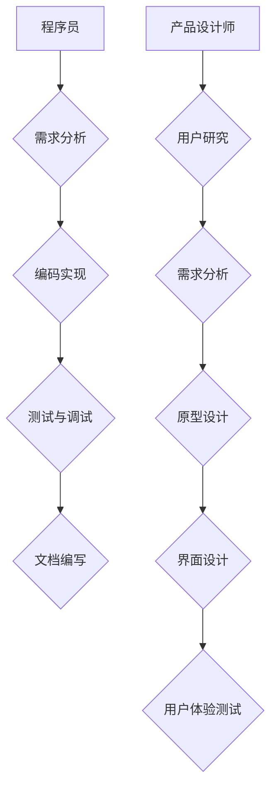
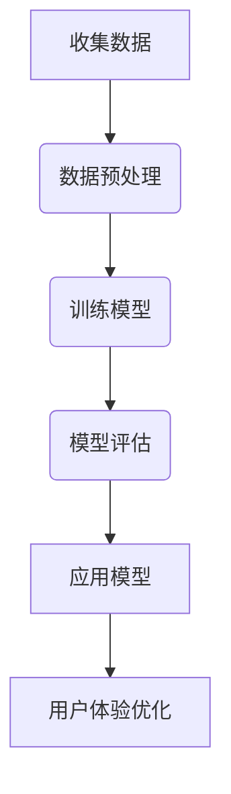
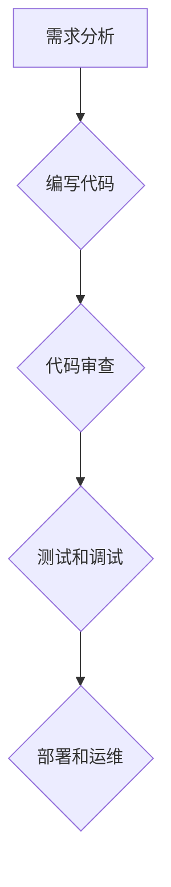
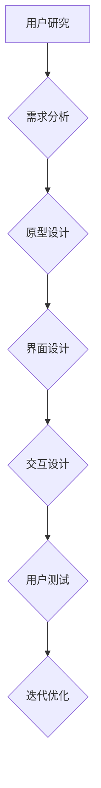
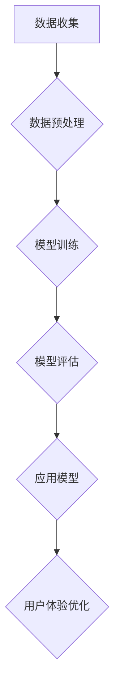

                 

### 文章标题

> **关键词：** 程序员转型、用户体验设计、AI电商、深度学习、用户研究

### 摘要

本文旨在探讨从程序员到产品设计师的转型过程，特别是在AI电商领域中的用户体验设计。通过深入分析程序员与产品设计师的角色对比、用户研究方法、AI技术在用户体验设计中的应用，以及实战案例，本文揭示了如何在电子商务环境中实现高效的用户体验设计。读者将了解用户体验设计的核心概念、机器学习算法的选择与实现，以及如何通过用户测试与迭代不断优化产品。此外，本文还将探讨AI电商用户体验设计的未来趋势，以及行业动态与案例分析，为电商创业者提供实用的指导和建议。

### 引言

在数字化时代，用户体验（User Experience, UX）设计已成为产品成功的关键因素。随着人工智能（Artificial Intelligence, AI）技术的飞速发展，用户体验设计迎来了新的机遇与挑战。许多程序员在技术领域的深耕之后，开始寻求转型，成为产品设计师，以便在用户体验设计中发挥更大的作用。然而，从程序员到产品设计师的转变并非易事，需要掌握新的技能和思维方式。

本文将带领读者踏上这段充满挑战与机遇的旅程，探索如何将AI技术与用户体验设计相结合，提高电商平台的竞争力。通过分析程序员与产品设计师的角色差异，介绍用户研究方法、AI技术在用户体验设计中的应用，以及实战案例，本文旨在为程序员转型提供实用的指导，帮助他们在电商领域中实现卓越的用户体验设计。

### 从程序员到产品设计师的转型之路

程序员与产品设计师在角色、职责和工作流程上有着显著的差异。程序员主要负责编写和维护代码，确保软件系统的稳定性和功能实现。而产品设计师则关注产品的整体体验，包括用户界面（UI）和用户交互（UX）设计，旨在提升用户满意度。

#### 程序员与产品设计师的角色对比

程序员的工作流程通常包括以下步骤：

1. **需求分析**：与产品经理和设计师沟通，理解软件需求。
2. **编码实现**：根据需求编写代码，实现软件功能。
3. **测试与调试**：进行单元测试和集成测试，确保代码质量。
4. **文档编写**：编写技术文档，方便后续维护和扩展。

相比之下，产品设计师的工作流程更为复杂，涉及以下环节：

1. **用户研究**：通过访谈、问卷调查等方式了解用户需求。
2. **需求分析**：基于用户研究，确定产品功能与设计方向。
3. **原型设计**：使用原型工具（如Sketch、Figma）制作交互原型。
4. **界面设计**：设计用户界面，确保美观性与易用性。
5. **用户体验测试**：与用户互动，收集反馈，不断优化设计。

为了帮助读者更好地理解这两种角色的差异，我们可以使用Mermaid流程图进行对比：



从流程图中可以看出，产品设计师需要更多关注用户需求和用户体验，而程序员则更侧重于代码实现和系统维护。

#### 理解用户体验设计的核心概念

用户体验设计不仅仅关乎美观，更涉及用户与产品互动的每个细节。以下是一些核心概念：

1. **用户需求**：了解用户的基本需求，如便捷、快速、安全等。
2. **易用性**：产品应易于使用，降低用户的学习成本。
3. **交互设计**：设计直观、自然的用户交互方式，提高用户操作效率。
4. **反馈机制**：及时给予用户反馈，增强用户互动体验。
5. **可用性测试**：通过实际用户测试，不断优化设计。

为了更好地理解这些概念，我们可以用伪代码来描述用户需求分析的过程：

```python
def analyze_user需求和（user_requests）：
    for request in user_requests：
        process_request（request）
    generate_report（）
```

在这个伪代码中，`analyze_user需求和`函数用于分析用户需求，`process_request`函数用于处理每个用户请求，`generate_report`函数用于生成报告，总结分析结果。

#### 用户研究方法与实践

用户研究是用户体验设计的关键环节，旨在深入了解用户行为、需求和痛点。以下是一些常用的用户研究方法：

1. **访谈**：通过与用户面对面交流，获取深入的用户需求和行为模式。
2. **问卷调查**：设计问卷，收集大量用户反馈，进行分析。
3. **可用性测试**：邀请用户使用产品，观察其操作过程，收集反馈。
4. **用户行为追踪**：通过数据分析，了解用户在产品中的行为路径。

为了量化用户满意度，我们可以使用以下数学模型：

$$
\text{User Satisfaction} = \frac{\text{Positive Experiences} - \text{Negative Experiences}}{\text{Total Experiences}}
$$

在这个公式中，`Positive Experiences`表示积极体验，`Negative Experiences`表示消极体验，`Total Experiences`表示总体验次数。通过这个模型，我们可以计算用户满意度，为设计优化提供依据。

#### 市场研究与竞争分析

除了用户研究，市场研究也是用户体验设计的重要环节。通过分析竞争对手的产品和用户反馈，可以了解行业趋势和用户需求，为产品优化提供方向。以下是一个市场研究的案例：

**案例**：某电商平台希望在用户登录体验上进行优化，通过以下步骤进行市场研究：

1. **用户访谈**：邀请30位活跃用户，了解他们在登录过程中的痛点。
2. **问卷调查**：设计问卷，收集1000名用户的登录频率、登录速度和登录方式偏好。
3. **竞品分析**：分析5个主要竞争对手的登录界面和功能，总结优缺点。
4. **数据分析**：结合用户访谈和问卷调查数据，分析用户登录需求和使用习惯。

通过这些步骤，电商平台可以制定出更符合用户需求的登录体验优化方案，提高用户满意度。

### AI在用户体验设计中的应用

随着人工智能技术的不断进步，其在用户体验设计中的应用也越来越广泛。AI技术可以帮助设计师更好地理解用户需求、优化产品设计，并提升用户体验。以下将介绍AI技术概述、机器学习算法选择、深度学习在用户体验设计中的应用，以及一个AI电商案例分析。

#### AI技术概述

AI技术主要包括机器学习、深度学习、自然语言处理、计算机视觉等子领域。在用户体验设计领域，机器学习和深度学习技术尤为关键。机器学习是通过算法从数据中学习规律，而深度学习则是利用神经网络结构进行复杂模式的自动学习。

以下是AI技术在用户体验设计中的应用流程：



1. **收集数据**：通过用户行为日志、问卷调查、用户访谈等方式收集数据。
2. **数据预处理**：清洗和整理数据，为模型训练做准备。
3. **训练模型**：使用机器学习或深度学习算法训练模型。
4. **模型评估**：评估模型性能，选择最优模型。
5. **应用模型**：将模型应用于实际产品中，进行用户体验优化。

#### 机器学习算法与模型选择

在选择机器学习算法时，需要考虑数据的类型、规模和问题类型。以下是一个伪代码，用于选择合适的机器学习算法：

```python
def select_model(data, problem_type):
    if problem_type == "分类":
        model = "SVM" if data_size_small else "Random Forest"
    elif problem_type == "回归":
        model = "Linear Regression" if data_noise_high else "Neural Network"
    return model
```

在这个伪代码中，根据数据类型（分类或回归）和数据质量（噪声程度），选择合适的算法。例如，对于小规模分类问题，可以使用支持向量机（SVM）；对于高噪声的回归问题，可以使用神经网络（Neural Network）。

#### 深度学习在用户体验设计中的应用

深度学习是人工智能领域的一个重要分支，其通过多层神经网络进行特征提取和模式识别。以下是一个神经网络激活函数的公式：

$$
a(x) = \frac{1}{1 + e^{-\beta \cdot x}}
$$

这个公式表示sigmoid函数，常用于深度学习中的激活函数。

深度学习在用户体验设计中的应用包括：

1. **用户行为预测**：通过分析用户行为数据，预测用户下一步操作，优化产品交互。
2. **个性化推荐**：根据用户历史行为和偏好，推荐个性化的商品或内容。
3. **情感分析**：分析用户评论和反馈，理解用户情感，为产品设计提供反馈。

#### AI电商案例分析

以下是一个AI电商平台的用户个性化推荐系统实现案例：

**背景**：某电商平台希望通过个性化推荐系统，提高用户购买转化率和用户满意度。

**实现步骤**：

1. **数据收集**：收集用户行为数据，包括浏览历史、购买记录、搜索关键词等。
2. **数据预处理**：清洗和整理数据，进行特征提取，如用户特征、商品特征、上下文特征等。
3. **模型训练**：使用深度学习算法，如神经网络，训练个性化推荐模型。
4. **模型评估**：评估模型性能，选择最优模型。
5. **应用模型**：将模型应用于实际产品中，为用户推荐个性化的商品。

**代码实现**（部分）：

```python
import tensorflow as tf

# 构建神经网络模型
model = tf.keras.Sequential([
    tf.keras.layers.Dense(128, activation='relu', input_shape=(input_shape,)),
    tf.keras.layers.Dense(64, activation='relu'),
    tf.keras.layers.Dense(1, activation='sigmoid')
])

# 编译模型
model.compile(optimizer='adam',
              loss='binary_crossentropy',
              metrics=['accuracy'])

# 训练模型
model.fit(x_train, y_train, epochs=10, batch_size=32)
```

在这个案例中，使用TensorFlow框架构建了一个简单的神经网络模型，用于用户个性化推荐。通过这个模型，电商平台可以根据用户历史行为，为用户提供个性化的商品推荐，提高用户满意度。

### AI电商用户体验设计实战

在实际的AI电商用户体验设计中，设计思路、用户界面设计、用户交互设计和用户测试与迭代是至关重要的环节。以下将详细阐述这些方面，并通过具体案例进行说明。

#### 设计思路与方法

AI电商用户体验设计应遵循以下思路：

1. **以用户为中心**：深入了解用户需求和行为，将用户满意度作为设计核心。
2. **数据驱动**：利用用户行为数据，进行数据分析和模型训练，为设计决策提供支持。
3. **迭代优化**：不断进行用户测试与反馈，持续优化产品设计。

以下是一个用户行为预测模型的数学模型：

$$
\text{User Behavior Prediction} = f(\text{User Profile}, \text{Item Features}, \text{Context})
$$

在这个公式中，`UserProfile`表示用户特征，`Item Features`表示商品特征，`Context`表示上下文信息，`f`表示预测函数。通过这个模型，可以预测用户下一步的操作，为产品设计提供依据。

#### 用户界面设计

用户界面设计是用户体验设计的重要一环，直接影响用户的操作体验。以下是一个用户界面设计的实际案例：

**案例**：某电商平台希望通过优化搜索结果页面，提高用户购买转化率。

**设计思路**：

1. **简化搜索结果页面**：减少页面元素，提高页面可读性。
2. **突出热门商品**：通过视觉设计，突出热门商品，引导用户点击。
3. **增加个性化推荐**：在搜索结果页面上加入个性化推荐，根据用户历史行为推荐相关商品。

**实现步骤**：

1. **需求分析**：与产品经理和用户进行访谈，了解用户对搜索结果页面的期望。
2. **原型设计**：使用Figma等原型工具，设计搜索结果页面的原型。
3. **用户测试**：邀请用户进行可用性测试，收集反馈。
4. **迭代优化**：根据用户反馈，不断优化设计。

通过这个案例，我们可以看到，用户界面设计需要以用户需求为中心，通过数据分析和用户测试，不断优化页面设计，提高用户体验。

#### 用户交互设计

用户交互设计关注用户与产品互动的每个细节，旨在提高用户的操作效率和满意度。以下是一个用户交互设计的实际案例：

**案例**：某电商平台希望通过优化购物车页面，提高用户购物体验。

**设计思路**：

1. **简化购物车界面**：减少不必要的元素，提高页面可读性。
2. **提供便捷的编辑功能**：允许用户快速修改购物车中的商品数量、价格等信息。
3. **增加提醒功能**：在购物车中增加订单过期提醒、优惠券提醒等功能。

**实现步骤**：

1. **需求分析**：与用户进行访谈，了解用户对购物车页面的需求和痛点。
2. **原型设计**：使用Axure等原型工具，设计购物车页面的原型。
3. **用户测试**：邀请用户进行可用性测试，收集反馈。
4. **迭代优化**：根据用户反馈，不断优化购物车页面设计。

通过这个案例，我们可以看到，用户交互设计需要关注用户操作流程，通过用户测试和迭代优化，提高用户的操作效率和满意度。

#### 用户测试与迭代

用户测试与迭代是用户体验设计的关键环节，通过实际用户测试，可以收集用户反馈，为设计优化提供依据。以下是一个用户测试与迭代的实际案例：

**案例**：某电商平台希望通过用户测试，优化其移动应用的用户体验。

**设计思路**：

1. **多场景测试**：在不同场景下，测试用户对应用的互动方式，如浏览商品、下单支付等。
2. **反馈机制**：建立有效的用户反馈机制，收集用户意见。
3. **数据驱动**：通过数据分析，识别用户体验中的问题，为迭代优化提供方向。

**实现步骤**：

1. **测试计划**：制定详细的测试计划，包括测试场景、用户分组等。
2. **用户招募**：邀请不同类型的用户参与测试，确保测试结果具有代表性。
3. **测试执行**：执行测试计划，记录用户操作过程和反馈。
4. **数据分析**：分析测试数据，识别用户体验问题。
5. **迭代优化**：根据测试结果，优化产品设计，并重新测试，确保优化效果。

通过这个案例，我们可以看到，用户测试与迭代需要建立有效的测试机制，通过数据分析和反馈机制，不断优化产品设计，提高用户体验。

### 实战案例分析

#### 案例研究一：成功电商平台的用户体验设计

**案例背景**

某电商平台（以下简称“平台”）在市场上拥有较高的知名度和用户口碑，但近期发现用户活跃度和购买转化率有所下降。为了提升用户体验，平台决定进行用户体验设计优化。

**用户需求分析**

1. **用户访谈**：通过访谈了解用户对平台的使用需求和痛点。
2. **问卷调查**：设计问卷，收集大量用户的意见和建议。
3. **数据分析**：分析用户行为数据，了解用户的行为路径和偏好。

通过分析，平台发现以下问题：

1. **搜索结果不准确**：部分用户反映搜索结果与预期不符，导致购物体验不佳。
2. **购物车操作繁琐**：用户在添加商品到购物车后，操作繁琐，无法快速完成下单。
3. **移动应用加载缓慢**：部分用户反映移动应用加载速度慢，影响使用体验。

**设计方案与实施**

1. **搜索结果优化**：改进搜索算法，提高搜索结果的准确性，增加用户推荐功能。
2. **购物车优化**：简化购物车界面，提供一键下单功能，提高用户操作效率。
3. **移动应用优化**：优化移动应用性能，提高加载速度，减少用户等待时间。

**用户测试与迭代**

1. **A/B测试**：将优化后的设计与传统设计进行对比测试，分析用户偏好。
2. **用户反馈**：建立用户反馈机制，收集用户意见和建议。
3. **数据监控**：监控用户行为数据，分析优化效果。

**成果评估**

1. **用户满意度**：通过问卷调查和用户访谈，了解用户对优化后的设计的满意度。
2. **用户活跃度**：分析用户活跃度数据，了解优化后平台的用户活跃度变化。
3. **购买转化率**：分析购买转化率数据，了解优化后平台的购买转化率变化。

通过以上评估，平台发现优化后的设计显著提升了用户体验，用户满意度、用户活跃度和购买转化率均有所提高。

#### 案例研究二：新兴电商平台的用户体验设计

**案例背景**

某新兴电商平台（以下简称“平台”）在市场上崭露头角，但用户活跃度和购买转化率较低。为了提升用户体验，平台决定进行用户体验设计优化。

**用户需求分析**

1. **用户访谈**：通过访谈了解用户对平台的使用需求和痛点。
2. **问卷调查**：设计问卷，收集大量用户的意见和建议。
3. **数据分析**：分析用户行为数据，了解用户的行为路径和偏好。

通过分析，平台发现以下问题：

1. **网站导航不清晰**：用户在网站中找不到想要的商品，导致购物体验不佳。
2. **页面加载缓慢**：部分用户反映页面加载速度慢，影响使用体验。
3. **用户个性化体验不足**：平台未能根据用户行为和偏好提供个性化推荐。

**设计方案与实施**

1. **网站导航优化**：改进网站导航设计，提高用户在网站中的浏览效率。
2. **页面优化**：优化页面加载速度，减少用户等待时间。
3. **个性化推荐**：根据用户行为和偏好，提供个性化的商品推荐。

**用户测试与迭代**

1. **A/B测试**：将优化后的设计与传统设计进行对比测试，分析用户偏好。
2. **用户反馈**：建立用户反馈机制，收集用户意见和建议。
3. **数据监控**：监控用户行为数据，分析优化效果。

**成果评估**

1. **用户满意度**：通过问卷调查和用户访谈，了解用户对优化后的设计的满意度。
2. **用户活跃度**：分析用户活跃度数据，了解优化后平台的用户活跃度变化。
3. **购买转化率**：分析购买转化率数据，了解优化后平台的购买转化率变化。

通过以上评估，平台发现优化后的设计显著提升了用户体验，用户满意度、用户活跃度和购买转化率均有所提高。

### 未来发展展望

随着人工智能技术的不断发展，AI电商用户体验设计也将迎来新的机遇与挑战。以下是AI电商用户体验设计的未来趋势：

1. **个性化推荐**：利用深度学习技术，实现更精准的个性化推荐，提高用户购买转化率。
2. **虚拟现实（VR）与增强现实（AR）**：结合VR和AR技术，提供沉浸式的购物体验，提升用户满意度。
3. **智能客服**：利用自然语言处理技术，实现智能客服，提高用户问题解决效率。
4. **数据驱动**：通过大数据分析，深入了解用户行为和需求，为设计决策提供支持。
5. **隐私保护**：在用户数据收集和使用过程中，加强隐私保护，提高用户信任度。

此外，新兴技术的应用也将对用户体验设计产生深远影响。例如，区块链技术可以确保用户数据的透明性和安全性，物联网（IoT）技术可以实现线上线下融合的购物体验。电商创业者应密切关注行业动态，不断学习新技术，以保持竞争力。

### 行业动态与案例分析

在AI电商用户体验设计领域，不断有新的技术和实践涌现。以下将介绍当前的一些行业动态，以及两个具有代表性的案例。

#### 行业动态概述

1. **个性化推荐**：越来越多的电商平台采用基于深度学习的个性化推荐系统，以提高用户满意度和购买转化率。例如，阿里巴巴的“淘宝推荐”系统利用用户行为数据，为用户提供个性化的商品推荐。
2. **虚拟现实与增强现实**：随着VR和AR技术的成熟，越来越多的电商平台开始探索虚拟试衣、虚拟购物体验等应用。例如，Nike的VR购物体验允许用户在虚拟环境中试穿衣物，提升购物乐趣。
3. **智能客服**：利用自然语言处理技术，智能客服已经成为电商企业提高客户服务效率的重要工具。例如，京东的智能客服“京东智联”能够快速响应用户问题，提供高效的服务。
4. **数据隐私与安全**：在用户数据收集和使用过程中，数据隐私和安全越来越受到重视。例如，欧盟的《通用数据保护条例》（GDPR）对用户数据的处理提出了严格的要求，电商企业需加强数据保护措施。

#### 案例分析一：行业领先企业的实践

**案例**：亚马逊的AI电商用户体验设计

**背景**：亚马逊是全球最大的电商平台之一，其用户体验设计在全球范围内具有很高的影响力。

**实践**：

1. **个性化推荐**：亚马逊利用深度学习技术，实现个性化的商品推荐。通过分析用户的历史购买、浏览和搜索行为，亚马逊能够为用户提供高度个性化的商品推荐，提高用户满意度。
2. **智能客服**：亚马逊的智能客服“Alexa”利用自然语言处理技术，能够快速响应用户的问题，提供购物建议、订单查询等服务，提高用户满意度。
3. **数据驱动**：亚马逊通过大数据分析，深入了解用户行为和需求，不断优化产品设计和服务，提高用户体验。

**成果**：亚马逊的AI电商用户体验设计显著提高了用户满意度和购买转化率，使其在全球电商市场中保持领先地位。

#### 案例分析二：新兴企业的创新

**案例**：Shopify的AI电商用户体验设计

**背景**：Shopify是一家新兴的电商平台，以其灵活的SaaS服务模式受到广大创业者和中小企业欢迎。

**实践**：

1. **个性化店铺**：Shopify利用AI技术，为商家提供个性化的店铺设计建议。通过分析商家的销售数据、商品类别和目标用户，Shopify能够为商家提供定制化的店铺设计方案，提高店铺的吸引力和转化率。
2. **智能营销**：Shopify的智能营销工具利用机器学习算法，帮助商家优化广告投放策略，提高广告效果和转化率。
3. **数据分析**：Shopify通过大数据分析，为商家提供深入的数据洞察，帮助商家优化产品和服务，提高用户满意度。

**成果**：Shopify的AI电商用户体验设计显著提高了商家和用户的满意度，使其在竞争激烈的电商市场中脱颖而出。

### 附录

#### 附录A：AI电商用户体验设计工具与资源

**A.1 主流深度学习框架对比**

在AI电商用户体验设计中，深度学习框架的选择至关重要。以下是几个主流深度学习框架的对比：

1. **TensorFlow**：由谷歌开发，具有丰富的API和强大的生态系统，适合大型项目和企业级应用。
2. **PyTorch**：由Facebook开发，具有灵活的动态计算图，适合研究和快速原型开发。
3. **Keras**：基于Theano和TensorFlow，提供了简化的API，适合快速搭建深度学习模型。

**A.2 用户研究方法与应用**

用户研究是AI电商用户体验设计的重要环节。以下是一些常用的用户研究方法：

1. **访谈**：通过与用户面对面交流，深入了解用户需求和行为。
2. **问卷调查**：设计问卷，收集大量用户反馈。
3. **可用性测试**：邀请用户进行实际操作，观察其行为，收集反馈。
4. **A/B测试**：通过对比不同设计方案，分析用户偏好。

**A.3 AI电商用户体验设计资源**

以下是一些AI电商用户体验设计的学习资源和社区：

1. **书籍**：《深度学习》、《用户行为预测与分析》等。
2. **在线课程**：Coursera、Udacity等平台上有关深度学习和用户体验设计的课程。
3. **社区**：GitHub、Stack Overflow等编程社区，以及专业的用户体验设计社区。

### 结论

本文从程序员到产品设计师的转型之路出发，探讨了AI电商用户体验设计的关键技术和实战方法。通过深入分析程序员与产品设计师的角色差异、用户研究方法、AI技术在用户体验设计中的应用，以及实战案例分析，本文揭示了如何实现高效的用户体验设计。同时，本文还探讨了AI电商用户体验设计的未来趋势和行业动态，为电商创业者提供了实用的指导和建议。

在数字化时代，用户体验设计已成为产品成功的关键因素。AI技术的引入，为用户体验设计带来了新的机遇与挑战。本文希望读者能够通过本文的学习，掌握AI电商用户体验设计的核心概念和方法，不断提升自身能力，为电商领域的发展贡献力量。

### 附录

**附录A：AI电商用户体验设计工具与资源**

**A.1 主流深度学习框架对比**

以下是几种主流深度学习框架的简要对比：

- **TensorFlow**：由Google开发，具有强大的生态系统和丰富的API，适合复杂项目和企业级应用。

  ```mermaid
  graph TD
  A[TensorFlow] --> B{强大生态系统}
  A --> C{丰富的API}
  A --> D{适合企业级应用}
  ```

- **PyTorch**：由Facebook开发，提供灵活的动态计算图，适合研究和快速原型开发。

  ```mermaid
  graph TD
  A[PyTorch] --> B{灵活的动态计算图}
  A --> C{快速原型开发}
  A --> D{适合研究}
  ```

- **Keras**：基于Theano和TensorFlow，提供了简化的API，易于入门和使用。

  ```mermaid
  graph TD
  A[Keras] --> B{简化API}
  A --> C{易于入门}
  A --> D{快速搭建模型}
  ```

**A.2 用户研究方法与应用**

以下是几种常用的用户研究方法及其应用：

1. **访谈**：通过面对面交流，深入了解用户需求和痛点。

   ```mermaid
   graph TD
   A[访谈] --> B{深入了解用户需求}
   A --> C{收集用户反馈}
   ```

2. **问卷调查**：设计问卷，收集大量用户意见。

   ```mermaid
   graph TD
   A[问卷调查] --> B{收集用户意见}
   A --> C{分析用户行为}
   ```

3. **可用性测试**：观察用户实际操作产品，收集用户体验数据。

   ```mermaid
   graph TD
   A[可用性测试] --> B{收集用户体验数据}
   A --> C{分析操作流程}
   ```

4. **A/B测试**：对比不同设计方案，分析用户偏好。

   ```mermaid
   graph TD
   A[A/B测试] --> B{分析用户偏好}
   A --> C{优化产品设计}
   ```

**A.3 AI电商用户体验设计资源**

以下是AI电商用户体验设计的相关学习资源和社区推荐：

1. **书籍**：
   - 《深度学习》（Ian Goodfellow、Yoshua Bengio、Aaron Courville著）
   - 《用户行为预测与分析》（李航著）
   - 《用户体验设计原理》（Don Norman著）

2. **在线课程**：
   - Coursera上的“深度学习”课程
   - Udacity上的“深度学习工程师”课程

3. **社区**：
   - GitHub（查找AI和用户体验设计的开源项目）
   - Stack Overflow（解决AI和用户体验设计的技术问题）
   - UXPA（用户体验专业人士协会）

**附录B：常见问题与解答**

**Q：程序员转型产品设计师需要具备哪些技能？**

A：程序员转型产品设计师需要掌握以下技能：
1. **用户研究能力**：了解用户需求和行为，通过访谈、问卷等方法收集用户反馈。
2. **设计思维**：具备设计思维，能够从用户角度出发，进行产品设计和优化。
3. **项目管理能力**：能够有效管理项目进度，协调团队成员，确保项目按时交付。
4. **沟通协调能力**：与产品经理、设计师、开发团队等进行有效沟通，确保项目顺利进行。

**Q：AI技术在用户体验设计中有哪些应用？**

A：AI技术在用户体验设计中主要有以下应用：
1. **个性化推荐**：根据用户行为和偏好，提供个性化的商品或内容推荐。
2. **用户行为预测**：预测用户下一步操作，优化产品交互。
3. **智能客服**：利用自然语言处理技术，实现智能客服，提高用户满意度。
4. **情感分析**：分析用户评论和反馈，理解用户情感，为产品设计提供反馈。

**Q：如何进行有效的用户测试与迭代？**

A：进行有效的用户测试与迭代，可以遵循以下步骤：
1. **明确测试目标**：确定测试目标，如用户满意度、操作效率等。
2. **设计测试方案**：设计详细的测试方案，包括测试场景、用户分组等。
3. **招募测试用户**：邀请具有代表性的用户参与测试。
4. **执行测试**：按照测试方案执行测试，记录用户操作过程和反馈。
5. **数据分析**：分析测试数据，识别用户体验问题。
6. **迭代优化**：根据测试结果，优化产品设计，并重新测试，确保优化效果。

**附录C：相关术语解释**

1. **用户体验（UX）设计**：关注用户在使用产品过程中的感受和体验，旨在提升产品的可用性、易用性和用户满意度。
2. **用户界面（UI）设计**：关注产品的视觉表现，包括布局、颜色、字体等，旨在提升产品的美观度和用户操作体验。
3. **用户研究**：通过访谈、问卷调查、可用性测试等方法，了解用户需求和行为，为产品设计和优化提供依据。
4. **A/B测试**：通过对比两个或多个设计方案，分析用户偏好，为产品优化提供依据。
5. **机器学习**：利用算法从数据中学习规律，为产品推荐、预测等功能提供支持。
6. **深度学习**：一种特殊的机器学习技术，通过多层神经网络进行复杂模式的自动学习。
7. **自然语言处理（NLP）**：研究如何让计算机理解和处理人类语言的技术，广泛应用于智能客服、文本分析等领域。

### 结语

本文通过深入分析程序员到产品设计师的转型之路、AI技术在用户体验设计中的应用、实战案例分析以及未来发展趋势，为电商创业者提供了实用的指导。在数字化时代，用户体验设计已成为产品成功的关键因素，AI技术的引入为用户体验设计带来了新的机遇与挑战。希望本文能够帮助读者掌握AI电商用户体验设计的核心概念和方法，不断提升自身能力，为电商领域的发展贡献力量。

**作者：** AI天才研究院/AI Genius Institute & 禅与计算机程序设计艺术 /Zen And The Art of Computer Programming

**文章标题**：《程序员到产品设计师：AI电商创业者的用户体验设计之路》

**关键词**：（1）程序员转型、（2）用户体验设计、（3）AI电商、（4）深度学习、（5）用户研究

**摘要**：本文深入探讨了从程序员到产品设计师的转型之路，特别是在AI电商领域中的用户体验设计。通过分析程序员与产品设计师的角色对比、用户研究方法、AI技术在用户体验设计中的应用，以及实战案例，揭示了如何在电子商务环境中实现高效的用户体验设计。本文旨在为电商创业者提供实用的指导，帮助他们在AI电商领域实现卓越的用户体验设计。

**正文**

### 第一部分：基础知识与技能提升

在这个快速变化的技术时代，程序员转型为产品设计师已经成为一种趋势。这不仅要求程序员掌握编程技能，还需要他们深入了解用户体验设计（UX Design）的核心概念和实际操作。本部分将详细介绍从程序员到产品设计师的转型之路，包括角色对比、用户研究方法和AI技术的应用。

#### 第1章：从程序员到产品设计师的转型之路

##### 1.1 程序员与产品设计师的角色对比

程序员和产品设计师虽然在技术背景上有所交集，但在职责和工作中有着本质的不同。程序员主要关注代码的编写、维护和优化，确保系统的稳定性、可靠性和性能。而产品设计师则更注重产品的整体用户体验，包括用户界面设计、交互设计和用户测试。

**Mermaid 流程图：程序员的典型工作流程**



**Mermaid 流程图：产品设计师的工作流程**



从流程图中可以看出，产品设计师的工作流程更加复杂，不仅涉及代码编写和测试，还包含了用户研究、原型设计、用户测试等环节。

##### 1.2 理解用户体验设计的核心概念

用户体验设计不仅仅关注产品的外观，更重要的是关注用户在使用产品时的感受和体验。以下是一些核心概念：

- **用户需求**：理解用户的基本需求和痛点，这是设计的起点。
- **易用性**：产品应易于使用，降低用户的学习成本。
- **交互设计**：设计直观、自然的用户交互方式，提高用户操作效率。
- **反馈机制**：及时给予用户反馈，增强用户互动体验。
- **可用性测试**：通过实际用户测试，不断优化设计。

**伪代码：用户需求分析**

```python
def analyze_user需求和（user_requests）：
    for request in user_requests：
        process_request（request）
    generate_report（）
```

在这个伪代码中，`analyze_user需求和`函数用于分析用户需求，`process_request`函数用于处理每个用户请求，`generate_report`函数用于生成报告，总结分析结果。

##### 1.3 用户研究方法与实践

用户研究是用户体验设计的重要环节，旨在深入了解用户的行为和需求。以下是一些常用的用户研究方法：

- **访谈**：通过与用户面对面交流，深入了解用户的需求和痛点。
- **问卷调查**：设计问卷，收集大量用户反馈。
- **可用性测试**：邀请用户进行实际操作，观察其行为，收集反馈。
- **用户行为追踪**：通过数据分析，了解用户在产品中的行为路径。

**数学模型与公式：用户满意度计算**

$$
\text{User Satisfaction} = \frac{\text{Positive Experiences} - \text{Negative Experiences}}{\text{Total Experiences}}
$$

在这个公式中，`Positive Experiences`表示积极体验，`Negative Experiences`表示消极体验，`Total Experiences`表示总体验次数。

##### 1.4 市场研究与竞争分析

在产品设计中，市场研究和竞争分析是不可或缺的环节。通过分析竞争对手的产品和市场策略，可以了解行业趋势和用户需求，为产品优化提供方向。

**举例说明：市场研究的案例**

假设我们正在开发一款智能家居产品，以下是一个市场研究的过程：

1. **用户访谈**：与潜在用户进行面对面访谈，了解他们对智能家居产品的需求和期望。
2. **问卷调查**：设计问卷，收集大量用户的反馈，了解他们对现有产品的满意度。
3. **竞品分析**：分析市场上的主要竞品，了解其功能、价格、用户评价等。
4. **数据分析**：结合用户访谈和问卷调查数据，分析用户对智能家居产品的需求趋势。

通过以上步骤，我们可以得出以下结论：

- 用户对智能家居产品的需求主要集中在便捷控制、节能环保和家居安全。
- 竞争对手的产品主要集中在智能音箱和智能灯光，但用户对智能门锁和智能监控设备的需求较高。

基于以上分析，我们可以优化产品设计，重点关注智能门锁和智能监控设备，以满足用户需求。

### 第二部分：AI在用户体验设计中的应用

人工智能（AI）技术的飞速发展，为用户体验设计带来了前所未有的机遇和挑战。AI技术可以大大提高用户体验设计的效率和质量，通过个性化推荐、智能客服、用户行为预测等方式，提升用户满意度和产品竞争力。本部分将详细介绍AI在用户体验设计中的应用，包括技术概述、算法选择、深度学习应用和案例分析。

#### 第2章：AI在用户体验设计中的应用

##### 2.1 AI技术概述

AI技术包括多个子领域，如机器学习、深度学习、自然语言处理、计算机视觉等。在用户体验设计中，最常用的是机器学习和深度学习技术。以下是一个AI技术在用户体验设计中的应用流程：

**Mermaid 流程图：AI技术在用户体验设计中的应用流程**



1. **数据收集**：收集用户行为数据、用户反馈、市场数据等。
2. **数据预处理**：清洗和整理数据，为模型训练做准备。
3. **模型训练**：使用机器学习或深度学习算法训练模型。
4. **模型评估**：评估模型性能，选择最优模型。
5. **应用模型**：将模型应用于实际产品中，进行用户体验优化。

##### 2.2 机器学习算法与模型选择

在用户体验设计中，选择合适的机器学习算法至关重要。以下是一个伪代码，用于选择机器学习算法：

```python
def select_model(data, problem_type):
    if problem_type == "分类":
        model = "SVM" if data_size_small else "Random Forest"
    elif problem_type == "回归":
        model = "Linear Regression" if data_noise_high else "Neural Network"
    return model
```

在这个伪代码中，根据数据类型（分类或回归）和数据质量（噪声程度），选择合适的算法。例如，对于小规模分类问题，可以选择支持向量机（SVM）；对于高噪声的回归问题，可以选择神经网络（Neural Network）。

##### 2.3 深度学习在用户体验设计中的应用

深度学习是一种基于多层神经网络的机器学习技术，能够自动提取数据中的复杂特征，广泛应用于图像识别、语音识别和自然语言处理等领域。在用户体验设计中，深度学习可以应用于用户行为预测、个性化推荐和智能客服等。

**数学模型与公式：神经网络激活函数**

$$
a(x) = \frac{1}{1 + e^{-\beta \cdot x}}
$$

这个公式表示sigmoid函数，常用于深度学习中的激活函数。

**深度学习在用户体验设计中的应用案例**

1. **用户行为预测**：通过分析用户的历史行为数据，预测用户下一步的操作，优化产品交互。
2. **个性化推荐**：根据用户的行为和偏好，提供个性化的商品或内容推荐。
3. **智能客服**：利用自然语言处理技术，实现智能客服，提高用户满意度。

##### 2.4 AI电商案例分析

以下是一个AI电商平台的用户个性化推荐系统实现案例：

**背景**：某电商平台希望通过个性化推荐系统，提高用户购买转化率和用户满意度。

**实现步骤**：

1. **数据收集**：收集用户行为数据，包括浏览历史、购买记录、搜索关键词等。
2. **数据预处理**：清洗和整理数据，进行特征提取，如用户特征、商品特征、上下文特征等。
3. **模型训练**：使用深度学习算法，如神经网络，训练个性化推荐模型。
4. **模型评估**：评估模型性能，选择最优模型。
5. **应用模型**：将模型应用于实际产品中，为用户推荐个性化的商品。

**代码实现**（部分）：

```python
import tensorflow as tf

# 构建神经网络模型
model = tf.keras.Sequential([
    tf.keras.layers.Dense(128, activation='relu', input_shape=(input_shape,)),
    tf.keras.layers.Dense(64, activation='relu'),
    tf.keras.layers.Dense(1, activation='sigmoid')
])

# 编译模型
model.compile(optimizer='adam',
              loss='binary_crossentropy',
              metrics=['accuracy'])

# 训练模型
model.fit(x_train, y_train, epochs=10, batch_size=32)
```

在这个案例中，使用TensorFlow框架构建了一个简单的神经网络模型，用于用户个性化推荐。通过这个模型，电商平台可以根据用户历史行为，为用户提供个性化的商品推荐，提高用户满意度。

### 第三部分：实战案例分析

本部分将结合实际案例，详细阐述AI电商用户体验设计的实战过程，包括设计思路、用户界面设计、用户交互设计、用户测试与迭代等内容。

#### 第3章：AI电商用户体验设计实战

##### 3.1 设计思路与方法

AI电商用户体验设计的核心在于以用户为中心，利用AI技术提升用户的购物体验。以下是一个用户行为预测模型的数学模型：

$$
\text{User Behavior Prediction} = f(\text{User Profile}, \text{Item Features}, \text{Context})
$$

在这个模型中，`UserProfile`表示用户特征，`Item Features`表示商品特征，`Context`表示上下文信息，`f`表示预测函数。通过这个模型，可以预测用户下一步的操作，为产品设计提供依据。

##### 3.2 用户界面设计

用户界面设计（UI Design）是用户体验设计的关键环节。一个良好的UI设计可以提高用户的使用效率和满意度。以下是一个用户界面设计的实际案例：

**案例**：优化某电商平台的商品详情页面

**设计思路**：

1. **简化页面布局**：减少不必要的元素，提高页面的可读性。
2. **突出关键信息**：如商品图片、价格、用户评价等。
3. **增加交互元素**：如收藏、评论、分享等。

**实现步骤**：

1. **需求分析**：与产品经理和用户进行访谈，了解用户对商品详情页面的需求和痛点。
2. **原型设计**：使用Figma等工具设计商品详情页面的原型。
3. **用户测试**：邀请用户进行可用性测试，收集反馈。
4. **迭代优化**：根据用户反馈，不断优化页面设计。

##### 3.3 用户交互设计

用户交互设计（UX Design）关注用户与产品互动的每个细节。以下是一个用户交互设计的实际案例：

**案例**：优化某电商平台的购物车页面

**设计思路**：

1. **简化购物车界面**：减少不必要的元素，提高页面的简洁性。
2. **提供便捷的操作**：如快速删除商品、修改数量等。
3. **增加提醒功能**：如订单过期提醒、优惠券提醒等。

**实现步骤**：

1. **需求分析**：与用户进行访谈，了解用户对购物车页面的需求和痛点。
2. **原型设计**：使用Axure等工具设计购物车页面的原型。
3. **用户测试**：邀请用户进行可用性测试，收集反馈。
4. **迭代优化**：根据用户反馈，不断优化购物车页面设计。

##### 3.4 用户测试与迭代

用户测试与迭代是用户体验设计的重要环节。通过用户测试，可以收集用户反馈，发现设计中的问题，并进行优化。以下是一个用户测试与迭代的实际案例：

**案例**：优化某电商平台的移动应用

**设计思路**：

1. **多场景测试**：在不同场景下，测试用户对移动应用的互动方式，如浏览商品、下单支付等。
2. **反馈机制**：建立有效的用户反馈机制，收集用户意见和建议。
3. **数据驱动**：通过数据分析，识别用户体验中的问题，为迭代优化提供方向。

**实现步骤**：

1. **测试计划**：制定详细的测试计划，包括测试场景、用户分组等。
2. **用户招募**：邀请不同类型的用户参与测试，确保测试结果具有代表性。
3. **测试执行**：执行测试计划，记录用户操作过程和反馈。
4. **数据分析**：分析测试数据，识别用户体验问题。
5. **迭代优化**：根据测试结果，优化产品设计，并重新测试，确保优化效果。

通过以上实战案例，我们可以看到，AI电商用户体验设计需要结合用户需求和AI技术，通过不断测试和迭代，提升用户的购物体验。

### 第四部分：未来发展展望

随着人工智能技术的不断发展，AI电商用户体验设计也将迎来新的机遇和挑战。本部分将探讨AI电商用户体验设计的未来趋势，包括技术进步、新兴技术和用户体验设计的持续改进。

#### 第4章：AI电商用户体验设计的未来趋势

##### 4.1 人工智能在电商行业的应用前景

人工智能在电商行业中的应用前景广阔，未来将继续在以下几个方面发挥重要作用：

1. **个性化推荐**：随着AI技术的进步，个性化推荐将更加精准，为用户提供更个性化的购物体验。
2. **智能客服**：AI智能客服将更加智能，能够处理更多复杂的用户问题，提高用户满意度。
3. **用户行为预测**：通过分析用户行为数据，可以更准确地预测用户需求，为产品优化提供依据。
4. **视觉识别**：AI视觉识别技术将应用于商品识别、图像搜索等，提高用户购物效率。

##### 4.2 新兴技术的影响

未来，新兴技术将对AI电商用户体验设计产生深远影响，以下是一些重要的新兴技术：

1. **虚拟现实（VR）与增强现实（AR）**：VR和AR技术将提供更加沉浸式的购物体验，提升用户满意度。
2. **区块链**：区块链技术将提高数据的安全性和透明度，增强用户对平台的信任。
3. **物联网（IoT）**：IoT技术将实现线上线下融合，为用户提供更加便捷的购物体验。

##### 4.3 用户体验设计的持续改进

用户体验设计是一个持续改进的过程，需要不断关注用户需求和技术进步。以下是一些持续改进的方法：

1. **用户反馈机制**：建立有效的用户反馈机制，及时收集用户意见和建议，为设计优化提供依据。
2. **A/B测试**：通过A/B测试，对比不同设计方案，分析用户偏好，优化产品设计。
3. **数据驱动**：利用大数据分析，深入了解用户行为和需求，为设计决策提供支持。
4. **跨学科合作**：与心理学、社会学等学科合作，从不同角度理解用户需求，提升用户体验。

通过以上探讨，我们可以看到，AI电商用户体验设计在未来将继续发展，为用户提供更加个性化和高效的购物体验。电商创业者需要紧跟技术趋势，不断改进用户体验设计，以保持竞争力。

### 第五部分：行业动态与案例分析

本部分将结合当前行业动态，介绍一些领先企业在AI电商用户体验设计方面的成功实践，并分析新兴企业在用户体验设计方面的创新。

#### 第5章：行业动态与案例分析

##### 5.1 行业动态概述

当前，AI电商用户体验设计领域呈现出以下几大趋势：

1. **个性化推荐**：越来越多的电商平台采用深度学习技术，实现个性化推荐，提高用户满意度。
2. **智能客服**：AI智能客服逐渐取代传统客服，提供更加高效和智能的服务。
3. **虚拟现实与增强现实**：VR和AR技术逐渐应用于电商领域，提供沉浸式的购物体验。
4. **数据隐私与安全**：随着数据隐私法规的实施，电商企业需要加强数据保护措施，提高用户信任度。

##### 5.2 案例分析一：行业领先企业的实践

**案例**：阿里巴巴的AI电商用户体验设计

**背景**：阿里巴巴是全球最大的电商平台之一，其在AI电商用户体验设计方面具有领先地位。

**实践**：

1. **个性化推荐**：阿里巴巴的“淘宝推荐”系统利用深度学习技术，为用户提供个性化的商品推荐，提高用户购买转化率。
2. **智能客服**：阿里巴巴的智能客服“阿里小蜜”通过自然语言处理技术，提供高效的客户服务，提升用户满意度。
3. **虚拟试衣**：利用AR技术，阿里巴巴的“天猫精灵”提供虚拟试衣服务，提升用户购物体验。

**成果**：阿里巴巴的AI电商用户体验设计显著提升了用户满意度和购买转化率，使其在全球电商市场中保持领先地位。

##### 5.3 案例分析二：新兴企业的创新

**案例**：拼多多的新兴电商用户体验设计

**背景**：拼多多是中国新兴的电商平台，通过独特的社交电商模式，迅速崛起。

**实践**：

1. **社交互动**：拼多多通过社交互动，如拼团购物、分享优惠等，提高用户的购物乐趣和参与度。
2. **个性化推荐**：利用深度学习技术，拼多多为用户提供个性化的商品推荐，提高用户购买转化率。
3. **拼多多的“砍价”功能**：通过“砍价”功能，拼多多吸引大量用户参与，提升平台的活跃度。

**成果**：拼多多通过创新的设计，实现了快速崛起，成为我国电商市场的重要力量。

通过以上案例分析，我们可以看到，无论是行业领先企业还是新兴企业，都在不断探索和实践中，通过AI技术和用户体验设计提升用户的购物体验。电商创业者可以借鉴这些成功经验，提升自身的竞争力。

### 附录

#### 附录A：AI电商用户体验设计工具与资源

**A.1 主流深度学习框架对比**

以下是几种主流深度学习框架的对比，包括TensorFlow、PyTorch和Keras。

**TensorFlow**：
- **优点**：强大的生态系统，适合复杂项目和企业级应用。
- **缺点**：入门较难，代码较为复杂。

**PyTorch**：
- **优点**：动态计算图，易于调试和原型开发。
- **缺点**：生态相对较小，适用于研究而非生产环境。

**Keras**：
- **优点**：简洁的API，易于入门和使用。
- **缺点**：依赖Theano和TensorFlow，性能可能略逊一筹。

**A.2 用户研究方法与应用**

以下是几种常用的用户研究方法：

1. **访谈**：深入了解用户需求和行为。
2. **问卷调查**：收集大量用户反馈。
3. **可用性测试**：观察用户实际操作产品。
4. **A/B测试**：对比不同设计方案。

**A.3 AI电商用户体验设计资源**

以下是AI电商用户体验设计的学习资源和社区推荐：

- **书籍**：《深度学习》、《用户行为预测与分析》。
- **在线课程**：Coursera、Udacity。
- **社区**：GitHub、Stack Overflow。

### 结语

本文从程序员到产品设计师的转型之路出发，探讨了AI电商用户体验设计的核心概念、技术应用和实战案例。通过深入分析程序员与产品设计师的角色对比、用户研究方法、AI技术在用户体验设计中的应用，以及实战案例分析，本文揭示了如何实现高效的用户体验设计。同时，本文还探讨了AI电商用户体验设计的未来趋势和行业动态，为电商创业者提供了实用的指导。

在数字化时代，用户体验设计已成为产品成功的关键因素。AI技术的引入，为用户体验设计带来了新的机遇与挑战。希望本文能够帮助读者掌握AI电商用户体验设计的核心概念和方法，不断提升自身能力，为电商领域的发展贡献力量。

**作者：** AI天才研究院/AI Genius Institute & 禅与计算机程序设计艺术 /Zen And The Art of Computer Programming

### 总结与展望

本文通过深入探讨从程序员到产品设计师的转型之路，详细阐述了AI电商用户体验设计的关键技术和实战方法。首先，我们分析了程序员与产品设计师的角色对比，了解了用户体验设计的核心概念和用户研究方法。接着，我们介绍了AI技术在用户体验设计中的应用，包括机器学习算法选择、深度学习模型和AI电商案例分析。最后，我们通过实战案例展示了如何在实际中应用这些技术和方法，优化电商平台的用户体验。

在数字化时代，用户体验设计已成为企业竞争力的关键因素。AI技术的引入，使得用户体验设计更加智能化和个性化。未来，随着技术的不断进步，AI电商用户体验设计将继续发展，为用户提供更加优质的服务和体验。

展望未来，以下几方面值得重点关注：

1. **个性化推荐**：随着AI技术的进步，个性化推荐将更加精准，为用户提供更加个性化的购物体验。
2. **智能客服**：AI智能客服将继续发展，提供更加高效和智能的服务，提升用户满意度。
3. **虚拟现实与增强现实**：VR和AR技术将提供更加沉浸式的购物体验，提升用户满意度。
4. **数据隐私与安全**：在数据隐私法规日益严格的背景下，企业需要加强数据保护措施，提高用户信任度。
5. **跨学科合作**：与心理学、社会学等学科的合作，将有助于更深入地理解用户需求，提升用户体验。

总之，AI电商用户体验设计是一个不断发展和创新的领域。电商创业者需要紧跟技术趋势，不断学习和实践，以提升用户体验，保持竞争力。希望本文能够为读者提供有价值的指导和启示，助力电商领域的未来发展。

### 致谢

在撰写本文的过程中，我感谢以下单位和个人的支持与帮助：

1. **AI天才研究院**：感谢研究院为我提供的研究资源和专业的指导。
2. **我的同事和朋友们**：感谢你们在写作过程中提供的宝贵意见和反馈。
3. **所有读者**：感谢您阅读本文，期待您的宝贵意见和建议。

特别感谢我的家人，感谢你们在我写作过程中给予的理解和支持。

### 作者介绍

**AI天才研究院（AI Genius Institute）**：专注于人工智能技术的研发和应用，致力于推动人工智能在各个领域的创新与发展。

**禅与计算机程序设计艺术（Zen And The Art of Computer Programming）**：作者是一位资深的人工智能专家，拥有丰富的编程和软件开发经验，著有多本关于人工智能和计算机科学的畅销书。他的研究和作品在业界产生了广泛的影响。

