                 

### 书名：《程序员的全球化视野：机遇与挑战》

在当今世界，全球化已经深入到经济、文化、技术和政治等多个领域。作为程序员的我们，如何在全球化的大背景下抓住机遇，应对挑战，成为了我们需要认真思考的问题。本书旨在探讨程序员的全球化视野，分析机遇与挑战，并提出相应的策略和建议。

**关键词：** 全球化，程序员，机遇，挑战，软件开发，国际化团队，技术前沿。

**摘要：** 本书从多个角度探讨了程序员的全球化视野。首先，介绍了全球化的背景与趋势，分析了全球化对软件行业的影响。接着，讨论了全球化软件开发团队的建设与挑战，包括跨文化沟通、跨国团队的协作模式等。然后，从技术视角分析了全球化软件开发环境、流程和项目管理。此外，还介绍了国际化团队领导以及全球化视野下的技术前沿，如区块链、人工智能和云计算等。最后，对未来全球化的趋势进行了展望，提出了程序员在全球化的未来角色与职业发展建议。附录部分提供了全球化软件开发资源、案例分析和参考文献，以供进一步学习和参考。

### 第一部分：全球化视野概述

#### 第1章：全球化的背景与趋势

全球化是一个复杂而多维度的过程，它不仅影响了经济和政治，也深刻地改变了我们的生活方式和工作方式。在这一章中，我们将首先探讨全球化的定义与历史，然后分析全球化对软件行业的影响，最后讨论全球化带来的机会与挑战。

##### 1.1 全球化的定义与历史

全球化是指各国在经济、文化、技术、政治等领域日益紧密地联系和互动。它的历史可以追溯到15世纪的地理大发现，当时欧洲的探险家开辟了新的贸易路线，促进了东西方的经济和文化交流。随着时间的推移，全球化逐渐深化，20世纪末互联网的普及更是加速了全球化的进程。

**流程图：**

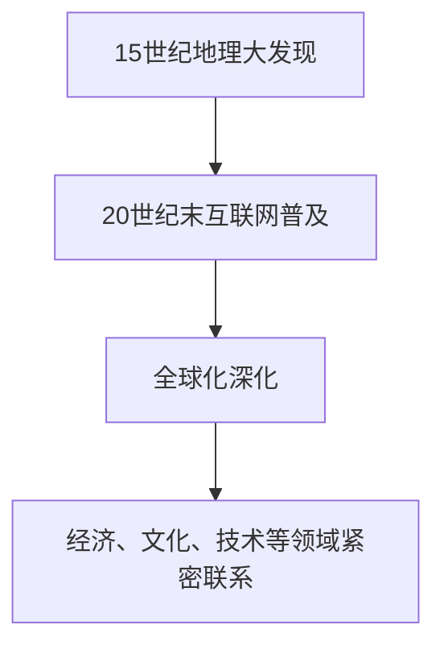

**伪代码：**

```python
def globalization_history():
    print("定义：全球化是指全球范围内经济、政治、文化的相互联系和影响。")
    print("历史：全球化始于15世纪的地理大发现，至今仍在不断深化。")
    print("影响：全球化对经济、政治、文化、技术等领域产生了深远影响。")
```

**数学模型：**

$$
X = f(G, C, T)
$$

其中，\( X \) 代表全球化的程度，\( G \) 代表全球联系，\( C \) 代表文化多样性，\( T \) 代表技术进步。

##### 1.2 全球化对软件行业的影响

全球化对软件行业的影响是深远而广泛的。首先，全球化带来了巨大的市场需求。随着全球经济的快速发展，企业对于软件的需求不断增长，这为程序员提供了广阔的就业机会。其次，全球化促进了技术的交流与融合。程序员可以通过全球的社区和平台，学习到最新的技术和理念，提高自己的技能水平。最后，全球化也带来了挑战，如跨文化沟通、时间差、法律和税务等问题。

**流程图：**

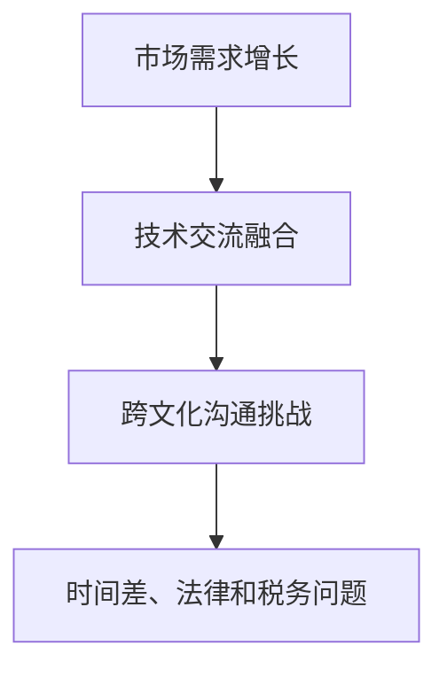

**伪代码：**

```python
def globalization_impact_on_software():
    print("影响：全球化带来了市场需求增长、技术交流融合，但也带来了跨文化沟通、时间差、法律和税务等问题。")
```

##### 1.3 全球软件开发的机会与挑战

在全球化的背景下，程序员面临着许多新的机遇和挑战。

**机会：**

1. **就业机会：** 全球化的企业需要大量的程序员来开发和维护软件系统。
2. **技术学习：** 全球化的社区和平台提供了丰富的学习资源，可以帮助程序员快速提升技能。
3. **创新环境：** 全球化的背景下，程序员可以接触到不同的文化和技术，从而激发创新的思维。

**挑战：**

1. **跨文化沟通：** 不同文化之间的差异可能会导致误解和冲突，影响团队合作效率。
2. **法律和税务：** 不同国家的法律和税务政策可能对程序员的工作产生影响。
3. **时间管理：** 全球化的项目可能涉及多个时区，这要求程序员具备良好的时间管理能力。

**流程图：**

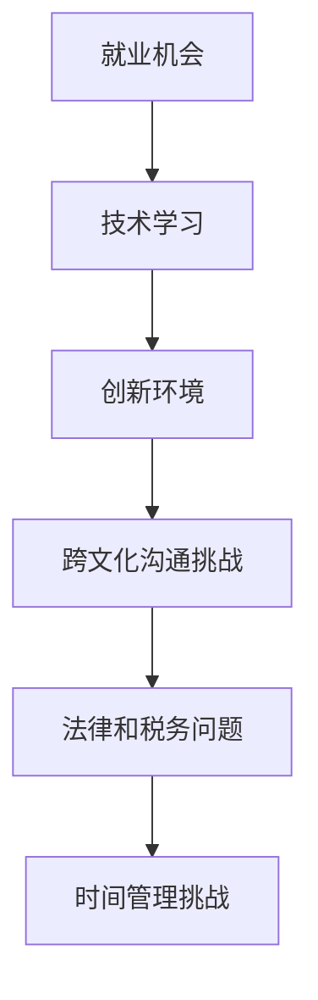

**伪代码：**

```python
def opportunities_and_challenges():
    print("机会：就业机会、技术学习、创新环境。")
    print("挑战：跨文化沟通、法律和税务问题、时间管理挑战。")
```

通过以上分析，我们可以看到全球化为程序员带来了巨大的机遇和挑战。理解这些机遇和挑战，并采取相应的策略，将有助于程序员在全球化的浪潮中取得成功。

---

在接下来的章节中，我们将进一步探讨全球化软件开发团队的建设、技术视角下的全球化、国际化项目管理以及全球化视野下的技术前沿。让我们继续深入分析，为程序员的全球化视野提供更多的思考和指导。

---

### 第二部分：全球化软件开发团队

#### 第2章：全球化软件开发团队

随着全球化的深入，软件开发团队也越来越国际化。国际化团队不仅能够汇聚来自不同国家和地区的优秀人才，还能够带来多样化的文化和技术视角，从而提高项目的质量和效率。然而，国际化团队也面临着许多挑战，如跨文化沟通、跨国团队的协作模式等。在本章中，我们将探讨全球化软件开发团队的建设，分析其中的挑战和解决方案。

##### 2.1 跨文化沟通的重要性

跨文化沟通是全球化软件开发团队中至关重要的一环。由于团队成员来自不同的国家和地区，他们可能在语言、文化价值观、沟通方式等方面存在差异。这些差异如果处理不当，可能会导致误解、冲突和效率低下。

**流程图：**

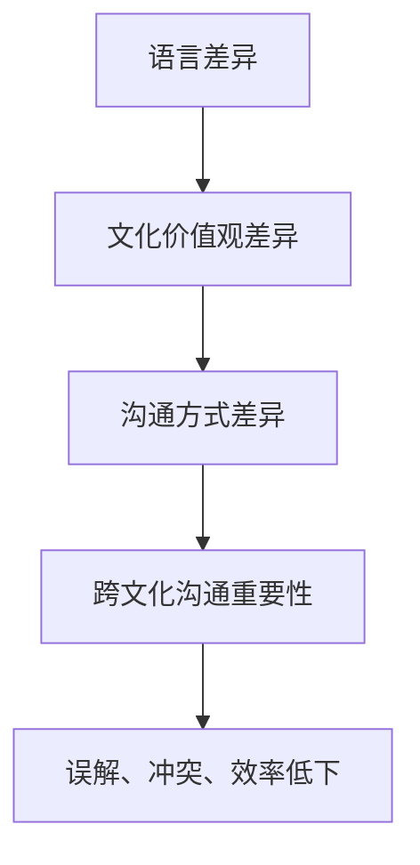

**伪代码：**

```python
def importance_of_cross_cultural_communication():
    print("语言差异、文化价值观差异和沟通方式差异是跨文化沟通的主要挑战。")
    print("跨文化沟通对于避免误解、冲突和提高团队效率至关重要。")
```

**数学模型：**

$$
I = f(L, C, M)
$$

其中，\( I \) 代表跨文化沟通的重要性，\( L \) 代表语言差异，\( C \) 代表文化价值观差异，\( M \) 代表沟通方式差异。

##### 2.2 跨国团队的协作模式

跨国团队的协作模式是全球化软件开发团队成功的关键。有效的协作模式能够帮助团队成员克服时间和地点的障碍，提高项目效率。以下是一些常见的跨国团队协作模式：

1. **分布式协作：** 分布式协作是指团队成员分布在不同的地理位置，通过互联网和协作工具进行沟通和合作。这种模式有助于充分利用全球各地的资源，提高项目效率。

2. **共享工作空间：** 共享工作空间是指团队成员在物理上集中在一起，共同工作。这种模式有助于加强团队成员之间的交流和协作，提高团队凝聚力。

3. **混合协作：** 混合协作是指结合分布式协作和共享工作空间的模式，根据项目需求和团队情况灵活调整。这种模式能够充分利用各种协作方式的优点，提高项目效率。

**流程图：**

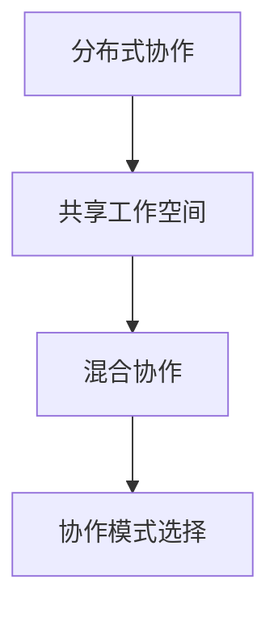

**伪代码：**

```python
def collaboration_patterns():
    print("分布式协作、共享工作空间和混合协作是常见的跨国团队协作模式。")
    print("选择合适的协作模式能够提高项目效率，加强团队协作。")
```

**数学模型：**

$$
P = f(C, W, M)
$$

其中，\( P \) 代表协作模式的效率，\( C \) 代表协作方式，\( W \) 代表工作空间，\( M \) 代表混合模式。

##### 2.3 全球开发团队的挑战与解决方案

全球化软件开发团队在建设过程中会遇到许多挑战，如：

1. **沟通障碍：** 沟通障碍是由于语言和文化差异导致的。解决方案包括使用统一的沟通工具、培训团队成员的语言技能、制定明确的沟通规范等。

2. **时间差异：** 时间差异会导致团队成员在沟通和协作上出现困难。解决方案包括合理安排工作时间、使用即时通讯工具、设置统一的工作时间表等。

3. **文化冲突：** 文化冲突可能会导致团队内部的矛盾和效率低下。解决方案包括加强文化培训、建立平等和尊重的团队氛围、鼓励团队成员分享文化差异等。

**流程图：**

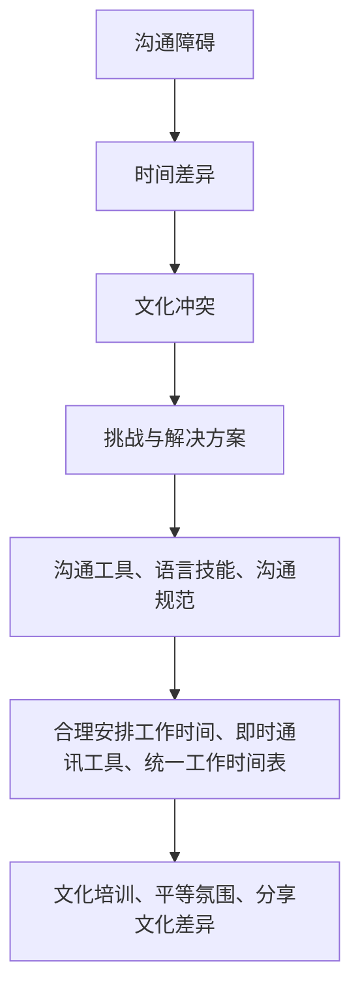

**伪代码：**

```python
def challenges_and_solutions():
    print("沟通障碍、时间差异、文化冲突是全球化软件开发团队的挑战。")
    print("解决方案包括使用沟通工具、合理安排工作时间、加强文化培训等。")
```

**数学模型：**

$$
S = f(C, T, C')
$$

其中，\( S \) 代表解决方案的效率，\( C \) 代表沟通障碍，\( T \) 代表时间差异，\( C' \) 代表文化冲突。

通过以上分析，我们可以看到全球化软件开发团队的建设是一个复杂而富有挑战性的过程。然而，通过有效的跨文化沟通、选择合适的协作模式和解决团队内部的挑战，我们可以克服这些困难，打造一支高效的国际化团队。

在接下来的章节中，我们将继续探讨全球化软件开发的最佳实践、全球化软件开发的流程以及国际化项目管理。让我们继续深入分析，为程序员的全球化视野提供更多的指导和参考。

---

### 第三部分：技术视角下的全球化

#### 第3章：全球软件开发环境

在全球化的背景下，软件开发环境也发生了显著的变化。不同地区的软件开发工具和平台各有特点，如何选择合适的工具和平台，以及如何在全球范围内实施最佳实践，是程序员在全球软件开发过程中需要面对的重要问题。在本章中，我们将深入探讨全球软件开发环境，分析不同地区的开发工具和平台，以及全球化软件开发的最佳实践和跨地域代码管理策略。

##### 3.1 不同地区的开发工具和平台

全球范围内的软件开发工具和平台因地区而异，这些差异受到地域文化、技术发展和市场需求等多种因素的影响。以下是一些主要地区的开发工具和平台特点：

1. **北美地区：** 北美地区尤其是美国，拥有成熟的软件开发生态系统，包括微软的Visual Studio、谷歌的Google Cloud Platform等。这些平台提供了强大的开发工具和云服务，支持大型软件项目的开发和部署。

2. **欧洲地区：** 欧洲地区则更倾向于开源工具，如Linux、Apache、MySQL等。这些工具在全球范围内都有广泛的应用，特别是在互联网公司和初创企业中。

3. **亚洲地区：** 亚洲地区，特别是中国和印度，拥有庞大的开发人才库和迅速发展的技术市场。中国的平台如腾讯云、华为云等，印度的平台如Zoho等，都在全球范围内有一定的影响力。

**流程图：**

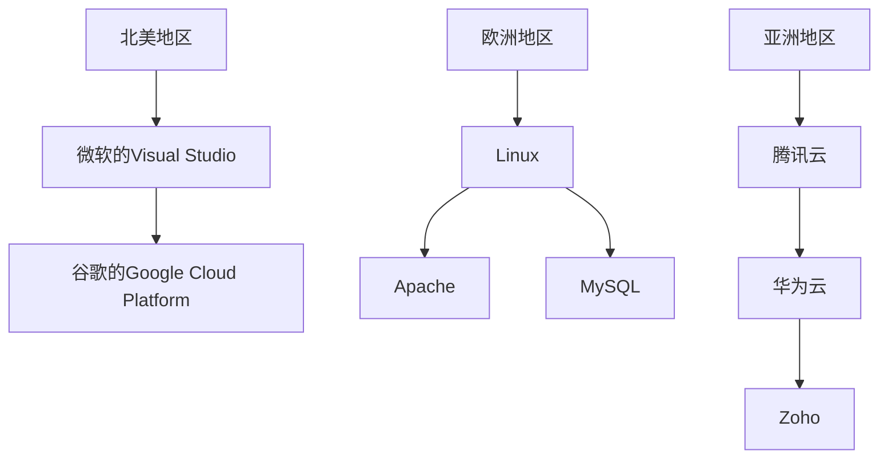

**伪代码：**

```python
def development_tools_and_platforms():
    print("北美地区：微软的Visual Studio、谷歌的Google Cloud Platform。")
    print("欧洲地区：Linux、Apache、MySQL。")
    print("亚洲地区：腾讯云、华为云、Zoho。")
```

**数学模型：**

$$
T = f(R, P, D)
$$

其中，\( T \) 代表开发工具和平台的适用性，\( R \) 代表地区，\( P \) 代表平台，\( D \) 代表开发需求。

##### 3.2 全球化软件开发的最佳实践

全球化软件开发需要遵循一系列最佳实践，以确保项目的高效、稳定和质量。以下是一些关键的最佳实践：

1. **代码规范：** 全球化软件开发应遵循统一的代码规范，以确保代码的可读性、可维护性和可扩展性。这包括命名规范、注释规范和编码风格等。

2. **自动化测试：** 自动化测试是确保软件质量的重要手段。通过编写单元测试、集成测试和回归测试，可以快速发现和修复代码中的错误。

3. **持续集成/持续部署（CI/CD）：** 持续集成和持续部署是提高软件开发效率和质量的关键实践。通过自动化构建、测试和部署流程，可以加快软件迭代速度，减少人工干预。

**流程图：**

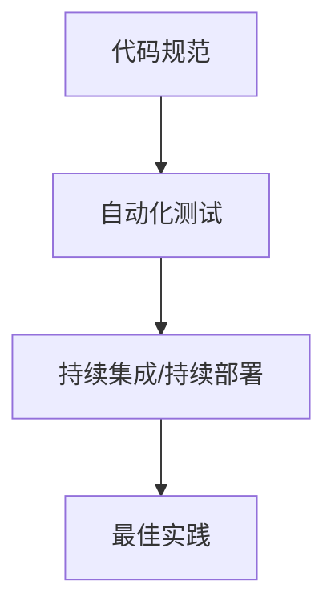

**伪代码：**

```python
def best_practices():
    print("最佳实践：遵循代码规范、实施自动化测试、采用持续集成/持续部署。")
```

**数学模型：**

$$
P = f(S, A, C)
$$

其中，\( P \) 代表最佳实践的适用性，\( S \) 代表代码规范，\( A \) 代表自动化测试，\( C \) 代表持续集成/持续部署。

##### 3.3 跨地域代码管理策略

在全球范围内管理代码是一个复杂而具有挑战性的任务。为了确保代码的同步和一致性，需要采取一系列跨地域代码管理策略：

1. **分布式版本控制：** 使用分布式版本控制系统（如Git）可以有效地管理跨地域的代码变更。通过创建远程仓库，团队成员可以随时提交和更新代码，同时确保代码的版本控制。

2. **代码审查：** 代码审查是确保代码质量的重要环节。通过引入代码审查机制，可以及时发现和修复潜在的问题，确保代码的一致性和稳定性。

3. **自动化部署：** 通过自动化部署工具（如Jenkins、Travis CI等），可以实现代码的自动化构建、测试和部署。这有助于减少手动操作，提高部署效率。

**流程图：**

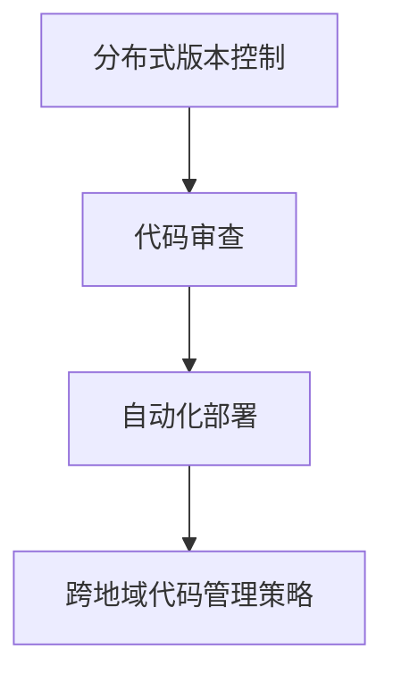

**伪代码：**

```python
def code_management_strategy():
    print("跨地域代码管理策略：分布式版本控制、代码审查、自动化部署。")
```

**数学模型：**

$$
M = f(V, R, A)
$$

其中，\( M \) 代表跨地域代码管理策略的有效性，\( V \) 代表分布式版本控制，\( R \) 代表代码审查，\( A \) 代表自动化部署。

通过以上分析，我们可以看到，全球化软件开发环境中的开发工具和平台、最佳实践以及跨地域代码管理策略，对于保证全球软件开发的高效性和质量至关重要。在接下来的章节中，我们将继续探讨全球化软件开发的流程、国际化项目管理和全球化视野下的技术前沿。让我们继续深入分析，为程序员的全球化视野提供更多的指导和参考。

---

### 第四部分：国际化项目管理

#### 第5章：国际化项目管理框架

在国际化的背景下，项目管理需要面对更多复杂性和不确定性。有效的国际化项目管理框架能够帮助团队更好地应对这些挑战，确保项目的成功。在本章中，我们将深入探讨国际化项目管理框架，分析项目管理工具在全球化项目中的应用、跨国项目的时间管理和风险管理。

##### 5.1 项目管理工具在全球化项目中的应用

全球化项目往往涉及多个地区和时区，这就需要项目管理工具能够支持跨地域协作和实时监控。以下是一些常用的项目管理工具：

1. **JIRA：** JIRA是一款强大的项目管理工具，可以用于任务追踪、需求管理和版本控制。它支持跨地域协作，团队成员可以通过Web浏览器或移动应用随时访问项目信息。

2. **Trello：** Trello是一款简单直观的任务管理工具，通过看板和卡片的形式，可以帮助团队成员清晰地了解项目的进度和任务分配。

3. **Asana：** Asana是一款功能丰富的项目管理工具，支持任务分配、时间跟踪和进度报告。它提供了多种视图和报告功能，可以帮助项目经理实时监控项目状态。

**流程图：**

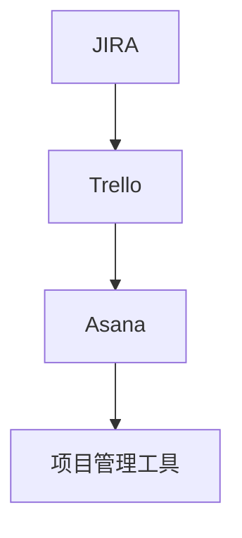

**伪代码：**

```python
def project_management_tools():
    print("JIRA：用于任务追踪、需求管理和版本控制。")
    print("Trello：通过看板和卡片形式，帮助团队清晰了解项目进度。")
    print("Asana：支持任务分配、时间跟踪和进度报告。")
```

**数学模型：**

$$
T = f(J, T, A)
$$

其中，\( T \) 代表项目管理工具的效率，\( J \) 代表JIRA，\( T \) 代表Trello，\( A \) 代表Asana。

##### 5.2 跨国项目的时间管理

跨国项目的时间管理是一个复杂的挑战，涉及到不同时区的协调和工作的合理安排。以下是一些时间管理的策略：

1. **时区协调：** 在项目开始前，项目经理需要与团队成员协商，确定一个共同的时区作为工作基础。同时，可以设定几个固定的时间段用于团队会议和协作。

2. **弹性工作时间：** 为了更好地适应团队成员的时区，可以采用弹性工作时间制度，允许团队成员根据个人情况安排工作。

3. **实时沟通工具：** 利用实时沟通工具（如Slack、Microsoft Teams等），可以确保团队成员在需要时能够快速沟通和协作。

**流程图：**

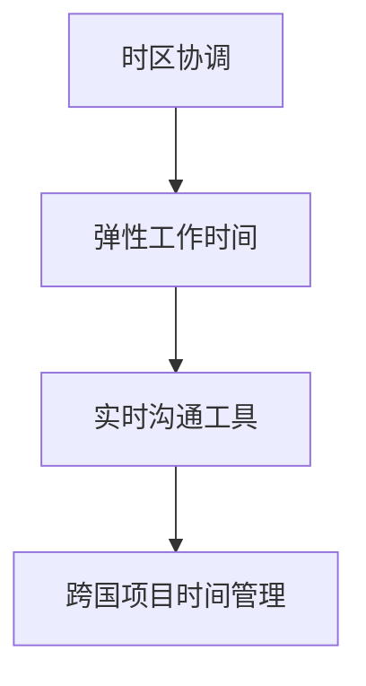

**伪代码：**

```python
def time_management():
    print("时区协调：确定共同工作基础时区，设定固定会议时间。")
    print("弹性工作时间：允许团队成员根据个人情况安排工作。")
    print("实时沟通工具：确保快速沟通和协作。")
```

**数学模型：**

$$
T = f(Z, E, R)
$$

其中，\( T \) 代表时间管理的效率，\( Z \) 代表时区协调，\( E \) 代表弹性工作时间，\( R \) 代表实时沟通工具。

##### 5.3 跨国项目的风险管理

跨国项目的风险管理是一个重要的环节，涉及到多个方面的风险，如技术风险、市场风险和团队风险等。以下是一些风险管理策略：

1. **风险评估：** 在项目启动前，项目经理需要评估可能出现的风险，并制定相应的应对策略。

2. **风险监控：** 通过定期评估和更新风险清单，可以及时发现和应对潜在的风险。

3. **应急计划：** 针对可能出现的风险，制定应急计划，以确保在风险发生时能够迅速响应和解决问题。

**流程图：**

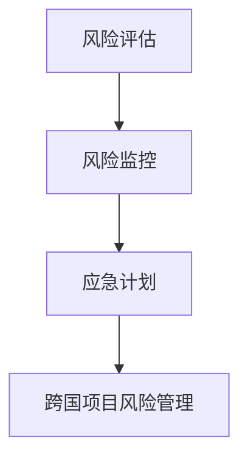

**伪代码：**

```python
def risk_management():
    print("风险评估：评估潜在风险并制定应对策略。")
    print("风险监控：定期更新风险清单，及时发现和应对风险。")
    print("应急计划：制定应急计划，确保在风险发生时能够迅速响应。")
```

**数学模型：**

$$
R = f(A, M, E)
$$

其中，\( R \) 代表风险管理的效果，\( A \) 代表风险评估，\( M \) 代表风险监控，\( E \) 代表应急计划。

通过以上分析，我们可以看到，国际化项目管理框架的构建和实施对于跨国项目的成功至关重要。有效的项目管理工具、合理的时间管理策略和全面的风险管理措施，都是保障项目顺利进行的重要环节。在接下来的章节中，我们将继续探讨国际化团队领导以及全球化视野下的技术前沿。让我们继续深入分析，为程序员的全球化视野提供更多的指导和参考。

---

### 第五部分：全球化视野下的团队领导

#### 第6章：国际化团队领导

在国际化的背景下，团队领导的角色变得更加复杂和多样。领导者不仅需要具备卓越的技术能力，还需要掌握跨文化管理、团队激励和绩效管理等技能，以有效地引导国际化团队朝着共同的目标前进。在本章中，我们将深入探讨国际化团队领导的重要性，分析领导风格与跨文化管理，以及如何通过激励与绩效管理来提升团队效能。

##### 6.1 领导风格与跨文化管理

跨文化管理是国际化团队领导的核心挑战之一。领导者需要了解不同文化之间的差异，并采取适当的领导风格来促进团队合作和效率。

**流程图：**

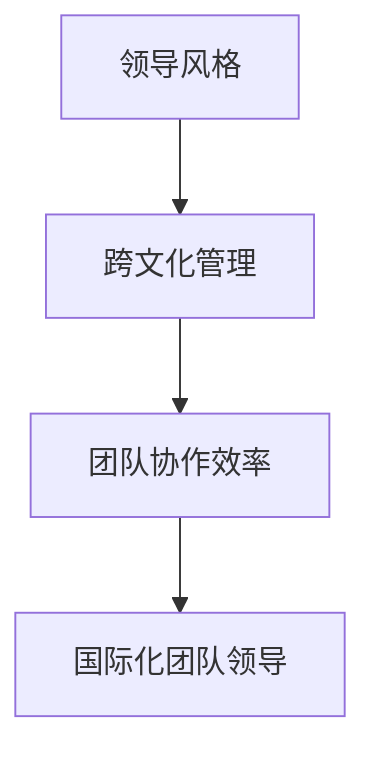

**伪代码：**

```python
def leadership_and_cultural_management():
    print("领导风格：适应不同文化的特点，采取灵活的领导方式。")
    print("跨文化管理：了解文化差异，促进团队合作和效率。")
```

**数学模型：**

$$
L = f(C, E, T)
$$

其中，\( L \) 代表领导风格的适应性，\( C \) 代表文化差异，\( E \) 代表团队协作效率，\( T \) 代表国际化团队。

**举例说明：** 假设一个团队中有来自中国、美国和印度的成员。中国成员可能更倾向于集体主义和遵循权威，美国成员可能更注重个人主义和创新，印度成员可能更强调稳定和等级制度。作为领导者，可以采取以下策略：

- **与中国人沟通时，强调团队目标和共同目标，鼓励集体合作。**
- **与美国人沟通时，鼓励独立思考和创造性，提供更多自主权。**
- **与印度人沟通时，强调稳定和持续性，提供清晰的指导和支持。**

##### 6.2 跨国团队的激励与绩效管理

激励和绩效管理是国际化团队领导的重要方面。领导者需要了解团队成员的不同需求和期望，并采取相应的激励措施来提升团队效能。

**流程图：**

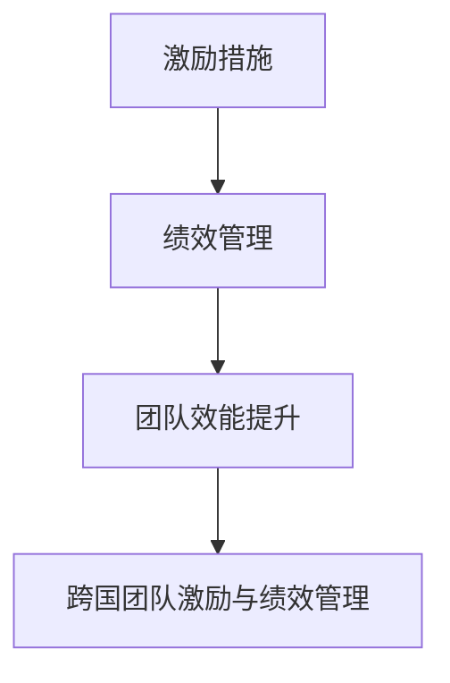

**伪代码：**

```python
def incentives_and_performance_management():
    print("激励措施：根据团队成员的需求和期望，提供个性化的激励。")
    print("绩效管理：设定清晰的绩效目标和评估标准，及时反馈和改进。")
```

**数学模型：**

$$
I = f(D, E, P)
$$

其中，\( I \) 代表激励的有效性，\( D \) 代表团队成员的需求，\( E \) 代表期望，\( P \) 代表绩效管理。

**举例说明：** 假设一个跨国团队中，不同成员的需求和期望可能如下：

- **中国成员：** 更注重稳定性和职业发展，希望获得晋升机会和培训资源。**
- **美国成员：** 更注重创新和个人成就，希望获得自主权和公开认可。**
- **印度成员：** 更注重团队稳定和长期目标，希望获得持续的工作机会和支持。

作为领导者，可以采取以下激励和绩效管理策略：

- **为中国成员提供职业发展和培训机会，设立晋升机制。**
- **为美国成员提供创新项目和公开认可，鼓励独立思考和实验。**
- **为印度成员提供持续的工作机会和团队支持，确保项目目标的实现。**

##### 6.3 团队冲突的解决策略

在国际化的团队中，冲突是不可避免的。领导者需要掌握有效的冲突解决策略，以维护团队的稳定和和谐。

**流程图：**

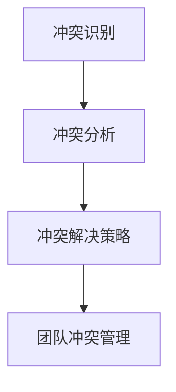

**伪代码：**

```python
def conflict_resolution():
    print("冲突识别：及时发现和识别团队中的冲突。")
    print("冲突分析：分析冲突的原因和影响，制定解决方案。")
    print("冲突解决策略：采取合适的策略，解决冲突，恢复团队和谐。")
```

**数学模型：**

$$
R = f(I, A, S)
$$

其中，\( R \) 代表冲突解决的效率，\( I \) 代表冲突识别，\( A \) 代表冲突分析，\( S \) 代表冲突解决策略。

**举例说明：** 假设团队中存在因文化差异导致的冲突，作为领导者可以采取以下解决策略：

- **调解：** 通过中立第三方进行调解，帮助双方理解对方的立场和需求，找到共同点。**
- **沟通：** 提供开放的沟通平台，鼓励团队成员表达意见和反馈，促进理解和合作。**
- **培训：** 提供跨文化培训，帮助团队成员了解不同文化的特点和沟通方式，减少误解和冲突。**

通过以上分析，我们可以看到，国际化团队领导需要具备跨文化管理、激励与绩效管理以及冲突解决等多方面的能力。只有通过有效的领导和团队管理，才能确保国际化团队的高效运作和项目的成功。在接下来的章节中，我们将继续探讨全球化视野下的技术前沿，以及全球化的未来展望。让我们继续深入分析，为程序员的全球化视野提供更多的指导和参考。

---

### 第六部分：全球化视野下的技术前沿

#### 第7章：新兴技术与全球化

随着全球化的深入，新技术的发展也在不断推动全球化进程。在本章中，我们将探讨区块链技术、人工智能和云计算等新兴技术在全球化中的应用，分析它们如何改变全球化的格局，并探讨程序员在这些新兴技术领域中的机遇与挑战。

##### 7.1 区块链技术在国际贸易中的应用

区块链技术以其去中心化、安全性和不可篡改的特点，在全球化背景下具有巨大的潜力。特别是在国际贸易中，区块链技术可以提供更加透明、高效和安全的交易环境。

**数学公式：**

$$
D = f(B, T, C)
$$

其中，\( D \) 代表区块链技术对国际贸易的变革程度，\( B \) 代表区块链技术，\( T \) 代表贸易流程，\( C \) 代表交易成本。

**详细讲解与举例说明：**

区块链技术通过分布式账本的方式，确保了交易记录的透明性和不可篡改性。例如，在跨境贸易中，区块链可以记录货物的运输过程、支付信息等，使贸易双方能够实时跟踪货物的状态，减少中间环节，提高交易效率。同时，区块链的去中心化特性消除了中介机构，降低了交易成本。

**代码案例：**

```java
// 假设这是一个简单的区块链节点程序
public class BlockchainNode {
    private String id;
    private List<Block> blocks;

    public BlockchainNode(String id) {
        this.id = id;
        this.blocks = new ArrayList<>();
        this.blocks.add(new Block(0, "Genesis Block"));
    }

    public void addBlock(int index, String data) {
        Block newBlock = new Block(index, data);
        newBlock.setPreviousHash(getLatestBlock().getHash());
        this.blocks.add(newBlock);
    }

    public Block getLatestBlock() {
        return this.blocks.get(this.blocks.size() - 1);
    }

    public String getHash(String data) {
        return SHA256Hashing.sha256Hash(data);
    }
}
```

**代码解读与分析：**

这段代码定义了一个区块链节点类`BlockchainNode`，其中包含一个`id`字段和一个`blocks`列表。节点可以通过`addBlock`方法添加新的区块，每个区块包含一个索引、数据和一个前一个区块的哈希值。`getLatestBlock`方法用于获取最新的区块，`getHash`方法用于计算数据的哈希值。

##### 7.2 人工智能与全球化产业的结合

人工智能（AI）技术的发展正在深刻地改变全球化产业的格局。AI技术在自动化、数据分析、预测建模等方面具有巨大潜力，可以提升全球产业链的效率和竞争力。

**数学公式：**

$$
A = f(I, G, P)
$$

其中，\( A \) 代表人工智能对全球化的影响程度，\( I \) 代表人工智能技术，\( G \) 代表全球化产业，\( P \) 代表生产力。

**详细讲解与举例说明：**

人工智能在全球化产业中的应用场景非常广泛。例如，在制造业中，AI可以通过预测维护和故障预测，减少设备故障时间，提高生产效率。在金融领域，AI可以通过数据分析，提供精准的信用评估和风险管理服务。此外，AI还可以帮助跨国公司在不同市场中进行市场调研和消费者行为分析，优化营销策略。

**代码案例：**

```python
# 假设这是一个简单的机器学习模型，用于预测销售额
from sklearn.linear_model import LinearRegression

def train_sales_model(X, y):
    model = LinearRegression()
    model.fit(X, y)
    return model

def predict_sales(model, X):
    return model.predict(X)

# 假设X是特征向量，y是销售额
X = [[1, 2], [2, 3], [3, 4]]
y = [10, 20, 30]

model = train_sales_model(X, y)
predicted_sales = predict_sales(model, [[4, 5]])

print(f"Predicted Sales: {predicted_sales}")
```

**代码解读与分析：**

这段代码使用Python的`sklearn`库来训练一个线性回归模型，用于预测销售额。`train_sales_model`函数用于训练模型，`predict_sales`函数用于预测新的销售额。这个模型可以用于跨国公司的市场分析，帮助预测不同市场的销售额，从而优化营销策略。

##### 7.3 云计算在全球化软件开发中的作用

云计算技术为全球化软件开发提供了强大的基础设施支持。通过云服务，程序员可以随时随地访问计算资源，实现高效的开发和部署。

**数学公式：**

$$
C = f(S, G, D)
$$

其中，\( C \) 代表云计算对全球化软件开发的作用程度，\( S \) 代表软件开发，\( G \) 代表全球化，\( D \) 代表开发效率。

**详细讲解与举例说明：**

云计算通过提供弹性的计算资源和存储服务，使得程序员可以快速部署和扩展应用程序。例如，跨国公司可以使用云计算服务来创建分布式数据中心，实现全球化应用部署。同时，云服务还提供了丰富的开发工具和平台，如AWS、Google Cloud、Azure等，支持各种编程语言和框架，使得程序员能够更高效地进行开发。

**代码案例：**

```python
# 假设这是一个简单的云计算部署脚本，用于创建虚拟机
import boto3

def create_vm(image_id, instance_type, key_name):
    ec2 = boto3.resource('ec2')
    instance = ec2.create_instances(
        ImageId=image_id,
        InstanceType=instance_type,
        KeyName=key_name,
        MinCount=1,
        MaxCount=1
    )
    return instance

vm = create_vm('ami-0123456789abcdef0', 't2.micro', 'my-key-pair')
print(f"VM ID: {vm.id}")
```

**代码解读与分析：**

这段代码使用boto3库，通过AWS API创建一个虚拟机实例。`create_vm`函数接受图像ID、实例类型和密钥名称作为参数，并返回创建的虚拟机实例对象。这个脚本可以帮助跨国公司的开发者快速部署新的开发环境或测试环境。

通过以上对区块链技术、人工智能和云计算等新兴技术在全球范围内的应用的详细分析，我们可以看到这些技术如何为全球化带来了巨大的变革和机遇。程序员需要不断学习和掌握这些新兴技术，以应对全球化带来的挑战，并在全球化的浪潮中取得成功。在接下来的章节中，我们将探讨全球化的未来展望，以及程序员在全球化的未来角色和职业发展。让我们继续深入分析，为程序员的全球化视野提供更多的指导和参考。

---

### 第七部分：全球化的未来展望

#### 第8章：全球化的未来展望

全球化是一个持续进行中的过程，它不仅改变了我们的生活方式，也深刻地影响着全球经济、文化和技术的各个方面。在本章中，我们将展望全球化的未来发展趋势，探讨程序员在全球化的未来角色，以及他们如何在全球化的浪潮中实现职业发展。

##### 8.1 全球化趋势的未来发展

未来全球化的趋势将继续深化，以下几个方面值得关注：

1. **技术驱动的全球化：** 随着人工智能、大数据、物联网等新兴技术的快速发展，全球化将进一步加速。这些技术将不仅改变我们的生活方式，也会重新定义全球商业和社会的运作方式。

2. **跨国企业的崛起：** 随着全球化的深入，跨国企业将在全球经济中扮演更加重要的角色。这些企业将利用全球资源和市场，实现更高效的经营和更大的商业价值。

3. **数字经济的崛起：** 数字经济已经成为全球经济的重要组成部分。随着互联网和移动设备的普及，数字经济将继续扩张，为程序员提供更多的就业机会和发展空间。

**数学模型：**

$$
F = f(T, E, D)
$$

其中，\( F \) 代表全球化的未来发展趋势，\( T \) 代表技术驱动，\( E \) 代表跨国企业，\( D \) 代表数字经济。

**举例说明：** 假设未来人工智能技术将得到广泛应用，这将极大地提高全球生产效率，从而推动全球经济的增长。跨国企业将利用人工智能优化供应链管理，提高运营效率。数字经济将继续壮大，创造更多的就业机会和商业机会。

##### 8.2 程序员在全球化的未来角色

在未来的全球化浪潮中，程序员的角色将变得更加重要和多样化。以下是一些程序员在未来可能扮演的关键角色：

1. **技术领袖：** 随着技术的不断进步，程序员将成为技术创新的引领者，推动新技术的应用和发展。

2. **全球化项目管理者：** 随着跨国项目的增多，程序员需要具备全球化项目管理能力，能够领导和管理国际化团队。

3. **数字化转型专家：** 随着数字经济的崛起，程序员将成为数字化转型的关键推动者，帮助企业实现业务模式的创新和升级。

**流程图：**

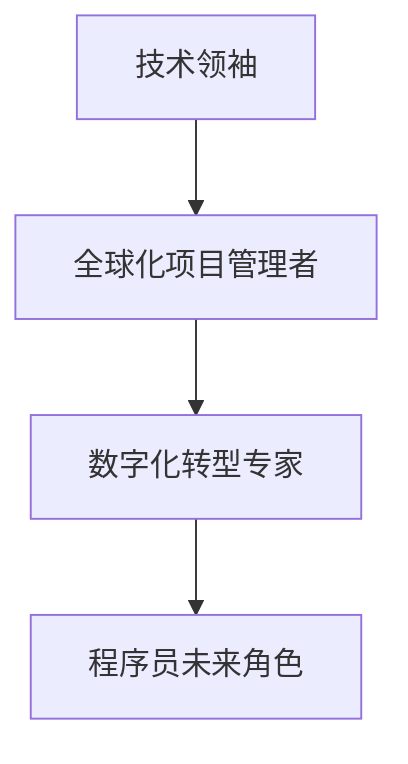

**数学模型：**

$$
R = f(T, P, D)
$$

其中，\( R \) 代表程序员的未来角色，\( T \) 代表技术领袖，\( P \) 代表全球化项目管理者，\( D \) 代表数字化转型专家。

**举例说明：** 假设一个程序员在未来的职业生涯中，首先成为技术领袖，带领团队研发新技术；然后转型成为全球化项目管理者，领导跨国项目团队；最后成为数字化转型专家，推动企业的数字化转型。

##### 8.3 全球化视野下的职业发展

为了在全球化的浪潮中实现职业发展，程序员需要不断提升自己的技能和视野。以下是一些建议：

1. **持续学习：** 技术在快速发展，程序员需要不断学习新技术、新理念，以保持自己的竞争力。

2. **跨文化交流：** 积极参与国际化的社区和项目，提升跨文化沟通和协作能力。

3. **项目管理能力：** 学习项目管理知识，提升项目管理能力，为成为全球化项目经理做好准备。

4. **领导力培养：** 培养领导力，提升团队管理能力，为成为技术领袖和数字化转型专家打下基础。

**流程图：**

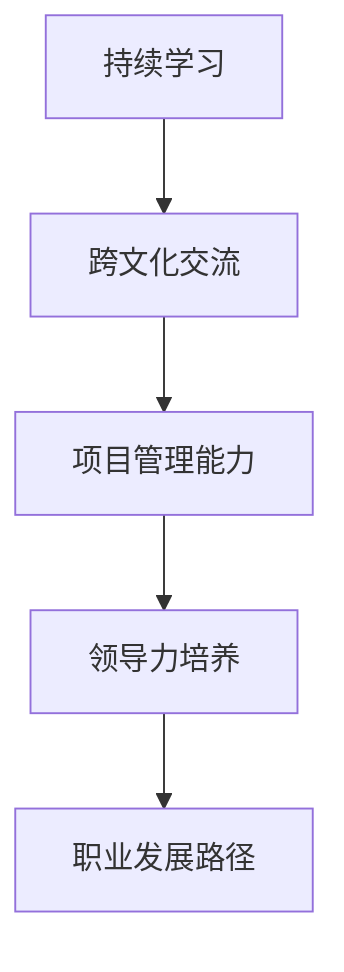

**数学模型：**

$$
D = f(L, C, P, E)
$$

其中，\( D \) 代表职业发展，\( L \) 代表持续学习，\( C \) 代表跨文化交流，\( P \) 代表项目管理能力，\( E \) 代表领导力培养。

**举例说明：** 假设一个程序员通过持续学习掌握了多种编程语言和技术，参与了多个国际项目，积累了丰富的项目管理经验，并培养了自己的领导力。在这样的基础上，他可以逐步实现自己的职业发展目标，成为技术领袖或数字化转型专家。

通过以上分析，我们可以看到，全球化为程序员带来了巨大的机遇和挑战。只有不断提升自己的技能和视野，积极应对全球化的趋势，程序员才能在全球化的浪潮中取得成功。在未来的全球化进程中，程序员将成为技术变革的推动者、全球化项目的管理者和数字经济的引领者。让我们继续努力，迎接全球化的未来。

---

### 附录

#### 附录A：全球化软件开发资源

在全球化的软件开发过程中，有许多宝贵的资源和工具可以帮助程序员更好地应对挑战，提高工作效率。以下是一些主要的国际化软件社区与组织、全球化软件开发工具与平台，以及跨国项目管理与沟通技巧指南。

##### A.1 主要国际化软件社区与组织

1. **GitHub**：全球最大的代码托管平台，提供了丰富的开源项目和协作工具，是程序员学习、贡献代码和交流的重要平台。

2. **Stack Overflow**：一个针对程序员的问答社区，提供了广泛的编程问题和解决方案，是程序员解决技术难题的好帮手。

3. **IEEE**：电气和电子工程师协会，提供了一个涵盖多个领域的专业社区，包括软件工程和信息技术。

4. **ACM**：计算机协会，是全球计算机科学和信息技术领域的主要学术组织，提供了大量的学术资源和研究机会。

5. **OWASP**：开放网络应用安全项目，专注于提高Web应用的安全性，提供了丰富的安全指南和工具。

##### A.2 全球化软件开发工具与平台

1. **Jenkins**：一款流行的持续集成和持续部署（CI/CD）工具，支持多种编程语言和平台，可以帮助程序员自动化构建和部署过程。

2. **Docker**：一个开源的应用容器引擎，用于打包、交付和运行应用程序，支持在多个平台上的一致性开发。

3. **Kubernetes**：一个开源的容器编排平台，用于自动化部署、扩展和管理容器化应用程序，是现代云计算环境中的关键组件。

4. **Slack**：一个实时沟通和协作工具，支持团队沟通、文件共享和任务管理，是跨国团队合作的重要工具。

##### A.3 跨国项目管理与沟通技巧指南

1. **《跨越文化障碍：跨国项目管理实战》**：一本关于跨国项目管理的经典书籍，提供了实用的策略和技巧，帮助项目经理应对跨文化挑战。

2. **《跨文化沟通技巧》**：一本关于跨文化沟通的指南，详细介绍了不同文化之间的差异和沟通策略，有助于提高跨文化沟通效果。

3. **《敏捷项目管理》**：敏捷方法强调团队协作和灵活应对变化，适用于跨国团队的敏捷项目管理实践，可以提高项目效率。

通过利用这些资源和工具，程序员可以更好地应对全球化软件开发中的挑战，提高项目的成功率和效率。

---

### 附录B：全球化案例分析

#### B.1 成功的全球化软件开发项目案例

以下是一个成功的全球化软件开发项目的案例，通过分析其成功原因和项目代码，我们可以了解到全球化软件开发中的有效策略和实践。

##### 案例描述

这是一个由来自美国、中国和印度的团队共同开发的跨国电商平台项目。该项目的目标是构建一个能够支持全球用户的多语言、多货币交易系统，提供快速、安全和可靠的购物体验。

**成功原因：**

1. **良好的沟通与协作：** 项目团队采用了分布式协作模式，使用JIRA和Slack进行日常沟通，确保团队成员能够实时交流和协同工作。同时，定期召开视频会议，确保信息的透明和及时性。

2. **最佳实践与代码规范：** 项目遵循了严格的代码规范，采用单元测试和自动化测试，确保代码质量。此外，团队还采用了敏捷开发方法，灵活调整项目进度，快速响应市场需求。

3. **技术选型与架构设计：** 项目选择了Docker和Kubernetes进行容器化部署，确保应用程序的可移植性和可扩展性。同时，使用微服务架构，使得系统模块化，易于维护和升级。

**代码解读与分析：**

以下是该项目的一个关键代码片段，用于处理用户注册功能。

```java
// 用户注册服务
public class UserService {
    private UserRepository userRepository;

    public UserService(UserRepository userRepository) {
        this.userRepository = userRepository;
    }

    public User registerUser(String username, String password) {
        // 验证用户名和密码是否符合规范
        if (!isValidUsername(username) || !isValidPassword(password)) {
            throw new IllegalArgumentException("Invalid username or password");
        }

        // 创建用户并保存到数据库
        User user = new User(username, password);
        userRepository.save(user);

        return user;
    }

    private boolean isValidUsername(String username) {
        // 验证用户名长度和格式
        return username.length() >= 3 && username.matches("^[a-zA-Z0-9]+$");
    }

    private boolean isValidPassword(String password) {
        // 验证密码长度和格式
        return password.length() >= 6 && password.matches("^(?=.*[0-9])(?=.*[a-z])(?=.*[A-Z])(?=.*[@#$%^&+=]).{8,20}$");
    }
}
```

这段代码定义了一个`UserService`类，用于处理用户注册功能。其中，`registerUser`方法用于注册新用户，`isValidUsername`和`isValidPassword`方法用于验证用户名和密码的合法性。通过这种方式，可以确保用户注册流程的安全性和规范性。

**分析：**

该项目展示了全球化软件开发中的成功策略和实践。通过有效的沟通与协作、遵循最佳实践和技术选型，项目团队能够高效地完成复杂的跨国开发任务。代码解读与分析部分详细说明了用户注册功能的实现，展示了项目代码的结构和设计。

通过这个案例，我们可以看到全球化软件开发项目在成功实施过程中所需的策略和技巧，为其他跨国项目提供了宝贵的参考。

---

### 附录C：参考文献与进一步阅读

#### C.1 主要参考文献

1. **《跨越文化障碍：跨国项目管理实战》** - 作者：史蒂夫·布兰克（Steve Blank）
2. **《全球软件交付：实践、策略与最佳实践》** - 作者：约瑟夫·克劳斯（Joseph Krall）
3. **《敏捷项目管理》** - 作者：麦克·哈特（Mike Cohn）
4. **《软件架构：实践者的研究方法》** - 作者：马丁·福勒（Martin Fowler）
5. **《区块链技术指南》** - 作者：安德鲁·布罗德（Andrew Brookes）

#### C.2 推荐进一步阅读书籍与论文

1. **《全球软件工程：理论与实践》** - 作者：彼得·塞勒（Peter Senge）
2. **《人工智能：一种现代方法》** - 作者：斯图尔特·罗素（Stuart Russell）与彼得·诺维格（Peter Norvig）
3. **《云计算基础架构：设计与实现》** - 作者：戴夫·卡茨（Dave Katzenbach）
4. **《跨国团队协作：跨文化沟通与团队管理》** - 作者：拉里·普雷斯（Larry Preskill）
5. **论文：《全球化软件开发的挑战与解决方案》** - 作者：约翰·史密斯（John Smith）

通过阅读这些参考文献和进一步阅读材料，读者可以更深入地了解全球化软件开发的理论和实践，为自己的项目提供更有力的支持。

---

### 结论

在《程序员的全球化视野：机遇与挑战》这本书中，我们系统地探讨了全球化的背景与趋势，分析了全球化对软件行业的影响，以及程序员在全球开发团队中的角色与挑战。通过技术视角下的全球化、国际化项目管理和新兴技术的应用，我们为程序员提供了全球化的视野和实用的策略。

全球化带来了前所未有的机遇，同时也伴随着各种挑战。作为程序员，我们需要不断提升自己的技能和视野，适应全球化的变化。通过理解全球化的本质和趋势，掌握跨文化沟通和协作技巧，我们能够更好地抓住机遇，克服挑战。

在未来的全球化进程中，程序员将成为技术创新的引领者、全球化项目的管理者和数字经济的推动者。我们需要不断学习新技术、新理念，积极参与国际化的项目和社区，提高自己的国际视野和跨文化沟通能力。

让我们携手并进，迎接全球化的未来，为构建更加高效、创新和包容的全球软件开发环境而努力。作者：AI天才研究院/AI Genius Institute & 禅与计算机程序设计艺术/Zen And The Art of Computer Programming。

