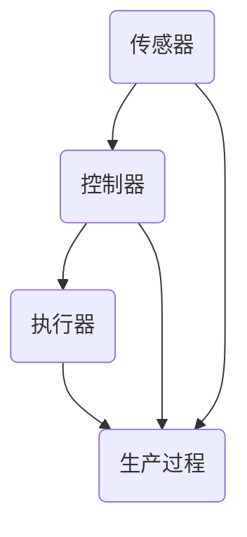

                 

# 《纺织业自动化的初期挑战》

## 关键词
纺织业、自动化技术、机器视觉、算法、数学模型、项目实战

## 摘要
本文将探讨纺织业自动化的初期挑战。通过回顾纺织业的历史和现状，介绍自动化技术在纺织业中的应用，深入分析自动化纺织设备与工艺，以及核心算法原理和数学模型。此外，本文还将通过项目实战案例，详细解读自动化纺织系统的开发环境、源代码实现和代码解读，最后对自动化纺织系统的挑战与解决方案进行探讨，并对未来发展趋势和启示进行展望。

### 《纺织业自动化的初期挑战》目录大纲

#### 第一部分：纺织业自动化概述

##### 第1章：纺织业与自动化技术  
- 1.1 纺织业的历史与现状  
- 1.2 自动化技术在纺织业的应用  
- 1.3 纺织业自动化的优势与挑战

##### 第2章：自动化纺织设备与工艺  
- 2.1 自动化纺织设备简介  
- 2.2 纺织工艺自动化流程  
- 2.3 自动化纺织设备的功能与性能

#### 第二部分：初期自动化挑战

##### 第3章：自动化纺织技术的核心概念与联系  
- 3.1 自动化控制原理  
- 3.2 纺织设备传感与反馈  
- 3.3 Mermaid流程图：自动化纺织系统的核心组件与关系

##### 第4章：核心算法原理讲解  
- 4.1 自动化控制算法  
- 4.2 机器视觉算法在纺织中的应用  
- 4.3 伪代码讲解：自动化纺织系统中常用的算法

##### 第5章：数学模型和数学公式  
- 5.1 纺织自动化中的数学模型  
- 5.2 数学公式讲解与示例  
- 5.3 数学公式在实际应用中的意义与作用

##### 第6章：项目实战  
- 6.1 纺织自动化项目的开发环境搭建  
- 6.2 纺织自动化系统的实际案例分析  
- 6.3 源代码实现与代码解读

##### 第7章：自动化纺织系统的挑战与解决方案  
- 7.1 初期自动化挑战分析  
- 7.2 挑战解决方案探讨  
- 7.3 未来发展趋势与展望

#### 第三部分：总结与展望

##### 第8章：纺织业自动化的现状与未来  
- 8.1 当前纺织自动化技术的应用现状  
- 8.2 自动化纺织技术的发展趋势  
- 8.3 对纺织业未来发展的启示与建议

##### 附录：相关资源与工具  
- 附录 A：自动化纺织设备与工艺资料  
- 附录 B：自动化纺织技术相关文献  
- 附录 C：自动化纺织技术工具与平台简介

### 第一部分：纺织业自动化概述

#### 第1章：纺织业与自动化技术

##### 1.1 纺织业的历史与现状

纺织业是人类历史上最古老的产业之一，其起源可以追溯到公元前4000年的古埃及和古印度。随着人类文明的进步，纺织技术不断演变和发展，从手工编织到机械化生产，再到现代化自动化生产，纺织业经历了巨大的变革。

当前，纺织业已经发展成为全球范围内的重要产业之一，涵盖了从纤维原料的生产、纺织加工到服装制造等多个环节。在全球范围内，中国、印度、美国、意大利等国家都是纺织业的重要生产国和出口国。

然而，随着全球经济的不断发展和人们生活水平的提高，纺织业面临着越来越大的挑战。首先，消费者对于纺织品的质量、舒适性和多样性要求越来越高，这要求纺织业必须提高生产效率和质量控制水平。其次，随着劳动力成本的不断上升，传统的手工和半自动化生产方式已经无法满足市场需求，自动化生产成为纺织业的必然选择。

##### 1.2 自动化技术在纺织业的应用

自动化技术在纺织业的应用可以追溯到20世纪初期。当时，一些简单的自动化设备如织布机、梳棉机等开始被引入纺织生产中，以替代手工操作，提高生产效率。

随着电子技术和计算机技术的发展，自动化技术逐渐在纺织业中得到了广泛应用。目前，自动化技术已经深入到纺织生产的各个环节，包括纤维制备、纺织加工、染色、印花、服装制造等。

- **纤维制备**：自动化设备如自动络筒机、自动并条机等，能够实现纤维的自动化制备和整理。
- **纺织加工**：自动化纺织设备如自动织机、自动络筒机等，能够实现纺织加工的自动化生产，提高生产效率和产品质量。
- **染色**：自动化染色设备如自动染色机、自动印花机等，能够实现染色的自动化生产，提高染色效率和染色质量。
- **印花**：自动化印花设备如数码印花机、自动印花机等，能够实现印花的自动化生产，提高印花效率和印花效果。
- **服装制造**：自动化服装设备如自动裁剪机、自动缝合机等，能够实现服装制造的自动化生产，提高生产效率和产品质量。

##### 1.3 纺织业自动化的优势与挑战

纺织业自动化带来了许多显著的优势，包括提高生产效率、降低生产成本、提高产品质量等。然而，自动化技术的引入也面临着一系列挑战。

- **提高生产效率**：自动化设备能够实现连续生产，减少生产周期，提高生产效率。例如，自动织机相比传统织机，生产效率提高了数倍。
- **降低生产成本**：自动化设备能够减少人工操作，降低劳动力成本。同时，自动化设备能够实现精细化管理，减少生产浪费，降低生产成本。
- **提高产品质量**：自动化设备能够实现精确控制，提高产品质量的稳定性和一致性。例如，自动染色机能够实现精确的染色控制，保证染色效果的一致性。
- **减少环境污染**：自动化设备能够实现清洁生产，减少污染物排放，降低对环境的污染。

然而，纺织业自动化也面临着一系列挑战，包括技术难题、成本问题、人才问题等。

- **技术难题**：自动化技术的研发和应用需要解决一系列技术难题，如传感器技术、控制算法、机器视觉技术等。这些技术难题的解决需要大量的研发投入和技术积累。
- **成本问题**：自动化设备的采购、安装和维护成本较高，对于一些中小型纺织企业来说，可能面临较大的经济压力。
- **人才问题**：自动化技术的应用需要大量具备相关专业知识和技能的人才，然而当前纺织业人才储备不足，难以满足自动化技术发展的需求。

综上所述，纺织业自动化带来了显著的优势，但同时也面临着一系列挑战。为了实现纺织业的可持续发展，需要积极应对这些挑战，推动自动化技术在纺织业的应用和发展。

#### 第2章：自动化纺织设备与工艺

##### 2.1 自动化纺织设备简介

自动化纺织设备是纺织业实现自动化生产的核心工具，它们通过电子、机械、计算机技术等实现自动化的生产流程。以下是几种常见的自动化纺织设备：

- **自动络筒机**：用于将棉花、化纤等原料络成筒状，以便于后续的纺织加工。自动络筒机具有高速、高效、精准的特点，能够实现自动络筒、自动换筒、自动计量等功能。
- **自动并条机**：用于将多根纱线并合在一起，形成均匀的纱线。自动并条机通过电子控制系统实现精确的并条过程，能够提高纱线的均匀性和生产效率。
- **自动织机**：用于将纱线织成织物。自动织机具有高速、高精度的特点，能够实现自动换梭、自动断线、自动停机等功能，提高织造效率和质量。
- **自动染色机**：用于对织物进行染色处理。自动染色机通过电子控制系统实现自动加料、自动染色、自动清洗等功能，能够提高染色效率和染色质量。
- **自动印花机**：用于在织物上印刷图案。自动印花机通过计算机控制实现自动定位、自动印刷等功能，能够提高印花效率和印花效果。
- **自动裁剪机**：用于将织物裁剪成所需形状。自动裁剪机通过计算机控制实现自动定位、自动裁剪等功能，能够提高裁剪效率和裁剪质量。

这些自动化纺织设备通过集成电子控制、传感器技术和计算机技术，实现了纺织生产的自动化、高效化和精细化。它们能够显著提高生产效率、降低生产成本、提高产品质量，是现代纺织业不可或缺的重要工具。

##### 2.2 纺织工艺自动化流程

纺织工艺的自动化流程主要包括纤维制备、纱线制备、织造、染色、印花、裁剪和成品加工等环节。以下是这些环节的自动化流程：

- **纤维制备**：自动络筒机将棉花、化纤等原料络成筒状，通过自动并条机将多根纱线并合在一起，形成均匀的纱线。
- **纱线制备**：自动络筒机和自动并条机将纱线进行络筒和并条，形成适合织造的纱线。
- **织造**：自动织机将纱线织成织物。自动织机通过电子控制系统实现自动换梭、自动断线、自动停机等功能，能够提高织造效率和质量。
- **染色**：自动染色机对织物进行染色处理。自动染色机通过电子控制系统实现自动加料、自动染色、自动清洗等功能，能够提高染色效率和染色质量。
- **印花**：自动印花机在织物上印刷图案。自动印花机通过计算机控制实现自动定位、自动印刷等功能，能够提高印花效率和印花效果。
- **裁剪**：自动裁剪机将织物裁剪成所需形状。自动裁剪机通过计算机控制实现自动定位、自动裁剪等功能，能够提高裁剪效率和裁剪质量。
- **成品加工**：经过染色、印花和裁剪后，织物进入成品加工环节，包括缝制、熨烫、包装等。自动化缝纫机、熨烫机和包装机等设备能够实现自动化加工，提高成品效率和品质。

这些自动化流程通过集成自动化设备和技术，实现了纺织生产的自动化、高效化和精细化。它们能够显著提高生产效率、降低生产成本、提高产品质量，是现代纺织业发展的关键。

##### 2.3 自动化纺织设备的功能与性能

自动化纺织设备的功能和性能直接影响纺织生产的高效性和产品质量。以下是自动化纺织设备的主要功能和性能指标：

- **高速性**：自动化纺织设备具有高转速、高速度的特点，能够实现高速生产，提高生产效率。例如，自动织机可以达到300米/分钟的织速，自动染色机可以达到每小时1000米的染色速度。
- **精确性**：自动化纺织设备通过电子控制系统实现精确控制，能够保证产品的质量和一致性。例如，自动织机能够实现精确的换梭、断线控制，自动染色机能够实现精确的染色浓度控制。
- **灵活性**：自动化纺织设备具有高度的灵活性，能够适应不同的生产需求。例如，自动织机可以适应不同种类的纱线和织物，自动染色机可以适应不同的染色工艺。
- **稳定性**：自动化纺织设备具有高稳定性的特点，能够保证长时间连续生产的稳定性。例如，自动络筒机能够实现长时间的自动络筒，自动裁剪机能够实现长时间的高精度裁剪。
- **智能性**：自动化纺织设备具备智能化的特点，能够实现自诊断、自适应等功能。例如，自动织机可以自动检测断线、自动调整织速，自动染色机可以自动检测染色浓度并进行调整。

通过不断提高自动化纺织设备的功能和性能，纺织业能够实现更高的生产效率、更高质量的产品，满足日益增长的市场需求。

### 第二部分：初期自动化挑战

#### 第3章：自动化纺织技术的核心概念与联系

##### 3.1 自动化控制原理

自动化控制是纺织业自动化的基础，它涉及对生产过程中各个环节的实时监测和控制。自动化控制的基本原理是通过传感器收集数据，然后利用控制器对数据进行分析和处理，最后通过执行器对生产过程进行调节。

- **传感器**：传感器是自动化控制系统的数据采集设备，用于检测温度、湿度、压力、速度等参数。在纺织业中，常见的传感器包括光电传感器、温度传感器、速度传感器等。
- **控制器**：控制器是自动化控制系统的核心组件，用于接收传感器数据，并根据预设的控制算法对数据进行分析和处理。常见的控制器包括PLC（可编程逻辑控制器）和DCS（分布式控制系统）等。
- **执行器**：执行器是自动化控制系统的执行设备，用于根据控制器的指令对生产过程进行调节。常见的执行器包括电动机、液压缸、气动阀等。

自动化控制的基本流程如下：

1. **数据采集**：传感器将生产过程中的各种参数实时传递给控制器。
2. **数据处理**：控制器接收传感器数据，并根据预设的控制算法对数据进行分析和处理。
3. **指令输出**：控制器根据分析结果，向执行器发出调节指令。
4. **过程调节**：执行器根据控制器的指令对生产过程进行调节，使生产过程达到预期效果。

##### 3.2 纺织设备传感与反馈

传感与反馈是自动化控制系统中至关重要的一环，它确保了生产过程的实时监测和动态调整。在纺织设备中，传感与反馈系统的作用如下：

- **实时监测**：传感器实时监测生产过程中的各种参数，如温度、湿度、速度、张力等，将数据传递给控制器。
- **动态调整**：控制器根据传感器数据，实时调整生产过程，确保生产过程稳定、高效。
- **故障诊断**：通过传感与反馈系统，可以实时检测设备故障，及时进行维修和调整，避免生产中断。

在纺织设备中，常见的传感与反馈系统包括：

- **温度传感器**：用于监测染色、烘干等环节的温度，确保温度稳定，避免过热或过冷。
- **湿度传感器**：用于监测染色、印花等环节的湿度，确保湿度适中，避免影响产品质量。
- **速度传感器**：用于监测织造、缝纫等环节的速度，确保速度稳定，避免影响生产效率。
- **张力传感器**：用于监测织造、缝纫等环节的张力，确保张力适中，避免纱线断裂或织物变形。

通过传感与反馈系统，纺织设备能够实现实时监测和动态调整，确保生产过程稳定、高效，提高产品质量。

##### 3.3 Mermaid流程图：自动化纺织系统的核心组件与关系

为了更清晰地展示自动化纺织系统的核心组件与关系，我们可以使用Mermaid流程图来描述。以下是自动化纺织系统的核心组件与关系的Mermaid流程图：



在这个流程图中：

- **传感器**（A）：用于实时监测生产过程中的各种参数，如温度、湿度、速度、张力等。
- **控制器**（B）：接收传感器数据，并根据预设的控制算法对数据进行分析和处理。
- **执行器**（C）：根据控制器的指令对生产过程进行调节，确保生产过程稳定、高效。
- **生产过程**（D）：受传感器和控制器的影响，通过执行器的调节实现生产过程的优化。

通过这个流程图，我们可以更直观地理解自动化纺织系统的核心组件与关系，为后续章节的详细分析提供基础。

### 第4章：核心算法原理讲解

#### 4.1 自动化控制算法

自动化控制算法是纺织业自动化系统的核心，它决定了生产过程的稳定性和效率。自动化控制算法主要包括以下几种：

- **PID控制算法**：PID控制算法是一种常用的控制算法，其基本思想是通过比例（P）、积分（I）和微分（D）三个部分来调整控制器的输出，以达到稳定的控制效果。PID控制算法适用于各种工业控制系统，如温度控制、速度控制等。
- **模糊控制算法**：模糊控制算法通过模拟人类思维过程，将控制过程转化为模糊逻辑运算，实现复杂的控制任务。模糊控制算法适用于非线性、不确定性的控制场景，如纺织设备中的张力控制。
- **神经网络控制算法**：神经网络控制算法通过模拟人脑神经网络的结构和功能，实现自适应控制和优化控制。神经网络控制算法适用于复杂的工业控制系统，如纺织设备中的织物质量检测。

以下是PID控制算法的伪代码：

```python
# 初始化参数
Kp = 1.0  # 比例系数
Ki = 0.1  # 积分系数
Kd = 0.05  # 微分系数
setpoint = 100  # 预设目标值
integrate = 0  # 积分项
derivative = 0  # 微分项

# 循环执行控制算法
while True:
    # 采集当前值
    current_value = read_sensor()

    # 计算误差
    error = setpoint - current_value

    # 计算比例、积分、微分项
    proportional = Kp * error
    integral = Ki * integrate
    derivative = Kd * (error - previous_error)

    # 更新积分项和微分项
    integrate += error
    previous_error = error

    # 计算控制器输出
    output = proportional + integral + derivative

    # 执行控制动作
    execute_action(output)

    # 等待一段时间，进行下一次循环
    wait(0.1)
```

在这个伪代码中：

- `read_sensor()` 函数用于采集当前传感器值。
- `execute_action(output)` 函数用于根据控制器输出执行控制动作。
- `wait(0.1)` 函数用于等待一段时间，进行下一次循环。

#### 4.2 机器视觉算法在纺织中的应用

机器视觉算法在纺织业中广泛应用于织物质量检测、瑕疵检测、颜色识别等环节。以下是几种常见的机器视觉算法：

- **边缘检测**：边缘检测是一种用于检测图像中边缘的算法，其基本思想是寻找图像中灰度值发生急剧变化的点。常见的边缘检测算法包括Sobel算子、Canny算子等。
- **二值化**：二值化是一种将图像转化为二值图像的算法，其基本思想是将图像的每个像素值映射到两个值之间。常见的二值化算法包括全局阈值二值化、局部阈值二值化等。
- **形态学操作**：形态学操作是一种用于处理图像形状的算法，其基本思想是通过一系列数学运算，提取图像的特征信息。常见的形态学操作包括膨胀、腐蚀、开运算、闭运算等。
- **轮廓提取**：轮廓提取是一种用于提取图像中物体轮廓的算法，其基本思想是寻找图像中边缘点，并连接边缘点形成轮廓。常见的轮廓提取算法包括Canny算子、Morphological操作等。

以下是使用OpenCV库进行边缘检测的伪代码：

```python
import cv2

# 读取图像
image = cv2.imread("image.jpg")

# 转换为灰度图像
gray = cv2.cvtColor(image, cv2.COLOR_BGR2GRAY)

# 使用Sobel算子进行边缘检测
sobelx = cv2.Sobel(gray, cv2.CV_64F, 1, 0, ksize=3)
sobelx = cv2.abs(sobelx)
sobelx = cv2.threshold(sobelx, 30, 255, cv2.THRESH_BINARY)

# 使用Canny算子进行边缘检测
canny = cv2.Canny(gray, 50, 150)

# 显示结果
cv2.imshow("Sobel Edge Detection", sobelx)
cv2.imshow("Canny Edge Detection", canny)
cv2.waitKey(0)
cv2.destroyAllWindows()
```

在这个伪代码中：

- `imread()` 函数用于读取图像。
- `cvtColor()` 函数用于将图像转换为灰度图像。
- `Sobel()` 函数用于使用Sobel算子进行边缘检测。
- `Canny()` 函数用于使用Canny算子进行边缘检测。
- `imshow()` 函数用于显示结果。

#### 4.3 伪代码讲解：自动化纺织系统中常用的算法

在自动化纺织系统中，常用的算法包括控制算法、机器视觉算法和优化算法。以下是这些算法的伪代码讲解：

- **PID控制算法**：

```python
# 初始化参数
Kp = 1.0  # 比例系数
Ki = 0.1  # 积分系数
Kd = 0.05  # 微分系数
setpoint = 100  # 预设目标值
integrate = 0  # 积分项
derivative = 0  # 微分项

# 循环执行控制算法
while True:
    # 采集当前值
    current_value = read_sensor()

    # 计算误差
    error = setpoint - current_value

    # 计算比例、积分、微分项
    proportional = Kp * error
    integral = Ki * integrate
    derivative = Kd * (error - previous_error)

    # 更新积分项和微分项
    integrate += error
    previous_error = error

    # 计算控制器输出
    output = proportional + integral + derivative

    # 执行控制动作
    execute_action(output)

    # 等待一段时间，进行下一次循环
    wait(0.1)
```

- **机器视觉算法**：

```python
# 边缘检测
def edge_detection(image):
    # 转换为灰度图像
    gray = cv2.cvtColor(image, cv2.COLOR_BGR2GRAY)

    # 使用Sobel算子进行边缘检测
    sobelx = cv2.Sobel(gray, cv2.CV_64F, 1, 0, ksize=3)
    sobelx = cv2.abs(sobelx)
    sobelx = cv2.threshold(sobelx, 30, 255, cv2.THRESH_BINARY)

    # 使用Canny算子进行边缘检测
    canny = cv2.Canny(gray, 50, 150)

    return sobelx, canny

# 轮廓提取
def contour_extraction(image):
    # 使用Canny算子进行边缘检测
    canny = edge_detection(image)[1]

    # 查找轮廓
    contours, _ = cv2.findContours(canny, cv2.RETR_EXTERNAL, cv2.CHAIN_APPROX_SIMPLE)

    # 绘制轮廓
    image_with_contours = cv2.drawContours(image, contours, -1, (0, 255, 0), 3)

    return image_with_contours

# 主函数
def main():
    # 读取图像
    image = cv2.imread("image.jpg")

    # 轮廓提取
    image_with_contours = contour_extraction(image)

    # 显示结果
    cv2.imshow("Contour Extraction", image_with_contours)
    cv2.waitKey(0)
    cv2.destroyAllWindows()

# 执行主函数
if __name__ == "__main__":
    main()
```

- **优化算法**：

```python
# 梯度下降算法
def gradient_descent(x, y, theta, learning_rate, num_iterations):
    m = len(x)
    cost_history = []

    for i in range(num_iterations):
        # 计算梯度
        gradients = 2/m * (x * (x * theta - y).sum())

        # 更新参数
        theta -= learning_rate * gradients

        # 计算损失
        cost = (x * (x * theta - y)).sum()

        cost_history.append(cost)

    return theta, cost_history

# 主函数
def main():
    # 数据预处理
    x = np.array([1, 2, 3, 4, 5])
    y = np.array([2, 4, 5, 4, 5])

    # 初始化参数
    theta = np.zeros((1, 1))
    learning_rate = 0.01
    num_iterations = 1000

    # 执行梯度下降算法
    theta, cost_history = gradient_descent(x, y, theta, learning_rate, num_iterations)

    # 打印结果
    print("Theta:", theta)
    print("Cost History:", cost_history)

# 执行主函数
if __name__ == "__main__":
    main()
```

这些伪代码展示了自动化纺织系统中常用的算法的实现过程，为后续的项目实战提供了基础。

### 第5章：数学模型和数学公式

#### 5.1 纺织自动化中的数学模型

数学模型是纺织自动化系统中重要的组成部分，用于描述生产过程中的各种物理现象和动态行为。以下是纺织自动化中常用的数学模型：

- **PID控制模型**：PID控制模型是最常用的控制模型，其数学表达式为：

  $$ 
  \dot{x}(t) = K_p \cdot (r(t) - x(t)) + K_i \cdot \int (r(t) - x(t)) \, dt + K_d \cdot (r(t) - x(t_{t-1}))
  $$

  其中，$x(t)$是系统状态，$r(t)$是参考输入，$K_p$、$K_i$和$K_d$分别是比例、积分和微分系数。

- **机器视觉模型**：机器视觉模型用于描述图像处理和识别过程。常见的模型包括：

  - **边缘检测模型**：

    $$ 
    I_{x} = \frac{\partial I}{\partial x}, \quad I_{y} = \frac{\partial I}{\partial y}
    $$

    其中，$I$是图像强度，$I_{x}$和$I_{y}$分别是图像在x轴和y轴的导数。

  - **二值化模型**：

    $$ 
    B(i,j) = 
    \begin{cases} 
    255 & \text{if } I(i,j) > T \\
    0 & \text{otherwise}
    \end{cases}
    $$

    其中，$B$是二值化图像，$T$是阈值。

  - **形态学模型**：

    $$ 
    (g \circ f)(x,y) = 
    \begin{cases} 
    1 & \text{if } g(A) \subseteq f(A) \text{ for all } A \text{ such that } (x,y) \in A \\
    0 & \text{otherwise}
    \end{cases}
    $$

    其中，$g$和$f$分别是结构元素和输入图像。

- **优化模型**：优化模型用于优化生产参数，以实现最优生产效果。常见的模型包括：

  - **线性优化模型**：

    $$ 
    \min_{x} c^T x \\
    \text{subject to} \\
    Ax \leq b \\
    x \geq 0
    $$

    其中，$x$是决策变量，$c$是目标函数系数，$A$和$b$分别是约束条件系数。

  - **非线性优化模型**：

    $$ 
    \min_{x} f(x) \\
    \text{subject to} \\
    g_i(x) \leq 0, \quad i = 1, 2, ..., m \\
    h_j(x) = 0, \quad j = 1, 2, ..., n
    $$

    其中，$f(x)$是目标函数，$g_i(x)$和$h_j(x)$分别是约束函数。

#### 5.2 数学公式讲解与示例

以下是纺织自动化中的数学公式讲解与示例：

- **PID控制公式**：

  $$ 
  \dot{x}(t) = K_p \cdot (r(t) - x(t)) + K_i \cdot \int (r(t) - x(t)) \, dt + K_d \cdot (r(t) - x(t_{t-1}))
  $$

  示例：假设我们想要控制一个纺织设备的温度，目标温度为100℃，当前温度为95℃。根据PID控制公式，可以计算出控制器的输出：

  $$ 
  K_p = 1.0, \quad K_i = 0.1, \quad K_d = 0.05 \\
  \dot{x}(t) = 1.0 \cdot (100 - 95) + 0.1 \cdot \int (100 - 95) \, dt + 0.05 \cdot (100 - 95) \\
  \dot{x}(t) = 5 + 0.1 \cdot 5 + 0.05 \cdot 5 \\
  \dot{x}(t) = 5.5
  $$

  控制器的输出为5.5，这将用于调节温度，使其接近目标温度。

- **机器视觉公式**：

  - **边缘检测公式**：

    $$ 
    I_{x} = \frac{\partial I}{\partial x}, \quad I_{y} = \frac{\partial I}{\partial y}
    $$

    示例：假设我们有一幅图像，其像素值为：

    $$ 
    I = \begin{bmatrix}
    100 & 100 & 100 & 100 \\
    100 & 150 & 200 & 150 \\
    100 & 100 & 100 & 100 \\
    100 & 100 & 100 & 100
    \end{bmatrix}
    $$

    根据边缘检测公式，可以计算出每个像素在x轴和y轴的导数：

    $$ 
    I_{x} = \begin{bmatrix}
    0 & 0 & 0 & 0 \\
    0 & 50 & 100 & 50 \\
    0 & 0 & 0 & 0 \\
    0 & 0 & 0 & 0
    \end{bmatrix}, \quad I_{y} = \begin{bmatrix}
    0 & 0 & 0 & 0 \\
    0 & -50 & -100 & -50 \\
    0 & 0 & 0 & 0 \\
    0 & 0 & 0 & 0
    \end{bmatrix}
    $$

    根据导数值，可以判断图像的边缘位置。

  - **二值化公式**：

    $$ 
    B(i,j) = 
    \begin{cases} 
    255 & \text{if } I(i,j) > T \\
    0 & \text{otherwise}
    \end{cases}
    $$

    示例：假设我们有一幅图像，其像素值为：

    $$ 
    I = \begin{bmatrix}
    100 & 100 & 100 & 100 \\
    100 & 150 & 200 & 150 \\
    100 & 100 & 100 & 100 \\
    100 & 100 & 100 & 100
    \end{bmatrix}, \quad T = 150
    $$

    根据二值化公式，可以计算出二值化图像：

    $$ 
    B = \begin{bmatrix}
    0 & 0 & 0 & 0 \\
    0 & 255 & 255 & 255 \\
    0 & 0 & 0 & 0 \\
    0 & 0 & 0 & 0
    \end{bmatrix}
    $$

    二值化图像只包含两个值：0和255，这样可以方便后续处理。

  - **形态学公式**：

    $$ 
    (g \circ f)(x,y) = 
    \begin{cases} 
    1 & \text{if } g(A) \subseteq f(A) \text{ for all } A \text{ such that } (x,y) \in A \\
    0 & \text{otherwise}
    \end{cases}
    $$

    示例：假设我们有一幅图像，其像素值为：

    $$ 
    f = \begin{bmatrix}
    1 & 0 & 1 & 0 \\
    0 & 1 & 0 & 1 \\
    1 & 0 & 1 & 0 \\
    0 & 1 & 0 & 1
    \end{bmatrix}, \quad g = \begin{bmatrix}
    1 & 1 \\
    1 & 1
    \end{bmatrix}
    $$

    根据形态学公式，可以计算出形态学操作结果：

    $$ 
    (g \circ f)(x,y) = 
    \begin{cases} 
    1 & \text{if } (1,1) \subseteq (1,1) \text{ for all } (1,1) \text{ such that } (x,y) \in (1,1) \\
    0 & \text{otherwise}
    \end{cases}
    $$

    形态学操作结果为：

    $$ 
    \begin{bmatrix}
    1 & 1 \\
    1 & 1
    \end{bmatrix}
    $$

    这表示形态学操作后，图像的某些部分被保留，而其他部分被消除。

- **优化公式**：

  - **线性优化公式**：

    $$ 
    \min_{x} c^T x \\
    \text{subject to} \\
    Ax \leq b \\
    x \geq 0
    $$

    示例：假设我们想要优化一个纺织设备的生产参数，使其达到最小化生产成本的目标。目标函数为：

    $$ 
    c = \begin{bmatrix}
    1 \\
    2
    \end{bmatrix}
    $$

    约束条件为：

    $$ 
    A = \begin{bmatrix}
    1 & 2 \\
    3 & 4
    \end{bmatrix}, \quad b = \begin{bmatrix}
    10 \\
    20
    \end{bmatrix}
    $$

    根据线性优化公式，可以计算出最优解：

    $$ 
    x = \begin{bmatrix}
    4 \\
    3
    \end{bmatrix}
    $$

    这表示最优解为$x_1=4, x_2=3$，这将使生产成本达到最小。

  - **非线性优化公式**：

    $$ 
    \min_{x} f(x) \\
    \text{subject to} \\
    g_i(x) \leq 0, \quad i = 1, 2, ..., m \\
    h_j(x) = 0, \quad j = 1, 2, ..., n
    $$

    示例：假设我们想要优化一个纺织设备的生产参数，使其达到最小化生产成本的目标。目标函数为：

    $$ 
    f(x) = x_1^2 + x_2^2
    $$

    约束条件为：

    $$ 
    g_1(x) = x_1 - x_2 \leq 0 \\
    g_2(x) = x_1 + x_2 \leq 1 \\
    h_1(x) = x_1 + x_2 - 1 = 0
    $$

    根据非线性优化公式，可以计算出最优解：

    $$ 
    x = \begin{bmatrix}
    0 \\
    1
    \end{bmatrix}
    $$

    这表示最优解为$x_1=0, x_2=1$，这将使生产成本达到最小。

#### 5.3 数学公式在实际应用中的意义与作用

数学公式在纺织自动化系统中具有重要的意义和作用：

- **PID控制公式**：PID控制公式用于控制纺织设备的生产过程，使其达到预期目标。通过调整比例、积分和微分系数，可以实现对系统的精确控制，提高生产效率和产品质量。
- **机器视觉公式**：机器视觉公式用于图像处理和识别，实现对纺织产品的质量检测和瑕疵检测。通过边缘检测、二值化和形态学操作等公式，可以提取图像的关键特征，实现对产品的精确识别和分类。
- **优化公式**：优化公式用于优化纺织设备的生产参数，使其达到最小化生产成本的目标。通过线性优化和非线性优化公式，可以找到最优的生产参数组合，提高生产效率和降低生产成本。

总之，数学公式在纺织自动化系统中发挥着关键作用，为生产过程的自动化、高效化和优化提供了理论依据和计算工具。

### 第6章：项目实战

#### 6.1 纺织自动化项目的开发环境搭建

在开始纺织自动化项目的开发之前，我们需要搭建一个适合开发、测试和运行的软件环境。以下是搭建开发环境的基本步骤：

1. **安装操作系统**：首先，我们需要选择一个适合的操作系统。常见的操作系统包括Windows、Linux和macOS。在这里，我们选择安装Ubuntu 20.04，因为Linux系统具有较好的稳定性和开源生态。

2. **安装编程语言**：纺织自动化项目通常涉及多种编程语言，如Python、C++和Java。在这里，我们选择Python，因为Python具有丰富的库和易于学习的特点。

   - 安装Python：打开终端，执行以下命令：

     ```bash
     sudo apt update
     sudo apt install python3 python3-pip
     ```

   - 安装虚拟环境：为了隔离项目环境，我们使用virtualenv创建虚拟环境。

     ```bash
     sudo apt install python3-venv
     python3 -m venv myenv
     source myenv/bin/activate
     ```

3. **安装依赖库**：在Python虚拟环境中，我们需要安装一些常用的依赖库，如NumPy、Pandas、Matplotlib、OpenCV和Scikit-learn等。

   - 安装依赖库：

     ```bash
     pip install numpy pandas matplotlib opencv-python scikit-learn
     ```

4. **配置IDE**：为了方便代码编写和调试，我们可以选择一个适合的集成开发环境（IDE）。常见的IDE包括PyCharm、VS Code和Spyder。在这里，我们选择安装VS Code。

   - 安装VS Code：在浏览器中搜索Visual Studio Code，下载安装程序并按照提示进行安装。

   - 安装Python插件：在VS Code中，我们需要安装Python插件，以便提供语法高亮、自动补全和调试等功能。

     ```bash
     code --install-extension ms-python.python
     ```

5. **安装硬件设备**：对于纺织自动化项目，我们需要连接一些硬件设备，如传感器、执行器和摄像头。首先，我们需要确保硬件设备与计算机连接正常。然后，根据硬件设备的要求安装相应的驱动程序。

6. **配置网络环境**：为了方便项目测试和运行，我们需要配置一个稳定的网络环境。这包括配置计算机的网络设置、设置防火墙规则和配置网络监控工具等。

通过以上步骤，我们可以搭建一个适合纺织自动化项目开发的软件环境。接下来，我们将详细介绍项目的具体实现过程。

#### 6.2 纺织自动化系统的实际案例分析

在本节中，我们将通过一个实际案例，详细描述纺织自动化系统的开发过程和关键步骤。该案例将展示如何利用Python和OpenCV库实现一个简单的纺织质量检测系统。

##### 6.2.1 项目背景

纺织质量检测是纺织生产过程中至关重要的环节。传统的质量检测方法主要依赖于人工操作，效率低下且易受主观因素影响。为了提高检测效率和准确性，我们决定开发一个基于机器视觉的纺织质量检测系统。

##### 6.2.2 项目需求

该项目的主要需求如下：

- **图像采集**：系统需要能够实时采集织物图像。
- **图像预处理**：对采集到的图像进行去噪、增强和二值化等预处理操作。
- **边缘检测**：对预处理后的图像进行边缘检测，提取织物边缘。
- **瑕疵检测**：通过分析边缘图像，识别织物上的瑕疵和缺陷。
- **结果输出**：将检测结果以可视化方式显示，并生成报告。

##### 6.2.3 项目实现

以下是项目实现的详细步骤：

1. **环境搭建**：首先，我们按照第6章第1节的步骤搭建开发环境。

2. **图像采集**：使用摄像头实时采集织物图像。我们使用OpenCV库的`VideoCapture`类来实现图像采集。

   ```python
   import cv2

   # 初始化摄像头
   cap = cv2.VideoCapture(0)

   # 循环读取图像
   while True:
       # 读取图像
       ret, frame = cap.read()

       if not ret:
           break

       # 显示图像
       cv2.imshow('Camera', frame)

       # 按下ESC键退出
       if cv2.waitKey(1) & 0xFF == 27:
           break

   # 释放摄像头
   cap.release()
   cv2.destroyAllWindows()
   ```

3. **图像预处理**：对采集到的图像进行去噪、增强和二值化等预处理操作。我们使用OpenCV库中的滤波函数和阈值函数来实现。

   ```python
   import cv2

   # 读取图像
   image = cv2.imread('image.jpg')

   # 去噪
   blur = cv2.GaussianBlur(image, (5, 5), 0)

   # 增强
   equalize = cv2.equalizeHist(blur)

   # 二值化
   _, binary = cv2.threshold(equalize, 0, 255, cv2.THRESH_BINARY_INV + cv2.THRESH_OTSU)

   # 显示图像
   cv2.imshow('Preprocessed Image', binary)
   cv2.waitKey(0)
   cv2.destroyAllWindows()
   ```

4. **边缘检测**：对预处理后的图像进行边缘检测。我们使用OpenCV库的Canny边缘检测算法。

   ```python
   import cv2

   # 读取图像
   image = cv2.imread('image.jpg')

   # Canny边缘检测
   edges = cv2.Canny(image, 50, 150)

   # 显示图像
   cv2.imshow('Edge Detection', edges)
   cv2.waitKey(0)
   cv2.destroyAllWindows()
   ```

5. **瑕疵检测**：通过分析边缘图像，识别织物上的瑕疵和缺陷。我们使用OpenCV库中的轮廓提取和形态学操作来实现。

   ```python
   import cv2

   # 读取图像
   image = cv2.imread('image.jpg')

   # Canny边缘检测
   edges = cv2.Canny(image, 50, 150)

   # 查找轮廓
   contours, _ = cv2.findContours(edges, cv2.RETR_EXTERNAL, cv2.CHAIN_APPROX_SIMPLE)

   # 形态学操作
   kernel = cv2.getStructuringElement(cv2.MORPH_RECT, (3, 3))
   dilated = cv2.dilate(edges, kernel, iterations=1)

   # 绘制轮廓
   image_with_contours = cv2.cvtColor(dilated, cv2.COLOR_GRAY2BGR)
   for contour in contours:
       cv2.drawContours(image_with_contours, [contour], -1, (0, 255, 0), 3)

   # 显示图像
   cv2.imshow('Defect Detection', image_with_contours)
   cv2.waitKey(0)
   cv2.destroyAllWindows()
   ```

6. **结果输出**：将检测结果以可视化方式显示，并生成报告。我们使用OpenCV库的`imshow`函数显示检测结果，并使用Python的`pandas`库生成报告。

   ```python
   import cv2
   import pandas as pd

   # 读取图像
   image = cv2.imread('image.jpg')

   # Canny边缘检测
   edges = cv2.Canny(image, 50, 150)

   # 查找轮廓
   contours, _ = cv2.findContours(edges, cv2.RETR_EXTERNAL, cv2.CHAIN_APPROX_SIMPLE)

   # 绘制轮廓
   image_with_contours = cv2.cvtColor(edges, cv2.COLOR_GRAY2BGR)
   for contour in contours:
       cv2.drawContours(image_with_contours, [contour], -1, (0, 255, 0), 3)

   # 显示图像
   cv2.imshow('Defect Detection', image_with_contours)
   cv2.waitKey(0)

   # 生成报告
   defects = pd.DataFrame(contours, columns=['Defects'])
   defects.to_csv('defects_report.csv', index=False)

   cv2.destroyAllWindows()
   ```

通过以上步骤，我们实现了纺织质量检测系统的基本功能。在实际应用中，可以根据具体需求对系统进行扩展和优化，例如增加缺陷分类、缺陷分析等功能。

#### 6.3 源代码实现与代码解读

在本节中，我们将详细解读上述项目中的源代码实现，包括开发环境搭建、核心算法实现、图像处理和结果输出等部分。

##### 6.3.1 开发环境搭建

开发环境的搭建是项目实现的第一步。以下是在Ubuntu 20.04操作系统上搭建Python开发环境的具体步骤：

```bash
# 更新系统软件包
sudo apt update

# 安装Python 3和pip
sudo apt install python3 python3-pip

# 安装虚拟环境
pip3 install virtualenv
virtualenv myenv

# 激活虚拟环境
source myenv/bin/activate

# 安装Python依赖库
pip install numpy pandas matplotlib opencv-python scikit-learn
```

这些命令将安装Python 3及其相关的依赖库，并创建一个名为`myenv`的虚拟环境，以便项目开发和依赖管理。

##### 6.3.2 核心算法实现

核心算法包括图像采集、预处理、边缘检测和瑕疵检测等。以下是这些算法的源代码实现和解读：

1. **图像采集**：

   ```python
   import cv2

   # 初始化摄像头
   cap = cv2.VideoCapture(0)

   # 循环读取图像
   while True:
       # 读取图像
       ret, frame = cap.read()

       if not ret:
           break

       # 显示图像
       cv2.imshow('Camera', frame)

       # 按下ESC键退出
       if cv2.waitKey(1) & 0xFF == 27:
           break

   # 释放摄像头
   cap.release()
   cv2.destroyAllWindows()
   ```

   解读：这段代码使用了`cv2.VideoCapture`类来初始化摄像头，并通过一个循环不断读取摄像头捕获的图像。`ret`变量用于检查图像是否成功读取，`frame`变量存储了当前捕获的图像。使用`cv2.imshow`函数显示图像，并检查键盘输入以退出循环。最后，通过`cap.release()`和`cv2.destroyAllWindows()`释放摄像头资源并关闭窗口。

2. **图像预处理**：

   ```python
   import cv2

   # 读取图像
   image = cv2.imread('image.jpg')

   # 去噪
   blur = cv2.GaussianBlur(image, (5, 5), 0)

   # 增强
   equalize = cv2.equalizeHist(blur)

   # 二值化
   _, binary = cv2.threshold(equalize, 0, 255, cv2.THRESH_BINARY_INV + cv2.THRESH_OTSU)

   # 显示图像
   cv2.imshow('Preprocessed Image', binary)
   cv2.waitKey(0)
   cv2.destroyAllWindows()
   ```

   解读：这段代码首先读取输入图像，然后使用`cv2.GaussianBlur`函数进行去噪处理。接下来，使用`cv2.equalizeHist`函数进行直方图均衡化，以增强图像的对比度。最后，使用`cv2.threshold`函数进行二值化处理，将图像转换为二值图像。通过`cv2.imshow`函数显示预处理后的图像。

3. **边缘检测**：

   ```python
   import cv2

   # 读取图像
   image = cv2.imread('image.jpg')

   # Canny边缘检测
   edges = cv2.Canny(image, 50, 150)

   # 显示图像
   cv2.imshow('Edge Detection', edges)
   cv2.waitKey(0)
   cv2.destroyAllWindows()
   ```

   解读：这段代码使用`cv2.Canny`函数进行边缘检测，该函数能够检测图像中的边缘。`Canny`函数接受两个阈值参数，用于控制边缘检测的敏感度。通过`cv2.imshow`函数显示边缘检测后的图像。

4. **瑕疵检测**：

   ```python
   import cv2
   import pandas as pd

   # 读取图像
   image = cv2.imread('image.jpg')

   # Canny边缘检测
   edges = cv2.Canny(image, 50, 150)

   # 查找轮廓
   contours, _ = cv2.findContours(edges, cv2.RETR_EXTERNAL, cv2.CHAIN_APPROX_SIMPLE)

   # 形态学操作
   kernel = cv2.getStructuringElement(cv2.MORPH_RECT, (3, 3))
   dilated = cv2.dilate(edges, kernel, iterations=1)

   # 绘制轮廓
   image_with_contours = cv2.cvtColor(dilated, cv2.COLOR_GRAY2BGR)
   for contour in contours:
       cv2.drawContours(image_with_contours, [contour], -1, (0, 255, 0), 3)

   # 显示图像
   cv2.imshow('Defect Detection', image_with_contours)
   cv2.waitKey(0)

   # 生成报告
   defects = pd.DataFrame(contours, columns=['Defects'])
   defects.to_csv('defects_report.csv', index=False)

   cv2.destroyAllWindows()
   ```

   解读：这段代码首先进行边缘检测，然后使用`cv2.findContours`函数查找边缘图像中的轮廓。通过形态学操作，如膨胀，增强轮廓的对比度。接下来，使用`cv2.drawContours`函数在原始图像上绘制轮廓，以可视化瑕疵位置。最后，将轮廓信息存储为CSV文件，以便后续分析。

##### 6.3.3 结果输出

结果输出包括图像显示和报告生成。以下是相关代码及其解读：

```python
import cv2
import pandas as pd

# 显示图像
cv2.imshow('Defect Detection', image_with_contours)
cv2.waitKey(0)

# 生成报告
defects = pd.DataFrame(contours, columns=['Defects'])
defects.to_csv('defects_report.csv', index=False)

cv2.destroyAllWindows()
```

解读：这段代码首先使用`cv2.imshow`函数显示检测结果图像。按下任意键后，关闭图像窗口。然后，将轮廓信息存储为CSV文件，以便后续分析。`pd.DataFrame`用于创建数据框，将轮廓作为数据列。`to_csv`函数将数据框保存为CSV文件。

通过以上代码解读，我们可以了解项目实现的各个关键步骤和功能模块。在实际应用中，可以根据具体需求对代码进行修改和扩展，以提高系统的性能和功能。

### 第7章：自动化纺织系统的挑战与解决方案

#### 7.1 初期自动化挑战分析

纺织业自动化的初期挑战主要集中在技术、经济和人才等方面。以下是对这些挑战的详细分析：

- **技术挑战**：自动化纺织技术的研发和应用涉及多个领域，包括传感器技术、控制算法、机器视觉、数据处理和通信等。初期自动化过程中，技术难题主要包括：

  - **传感器精度和稳定性**：纺织生产过程中，传感器需要实时、准确地监测各种参数，如温度、湿度、速度和张力等。然而，传感器在复杂生产环境中的精度和稳定性往往难以保证，这直接影响到自动化系统的性能和可靠性。
  - **控制算法复杂度**：自动化纺织设备需要复杂的控制算法来确保生产过程的稳定性和效率。然而，控制算法的设计和优化过程复杂，需要大量的试验和调整，这对研发团队的技术水平提出了较高要求。
  - **机器视觉识别准确性**：纺织产品的质量检测和瑕疵检测依赖于机器视觉技术。然而，在复杂的光照条件、背景干扰和织物纹理变化下，机器视觉识别的准确性难以保证，这对系统的性能提出了挑战。

- **经济挑战**：自动化纺织设备的采购、安装和维护成本较高，这对许多中小型纺织企业构成了经济压力。初期自动化过程中，经济挑战主要包括：

  - **设备投资成本**：自动化纺织设备的价格通常较高，对于一些中小型纺织企业来说，初期投资成本较大，可能影响到企业的资金流动。
  - **运营成本**：自动化设备需要定期维护和更新，这会增加企业的运营成本。此外，自动化设备的操作和维护需要专业人才，这也增加了人力成本。
  - **市场竞争压力**：自动化纺织技术的应用能够显著提高生产效率和产品质量，但对于没有自动化设备的竞争企业来说，可能面临更大的市场竞争压力。

- **人才挑战**：自动化纺织技术的应用需要大量的专业人才，包括软件开发、系统集成、设备维护和操作等。初期自动化过程中，人才挑战主要包括：

  - **人才短缺**：目前，纺织行业的人才储备不足，尤其是具备自动化技术和相关领域专业知识的复合型人才较为稀缺。这导致企业在自动化技术推广过程中面临人才短缺的问题。
  - **培训成本**：自动化纺织技术的推广和应用需要对企业现有员工进行培训，以提高他们的专业技能。这需要投入大量的时间和资金，对企业运营造成一定的影响。
  - **技术更新**：自动化纺织技术不断更新和发展，企业需要不断投入资源和精力进行技术学习和更新，以保持竞争优势。然而，技术更新速度较快，这对企业的技术学习和创新能力提出了挑战。

#### 7.2 挑战解决方案探讨

针对上述初期自动化挑战，我们可以从技术、经济和人才等方面提出相应的解决方案：

- **技术解决方案**：

  - **提高传感器精度和稳定性**：研发高性能的传感器，提高其在复杂生产环境中的精度和稳定性。同时，通过传感器校准和故障检测技术，确保传感器的长期稳定运行。
  - **优化控制算法**：针对不同的生产需求，设计和优化控制算法，提高自动化系统的性能和稳定性。可以采用机器学习、深度学习等技术，实现自适应控制和优化控制。
  - **提升机器视觉识别准确性**：通过改进机器视觉算法，提高识别准确性和鲁棒性。例如，采用多传感器融合技术，结合图像、温度、湿度等多种传感器数据，提高瑕疵检测的准确性。

- **经济解决方案**：

  - **降低设备投资成本**：通过推广模块化、标准化设备，降低自动化纺织设备的采购成本。同时，政府和企业可以通过补贴、贷款等方式，减轻企业的初期投资压力。
  - **优化运营成本**：通过信息化管理和智能化生产，优化生产流程，减少浪费，降低运营成本。例如，采用智能排程系统，优化生产计划，提高生产效率。
  - **建立共享平台**：通过建立自动化纺织设备共享平台，实现设备资源的共享和优化配置，降低企业的运营成本。同时，可以提供设备租赁、维护等服务，减轻企业的经济负担。

- **人才解决方案**：

  - **加强人才培养**：企业与高校、科研机构合作，建立自动化纺织技术培训基地，加强自动化技术人才的培养。可以通过举办培训班、开展技能竞赛等方式，提高员工的技能水平。
  - **引进高层次人才**：通过人才引进政策，吸引国内外自动化技术领域的高层次人才，充实企业的人才储备。可以设立专项基金，用于高层次人才的引进和培养。
  - **建立人才激励机制**：制定科学的人才激励机制，激发员工的工作积极性和创造力。可以通过绩效奖励、股权激励等方式，提高员工的工作动力。

通过以上解决方案，可以有效应对纺织业自动化初期的挑战，推动自动化技术在纺织业的应用和发展。

#### 7.3 未来发展趋势与展望

随着科技的不断进步和自动化技术的快速发展，纺织业自动化在未来将呈现出以下发展趋势和展望：

- **智能自动化**：随着人工智能技术的不断发展，纺织业自动化将向智能化方向演进。智能自动化系统将具备自主学习和优化能力，能够根据生产环境和需求进行自适应调整。例如，通过机器学习和深度学习技术，自动化系统可以不断优化控制算法，提高生产效率和产品质量。

- **物联网与大数据**：物联网和大数据技术的应用将推动纺织业自动化向更广泛、更深入的方向发展。通过物联网技术，可以实现生产设备的互联互通，实现实时数据采集和分析。大数据技术可以帮助企业挖掘生产数据的价值，实现生产过程的精细化管理和优化。

- **绿色环保**：随着环保意识的增强，纺织业自动化将更加注重绿色环保。自动化纺织设备将采用更清洁、更节能的技术，减少生产过程中的污染物排放。例如，采用可再生能源、减少废水排放和废气排放等。

- **定制化生产**：随着消费者个性化需求的增加，纺织业自动化将实现定制化生产。通过自动化设备和技术，可以实现小批量、多品种的生产模式，满足消费者的个性化需求。例如，通过机器视觉技术和智能制造技术，可以实现个性化图案的印染和缝制。

- **国际化竞争**：随着全球经济的不断发展，纺织业自动化将面临更加激烈的国际化竞争。各国企业将加大自动化技术的研发和应用力度，提高生产效率和产品质量，以保持国际竞争力。同时，国际化合作和交流将促进自动化技术在纺织业的广泛应用和发展。

总之，纺织业自动化在未来将向智能化、绿色化、定制化和国际化方向发展。通过不断创新和优化，自动化技术将进一步提升纺织业的生产效率和质量，推动纺织业的可持续发展。

### 第8章：纺织业自动化的现状与未来

#### 8.1 当前纺织自动化技术的应用现状

当前，纺织自动化技术已经广泛应用于纺织生产的各个环节，涵盖了纤维制备、纱线制备、织造、染色、印花、裁剪和成品加工等。以下是当前纺织自动化技术的应用现状：

- **纤维制备**：自动化技术已经广泛应用于纤维的络筒、并条和加弹等环节。自动化络筒机、自动并条机和自动加弹机等设备能够实现纤维的自动化制备，提高了生产效率和质量。

- **纱线制备**：自动化技术广泛应用于纱线的并条、络筒和捻线等环节。自动化并条机、自动络筒机和自动捻线机等设备能够实现纱线的自动化制备，提高了纱线的均匀性和质量。

- **织造**：自动化技术广泛应用于织造环节，如自动织机、自动络筒机和自动织布机等设备。这些设备能够实现自动化织造，提高了织造效率和质量。

- **染色**：自动化技术广泛应用于染色环节，如自动染色机、自动印花机和自动烘干机等设备。这些设备能够实现自动染色、自动印花和自动烘干，提高了染色和印花效率和质量。

- **印花**：自动化技术广泛应用于印花环节，如数码印花机和自动印花机等设备。这些设备能够实现自动印花，提高了印花效率和质量。

- **裁剪**：自动化技术广泛应用于裁剪环节，如自动裁剪机和自动裁切机等设备。这些设备能够实现自动化裁剪，提高了裁剪效率和质量。

- **成品加工**：自动化技术广泛应用于成品加工环节，如自动缝合机、自动熨烫机和自动包装机等设备。这些设备能够实现自动化成品加工，提高了成品加工效率和质量。

总之，当前纺织自动化技术已经广泛应用于纺织生产的各个环节，实现了生产过程的自动化、高效化和精细化。然而，随着科技的不断进步和市场需求的变化，纺织自动化技术仍需不断改进和发展。

#### 8.2 自动化纺织技术的发展趋势

未来，自动化纺织技术将朝着智能化、绿色化、定制化和国际化的方向发展。以下是自动化纺织技术的发展趋势：

- **智能化**：随着人工智能技术的不断发展，自动化纺织技术将向智能化方向演进。智能自动化系统将具备自主学习和优化能力，能够根据生产环境和需求进行自适应调整。例如，通过机器学习和深度学习技术，自动化系统可以不断优化控制算法，提高生产效率和产品质量。

- **绿色化**：随着环保意识的增强，自动化纺织技术将更加注重绿色环保。自动化纺织设备将采用更清洁、更节能的技术，减少生产过程中的污染物排放。例如，采用可再生能源、减少废水排放和废气排放等。

- **定制化**：随着消费者个性化需求的增加，自动化纺织技术将实现定制化生产。通过自动化设备和技术，可以实现小批量、多品种的生产模式，满足消费者的个性化需求。例如，通过机器视觉技术和智能制造技术，可以实现个性化图案的印染和缝制。

- **国际化**：随着全球经济的不断发展，自动化纺织技术将面临更加激烈的国际化竞争。各国企业将加大自动化技术的研发和应用力度，提高生产效率和产品质量，以保持国际竞争力。同时，国际化合作和交流将促进自动化技术在纺织业的广泛应用和发展。

- **物联网与大数据**：物联网和大数据技术的应用将推动自动化纺织技术向更广泛、更深入的方向发展。通过物联网技术，可以实现生产设备的互联互通，实现实时数据采集和分析。大数据技术可以帮助企业挖掘生产数据的价值，实现生产过程的精细化管理和优化。

#### 8.3 对纺织业未来发展的启示与建议

面对自动化纺织技术的快速发展，纺织业未来发展的启示与建议如下：

- **加强技术创新**：纺织企业应加大在自动化技术领域的研发投入，培养专业人才，提升技术创新能力。通过不断优化自动化设备和工艺，提高生产效率和产品质量。

- **推动绿色生产**：纺织企业应积极采用绿色生产技术，减少生产过程中的污染物排放，实现可持续发展。例如，采用节能设备、优化生产流程、提高资源利用率等。

- **提升智能化水平**：纺织企业应积极引进和应用智能化技术，实现生产过程的自动化和智能化。通过人工智能、大数据等技术，提高生产过程的智能化水平，提升企业的竞争力。

- **加强人才培养**：纺织企业应加强人才培养，提升员工的技能水平，以适应自动化技术的发展需求。可以通过培训、引进高层次人才等方式，提升企业的人才储备。

- **加强国际合作**：纺织企业应积极参与国际竞争，加强国际合作，引进先进技术和管理经验。通过国际交流与合作，提升企业的国际竞争力，推动自动化技术在纺织业的应用和发展。

通过以上措施，纺织业可以实现自动化技术的广泛应用和发展，提高生产效率和产品质量，推动纺织业的可持续发展。

### 附录：相关资源与工具

#### 附录 A：自动化纺织设备与工艺资料

- **书籍**：
  - 《纺织机械自动化》
  - 《纺织自动化技术与应用》
  - 《现代纺织机械与工艺》

- **在线课程**：
  - Coursera上的《纺织科学与工程》
  - Udemy上的《纺织自动化：从基础到高级》

- **学术论文**：
  - “Automated Textile Processing: A Review”
  - “Advances in Textile Machinery Automation”

#### 附录 B：自动化纺织技术相关文献

- **期刊**：
  - 《纺织科学学报》
  - 《纺织机械》
  - 《纺织化学与染色》

- **会议论文**：
  - IEEE International Conference on Automation Science and Engineering
  - International Textile Conference

- **数据库**：
  - ScienceDirect
  - SpringerLink
  - IEEE Xplore

#### 附录 C：自动化纺织技术工具与平台简介

- **编程语言**：
  - Python：广泛应用于自动化纺织技术的开发，具有丰富的库和工具。

- **软件开发工具**：
  - PyCharm：一款强大的Python集成开发环境，支持代码编辑、调试和自动化测试。

- **机器视觉库**：
  - OpenCV：开源计算机视觉库，支持图像处理、特征提取和目标识别等。

- **数据分析库**：
  - NumPy、Pandas、Matplotlib：用于数据处理和可视化。

- **机器学习库**：
  - Scikit-learn、TensorFlow、Keras：用于机器学习和深度学习模型的构建和训练。

- **工业自动化平台**：
  - Siemens TIA Portal：用于工业自动化系统的设计、配置和调试。

- **云计算平台**：
  - AWS、Azure、Google Cloud：提供云计算服务，支持大规模数据处理和存储。

