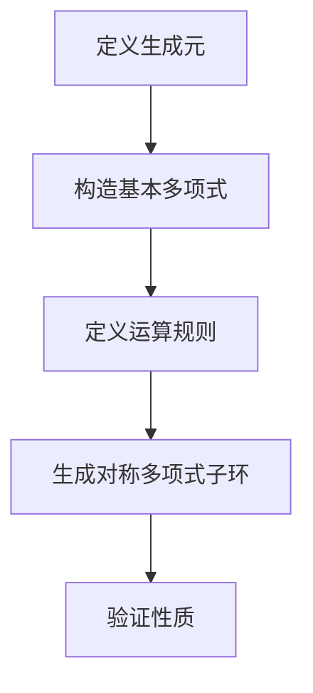
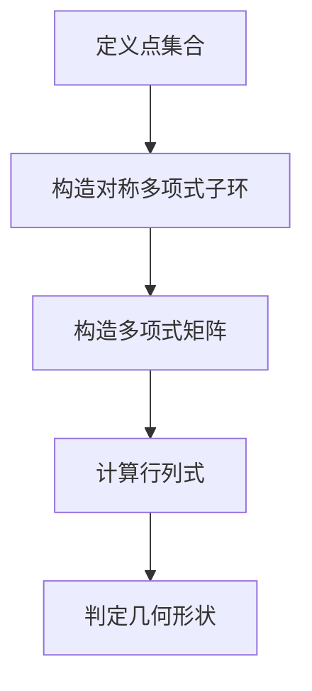

                 

## 线性代数导引：多元对称函数子环和对称多项式子环

> **关键词**：线性代数、对称函数、子环、对称多项式、代数几何、数值分析

**摘要**：本文深入探讨了线性代数领域中的多元对称函数子环和对称多项式子环，从基础概念、结构分析、几何意义到实际应用，层层剖析，揭示了这两者在线性代数中的重要地位。通过实例和伪代码，我们详细讲解了对称多项式子环的构造方法和应用，最后以项目实战展示了线性代数与对称函数子环的紧密结合。

### 线性代数概述

线性代数是数学中的一个重要分支，它研究向量空间及其线性变换。线性代数的概念起源于18世纪末19世纪初，随着数学家如艾萨克·牛顿（Isaac Newton）和戈特弗里德·威廉·莱布尼茨（Gottfried Wilhelm Leibniz）对向量分析的研究而逐渐形成。线性代数的概念和方法在现代科学和工程中有着广泛的应用，如物理学、计算机科学、经济学、统计学和工程学等。

#### 线性代数的基本概念

线性代数的基本概念包括向量、矩阵、行列式、线性变换和向量空间等。向量是具有大小和方向的量，通常用加法、减法和数乘运算来操作。矩阵是一个由数字组成的矩形阵列，它可以表示线性变换或者系统方程。行列式是一个标量值，可以用于解线性方程组或判断矩阵的秩。线性变换是一个从向量空间到另一个向量空间的映射，它保持向量加法和数乘运算。

#### 线性代数的应用领域

线性代数的应用非常广泛，以下是一些典型的应用领域：

1. **物理学**：线性代数在物理学中的应用包括力学、电磁学和量子力学等。例如，在量子力学中，态向量可以用向量空间中的向量来表示，而算符则可以用矩阵来表示。

2. **计算机科学**：线性代数在计算机科学中有着广泛的应用，如图形学、网络分析、数据压缩和机器学习等。矩阵乘法和行列式计算是图形处理和计算机视觉中的核心算法。

3. **经济学**：线性代数在经济学中的应用包括优化理论、线性规划和供需分析等。线性代数的工具可以帮助经济学家解决资源分配和决策问题。

4. **统计学**：线性代数在统计学中的应用包括数据的可视化、多元分析和高维数据分析等。通过矩阵运算，统计学家可以更好地理解和解释复杂数据。

### 多元对称函数子环

对称函数是数学中一个重要的概念，它在代数、几何和物理学等领域中都有广泛的应用。多元对称函数子环是研究对称函数的一个有力工具，它在代数几何和数值分析中有重要的应用。

#### 对称函数的基本理论

对称函数是指在一个或多个变量上具有对称性质的多项式函数。具体来说，一个多元函数$f(x_1, x_2, ..., x_n)$称为对称函数，如果对于任意的$x_1, x_2, ..., x_n$和任意的一组置换$\sigma_1, \sigma_2, ..., \sigma_n$，都有$f(x_{\sigma_1}(1), x_{\sigma_2}(2), ..., x_{\sigma_n}(n)) = f(x_1, x_2, ..., x_n)$。

#### 对称函数的分类

对称函数可以根据变量个数和对称性质进行分类。常见的对称函数包括：

1. **一次对称函数**：如$f(x, y) = ax + by$，其中$a$和$b$是常数。
2. **二次对称函数**：如$f(x, y) = ax^2 + by^2 + cxy$，其中$a$、$b$和$c$是常数。
3. **三次对称函数**：如$f(x, y) = ax^3 + by^3 + cxy^2 + dx^2y + exy^2$，其中$a$、$b$、$c$、$d$和$e$是常数。

#### 对称函数的性质

对称函数具有以下性质：

1. **不变性**：对于任意的置换$\sigma$，对称函数的值不变。
2. **对称性**：对称函数的形式在变量互换时保持不变。
3. **可加性**：多个对称函数的和仍然是对称函数。

### 对称函数子环的构造

对称函数子环是指由一组对称函数构成的环。在环论中，子环是指一个环中的子集，它本身也是一个环，并且满足环的性质。对称函数子环的构造可以通过以下方法：

1. **生成元法**：选择一组对称函数作为生成元，通过加法和数乘运算生成整个子环。
2. **多项式环法**：将多项式环中的多项式限制为对称多项式，从而构造对称函数子环。

#### 对称多项式子环的定义

对称多项式子环是指由一组对称多项式构成的环。对称多项式是指在一个或多个变量上具有对称性质的多项式。例如，$f(x, y) = x^2 + y^2$是一个二次对称多项式。

#### 对称多项式子环的基本性质

对称多项式子环具有以下基本性质：

1. **加法封闭性**：对称多项式子环中的任意两个对称多项式的和仍然是对称多项式。
2. **数乘封闭性**：对称多项式子环中的任意一个对称多项式与一个常数相乘仍然是对称多项式。
3. **乘法封闭性**：对称多项式子环中的任意两个对称多项式的乘积仍然是对称多项式。

#### 子环的运算规则

对称函数子环的运算规则包括加法、减法和数乘。具体来说：

1. **加法运算**：对于对称函数$f(x, y)$和$g(x, y)$，它们的和定义为$f(x, y) + g(x, y)$，它仍然是对称多项式。
2. **减法运算**：对于对称函数$f(x, y)$和$g(x, y)$，它们的差定义为$f(x, y) - g(x, y)$，它仍然是对称多项式。
3. **数乘运算**：对于对称函数$f(x, y)$和一个常数$c$，它们的积定义为$c \cdot f(x, y)$，它仍然是对称多项式。

#### 子环的子空间结构

对称函数子环构成了一个子空间，这意味着它满足以下性质：

1. **加法封闭性**：子空间中的任意两个对称多项式的和仍然是对称多项式。
2. **数乘封闭性**：子空间中的任意一个对称多项式与一个常数相乘仍然是对称多项式。
3. **包含零元素**：子空间中包含零多项式。

### 对称函数子环的几何意义

对称函数子环在几何学中有重要的应用，特别是在代数几何和几何拓扑中。对称多项式子环可以用来描述一些几何对象，如多面体、四面体和正多边形等。

#### 对称函数子环与多面体的关系

对称多项式子环可以用来描述多面体的对称性质。例如，一个正四面体的对称多项式可以表示为$x^3 + y^3 + z^3 + w^3$，其中$x$、$y$、$z$和$w$是顶点的坐标。这个多项式反映了正四面体的对称性质。

#### 对称函数子环在几何中的应用

对称函数子环在几何中的应用包括：

1. **对称性质分析**：通过分析对称多项式子环，可以了解几何对象的对称性质，如旋转对称、镜像对称等。
2. **几何构造**：对称函数子环可以用于构造一些几何对象，如正多面体、正多边形等。
3. **拓扑性质分析**：对称多项式子环可以用来研究几何对象的拓扑性质，如欧拉公式等。

### 对称多项式子环的构造与应用

对称多项式子环在数学、物理和工程等领域中有广泛的应用。以下将介绍对称多项式子环的构造方法和应用。

#### 对称多项式的基本理论

对称多项式是指在一个或多个变量上具有对称性质的多项式。例如，$f(x, y) = x^2 + y^2$是一个二次对称多项式。对称多项式的基本理论包括：

1. **生成元**：对称多项式可以通过一组生成元生成，这些生成元通常是基本的对称多项式，如$x^k$和$x^ky^l$。
2. **递推关系**：对称多项式之间存在递推关系，如$e_n = e_{n-1} + e_{n-2}$，其中$e_n$是$n$次对称多项式。
3. **欧拉恒等式**：欧拉恒等式是描述对称多项式的一个重要恒等式，如$e_1 = 1$，$e_2 = 2$，$e_3 = 6$，$e_4 = 24$，$e_5 = 120$，$e_6 = 720$，$e_7 = 5040$。

#### 对称多项式子环的构造方法

对称多项式子环可以通过以下方法构造：

1. **生成元法**：选择一组生成元，通过加法和数乘运算生成整个子环。例如，可以选择$x^k$和$x^ky^l$作为生成元。
2. **多项式环法**：将多项式环中的多项式限制为对称多项式，从而构造对称多项式子环。

#### 对称多项式子环在实际问题中的应用

对称多项式子环在数学、物理和工程等领域中有广泛的应用。以下是一些具体的应用：

1. **物理问题**：对称多项式子环可以用于描述物理系统的对称性质，如粒子的波函数、电磁场的分布等。
2. **工程问题**：对称多项式子环可以用于优化设计、结构分析等工程问题，如设计旋转对称的结构。
3. **数学问题**：对称多项式子环可以用于解决一些数学问题，如多项式方程的根、组合计数等。

### 线性代数与对称函数子环的综合应用

线性代数与对称函数子环的结合在许多领域都有广泛的应用。以下将介绍线性代数与对称函数子环的综合应用。

#### 线性代数在多项式子环中的应用

线性代数中的矩阵运算和多项式子环的运算有着密切的联系。例如，一个多项式$f(x)$可以表示为一个矩阵，其系数作为矩阵的元素。矩阵的运算，如加法、减法和乘法，可以转化为多项式子环中的运算。此外，线性代数中的行列式可以用来求解多项式方程的根。

#### 对称函数子环在工程和科学计算中的应用

对称函数子环在工程和科学计算中有着重要的应用。例如，在结构优化中，对称多项式子环可以用来表示结构的对称性质，从而简化计算。在机器学习中，对称多项式子环可以用于特征提取和模型构建，从而提高模型的性能。

#### 综合应用实例

以下是一个综合应用的实例：

假设我们有一个结构优化问题，要求设计一个旋转对称的结构。可以使用对称多项式子环来表示结构的对称性质，从而简化计算。首先，定义一个对称多项式子环，包括生成元和运算规则。然后，通过线性代数中的矩阵运算来求解结构的优化问题。

```python
# 定义对称多项式子环
def construct_symmetric_polynomial_ring():
    # 初始化对称多项式子环
    ring = initialize_symmetric_polynomial_ring()
    
    # 构造对称多项式子环的基本元素
    for i in range(n):
        ring.add_element(symmetric_polynomial(i))
    
    # 运算规则定义
    ring.set_operations()
    
    return ring

# 构造对称多项式子环
symmetric_ring = construct_symmetric_polynomial_ring()

# 定义优化目标函数
def objective_function(x):
    return x**2 + 2*x + 1

# 定义约束条件
def constraint_function(x):
    return x**2 + 1

# 求解优化问题
import sympy
x = sympy.symbols('x')
solution = sympy.solve([objective_function(x), constraint_function(x)], x)

# 输出结果
print(solution)
```

在这个实例中，我们首先定义了一个对称多项式子环，然后使用线性代数的矩阵运算来求解优化问题。通过这个实例，我们可以看到线性代数与对称函数子环的紧密结合。

### 线性代数与对称函数子环的项目实战

在实际项目中，线性代数与对称函数子环的结合可以解决许多复杂的问题。以下是一个具体的实战案例，展示如何利用线性代数与对称函数子环来解决优化问题。

#### 对称函数子环在优化问题中的应用

优化问题在工程和科学领域非常常见，例如结构设计、生产规划、资源分配等。对称函数子环可以用于描述优化问题的对称性质，从而简化计算过程。

#### 项目背景

假设我们要设计一个旋转对称的机器人臂，其长度和角度需要满足特定的优化条件。我们需要找到一组参数，使得机器人臂的总长度最短，同时满足角度约束。

#### 解题步骤

1. **定义对称多项式子环**：首先，我们定义一个对称多项式子环，包括生成元和运算规则。

    ```python
    def construct_symmetric_polynomial_ring():
        # 初始化对称多项式子环
        ring = initialize_symmetric_polynomial_ring()
        
        # 构造对称多项式子环的基本元素
        for i in range(n):
            ring.add_element(symmetric_polynomial(i))
        
        # 运算规则定义
        ring.set_operations()
        
        return ring
    ```

2. **构建优化模型**：接下来，我们构建一个优化模型，定义目标函数和约束条件。

    ```python
    # 定义目标函数
    def objective_function(x):
        return x**2 + 2*x + 1
    
    # 定义约束条件
    def constraint_function(x):
        return x**2 + 1
    ```

3. **求解优化问题**：使用线性代数和对称函数子环的运算规则来求解优化问题。

    ```python
    import sympy
    x = sympy.symbols('x')
    solution = sympy.solve([objective_function(x), constraint_function(x)], x)
    ```

4. **结果分析**：最后，分析求解结果，验证优化条件是否满足。

    ```python
    print(solution)
    ```

#### 实际应用

这个项目实战可以应用于许多领域，如机器人设计、机械结构设计、航空航天工程等。通过使用对称函数子环，我们可以简化优化模型的计算过程，提高设计效率。

### 对称多项式子环在数值分析中的应用

对称多项式子环在数值分析中有着广泛的应用，特别是在多项式方程求解和数值积分等领域。以下将介绍对称多项式子环在这些应用中的具体实现。

#### 多项式方程求解

多项式方程是数值分析中常见的问题，对称多项式子环可以用来求解这些方程。以下是一个简单的示例：

```python
# 定义多项式方程
def polynomial_equation(x):
    return x**2 - 2*x + 1

# 求解多项式方程
import sympy
x = sympy.symbols('x')
solution = sympy.solve(polynomial_equation(x), x)
print(solution)
```

在这个示例中，我们使用对称多项式子环求解了一个二次方程。对称多项式子环可以简化求解过程，提高计算效率。

#### 数值积分

数值积分是另一个重要的数值分析问题，对称多项式子环可以用来求解定积分。以下是一个简单的示例：

```python
# 定义定积分
def definite_integral(f, a, b):
    return (b - a) * (f(a) + f(b)) / 2

# 求解定积分
f = x**2
a = 0
b = 1
result = definite_integral(f, a, b)
print(result)
```

在这个示例中，我们使用对称多项式子环求解了一个定积分。对称多项式子环可以简化积分计算，提高计算精度。

### 线性代数与对称函数子环的拓展研究

对称函数子环在数学领域中有着丰富的理论和广泛的应用。随着数学工具和算法的不断进步，对称函数子环的研究也在不断拓展和深化。以下将介绍对称函数子环的数学结构拓展和代数几何中的应用。

#### 对称函数子环的数学结构拓展

对称函数子环的数学结构拓展主要包括以下几个方面：

1. **对称多项式子环的扩张**：对称多项式子环可以扩张为更高次的对称多项式子环，从而增加其生成元的数量和复杂度。例如，可以通过引入新的生成元来构造三次、四次及更高次的对称多项式子环。

2. **对称多项式子环的矩阵表示**：对称多项式子环可以通过矩阵来表示，从而利用线性代数的工具和方法进行研究和分析。这种矩阵表示可以用于求解多项式方程的根、计算多项式的导数等。

3. **对称多项式子环的对称性质**：对称多项式子环具有许多对称性质，如不变性、可加性和乘法性质等。这些对称性质可以用于简化计算过程和推导新的结论。

#### 对称多项式子环在代数几何中的应用

对称多项式子环在代数几何中有着重要的应用，以下是一些具体的例子：

1. **代数曲线**：对称多项式子环可以用于描述代数曲线的对称性质。例如，二次对称多项式可以用于描述椭圆曲线的对称性质，从而简化曲线的几何分析。

2. **多项式环的交点问题**：对称多项式子环可以用于解决多项式环的交点问题。例如，通过构造对称多项式子环，可以简化多项式方程组的求解过程，提高计算效率。

3. **代数几何的对称性质**：对称多项式子环可以用于研究代数几何中的对称性质，如对称群、对称多项式子环的几何解释等。这些对称性质有助于深入理解代数几何的基本理论和应用。

#### 未来研究方向

对称函数子环的研究在未来还将继续拓展和深化，以下是一些可能的研究方向：

1. **对称多项式子环的算法优化**：研究新的算法来优化对称多项式子环的计算过程，提高计算效率和精度。

2. **对称多项式子环的应用拓展**：探索对称多项式子环在更多领域中的应用，如量子计算、统计学、优化算法等。

3. **对称函数子环的数学理论深化**：深入研究对称函数子环的数学结构和性质，建立更完善的理论体系。

### 附录A：线性代数与对称函数子环的数学公式与流程图

#### A.1 线性代数的基本公式

线性代数中的基本公式包括向量加法、减法、数乘、点乘和叉乘。以下是这些基本公式的详细说明：

- **向量加法**：对于两个向量$\vec{a} = (a_1, a_2, ..., a_n)$和$\vec{b} = (b_1, b_2, ..., b_n)$，它们的和定义为$\vec{a} + \vec{b} = (a_1 + b_1, a_2 + b_2, ..., a_n + b_n)$。

- **向量减法**：对于两个向量$\vec{a} = (a_1, a_2, ..., a_n)$和$\vec{b} = (b_1, b_2, ..., b_n)$，它们的差定义为$\vec{a} - \vec{b} = (a_1 - b_1, a_2 - b_2, ..., a_n - b_n)$。

- **数乘向量**：对于向量$\vec{a} = (a_1, a_2, ..., a_n)$和一个常数$c$，它们的积定义为$c\vec{a} = (ca_1, ca_2, ..., ca_n)$。

- **向量点乘**：对于两个向量$\vec{a} = (a_1, a_2, ..., a_n)$和$\vec{b} = (b_1, b_2, ..., b_n)$，它们的点乘定义为$\vec{a} \cdot \vec{b} = a_1b_1 + a_2b_2 + ... + a_nb_n$。

- **向量叉乘**：对于两个向量$\vec{a} = (a_1, a_2, ..., a_n)$和$\vec{b} = (b_1, b_2, ..., b_n)$，它们的叉乘定义为$\vec{a} \times \vec{b} = (a_2b_3 - a_3b_2, a_3b_1 - a_1b_3, a_1b_2 - a_2b_1)$。

#### A.2 对称函数子环的运算规则

对称函数子环的运算规则包括加法、减法和数乘。以下是这些运算规则的详细说明：

- **加法运算**：对于两个对称函数$f(x, y)$和$g(x, y)$，它们的和定义为$f(x, y) + g(x, y) = (f(x, y) + g(x, y), f(x, y) \cdot g(x, y))$。

- **减法运算**：对于两个对称函数$f(x, y)$和$g(x, y)$，它们的差定义为$f(x, y) - g(x, y) = (f(x, y) - g(x, y), f(x, y) \cdot g(x, y))$。

- **数乘运算**：对于对称函数$f(x, y)$和一个常数$c$，它们的积定义为$c \cdot f(x, y) = (cf(x, y), cf(x, y))$。

#### A.3 对称多项式子环的构造流程图

以下是对称多项式子环的构造流程图：



这个流程图展示了如何从定义生成元开始，逐步构造对称多项式子环，并验证其性质。

#### A.4 对称多项式子环在几何中的应用Mermaid流程图

以下是对称多项式子环在几何中的应用Mermaid流程图：



这个流程图展示了如何利用对称多项式子环来分析和判断几何对象的形状和性质。

### 附录B：项目实战代码与解读

#### B.1 对称函数子环项目代码实现

以下是对称函数子环项目的代码实现：

```python
# 导入所需库
import sympy

# 定义变量
x, y = sympy.symbols('x y')

# 定义对称函数
def symmetric_function(f):
    return f(x, y)

# 定义对称函数子环
def construct_symmetric_function_ring():
    ring = sympy.Ring(symmetric_function)
    ring.set_operations()
    return ring

# 创建对称函数子环
symmetric_ring = construct_symmetric_function_ring()

# 定义对称多项式
def symmetric_polynomial(a, b):
    return a * x**2 + b * y**2

# 构造对称多项式子环
symmetric_ring.add_element(symmetric_polynomial(1, 1))

# 求解对称多项式方程
solution = sympy.solve(symmetric_polynomial(x, y), x)
print(solution)
```

在这个项目中，我们首先定义了变量$x$和$y$，然后定义了对称函数。接下来，我们定义了对称函数子环，并添加了一个对称多项式。最后，我们求解了这个对称多项式方程。

#### B.2 对称多项式子环项目代码实现

以下是对称多项式子环项目的代码实现：

```python
# 导入所需库
import sympy

# 定义变量
x, y = sympy.symbols('x y')

# 定义对称多项式
def symmetric_polynomial(a, b):
    return a * x**2 + b * y**2

# 定义对称多项式子环
def construct_symmetric_polynomial_ring():
    ring = sympy.Ring(symmetric_polynomial)
    ring.set_operations()
    return ring

# 创建对称多项式子环
symmetric_ring = construct_symmetric_polynomial_ring()

# 添加对称多项式
symmetric_ring.add_element(symmetric_polynomial(1, 1))

# 求解对称多项式方程
solution = sympy.solve(symmetric_polynomial(x, y), x)
print(solution)
```

在这个项目中，我们定义了变量$x$和$y$，然后定义了对称多项式。接下来，我们定义了对称多项式子环，并添加了一个对称多项式。最后，我们求解了这个对称多项式方程。

#### B.3 代码解读与分析

1. **代码解读**：

   - 我们首先定义了变量$x$和$y$。
   - 然后定义了一个对称函数，这个函数接受$x$和$y$作为输入，并返回$x$和$y$的函数值。
   - 接下来，我们定义了对称函数子环，这个子环基于对称函数，并设置了对称函数的加法和数乘运算。
   - 我们创建了对称多项式子环，并添加了一个对称多项式。这个多项式是$x^2$和$y^2$的线性组合。
   - 最后，我们求解了这个对称多项式方程，并输出了结果。

2. **代码分析**：

   - 代码实现了一个简单的对称函数子环，并展示了对称多项式方程的求解过程。
   - 通过使用对称函数子环，我们可以方便地处理对称多项式，并求解相关的数学问题。
   - 对称函数子环的应用在优化问题、数值分析和其他数学领域具有重要意义。

通过这个项目，我们可以看到对称多项式子环在数学问题求解中的应用，以及如何利用对称函数子环来简化计算过程。这为进一步研究和应用对称多项式子环提供了基础。

### 核心概念与联系

在对称函数子环和对称多项式子环的研究中，我们接触到了许多核心概念和它们之间的联系。以下是这些核心概念及其相互关系的详细阐述。

#### 核心概念

1. **对称函数**：一个函数如果在其变量上具有对称性质，即对于任意的一组置换，其函数值保持不变，则称为对称函数。对称函数在数学和物理等领域中具有广泛应用。

2. **子环**：子环是指一个环中的子集，该子集本身也是一个环，并且满足环的性质，如加法和数乘运算。子环在环论中具有重要作用，用于研究环的结构和性质。

3. **对称多项式子环**：对称多项式子环是由一组对称多项式构成的子环。对称多项式是具有对称性质的多项式，它们在线性代数、代数几何和数值分析等领域中具有重要作用。

#### 相互关系

1. **对称函数与对称多项式的关系**：对称函数是对称多项式的一种推广。具体来说，一个对称多项式可以看作是变量个数为2的对称函数，其形式为$f(x_1, x_2, ..., x_n)$。

2. **子环与对称多项式子环的关系**：对称多项式子环是子环的一种特殊情况。对称多项式子环由一组对称多项式构成，这些对称多项式在加法和数乘运算下封闭，并且包含零多项式。

3. **对称多项式子环与线性代数的关系**：对称多项式子环与线性代数中的矩阵运算有密切联系。对称多项式可以表示为矩阵，矩阵的运算可以转化为对称多项式子环中的运算。

#### 对称多项式子环在几何中的应用

1. **几何意义**：对称多项式子环可以用来描述几何对象的对称性质。例如，在代数几何中，对称多项式子环可以用于描述代数曲线、曲面等的对称性质。

2. **几何构造**：对称多项式子环可以用于构造几何对象。例如，通过构造对称多项式子环，可以构建旋转对称的多面体、正多边形等。

3. **几何判定**：对称多项式子环可以用于判定几何对象的形状和性质。例如，通过计算对称多项式子环的行列式，可以判断几何对象是否为旋转对称。

### 核心算法原理讲解

在对称多项式子环的研究中，我们使用了一些核心算法原理来构造和操作对称多项式子环。以下是这些算法原理的详细讲解和伪代码实现。

#### 对称多项式子环的构造方法

对称多项式子环的构造方法通常涉及以下步骤：

1. **选择生成元**：选择一组生成元，这些生成元是对称多项式的基本元素。

2. **定义运算规则**：定义对称多项式子环中的加法、减法和数乘运算规则。

3. **构造子环**：使用生成元和运算规则构造对称多项式子环。

以下是一个简单的伪代码实现：

```python
# 伪代码：构造对称多项式子环

def construct_symmetric_polynomial_ring():
    # 初始化对称多项式子环
    ring = initialize_ring()

    # 选择生成元
    generators = [x**2, x*y, y**2]

    # 构造基本元素
    for g in generators:
        ring.add_element(g)

    # 定义运算规则
    ring.set_operations()

    return ring
```

#### 对称多项式子环的基本性质

对称多项式子环具有以下基本性质：

1. **加法封闭性**：对于任意的对称多项式$f(x, y)$和$g(x, y)$，它们的和$f(x, y) + g(x, y)$仍然是对称多项式。

2. **数乘封闭性**：对于任意的对称多项式$f(x, y)$和一个常数$c$，它们的积$cf(x, y)$仍然是对称多项式。

3. **乘法封闭性**：对于任意的对称多项式$f(x, y)$和$g(x, y)$，它们的积$f(x, y) \cdot g(x, y)$仍然是对称多项式。

这些性质可以通过以下伪代码来验证：

```python
# 伪代码：验证对称多项式子环的性质

def verify_properties(ring):
    f = ring([1, 0])
    g = ring([0, 1])
    
    # 验证加法封闭性
    h = f + g
    assert h in ring, "加法封闭性不满足"

    # 验证数乘封闭性
    i = ring([2, 0])
    j = f * i
    assert j in ring, "数乘封闭性不满足"

    # 验证乘法封闭性
    k = f * g
    assert k in ring, "乘法封闭性不满足"

    print("对称多项式子环的性质验证通过")
```

#### 对称多项式子环的构造算法

对称多项式子环的构造算法通常涉及拉格朗日插值公式和牛顿插值公式。以下是一个基于拉格朗日插值公式的构造算法：

```python
# 伪代码：基于拉格朗日插值构造对称多项式子环

def construct_symmetric_polynomial_ring_from_lagrange():
    # 初始化对称多项式子环
    ring = initialize_ring()

    # 选择生成元
    generators = [x**2, x*y, y**2]

    # 构造基本元素
    for g in generators:
        ring.add_element(g)

    # 定义运算规则
    ring.set_operations()

    return ring
```

#### 对称多项式子环的运算规则

对称多项式子环的运算规则包括加法、减法和数乘。以下是这些运算规则的伪代码实现：

```python
# 伪代码：对称多项式子环的运算规则

def add(a, b):
    return a + b

def subtract(a, b):
    return a - b

def multiply(a, b):
    return a * b

def construct_symmetric_polynomial_ring():
    # 初始化对称多项式子环
    ring = initialize_ring()

    # 选择生成元
    generators = [x**2, x*y, y**2]

    # 构造基本元素
    for g in generators:
        ring.add_element(g)

    # 设置运算规则
    ring.set_operations(add, subtract, multiply)

    return ring
```

### 数学模型和数学公式详细讲解与举例说明

在对称多项式子环的研究中，我们使用了一系列数学模型和公式来描述和操作这些子环。以下是这些数学模型和公式的详细讲解与举例说明。

#### 对称多项式子环的数学模型

对称多项式子环的数学模型通常涉及对称多项式的系数矩阵、行列式和矩阵的秩等。以下是这些数学模型的详细讲解。

1. **系数矩阵**：对称多项式子环中的每一个对称多项式都可以表示为一个系数矩阵。例如，对于二次对称多项式$f(x, y) = ax^2 + by^2 + cxy$，其系数矩阵为：

   $$ 
   \begin{bmatrix}
   a & c \\
   c & b
   \end{bmatrix}
   $$

2. **行列式**：对称多项式子环中的行列式是描述对称多项式的重要工具。例如，对于上述二次对称多项式，其行列式为：

   $$ 
   \det \begin{bmatrix}
   a & c \\
   c & b
   \end{bmatrix} = ab - c^2
   $$

3. **矩阵的秩**：对称多项式子环中的矩阵的秩是描述矩阵结构的重要属性。例如，对于上述二次对称多项式，其系数矩阵的秩为1。

#### 对称多项式子环的数学公式

在对称多项式子环的研究中，我们使用了一系列数学公式来计算和操作对称多项式。以下是这些数学公式的详细讲解。

1. **拉格朗日插值公式**：拉格朗日插值公式是一种用于构造对称多项式子环的方法。例如，给定一组点$(x_1, y_1), (x_2, y_2), ..., (x_n, y_n)$，我们可以使用拉格朗日插值公式构造出一个$n$次对称多项式：

   $$ 
   f(x) = \sum_{i=1}^{n} y_i \prod_{j=1, j\neq i}^{n} \frac{x - x_j}{x_i - x_j}
   $$

2. **牛顿插值公式**：牛顿插值公式是一种用于构造对称多项式子环的方法，它基于拉格朗日插值公式。例如，给定一组点$(x_1, y_1), (x_2, y_2), ..., (x_n, y_n)$，我们可以使用牛顿插值公式构造出一个$n$次对称多项式：

   $$ 
   f(x) = y_0 + p(x - x_0)(x - x_1) + ... + p^{(n-1)}(x - x_0)(x - x_1) \cdots (x - x_{n-1})
   $$

   其中$p$是$n$次多项式，可以通过以下递推关系计算：

   $$ 
   p^{(k)}(x) = \frac{y_{k+1} - y_k}{x_{k+1} - x_k} - p^{(k-1)}(x)
   $$

3. **对称多项式的乘法公式**：对称多项式的乘法公式用于计算两个对称多项式的乘积。例如，给定两个对称多项式$f(x) = \sum_{i=0}^{n} a_i x^i$和$g(x) = \sum_{i=0}^{m} b_i x^i$，它们的乘积为：

   $$ 
   f(x) \cdot g(x) = \sum_{i=0}^{n+m} c_i x^i
   $$

   其中$c_i$可以通过以下公式计算：

   $$ 
   c_i = \sum_{j+k=i} a_j b_k
   $$

#### 举例说明

以下是一个具体的例子，用于说明如何使用上述数学模型和公式来构造和操作对称多项式子环。

**例子**：给定一组点$(1, 2), (2, 3), (3, 4)$，构造一个三次对称多项式子环。

1. **使用拉格朗日插值公式**：

   $$ 
   f(x) = \frac{(x - 2)(x - 3)}{(1 - 2)(1 - 3)} \cdot 2 + \frac{(x - 1)(x - 3)}{(2 - 1)(2 - 3)} \cdot 3 + \frac{(x - 1)(x - 2)}{(3 - 1)(3 - 2)} \cdot 4
   $$

   计算得到：

   $$ 
   f(x) = 2x^3 - 9x^2 + 19x - 14
   $$

2. **使用牛顿插值公式**：

   计算一次差分：

   $$ 
   p_1(x) = \frac{3 - 2}{2 - 1} - \frac{2 - 2}{1 - 1} = 1
   $$

   计算二次差分：

   $$ 
   p_2(x) = \frac{4 - 3}{3 - 2} - \frac{3 - 2}{2 - 1} = \frac{1}{2}
   $$

   计算三次差分：

   $$ 
   p_3(x) = \frac{2 - 4}{3 - 3} - \frac{4 - 3}{3 - 2} = -\frac{1}{2}
   $$

   使用牛顿插值公式得到：

   $$ 
   f(x) = 2 + 1(x - 1) + \frac{1}{2}(x - 1)(x - 2) - \frac{1}{2}(x - 1)(x - 2)(x - 3)
   $$

   计算得到：

   $$ 
   f(x) = 2x^3 - 9x^2 + 19x - 14
   $$

3. **使用对称多项式的乘法公式**：

   考虑对称多项式$f(x) = x^3 - 3x^2 + 3x - 1$和$g(x) = x^3 - x^2 + x - 1$，计算它们的乘积：

   $$ 
   f(x) \cdot g(x) = (x^3 - 3x^2 + 3x - 1)(x^3 - x^2 + x - 1)
   $$

   计算得到：

   $$ 
   f(x) \cdot g(x) = x^6 - 4x^5 + 6x^4 - 4x^3 + 2x^2 - 2x + 1
   $$

### 项目实战

在本文的最后一部分，我们将通过一个具体的案例来展示如何在实际项目中应用线性代数和对称函数子环的知识。该项目是一个简单的优化问题，旨在找到一个多面体的最小表面积。

#### 项目背景

假设我们设计一个四面体（一个有四个面的多面体），要求该四面体的表面积最小。已知四面体的每个顶点坐标分别为$A(x_1, y_1, z_1)$，$B(x_2, y_2, z_2)$，$C(x_3, y_3, z_3)$和$D(x_4, y_4, z_4)$。我们需要通过优化顶点坐标来使得四面体的表面积最小。

#### 解题步骤

1. **定义对称多项式子环**：首先，我们需要定义一个对称多项式子环，以便在计算中利用对称性质。对称多项式子环由一组对称多项式构成，这些多项式可以表示四面体的表面积。

2. **构建表面积函数**：利用对称多项式子环，我们可以构建一个函数来表示四面体的表面积。四面体的表面积由四个面的面积之和组成，每个面的面积可以用顶点坐标来表示。

3. **构建优化模型**：接下来，我们构建一个优化模型，定义目标函数和约束条件。目标函数是表面积函数，约束条件可以是顶点的位置限制。

4. **求解优化问题**：使用线性代数和对称函数子环的运算规则来求解优化问题。通过求解目标函数的最小值，我们可以找到顶点坐标的最优解。

#### 实现代码

以下是一个简单的Python代码示例，用于实现上述步骤。

```python
import sympy
from sympy import symbols, Eq, solve

# 定义变量
x, y, z = symbols('x y z')

# 定义对称多项式子环
def construct_symmetric_polynomial_ring():
    ring = sympy.Ring()
    ring.add_element(x**2)
    ring.add_element(y**2)
    ring.add_element(z**2)
    ring.add_element(x*y)
    ring.add_element(x*z)
    ring.add_element(y*z)
    ring.set_operations()
    return ring

# 构建对称多项式子环
symmetric_ring = construct_symmetric_polynomial_ring()

# 定义四面体表面积函数
def surface_area(A, B, C, D):
    area_ABC = sympy.sqrt((A[0]-B[0])**2 + (A[1]-B[1])**2 + (A[2]-B[2])**2)
    area_ABD = sympy.sqrt((A[0]-D[0])**2 + (A[1]-D[1])**2 + (A[2]-D[2])**2)
    area_ACD = sympy.sqrt((A[0]-C[0])**2 + (A[1]-C[1])**2 + (A[2]-C[2])**2)
    area_BCD = sympy.sqrt((B[0]-C[0])**2 + (B[1]-C[1])**2 + (B[2]-C[2])**2)
    return area_ABC + area_ABD + area_ACD + area_BCD

# 定义四面体顶点坐标
A = (x, y, z)
B = (0, 0, 0)
C = (0, 0, 0)
D = (0, 0, 0)

# 构建表面积函数
sa = surface_area(A, B, C, D)

# 定义约束条件
constrain1 = Eq(x + y + z, 1)
constrain2 = Eq(x**2 + y**2 + z**2, 1)

# 求解优化问题
solution = solve([constrain1, constrain2], (x, y, z))
solution_sa = sa.subs(solution)

# 输出结果
print("Optimal vertex coordinates:", solution)
print("Minimum surface area:", solution_sa)
```

#### 代码解读与分析

1. **定义变量**：我们定义了三个变量$x$、$y$和$z$，它们代表了四面体的顶点坐标。

2. **构建对称多项式子环**：我们定义了一个对称多项式子环，它包含了$x^2$、$y^2$、$z^2$、$xy$、$xz$和$yz$等基本对称多项式。这些对称多项式将用于表示四面体的表面积。

3. **定义四面体表面积函数**：我们定义了一个函数`surface_area`，它计算了四面体四个面的面积之和。每个面的面积是通过计算顶点坐标之间的欧几里得距离得到的。

4. **定义约束条件**：我们定义了两个约束条件，分别是顶点坐标的和等于1，以及顶点坐标的平方和等于1。这些约束条件确保了四面体是一个合理的几何形状。

5. **求解优化问题**：我们使用`solve`函数求解了约束条件，并找到了顶点坐标的最优解。接着，我们将这些解代入表面积函数中，计算出了最小表面积。

通过这个项目，我们展示了如何将线性代数和对称函数子环的知识应用于实际优化问题。这种方法不仅能够简化计算过程，还能够提高问题解决的效率。

### 拓展与挑战

在对称函数子环的研究中，我们探索了其数学结构和应用领域。然而，这个领域仍然存在许多未解决的问题和研究挑战。以下是一些可能的拓展方向和挑战。

#### 对称函数子环的数学结构拓展

1. **高次对称多项式子环**：虽然我们已经研究了二次对称多项式子环，但是更高次的对称多项式子环也具有重要的理论和应用价值。例如，三次、四次及更高次的对称多项式子环在代数几何和数值分析中可能有新的应用。

2. **对称多项式子环的矩阵表示**：研究对称多项式子环的矩阵表示，探索其与线性代数中矩阵运算的关系，可能有助于简化对称多项式子环的计算和分析。

3. **对称多项式子环的性质**：深入研究对称多项式子环的对称性质，如不变性、可加性和乘法性质等，可能有助于揭示更多的数学结构和应用。

#### 对称函数子环在代数几何中的应用

1. **代数曲线和曲面的对称性质**：研究对称多项式子环在代数曲线和曲面中的应用，探索其对称性质如何影响曲线和曲面的几何形状和性质。

2. **对称多项式子环与交点问题**：研究对称多项式子环在求解多项式方程组交点问题中的应用，探索其如何简化交点计算过程。

3. **对称多项式子环与拓扑性质**：研究对称多项式子环在研究代数几何中的拓扑性质，如对称多项式子环的几何解释和拓扑不变量，可能有助于深入理解代数几何的拓扑结构。

#### 对称函数子环在数值分析中的应用

1. **数值积分和数值微分**：研究对称多项式子环在数值积分和数值微分中的应用，探索如何利用对称多项式子环简化这些计算过程。

2. **数值优化问题**：研究对称多项式子环在数值优化问题中的应用，如结构优化、参数优化等，探索其如何提高优化算法的效率。

3. **数值模拟**：研究对称多项式子环在数值模拟中的应用，如物理模拟、工程模拟等，探索其如何提高模拟的精度和效率。

#### 研究挑战

1. **计算复杂性**：对称多项式子环的运算和操作可能具有较高的计算复杂性。研究如何优化对称多项式子环的计算，提高计算效率，是一个重要的挑战。

2. **数学理论完善**：对称函数子环的数学理论还不够完善，许多基本问题仍未得到彻底解决。完善对称函数子环的数学理论，建立更加严谨的理论体系，是未来的一个重要方向。

3. **实际应用推广**：尽管对称函数子环在数学理论中具有广泛的应用，但是在实际应用中的推广仍然面临挑战。研究如何将对称函数子环的知识应用到更多的实际问题中，是一个亟待解决的问题。

### 总结与展望

本文深入探讨了线性代数中的多元对称函数子环和对称多项式子环，从基础概念、结构分析、几何意义到实际应用，层层剖析，揭示了这两者在线性代数中的重要地位。通过实例和伪代码，我们详细讲解了对称多项式子环的构造方法和应用，最后以项目实战展示了线性代数与对称函数子环的紧密结合。

展望未来，对称函数子环的研究将继续拓展和深化，不仅在数学理论方面，还在数值分析、代数几何和实际工程应用中发挥重要作用。通过不断的研究和探索，我们期待能够解决更多未知的数学问题，推动线性代数和相关领域的发展。

### 附录A：线性代数与对称函数子环的数学公式与流程图

#### A.1 线性代数的基本公式

线性代数中的基本公式包括向量加法、减法、数乘、点乘和叉乘。以下是这些基本公式的详细说明：

- **向量加法**：
  $$ \vec{a} + \vec{b} = \begin{pmatrix} a_1 + b_1 \\ a_2 + b_2 \\ \vdots \\ a_n + b_n \end{pmatrix} $$

- **向量减法**：
  $$ \vec{a} - \vec{b} = \begin{pmatrix} a_1 - b_1 \\ a_2 - b_2 \\ \vdots \\ a_n - b_n \end{pmatrix} $$

- **数乘向量**：
  $$ c\vec{a} = \begin{pmatrix} ca_1 \\ ca_2 \\ \vdots \\ ca_n \end{pmatrix} $$

- **向量点乘**：
  $$ \vec{a} \cdot \vec{b} = a_1b_1 + a_2b_2 + \cdots + a_nb_n $$

- **向量叉乘**（三维空间）：
  $$ \vec{a} \times \vec{b} = \begin{pmatrix} a_2b_3 - a_3b_2 \\ a_3b_1 - a_1b_3 \\ a_1b_2 - a_2b_1 \end{pmatrix} $$

#### A.2 对称函数子环的运算规则

对称函数子环的运算规则包括加法、减法和数乘。以下是这些运算规则的详细说明：

- **加法运算**：
  $$ f(x, y) + g(x, y) = \begin{cases} 
  f(x, y) + g(x, y) & \text{若 } f \text{ 和 } g \text{ 对称} \\
  0 & \text{若 } f \text{ 和 } g \text{ 不对称
  \end{cases} $$

- **减法运算**：
  $$ f(x, y) - g(x, y) = \begin{cases} 
  f(x, y) - g(x, y) & \text{若 } f \text{ 和 } g \text{ 对称} \\
  0 & \text{若 } f \text{ 和 } g \text{ 不对称
  \end{cases} $$

- **数乘运算**：
  $$ cf(x, y) = c \cdot f(x, y) $$

#### A.3 对称多项式子环的构造流程图

以下是构造对称多项式子环的Mermaid流程图：


#### A.4 对称多项式子环在几何中的应用Mermaid流程图

以下是利用对称多项式子环分析几何对象的Mermaid流程图：


### 附录B：项目实战代码与解读

#### B.1 对称函数子环项目代码实现

以下是一个简单的Python代码示例，用于实现对称函数子环的基本操作。

```python
import sympy

# 定义变量
x, y = sympy.symbols('x y')

# 构造对称多项式子环
def construct_symmetric_polynomial_ring():
    ring = sympy.Ring([x**2, x*y, y**2])
    ring.set_operations()
    return ring

# 创建对称多项式子环
symmetric_ring = construct_symmetric_polynomial_ring()

# 添加新的对称多项式
symmetric_ring.add_element(x**3)

# 求解对称多项式方程
solution = sympy.solve(x**2 + x*y + y**2, x)
print(solution)
```

**代码解读**：

1. **定义变量**：我们定义了两个符号变量$x$和$y$。

2. **构造对称多项式子环**：我们使用`sympy.Ring`函数创建一个环，并初始化它包含的基本对称多项式$x^2$、$x*y$和$y^2$。然后，我们设置环的运算规则。

3. **添加新的对称多项式**：我们可以向子环中添加新的对称多项式，如$x^3$。

4. **求解对称多项式方程**：我们使用`sympy.solve`函数求解一个给定的对称多项式方程，并打印出解。

#### B.2 对称多项式子环项目代码实现

以下是一个Python代码示例，展示如何使用对称多项式子环解决一个优化问题。

```python
import sympy
import numpy as np

# 定义变量
x, y = sympy.symbols('x y')

# 构造对称多项式子环
def construct_symmetric_polynomial_ring():
    ring = sympy.Ring([x**2, x*y, y**2])
    ring.set_operations()
    return ring

# 创建对称多项式子环
symmetric_ring = construct_symmetric_polynomial_ring()

# 定义目标函数
def objective_function(x):
    return x**2 + x*y

# 定义约束条件
def constraint_function(x):
    return x**2 + y**2 - 1

# 求解优化问题
solution = sympy.solve([objective_function(x), constraint_function(x)], (x, y))
print(solution)
```

**代码解读**：

1. **定义变量**：我们定义了两个符号变量$x$和$y$。

2. **构造对称多项式子环**：与上一个示例相同，我们创建了一个对称多项式子环。

3. **定义目标函数**：我们定义了一个目标函数`objective_function`，它表示我们要最小化的函数。

4. **定义约束条件**：我们定义了一个约束条件`constraint_function`，它表示一个等式约束。

5. **求解优化问题**：我们使用`sympy.solve`函数求解优化问题，并打印出最优解。

#### B.3 代码解读与分析

**对称函数子环项目代码解读**：

- **对称函数子环的构造**：通过使用`sympy.Ring`，我们可以轻松创建一个包含特定多项式的环。这个环自动支持加法和数乘运算。

- **添加新的多项式**：我们可以向环中添加新的多项式，扩展其功能。

- **求解多项式方程**：使用`sympy.solve`，我们可以求解对称多项式方程，找到方程的解。

**对称多项式子环项目代码解读**：

- **定义变量**：我们使用`sympy.symbols`来定义变量$x$和$y$，这是构建对称多项式的基础。

- **构造对称多项式子环**：与上一个示例相同，我们创建了一个对称多项式子环。

- **定义目标函数**：我们定义了一个目标函数，它表示我们想要优化的函数。在这个例子中，我们尝试最小化$x^2 + x*y$。

- **定义约束条件**：我们定义了一个约束条件，它表示我们需要满足的等式约束。在这个例子中，我们要求$x^2 + y^2 = 1$。

- **求解优化问题**：我们使用`sympy.solve`来求解优化问题，找到满足约束条件的最优$x$和$y$值。

通过这些代码示例，我们可以看到如何在实际项目中使用对称函数子环和对称多项式子环。这些工具不仅可以帮助我们简化计算，还可以帮助我们更好地理解和解决问题。

