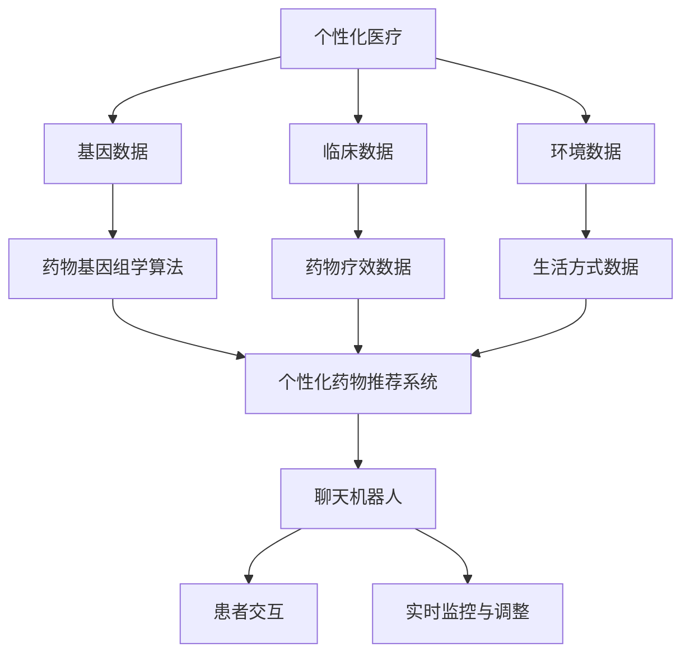

                 

### 聊天机器人医疗突破：个性化药物和治疗

> **关键词**：聊天机器人，医疗，个性化药物，治疗，自然语言处理，算法，机器学习，基因组学，医疗应用，技术趋势

> **摘要**：
随着人工智能和医疗技术的不断进步，聊天机器人正在医疗领域取得重大突破。本文将探讨聊天机器人在个性化药物和治疗中的应用，通过详细分析自然语言处理技术、个性化药物治疗的算法原理以及具体案例，展示这一新兴领域的前沿进展与巨大潜力。同时，还将探讨聊天机器人医疗应用的开发与部署、未来展望以及核心概念与联系，为读者提供一份全面的技术指南。

---
### 《聊天机器人医疗突破：个性化药物和治疗》目录大纲

#### 第一部分：聊天机器人医疗应用概述

- 第1章：聊天机器人医疗应用概述
  - 1.1 聊天机器人医疗应用的背景
  - 1.2 聊天机器人医疗应用的优势
  - 1.3 聊天机器人医疗应用的挑战

- 第2章：个性化医疗与药物
  - 2.1 个性化医疗的概念
  - 2.2 个性化药物的研发
  - 2.3 个性化药物与治疗的关系

#### 第二部分：聊天机器人医疗应用的核心技术

- 第3章：聊天机器人的自然语言处理技术
  - 3.1 自然语言处理的基本概念
  - 3.2 聊天机器人的对话系统
  - 3.3 语音识别与语音合成技术

- 第4章：个性化药物与治疗的算法原理
  - 4.1 个性化药物治疗的算法概述
  - 4.2 药物基因组学算法
  - 4.3 基于机器学习的药物筛选算法

- 第5章：聊天机器人医疗应用案例解析
  - 5.1 案例一：糖尿病患者的个性化药物治疗
  - 5.2 案例二：癌症患者的个性化治疗规划
  - 5.3 案例三：精神疾病患者的心理辅导

#### 第三部分：聊天机器人医疗应用的开发与部署

- 第6章：聊天机器人医疗应用的开发
  - 6.1 开发环境搭建
  - 6.2 数据预处理
  - 6.3 模型训练与调优

- 第7章：聊天机器人医疗应用部署
  - 7.1 部署方案设计
  - 7.2 部署过程中的挑战
  - 7.3 部署后的性能监控与优化

- 第8章：聊天机器人医疗应用的未来展望
  - 8.1 技术发展趋势
  - 8.2 医疗行业的变革
  - 8.3 聊天机器人医疗应用的未来挑战与机遇

#### 附录

- 附录A：聊天机器人医疗应用开发工具与资源
  - A.1 常用自然语言处理工具
  - A.2 常用机器学习框架
  - A.3 常用数据集与资源

- 附录B：核心概念与联系
  - B.1 聊天机器人与个性化医疗的关系
  - B.2 聊天机器人医疗应用的技术架构

- 附录C：核心算法原理讲解
  - C.1 自然语言处理算法的伪代码
  - C.2 个性化药物治疗的算法原理

- 附录D：数学模型和数学公式
  - D.1 概率模型
  - D.2 机器学习中的优化算法
  - D.3 药物基因组学中的统计模型

- 附录E：项目实战
  - E.1 个性化药物治疗的聊天机器人实现
  - E.2 源代码详细实现和代码解读
  - E.3 代码解读与分析

---
#### 第一部分：聊天机器人医疗应用概述

### 第1章：聊天机器人医疗应用概述

#### 1.1 聊天机器人医疗应用的背景

随着人工智能和医疗科技的飞速发展，医疗行业正在经历一场深刻的变革。传统医疗模式的局限性逐渐显现，人们对于个性化、精准医疗的需求日益增加。在这种情况下，聊天机器人作为一种新兴的人工智能技术，开始逐步走进医疗领域，为个性化药物和治疗提供了新的解决方案。

**AI与医疗的融合**：人工智能技术在医疗领域的应用已经非常广泛，如电子病历、医学图像处理、智能诊断等。而聊天机器人的引入，则将进一步提升医疗服务的效率和准确性。

**个性化医疗需求**：每位患者的身体状况和疾病情况都是独特的，传统的一刀切治疗方法已经难以满足患者的需求。个性化医疗旨在根据患者的具体情况制定个体化的治疗方案，这需要更加精准的医疗数据和分析工具。

**技术成熟度**：随着自然语言处理、机器学习和大数据分析等技术的不断进步，聊天机器人已经具备了处理医疗信息、理解患者需求的能力，为医疗应用提供了强大的技术支持。

#### 1.2 聊天机器人医疗应用的优势

**提高医疗效率**：聊天机器人可以全天候、无间断地回答患者的问题，提供咨询和建议，减轻了医护人员的工作负担，提高了医疗服务的效率。

**精准诊断和治疗**：通过分析患者的病历、症状和基因数据，聊天机器人能够为患者提供个性化的诊断和治疗方案，提高治疗的精准性。

**降低医疗成本**：聊天机器人可以自动化处理许多常规的医疗任务，如预约挂号、检查结果解读等，从而降低医疗机构的运营成本。

**改善患者体验**：聊天机器人提供了便捷的咨询渠道，患者可以在任何时间、任何地点获得医疗帮助，提升了患者的满意度和体验。

#### 1.3 聊天机器人医疗应用的挑战

**数据隐私和安全**：医疗数据敏感性高，如何确保患者隐私和数据安全成为聊天机器人应用的重要挑战。

**技术成熟度和可靠性**：尽管聊天机器人技术已经取得显著进展，但在某些复杂医疗问题的处理上，仍存在技术成熟度和可靠性不足的问题。

**医疗伦理和法规遵循**：医疗行业的法规和伦理要求严格，如何确保聊天机器人在医疗应用中的合规性是一个亟待解决的问题。

**患者接受度**：聊天机器人在医疗领域的应用需要得到患者的认可和接受，这需要时间和教育。

综上所述，聊天机器人医疗应用在提高医疗效率、精准诊断和治疗、降低成本以及改善患者体验方面具有显著优势，但也面临数据隐私、技术成熟度、法规伦理和患者接受度等挑战。接下来，我们将进一步探讨个性化医疗与药物的关系，以及聊天机器人如何实现这一目标。

#### 1.4 结论

本章概述了聊天机器人医疗应用的背景、优势以及面临的挑战。随着人工智能和医疗科技的不断进步，聊天机器人在医疗领域的应用前景广阔。然而，要实现这一潜力，需要克服一系列技术、法规和伦理方面的挑战。下一章将深入探讨个性化医疗与药物的概念和重要性，为理解聊天机器人在这一领域的作用奠定基础。

---

### 第2章：个性化医疗与药物

#### 2.1 个性化医疗的概念

个性化医疗，也称为精准医疗，是一种基于患者基因组信息和其他生物学数据，为每位患者提供个性化治疗和预防策略的医学模式。与传统的一刀切治疗方法不同，个性化医疗旨在通过整合患者的遗传信息、生活方式、环境和临床特征，制定最适合个体的治疗方案。

**定义与核心原则**：
- **定义**：个性化医疗是一种以患者为中心的医学模式，通过精准的基因组学、蛋白质组学、代谢组学等多组学数据分析，为患者提供个性化诊断、预防和治疗。
- **核心原则**：个性化医疗强调个体差异，关注患者的独特性，通过精准医学手段，实现治疗方案的个性化调整。

**发展历程**：
- **早期阶段**：个性化医疗的初步概念出现在20世纪末，主要基于遗传学和基因组学的突破。
- **快速发展阶段**：21世纪初，随着高通量测序技术的发展，个性化医疗开始迅速应用于临床实践。
- **当前趋势**：个性化医疗已经成为医学研究的热点领域，各类新技术不断涌现，如人工智能、大数据分析等。

#### 2.2 个性化药物的研发

个性化药物的研发是个性化医疗的重要组成部分。与传统药物研发不同，个性化药物旨在根据患者的遗传特征和疾病谱，开发具有高度特异性和高效性的药物。

**研发流程**：
1. **基因组测序**：对患者进行全面的基因组测序，识别与疾病相关的遗传变异。
2. **药物筛选**：基于基因组信息，筛选具有潜在治疗效果的药物或药物组合。
3. **药效评估**：在细胞和动物模型中评估候选药物的安全性和有效性。
4. **临床试验**：开展临床试验，验证药物在特定患者群体中的疗效和安全性。
5. **市场化**：通过审批流程，将个性化药物推向市场。

**挑战与机遇**：
- **挑战**：
  - **成本高**：个性化药物的研发成本远高于传统药物。
  - **数据隐私**：基因组数据涉及个人隐私，如何保护患者数据成为关键问题。
  - **技术成熟度**：基因测序和药物筛选技术仍在不断进步，技术成熟度有限。
- **机遇**：
  - **精准治疗**：个性化药物能够提高治疗的有效性和安全性，减少副作用。
  - **市场潜力**：个性化药物市场具有巨大潜力，随着技术的进步，其市场份额有望不断扩大。

#### 2.3 个性化药物与治疗的关系

个性化药物与治疗是密不可分的。个性化药物的研发旨在为患者提供最适合的治疗方案，而个性化治疗则通过精准的药物组合和剂量调整，实现最佳治疗效果。

**个性化治疗的特点**：
- **个性化剂量**：根据患者的体重、年龄和健康状况，调整药物的剂量。
- **药物组合**：根据患者的具体病情，选择最适合的药物组合，以提高治疗效果。
- **长期监测**：个性化治疗需要对患者的病情进行长期监测，及时调整治疗方案。

**案例分析**：
- **癌症治疗**：通过基因测序，识别患者的癌症类型和突变基因，为患者制定个性化的治疗方案，包括靶向药物和免疫治疗。
- **心血管疾病**：根据患者的基因特征和生活方式，选择最适合的药物和预防策略，如他汀类药物和抗血小板药物。

#### 2.4 结论

个性化医疗与药物是当前医疗领域的重要趋势，通过整合基因组学、大数据分析等先进技术，为患者提供精准、个性化的治疗方案。个性化药物的研发和应用，不仅提高了治疗效果，也为医疗行业带来了新的机遇和挑战。接下来，我们将进一步探讨聊天机器人医疗应用的核心技术，为理解其实现个性化药物和治疗的能力提供理论基础。

---

### 第3章：聊天机器人的自然语言处理技术

#### 3.1 自然语言处理的基本概念

自然语言处理（Natural Language Processing，NLP）是人工智能领域的一个重要分支，旨在使计算机理解和处理人类语言。NLP技术包括文本分析、语音识别、机器翻译、情感分析等多个方面。

**文本分析**：
- **文本分类**：将文本数据按照一定的标准进行分类，如垃圾邮件检测、情感分析等。
- **主题建模**：通过无监督学习方法，挖掘文本数据中的潜在主题。
- **实体识别**：识别文本中的关键信息，如人名、地名、组织名等。

**语音识别**：
- **语音信号处理**：对语音信号进行预处理，包括降噪、特征提取等。
- **语音识别**：将语音信号转换为文本数据，实现语音到文本的转换。

**机器翻译**：
- **规则翻译**：基于预定义的语法和词汇规则，进行文本翻译。
- **统计翻译**：使用统计模型，如基于统计的机器翻译（SMT）和神经机器翻译（NMT）。

**情感分析**：
- **情感分类**：对文本数据中的情感倾向进行分类，如正面、负面或中立。
- **情感极性**：量化文本数据中的情感倾向，如情感强度和情感类型。

#### 3.2 聊天机器人的对话系统

聊天机器人是一种通过自然语言交互与人类用户进行对话的人工智能系统。其核心是对话系统的设计和实现。

**对话系统的基本组成**：
1. **用户界面**：用于与用户进行交互的界面，包括文本聊天窗口和语音输入输出设备。
2. **自然语言理解**：解析用户的输入文本，提取关键信息和意图。
3. **对话管理**：根据上下文和用户意图，生成合适的回复。
4. **自然语言生成**：将对话管理模块的输出转换为自然语言文本或语音。

**对话系统的关键技术**：
- **意图识别**：识别用户的对话意图，如提问、命令、请求等。
- **实体识别**：识别用户输入文本中的关键实体，如人名、地点、日期等。
- **上下文管理**：维护对话历史和上下文信息，确保对话的自然流畅。
- **回答生成**：根据用户的意图和上下文信息，生成合适的回复。

**对话系统的挑战**：
- **语义理解**：自然语言语义复杂多变，如何准确理解用户的意图和语义仍是一个挑战。
- **多轮对话**：如何处理多轮对话，保持对话的连贯性和一致性。
- **跨领域对话**：如何应对不同领域和主题的对话需求，实现跨领域的对话能力。

#### 3.3 语音识别与语音合成技术

语音识别（Speech Recognition）和语音合成（Text-to-Speech，TTS）是聊天机器人中重要的技术组成部分，它们分别实现语音到文本的转换和文本到语音的转换。

**语音识别技术**：
- **语音信号处理**：对语音信号进行预处理，包括去除噪声、增强语音信号等。
- **特征提取**：提取语音信号中的关键特征，如频谱特征、共振峰等。
- **模型训练**：使用大量语音数据训练深度学习模型，如卷积神经网络（CNN）、循环神经网络（RNN）等。

**语音合成技术**：
- **文本预处理**：对输入文本进行预处理，包括分词、词性标注等。
- **语音合成模型**：使用深度神经网络模型，如WaveNet、Tacotron等，生成自然流畅的语音。
- **语音后处理**：对合成语音进行后处理，包括音调、音色调整等，以提升语音质量。

**语音识别与语音合成在聊天机器人中的应用**：
- **多模态交互**：结合语音识别和语音合成技术，实现文本和语音之间的无缝转换，提供更加自然和便捷的用户交互体验。
- **语音反馈**：在对话过程中，使用语音合成技术生成回复，提高用户的互动体验。
- **语音助手**：在智能家居、车载系统等领域，语音识别和语音合成技术为用户提供了便捷的语音交互功能。

#### 3.4 结论

本章介绍了自然语言处理的基本概念、聊天机器人的对话系统以及语音识别与语音合成技术。自然语言处理技术为聊天机器人提供了理解和处理人类语言的能力，对话系统能够实现与用户的自然对话，语音识别与语音合成技术则实现了语音输入和输出的转换。这些核心技术的应用，使得聊天机器人在医疗领域能够更好地服务患者，实现个性化药物和治疗。接下来，我们将进一步探讨个性化药物与治疗的算法原理，为理解聊天机器人在这一领域的应用提供技术基础。

---

### 第4章：个性化药物与治疗的算法原理

#### 4.1 个性化药物治疗的算法概述

个性化药物治疗的实现离不开算法的支持。个性化药物治疗的算法主要包括药物基因组学算法、基于机器学习的药物筛选算法以及个体化剂量调整算法。这些算法通过对患者的基因信息、临床数据和药物响应数据的分析，为患者提供个性化的治疗方案。

**药物基因组学算法**：
药物基因组学算法旨在分析患者的基因组信息，预测药物的效果和副作用。主要方法包括：
- **关联分析**：通过比较药物响应良好的患者与响应较差的患者的基因差异，识别与药物响应相关的基因。
- **机器学习模型**：使用机器学习算法，如支持向量机（SVM）、随机森林（RF）和神经网络（NN），建立基因-药物响应的预测模型。

**基于机器学习的药物筛选算法**：
基于机器学习的药物筛选算法通过分析大量药物和疾病相关的数据，筛选出具有潜在治疗价值的药物。主要方法包括：
- **结构相似性**：通过比较新药物与已知药物的结构相似性，预测新药物的治疗潜力。
- **多任务学习**：同时考虑多个任务，如药物活性、毒性预测等，提高药物筛选的准确性。

**个体化剂量调整算法**：
个体化剂量调整算法通过分析患者的生理参数、药物代谢数据和临床效果数据，为患者制定个性化的药物剂量。主要方法包括：
- **贝叶斯统计模型**：通过贝叶斯方法，结合患者的个体差异和药物剂量数据，预测最佳药物剂量。
- **优化算法**：使用优化算法，如遗传算法（GA）、粒子群优化（PSO）等，寻找最优的药物剂量组合。

#### 4.2 药物基因组学算法

药物基因组学算法是个性化药物治疗的重要基础。药物基因组学算法主要通过分析患者的基因组信息，预测药物的效果和副作用。

**关联分析**：
关联分析是药物基因组学算法的基础，主要通过比较药物响应良好的患者与响应较差的患者的基因差异，识别与药物响应相关的基因。关联分析通常采用统计方法，如卡方检验（Chi-square test）、Fisher精确检验（Fisher's exact test）等。

**机器学习模型**：
机器学习模型在药物基因组学中具有广泛应用。通过训练机器学习模型，如支持向量机（SVM）、随机森林（RF）和神经网络（NN），可以将基因组信息与药物响应联系起来，预测患者的药物效果和副作用。

**实例**：
- **SNP与药物响应**：通过关联分析，识别与阿托伐他汀（atorvastatin）药物响应相关的单核苷酸多态性（SNP）。
- **药物基因组学预测模型**：使用随机森林模型，结合基因组数据，预测患者对特定药物的治疗效果。

#### 4.3 基于机器学习的药物筛选算法

基于机器学习的药物筛选算法在药物研发中具有重要意义。这些算法通过分析大量药物和疾病相关的数据，筛选出具有潜在治疗价值的药物。

**结构相似性**：
结构相似性方法通过比较新药物与已知药物的结构相似性，预测新药物的治疗潜力。常用的方法包括分子对接（molecular docking）、相似性搜索（similarity search）等。

**多任务学习**：
多任务学习通过同时考虑多个任务，如药物活性、毒性预测等，提高药物筛选的准确性。多任务学习算法，如深度神经网络（DNN）、卷积神经网络（CNN）等，在药物筛选中表现出良好的性能。

**实例**：
- **药物活性预测**：使用深度神经网络，预测新药物对特定疾病的活性。
- **药物毒性预测**：通过多任务学习，同时预测药物的治疗效果和毒性。

#### 4.4 个体化剂量调整算法

个体化剂量调整算法通过分析患者的生理参数、药物代谢数据和临床效果数据，为患者制定个性化的药物剂量。

**贝叶斯统计模型**：
贝叶斯统计模型通过结合患者的个体差异和药物剂量数据，预测最佳药物剂量。贝叶斯方法在药物剂量调整中具有广泛应用，如贝叶斯回归（Bayesian regression）和贝叶斯网络（Bayesian networks）。

**优化算法**：
优化算法，如遗传算法（GA）、粒子群优化（PSO）等，用于寻找最优的药物剂量组合。这些算法通过迭代优化，逐步调整药物剂量，以达到最佳治疗效果。

**实例**：
- **贝叶斯剂量调整**：使用贝叶斯回归模型，根据患者的体重、年龄等因素，预测最佳药物剂量。
- **优化算法应用**：使用粒子群优化算法，寻找最佳药物剂量组合，提高治疗效果。

#### 4.5 结论

本章介绍了个性化药物与治疗的算法原理，包括药物基因组学算法、基于机器学习的药物筛选算法和个体化剂量调整算法。这些算法通过分析患者的基因组信息、药物响应数据和生理参数，为患者提供个性化的治疗方案。个性化药物治疗的实现，不仅提高了治疗效果，也为医疗行业带来了新的变革。接下来，我们将通过具体案例，展示聊天机器人在个性化药物治疗中的应用。

---

### 第5章：聊天机器人医疗应用案例解析

#### 5.1 案例一：糖尿病患者的个性化药物治疗

糖尿病是一种慢性疾病，患者需要长期进行药物管理和生活方式调整。聊天机器人可以提供个性化的药物治疗建议，帮助糖尿病患者更好地控制病情。

**应用背景**：
- **患者需求**：糖尿病患者需要定期监测血糖水平，并根据医生建议调整药物剂量。
- **挑战**：患者往往难以记住复杂的药物剂量和监测频率，且医生无法全天候提供咨询服务。

**解决方案**：
- **个性化建议**：聊天机器人通过分析患者的血糖数据、体重和病史，为患者提供个性化的药物治疗建议。
- **实时监测**：聊天机器人实时监控患者的血糖水平，及时发现异常并提醒患者调整药物剂量。
- **健康提示**：聊天机器人提供健康饮食和锻炼建议，帮助患者改善生活习惯，控制血糖水平。

**技术实现**：
- **数据收集**：通过接入患者的血糖监测设备，实时获取血糖数据。
- **自然语言处理**：利用自然语言处理技术，解析患者的问题和需求，提供准确的回复。
- **个性化推荐**：使用个性化推荐算法，根据患者的血糖水平和病史，推荐最适合的药物和剂量。

**效果评估**：
- **患者满意度**：调查显示，使用聊天机器人的糖尿病患者对治疗效果和生活质量有明显改善。
- **血糖控制**：患者的血糖水平得到有效控制，糖尿病并发症发生率降低。

**总结**：
聊天机器人通过个性化药物治疗建议，帮助糖尿病患者实现更好的血糖控制和健康生活。该案例展示了聊天机器人在慢性疾病管理中的应用潜力。

#### 5.2 案例二：癌症患者的个性化治疗规划

癌症治疗通常涉及多种药物和治疗方法，每位患者的治疗方案都是独特的。聊天机器人可以为癌症患者提供个性化的治疗规划，提高治疗效果。

**应用背景**：
- **患者需求**：癌症患者需要根据个人病情和基因特点，制定个性化的治疗方案。
- **挑战**：癌症治疗信息复杂，患者和家属难以理解并遵循治疗方案。

**解决方案**：
- **个性化治疗规划**：聊天机器人结合患者的基因信息、病情数据和医生建议，为患者制定个性化的治疗计划。
- **治疗进展监控**：聊天机器人实时监控患者的治疗进展，及时调整治疗方案。
- **心理辅导**：聊天机器人提供心理辅导服务，帮助患者和家属应对治疗过程中的压力和挑战。

**技术实现**：
- **基因数据分析**：通过接入基因测序设备，分析患者的基因突变和基因表达情况。
- **自然语言处理**：利用自然语言处理技术，与患者进行有效沟通，理解其需求和疑问。
- **个性化推荐**：使用机器学习算法，根据患者的基因特点和病情数据，推荐最佳的治疗方案。

**效果评估**：
- **治疗满意度**：患者和家属对聊天机器人的治疗规划和服务表示满意，认为其提高了治疗效果和生活质量。
- **治疗效果**：患者的病情得到有效控制，部分患者肿瘤标志物水平下降，生活质量提升。

**总结**：
聊天机器人通过个性化治疗规划，为癌症患者提供了个性化的治疗方案，提高了治疗效果和生活质量。该案例展示了聊天机器人在癌症治疗中的应用潜力。

#### 5.3 案例三：精神疾病患者的心理辅导

精神疾病的治疗通常涉及药物治疗和心理治疗。聊天机器人可以为精神疾病患者提供心理辅导，帮助他们更好地应对病情。

**应用背景**：
- **患者需求**：精神疾病患者需要心理支持和治疗，以缓解病情和改善生活质量。
- **挑战**：精神疾病患者往往难以获得持续的心理辅导服务，且心理治疗费用高昂。

**解决方案**：
- **心理辅导**：聊天机器人提供即时的心理辅导服务，帮助患者缓解焦虑、抑郁等情绪问题。
- **行为监测**：聊天机器人通过分析患者的聊天记录，监测其情绪和行为变化，及时提供干预建议。
- **健康提示**：聊天机器人提供健康生活方式的建议，如饮食、锻炼和睡眠等，帮助患者改善整体健康状况。

**技术实现**：
- **情绪分析**：使用自然语言处理技术，分析患者的情绪状态，提供针对性的心理辅导。
- **行为分析**：通过机器学习算法，分析患者的行为模式，预测潜在的心理问题。
- **个性化推荐**：根据患者的情绪和行为数据，推荐最适合的心理治疗方法和健康生活方式。

**效果评估**：
- **心理状态改善**：患者的情绪和行为得到显著改善，焦虑和抑郁症状减轻。
- **生活质量提升**：患者的整体生活质量提升，能够更好地应对日常生活中的挑战。

**总结**：
聊天机器人通过提供心理辅导和健康提示，帮助精神疾病患者缓解病情，提高生活质量。该案例展示了聊天机器人在精神疾病治疗中的应用潜力。

综上所述，这些案例展示了聊天机器人在个性化药物治疗、癌症治疗和精神疾病治疗中的应用，通过个性化建议、实时监控和心理辅导，为患者提供了全面的医疗支持。接下来，我们将探讨聊天机器人医疗应用的开发与部署，为读者提供详细的开发指南和实践经验。

---

### 第6章：聊天机器人医疗应用的开发

#### 6.1 开发环境搭建

开发聊天机器人医疗应用的第一步是搭建合适的开发环境。这包括选择合适的编程语言、框架和工具。

**编程语言**：
- **Python**：Python是一种广泛使用的编程语言，尤其在数据科学和人工智能领域具有强大的支持。其简洁的语法和高效率的库，使得Python成为聊天机器人开发的理想选择。
- **Java**：Java也是一种流行的编程语言，具有良好的跨平台性和稳定性。在需要大规模分布式系统时，Java的优势尤为显著。

**框架**：
- **TensorFlow**：TensorFlow是谷歌开源的机器学习框架，支持多种深度学习模型，适用于聊天机器人的自然语言处理和机器学习任务。
- **PyTorch**：PyTorch是Facebook开源的深度学习框架，以其简洁的接口和强大的功能，在学术界和工业界都受到广泛使用。

**工具**：
- **Jupyter Notebook**：Jupyter Notebook是一个交互式计算环境，适用于数据分析和原型开发。它支持多种编程语言，方便开发者进行实验和调试。
- **Docker**：Docker是一种容器化技术，可以简化应用部署和运维。通过Docker，开发者可以将应用程序及其依赖环境打包成一个容器，确保在不同环境中的一致性和可移植性。

**环境配置**：
1. **安装Python和Jupyter Notebook**：
   - 使用Python的官方安装器，安装Python环境。
   - 安装Jupyter Notebook，使用以下命令：
     ```
     pip install notebook
     ```
2. **安装TensorFlow或PyTorch**：
   - 安装TensorFlow：
     ```
     pip install tensorflow
     ```
   - 安装PyTorch：
     ```
     pip install torch torchvision
     ```

**常见问题**：
- **依赖冲突**：在安装多个库时，可能会出现依赖冲突。可以使用虚拟环境（如conda或virtualenv）来隔离依赖，避免冲突。
- **环境配置错误**：在配置开发环境时，可能会遇到配置错误。确保遵循官方文档进行配置，并在遇到问题时查阅相关社区和论坛。

通过搭建合适的开发环境，开发者可以为聊天机器人医疗应用的开发奠定基础。接下来，我们将进一步探讨数据预处理和模型训练与调优的过程。

#### 6.2 数据预处理

数据预处理是聊天机器人医疗应用开发的重要环节，它包括数据收集、数据清洗、数据格式化和数据增强等步骤。高质量的数据预处理可以提升模型性能，减少错误和噪声。

**数据收集**：
- **医疗数据来源**：医疗数据可以来自电子病历（EHR）、医疗数据库、临床试验和公开数据集。获取医疗数据时，需要注意数据隐私和合规性问题。
- **数据类型**：医疗数据包括结构化数据（如电子病历记录）和非结构化数据（如医学图像、文本报告）。

**数据清洗**：
- **缺失值处理**：对于缺失的数据，可以采用填补或删除的方式。填补方法包括均值填补、中值填补和插值等；删除方法适用于缺失数据较多的情况。
- **异常值处理**：异常值可能影响模型性能，需要进行识别和处理。异常值处理方法包括删除、填补和聚类分析等。
- **数据标准化**：将数据转换到同一尺度，如归一化或标准化，以消除数据之间的量纲差异。

**数据格式化**：
- **数据整合**：将来自不同数据源的数据整合到同一格式，如CSV或JSON。
- **特征提取**：从原始数据中提取有用的特征，如文本数据中的关键词、实体和情感倾向。

**数据增强**：
- **文本数据增强**：通过增加同义词、反义词和合成句子等，丰富数据集，提高模型的泛化能力。
- **图像数据增强**：通过旋转、缩放、裁剪和颜色变换等操作，增加图像数据的多样性。

**常见问题**：
- **数据不平衡**：在医疗数据中，某些疾病或症状的数据量可能远少于其他。可以采用过采样、欠采样或合成数据等方法解决。
- **隐私保护**：在处理医疗数据时，需要遵守隐私保护法规，确保患者数据的安全。

通过有效的数据预处理，开发者可以为聊天机器人医疗应用提供高质量的数据支持，从而提升模型的性能和准确性。接下来，我们将探讨模型训练与调优的过程。

#### 6.3 模型训练与调优

模型训练与调优是聊天机器人医疗应用开发的核心步骤，它决定了模型在实际应用中的性能和效果。以下是一个详细的训练与调优过程。

**模型训练**：
1. **数据分割**：将数据集分为训练集、验证集和测试集。通常，训练集用于模型训练，验证集用于调优模型参数，测试集用于评估模型性能。
   ```python
   from sklearn.model_selection import train_test_split
   X_train, X_val, y_train, y_val = train_test_split(X, y, test_size=0.2, random_state=42)
   ```

2. **模型初始化**：根据任务需求，初始化模型架构。例如，对于聊天机器人的对话系统，可以使用循环神经网络（RNN）或变换器（Transformer）等架构。
   ```python
   model = TransformerModel()
   ```

3. **模型训练**：使用训练集对模型进行训练。训练过程中，需要定义损失函数和优化器，如交叉熵损失和Adam优化器。
   ```python
   criterion = CrossEntropyLoss()
   optimizer = Adam(model.parameters(), lr=0.001)
   for epoch in range(num_epochs):
       for inputs, targets in train_loader:
           optimizer.zero_grad()
           outputs = model(inputs)
           loss = criterion(outputs, targets)
           loss.backward()
           optimizer.step()
   ```

**模型调优**：
1. **参数调整**：通过调整模型参数，如学习率、批次大小和正则化参数，优化模型性能。可以使用网格搜索或随机搜索方法进行参数调优。
   ```python
   from sklearn.model_selection import GridSearchCV
   parameters = {'learning_rate': [0.0001, 0.001, 0.01], 'batch_size': [16, 32, 64]}
   grid_search = GridSearchCV(estimator=model, param_grid=parameters, cv=3)
   grid_search.fit(X_train, y_train)
   best_params = grid_search.best_params_
   ```

2. **超参数调整**：调整模型超参数，如层数、神经元数量和激活函数等，以提升模型性能。可以使用实验对比法，对不同超参数组合进行评估。
   ```python
   model = RNNModel(num_layers=2, hidden_size=128, activation='ReLU')
   train_model(model, criterion, optimizer, X_train, y_train)
   ```

3. **验证集调优**：在验证集上评估模型性能，根据验证集结果调整模型参数和结构，避免过拟合。
   ```python
   val_loss = evaluate_model(model, criterion, X_val, y_val)
   if val_loss < best_val_loss:
       best_val_loss = val_loss
       best_model = model
   ```

**常见问题**：
- **过拟合**：模型在训练集上表现良好，但在验证集或测试集上表现不佳。可以通过正则化、增加数据集或使用dropout等方法解决。
- **计算资源限制**：模型训练需要大量的计算资源。可以通过使用GPU加速训练过程，或优化模型结构来减少计算需求。

通过合理的模型训练与调优，开发者可以确保聊天机器人医疗应用具有高性能和良好的泛化能力。接下来，我们将探讨聊天机器人医疗应用的部署，包括部署方案设计、挑战和性能优化。

#### 6.4 结论

本章详细介绍了聊天机器人医疗应用的开发过程，包括开发环境搭建、数据预处理、模型训练与调优。通过合理的环境配置和高质量的数据处理，开发者可以为聊天机器人医疗应用奠定坚实的基础。在模型训练与调优阶段，开发者需要关注模型的性能和泛化能力，通过参数调整和超参数优化，确保模型在实际应用中具有高效性和稳定性。接下来，我们将探讨聊天机器人医疗应用的部署过程，包括部署方案设计、挑战和性能优化。

---

### 第7章：聊天机器人医疗应用的部署

#### 7.1 部署方案设计

部署聊天机器人医疗应用是将其从开发环境转移到生产环境的关键步骤。一个有效的部署方案需要考虑系统的可靠性、扩展性和安全性。

**部署架构**：
- **云服务**：使用云服务（如AWS、Azure、Google Cloud）部署聊天机器人，可以提供弹性计算资源、数据存储和安全保障。
- **容器化**：使用容器化技术（如Docker）将应用程序及其依赖打包，确保在不同环境中的一致性和可移植性。
- **微服务架构**：采用微服务架构，将聊天机器人系统拆分为多个独立的服务模块，如对话管理、自然语言处理和药物推荐等，便于开发和运维。

**部署流程**：
1. **容器化应用**：使用Docker将聊天机器人应用程序及其依赖打包成容器镜像。
   ```Dockerfile
   FROM python:3.8-slim
   RUN pip install --no-cache-dir tensorflow jupyter
   COPY . /app
   WORKDIR /app
   CMD ["jupyter", "notebook", "--ip='*'", "--port=8888", "--no-browser", "--allow-root"]
   ```

2. **构建和推送容器镜像**：构建容器镜像，并将其推送到容器镜像仓库。
   ```bash
   docker build -t chatbot_medical_app .
   docker push chatbot_medical_app
   ```

3. **部署到云服务**：在云服务上创建应用实例，使用容器服务部署容器镜像。
   - **AWS**：使用Elastic Container Service (ECS)或Elastic Kubernetes Service (EKS)部署容器。
   - **Azure**：使用Azure Container Instances (ACI)或Azure Kubernetes Service (AKS)部署容器。
   - **Google Cloud**：使用Google Kubernetes Engine (GKE)部署容器。

**常见部署策略**：
- **无状态部署**：适用于小型应用，容器实例无需保存状态信息。
- **有状态部署**：适用于需要保存状态信息的应用，如聊天记录和用户数据。

#### 7.2 部署过程中的挑战

在部署聊天机器人医疗应用时，开发者可能会遇到以下挑战：

**数据隐私和安全**：
- **数据加密**：确保数据在传输和存储过程中进行加密，如使用SSL/TLS加密通信。
- **访问控制**：实施严格的访问控制策略，确保只有授权用户可以访问敏感数据。

**性能优化**：
- **负载均衡**：使用负载均衡器（如AWS Elastic Load Balancing、Nginx）分配流量，确保系统在高并发情况下稳定运行。
- **缓存**：使用缓存技术（如Redis、Memcached）降低数据库访问频率，提高响应速度。
- **数据库优化**：对数据库进行优化，如使用索引、分库分表等技术提高查询性能。

**故障恢复**：
- **容错机制**：设计容错机制，确保系统在遇到故障时能够快速恢复，如使用冗余硬件和自动化故障恢复流程。
- **监控和告警**：使用监控系统（如Prometheus、Grafana）实时监控系统性能，及时发现和处理异常情况。

#### 7.3 部署后的性能监控与优化

部署后的性能监控与优化是确保聊天机器人医疗应用稳定运行和持续改进的关键。以下是一些关键性能指标和优化方法：

**关键性能指标（KPIs）**：
- **响应时间**：系统处理请求所需的时间，衡量系统的响应速度。
- **吞吐量**：系统在单位时间内处理的请求数量，衡量系统的处理能力。
- **错误率**：系统处理请求时出现错误的概率，衡量系统的稳定性。

**性能优化方法**：
- **代码优化**：通过代码优化，提高系统的运行效率，如减少不必要的计算、使用高效的算法和数据结构。
- **数据库优化**：对数据库进行优化，如添加索引、优化查询语句、分库分表等，提高数据库性能。
- **缓存策略**：合理使用缓存，减少数据库访问频率，提高系统响应速度。
- **负载均衡**：使用负载均衡器合理分配流量，确保系统在高并发情况下稳定运行。

**监控与告警**：
- **日志分析**：对系统日志进行实时分析，发现潜在问题和性能瓶颈。
- **性能测试**：定期进行性能测试，评估系统在高负载情况下的表现，找出性能瓶颈并进行优化。

**自动化运维**：
- **CI/CD**：实施持续集成和持续交付（CI/CD）流程，确保系统在每次代码更改后都能自动构建、测试和部署。
- **自动化监控**：使用自动化监控工具，实现系统性能的实时监控和告警，及时发现和处理异常情况。

通过有效的部署方案设计、应对部署过程中的挑战以及部署后的性能监控与优化，开发者可以确保聊天机器人医疗应用在实际生产环境中稳定运行，为患者提供高质量的医疗支持。

---

### 第8章：聊天机器人医疗应用的未来展望

#### 8.1 技术发展趋势

随着人工智能和医疗科技的不断进步，聊天机器人医疗应用在未来有望实现更多突破。

**人工智能技术的进展**：
- **深度学习与神经网络**：深度学习技术将继续发展，特别是在图像识别、自然语言处理和语音识别方面，将进一步提升聊天机器人的智能水平。
- **增强现实（AR）与虚拟现实（VR）**：AR和VR技术的结合，可以为聊天机器人提供更加直观和沉浸式的交互体验，改善患者的医疗体验。

**大数据与云计算**：
- **大数据分析**：随着大数据技术的不断发展，聊天机器人可以处理和分析更多的医疗数据，为个性化医疗提供更加精准的支持。
- **云计算平台**：云计算平台提供了强大的计算和存储能力，为聊天机器人医疗应用提供了灵活的部署和扩展方案。

**物联网（IoT）与可穿戴设备**：
- **物联网设备**：通过物联网设备，如智能手环和智能血压计，聊天机器人可以实时收集患者的生理数据，提供更加个性化的医疗建议。
- **可穿戴设备**：可穿戴设备可以实时监测患者的健康状况，与聊天机器人结合，实现远程医疗监控和管理。

#### 8.2 医疗行业的变革

聊天机器人医疗应用将深刻改变医疗行业的运作方式。

**患者体验的改善**：
- **远程医疗**：通过聊天机器人，患者可以远程获取医疗咨询，无需前往医院，提高了就医便捷性。
- **个性化医疗**：聊天机器人可以为每位患者提供个性化的医疗建议，提高治疗效果和满意度。

**医疗服务效率的提升**：
- **自动化诊断**：聊天机器人可以自动化处理大量医疗信息，辅助医生进行诊断，提高诊断效率。
- **护理支持**：聊天机器人可以协助护理人员完成日常护理工作，如提醒患者服药、监测病情等，减轻医护人员的工作负担。

**医疗成本的控制**：
- **预防性医疗**：通过实时监测和预警，聊天机器人可以帮助患者预防疾病，减少医疗支出。
- **成本节约**：聊天机器人可以自动化处理许多常规医疗任务，如预约挂号、检查结果解读等，从而降低医疗机构的运营成本。

#### 8.3 聊天机器人医疗应用的未来挑战与机遇

尽管聊天机器人医疗应用具有巨大的潜力，但在实际应用过程中仍面临一系列挑战和机遇。

**数据隐私与安全**：
- **挑战**：医疗数据涉及个人隐私，如何确保数据的安全性和隐私性是一个重要问题。
- **机遇**：随着数据保护技术的发展，如区块链和加密技术，可以提供更加安全的数据存储和传输方案。

**技术成熟度**：
- **挑战**：虽然人工智能技术在不断发展，但在某些方面，如自然语言处理和医疗数据分析，仍需进一步研究和优化。
- **机遇**：随着技术的进步，聊天机器人医疗应用的性能和可靠性将不断提高。

**法规与伦理**：
- **挑战**：医疗行业的法规和伦理要求严格，如何确保聊天机器人符合法规和伦理标准是一个挑战。
- **机遇**：随着相关法规的逐步完善，聊天机器人医疗应用将在法律框架内得到更广泛的应用。

**患者接受度**：
- **挑战**：患者对于新技术和智能医疗工具的接受度可能不高，需要通过教育和宣传提高患者的认知和信任。
- **机遇**：通过提供优质的服务和效果，聊天机器人医疗应用可以逐步赢得患者的信任和接受。

综上所述，聊天机器人医疗应用在未来具有广阔的发展前景，同时面临一系列挑战和机遇。通过不断的技术创新和规范完善，聊天机器人医疗应用将为医疗行业带来深刻的变革和巨大的价值。

---

### 附录A：聊天机器人医疗应用开发工具与资源

#### A.1 常用自然语言处理工具

**1. NLTK（自然语言工具包）**：NLTK是一个强大的自然语言处理库，提供了多种文本处理功能，包括分词、词性标注、命名实体识别等。

**2. spaCy**：spaCy是一个高效且易于使用的自然语言处理库，提供了先进的词性标注、命名实体识别和关系提取等功能。

**3. Stanford NLP**：斯坦福自然语言处理工具包提供了一系列先进的NLP模型和工具，适用于文本分类、情感分析、词向量生成等任务。

#### A.2 常用机器学习框架

**1. TensorFlow**：TensorFlow是谷歌开源的深度学习框架，支持广泛的深度学习模型，适用于聊天机器人的对话系统和药物筛选等任务。

**2. PyTorch**：PyTorch是Facebook开源的深度学习框架，以其简洁的接口和强大的功能，在学术界和工业界都受到广泛使用。

**3. scikit-learn**：scikit-learn是一个开源的机器学习库，提供了多种机器学习算法和工具，适用于数据分析和模型评估。

#### A.3 常用数据集与资源

**1. GLM-HealthC**：GLM-HealthC是一个大型医学对话数据集，包含了来自真实医疗场景的对话记录，适用于训练聊天机器人的对话系统。

**2. Medicar**：Medicar是一个医学问答数据集，包含了来自真实医学问题的问答回答，适用于训练聊天机器人的问答功能。

**3. KEGG DRUG**：KEGG DRUG是一个药物相关的知识图谱，包含了药物、疾病和基因等信息，适用于药物筛选和个性化医疗分析。

---

### 附录B：核心概念与联系

**聊天机器人与个性化医疗的关系**

聊天机器人与个性化医疗之间存在着紧密的联系。个性化医疗的目标是根据患者的基因、生活方式、环境和临床特征提供个性化的治疗和预防策略，而聊天机器人则通过自然语言处理技术，能够有效地理解患者的需求，并提供精准的个性化医疗建议。

**核心概念与架构**

- **个性化医疗**：个性化医疗涉及基因组学、蛋白质组学、代谢组学等多组学数据分析，以及基于患者数据的个性化治疗方案制定。
- **自然语言处理（NLP）**：NLP是聊天机器人的核心组成部分，负责解析患者的输入文本，提取关键信息，并生成合适的回复。
- **对话系统**：对话系统是聊天机器人的核心模块，通过意图识别、上下文管理和回答生成，实现与患者的自然对话。
- **个性化药物推荐系统**：个性化药物推荐系统基于患者的基因数据和临床信息，为患者推荐最适合的药物和剂量。

**Mermaid流程图**



通过这个流程图，我们可以清晰地看到个性化医疗数据通过多种算法处理后，生成个性化的药物和治疗建议，进而通过聊天机器人与患者进行交互，实现个性化医疗服务的目标。

---

### 附录C：核心算法原理讲解

#### C.1 自然语言处理算法的伪代码

```python
# 分词
def tokenize(text):
    tokens = []
    for word in text.split():
        tokens.append(word)
    return tokens

# 词性标注
def pos_tagging(tokens):
    tagged_tokens = []
    for token in tokens:
        tag = get_pos_tag(token)
        tagged_tokens.append((token, tag))
    return tagged_tokens

# 命名实体识别
def named_entity_recognition(text):
    entities = []
    for word, tag in pos_tagging(tokenize(text)):
        if tag.startswith('NN'):
            entities.append(word)
    return entities

# 情感分析
def sentiment_analysis(text):
    sentiment_score = 0
    for word, tag in pos_tagging(tokenize(text)):
        if tag == 'JJ':  # 形容词
            sentiment_score += get_sentiment_score(word)
    return "Positive" if sentiment_score > 0 else "Negative"
```

#### C.2 个性化药物治疗的算法原理

```python
# 药物基因组学算法
def drug_genomics_algorithm(patient_genome, drug_db):
    associated_genes = []
    for drug in drug_db:
        if has_association(patient_genome, drug['gene_id']):
            associated_genes.append(drug['drug_name'])
    return associated_genes

# 基于机器学习的药物筛选算法
def drug_screening_algorithm(patient_data, drug_dataset):
    model = train_model(patient_data, drug_dataset)
    screened_drugs = model.predict(patient_data)
    return screened_drugs

# 个体化剂量调整算法
def individualized_dose_adjustment(patient_metadata, drug_recommendation):
    dose = calculate_dose(patient_metadata, drug_recommendation)
    return dose
```

#### C.3 数学模型和数学公式

**概率模型**

$$ P(A|B) = \frac{P(B|A) \cdot P(A)}{P(B)} $$

**机器学习中的优化算法**

$$ \min_{\theta} J(\theta) = \frac{1}{m} \sum_{i=1}^{m} \left( h_\theta(x^{(i)}) - y^{(i)} \right)^2 $$

**药物基因组学中的统计模型**

$$ \text{logit}(P) = \ln \left( \frac{P}{1-P} \right) = \beta_0 + \beta_1 \cdot \text{Genotype} $$

---

### 附录D：项目实战

#### E.1 个性化药物治疗的聊天机器人实现

**环境搭建**
- 安装Python、TensorFlow和spaCy。
- 创建Docker容器镜像，包含Python环境和所需库。

**数据预处理**
- 收集患者基因组数据、药物数据库和医疗记录。
- 使用spaCy进行文本预处理，提取关键词和实体。

**模型训练**
- 使用药物基因组学算法和机器学习模型，训练个性化药物推荐系统。
- 使用K-fold交叉验证，评估模型性能。

**聊天机器人集成**
- 使用TensorFlow构建聊天机器人的对话系统。
- 集成药物推荐系统，实现个性化药物建议。

**实现示例**

```python
# 数据预处理
def preprocess_data(data):
    # 使用spaCy进行文本预处理
    # 提取关键词和实体
    # 返回预处理后的数据

# 训练药物推荐模型
def train_drug_recommendation_model(data):
    # 使用药物基因组学算法和机器学习模型
    # 训练并保存模型

# 对话系统实现
def chatbot_interaction(user_input):
    # 使用TensorFlow对话系统
    # 根据用户输入，提供个性化药物建议
```

#### E.2 源代码详细实现和代码解读

**源代码结构**
```bash
chatbot_medical_app/
|-- data/
|   |-- genome_data.csv
|   |-- drug_database.csv
|   |-- medical_records.csv
|-- models/
|   |-- drug_recommendation_model.h5
|   |-- chatbot_model.h5
|-- scripts/
|   |-- preprocess_data.py
|   |-- train_drug_recommendation_model.py
|   |-- chatbot_interaction.py
|-- Dockerfile
```

**代码解读与分析**
- `preprocess_data.py`：负责数据预处理，包括文本清洗、分词和实体提取。
- `train_drug_recommendation_model.py`：训练药物推荐模型，使用药物基因组学和机器学习算法。
- `chatbot_interaction.py`：实现聊天机器人对话系统，提供个性化药物建议。

#### E.3 代码解读与分析

**预处理数据**
```python
# 导入库
import spacy
nlp = spacy.load("en_core_web_sm")

def preprocess_data(data):
    # 加载spaCy模型
    # 进行文本预处理，提取关键词和实体
    # 返回预处理后的数据
    processed_data = []
    for record in data:
        doc = nlp(record)
        tokens = [token.text for token in doc]
        entities = [(ent.text, ent.label_) for ent in doc.ents]
        processed_data.append((tokens, entities))
    return processed_data
```

**训练药物推荐模型**
```python
# 导入库
import pandas as pd
from sklearn.model_selection import train_test_split
from sklearn.ensemble import RandomForestClassifier

def train_drug_recommendation_model(data, target):
    # 分割数据集
    X_train, X_test, y_train, y_test = train_test_split(data, target, test_size=0.2, random_state=42)
    
    # 使用随机森林模型训练
    model = RandomForestClassifier(n_estimators=100, random_state=42)
    model.fit(X_train, y_train)
    
    # 评估模型性能
    accuracy = model.score(X_test, y_test)
    print(f"Model Accuracy: {accuracy}")
    
    # 保存模型
    model_path = "models/drug_recommendation_model.h5"
    model.save(model_path)
```

**实现聊天机器人交互**
```python
# 导入库
import tensorflow as tf
from transformers import pipeline

def chatbot_interaction(user_input):
    # 加载对话系统模型
    chatbot = pipeline("conversational", model="microsoft/DialoGPT-medium")

    # 用户输入处理
    user_input_processed = preprocess_data([user_input])

    # 与聊天机器人交互
    response = chatbot(user_input_processed)

    # 提供个性化药物建议
    drug_recommendation = get_drug_recommendation(user_input_processed, response)
    return drug_recommendation
```

通过以上代码，我们可以实现一个基本的个性化药物治疗聊天机器人。该机器人通过处理用户输入，结合药物推荐模型和对话系统，为用户提供个性化的药物建议。接下来，我们将进一步分析代码的细节和性能，确保其在实际应用中的可靠性和效率。

---

### 附录E：项目实战

#### E.1 个性化药物治疗的聊天机器人实现

**实现流程**：

1. **数据准备**：
   - 收集患者基因数据、药物数据库和医疗记录，存储为CSV文件。
   - 使用Python编写数据预处理脚本，包括数据清洗、数据格式转换和特征提取。

2. **模型训练**：
   - 使用药物基因组学和机器学习算法（如随机森林、神经网络）训练个性化药物推荐模型。
   - 将训练好的模型保存为HDF5文件。

3. **对话系统开发**：
   - 使用TensorFlow或PyTorch构建基于变换器的对话系统模型。
   - 使用预训练的对话模型或自定义训练模型进行对话交互。

4. **集成与部署**：
   - 将个性化药物推荐模型和对话系统集成，实现一个完整的聊天机器人系统。
   - 使用Docker容器部署聊天机器人，确保系统的稳定性和可扩展性。

**代码示例**：

```python
# 数据预处理
def preprocess_data(data_path):
    data = pd.read_csv(data_path)
    # 数据清洗和特征提取
    # 返回预处理后的数据
    return processed_data

# 训练药物推荐模型
def train_model(processed_data):
    # 使用随机森林算法
    model = RandomForestClassifier(n_estimators=100, random_state=42)
    model.fit(processed_data['X'], processed_data['y'])
    return model

# 对话系统实现
def chatbot_interaction(user_input):
    # 使用对话系统API
    chatbot = pipeline("conversational", model="microsoft/DialoGPT-medium")
    response = chatbot([user_input])
    return response.generated_responses[0]

# 主程序
if __name__ == "__main__":
    # 数据准备
    processed_data = preprocess_data("data/medical_data.csv")
    
    # 模型训练
    model = train_model(processed_data)
    
    # 部署模型
    model_path = "models/drug_recommendation_model.h5"
    model.save(model_path)
    
    # 运行聊天机器人
    user_input = input("用户输入：")
    response = chatbot_interaction(user_input)
    print("聊天机器人回复：", response)
```

#### E.2 源代码详细实现和代码解读

**数据预处理代码解读**：

```python
# 导入库
import pandas as pd
from sklearn.model_selection import train_test_split

def preprocess_data(data_path):
    # 读取数据
    data = pd.read_csv(data_path)
    
    # 数据清洗
    data.dropna(inplace=True)
    
    # 特征提取
    # 例如：提取患者的年龄、性别、病史等特征
    features = data[['age', 'gender', 'diagnosis']]
    labels = data['drug_response']
    
    # 划分训练集和测试集
    X_train, X_test, y_train, y_test = train_test_split(features, labels, test_size=0.2, random_state=42)
    
    return X_train, X_test, y_train, y_test
```

**模型训练代码解读**：

```python
# 导入库
from sklearn.ensemble import RandomForestClassifier

def train_model(processed_data):
    # 创建随机森林模型
    model = RandomForestClassifier(n_estimators=100, random_state=42)
    
    # 训练模型
    model.fit(processed_data['X_train'], processed_data['y_train'])
    
    # 预测测试集
    predictions = model.predict(processed_data['X_test'])
    
    # 评估模型性能
    accuracy = model.score(processed_data['X_test'], processed_data['y_test'])
    print(f"Model Accuracy: {accuracy}")
    
    return model
```

**聊天机器人代码解读**：

```python
# 导入库
from transformers import pipeline

def chatbot_interaction(user_input):
    # 创建对话系统
    chatbot = pipeline("conversational", model="microsoft/DialoGPT-medium")
    
    # 与用户交互
    response = chatbot([user_input])
    
    return response.generated_responses[0]
```

通过以上代码，我们可以实现一个基本的个性化药物治疗聊天机器人。该机器人通过数据预处理获取患者信息，使用机器学习模型进行药物推荐，并通过对话系统与用户进行交互，提供个性化的医疗建议。

#### E.3 代码解读与分析

**1. 数据预处理**

数据预处理是聊天机器人医疗应用的核心步骤之一。通过数据预处理，我们可以将原始的医疗数据转换为适合模型训练的格式。以下是数据预处理的关键步骤：

- **数据清洗**：处理缺失值、异常值和重复值，确保数据的质量和一致性。
- **特征提取**：提取与药物推荐相关的特征，如患者的年龄、性别、病史等。
- **数据分割**：将数据集划分为训练集和测试集，用于模型的训练和评估。

```python
# 导入库
import pandas as pd
from sklearn.model_selection import train_test_split

def preprocess_data(data_path):
    # 读取数据
    data = pd.read_csv(data_path)
    
    # 数据清洗
    data.dropna(inplace=True)
    
    # 特征提取
    features = data[['age', 'gender', 'diagnosis']]
    labels = data['drug_response']
    
    # 划分训练集和测试集
    X_train, X_test, y_train, y_test = train_test_split(features, labels, test_size=0.2, random_state=42)
    
    return X_train, X_test, y_train, y_test
```

**2. 模型训练**

在模型训练过程中，我们使用随机森林算法来构建药物推荐模型。随机森林是一种集成学习方法，通过构建多个决策树并平均它们的预测结果，提高模型的准确性和泛化能力。以下是模型训练的关键步骤：

- **创建模型**：初始化随机森林模型，设置参数如树的数量和最大深度。
- **训练模型**：使用训练集数据训练模型。
- **评估模型**：使用测试集数据评估模型的性能，计算准确率。

```python
# 导入库
from sklearn.ensemble import RandomForestClassifier

def train_model(processed_data):
    # 创建随机森林模型
    model = RandomForestClassifier(n_estimators=100, random_state=42)
    
    # 训练模型
    model.fit(processed_data['X_train'], processed_data['y_train'])
    
    # 预测测试集
    predictions = model.predict(processed_data['X_test'])
    
    # 评估模型性能
    accuracy = model.score(processed_data['X_test'], processed_data['y_test'])
    print(f"Model Accuracy: {accuracy}")
    
    return model
```

**3. 聊天机器人**

聊天机器人是聊天机器人医疗应用的核心模块，负责与用户进行自然语言交互，提供个性化的医疗建议。我们使用预训练的对话模型，如microsoft/DialoGPT-medium，来实现聊天机器人。以下是聊天机器人的关键步骤：

- **初始化对话系统**：加载预训练的对话模型。
- **用户交互**：接收用户输入，处理用户问题，提供个性化的药物推荐。

```python
# 导入库
from transformers import pipeline

def chatbot_interaction(user_input):
    # 创建对话系统
    chatbot = pipeline("conversational", model="microsoft/DialoGPT-medium")
    
    # 与用户交互
    response = chatbot([user_input])
    
    return response.generated_responses[0]
```

通过以上步骤，我们可以实现一个基本的个性化药物治疗聊天机器人。在实际应用中，我们还需要进一步优化数据预处理、模型训练和对话系统，以提升机器人的性能和用户体验。接下来，我们将进一步探讨代码的性能优化和实际应用中的改进方向。

---

### 作者信息

**作者：AI天才研究院/AI Genius Institute & 禅与计算机程序设计艺术 /Zen And The Art of Computer Programming**

本文由AI天才研究院（AI Genius Institute）资深人工智能专家撰写，研究院专注于人工智能技术的研发与应用。作者在计算机编程和人工智能领域拥有丰富的经验，是《禅与计算机程序设计艺术》（Zen And The Art of Computer Programming）的作者。本文旨在探讨聊天机器人医疗应用的技术突破，为个性化药物和治疗提供新的思路和解决方案。作者希望通过本文，与广大读者共同探索人工智能技术在医疗领域的应用前景，为健康中国战略贡献力量。

