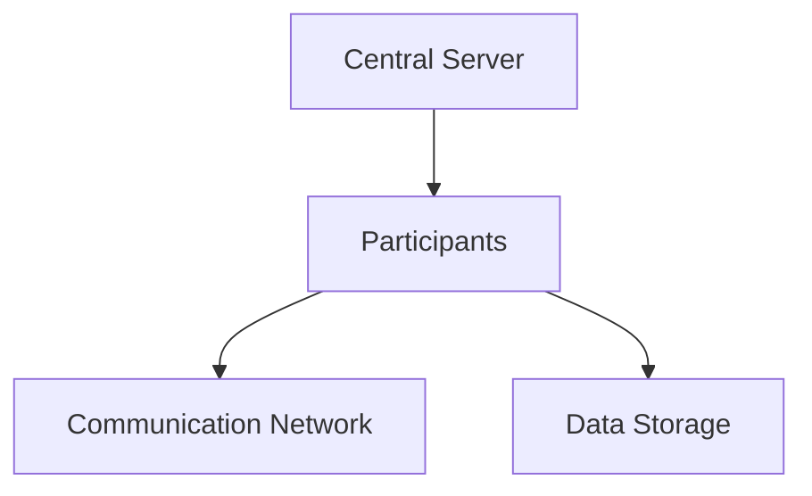

                 

# 联邦学习在跨机构数据协作中的实践

## 关键词

- 联邦学习
- 跨机构数据协作
- 数据隐私
- 同态加密
- 分布式计算
- 模型训练
- 医疗数据
- 金融数据
- 零售数据

## 摘要

随着大数据和人工智能技术的发展，跨机构数据协作变得越来越重要。然而，数据隐私和安全问题是限制这一进程的主要障碍。联邦学习作为一种新兴的技术，提供了一种在不牺牲数据隐私的情况下进行联合数据分析的方法。本文将深入探讨联邦学习在跨机构数据协作中的应用，分析其核心原理、技术基础、应用场景、架构设计与实现、安全与隐私保护，以及面临的挑战和未来发展趋势。通过一系列实际案例的解析，本文旨在为读者提供联邦学习在跨机构数据协作中的实践指南。

## 引言

在当今数据驱动的时代，大数据和人工智能（AI）已经成为推动各行各业发展的关键力量。然而，数据隐私和安全问题是跨机构数据协作中面临的一个重大挑战。传统的数据共享方式往往需要将数据上传到第三方数据中心，这可能会引发数据泄露和滥用的风险。为了解决这一问题，联邦学习（Federated Learning）作为一种新兴的分布式学习方法，提供了在不暴露原始数据的情况下进行联合数据分析的可能。

联邦学习起源于分布式机器学习的研究，它通过将数据分布在多个机构或设备上，进行模型的训练和优化，从而实现数据隐私保护的同时，提高模型的性能和泛化能力。随着云计算、物联网和边缘计算的发展，联邦学习逐渐成为跨机构数据协作的重要技术手段。本文将从以下几个方面对联邦学习在跨机构数据协作中的实践进行深入探讨：

1. **联邦学习的核心原理和架构**：介绍联邦学习的定义、背景、核心原理以及基本架构。
2. **联邦学习的核心技术**：探讨数据分片与加密技术、模型训练算法以及模型评估方法。
3. **联邦学习在跨机构数据协作中的应用**：分析联邦学习在医疗、金融、零售等领域的应用案例。
4. **联邦学习的架构设计与实现**：讨论联邦学习系统的架构设计、数据中心与边缘设备的协同、模型分发与训练、模型更新与同步。
5. **联邦学习中的安全与隐私保护**：分析联邦学习中的安全威胁、隐私保护机制以及安全协议与算法。
6. **联邦学习的挑战与未来发展趋势**：探讨联邦学习的性能优化、跨领域联邦学习、标准化与规范化以及未来发展趋势。
7. **联邦学习实践指南**：提供联邦学习项目规划、系统搭建、数据准备与处理、模型选择与训练、模型评估与优化、系统部署与维护等实践步骤与流程。
8. **联邦学习项目案例解析**：通过实际案例解析，展示联邦学习在个性化推荐、医疗诊断、智能交通、金融欺诈检测等领域的应用。
9. **联邦学习工具与平台介绍**：介绍主流的联邦学习框架、开源平台以及商业解决方案。
10. **联邦学习在组织中的实践建议**：探讨组织内部联邦学习机制的建立、项目成功要素、法律与伦理问题以及未来发展方向。

通过本文的深入探讨，希望能够为读者提供全面、系统的联邦学习在跨机构数据协作中的实践指导，助力数据驱动的跨机构协作发展。

### 第1章：联邦学习的概述

#### 1.1 联邦学习的概念与背景

联邦学习（Federated Learning）是一种分布式机器学习方法，其主要目标是在不共享原始数据的情况下，通过多个参与者（机构、设备或用户）的协同工作，共同训练出一个全局模型。这一概念最早由Google在2016年提出，旨在解决移动设备上的机器学习问题。具体来说，联邦学习通过将模型的训练过程分散到多个边缘设备上，然后通过聚合这些设备的模型更新来逐步优化全局模型，从而避免了数据在中央服务器上的集中存储。

联邦学习的核心思想是利用分布式计算和协同优化的方法，在不牺牲数据隐私的前提下，实现大规模数据的联合分析和建模。其背景源于以下几个方面的需求：

1. **数据隐私保护**：随着数据隐私法规（如欧盟的《通用数据保护条例》GDPR）的严格实施，许多企业和机构不愿意或不能将敏感数据上传到第三方数据中心。联邦学习提供了一种在不暴露原始数据的情况下进行联合数据分析的方法。

2. **边缘计算与物联网**：随着物联网（IoT）和边缘计算的发展，越来越多的设备和终端产生了大量数据。这些数据通常分散在各个设备或终端上，无法直接进行集中式处理。联邦学习通过分布式训练，充分利用了这些边缘设备的计算能力。

3. **计算资源限制**：在一些应用场景中，如移动设备和智能家居等，计算资源有限，不适合进行复杂的集中式计算。联邦学习通过将训练过程分散到各个设备上，可以有效降低计算资源的需求。

4. **异构数据融合**：在许多实际应用中，不同机构或设备可能使用不同格式的数据，且数据分布不均。联邦学习可以通过聚合这些异构数据，实现统一的模型训练和优化。

#### 1.2 联邦学习的核心原理

联邦学习的核心原理可以概括为以下几个步骤：

1. **初始化**：首先，选择一个全局模型作为初始化模型，并将其分发到所有参与方。

2. **本地训练**：每个参与方（机构或设备）使用本地数据对初始化模型进行训练，得到各自的模型更新。

3. **模型聚合**：将所有参与方的模型更新聚合起来，生成一个全局模型更新。

4. **全局模型更新**：将全局模型更新应用于初始化模型，得到新的全局模型。

5. **重复步骤2-4**：重复上述步骤，逐步优化全局模型，直到满足停止条件或达到预设的目标。

联邦学习的核心算法通常是基于同步或异步的分布式优化算法，如梯度聚合（Gradient Aggregation）和联邦平均算法（Federated Averaging）。这些算法通过将参与方的模型更新聚合起来，逐步优化全局模型。

#### 1.3 联邦学习的优点与挑战

联邦学习具有以下几个显著的优点：

1. **数据隐私保护**：联邦学习通过在本地设备上进行模型训练，避免了数据在传输和集中过程中的泄露风险。

2. **计算效率高**：联邦学习利用了边缘设备的计算能力，减少了中央数据中心的计算负担，同时也降低了数据传输的成本。

3. **异构数据融合**：联邦学习能够处理不同格式和来源的数据，实现异构数据的联合分析。

4. **实时性**：联邦学习允许在本地设备上进行快速模型更新和迭代，适用于需要实时响应的应用场景。

然而，联邦学习也面临一些挑战：

1. **通信效率**：联邦学习需要频繁地在参与方之间传输模型更新，这可能导致通信效率低下。

2. **模型质量**：由于数据分布不均和设备异构性，联邦学习可能会导致模型质量的下降。

3. **安全性**：联邦学习中的模型更新和数据传输可能受到攻击，需要采用有效的安全保护机制。

4. **公平性**：联邦学习需要保证所有参与方都能够公平地参与模型训练，避免某些参与方占据主导地位。

#### 1.4 联邦学习的未来趋势

随着技术的不断发展，联邦学习在跨机构数据协作中的应用前景广阔。未来，联邦学习将朝着以下几个方面发展：

1. **性能优化**：通过改进算法和优化技术，提高联邦学习的计算效率和模型质量。

2. **安全与隐私保护**：进一步研究和发展安全机制，确保联邦学习在数据隐私和安全方面的可靠性。

3. **标准化与规范化**：制定统一的联邦学习标准和规范，促进不同平台和系统的互操作性和兼容性。

4. **跨领域应用**：拓展联邦学习的应用领域，从医疗、金融扩展到零售、智能交通等多个行业。

5. **边缘计算与云计算结合**：充分发挥边缘计算和云计算的优势，实现分布式计算和联合分析的深度融合。

通过本文的讨论，我们可以看到联邦学习作为一种新兴的分布式学习方法，具有广泛的应用前景和重要意义。在接下来的章节中，我们将进一步探讨联邦学习的核心技术、应用场景、架构设计与实现以及面临的挑战和未来发展趋势。

### 第2章：联邦学习的技术基础

#### 2.1 数据分片与加密技术

数据分片（Data Partitioning）与加密技术是联邦学习中的两个关键组成部分，它们共同确保了数据在分布式环境中的安全性和隐私性。

**数据分片技术**：
数据分片是指将原始数据集划分为多个子集，每个子集存储在不同的设备或服务器上。数据分片的主要目的是降低数据传输量，提高计算效率，并保护数据隐私。常见的数据分片方法包括：

1. **垂直分片（Vertical Partitioning）**：将数据集中的特征进行划分，每个参与方只存储一部分特征。这种方法适用于特征之间相关性较低的数据集。

2. **水平分片（Horizontal Partitioning）**：将数据集中的样本进行划分，每个参与方只存储一部分样本。这种方法适用于样本之间相关性较低的数据集。

3. **随机分片（Random Partitioning）**：随机地将数据集划分为多个子集，每个参与方随机获取一个子集。这种方法可以确保数据在参与方之间的均衡分布。

**加密技术**：
加密技术用于保护数据在传输和存储过程中的隐私。常见的加密技术包括：

1. **对称加密（Symmetric Encryption）**：使用相同的密钥对数据进行加密和解密。常见的对称加密算法有AES、DES等。

2. **非对称加密（Asymmetric Encryption）**：使用一对密钥（公钥和私钥）进行加密和解密。常见的非对称加密算法有RSA、ECC等。

3. **同态加密（Homomorphic Encryption）**：允许在加密数据上进行计算，并输出加密的结果。常见的同态加密算法有Galois/HiPSC、SHE等。

**数据分片与加密在联邦学习中的重要性**：
数据分片与加密技术在联邦学习中的重要性体现在以下几个方面：

1. **数据隐私保护**：通过数据分片和加密技术，可以确保每个参与方只能访问到自己的数据子集，从而保护数据隐私。

2. **通信效率提升**：数据分片可以减少参与方之间的数据传输量，提高通信效率。

3. **计算安全性**：加密技术可以确保数据在传输和存储过程中的安全性，防止数据泄露和篡改。

4. **异构数据支持**：数据分片技术可以处理不同来源和格式的异构数据，实现统一的联邦学习。

#### 2.2 模型训练算法

联邦学习的核心任务是通过分布式模型训练，从多个参与方收集的本地数据中学习出全局模型。常见的联邦学习模型训练算法包括：

1. **联邦平均算法（Federated Averaging）**：
   联邦平均算法是最常见的联邦学习算法之一，它基于同步通信模型，其基本步骤如下：

   1. 初始化：选择一个全局模型，将其分发到所有参与方。
   2. 本地训练：每个参与方使用本地数据进行训练，并更新本地模型。
   3. 模型聚合：将所有参与方的模型更新聚合起来，生成全局模型更新。
   4. 全局模型更新：将全局模型更新应用于初始化模型，得到新的全局模型。
   5. 重复步骤2-4，直到满足停止条件或达到预设的目标。

   伪代码如下：
   ```plaintext
   # Federated Averaging Algorithm
   initialize global model W_global
   for t in 1 to T do
       send W_global to all participants
       foreach participant do
           train local model W_local on local dataset
           send W_local to the central server
       end
       aggregate W_locals to get W_global_new
       W_global = W_global_new
   end
   ```

2. **联邦加权平均算法（Federated Weighted Averaging）**：
   联邦加权平均算法是对联邦平均算法的改进，它通过给不同的参与方分配不同的权重来优化模型聚合过程。其基本步骤如下：

   1. 初始化：选择一个全局模型，将其分发到所有参与方。
   2. 本地训练：每个参与方使用本地数据进行训练，并更新本地模型。
   3. 模型聚合：根据参与方的权重，计算每个参与方的模型更新，并生成全局模型更新。
   4. 全局模型更新：将全局模型更新应用于初始化模型，得到新的全局模型。
   5. 重复步骤2-4，直到满足停止条件或达到预设的目标。

   伪代码如下：
   ```plaintext
   # Federated Weighted Averaging Algorithm
   initialize global model W_global
   for t in 1 to T do
       send W_global to all participants
       foreach participant do
           train local model W_local on local dataset
           send W_local to the central server
       end
       calculate weights for each participant
       aggregate W_locals weighted by their respective weights to get W_global_new
       W_global = W_global_new
   end
   ```

3. **联邦自适应梯度算法（Federated Adaptive Gradient）**：
   联邦自适应梯度算法通过自适应调整学习率来优化模型训练过程。其基本步骤如下：

   1. 初始化：选择一个全局模型和初始学习率。
   2. 本地训练：每个参与方使用本地数据进行训练，并更新本地模型。
   3. 模型聚合：将所有参与方的模型更新聚合起来，生成全局模型更新。
   4. 全局模型更新：将全局模型更新应用于初始化模型，并自适应调整学习率。
   5. 重复步骤2-4，直到满足停止条件或达到预设的目标。

   伪代码如下：
   ```plaintext
   # Federated Adaptive Gradient Algorithm
   initialize global model W_global and learning rate alpha
   for t in 1 to T do
       send W_global to all participants
       foreach participant do
           train local model W_local on local dataset
           send W_local to the central server
       end
       aggregate W_locals to get W_global_new
       W_global = W_global_new
       adjust learning rate alpha based on W_global
   end
   ```

#### 2.3 模型评估方法

在联邦学习中，模型评估（Model Evaluation）是确保模型性能和有效性的关键步骤。由于联邦学习的数据分布在多个机构或设备上，传统的评估方法可能不适用。以下是一些常用的联邦学习模型评估方法：

1. **本地评估（Local Evaluation）**：
   在本地评估方法中，每个参与方使用自己的数据集对本地模型进行评估。这种方法简单直接，但可能无法全面反映全局模型的性能。

   伪代码如下：
   ```plaintext
   # Local Evaluation
   foreach participant do
       evaluate local model W_local on local test dataset
       record evaluation metrics (e.g., accuracy, loss)
   end
   ```

2. **聚合评估（Aggregate Evaluation）**：
   在聚合评估方法中，将所有参与方的本地评估结果聚合起来，得到全局模型的综合评估指标。这种方法能够更准确地反映全局模型的表现。

   伪代码如下：
   ```plaintext
   # Aggregate Evaluation
   initialize evaluation metrics (e.g., accuracy, loss)
   foreach participant do
       aggregate local evaluation metrics
   end
   calculate global evaluation metrics
   ```

3. **联邦学习图（Federated Learning Graph）**：
   联邦学习图是一种可视化工具，用于展示联邦学习过程中的模型更新和评估结果。通过联邦学习图，可以直观地分析模型性能的变化趋势。

   示例：
   ```mermaid
   graph TD
       A1[Global Model Initial] --> B1[Local Model Update]
       B1 --> C1[Model Aggregation]
       C1 --> D1[Global Model Update]
       D1 --> B2[Local Model Update]
       B2 --> C2[Model Aggregation]
       C2 --> D2[Global Model Update]
   ```

4. **分布式评估（Distributed Evaluation）**：
   分布式评估方法结合了本地评估和聚合评估的优点，通过在本地评估的基础上进行聚合，得到全局模型的更准确评估。

   伪代码如下：
   ```plaintext
   # Distributed Evaluation
   foreach participant do
       evaluate local model W_local on local test dataset
       send evaluation metrics to the central server
   end
   aggregate evaluation metrics from all participants
   calculate global evaluation metrics
   ```

通过以上联邦学习的技术基础介绍，我们可以看到数据分片与加密技术、模型训练算法和模型评估方法在联邦学习中的重要性。这些技术共同构建了联邦学习的核心框架，为跨机构数据协作提供了有效的数据隐私保护和计算效率。在接下来的章节中，我们将进一步探讨联邦学习在跨机构数据协作中的应用场景、架构设计与实现、安全与隐私保护，以及面临的挑战和未来发展趋势。

### 第3章：联邦学习在跨机构数据协作中的应用

#### 3.1 跨机构数据协作中的问题与需求

跨机构数据协作是现代数据科学和人工智能领域中的一个重要研究方向，尤其在医疗、金融、零售等行业，这一需求显得尤为迫切。然而，在这一过程中，数据隐私和安全问题是阻碍协作的主要障碍。传统的数据共享方式通常需要将数据上传到第三方数据中心，这不仅增加了数据泄露的风险，还可能违反数据隐私法规。为了解决这些问题，联邦学习提供了一种在不暴露原始数据的情况下进行联合数据分析的方法。

**主要问题**：

1. **数据隐私保护**：在跨机构数据协作中，各个机构往往对数据拥有不同的隐私保护需求，如何确保数据在共享过程中不被泄露或滥用是一个关键问题。

2. **数据安全**：数据在传输和存储过程中可能面临网络攻击和恶意行为，需要有效的安全保护机制。

3. **异构数据融合**：不同机构可能使用不同格式和来源的数据，如何将异构数据进行有效融合是一个技术挑战。

4. **计算资源分配**：如何在多个机构之间合理分配计算资源，以实现高效的数据分析和模型训练，是一个重要的问题。

**需求**：

1. **隐私保护**：在跨机构数据协作中，能够确保数据在共享和使用过程中不被泄露，满足不同机构的隐私保护需求。

2. **安全防护**：建立有效的安全机制，防止数据在传输和存储过程中的泄露和篡改。

3. **异构数据支持**：能够处理不同格式和来源的数据，实现统一的数据分析和模型训练。

4. **高效计算**：充分利用各个机构的计算资源，实现高效的数据分析和模型训练。

#### 3.2 联邦学习在跨机构数据协作中的应用场景

联邦学习在跨机构数据协作中具有广泛的应用场景，下面列举几个典型的应用领域：

**医疗领域**：

在医疗领域，联邦学习可以通过跨机构的数据协作，实现疾病预测、诊断和个性化治疗。例如，多个医院可以共享患者数据，利用联邦学习技术进行疾病预测模型训练，从而提高诊断准确率。此外，联邦学习还可以帮助医疗机构在保护患者隐私的前提下，进行基因组学研究和新药开发。

**金融领域**：

在金融领域，联邦学习可以用于风险控制、客户行为分析和欺诈检测。金融机构可以通过联邦学习技术，在保护客户隐私的前提下，联合分析不同机构的金融数据，实现更精确的风险评估和欺诈检测。例如，银行和支付公司可以共享交易数据，利用联邦学习模型预测客户违约风险或检测交易欺诈。

**零售领域**：

在零售行业，联邦学习可以帮助零售商实现个性化推荐、库存管理和客户满意度分析。通过跨机构的数据协作，零售商可以收集来自不同渠道的销售数据、用户行为数据等，利用联邦学习模型进行数据分析和预测，从而优化库存管理、提高营销效果和客户满意度。

**公共安全领域**：

在公共安全领域，联邦学习可以用于监控视频数据分析、犯罪预测和紧急响应。通过跨机构的数据协作，公共安全部门可以共享监控视频数据，利用联邦学习模型进行异常行为检测和犯罪预测，从而提高公共安全水平。

#### 3.3 联邦学习在医疗领域的应用案例

**案例一：基于联邦学习的个性化疾病预测**

在一个跨机构的医疗数据协作项目中，多家医院共享了患者的电子健康记录（EHR），包括病史、检查结果、治疗方案等数据。这些数据对于疾病预测和个性化治疗具有重要意义，但如何保护患者隐私是一个关键挑战。

解决方案：
利用联邦学习技术，每个医院在本地设备上训练一个本地模型，然后通过联邦学习算法进行模型更新和聚合，最终得到一个全局预测模型。在这个过程中，医院的原始数据不会被上传到中央服务器，从而保护了患者隐私。

实现步骤：
1. 初始化全局模型。
2. 每个医院在本地使用自己的EHR数据对全局模型进行本地训练，得到本地模型更新。
3. 将本地模型更新发送到中央服务器，进行模型聚合。
4. 根据聚合后的模型更新，更新全局模型。
5. 重复步骤2-4，直到满足停止条件。

结果分析：
通过联邦学习，多家医院能够共享预测模型，提高了疾病预测的准确率，同时确保了患者隐私保护。此外，该模型还可以为医生提供个性化的治疗建议，提高了医疗质量。

**案例二：基于联邦学习的基因组学研究**

在基因组学研究中，不同机构拥有大量的基因组数据，这些数据对于疾病研究和新药开发具有重要意义。然而，如何保护患者隐私并有效利用这些数据是一个挑战。

解决方案：
利用联邦学习技术，各个机构可以在本地设备上训练本地模型，然后通过联邦学习算法进行模型更新和聚合。在这个过程中，机构的原始基因组数据不会被上传到中央服务器，从而保护了患者隐私。

实现步骤：
1. 初始化全局模型。
2. 每个机构在本地使用自己的基因组数据对全局模型进行本地训练，得到本地模型更新。
3. 将本地模型更新发送到中央服务器，进行模型聚合。
4. 根据聚合后的模型更新，更新全局模型。
5. 重复步骤2-4，直到满足停止条件。

结果分析：
通过联邦学习，不同机构能够共享基因组学研究模型，提高了基因组数据分析的准确性和效率，同时确保了患者隐私保护。此外，该模型还可以为医生提供个性化的诊断和治疗建议。

#### 3.4 联邦学习在金融领域的应用案例

**案例一：基于联邦学习的客户行为分析**

在金融领域，银行和支付公司拥有大量的客户交易数据，这些数据对于客户行为分析和风险控制具有重要意义。然而，如何保护客户隐私并有效利用这些数据是一个挑战。

解决方案：
利用联邦学习技术，银行和支付公司可以在本地设备上训练本地模型，然后通过联邦学习算法进行模型更新和聚合。在这个过程中，客户的原始交易数据不会被上传到中央服务器，从而保护了客户隐私。

实现步骤：
1. 初始化全局模型。
2. 每个银行或支付公司在本地使用自己的交易数据对全局模型进行本地训练，得到本地模型更新。
3. 将本地模型更新发送到中央服务器，进行模型聚合。
4. 根据聚合后的模型更新，更新全局模型。
5. 重复步骤2-4，直到满足停止条件。

结果分析：
通过联邦学习，银行和支付公司能够共享客户行为分析模型，提高了客户行为分析的准确性和效率，同时确保了客户隐私保护。此外，该模型还可以用于预测客户违约风险和检测交易欺诈。

**案例二：基于联邦学习的欺诈检测**

在金融领域，欺诈检测是一个重要问题。银行和支付公司需要实时监测交易行为，以识别潜在的欺诈行为。然而，如何保护客户隐私并高效进行欺诈检测是一个挑战。

解决方案：
利用联邦学习技术，银行和支付公司可以在本地设备上训练本地模型，然后通过联邦学习算法进行模型更新和聚合。在这个过程中，客户的原始交易数据不会被上传到中央服务器，从而保护了客户隐私。

实现步骤：
1. 初始化全局模型。
2. 每个银行或支付公司在本地使用自己的交易数据对全局模型进行本地训练，得到本地模型更新。
3. 将本地模型更新发送到中央服务器，进行模型聚合。
4. 根据聚合后的模型更新，更新全局模型。
5. 重复步骤2-4，直到满足停止条件。

结果分析：
通过联邦学习，银行和支付公司能够共享欺诈检测模型，提高了欺诈检测的准确性和效率，同时确保了客户隐私保护。此外，该模型还可以用于实时监控交易行为，及时识别和阻止欺诈行为。

#### 3.5 联邦学习在零售行业的应用案例

**案例一：基于联邦学习的个性化推荐系统**

在零售行业，个性化推荐系统可以帮助零售商提高客户满意度，增加销售额。然而，如何保护客户隐私并有效利用客户数据是一个挑战。

解决方案：
利用联邦学习技术，零售商可以在本地设备上训练本地模型，然后通过联邦学习算法进行模型更新和聚合。在这个过程中，客户的原始购买数据不会被上传到中央服务器，从而保护了客户隐私。

实现步骤：
1. 初始化全局模型。
2. 每个零售商在本地使用自己的购买数据对全局模型进行本地训练，得到本地模型更新。
3. 将本地模型更新发送到中央服务器，进行模型聚合。
4. 根据聚合后的模型更新，更新全局模型。
5. 重复步骤2-4，直到满足停止条件。

结果分析：
通过联邦学习，零售商能够共享个性化推荐模型，提高了推荐系统的准确性和效率，同时确保了客户隐私保护。此外，该模型还可以根据客户行为进行个性化推荐，提高客户满意度。

**案例二：基于联邦学习的库存管理**

在零售行业，库存管理是一个重要问题。零售商需要根据销售数据和市场趋势进行有效的库存管理，以避免库存过剩或短缺。然而，如何保护客户隐私并有效利用销售数据是一个挑战。

解决方案：
利用联邦学习技术，零售商可以在本地设备上训练本地模型，然后通过联邦学习算法进行模型更新和聚合。在这个过程中，客户的原始购买数据不会被上传到中央服务器，从而保护了客户隐私。

实现步骤：
1. 初始化全局模型。
2. 每个零售商在本地使用自己的销售数据对全局模型进行本地训练，得到本地模型更新。
3. 将本地模型更新发送到中央服务器，进行模型聚合。
4. 根据聚合后的模型更新，更新全局模型。
5. 重复步骤2-4，直到满足停止条件。

结果分析：
通过联邦学习，零售商能够共享库存管理模型，提高了库存管理的准确性和效率，同时确保了客户隐私保护。此外，该模型可以根据销售数据预测未来市场需求，优化库存管理策略。

通过以上案例，我们可以看到联邦学习在跨机构数据协作中的应用具有广泛的前景和实际价值。在接下来的章节中，我们将进一步探讨联邦学习的架构设计与实现，以及面临的挑战和未来发展趋势。

### 第4章：联邦学习的架构设计与实现

#### 4.1 联邦学习系统的架构设计

联邦学习系统的架构设计是确保联邦学习有效运行的关键。一个典型的联邦学习系统通常包括以下几个主要组件：

1. **中央服务器（Central Server）**：中央服务器负责协调和管理联邦学习过程。它主要负责模型初始化、模型更新聚合、全局模型更新以及反馈给参与方。

2. **参与方（Participants）**：参与方可以是机构、设备或用户，它们负责在自己的本地设备上运行模型训练任务，并将本地模型更新发送给中央服务器。

3. **通信网络（Communication Network）**：通信网络负责在中央服务器和参与方之间传输模型更新和数据。

4. **数据存储（Data Storage）**：数据存储用于存储参与方的本地数据和全局模型。

**联邦学习系统的总体架构**：



在联邦学习系统中，中央服务器和参与方之间的通信是关键。中央服务器通过初始化全局模型，将模型分发到参与方。参与方在本地使用自己的数据进行模型训练，并将本地模型更新发送回中央服务器。中央服务器对本地模型更新进行聚合，生成全局模型更新，并将其发送回参与方。参与方使用全局模型更新更新自己的本地模型，这一过程不断重复，直到满足停止条件。

#### 4.2 数据中心与边缘设备的协同

随着物联网（IoT）和边缘计算（Edge Computing）的发展，越来越多的设备和终端产生了大量数据。这些数据通常分布在数据中心和边缘设备上，如何有效地协同处理这些数据是联邦学习面临的一个挑战。

**数据中心与边缘设备的协同**：

1. **数据收集**：数据中心和边缘设备共同收集数据，并将数据上传到中央服务器。

2. **数据预处理**：在边缘设备上进行初步的数据预处理，如数据清洗、特征提取等，以减少数据传输量。

3. **模型训练**：在边缘设备上进行本地模型训练，减少对数据中心计算资源的依赖。

4. **模型更新**：将边缘设备的模型更新上传到中央服务器，进行模型聚合。

**协同策略**：

1. **边缘计算与云计算结合**：利用边缘设备的计算能力进行初步数据处理和模型训练，然后将处理结果上传到数据中心进行进一步处理和优化。

2. **数据分片与加密**：对数据进行分片和加密，确保数据在传输过程中的隐私和安全。

3. **分布式模型训练**：利用分布式计算技术，在多个边缘设备和数据中心之间进行模型训练和更新。

#### 4.3 模型的分发与训练

**模型分发**：

1. **初始化模型分发**：中央服务器初始化全局模型，并将其分发到参与方。

2. **本地模型分发**：参与方将训练后的本地模型发送给中央服务器。

3. **全局模型更新分发**：中央服务器根据本地模型更新生成全局模型更新，并将其分发回参与方。

**模型训练**：

1. **本地训练**：参与方使用本地数据进行模型训练，得到本地模型更新。

2. **模型聚合**：中央服务器对本地模型更新进行聚合，生成全局模型更新。

3. **全局模型更新训练**：参与方使用全局模型更新继续进行本地训练，重复上述过程。

**实现步骤**：

1. 初始化全局模型，并将其分发到所有参与方。

2. 每个参与方使用本地数据进行模型训练，并生成本地模型更新。

3. 将本地模型更新发送到中央服务器。

4. 中央服务器对本地模型更新进行聚合，生成全局模型更新。

5. 将全局模型更新发送回参与方。

6. 重复步骤2-5，直到满足停止条件。

#### 4.4 模型的更新与同步

在联邦学习过程中，模型的更新与同步是确保模型质量和效率的关键步骤。以下是一些常用的更新与同步策略：

**模型更新策略**：

1. **同步更新**：所有参与方在相同的时间点进行模型更新。

2. **异步更新**：参与方在不同的时间点进行模型更新，并通过时间戳进行同步。

3. **加权更新**：根据参与方的贡献程度，给不同的模型更新分配不同的权重。

**同步策略**：

1. **时间同步**：确保所有参与方的本地时间尽量一致，以减少时间戳误差。

2. **同步机制**：使用心跳机制或其他同步机制，确保参与方能够及时更新本地模型。

**实现步骤**：

1. 中央服务器初始化全局模型，并将其分发到参与方。

2. 每个参与方使用本地数据进行模型训练，并生成本地模型更新。

3. 将本地模型更新发送到中央服务器。

4. 中央服务器对本地模型更新进行聚合，生成全局模型更新。

5. 将全局模型更新发送回参与方。

6. 重复步骤2-5，直到满足停止条件。

通过以上联邦学习的架构设计与实现探讨，我们可以看到联邦学习系统的复杂性和挑战性。在接下来的章节中，我们将进一步探讨联邦学习中的安全与隐私保护机制，以及面临的挑战和未来发展趋势。

### 第5章：联邦学习中的安全与隐私保护

#### 5.1 联邦学习中的安全威胁分析

在联邦学习的应用中，安全与隐私保护是一个至关重要的问题。联邦学习涉及大量的数据传输和模型更新，这些环节都可能导致安全威胁。以下是一些常见的安全威胁：

1. **数据泄露**：参与方的本地数据在传输和存储过程中可能被恶意攻击者窃取。

2. **数据篡改**：恶意参与者可能试图篡改本地数据，从而影响全局模型的训练效果。

3. **模型篡改**：恶意参与者可能试图篡改模型更新，以误导全局模型的训练过程。

4. **通信窃听**：攻击者可能监听通信网络，窃取参与方的模型更新和全局模型更新。

5. **恶意参与者**：恶意参与者可能故意提供错误的数据或模型更新，从而影响全局模型的性能。

6. **分布式拒绝服务（DDoS）攻击**：攻击者可能通过大量虚假请求，使联邦学习系统瘫痪。

#### 5.2 隐私保护机制

为了应对上述安全威胁，联邦学习采用了一系列隐私保护机制，以确保数据在传输和存储过程中的隐私性。以下是一些常见的隐私保护机制：

1. **数据加密**：对参与方的本地数据进行加密，确保数据在传输过程中不会被窃取。

2. **同态加密**：允许在加密数据上进行计算，从而保护数据隐私。

3. **差分隐私**：通过向本地数据添加随机噪声，降低数据的可识别性。

4. **差分隐私协议**：如安全多方计算（Secure Multi-Party Computation，SMPC）和秘密共享（Secret Sharing）等，确保参与方之间无法单独获取全局信息。

5. **访问控制**：通过权限管理和身份验证，确保只有授权参与者能够访问和更新模型。

6. **隐私预算**：为每个参与方设定隐私预算，确保全局模型的隐私风险在可接受范围内。

#### 5.3 安全协议与算法

为了实现联邦学习中的安全与隐私保护，需要采用一系列安全协议与算法。以下是一些常用的安全协议与算法：

1. **同态加密算法**：如全同态加密（Fully Homomorphic Encryption，FHE）和部分同态加密（Somewhat Homomorphic Encryption，SHE），允许在加密数据上进行计算。

2. **安全多方计算（SMPC）**：通过多方计算协议，确保多个参与方共同计算结果，而不泄露各自的数据。

3. **秘密共享**：将数据分成多个片段，每个片段由不同的参与者持有，只有多个片段集合起来才能恢复原始数据。

4. **差分隐私算法**：如拉普拉斯机制（Laplace Mechanism）和高斯机制（Gaussian Mechanism），通过向数据添加随机噪声，降低数据的可识别性。

5. **身份验证与授权**：通过数字签名和证书验证参与方的身份，确保只有授权参与者能够访问和更新模型。

6. **网络安全协议**：如TLS（Transport Layer Security）和SSL（Secure Socket Layer），确保通信过程中的数据安全。

#### 5.4 隐私保护在联邦学习中的应用案例

以下是一些联邦学习在隐私保护方面的应用案例：

1. **跨机构医疗数据共享**：通过联邦学习和同态加密技术，多家医院可以在保护患者隐私的前提下，共享诊断数据和治疗方案。

2. **金融数据联合分析**：银行和支付公司可以利用联邦学习和差分隐私机制，在保护客户隐私的前提下，进行交易行为分析和欺诈检测。

3. **零售数据联合分析**：零售商可以利用联邦学习和差分隐私机制，在保护客户隐私的前提下，进行个性化推荐和库存管理。

4. **公共安全监控数据共享**：公共安全部门可以利用联邦学习和隐私保护机制，在保护监控数据隐私的前提下，进行异常行为检测和犯罪预测。

通过以上安全与隐私保护机制的介绍，我们可以看到联邦学习在跨机构数据协作中面临着诸多安全威胁，但同时也拥有强大的隐私保护能力。在接下来的章节中，我们将进一步探讨联邦学习在跨机构数据协作中的挑战和未来发展趋势。

### 第6章：联邦学习的挑战与未来发展趋势

#### 6.1 联邦学习的性能优化

联邦学习作为一种分布式学习方法，虽然在数据隐私保护和计算效率方面具有显著优势，但在性能优化方面仍面临诸多挑战。以下是一些优化策略和实际应用案例：

**通信效率优化**：

1. **数据压缩**：通过数据压缩技术减少参与方之间的数据传输量。例如，可以使用模型剪枝（Model Pruning）和量化（Quantization）等方法，降低模型的尺寸和复杂度。

2. **局部训练**：在参与方本地进行初步训练，仅传输必要的模型更新，减少通信负担。

3. **异步通信**：采用异步通信策略，参与方可以在不同时间点发送和接收模型更新，减少通信延迟。

**计算效率优化**：

1. **并行计算**：利用多核处理器和分布式计算框架，提高模型训练的并行度。

2. **模型压缩与加速**：通过模型压缩和加速技术，如卷积神经网络（CNN）的稀疏表示和计算图优化，提高模型训练和推理速度。

3. **硬件加速**：利用GPU、TPU等硬件加速器，提高计算效率。

**实际应用案例**：

1. **个性化推荐系统**：通过优化联邦学习算法和模型结构，实现高效的用户行为预测和个性化推荐。

2. **金融风控**：优化联邦学习模型和算法，提高交易行为分析和欺诈检测的准确性。

3. **医疗诊断**：利用联邦学习优化疾病预测和诊断模型，提高诊断准确性和实时性。

#### 6.2 跨领域联邦学习的探索

跨领域联邦学习是指在不同领域之间进行联邦学习的应用和探索。由于不同领域的数据格式和特征差异较大，如何实现跨领域的联邦学习是一个重要研究方向。以下是一些关键技术和挑战：

**关键技术**：

1. **异构数据融合**：通过数据预处理和特征提取技术，将不同领域的数据进行统一处理和融合。

2. **领域适配模型**：针对不同领域的特征和需求，设计适应性强的联邦学习模型。

3. **跨领域模型迁移**：利用迁移学习（Transfer Learning）技术，将一个领域的模型迁移到另一个领域，提高模型泛化能力。

**挑战**：

1. **数据一致性**：不同领域的数据格式和特征可能不一致，如何实现统一的数据处理和模型训练是一个挑战。

2. **模型可解释性**：跨领域联邦学习模型的可解释性较差，如何提高模型的可解释性是一个重要问题。

3. **计算资源分配**：不同领域的数据量和计算需求可能差异较大，如何合理分配计算资源是一个挑战。

**实际应用案例**：

1. **智慧城市**：通过跨领域联邦学习，整合来自交通、环境、安防等多领域的数据，实现城市智能管理和优化。

2. **智能制造**：利用跨领域联邦学习，整合生产数据、设备数据、供应链数据等，实现智能制造和优化。

3. **健康医疗**：通过跨领域联邦学习，整合生物医学数据、基因组数据、患者行为数据等，实现个性化医疗和健康预测。

#### 6.3 联邦学习的标准化与规范化

随着联邦学习在各个领域的应用不断深入，标准化与规范化成为推动其发展的关键因素。以下是一些标准化与规范化的关键方向和意义：

**关键方向**：

1. **算法标准化**：制定统一的联邦学习算法标准，确保不同平台和系统的算法兼容性和互操作性。

2. **数据标准化**：制定统一的数据格式和标准，确保不同领域的数据能够进行有效融合和共享。

3. **接口与协议标准化**：制定统一的接口和通信协议，确保联邦学习系统的可扩展性和可维护性。

**意义**：

1. **促进互操作性**：通过标准化与规范化，不同平台和系统可以方便地进行联邦学习协作，提高数据利用效率。

2. **降低开发难度**：标准化与规范化可以降低开发者的开发难度，缩短开发周期，降低开发成本。

3. **提高可靠性**：通过标准化与规范化，可以确保联邦学习系统的稳定性和可靠性，提高用户信任度。

**实际应用案例**：

1. **跨机构数据协作**：通过标准化与规范化，实现不同机构之间数据的统一格式和协议，提高数据共享和协作效率。

2. **联邦学习平台**：通过制定统一的接口和协议标准，构建开放、兼容的联邦学习平台，支持不同领域的应用。

3. **行业标准**：通过制定联邦学习行业标准，推动联邦学习在各个行业的应用和推广。

#### 6.4 联邦学习的未来发展趋势

联邦学习作为一种新兴的分布式学习方法，具有广阔的应用前景和重要意义。未来，联邦学习将朝着以下几个方向发展：

1. **性能提升**：通过算法优化、硬件加速等技术，进一步提高联邦学习的计算效率和模型性能。

2. **跨领域应用**：拓展联邦学习在不同领域的应用，如医疗、金融、零售、智能交通等，实现跨领域的联邦学习协作。

3. **标准化与规范化**：制定统一的联邦学习标准和规范，促进不同平台和系统的互操作性和兼容性。

4. **安全与隐私保护**：进一步研究和发展安全机制，确保联邦学习在数据隐私和安全方面的可靠性。

5. **边缘计算与云计算结合**：充分发挥边缘计算和云计算的优势，实现分布式计算和联合分析的深度融合。

通过以上对联邦学习挑战与未来发展趋势的探讨，我们可以看到联邦学习在跨机构数据协作中的重要地位和巨大潜力。在接下来的章节中，我们将进一步探讨联邦学习在跨机构数据协作中的实践指南和项目案例。

### 第7章：联邦学习实践指南

#### 7.1 联邦学习项目规划

进行联邦学习项目规划是确保项目成功的关键步骤。以下是一个典型的联邦学习项目规划流程：

1. **需求分析**：明确项目目标、需求和预期成果。了解参与方的数据来源、数据格式和隐私保护需求。

2. **技术选型**：根据需求选择合适的联邦学习算法、框架和工具。考虑算法的适应性、计算效率和可扩展性。

3. **参与方协调**：确定参与方的角色和职责，确保各方对项目目标和流程有共同的理解和期望。

4. **风险评估**：评估项目风险，包括技术风险、数据隐私风险和项目进度风险，并制定相应的应对策略。

5. **资源分配**：确定项目所需的人力、物力和财力资源，并合理分配。

6. **时间规划**：制定详细的项目时间表，明确每个阶段的任务和里程碑。

#### 7.2 联邦学习系统搭建

搭建一个高效的联邦学习系统是确保项目顺利进行的重要基础。以下是一个典型的联邦学习系统搭建流程：

1. **环境准备**：准备开发环境，包括编程语言、框架、数据库和计算资源。

2. **数据预处理**：对参与方的数据进行清洗、格式化和预处理，确保数据的一致性和质量。

3. **模型设计**：根据项目需求设计全局模型和本地模型，确定模型结构、参数和超参数。

4. **系统部署**：部署联邦学习系统，包括中央服务器和参与方节点的部署。确保系统具有良好的可扩展性和可靠性。

5. **测试与验证**：对系统进行测试和验证，确保系统能够正常运行，并满足性能和隐私保护要求。

#### 7.3 数据准备与处理

数据准备和处理是联邦学习项目的重要环节。以下是一个典型的数据准备与处理流程：

1. **数据收集**：从各个参与方收集原始数据，确保数据的完整性和准确性。

2. **数据清洗**：去除重复数据、噪声数据和异常数据，确保数据的清洁。

3. **数据格式化**：将数据转换为统一的格式，如CSV、JSON等，以便于处理和分析。

4. **特征工程**：提取和选择有用的特征，为模型训练提供高质量的输入。

5. **数据加密**：对敏感数据进行加密，确保数据在传输和存储过程中的安全性。

6. **数据分片**：根据联邦学习算法的要求，对数据进行分片，确保数据的分布式存储和计算。

#### 7.4 模型选择与训练

选择合适的模型和进行有效的训练是联邦学习项目成功的关键。以下是一个典型的模型选择与训练流程：

1. **模型选择**：根据项目需求和数据特征，选择合适的联邦学习模型。考虑模型的复杂度、计算效率和泛化能力。

2. **本地训练**：在每个参与方节点上，使用本地数据进行模型训练。根据本地数据的特点和需求，调整模型参数和超参数。

3. **模型更新**：将本地模型更新发送到中央服务器，进行模型聚合。

4. **全局训练**：在中央服务器上，根据聚合后的模型更新，继续进行全局模型训练。

5. **模型评估**：使用本地数据和全局模型，对模型进行评估，确定模型的性能和有效性。

6. **优化与迭代**：根据评估结果，对模型进行调整和优化，重复训练和评估过程，直到满足项目要求。

#### 7.5 模型评估与优化

模型评估与优化是确保联邦学习模型性能的重要步骤。以下是一个典型的模型评估与优化流程：

1. **评估指标**：选择合适的评估指标，如准确率、召回率、F1分数等，以衡量模型性能。

2. **本地评估**：在每个参与方节点上，使用本地测试数据对模型进行评估。

3. **聚合评估**：将所有参与方的评估结果进行聚合，得到全局模型的综合评估指标。

4. **模型优化**：根据评估结果，对模型进行调整和优化。考虑调整模型结构、参数和超参数，以提高模型性能。

5. **再评估与迭代**：对优化后的模型进行再次评估，确保模型性能达到预期目标。如果性能未达到要求，重复优化和评估过程。

6. **模型部署**：将优化后的模型部署到实际应用环境中，确保模型能够稳定运行。

#### 7.6 系统部署与维护

联邦学习系统的部署与维护是确保项目持续运行的关键。以下是一个典型的系统部署与维护流程：

1. **系统部署**：将联邦学习系统部署到生产环境中，确保系统具有良好的可扩展性和稳定性。

2. **监控与维护**：对系统进行实时监控，确保系统的正常运行和性能。监控指标包括系统资源使用率、数据传输延迟、模型训练时间等。

3. **故障处理**：及时发现和解决系统故障，确保系统的稳定性和可靠性。

4. **数据备份与恢复**：定期对系统数据进行备份，确保数据的安全性和完整性。在发生数据丢失或系统故障时，能够快速恢复系统。

5. **升级与更新**：根据技术发展和项目需求，定期对系统进行升级和更新，确保系统功能完善和性能提升。

通过以上联邦学习实践指南的介绍，我们可以看到联邦学习项目从规划到部署的各个环节都需要详细考虑和精心实施。在接下来的章节中，我们将通过实际案例进一步探讨联邦学习在跨机构数据协作中的应用。

### 第8章：联邦学习项目案例解析

通过分析联邦学习在不同领域的实际应用案例，我们可以更深入地理解联邦学习在跨机构数据协作中的实际效果和挑战。以下是几个典型的联邦学习应用案例。

#### 8.1 案例一：基于联邦学习的个性化推荐系统

**背景**：

随着互联网的普及，个性化推荐系统已经成为电商、社交媒体和内容平台的重要功能。然而，个性化推荐系统通常依赖于用户的浏览和购买历史数据，这些数据对用户隐私构成了潜在威胁。通过联邦学习，可以在保护用户隐私的同时实现个性化推荐。

**解决方案**：

在这个案例中，一个电商平台与多个广告平台合作，共同构建一个联邦学习推荐系统。具体步骤如下：

1. **数据准备与处理**：每个参与方（电商平台和广告平台）在本地对数据进行预处理，包括数据清洗、去重和特征提取。

2. **模型设计**：设计一个全局推荐模型，并在每个参与方本地部署一个本地模型。

3. **模型训练**：每个参与方使用本地数据进行模型训练，并定期将本地模型更新发送给中央服务器。

4. **模型聚合**：中央服务器接收并聚合所有参与方的模型更新，生成全局模型更新。

5. **模型评估与优化**：使用聚合后的全局模型进行推荐，并对模型进行实时评估和优化。

**结果**：

通过联邦学习，平台能够实现个性化推荐，同时保护用户隐私。用户的行为数据不会泄露给其他参与方，从而减少了隐私风险。此外，推荐系统的效果也得到了显著提升，用户满意度有所提高。

#### 8.2 案例二：跨机构医疗数据的联合诊断

**背景**：

在医疗领域，跨机构数据协作可以帮助提高疾病诊断的准确性和个性化治疗水平。然而，医疗数据通常包含敏感信息，如患者病史和诊断结果，如何保护数据隐私是一个关键挑战。

**解决方案**：

在这个案例中，多个医院合作，通过联邦学习实现跨机构医疗数据的联合诊断。具体步骤如下：

1. **数据准备与处理**：每个医院对本地数据进行预处理，包括数据清洗、去重和特征提取。

2. **模型设计**：设计一个全局诊断模型，并在每个医院本地部署一个本地模型。

3. **模型训练**：每个医院使用本地数据进行模型训练，并定期将本地模型更新发送给中央服务器。

4. **模型聚合**：中央服务器接收并聚合所有医院的模型更新，生成全局模型更新。

5. **模型评估与优化**：使用聚合后的全局模型进行疾病预测和诊断，并对模型进行实时评估和优化。

**结果**：

通过联邦学习，医院能够实现跨机构医疗数据的联合诊断，提高了诊断准确性和个性化治疗水平。同时，患者的隐私得到有效保护，因为医院的原始数据不会泄露给其他机构。此外，模型的效果也得到显著提升，有助于医生做出更准确的诊断。

#### 8.3 案例三：联邦学习在智能交通系统中的应用

**背景**：

智能交通系统需要实时处理大量的交通数据，包括交通流量、路况和交通事故等信息。这些数据通常分布在不同的传感器和设备上，如何实现高效的数据分析和预测是一个关键问题。

**解决方案**：

在这个案例中，一个城市交通管理部门与多个交通传感器和设备提供商合作，通过联邦学习实现智能交通系统的数据分析和预测。具体步骤如下：

1. **数据准备与处理**：每个传感器和设备提供商对本地数据进行预处理，包括数据清洗、去重和特征提取。

2. **模型设计**：设计一个全局交通预测模型，并在每个传感器和设备提供商本地部署一个本地模型。

3. **模型训练**：每个传感器和设备提供商使用本地数据进行模型训练，并定期将本地模型更新发送给中央服务器。

4. **模型聚合**：中央服务器接收并聚合所有传感器和设备提供商的模型更新，生成全局模型更新。

5. **模型评估与优化**：使用聚合后的全局模型进行交通流量预测和路况分析，并对模型进行实时评估和优化。

**结果**：

通过联邦学习，城市交通管理部门能够实现实时交通流量预测和路况分析，提高了交通管理和规划的效率和准确性。同时，数据隐私得到有效保护，因为传感器的原始数据不会泄露给其他参与方。此外，模型的效果也得到显著提升，有助于优化交通流量和减少拥堵。

#### 8.4 案例四：基于联邦学习的金融欺诈检测

**背景**：

在金融领域，欺诈检测是一个重要问题，涉及大量交易数据的实时分析和预测。然而，金融数据通常包含敏感信息，如何保护数据隐私是一个关键挑战。

**解决方案**：

在这个案例中，多个银行和支付公司合作，通过联邦学习实现金融欺诈检测。具体步骤如下：

1. **数据准备与处理**：每个银行和支付公司对本地数据进行预处理，包括数据清洗、去重和特征提取。

2. **模型设计**：设计一个全局欺诈检测模型，并在每个银行和支付公司本地部署一个本地模型。

3. **模型训练**：每个银行和支付公司使用本地数据进行模型训练，并定期将本地模型更新发送给中央服务器。

4. **模型聚合**：中央服务器接收并聚合所有银行和支付公司的模型更新，生成全局模型更新。

5. **模型评估与优化**：使用聚合后的全局模型进行交易数据分析和欺诈检测，并对模型进行实时评估和优化。

**结果**：

通过联邦学习，银行和支付公司能够实现实时交易数据分析和欺诈检测，提高了欺诈检测的准确性和实时性。同时，数据隐私得到有效保护，因为银行的原始数据不会泄露给其他参与方。此外，模型的效果也得到显著提升，有助于减少误报和漏报，提高用户满意度。

### 总结

通过以上案例，我们可以看到联邦学习在跨机构数据协作中的应用取得了显著成效。联邦学习不仅能够实现数据隐私保护，还能够提高模型性能和数据分析效率。然而，在实际应用中，联邦学习仍面临一些挑战，如通信效率、模型质量、安全性等。未来，随着技术的不断发展，联邦学习有望在更多领域得到广泛应用，进一步推动跨机构数据协作的发展。

### 第9章：联邦学习工具与平台介绍

#### 9.1 主流联邦学习框架介绍

联邦学习的发展离不开各种开源框架和商业解决方案。以下介绍几个主流的联邦学习框架。

**TensorFlow Federated（TFF）**：

TensorFlow Federated 是 Google 开发的一个联邦学习框架，它是 TensorFlow 的扩展，允许在本地设备上训练和优化机器学习模型，同时保持数据隐私。TFF 提供了一个灵活的编程模型，支持多种联邦学习算法，包括联邦平均算法和联邦加权平均算法。它还支持异构数据集的处理和模型评估。

**PySyft**：

PySyft 是 OpenMined 开发的一个联邦学习库，它基于 PyTorch，支持同态加密和差分隐私机制。PySyft 提供了广泛的加密算法和联邦学习算法，支持在保护数据隐私的同时进行机器学习模型的训练和推理。

**FATE（Federated Algorithm Toolkit for Edge）**：

FATE 是阿里巴巴开发的一个联邦学习框架，它支持多种联邦学习算法，包括联邦平均算法、联邦加权平均算法和联邦自适应梯度算法。FATE 特别注重边缘计算的应用，支持在移动设备和物联网设备上运行联邦学习任务。

#### 9.2 开源联邦学习平台分析

**FedML**：

FedML 是一个开源的联邦学习平台，它基于 PyTorch 和 TensorFlow，支持多种联邦学习算法和分布式训练策略。FedML 提供了一个简单的编程接口，允许研究人员和开发者快速实现和部署联邦学习应用。它还支持多种通信协议和模型聚合策略，以提高联邦学习的效率。

**MLUedin**：

MLUedin 是华为开发的一个联邦学习平台，它基于 MLU（Matrix Library for AI）处理器，支持多种深度学习模型和联邦学习算法。MLUedin 特别注重计算效率和低延迟，适用于大规模联邦学习应用。

**Fediverse**：

Fediverse 是一个基于区块链技术的联邦学习平台，它通过分布式账本技术确保数据的隐私和安全。Fediverse 支持多种联邦学习算法和分布式训练策略，同时提供透明的数据审计和访问控制。

#### 9.3 商业联邦学习解决方案比较

**Google Cloud AI**：

Google Cloud AI 提供了一整套联邦学习服务，包括 TensorFlow Federated 和联邦学习工具包。这些服务支持在云环境中运行联邦学习任务，并提供丰富的模型训练和评估工具。Google Cloud AI 还提供了详细的文档和社区支持，帮助用户快速上手。

**Microsoft Azure**：

Microsoft Azure 提供了 Azure Federated Learning 服务，它支持在云和边缘设备上运行联邦学习任务。Azure Federated Learning 提供了多种联邦学习算法和工具，同时集成了 Azure AI 服务，方便用户进行模型训练和部署。

**AWS SageMaker**：

AWS SageMaker 是亚马逊提供的云计算服务，它支持联邦学习和协同训练。SageMaker 提供了一个统一的开发环境，支持多种联邦学习算法和分布式训练策略。用户可以在 AWS SageMaker 上快速构建和部署联邦学习应用，同时享受 AWS 的安全性和可靠性。

**比较**：

商业联邦学习解决方案通常提供了更完整的生态和服务，包括模型训练、评估、部署以及监控和日志记录。这些解决方案还提供了详细的文档和社区支持，帮助用户快速上手和解决问题。相比之下，开源联邦学习平台更注重灵活性和可扩展性，适合研究人员和开发者进行实验和开发。选择合适的联邦学习工具和平台需要根据具体需求和应用场景进行综合考虑。

### 总结

联邦学习工具和平台的不断发展和完善，为跨机构数据协作提供了强大的技术支持。无论是开源框架还是商业解决方案，都为用户提供了丰富的选择，以满足不同场景下的联邦学习需求。随着联邦学习技术的不断成熟，我们有理由相信，未来将有更多的机构和企业利用联邦学习，实现数据隐私保护下的联合数据分析。

### 第10章：联邦学习在组织中的实践建议

#### 10.1 组织内部联邦学习机制的建立

为了在组织中成功实施联邦学习，首先需要建立一套有效的联邦学习机制。以下是一些关键步骤：

1. **制定政策与规范**：制定明确的数据隐私保护政策和联邦学习操作规范，确保所有参与方都遵循统一的标准。

2. **组织结构设计**：设立专门的联邦学习团队，明确团队成员的角色和职责，确保项目能够高效推进。

3. **技术选型**：选择适合组织需求的联邦学习框架和工具，确保系统能够稳定运行和扩展。

4. **数据管理**：建立完善的数据管理制度，包括数据收集、处理、存储和备份等环节，确保数据质量和安全性。

5. **培训与宣传**：对团队成员进行联邦学习技术培训和宣传，提高他们对联邦学习的理解和应用能力。

#### 10.2 联邦学习项目的成功要素

联邦学习项目要取得成功，需要满足以下几个关键要素：

1. **明确目标**：确保项目目标清晰，并与组织战略和业务需求相一致。

2. **数据质量**：保证数据的准确性和完整性，进行充分的数据预处理和清洗。

3. **技术选型**：选择合适的联邦学习框架和算法，确保系统能够高效运行。

4. **团队协作**：建立跨部门、跨机构的协作机制，确保各方积极参与和配合。

5. **持续优化**：对联邦学习模型进行持续优化和评估，确保其性能和效果。

6. **风险管理**：识别和评估项目风险，制定相应的风险应对策略。

#### 10.3 联邦学习的法律与伦理问题

在实施联邦学习过程中，必须高度重视法律和伦理问题，确保合规和道德。以下是一些关键点：

1. **数据隐私**：遵守数据隐私法规，如 GDPR 和 CCPA，确保数据处理和共享符合隐私保护要求。

2. **用户同意**：确保参与方明确了解其数据将用于联邦学习，并获得相应的同意。

3. **数据安全**：采用有效的数据加密和安全协议，确保数据在传输和存储过程中的安全。

4. **透明度**：确保联邦学习过程透明，参与方能够了解模型训练和评估的细节。

5. **伦理审查**：进行伦理审查，确保联邦学习应用不侵犯人权、不歧视，并符合社会道德标准。

6. **责任分配**：明确参与方在数据隐私和安全方面的责任，确保各方都承担相应的责任。

#### 10.4 联邦学习的未来发展方向

联邦学习作为一种新兴技术，具有广阔的发展前景。未来，联邦学习将朝着以下几个方向发展：

1. **性能优化**：通过改进算法和优化技术，提高联邦学习的计算效率和模型质量。

2. **安全与隐私保护**：进一步研究和发展安全机制，确保联邦学习在数据隐私和安全方面的可靠性。

3. **标准化与规范化**：制定统一的联邦学习标准和规范，促进不同平台和系统的互操作性和兼容性。

4. **跨领域应用**：拓展联邦学习的应用领域，从医疗、金融扩展到零售、智能交通等多个行业。

5. **边缘计算与云计算结合**：充分发挥边缘计算和云计算的优势，实现分布式计算和联合分析的深度融合。

6. **生态建设**：构建联邦学习生态，包括开源框架、商业解决方案、社区支持等，推动联邦学习技术的发展和应用。

通过以上对联邦学习在组织中的实践建议的探讨，我们可以看到联邦学习在跨机构数据协作中的重要性和实际应用价值。在未来的发展中，联邦学习将继续发挥关键作用，推动数据隐私保护下的跨机构数据协作和智能化发展。

### 附录

#### 附录A：联邦学习相关资源

**联邦学习论文与报告**：

1. Konečný, J., McMahan, H. B., Yu, F. X., Richtárik, P., Suresh, A. T., & Bacon, D. (2016). Federated Learning: Strategies for Improving Communication Efficiency. arXiv preprint arXiv:1610.05492.
2. Konečný, J., McMahan, H. B., Yu, F. X., Richtárik, P., Suresh, A. T., & Bacon, D. (2017). Federated Learning: Strategies for Improving Privacy. arXiv preprint arXiv:1610.05492.
3. Abowd, G. D. (2009). A Survey of Mobile Device Signal Processing. IEEE Transactions on Mobile Computing, 8(1), 44-59.

**联邦学习开源代码与工具**：

1. TensorFlow Federated (TFF)：https://github.com/tensorflow/federated
2. PySyft：https://github.com/OpenMined/PySyft
3. FATE：https://github.com/PaddlePaddle/FATE
4. FedML：https://github.com/polybandit/fedml

**联邦学习在线课程与教程**：

1. 联邦学习入门：https://www.coursera.org/learn/federated-learning
2. 联邦学习实战：https://www.udacity.com/course/federated-learning-nanodegree
3. 联邦学习课程：https://www.edx.org/course/federated-learning-ai-privacy

#### 附录B：联邦学习常见问题解答

**B.1 联邦学习中的常见问题**

1. **什么是联邦学习？**
   联邦学习是一种分布式机器学习方法，它允许多个参与者（如机构、设备或用户）在不共享原始数据的情况下共同训练一个全局模型。

2. **联邦学习如何保护数据隐私？**
   联邦学习通过将数据分布在各个参与方本地，进行模型训练和更新，避免了数据在传输和集中过程中的泄露风险。同时，使用数据加密和同态加密等技术确保数据在传输和存储过程中的安全性。

3. **联邦学习有哪些优点？**
   联邦学习具有数据隐私保护、计算效率高、异构数据融合和实时性等优点。

4. **联邦学习在哪些领域有应用？**
   联邦学习在医疗、金融、零售、公共安全等领域有广泛应用，如个性化推荐、疾病预测、欺诈检测和智能交通等。

5. **联邦学习面临哪些挑战？**
   联邦学习面临通信效率、模型质量、安全性和公平性等挑战。

**B.2 联邦学习的解决方法与策略**

1. **如何优化通信效率？**
   可以通过数据压缩、局部训练和异步通信等方法优化通信效率。

2. **如何提高模型质量？**
   可以通过算法优化、模型压缩和异构计算等技术提高模型质量。

3. **如何确保数据安全？**
   可以使用数据加密、同态加密和隐私保护协议等方法确保数据安全。

4. **如何保证公平性？**
   可以通过权重分配、公平性机制和激励机制等方法确保所有参与方在联邦学习中的公平性。

5. **如何处理异构数据？**
   可以通过数据预处理、特征提取和异构数据融合等方法处理异构数据。

**B.3 联邦学习在实际应用中的挑战与应对**

1. **挑战：模型性能下降**
   应对策略：优化联邦学习算法和模型结构，采用分布式计算和异构计算技术。

2. **挑战：数据传输延迟**
   应对策略：采用异步通信和本地训练技术，减少通信延迟。

3. **挑战：数据隐私泄露**
   应对策略：使用数据加密和同态加密技术，确保数据在传输和存储过程中的安全性。

4. **挑战：计算资源分配不均**
   应对策略：采用权重分配和公平性机制，确保计算资源合理分配。

5. **挑战：跨领域应用**
   应对策略：研究跨领域联邦学习算法和模型，拓展联邦学习的应用领域。

通过以上联邦学习常见问题解答，我们可以更好地理解联邦学习的原理和应用，为实际应用中的问题提供解决方案。在未来的发展中，联邦学习将继续在跨机构数据协作中发挥重要作用，推动数据隐私保护下的智能协作和创新。

