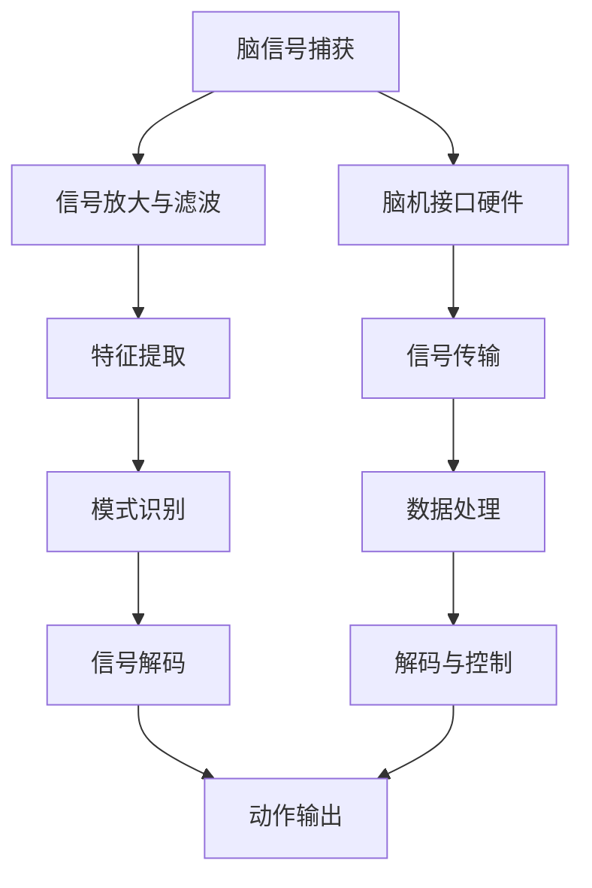

                 

# 脑机接口技术的未来：直接增强人类理解世界的能力

## 关键词
脑机接口，人机交互，认知增强，神经信号处理，未来技术

## 摘要
脑机接口（BMI）技术正逐渐成为改变人类与外界交互方式的关键力量。本文详细探讨了脑机接口技术的起源、发展、核心算法原理、应用案例及其在医疗康复、脑科学与认知研究、人机交互等领域的潜力与挑战。通过一步步的逻辑分析，本文揭示了脑机接口技术的未来发展趋势，探讨了其对人类社会的深远影响，并提出了一系列研究方向和潜在解决方案。

---

### 第一部分：脑机接口技术的起源与发展

#### 第1章：脑机接口技术概述

**1.1 核心概念与联系**

脑机接口（BMI）是一种直接连接人脑与外部设备的技术，旨在通过解读和模拟神经信号来实现人机交互。其基本原理是捕捉脑部活动产生的电信号，如脑电图（EEG）、功能性磁共振成像（fMRI）、脑磁图（MEG）等，并通过信号处理算法将神经活动转换为机器控制信号。

**1.2 脑机接口的技术架构**

脑机接口的技术架构主要包括三个关键组成部分：传感器技术、数据处理技术和信号解码与输出控制技术。

- **传感器技术**：用于捕捉脑部信号，包括脑电图（EEG）、功能性磁共振成像（fMRI）、脑磁图（MEG）等。
- **数据处理技术**：对捕获的脑部信号进行放大、滤波、特征提取和模式识别等处理。
- **信号解码与输出控制技术**：将处理后的信号解码并输出到外部设备，实现控制动作或通信。

**1.3 脑机接口的类型与应用场景**

脑机接口可以分为直接脑控制（DWC）和信号模拟接口（SI）两大类型。

- **直接脑控制（DWC）**：通过直接刺激大脑神经细胞来实现控制，适用于严重的运动功能障碍。
- **信号模拟接口（SI）**：通过模拟神经信号来控制外部设备，适用于辅助沟通、人机交互和娱乐等领域。

脑机接口的应用场景非常广泛，包括医疗康复、辅助沟通、人机交互、娱乐等多个领域。

**1.4 脑机接口技术的核心挑战与未来趋势**

脑机接口技术面临的挑战主要包括提高信号稳定性与精度、提高信号解码效率、拓展新应用领域与场景等。未来发展趋势包括进一步优化传感器技术、开发更加先进的信号处理算法、推动脑机接口技术的商业化与普及。

---

#### 第2章：脑机接口技术的核心算法原理

**2.1 信号处理算法**

信号处理算法是脑机接口技术的核心，包括信号放大、滤波、特征提取和模式识别等步骤。

- **信号放大与滤波**：通过放大信号并去除噪声，提高信号质量。
- **特征提取**：从原始信号中提取出具有代表性的特征，如时间域特征、频率域特征和空间域特征。
- **模式识别**：通过机器学习算法对特征进行分类和识别，实现脑信号的解码。

**2.2 神经网络与机器学习算法**

神经网络和机器学习算法在脑机接口信号处理中发挥着关键作用。

- **神经网络**：通过多层神经网络结构，实现对脑信号的复杂映射和分类。
- **卷积神经网络（CNN）**：在脑信号处理中，CNN能够有效地提取空间特征。
- **循环神经网络（RNN）及其变种**：在处理时间序列数据时，RNN及其变种能够捕捉时间依赖关系。

**2.3 深度学习算法**

深度学习算法在脑机接口信号处理中得到了广泛应用。

- **深度神经网络（DNN）**：通过多层神经网络结构，实现对脑信号的复杂映射和分类。
- **端到端学习与迁移学习**：端到端学习能够直接从原始信号到控制输出，迁移学习则能够利用已有模型进行快速训练。

**2.4 伪代码示例**

以下是一个简单的脑机接口信号解码算法的伪代码示例：

```
输入：脑信号
输出：解码的动作意图

1. 放大和滤波脑信号
2. 提取时间域、频率域和空间域特征
3. 使用CNN提取空间特征
4. 使用RNN提取时间序列特征
5. 使用DNN对特征进行分类
6. 输出分类结果作为动作意图
```

---

#### 第3章：数学模型与公式讲解

**3.1 滤波器与滤波算法**

滤波器用于去除信号中的噪声，包括低通滤波器、高通滤波器和带通滤波器。

- **低通滤波器**：通过保留低频信号，去除高频噪声。
- **高通滤波器**：通过保留高频信号，去除低频噪声。
- **带通滤波器**：通过保留特定频率范围内的信号，去除其他频率的噪声。

**3.2 特征提取与模式识别**

特征提取和模式识别是脑机接口信号处理的关键步骤。

- **主成分分析（PCA）**：通过将原始信号投影到主成分空间，提取最具有代表性的特征。
- **独立成分分析（ICA）**：通过分离原始信号中的独立成分，提取具有独立性的特征。
- **支持向量机（SVM）**：通过寻找最优超平面，对特征进行分类。

**3.3 数学公式与讲解**

以下是一些常用的数学公式和讲解：

- **反卷积公式**：
  $$
  x = \sum_{i=1}^{n} w_i * h_i
  $$
  其中，$x$ 是输入信号，$w_i$ 是权重，$h_i$ 是卷积核。

- **回归分析模型**：
  $$
  y = \beta_0 + \beta_1 x + \epsilon
  $$
  其中，$y$ 是输出，$\beta_0$ 和 $\beta_1$ 是回归系数，$x$ 是输入，$\epsilon$ 是误差项。

- **神经元激活函数**：
  $$
  a = \sigma(z)
  $$
  其中，$a$ 是激活值，$z$ 是输入值，$\sigma$ 是激活函数。

**3.4 举例说明**

以下是一个简单的脑机接口信号处理流程示例：

```
输入：脑信号
输出：解码的动作意图

1. 使用低通滤波器去除高频噪声
2. 使用PCA提取最具有代表性的特征
3. 使用SVM对特征进行分类
4. 输出分类结果作为动作意图
```

---

#### 第4章：脑机接口技术项目实战

**4.1 环境搭建与工具选择**

为了进行脑机接口技术项目实战，需要搭建适当的开发环境和选择合适的工具。常用的脑机接口工具和库包括BrainWave、MNE-Python和OpenBCI等。

- **开发环境**：Python开发环境，安装必要的库和依赖项。
- **工具选择**：选择适合项目需求的脑机接口工具和库，如OpenBCI用于硬件接口，MNE-Python用于信号处理和数据分析。

**4.2 代码实现与解读**

以下是一个简单的脑机接口信号处理程序的实现：

```python
# 导入必要的库
import numpy as np
import mne
import openbci

# 读取脑信号数据
data = mne.io.read_raw_edf('brain_signal.edf')

# 使用低通滤波器去除高频噪声
filtered_data = mne.filter.lowpass_filter(data, 20, sfreq=100)

# 使用PCA提取特征
pca = mne.preprocessing.PCA(n_components=5)
pca_data = pca.fit_transform(filtered_data)

# 使用SVM进行分类
clf = mne.classification.SVC()
clf.fit(pca_data, data['events'])

# 输出分类结果
predictions = clf.predict(pca_data)
print(predictions)
```

以上代码首先读取脑信号数据，使用低通滤波器去除高频噪声，然后使用PCA提取特征，接着使用SVM进行分类，并输出分类结果。

**4.3 案例分析**

以下是一个脑机接口技术在辅助沟通系统中的应用案例：

- **场景**：一位无法说话的患者通过脑机接口系统实现文字沟通。
- **实现**：患者通过脑信号控制脑机接口系统，将脑信号转换为文本信息，并通过屏幕显示出来。

**4.4 代码解读与分析**

以上代码中，首先导入必要的库，然后读取脑信号数据，使用低通滤波器去除高频噪声，接着使用PCA提取特征，使用SVM进行分类，并输出分类结果。这个流程展示了脑机接口信号处理的基本步骤，包括信号预处理、特征提取和分类。通过这个案例，我们可以看到脑机接口技术在辅助沟通系统中的应用潜力。

---

### 第二部分：脑机接口技术在医疗康复中的应用

#### 第5章：脑机接口技术在康复治疗中的应用

**5.1 应用领域介绍**

脑机接口技术在康复治疗中的应用非常广泛，主要包括以下领域：

- **脑损伤康复**：帮助中风、脑瘫等患者恢复运动功能。
- **麻痹康复**：帮助截肢、截瘫等患者实现假肢控制。
- **等运动功能障碍康复**：帮助患有肌肉疾病的患者恢复运动能力。

**5.2 案例研究**

以下是一个脑机接口技术在脑损伤康复中的应用案例：

- **案例背景**：一位因中风导致左侧肢体瘫痪的患者。
- **治疗过程**：通过脑机接口系统，患者能够通过想象运动来控制假肢，实现康复训练。
- **治疗效果**：经过一段时间的康复治疗，患者左侧肢体的运动功能得到了显著改善。

**5.3 技术挑战与解决方案**

脑机接口技术在康复治疗中面临的挑战主要包括提高信号稳定性与精度、确保安全性、优化用户体验等。针对这些挑战，可以采取以下解决方案：

- **提高信号稳定性与精度**：通过改进传感器技术和信号处理算法，提高信号质量。
- **确保安全性**：严格遵循医疗设备的安全标准，确保脑机接口系统的安全可靠。
- **优化用户体验**：设计人性化的界面和操作流程，提高患者的接受度和满意度。

---

#### 第6章：脑机接口技术在脑科学与认知研究中的应用

**6.1 脑科学与认知研究的概述**

脑科学与认知研究是脑机接口技术的重要应用领域。脑科学旨在理解大脑的结构与功能，认知研究则关注认知过程和心理活动。脑机接口技术为这些领域提供了独特的工具和方法。

- **研究领域与目标**：脑科学与认知研究主要包括大脑功能定位、认知功能评估、神经环路探索等。
- **常见研究方法**：脑成像技术、电生理记录、认知任务设计等。

**6.2 脑机接口技术在认知研究中的应用**

脑机接口技术在认知研究中的应用主要包括以下几个方面：

- **认知任务的设计与实施**：通过脑机接口系统，设计并实施各种认知任务，如注意力任务、记忆任务、决策任务等。
- **脑机接口在认知功能评估中的应用**：通过脑机接口技术，实时监测和评估个体的认知功能。

**6.3 研究成果与未来趋势**

脑机接口技术在认知研究方面已经取得了一系列重要成果：

- **主要研究成果**：揭示了大脑的认知功能机制、神经环路连接等。
- **未来趋势**：随着脑机接口技术的进步，认知研究将更加深入和广泛，有助于开发新的认知增强方法和治疗手段。

---

#### 第7章：脑机接口技术在人机交互中的应用

**7.1 人机交互概述**

人机交互是研究人类与计算机系统之间交互方式和交互效果的一门学科。脑机接口技术为人机交互带来了全新的可能性。

- **定义与发展历程**：人机交互起源于20世纪60年代，经历了从命令行界面到图形用户界面的发展。
- **关键技术**：包括触摸屏、语音识别、手势识别等。

**7.2 脑机接口在人机交互中的应用**

脑机接口技术在人机交互中的应用非常广泛，主要包括以下几个方面：

- **虚拟现实（VR）**：通过脑机接口，用户能够更自然地控制虚拟环境，提高沉浸感。
- **游戏控制**：脑机接口技术使玩家能够通过大脑活动来控制游戏角色，实现更真实的游戏体验。
- **智能设备控制**：通过脑机接口，用户能够通过大脑信号控制智能家居、智能汽车等设备。

**7.3 脑机接口技术的未来应用前景**

脑机接口技术在人机交互领域具有广阔的应用前景：

- **新兴应用领域**：如脑控机器人、脑机接口增强现实（AR）等。
- **未来发展趋势**：随着脑机接口技术的不断进步，人机交互将更加自然和智能，为人类提供全新的交互体验。

---

### 第三部分：脑机接口技术的挑战与未来

#### 第8章：脑机接口技术的伦理、法律与社会影响

**8.1 伦理问题**

脑机接口技术的快速发展引发了一系列伦理问题：

- **隐私保护**：脑机接口涉及个人的大脑信号，如何保护用户隐私成为一个重要问题。
- **人机融合的道德考量**：脑机接口技术可能导致人类与机器的融合，引发道德和伦理争议。
- **个性化与非个性化之间的平衡**：如何在保障个体权益和实现技术普及之间找到平衡点。

**8.2 法律问题**

脑机接口技术的法律问题主要包括以下几个方面：

- **法律法规**：如何制定适应脑机接口技术的法律法规，保护用户权益。
- **知识产权与专利保护**：如何保护脑机接口技术的知识产权和专利。
- **法律责任与纠纷解决**：如何明确法律责任，解决脑机接口技术相关的纠纷。

**8.3 社会影响**

脑机接口技术对社会的深远影响不可忽视：

- **社会认知与接受度**：如何提高社会对脑机接口技术的认知和接受度。
- **教育与培训需求**：脑机接口技术的发展对教育领域的影响，以及相关培训的需求。
- **社会公平与平等**：如何确保脑机接口技术不被用于不公平和歧视性的目的。

---

#### 第9章：脑机接口技术的未来发展趋势与展望

**9.1 技术发展趋势**

脑机接口技术的未来发展趋势主要体现在以下几个方面：

- **传感器与数据采集技术的进步**：包括更高分辨率、更低功耗的传感器和更高效的信号采集方法。
- **新算法与机器学习技术的应用**：开发更加智能和高效的信号处理算法，提高信号解码的准确性和效率。
- **跨学科研究与融合**：脑机接口技术涉及神经科学、计算机科学、医学等多个学科，跨学科研究将推动技术的快速发展。

**9.2 应用前景**

脑机接口技术的应用前景非常广阔：

- **普及与商业化**：随着技术的成熟，脑机接口技术将在更多领域得到普及和应用。
- **个性化医疗与康复**：脑机接口技术将为个性化医疗和康复提供新的解决方案。
- **智能化与自动化**：脑机接口技术将推动智能设备和系统的智能化和自动化水平。

**9.3 挑战与对策**

脑机接口技术在发展过程中面临一系列挑战：

- **技术稳定性与可靠性**：提高技术稳定性和可靠性是脑机接口技术发展的关键。
- **数据安全与隐私保护**：确保数据安全与隐私保护是脑机接口技术广泛应用的前提。
- **知识产权与伦理问题**：在脑机接口技术发展过程中，需妥善处理知识产权和伦理问题。

为应对这些挑战，可以采取以下对策：

- **加强技术研发**：持续投入研发，推动传感器、算法等关键技术的创新。
- **完善法律法规**：制定完善的法律法规，为脑机接口技术提供法律保障。
- **推动跨学科合作**：加强跨学科合作，促进技术融合与发展。

---

#### 第10章：结论与展望

**10.1 脑机接口技术对人类社会的影响**

脑机接口技术的快速发展将对人类社会产生深远影响：

- **生活方式的改变**：脑机接口技术将改变人们的生活方式，提高生活质量。
- **经济发展的影响**：脑机接口技术的应用将推动相关产业的发展，带动经济增长。
- **社会结构与价值观念的变化**：脑机接口技术将重塑社会结构，影响人们的价值观念。

**10.2 未来发展方向**

脑机接口技术的未来发展方向主要包括：

- **深入研究脑机接口的生理与神经机制**：揭示脑机接口的内在机理，为技术发展提供理论支持。
- **推动脑机接口技术的跨学科融合**：整合不同学科的优势，推动脑机接口技术的全面发展。
- **加强伦理、法律与社会影响的研究**：关注脑机接口技术的伦理、法律和社会影响，确保技术的可持续发展。

**10.3 总结与展望**

脑机接口技术作为一项颠覆性技术，正逐渐改变人类与外界的交互方式。通过对脑机接口技术的深入研究和不断创新，我们有望实现更加智能化、个性化的人机交互，推动人类社会迈向新的发展阶段。

---

## 附录

### 附录A：脑机接口技术研究资源

**1. 开源工具与库**

- **BrainWave**：一款开源的脑机接口数据处理平台。
- **MNE-Python**：Python中的多 Neuroscience Extensions，提供广泛的脑电数据处理功能。
- **OpenBCI**：一个开源的脑电信号采集和数据分析平台。

**2. 研究论文与期刊**

- **IEEE Transactions on Biomedical Engineering**：国际权威的生物医学工程期刊。
- **Journal of Neural Engineering**：专注于神经工程领域的研究成果。

**3. 参考书籍**

- **《Brain-Machine Interfaces for Communication and Control》**：系统介绍了脑机接口的原理和应用。
- **《Neurotechnology: Understanding, Designing, and Building Brain-Machine Interfaces》**：详细讲解了神经技术的基础知识和应用实践。

---

通过以上详细的分析和探讨，我们深入了解了脑机接口技术的核心概念、发展历程、核心算法原理、应用案例以及面临的挑战和未来发展趋势。脑机接口技术作为一项新兴领域，具有巨大的发展潜力和广泛应用前景。未来，随着技术的不断进步和研究的深入，脑机接口技术将在医疗康复、脑科学与认知研究、人机交互等领域发挥重要作用，为人类社会带来更加智能、便捷和高效的交互体验。让我们共同期待脑机接口技术未来的发展，期待它为人类社会带来的深远变革。

### 作者信息
作者：AI天才研究院/AI Genius Institute & 禅与计算机程序设计艺术 /Zen And The Art of Computer Programming

---

### 附录B：脑机接口技术的 Mermaid 流程图

以下是脑机接口技术的基本架构的 Mermaid 流程图：



### 附录C：伪代码示例

以下是脑机接口信号解码算法的伪代码示例：

```plaintext
输入：脑信号
输出：解码的动作意图

1. 放大和滤波脑信号
2. 提取时间域、频率域和空间域特征
3. 使用CNN提取空间特征
4. 使用RNN提取时间序列特征
5. 使用DNN对特征进行分类
6. 输出分类结果作为动作意图
```

### 附录D：数学公式与讲解

以下是脑机接口信号处理中的一些常用数学公式和讲解：

1. **滤波器公式**：
   - 低通滤波器：
     $$
     y(t) = \frac{1}{\sqrt{2\pi\sigma^2}} \int_{-\infty}^{\infty} e^{-\frac{(x-u(t))^2}{2\sigma^2}} dx
     $$
     其中，$u(t)$ 是滤波器的输入信号，$y(t)$ 是滤波后的输出信号，$\sigma^2$ 是滤波器的标准差。

2. **特征提取公式**：
   - 主成分分析（PCA）：
     $$
     \text{特征向量} \, \mathbf{v}_i = \arg\min_{\mathbf{v}} \sum_{i=1}^{n} (\mathbf{x}_i - \mathbf{v}^T\mathbf{x}_i)^2
     $$
     其中，$\mathbf{x}_i$ 是第 $i$ 个数据点，$\mathbf{v}_i$ 是对应的主成分。

3. **神经网络公式**：
   - 神经元激活函数（ReLU）：
     $$
     a(x) = \max(0, x)
     $$
     其中，$a(x)$ 是激活值，$x$ 是输入值。

### 附录E：代码解读与分析

以下是脑机接口信号处理程序的一个简单实例，并对其进行解读：

```python
import mne
import numpy as np

# 读取脑信号数据
data = mne.io.read_raw_edf('brain_signal.edf')

# 使用低通滤波器去除高频噪声
filtered_data = mne.filter.lowpass_filter(data, 20, sfreq=100)

# 提取时间序列特征
time_series = filtered_data.get_data()

# 使用PCA提取主要成分
pca = mne.preprocessing.PCA(n_components=5)
pca_data = pca.fit_transform(time_series)

# 使用SVM进行分类
clf = mne.classification.SVC()
clf.fit(pca_data, data['events'])

# 输出分类结果
predictions = clf.predict(pca_data)
print(predictions)
```

**解读**：

1. **读取脑信号数据**：使用 `mne.io.read_raw_edf` 函数读取脑信号数据，该数据包含多个通道的信号和事件标记。

2. **低通滤波**：使用 `mne.filter.lowpass_filter` 函数对原始信号进行低通滤波，去除高频噪声，保留低频信号。

3. **特征提取**：将滤波后的信号转换为时间序列，然后使用 PCA 提取主要成分，以减少数据维度并提取具有代表性的特征。

4. **分类**：使用支持向量机（SVM）对提取的特征进行分类，`clf.fit` 函数用于训练模型，`clf.predict` 函数用于对新的特征进行分类预测。

5. **输出结果**：打印分类预测结果，以显示解码的动作意图。

**分析**：

1. **滤波器选择**：低通滤波器适用于去除高频噪声，适合脑电信号的处理。

2. **PCA的作用**：PCA用于特征提取，可以降低数据维度并保持最重要的信息，这对于提高分类性能非常重要。

3. **SVM的优势**：SVM是一种有效的分类算法，尤其适用于高维空间的数据分类。

4. **代码的扩展性**：该代码结构清晰，易于扩展，可以添加更多的预处理步骤、特征提取方法和分类算法，以适应不同的应用场景。

通过这个实例，我们可以看到如何使用 Python 和 MNE-Python 库来实现一个简单的脑机接口信号处理程序，并对其进行解读和分析。这个程序展示了脑机接口信号处理的基本流程，包括滤波、特征提取和分类，是脑机接口技术研究和应用的一个重要组成部分。

