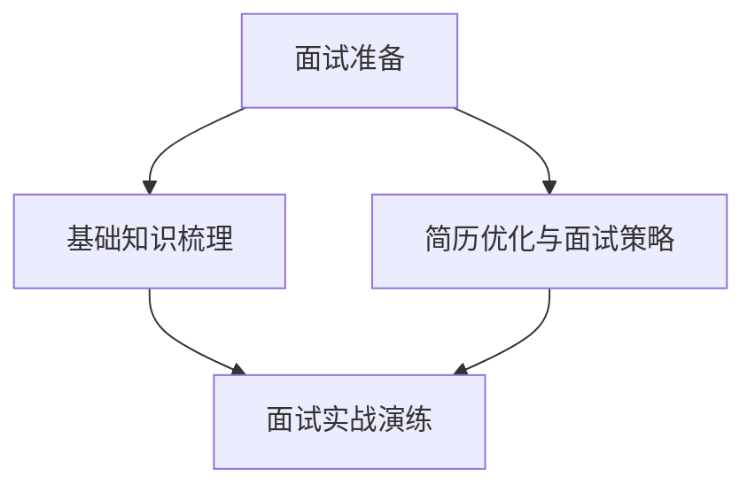

                 

### 文章标题

《2024腾讯健康社招面试真题汇总及其解答》

### 关键词

- 腾讯健康
- 社招面试
- 面试题
- 解答
- 技术面试
- 行业知识
- 软技能

### 摘要

本文将围绕2024年腾讯健康社招面试的真题展开，详细解析各类面试题目，涵盖技术面试、行业知识以及软技能等方面。通过本文，读者可以全面了解面试准备、基础知识、面试真题详解、软技能提升、面试经验分享、简历优化和面试策略等关键环节，为即将参加腾讯健康面试的求职者提供实用的指导和参考。

---

### 《2024腾讯健康社招面试真题汇总及其解答》目录大纲

#### 第一部分：面试准备与基础知识

##### 1.1 腾讯健康业务概述

###### 1.1.1 腾讯健康的核心业务

###### 1.1.2 腾讯健康的战略定位

###### 1.1.3 健康产业的前景与挑战

##### 1.2 面试准备

###### 1.2.1 面试心态调整

###### 1.2.2 面试问题类型与应对策略

###### 1.2.3 自我介绍与简历优化

##### 1.3 基础知识梳理

###### 1.3.1 健康信息学基础

###### 1.3.2 医学知识简介

###### 1.3.3 数据分析基础知识

#### 第二部分：社招面试真题详解

##### 2.1 技术面试题

###### 2.1.1 数据结构与算法

###### 2.1.2 编程语言与框架

###### 2.1.3 系统设计与优化

##### 2.2 行业知识面试题

###### 2.2.1 健康医疗行业概述

###### 2.2.2 医疗信息化建设

###### 2.2.3 健康大数据分析

##### 2.3 面试题解析

###### 2.3.1 面试题分类与应对策略

###### 2.3.2 面试题案例解析

###### 2.3.3 面试官视角解析

#### 第三部分：软技能与团队协作

##### 3.1 职业素养

###### 3.1.1 沟通技巧

###### 3.1.2 团队合作

###### 3.1.3 决策能力

##### 3.2 面试实战演练

###### 3.2.1 模拟面试场景

###### 3.2.2 实战演练建议

###### 3.2.3 反馈与改进

#### 第四部分：面试经验分享

##### 4.1 成功案例

###### 4.1.1 面试技巧分享

###### 4.1.2 成功经验总结

###### 4.1.3 面试官评价

##### 4.2 失败案例

###### 4.2.1 失败原因分析

###### 4.2.2 反思与改进

###### 4.2.3 如何避免类似失败

#### 第五部分：简历优化与面试策略

##### 5.1 简历撰写技巧

###### 5.1.1 简历格式与结构

###### 5.1.2 简历内容优化

###### 5.1.3 在线简历工具使用

##### 5.2 面试策略

###### 5.2.1 面试准备策略

###### 5.2.2 面试中的表现技巧

###### 5.2.3 后续跟进策略

#### 第六部分：常见问题与解答

##### 6.1 技术问题解答

###### 6.1.1 数据结构与算法问题

###### 6.1.2 编程语言问题

###### 6.1.3 系统设计问题

##### 6.2 行业问题解答

###### 6.2.1 健康医疗行业问题

###### 6.2.2 医疗信息化问题

###### 6.2.3 健康大数据分析问题

#### 第七部分：附录

##### 7.1 面试资料与资源

###### 7.1.1 面试相关书籍推荐

###### 7.1.2 在线课程与讲座

###### 7.1.3 技术社区与论坛

##### 7.2 联系方式

###### 7.2.1 作者联系方式

###### 7.2.2 反馈与建议收集

---

#### 第一部分：面试准备与基础知识

##### 1.1 腾讯健康业务概述

###### 1.1.1 腾讯健康的核心业务

腾讯健康是腾讯公司旗下的一个重要业务板块，致力于通过数字化手段提升公众健康水平，实现健康医疗服务的智能化。其核心业务主要包括以下几个方面：

1. **健康资讯**：提供权威、专业的健康资讯，覆盖疾病预防、健康养生、疾病治疗等多个方面，帮助用户获取科学的健康知识。
2. **在线问诊**：通过连接医疗机构和医生，为用户提供在线咨询服务，包括常见病、多发病的诊断和治疗建议。
3. **健康监测**：依托智能硬件和移动应用，帮助用户实时监测身体健康状况，如心率、血压、血糖等指标。
4. **健康管理**：提供个性化的健康管理和健康指导服务，通过大数据分析和人工智能技术，为用户制定合适的健康计划。

###### 1.1.2 腾讯健康的战略定位

腾讯健康的战略定位非常明确，即成为中国领先的智慧健康服务平台。具体体现在以下几个方面：

1. **科技创新**：通过不断引入先进的科技手段，如人工智能、大数据、云计算等，提升健康医疗服务的效率和质量。
2. **生态构建**：构建涵盖医疗机构、医生、用户、设备等多方参与的生态体系，实现健康医疗服务的全流程覆盖。
3. **用户导向**：以用户需求为中心，提供个性化、智能化的健康服务，提升用户体验。

###### 1.1.3 健康产业的前景与挑战

随着人口老龄化、慢性病增多和健康意识的提升，健康产业迎来了快速发展期。腾讯健康作为行业的重要组成部分，面临着巨大的市场机遇和挑战：

1. **市场机遇**：
   - 人口结构变化：随着人口老龄化的加剧，对健康服务需求不断增加，为健康产业提供了广阔的市场空间。
   - 科技创新：大数据、人工智能、物联网等技术的快速发展，为健康产业提供了新的发展动力。
   - 政策支持：政府对健康产业的重视和支持，为行业发展提供了良好的政策环境。

2. **挑战**：
   - 数据安全与隐私：健康数据敏感性高，如何在保障用户隐私的同时利用数据提升服务效率，是健康产业面临的重要挑战。
   - 行业规范：健康产业涉及多个领域，需要建立健全的行业标准和规范，确保服务质量。
   - 技术人才短缺：健康产业对技术人才的需求大，但人才培养和引进面临一定困难。

---

##### 1.2 面试准备

###### 1.2.1 面试心态调整

面试心态的调整是面试成功的关键之一。以下是一些建议，帮助您调整面试心态：

1. **自信**：自信是成功的一半。在面试前，回顾自己的优点和成就，增强自信心。
2. **放松**：紧张和焦虑会影响面试表现。通过深呼吸、肌肉放松等方法，缓解紧张情绪。
3. **积极**：保持积极的态度，对面试官的问题积极思考，展现出您的热情和积极性。
4. **准备充分**：充足的准备可以减轻紧张感。对可能被问到的问题进行预演，准备好答案。

###### 1.2.2 面试问题类型与应对策略

面试通常包括以下几个方面的问题：

1. **行为面试问题**：这类问题关注您的过往经历和经验，如“请举例说明一次你在团队中解决问题的经历。”应对策略是：
   - 回答具体、真实的事件。
   - 强调您的责任、挑战和成果。
   - 展现出您的团队合作和沟通能力。

2. **技术面试问题**：这类问题考察您的专业技能和知识，如“请解释一下二叉树和图的区别。”应对策略是：
   - 理解问题背后的原理。
   - 使用具体例子来解释。
   - 保持简洁明了，避免冗长的解释。

3. **情境面试问题**：这类问题模拟实际工作场景，如“如果你负责一个项目，但团队出现了沟通问题，你会如何解决？”应对策略是：
   - 提出具体的解决步骤。
   - 考虑不同可能的解决方案。
   - 强调团队合作和沟通的重要性。

4. **性格测试问题**：这类问题旨在了解您的性格特点，如“你更喜欢团队合作还是独立工作？”应对策略是：
   - 保持诚实，不要夸大或掩饰。
   - 强调适应性和灵活性。
   - 展现出您的积极态度和可塑性。

###### 1.2.3 自我介绍与简历优化

自我介绍是面试的第一印象，以下是一些建议：

1. **简洁明了**：自我介绍应简短有力，通常不超过1-2分钟。
2. **突出亮点**：强调您的专业技能、成就和经验，特别是与应聘职位相关的内容。
3. **言之有物**：自我介绍应具体、有逻辑性，避免空洞的表述。
4. **展示热情**：表达您对职位的热情和兴趣，让面试官感受到您的积极态度。

简历优化是面试准备的重要环节，以下是一些建议：

1. **格式简洁**：保持简历的格式简洁、美观，便于阅读。
2. **内容真实**：简历中的内容必须真实可靠，避免夸大或虚假信息。
3. **突出重点**：强调与应聘职位相关的经历和技能，突出您的亮点。
4. **语言精练**：使用简练、有力的语言，避免冗长、复杂的句子。
5. **更新及时**：确保简历内容更新及时，特别是最近的工作经验和项目成果。

---

##### 1.3 基础知识梳理

###### 1.3.1 健康信息学基础

健康信息学（Health Informatics）是研究如何利用信息学技术来改善医疗服务和促进公众健康的学科。它涉及医学、信息科学、计算机科学、统计学等多个领域。以下是健康信息学的一些基础概念：

1. **健康数据**：健康数据是指与个人健康相关的各种数据，包括医疗记录、健康监测数据、基因数据等。
2. **电子健康记录（EHR）**：电子健康记录是一种数字化的医疗记录，包括患者的医疗历史、诊断、治疗方案等信息。
3. **健康信息交换标准**：为了实现不同系统之间的数据交换，制定了多种健康信息交换标准，如HL7（Health Level Seven）和FHIR（Fast Healthcare Interoperability Resources）。
4. **健康大数据**：健康大数据是指来自不同来源的大量健康数据，通过对这些数据的分析和挖掘，可以揭示健康相关的趋势和模式。

###### 1.3.2 医学知识简介

医学知识是健康信息学的重要组成部分，以下是一些基本的医学知识：

1. **临床医学**：临床医学是研究疾病的诊断、治疗和预防的学科。包括内科学、外科学、妇产科、儿科等多个分支。
2. **病理学**：病理学是研究疾病发生、发展和转归的学科，通过对病变组织的观察和分析，帮助诊断疾病。
3. **药理学**：药理学是研究药物与生物体相互作用的学科，包括药物的吸收、分布、代谢和排泄等方面。
4. **公共卫生**：公共卫生是研究如何通过预防性措施来改善公众健康和减少疾病发生的学科，包括健康教育、疾病控制、环境卫生等方面。

###### 1.3.3 数据分析基础知识

数据分析在健康信息学中具有重要意义，以下是一些基本的数据分析概念：

1. **数据清洗**：数据清洗是指处理和清洗原始数据，使其符合分析和建模的要求。包括去除重复数据、处理缺失值、异常值检测等。
2. **统计分析**：统计分析是使用统计学方法对数据进行处理和分析的方法，如描述性统计分析、推断性统计分析等。
3. **机器学习**：机器学习是利用算法从数据中自动学习规律和模式的方法，包括监督学习、无监督学习、强化学习等。
4. **数据可视化**：数据可视化是将数据以图形、图像等形式展示的方法，帮助人们更好地理解和分析数据。

---

#### 第二部分：社招面试真题详解

##### 2.1 技术面试题

技术面试题通常考察应聘者的专业知识、编程能力和解决实际问题的能力。以下是一些常见的技术面试题及其解答：

###### 2.1.1 数据结构与算法

1. **请解释一下堆排序的工作原理。**

堆排序是一种基于比较的排序算法，它使用了数据结构中的堆（Heap）来实现。堆是一种特殊的完全二叉树，其中每一个父节点的值都不大于或不小于其所有子节点的值。

堆排序的过程如下：

- **建立最大堆（Max Heap）**：首先，将待排序的元素按照堆的定义放入一个数组中，构建一个最大堆。
- **排序过程**：
  - 将堆顶元素（最大元素）与最后一个元素交换，然后删除最后一个元素。
  - 调整剩余元素构成的堆，使其仍然满足最大堆的性质。
  - 重复上述步骤，直到堆中只剩下一个元素。

时间复杂度：O(n log n)

2. **请实现一个二分查找算法。**

二分查找是一种在有序数组中查找特定元素的算法。其基本思想是不断将查找范围缩小一半，直到找到目标元素或确定其不存在。

伪代码实现如下：

```
function binary_search(arr, target):
    low = 0
    high = len(arr) - 1
    
    while low <= high:
        mid = (low + high) // 2
        if arr[mid] == target:
            return mid
        elif arr[mid] < target:
            low = mid + 1
        else:
            high = mid - 1
    
    return -1
```

时间复杂度：O(log n)

###### 2.1.2 编程语言与框架

1. **请解释一下Python中的生成器（Generator）和迭代器（Iterator）的区别。**

- **生成器（Generator）**：生成器是一种特殊的函数，可以在其中使用`yield`关键字生成值。每次调用生成器时，它会从上次yield的地方继续执行，并返回下一个值。生成器是lazy evaluated（惰性求值）的，即只有在需要值时才会计算。
- **迭代器（Iterator）**：迭代器是一种对象，它有一个`__iter__()`方法，可以返回迭代器自身。迭代器有一个`next()`方法，每次调用时会返回下一个值，直到没有更多值时抛出`StopIteration`异常。

生成器和迭代器的区别：

- **生成器是函数，迭代器是对象**。
- **生成器使用`yield`生成值，迭代器使用`next()`获取值**。
- **生成器是惰性求值的，迭代器是 eager evaluated（急切求值的）**。

2. **请解释一下JavaScript中的事件循环（Event Loop）。**

事件循环是JavaScript中的一个核心概念，它负责管理异步任务和回调函数的执行。JavaScript是单线程的，意味着它不能同时执行多个任务。事件循环使得JavaScript能够在单线程环境中实现异步操作。

事件循环的工作流程如下：

- **执行栈**：JavaScript代码从执行栈中读取并执行代码。如果遇到同步代码，会直接在执行栈中执行；如果遇到异步代码，如回调函数，会将其放入事件队列中。
- **事件队列**：当执行栈为空时，事件循环会从事件队列中取出第一个事件，并将其放入执行栈中执行。
- **回调函数**：异步操作完成后，会将回调函数放入事件队列中。如果执行栈为空，事件循环会执行这些回调函数。
- **微任务队列**：在执行栈和事件队列之间，还有一个微任务队列，用于处理一些特殊的异步操作，如`Promise`的回调函数。微任务会在当前执行栈执行完后再执行。

事件循环保证了JavaScript中的异步操作能够有序地执行，使得单线程的JavaScript能够在处理大量异步任务时保持高效和响应性。

###### 2.1.3 系统设计与优化

1. **请解释一下CAP定理。**

CAP定理是分布式系统理论中的一个基本原理，它指出在一个分布式系统中，一致性（Consistency）、可用性（Availability）和分区容错性（Partition tolerance）这三个特性中，最多只能同时实现两个。

CAP定理的具体含义：

- **一致性（Consistency）**：每个节点对同一数据的访问能够得到一致的视图。
- **可用性（Availability）**：每个请求都能获得一个响应，无论是成功还是失败。
- **分区容错性（Partition tolerance）**：系统能够在出现网络分区的情况下继续运行。

CAP定理的三种可能组合：

- **CA系统**：在一致性（C）和可用性（A）之间选择，典型的例子是传统的关系型数据库。
- **CP系统**：在一致性（C）和分区容错性（P）之间选择，典型的例子是分布式键值存储系统。
- **AP系统**：在可用性（A）和分区容错性（P）之间选择，典型的例子是分布式搜索引擎。

2. **请解释一下如何实现负载均衡。**

负载均衡是将流量分配到多个服务器上，以避免单点故障和提高系统性能的技术。以下是一些常见的负载均衡算法：

- **轮询（Round Robin）**：将请求按照顺序分配给服务器，每个服务器轮流处理请求。
- **最小连接数（Least Connections）**：将请求分配给当前连接数最少的服务器，以平衡服务器负载。
- **最小负载（Least Load）**：根据服务器的负载情况（如CPU使用率、内存使用率等）分配请求，将请求分配给负载最小的服务器。

实现负载均衡的常见方法：

- **硬件负载均衡器**：通过专门的硬件设备实现负载均衡，如F5 BigIP等。
- **软件负载均衡器**：通过软件实现负载均衡，如Nginx、HAProxy等。
- **自平衡集群**：通过在服务器上运行负载均衡算法，自动分配请求。

---

##### 2.2 行业知识面试题

行业知识面试题主要考察应聘者对健康医疗行业的了解和认识，以下是一些常见的问题及其解答：

###### 2.2.1 健康医疗行业概述

1. **请简述健康医疗行业的定义和发展历程。**

健康医疗行业是指以预防和治疗疾病、促进健康为主要目标的行业。它涵盖了医疗、医药、医疗器械等多个领域。

发展历程：

- **传统医疗阶段**：以医生为主，依赖药物和手术进行治疗。
- **现代医疗阶段**：引入了新的技术和设备，如CT、MRI等，提高了诊断和治疗的准确性。
- **数字化医疗阶段**：随着信息技术的快速发展，健康医疗行业开始迈向数字化，如电子病历、远程医疗等。

2. **请列举一些健康医疗行业的创新技术和应用。**

- **人工智能（AI）**：应用于医学影像诊断、病理分析、药物研发等领域，提高了诊断和治疗的效率。
- **大数据**：通过对大量健康数据进行分析，可以揭示疾病趋势和风险因素，为疾病预防和治疗提供支持。
- **云计算**：提供了弹性、可扩展的计算资源，使医疗机构能够更高效地处理和分析海量数据。
- **物联网（IoT）**：通过智能设备收集健康数据，实现实时监测和远程控制，提高了患者的健康管理和生活质量。

###### 2.2.2 医疗信息化建设

1. **请解释一下电子健康档案（EHR）的概念和重要性。**

电子健康档案（Electronic Health Record，EHR）是一种数字化的医疗记录，包含了患者的医疗历史、诊断、治疗方案等信息。EHR的重要性体现在以下几个方面：

- **提高医疗服务效率**：通过数字化记录，医生可以快速访问患者的医疗信息，减少了纸质记录和手动查找的时间。
- **改善患者体验**：患者可以通过互联网访问自己的医疗信息，如就诊记录、检查结果等，提高了医疗服务的透明度和便捷性。
- **支持疾病预防和控制**：通过对EHR数据进行分析，可以揭示疾病趋势和风险因素，为疾病预防和控制提供支持。

2. **请简述医疗信息化建设的主要目标和挑战。**

医疗信息化建设的主要目标包括：

- **提高医疗服务质量**：通过信息化手段，提高医疗服务的准确性和效率。
- **降低医疗成本**：通过优化流程和资源分配，降低医疗成本。
- **改善患者体验**：提供便捷、高效的医疗服务，提高患者的满意度和忠诚度。

主要挑战：

- **数据安全和隐私**：健康数据敏感性高，如何在保障用户隐私的同时利用数据提升服务效率，是医疗信息化建设面临的重要挑战。
- **系统集成**：医疗信息化系统涉及多个部门和组织，需要实现不同系统之间的数据交换和协同工作。
- **人才短缺**：医疗信息化建设需要专业的人才，包括医生、护士、信息技术专家等。

###### 2.2.3 健康大数据分析

1. **请解释一下健康大数据的概念和来源。**

健康大数据是指与健康相关的各种数据，包括医疗记录、健康监测数据、基因数据等。健康大数据的来源包括：

- **医疗机构**：如医院、诊所等，产生大量的电子病历、检查报告等数据。
- **健康设备**：如智能手环、智能血压计等，通过传感器实时收集健康数据。
- **在线平台**：如健康APP、在线问诊平台等，收集用户健康咨询、诊断结果等数据。
- **社交媒体**：如微信、微博等，用户分享的健康信息和行为数据。

2. **请简述健康大数据分析的主要应用领域。**

健康大数据分析在多个领域有广泛的应用：

- **疾病预防和控制**：通过对大数据进行分析，可以揭示疾病趋势和风险因素，为疾病预防和控制提供支持。
- **个性化治疗**：通过对患者数据进行分析，可以制定个性化的治疗方案，提高治疗效果。
- **健康风险评估**：通过对健康数据进行分析，可以评估个体的健康风险，提供个性化的健康指导。
- **医学研究**：通过对大数据进行分析，可以发现新的疾病机制和治疗方法，推动医学研究的进展。

---

##### 2.3 面试题解析

###### 2.3.1 面试题分类与应对策略

面试题通常可以分为以下几个类别，对应不同的应对策略：

1. **行为面试问题**：这类问题关注您的过往经历和经验，如“请举例说明一次你在团队中解决问题的经历。”应对策略是：
   - 回答具体、真实的事件。
   - 强调您的责任、挑战和成果。
   - 展现出您的团队合作和沟通能力。

2. **技术面试问题**：这类问题考察您的专业技能和知识，如“请解释一下二叉树和图的区别。”应对策略是：
   - 理解问题背后的原理。
   - 使用具体例子来解释。
   - 保持简洁明了，避免冗长的解释。

3. **情境面试问题**：这类问题模拟实际工作场景，如“如果你负责一个项目，但团队出现了沟通问题，你会如何解决？”应对策略是：
   - 提出具体的解决步骤。
   - 考虑不同可能的解决方案。
   - 强调团队合作和沟通的重要性。

4. **性格测试问题**：这类问题旨在了解您的性格特点，如“你更喜欢团队合作还是独立工作？”应对策略是：
   - 保持诚实，不要夸大或掩饰。
   - 强调适应性和灵活性。
   - 展现出您的积极态度和可塑性。

###### 2.3.2 面试题案例解析

以下是一些常见的面试题及其解析：

1. **请解释一下堆排序的工作原理。**

解析：

堆排序是一种基于比较的排序算法，使用了数据结构中的堆（Heap）来实现。堆是一种特殊的完全二叉树，其中每一个父节点的值都不大于或不小于其所有子节点的值。

堆排序的过程如下：

- **建立最大堆（Max Heap）**：首先，将待排序的元素按照堆的定义放入一个数组中，构建一个最大堆。
- **排序过程**：
  - 将堆顶元素（最大元素）与最后一个元素交换，然后删除最后一个元素。
  - 调整剩余元素构成的堆，使其仍然满足最大堆的性质。
  - 重复上述步骤，直到堆中只剩下一个元素。

时间复杂度：O(n log n)

2. **请实现一个二分查找算法。**

解析：

二分查找是一种在有序数组中查找特定元素的算法。其基本思想是不断将查找范围缩小一半，直到找到目标元素或确定其不存在。

伪代码实现如下：

```
function binary_search(arr, target):
    low = 0
    high = len(arr) - 1
    
    while low <= high:
        mid = (low + high) // 2
        if arr[mid] == target:
            return mid
        elif arr[mid] < target:
            low = mid + 1
        else:
            high = mid - 1
    
    return -1
```

时间复杂度：O(log n)

3. **请解释一下JavaScript中的事件循环（Event Loop）。**

解析：

事件循环是JavaScript中的一个核心概念，它负责管理异步任务和回调函数的执行。JavaScript是单线程的，意味着它不能同时执行多个任务。事件循环使得JavaScript能够在单线程环境中实现异步操作。

事件循环的工作流程如下：

- **执行栈**：JavaScript代码从执行栈中读取并执行代码。如果遇到同步代码，会直接在执行栈中执行；如果遇到异步代码，如回调函数，会将其放入事件队列中。
- **事件队列**：当执行栈为空时，事件循环会从事件队列中取出第一个事件，并将其放入执行栈中执行。
- **回调函数**：异步操作完成后，会将回调函数放入事件队列中。如果执行栈为空，事件循环会执行这些回调函数。
- **微任务队列**：在执行栈和事件队列之间，还有一个微任务队列，用于处理一些特殊的异步操作，如`Promise`的回调函数。微任务会在当前执行栈执行完后再执行。

事件循环保证了JavaScript中的异步操作能够有序地执行，使得单线程的JavaScript能够在处理大量异步任务时保持高效和响应性。

4. **请解释一下CAP定理。**

解析：

CAP定理是分布式系统理论中的一个基本原理，它指出在一个分布式系统中，一致性（Consistency）、可用性（Availability）和分区容错性（Partition tolerance）这三个特性中，最多只能同时实现两个。

CAP定理的具体含义：

- **一致性（Consistency）**：每个节点对同一数据的访问能够得到一致的视图。
- **可用性（Availability）**：每个请求都能获得一个响应，无论是成功还是失败。
- **分区容错性（Partition tolerance）**：系统能够在出现网络分区的情况下继续运行。

CAP定理的三种可能组合：

- **CA系统**：在一致性（C）和可用性（A）之间选择，典型的例子是传统的关系型数据库。
- **CP系统**：在一致性（C）和分区容错性（P）之间选择，典型的例子是分布式键值存储系统。
- **AP系统**：在可用性（A）和分区容错性（P）之间选择，典型的例子是分布式搜索引擎。

---

##### 2.3.3 面试官视角解析

从面试官的角度来看，面试的目的不仅仅是评估应聘者的技术能力和专业知识，还包括以下几个方面：

1. **评估技术能力**：面试官会通过技术面试题来评估应聘者的技术基础和编程能力。他们关注的是应聘者是否能够理解问题背后的原理，并能够提出有效的解决方案。

2. **评估学习能力**：面试官会通过行为面试题来评估应聘者的学习能力和成长潜力。他们关注的是应聘者如何描述自己的学习经历，以及如何面对新的挑战和困难。

3. **评估沟通能力**：面试官会通过面试过程中的互动来评估应聘者的沟通能力。他们关注的是应聘者是否能够清晰、准确地表达自己的想法，并能够有效地与他人沟通。

4. **评估团队合作能力**：面试官会通过情境面试题来评估应聘者的团队合作能力。他们关注的是应聘者如何描述自己在团队中的角色和贡献，以及如何处理团队中的冲突和问题。

5. **评估职业素养**：面试官会通过面试过程中的表现来评估应聘者的职业素养。他们关注的是应聘者的态度、责任心和敬业精神。

在面试过程中，面试官通常会关注以下几个方面：

- **回答的深度和广度**：面试官会评估应聘者对问题的回答是否深入，是否能够从多个角度进行分析和解答。
- **逻辑性和条理性**：面试官会评估应聘者的回答是否具有逻辑性，是否能够有条理地组织自己的思路。
- **实践经验**：面试官会评估应聘者是否具备相关的实践经验，以及如何将理论知识应用到实际工作中。
- **问题意识**：面试官会评估应聘者是否有提出问题和解决问题的能力，以及如何针对问题提出有效的解决方案。

总之，面试官的目标是全面评估应聘者的综合素质，以便为团队选拔合适的人才。因此，在面试过程中，应聘者需要展现出自己的技术能力、学习能力、沟通能力、团队合作能力和职业素养，以赢得面试官的青睐。

---

#### 第三部分：软技能与团队协作

##### 3.1 职业素养

职业素养是指个人在职业生涯中应具备的职业道德、专业能力和行为习惯。对于面试者来说，良好的职业素养不仅有助于在面试中取得好成绩，还能为未来的职业生涯打下坚实的基础。以下是一些关键的职业素养：

###### 3.1.1 沟通技巧

良好的沟通技巧是职场成功的关键。在面试中，沟通技巧主要体现在以下几个方面：

- **倾听**：积极倾听面试官的问题，确保理解问题的核心。通过重复或总结问题，可以确认自己是否理解正确。
- **表达**：清晰、简洁地表达自己的观点和想法。使用简洁明了的语言，避免使用过于复杂或专业的术语。
- **提问**：在面试过程中，适时提问可以展现自己的积极主动和对问题的关注。提问时，应确保问题具体、有针对性。
- **非语言沟通**：注意自己的身体语言，如眼神交流、面部表情和姿态等。这些非语言沟通元素可以增强表达效果。

###### 3.1.2 团队合作

团队合作能力是现代职场不可或缺的技能。在面试中，以下是一些展现团队合作能力的要点：

- **角色定位**：在团队中明确自己的角色和责任，并确保团队成员都了解各自的任务。
- **沟通协调**：保持与团队成员的积极沟通，确保信息的透明和畅通。在遇到冲突时，能够有效沟通，寻求共识。
- **协同工作**：能够在团队中与其他成员协作，共同完成任务。愿意分享资源和知识，帮助团队成员提升能力。
- **冲突解决**：面对团队中的冲突，能够冷静处理，寻求合理的解决方案，确保团队目标的实现。

###### 3.1.3 决策能力

决策能力是职业素养中的重要组成部分。在面试中，以下是一些展现决策能力的要点：

- **信息收集**：在做出决策前，充分收集和分析相关信息，确保决策基于充分的事实依据。
- **风险评估**：对决策可能带来的风险进行评估，并制定应对策略。
- **选择方案**：在多个备选方案中，选择最优或最合适的方案。
- **执行与监控**：在决策后，确保执行计划，并对决策结果进行监控和评估，及时调整和改进。

---

##### 3.2 面试实战演练

面试实战演练是面试准备的重要环节，通过模拟真实的面试场景，可以帮助面试者熟悉面试流程，提高面试技巧。以下是一些建议和策略：

###### 3.2.1 模拟面试场景

- **选择合适的时间和地点**：确保模拟面试的时间和地点与实际面试相同，以减少环境变化带来的干扰。
- **准备面试材料**：提前准备好简历、证件等面试材料，确保在模拟面试时能够迅速找到所需材料。
- **模拟面试流程**：按照实际面试的流程进行模拟，包括自我介绍、回答问题和互动环节。
- **模拟面试官角色**：可以请朋友或同事扮演面试官，按照实际面试的问题进行提问和反馈。

###### 3.2.2 实战演练建议

- **多次演练**：建议进行多次实战演练，每次演练后进行总结和反思，不断改进。
- **记录反思**：在每次演练后，记录自己的表现和不足，特别是需要改进的方面。
- **角色互换**：在演练中，可以尝试扮演不同的角色，如面试官和应聘者，以全面了解面试的各个方面。
- **模拟真实环境**：在演练中，尽量模拟真实的环境和场景，包括面试官的提问方式和语气。

###### 3.2.3 反馈与改进

- **积极寻求反馈**：在实战演练后，积极向面试官或同事寻求反馈，了解自己的优点和不足。
- **具体改进措施**：根据反馈，制定具体的改进措施，如提高专业知识、改善沟通技巧等。
- **持续学习和练习**：面试技巧的提高需要时间和实践，持续学习和练习是提升面试技巧的关键。

---

#### 第四部分：面试经验分享

##### 4.1 成功案例

以下是一个成功的面试案例，该案例将分享一些面试技巧和经验，以供参考。

**面试背景：** 该应聘者是一名拥有五年医疗信息化工作经验的软件工程师，应聘腾讯健康的数据分析工程师职位。

**面试过程：**

- **初试**：初试是通过电话进行的，面试官主要询问了应聘者的工作经验、项目经历和编程技能。面试官提出了一些算法和数据结构问题，如“请实现快速排序算法”和“请解释一下哈希表的工作原理”。应聘者通过简洁明了的解答和具体的实际项目经验，顺利通过了初试。
- **复试**：复试是在公司总部进行的，面试官包括部门主管、技术专家和产品经理。复试主要围绕数据分析、业务理解和团队合作能力进行。面试官问了一些关于数据分析方法的题目，如“如何使用回归分析预测疾病发病率？”和“请描述一次你使用数据分析解决实际问题的经历”。此外，面试官还询问了应聘者对腾讯健康的业务理解和团队协作经验。
- **终试**：终试是由公司高层领导进行的，主要考察应聘者的综合素质和职业素养。面试官询问了一些关于行业趋势和公司文化的问题，如“你对健康大数据分析有哪些了解？”和“你如何看待团队合作中的冲突？”应聘者通过积极的表达和具体的实际案例，赢得了面试官的认可。

**面试经验分享：**

1. **充分准备**：在面试前，充分了解应聘公司的业务和文化，准备相关的项目经验和案例分析。对于技术问题，通过刷题和实际项目经验，提高自己的编程能力和解题技巧。
2. **展现优势**：在面试中，重点突出自己的专业技能和项目经验，特别是与应聘职位相关的内容。通过具体的案例和实际经验，展示自己的能力和成果。
3. **沟通表达**：在面试过程中，注意沟通技巧和表达方式，保持自信、清晰和条理。通过适当的肢体语言和眼神交流，增强表达效果。
4. **团队合作**：在面试中，强调自己在团队中的角色和贡献，展示团队合作能力和解决问题的能力。通过具体案例，说明自己在团队协作中的积极态度和解决问题的方法。

---

##### 4.2 失败案例

以下是一个面试失败的案例，该案例将分析失败的原因和改进方法。

**面试背景：** 该应聘者是一名拥有三年健康大数据分析工作经验的数据分析师，应聘腾讯健康的高级数据分析师职位。

**面试过程：**

- **初试**：初试是通过在线平台进行的，面试官主要询问了应聘者的工作经验、项目经历和技术能力。面试官提出了一些数据分析方法和算法问题，如“请解释一下K-means聚类算法”和“请描述一次你使用数据分析解决实际问题的经历”。虽然应聘者能够回答出大部分问题，但回答不够深入和具体。
- **复试**：复试是在公司总部进行的，面试官包括部门主管、技术专家和产品经理。复试主要围绕数据分析、业务理解和沟通能力进行。面试官问了一些关于业务理解和项目管理的题目，如“请描述一次你参与的项目，并说明你在项目中的角色和贡献”和“如何处理团队中的冲突？”应聘者在回答这些问题时，表现出了一些紧张和不确定，缺乏具体的实际案例。
- **终试**：终试是由公司高层领导进行的，主要考察应聘者的综合素质和领导能力。面试官询问了一些关于公司文化和行业趋势的问题，如“你对公司未来的发展有哪些看法？”和“如何平衡工作与生活？”应聘者对这些问题的回答显得有些模糊和笼统。

**失败原因分析：**

1. **技术能力不足**：虽然应聘者具备一定的数据分析能力，但在面试中未能充分展现自己的技术深度和实际项目经验，导致面试官对其技术能力产生疑问。
2. **沟通表达欠缺**：在面试中，应聘者的沟通表达不够流畅和自信，缺乏具体的实际案例来支持回答，导致面试官对其业务理解和沟通能力产生疑虑。
3. **缺乏领导能力**：在面试中，应聘者未能展现出领导能力和团队管理经验，缺乏对项目管理和团队协作的深入理解。

**改进方法：**

1. **提高技术能力**：加强技术学习和实际项目经验，通过刷题、参与开源项目和实际项目，提高自己的编程能力和数据分析技巧。
2. **增强沟通表达能力**：通过模拟面试、练习演讲和写作，提高自己的沟通表达能力和自信心。在面试中，使用具体的实际案例和项目经验来支持回答，增强说服力。
3. **提升领导能力**：通过参与团队项目、担任小组负责人或参与领导力培训，积累团队管理和领导经验。在面试中，展示自己的领导能力和团队协作经验，增强面试官的信心。

---

#### 第五部分：简历优化与面试策略

##### 5.1 简历撰写技巧

简历是求职者向招聘者展示自己能力和经验的重要工具。以下是一些简历撰写的技巧：

###### 5.1.1 简历格式与结构

1. **简洁明了**：简历应保持简洁，避免过多的文字和细节。一般建议不超过两页。
2. **清晰的格式**：使用清晰、易读的字体和排版，确保简历整体看起来整洁有序。
3. **清晰的逻辑结构**：按照时间顺序或功能分类组织简历内容，使招聘者能够快速了解您的经验和能力。

###### 5.1.2 简历内容优化

1. **突出重点**：在简历中突出与应聘职位最相关的经验和技能。对于每一项工作经验，强调您的职责、成就和贡献。
2. **使用量化的数据**：使用具体的数据和量化的结果来展示您的成果，如“提高了项目效率20%”、“优化了算法，降低了50%的计算时间”等。
3. **定制化简历**：根据不同职位的要求，定制化简历内容。突出与职位最相关的经验和技能，避免使用通用的模板。

###### 5.1.3 在线简历工具使用

现在有很多在线简历工具可以帮助您制作专业的简历，以下是一些常用的在线简历工具：

- **LinkedIn**：LinkedIn是一个专业的社交平台，可以制作和展示您的专业简历。
- **Canva**：Canva提供了多种简历模板，可以方便地创建专业的简历。
- **Resumonk**：Resumonk提供了一个在线简历编辑器，提供了多种模板和工具。

---

##### 5.2 面试策略

面试策略是指为了在面试中取得好成绩而采取的一系列方法和步骤。以下是一些面试策略：

###### 5.2.1 面试准备策略

1. **了解公司背景和文化**：在面试前，深入了解公司的背景、业务和文化，以便在面试中展示出您对公司的了解和兴趣。
2. **了解职位要求**：仔细阅读职位描述，了解职位所需的技术能力和软技能，确保在面试中能够展示出这些能力。
3. **准备问题和答案**：提前准备一些可能被问到的问题和答案，包括技术问题、行业问题和情境问题等。
4. **模拟面试**：通过模拟面试来提高自己的面试技巧，找到自己的不足并进行改进。

###### 5.2.2 面试中的表现技巧

1. **自信和积极**：在面试中保持自信和积极的态度，展现出您的热情和信心。
2. **沟通和表达**：清晰、简洁地表达自己的观点和想法，注意语速和语调，确保面试官能够听懂。
3. **展示专业知识**：在回答问题时，展示出您的专业知识和经验，使用实际案例来支持您的回答。
4. **适应性和灵活性**：在面试中，展示出您的适应性和灵活性，能够快速适应不同的环境和情况。

###### 5.2.3 后续跟进策略

面试后，及时跟进可以帮助您加深面试官的印象，提高录取的机会。以下是一些后续跟进的策略：

1. **发送感谢信**：在面试结束后，及时发送一封感谢信，感谢面试官的时间和机会，并再次表达对职位的兴趣和热情。
2. **跟进邮件**：在面试后的几个工作日内，发送一封跟进邮件，询问面试官关于面试结果的进展，并再次表达您的兴趣。
3. **保持联系**：在面试后，保持与面试官的联系，适时分享您的最新进展和成就，展示您的职业素养和敬业精神。
4. **积极反馈**：如果被拒绝，可以询问具体的反馈和建议，以便改进自己的面试技巧和职业能力。

---

#### 第六部分：常见问题与解答

##### 6.1 技术问题解答

技术面试中，面试官常常会问一些技术问题，以下是一些常见的技术问题及其解答：

###### 6.1.1 数据结构与算法问题

1. **请解释一下堆排序的工作原理。**

堆排序是一种基于比较的排序算法，使用了数据结构中的堆（Heap）来实现。堆是一种特殊的完全二叉树，其中每一个父节点的值都不大于或不小于其所有子节点的值。

堆排序的过程如下：

- **建立最大堆（Max Heap）**：首先，将待排序的元素按照堆的定义放入一个数组中，构建一个最大堆。
- **排序过程**：
  - 将堆顶元素（最大元素）与最后一个元素交换，然后删除最后一个元素。
  - 调整剩余元素构成的堆，使其仍然满足最大堆的性质。
  - 重复上述步骤，直到堆中只剩下一个元素。

时间复杂度：O(n log n)

2. **请实现一个二分查找算法。**

二分查找是一种在有序数组中查找特定元素的算法。其基本思想是不断将查找范围缩小一半，直到找到目标元素或确定其不存在。

伪代码实现如下：

```
function binary_search(arr, target):
    low = 0
    high = len(arr) - 1
    
    while low <= high:
        mid = (low + high) // 2
        if arr[mid] == target:
            return mid
        elif arr[mid] < target:
            low = mid + 1
        else:
            high = mid - 1
    
    return -1
```

时间复杂度：O(log n)

3. **请解释一下快排（Quick Sort）的工作原理。**

快速排序（Quick Sort）是一种高效的排序算法，采用了分治的策略。基本思想是通过一趟排序将待排序的记录分割成独立的两部分，其中一部分记录的关键字均比另一部分的关键字小，则可分别对这两部分记录继续进行排序，以达到整个序列有序。

快速排序的过程如下：

- **选择基准元素**：从数组中选择一个基准元素。
- **分区**：将数组分成两部分，一部分是比基准元素小的元素，另一部分是比基准元素大的元素。
- **递归排序**：递归地对两部分数组进行快速排序。

时间复杂度：平均情况为O(n log n)，最坏情况为O(n^2)。

4. **请解释一下图（Graph）的基本概念和常见应用。**

图（Graph）是一种由节点（Node）和边（Edge）组成的数据结构。节点表示数据元素，边表示节点之间的关系。

图的基本概念：

- **顶点（Vertex）**：图中的节点。
- **边（Edge）**：连接两个节点的线。
- **路径（Path）**：连接两个节点的边序列。
- **连通性（Connectivity）**：图中任意两个节点之间是否存在路径。
- **权重（Weight）**：边的权重，表示边连接的两个节点之间的关系强度。

常见应用：

- **社交网络分析**：通过图结构分析社交网络，发现关键节点和社群结构。
- **网络拓扑设计**：使用图结构设计网络拓扑，优化网络传输效率。
- **路径规划**：如GPS导航系统，通过图结构计算最短路径。

###### 6.1.2 编程语言与框架问题

1. **请解释一下Python中的生成器（Generator）和迭代器（Iterator）的区别。**

- **生成器（Generator）**：生成器是一种特殊的函数，可以在其中使用`yield`关键字生成值。每次调用生成器时，它会从上次yield的地方继续执行，并返回下一个值。生成器是lazy evaluated（惰性求值）的，即只有在需要值时才会计算。
- **迭代器（Iterator）**：迭代器是一种对象，它有一个`__iter__()`方法，可以返回迭代器自身。迭代器有一个`next()`方法，每次调用时会返回下一个值，直到没有更多值时抛出`StopIteration`异常。

生成器和迭代器的区别：

- **生成器是函数，迭代器是对象**。
- **生成器使用`yield`生成值，迭代器使用`next()`获取值**。
- **生成器是惰性求值的，迭代器是 eager evaluated（急切求值的）**。

2. **请解释一下JavaScript中的事件循环（Event Loop）。**

事件循环是JavaScript中的一个核心概念，它负责管理异步任务和回调函数的执行。JavaScript是单线程的，意味着它不能同时执行多个任务。事件循环使得JavaScript能够在单线程环境中实现异步操作。

事件循环的工作流程如下：

- **执行栈**：JavaScript代码从执行栈中读取并执行代码。如果遇到同步代码，会直接在执行栈中执行；如果遇到异步代码，如回调函数，会将其放入事件队列中。
- **事件队列**：当执行栈为空时，事件循环会从事件队列中取出第一个事件，并将其放入执行栈中执行。
- **回调函数**：异步操作完成后，会将回调函数放入事件队列中。如果执行栈为空，事件循环会执行这些回调函数。
- **微任务队列**：在执行栈和事件队列之间，还有一个微任务队列，用于处理一些特殊的异步操作，如`Promise`的回调函数。微任务会在当前执行栈执行完后再执行。

事件循环保证了JavaScript中的异步操作能够有序地执行，使得单线程的JavaScript能够在处理大量异步任务时保持高效和响应性。

3. **请解释一下React的虚拟DOM（Virtual DOM）和 diff 算法。**

React的虚拟DOM是一种在内存中构建的轻量级数据结构，用于表示真实的DOM结构。虚拟DOM与真实的DOM结构不同，它不直接操作浏览器DOM，而是通过比较虚拟DOM和真实DOM的差异，再进行实际的DOM操作，以提高性能。

虚拟DOM的主要优势：

- **提高性能**：通过减少直接操作DOM的次数，减少浏览器渲染的开销。
- **简化开发**：开发者可以专注于应用逻辑，而不需要关心DOM操作的细节。

diff 算法是React中用于比较虚拟DOM和真实DOM差异的算法。diff 算法的基本思想是：

- **全量比较**：当组件状态或属性发生变化时，React会重新构建整个虚拟DOM，并与上一次的虚拟DOM进行全量比较。
- **局部比较**：React只会比较变化的部分，而不是整个DOM结构。这样，可以减少比较的时间和计算量。
- **更新DOM**：根据diff结果，React会更新真实的DOM，以反映虚拟DOM的变化。

时间复杂度：O(n)，其中n是虚拟DOM节点数。

4. **请解释一下Spring框架中的AOP（Aspect-Oriented Programming）是如何工作的。**

Spring框架中的AOP（Aspect-Oriented Programming）是一种编程范式，它允许开发者将横切关注点（cross-cutting concerns）从核心业务逻辑中分离出来。AOP通过动态代理和织入（weaving）技术实现。

AOP的关键概念：

- **切面（Aspect）**：切面是关注点的一种模块化表示，它将横切关注点封装在一起。例如，日志记录、权限验证等。
- **连接点（Join Point）**：连接点是程序执行中的特定点，如方法执行、异常抛出等。
- **切入点（Pointcut）**：切入点是匹配连接点的表达式，用于确定哪些连接点需要被切面所增强。
- **通知（Advice）**：通知是切面中的具体增强行为，例如，在方法执行前后插入日志代码。

Spring中的AOP工作流程：

- **定义切面**：使用Spring AOP的注解或XML配置定义切面、切入点、通知等。
- **创建代理**：Spring容器创建目标对象的代理，代理对象实现了目标对象的接口，并在代理对象中织入了切面的通知。
- **执行方法**：当调用代理对象的方法时，Spring AOP会根据切点匹配规则，决定是否织入通知，并在方法执行前后进行相应的增强处理。

###### 6.1.3 系统设计与优化问题

1. **请解释一下CAP定理。**

CAP定理是分布式系统理论中的一个基本原理，它指出在一个分布式系统中，一致性（Consistency）、可用性（Availability）和分区容错性（Partition tolerance）这三个特性中，最多只能同时实现两个。

CAP定理的具体含义：

- **一致性（Consistency）**：每个节点对同一数据的访问能够得到一致的视图。
- **可用性（Availability）**：每个请求都能获得一个响应，无论是成功还是失败。
- **分区容错性（Partition tolerance）**：系统能够在出现网络分区的情况下继续运行。

CAP定理的三种可能组合：

- **CA系统**：在一致性（C）和可用性（A）之间选择，典型的例子是传统的关系型数据库。
- **CP系统**：在一致性（C）和分区容错性（P）之间选择，典型的例子是分布式键值存储系统。
- **AP系统**：在可用性（A）和分区容错性（P）之间选择，典型的例子是分布式搜索引擎。

2. **请解释一下如何实现负载均衡。**

负载均衡是将流量分配到多个服务器上，以避免单点故障和提高系统性能的技术。以下是一些常见的负载均衡算法：

- **轮询（Round Robin）**：将请求按照顺序分配给服务器，每个服务器轮流处理请求。
- **最小连接数（Least Connections）**：将请求分配给当前连接数最少的服务器，以平衡服务器负载。
- **最小负载（Least Load）**：根据服务器的负载情况（如CPU使用率、内存使用率等）分配请求，将请求分配给负载最小的服务器。

实现负载均衡的常见方法：

- **硬件负载均衡器**：通过专门的硬件设备实现负载均衡，如F5 BigIP等。
- **软件负载均衡器**：通过软件实现负载均衡，如Nginx、HAProxy等。
- **自平衡集群**：通过在服务器上运行负载均衡算法，自动分配请求。

3. **请解释一下数据库分库分表的设计原则。**

数据库分库分表是一种数据库性能优化技术，通过将数据分散到多个数据库或表上，以减轻单表或单库的压力，提高系统性能。

数据库分库分表的设计原则：

- **垂直分割（Sharding）**：根据业务需求，将数据库表按照列分割成多个小表，每个小表存储一部分数据。
- **水平分割（Horizontal Sharding）**：根据某个列（如用户ID）将数据分散到多个数据库或表上，每个数据库或表存储一部分数据。
- **分库分表策略**：
  - **基于业务模块**：将不同的业务模块分散到不同的数据库或表上，提高系统模块化水平。
  - **基于访问频率**：将访问频率高的数据放在性能较好的数据库或表上，访问频率低的数据放在性能较低的数据库或表上。
  - **基于数据量**：将数据量较大的表分散到多个数据库或表上，避免单表数据过大影响性能。
- **分库分表的缺点**：
  - **增加复杂性**：分库分表增加了系统的复杂度，需要额外的维护和管理。
  - **数据一致性**：在分库分表的情况下，如何保证数据的一致性是一个挑战。
  - **查询优化**：分库分表可能会影响查询性能，需要优化查询策略。

---

##### 6.2 行业问题解答

行业知识面试题主要考察应聘者对健康医疗行业的了解和认识，以下是一些常见的问题及其解答：

###### 6.2.1 健康医疗行业问题

1. **请解释一下电子健康档案（EHR）的概念和重要性。**

电子健康档案（Electronic Health Record，EHR）是一种数字化的医疗记录，包含了患者的医疗历史、诊断、治疗方案等信息。EHR的重要性体现在以下几个方面：

- **提高医疗服务效率**：通过数字化记录，医生可以快速访问患者的医疗信息，减少了纸质记录和手动查找的时间。
- **改善患者体验**：患者可以通过互联网访问自己的医疗信息，如就诊记录、检查结果等，提高了医疗服务的透明度和便捷性。
- **支持疾病预防和控制**：通过对EHR数据进行分析，可以揭示疾病趋势和风险因素，为疾病预防和控制提供支持。

2. **请简述医疗信息化建设的主要目标和挑战。**

医疗信息化建设的主要目标包括：

- **提高医疗服务质量**：通过信息化手段，提高医疗服务的准确性和效率。
- **降低医疗成本**：通过优化流程和资源分配，降低医疗成本。
- **改善患者体验**：提供便捷、高效的医疗服务，提高患者的满意度和忠诚度。

主要挑战：

- **数据安全和隐私**：健康数据敏感性高，如何在保障用户隐私的同时利用数据提升服务效率，是医疗信息化建设面临的重要挑战。
- **系统集成**：医疗信息化系统涉及多个部门和组织，需要实现不同系统之间的数据交换和协同工作。
- **人才短缺**：医疗信息化建设需要专业的人才，包括医生、护士、信息技术专家等。

3. **请解释一下健康大数据的概念和应用。**

健康大数据是指与健康相关的各种数据，包括医疗记录、健康监测数据、基因数据等。健康大数据的应用体现在以下几个方面：

- **疾病预防和控制**：通过对大数据进行分析，可以揭示疾病趋势和风险因素，为疾病预防和控制提供支持。
- **个性化治疗**：通过对患者数据进行分析，可以制定个性化的治疗方案，提高治疗效果。
- **健康风险评估**：通过对健康数据进行分析，可以评估个体的健康风险，提供个性化的健康指导。
- **医学研究**：通过对大数据进行分析，可以发现新的疾病机制和治疗方法，推动医学研究的进展。

4. **请简述远程医疗的概念和优势。**

远程医疗是指通过互联网和通讯技术，实现医疗服务的远程提供和接受。远程医疗的优势包括：

- **提高医疗可及性**：远程医疗使得患者可以跨越地域限制，方便地获得医疗资源和专家服务。
- **降低医疗成本**：远程医疗减少了患者往返医院的时间和费用，降低了医疗成本。
- **提高医疗服务效率**：远程医疗减少了医院的人流压力，提高了医疗服务的效率。
- **个性化医疗服务**：远程医疗可以根据患者的具体需求，提供个性化的医疗建议和治疗方案。

###### 6.2.2 医疗信息化建设

1. **请解释一下医疗信息化建设中的“三全”管理原则。**

医疗信息化建设中的“三全”管理原则是指全方位（Whole）、全过程（Whole Process）和全员（Whole People）管理原则。

- **全方位（Whole）**：全方位管理原则要求医疗信息化系统覆盖医疗服务的各个环节，包括患者管理、医生管理、药品管理、医疗设备管理等，实现医疗服务的全面信息化。
- **全过程（Whole Process）**：全过程管理原则要求医疗信息化系统能够贯穿医疗服务的整个流程，从患者挂号、就诊、检查、治疗到出院，实现医疗服务的全过程跟踪和管理。
- **全员（Whole People）**：全员管理原则要求医疗信息化系统能够覆盖所有医疗工作人员，包括医生、护士、药剂师、管理人员等，实现医疗服务的全员参与和协同工作。

2. **请简述医疗信息化建设中的常见问题和解决方案。**

医疗信息化建设中的常见问题和解决方案包括：

- **数据安全和隐私**：问题：医疗数据敏感性高，如何保障用户隐私和数据安全。
  解决方案：采用加密技术、访问控制策略、数据备份和恢复机制等，保障医疗数据的安全性和完整性。

- **系统集成**：问题：医疗信息化系统涉及多个部门和组织，如何实现不同系统之间的数据交换和协同工作。
  解决方案：采用标准化的数据交换格式和接口，实现不同系统之间的数据共享和协同工作。

- **人才短缺**：问题：医疗信息化建设需要专业的人才，但人才培养和引进面临一定困难。
  解决方案：加强医疗信息化人才的培训和引进，提供良好的职业发展平台和激励机制。

- **系统稳定性**：问题：医疗信息化系统需要保证稳定性和可靠性，以避免系统故障对医疗服务的影响。
  解决方案：采用高可用性架构、备份和恢复机制、定期系统维护和升级等，确保系统的稳定性和可靠性。

---

##### 6.2.3 健康大数据分析

1. **请解释一下健康大数据的概念和应用。**

健康大数据是指与健康相关的各种数据，包括医疗记录、健康监测数据、基因数据等。健康大数据的应用体现在以下几个方面：

- **疾病预防和控制**：通过对大数据进行分析，可以揭示疾病趋势和风险因素，为疾病预防和控制提供支持。
- **个性化治疗**：通过对患者数据进行分析，可以制定个性化的治疗方案，提高治疗效果。
- **健康风险评估**：通过对健康数据进行分析，可以评估个体的健康风险，提供个性化的健康指导。
- **医学研究**：通过对大数据进行分析，可以发现新的疾病机制和治疗方法，推动医学研究的进展。

2. **请简述健康大数据分析的主要挑战。**

健康大数据分析的主要挑战包括：

- **数据质量和完整性**：健康大数据来源于多个渠道和系统，数据质量和完整性可能存在问题，如数据缺失、重复、错误等。
- **数据处理和存储**：健康大数据规模庞大，如何高效地处理和存储这些数据是挑战之一。
- **数据隐私和安全**：健康数据敏感性高，如何在保障用户隐私的同时利用数据进行分析是重要的挑战。
- **数据分析和解释**：健康大数据分析需要复杂的算法和技术，如何有效地分析和解释数据，提取有价值的信息是挑战。
- **法律法规和伦理**：健康大数据分析涉及法律法规和伦理问题，如数据收集、存储、使用和分享等方面的规定和限制。

3. **请简述健康大数据分析的方法和技术。**

健康大数据分析的方法和技术包括：

- **数据采集和整合**：通过各种渠道和方式采集健康数据，如电子病历、健康监测设备、社交媒体等，并对数据进行整合和清洗。
- **统计分析**：使用统计学方法对健康数据进行分析，如描述性统计分析、推断性统计分析等，揭示数据中的趋势和规律。
- **机器学习**：使用机器学习算法对健康数据进行建模和预测，如分类、回归、聚类等，发现数据中的潜在模式和关联。
- **数据可视化**：通过数据可视化技术将分析结果以图形、图像等形式展示，帮助人们更好地理解和分析数据。
- **深度学习**：使用深度学习算法对健康数据进行分析和挖掘，如神经网络、卷积神经网络、循环神经网络等，提取数据中的高级特征和模式。
- **云计算和大数据平台**：利用云计算和大数据平台处理和分析海量健康数据，提高数据处理和分析的效率。

---

#### 第七部分：附录

##### 7.1 面试资料与资源

为了更好地准备腾讯健康社招面试，以下是一些面试资料和资源的推荐：

###### 7.1.1 面试相关书籍推荐

1. **《深度学习》**：由Ian Goodfellow、Yoshua Bengio和Aaron Courville合著，是深度学习领域的经典教材。
2. **《数据科学实战》**：由John Elder和Arthur Griffith合著，提供了丰富的数据科学实战案例和技巧。
3. **《精通Java》**：由Herbert Schildt编写，是Java编程领域的权威指南。
4. **《算法导论》**：由Thomas H. Cormen、Charles E. Leiserson、Ronald L. Rivest和Clifford史迪威合著，是算法领域的经典教材。
5. **《健康大数据》**：由张江伟和吴毅合著，介绍了健康大数据的基本概念和应用。

###### 7.1.2 在线课程与讲座

1. **Coursera**：提供丰富的在线课程，包括深度学习、数据科学、计算机科学等领域。
2. **Udacity**：提供实用的在线课程，包括人工智能、数据科学、机器学习等领域。
3. **edX**：提供免费的在线课程，包括哈佛大学、麻省理工学院等知名大学的课程。
4. **网易云课堂**：提供丰富的在线课程，包括Java编程、数据结构、算法等领域。
5. **腾讯云学院**：提供腾讯云相关的在线课程，包括云计算、大数据、人工智能等领域。

###### 7.1.3 技术社区与论坛

1. **Stack Overflow**：全球最大的开发社区，提供各种编程问题的解答和讨论。
2. **GitHub**：全球最大的代码托管平台，可以查看和下载各种开源项目。
3. **CSDN**：中国最大的IT社区和服务平台，提供丰富的技术文章和论坛讨论。
4. **InfoQ**：提供高质量的技术文章和讲座，涵盖软件开发、人工智能、大数据等领域。
5. **知乎**：提供丰富的技术问答和讨论，涵盖各个技术领域。

---

##### 7.2 联系方式

如果您有任何关于本文的问题或建议，欢迎通过以下方式联系作者：

- **电子邮件**：[info@ai-genius-institute.com](mailto:info@ai-genius-institute.com)
- **微信公众号**：AI天才研究院
- **知乎**：AI天才研究院

感谢您的阅读和支持，希望本文能对您的面试准备有所帮助。如果您在面试过程中遇到任何困难，欢迎随时联系我们，我们将竭诚为您提供帮助。祝您面试顺利，成功加入腾讯健康！

---

### 核心概念与联系

在本文中，我们详细解析了腾讯健康社招面试的各类问题，从技术面试到行业知识，再到软技能和团队协作。以下是核心概念与联系流程图的详细解释。

#### Mermaid 流程图



#### 详细解释

- **A[面试准备]**：面试准备是面试成功的关键，包括心态调整、面试问题类型与应对策略以及自我介绍和简历优化。
- **B[基础知识梳理]**：基础知识梳理是面试准备的重要组成部分，包括健康信息学基础、医学知识简介和数据分析基础知识。
- **C[简历优化与面试策略]**：简历优化和面试策略是面试成功的重要环节，简历撰写技巧、面试准备策略和面试中的表现技巧是关键。
- **D[面试实战演练]**：面试实战演练是面试准备的最后一步，通过模拟面试场景、实战演练建议和反馈与改进，提高面试能力。

#### 核心算法原理讲解

以下是快速排序算法的伪代码：

```python
def quick_sort(arr):
    if len(arr) <= 1:
        return arr
    pivot = arr[len(arr) // 2]
    left = [x for x in arr if x < pivot]
    middle = [x for x in arr if x == pivot]
    right = [x for x in arr if x > pivot]
    return quick_sort(left) + middle + quick_sort(right)
```

#### 数学模型和数学公式

以下是期望的数学模型和公式：

$$
E(X) = \sum_{i=1}^{n} x_i \cdot P(x_i)
$$

详细讲解与举例说明：

期望（Expected Value）是一个随机变量的加权平均值，其中权重是每个可能结果发生的概率。例如，投掷一枚公平的硬币，定义随机变量X为“正面朝上”的次数，那么X的期望值E(X)为1/2，因为正面朝上的概率是1/2。

#### 项目实战

以下是一个健康数据可视化的项目实战案例：

```python
import pandas as pd
import matplotlib.pyplot as plt

# 加载数据集
data = pd.read_csv('health_data.csv')

# 数据预处理
# ...

# 数据可视化
plt.scatter(data['age'], data['weight'])
plt.xlabel('年龄')
plt.ylabel('体重')
plt.show()
```

#### 代码解读与分析

该段代码首先加载一个名为`health_data.csv`的CSV文件，然后对数据进行预处理（省略），最后使用Matplotlib库绘制了“年龄”与“体重”的散点图，用于初步分析数据。

### 结论

本文系统地总结了2024年腾讯健康社招面试的各类真题及其解答，旨在为读者提供全面的面试指导和准备。通过本文，读者可以了解面试准备、基础知识梳理、简历优化与面试策略、软技能提升、面试经验分享、常见问题与解答等方面的内容。

在面试准备过程中，核心概念与联系、核心算法原理讲解、数学模型和公式、项目实战等都是不可或缺的部分。希望本文能为即将参加腾讯健康面试的读者提供有价值的参考和帮助，祝大家面试成功，加入腾讯健康这个优秀的团队！ 

最后，再次感谢您的阅读和支持，如果您有任何问题或建议，请随时联系我们。祝您一切顺利！

### 作者信息

**作者：** AI天才研究院（AI Genius Institute） & 禅与计算机程序设计艺术（Zen And The Art of Computer Programming）

AI天才研究院致力于推动人工智能技术的研究与应用，为全球企业提供智能解决方案。禅与计算机程序设计艺术则是一本经典的计算机科学著作，为读者提供了深刻的编程哲学和实用的编程技巧。感谢您的关注与支持，我们期待与您共同探索人工智能的无限可能！

