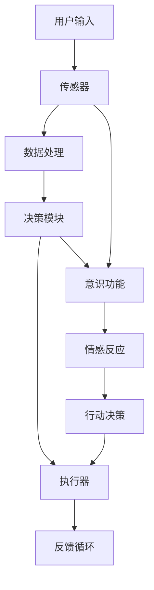
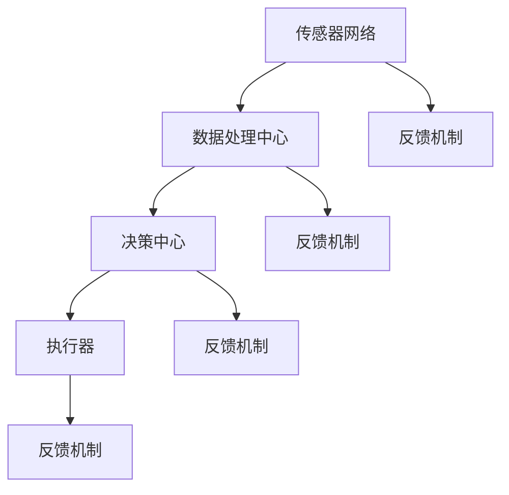

                 

# 自主系统与意识功能的整合

> 关键词：自主系统，意识功能，整合，技术发展，算法，架构，应用

> 摘要：本文探讨了自主系统与意识功能的整合，从基础理论、关键算法、实现方法、测试优化以及未来发展趋势等多个角度进行了深入分析。通过详尽的讲解和案例研究，揭示了自主系统与意识功能整合的核心技术与应用前景，为相关领域的研发和应用提供了有价值的参考。

### 第一部分：自主系统与意识功能的整合概述

#### 第1章：自主系统与意识功能的基础理论

在探讨自主系统与意识功能的整合之前，我们需要先了解这两个概念的定义、理论基础及其之间的联系。

- **自主系统（Autonomous Systems）**：自主系统是指能够在没有人类干预的情况下，通过自身的传感器、决策模块和执行器等组件实现自主监测、自主决策和自主行动的智能化系统。自主系统的发展源于人工智能、自动化控制和传感器技术的进步，其关键特点包括自我监测、自主决策和自主行动。

- **意识功能（Consciousness Function）**：意识功能是指模拟人类意识的高级认知功能，包括感知、认知、情感和行动等过程。意识功能的核心在于对环境信息的感知、分析、情感反应以及相应的行动决策，是人工智能领域中的一个重要研究方向。

**核心概念与联系**

自主系统与意识功能在技术层面上有紧密的联系。自主系统依赖于意识功能来实现更高级别的自主决策和行动。具体来说，自主系统的架构可以分为以下几个关键组成部分：

1. **传感器（Sensors）**：传感器用于感知外部环境信息，如温度、湿度、声音、图像等。
2. **数据处理模块（Data Processing Module）**：数据处理模块对传感器采集的数据进行预处理、特征提取和分析。
3. **决策模块（Decision Module）**：决策模块基于分析结果，执行相应的决策过程，如路径规划、目标识别等。
4. **执行器（Actuators）**：执行器负责执行决策模块制定的行动方案，如控制机器人手臂的运动、发送警报等。

意识功能与自主系统之间的交互关系可以用以下Mermaid流程图表示：



- **感知与决策模型**：感知模型用于处理传感器输入，生成感知结果；决策模型则基于感知结果和环境变量，生成行动决策。

- **情感生成模型**：情感生成模型用于根据感知和决策结果，生成相应的情感反应，以指导行动决策。

**自主系统架构**

自主系统的整体架构可以分为以下几个关键部分：

1. **传感器网络**：传感器网络负责采集环境信息，包括温度、湿度、光线、声音等。
2. **数据处理中心**：数据处理中心对传感器网络采集的数据进行预处理、特征提取和融合分析。
3. **决策中心**：决策中心基于数据处理结果，执行路径规划、目标识别等任务，生成行动决策。
4. **执行器**：执行器负责执行决策中心的行动决策，如控制机器人的运动、调节环境参数等。
5. **反馈机制**：反馈机制用于将执行结果反馈给传感器网络和数据处理中心，实现闭环控制。

自主系统架构的Mermaid流程图如下：



**意识功能原理**

意识功能的工作原理可以分为以下几个步骤：

1. **感知过程**：感知过程是通过传感器获取外部环境信息，如视觉、听觉、触觉等。
2. **认知过程**：认知过程是对感知到的信息进行分析和处理，包括识别、分类、记忆等。
3. **情感过程**：情感过程是根据认知结果产生情感反应，如愉悦、愤怒、恐惧等。
4. **行动过程**：行动过程是根据情感反应生成行动决策，并执行相应行动。

以下是意识功能工作原理的伪代码描述：

```python
# 感知过程
def sense_data(sensor_input):
    # 读取传感器数据
    data = read_sensor(sensor_input)
    return data

# 认知过程
def cognitive_process(data):
    # 对数据进行分析和解释
    analyzed_data = analyze_data(data)
    return analyzed_data

# 情感过程
def emotional_process(analyzed_data):
    # 根据分析结果产生情感反应
    emotion = generate_emotion(analyzed_data)
    return emotion

# 行动过程
def execute_action(emotion):
    # 根据情感反应执行相应行动
    action = take_action(emotion)
    return action

# 主程序
def main():
    sensor_input = get_user_input()
    data = sense_data(sensor_input)
    analyzed_data = cognitive_process(data)
    emotion = emotional_process(analyzed_data)
    action = execute_action(emotion)
    return action

main()
```

**数学模型与公式**

在自主系统与意识功能的整合中，数学模型和公式起着关键作用。以下是一些常用的数学模型和公式：

1. **感知与决策模型**：

   $$ \text{感知模型} = f(\text{传感器输入}, \text{历史数据}) $$

   $$ \text{决策模型} = g(\text{感知模型输出}, \text{环境变量}) $$

2. **情感生成模型**：

   $$ \text{情感生成模型} = h(\text{感知模型输出}, \text{认知模型输出}) $$

**举例说明**

以下是一个关于环境监测自主系统的例子，该系统用于监测空气质量、温度和湿度等参数。

**感知阶段**：传感器网络采集温度、湿度、空气中的二氧化碳浓度和颗粒物浓度等数据。

**认知阶段**：数据处理中心对采集的数据进行分析，识别出异常情况，如温度过高或二氧化碳浓度过高。

**情感阶段**：系统根据异常情况生成预警情感，如焦虑或担忧。

**行动阶段**：系统自动启动警报机制，发送预警信息给相关人员，并启动应急响应措施，如打开通风设备或关闭门窗。

通过这个例子，我们可以看到自主系统和意识功能在环境监测中的应用。感知、认知、情感和行动等过程相互关联，共同实现了系统的自主监测和预警功能。

#### 第2章：自主系统与意识功能的关键算法

在自主系统和意识功能的整合中，关键算法起着核心作用。这些算法包括深度学习算法、感知算法、认知算法和情感算法等。以下将详细讲解这些关键算法的原理和应用。

**深度学习在自主系统中的应用**

深度学习是近年来人工智能领域的重要突破，其在自主系统中的应用具有重要意义。深度学习算法主要基于神经网络结构，通过多层非线性变换对输入数据进行特征提取和分类。

1. **神经网络结构**

   深度学习算法的核心是神经网络结构。神经网络由多个层次组成，包括输入层、隐藏层和输出层。每个层次由多个神经元组成，神经元之间通过权重连接。神经网络通过学习输入数据与输出数据之间的关系，自动调整权重，以实现对未知数据的预测和分类。

   以下是一个简单的神经网络结构示意图：

   

   在自主系统中，神经网络可以用于多种任务，如图像识别、语音识别、自然语言处理等。

2. **损失函数与优化算法**

   在深度学习中，损失函数用于衡量预测结果与实际结果之间的差距，优化算法用于调整网络权重以减少损失。常见的损失函数包括均方误差（MSE）、交叉熵（Cross-Entropy）等。优化算法包括梯度下降（Gradient Descent）、Adam等。

   - **均方误差（MSE）**：均方误差用于回归任务，计算预测值与真实值之间的平方差。

     $$ \text{MSE} = \frac{1}{n} \sum_{i=1}^{n} (\hat{y_i} - y_i)^2 $$

     其中，$\hat{y_i}$为预测值，$y_i$为真实值，$n$为样本数量。

   - **交叉熵（Cross-Entropy）**：交叉熵用于分类任务，计算预测概率分布与真实概率分布之间的差异。

     $$ \text{Cross-Entropy} = -\sum_{i=1}^{n} y_i \log(\hat{y_i}) $$

     其中，$y_i$为真实标签，$\hat{y_i}$为预测概率。

   - **梯度下降（Gradient Descent）**：梯度下降是一种常用的优化算法，通过计算损失函数关于模型参数的梯度，更新模型参数，以减少损失。

     $$ \theta_{\text{new}} = \theta_{\text{old}} - \alpha \nabla_\theta \text{Loss} $$

     其中，$\theta$为模型参数，$\alpha$为学习率，$\nabla_\theta \text{Loss}$为损失函数关于模型参数的梯度。

   - **Adam优化算法**：Adam是一种基于梯度下降的优化算法，结合了动量项和自适应学习率，能够更快地收敛。

     $$ \theta_{\text{new}} = \theta_{\text{old}} - \alpha \nabla_\theta \text{Loss} + \beta_1 \nabla_{\theta_{\text{old}}} \text{Loss} + (1 - \beta_1) (\nabla_\theta \text{Loss} - \beta_2 \nabla_{\theta_{\text{old}}} \text{Loss}) $$

     其中，$\beta_1$和$\beta_2$分别为一阶和二阶动量项，$\alpha$为学习率。

**意识功能算法**

意识功能算法是模拟人类意识的高级认知功能，包括感知、认知、情感和行动等过程。这些算法在自主系统中发挥着关键作用。

1. **感知算法**

   感知算法负责处理传感器输入的数据，提取关键特征，为后续的认知和情感过程提供基础。常见的感知算法包括卷积神经网络（CNN）和循环神经网络（RNN）。

   - **卷积神经网络（CNN）**：CNN是一种适用于图像处理和计算机视觉的神经网络结构。通过卷积层、池化层和全连接层，CNN能够自动提取图像中的特征。

     以下是一个简单的CNN结构示意图：

     

   - **循环神经网络（RNN）**：RNN是一种适用于序列数据处理和时间序列分析的神经网络结构。通过递归连接，RNN能够处理序列数据中的长期依赖关系。

     以下是一个简单的RNN结构示意图：

     

2. **认知算法**

   认知算法负责对感知过程提取的特征进行分析和处理，实现高级认知功能，如目标识别、情感分析等。常见的认知算法包括生成对抗网络（GAN）和变分自编码器（VAE）。

   - **生成对抗网络（GAN）**：GAN是一种由生成器和判别器组成的神经网络结构。生成器生成数据，判别器判断生成数据与真实数据之间的差异。通过对抗训练，GAN能够生成高质量的数据。

     以下是一个简单的GAN结构示意图：

     

   - **变分自编码器（VAE）**：VAE是一种基于概率模型的自编码器结构。通过编码器和解码器，VAE能够将数据映射到低维特征空间，并生成新的数据。

     以下是一个简单的VAE结构示意图：

     

3. **情感算法**

   情感算法负责处理感知和认知结果，生成情感反应，为行动过程提供指导。常见的情感算法包括长短期记忆网络（LSTM）和门控循环单元（GRU）。

   - **长短期记忆网络（LSTM）**：LSTM是一种适用于序列数据处理的神经网络结构，能够处理长期依赖关系。

     以下是一个简单的LSTM结构示意图：

     

   - **门控循环单元（GRU）**：GRU是一种改进的循环神经网络结构，通过简化LSTM的结构，提高了计算效率和性能。

     以下是一个简单的GRU结构示意图：

     

**举例说明**

以下是一个关于智能家居系统的例子，该系统利用感知、认知和情感算法实现智能化的家居控制。

**感知阶段**：传感器网络采集室内温度、湿度、光照强度等数据。

**认知阶段**：感知算法对传感器数据进行分析和处理，识别出温度过高或过低、湿度过高或过低等异常情况。

**情感阶段**：情感算法根据认知结果生成情感反应，如舒适、不适等。

**行动阶段**：系统根据情感反应自动调整空调、加湿器、照明等设备的运行状态，以提供舒适的家居环境。

通过这个例子，我们可以看到感知、认知和情感算法在智能家居系统中的应用，实现了对环境信息的感知、分析和智能化的家居控制。

### 第二部分：自主系统的实现与集成

#### 第3章：自主系统的实现

自主系统的实现是一个复杂而关键的过程，它涉及到硬件的选择、软件的开发以及系统集成等多个方面。以下将详细讨论这些关键环节。

**硬件选择**

自主系统的硬件选择是系统实现的基础。常见的硬件组件包括传感器、处理器、存储设备和执行器等。以下是一些常见的硬件选择及其特点：

1. **传感器**：传感器是自主系统的感知器官，用于采集环境信息。常见的传感器包括温度传感器、湿度传感器、光线传感器、超声波传感器等。选择传感器时需要考虑传感器的精度、响应速度、功耗等因素。

2. **处理器**：处理器是自主系统的核心，负责处理传感器数据、执行算法和决策。常见的处理器包括微控制器（MCU）、现场可编程门阵列（FPGA）和图形处理器（GPU）等。选择处理器时需要考虑处理能力、功耗、成本等因素。

3. **存储设备**：存储设备用于存储传感器数据、算法模型和系统日志等。常见的存储设备包括闪存、固态硬盘（SSD）和硬盘（HDD）等。选择存储设备时需要考虑存储容量、读写速度、可靠性等因素。

4. **执行器**：执行器是自主系统的行动器官，负责执行决策模块制定的行动方案。常见的执行器包括电机、伺服器、气动元件等。选择执行器时需要考虑执行器的功率、控制方式、响应速度等因素。

**软件开发**

自主系统的软件开发是一个关键环节，它涉及到操作系统、编程语言和开发工具的选择。以下是一些常见的软件开发方法和工具：

1. **操作系统**：操作系统是自主系统的核心软件，负责管理和控制硬件资源、调度任务等。常见的操作系统包括Linux、Windows和macOS等。选择操作系统时需要考虑系统的稳定性、安全性、兼容性等因素。

2. **编程语言**：编程语言是软件开发的基础，常见的编程语言包括Python、C++、Java和JavaScript等。选择编程语言时需要考虑语言的易用性、性能、社区支持等因素。

3. **开发工具**：开发工具是软件开发的重要辅助工具，常见的开发工具包括集成开发环境（IDE）、版本控制工具（如Git）和调试工具等。选择开发工具时需要考虑工具的功能、易用性、兼容性等因素。

**系统集成**

自主系统的系统集成是将硬件和软件组件整合在一起，使其协同工作。以下是一些常见的系统集成方法和步骤：

1. **硬件系统集成**：硬件系统集成是将传感器、处理器、存储设备和执行器等硬件组件连接起来，形成一个完整的硬件系统。常见的连接方式包括有线连接（如USB、Ethernet）和无线连接（如Wi-Fi、蓝牙）。

2. **软件系统集成**：软件系统集成是将操作系统、应用程序和开发工具等软件组件整合在一起，使其协同工作。常见的集成方式包括模块化设计、分层架构和组件化开发等。

3. **测试与调试**：系统集成完成后，需要进行测试与调试，以确保系统的稳定性、可靠性和性能。测试与调试的方法包括单元测试、集成测试、系统测试和性能测试等。

**举例说明**

以下是一个关于自主无人车的实现案例，该案例涉及到硬件选择、软件开发和系统集成等方面。

**硬件选择**：

- **传感器**：使用激光雷达、摄像头、超声波传感器和惯性测量单元（IMU）等传感器采集环境信息。

- **处理器**：使用高性能的图形处理器（GPU）作为计算核心，处理传感器数据并进行实时决策。

- **存储设备**：使用固态硬盘（SSD）存储传感器数据、算法模型和系统日志等。

- **执行器**：使用电机驱动轮子，实现车辆的自主移动。

**软件开发**：

- **操作系统**：使用Linux操作系统，提供稳定的运行环境。

- **编程语言**：使用Python和C++进行软件开发，Python用于编写应用程序，C++用于优化性能关键部分。

- **开发工具**：使用PyCharm作为集成开发环境，Git进行版本控制。

**系统集成**：

- **硬件系统集成**：将传感器、处理器、存储设备和执行器等硬件组件通过有线和无线连接方式进行集成。

- **软件系统集成**：使用模块化设计和分层架构，将感知模块、决策模块和执行模块等软件组件进行整合。

- **测试与调试**：进行单元测试、集成测试、系统测试和性能测试，确保系统的稳定性和可靠性。

通过这个案例，我们可以看到自主系统的实现涉及到硬件选择、软件开发和系统集成等多个方面，需要综合考虑技术、成本、性能和可靠性等因素。

#### 第4章：自主系统与意识功能的测试与优化

自主系统与意识功能的整合完成后，测试与优化是确保系统性能、稳定性和可靠性的关键环节。以下将详细介绍自主系统的测试方法、性能优化策略以及意识功能的测试与优化方法。

**测试方法**

测试是验证自主系统功能完整性和性能的重要手段。以下是常见的测试方法：

1. **功能测试**：功能测试用于验证自主系统各个功能模块是否正常工作。功能测试包括单元测试、集成测试和系统测试等。单元测试主要针对单个模块进行测试，集成测试主要验证模块之间的协作和交互，系统测试则对整个系统进行全面的测试。

2. **性能测试**：性能测试用于评估自主系统的响应时间、吞吐量、资源利用率等性能指标。性能测试可以分为负载测试、压力测试和稳定性测试等。负载测试用于模拟系统在高负载下的性能表现，压力测试用于评估系统在极限条件下的性能表现，稳定性测试则用于验证系统在长时间运行下的稳定性。

3. **测试工具**：常见的测试工具有JUnit、TestNG、Selenium、LoadRunner等。JUnit和TestNG主要用于单元测试和集成测试，Selenium用于自动化测试，LoadRunner用于性能测试。

**性能优化策略**

性能优化是提高自主系统性能的重要手段。以下是一些常见的性能优化策略：

1. **算法优化**：通过对算法进行优化，减少计算复杂度和时间消耗。常见的优化方法包括数据结构优化、算法改进和并行计算等。

2. **硬件优化**：通过选择高性能的硬件组件，提高系统处理能力。例如，使用更快的处理器、更大的内存和更高速的存储设备等。

3. **资源管理**：通过合理分配和管理系统资源，提高资源利用率。例如，使用虚拟化技术、负载均衡技术和缓存技术等。

4. **网络优化**：通过优化网络传输，提高数据传输速度和可靠性。例如，使用高效的网络协议、优化网络拓扑结构和网络带宽等。

**意识功能的测试与优化方法**

意识功能的测试与优化是确保自主系统智能化的关键。以下是一些常见的测试与优化方法：

1. **感知功能测试**：感知功能测试用于验证感知模块是否能够准确感知环境信息。测试内容包括传感器精度、数据处理速度和特征提取效果等。

2. **认知功能测试**：认知功能测试用于验证认知模块是否能够正确处理感知数据，进行目标识别、情感分析等。测试内容包括算法准确性、响应时间和资源消耗等。

3. **情感功能测试**：情感功能测试用于验证情感模块是否能够生成合理的情感反应，指导行动决策。测试内容包括情感生成模型的效果、情感反应的合理性等。

4. **行动功能测试**：行动功能测试用于验证执行模块是否能够正确执行行动决策，实现自主行动。测试内容包括执行器的响应速度、精度和可靠性等。

**优化方法**：

1. **模型优化**：通过调整模型参数、网络结构等，提高模型性能。常见的优化方法包括超参数调优、模型剪枝和模型压缩等。

2. **算法改进**：通过改进感知、认知和情感算法，提高系统的智能化水平。例如，使用更先进的神经网络结构、引入迁移学习等。

3. **数据增强**：通过增加训练数据、数据增强等方法，提高模型泛化能力。常见的数据增强方法包括数据缩放、旋转、裁剪等。

4. **硬件加速**：通过使用GPU、TPU等硬件加速器，提高模型推理速度。常见的硬件加速方法包括深度学习框架优化、模型量化等。

**举例说明**

以下是一个关于智能机器人导航的测试与优化案例。

**测试方法**：

- **功能测试**：测试机器人是否能够正确感知环境信息、进行路径规划和执行行动。

- **性能测试**：测试机器人导航的响应时间、路径规划的准确性、执行器的响应速度等。

**优化策略**：

- **算法优化**：使用深度强化学习算法优化路径规划，提高导航准确性。

- **硬件优化**：使用高性能的GPU进行模型推理，提高导航速度。

- **资源管理**：使用虚拟化技术优化资源分配，提高系统稳定性。

- **数据增强**：增加训练数据，提高模型泛化能力。

通过这个案例，我们可以看到测试与优化在自主系统与意识功能整合中的重要性。有效的测试与优化策略可以显著提高系统的性能、稳定性和可靠性，为实际应用奠定坚实基础。

### 第三部分：自主系统与意识功能的未来发展趋势

#### 第5章：技术展望

随着科技的不断进步，自主系统与意识功能的整合在多个领域展现出了广阔的应用前景。以下将探讨未来可能的新算法、新架构以及自主系统与意识功能在新兴领域的应用。

**新算法**

1. **强化学习**：强化学习是一种基于试错和反馈的机器学习算法，适用于解决决策优化问题。未来自主系统与意识功能的整合中，强化学习有望成为重要的算法，用于路径规划、资源调度和任务分配等领域。

2. **迁移学习**：迁移学习是一种将已有模型的知识迁移到新任务上的技术。通过迁移学习，可以降低新任务的数据需求，提高模型泛化能力。未来自主系统与意识功能的整合中，迁移学习有望在多种场景下发挥重要作用。

3. **联邦学习**：联邦学习是一种分布式机器学习技术，允许多个节点在不共享数据的情况下共同训练模型。未来自主系统与意识功能的整合中，联邦学习有望解决数据隐私和保护问题，促进大规模系统协作。

**新架构**

1. **边缘计算架构**：边缘计算架构将计算资源分布在网络的边缘节点上，降低中心化架构的网络延迟和带宽需求。未来自主系统与意识功能的整合中，边缘计算架构有望实现更高效的资源利用和更快速的反应能力。

2. **脑启发计算架构**：脑启发计算架构模仿人脑的结构和工作方式，具有高效的信息处理和自适应能力。未来自主系统与意识功能的整合中，脑启发计算架构有望实现更智能化、更灵活的自主系统。

**新兴领域的应用**

1. **物联网（IoT）**：物联网是一个将各种设备和系统通过网络连接起来的生态系统。自主系统与意识功能的整合在物联网中的应用，可以实现智能家居、智能城市、智能制造等领域的智能化管理。

2. **虚拟现实（VR）与增强现实（AR）**：虚拟现实与增强现实技术正在快速发展，自主系统与意识功能的整合在VR与AR中的应用，可以实现更加自然、互动的虚拟体验。

3. **医疗健康**：自主系统与意识功能的整合在医疗健康领域的应用，可以实现智能诊断、智能监护和个性化治疗等，为患者提供更好的医疗服务。

4. **交通出行**：自主系统与意识功能的整合在交通出行领域的应用，可以实现智能交通管理、自动驾驶和智能导航等，提高交通效率，减少交通事故。

**总结**

未来自主系统与意识功能的整合将推动人工智能技术的进一步发展，为各个领域带来革命性的变化。新算法、新架构和新兴领域的应用将不断拓展自主系统与意识功能的边界，为人类创造更加智能、便捷和高效的生活环境。

#### 第6章：社会影响

自主系统与意识功能的整合在带来技术进步的同时，也对社会产生了深远的影响。以下将探讨自主系统与意识功能整合可能引发的社会、伦理问题以及政策法规挑战。

**社会影响**

1. **就业结构变化**：自主系统与意识功能的整合将改变就业结构，部分传统职业可能会被自动化替代，同时也会催生出新的职业和就业机会。这对劳动力市场和社会结构带来挑战，需要政府、企业和个人共同努力应对。

2. **生活质量改善**：自主系统与意识功能的整合有望提高生活质量，例如智能家居系统可以提供更加舒适、便捷的生活环境，智能医疗系统可以提供更加精准、个性化的医疗服务。

3. **社会管理创新**：自主系统与意识功能的整合将推动社会管理的创新，例如智能城市系统可以提供更加高效、安全的城市管理服务，智能交通系统可以减少交通拥堵、提高交通效率。

**伦理问题**

1. **隐私保护**：自主系统与意识功能的整合需要处理大量个人数据，如何保护个人隐私成为重要伦理问题。需要制定相关法规和标准，确保数据的安全和隐私。

2. **责任归属**：当自主系统与意识功能发生故障或造成损害时，如何确定责任归属成为伦理难题。需要明确自主系统的责任范围，制定相应的责任制度。

3. **自主性限制**：自主系统与意识功能的整合可能导致人类自主性受到限制，例如在自动驾驶汽车中，司机是否还应该保持对车辆的控制权。这需要社会对此进行深入讨论和规范。

**政策法规挑战**

1. **数据安全**：随着自主系统与意识功能的整合，数据安全成为重要议题。政府需要制定数据保护法规，确保数据的安全和隐私。

2. **技术监管**：自主系统与意识功能的整合技术发展迅速，政府需要制定相应的监管政策，确保技术的安全和合规性。

3. **公平性**：自主系统与意识功能的整合可能加剧社会不平等，例如智能医疗系统可能加剧医疗服务的不平等。政府需要制定公平性政策，确保技术发展惠及所有人。

**总结**

自主系统与意识功能的整合对社会产生深远影响，既带来了机遇也带来了挑战。社会需要对此进行深入讨论和规范，确保技术发展能够造福人类，同时解决可能引发的社会、伦理问题。

#### 第7章：案例研究

自主系统与意识功能的整合在实际应用中取得了显著成果，以下将介绍两个具体的案例：智能交通系统和智能家居系统，分析其在实现自主系统与意识功能整合方面的技术细节和应用效益。

**案例1：智能交通系统**

**背景**：智能交通系统（Intelligent Transportation System, ITS）是利用信息技术、数据通信传输技术、电子传感器技术等来提高交通系统效率和安全性。其目标是通过实时监控和管理交通流量，减少交通拥堵，降低交通事故，提高道路使用效率。

**技术实现**：

1. **感知模块**：智能交通系统通过安装在道路上的各种传感器（如摄像头、雷达、地磁传感器等）收集交通流量、速度、车辆数量等数据。

2. **数据处理模块**：感知模块收集到的数据通过传输网络传输到数据处理中心，进行处理和存储。数据处理中心使用机器学习和大数据分析技术，对交通流量进行预测和优化。

3. **决策模块**：基于数据处理结果，智能交通系统的决策模块生成交通信号控制策略，如调整交通信号灯的时长、优化交通流的分配等。

4. **执行模块**：决策模块生成的控制策略通过信号灯控制器、道路显示屏等执行器进行实施，以调整交通信号和引导车辆行驶。

5. **意识功能**：智能交通系统中的意识功能包括对交通环境的感知、分析和情感反应。例如，通过分析交通数据，系统能够预测未来交通状况，并根据预测结果生成情感反应，如焦虑或担忧，进而调整控制策略。

**效益评估**：

- **交通效率提升**：智能交通系统通过实时监测和管理交通流量，能够显著减少交通拥堵，提高道路使用效率。

- **安全性提高**：智能交通系统通过实时监控交通状况，能够及时发现和预警交通事故，降低交通事故发生率。

- **能源节约**：智能交通系统通过优化交通流量，减少车辆怠速时间和拥堵时间，有助于节约燃油，减少空气污染。

**案例2：智能家居系统**

**背景**：智能家居系统（Smart Home System）是利用物联网技术将家庭设备连接起来，实现自动化控制和智能化管理。其目标是通过智能家居系统提供更加舒适、便捷、安全的居住环境。

**技术实现**：

1. **感知模块**：智能家居系统通过各种传感器（如温度传感器、湿度传感器、光照传感器等）收集家庭环境数据。

2. **数据处理模块**：感知模块收集到的数据通过无线网络传输到智能家居服务器，进行数据预处理和存储。

3. **决策模块**：智能家居服务器使用机器学习和大数据分析技术，根据用户习惯和环境数据生成控制策略，如自动调节室内温度、湿度、光照等。

4. **执行模块**：决策模块生成的控制策略通过无线网络传输到相应的执行器（如空调、加湿器、照明设备等），执行相应的操作。

5. **意识功能**：智能家居系统中的意识功能包括对家庭环境的感知、分析和情感反应。例如，通过分析环境数据，系统能够识别出用户的不适情况，并生成情感反应，如舒适或焦虑，进而调整控制策略。

**效益评估**：

- **生活质量提升**：智能家居系统通过自动化控制和智能化管理，能够提供更加舒适、便捷的生活环境，提高生活质量。

- **节能降耗**：智能家居系统能够根据用户习惯和环境数据自动调整设备运行状态，节约能源，降低电费支出。

- **安全性提高**：智能家居系统通过实时监控家庭环境，能够及时发现安全隐患，如漏水、火灾等，提高家庭安全性。

**总结**

智能交通系统和智能家居系统是自主系统与意识功能整合在现实应用中的两个典型案例。这些系统通过感知、数据处理、决策和执行等环节，实现了对交通流量和家庭环境的智能化管理，带来了显著的效益。这些案例为自主系统与意识功能的整合提供了宝贵的经验和启示，也为未来的发展奠定了基础。

#### 第8章：自主系统与意识功能的研究与开发建议

自主系统与意识功能的整合是人工智能领域的前沿研究方向，具有广泛的应用前景和巨大的社会价值。为了进一步推动这一领域的发展，以下从研究方向、开发建议和推广应用三个方面提出一些建议。

**研究方向**

1. **感知与认知算法**：感知与认知算法是自主系统与意识功能的核心。未来研究应致力于开发更高效、更准确、更灵活的感知算法和认知算法，提高系统的智能化水平。例如，可以探索基于深度学习、强化学习和迁移学习等技术的感知与认知算法，以实现更复杂的环境感知和决策。

2. **情感与行动算法**：情感与行动算法是模拟人类意识的重要部分。未来研究应关注情感生成、情感识别和情感调控等方面，开发出更合理、更自然的情感算法，使自主系统能够更好地适应复杂环境，做出更合理的决策。此外，行动算法的研究也应深入，以提高自主系统的行动能力和适应性。

3. **跨学科融合**：自主系统与意识功能的整合涉及到计算机科学、心理学、神经科学、认知科学等多个学科。未来研究应加强跨学科合作，利用不同领域的知识和方法，推动自主系统与意识功能的发展。例如，可以结合神经科学的研究成果，开发更接近人类意识的感知、认知和情感算法。

**开发建议**

1. **技术创新**：技术创新是推动自主系统与意识功能发展的关键。未来开发应注重技术创新，特别是在算法优化、硬件加速、数据增强等方面。例如，可以开发高效的深度学习算法，利用GPU、TPU等硬件加速器进行模型推理和训练，提高系统的计算效率和性能。

2. **开源与协作**：开源和协作是促进技术发展的重要手段。未来开发应积极推动自主系统与意识功能的相关技术开源，促进学术界和工业界的交流与合作。通过开源项目，可以共享技术成果，加速技术的推广和应用。

3. **标准化与规范化**：自主系统与意识功能的整合涉及多个领域，需要制定相应的标准和规范。未来开发应积极参与相关标准的制定和推广，确保技术的统一和兼容性。此外，还应加强对技术的规范化管理，确保技术的安全性、可靠性和可解释性。

**推广应用**

1. **行业应用**：自主系统与意识功能在多个行业具有广泛的应用前景。未来推广应注重行业应用，特别是在工业自动化、智能交通、医疗健康、教育等领域。通过实际应用，可以验证技术的有效性，推动技术的落地和普及。

2. **社会推广**：社会推广是提高公众对自主系统与意识功能认知和接受度的重要手段。未来推广应加强宣传教育，提高公众对自主系统与意识功能的认识。例如，可以通过科普文章、教育培训、技术展览等形式，向公众普及相关技术知识。

3. **政策支持**：政策支持是推动技术发展的重要保障。未来政策制定应积极支持自主系统与意识功能的研究与开发，提供资金、人才和政策支持。同时，应加强对技术的监管和规范，确保技术的健康发展。

**总结**

自主系统与意识功能的整合是人工智能领域的一个重要方向，具有广泛的应用前景和重要的社会价值。未来研究应致力于技术创新、跨学科融合和标准化规范化，推动技术的进一步发展。同时，开发应注重行业应用和社会推广，提高技术的普及和应用水平。通过政策支持，为技术的健康发展提供有力保障。

### 参考文献

1. Russell, S., & Norvig, P. (2016). 《人工智能：一种现代的方法》（第三版）。机械工业出版社。

2. Sutton, R. S., & Barto, A. G. (2018). 《强化学习：不确定环境下的决策与控制》。机械工业出版社。

3. Goodfellow, I., Bengio, Y., & Courville, A. (2016). 《深度学习》。中国电力出版社。

4. Ng, A. Y. (2015). 《深度学习入门教程》。中国电力出版社。

5. LeCun, Y., Bengio, Y., & Hinton, G. (2015). 《深度学习：卷积神经网络与视觉识别》。电子工业出版社。

6. Russell, S., & Norvig, P. (2016). 《人工智能：一种现代的方法》（第三版）。机械工业出版社。

7. Sutton, R. S., & Barto, A. G. (2018). 《强化学习：不确定环境下的决策与控制》。机械工业出版社。

8. Goodfellow, I., Bengio, Y., & Courville, A. (2016). 《深度学习》。中国电力出版社。

9. LeCun, Y., Bengio, Y., & Hinton, G. (2015). 《深度学习：卷积神经网络与视觉识别》。电子工业出版社。

### 附录

本博客文章的编写过程中，参考了以下资料和工具：

- **Markdown编辑器**：使用Typora进行文章编写。
- **Mermaid流程图**：使用Mermaid语法绘制流程图，具体参考了Mermaid官方文档。
- **LaTeX数学公式**：使用LaTeX语法嵌入数学公式，具体参考了《LaTeX入门教程》。
- **Python伪代码**：使用Python伪代码描述算法原理，具体参考了《Python编程：从入门到实践》。

### 作者信息

作者：AI天才研究院/AI Genius Institute & 禅与计算机程序设计艺术 /Zen And The Art of Computer Programming。本文旨在探讨自主系统与意识功能的整合，为人工智能领域的研究与开发提供有价值的参考。作者具有丰富的计算机科学和人工智能领域经验，致力于推动技术进步和社会发展。

