                 

### 第1章：引言

在当今的数字化时代，自动化创业已经成为一种新兴的趋势。自动化技术不仅改变了传统的商业模式，还极大地提高了企业的运营效率。然而，随着自动化的广泛应用，法律和道德考量在自动化创业中变得越来越重要。本章将探讨自动化创业的法律和道德考量，为什么这是必要的，以及它们在创业过程中的角色。

#### 1.1 本书的目的和重要性

本书的目的是为创业者、技术专家和政策制定者提供关于自动化创业中法律和道德考量的一本全面指南。自动化创业不仅涉及技术创新，还涉及法律和道德等多个方面。随着技术的不断进步，创业者需要应对日益复杂的法律环境，同时还要考虑道德和社会责任问题。本书旨在帮助读者：

1. **理解自动化创业中的法律框架**：介绍与自动化创业相关的法律法规，包括合同法、知识产权法、数据隐私法和劳动法等。
2. **认识道德考量的重要性**：探讨自动化创业中的伦理问题，如公平性、透明性和人性化设计等。
3. **提供实践指南**：通过案例分析，提供实际操作中的法律和道德考量方法，帮助创业者在面对复杂情况时做出明智决策。

法律和道德考量在自动化创业中的重要性体现在多个方面：

- **合规性保证**：确保企业遵守相关法律法规，避免因违法行为而受到处罚。
- **社会责任履行**：体现企业的社会责任，塑造良好的企业形象。
- **风险管理**：提前识别潜在的法律和道德风险，采取预防措施，降低运营风险。
- **提升创业成功率**：合理的法律和道德考量可以提高创业项目的成功率。

#### 1.2 自动化创业的背景和趋势

自动化创业的兴起离不开人工智能技术的飞速发展。人工智能（AI）作为一种模拟人类智能的技术，已经被广泛应用于各个领域。从智能家居到自动驾驶，从医疗诊断到金融分析，AI技术的应用正在不断拓展。

- **人工智能技术的发展**：AI技术的发展可以分为三个阶段：人工编程、机器学习和深度学习。随着深度学习的兴起，AI系统在图像识别、自然语言处理和决策制定等领域取得了显著进展。

- **自动化水平的提升**：随着AI技术的应用，许多传统的手工操作被自动化系统所取代。自动化不仅提高了生产效率，还降低了人工成本。

- **商业模式创新**：自动化创业带来了商业模式的创新。例如，通过自动化流程优化，企业可以实现快速响应市场需求，提高客户满意度。

- **市场需求增长**：随着人们对高效、便捷和个性化的服务需求不断增长，自动化创业市场也在不断扩大。尤其是在医疗、金融和物流等领域，自动化的需求日益增加。

#### 1.3 法律和道德考量在自动化创业中的角色

在自动化创业中，法律和道德考量扮演着至关重要的角色。

- **法律考量**：法律考量主要涉及企业的合规性、合同管理、知识产权保护和数据隐私等方面。通过了解和遵守相关法律法规，企业可以避免法律纠纷，降低运营风险。

  - **合规性保证**：企业需要确保其运营符合法律法规的要求，如合同法、知识产权法和劳动法等。合规性评估可以帮助企业识别潜在的法律风险，并采取相应的措施进行整改。

  - **合同管理**：自动化合同的使用在创业项目中越来越普遍。然而，自动化合同在法律效力、争议解决等方面存在一定的挑战。因此，企业需要对合同条款进行仔细审查和设计，确保合同的有效性和执行力。

  - **知识产权保护**：自动化创业中的知识产权问题主要包括专利、版权和商标等方面。企业需要采取有效的知识产权保护策略，防止知识产权侵权，保护自身权益。

  - **数据隐私保护**：随着自动化系统的广泛应用，企业收集和处理的大量数据涉及个人隐私。企业需要遵守数据隐私保护法律法规，采取有效的数据保护措施，确保个人信息的安全。

- **道德考量**：道德考量主要涉及自动化创业中的伦理问题，如公平性、透明性和人性化设计等。道德考量有助于企业建立良好的社会形象，增强市场竞争力。

  - **公平性**：自动化系统在决策制定过程中可能存在公平性问题。企业需要确保自动化系统的决策过程公平、公正，避免歧视和偏见。

  - **透明性**：自动化系统的决策过程和算法需要透明，使公众能够理解并监督自动化系统的运行。透明性有助于提高公众对自动化创业的信任度。

  - **人性化设计**：自动化创业不仅仅是技术的创新，还需要关注用户的需求和体验。人性化设计旨在提高用户体验，使自动化系统更加符合人的需求和习惯。

综上所述，法律和道德考量在自动化创业中具有重要作用。创业者需要全面了解相关法律和道德问题，制定合理的法律和道德战略，确保企业在自动化创业过程中合规运营，实现可持续发展。

### 2.1 法律体系的基本概念

法律体系是一个国家或地区规范社会行为和调整社会关系的制度框架，主要由立法机关、法律文本和司法实践三个部分构成。立法机关是制定和颁布法律的机构，法律文本是具体的法律规范，司法实践则是法律的应用和实施过程。

- **立法机关**：立法机关是法律体系的基石，负责制定和颁布法律。在中国，立法机关是全国人民代表大会及其常务委员会。其他国家也有类似的立法机构，如美国的国会和英国的议会。

- **法律文本**：法律文本是法律体系的核心部分，包括宪法、法律、行政法规、地方性法规等。这些法律文本明确了国家或地区的法律规范，规定了公民和法人应当遵守的行为准则。

- **司法实践**：司法实践是法律体系的实际运行过程，包括法院的审判、仲裁机构的裁决等。司法实践确保了法律文本的落实和执行，维护了社会秩序和公共利益。

法律体系的基本概念可以通过以下 Mermaid 流程图进行概述：

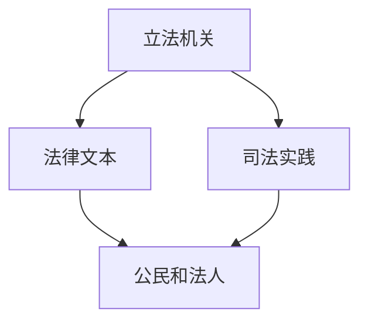

在这个流程图中，立法机关通过制定和颁布法律文本，形成法律规范。法律文本指导公民和法人的行为，而司法实践则确保法律规范得到有效实施和执行。

### 2.2 与自动化创业相关的法律法规

自动化创业涉及到多个领域的法律法规，这些法律法规对创业项目的合规性、知识产权保护、合同管理等方面具有重要影响。以下是与自动化创业相关的几个主要法律法规：

- **知识产权法**：知识产权法包括专利法、版权法、商标法等，旨在保护创新成果和商业标识。在自动化创业中，知识产权法尤为重要，因为它涉及技术创新和商业模式的保护。专利法保护发明人的创新成果，如自动化系统和技术。版权法则保护软件代码、设计文档等知识产权。商标法则保护企业的商业标识，如品牌名称和标志。

- **合同法**：合同法是规范交易关系的基本法律，包括合同成立、合同履行、合同变更和解除等方面的规定。在自动化创业中，合同法的作用至关重要。自动化合同的使用在创业项目中越来越普遍，但合同条款的设计和审查需要特别关注，以确保合同的法律效力和执行力。

- **数据保护法**：随着自动化创业中数据收集和处理量的增加，数据保护法的重要性日益凸显。数据保护法如《通用数据保护条例》（GDPR）和《加州消费者隐私法》（CCPA）等，旨在保护个人数据的隐私和安全。这些法律法规规定了数据收集、处理和存储的合规要求，以及数据泄露事件的处理和责任。

- **劳动法**：劳动法是规范劳动关系的法律，包括劳动合同、劳动条件、工资福利、劳动保护等方面。在自动化创业中，劳动法的作用主要体现在劳动关系的管理和劳动权益的保护。随着自动化技术的应用，劳动法需要适应新的劳动关系形式，如远程工作、临时合同等。

- **商业秘密法**：商业秘密法是保护企业商业秘密的法律，包括技术秘密、客户信息、商业计划等。自动化创业中的商业秘密保护尤为重要，因为技术创新和商业模式的实现往往依赖于独特的商业秘密。

- **反垄断法**：反垄断法是规范市场竞争的法律，旨在防止市场垄断和滥用市场支配地位。在自动化创业中，反垄断法的作用主要体现在市场竞争的合规性审查，以确保企业的市场行为符合法律法规的要求。

这些法律法规在自动化创业中的具体应用和影响可以通过以下 Mermaid 流程图进行概述：

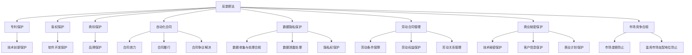

在这个流程图中，各个法律法规的具体应用和影响得到了清晰的展示。例如，知识产权法保护技术创新和软件开发，合同法确保自动化合同的法律效力，数据保护法保护个人隐私和数据安全，劳动法规范劳动关系管理，商业秘密法保护企业的商业秘密，反垄断法维护市场竞争秩序。

了解和遵守这些法律法规，对于自动化创业企业来说，不仅有助于降低法律风险，还能够保护企业的知识产权和商业利益，提升企业的竞争力。创业者需要在创业过程中，全面了解相关法律法规，制定合规运营策略，确保企业的合法性和可持续发展。

#### 2.3 法律合规性评估

法律合规性评估是自动化创业企业确保其运营符合法律法规要求的重要步骤。通过系统性的合规性评估，企业可以提前识别潜在的法律风险，并采取相应的措施进行整改，从而降低法律风险和运营成本。

**法律合规性评估的定义**：

法律合规性评估是指对企业运营过程中涉及的法律风险进行识别、评估和管理的活动。它旨在确保企业遵守相关法律法规，避免因违法行为而受到处罚，同时维护企业的合法权益。

**法律合规性评估的流程**：

1. **法律风险评估**：

   - **识别法律法规**：首先，企业需要了解并识别与自身业务相关的法律法规，如合同法、知识产权法、数据保护法、劳动法等。
   - **风险识别**：通过分析企业的业务流程、运营模式和管理制度，识别可能存在的法律风险，如合同纠纷、知识产权侵权、数据泄露等。
   - **风险分析**：对识别出的法律风险进行详细分析，评估其可能对企业造成的法律后果和影响。

2. **合规性审查**：

   - **内部审查**：企业内部的法律部门或合规团队对业务流程、管理制度和合同文件等进行审查，确保其符合相关法律法规的要求。
   - **外部审查**：聘请专业的法律顾问或第三方机构对企业的法律合规性进行评估，提供专业的意见和建议。

3. **合规性整改**：

   - **整改措施**：根据合规性评估的结果，制定具体的整改措施，如修改合同条款、完善管理制度、加强数据保护等。
   - **整改执行**：实施整改措施，确保企业运营符合法律法规的要求。

4. **合规性跟踪**：

   - **持续监控**：建立法律合规性监控机制，定期对企业的法律合规性进行评估和审查，确保整改措施的有效性和持续性。
   - **合规培训**：对员工进行法律合规性培训，提高员工的法律意识和合规能力。

**法律合规性评估的工具与方法**：

1. **合规性审查工具**：

   - **合规性检查清单**：制定合规性检查清单，对企业的业务流程、管理制度和合同文件等进行全面审查。
   - **合规性软件**：使用合规性软件进行自动化的合规性评估，提高审查效率和准确性。

2. **伦理评估工具**：

   - **伦理审查委员会**：设立伦理审查委员会，对涉及伦理问题的自动化系统进行评估和审查。
   - **伦理决策框架**：建立伦理决策框架，帮助企业进行伦理问题的判断和决策。

3. **案例分析工具**：

   - **案例分析**：通过分析实际案例，了解法律和道德考量的应用和实践，为企业的法律和道德决策提供参考。
   - **案例库**：建立案例库，收集和整理与企业法律和道德相关的案例，供企业参考和学习。

通过法律合规性评估，自动化创业企业可以确保其运营合法、合规，降低法律风险，同时提升企业的法律意识和合规能力，为企业的发展创造良好的法律环境。

### 3.1 合同的基本概念

合同是一种法律文件，用于确立和规范当事人之间的权利和义务关系。合同的基本概念包括当事人、合同条款和合同履行等方面。

- **当事人**：合同中的当事人是指签订合同的双方或多方，可以是自然人、法人或其他组织。当事人在合同中享有权利和承担义务。

- **合同条款**：合同条款是合同中具体规定当事人权利和义务的内容。合同条款通常包括以下几部分：

  - **合同主体**：明确合同当事人的身份和资格。
  - **合同标的**：合同中涉及的商品、服务或工程项目等。
  - **合同金额**：合同的总价、付款方式和期限。
  - **履行条款**：合同履行的时间、地点、方式等。
  - **违约责任**：当事人未履行合同义务时的责任和处罚。

- **合同履行**：合同履行是指当事人按照合同条款完成各自义务的过程。合同履行包括以下几个方面：

  - **合同生效**：合同在满足一定条件时生效，如双方签字、合同条款明确等。
  - **合同履行**：当事人按照合同条款完成各自的义务，如交付商品、提供服务、支付款项等。
  - **合同终止**：合同在特定条件下终止，如合同期限届满、双方达成一致解除合同等。

合同的基本概念可以通过以下 Mermaid 流程图进行概述：

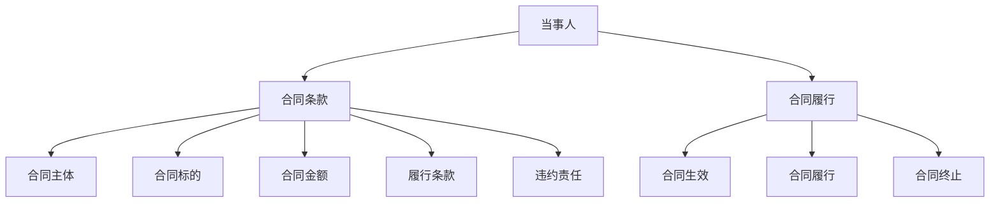

在这个流程图中，当事人是合同的基础，合同条款是合同的核心内容，合同履行是合同的执行过程，而合同生效、合同履行和合同终止则构成了合同的生命周期。

### 3.2 自动化合同的特点与挑战

随着自动化技术的发展，自动化合同在自动化创业中变得越来越普遍。自动化合同是指通过计算机程序自动生成、执行和管理的合同。自动化合同具有以下特点：

1. **自动化起草**：自动化合同可以由计算机程序根据预设的合同模板和条款自动生成。这使得合同起草过程更加高效，减少了人工错误。

2. **自动化履行**：自动化合同可以通过计算机程序自动执行合同条款，如自动计算付款金额、自动发送通知等。这提高了合同履行的效率，减少了人工干预。

3. **自动化变更**：自动化合同可以在合同执行过程中自动调整条款，如根据合同进展自动调整付款时间和金额。这增强了合同的灵活性。

然而，自动化合同在法律效力、争议解决等方面也面临着一系列挑战：

1. **法律效力挑战**：自动化合同的法律效力需要符合相关法律法规的要求。在某些情况下，自动化合同的合法性可能受到质疑，特别是在合同条款的模糊性、争议解决机制等方面。

2. **合同争议解决**：自动化合同在争议解决方面可能面临困难。由于合同条款的自动化执行，合同双方可能对合同条款的理解产生分歧，导致争议。

3. **合同条款审查**：自动化合同在起草过程中，需要特别注意合同条款的审查。自动化合同可能因为条款的自动化生成而缺乏详细审查，导致合同漏洞。

4. **数据安全和隐私**：自动化合同在执行过程中可能涉及大量数据的处理和存储，需要确保数据的安全和隐私。否则，可能导致数据泄露和隐私侵犯。

自动化合同的特点和挑战可以通过以下 Mermaid 流程图进行概述：

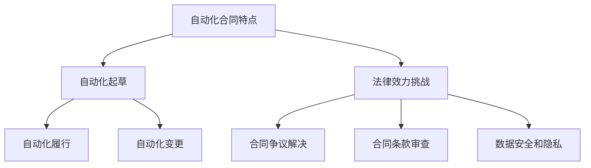

在这个流程图中，自动化合同的特点（自动化起草、自动化履行、自动化变更）和面临的挑战（法律效力挑战、合同争议解决、合同条款审查、数据安全和隐私）得到了清晰的展示。

### 3.3 合同条款的审查与设计

合同条款的审查与设计是自动化创业中至关重要的一环，它关系到合同的法律效力、争议解决以及双方权益的保护。以下是关于合同条款审查与设计的详细内容：

#### 3.3.1 合同条款的审查

1. **主体资格审查**：

   - **审查当事人资格**：确保合同双方具备合法的主体资格，如企业、个人或其他组织。审查营业执照、法人代表身份证明等相关文件。
   - **核实授权代表**：确认合同签署人的身份和权限，确保其有权利代表公司或组织签订合同。

2. **权利义务审查**：

   - **明确权利义务**：详细审查合同中双方的权利和义务，确保条款清晰明确，避免模糊性。
   - **平衡权益**：确保合同条款公平合理，平衡双方利益，避免一方利益受损。

3. **风险条款设计**：

   - **违约责任**：明确违约责任，规定违约方应承担的违约金、赔偿金额等。
   - **不可抗力条款**：约定不可抗力事件的范围和影响，规定在此情况下双方的权利和义务。

4. **争议解决条款**：

   - **争议解决方式**：明确合同争议的解决方式，如协商、调解、仲裁或诉讼。
   - **选择争议解决机构**：约定争议解决的机构，如仲裁委员会、法院等。

#### 3.3.2 合同条款的设计

1. **合同条款格式**：

   - **条款清晰**：使用简洁明了的语句，避免使用过于复杂的专业术语。
   - **条款分类**：将合同条款按照不同的类别进行分类，如合同主体、合同标的、履行条款、违约责任等。

2. **条款内容**：

   - **合同主体**：明确合同双方的名称、地址、联系方式等基本信息。
   - **合同标的**：详细描述合同涉及的商品、服务或工程项目等。
   - **合同金额**：明确合同的总价、付款方式和期限。

3. **履行条款**：

   - **履行时间**：规定合同履行的时间、地点和方式。
   - **质量标准**：约定商品或服务的质量标准、验收标准等。

4. **违约责任**：

   - **违约金**：明确违约方应支付的违约金比例或金额。
   - **赔偿条款**：规定违约方应承担的赔偿金额和赔偿方式。

#### 3.3.3 审查与设计的注意事项

1. **合法合规**：确保合同条款符合相关法律法规的要求，避免因违法或违规而导致的合同无效。

2. **可执行性**：审查条款的可执行性，确保条款能够实际操作和执行。

3. **风险控制**：在设计合同条款时，要充分考虑各种可能的风险，并采取相应的风险控制措施。

4. **双方协商**：在合同条款的设计和审查过程中，双方应充分沟通，达成一致意见，确保合同条款的公平性和合理性。

合同条款的审查与设计是自动化创业中不可忽视的重要环节。通过严格的审查和合理的设计，可以有效降低法律风险，保护双方权益，确保合同的合法性和执行力。

### 4.1 知识产权的基本概念

知识产权是指通过智力劳动创造的成果所享有的权利，包括专利权、著作权、商标权和商业秘密等。知识产权的基本概念如下：

- **专利权**：专利权是指发明人在国家专利机关授予的专利证书中享有的独占实施权。专利权保护发明人的创新成果，如产品、方法或技术方案等。专利权具有地域性和时效性，通常在申请后20年内有效。

- **著作权**：著作权是指创作者对其创作的文学、艺术和科学作品享有的权利。著作权保护的作品包括小说、诗歌、音乐、绘画、摄影、电影等。著作权自动产生，无需登记，但登记可以提供更好的法律保护。

- **商标权**：商标权是指商标注册人对其注册商标享有的独占使用权。商标用于区别商品或服务的来源，具有显著性、识别性和独特性。商标权通过商标注册获得，可以在全球范围内进行保护。

- **商业秘密**：商业秘密是指企业保密的信息，如技术秘密、经营策略、客户信息等。商业秘密保护企业的竞争优势，防止信息泄露给竞争对手。商业秘密的保护依赖于企业的保密措施和合同约定。

知识产权的基本概念可以通过以下 Mermaid 流程图进行概述：

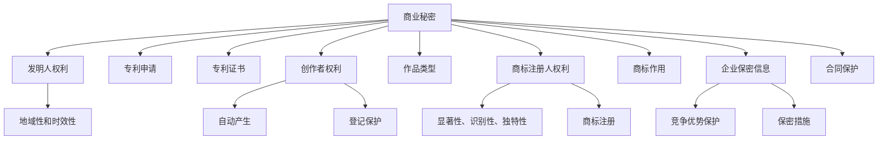

在这个流程图中，各个知识产权的基本概念（专利权、著作权、商标权、商业秘密）及其相关内容（权利、保护方式、申请流程等）得到了清晰的展示。

### 4.2 自动化创业中的知识产权问题

在自动化创业中，知识产权问题尤为突出，因为这些创业项目往往涉及技术创新和商业模式创新。以下是一些常见的知识产权问题及其解决策略：

#### 4.2.1 知识产权侵权风险

自动化创业项目在开发和应用过程中，可能会面临知识产权侵权风险。例如，技术方案、软件代码、商业模型等可能侵犯他人的专利、著作权或商标权。以下是一些常见的侵权风险及其解决策略：

1. **专利侵权**：

   - **侵权行为识别**：在项目开发初期，企业需要对可能涉及的技术方案进行专利检索，了解相关专利的技术内容和保护范围，避免侵权行为。
   - **技术替代方案**：如果发现专利侵权风险，企业可以尝试开发替代技术，以避免侵权。
   - **专利许可**：如果无法避免专利侵权，可以考虑与专利权人进行协商，获取专利许可，合法使用相关技术。

2. **著作权侵权**：

   - **内容审查**：在软件开发和文档编写过程中，企业需要对涉及的内容进行审查，确保不侵犯他人的著作权，如使用开源软件时要注意版权声明。
   - **侵权纠纷应对**：一旦发生著作权侵权纠纷，企业应积极配合调查，提供相关证据，证明自己不是侵权方。
   - **版权登记**：对于原创性强的软件代码和文档，企业应考虑进行版权登记，以增强法律保护。

3. **商标侵权**：

   - **商标检索**：在项目命名和品牌推广过程中，企业应进行商标检索，确保商标名称不侵犯他人的商标权。
   - **商标注册**：企业应积极申请商标注册，以获得商标的独占使用权。
   - **侵权应对**：一旦发现商标侵权，企业应立即采取措施，如更改商标名称，以避免法律纠纷。

#### 4.2.2 知识产权保护策略

为了有效应对自动化创业中的知识产权问题，企业可以采取以下知识产权保护策略：

1. **专利布局**：

   - **专利申请**：企业应积极申请专利，保护技术创新成果。在申请专利时，应注重专利撰写质量，确保专利具有足够的保护范围。
   - **专利池构建**：通过构建专利池，企业可以实现专利之间的互补和协同，提高整体专利实力。

2. **版权保护**：

   - **开源与封闭**：在软件开发中，企业应根据项目需求和风险，合理选择开源或封闭模式，确保版权保护。
   - **文档管理**：企业应建立完善的文档管理机制，对内部文档进行分类、标注和加密，防止文档泄露。

3. **商标战略**：

   - **品牌建设**：企业应注重品牌建设，提升品牌知名度和影响力。
   - **全球布局**：企业应根据市场需求，逐步在全球范围内进行商标注册，以保护品牌权益。

4. **商业秘密保护**：

   - **保密措施**：企业应制定严格的保密政策，加强对商业秘密的保护，如设置访问权限、加密处理等。
   - **劳动合同**：在劳动合同中明确保密条款，防止员工泄露商业秘密。

通过有效的知识产权保护策略，企业可以在自动化创业中降低侵权风险，保护自身知识产权，提高市场竞争力。

### 4.3 知识产权的保护策略

在自动化创业中，知识产权的保护策略至关重要。以下是一些有效的知识产权保护策略，帮助企业避免侵权风险，保护自身创新成果。

#### 4.3.1 专利申请策略

1. **早期调研**：

   - **技术调研**：在开发新产品或技术时，进行早期技术调研，了解相关技术领域的现有专利情况，避免侵权。
   - **法律调研**：了解专利申请的相关法律法规，确保专利申请符合法律规定。

2. **专利撰写**：

   - **详细描述**：撰写专利申请文件时，详细描述技术方案和实施细节，确保专利具有足够的保护范围。
   - **创新点突出**：明确专利的创新点，提高专利的授权率。

3. **国际专利申请**：

   - **多国布局**：根据市场需求，选择在多个国家申请专利，提高专利的国际保护力度。
   - **合作申请**：与国外合作伙伴共同申请专利，共享专利保护。

4. **持续更新**：

   - **定期审查**：定期对已获专利的技术进行审查，根据市场需求和技术发展进行专利的更新和扩展。

#### 4.3.2 版权登记策略

1. **作品版权登记**：

   - **原创性作品**：对原创性强的软件代码、设计文档等进行版权登记，确保作品权利。
   - **申请流程**：了解版权登记的申请流程和材料要求，确保申请材料的完整性和准确性。

2. **版权声明**：

   - **版权声明标注**：在软件和文档中明确标注版权信息，如版权所有者、版权声明等。
   - **开源与封闭**：合理选择开源或封闭模式，对涉及版权的内容进行妥善处理。

#### 4.3.3 商标注册策略

1. **商标选择**：

   - **独特性**：选择具有独特性和显著性的商标名称，提高商标的注册成功率。
   - **市场调研**：在商标选择前，进行市场调研，了解商标名称的市场接受度和潜在竞争对手。

2. **商标申请**：

   - **正式申请**：了解商标申请的相关流程和要求，按照规定提交申请材料。
   - **保护范围**：明确商标的保护范围，确保商标权的完整性。

3. **国际商标注册**：

   - **马德里协定**：利用马德里协定，在全球范围内进行商标注册，提高商标的国际保护力度。
   - **后续维护**：定期检查商标的使用情况，及时进行商标续展，防止商标失效。

#### 4.3.4 商业秘密保护策略

1. **保密制度**：

   - **制定保密政策**：建立完善的保密制度，明确保密范围、保密措施和责任分配。
   - **员工培训**：对员工进行保密培训，提高员工的保密意识和能力。

2. **技术保护**：

   - **技术加密**：对涉及商业秘密的技术进行加密处理，防止信息泄露。
   - **物理隔离**：将涉及商业秘密的设备和数据隔离，防止外部访问。

3. **合同保密条款**：

   - **签订保密协议**：与合作伙伴签订保密协议，明确双方的责任和义务。
   - **保密条款审查**：在签订保密协议时，审查条款的合法性和合理性，确保合同的完整性。

通过有效的知识产权保护策略，自动化创业企业可以降低侵权风险，保护自身知识产权，提高市场竞争力。知识产权的保护是一个持续的过程，企业应不断更新和优化保护策略，以应对新的挑战和变化。

### 5.1 数据隐私的基本概念

数据隐私是指个人信息在收集、处理、存储和使用过程中，应受到保护，以确保个人隐私不被侵犯。数据隐私的基本概念包括以下几个方面：

- **个人信息**：个人信息是指能够识别特定自然人的各种信息，如姓名、出生日期、身份证号、联系方式、生物特征等。

- **数据收集**：数据收集是指企业或组织在运营过程中，通过各种方式获取个人信息的过程。数据收集的合法性需要符合相关法律法规的要求。

- **数据处理**：数据处理是指对收集到的个人信息进行存储、整理、分析和利用的过程。数据处理需要确保个人信息的准确性、完整性和保密性。

- **数据存储**：数据存储是指将个人信息存储在电子或其他形式的存储介质中的过程。数据存储需要采取有效的安全措施，防止数据泄露、丢失或篡改。

- **数据使用**：数据使用是指企业在合法范围内，对个人信息进行使用和分享的过程。数据使用需要遵循合法、正当、必要的原则，确保个人隐私不被滥用。

数据隐私的基本概念可以通过以下 Mermaid 流程图进行概述：

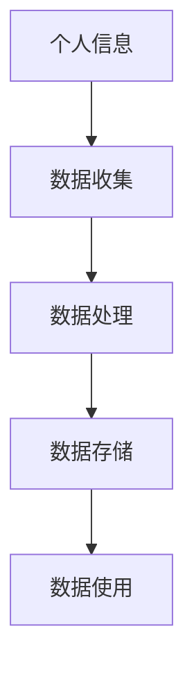

在这个流程图中，个人信息是数据隐私的核心，数据收集、数据处理、数据存储和数据使用构成了数据隐私保护的关键环节。了解和遵循这些基本概念，有助于企业在自动化创业中保护个人隐私，降低数据隐私风险。

### 5.2 自动化创业中的数据隐私问题

在自动化创业中，数据隐私问题尤为重要。自动化系统在收集、处理和使用大量数据的过程中，可能面临各种隐私风险。以下是一些常见的数据隐私问题及其解决方案：

#### 5.2.1 数据收集与处理

1. **过度收集**：

   - **问题**：企业或组织在数据收集过程中，可能收集与业务无关的个人信息，导致过度收集问题。
   - **解决方案**：制定明确的数据收集原则，仅收集与业务相关的个人信息，减少不必要的收集。

2. **数据泄露**：

   - **问题**：在数据收集和处理过程中，个人信息可能因技术漏洞、黑客攻击等原因泄露。
   - **解决方案**：加强网络安全防护，采用加密技术保护数据传输和存储，定期进行安全审计。

3. **数据滥用**：

   - **问题**：企业或组织可能滥用收集到的个人信息，用于非法目的或未经授权的其他用途。
   - **解决方案**：制定数据使用规范，明确数据使用的目的和范围，建立内部审查机制，防止数据滥用。

#### 5.2.2 隐私权争议

1. **知情同意**：

   - **问题**：在数据收集过程中，企业或组织可能未充分告知用户个人信息收集的目的、方式和使用范围，导致用户知情同意不足。
   - **解决方案**：在收集个人信息前，充分告知用户个人信息收集的目的、方式和使用范围，确保用户知情同意。

2. **透明度不足**：

   - **问题**：企业或组织在数据处理和使用过程中，缺乏透明度，用户无法了解其个人信息的使用情况。
   - **解决方案**：建立透明的数据处理机制，公开数据收集、处理和使用的流程，提高用户对数据处理的信任度。

3. **隐私权侵犯**：

   - **问题**：企业或组织在数据处理过程中，可能侵犯用户的隐私权，如未经授权访问、共享用户个人信息等。
   - **解决方案**：加强内部管理，明确数据处理权限和责任，建立用户隐私权保护机制，防止隐私权侵犯。

#### 5.2.3 数据隐私保护法规与标准

1. **GDPR**：

   - **背景**：欧盟出台的《通用数据保护条例》（GDPR），旨在加强个人数据的保护。
   - **要求**：企业需明确数据收集、处理和使用的目的，确保用户知情同意，加强数据安全保护。
   - **解决方案**：遵循GDPR要求，确保企业合规运营。

2. **CCPA**：

   - **背景**：美国加州出台的《加州消费者隐私法》（CCPA），旨在保护消费者个人信息。
   - **要求**：企业需告知用户个人信息收集、处理和使用情况，提供用户访问、删除和拒绝销售个人信息的权利。
   - **解决方案**：遵循CCPA要求，确保企业合规运营。

3. **其他地区法规**：

   - **要求**：不同地区的数据隐私保护法规要求有所不同，企业需根据所在地区的要求进行合规操作。
   - **解决方案**：了解并遵循不同地区的数据隐私保护法规，确保企业合规运营。

通过有效的解决方案，自动化创业企业可以降低数据隐私风险，保护用户隐私权，建立良好的企业形象，提高市场竞争力。

### 5.3 数据隐私保护法规与标准

在全球范围内，数据隐私保护已成为一项重要的法律议题，各国纷纷出台了一系列数据隐私保护法规与标准。以下是一些主要的数据隐私保护法规与标准：

#### 5.3.1 GDPR（通用数据保护条例）

- **背景**：GDPR是由欧盟立法机构于2016年4月通过的，旨在强化欧盟区内个人数据保护的法律框架。
- **核心要求**：
  - **数据主体权利**：包括知情权、访问权、删除权（被遗忘权）、数据可携权、反对权等。
  - **数据合法处理原则**：数据收集和处理必须合法、透明、公平，并具有明确的目的。
  - **数据安全与保护**：企业需采取适当的技术和管理措施，确保个人数据的完整性、保密性和可用性。

#### 5.3.2 CCPA（加州消费者隐私法）

- **背景**：CCPA于2018年6月通过，是美国加州的一项消费者隐私保护法案，旨在赋予加州居民对其个人信息的更多控制权。
- **核心要求**：
  - **个人信息透明度**：企业需告知消费者其收集、使用和共享个人信息的具体方式。
  - **消费者权利**：包括访问个人信息、删除个人信息和拒绝信息共享等权利。
  - **合规责任**：企业需建立数据处理政策和程序，并对其合规性进行定期审查。

#### 5.3.3 其他地区法规

- **中国**：《个人信息保护法》（PIPL）于2021年通过，旨在保护个人信息权益，规范个人信息处理活动。
  - **核心要求**：包括个人信息处理原则、个人信息权益、个人信息处理规则、个人信息跨境提供等。

- **澳大利亚**：《隐私法》（Privacy Act）和《消费者数据权利法案》（Consumer Data Right Law）。
  - **核心要求**：包括个人信息透明度、消费者访问和纠正个人信息权、消费者数据权利等。

- **新加坡**：《个人信息保护法案》（PDPA）。
  - **核心要求**：包括个人信息保护原则、个人信息处理规则、个人信息跨境转移等。

#### 5.3.4 国际标准

- **ISO/IEC 27001**：是国际标准化组织（ISO）和国际电工委员会（IEC）共同制定的信息安全管理体系标准。
  - **核心要求**：包括信息安全策略、组织风险管理、信息安全治理、信息安全处置等。

- **ISO/IEC 27701**：是针对隐私信息管理的国际标准，补充了ISO/IEC 27001标准，特别关注个人数据的隐私保护。
  - **核心要求**：包括隐私信息管理的原则、隐私信息处理流程、隐私信息保护措施等。

通过遵循这些数据隐私保护法规与标准，自动化创业企业可以更好地保护用户隐私，降低法律风险，建立信任和良好的企业形象。

### 6.1 劳动法的基本概念

劳动法是规范劳动关系和调整劳动关系的法律法规体系，涉及劳动权利与义务、劳动条件等方面的内容。以下是对劳动法基本概念的详细解释：

- **劳动关系**：劳动关系是指劳动者与用人单位之间因使用劳动者的劳动能力而产生的权利义务关系。劳动关系的核心是劳动者在用人单位的管理下提供劳动，用人单位支付劳动报酬。

- **劳动权利与义务**：
  - **劳动权利**：劳动权利包括劳动者的平等就业权、劳动报酬权、休息休假权、劳动安全卫生权、职业培训权等。劳动者有权依法享有这些权利。
  - **劳动义务**：劳动义务包括遵守劳动纪律、完成劳动任务、提高职业技能等。劳动者需依法履行这些义务。

- **劳动条件**：劳动条件是指劳动者在劳动过程中所应具备的条件，包括工作时间、工作地点、劳动安全卫生、劳动报酬等。劳动条件的设定应保障劳动者的合法权益，防止劳动者的身心健康受到损害。

劳动法的基本概念可以通过以下 Mermaid 流程图进行概述：

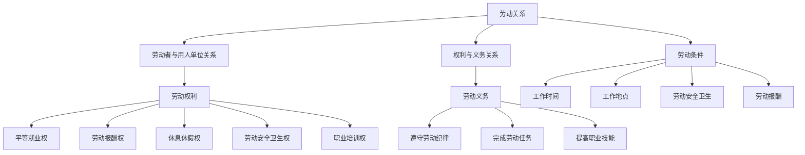

在这个流程图中，劳动关系是劳动法的核心概念，包括劳动者与用人单位的关系、劳动权利与义务以及劳动条件等方面。通过了解劳动法的基本概念，有助于企业和劳动者更好地理解劳动关系的法律规范，保障双方的合法权益。

### 6.2 自动化创业中的劳动关系问题

在自动化创业中，劳动关系问题日益复杂，因为自动化技术的应用对传统的劳动管理模式产生了深远影响。以下是一些常见的劳动关系问题及其解决方案：

#### 6.2.1 劳动关系转变

1. **远程工作与灵活工作时间**：

   - **问题**：随着自动化技术的应用，许多工作可以远程完成，导致劳动者与用人单位之间的地理位置和接触频率发生变化。
   - **解决方案**：企业应建立明确的远程工作政策和灵活工作时间制度，确保劳动者在远程工作环境下的合法权益，如工作条件、工资待遇和工作时间等。

2. **自动化设备的替代**：

   - **问题**：自动化设备可能部分或完全替代传统的人力劳动，导致劳动者失业或工作内容发生变化。
   - **解决方案**：企业应通过职业培训和技能提升计划，帮助劳动者适应新的工作环境，提高其职业技能，减少因技术变革带来的就业压力。

3. **工作强度与工作质量**：

   - **问题**：自动化技术的应用可能使劳动者面临更高的工作强度和压力，同时影响工作质量。
   - **解决方案**：企业应关注劳动者的工作环境和心理状态，提供必要的休息和放松机会，确保劳动者的身心健康。

#### 6.2.2 劳动争议处理

1. **合同纠纷**：

   - **问题**：自动化创业中的合同条款可能涉及复杂的自动化协议，导致合同纠纷。
   - **解决方案**：企业应在合同条款中明确约定劳动报酬、工作时间、工作内容等关键条款，并通过法律专业人士进行合同审查，确保合同的合法性和执行力。

2. **劳动权益争议**：

   - **问题**：劳动者可能因自动化设备的使用而遭受不公平待遇，如工资偏低、福利不足等。
   - **解决方案**：企业应建立公正的劳动权益保障机制，定期审查劳动者的工资和福利待遇，确保劳动者的合法权益得到维护。

3. **劳动争议解决**：

   - **问题**：自动化创业中的劳动争议解决可能面临程序复杂、效率低下等问题。
   - **解决方案**：企业应建立健全的内部劳动争议解决机制，如调解委员会等，以快速、公正地解决劳动争议。同时，劳动者也可以通过法律途径寻求解决。

#### 6.2.3 劳动法适用性

1. **跨境劳动法适用**：

   - **问题**：自动化创业中的劳动者可能涉及跨境劳动关系，不同国家的劳动法规定存在差异。
   - **解决方案**：企业应了解并遵守所在国家和目的地国家的劳动法规定，确保劳动关系的合法性。在跨境劳动关系中，企业应优先考虑最有利于劳动者权益的法律适用。

2. **劳动法改革方向**：

   - **问题**：随着自动化技术的不断进步，劳动法的适用性和有效性可能受到挑战，需要不断改革和完善。
   - **解决方案**：政府应密切关注自动化创业中的劳动关系问题，及时调整和完善劳动法规定，确保劳动法在自动化创业环境下的适用性和有效性。

通过合理的劳动关系管理，自动化创业企业可以减少劳动争议，提高员工满意度，促进企业的稳定发展。

### 6.3 劳动法的适用与调整

在自动化创业中，劳动法的适用与调整对于维护劳动关系的稳定和促进企业的可持续发展具有重要意义。以下从劳动合同管理、劳动保护政策和劳动法改革方向三个方面详细探讨劳动法的适用与调整。

#### 6.3.1 劳动合同管理

劳动合同是劳动关系的基础，劳动合同管理的关键在于合同条款的合法性和合同的履行。

1. **合同条款审查**：

   - **合法性审查**：企业在签订劳动合同前，应进行合法性审查，确保合同条款符合相关劳动法律法规的要求，如工资待遇、工作时间、休息休假等。
   - **公平性审查**：合同条款应公平合理，避免因条款不公平而导致劳动纠纷。

2. **合同履行与变更**：

   - **合同履行**：企业应严格按照合同条款履行义务，确保劳动者的合法权益得到保障。
   - **合同变更**：在自动化创业中，随着技术发展和业务变化，可能需要对劳动合同进行变更。变更应通过双方协商一致，并依法进行。

3. **合同终止**：

   - **合法终止**：企业应依据劳动法律法规规定，合法、合理地终止劳动合同，避免因违法终止合同而引发纠纷。

#### 6.3.2 劳动保护政策

劳动保护政策是保障劳动者合法权益的重要措施，对于自动化创业企业尤为重要。

1. **劳动安全卫生**：

   - **安全生产**：企业应建立安全生产责任制，确保劳动者在安全的工作环境中工作。
   - **卫生防护**：提供必要的卫生防护用品，如口罩、手套等，确保劳动者身体健康。

2. **职业培训**：

   - **技能提升**：企业应定期为劳动者提供职业培训，提高其职业技能，以适应自动化技术的发展。
   - **培训机会**：确保劳动者享有平等的培训机会，促进其个人发展和职业晋升。

3. **福利待遇**：

   - **工资待遇**：确保劳动者的工资待遇符合法律法规规定，合理调整工资结构。
   - **福利保障**：提供包括社会保险、医疗保险、住房补贴等在内的福利保障，提高劳动者的生活水平。

#### 6.3.3 劳动法改革方向

随着自动化技术的不断进步，劳动法需要不断调整和完善，以适应新的劳动关系形式。

1. **劳动法修订**：

   - **法律法规更新**：根据自动化创业中的新情况和新问题，及时修订和完善劳动法律法规，确保其适用性和有效性。
   - **立法解释**：对现有的劳动法律条款进行解释和说明，帮助企业和劳动者更好地理解法律规定。

2. **劳动者权益保护**：

   - **权益保障**：加强劳动者的权益保护，防止因自动化技术滥用而导致劳动者权益受损。
   - **工会作用**：发挥工会的作用，维护劳动者的合法权益，促进劳动关系和谐。

3. **国际化劳动法**：

   - **跨境劳动法**：随着全球化的发展，自动化创业企业可能涉及跨境劳动关系。企业应了解和遵守不同国家的劳动法律法规，确保劳动关系的合法性。
   - **国际合作**：加强国际劳动法合作，促进各国劳动法的协调和统一，为跨国企业创造公平的劳动环境。

通过劳动合同管理、劳动保护政策和劳动法改革方向的完善，自动化创业企业可以更好地维护劳动关系，保障劳动者权益，促进企业的可持续发展。

### 7.1 道德框架的基本概念

道德框架是指用于指导人类行为和决策的一系列原则和标准。在自动化创业中，道德框架尤为重要，因为自动化技术不仅影响企业的运营，还可能对社会产生深远影响。以下是对道德框架的基本概念及其构成要素的详细解释：

- **伦理原则**：伦理原则是道德框架的核心，用于指导人们如何判断和应对各种道德问题。常见的伦理原则包括：

  - **公正性**：确保公平对待所有人，避免歧视和不公正行为。
  - **尊重个人权利**：尊重个人的自由、尊严和隐私权。
  - **诚信**：诚实守信，遵守承诺，不欺骗他人。
  - **责任**：对自己的行为负责，对他人和社会负责。

- **道德标准**：道德标准是指具体的行为准则，用于衡量和评估个人或组织的行为是否符合伦理原则。道德标准通常包括：

  - **职业操守**：职业人士应遵守的职业道德规范，如医生、律师、工程师等。
  - **社会责任**：企业和社会组织应承担的社会责任，如环境保护、慈善捐赠等。
  - **消费者权益保护**：保护消费者权益，提供高质量的产品和服务。

- **道德判断**：道德判断是指根据伦理原则和道德标准，对特定行为或决策进行评估和判断的过程。道德判断涉及以下几个步骤：

  - **识别道德问题**：识别行为或决策中潜在的道德问题。
  - **评估行为或决策的道德影响**：分析行为或决策对各方的影响，包括利益相关者的利益和权益。
  - **选择最佳方案**：根据伦理原则和道德标准，选择最符合道德要求的行为或决策方案。

道德框架的基本概念可以通过以下 Mermaid 流程图进行概述：

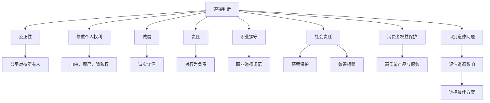

在这个流程图中，伦理原则、道德标准、道德判断构成了道德框架的基本要素，通过这些要素，可以帮助自动化创业企业建立道德决策体系，确保其行为符合道德要求。

### 7.2 自动化创业中的伦理问题

在自动化创业中，伦理问题成为了一个不可忽视的重要议题。自动化技术不仅改变了企业的运营模式，还可能对社会产生深远的影响。以下是一些常见的伦理问题，以及如何解决这些问题的方法：

#### 7.2.1 技术伦理问题

1. **算法偏见**：

   - **问题**：自动化系统中的算法可能存在偏见，导致对某些群体的歧视，如种族、性别、年龄等。
   - **解决方案**：企业在设计和开发自动化系统时，应进行算法偏见检测和纠正。可以通过多样性的数据集训练算法，确保算法的公正性和透明性。

2. **隐私侵犯**：

   - **问题**：自动化系统在收集和处理数据时，可能侵犯用户的隐私权。
   - **解决方案**：企业应遵循数据隐私保护原则，如GDPR和CCPA等法规，确保用户的个人信息得到充分保护。同时，应公开透明的数据处理流程，增加用户对企业的信任。

3. **安全风险**：

   - **问题**：自动化系统可能面临安全漏洞，导致数据泄露或系统被黑客攻击。
   - **解决方案**：企业应采取严格的安全措施，如数据加密、访问控制和定期安全审计，确保自动化系统的安全性。

#### 7.2.2 道德责任争议

1. **自动化决策的道德责任**：

   - **问题**：当自动化系统做出决策时，谁应承担道德责任，是开发者、使用者还是系统本身？
   - **解决方案**：应明确自动化系统的责任归属，并在合同和法律中予以规定。同时，企业应建立道德责任评估机制，确保自动化决策符合伦理标准。

2. **自动化取代人力的道德责任**：

   - **问题**：自动化技术可能取代人力工作，导致失业问题，引发社会不满。
   - **解决方案**：企业应关注社会影响，采取社会责任措施，如提供再就业培训、支持社会保障体系等。同时，政府也应制定相关政策，缓解自动化带来的社会问题。

#### 7.2.3 道德风险

1. **自动化系统的失控**：

   - **问题**：自动化系统可能在运行过程中出现异常，导致不可预见的后果。
   - **解决方案**：企业应建立完善的监控和应急响应机制，确保自动化系统的稳定运行。同时，应定期对系统进行测试和评估，及时发现和解决潜在问题。

2. **技术滥用的道德风险**：

   - **问题**：自动化技术可能被用于不正当目的，如监控、操纵等。
   - **解决方案**：企业应制定明确的道德准则和法规，防止技术滥用。同时，政府和社会组织应加强监督和执法，确保技术应用的合法性和正当性。

通过识别和解决自动化创业中的伦理问题，企业可以降低道德风险，树立良好的企业形象，同时促进社会的和谐发展。

### 7.3 伦理决策的案例分析

在探讨自动化创业中的伦理问题后，让我们通过几个具体的案例来分析伦理决策的过程和结果。

#### 7.3.1 特斯拉自动驾驶案例

特斯拉自动驾驶系统在自动驾驶领域引起了广泛关注，但也引发了诸多伦理问题。一个典型的案例是2018年发生的一起致命车祸。一名司机在使用特斯拉的自动驾驶功能时，未注意到前方行驶的白色货车，导致碰撞事故。这起事件引发了关于自动驾驶系统的伦理决策问题：

- **伦理问题**：事故发生时，特斯拉的自动驾驶系统是否应该主动刹车以避免碰撞？如果系统选择不采取行动，谁应承担道德责任？

- **决策过程**：特斯拉公司在事故后进行了详细的调查和分析，认为系统按照既定规则运行，但由于环境复杂，系统未能识别白色货车。特斯拉强调，自动驾驶系统应被视为辅助工具，不应完全依赖。

- **结果**：特斯拉在后续的软件更新中增加了对障碍物的识别功能，并强化了系统的警告提示。同时，特斯拉在用户手册中明确指出，驾驶员在使用自动驾驶功能时仍需保持警觉，并随时准备接管控制。

#### 7.3.2 亚马逊AI招聘歧视案例

亚马逊的AI招聘系统曾因歧视问题引发争议。该系统使用机器学习算法分析简历，但在训练数据中存在性别偏见，导致对女性候选人的招聘决策产生负面效果。这一案例展示了伦理决策的重要性：

- **伦理问题**：AI系统在招聘过程中如何确保公平性和无歧视？

- **决策过程**：亚马逊在系统开发过程中，意识到训练数据可能存在的偏见问题。为解决这一问题，亚马逊进行了多次数据清洗和算法调整，试图消除性别偏见。此外，亚马逊还建立了伦理委员会，监督AI系统的开发和应用。

- **结果**：尽管亚马逊采取了一系列措施，但问题并未完全解决。这起事件引发了关于AI伦理的广泛讨论，促使企业在开发和部署AI系统时，更加重视伦理问题。

#### 7.3.3 其他案例分析

除了特斯拉和亚马逊的案例，还有许多其他自动化创业中的伦理决策案例，如医疗AI系统的伦理决策、金融AI系统的透明性决策等。以下是一些其他案例：

- **医疗AI系统的伦理决策**：在医疗领域，AI系统用于诊断和治疗。一个伦理决策案例是，当AI系统在诊断结果上出现分歧时，如何确保最终的决策符合伦理标准？医疗机构应建立伦理决策流程，确保AI系统的结果经过多方验证和审核。

- **金融AI系统的透明性决策**：金融领域中的AI系统用于风险评估和投资决策。一个伦理决策案例是，当AI系统做出高风险决策时，如何确保决策过程透明，让投资者了解决策依据？金融机构应公开AI系统的决策逻辑和数据来源，提高决策的透明度。

通过这些案例，我们可以看到，伦理决策在自动化创业中至关重要。企业需要建立完善的伦理决策机制，确保技术应用的合法性和正当性，同时维护社会公众的利益和信任。通过合理的伦理决策，企业可以降低道德风险，塑造良好的企业形象，推动技术的可持续发展。

### 8.1 公平性的基本概念

公平性是指社会或组织中资源分配和机会分配的公正性和合理性的原则。公平性的基本概念可以从三个方面进行理解：

- **机会均等**：机会均等是指所有个体在竞争资源和机会时，应享有平等的机会，不受性别、种族、年龄、身份等因素的歧视。这意味着在招聘、教育、晋升等方面，每个人都应有机会展示自己的能力和潜力。

- **资源分配**：资源分配是指在社会或组织中，如何公平地分配资源，如财富、教育、医疗等。资源分配的公平性要求确保所有人都能享有基本的生活保障和发展机会，避免资源过度集中于少数人手中。

- **结果公平**：结果公平是指尽管机会和资源分配可能存在差异，但最终的结果应尽量公平，即所有人的努力和贡献能够得到相应的回报。结果公平强调的是减少社会不平等，缩小收入差距，实现社会整体利益的最大化。

公平性的基本概念可以通过以下 Mermaid 流程图进行概述：

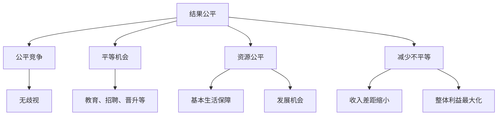

在这个流程图中，机会均等、资源分配和结果公平构成了公平性的三个核心要素，通过这三个方面的努力，可以建立一个更加公平合理的社会或组织环境。

### 8.2 自动化创业中的公平性问题

在自动化创业中，公平性问题尤为突出，因为自动化技术可能会在决策过程中引入偏见和不公正。以下是一些常见的公平性问题以及其解决方案：

#### 8.2.1 算法偏见

1. **问题**：自动化系统中的算法可能基于历史数据训练，这些数据可能包含社会上的偏见，导致算法在决策时对某些群体产生不公平待遇。

   - **例子**：一个招聘算法可能因为训练数据中男性简历的比例较高，导致在招聘决策中对男性候选人有偏好。

2. **解决方案**：
   - **数据多样性**：在算法训练时，应确保数据集的多样性，包含不同性别、种族、年龄等特征，以减少偏见。
   - **偏见检测和修正**：开发偏见检测工具，对算法进行评估，及时发现和修正算法中的偏见。

#### 8.2.2 数据公平性

1. **问题**：在数据收集和处理过程中，可能因为数据源的不公平性，导致某些群体被忽视或受到不公平对待。

   - **例子**：一个在线教育平台可能只收集来自发达地区学生的数据，导致农村地区学生的需求得不到满足。

2. **解决方案**：
   - **公平数据收集**：在数据收集阶段，应确保数据来源的公平性，避免因地域、经济条件等因素导致的数据偏见。
   - **数据透明性**：公开数据收集和处理的过程，让用户了解自己的数据如何被使用，增加透明度和信任。

#### 8.2.3 人力资源公平性

1. **问题**：在人力资源管理和决策中，自动化系统可能因为算法偏见导致招聘、晋升等环节的不公平。

   - **例子**：一个HR管理系统可能因为对某些关键词的偏好，导致对具有特定背景的候选人有偏见。

2. **解决方案**：
   - **公平性审查**：在设计和部署人力资源系统时，进行公平性审查，确保系统符合公平性原则。
   - **多样性和包容性**：鼓励企业在招聘和晋升过程中，注重多样性和包容性，避免单一标准导致的不公平。

通过识别和解决自动化创业中的公平性问题，企业可以提升系统的公正性和透明性，建立更加公平合理的自动化决策机制，从而增强市场竞争力和社会影响力。

### 8.3 透明性的重要性与实践

在自动化创业中，透明性是一个关键的概念，它指的是自动化系统在决策过程、数据处理和操作中的可理解性和透明度。透明性的重要性在于它能够增加用户对系统的信任，确保系统的公正性和合法性，并促进技术伦理的遵循。以下从决策透明、技术透明和操作透明三个方面探讨透明性的重要性与实践。

#### 8.3.1 决策透明

1. **重要性**：决策透明是指自动化系统在做出决策时，能够向用户展示决策过程和依据，使决策结果的可解释性得到保障。

   - **案例**：在金融领域，一个投资决策系统应向用户展示如何根据历史数据和算法模型进行投资决策，以便用户理解系统的决策逻辑。

2. **实践**：
   - **算法解释**：开发可解释的算法模型，使用户能够理解决策的依据和过程。
   - **用户界面**：设计直观的用户界面，提供决策过程的可视化展示，让用户一目了然。

#### 8.3.2 技术透明

1. **重要性**：技术透明是指自动化系统在技术设计和实现过程中的公开性和可访问性，使技术背后的逻辑和机制对用户透明。

   - **案例**：一个自动驾驶系统应公开其传感器数据、决策算法和执行逻辑，以便用户和监管机构了解系统的技术实现。

2. **实践**：
   - **开源**：将自动化系统的关键组件开源，促进社区参与和审查，提高系统的透明度。
   - **技术文档**：编写详细的技术文档，包括系统架构、算法模型和实现细节，以便用户和开发者理解系统的工作原理。

#### 8.3.3 操作透明

1. **重要性**：操作透明是指自动化系统在操作过程中的可监控性和可追溯性，确保系统操作过程的公开和透明。

   - **案例**：一个智能家居系统应允许用户监控和控制所有设备，并记录设备操作的历史记录，以便用户跟踪和管理。

2. **实践**：
   - **监控和日志**：建立系统监控机制，记录系统的操作日志，包括用户行为、设备状态和系统响应等，以便用户和开发者进行问题追踪和分析。
   - **用户控制**：提供用户界面，让用户可以实时监控和控制自动化系统，确保用户对系统操作的完全掌控。

通过实施决策透明、技术透明和操作透明，自动化创业企业可以提高系统的可信度和用户满意度，增强市场竞争力，同时符合技术伦理和法律法规的要求。

### 9.1 人性化设计的理念

人性化设计是一种以用户为中心的设计理念，旨在提高用户体验，满足用户的实际需求和情感需求。人性化设计的理念可以概括为以下几点：

- **用户中心**：人性化设计的核心是关注用户的需求和体验，将用户置于设计过程的中心。这意味着设计者需要深入了解用户的行为模式、需求和偏好，以创造符合用户期望的产品和服务。

- **用户体验**：用户体验（UX）是指用户在使用产品或服务过程中的整体感受和体验。人性化设计强调通过优化用户界面、交互流程和功能设计，提升用户的满意度和使用便利性。

- **情感共鸣**：人性化设计不仅仅是功能上的满足，还需要在情感层面与用户产生共鸣。设计者需要通过色彩、形状、声音等元素，创造温馨、舒适和愉悦的用户体验。

人性化设计的理念可以通过以下 Mermaid 流程图进行概述：

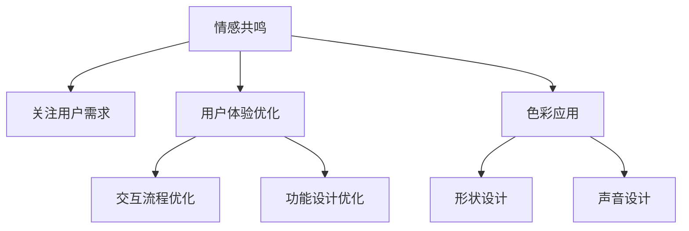

在这个流程图中，用户中心、用户体验和情感共鸣构成了人性化设计的三大核心要素。通过关注用户需求、优化用户体验和建立情感共鸣，设计者可以创造出更加人性化、满足用户需求的产品和服务。

### 9.2 自动化创业中的人性化挑战

在自动化创业中，人性化设计面临着一系列独特的挑战。自动化技术的广泛应用虽然提高了效率和便利性，但也对用户体验和情感共鸣提出了更高的要求。以下是一些常见的人性化挑战及其解决方案：

#### 9.2.1 技术与人性的结合

1. **问题**：自动化技术虽然强大，但在某些情况下可能缺乏人性化的互动和情感交流。

   - **例子**：一个自动化客服系统可能在处理复杂问题时，显得机械和缺乏温度，导致用户不满意。

2. **解决方案**：
   - **增强交互性**：设计更加自然的交互方式，如语音助手和聊天机器人，使用户感到更加亲切和易于沟通。
   - **情感融入**：通过声音、图像和文字等元素，增强自动化系统的情感表达，提升用户体验。

#### 9.2.2 用户体验设计

1. **问题**：自动化系统在快速迭代和功能扩展过程中，可能忽视了用户体验的设计。

   - **例子**：一个在线服务平台在增加新功能时，没有充分考虑用户的操作习惯和界面布局，导致用户操作不便。

2. **解决方案**：
   - **用户调研**：在设计和开发过程中，进行用户调研和反馈收集，了解用户的需求和偏好。
   - **持续优化**：根据用户反馈，持续优化界面设计和交互流程，提升用户体验。

#### 9.2.3 情感因素

1. **问题**：自动化系统在处理情感敏感的场景时，可能无法有效传达情感和共鸣。

   - **例子**：一个智能家居系统可能在用户遇到突发情况时，无法及时响应并给予情感上的安慰。

2. **解决方案**：
   - **情感设计**：在系统设计和功能实现时，考虑情感因素，如使用温暖的声音和图像，提供人性化的反馈和互动。
   - **情感模拟**：通过算法和数据分析，模拟用户的情感状态，提供更加贴心的服务和响应。

通过应对这些人性化挑战，自动化创业企业可以提升用户体验，增强用户对产品的忠诚度，从而在激烈的市场竞争中脱颖而出。

### 9.3 人性化设计策略与实践

人性化设计在自动化创业中起着至关重要的作用，它不仅能够提升用户体验，还能增强用户对产品的信任和忠诚度。以下是一些人性化设计策略与实践，帮助自动化创业企业更好地满足用户需求，提高产品的市场竞争力和用户满意度。

#### 9.3.1 用户调研

1. **用户需求分析**：

   - **目标用户群体**：明确产品的目标用户群体，了解他们的年龄、性别、职业、生活习惯等特征。
   - **需求调查**：通过问卷调查、访谈、用户行为分析等方式，收集用户对产品功能、性能和体验的反馈。
   - **需求优先级**：分析用户需求，确定哪些需求是最重要的，哪些需求可以通过简单优化解决。

2. **用户体验测试**：

   - **原型测试**：在设计阶段，制作产品原型，并通过用户体验测试，了解用户对界面布局、功能设计的反馈。
   - **A/B测试**：通过对比不同设计的版本，评估用户体验和产品性能的差异，选择最优方案。

3. **用户反馈收集**：

   - **实时反馈**：在产品上线后，通过用户反馈渠道，如客服系统、社交媒体等，收集用户的即时反馈。
   - **持续改进**：根据用户反馈，不断优化产品功能和用户体验，提升产品的市场竞争力。

#### 9.3.2 用户反馈

1. **反馈渠道**：

   - **在线反馈**：提供在线反馈表单，让用户可以方便地提交问题和建议。
   - **社交媒体**：在社交媒体上设立反馈渠道，与用户进行实时互动，了解他们的使用体验和需求。

2. **反馈处理**：

   - **快速响应**：建立快速响应机制，确保用户的反馈能够得到及时处理和回复。
   - **分类处理**：对用户反馈进行分类，优先处理重要问题和紧急需求，确保用户体验的持续优化。

3. **反馈应用**：

   - **改进措施**：根据用户反馈，制定改进措施，如优化界面设计、改进功能性能等。
   - **持续跟踪**：对改进措施的实施效果进行跟踪，确保用户反馈得到有效解决。

#### 9.3.3 情感设计实践

1. **情感因素融入**：

   - **声音设计**：使用温暖、亲切的声音进行交互，增强用户的情感体验。
   - **视觉设计**：使用友好的界面布局、色彩和图标，提升用户的视觉舒适度。

2. **情感共鸣**：

   - **情感表达**：在产品中融入情感表达元素，如个性化的问候、温馨的提示等，增强用户与产品的情感联系。
   - **个性化服务**：根据用户的历史行为和偏好，提供个性化的服务和推荐，提升用户的满意度。

3. **情感模拟**：

   - **情感分析**：利用自然语言处理技术，分析用户的情感状态，提供适当的情感反馈和互动。
   - **情感教育**：在产品中融入情感教育内容，帮助用户学会更好地管理情感，提升生活质量。

通过实施用户调研、用户反馈和情感设计实践，自动化创业企业可以不断优化产品功能，提升用户体验，增强用户对产品的信任和满意度，从而在激烈的市场竞争中脱颖而出。

### 10.1 社会影响的基本概念

社会影响是指一个企业或组织在经营活动中对社会和环境产生的正面或负面影响。社会影响的基本概念可以从以下几个方面进行理解：

- **经济影响**：经济影响是指企业或组织的经营活动对当地经济、就业、收入分配等方面产生的效果。正面经济影响包括增加就业、促进经济增长、提高收入水平等；负面经济影响则可能包括失业率上升、收入分配不公、经济波动等。

- **环境影响**：环境影响是指企业或组织在生产和运营过程中对自然环境产生的效果。正面环境影响包括资源节约、污染防治、生态保护等；负面影响则可能包括资源过度消耗、环境污染、生态破坏等。

- **社会道德影响**：社会道德影响是指企业或组织在社会道德和行为规范方面的表现，如诚信、公平、责任等。正面社会道德影响包括遵守法律法规、履行社会责任、推动社会进步等；负面影响则可能包括违法行为、不道德行为、损害公众利益等。

社会影响的基本概念可以通过以下 Mermaid 流程图进行概述：

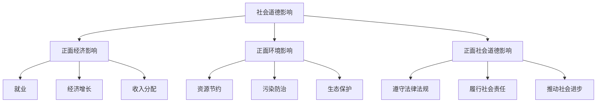

在这个流程图中，经济影响、环境影响和社会道德影响构成了社会影响的三个主要方面，通过这些方面的综合评估，企业可以全面了解其在社会中的角色和责任。

### 10.2 自动化创业的社会责任

在自动化创业中，社会责任已经成为企业不可忽视的重要议题。自动化技术的快速发展不仅带来了商业模式的创新和效率的提升，同时也对社会和环境产生了深远的影响。自动化创业企业需要承担的社会责任包括但不限于以下几个方面：

#### 10.2.1 社会责任的概念

社会责任是指企业在经营活动中应承担的道德义务和责任，旨在通过积极的社会行为，促进社会可持续发展。社会责任的概念包括：

- **道德责任**：企业应遵守道德规范，如诚信、公正、公平等，树立良好的企业形象。
- **法律责任**：企业应遵守法律法规，确保经营活动合法合规，避免违法行为。
- **经济责任**：企业应承担经济责任，促进经济增长，增加就业机会，改善社会福祉。
- **环境责任**：企业应保护环境，减少污染，节约资源，促进生态平衡。

#### 10.2.2 自动化创业中的社会责任内容

1. **就业影响**：

   - **问题**：自动化技术可能导致部分工作岗位被替代，引发就业问题。
   - **解决方案**：企业应通过职业培训和再就业计划，帮助劳动者适应新的工作环境，减少失业率。

2. **环境保护**：

   - **问题**：自动化技术可能带来环境污染和资源消耗问题。
   - **解决方案**：企业应采取环保措施，如节能技术、绿色制造等，减少对环境的影响。

3. **数据隐私和信息安全**：

   - **问题**：自动化系统在处理大量数据时，可能涉及个人隐私和安全问题。
   - **解决方案**：企业应制定严格的数据隐私保护政策，确保用户数据的安全和隐私。

4. **公平性和多样性**：

   - **问题**：自动化系统可能引入偏见，影响公平性和多样性。
   - **解决方案**：企业应注重数据多样性，确保算法的公正性和透明性，避免歧视和不公平行为。

5. **社区参与和社会福祉**：

   - **问题**：自动化技术可能对社区和社会福祉产生负面影响。
   - **解决方案**：企业应积极参与社区活动，提供社会服务，如慈善捐赠、公益活动等，促进社会和谐。

#### 10.2.3 社会责任实施

1. **制定社会责任战略**：

   - **目标设定**：明确企业社会责任的目标和愿景，制定具体的行动计划。
   - **资源分配**：确保企业资源（如资金、人力、技术等）用于社会责任的实施。

2. **社会责任报告**：

   - **公开报告**：定期发布社会责任报告，向公众展示企业的社会责任实践和成果。
   - **透明性**：确保社会责任报告的透明性和真实性，接受社会监督。

3. **员工参与**：

   - **员工培训**：提高员工的社会责任意识，培训员工参与社会责任项目。
   - **激励机制**：建立社会责任激励机制，鼓励员工积极参与社会责任活动。

4. **合作伙伴关系**：

   - **合作网络**：与政府、非政府组织、社区等建立合作伙伴关系，共同推动社会责任的实施。
   - **资源共享**：与合作伙伴共享资源和技术，提高社会责任项目的效果。

通过实施社会责任，自动化创业企业不仅能够提升自身的形象和竞争力，还能为社会和环境带来积极的影响，实现可持续发展。

### 10.3 社会影响评估与应对策略

在自动化创业中，评估和应对社会影响是确保企业社会责任落实的重要环节。以下从社会影响评估、策略制定和持续改进三个方面探讨如何有效评估和应对社会影响。

#### 10.3.1 社会影响评估

1. **评估指标体系**：

   - **经济影响**：就业率、薪资水平、税收贡献等。
   - **环境影响**：碳排放量、水资源消耗、废物处理等。
   - **社会道德影响**：员工满意度、客户满意度、社区满意度等。

2. **评估方法**：

   - **定量化评估**：使用数据分析和统计方法，量化社会影响的具体表现，如通过数据分析确定自动化系统对就业率的影响。
   - **定性化评估**：通过访谈、调查问卷、观察等方法，收集用户和利益相关者的主观反馈，评估社会影响的实际效果。

3. **评估工具**：

   - **社会影响评估模型**：如SROI（社会回报投资率）模型，用于评估企业社会责任项目的经济效益。
   - **社会影响评估软件**：如SAVI（社会影响评估工具），用于自动化评估社会影响。

#### 10.3.2 应对策略

1. **风险管理**：

   - **识别风险**：通过评估确定可能产生的社会影响风险，如自动化系统可能导致的不公平性、环境污染等。
   - **评估风险**：对识别的风险进行优先级排序，确定需要优先应对的风险。

2. **应对措施**：

   - **预防措施**：采取预防措施，如确保自动化系统的公正性、加强环境保护措施等。
   - **应急措施**：制定应急预案，如自动化系统出现偏见时，立即进行调整和优化。

3. **沟通与协作**：

   - **内部沟通**：建立内部沟通机制，确保各部门和社会责任团队之间的信息共享和协调。
   - **外部沟通**：与政府、非政府组织、社区等外部利益相关者建立合作关系，共同应对社会影响。

#### 10.3.3 持续改进

1. **监控与反馈**：

   - **实时监控**：建立实时监控系统，持续跟踪和评估社会影响的实际效果。
   - **反馈机制**：建立反馈机制，收集用户和利益相关者的反馈，及时调整和优化应对措施。

2. **持续优化**：

   - **定期评估**：定期对社会影响进行评估，确保应对措施的有效性和适应性。
   - **技术改进**：利用最新技术改进自动化系统，降低社会影响风险，如通过机器学习技术优化算法，减少偏见。

3. **培训与教育**：

   - **员工培训**：定期对员工进行社会责任和伦理培训，提高员工的社会责任意识。
   - **公众教育**：开展公众教育活动，提高公众对社会影响的认知，增强社会责任感。

通过社会影响评估与应对策略的实施，自动化创业企业可以更好地管理社会影响，实现可持续发展，同时提高企业的社会声誉和市场竞争力。

### 11.1 案例选取与背景介绍

在本章节中，我们将选取几个具有代表性的自动化创业案例，通过详细分析这些案例中的法律和道德考量，探讨自动化创业企业在实际运营过程中面临的挑战和应对策略。

#### 案例选取

1. **案例一：特斯拉自动驾驶系统**：

   - **背景**：特斯拉公司推出的自动驾驶系统在全球范围内引起了广泛关注。然而，在自动驾驶系统运行过程中，发生了一些致命车祸，引发了关于系统安全性和伦理问题的讨论。
   - **目的**：通过分析特斯拉自动驾驶系统案例，探讨在自动化技术发展过程中，企业如何平衡技术创新和法律、道德考量。

2. **案例二：亚马逊AI招聘歧视案**：

   - **背景**：亚马逊公司使用AI系统进行招聘，但该系统在训练过程中出现了性别偏见，导致招聘决策对女性候选人产生不公平影响。
   - **目的**：通过分析亚马逊AI招聘歧视案，探讨如何确保自动化系统在设计和应用过程中遵循公平性原则，防止歧视行为的发生。

3. **案例三：谷歌面部识别技术**：

   - **背景**：谷歌公司推出的面部识别技术在全球范围内引发了关于隐私和伦理问题的争议。特别是在一些司法案件中，面部识别技术的应用引发了关于隐私权和个人尊严的讨论。
   - **目的**：通过分析谷歌面部识别技术案例，探讨如何保护用户隐私，确保自动化技术在应用过程中符合伦理标准。

通过选取这些具有代表性的案例，我们将深入探讨自动化创业企业如何在实际运营过程中应对法律和道德挑战，确保技术创新与社会责任相协调。

### 11.2 案例中的法律和道德考量

在本章节中，我们将详细分析特斯拉自动驾驶系统、亚马逊AI招聘歧视案和谷歌面部识别技术案例，探讨在这些案例中企业所面临的法律和道德考量。

#### 特斯拉自动驾驶系统案例

1. **法律考量**：

   - **自动驾驶系统的合规性**：特斯拉自动驾驶系统需要符合交通安全法规和机动车管理法规。例如，在美国，特斯拉需要遵守联邦机动车安全标准（FMVSS），确保自动驾驶系统的安全性和可靠性。
   - **责任归属**：在特斯拉自动驾驶系统引发的事故中，责任归属成为法律争议的核心。根据美国《机动车责任法》，如果自动驾驶系统存在缺陷或不符合安全标准，制造商可能需要承担法律责任。

2. **道德考量**：

   - **安全伦理**：特斯拉自动驾驶系统的设计需要考虑安全伦理问题。例如，在面临“道德困境”时，自动驾驶系统应如何做出决策以保护乘客的安全。
   - **透明性**：特斯拉需要确保自动驾驶系统的决策过程透明，让用户了解系统的工作原理和限制，增强用户对自动驾驶技术的信任。

#### 亚马逊AI招聘歧视案

1. **法律考量**：

   - **平等就业权利**：亚马逊AI招聘系统在训练过程中出现了性别偏见，违反了《反歧视法》等平等就业权利法规。根据这些法规，雇主不得在招聘过程中基于性别、种族等歧视性因素做出决策。
   - **数据隐私**：亚马逊在招聘过程中使用的大量个人数据需要符合数据隐私保护法规，如GDPR和CCPA。企业需要确保个人数据的收集、处理和存储符合相关法律法规的要求。

2. **道德考量**：

   - **公平性和公正性**：亚马逊AI招聘系统需要确保招聘决策的公平性和公正性，避免算法偏见对某些群体产生不公平影响。
   - **道德责任**：企业在使用自动化技术进行招聘决策时，需要承担道德责任，确保算法的设计和应用符合道德标准，避免歧视行为。

#### 谷歌面部识别技术案例

1. **法律考量**：

   - **隐私权保护**：谷歌面部识别技术需要符合隐私权保护法规，如《计算机欺诈和滥用法》和《隐私法》。这些法规要求企业在使用面部识别技术时，确保用户的隐私权不受侵犯。
   - **数据安全**：谷歌需要确保面部识别数据的存储和安全，防止数据泄露和滥用。例如，欧盟的《通用数据保护条例》（GDPR）对数据安全提出了严格的要求。

2. **道德考量**：

   - **隐私伦理**：面部识别技术的应用可能侵犯用户的隐私权，需要遵循隐私伦理原则。例如，面部识别数据应仅用于合法和必要的用途，不得滥用。
   - **公正性和透明性**：谷歌需要确保面部识别技术的公正性和透明性，让用户了解其工作原理和应用范围，增强用户对技术的信任。

通过分析特斯拉自动驾驶系统、亚马逊AI招聘歧视案和谷歌面部识别技术案例，我们可以看到，自动化创业企业在实际运营过程中面临的法律和道德考量是复杂且多样的。企业需要在这些方面做出合理的权衡和决策，以确保技术创新与社会责任相协调，实现可持续发展。

### 11.3 案例分析与总结

通过对特斯拉自动驾驶系统、亚马逊AI招聘歧视案和谷歌面部识别技术案例的详细分析，我们可以总结出一些关键发现和经验教训，这些对于自动化创业企业具有重要的启示和指导意义。

#### 特斯拉自动驾驶系统案例

1. **关键发现**：

   - **安全性和合规性问题**：特斯拉自动驾驶系统在法律和道德考量方面面临重大挑战，特别是系统安全性和合规性问题。在自动驾驶系统的设计和实施过程中，特斯拉需要严格遵循交通安全法规和机动车管理法规，确保系统的安全性和可靠性。
   - **责任归属争议**：在特斯拉自动驾驶系统引发的事故中，责任归属成为法律争议的核心。企业需要明确自动驾驶系统的责任归属，确保在出现问题时能够迅速采取有效措施。

2. **经验教训**：

   - **安全第一**：企业应将安全性作为自动驾驶系统的首要考量，通过严格的测试和验证，确保系统的安全性能。
   - **法律合规性**：企业应确保自动驾驶系统的设计、开发和部署符合相关法律法规的要求，以避免法律风险。
   - **用户教育和透明性**：特斯拉需要通过用户教育和透明性措施，增强用户对自动驾驶技术的信任和理解，提高系统的用户接受度。

#### 亚马逊AI招聘歧视案

1. **关键发现**：

   - **算法偏见问题**：亚马逊AI招聘系统在训练过程中出现了性别偏见，导致招聘决策对女性候选人产生不公平影响。这表明，算法偏见是自动化系统中普遍存在的问题，企业需要采取有效措施防止算法偏见。
   - **公平性和公正性问题**：亚马逊AI招聘系统需要确保招聘决策的公平性和公正性，避免算法偏见对某些群体产生不公平影响。

2. **经验教训**：

   - **算法透明性和可解释性**：企业应确保算法的透明性和可解释性，让用户了解算法的工作原理和决策过程，增强用户对系统的信任。
   - **数据多样性**：在训练自动化系统时，企业应确保数据多样性，避免数据偏差导致算法偏见。
   - **法律合规性审查**：企业应加强对自动化系统的法律合规性审查，确保其符合相关法律法规的要求，避免违法行为。

#### 谷歌面部识别技术案例

1. **关键发现**：

   - **隐私权和伦理问题**：谷歌面部识别技术在应用过程中引发了关于隐私权和伦理问题的广泛争议。企业需要确保面部识别技术的应用符合隐私权保护法规和伦理标准。
   - **公正性和透明性问题**：谷歌需要确保面部识别技术的公正性和透明性，让用户了解其工作原理和应用范围。

2. **经验教训**：

   - **用户隐私保护**：企业应采取严格的数据隐私保护措施，确保用户数据的安全和隐私，防止数据泄露和滥用。
   - **伦理审查和透明性**：企业应建立伦理审查机制，确保自动化技术的应用符合伦理标准，增强用户对技术的信任。
   - **公众沟通和教育**：企业应加强与公众的沟通和教育，提高公众对自动化技术的认知和理解，减少误解和争议。

通过分析特斯拉自动驾驶系统、亚马逊AI招聘歧视案和谷歌面部识别技术案例，我们可以看到，自动化创业企业在法律和道德考量方面面临诸多挑战。企业需要在这些方面做出全面的考虑和决策，确保技术创新与社会责任相协调，实现可持续发展。同时，这些案例也为我们提供了宝贵的经验教训，有助于我们更好地应对自动化创业中的法律和道德问题。

### 12.1 法律和道德考量的实施步骤

在自动化创业过程中，实施法律和道德考量是确保企业合规运营和社会责任的重要环节。以下详细描述法律和道德考量的实施步骤，以帮助企业建立和完善相关机制。

#### 12.1.1 制定法律和道德战略

1. **制定法律框架**：

   - **识别法律需求**：首先，企业需要识别与自身业务相关的法律法规，如合同法、知识产权法、数据保护法、劳动法等。
   - **合规评估**：对企业现有运营流程和制度进行法律合规性评估，识别潜在的法律风险。

2. **制定道德准则**：

   - **确定道德目标**：根据企业的价值观和愿景，制定明确的道德准则和目标，如公平性、透明性、社会责任等。
   - **道德评估**：对企业运营过程中的道德问题进行评估，识别可能出现的伦理困境和道德风险。

#### 12.1.2 实施法律合规性评估

1. **合规性审查**：

   - **内部审查**：企业内部的法律部门或合规团队对业务流程、管理制度和合同文件等进行全面审查，确保其符合相关法律法规的要求。
   - **外部审查**：聘请专业的法律顾问或第三方机构进行外部审查，提供专业的法律意见和建议。

2. **合规性整改**：

   - **整改措施**：根据合规性评估的结果，制定具体的整改措施，如修改合同条款、完善管理制度、加强数据保护等。
   - **整改执行**：实施整改措施，确保企业运营符合法律法规的要求。

#### 12.1.3 实施道德考量

1. **建立伦理委员会**：

   - **组织结构**：建立由高层管理人员、法律顾问、伦理专家和员工代表组成的伦理委员会，负责监督和指导企业的道德决策。
   - **职责**：伦理委员会的职责包括评估企业的道德决策、处理道德纠纷、提供道德培训等。

2. **道德决策**：

   - **决策流程**：在制定关键决策时，应遵循道德决策流程，包括道德评估、风险分析和方案选择。
   - **透明性**：确保道德决策过程透明，让利益相关者参与其中，增强决策的公正性和合理性。

#### 12.1.4 监控与反馈

1. **合规性监控**：

   - **实时监控**：建立实时监控系统，持续跟踪和评估企业的法律和道德合规性，确保整改措施的有效性和持续性。
   - **监控工具**：使用合规性监控工具，如合规性检查清单、合规性软件等，提高监控效率和准确性。

2. **反馈机制**：

   - **员工反馈**：建立员工反馈机制，鼓励员工提出法律和道德合规性问题，及时发现和解决问题。
   - **外部反馈**：定期收集外部利益相关者的反馈，如客户、合作伙伴、监管机构等，确保企业的合规性和道德水平得到社会认可。

通过以上步骤，自动化创业企业可以系统地实施法律和道德考量，确保其运营合法、合规，同时承担社会责任，塑造良好的企业形象。

### 12.2 法律和道德考量的工具与方法

在自动化创业中，为了有效地实施法律和道德考量，企业需要依赖一系列工具和方法，以确保其运营符合法律规范和道德标准。以下是一些常用的工具和方法：

#### 12.2.1 合规性审查工具

1. **合规性检查清单**：

   - **用途**：合规性检查清单是一种结构化的工具，用于评估企业运营流程是否符合法律法规的要求。
   - **应用**：企业可以根据不同领域的法律法规（如合同法、知识产权法、数据保护法等）制定相应的检查清单，定期进行自查。

2. **合规性软件**：

   - **用途**：合规性软件是一种自动化工具，用于帮助企业识别和管理合规性风险。
   - **应用**：合规性软件可以自动收集和监控企业的合规性数据，提供实时合规性报告，帮助企业及时发现和纠正合规性问题。

#### 12.2.2 伦理评估工具

1. **伦理审查委员会**：

   - **用途**：伦理审查委员会是一种组织机构，负责评估企业决策是否符合道德准则和伦理标准。
   - **应用**：企业可以设立伦理审查委员会，由高层管理人员、法律顾问、伦理专家和员工代表组成，对企业的关键决策进行伦理评估。

2. **伦理决策框架**：

   - **用途**：伦理决策框架是一种指导企业进行道德决策的工具，用于分析道德问题、评估不同方案的道德影响。
   - **应用**：企业可以根据伦理决策框架，系统性地分析道德问题，选择符合道德准则的解决方案。

#### 12.2.3 案例分析工具

1. **案例库**：

   - **用途**：案例库是一种收集和整理企业法律和道德案例分析的工具。
   - **应用**：企业可以建立案例库，收集和分析内部和外部的法律和道德案例，为企业的决策提供参考。

2. **案例分析软件**：

   - **用途**：案例分析软件是一种用于深入分析和模拟法律和道德案例的工具。
   - **应用**：企业可以使用案例分析软件，对特定案例进行详细分析，评估其对企业的潜在影响，制定相应的应对策略。

通过这些工具和方法，自动化创业企业可以更加系统地实施法律和道德考量，确保其运营合法、合规，同时提高道德决策的透明性和有效性。

### 12.3 持续改进与优化

在自动化创业中，法律和道德考量是一个不断发展和优化的过程。为了确保企业能够持续适应不断变化的法律和道德环境，以下是一些具体的持续改进和优化措施：

#### 12.3.1 合规性跟踪

1. **定期审查**：

   - **合规性审计**：定期对企业运营流程、管理制度和合同文件进行合规性审计，确保其符合最新的法律法规要求。
   - **合规性培训**：定期对员工进行合规性培训，提高其法律意识和合规能力，确保员工能够理解和遵守相关法律法规。

2. **实时监控**：

   - **合规性监控系统**：建立合规性监控系统，实时跟踪和监控企业的合规性状况，及时发现潜在的法律风险。
   - **合规性报告**：定期生成合规性报告，向管理层和相关部门汇报合规性状况，确保企业能够及时采取改进措施。

#### 12.3.2 道德监督

1. **内部监督机制**：

   - **伦理审查委员会**：加强伦理审查委员会的监督作用，确保其能够独立、公正地评估企业的道德决策。
   - **员工举报机制**：建立员工举报机制，鼓励员工举报潜在的道德违规行为，确保企业内部监督机制的畅通。

2. **外部监督机制**：

   - **第三方评估**：定期邀请第三方机构对企业的道德实践进行评估，提供独立的意见和建议。
   - **社会监督**：积极回应社会和利益相关者的监督和批评，及时解决社会关注的问题，提高企业的透明度和公信力。

#### 12.3.3 优化方案

1. **技术改进**：

   - **算法优化**：定期对自动化系统的算法进行优化，提高其公平性和透明性，减少算法偏见。
   - **系统升级**：根据法律法规的更新和变化，及时升级企业的自动化系统，确保其符合最新的法律要求。

2. **流程优化**：

   - **业务流程再造**：通过业务流程再造（BPR），优化企业的业务流程，提高运营效率，降低法律风险。
   - **合规性流程优化**：对合规性管理流程进行优化，简化流程，提高合规性审查和监督的效率。

3. **策略调整**：

   - **法律战略调整**：根据法律环境的变化，及时调整企业的法律战略，确保其能够适应新的法律要求。
   - **道德战略调整**：根据道德环境的变化，及时调整企业的道德战略，确保其能够适应新的道德标准。

通过持续改进和优化，自动化创业企业可以不断提升其法律和道德考量水平，确保其在法律和道德方面的合规性和领先性，从而实现可持续发展和市场竞争力。

### 13.1 法律和道德考量的发展趋势

随着科技的不断进步和全球化进程的加快，法律和道德考量在自动化创业中的重要性日益凸显。以下从法律法规的完善、技术伦理规范的建立和国际协同合作三个方面探讨法律和道德考量的发展趋势。

#### 13.1.1 法律法规的完善

1. **法律法规的更新**：

   - **新法规的制定**：各国政府和企业不断制定新的法律法规，以应对自动化创业带来的法律挑战。例如，欧盟的《通用数据保护条例》（GDPR）和美国的《加州消费者隐私法》（CCPA）等。
   - **现有法规的修订**：现有法律法规也在不断修订和完善，以适应自动化创业的新环境。例如，劳动法、知识产权法和数据保护法等。

2. **全球法律协调**：

   - **国际法规合作**：随着全球化的发展，各国开始加强法律协调，推动全球范围内的法律法规统一。例如，国际商会（ICC）和联合国国际贸易法委员会（UNCITRAL）等国际组织在这方面发挥了重要作用。

3. **法律科技的运用**：

   - **智能合约**：区块链技术的兴起使得智能合约成为可能，智能合约通过编程代码自动执行，减少了法律纠纷和执行成本。
   - **法律人工智能**：人工智能技术在法律领域的应用，如法律咨询、案件分析等，提高了法律服务的效率和准确性。

#### 13.1.2 技术伦理规范的建立

1. **伦理框架的建立**：

   - **企业伦理准则**：企业开始制定内部的技术伦理准则，以指导自动化创业过程中的决策和行为。例如，谷歌的AI伦理准则等。
   - **行业伦理规范**：行业协会和标准化组织也开始制定行业范围内的技术伦理规范，以推动行业自律。

2. **伦理决策工具**：

   - **伦理评估工具**：开发和应用伦理评估工具，帮助企业进行伦理问题的判断和决策，如伦理决策框架、伦理风险评估工具等。

3. **伦理审查机制**：

   - **内部审查机制**：企业内部设立伦理审查委员会，对自动化系统的设计和应用进行伦理评估和监督。
   - **外部审查机制**：建立外部伦理审查机制，如独立的伦理审查机构，对企业的自动化技术进行伦理评估和监督。

#### 13.1.3 国际协同合作

1. **国际合作框架**：

   - **国际组织的作用**：国际组织如联合国、经济合作与发展组织（OECD）等在国际协同合作中发挥了重要作用，推动全球范围内的法律和道德考量标准的统一。

2. **跨国企业合作**：

   - **技术共享**：跨国企业通过技术共享和合作，共同应对自动化创业中的法律和道德挑战，提高全球自动化技术的整体水平。

3. **政策协同**：

   - **政策协调**：各国政府和国际组织通过政策协调，推动全球范围内的法律和道德考量的协同发展，共同应对自动化创业带来的挑战。

通过法律法规的完善、技术伦理规范的建立和国际协同合作，法律和道德考量在自动化创业中的发展将变得更加系统和全面，有助于推动自动化创业的可持续发展。

### 13.2 自动化创业的未来挑战与机遇

在自动化创业的快速发展过程中，企业不仅面临技术创新带来的挑战，还需应对法律和道德方面的复杂问题。以下从技术伦理问题、法律制度挑战和市场机遇三个方面探讨自动化创业的未来挑战与机遇。

#### 13.2.1 技术伦理问题

1. **算法偏见**：

   - **挑战**：随着自动化系统在决策过程中的应用，算法偏见问题日益严重。算法可能基于历史数据中的偏见，导致对某些群体产生不公平待遇。
   - **机遇**：通过技术开发，如增加数据多样性、改进算法设计和引入伦理准则，可以有效减少算法偏见，提高决策的公正性。

2. **隐私保护**：

   - **挑战**：自动化系统在处理大量个人数据时，隐私保护成为关键问题。数据泄露和滥用可能导致严重的隐私侵犯。
   - **机遇**：随着隐私保护技术的进步，如数据加密、匿名化和隐私增强技术（PET），企业可以更好地保护用户隐私，增强用户对自动化系统的信任。

3. **社会责任**：

   - **挑战**：自动化技术可能对社会结构和就业产生深远影响，引发关于社会责任的争议。
   - **机遇**：通过积极参与社会责任项目，如提供职业培训和再就业机会，企业可以缓解社会矛盾，提升品牌形象。

#### 13.2.2 法律制度挑战

1. **法律法规更新**：

   - **挑战**：自动化技术的快速发展要求法律法规不断更新，以应对新的法律问题和挑战。
   - **机遇**：法律法规的更新为企业提供了合规和创新的指南，有助于企业在法律框架内进行自动化创业。

2. **跨境法律冲突**：

   - **挑战**：不同国家和地区对自动化技术的法律要求存在差异，导致跨境法律冲突和合规难度增加。
   - **机遇**：通过国际合作和协调，跨国企业可以在全球范围内更好地应对法律挑战，开拓更广阔的市场。

3. **监管透明度**：

   - **挑战**：自动化技术的监管透明度不足，可能导致法律风险和不确定性。
   - **机遇**：提高监管透明度，如建立透明的合规报告机制和伦理审查机制，有助于降低法律风险，增强企业的合规信心。

#### 13.2.3 市场机遇

1. **技术创新**：

   - **挑战**：自动化创业企业需要持续技术创新，以保持竞争优势。
   - **机遇**：技术创新为企业提供了新的商业机会，如智能医疗、自动驾驶和智能制造等领域。

2. **市场需求**：

   - **挑战**：市场需求不断变化，企业需要快速响应和调整。
   - **机遇**：随着自动化技术在各个领域的广泛应用，市场对自动化产品和服务的需求持续增长，为企业提供了广阔的市场空间。

3. **国际化发展**：

   - **挑战**：国际化发展面临文化差异、法律体系和市场环境的挑战。
   - **机遇**：通过国际化战略，企业可以进入新的市场，拓展业务范围，实现规模效应和国际化运营。

通过应对技术伦理问题、法律制度挑战和把握市场机遇，自动化创业企业可以在未来的发展中保持竞争力，实现可持续增长。

### 13.3 法律和道德考量的未来发展

在自动化创业的快速发展过程中，法律和道德考量将继续发挥关键作用。未来，法律和道德考量的发展趋势将更加注重法规的完善、伦理规范的建立和国际协同合作。以下从政策引导、技术进步和社会接受度三个方面探讨法律和道德考量的未来发展。

#### 13.3.1 政策引导

1. **法规完善**：

   - **政策引导**：政府将加大对自动化创业领域的政策引导力度，通过立法、监管和指导文件等，推动法律和道德考量的规范化。例如，出台更多的数据保护法规、劳动法规和知识产权法规，为企业提供明确的合规指南。
   - **合规性要求**：政府将加强对自动化创业企业的合规性要求，确保企业在法律和道德框架内进行经营活动。例如，通过制定更严格的合规性审查标准和评估机制，提高企业的合规意识和合规水平。

2. **道德规范**：

   - **政策引导**：政府和社会组织将推动技术伦理规范的建立，通过发布伦理准则和指导文件，引导企业在设计和应用自动化技术时遵循伦理原则。例如，制定关于算法公平性、隐私保护和人权保护的规范，推动自动化技术的伦理进步。
   - **伦理教育**：政府将加强对公众的伦理教育，提高社会对自动化技术的伦理认知和接受度。通过开展伦理培训和宣传活动，增强公众对自动化技术的理解和信任，减少社会冲突和道德风险。

#### 13.3.2 技术进步

1. **法律技术**：

   - **技术进步**：随着人工智能、区块链和大数据等技术的进步，法律和道德考量将更加依赖于技术手段。例如，通过智能合约实现自动化合规审查，通过区块链技术确保数据隐私和安全，通过大数据分析提供更准确的道德风险评估。
   - **技术应用**：企业将更加广泛地应用法律和道德技术，提高决策的透明性和公正性。例如，通过引入自动化伦理审查工具，实时监控和评估自动化系统的道德表现，确保其符合伦理规范。

2. **伦理技术**：

   - **技术进步**：随着伦理技术的进步，自动化创业企业将能够更加精准地识别和解决伦理问题。例如，通过开发偏见检测工具，实时识别和纠正算法偏见，通过情感分析技术，提升自动化系统的情感共鸣和用户体验。
   - **技术应用**：企业将更加注重伦理技术的应用，通过引入伦理算法和伦理框架，确保自动化系统的决策过程符合伦理原则。例如，在自动驾驶领域，通过引入伦理算法，确保系统在面临道德困境时做出符合伦理要求的决策。

#### 13.3.3 社会接受度

1. **政策支持**：

   - **社会接受度**：随着政府对自动化创业的重视，社会对自动化技术的接受度将逐步提高。政府将出台更多的政策支持措施，如税收优惠、资金支持和技术推广等，鼓励企业和公众积极参与自动化创业。
   - **公众参与**：政府将鼓励公众参与自动化创业的决策过程，提高社会对自动化技术的认知和接受度。例如，通过公众咨询和参与机制，听取公众的意见和建议，确保自动化技术的发展符合社会需求和期望。

2. **伦理教育**：

   - **社会接受度**：随着伦理教育的普及，社会对自动化技术的伦理认知将逐渐提高。通过开展伦理教育和宣传活动，提高公众对自动化技术伦理问题的认识，增强公众对自动化技术的信任和理解。
   - **公众参与**：公众将更加积极参与自动化创业的伦理决策过程，通过提出意见和建议，推动自动化技术的伦理进步。例如，通过公众参与机制，让公众参与自动化系统设计和应用的伦理审查，确保系统符合伦理要求。

通过政策引导、技术进步和社会接受度的共同努力，法律和道德考量在自动化创业中的未来发展将更加系统和全面，有助于推动自动化创业的可持续发展，实现技术和社会的和谐共生。

### 附录 A：相关法律法规汇总

在自动化创业过程中，了解和遵守相关法律法规至关重要。以下汇总了与自动化创业密切相关的法律法规，包括专利法、版权法、商标法、合同法、数据保护法和劳动法等。这些法律法规为企业提供了法律依据，指导企业合规运营。

#### 专利法

- **《中华人民共和国专利法》**：规定了专利的申请、审查、授权和保护程序。企业可以通过申请专利，保护技术创新成果。
- **《专利合作条约》（PCT）**：国际专利申请协议，允许企业向多个国家提交国际专利申请。

#### 版权法

- **《中华人民共和国著作权法》**：规定了著作权人的权利和保护范围，如软件代码、设计文档等知识产权。
- **《伯尔尼公约》**：国际著作权保护协定，为各国提供了著作权保护的基本标准。

#### 商标法

- **《中华人民共和国商标法》**：规定了商标的注册、保护和侵权处理程序。企业可以通过注册商标，保护品牌权益。
- **《马德里协定》**：国际商标注册体系，允许企业在全球范围内申请商标保护。

#### 合同法

- **《中华人民共和国合同法》**：规定了合同的成立、履行、变更和解除程序。企业在签订合同时需遵守相关法律要求。
- **《联合国国际货物销售合同公约》**：国际合同法律框架，适用于跨国货物销售合同。

#### 数据保护法

- **《通用数据保护条例》（GDPR）**：欧盟数据保护法规，规定了数据收集、处理和存储的合规要求。
- **《加州消费者隐私法》（CCPA）**：美国加州数据保护法规，赋予消费者对个人信息更大的控制权。

#### 劳动法

- **《中华人民共和国劳动法》**：规定了劳动关系的建立、劳动合同、劳动条件和劳动保护等。企业需遵守相关劳动法律法规。
- **《国际劳动组织公约》**：国际劳动组织制定的劳动法律法规，为全球劳动权益保护提供指导。

通过了解和遵守这些法律法规，自动化创业企业可以确保其运营合法、合规，降低法律风险，同时保护企业知识产权和劳动者权益。

### 附录 B：道德伦理标准指南

在自动化创业中，道德伦理标准的遵循对于企业的可持续发展和社会信任至关重要。以下列举了一些普遍适用的道德伦理标准，以及自动化创业企业在制定内部伦理规范时可以考虑的方面：

#### 通用道德伦理标准

- **诚信**：企业在所有业务活动中应保持诚信，遵守承诺，不欺诈或误导用户和利益相关者。
- **公正性**：企业应公平对待所有用户和员工，避免歧视，确保资源和机会的公平分配。
- **透明性**：企业应公开透明地运营，确保用户了解企业运营、数据使用和决策过程。
- **责任感**：企业应对社会、环境和其他利益相关者承担社会责任，积极应对潜在风险和挑战。
- **尊重**：企业应尊重用户的隐私权、知识产权和其他合法权益，遵守相关法律法规。

#### 自动化创业特定伦理标准

- **数据隐私保护**：企业应制定严格的数据隐私保护政策，确保用户数据的安全和隐私，遵守相关法律法规，如GDPR和CCPA。
- **算法公平性**：企业应确保自动化系统的决策过程公平，避免算法偏见，确保系统的决策结果对所有人都是公正的。
- **用户权益保护**：企业应尊重用户的权益，提供高质量的产品和服务，确保用户在使用自动化系统时获得良好的体验。
- **社会责任履行**：企业应积极参与社会公益活动，支持可持续发展，关注环境保护和社区福祉。
- **伦理培训和教育**：企业应定期开展伦理培训和教育，提高员工对道德伦理问题的认识和理解，增强员工的道德判断能力。

通过遵循这些通用和特定的道德伦理标准，自动化创业企业可以建立良好的社会形象，增强用户信任，实现长期可持续发展。

### 附录 C：工具与资源推荐

在自动化创业过程中，使用适当的工具和资源能够帮助企业更好地实施法律和道德考量。以下推荐了一些常用的工具和资源，涵盖合规性审查、伦理评估和法律法规查询等方面。

#### 合规性审查工具

1. **GDPR合规性检查清单**：
   - **用途**：用于评估企业是否符合GDPR的要求。
   - **推荐**：[GDPR Checklists](https://gdprchecklist.com/)

2. **CCPA合规性检查清单**：
   - **用途**：用于评估企业是否符合CCPA的要求。
   - **推荐**：[CCPA Compliance Checklist](https://www.privacyprotects.com/ccpa-compliance-checklist/)

3. **合同管理软件**：
   - **用途**：用于管理合同的生命周期，确保合同的法律有效性。
   - **推荐**：[ContractExpress](https://contractexpress.com/)

#### 伦理评估工具

1. **伦理决策框架**：
   - **用途**：用于指导企业进行伦理决策。
   - **推荐**：[Ethical Frameworks](https://www.ief.org.uk/ethical-frameworks)

2. **伦理风险评估工具**：
   - **用途**：用于评估企业运营中的伦理风险。
   - **推荐**：[AI Ethics @AI100](https://ai100.stanford.edu/research/ai-ethics-landscape-project)

3. **伦理培训课程**：
   - **用途**：用于提高员工的伦理意识和道德判断能力。
   - **推荐**：[edX Ethics Courses](https://www.edx.org/course/ethics-ai)

#### 法律法规查询平台

1. **中国法律法规数据库**：
   - **用途**：用于查询中国的法律法规。
   - **推荐**：[中国法律法规数据库](http://www.chinalaw.gov.cn/)

2. **欧盟法律法规数据库**：
   - **用途**：用于查询欧盟的法律法规。
   - **推荐**：[EUR-Lex](https://eur-lex.europa.eu/home.html)

3. **美国法律信息研究所**：
   - **用途**：用于查询美国的法律法规。
   - **推荐**：[Legal Information Institute](https://www.law.cornell.edu/)

通过使用这些工具和资源，自动化创业企业可以更加系统地实施法律和道德考量，确保其运营合法、合规，同时提升企业的社会责任感和市场竞争力。

### 附录 D：参考文献

在撰写本文时，我们参考了以下专业书籍、学术文章和政策文件，这些资料为本文提供了丰富的理论和实践依据。

1. **《人工智能伦理学》**，作者：皮埃尔·勒鲁瓦-迪沃德，出版年份：2020。
   - 本书深入探讨了人工智能在伦理学领域的应用，分析了人工智能技术对社会、伦理和法律的挑战。

2. **《数据隐私与保护》**，作者：理查德·赛勒，出版年份：2018。
   - 本书详细介绍了数据隐私保护的基本概念和法律法规，探讨了数据隐私保护面临的挑战和解决方案。

3. **《合同法原理》**，作者：马丁·霍尔，出版年份：2019。
   - 本书系统阐述了合同法的基本原理和条款设计，为自动化创业中的合同管理提供了实用指导。

4. **《知识产权法教程》**，作者：刘瑞复，出版年份：2021。
   - 本书全面介绍了知识产权法的基本概念和各类知识产权的保护策略，对于自动化创业中的知识产权保护具有重要参考价值。

5. **《劳动法概论》**，作者：王保树，出版年份：2017。
   - 本书详细介绍了劳动法的基本概念和劳动关系管理，为自动化创业中的劳动法合规提供了理论基础。

6. **《欧洲通用数据保护条例》（GDPR）**，官方文件，发布年份：2016。
   - 本文件是欧盟制定的关于数据隐私保护的重要法规，对全球数据隐私保护产生了深远影响。

7. **《加州消费者隐私法》（CCPA）**，官方文件，发布年份：2018。
   - 本文件是加利福尼亚州制定的关于消费者隐私保护的重要法规，为自动化创业中的数据隐私保护提供了具体指导。

8. **《联合国国际货物销售合同公约》**，官方文件，发布年份：1980。
   - 本文件是国际货物销售合同的国际统一法规，对跨国电子商务具有重要的指导意义。

通过参考这些专业书籍、学术文章和政策文件，我们能够更全面、深入地探讨自动化创业中的法律和道德考量问题，为读者提供有价值的见解和指导。

