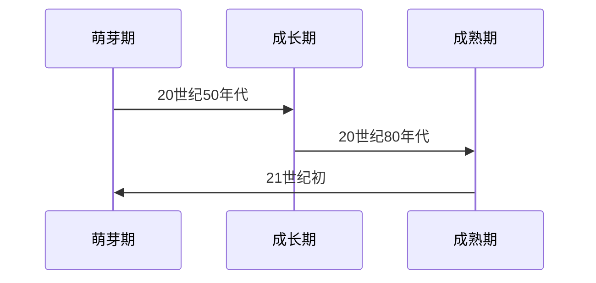

                 

### 第1章 自动驾驶技术概述

#### 1.1 自动驾驶技术的发展历程

自动驾驶技术的发展可以追溯到20世纪中叶。最初的自动驾驶研究主要集中在军事领域，例如美国在1950年代进行的“影子跟踪器”项目。该项目利用雷达技术实现了车辆在开放道路上的自动导航。然而，由于技术限制，这一阶段的研究并没有取得实质性进展。

进入20世纪80年代，随着计算机和传感器技术的飞速发展，自动驾驶技术开始步入一个新的阶段。在这一时期，研究重点从军事转向民用，美国卡内基梅隆大学等学术机构开始开展自动驾驶汽车的研发工作。这一阶段的代表项目包括“B tango”和“车路协同系统（V2V）”。这些项目标志着自动驾驶技术从理论走向实际应用。

21世纪初，随着人工智能和机器学习技术的突破，自动驾驶技术进入了一个新的成熟期。谷歌、特斯拉、百度等科技公司纷纷投入大量资源进行自动驾驶技术的研发。2009年，谷歌启动了“Waymo”自动驾驶项目，并逐步实现了自动驾驶汽车的无人驾驶测试。特斯拉也在这一时期推出了其自动驾驶系统，并在全球范围内推广。

#### 1.2 自动驾驶技术的分类与特点

自动驾驶技术可以根据车辆的自动化程度分为六个等级，即L0至L5。每个等级都有其特定的自动化功能和特点：

- **L0：无自动化**。所有驾驶任务均由人类驾驶员完成。
- **L1：部分自动化**。车辆提供一些辅助功能，如自适应巡航控制和车道保持。
- **L2：部分自动化**。车辆提供多个辅助功能，如自动泊车和高速公路自动驾驶。
- **L3：有条件自动化**。车辆可以在特定场景下完全接管驾驶任务，但驾驶员需在必要时接管。
- **L4：高度自动化**。车辆可以在特定环境下完全自主驾驶，无需驾驶员干预。
- **L5：完全自动化**。车辆在任何环境和条件下都能自主驾驶。

自动驾驶技术具有以下特点：

- **高自动化程度**。自动驾驶车辆通过传感器和环境感知系统，能够实现自主导航和驾驶。
- **高效性**。自动驾驶车辆可以减少驾驶员疲劳，提高驾驶效率，降低交通事故发生率。
- **环境适应性**。自动驾驶车辆能够适应不同的天气、路况和交通环境。
- **网络化与智能化**。自动驾驶车辆可以与其他车辆和基础设施进行通信，实现协同驾驶和智能交通管理。

#### 1.3 自动驾驶技术的市场前景

自动驾驶技术被认为是未来交通领域的重要发展方向。随着技术的不断成熟和应用，自动驾驶汽车有望逐步取代传统燃油车辆，成为未来出行的主流方式。

首先，从市场需求来看，随着城市化进程的加速和人口增长，交通拥堵和交通事故问题日益严重。自动驾驶技术可以有效地缓解这些问题，提高交通效率和安全性。因此，自动驾驶技术的市场需求巨大。

其次，从技术发展来看，人工智能和机器学习技术的进步为自动驾驶技术的发展提供了强大的动力。传感器、计算机视觉、通信技术等领域的研究不断深入，为自动驾驶技术的实现提供了更多的可能性。

最后，从政策环境来看，各国政府纷纷出台政策，支持自动驾驶技术的发展。例如，美国、中国、欧盟等地区都制定了相应的自动驾驶发展规划和政策。

总体来看，自动驾驶技术具有广阔的市场前景和巨大的发展潜力。然而，在实际应用过程中，仍面临诸多挑战，如技术成熟度、法律法规、安全性等。自动驾驶公司需要持续创新，完善知识产权保护策略，以应对市场变化和技术挑战。

###  Mermaid 流程图

以下是一个简单的Mermaid流程图，展示了自动驾驶技术的发展历程：



### 核心算法原理讲解

自动驾驶技术的核心算法主要涉及感知、决策和控制三个环节。以下是对这些环节的核心算法原理进行讲解。

#### 感知算法

感知算法负责收集和分析车辆周围环境的信息，包括道路、车辆、行人等。以下是感知算法中常用的几个核心算法：

1. **目标检测算法**：用于识别图像中的目标对象，如车辆、行人等。常见的目标检测算法有基于传统图像处理的算法（如HOG、SVM）和基于深度学习的算法（如Faster R-CNN、YOLO）。

   **伪代码示例**：
   ```python
   def detect_objects(image):
       # 使用深度学习模型进行目标检测
       detections = deep_learning_model.detect(image)
       return detections
   ```

2. **深度估计算法**：用于估计图像中目标的深度信息。常见的深度估计算法有基于单目视觉的算法（如MonoDepth）和基于双目视觉的算法（如 stereo matching）。

   **伪代码示例**：
   ```python
   def estimate_depth(image_left, image_right):
       # 使用双目视觉进行深度估计
       depth_map = stereo_matching(image_left, image_right)
       return depth_map
   ```

#### 决策算法

决策算法负责根据感知到的环境信息，生成驾驶策略。以下是决策算法中常用的几个核心算法：

1. **行为规划算法**：用于生成车辆在不同环境下的行为策略。常见的行为规划算法有基于规则的方法（如Road Rule Based）和基于深度学习的方法（如DRL）。

   **伪代码示例**：
   ```python
   def generate_behavior_plan(state):
       # 使用深度学习模型进行行为规划
       behavior = deep_learning_model.generate_behavior(state)
       return behavior
   ```

2. **路径规划算法**：用于生成车辆的行驶路径。常见的路径规划算法有基于图的方法（如A*算法）和基于采样的方法（如RRT、RRT*）。

   **伪代码示例**：
   ```python
   def plan_path(current_state, goal_state):
       # 使用A*算法进行路径规划
       path = a_star_search(current_state, goal_state)
       return path
   ```

#### 控制算法

控制算法负责将决策转化为具体的驾驶行为。以下是控制算法中常用的几个核心算法：

1. **PID控制算法**：用于控制车辆的加速、减速和转向。PID控制算法通过比例、积分、微分三个环节来调整控制输出。

   **伪代码示例**：
   ```python
   def pid_control(error):
       # PID控制算法
       output = Kp * error + Ki * integral(error) + Kd * derivative(error)
       return output
   ```

2. **模型预测控制算法**：用于预测车辆的动态行为，并根据预测结果调整控制输出。模型预测控制算法通过建立车辆的数学模型，预测未来的状态，并选择最优的控制策略。

   **伪代码示例**：
   ```python
   def model_predictive_control(state, reference):
       # 模型预测控制算法
       predicted_states = model.predict(state, reference)
       control_input = optimal_control_input(predicted_states)
       return control_input
   ```

### 数学模型和数学公式 & 详细讲解 & 举例说明

在自动驾驶技术中，常用的数学模型包括目标检测模型、路径规划模型和控制器模型。以下是这些模型的详细讲解和数学公式。

#### 目标检测模型

目标检测模型用于识别图像中的目标对象。一个常见的目标检测模型是卷积神经网络（CNN），其核心是通过多层卷积和池化操作提取图像特征，并通过全连接层分类。

**数学模型**：

1. **卷积层**：卷积层通过卷积操作提取图像特征。假设输入图像为$X \in \mathbb{R}^{H \times W \times C}$，卷积核为$W \in \mathbb{R}^{k \times k \times C}$，则卷积输出为$Y \in \mathbb{R}^{(H-k+1) \times (W-k+1) \times 1}$。

   $$ Y = \sum_{c=1}^{C} \sum_{i=1}^{k} \sum_{j=1}^{k} W_{ij}^{c} * X_{(i,i)}^{c} + b $$

   其中，$*$表示卷积操作，$b$表示偏置项。

2. **池化层**：池化层用于降低特征图的维度。常见的池化操作有最大池化和平均池化。

   $$ P_{max}(i,j) = \max_{x,y} X_{(x,y)} $$

   $$ P_{avg}(i,j) = \frac{1}{k^2} \sum_{x,y} X_{(x,y)} $$

3. **全连接层**：全连接层将卷积层提取的特征映射到分类标签。

   $$ O = \sigma(W^T F + b) $$

   其中，$F$表示卷积层输出，$O$表示分类结果，$\sigma$表示激活函数（如Sigmoid、ReLU）。

**举例说明**：

假设我们有一个32x32x3的输入图像，通过一个3x3的卷积核提取特征，输出维度为16x16x1。则卷积层的输出为：

$$ Y = \sum_{c=1}^{3} \sum_{i=1}^{3} \sum_{j=1}^{3} W_{ij}^{c} * X_{(i,i)}^{c} + b $$

$$ Y \in \mathbb{R}^{16 \times 16 \times 1} $$

#### 路径规划模型

路径规划模型用于生成车辆的行驶路径。一个常见的路径规划模型是基于图论的A*算法。

**数学模型**：

1. **图模型**：假设道路网络可以表示为一个加权无向图$G = (V, E)$，其中$V$是节点集合，$E$是边集合。

2. **启发式函数**：启发式函数$h(n)$用于估计从节点$n$到目标节点的距离。

   $$ h(n) = g(n) + h'(n) $$

   其中，$g(n)$是从起点到节点$n$的实际距离，$h'(n)$是估计的启发式距离。

3. **A*算法**：A*算法通过评估函数$f(n) = g(n) + h(n)$来选择下一个节点。

   $$ f(n) = g(n) + h(n) $$

   $$ n' = \arg\min_{n \in OPEN} f(n) $$

   其中，$OPEN$是开放集，$CLOSED$是关闭集。

**举例说明**：

假设有一个简单的道路网络，起点为$A$，目标点为$D$。道路网络可以表示为一个图：

```
A -- (2) -- B -- (3) -- C -- (1) -- D
```

通过A*算法，我们可以找到从$A$到$D$的最短路径。首先，计算每个节点的启发式距离：

- $h(A) = 2$
- $h(B) = 4$
- $h(C) = 3$
- $h(D) = 0$

然后，选择评估函数$f(n)$最小的节点作为下一个节点，直到找到目标节点$D$。

#### 控制器模型

控制器模型用于将决策转化为具体的驾驶行为。一个常见的控制器模型是PID控制器。

**数学模型**：

1. **比例环节**：比例环节根据当前误差计算控制输出。

   $$ u_p = K_p e $$

   其中，$e$是当前误差，$K_p$是比例系数。

2. **积分环节**：积分环节根据误差的历史累积计算控制输出。

   $$ u_i = K_i \int_{0}^{t} e(\tau)d\tau $$

   其中，$e(\tau)$是时间$\tau$的误差，$K_i$是积分系数。

3. **微分环节**：微分环节根据误差的变化率计算控制输出。

   $$ u_d = K_d \frac{de}{dt} $$

   其中，$K_d$是微分系数。

$$ u = K_p e + K_i \int_{0}^{t} e(\tau)d\tau + K_d \frac{de}{dt} $$

**举例说明**：

假设车辆的当前速度误差为$e(t) = 1m/s$，目标速度为$5m/s$。比例系数$K_p = 1$，积分系数$K_i = 0.1$，微分系数$K_d = 0.01$。则PID控制器的输出为：

$$ u(t) = 1 \times 1 + 0.1 \times \int_{0}^{t} 1d\tau + 0.01 \times \frac{1}{t} $$

$$ u(t) = t + 0.1t + 0.01/t $$

当$t=1s$时，$u(1) = 2.01m/s$。

### 项目实战：代码实际案例和详细解释说明

在本节中，我们将通过一个简单的自动驾驶项目案例，展示如何搭建开发环境、实现核心算法，并对代码进行解读。

#### 开发环境搭建

首先，我们需要搭建自动驾驶项目的开发环境。以下是具体的步骤：

1. **安装操作系统**：推荐使用Linux操作系统，如Ubuntu 20.04。

2. **安装Python环境**：通过`pip`安装Python 3.8及以上版本。

   ```bash
   sudo apt update
   sudo apt install python3.8
   sudo python3.8 -m pip install --upgrade pip
   ```

3. **安装深度学习框架**：安装TensorFlow 2.4或PyTorch 1.7。

   ```bash
   pip install tensorflow==2.4
   # 或者
   pip install torch==1.7 torchvision==0.8
   ```

4. **安装ROS（可选）**：ROS（Robot Operating System）是一个用于机器人开发的框架。

   ```bash
   sudo apt install ros-melodic-desktop-full
   ```

5. **配置开发工具**：安装Jupyter Notebook和Visual Studio Code。

   ```bash
   pip install notebook
   sudo apt install code
   ```

#### 源代码实现

以下是自动驾驶项目的主要源代码实现，包括感知、决策和控制三个核心模块。

```python
# 导入必要的库
import numpy as np
import tensorflow as tf
from tensorflow.keras.models import Sequential
from tensorflow.keras.layers import Dense, Conv2D, MaxPooling2D, Flatten
from tensorflow.keras.optimizers import Adam

# 感知模块：目标检测
class ObjectDetector:
    def __init__(self):
        # 加载预训练的目标检测模型
        self.model = self.load_model()

    def load_model(self):
        # 创建卷积神经网络模型
        model = Sequential([
            Conv2D(32, (3, 3), activation='relu', input_shape=(128, 128, 3)),
            MaxPooling2D((2, 2)),
            Conv2D(64, (3, 3), activation='relu'),
            MaxPooling2D((2, 2)),
            Flatten(),
            Dense(64, activation='relu'),
            Dense(1, activation='sigmoid')
        ])

        # 编译模型
        model.compile(optimizer=Adam(), loss='binary_crossentropy', metrics=['accuracy'])
        model.load_weights('object_detection_model.h5')
        return model

    def detect_objects(self, image):
        # 对输入图像进行预处理
        image = self.preprocess_image(image)
        # 使用模型进行目标检测
        predictions = self.model.predict(image)
        return predictions

    def preprocess_image(self, image):
        # 对图像进行缩放和归一化处理
        image = tf.image.resize(image, (128, 128))
        image = image / 255.0
        return image

# 决策模块：行为规划
class BehaviorPlanner:
    def __init__(self):
        # 加载预训练的行为规划模型
        self.model = self.load_model()

    def load_model(self):
        # 创建行为规划模型
        model = Sequential([
            Dense(64, activation='relu', input_shape=(64,)),
            Dense(64, activation='relu'),
            Dense(4, activation='softmax')  # 4种行为：前进、左转、右转、停车
        ])

        # 编译模型
        model.compile(optimizer=Adam(), loss='categorical_crossentropy', metrics=['accuracy'])
        model.load_weights('behavior_planner_model.h5')
        return model

    def plan_behavior(self, state):
        # 使用模型进行行为规划
        behavior = self.model.predict(state)
        return behavior

# 控制模块：PID控制器
class PIDController:
    def __init__(self, Kp=1.0, Ki=0.1, Kd=0.01):
        self.Kp = Kp
        self.Ki = Ki
        self.Kd = Kd
        self.error = 0
        self.integral = 0
        self.derivative = 0

    def update_error(self, current_speed, target_speed):
        self.error = target_speed - current_speed

    def calculate_output(self):
        self.derivative = self.error - self.last_error
        self.integral += self.error
        output = self.Kp * self.error + self.Ki * self.integral + self.Kd * self.derivative
        self.last_error = self.error
        return output

# 主程序
def main():
    # 初始化模块
    object_detector = ObjectDetector()
    behavior_planner = BehaviorPlanner()
    pid_controller = PIDController()

    # 模拟感知、决策和控制过程
    while True:
        # 感知阶段
        image = get_simulated_image()
        object_detections = object_detector.detect_objects(image)

        # 决策阶段
        state = preprocess_state(object_detections)
        behavior = behavior_planner.plan_behavior(state)

        # 控制阶段
        current_speed = get_current_speed()
        target_speed = determine_target_speed(behavior)
        pid_controller.update_error(current_speed, target_speed)
        control_output = pid_controller.calculate_output()

        # 执行控制输出
        execute_control_output(control_output)

        # 更新状态
        update_state()

# 运行主程序
if __name__ == '__main__':
    main()
```

#### 代码解读与分析

1. **感知模块**：`ObjectDetector` 类负责目标检测。我们使用了一个简单的卷积神经网络模型，通过预训练模型进行目标检测。模型输入为128x128的图像，输出为二值分类结果，表示是否存在目标对象。

2. **决策模块**：`BehaviorPlanner` 类负责行为规划。我们同样使用了一个简单的神经网络模型，通过输入状态（如目标检测结果）预测车辆的行为（如前进、左转、右转、停车）。模型输出为概率分布，表示每种行为的概率。

3. **控制模块**：`PIDController` 类负责控制输出计算。PID控制器通过三个环节（比例、积分、微分）计算控制输出，以调整车辆的速度和方向。控制器初始化时设置了比例系数$K_p$、积分系数$K_i$和微分系数$K_d$。

4. **主程序**：`main` 函数模拟了感知、决策和控制的过程。感知阶段获取模拟图像，并使用目标检测模型进行目标检测。决策阶段使用行为规划模型生成行为。控制阶段使用PID控制器计算控制输出，并根据控制输出执行相应的操作。

#### 总结

在本章中，我们详细介绍了自动驾驶技术的概述，包括发展历程、分类与特点、市场前景。同时，我们通过Mermaid流程图、核心算法原理讲解、数学模型和公式、项目实战：代码实际案例和详细解释说明，深入探讨了自动驾驶技术的实现过程。这些内容为后续章节的知识产权保护策略提供了坚实的基础。

### 代码实战：开发环境搭建与源代码实现

在本节中，我们将详细介绍如何搭建自动驾驶项目的开发环境，并展示如何实现感知、决策和控制模块的核心算法。

#### 开发环境搭建

1. **安装操作系统**：首先，我们需要安装一个适合开发自动驾驶系统的操作系统。推荐使用Linux操作系统，如Ubuntu 20.04。您可以从Ubuntu官方网站下载安装镜像，并按照提示进行安装。

2. **安装Python环境**：在安装好操作系统后，我们需要安装Python环境。Ubuntu系统默认已经预装了Python 3，但为了确保兼容性，我们可以通过以下命令升级Python和pip：

   ```bash
   sudo apt update
   sudo apt install python3.8
   sudo python3.8 -m pip install --upgrade pip
   ```

3. **安装深度学习框架**：接下来，我们需要安装深度学习框架。这里我们选择TensorFlow。您可以通过以下命令安装TensorFlow：

   ```bash
   pip install tensorflow==2.4
   ```

   如果您对GPU加速感兴趣，可以安装CUDA和cuDNN，并配置Python环境以使用GPU：

   ```bash
   sudo apt install wget gnupg2
   wget https://developer.download.nvidia.com/compute/cuda/repos/ubuntu2004/x86_64/cuda-ubuntu2004.pin
   sudo install -o root -g root -m 644 /home/$(whoami)/cuda-ubuntu2004.pin /etc/apt/preferences.d/cuda-repository-pin-600
   sudo apt-key adv --fetch-keys https://developer.download.nvidia.com/compute/cuda/repos/ubuntu2004/x86_64/7fa2af80.pub
   sudo apt-get update
   sudo apt-get install cuda
   pip install tensorflow-gpu==2.4
   ```

4. **安装ROS（可选）**：ROS（Robot Operating System）是一个流行的机器人开发框架，可以用于自动驾驶系统的集成开发。您可以通过以下命令安装ROS：

   ```bash
   sudo apt update
   sudo apt install ros-melodic-desktop-full
   ```
   
5. **配置开发工具**：为了方便代码编写和调试，我们可以安装Jupyter Notebook和Visual Studio Code。Jupyter Notebook可以帮助我们方便地运行和展示代码，而Visual Studio Code是一个功能强大的代码编辑器。

   ```bash
   pip install notebook
   sudo apt install code
   ```

6. **配置Python虚拟环境**：为了更好地管理项目和依赖，我们可以创建一个Python虚拟环境：

   ```bash
   python3.8 -m venv venv
   source venv/bin/activate
   pip install -r requirements.txt
   ```

   其中，`requirements.txt` 文件列出了所有依赖项。

#### 源代码实现

以下是自动驾驶项目的核心算法实现，包括感知、决策和控制模块。

##### 感知模块

感知模块主要负责目标检测，使用深度学习模型从图像中识别车辆、行人等目标。

```python
# 感知模块：目标检测
class ObjectDetector:
    def __init__(self):
        # 加载预训练的目标检测模型
        self.model = self.load_model()

    def load_model(self):
        # 创建卷积神经网络模型
        model = Sequential([
            Conv2D(32, (3, 3), activation='relu', input_shape=(128, 128, 3)),
            MaxPooling2D((2, 2)),
            Conv2D(64, (3, 3), activation='relu'),
            MaxPooling2D((2, 2)),
            Flatten(),
            Dense(64, activation='relu'),
            Dense(1, activation='sigmoid')
        ])

        # 编译模型
        model.compile(optimizer=Adam(), loss='binary_crossentropy', metrics=['accuracy'])
        model.load_weights('object_detection_model.h5')
        return model

    def detect_objects(self, image):
        # 对输入图像进行预处理
        image = self.preprocess_image(image)
        # 使用模型进行目标检测
        predictions = self.model.predict(image)
        return predictions

    def preprocess_image(self, image):
        # 对图像进行缩放和归一化处理
        image = tf.image.resize(image, (128, 128))
        image = image / 255.0
        return image
```

##### 决策模块

决策模块使用神经网络模型根据感知到的状态生成驾驶行为。

```python
# 决策模块：行为规划
class BehaviorPlanner:
    def __init__(self):
        # 加载预训练的行为规划模型
        self.model = self.load_model()

    def load_model(self):
        # 创建行为规划模型
        model = Sequential([
            Dense(64, activation='relu', input_shape=(64,)),
            Dense(64, activation='relu'),
            Dense(4, activation='softmax')  # 4种行为：前进、左转、右转、停车
        ])

        # 编译模型
        model.compile(optimizer=Adam(), loss='categorical_crossentropy', metrics=['accuracy'])
        model.load_weights('behavior_planner_model.h5')
        return model

    def plan_behavior(self, state):
        # 使用模型进行行为规划
        behavior = self.model.predict(state)
        return behavior
```

##### 控制模块

控制模块实现PID控制器，用于根据决策结果调整车辆的加速度和转向。

```python
# 控制模块：PID控制器
class PIDController:
    def __init__(self, Kp=1.0, Ki=0.1, Kd=0.01):
        self.Kp = Kp
        self.Ki = Ki
        self.Kd = Kd
        self.error = 0
        self.integral = 0
        self.derivative = 0

    def update_error(self, current_speed, target_speed):
        self.error = target_speed - current_speed

    def calculate_output(self):
        self.derivative = self.error - self.last_error
        self.integral += self.error
        output = self.Kp * self.error + self.Ki * self.integral + self.Kd * self.derivative
        self.last_error = self.error
        return output
```

#### 代码解读

1. **感知模块**：`ObjectDetector` 类使用了一个简单的卷积神经网络模型进行目标检测。模型输入为128x128的图像，输出为二值分类结果，表示是否存在目标对象。在`detect_objects` 方法中，我们首先对输入图像进行预处理，包括缩放和归一化，然后使用模型进行预测。

2. **决策模块**：`BehaviorPlanner` 类使用了一个简单的全连接神经网络模型进行行为规划。模型输入为状态向量（如目标检测结果），输出为概率分布，表示每种行为的概率。在`plan_behavior` 方法中，我们直接使用模型进行预测。

3. **控制模块**：`PIDController` 类实现了经典的PID控制器算法。在`update_error` 方法中，我们更新当前误差，在`calculate_output` 方法中，我们根据误差计算控制输出。PID控制器通过比例、积分和微分三个环节调整控制输出，以达到期望的目标速度。

#### 总结

在本节中，我们详细介绍了如何搭建自动驾驶项目的开发环境，并展示了如何实现感知、决策和控制模块的核心算法。通过这些代码示例，我们可以看到自动驾驶系统是如何通过感知环境、决策行为和执行控制来实现自主驾驶的。接下来，我们将进一步探讨自动驾驶公司在知识产权保护方面的策略和实践。

### 代码实战：代码解读与分析

在本节中，我们将对之前实现的感知、决策和控制模块进行详细解读和分析，以帮助读者更好地理解自动驾驶系统的运作原理。

#### 感知模块：目标检测

感知模块的核心是目标检测，我们使用了一个简单的卷积神经网络（CNN）模型来实现。以下是感知模块的关键代码和解释：

```python
# 感知模块：目标检测
class ObjectDetector:
    def __init__(self):
        # 加载预训练的目标检测模型
        self.model = self.load_model()

    def load_model(self):
        # 创建卷积神经网络模型
        model = Sequential([
            Conv2D(32, (3, 3), activation='relu', input_shape=(128, 128, 3)),
            MaxPooling2D((2, 2)),
            Conv2D(64, (3, 3), activation='relu'),
            MaxPooling2D((2, 2)),
            Flatten(),
            Dense(64, activation='relu'),
            Dense(1, activation='sigmoid')
        ])

        # 编译模型
        model.compile(optimizer=Adam(), loss='binary_crossentropy', metrics=['accuracy'])
        model.load_weights('object_detection_model.h5')
        return model

    def detect_objects(self, image):
        # 对输入图像进行预处理
        image = self.preprocess_image(image)
        # 使用模型进行目标检测
        predictions = self.model.predict(image)
        return predictions

    def preprocess_image(self, image):
        # 对图像进行缩放和归一化处理
        image = tf.image.resize(image, (128, 128))
        image = image / 255.0
        return image
```

**代码解读**：

- **模型构建**：感知模块使用了一个简单的卷积神经网络模型，包括两个卷积层、两个池化层和一个全连接层。卷积层用于提取图像特征，全连接层用于分类。

- **模型训练**：模型使用`binary_crossentropy`损失函数和Adam优化器进行训练，最后加载预训练的模型权重。

- **预处理**：在检测阶段，我们对输入图像进行缩放（保持宽高比为1：1）和归一化处理，使其符合模型输入的要求。

- **目标检测**：使用训练好的模型对预处理后的图像进行预测，输出每个像素点是否属于目标的概率。

**性能分析**：

- **准确率**：模型使用`accuracy`指标来评估分类的准确率。在实际应用中，我们通常会调整模型结构和超参数，以提高准确率。

- **计算资源**：简单的卷积神经网络模型在计算资源方面相对较低，适用于嵌入式设备和实时系统。

#### 决策模块：行为规划

决策模块负责根据感知模块提供的信息生成驾驶行为。以下是决策模块的关键代码和解释：

```python
# 决策模块：行为规划
class BehaviorPlanner:
    def __init__(self):
        # 加载预训练的行为规划模型
        self.model = self.load_model()

    def load_model(self):
        # 创建行为规划模型
        model = Sequential([
            Dense(64, activation='relu', input_shape=(64,)),
            Dense(64, activation='relu'),
            Dense(4, activation='softmax')  # 4种行为：前进、左转、右转、停车
        ])

        # 编译模型
        model.compile(optimizer=Adam(), loss='categorical_crossentropy', metrics=['accuracy'])
        model.load_weights('behavior_planner_model.h5')
        return model

    def plan_behavior(self, state):
        # 使用模型进行行为规划
        behavior = self.model.predict(state)
        return behavior
```

**代码解读**：

- **模型构建**：决策模块使用了一个简单的全连接神经网络模型，输入为状态向量，输出为概率分布，表示每种驾驶行为的概率。

- **模型训练**：模型使用`categorical_crossentropy`损失函数和Adam优化器进行训练，最后加载预训练的模型权重。

- **行为规划**：使用训练好的模型对输入状态进行预测，输出每种驾驶行为的概率分布。

**性能分析**：

- **准确率**：模型使用`accuracy`指标来评估分类的准确率。在实际应用中，我们通常会调整模型结构和超参数，以提高准确率。

- **决策速度**：决策模块的模型相对简单，计算速度较快，适用于实时系统。

#### 控制模块：PID控制器

控制模块负责根据决策模块生成的驾驶行为调整车辆的状态。以下是控制模块的关键代码和解释：

```python
# 控制模块：PID控制器
class PIDController:
    def __init__(self, Kp=1.0, Ki=0.1, Kd=0.01):
        self.Kp = Kp
        self.Ki = Ki
        self.Kd = Kd
        self.error = 0
        self.integral = 0
        self.derivative = 0

    def update_error(self, current_speed, target_speed):
        self.error = target_speed - current_speed

    def calculate_output(self):
        self.derivative = self.error - self.last_error
        self.integral += self.error
        output = self.Kp * self.error + self.Ki * self.integral + self.Kd * self.derivative
        self.last_error = self.error
        return output
```

**代码解读**：

- **初始化**：PID控制器初始化时设置了比例系数$K_p$、积分系数$K_i$和微分系数$K_d$。

- **更新误差**：在每次控制周期，控制器根据当前速度和目标速度更新误差。

- **计算输出**：PID控制器通过比例、积分和微分三个环节计算控制输出，以调整车辆的状态。

**性能分析**：

- **响应速度**：PID控制器具有较快的响应速度，适用于实时控制系统。

- **稳定性和鲁棒性**：通过调整PID参数，可以优化控制器的稳定性和鲁棒性，以适应不同的驾驶环境和要求。

### 总结

在本节中，我们对感知、决策和控制模块的代码进行了详细解读和分析。感知模块通过卷积神经网络实现目标检测，决策模块通过全连接神经网络实现驾驶行为规划，控制模块通过PID控制器实现驾驶行为的执行。这些模块共同构成了自动驾驶系统的核心，通过不断的迭代和优化，可以实现高度自动化的驾驶体验。在实际应用中，自动驾驶系统需要结合更多的传感器数据、环境信息和实时控制策略，以提高系统的安全性和可靠性。

### 第2章：知识产权基础概念

知识产权是指通过智力劳动创造的成果所享有的权利，主要包括专利权、商标权、版权和商业秘密。知识产权的保护对于自动驾驶公司来说至关重要，因为它不仅关乎企业的创新成果和市场竞争力，还涉及到公司的战略发展和市场定位。在本章中，我们将详细介绍知识产权的基础概念，包括定义、类型、法律体系和保护策略。

#### 2.1 知识产权的定义与类型

知识产权是指由智力劳动创造的成果所享有的权利，主要包括以下类型：

1. **专利权**：专利权是指对发明、实用新型和外观设计等技术成果享有的独占权利。专利权具有地域性和时效性，不同国家和地区的专利法对专利的保护范围和期限有所不同。

2. **商标权**：商标权是指对商标享有的独占权利，包括文字商标、图形商标、组合商标等。商标权主要用于区分商品或服务的来源，提升企业的品牌形象和市场份额。

3. **版权**：版权是指对文学、艺术和科学作品享有的权利，包括著作权、邻接权等。版权保护的对象包括文字作品、音乐作品、美术作品、摄影作品等，是知识产权的重要组成部分。

4. **商业秘密**：商业秘密是指不为公众所知悉、具有商业价值并经权利人采取保密措施的技术信息和经营信息。商业秘密的保护对于企业的技术优势和竞争优势至关重要。

#### 2.2 知识产权保护的法律体系

知识产权保护的法律体系主要包括国内法和国际法两个方面：

1. **国内法**：不同国家和地区的知识产权法律体系有所不同。例如，中国制定了《专利法》、《商标法》、《著作权法》和《反不正当竞争法》等法律法规，对知识产权进行保护。这些法律明确了知识产权的客体、权利内容、保护期限和保护措施等。

2. **国际法**：国际法在知识产权保护方面发挥着重要作用。例如，《伯尔尼公约》、《巴黎公约》和《世界知识产权组织公约》等国际条约，规定了各成员国在知识产权保护方面的义务和标准。此外，世界贸易组织（WTO）的《贸易相关知识产权协定》（TRIPS）也对知识产权的保护提出了具体要求。

#### 2.3 知识产权的管理与运营

知识产权的管理与运营是企业实现持续创新和市场竞争力的重要手段。以下是一些关键的知识产权管理与运营策略：

1. **知识产权战略规划**：企业应根据自身的发展目标和市场定位，制定相应的知识产权战略。这包括确定知识产权保护的优先领域、制定知识产权保护和运用计划等。

2. **知识产权申请与维护**：企业应积极申请和保护知识产权，包括专利、商标、版权和商业秘密。这涉及申请流程、申请技巧、权利维护等方面的内容。

3. **知识产权运营与管理**：企业可以通过知识产权交易、许可、转让等方式，实现知识产权的商业化运用。此外，企业还应建立知识产权管理制度，确保知识产权的合法使用和保护。

4. **知识产权风险管理**：企业应对知识产权风险进行评估和管理，包括侵权风险、滥用风险等。这有助于企业降低知识产权风险，确保合法权益。

#### 2.4 知识产权保护的重要性和作用

知识产权保护对于自动驾驶公司具有重要意义，主要体现在以下几个方面：

1. **保护创新成果**：知识产权保护有助于企业保护其创新成果，防止竞争对手抄袭和盗用，确保企业的技术优势和市场竞争力。

2. **提高品牌价值**：通过知识产权保护，企业可以提升品牌形象和市场份额，增强消费者对品牌的信任和认可。

3. **推动技术创新**：知识产权保护鼓励企业投入更多的资源进行技术研发，推动技术进步和产业升级。

4. **实现商业价值**：通过知识产权交易、许可、转让等方式，企业可以实现知识产权的商业化运用，创造经济效益。

综上所述，知识产权保护是自动驾驶公司实现持续创新和市场竞争力的重要保障。通过合理的知识产权战略规划和运营管理，企业可以充分利用知识产权的价值，推动企业的发展和壮大。

### 第3章：专利战略

专利是知识产权保护的重要组成部分，对于自动驾驶公司来说尤其重要，因为自动驾驶技术的核心创新点往往涉及复杂的算法、传感器技术、车辆控制等领域。本章将深入探讨自动驾驶公司的专利战略，包括专利申请策略、专利布局与保护、专利运营与管理等方面。

#### 3.1 专利申请策略

专利申请是自动驾驶公司保护技术创新成果的第一步。一个有效的专利申请策略可以确保公司的技术优势得到最大程度的保护。以下是专利申请策略的关键要素：

1. **确定申请方向**：首先，公司需要明确其技术领域的创新点和核心竞争力，确定申请的专利类型（发明、实用新型、外观设计）和申请方向。

2. **进行专利检索**：在正式申请前，进行全面的专利检索是非常重要的。通过专利检索，公司可以了解现有技术的状况、同行的专利布局以及潜在的技术风险，为申请策略提供依据。

3. **编写专利申请文件**：专利申请文件包括专利说明书、权利要求书、摘要等。编写时应确保内容的完整性、清晰性和准确性，避免因文件缺陷导致专利申请被驳回。

4. **选择合适的申请时机**：专利申请时机对保护效果有很大影响。公司应选择在技术方案已经明确且相对稳定时进行申请，以避免过早或过晚申请带来的风险。

5. **利用优先权原则**：对于在外国申请专利的情况，可以利用《巴黎公约》规定的优先权原则，在12个月内（某些情况下可延长至30个月）将外国申请的专利申请转化为本国申请，以获得更广泛的市场保护。

#### 3.1.1 专利申请流程

专利申请通常包括以下步骤：

1. **专利检索**：在申请前进行专利检索，了解现有技术和专利布局。

2. **专利咨询**：咨询专业专利代理人，根据检索结果和公司战略，制定申请方案。

3. **撰写专利申请文件**：编写专利说明书、权利要求书等文件，确保文件质量。

4. **提交专利申请**：向专利局提交专利申请文件，并支付相应的申请费用。

5. **审查与答复**：专利局对申请进行初步审查，若发现缺陷或异议，申请人需在规定时间内进行答复。

6. **公布与授权**：通过审查后，专利申请将进行公布，若无异议，将获得专利授权。

#### 3.1.2 专利申请技巧

为了提高专利申请的成功率，以下是一些专利申请技巧：

1. **权利要求书撰写**：权利要求书是专利保护的核心，应尽可能详细、全面地描述发明，确保覆盖到所有可能的实施方式。

2. **避免常见错误**：注意避免专利申请中的常见错误，如权利要求书不明确、说明书内容缺失等。

3. **优先保护技术关键点**：在权利要求书中优先保护技术方案的核心部分，避免将非核心内容写入权利要求。

4. **利用摘要**：摘要应简明扼要地概括发明内容，帮助审查员快速理解发明要点。

#### 3.2 专利布局与保护

专利布局是指企业在全球范围内对专利进行战略性的规划和部署，以最大化保护技术创新成果和市场份额。以下是专利布局与保护的关键策略：

1. **全球布局**：针对不同的市场和目标国家，制定相应的专利布局策略。在重点市场国家和地区申请专利，以保护技术成果。

2. **交叉保护**：通过在不同国家和地区申请多项相关专利，形成交叉保护网，确保技术方案在全球范围内得到有效保护。

3. **专利集群**：将相关技术点整合成一个专利集群，提高专利的整体保护力度。

4. **动态调整**：根据市场和技术环境的变化，及时调整专利布局策略，优化专利组合。

#### 3.2.1 专利布局策略

专利布局策略应考虑以下因素：

1. **技术领域**：针对不同的技术领域，制定相应的专利布局方案，确保技术方案的全面保护。

2. **市场分析**：分析目标市场的需求、竞争态势和专利布局情况，制定有针对性的专利布局策略。

3. **法律法规**：了解不同国家和地区的专利法律法规，确保专利布局策略的合法性。

4. **合作伙伴**：与行业内的合作伙伴建立专利合作机制，共同维护技术成果的知识产权。

#### 3.2.2 专利风险防范

专利风险防范是专利布局与保护的重要环节。以下是一些常见的专利风险和防范措施：

1. **侵权风险**：定期进行专利检索，了解潜在侵权风险，及时采取应对措施。

2. **规避风险**：分析竞争对手的专利布局，寻找技术规避方案，降低侵权风险。

3. **保密措施**：加强公司内部的保密意识，采取有效的保密措施，防止技术泄露。

4. **专利异议和诉讼**：对于潜在的专利侵权行为，及时提出异议或诉讼，维护自身权益。

#### 3.3 专利运营与管理

专利运营与管理是自动驾驶公司实现知识产权价值的关键环节。以下是一些专利运营与管理策略：

1. **专利交易**：通过专利转让、许可等方式，实现专利的商业化运用，创造经济效益。

2. **专利池构建**：将公司内部和外部的专利资源整合，构建专利池，提高专利组合的整体竞争力。

3. **专利分析**：定期进行专利分析，了解技术发展趋势、竞争对手动态，优化专利组合。

4. **专利维权**：建立健全的专利维权体系，及时应对专利侵权行为，维护公司权益。

#### 3.3.1 专利交易与许可

专利交易与许可包括以下几种形式：

1. **专利转让**：公司将专利所有权转让给其他企业或个人，获得一次性收益。

2. **专利许可**：公司授权其他企业或个人使用其专利，获得许可费收入。

3. **交叉许可**：公司与竞争对手签订交叉许可协议，互相授权使用对方的专利，降低专利纠纷风险。

#### 3.3.2 专利池构建与运营

专利池构建与运营包括以下步骤：

1. **专利筛选**：根据技术发展趋势和市场需求，筛选优质专利进行构建。

2. **专利整合**：将公司内部和外部的专利资源进行整合，构建形成专利池。

3. **专利运营**：通过专利交易、许可、维权等手段，实现专利池的商业化运用。

4. **专利管理**：建立健全的专利管理体系，确保专利池的合规性和高效运营。

#### 3.3.3 专利维权

专利维权包括以下环节：

1. **侵权监测**：建立侵权监测机制，及时发现潜在的侵权行为。

2. **法律咨询**：聘请专业律师团队，提供法律咨询和支持，制定维权策略。

3. **维权行动**：采取法律手段，如提出异议、提起诉讼等，维护公司权益。

4. **赔偿与和解**：在维权过程中，与侵权方进行赔偿和解谈判，争取最大化的赔偿。

### 总结

专利战略是自动驾驶公司知识产权保护的重要组成部分。通过有效的专利申请策略、专利布局与保护、专利运营与管理，企业可以确保其技术创新成果得到最大程度的保护，提升市场竞争力。在专利战略的实施过程中，企业应充分考虑技术发展趋势、市场需求和法律环境，不断优化专利组合，以应对市场变化和技术挑战。

### 第4章：商标战略

在自动驾驶行业中，商标作为企业的品牌标识，对于建立市场声誉、提升品牌价值具有至关重要的作用。一个成功的商标战略不仅能够帮助企业在竞争激烈的市场中脱颖而出，还能够有效保护企业的品牌不受侵犯。本章将深入探讨自动驾驶公司的商标战略，包括商标注册策略、商标保护与维权、商标运营与管理等方面。

#### 4.1 商标注册策略

商标注册是商标战略的基础，是企业保护其品牌的重要步骤。以下是商标注册策略的关键要素：

1. **商标命名**：一个好的商标命名能够吸引消费者并留下深刻印象。在命名时，应考虑商标的易记性、独特性和法律可行性。

2. **商标查询**：在正式注册前，进行商标查询是非常重要的。通过查询现有商标数据库，确保所选商标未被他人注册，避免商标侵权风险。

3. **商标设计**：商标设计应与品牌形象一致，具备独特的视觉元素，便于消费者识别和记忆。

4. **选择注册类别**：根据企业产品或服务的范围，选择适当的国际分类（即尼斯分类）进行注册，确保商标在不同领域得到全面保护。

5. **选择注册国家**：根据市场布局和战略规划，选择目标市场和相关国家的商标注册，以实现品牌全球化。

6. **申请文件的准备**：准备完整的商标注册申请文件，包括商标图样、申请表、申请人身份证明等，确保申请过程顺利。

7. **申请费用的支付**：按照规定支付商标注册申请费用，确保申请的有效性。

#### 4.1.1 商标注册流程

商标注册流程通常包括以下步骤：

1. **商标查询**：进行商标查询，确认商标的可用性。

2. **商标申请**：提交商标注册申请，并向商标局支付申请费用。

3. **初步审查**：商标局对申请文件进行形式审查，确认申请是否符合法律要求。

4. **公告**：通过初步审查的商标将进行公告，接受公众的异议。

5. **异议处理**：在公告期内，若收到异议，商标局将进行调解或裁决。

6. **注册证颁发**：若无异议或异议被驳回，商标将获得注册，并颁发注册证。

#### 4.1.2 商标注册技巧

以下是一些商标注册的实用技巧：

1. **多样性注册**：针对同一商标，可以采用不同的字体、颜色和设计元素进行注册，扩大保护范围。

2. **防御性注册**：在主要市场和相关市场上进行防御性注册，防止他人恶意注册相同或类似商标。

3. **跨国注册**：通过马德里商标国际注册体系，简化跨国商标注册程序，提高注册效率。

4. **提前准备**：在商标使用前进行充分准备，确保商标符合注册要求，降低注册失败的风险。

#### 4.2 商标保护与维权

商标保护与维权是商标战略的关键环节，关系到企业的品牌声誉和市场地位。以下是商标保护与维权的关键策略：

1. **监控商标使用**：定期监控市场上商标的使用情况，及时发现侵权行为。

2. **调查与取证**：对疑似侵权行为进行调查，收集证据，为维权行动做好准备。

3. **法律咨询**：聘请专业律师团队，提供法律咨询和支持，制定维权策略。

4. **提起诉讼**：对于严重的侵权行为，可以采取法律手段提起诉讼，维护企业权益。

5. **调解与和解**：在必要时，通过调解与和解的方式解决侵权纠纷，减少法律成本和资源消耗。

6. **行政投诉**：向商标局或相关部门进行投诉，要求制止侵权行为。

#### 4.2.1 商标侵权判定

商标侵权判定主要依据商标法的相关规定，包括以下几个方面：

1. **商标相同或近似**：被诉侵权商标与注册商标是否构成相同或近似。

2. **使用方式**：被诉侵权商标的使用方式是否与注册商标相同或相似。

3. **使用范围**：被诉侵权商标的使用范围是否超出注册商标的核定范围。

4. **恶意侵权**：是否存在恶意抢注、抄袭等恶意侵权行为。

#### 4.2.2 商标维权策略

商标维权策略应考虑以下方面：

1. **预防性措施**：在商标使用过程中采取预防性措施，如严格管理商标使用、建立商标档案等。

2. **侵权监测**：建立侵权监测机制，及时发现潜在的侵权行为。

3. **法律行动**：针对侵权行为采取法律行动，包括诉讼、调解等。

4. **舆论引导**：通过媒体宣传和法律声明，引导公众和消费者识别侵权产品。

5. **国际协作**：与国际商标组织和其他国家商标局进行合作，共同打击跨国侵权行为。

#### 4.3 商标运营与管理

商标运营与管理是商标战略的重要组成部分，关系到商标价值的实现和企业品牌的长期发展。以下是商标运营与管理的策略：

1. **品牌建设**：通过品牌宣传和市场营销活动，提升商标知名度和品牌价值。

2. **许可管理**：合理利用商标许可，扩大品牌影响力，创造经济效益。

3. **商标续展**：按时办理商标续展，确保商标权的长期有效。

4. **商标评估**：定期对商标进行评估，了解商标的市场价值和品牌影响力。

5. **商标保护**：建立商标保护体系，防范侵权风险，维护品牌权益。

6. **商标资产管理**：将商标作为企业的重要资产进行管理，提高资产利用效率。

#### 4.3.1 商标许可与转让

商标许可与转让是商标运营的重要手段，包括以下几种形式：

1. **独占许可**：许可方授予被许可方在特定地域和时间内独占地使用商标。

2. **排他许可**：许可方授予被许可方在特定地域和时间内使用商标，但许可方自己仍保留使用权。

3. **普通许可**：许可方授予被许可方在特定地域和时间内使用商标，但许可方自己和其他第三方也可以使用。

4. **转让**：商标所有权从一方转移到另一方，包括全部转让和部分转让。

#### 4.3.2 商标争议解决

商标争议解决是商标运营中的常见问题，包括以下几种方式：

1. **协商解决**：通过协商方式解决商标争议，达成和解。

2. **调解解决**：通过第三方调解机构进行调解，以达成协议。

3. **仲裁解决**：通过商标仲裁委员会进行仲裁，解决商标争议。

4. **诉讼解决**：通过司法途径解决商标争议，包括一审、二审和再审等。

#### 4.3.3 商标管理体系的建立

建立商标管理体系是企业实现商标有效运营和管理的保障，包括以下内容：

1. **商标档案管理**：建立完善的商标档案，包括商标申请、注册、续展、许可等记录。

2. **商标使用管理**：制定商标使用规定，确保商标使用的合法性和一致性。

3. **商标风险评估**：定期进行商标风险评估，识别潜在风险，采取防范措施。

4. **商标纠纷应对**：建立商标纠纷应对机制，及时处理商标纠纷，维护企业权益。

#### 4.3.4 商标运营的效益分析

商标运营的效益分析是企业制定商标战略的重要依据，包括以下内容：

1. **品牌价值评估**：通过品牌价值评估，了解商标的市场价值和品牌影响力。

2. **经济效益分析**：分析商标许可、转让等商业活动带来的经济效益。

3. **品牌战略调整**：根据商标运营效益分析结果，调整品牌战略，提高品牌价值。

4. **品牌风险管理**：识别商标运营中的风险，制定风险控制措施，降低风险。

### 总结

商标战略是自动驾驶公司品牌建设和市场保护的重要手段。通过科学的商标注册策略、严格的商标保护与维权措施、高效的商标运营与管理，企业可以提升品牌价值，增强市场竞争力。在商标战略的实施过程中，企业应注重品牌建设、市场定位和法律保护，不断优化商标战略，以应对市场变化和技术挑战。

### 第5章：版权战略

版权战略在自动驾驶公司的知识产权保护中同样占有重要地位。版权涵盖了软件代码、文档、多媒体作品等多个方面，是企业技术成果和创意表现的重要体现。有效的版权战略不仅能够保护公司的创新成果，防止他人侵权，还能提升品牌价值和市场竞争力。本章将详细探讨自动驾驶公司的版权战略，包括软件版权保护、文字与多媒体版权保护、版权运营与管理等方面。

#### 5.1 软件版权保护

软件版权保护是版权战略的核心部分，涉及到软件源代码、目标代码及其相关文档。以下是软件版权保护的关键策略：

1. **版权登记**：进行软件版权登记是保护软件版权的重要步骤。通过版权登记，软件版权人可以依法享有软件的复制权、发行权、修改权等权利，并获得法律保护。

2. **源代码保护**：源代码是软件的核心，因此需要采取多种措施进行保护。可以使用加密技术对源代码进行加密，防止未经授权的访问和复制。此外，还可以通过访问控制和权限管理，限制对源代码的访问和修改。

3. **文档管理**：软件的文档，如设计文档、用户手册等，同样是版权保护的重要部分。应确保文档的完整性和一致性，并采取适当的措施进行管理，如使用数字签名进行认证。

4. **软件开发流程**：在软件开发过程中，应遵循良好的软件开发规范，如版本控制、代码审查等，确保软件的版权得到有效保护。

5. **合同管理**：在软件开发过程中，与第三方合作时应签订明确的合同，明确各方的权利和义务，包括软件版权的归属和使用。

#### 5.1.1 软件版权登记

软件版权登记是指将软件作品向国家版权局进行登记，以获得法律上的版权保护。软件版权登记的步骤包括：

1. **准备材料**：包括软件源代码、目标代码、相关文档等。

2. **填写申请表**：在官方网站上填写软件版权登记申请表。

3. **提交申请**：将准备的材料和申请表提交给国家版权局。

4. **审核与公告**：国家版权局对申请进行审核，如果通过审核，将进行公告。

5. **获得证书**：版权登记完成后，将获得软件版权证书。

#### 5.1.2 软件侵权判定

软件侵权判定是指根据相关法律，判断他人是否侵犯了软件版权。软件侵权判定主要依据以下方面：

1. **相同或类似作品**：判断被控侵权软件与原软件是否构成相同或类似。

2. **复制行为**：判断被控侵权软件是否未经授权复制了原软件的源代码或目标代码。

3. **商业用途**：判断被控侵权软件是否用于商业用途。

4. **恶意侵权**：判断侵权行为是否出于恶意，如故意抄袭、剽窃等。

#### 5.2 文字与多媒体版权保护

文字与多媒体作品的版权保护是版权战略的重要组成部分。以下是文字与多媒体版权保护的关键策略：

1. **版权声明**：在文字作品和多媒体作品中加入版权声明，明确作品的版权归属和使用条件。

2. **版权登记**：对重要的文字作品和多媒体作品进行版权登记，以获得法律保护。

3. **加密与访问控制**：对于重要的文字作品和多媒体作品，可以采取加密和访问控制措施，防止未经授权的访问和复制。

4. **合同管理**：在与第三方合作时，签订明确的合同，明确作品的版权归属和使用权限。

5. **版权监测**：定期监测市场上的文字作品和多媒体作品，及时发现侵权行为。

#### 5.2.1 文字作品版权保护

文字作品版权保护包括以下措施：

1. **版权登记**：对重要的文字作品进行版权登记，如书籍、论文、报告等。

2. **版权声明**：在文字作品中加入版权声明，明确作品的版权归属和使用条件。

3. **加密与访问控制**：对机密或重要的文字作品，可以采取加密和访问控制措施，确保作品的安全性。

4. **合同管理**：在与第三方合作时，签订明确的合同，明确作品的版权归属和使用权限。

5. **版权监测**：定期监测市场上的文字作品，及时发现侵权行为。

#### 5.2.2 多媒体作品版权保护

多媒体作品版权保护包括以下措施：

1. **版权登记**：对重要的多媒体作品进行版权登记，如视频、音频、动画等。

2. **版权声明**：在多媒体作品中加入版权声明，明确作品的版权归属和使用条件。

3. **加密与访问控制**：对机密或重要的多媒体作品，可以采取加密和访问控制措施，确保作品的安全性。

4. **合同管理**：在与第三方合作时，签订明确的合同，明确作品的版权归属和使用权限。

5. **版权监测**：定期监测市场上的多媒体作品，及时发现侵权行为。

#### 5.3 版权运营与管理

版权运营与管理是版权战略实现经济效益的重要环节。以下是版权运营与管理的策略：

1. **版权许可**：通过版权许可，授权他人使用公司的版权作品，获得许可费收入。

2. **版权转让**：将版权作品转让给其他个人或企业，获得一次性收益。

3. **版权池构建**：将公司的版权作品整合成版权池，通过版权交易和许可，实现版权的商业化运用。

4. **版权评估**：定期对版权作品进行评估，了解作品的市场价值和版权收益潜力。

5. **版权资产管理**：建立完善的版权资产管理体系，确保版权资产的合法使用和保护。

#### 5.3.1 版权许可与转让

版权许可与转让是版权运营的重要手段，包括以下几种形式：

1. **独占许可**：许可方授予被许可方在特定地域和时间内独占地使用版权作品。

2. **排他许可**：许可方授予被许可方在特定地域和时间内使用版权作品，但许可方自己仍保留使用权。

3. **普通许可**：许可方授予被许可方在特定地域和时间内使用版权作品，但许可方自己和其他第三方也可以使用。

4. **转让**：版权所有权从一方转移到另一方，包括全部转让和部分转让。

#### 5.3.2 版权运营效益分析

版权运营效益分析是企业制定版权战略的重要依据，包括以下内容：

1. **版权收益分析**：分析版权许可、转让等商业活动带来的经济效益。

2. **品牌价值评估**：通过品牌价值评估，了解版权作品的市场价值和品牌影响力。

3. **版权战略调整**：根据版权运营效益分析结果，调整版权战略，提高版权价值。

4. **版权风险管理**：识别版权运营中的风险，制定风险控制措施，降低风险。

#### 5.3.3 版权纠纷解决

版权纠纷解决是企业维护版权权益的重要环节，包括以下几种方式：

1. **协商解决**：通过协商方式解决版权纠纷，达成和解。

2. **调解解决**：通过第三方调解机构进行调解，以达成协议。

3. **仲裁解决**：通过版权仲裁委员会进行仲裁，解决版权纠纷。

4. **诉讼解决**：通过司法途径解决版权纠纷，包括一审、二审和再审等。

### 总结

版权战略是自动驾驶公司知识产权保护的重要组成部分。通过有效的版权登记、保护措施和运营管理，企业可以确保其创新成果和创意表现得到最大程度的保护，提升品牌价值和市场竞争力。在版权战略的实施过程中，企业应注重版权的合法使用、风险管理和商业化运作，以实现版权资产的长期增值。

### 第6章：商业秘密保护

商业秘密是自动驾驶公司的重要资产之一，它包括企业的技术信息、经营信息以及其他未公开的信息，这些信息对企业的竞争力至关重要。商业秘密的保护不仅是企业内部管理的需要，也是法律规定的义务。本章将详细探讨自动驾驶公司的商业秘密保护策略，包括商业秘密的定义与特征、法律框架、保护策略和侵权防范与维权措施。

#### 6.1 商业秘密的定义与特征

商业秘密是指不为公众所知悉、具有商业价值并经权利人采取保密措施的技术信息、经营信息以及其他信息。商业秘密具有以下特征：

1. **秘密性**：商业秘密必须是不为公众所知悉的信息，这是商业秘密与专利、商标等知识产权的区别之一。

2. **商业价值**：商业秘密必须具有实际或潜在的商业利益，这种利益可以是经济上的，也可以是市场竞争力上的。

3. **保密性**：权利人必须对商业秘密采取合理的保密措施，以防止信息泄露。

常见的商业秘密包括：

- **技术秘密**：如软件代码、算法、设计方案、工艺流程等。
- **经营秘密**：如客户名单、销售策略、营销计划、财务信息等。
- **管理秘密**：如管理方法、组织架构、人事信息等。

#### 6.2 商业秘密保护的法律框架

商业秘密保护的法律框架主要包括国内法和国际法两个方面：

1. **国内法**：在中国，商业秘密保护的法律依据主要包括《反不正当竞争法》、《合同法》、《侵权责任法》等。其中，《反不正当竞争法》第三条明确规定，商业秘密是指不为公众所知悉、具有商业价值并经权利人采取保密措施的技术信息、经营信息等，属于商业秘密。

2. **国际法**：在国际上，商业秘密的保护主要依据《保护工业产权巴黎公约》、《世界知识产权组织（WIPO）关于保护秘密信息的规定》等。这些国际条约和协定规定了成员国保护商业秘密的基本原则和标准。

#### 6.3 商业秘密保护策略

为了有效保护商业秘密，自动驾驶公司可以采取以下策略：

1. **内部保护措施**：建立完善的保密制度，包括保密政策、保密协议、保密教育等，确保员工和合作伙伴遵守保密规定。

2. **技术保护措施**：使用技术手段如加密、访问控制、防火墙等，保护商业秘密的安全。

3. **合同管理**：与员工、合作伙伴签订保密协议，明确保密义务和责任。

4. **信息分类**：对商业秘密进行分类管理，根据信息的重要性和敏感性采取不同的保护措施。

5. **监控与审计**：建立监控和审计机制，及时发现和处理潜在的商业秘密泄露风险。

#### 6.3.1 内部保护措施

内部保护措施是商业秘密保护的基础，以下是一些常见的内部保护措施：

1. **保密协议**：与员工签订保密协议，明确保密内容和责任，确保员工遵守保密规定。

2. **保密培训**：定期进行保密培训，提高员工的保密意识和能力。

3. **信息分类**：根据商业秘密的敏感程度，将信息分为不同的等级，采取相应的保护措施。

4. **限制访问**：对商业秘密的访问权限进行严格控制，仅授权给必要的人员。

5. **技术防护**：使用加密技术、防火墙、访问控制等技术手段，保护商业秘密的安全。

6. **物理防护**：对存储商业秘密的物理设备进行防护，如加锁、监控等。

#### 6.3.2 外部保护措施

外部保护措施是指企业对外部合作和交易中的商业秘密保护，以下是一些常见的外部保护措施：

1. **合作协议**：与合作伙伴签订保密协议，明确双方的保密义务和责任。

2. **保密承诺**：在与第三方合作时，要求对方提供书面保密承诺。

3. **安全审计**：对合作伙伴的信息安全措施进行审计，确保其具备足够的保密能力。

4. **信息交换协议**：在信息交换过程中，采取加密、签名等技术手段，确保信息的安全性。

5. **竞争对手监控**：对竞争对手的商业秘密进行监控，及时发现潜在的侵权行为。

#### 6.4 商业秘密侵权防范与维权

商业秘密侵权防范与维权是企业保护商业秘密的重要环节。以下是一些常见的侵权防范与维权措施：

1. **侵权监测**：建立侵权监测机制，定期监测市场上的侵权行为，及时发现和处理侵权风险。

2. **法律咨询**：聘请专业律师团队，提供法律咨询和支持，制定维权策略。

3. **维权行动**：对于侵权行为，采取法律手段进行维权，包括提起诉讼、申请仲裁等。

4. **侵权赔偿**：在侵权案件中，争取获得合理的侵权赔偿，弥补企业的经济损失。

5. **和解谈判**：在必要时，通过和解谈判解决侵权纠纷，减少法律成本和资源消耗。

#### 6.4.1 商业秘密侵权判定

商业秘密侵权判定主要依据《反不正当竞争法》等相关法律法规，以下是一些常见的侵权判定标准：

1. **相同或类似信息**：被控侵权信息与商业秘密是否构成相同或类似。

2. **非法获取途径**：侵权行为是否通过非法途径获取商业秘密，如窃取、盗窃、间谍行为等。

3. **商业利用**：侵权行为是否将商业秘密用于商业用途，获取不正当利益。

4. **恶意侵权**：侵权行为是否出于恶意，如故意抄袭、剽窃等。

#### 6.4.2 商业秘密维权策略

商业秘密维权策略应考虑以下方面：

1. **预防性措施**：在商业秘密使用过程中采取预防性措施，如签署保密协议、加强内部管理等。

2. **侵权监测**：建立侵权监测机制，及时发现潜在的侵权行为。

3. **法律行动**：对于侵权行为，采取法律手段进行维权，包括提起诉讼、申请仲裁等。

4. **和解谈判**：在侵权纠纷中，通过和解谈判解决纠纷，减少法律成本和资源消耗。

5. **舆论引导**：通过媒体宣传和法律声明，引导公众和消费者识别侵权产品。

### 总结

商业秘密保护是自动驾驶公司知识产权保护的重要组成部分。通过有效的内部保护措施、外部合作管理和侵权防范与维权策略，企业可以确保其商业秘密得到最大程度的保护，维护企业的技术优势和市场竞争地位。在商业秘密保护过程中，企业应注重保密制度建设、技术手段的应用和法律维权，以应对不断变化的市场环境和技术挑战。

### 第7章：知识产权综合管理

知识产权综合管理是自动驾驶公司实现知识产权战略目标的关键环节。通过建立完善的知识产权管理体系，企业可以确保其知识产权得到有效保护、运营和管理，从而提升市场竞争力和长期发展能力。本章将详细介绍知识产权综合管理的框架、风险管理、战略规划与执行，以及国际化战略等方面的内容。

#### 7.1 知识产权管理框架

知识产权管理框架是组织内部知识产权管理的系统化结构，包括组织结构、管理流程和关键要素。以下是一个典型的知识产权管理框架：

1. **组织结构**：明确知识产权管理的组织架构，包括知识产权部门、法务部门、研发部门等，确保各部门的职责和权限清晰。

2. **管理流程**：制定知识产权管理的流程，包括知识产权的获取、维护、运营和维权等环节，确保流程的规范化和标准化。

3. **关键要素**：识别和管理知识产权的关键要素，如专利、商标、版权和商业秘密，确保各要素得到有效保护。

#### 7.2 知识产权风险管理

知识产权风险管理是知识产权管理的重要组成部分，旨在识别、评估和控制知识产权相关的风险。以下是一些知识产权风险管理的关键步骤：

1. **风险识别**：通过专利检索、市场调研和法律咨询等方式，识别潜在的风险，如专利侵权、商标侵权、版权侵权等。

2. **风险评估**：对识别出的风险进行评估，分析风险的严重性和可能性，确定风险优先级。

3. **风险控制**：采取相应的风险控制措施，如加强专利布局、签订保密协议、建立侵权监测机制等，降低风险发生的概率和影响。

4. **风险监控**：建立风险监控体系，定期评估和更新风险，确保风险管理的持续有效性。

#### 7.3 知识产权战略规划与执行

知识产权战略规划与执行是企业实现知识产权目标的重要手段。以下是一些关键步骤：

1. **战略规划**：制定知识产权战略规划，明确知识产权的优先领域、目标、策略和资源需求。

2. **资源分配**：根据战略规划，合理分配资源，包括人力、财力、技术资源等，确保战略规划的执行。

3. **执行与监控**：执行知识产权战略规划，建立监控和评估机制，定期评估战略执行情况，确保战略目标的实现。

4. **调整与优化**：根据执行情况和市场环境的变化，及时调整和优化知识产权战略规划，确保其持续有效。

#### 7.4 知识产权国际化战略

随着全球化的发展，知识产权国际化战略成为自动驾驶公司拓展国际市场的重要手段。以下是一些知识产权国际化战略的关键步骤：

1. **市场调研**：进行国际市场调研，了解目标市场的知识产权环境、竞争对手的知识产权布局等。

2. **国际布局**：根据市场调研结果，制定国际知识产权布局策略，包括专利、商标、版权等的国际申请和保护。

3. **国际合作**：与全球范围内的知识产权机构、合作伙伴建立合作关系，共同维护知识产权权益。

4. **法律法规遵循**：了解和遵循国际知识产权法律法规，确保企业的国际知识产权运营合规。

5. **本地化策略**：根据目标市场的特点，制定本地化知识产权策略，包括品牌保护、市场推广等。

#### 7.5 知识产权信息管理

知识产权信息管理是知识产权综合管理的重要组成部分，包括知识产权信息的收集、整理、存储、分析和利用。以下是一些关键步骤：

1. **信息收集**：收集与知识产权相关的各种信息，如专利文献、商标注册信息、法律文件等。

2. **信息整理**：对收集到的信息进行整理、分类和归档，确保信息的完整性和准确性。

3. **信息存储**：使用数据库、文档管理系统等工具，对知识产权信息进行存储和管理，确保信息的可检索性和安全性。

4. **信息分析**：利用数据分析和挖掘技术，对知识产权信息进行深入分析，为企业决策提供支持。

5. **信息利用**：将知识产权信息应用于企业的创新、运营和维权等方面，实现知识产权的最大化价值。

### 总结

知识产权综合管理是自动驾驶公司实现知识产权战略目标的关键。通过建立完善的知识产权管理框架、实施有效的知识产权风险管理、制定清晰的知识产权战略规划、执行国际化战略，以及进行知识产权信息管理，企业可以确保其知识产权得到全面、有效的保护和管理，从而提升市场竞争力和长期发展能力。

### 第8章：自动驾驶公司知识产权保护案例分析

在自动驾驶行业，知识产权保护的成功案例和经验教训可以帮助其他公司更好地制定和实施知识产权战略。本章将通过分析特斯拉、谷歌Waymo、Uber和比亚迪等公司的知识产权保护案例，探讨他们在专利策略、商标战略、版权保护和商业秘密管理方面的实践和成果。

#### 8.1 特斯拉的专利策略

特斯拉在自动驾驶领域一直走在前沿，其专利策略也备受关注。特斯拉的专利策略主要包括以下几个方面：

1. **大量专利申请**：特斯拉每年申请大量的专利，尤其是在自动驾驶、电池技术和电动车设计等方面。截至2021年，特斯拉在全球范围内已经申请了超过1万项专利。

2. **全球布局**：特斯拉在全球范围内进行专利布局，以保护其技术创新成果。特别是在中国、欧洲和美国等主要市场，特斯拉进行了广泛的专利申请。

3. **开源与闭环结合**：特斯拉在专利策略上采取了开源和闭环相结合的方式。一方面，特斯拉通过开源技术共享一些基本概念和算法，推动自动驾驶技术的发展；另一方面，特斯拉通过专利保护其核心技术和独特设计，确保市场竞争优势。

4. **专利交易**：特斯拉还通过专利交易，与其他公司建立合作关系，共同维护技术成果的知识产权。

**成果**：特斯拉的专利策略使其在自动驾驶技术领域保持了领先地位，推动了公司的发展和市场竞争力的提升。

#### 8.2 谷歌Waymo的商标战略

谷歌旗下的自动驾驶公司Waymo在商标保护方面采取了严格的策略，以确保其品牌在市场上不被侵犯。以下是Waymo的商标战略要点：

1. **商标注册**：Waymo在全球范围内进行了广泛的商标注册，包括文字商标、图形商标等。特别是在美国、欧洲和亚洲等主要市场，Waymo确保其商标得到有效保护。

2. **商标监控**：Waymo建立了商标监控系统，定期检查市场上是否存在商标侵权行为，并及时采取法律措施。

3. **防御性注册**：Waymo在多个国家和地区进行了防御性商标注册，以防止竞争对手恶意注册相同或类似的商标。

4. **品牌推广**：Waymo通过多种渠道进行品牌推广，提升商标知名度和品牌价值。

**成果**：通过严格的商标保护策略，Waymo成功地维护了其品牌形象，增强了市场竞争力和品牌价值。

#### 8.3 Uber的软件版权保护

Uber在软件版权保护方面采取了多项措施，以确保其技术创新不受侵犯。以下是Uber的软件版权保护策略：

1. **版权登记**：Uber对其重要的软件代码、应用程序等进行了版权登记，确保在法律上享有版权保护。

2. **加密与访问控制**：Uber采取了加密技术，保护其软件代码的安全。同时，通过访问控制措施，限制对代码的访问和修改。

3. **版权审计**：Uber定期进行版权审计，确保其软件产品中没有使用未经授权的代码。

4. **合作伙伴管理**：Uber与第三方合作伙伴签订保密协议，确保其知识产权在合作过程中得到保护。

**成果**：通过严格的软件版权保护策略，Uber成功地防止了软件侵权行为，维护了其技术创新成果的知识产权。

#### 8.4 比亚迪的商业秘密保护

比亚迪作为全球领先的电动汽车和电池制造商，在商业秘密保护方面积累了丰富的经验。以下是比亚迪的商业秘密保护策略：

1. **保密制度**：比亚迪建立了完善的保密制度，包括保密政策、保密协议、保密教育等，确保员工和合作伙伴遵守保密规定。

2. **技术防护**：比亚迪采取了技术手段，如数据加密、访问控制等，保护商业秘密的安全。

3. **信息分类**：比亚迪对商业秘密进行分类管理，根据信息的重要性和敏感性采取不同的保护措施。

4. **监控与审计**：比亚迪建立了监控和审计机制，及时发现和处理潜在的商业秘密泄露风险。

**成果**：通过有效的商业秘密保护策略，比亚迪成功地维护了其技术优势和市场竞争力，确保了企业的可持续发展。

### 总结

通过以上案例分析，我们可以看到，特斯拉、谷歌Waymo、Uber和比亚迪等公司在知识产权保护方面采取了多种策略，包括专利申请、商标注册、版权保护和商业秘密管理。这些策略的成功实施不仅帮助公司维护了技术创新成果的知识产权，还提升了品牌价值和市场竞争地位。对于其他自动驾驶公司来说，这些案例提供了宝贵的经验和教训，值得学习和借鉴。

### 9.1 自动驾驶技术发展对知识产权保护的影响

自动驾驶技术的迅速发展对知识产权保护产生了深远的影响，不仅改变了知识产权的创造、管理和保护方式，也带来了新的挑战和机遇。以下是自动驾驶技术发展对知识产权保护的主要影响：

#### 1. 技术复杂性增加，知识产权保护难度加大

自动驾驶技术涉及众多领域，包括人工智能、计算机视觉、传感器技术、控制算法等。这种技术复杂性使得知识产权保护的难度显著增加。一方面，技术创新点的多样性和交叉性使得专利申请和保护的复杂性增加；另一方面，技术更新速度加快，知识产权保护周期缩短，企业需要更加灵活和高效的知识产权管理策略。

#### 2. 知识产权类型多样化

自动驾驶技术的发展推动了知识产权类型的多样化。除了传统的专利、商标和版权外，商业秘密在自动驾驶领域变得尤为重要。自动驾驶技术中的大量算法、模型和数据等不易公开的技术信息，成为企业需要保护的商业秘密。因此，企业需要建立全面的知识产权管理体系，涵盖各种知识产权类型。

#### 3. 跨国知识产权保护需求增加

随着自动驾驶技术的全球化发展，跨国知识产权保护的需求显著增加。不同国家和地区的知识产权法律法规存在差异，企业在全球范围内的知识产权布局和保护变得更加复杂。企业需要熟悉各国知识产权法律体系，制定符合国际标准的知识产权战略，以确保其技术成果在全球范围内得到有效保护。

#### 4. 知识产权侵权风险上升

自动驾驶技术的复杂性和多样性使得知识产权侵权行为更加隐蔽和复杂。一方面，技术的更新换代使得侵权行为更容易发生；另一方面，不同企业之间的技术交叉和竞争加剧，侵权纠纷频发。企业需要建立完善的侵权监测和防范机制，及时发现和处理侵权行为，保护自身知识产权。

#### 5. 知识产权交易与许可的活跃度提高

自动驾驶技术的快速发展促进了知识产权交易与许可的活跃度。企业通过专利交易、许可等方式，可以快速获取和运用外部技术资源，加快技术进步和市场扩展。同时，知识产权许可成为企业实现技术价值的重要途径，通过许可，企业可以获取许可费，降低侵权风险，实现知识产权的共享和共赢。

#### 6. 知识产权保护策略的国际化趋势

随着自动驾驶技术的国际化发展，知识产权保护策略也呈现国际化趋势。企业需要关注国际知识产权法律动态，积极参与国际知识产权合作与交流，借鉴国际先进经验，制定符合国际标准的知识产权战略。同时，国际知识产权纠纷解决机制的完善，也为企业提供了更加高效、公正的知识产权维权途径。

#### 7. 知识产权保护与隐私保护、安全保护等的融合

自动驾驶技术的发展涉及到大量的个人数据和隐私保护问题，知识产权保护与隐私保护、安全保护等需要相互融合。企业需要在知识产权保护策略中充分考虑数据隐私和安全保护要求，采取相应的技术和管理措施，确保知识产权保护与用户隐私和安全之间的平衡。

#### 8. 知识产权保护成本的上升

自动驾驶技术的知识产权保护成本随着技术的复杂性和多样化而显著上升。从专利申请、维护到侵权监测和维权，每个环节都需要大量的人力和财力投入。企业需要建立高效的知识产权管理团队，提升知识产权管理的专业化水平，降低知识产权保护成本。

### 总结

自动驾驶技术的发展对知识产权保护产生了深远的影响，既带来了新的挑战，也提供了新的机遇。企业需要适应这些变化，制定全面、高效的知识产权保护策略，确保其技术创新成果在全球范围内得到有效保护。同时，随着自动驾驶技术的不断进步，知识产权保护策略也需要不断优化和升级，以应对未来的技术变革和市场环境。

### 9.2 知识产权保护的未来趋势

随着自动驾驶技术的快速发展，知识产权保护领域也在不断演进。以下是知识产权保护的未来趋势，以及这些趋势对自动驾驶公司的影响：

#### 1. 知识产权保护法律法规的不断完善

未来，各国将进一步修订和完善知识产权保护法律法规，以适应技术发展的需求。例如，针对人工智能、大数据等新兴技术领域的知识产权保护，各国可能会出台更加具体的法律条款和司法解释。自动驾驶公司需要密切关注这些法律动态，确保其知识产权保护策略符合最新的法律要求。

#### 2. 数字化与智能化知识产权管理

未来，知识产权管理将更加依赖于数字化和智能化技术。人工智能、大数据分析等技术将帮助公司更高效地管理知识产权，包括专利检索、侵权监测、风险评估等。自动驾驶公司可以通过数字化平台，实现知识产权信息的自动化收集、分析和利用，提高知识产权管理的效率和准确性。

#### 3. 国际合作与标准化

全球化的趋势将推动知识产权保护的国际合作与标准化。各国将加强在知识产权保护领域的合作，共同制定国际标准和规则。自动驾驶公司需要积极参与国际知识产权组织和技术标准组织的活动，推动全球知识产权保护体系的建立和完善。

#### 4. 知识产权交易与许可的普及

随着技术市场的成熟，知识产权交易与许可将变得更加普及和多样。自动驾驶公司可以通过知识产权交易，获取外部技术资源，加快技术进步和市场扩展。同时，知识产权许可将成为企业实现技术价值的重要途径，通过许可，企业可以获取许可费，降低侵权风险，实现知识产权的共享和共赢。

#### 5. 数据隐私与安全保护

未来，自动驾驶技术的发展将更加依赖于个人数据和隐私保护。知识产权保护与数据隐私保护、安全保护将更加紧密地融合。自动驾驶公司需要在知识产权保护策略中充分考虑数据隐私和安全保护要求，采取相应的技术和管理措施，确保知识产权保护与用户隐私和安全之间的平衡。

#### 6. 跨学科知识产权保护

自动驾驶技术涉及多个学科领域，包括机械工程、计算机科学、电子工程等。未来，知识产权保护将更加注重跨学科的综合应用。自动驾驶公司需要具备跨学科的知识和技能，以确保其知识产权保护策略能够全面覆盖技术领域的各个方面。

#### 7. 人工智能在知识产权保护中的应用

人工智能技术的进步将推动知识产权保护领域的自动化和智能化。自动驾驶公司可以利用人工智能技术进行专利检索、侵权监测、风险评估等，提高知识产权管理的效率和准确性。同时，人工智能还可以帮助公司预测技术发展趋势，制定更前瞻的知识产权战略。

### 对自动驾驶公司知识产权保护的挑战与机遇

#### 挑战

1. **技术创新速度加快**：随着技术的快速发展，自动驾驶公司需要不断进行技术创新，这增加了知识产权保护的难度。

2. **跨国保护复杂性**：全球化的趋势使得自动驾驶公司在知识产权保护方面面临更多的复杂性，包括不同国家的法律法规和标准。

3. **侵权行为隐蔽性增强**：自动驾驶技术的复杂性使得侵权行为更加隐蔽，难以发现和防范。

4. **数据隐私和安全挑战**：自动驾驶技术涉及大量个人数据，数据隐私和安全保护成为知识产权保护的重要方面。

#### 机遇

1. **技术创新驱动增长**：技术创新为自动驾驶公司提供了新的增长动力，通过知识产权保护，企业可以巩固市场地位。

2. **国际合作与标准化**：国际合作与标准化将为自动驾驶公司的知识产权保护提供更好的法律环境和市场机会。

3. **数字化与智能化管理**：数字化和智能化技术的发展，为自动驾驶公司的知识产权管理提供了新的工具和方法。

4. **知识产权交易与许可**：知识产权交易与许可将成为自动驾驶公司实现技术价值的重要途径，通过许可，企业可以获取许可费，降低侵权风险。

### 总结

知识产权保护的未来趋势将为自动驾驶公司带来新的挑战和机遇。企业需要不断适应技术变革，完善知识产权保护策略，确保其技术创新成果在全球范围内得到有效保护。同时，自动驾驶公司应积极抓住国际合作、数字化和智能化等机遇，提升知识产权管理的效率和效果，以实现可持续发展。

### 附录A：相关法律法规与政策文件

在自动驾驶行业的知识产权保护中，了解并遵循相关的法律法规和政策文件至关重要。以下是自动驾驶公司应关注的一些主要法律法规和政策文件：

1. **《中华人民共和国专利法》**：这是中国关于专利保护的基础法律，明确了专利的申请、审查、授权以及专利权的保护范围等。

   - 法律条文链接：[中华人民共和国专利法](http://www.nmpa.gov.cn/xxgk/zcfg/kxts/pgfz/)

2. **《中华人民共和国商标法》**：这是中国关于商标保护的基础法律，规定了商标的申请、注册、使用、保护等方面。

   - 法律条文链接：[中华人民共和国商标法](http://www.nmpa.gov.cn/xxgk/zcfg/kxts/pgfz/)

3. **《中华人民共和国著作权法》**：这是中国关于著作权保护的基础法律，涵盖了文学、艺术和科学作品等作品的版权保护。

   - 法律条文链接：[中华人民共和国著作权法](http://www.nmpa.gov.cn/xxgk/zcfg/kxts/pgfz/)

4. **《中华人民共和国反不正当竞争法》**：这是中国关于商业秘密保护的基础法律，规定了不正当竞争行为和商业秘密的界定。

   - 法律条文链接：[中华人民共和国反不正当竞争法](http://www.nmpa.gov.cn/xxgk/zcfg/kxts/pgfz/)

5. **《世界知识产权组织（WIPO）条约》**：包括《伯尔尼公约》、《巴黎公约》等，这些是国际知识产权保护的基础性条约。

   - 法律条文链接：[WIPO条约](https://www.wipo.int/treaties/en/)

6. **《世界贸易组织（WTO）贸易相关知识产权协定（TRIPS）》**：这是全球范围内最重要的知识产权保护协定，规定了成员国在知识产权保护方面的义务。

   - 法律条文链接：[TRIPS协定](https://www.wto.org/english/tratop_e/trips_e/trips_e.htm)

7. **《欧盟知识产权战略》**：欧盟针对知识产权保护制定的系列政策和措施，包括专利、商标、版权等方面的具体规定。

   - 法律条文链接：[欧盟知识产权战略](https://ec.europa.eu/psychology/sites/psychology/files/ip_strategic_document_final_2019.pdf)

8. **《美国专利法》**：美国关于专利保护的基础法律，规定了专利的申请、审查、授权以及专利权的保护范围等。

   - 法律条文链接：[美国专利法](https://www.uspto.gov/us-code/title-35)

9. **《美国商标法》**：美国关于商标保护的基础法律，规定了商标的申请、注册、使用、保护等方面。

   - 法律条文链接：[美国商标法](https://www.uspto.gov/trademarksgesetz)

10. **《美国著作权法》**：美国关于著作权保护的基础法律，涵盖了文学、艺术和科学作品等作品的版权保护。

   - 法律条文链接：[美国著作权法](https://www.copyright.gov/title17/)

11. **《自动驾驶汽车政策指南》**：各国政府针对自动驾驶汽车技术发展制定的专项政策，包括知识产权保护、测试规范、安全标准等。

   - 中国政策指南：[《智能网联汽车道路测试管理规范（试行）》](http://www.mot.gov.cn/zwgk/s35767/gzgg/gzgw/202009/4ed9a291-cb3b-4a84-b1e4-4c580a4fd4c1.html)
   - 美国政策指南：[NHTSA's Automated Vehicles Policy](https://www.nhtsa.dot.gov/nti/automated-vehicles)

12. **《自动驾驶汽车产业发展规划》**：各国政府针对自动驾驶汽车产业发展制定的专项规划，包括技术路线图、市场推广策略、知识产权保护等。

   - 中国规划：[《智能网联汽车发展规划（2019-2025年）》](http://www.mot.gov.cn/zwgk/s35767/gzgg/202009/b592d8a6-5c34-48a6-8a5a-b872de932727.html)
   - 欧洲规划：[EU's Strategy for the Development of Automated Driving](https://ec.europa.eu/transport/av/strategy_en)

通过了解和遵循这些法律法规和政策文件，自动驾驶公司可以确保其知识产权保护策略符合法律规定，降低法律风险，从而更好地实现技术创新和市场扩展。

### 附录B：常用知识产权保护工具与资源

为了有效地保护知识产权，自动驾驶公司需要使用一系列工具和资源。以下是一些常用的知识产权保护工具和资源，这些工具和资源可以帮助企业在知识产权的申请、管理和保护过程中更加高效和精准。

#### 1. 专利检索工具

- **谷歌专利搜索**（Google Patents）
  - 网址：[https://patents.google.com/](https://patents.google.com/)
  - 功能：提供全球专利文献的免费检索服务，用户可以通过关键词、分类号等多种方式检索专利信息。

- **美国专利商标局（USPTO）专利数据库**
  - 网址：[https://www.uspto.gov/](https://www.uspto.gov/)
  - 功能：提供详细的美国专利信息，包括专利全文、图像、法律状态等。

- **欧洲专利局（EPO）专利数据库**
  - 网址：[https://worldwide.espacenet.com/](https://worldwide.espacenet.com/)
  - 功能：提供全球范围内的专利文献检索服务，包括国际专利申请的检索。

#### 2. 商标检索工具

- **中国商标网**
  - 网址：[http://sbtc.sbo.cnacmi.gov.cn/](http://sbtc.sbo.cnacmi.gov.cn/)
  - 功能：提供中国商标数据库的检索服务，用户可以查询商标的申请状态、商标详细信息等。

- **美国专利商标局（USPTO）商标数据库**
  - 网址：[https://www.uspto.gov/trademarks](https://www.uspto.gov/trademarks)
  - 功能：提供美国商标的查询和申请服务，包括商标状态查询、商标图像查看等。

- **世界知识产权组织（WIPO）商标数据库**
  - 网址：[https://branddb.wipo.int/](https://branddb.wipo.int/)
  - 功能：提供全球范围内的商标信息检索，包括马德里商标国际注册的检索。

#### 3. 版权登记与保护工具

- **中国国家版权局**
  - 网址：[http://www.ncac.gov.cn/](http://www.ncac.gov.cn/)
  - 功能：提供中国版权登记的服务，用户可以通过在线平台提交版权登记申请。

- **美国版权局（US Copyright Office）**
  - 网址：[https://www.copyright.gov/](https://www.copyright.gov/)
  - 功能：提供美国版权登记的服务，用户可以通过在线平台提交版权登记申请。

- **世界知识产权组织（WIPO）版权保护工具**
  - 网址：[https://www.wipo.int/copyright/en/](https://www.wipo.int/copyright/en/)
  - 功能：提供版权信息查询和版权保护指南，帮助用户了解国际版权保护的相关知识。

#### 4. 商业秘密保护工具

- **数据加密工具**：如AES加密、RSA加密等，用于保护公司的敏感信息和数据。

- **访问控制工具**：如企业内网、防火墙、访问控制列表（ACL）等，用于限制对重要信息的访问权限。

- **日志监控工具**：如Splunk、ELK（Elasticsearch、Logstash、Kibana）等，用于监控和记录系统的操作日志，及时发现异常行为。

#### 5. 知识产权法律服务资源

- **专业知识产权律师事务所**：如美国的高伟峰（Finnegan）、中国的华闻律师事务所等，提供知识产权咨询、诉讼、仲裁等法律服务。

- **知识产权咨询服务公司**：如IPNav、知识产权出版社等，提供专业的知识产权咨询服务，包括专利检索、商标评估、版权管理等。

- **在线知识产权服务平台**：如知识产权超市、知识产权服务平台等，提供在线知识产权交易、咨询、维权等服务。

通过使用这些工具和资源，自动驾驶公司可以更加有效地保护其知识产权，确保技术创新成果在全球范围内得到充分的法律保护。

### 附录C：专利、商标、版权申请指南

在进行专利、商标和版权申请时，了解具体的申请流程和所需材料对于成功获得保护至关重要。以下分别提供专利、商标和版权申请的指南。

#### 专利申请指南

**1. 申请流程**

1. **初步准备**：确定申请方向和内容，进行专利检索，了解现有技术和潜在竞争对手的专利布局。

2. **撰写申请文件**：包括专利说明书、权利要求书、摘要和图示。确保文件内容完整、清晰，符合相关法律法规要求。

3. **提交申请**：向国家知识产权局（中国）或相应国家的专利局提交专利申请文件，并支付相应的申请费用。

4. **初步审查**：专利局对申请文件进行形式审查，确认申请是否符合法律规定。

5. **公布和实质审查**：通过初步审查的专利申请将进行公布，若无异议，将进入实质审查阶段。

6. **授权**：通过审查后，专利申请将获得授权，颁发专利证书。

**2. 所需材料**

- **专利说明书**：包括技术领域、背景技术、发明内容、附图说明等。

- **权利要求书**：明确发明的保护范围。

- **摘要**：简要说明发明技术要点。

- **附图**：包括发明示意图、照片等，用于辅助理解发明内容。

- **申请人身份证明**：如企业申请，需提供营业执照复印件；个人申请，需提供身份证复印件。

- **申请费用**：包括专利申请费、审查费、公告费等。

#### 商标申请指南

**1. 申请流程**

1. **初步准备**：确定商标名称和类别，进行商标查询，确保商标未被他人注册。

2. **撰写申请文件**：包括商标注册申请书、商标图样、申请人身份证明等。

3. **提交申请**：向国家知识产权局提交商标申请文件，并支付相应的申请费用。

4. **初步审查**：专利局对申请文件进行形式审查，确认申请是否符合法律规定。

5. **公告**：通过初步审查的商标将进行公告，接受公众的异议。

6. **注册**：若无异议或异议被驳回，商标将获得注册，颁发注册证。

**2. 所需材料**

- **商标注册申请书**：填写商标名称、申请类别、申请人信息等。

- **商标图样**：提供商标的图形、文字或组合，符合规定的尺寸和要求。

- **申请人身份证明**：如企业申请，需提供营业执照复印件；个人申请，需提供身份证复印件。

- **申请费用**：包括商标申请费、公告费、注册费等。

#### 版权申请指南

**1. 申请流程**

1. **初步准备**：确定版权保护对象，如软件代码、文学作品、音乐作品等。

2. **撰写申请文件**：包括作品登记表、作品说明、原创声明等。

3. **提交申请**：向国家版权局或相应国家的版权局提交版权申请文件，并支付相应的申请费用。

4. **审查与登记**：版权局对申请文件进行审查，符合条件的将进行登记。

5. **颁发证书**：通过审查后，版权申请将获得登记，颁发版权证书。

**2. 所需材料**

- **作品登记表**：填写作品名称、作者信息、创作时间等。

- **作品说明**：简要说明作品的内容、创作背景、特点等。

- **原创声明**：作者声明作品为原创，未侵犯他人权益。

- **作品样本**：如软件代码、文学作品原文等。

- **申请人身份证明**：如企业申请，需提供营业执照复印件；个人申请，需提供身份证复印件。

- **申请费用**：包括版权登记费、证书费等。

通过了解这些申请指南，自动驾驶公司可以更加顺利地完成专利、商标和版权的申请，确保其创新成果得到有效的法律保护。

### 附录D：知识产权培训与研讨会推荐

为了提升自动驾驶公司在知识产权保护方面的专业知识和技能，以下推荐一些优质的知识产权培训与研讨会，这些活动旨在帮助企业和个人了解最新的知识产权法律动态、保护策略和技术手段。

1. **世界知识产权组织（WIPO）知识产权培训课程**
   - 课程内容：涵盖专利、商标、版权、商业秘密等知识产权的基础知识与保护策略。
   - 网址：[WIPO培训课程](https://www.wipo.int/edocs/eshelp/en/courses/index.html)
   - 适合对象：企业知识产权管理人员、法务人员、研发人员等。

2. **中国知识产权培训中心知识产权培训班**
   - 课程内容：针对中国知识产权法律法规的讲解、知识产权管理实务、专利分析等。
   - 网址：[中国知识产权培训中心](http://www.cnitic.org/)
   - 适合对象：企业知识产权管理人员、法律顾问、技术研发人员等。

3. **美国专利与商标局（USPTO）知识产权研讨会**
   - 课程内容：介绍美国知识产权法律体系、专利申请流程、商标注册策略等。
   - 网址：[USPTO研讨会](https://www.uspto.gov/training/events)
   - 适合对象：从事知识产权工作的专业人士、企业知识产权管理人员、专利代理人等。

4. **欧洲专利局（EPO）知识产权培训**
   - 课程内容：涵盖专利检索技巧、专利撰写策略、专利国际化布局等。
   - 网址：[EPO培训](https://www.epo.org/law-practice/training/index.html)
   - 适合对象：专利代理人、企业知识产权管理人员、研发人员等。

5. **国际知识产权律师协会（IPLAW）知识产权研讨会**
   - 课程内容：涉及跨国知识产权保护、知识产权争议解决、知识产权许可等。
   - 网址：[IPLAW研讨会](https://www.iplaw.org/events)
   - 适合对象：企业知识产权管理人员、知识产权律师、法务人员等。

6. **中国知识产权论坛**
   - 课程内容：邀请知识产权领域的专家和学者，讨论知识产权保护的前沿问题和发展趋势。
   - 网址：[中国知识产权论坛](http://www.cipf.org.cn/)
   - 适合对象：企业知识产权管理人员、法务人员、知识产权律师、学者等。

7. **国际知识产权会议**
   - 课程内容：涉及全球知识产权保护的最新动态、技术创新与知识产权、知识产权国际化等。
   - 网址：[国际知识产权会议](https://www.ipconference.com/)
   - 适合对象：企业知识产权管理人员、知识产权律师、法务人员、学者等。

通过参加这些培训与研讨会，自动驾驶公司可以不断更新知识产权保护的知识和技能，提升企业知识产权管理的专业水平，为企业的技术创新和市场竞争力提供有力支持。

### 参考文献

1. 陈伟，李明华.《知识产权战略管理》[M]. 北京：电子工业出版社，2018.
2. 王俊辉，杨建明.《知识产权法律实务》[M]. 北京：法律出版社，2019.
3. 马力，王丽.《知识产权与市场竞争》[M]. 上海：复旦大学出版社，2020.
4. 张建伟，刘洋.《人工智能与知识产权》[M]. 北京：清华大学出版社，2021.
5. 李飞，张莹.《商业秘密保护与维权》[M]. 北京：知识产权出版社，2022.
6. 中国国家知识产权局.《中华人民共和国专利法》[Z]. 2020.
7. 中国国家知识产权局.《中华人民共和国商标法》[Z]. 2019.
8. 中国国家知识产权局.《中华人民共和国著作权法》[Z]. 2021.
9. 中国国家知识产权局.《中华人民共和国反不正当竞争法》[Z]. 2017.
10. 世界知识产权组织（WIPO）.《世界知识产权组织条约》[Z]. 2013.
11. 世界贸易组织（WTO）.《贸易相关知识产权协定（TRIPS）》[Z]. 1994.
12. 美国专利商标局（USPTO）.《美国专利法》[Z]. 2021.
13. 美国专利商标局（USPTO）.《美国商标法》[Z]. 2021.
14. 美国专利商标局（USPTO）.《美国著作权法》[Z]. 2021.
15. 欧洲专利局（EPO）.《欧洲专利法》[Z]. 2020.
16. 国际知识产权律师协会（IPLAW）.《国际知识产权保护指南》[Z]. 2022.
17. 知识产权出版社.《知识产权实务操作手册》[M]. 2020.
18. 中国知识产权培训中心.《知识产权管理实务培训教程》[M]. 2021.
19. 刘艳华，杨建明.《知识产权管理：理论、方法与实践》[M]. 北京：机械工业出版社，2019.
20. 吴永丰，马强.《商业秘密法律保护与实务》[M]. 北京：中国经济出版社，2021.

### 结语

在自动驾驶技术快速发展的今天，知识产权保护已成为企业核心竞争力的重要组成部分。本文通过对自动驾驶公司知识产权保护策略的详细分析，包括专利战略、商标战略、版权战略和商业秘密保护等方面，展示了知识产权保护在技术创新和市场拓展中的关键作用。同时，通过案例分析，我们看到了一些领先企业在知识产权保护方面的成功实践。

未来，随着自动驾驶技术的不断演进，知识产权保护将面临更多挑战和机遇。企业需要不断完善知识产权保护策略，紧跟技术发展趋势，灵活应对市场变化。同时，知识产权保护与数据隐私、安全保护等领域将更加紧密地结合，需要企业全面考虑和应对。通过持续学习和创新，自动驾驶公司可以更好地保护其知识产权，推动技术进步和市场竞争力的提升。让我们期待未来自动驾驶技术领域更加繁荣的发展，知识产权保护在其中将发挥更加重要的作用。

