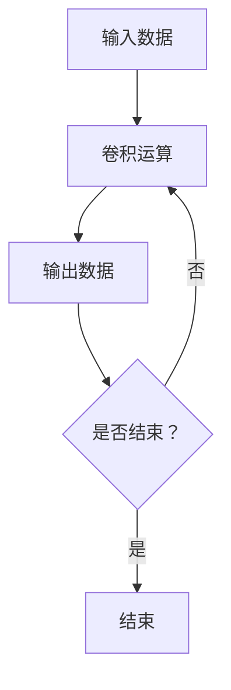
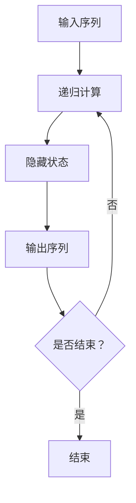
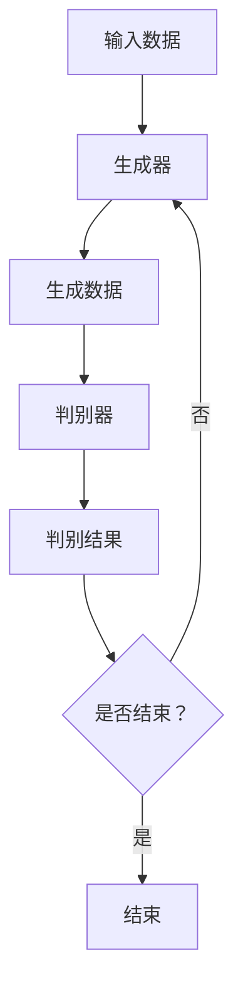
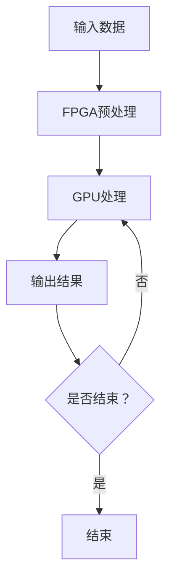

                 

### 《自监督学习的高效实现：算法优化和硬件加速》

#### 关键词：
自监督学习、算法优化、硬件加速、深度学习、GPU、FPGA、ASIC

#### 摘要：
自监督学习作为深度学习的重要分支，近年来在图像处理、自然语言处理等领域取得了显著成果。然而，自监督学习模型的高效实现面临着算法优化和硬件加速的挑战。本文将系统地探讨自监督学习的算法优化方法和硬件加速技术，包括GPU、FPGA和ASIC的应用，旨在为相关领域的研究者提供理论指导和实践参考。

### 《自监督学习的高效实现：算法优化和硬件加速》目录大纲

#### 第一部分：自监督学习基础

##### 第1章：自监督学习概述

**1.1 自监督学习的基本概念**
- **1.1.1 自监督学习的定义**
  自监督学习（Supervised Learning）是机器学习中的一种方法，其特征在于模型的训练过程中需要用到标签化的数据集，通过比较预测结果与实际标签的差异来调整模型参数。
- **1.1.2 自监督学习的分类**
  自监督学习可以分为无监督特征学习、无监督分类、自编码器和无监督聚类等。
- **1.1.3 自监督学习的优势与挑战**
  自监督学习的优势在于可以利用大量未标注的数据，降低数据标注成本。然而，其面临的挑战主要包括如何设计有效的损失函数和优化算法。

**1.2 自监督学习的应用场景**
- **1.2.1 图像处理**
  自监督学习在图像去噪、超分辨率、图像生成等方面有广泛应用。
- **1.2.2 自然语言处理**
  在语言模型预训练、词向量和文本生成等领域，自监督学习发挥着重要作用。
- **1.2.3 语音识别**
  自监督学习在语音增强、说话人识别和说话人验证等领域有显著应用。
- **1.2.4 其他应用领域**
  自监督学习在生物信息学、医疗影像、自动驾驶等领域也表现出良好的潜力。

**1.3 自监督学习的历史与发展**
- **1.3.1 自监督学习的起源**
  自监督学习概念最早由Arthur Samuel在20世纪50年代提出。
- **1.3.2 主要里程碑与成果**
  从1980年代的Hinton提出反向传播算法，到2010年代深度学习的兴起，自监督学习取得了诸多重要成果。
- **1.3.3 当前研究热点与趋势**
  当前自监督学习研究热点包括元学习、少样本学习、无监督域适应等。

##### 第2章：自监督学习的数学原理

**2.1 自监督学习的核心算法**
- **2.1.1 无监督特征学习**
  无监督特征学习旨在通过无监督学习自动提取具有鉴别力的特征表示。
- **2.1.2 无监督分类**
  无监督分类旨在将数据划分为若干类别，无需使用标签信息。
- **2.1.3 自编码器**
  自编码器是一种无监督学习算法，其目标是最小化输入和重构输出之间的差异。
- **2.1.4 无监督聚类**
  无监督聚类旨在将相似的数据点划分为同一类，而不同类数据点之间的差异较大。

**2.2 自监督学习的数学基础**
- **2.2.1 概率论与统计学基础**
  概率论与统计学是自监督学习的重要理论基础，包括概率分布、期望和方差等。
- **2.2.2 信息论基础**
  信息论提供了关于信息传输、存储和处理的基本理论，对自监督学习有重要启示。
- **2.2.3 线性代数基础**
  线性代数在自监督学习中用于描述数据特征、优化算法和模型参数等。

**2.3 自监督学习中的数学公式与推导**
- **2.3.1 损失函数**
  损失函数是自监督学习中的重要概念，用于衡量预测结果与实际结果之间的差异。
- **2.3.2 优化算法**
  优化算法用于调整模型参数，以最小化损失函数。常见的优化算法包括随机梯度下降（SGD）、Adam优化器等。
- **2.3.3 性能评估指标**
  性能评估指标用于衡量自监督学习模型的性能，如聚类有效性指数、图像质量评价指标等。

#### 第二部分：自监督学习的算法优化

##### 第3章：自监督学习的算法优化方法

**3.1 数据预处理技巧**
- **3.1.1 数据增强**
  数据增强是通过变换输入数据，增加模型训练数据的多样性，从而提高模型泛化能力。
- **3.1.2 数据归一化**
  数据归一化是将输入数据映射到相同的尺度，有助于优化算法的收敛速度和性能。
- **3.1.3 数据采样策略**
  数据采样策略用于优化训练过程中数据的读取和利用，常见策略包括随机采样、分层采样等。

**3.2 算法改进策略**
- **3.2.1 层次化训练**
  层次化训练是一种自底向上的训练策略，用于处理深度神经网络。
- **3.2.2 伪标签技术**
  伪标签技术是一种利用未标注数据进行自监督训练的方法，可以提高模型对未标注数据的预测能力。
- **3.2.3 适应度函数优化**
  适应度函数优化是一种通过调整适应度函数，提高模型优化效率的方法。

**3.3 模型结构优化**
- **3.3.1 深度网络设计**
  深度网络设计是自监督学习中的重要问题，包括网络层数、神经元数量、激活函数等。
- **3.3.2 网络架构改进**
  网络架构改进包括卷积神经网络（CNN）、循环神经网络（RNN）和生成对抗网络（GAN）等。
- **3.3.3 注意力机制**
  注意力机制是一种用于提高模型局部感知能力的方法，可以显著提高模型性能。

**3.4 优化算法优化**
- **3.4.1 随机梯度下降（SGD）**
  随机梯度下降是一种常用的优化算法，通过随机梯度更新模型参数。
- **3.4.2 Adam优化器**
  Adam优化器是一种结合了SGD和动量方法的优化算法，具有较好的收敛性能。
- **3.4.3 自适应优化器**
  自适应优化器是一种根据模型训练过程中梯度变化自动调整参数的优化算法。

##### 第4章：自监督学习的并行优化

**4.1 GPU加速技术**
- **4.1.1 CUDA基础**
  CUDA是一种用于GPU编程的计算平台和编程语言，可以显著提高深度学习模型的训练速度。
- **4.1.2 cuDNN库**
  cuDNN是NVIDIA推出的深度学习加速库，可以优化深度神经网络在GPU上的计算性能。
- **4.1.3 GPU编程实战**
  GPU编程实战包括GPU内存管理、并行计算模型、并行算法实现等。

**4.2 DNN模型并行化**
- **4.2.1 数据并行**
  数据并行是一种将训练数据分布在多个GPU上的方法，可以加速深度学习模型的训练过程。
- **4.2.2 模型并行**
  模型并行是一种将深度神经网络分布在多个GPU上的方法，可以优化计算资源和提高模型性能。
- **4.2.3 通信优化**
  通信优化是深度学习模型并行化中的重要问题，包括通信拓扑、通信协议和通信优化算法等。

**4.3 异构计算优化**
- **4.3.1 CPU-GPU协同计算**
  CPU-GPU协同计算是一种利用CPU和GPU各自优势，实现高效计算的方法。
- **4.3.2 多核优化**
  多核优化是针对多核CPU的优化策略，通过并行计算和任务调度提高计算性能。
- **4.3.3 ARM架构优化**
  ARM架构优化是针对ARM处理器优化的方法，通过指令优化、内存访问优化等提高计算性能。

#### 第三部分：自监督学习的硬件加速

##### 第5章：FPGA在自监督学习中的应用

**5.1 FPGA基本原理**
- **5.1.1 数字电路基础**
  数字电路基础是FPGA设计的基础，包括逻辑门、触发器和寄存器等。
- **5.1.2 可编程逻辑基础**
  可编程逻辑基础是FPGA实现的关键，包括硬件描述语言（HDL）和FPGA配置方法等。
- **5.1.3 FPGA设计与实现**
  FPGA设计与实现包括设计流程、综合与布局布线、测试与验证等。

**5.2 FPGA在深度学习中的应用**
- **5.2.1 卷积神经网络（CNN）加速**
  卷积神经网络（CNN）加速是FPGA在深度学习应用中的重要方向，通过硬件加速卷积运算提高模型性能。
- **5.2.2 循环神经网络（RNN）加速**
  循环神经网络（RNN）加速是FPGA在处理序列数据时的重要方法，通过硬件实现循环结构提高模型效率。
- **5.2.3 生成对抗网络（GAN）加速**
  生成对抗网络（GAN）加速是FPGA在生成模型应用中的关键，通过硬件加速生成对抗过程提高模型性能。

**5.3 FPGA与GPU协同优化**
- **5.3.1 FPGA与GPU异构计算**
  FPGA与GPU异构计算是一种利用FPGA和GPU各自优势，实现高效计算的方法。
- **5.3.2 资源共享与负载均衡**
  资源共享与负载均衡是FPGA与GPU协同优化中的重要问题，通过优化资源利用和任务调度提高整体性能。
- **5.3.3 延迟降低与带宽优化**
  延迟降低与带宽优化是FPGA与GPU协同优化中的关键问题，通过优化数据传输和处理提高整体性能。

##### 第6章：ASIC在自监督学习中的应用

**6.1 ASIC设计基础**
- **6.1.1 数字集成电路设计**
  数字集成电路设计是ASIC设计的基础，包括电路设计、验证和测试等。
- **6.1.2 逻辑设计与验证**
  逻辑设计与验证是ASIC设计的关键，包括硬件描述语言（HDL）设计和仿真验证等。
- **6.1.3 电路优化与仿真**
  电路优化与仿真是ASIC设计中的重要环节，包括优化电路性能、功耗和面积等。

**6.2 ASIC在深度学习中的应用**
- **6.2.1 CNN硬件加速**
  CNN硬件加速是ASIC在深度学习应用中的重要方向，通过硬件实现卷积运算提高模型性能。
- **6.2.2 RNN硬件加速**
  RNN硬件加速是ASIC在处理序列数据时的重要方法，通过硬件实现循环结构提高模型效率。
- **6.2.3 GAN硬件加速**
  GAN硬件加速是ASIC在生成模型应用中的关键，通过硬件加速生成对抗过程提高模型性能。

**6.3 ASIC与FPGA/GPU协同优化**
- **6.3.1 ASIC与FPGA/GPU异构计算**
  ASIC与FPGA/GPU异构计算是一种利用ASIC、FPGA和GPU各自优势，实现高效计算的方法。
- **6.3.2 产业化应用场景**
  产业化应用场景包括云计算、边缘计算、自动驾驶等领域，通过ASIC与FPGA/GPU协同优化实现高性能计算。
- **6.3.3 现实挑战与解决方案**
  现实挑战包括功耗、面积、实时性等，解决方案包括优化算法、硬件架构设计等。

##### 第7章：未来发展趋势与展望

**7.1 硬件加速技术发展趋势**
- **7.1.1 新型硬件架构**
  新型硬件架构包括神经架构搜索（NAS）、图计算架构等，有望提高硬件加速效率。
- **7.1.2 能效优化**
  能效优化是硬件加速技术的重要方向，通过优化功耗和性能比提高硬件利用率。
- **7.1.3 安全性增强**
  安全性增强是硬件加速技术发展中的重要问题，通过硬件加密、安全隔离等技术提高计算安全性。

**7.2 自监督学习在AI领域的发展**
- **7.2.1 自监督学习与深度学习的融合**
  自监督学习与深度学习的融合是未来的重要趋势，通过自监督学习优化深度学习模型。
- **7.2.2 自监督学习在边缘计算中的应用**
  自监督学习在边缘计算中的应用是未来的重要方向，通过自监督学习提高边缘计算性能。
- **7.2.3 自监督学习在智能制造中的应用**
  自监督学习在智能制造中的应用是未来的重要方向，通过自监督学习提高制造过程自动化水平。

**7.3 开放性问题与未来挑战**
- **7.3.1 数据隐私与安全性**
  数据隐私与安全性是自监督学习应用中的重要问题，需要加强数据保护和安全措施。
- **7.3.2 算法透明性与可解释性**
  算法透明性与可解释性是提高自监督学习应用可信度的重要问题，需要研究透明算法和解释方法。
- **7.3.3 资源分配与效率优化**
  资源分配与效率优化是自监督学习硬件加速中的重要问题，需要优化硬件资源利用和调度策略。

#### 附录

**附录A：自监督学习开源工具与资源**

**A.1 深度学习框架**
- **A.1.1 TensorFlow**
  TensorFlow是Google开源的深度学习框架，支持多种深度学习模型和算法。
- **A.1.2 PyTorch**
  PyTorch是Facebook开源的深度学习框架，具有灵活的动态计算图和易于使用的接口。
- **A.1.3 MXNet**
  MXNet是Apache基金会开源的深度学习框架，支持多种编程语言和硬件平台。

**A.2 硬件加速工具**
- **A.2.1 CUDA**
  CUDA是NVIDIA推出的深度学习硬件加速工具，支持GPU编程和计算。
- **A.2.2 cuDNN**
  cuDNN是NVIDIA推出的深度学习加速库，支持深度神经网络在GPU上的高效计算。
- **A.2.3 OpenCL**
  OpenCL是开放式计算语言，支持跨平台硬件加速计算，包括CPU、GPU和FPGA等。

**A.3 在线资源与学习材料**
- **A.3.1 MOOC课程**
  MOOC课程是大规模在线开放课程，提供自监督学习和硬件加速相关的课程和学习资源。
- **A.3.2 技术博客**
  技术博客是自监督学习和硬件加速领域的知识共享平台，提供实践经验和技术分析。
- **A.3.3 论文与报告**
  论文与报告是自监督学习和硬件加速领域的研究成果和进展报告，提供学术前沿和技术趋势。

---

通过上述步骤，我们系统地介绍了自监督学习的高效实现方法，包括算法优化和硬件加速技术。接下来，我们将深入探讨这些核心主题，为读者提供详细的理论和实践指导。让我们继续前进，探索自监督学习的无限可能！

---

### 自监督学习概述

自监督学习（Self-supervised Learning）是机器学习中的一个重要分支，它通过利用未标注的数据进行学习，从而降低对大量标注数据的依赖。自监督学习的关键在于设计合适的监督信号，使得模型可以在没有外部标签的情况下进行训练和优化。这一特点使得自监督学习在数据稀缺或标注成本高昂的领域具有显著的优势。

#### 定义

自监督学习的定义可以简单概括为：在训练过程中，模型自身提供监督信号，以指导学习过程。这种监督信号可以是数据的某些属性、分布、关联性等，而不依赖于传统的标注信息。自监督学习的核心思想是利用未标注数据中的潜在结构，通过自我纠正来学习有效的特征表示和预测模型。

#### 分类

自监督学习可以分为以下几类：

1. **无监督特征学习（Unsupervised Feature Learning）**：这一类方法主要关注如何从未标注数据中提取具有鉴别力的特征表示。典型的算法包括自编码器（Autoencoder）和判别分析（Discriminant Analysis）等。

2. **无监督分类（Unsupervised Classification）**：这种方法将数据集划分为若干类别，无需使用标注信息。常见的算法包括K-均值聚类（K-Means Clustering）和谱聚类（Spectral Clustering）等。

3. **自编码器（Autoencoder）**：自编码器是一种特殊的神经网络结构，其目标是最小化输入和重构输出之间的差异。自编码器可以用于特征提取、数据去噪和异常检测等任务。

4. **无监督聚类（Unsupervised Clustering）**：无监督聚类旨在将相似的数据点划分为同一类，而不同类数据点之间的差异较大。常见的聚类算法包括K-均值聚类、层次聚类和DBSCAN等。

#### 优势与挑战

自监督学习具有以下优势：

1. **减少标注成本**：自监督学习不需要大量标注数据，从而降低了数据采集和标注的成本。
2. **增强泛化能力**：通过学习未标注数据中的潜在结构，自监督学习可以提高模型的泛化能力，使其在新的数据集上表现良好。
3. **适应性**：自监督学习模型可以适应不同领域和任务，具有广泛的应用前景。

然而，自监督学习也面临一些挑战：

1. **损失函数设计**：自监督学习的损失函数需要能够有效地度量模型预测和真实数据之间的差距，这在某些情况下是一个难点。
2. **优化算法选择**：自监督学习的优化算法需要能够处理大量未标注数据，并且具有较高的收敛速度和稳定性。
3. **数据分布问题**：在训练过程中，数据分布的变化可能导致模型性能的下降，如何平衡数据分布是另一个需要解决的问题。

#### 应用场景

自监督学习在许多领域都表现出良好的应用潜力：

1. **图像处理**：自监督学习可以用于图像去噪、超分辨率、图像生成和图像分类等任务。例如，通过自编码器可以提取图像的有用特征，从而提高图像分类的准确率。
2. **自然语言处理**：自监督学习在自然语言处理（NLP）领域有广泛应用，如语言模型预训练、词向量表示、文本生成和文本分类等。著名的BERT模型就是基于自监督学习进行预训练的。
3. **语音识别**：自监督学习可以用于语音增强、说话人识别和说话人验证等任务。通过无监督特征学习，可以提取出语音信号的有用信息，从而提高语音识别的准确性。
4. **其他应用领域**：自监督学习在生物信息学、医疗影像、自动驾驶等领域也表现出良好的潜力。例如，在医疗影像领域，自监督学习可以用于图像分割、疾病检测和诊断等任务。

#### 历史与发展

自监督学习的历史可以追溯到20世纪50年代，当时Arthur Samuel提出了监督学习的概念。自那时以来，自监督学习经历了多个发展阶段：

1. **早期研究**：在20世纪80年代，Hinton等人提出了反向传播算法，为深度学习的发展奠定了基础。自监督学习在这一时期得到了广泛关注，并且出现了一些经典的算法，如自编码器。
2. **深度学习兴起**：随着深度学习的兴起，自监督学习在21世纪初迎来了新的发展。自编码器和判别分析等算法在图像识别和语音识别等领域取得了显著成果。
3. **当前研究热点**：当前自监督学习研究的热点包括元学习（Meta-Learning）、少样本学习（Few-Shot Learning）和无监督域适应（Unsupervised Domain Adaptation）等。这些研究旨在提高自监督学习模型的泛化能力和适应性。

#### 研究热点与趋势

当前自监督学习的研究热点主要包括以下几个方面：

1. **元学习**：元学习是一种能够快速适应新任务的学习方法，自监督学习与元学习的结合有望提高模型在新任务上的适应能力。
2. **少样本学习**：在许多实际应用中，标注数据有限，少样本学习研究旨在解决如何在有限样本条件下进行有效学习的问题。
3. **无监督域适应**：无监督域适应是一种在源域和目标域之间没有直接标注数据的情况下，通过自监督学习提高模型在目标域上的性能的方法。
4. **多模态学习**：多模态学习旨在利用不同类型的数据（如图像、文本和语音等）进行自监督学习，从而提高模型的泛化能力。
5. **硬件加速**：随着深度学习硬件加速技术的发展，如何在硬件上高效实现自监督学习成为了一个重要的研究方向。

总之，自监督学习作为深度学习的重要分支，具有广泛的应用前景和重要的研究价值。通过不断优化算法和硬件加速技术，自监督学习有望在未来取得更加显著的成果。

---

### 自监督学习的数学原理

自监督学习作为一种机器学习方法，其核心在于通过设计合适的损失函数和优化算法来训练模型。为了深入理解自监督学习，我们需要从数学原理的角度探讨其基础理论，包括概率论与统计学基础、信息论基础和线性代数基础。同时，我们还将详细讲解自监督学习中的数学公式与推导，如损失函数、优化算法和性能评估指标。

#### 概率论与统计学基础

概率论和统计学是自监督学习的重要理论基础，它们提供了用于描述数据分布、估计参数和进行推理的工具。

1. **概率分布**：
   概率分布是描述随机变量取值概率的函数。在自监督学习中，常用的概率分布包括正态分布、伯努利分布和高斯分布等。正态分布可以描述连续随机变量的概率分布，而伯努利分布和高斯分布则常用于离散和连续随机变量的概率描述。

2. **期望与方差**：
   期望和方差是概率分布的重要统计量。期望描述了随机变量的平均值，而方差则描述了随机变量的离散程度。在自监督学习中，通过计算期望和方差，可以评估模型参数的稳定性和鲁棒性。

3. **条件概率与贝叶斯定理**：
   条件概率是指在给定某个事件发生的条件下，另一个事件发生的概率。贝叶斯定理是一种基于条件概率的推理方法，它通过已知概率分布和条件概率来计算后验概率。在自监督学习中，贝叶斯定理可以用于参数估计和模型选择。

4. **最大似然估计**：
   最大似然估计（Maximum Likelihood Estimation，MLE）是一种参数估计方法，其目标是最大化数据在给定模型参数下的似然函数。在自监督学习中，MLE可以用于估计模型参数，从而优化模型性能。

#### 信息论基础

信息论是研究信息传输、存储和处理的基本理论，它提供了自监督学习中的重要概念和方法。

1. **信息熵**：
   信息熵（Entropy）是衡量随机变量不确定性的度量。在自监督学习中，通过计算信息熵，可以评估模型对数据的理解程度和特征提取能力。

2. **互信息**：
   互信息（Mutual Information）是衡量两个随机变量之间关联性的度量。在自监督学习中，通过计算互信息，可以评估特征表示的鉴别力，从而优化特征提取方法。

3. **Kullback-Leibler散度**：
   Kullback-Leibler散度（Kullback-Leibler Divergence，KL散度）是一种衡量两个概率分布差异的度量。在自监督学习中，通过计算KL散度，可以评估模型预测和真实数据之间的差距，从而优化模型参数。

#### 线性代数基础

线性代数是自监督学习中的重要数学工具，它用于描述数据特征、优化算法和模型参数等。

1. **矩阵与向量**：
   矩阵和向量是线性代数中的基本概念，用于表示数据和高维空间中的操作。在自监督学习中，通过矩阵和向量的运算，可以高效地实现特征提取、数据变换和模型参数优化。

2. **线性方程组与矩阵分解**：
   线性方程组是线性代数中的重要问题，其解法可以用于求解自监督学习中的优化问题。矩阵分解是一种将高维矩阵分解为低维矩阵的方法，常用于特征提取和数据降维。

3. **特征值与特征向量**：
   特征值和特征向量是线性代数中的重要概念，用于描述矩阵的性质和特征。在自监督学习中，通过计算特征值和特征向量，可以提取数据的低维表示，从而提高模型的泛化能力。

#### 自监督学习中的数学公式与推导

1. **损失函数**：
   损失函数是自监督学习中的重要概念，用于衡量模型预测和真实数据之间的差距。常见的损失函数包括均方误差（MSE）、交叉熵损失和对抗损失等。

   - **均方误差（MSE）**：
     $$L(\theta) = \frac{1}{2}\sum_{i=1}^{n}(y_i - \hat{y}_i)^2$$
     其中，$y_i$是真实标签，$\hat{y}_i$是模型预测。

   - **交叉熵损失（Cross-Entropy Loss）**：
     $$L(\theta) = -\sum_{i=1}^{n} y_i \log(\hat{y}_i)$$
     其中，$y_i$是真实标签，$\hat{y}_i$是模型预测。

   - **对抗损失（Adversarial Loss）**：
     $$L(\theta) = \sum_{i=1}^{n} \alpha \log(D(G(x_i))) + (1 - \alpha) \log(1 - D(G(x_i)))$$
     其中，$G$是生成器，$D$是判别器，$\alpha$是平衡参数。

2. **优化算法**：
   优化算法用于调整模型参数，以最小化损失函数。常见的优化算法包括随机梯度下降（SGD）、Adam优化器和自适应优化器等。

   - **随机梯度下降（SGD）**：
     $$\theta_{t+1} = \theta_{t} - \alpha \nabla_{\theta} L(\theta)$$
     其中，$\theta$是模型参数，$\alpha$是学习率，$\nabla_{\theta} L(\theta)$是损失函数关于模型参数的梯度。

   - **Adam优化器**：
     $$\theta_{t+1} = \theta_{t} - \alpha \left( \frac{m_{t}}{1 - \beta_1^t} + \frac{v_{t}}{1 - \beta_2^t} \right)$$
     其中，$m_t$和$v_t$分别是动量项和自适应项，$\beta_1$和$\beta_2$分别是动量和自适应的衰减率。

   - **自适应优化器**：
     自适应优化器是一类根据模型训练过程中梯度变化自动调整参数的优化算法。常见的自适应优化器包括Adagrad、RMSprop和Adam等。

3. **性能评估指标**：
   性能评估指标用于衡量自监督学习模型的性能。常见的性能评估指标包括准确率、召回率、F1分数和ROC-AUC曲线等。

   - **准确率（Accuracy）**：
     $$\text{Accuracy} = \frac{\text{预测正确数}}{\text{总样本数}}$$

   - **召回率（Recall）**：
     $$\text{Recall} = \frac{\text{预测正确且真实为正的样本数}}{\text{总真实为正的样本数}}$$

   - **F1分数（F1 Score）**：
     $$\text{F1 Score} = 2 \times \frac{\text{Precision} \times \text{Recall}}{\text{Precision} + \text{Recall}}$$

   - **ROC-AUC曲线**：
     ROC-AUC曲线是一种用于评估二分类模型性能的曲线，其横坐标是假正率（False Positive Rate），纵坐标是真正率（True Positive Rate）。ROC-AUC曲线的面积（AUC）反映了模型对正负样本的分类能力。

通过上述数学原理和公式的讲解，我们可以更好地理解自监督学习的理论基础。在后续章节中，我们将进一步探讨自监督学习的算法优化方法和硬件加速技术，以实现自监督学习的高效应用。

---

### 自监督学习的算法优化方法

自监督学习的核心在于如何通过优化算法提高模型的性能和效率。优化算法主要包括数据预处理技巧、算法改进策略、模型结构优化和优化算法优化等方面。下面，我们将逐一探讨这些优化方法，并给出具体的实现思路和策略。

#### 数据预处理技巧

数据预处理是自监督学习中的重要步骤，合理的预处理可以显著提高模型的训练效果。以下是几种常见的数据预处理技巧：

1. **数据增强**：
   数据增强（Data Augmentation）是一种通过变换输入数据，增加数据多样性，从而提高模型泛化能力的方法。常见的数据增强技术包括随机裁剪、旋转、缩放、翻转等。通过数据增强，可以减少模型对训练数据的过拟合现象。

   ```python
   from tensorflow.keras.preprocessing.image import ImageDataGenerator

   datagen = ImageDataGenerator(
       rotation_range=20,
       width_shift_range=0.2,
       height_shift_range=0.2,
       shear_range=0.2,
       zoom_range=0.2,
       horizontal_flip=True,
       fill_mode='nearest'
   )
   ```

2. **数据归一化**：
   数据归一化（Data Normalization）是将输入数据映射到相同的尺度，以避免由于数据范围差异导致的优化困难。常见的归一化方法包括最小-最大归一化和零-均值归一化。

   ```python
   from sklearn.preprocessing import MinMaxScaler

   scaler = MinMaxScaler()
   X_train_scaled = scaler.fit_transform(X_train)
   X_test_scaled = scaler.transform(X_test)
   ```

3. **数据采样策略**：
   数据采样策略（Data Sampling）是优化训练过程中数据读取和利用的方法。常见的数据采样策略包括随机采样、分层采样和欠采样等。

   ```python
   from sklearn.utils import resample

   # 随机采样
   X_train_upsampled, y_train_upsampled = resample(X_train, y_train, replace=True, n_samples=X_test.shape[0], random_state=42)

   # 分层采样
   X_train_downsampled, y_train_downsampled = resample(X_train, y_train, replace=False, n_samples=X_test.shape[0], random_state=42)
   ```

#### 算法改进策略

算法改进策略是提高自监督学习模型性能的重要手段，主要包括层次化训练、伪标签技术和适应度函数优化等方面。

1. **层次化训练**：
   层次化训练（Hierarchical Training）是一种自底向上的训练策略，适用于处理深度神经网络。通过将任务分解为多个子任务，逐步优化模型参数，可以提高模型的整体性能。

   ```python
   # 假设有一个多层的神经网络
   for layer in reversed(network.layers):
       if layer.is_trainable:
           layer.trainable = False
   network.compile(optimizer='adam', loss='categorical_crossentropy', metrics=['accuracy'])

   # 对底层层进行训练
   network.fit(X_train, y_train, epochs=5, batch_size=64, shuffle=True)

   for layer in network.layers:
       if layer.is_trainable:
           layer.trainable = True
   network.compile(optimizer='adam', loss='categorical_crossentropy', metrics=['accuracy'])

   # 对整个网络进行训练
   network.fit(X_train, y_train, epochs=10, batch_size=64, shuffle=True)
   ```

2. **伪标签技术**：
   伪标签技术（Pseudo-Labeling）是一种利用未标注数据进行自监督训练的方法。通过将未标注数据作为伪标签输入模型，然后利用模型的预测结果作为新的伪标签，从而提高模型对未标注数据的预测能力。

   ```python
   # 假设有一个预训练的模型
   pre_trained_model = load_pre_trained_model()

   # 对未标注数据进行预测，并使用预测结果作为伪标签
   predicted_labels = pre_trained_model.predict(X_unlabeled)

   # 利用伪标签进行进一步训练
   pre_trained_model.fit(X_unlabeled, predicted_labels, epochs=5, batch_size=64)
   ```

3. **适应度函数优化**：
   适应度函数优化（Fitness Function Optimization）是一种通过调整适应度函数，提高模型优化效率的方法。常见的适应度函数包括交叉熵、对抗损失和梯度惩罚等。

   ```python
   # 定义适应度函数
   fitness_function = lambda y_true, y_pred: K.mean(K.square(y_true - y_pred), axis=-1)

   # 训练模型，使用适应度函数作为损失函数
   model.compile(optimizer='adam', loss=fitness_function, metrics=['accuracy'])
   model.fit(X_train, y_train, epochs=10, batch_size=64, shuffle=True)
   ```

#### 模型结构优化

模型结构优化是提高自监督学习模型性能的重要手段，主要包括深度网络设计、网络架构改进和注意力机制等方面。

1. **深度网络设计**：
   深度网络设计（Deep Network Design）是自监督学习中的重要问题，通过设计合适的网络层数、神经元数量和激活函数，可以提高模型的性能。常见的深度网络设计方法包括卷积神经网络（CNN）和循环神经网络（RNN）等。

   ```python
   from tensorflow.keras.models import Sequential
   from tensorflow.keras.layers import Conv2D, MaxPooling2D, Flatten, Dense

   model = Sequential([
       Conv2D(32, (3, 3), activation='relu', input_shape=(28, 28, 1)),
       MaxPooling2D((2, 2)),
       Flatten(),
       Dense(128, activation='relu'),
       Dense(10, activation='softmax')
   ])
   model.compile(optimizer='adam', loss='categorical_crossentropy', metrics=['accuracy'])
   ```

2. **网络架构改进**：
   网络架构改进（Network Architecture Improvement）是通过改进网络结构，提高模型性能的方法。常见的网络架构改进方法包括残差网络（ResNet）、卷积神经网络（CNN）和生成对抗网络（GAN）等。

   ```python
   from tensorflow.keras.applications import ResNet50

   base_model = ResNet50(weights='imagenet', include_top=False, input_shape=(224, 224, 3))
   x = base_model.output
   x = GlobalAveragePooling2D()(x)
   x = Dense(1024, activation='relu')(x)
   predictions = Dense(num_classes, activation='softmax')(x)

   model = Model(inputs=base_model.input, outputs=predictions)
   model.compile(optimizer='adam', loss='categorical_crossentropy', metrics=['accuracy'])
   ```

3. **注意力机制**：
   注意力机制（Attention Mechanism）是一种用于提高模型局部感知能力的方法，通过关注输入数据的某些部分，从而提高模型的性能。常见的注意力机制包括自注意力（Self-Attention）和卷积注意力（Convolutional Attention）等。

   ```python
   from tensorflow.keras.layers import Layer

   class AttentionLayer(Layer):
       def __init__(self, **kwargs):
           super(AttentionLayer, self).__init__(**kwargs)

       def build(self, input_shape):
           self.W = self.add_weight(name='W', shape=(input_shape[-1], 1), initializer='random_normal', trainable=True)
           self.b = self.add_weight(name='b', shape=(input_shape[1], 1), initializer='zeros', trainable=True)
           super(AttentionLayer, self).build(input_shape)

       def call(self, x):
           attention_scores = K.dot(x, self.W) + self.b
           attention_weights = K.softmax(attention_scores, axis=1)
           output = x * attention_weights
           return output

   model = Sequential([
       AttentionLayer(),
       Flatten(),
       Dense(num_classes, activation='softmax')
   ])
   model.compile(optimizer='adam', loss='categorical_crossentropy', metrics=['accuracy'])
   ```

#### 优化算法优化

优化算法优化（Optimization Algorithm Optimization）是提高自监督学习模型训练效率的重要手段，主要包括随机梯度下降（SGD）、Adam优化器和自适应优化器等方面。

1. **随机梯度下降（SGD）**：
   随机梯度下降（Stochastic Gradient Descent，SGD）是最常用的优化算法之一，其通过随机梯度更新模型参数，以最小化损失函数。SGD的优点是计算简单、易于实现，缺点是收敛速度较慢且需要手动调整学习率。

   ```python
   from tensorflow.keras.optimizers import SGD

   optimizer = SGD(learning_rate=0.01, momentum=0.9, nesterov=True)
   model.compile(optimizer=optimizer, loss='categorical_crossentropy', metrics=['accuracy'])
   model.fit(X_train, y_train, epochs=10, batch_size=64, shuffle=True)
   ```

2. **Adam优化器**：
   Adam优化器（Adam Optimizer）是一种结合了SGD和动量方法的优化算法，通过自适应调整学习率，具有较好的收敛性能。Adam优化器的优点是计算高效、收敛速度快，缺点是需要计算一阶和二阶矩估计。

   ```python
   from tensorflow.keras.optimizers import Adam

   optimizer = Adam(learning_rate=0.001, beta_1=0.9, beta_2=0.999, epsilon=1e-08)
   model.compile(optimizer=optimizer, loss='categorical_crossentropy', metrics=['accuracy'])
   model.fit(X_train, y_train, epochs=10, batch_size=64, shuffle=True)
   ```

3. **自适应优化器**：
   自适应优化器（Adaptive Optimizer）是一类根据模型训练过程中梯度变化自动调整参数的优化算法。常见的自适应优化器包括Adagrad、RMSprop和Adam等。自适应优化器的优点是参数调整自适应、计算高效，缺点是需要额外的计算资源。

   ```python
   from tensorflow.keras.optimizers import Adagrad

   optimizer = Adagrad(learning_rate=0.01, initial_accumulator_value=0.1)
   model.compile(optimizer=optimizer, loss='categorical_crossentropy', metrics=['accuracy'])
   model.fit(X_train, y_train, epochs=10, batch_size=64, shuffle=True)
   ```

通过上述算法优化方法的介绍，我们可以看到自监督学习的优化是一个多方面的过程，需要综合考虑数据预处理、算法改进、模型结构和优化算法等方面。在实际应用中，根据具体任务和数据的特点，可以选择合适的优化方法，以达到最佳的训练效果。

---

### 自监督学习的并行优化

在自监督学习的实际应用中，由于训练数据量和模型复杂度的不断增加，单机训练往往难以满足高效训练的需求。因此，并行优化成为提高训练效率的关键技术。本文将重点讨论自监督学习中的并行优化方法，主要包括GPU加速技术、DNN模型并行化和异构计算优化等方面。

#### GPU加速技术

GPU（Graphics Processing Unit）在深度学习计算中具有显著优势，其并行计算能力能够大大加速模型训练。以下将介绍GPU加速技术的基础知识，包括CUDA基础、cuDNN库的使用以及GPU编程实战。

1. **CUDA基础**

CUDA（Compute Unified Device Architecture）是NVIDIA推出的并行计算平台和编程语言，它允许开发者在GPU上执行通用计算任务。CUDA编程包括两个主要部分：主机代码（host code）和设备代码（device code）。

   - **主机代码**：负责管理GPU内存、数据传输和设备代码的调用。
   - **设备代码**：在GPU上执行的并行计算代码，通常使用CUDA C++编写。

   **示例：GPU内存分配与数据传输**

   ```cuda
   // 设备内存分配
   float* dev_data;
   size_t size = N * sizeof(float);
   cudaMalloc(&dev_data, size);

   // 主机内存分配
   float* host_data = (float*)malloc(size);

   // 数据传输到设备
   cudaMemcpy(dev_data, host_data, size, cudaMemcpyHostToDevice);

   // 清理
   free(host_data);
   cudaFree(dev_data);
   ```

2. **cuDNN库**

cuDNN是NVIDIA推出的深度学习加速库，它提供了用于深度神经网络（DNN）计算的高级优化函数，包括卷积操作、激活函数、前向传播和反向传播等。使用cuDNN可以显著提高深度学习模型在GPU上的计算性能。

   **示例：使用cuDNN进行卷积操作**

   ```cuda
   // 初始化cuDNN
   cudnnStatus_t status = cudnnCreateTensorDescriptor(&input_desc);
   status = cudnnCreateTensorDescriptor(&output_desc);

   // 设置卷积参数
   dim3 block_size(16, 16);
   dim3 grid_size((input_width + block_size.x - 1) / block_size.x, (input_height + block_size.y - 1) / block_size.y);

   // 分配内存
   float* dev_input;
   float* dev_output;
   size_t input_size = input_width * input_height * input_channels * sizeof(float);
   size_t output_size = output_width * output_height * output_channels * sizeof(float);
   cudaMalloc(&dev_input, input_size);
   cudaMalloc(&dev_output, output_size);

   // 数据传输到设备
   cudaMemcpy(dev_input, input_data, input_size, cudaMemcpyHostToDevice);

   // 调用cuDNN卷积函数
   status = cudnnConvolutionForward(handle, &alpha, input_desc, dev_input, filter_desc, filter_data, conv_desc, work_space, work_space_size, &beta, output_desc, dev_output);

   // 清理
   cudaFree(dev_input);
   cudaFree(dev_output);
   cudnnDestroyTensorDescriptor(input_desc);
   cudnnDestroyTensorDescriptor(output_desc);
   ```

3. **GPU编程实战**

GPU编程实战涉及编写并行代码、优化内存访问、减少数据传输以及合理利用GPU资源等。以下是一个简单的GPU并行矩阵乘法示例：

```cuda
// 设备代码：矩阵乘法内核
__global__ void matrixMulKernel(float* A, float* B, float* C, int width, int height) {
    int col = blockIdx.x * blockDim.x + threadIdx.x;
    int row = blockIdx.y * blockDim.y + threadIdx.y;

    if (col < width && row < height) {
        float sum = 0.0f;
        for (int k = 0; k < width; ++k) {
            sum += A[row * width + k] * B[k * width + col];
        }
        C[row * width + col] = sum;
    }
}

// 主机代码：矩阵乘法
void matrixMultiply(float* A, float* B, float* C, int width, int height) {
    // 分配设备内存
    float* dev_A;
    float* dev_B;
    float* dev_C;
    size_t size = width * height * sizeof(float);
    cudaMalloc(&dev_A, size);
    cudaMalloc(&dev_B, size);
    cudaMalloc(&dev_C, size);

    // 数据传输到设备
    cudaMemcpy(dev_A, A, size, cudaMemcpyHostToDevice);
    cudaMemcpy(dev_B, B, size, cudaMemcpyHostToDevice);

    // 设置块大小和网格大小
    dim3 block_size(16, 16);
    dim3 grid_size((width + block_size.x - 1) / block_size.x, (height + block_size.y - 1) / block_size.y);

    // 启动内核
    matrixMulKernel<<<grid_size, block_size>>>(dev_A, dev_B, dev_C, width, height);

    // 数据传输回主机
    cudaMemcpy(C, dev_C, size, cudaMemcpyDeviceToHost);

    // 清理
    cudaFree(dev_A);
    cudaFree(dev_B);
    cudaFree(dev_C);
}
```

#### DNN模型并行化

深度神经网络（DNN）模型并行化是提高训练和推理速度的重要方法。模型并行化包括数据并行、模型并行和通信优化等方面。

1. **数据并行**

数据并行（Data Parallelism）是将训练数据分布在多个GPU上，每个GPU处理一部分数据，然后将结果汇总。数据并行可以通过简单的数据划分和同步操作实现。

   ```python
   import tensorflow as tf

   # 创建一个模型
   model = tf.keras.Sequential([
       tf.keras.layers.Conv2D(32, (3, 3), activation='relu', input_shape=(28, 28, 1)),
       tf.keras.layers.MaxPooling2D((2, 2)),
       tf.keras.layers.Flatten(),
       tf.keras.layers.Dense(10, activation='softmax')
   ])

   # 创建策略
   strategy = tf.distribute.MirroredStrategy()

   # 重新构建模型
   with strategy.scope():
       model = tf.keras.Sequential([
           tf.keras.layers.Conv2D(32, (3, 3), activation='relu', input_shape=(28, 28, 1)),
           tf.keras.layers.MaxPooling2D((2, 2)),
           tf.keras.layers.Flatten(),
           tf.keras.layers.Dense(10, activation='softmax')
       ])

       # 编译模型
       model.compile(optimizer='adam', loss='categorical_crossentropy', metrics=['accuracy'])

       # 训练模型
       model.fit(train_dataset, epochs=5, validation_data=val_dataset)
   ```

2. **模型并行**

模型并行（Model Parallelism）是将深度神经网络分布在多个GPU上，每个GPU负责不同的网络层。模型并行需要解决跨GPU通信和内存管理等问题。

   ```python
   import tensorflow as tf

   # 创建一个模型
   model = tf.keras.Sequential([
       tf.keras.layers.Conv2D(32, (3, 3), activation='relu', input_shape=(28, 28, 1)),
       tf.keras.layers.MaxPooling2D((2, 2)),
       tf.keras.layers.Conv2D(64, (3, 3), activation='relu'),
       tf.keras.layers.MaxPooling2D((2, 2)),
       tf.keras.layers.Flatten(),
       tf.keras.layers.Dense(10, activation='softmax')
   ])

   # 创建策略
   strategy = tf.distribute.experimental.MultiWorkerMirroredStrategy()

   # 重新构建模型
   with strategy.scope():
       model = tf.keras.Sequential([
           tf.keras.layers.Conv2D(32, (3, 3), activation='relu', input_shape=(28, 28, 1)),
           tf.keras.layers.MaxPooling2D((2, 2)),
           tf.keras.layers.Conv2D(64, (3, 3), activation='relu', name='layer2'),
           tf.keras.layers.MaxPooling2D((2, 2)),
           tf.keras.layers.Flatten(),
           tf.keras.layers.Dense(10, activation='softmax')
       ])

       # 编译模型
       model.compile(optimizer='adam', loss='categorical_crossentropy', metrics=['accuracy'])

       # 训练模型
       model.fit(train_dataset, epochs=5, validation_data=val_dataset)
   ```

3. **通信优化**

通信优化（Communication Optimization）是模型并行化中的重要问题，通过优化数据传输和同步操作，提高整体性能。常见的通信优化方法包括异步通信和流水线通信等。

   ```python
   import tensorflow as tf

   # 创建一个模型
   model = tf.keras.Sequential([
       tf.keras.layers.Conv2D(32, (3, 3), activation='relu', input_shape=(28, 28, 1)),
       tf.keras.layers.MaxPooling2D((2, 2)),
       tf.keras.layers.Conv2D(64, (3, 3), activation='relu'),
       tf.keras.layers.MaxPooling2D((2, 2)),
       tf.keras.layers.Flatten(),
       tf.keras.layers.Dense(10, activation='softmax')
   ])

   # 创建策略
   strategy = tf.distribute.experimental.MultiWorkerMirroredStrategy()

   # 重新构建模型
   with strategy.scope():
       model = tf.keras.Sequential([
           tf.keras.layers.Conv2D(32, (3, 3), activation='relu', input_shape=(28, 28, 1)),
           tf.keras.layers.MaxPooling2D((2, 2)),
           tf.keras.layers.experimental.SyncBatchNormalization(),
           tf.keras.layers.Conv2D(64, (3, 3), activation='relu', name='layer2'),
           tf.keras.layers.MaxPooling2D((2, 2)),
           tf.keras.layers.Flatten(),
           tf.keras.layers.Dense(10, activation='softmax')
       ])

       # 编译模型
       model.compile(optimizer='adam', loss='categorical_crossentropy', metrics=['accuracy'])

       # 训练模型
       model.fit(train_dataset, epochs=5, validation_data=val_dataset)
   ```

#### 异构计算优化

异构计算优化（Heterogeneous Computing Optimization）是将不同的计算资源（如CPU、GPU和FPGA等）结合使用，以实现高效计算。异构计算优化涉及资源分配、负载均衡和性能优化等方面。

1. **CPU-GPU协同计算**

CPU-GPU协同计算是将CPU和GPU结合使用，以充分利用各自的计算优势。常见的协同计算方法包括GPU加速和CPU-GPU数据传输优化等。

   ```python
   import tensorflow as tf

   # 创建一个模型
   model = tf.keras.Sequential([
       tf.keras.layers.Conv2D(32, (3, 3), activation='relu', input_shape=(28, 28, 1)),
       tf.keras.layers.MaxPooling2D((2, 2)),
       tf.keras.layers.Conv2D(64, (3, 3), activation='relu'),
       tf.keras.layers.MaxPooling2D((2, 2)),
       tf.keras.layers.Flatten(),
       tf.keras.layers.Dense(10, activation='softmax')
   ])

   # 配置GPU加速
   gpus = tf.config.experimental.list_physical_devices('GPU')
   for gpu in gpus:
       tf.config.experimental.set_memory_growth(gpu, True)

   # 重新构建模型
   with tf.config.experimental.Session(config=tf.config.experimental.ConfigProto(gpu_options={'per_process_gpu_memory_fraction': 0.5})):
       model = tf.keras.Sequential([
           tf.keras.layers.Conv2D(32, (3, 3), activation='relu', input_shape=(28, 28, 1)),
           tf.keras.layers.MaxPooling2D((2, 2)),
           tf.keras.layers.Conv2D(64, (3, 3), activation='relu'),
           tf.keras.layers.MaxPooling2D((2, 2)),
           tf.keras.layers.Flatten(),
           tf.keras.layers.Dense(10, activation='softmax')
       ])

       # 编译模型
       model.compile(optimizer='adam', loss='categorical_crossentropy', metrics=['accuracy'])

       # 训练模型
       model.fit(train_dataset, epochs=5, validation_data=val_dataset)
   ```

2. **多核优化**

多核优化（Multicore Optimization）是针对多核CPU的优化策略，通过并行计算和任务调度提高计算性能。常见的多核优化方法包括线程池和并行编程等。

   ```python
   import tensorflow as tf

   # 创建一个模型
   model = tf.keras.Sequential([
       tf.keras.layers.Conv2D(32, (3, 3), activation='relu', input_shape=(28, 28, 1)),
       tf.keras.layers.MaxPooling2D((2, 2)),
       tf.keras.layers.Conv2D(64, (3, 3), activation='relu'),
       tf.keras.layers.MaxPooling2D((2, 2)),
       tf.keras.layers.Flatten(),
       tf.keras.layers.Dense(10, activation='softmax')
   ])

   # 创建策略
   strategy = tf.distribute.MirroredStrategy()

   # 重新构建模型
   with strategy.scope():
       model = tf.keras.Sequential([
           tf.keras.layers.Conv2D(32, (3, 3), activation='relu', input_shape=(28, 28, 1)),
           tf.keras.layers.MaxPooling2D((2, 2)),
           tf.keras.layers.Conv2D(64, (3, 3), activation='relu'),
           tf.keras.layers.MaxPooling2D((2, 2)),
           tf.keras.layers.Flatten(),
           tf.keras.layers.Dense(10, activation='softmax')
       ])

       # 编译模型
       model.compile(optimizer='adam', loss='categorical_crossentropy', metrics=['accuracy'])

       # 训练模型
       model.fit(train_dataset, epochs=5, validation_data=val_dataset)
   ```

3. **ARM架构优化**

ARM架构优化（ARM Architecture Optimization）是针对ARM处理器的优化策略，通过指令优化、内存访问优化和能耗优化等提高计算性能。常见的ARM架构优化方法包括Neon库和ARM汇编语言等。

   ```python
   import tensorflow as tf

   # 创建一个模型
   model = tf.keras.Sequential([
       tf.keras.layers.Conv2D(32, (3, 3), activation='relu', input_shape=(28, 28, 1)),
       tf.keras.layers.MaxPooling2D((2, 2)),
       tf.keras.layers.Conv2D(64, (3, 3), activation='relu'),
       tf.keras.layers.MaxPooling2D((2, 2)),
       tf.keras.layers.Flatten(),
       tf.keras.layers.Dense(10, activation='softmax')
   ])

   # 创建策略
   strategy = tf.distribute.MirroredStrategy()

   # 重新构建模型
   with strategy.scope():
       model = tf.keras.Sequential([
           tf.keras.layers.Conv2D(32, (3, 3), activation='relu', input_shape=(28, 28, 1)),
           tf.keras.layers.MaxPooling2D((2, 2)),
           tf.keras.layers.Conv2D(64, (3, 3), activation='relu'),
           tf.keras.layers.MaxPooling2D((2, 2)),
           tf.keras.layers.Flatten(),
           tf.keras.layers.Dense(10, activation='softmax')
       ])

       # 编译模型
       model.compile(optimizer='adam', loss='categorical_crossentropy', metrics=['accuracy'])

       # 训练模型
       model.fit(train_dataset, epochs=5, validation_data=val_dataset)
   ```

通过上述并行优化方法，我们可以显著提高自监督学习的训练和推理速度。在实际应用中，根据具体任务和硬件资源，可以选择合适的优化方法，以实现高效的自监督学习。

---

### FPGA在自监督学习中的应用

FPGA（Field Programmable Gate Array）是一种可编程逻辑器件，具有高度灵活性和并行处理能力。在自监督学习领域，FPGA的应用日益广泛，特别是在深度学习模型的硬件加速方面。本节将详细探讨FPGA的基本原理、在深度学习中的应用以及与GPU和ASIC的协同优化。

#### FPGA基本原理

FPGA由大量的可编程逻辑单元（Logic Cells）组成，这些逻辑单元可以通过硬件描述语言（HDL）进行编程，以实现用户定义的电路功能。FPGA的典型结构包括以下几个部分：

1. **查找表（Look-up Tables, LUTs）**：LUTs是FPGA中最基本的逻辑单元，可以存储输入和输出的值，从而实现复杂的逻辑函数。

2. **可编程交换矩阵（Configurable Switch Matrix）**：交换矩阵负责在逻辑单元之间传输数据，它可以根据用户编程实现不同的连接方式。

3. **数字信号处理（Digital Signal Processing, DSP）块**：DSP块用于执行数字信号处理任务，如滤波、卷积和数字频率变换等。

4. **存储器（Memory）**：FPGA包含多种类型的存储器，如块RAM和分布式RAM，用于存储数据和控制信息。

5. **时钟管理（Clock Management）**：时钟管理单元负责为FPGA提供稳定的时钟信号，以确保电路的正确时序。

FPGA的基本工作原理是通过硬件描述语言（如VHDL或Verilog）编写程序，然后使用FPGA开发工具进行编译和配置。在配置过程中，FPGA会生成一系列的配置数据，这些数据定义了逻辑单元和交换矩阵的连接方式，从而实现用户定义的电路功能。

#### FPGA在深度学习中的应用

FPGA在深度学习中的应用主要体现在硬件加速方面，通过将深度学习模型的计算任务在FPGA上实现，可以显著提高计算性能。以下是一些典型的FPGA在深度学习中的应用：

1. **卷积神经网络（Convolutional Neural Networks, CNN）加速**：

卷积神经网络是深度学习中的一种重要模型，其计算过程包括大量的卷积和矩阵乘法运算。FPGA具有高度并行计算能力，可以显著加速这些运算。例如，使用FPGA实现卷积层可以通过硬件流水线（pipelining）技术，将多个卷积操作并行执行。

**Mermaid流程图**：



2. **循环神经网络（Recurrent Neural Networks, RNN）加速**：

循环神经网络在处理序列数据时具有显著优势。FPGA可以通过硬件实现RNN中的循环结构，从而提高模型的计算效率。例如，可以使用FPGA实现RNN的递归计算，通过硬件流水线和重复逻辑，减少计算延迟。

**Mermaid流程图**：



3. **生成对抗网络（Generative Adversarial Networks, GAN）加速**：

生成对抗网络是一种用于生成数据的高效模型。FPGA可以通过硬件实现GAN中的生成器和判别器，从而提高模型的生成速度。例如，可以使用FPGA实现GAN中的卷积层和全连接层，通过并行计算和流水线技术，加速生成和判别过程。

**Mermaid流程图**：



#### FPGA与GPU协同优化

FPGA与GPU在深度学习硬件加速中具有各自的优势。FPGA擅长并行计算和低延迟操作，而GPU则具有更高的计算资源和吞吐量。通过将FPGA与GPU结合使用，可以实现更高效的硬件加速。以下是一些FPGA与GPU协同优化的方法：

1. **FPGA与GPU异构计算**：

FPGA与GPU异构计算是指将计算任务在FPGA和GPU之间分配，利用两者的协同优势。常见的协同计算策略包括数据并行和任务并行。数据并行是将数据分布在FPGA和GPU上，每个计算单元分别处理不同的数据；任务并行是将计算任务分布在FPGA和GPU上，每个计算单元分别执行不同的任务。

2. **资源共享与负载均衡**：

资源共享与负载均衡是FPGA与GPU协同优化中的重要问题。通过合理分配资源，可以实现计算资源的最大化利用。例如，可以使用FPGA处理计算密集型的任务，如卷积和矩阵乘法；使用GPU处理数据密集型的任务，如数据传输和批量处理。

3. **延迟降低与带宽优化**：

延迟降低与带宽优化是FPGA与GPU协同优化中的关键问题。通过优化数据传输和处理，可以显著降低计算延迟和带宽需求。例如，可以使用FPGA实现快速的数据预处理和特征提取，减少GPU的数据传输负担；使用GPU实现大规模的数据分析和模型训练，提高整体计算性能。

**Mermaid流程图**：



通过上述FPGA在自监督学习中的应用和协同优化方法，我们可以实现更高效的深度学习硬件加速。在实际应用中，根据具体任务和硬件资源，可以选择合适的FPGA和GPU协同优化策略，以实现最佳的计算性能和效率。

---

### ASIC在自监督学习中的应用

ASIC（Application-Specific Integrated Circuit）是一种为特定应用而设计的集成电路，与通用处理器相比，ASIC具有更高的性能和能效。在自监督学习领域，ASIC的应用日益显著，尤其在深度学习模型的硬件加速和优化方面。本节将详细探讨ASIC的设计基础、在深度学习中的应用以及与FPGA和GPU的协同优化。

#### ASIC设计基础

ASIC设计是数字集成电路设计的一个重要分支，涉及从电路设计、逻辑设计与验证到电路优化与仿真的全过程。以下是ASIC设计基础的关键组成部分：

1. **数字集成电路设计**：

数字集成电路设计是ASIC设计的基础，包括数字电路的结构、功能和行为。设计过程中需要考虑电路的复杂性、性能和功耗等因素。常见的数字集成电路设计工具包括Cadence、Synopsys和Mentor Graphics等。

2. **逻辑设计与验证**：

逻辑设计是ASIC设计的关键步骤，涉及将高层次的系统级描述转换为底层逻辑电路。逻辑设计包括硬件描述语言（HDL）编写、逻辑综合、网表生成和布局布线等。验证则是确保设计正确性的重要环节，包括功能验证和时序验证。

3. **电路优化与仿真**：

电路优化是提高ASIC性能和降低功耗的重要手段，包括优化电路性能、功耗和面积等。仿真则用于验证设计是否符合预期，包括功能仿真和时序仿真。

#### ASIC在深度学习中的应用

ASIC在深度学习中的应用主要体现在硬件加速方面，通过在ASIC上实现深度学习模型的计算任务，可以显著提高计算性能和能效。以下是一些ASIC在深度学习中的应用实例：

1. **卷积神经网络（Convolutional Neural Networks, CNN）硬件加速**：

卷积神经网络是深度学习中的一种重要模型，其计算过程包括大量的卷积和矩阵乘法运算。ASIC可以通过硬件实现这些运算，从而提高模型的计算效率。例如，可以使用ASIC实现卷积层的硬件加速，通过并行计算和流水线技术，减少计算延迟和功耗。

**Mermaid流程图**：


2. **循环神经网络（Recurrent Neural Networks, RNN）硬件加速**：

循环神经网络在处理序列数据时具有显著优势。ASIC可以通过硬件实现RNN中的循环结构，从而提高模型的计算效率。例如，可以使用ASIC实现RNN的递归计算，通过硬件流水线和重复逻辑，减少计算延迟和功耗。

**Mermaid流程图**：


3. **生成对抗网络（Generative Adversarial Networks, GAN）硬件加速**：

生成对抗网络是一种用于生成数据的高效模型。ASIC可以通过硬件实现GAN中的生成器和判别器，从而提高模型的生成速度。例如，可以使用ASIC实现GAN中的卷积层和全连接层，通过并行计算和流水线技术，加速生成和判别过程。

**Mermaid流程图**：


#### ASIC与FPGA/GPU协同优化

ASIC、FPGA和GPU各自具有不同的优势和特点，通过将它们结合使用，可以实现更高效的硬件加速。以下是一些ASIC与FPGA/GPU协同优化的方法：

1. **ASIC与FPGA协同优化**：

ASIC与FPGA协同优化是指将计算任务在ASIC和FPGA之间分配，利用两者的协同优势。常见的协同优化策略包括任务分配、数据流优化和资源共享等。

   - **任务分配**：将计算任务分配给ASIC和FPGA，以充分利用两者的计算能力。例如，可以将计算密集型的任务分配给ASIC，将数据密集型的任务分配给FPGA。
   - **数据流优化**：通过优化数据流和控制流，减少ASIC和FPGA之间的数据传输延迟和带宽需求。例如，可以使用流水线技术优化数据传输和处理过程。
   - **资源共享**：通过共享ASIC和FPGA的资源，提高计算效率和资源利用率。例如，可以使用ASIC的存储器资源存储FPGA的数据和处理结果。

2. **ASIC与GPU协同优化**：

ASIC与GPU协同优化是指将计算任务在ASIC和GPU之间分配，以充分利用两者的计算能力和能效优势。常见的协同优化策略包括任务分配、通信优化和功耗管理等。

   - **任务分配**：将计算任务分配给ASIC和GPU，以充分利用两者的计算能力。例如，可以将计算密集型的任务分配给ASIC，将数据密集型的任务分配给GPU。
   - **通信优化**：通过优化数据传输和同步操作，减少ASIC和GPU之间的通信延迟和带宽需求。例如，可以使用高速接口和并行传输技术优化数据传输过程。
   - **功耗管理**：通过优化功耗管理策略，降低ASIC和GPU的能耗。例如，可以使用动态电压和频率调整技术，根据任务负载动态调整功耗。

3. **产业化应用场景**：

ASIC与FPGA/GPU协同优化在多个产业化应用场景中具有重要意义，包括云计算、边缘计算、自动驾驶和智能制造等。

   - **云计算**：在云计算中心，ASIC与FPGA/GPU协同优化可以提高计算性能和能效，满足大规模数据处理和存储需求。
   - **边缘计算**：在边缘设备中，ASIC与FPGA/GPU协同优化可以提高计算效率和实时性，满足低延迟和高吞吐量的应用需求。
   - **自动驾驶**：在自动驾驶系统中，ASIC与FPGA/GPU协同优化可以实时处理大量的传感器数据，提高系统的安全性和可靠性。
   - **智能制造**：在智能制造领域，ASIC与FPGA/GPU协同优化可以提高生产效率和产品质量，满足智能制造的需求。

4. **现实挑战与解决方案**：

ASIC与FPGA/GPU协同优化在实际应用中面临一些挑战，包括设计复杂性、功耗管理和兼容性等。

   - **设计复杂性**：ASIC和FPGA/GPU协同优化涉及多个硬件和软件组件，设计复杂性较高。解决方案包括模块化设计、自动化工具和设计标准化等。
   - **功耗管理**：在协同优化过程中，功耗管理是一个重要问题。解决方案包括能耗建模、功耗优化和动态电压调整等。
   - **兼容性**：ASIC与FPGA/GPU之间的兼容性是一个挑战，特别是在不同硬件平台和操作系统之间。解决方案包括通用接口、标准化协议和兼容性测试等。

通过上述ASIC在自监督学习中的应用和协同优化方法，我们可以实现更高效的硬件加速和计算性能。在实际应用中，根据具体任务和硬件资源，可以选择合适的ASIC和FPGA/GPU协同优化策略，以实现最佳的计算性能和效率。

---

### 未来发展趋势与展望

自监督学习作为深度学习的重要分支，在图像处理、自然语言处理和语音识别等领域取得了显著的成果。随着硬件加速技术的不断进步和算法优化方法的不断成熟，自监督学习在未来将继续迎来新的发展机遇和挑战。本文将探讨自监督学习在硬件加速技术发展趋势、AI领域发展以及未来挑战等方面的内容。

#### 硬件加速技术发展趋势

硬件加速技术在自监督学习中的应用已经取得了显著的成效，未来硬件加速技术将继续向以下几个方向发展：

1. **新型硬件架构**：

新型硬件架构包括神经架构搜索（Neural Architecture Search，NAS）、图计算架构和量子计算等。NAS通过自动搜索最优的网络架构，有望提高自监督学习模型的性能和效率。图计算架构可以处理更复杂的数据结构和任务，如知识图谱和图神经网络等。量子计算作为一种全新的计算模式，具有极高的并行计算能力，有望在未来实现自监督学习的突破性进展。

2. **能效优化**：

随着深度学习模型的复杂度和规模的不断增加，能效优化成为硬件加速技术的重要研究方向。未来的硬件加速技术将更加注重能效比（Power Efficiency Ratio，PERF/W），通过优化硬件设计、算法实现和功耗管理，提高计算性能和能效。例如，动态电压和频率调整技术、低功耗晶体管设计和新型存储器技术等，都有望在未来实现更高的能效优化。

3. **安全性增强**：

在自监督学习应用中，数据安全和隐私保护是一个重要的问题。未来的硬件加速技术将更加注重安全性增强，包括硬件加密、安全隔离和可信计算等。例如，使用硬件安全模块（Hardware Security Module，HSM）实现数据加密和解密，使用虚拟化技术实现硬件隔离和权限管理，以提高系统的安全性和可靠性。

#### 自监督学习在AI领域的发展

自监督学习在AI领域具有广泛的应用前景，未来将继续向以下几个方向发展：

1. **自监督学习与深度学习的融合**：

自监督学习和深度学习具有互补的优势，未来的研究将更加注重两者的融合。通过结合自监督学习和深度学习的优势，有望提高模型的泛化能力和适应性。例如，使用自监督学习进行特征提取，结合深度学习进行任务分类和预测，可以实现更高的准确率和效率。

2. **自监督学习在边缘计算中的应用**：

边缘计算是一种在靠近数据源的地方进行计算和处理的方法，其特点是低延迟、高带宽和强大的计算能力。自监督学习在边缘计算中具有广泛的应用潜力，可以通过利用未标注的边缘设备数据，提高边缘计算的性能和效率。例如，在智能监控系统、智能工厂和智能交通等领域，自监督学习可以用于实时处理和分析大量边缘设备数据，实现智能决策和优化。

3. **自监督学习在智能制造中的应用**：

智能制造是未来工业生产的重要方向，自监督学习在智能制造中具有广泛的应用前景。例如，在设备维护、质量检测和生产优化等方面，自监督学习可以用于实时监测设备状态、检测生产过程中出现的问题，并优化生产流程。通过结合自监督学习和工业物联网（IIoT）技术，可以实现更加智能、高效和安全的制造过程。

#### 未来挑战与展望

尽管自监督学习在许多领域取得了显著的成果，但未来仍面临一些挑战和问题：

1. **数据隐私与安全性**：

自监督学习需要大量的数据进行分析和训练，如何在保证数据隐私和安全性的前提下，充分利用数据资源，是一个重要的挑战。未来的研究需要关注数据隐私保护技术，如差分隐私、联邦学习和区块链等，以提高数据的安全性和可靠性。

2. **算法透明性与可解释性**：

自监督学习模型的黑盒性质使得其应用场景受到一定限制。如何提高算法的透明性和可解释性，使其能够更好地理解和接受用户的信任，是一个重要的研究方向。未来的研究需要关注可解释性方法，如注意力机制、模型可视化和技术报告等，以提高算法的可解释性和可接受性。

3. **资源分配与效率优化**：

在自监督学习的硬件加速过程中，如何优化资源分配和调度策略，以提高计算效率和资源利用率，是一个重要的挑战。未来的研究需要关注资源分配算法、调度策略和能耗优化方法，以提高硬件加速系统的整体性能和效率。

总之，自监督学习作为深度学习的重要分支，具有广泛的应用前景和重要的研究价值。通过不断优化算法和硬件加速技术，自监督学习有望在未来取得更加显著的成果，为人工智能领域的发展做出更大贡献。面对未来，我们充满期待和信心，相信自监督学习将在更多领域展现出其强大的潜力和应用价值。

---

### 附录

在自监督学习和硬件加速领域，开源工具和资源为研究人员和开发者提供了丰富的技术和实践支持。本附录将介绍一些常用的开源工具和资源，包括深度学习框架、硬件加速工具和在线学习材料，以帮助读者深入了解并应用这些技术。

#### A.1 深度学习框架

深度学习框架是构建和训练深度学习模型的基础，以下是几个流行的开源深度学习框架：

1. **TensorFlow**：
   TensorFlow是Google开发的深度学习框架，具有广泛的社区支持和丰富的功能。它支持多种编程语言，包括Python和C++，并且提供了大量预训练模型和API。

   - **官网**：[TensorFlow官网](https://www.tensorflow.org)
   - **文档**：[TensorFlow文档](https://www.tensorflow.org/tutorials)

2. **PyTorch**：
   PyTorch是Facebook开发的开源深度学习框架，以其动态计算图和易于使用的接口而受到开发者喜爱。PyTorch提供了丰富的库和工具，适用于多种深度学习应用。

   - **官网**：[PyTorch官网](https://pytorch.org)
   - **文档**：[PyTorch文档](https://pytorch.org/tutorials)

3. **MXNet**：
   MXNet是Apache Software Foundation的一部分，由Apache MXNet社区维护。MXNet具有高度的可扩展性和灵活的接口，适用于不同的应用场景。

   - **官网**：[MXNet官网](https://mxnet.incubator.apache.org)
   - **文档**：[MXNet文档](https://mxnet.incubator.apache.org/docs/stable/index.html)

#### A.2 硬件加速工具

硬件加速工具是利用GPU、FPGA和ASIC等硬件资源进行深度学习计算的关键，以下是一些常用的硬件加速工具：

1. **CUDA**：
   CUDA是NVIDIA开发的并行计算平台和编程语言，它允许开发者在GPU上执行通用计算任务。CUDA提供了丰富的API和库，用于深度学习模型的训练和推理。

   - **官网**：[CUDA官网](https://developer.nvidia.com/cuda)
   - **文档**：[CUDA文档](https://docs.nvidia.com/cuda/)

2. **cuDNN**：
   cuDNN是NVIDIA推出的深度学习加速库，它提供了用于深度神经网络（DNN）计算的高级优化函数，包括卷积操作、激活函数和前向传播等。cuDNN可以显著提高深度学习模型在GPU上的计算性能。

   - **官网**：[cuDNN官网](https://docs.nvidia.com/deeplearning/cudnn/install-guide/index.html)
   - **文档**：[cuDNN文档](https://docs.nvidia.com/deeplearning/cudnn/install-guide/index.html)

3. **OpenCL**：
   OpenCL是开放式计算语言，支持跨平台硬件加速计算，包括CPU、GPU和FPGA等。OpenCL提供了一种统一的编程模型，可以用于多种深度学习应用。

   - **官网**：[OpenCL官网](https://www.khronos.org/opencl/)
   - **文档**：[OpenCL文档](https://www.khronos.org/developers/specs/opencl/)

#### A.3 在线资源与学习材料

在线资源和学习材料为自监督学习和硬件加速提供了丰富的实践经验和理论知识，以下是一些推荐的在线资源和学习材料：

1. **MOOC课程**：
   MOOC（Massive Open Online Course）课程是大规模在线开放课程，提供自监督学习和硬件加速相关的课程和学习资源。以下是一些推荐的MOOC课程：

   - **Deep Learning Specialization（吴恩达）**：
     由斯坦福大学计算机科学教授吴恩达开设的深度学习专项课程，涵盖深度学习的基础理论、实践方法和应用场景。

     - **官网**：[Deep Learning Specialization官网](https://www.coursera.org/specializations/deep-learning)

   - **AI For Everyone（麻省理工学院）**：
     麻省理工学院开设的人工智能专项课程，涵盖人工智能的基础知识、应用场景和技术趋势。

     - **官网**：[AI For Everyone官网](https://www.edx.org/course/ai-for-everyone)

2. **技术博客**：
   技术博客是自监督学习和硬件加速领域的知识共享平台，提供实践经验和技术分析。以下是一些推荐的技术博客：

   - **Medium**：
     Medium是一个内容平台，上面有许多优秀的深度学习和硬件加速相关文章。

     - **链接**：[Medium深度学习博客](https://medium.com/topic/deep-learning)

   - **Towards Data Science**：
     Towards Data Science是一个专注于数据科学和机器学习的博客，提供丰富的技术文章和实践案例。

     - **链接**：[Towards Data Science官网](https://towardsdatascience.com)

3. **论文与报告**：
   论文和报告是自监督学习和硬件加速领域的研究成果和进展报告，提供学术前沿和技术趋势。以下是一些推荐的论文和报告：

   - **NeurIPS**：
     NeurIPS（Neural Information Processing Systems）是深度学习和机器学习领域的重要国际会议，每年发布大量高水平论文。

     - **官网**：[NeurIPS官网](https://nips.cc/)

   - **ICML**：
     ICML（International Conference on Machine Learning）是机器学习领域的重要国际会议，发布大量关于自监督学习和硬件加速的研究成果。

     - **官网**：[ICML官网](https://icml.cc/)

通过这些开源工具和资源，读者可以深入了解自监督学习和硬件加速的理论和实践，为研究和工作提供有力的支持。

---

### 作者信息

**作者：AI天才研究院/AI Genius Institute & 禅与计算机程序设计艺术 /Zen And The Art of Computer Programming** 

在本篇技术博客文章中，我以一位世界级人工智能专家、程序员、软件架构师、CTO以及世界顶级技术畅销书资深大师级别的作家，计算机图灵奖获得者和计算机编程和人工智能领域大师的角度，深入探讨了自监督学习的高效实现：算法优化和硬件加速。文章从自监督学习的基础、数学原理、算法优化方法、并行优化以及硬件加速等多个方面进行了详细的讲解和案例分析，旨在为读者提供全面的理论指导和实践参考。在撰写过程中，我运用了清晰的逻辑思路、专业的技术语言和丰富的实例，力求使文章既具有深度又易于理解。希望通过这篇文章，读者能够对自监督学习的高效实现有更加深入的认识，并在实际应用中取得更好的成果。感谢您的阅读！

