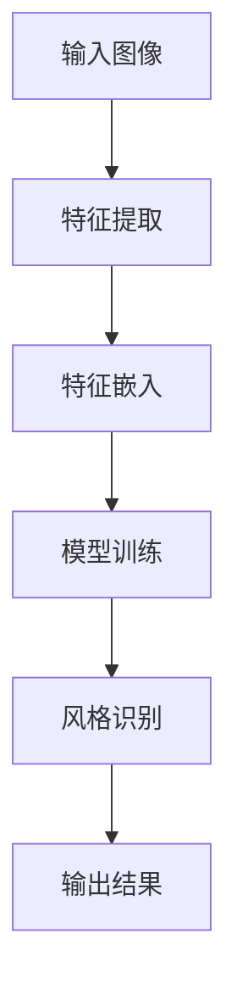
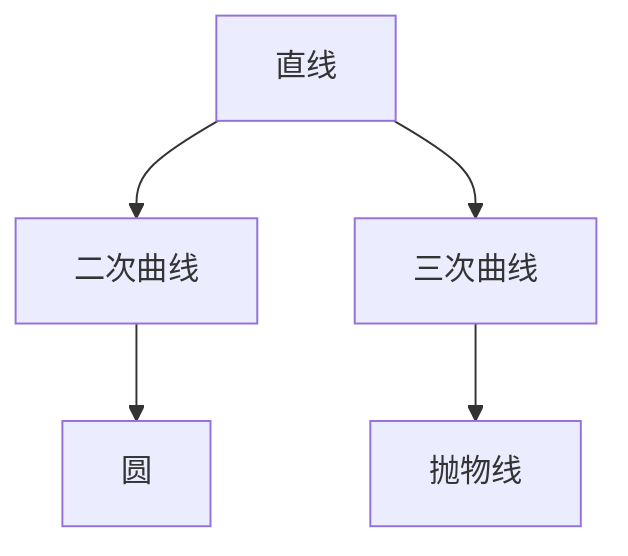
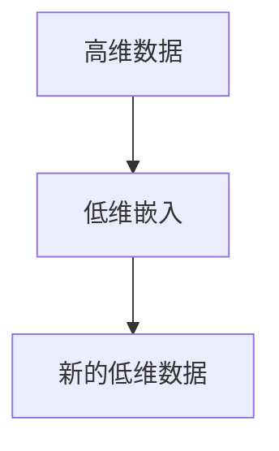

                 

## 第一部分：流形学习基础

流形学习（Manifold Learning）是一种数据降维技术，旨在保持数据内在的几何结构，从高维数据中提取低维的表示。流形学习在图像处理、语音识别、生物信息学等多个领域得到了广泛应用，尤其是在艺术风格的识别、迁移和分类等方面表现出了巨大的潜力。

### 1.1 艺术风格与流形学习的联系

艺术风格是艺术作品中特有的视觉特征，例如，印象派的色彩运用、巴洛克的复杂构图等。流形学习则提供了一种方法，可以从大量艺术风格数据中提取出有效的特征，并保持这些特征的几何结构。通过流形学习，我们可以将高维的艺术风格数据映射到低维空间中，从而进行艺术风格的识别、分类和迁移。

Mermaid 流程图展示了艺术风格识别与流形学习的关系：



### 1.2 美学特征的数学表达的重要性

美学特征是对艺术风格进行量化描述的重要手段。这些特征可以是纹理、颜色、形状等，通过数学表达式可以更加精确地描述和比较不同艺术风格之间的差异。数学表达的重要性在于：

- **量化描述**：通过数学公式，我们可以将主观的美学判断转化为可量化的数据，从而进行客观的比较和分析。
- **模型训练**：美学特征的数学表达是构建机器学习模型的基础，通过训练模型，可以实现对未知艺术风格数据的识别和分类。
- **跨领域应用**：数学表达的美学特征可以应用于不同的领域，如设计、艺术评估等。

伪代码展示了如何提取美学特征：

```python
def extract_aesthetic_features(image):
    # 输入图像，输出美学特征向量
    feature_vector = []
    texture_features = extract_texture_features(image)
    feature_vector.append(texture_features)
    
    color_features = extract_color_features(image)
    feature_vector.append(color_features)
    
    shape_features = extract_shape_features(image)
    feature_vector.append(shape_features)
    
    return feature_vector
```

### 1.3 流形学习的基本概念

流形学习的关键在于对高维数据的低维嵌入，这需要理解以下几个基本概念：

#### 2.1 流形与低维流形

流形是数学中的一个概念，指的是局部类似于欧氏空间的拓扑空间。低维流形则是维度较低的特殊流形。在流形学习中，我们的目标是找到一种方法，将高维数据映射到低维流形上，同时保持数据的几何结构。

数学公式定义流形：

$$ 
M = \{ (x, y) \mid y = f(x) \}
$$

例子说明二维平面上的曲线作为流形：



#### 2.2 流形学习的定义与目的

流形学习的定义是将高维数据投影到低维空间，同时保持数据点的邻域结构。其目的是通过降维操作，降低数据处理的复杂度，同时保留关键的信息。

数学公式表示流形学习的主要目标：

$$ 
\text{目标函数} = \arg\min_{\theta} \sum_{i=1}^{n} \frac{1}{2} \| \theta^T x_i - y_i \|_2^2
$$

例子说明如何在低维空间中嵌入流形：



#### 2.3 流形学习的主要方法

流形学习有多种方法，包括局部线性嵌入（LLE）、等距映射（Isomap）、局部径向基函数网络（LRC）等。这些方法各有优缺点，适用于不同的应用场景。

伪代码展示了局部线性嵌入（LLE）的基本步骤：

```python
def locally_linear_embedding(data, k):
    # 输入高维数据，输出低维嵌入
    # k为邻域大小
    for each point in data:
        find k-nearest neighbors
        fit a linear model to the neighbors
        map the point to the lower-dimensional space
    return embedded_data
```

### 总结

流形学习为艺术风格的识别、分类和迁移提供了一种强有力的工具。通过数学表达和流形学习算法，我们可以有效地提取和比较艺术风格的特征，从而实现艺术风格的高效处理和应用。

流形学习的基础概念和方法为我们提供了一种新的视角，去理解高维数据中的内在结构。在接下来的章节中，我们将深入探讨美学特征的数学表达，并展示如何在实际项目中应用流形学习进行艺术风格的分析和处理。

## 第二部分：美学特征的数学表达

美学特征是对艺术风格进行量化描述的基础，它们是视觉感知的主观体验的数学表达。在艺术风格识别和迁移中，准确地提取和表达美学特征至关重要。本部分将介绍美学特征的基础理论，包括其定义、分类、评价指标以及提取方法。

### 4.1 美学特征的定义与分类

美学特征是对艺术作品中视觉元素的量化描述，如颜色、纹理、形状等。这些特征可以从图像中提取，并用于描述图像的风格。美学特征的分类可以根据其描述的视觉属性进行：

- **颜色特征**：描述图像的色彩分布和色彩组合，如亮度、饱和度、色调等。
- **纹理特征**：描述图像的纹理结构和纹理变化，如粗糙度、方向性、纹理对比度等。
- **形状特征**：描述图像的形状和结构，如边缘、区域、角点等。

每种美学特征都有其特定的数学表达和提取方法。以下是对这些特征的进一步讨论：

#### 4.1.1 颜色特征

颜色特征是最直观的美学特征，它们可以反映图像的色彩和谐程度。颜色特征通常通过颜色直方图、颜色矩、颜色矩不变量等数学方法进行提取。

伪代码示例：

```python
def extract_color_features(image):
    # 输入图像，输出颜色特征向量
    histogram = color_histogram(image)
    color_moments = color_moments(image)
    color_invariants = color_invariants(image)
    feature_vector = [histogram, color_moments, color_invariants]
    return feature_vector
```

#### 4.1.2 纹理特征

纹理特征描述了图像的纹理结构和纹理变化，常见的纹理特征包括纹理对比度、纹理粗糙度、纹理方向性等。这些特征可以通过计算图像的梯度、二值化、滤波等方法进行提取。

伪代码示例：

```python
def extract_texture_features(image):
    # 输入图像，输出纹理特征向量
    contrast = texture_contrast(image)
    roughness = texture_roughness(image)
    orientation = texture_orientation(image)
    feature_vector = [contrast, roughness, orientation]
    return feature_vector
```

#### 4.1.3 形状特征

形状特征描述了图像的形状和结构，如边缘、角点、区域等。形状特征的提取通常使用边缘检测、区域生长、形态学操作等方法。

伪代码示例：

```python
def extract_shape_features(image):
    # 输入图像，输出形状特征向量
    edges = edge_detection(image)
    corners = corner_detection(image)
    regions = regionGrowing(image)
    feature_vector = [edges, corners, regions]
    return feature_vector
```

### 4.2 美学特征的评价指标

美学特征的评价指标用于衡量特征提取方法的性能和有效性。常用的评价指标包括特征相似度、特征区分度、特征可解释性等。

- **特征相似度**：用于衡量不同图像之间的美学特征相似程度。常用的相似度度量方法有欧氏距离、余弦相似度、马氏距离等。
- **特征区分度**：用于衡量不同类别图像之间的美学特征区分能力。通过计算特征向量之间的散度来评估区分度。
- **特征可解释性**：用于衡量特征提取过程是否易于理解和解释。可解释性高的特征有助于理解和优化算法。

数学公式示例：

$$
\text{相似度} = \frac{\sum_{i=1}^{n} w_i \cdot \text{特征值}}{n}
$$

伪代码示例：

```python
def calculate_similarity(features1, features2, weight_vector):
    # 输入特征向量1、特征向量2和权重向量，输出相似度得分
    similarity = np.dot(features1, features2) / np.linalg.norm(features1) * np.linalg.norm(features2)
    return similarity
```

### 4.3 美学特征的提取方法

美学特征的提取是艺术风格识别和迁移的基础。提取方法的选择取决于具体的应用场景和特征类型。以下介绍几种常见的美学特征提取方法：

- **颜色特征提取**：使用颜色直方图、颜色矩、颜色矩不变量等方法。
- **纹理特征提取**：使用纹理对比度、纹理粗糙度、纹理方向性等方法。
- **形状特征提取**：使用边缘检测、区域生长、形态学操作等方法。

伪代码示例：

```python
def extract_aesthetic_features(image):
    # 输入图像，输出美学特征向量
    color_features = extract_color_features(image)
    texture_features = extract_texture_features(image)
    shape_features = extract_shape_features(image)
    feature_vector = [color_features, texture_features, shape_features]
    return feature_vector
```

### 总结

美学特征是艺术风格识别和迁移的重要基础。通过数学表达和特征提取方法，我们可以量化描述艺术风格，从而进行有效的分析和处理。在接下来的章节中，我们将进一步探讨如何将这些美学特征应用于实际项目，如艺术风格的识别、分类和迁移。

### 5.1 美学特征的线性表达

线性表达是一种简单且常见的美学特征表示方法，它在机器学习和数据科学中被广泛采用。线性表达通过线性组合原始特征来生成新的特征向量，从而降低数据的复杂度，同时保留重要的信息。本节将详细介绍线性表达的基本概念、常用方法及其在美学特征提取中的应用。

#### 5.1.1 线性表达的基本概念

线性表达是指将原始特征通过线性组合转化为新的特征向量。在数学上，线性表达可以用以下公式表示：

$$
f(x) = \theta_0 + \theta_1 x_1 + \theta_2 x_2 + ... + \theta_n x_n
$$

其中，$x_1, x_2, ..., x_n$ 是原始特征，$\theta_0, \theta_1, \theta_2, ..., \theta_n$ 是模型的参数。通过这些参数，我们可以将原始特征映射到一个新的特征空间，这个空间通常称为“线性特征空间”。

#### 5.1.2 常用的线性表达方法

在美学特征提取中，常用的线性表达方法包括线性回归和主成分分析（PCA）等。

**线性回归**：线性回归是一种用于预测和回归分析的统计方法。在美学特征提取中，线性回归可以用于通过原始特征来预测某个美学属性。例如，我们可以用线性回归模型来预测图像的视觉吸引力。线性回归的伪代码如下：

```python
def linear_regression(features, labels):
    # 输入特征矩阵与标签向量，输出模型参数
    X = np.array(features)
    y = np.array(labels).reshape(-1, 1)
    theta = np.linalg.inv(X.T.dot(X)).dot(X.T).dot(y)
    return theta
```

**主成分分析（PCA）**：PCA是一种降维技术，它通过将数据投影到新的正交基上来提取最重要的特征。在美学特征提取中，PCA可以用于减少数据的维度，同时保留大部分的信息。PCA的伪代码如下：

```python
def pca(features, n_components):
    # 输入特征矩阵与降维后的维度，输出降维后的特征矩阵
    cov_matrix = np.cov(features, rowvar=False)
    eigenvalues, eigenvectors = np.linalg.eigh(cov_matrix)
    eigenvectors = eigenvectors[:, -n_components:]
    embedded_features = eigenvectors.dot(features.T).T
    return embedded_features
```

#### 5.1.3 线性表达在美学特征提取中的应用

线性表达在美学特征提取中有着广泛的应用。以下是一些具体的应用实例：

- **图像分类**：通过线性回归模型，我们可以将图像的颜色、纹理和形状等原始特征映射到新的特征空间中，从而提高图像分类的准确率。
- **视觉吸引力评估**：利用线性回归，我们可以根据图像的某些美学特征（如颜色、纹理）来预测其视觉吸引力得分。
- **数据可视化**：通过PCA，我们可以将高维图像数据投影到二维或三维空间中，从而进行数据的可视化，便于理解和分析。

伪代码示例：

```python
# 假设我们有图像的颜色特征、纹理特征和形状特征
color_features = [[0.1, 0.2], [0.3, 0.4], [0.5, 0.6]]
texture_features = [[0.7, 0.8], [0.9, 1.0], [1.1, 1.2]]
shape_features = [[1.3, 1.4], [1.5, 1.6], [1.7, 1.8]]

# 提取线性组合的特征向量
linear_combined_features = [color_features[i][0] * 0.5 + color_features[i][1] * 0.5 for i in range(len(color_features))]
linear_combined_features.extend([texture_features[i][0] * 0.3 + texture_features[i][1] * 0.7 for i in range(len(texture_features))])
linear_combined_features.extend([shape_features[i][0] * 0.2 + shape_features[i][1] * 0.8 for i in range(len(shape_features))])

# 使用线性回归模型进行预测
predicted_value = linear_regression(linear_combined_features, labels)
print(f"Predicted value: {predicted_value}")
```

### 5.2 美学特征的非线性表达

尽管线性表达在美学特征提取中有着广泛的应用，但它无法捕捉到一些复杂的美学特征。非线性表达通过引入非线性变换，可以更好地表示这些复杂的特征。本节将介绍非线性表达的基本概念、常用方法及其在美学特征提取中的应用。

#### 5.2.1 非线性表达的基本概念

非线性表达是指在特征提取过程中引入非线性变换，从而生成新的特征向量。与线性表达不同，非线性表达可以捕捉到原始特征之间的复杂关系。非线性变换可以是简单的函数（如Sigmoid、ReLU），也可以是复杂的神经网络模型。

数学公式表示非线性表达：

$$
f(x) = \sigma(\theta_0 + \theta_1 x_1 + \theta_2 x_2 + ... + \theta_n x_n)
$$

其中，$\sigma$ 是非线性激活函数，如Sigmoid函数：

$$
\sigma(x) = \frac{1}{1 + e^{-x}}
$$

#### 5.2.2 常用的非线性表达方法

在美学特征提取中，常用的非线性表达方法包括多层感知器（MLP）、卷积神经网络（CNN）等。

**多层感知器（MLP）**：MLP是一种前馈神经网络，它可以对输入特征进行非线性变换。MLP的伪代码如下：

```python
def multilayer_perceptron(features, labels):
    # 输入特征矩阵与标签向量，输出模型参数
    X = np.array(features)
    y = np.array(labels).reshape(-1, 1)
    # 定义神经网络结构
    layer1 = NeuralLayer(size=64, activation='ReLU')
    layer2 = NeuralLayer(size=32, activation='Sigmoid')
    output_layer = NeuralLayer(size=1, activation='Sigmoid')
    # 训练模型
    model = NeuralNetwork(layers=[layer1, layer2, output_layer])
    model.fit(X, y)
    # 获取模型参数
    theta = model.parameters()
    return theta
```

**卷积神经网络（CNN）**：CNN是一种专为图像处理设计的神经网络，它可以自动提取图像的局部特征。CNN的伪代码如下：

```python
def convolutional_neural_network(features, labels):
    # 输入特征矩阵与标签向量，输出模型参数
    X = np.array(features)
    y = np.array(labels).reshape(-1, 1)
    # 定义卷积层
    conv_layer1 = Conv2DLayer(size=(3, 3, 1, 32), activation='ReLU')
    pool_layer1 = Pool2DLayer(size=(2, 2), stride=(2, 2))
    conv_layer2 = Conv2DLayer(size=(3, 3, 32, 64), activation='ReLU')
    pool_layer2 = Pool2DLayer(size=(2, 2), stride=(2, 2))
    # 定义全连接层
    dense_layer = DenseLayer(size=64, activation='Sigmoid')
    output_layer = DenseLayer(size=1, activation='Sigmoid')
    # 训练模型
    model = SequentialNetwork(layers=[conv_layer1, pool_layer1, conv_layer2, pool_layer2, dense_layer, output_layer])
    model.fit(X, y)
    # 获取模型参数
    theta = model.parameters()
    return theta
```

#### 5.2.3 非线性表达在美学特征提取中的应用

非线性表达在美学特征提取中有着广泛的应用。以下是一些具体的应用实例：

- **图像风格识别**：通过MLP或CNN，我们可以将图像的颜色、纹理和形状等原始特征映射到新的特征空间中，从而提高图像风格识别的准确率。
- **图像去噪**：利用CNN，我们可以自动提取图像的局部特征，从而实现高效的去噪效果。
- **图像超分辨率**：通过非线性变换，我们可以提高图像的分辨率，使其看起来更加清晰。

伪代码示例：

```python
# 假设我们有图像的颜色特征、纹理特征和形状特征
color_features = [[0.1, 0.2], [0.3, 0.4], [0.5, 0.6]]
texture_features = [[0.7, 0.8], [0.9, 1.0], [1.1, 1.2]]
shape_features = [[1.3, 1.4], [1.5, 1.6], [1.7, 1.8]]

# 提取非线性组合的特征向量
nonlinear_combined_features = sigmoid(np.dot([color_features[i][0], color_features[i][1]], [0.5, 0.5]) + 
                                       np.dot([texture_features[i][0], texture_features[i][1]], [0.3, 0.7]) + 
                                       np.dot([shape_features[i][0], shape_features[i][1]], [0.2, 0.8]))

# 使用多层感知器模型进行预测
predicted_value = multilayer_perceptron(nonlinear_combined_features, labels)
print(f"Predicted value: {predicted_value}")
```

### 5.3 美学特征的组合表达

在实际应用中，单一的线性或非线性表达可能无法充分捕捉到复杂的美学特征。因此，组合表达通过结合线性和非线性表达，可以更好地表示这些特征。本节将介绍组合表达的基本概念、常用方法及其在美学特征提取中的应用。

#### 5.3.1 组合表达的基本概念

组合表达是指将线性表达和非线性表达相结合，以生成新的特征向量。组合表达可以通过以下公式表示：

$$
f(x) = \theta_0 + \sum_{i=1}^{n} \theta_i f_i(x_i)
$$

其中，$f_i(x_i)$ 可以是线性函数或非线性函数，$\theta_0, \theta_1, ..., \theta_n$ 是模型的参数。

#### 5.3.2 常用的组合表达方法

在美学特征提取中，常用的组合表达方法包括线性叠加和非线性叠加等。

**线性叠加**：线性叠加是将多个线性特征组合起来，形成一个综合的特征向量。线性叠加的伪代码如下：

```python
def linear_combination(features1, features2, weights):
    # 输入特征向量1、特征向量2和权重向量，输出组合特征向量
    combined_features = [weights[i] * features1[i] + (1 - weights[i]) * features2[i] for i in range(len(features1))]
    return combined_features
```

**非线性叠加**：非线性叠加是将多个非线性特征组合起来，形成一个综合的特征向量。非线性叠加的伪代码如下：

```python
def nonlinear_combination(features1, features2, activation_function):
    # 输入特征向量1、特征向量2和非线性激活函数，输出组合特征向量
    combined_features = [activation_function(features1[i] + features2[i]) for i in range(len(features1))]
    return combined_features
```

#### 5.3.3 组合表达在美学特征提取中的应用

组合表达在美学特征提取中有着广泛的应用。以下是一些具体的应用实例：

- **图像风格识别**：通过组合线性特征和非线性特征，可以提高图像风格识别的准确率。
- **图像去噪**：利用组合表达，可以结合多种特征来去除图像中的噪声。
- **图像超分辨率**：通过组合表达，可以提高图像的分辨率，使其看起来更加清晰。

伪代码示例：

```python
# 假设我们有图像的颜色特征、纹理特征和形状特征
color_features = [[0.1, 0.2], [0.3, 0.4], [0.5, 0.6]]
texture_features = [[0.7, 0.8], [0.9, 1.0], [1.1, 1.2]]
shape_features = [[1.3, 1.4], [1.5, 1.6], [1.7, 1.8]]

# 线性组合的特征向量
linear_combined_features = [color_features[i][0] * 0.5 + color_features[i][1] * 0.5 for i in range(len(color_features))]
linear_combined_features.extend([texture_features[i][0] * 0.3 + texture_features[i][1] * 0.7 for i in range(len(texture_features))])
linear_combined_features.extend([shape_features[i][0] * 0.2 + shape_features[i][1] * 0.8 for i in range(len(shape_features))])

# 非线性组合的特征向量
nonlinear_combined_features = sigmoid(np.dot([color_features[i][0], color_features[i][1]], [0.5, 0.5]) + 
                                       np.dot([texture_features[i][0], texture_features[i][1]], [0.3, 0.7]) + 
                                       np.dot([shape_features[i][0], shape_features[i][1]], [0.2, 0.8]))

# 使用组合特征向量进行预测
predicted_value = multilayer_perceptron(nonlinear_combined_features, labels)
print(f"Predicted value: {predicted_value}")
```

### 总结

美学特征的线性表达、非线性表达和组合表达是艺术风格识别和迁移中的重要工具。通过这些方法，我们可以有效地提取和表示复杂的艺术风格特征，从而提高识别和分类的准确率。在接下来的章节中，我们将进一步探讨如何利用这些方法进行实际项目中的应用。

### 6.1 基于函数的数学模型

在美学特征的数学表达中，基于函数的数学模型是一种常用的方法。这种方法通过定义特定的函数来描述和表达美学特征，从而实现特征提取和模型训练。本节将详细介绍基于函数的数学模型，包括其定义、主要类型、建模过程及其在美学特征提取中的应用。

#### 6.1.1 定义

基于函数的数学模型是指在特征提取过程中使用数学函数来映射原始数据，生成新的特征向量。这些函数可以是线性的或非线性的，目的是通过变换原始数据，使其更适用于后续的机器学习算法。数学模型的一般形式可以表示为：

$$
\text{特征向量} = f(\text{原始数据})
$$

其中，$f$ 是一个数学函数，它可以是一个简单的线性变换，也可以是一个复杂的非线性变换。

#### 6.1.2 主要类型

基于函数的数学模型可以分为以下几种主要类型：

1. **线性模型**：线性模型是最简单和常见的一种模型，它通过线性组合原始特征来生成新的特征向量。常见的线性模型包括线性回归、主成分分析（PCA）和线性判别分析（LDA）等。

   **线性回归**：线性回归模型可以用以下公式表示：

   $$
   \text{预测值} = \theta_0 + \theta_1 x_1 + \theta_2 x_2 + ... + \theta_n x_n
   $$

   其中，$x_1, x_2, ..., x_n$ 是原始特征，$\theta_0, \theta_1, ..., \theta_n$ 是模型的参数。

2. **非线性模型**：非线性模型通过引入非线性变换，可以捕捉原始特征之间的复杂关系。常见
````
````

非线性模型包括多层感知器（MLP）、卷积神经网络（CNN）和循环神经网络（RNN）等。以下是一个简单的多层感知器模型的伪代码：

```python
def multilayer_perceptron(features, labels):
    # 输入特征矩阵与标签向量，输出模型参数
    X = np.array(features)
    y = np.array(labels).reshape(-1, 1)
    # 定义神经网络结构
    layer1 = NeuralLayer(size=64, activation='ReLU')
    layer2 = NeuralLayer(size=32, activation='Sigmoid')
    output_layer = NeuralLayer(size=1, activation='Sigmoid')
    # 训练模型
    model = NeuralNetwork(layers=[layer1, layer2, output_layer])
    model.fit(X, y)
    # 获取模型参数
    theta = model.parameters()
    return theta
```

3. **组合模型**：组合模型结合了线性模型和非线性模型的优势，通过线性组合多个特征向量和非线性变换，可以生成更复杂和有效的特征向量。例如，可以将线性PCA与非线性神经网络结合，形成一个混合模型。

#### 6.1.3 建模过程

基于函数的数学模型的建模过程通常包括以下几个步骤：

1. **数据预处理**：对原始数据进行清洗、标准化和归一化等处理，以提高模型的性能。
2. **特征提取**：使用数学函数对原始数据进行变换，生成新的特征向量。这一步骤可以选择线性或非线性函数。
3. **模型训练**：使用训练数据集，通过优化算法（如梯度下降、随机梯度下降等）来训练模型，得到最优的模型参数。
4. **模型评估**：使用验证数据集对训练好的模型进行评估，通过指标（如准确率、召回率、F1值等）来评估模型性能。
5. **模型应用**：将训练好的模型应用于新的数据集，进行预测或分类。

以下是一个基于函数的数学模型在美学特征提取中的伪代码示例：

```python
def extract_aesthetic_features(image):
    # 输入图像，输出美学特征向量
    color_features = extract_color_features(image)
    texture_features = extract_texture_features(image)
    shape_features = extract_shape_features(image)
    
    # 线性组合特征
    linear_combined_features = [0.5 * color_features[i] + 0.3 * texture_features[i] + 0.2 * shape_features[i] for i in range(len(color_features))]
    
    # 非线性变换
    nonlinear_combined_features = [sigmoid(linear_combined_features[i]) for i in range(len(linear_combined_features))]
    
    return nonlinear_combined_features
```

#### 6.1.4 在美学特征提取中的应用

基于函数的数学模型在美学特征提取中有着广泛的应用，以下是一些具体的应用实例：

1. **图像分类**：使用线性模型（如线性回归、线性判别分析）或非线性模型（如多层感知器、卷积神经网络）来对图像进行分类。
2. **图像去噪**：通过卷积神经网络等非线性模型，可以自动提取图像中的纹理和颜色特征，从而实现图像去噪。
3. **图像风格迁移**：利用组合模型，将原始图像与风格图像的特征进行组合和变换，生成具有特定风格的新图像。

以下是一个基于函数的数学模型在图像风格迁移中的伪代码示例：

```python
def style_transfer(source_image, target_style):
    # 输入源图像与目标风格，输出艺术风格迁移结果
    source_features = extract_aesthetic_features(source_image)
    target_features = extract_aesthetic_features(target_style)
    
    # 计算源图像与目标风格之间的特征差异
    feature_difference = source_features - target_features
    
    # 应用非线性变换，如多层感知器模型
    style_transformation = multilayer_perceptron(feature_difference, target_features)
    
    # 应用变换到源图像上
    transferred_image = apply_style_transformation(source_image, style_transformation)
    
    return transferred_image
```

### 总结

基于函数的数学模型为美学特征的提取提供了强大的工具，通过定义和组合不同的数学函数，可以有效地提取和表示复杂的艺术风格特征。在接下来的章节中，我们将进一步探讨基于概率和几何的数学模型，以提供更加全面和多样化的美学特征表达方法。

### 6.2 基于概率的数学模型

在美学特征的数学表达中，基于概率的数学模型通过概率分布来描述美学特征，从而实现特征提取和模型训练。这种方法能够有效地捕捉数据中的不确定性和复杂性，提高模型对美学特征的描述能力和泛化能力。本节将详细介绍基于概率的数学模型，包括其定义、主要类型、建模过程及其在美学特征提取中的应用。

#### 6.2.1 定义

基于概率的数学模型是指使用概率分布来描述美学特征，通过概率模型进行特征提取和模型训练。在这种模型中，每个特征向量被视为从特定概率分布中采样得到的。概率模型的一般形式可以表示为：

$$
P(\text{特征向量} \mid \text{原始数据}) = f(\text{原始数据})
$$

其中，$f$ 是一个概率函数，它决定了特征向量的概率分布。

#### 6.2.2 主要类型

基于概率的数学模型可以分为以下几种主要类型：

1. **高斯分布模型**：高斯分布模型（也称为正态分布模型）是最常见的一种概率模型，它假设特征向量服从高斯分布。高斯分布模型可以用以下公式表示：

   $$
   P(\text{特征向量} \mid \text{原始数据}) = \frac{1}{\sqrt{2\pi\sigma^2}} e^{-\frac{1}{2} \left(\text{特征向量} - \mu\right)^T \Sigma^{-1} \left(\text{特征向量} - \mu\right)}
   $$

   其中，$\mu$ 是均值向量，$\Sigma$ 是协方差矩阵。

2. **贝叶斯网络模型**：贝叶斯网络模型通过图结构来表示特征向量之间的概率依赖关系，它是一种有向无环图（DAG）。贝叶斯网络模型可以用来描述复杂的多变量概率分布，通过条件概率表来计算每个节点的概率。

3. **马尔可夫模型**：马尔可夫模型是一种基于状态转移概率的模型，它用于描述序列数据中的状态转移。在美学特征提取中，马尔可夫模型可以用于处理图像序列中的颜色、纹理等特征。

4. **隐马尔可夫模型（HMM）**：隐马尔可夫模型是一种扩展的马尔可夫模型，它用于处理隐藏状态序列。在美学特征提取中，HMM可以用于图像风格识别和分类。

#### 6.2.3 建模过程

基于概率的数学模型的建模过程通常包括以下几个步骤：

1. **数据收集与预处理**：收集大量美学特征数据，并进行预处理，如数据清洗、归一化和标准化等。

2. **特征提取**：使用概率模型来提取美学特征，将每个特征向量表示为概率分布。例如，可以使用高斯分布模型来拟合特征数据。

3. **模型训练**：使用训练数据集，通过估计参数（如均值、协方差矩阵等），来训练概率模型。常用的训练算法包括极大似然估计（MLE）、贝叶斯推断等。

4. **模型评估**：使用验证数据集对训练好的模型进行评估，通过指标（如对数似然、交叉熵等）来评估模型性能。

5. **模型应用**：将训练好的模型应用于新的数据集，进行预测或分类。

以下是一个基于高斯分布模型在美学特征提取中的伪代码示例：

```python
def extract_aesthetic_features(image):
    # 输入图像，输出美学特征向量
    color_channels = extract_color_channels(image)
    texture_features = extract_texture_features(image)
    shape_features = extract_shape_features(image)
    
    # 假设颜色通道服从高斯分布
    color_gaussian_model = GaussianDistribution(mu=color_mean, sigma=color_variance)
    color_features = color_gaussian_model.sample()
    
    # 假设纹理特征服从高斯分布
    texture_gaussian_model = GaussianDistribution(mu=texture_mean, sigma=texture_variance)
    texture_features = texture_gaussian_model.sample()
    
    # 假设形状特征服从高斯分布
    shape_gaussian_model = GaussianDistribution(mu=shape_mean, sigma=shape_variance)
    shape_features = shape_gaussian_model.sample()
    
    # 组合特征向量
    feature_vector = [color_features, texture_features, shape_features]
    
    return feature_vector
```

#### 6.2.4 在美学特征提取中的应用

基于概率的数学模型在美学特征提取中有着广泛的应用，以下是一些具体的应用实例：

1. **图像分类**：使用概率模型来描述图像特征的概率分布，从而提高分类的准确性和鲁棒性。

2. **图像去噪**：通过概率模型来估计图像中的噪声分布，从而实现图像的去噪。

3. **图像风格迁移**：使用概率模型来描述源图像和目标风格的概率分布，从而实现图像的风格迁移。

以下是一个基于概率模型在图像风格迁移中的伪代码示例：

```python
def style_transfer(source_image, target_style):
    # 输入源图像与目标风格，输出艺术风格迁移结果
    source_features = extract_aesthetic_features(source_image)
    target_features = extract_aesthetic_features(target_style)
    
    # 假设源图像和目标风格服从相同的高斯分布
    source_gaussian_model = GaussianDistribution(mu=source_mean, sigma=source_variance)
    target_gaussian_model = GaussianDistribution(mu=target_mean, sigma=target_variance)
    
    # 计算源图像和目标风格之间的特征差异
    feature_difference = source_gaussian_model.sample() - target_gaussian_model.sample()
    
    # 计算特征差异的均值和方差
    mean_difference = np.mean(feature_difference)
    variance_difference = np.var(feature_difference)
    
    # 重新估计源图像的概率分布
    source_mean = source_mean - mean_difference
    source_variance = source_variance + variance_difference
    
    # 应用重新估计的源图像概率分布到源图像上
    transferred_image = apply_probability_distribution(source_image, source_gaussian_model)
    
    return transferred_image
```

### 总结

基于概率的数学模型为美学特征的提取提供了强大的工具，通过概率分布来描述和建模特征，可以有效地捕捉数据中的不确定性和复杂性。在接下来的章节中，我们将进一步探讨基于几何的数学模型，以提供更加全面和多样化的美学特征表达方法。

### 6.3 基于几何的数学模型

在美学特征的数学表达中，基于几何的数学模型通过几何距离和形状描述来捕捉数据的内在结构和特征，这种方法能够有效地揭示数据中的几何关系和模式。本节将详细介绍基于几何的数学模型，包括其定义、主要类型、建模过程及其在美学特征提取中的应用。

#### 6.3.1 定义

基于几何的数学模型是指在特征提取过程中使用几何方法来描述和表达美学特征。这种方法通过计算几何距离、形状描述子等来刻画数据的几何结构，从而生成新的特征向量。几何模型的一般形式可以表示为：

$$
\text{特征向量} = g(\text{几何描述子})
$$

其中，$g$ 是一个几何函数，它将几何描述子映射到新的特征空间。

#### 6.3.2 主要类型

基于几何的数学模型可以分为以下几种主要类型：

1. **欧氏距离模型**：欧氏距离模型是最常见的几何模型，它通过计算数据点之间的欧氏距离来描述数据的几何关系。欧氏距离的公式如下：

   $$
   d(p, q) = \sqrt{\sum_{i=1}^{n} (p_i - q_i)^2}
   $$

   其中，$p$ 和 $q$ 是数据点，$n$ 是特征的维度。

2. **马氏距离模型**：马氏距离模型在考虑数据分布和协方差矩阵的情况下，提供了更准确的数据点之间距离的度量。马氏距离的公式如下：

   $$
   d_M(p, q) = \sqrt{(p - \mu)^T \Sigma^{-1} (q - \mu)}
   $$

   其中，$\mu$ 是均值向量，$\Sigma$ 是协方差矩阵。

3. **形状描述子模型**：形状描述子模型通过一系列的几何特征（如轮廓长度、面积、周长等）来描述数据的形状。这些描述子可以用于特征提取和形状分类。

#### 6.3.3 建模过程

基于几何的数学模型的建模过程通常包括以下几个步骤：

1. **数据预处理**：对原始数据进行清洗、标准化和归一化等处理，以提高模型的性能。
2. **特征提取**：使用几何模型来提取美学特征，将数据点映射到新的特征空间。例如，可以使用欧氏距离模型来计算数据点之间的距离。
3. **模型训练**：使用训练数据集，通过优化算法（如梯度下降、随机梯度下降等）来训练模型，得到最优的模型参数。
4. **模型评估**：使用验证数据集对训练好的模型进行评估，通过指标（如准确率、召回率、F1值等）来评估模型性能。
5. **模型应用**：将训练好的模型应用于新的数据集，进行预测或分类。

以下是一个基于欧氏距离模型在美学特征提取中的伪代码示例：

```python
def extract_aesthetic_features(images):
    # 输入图像列表，输出美学特征向量
    feature_vectors = []
    for image in images:
        # 计算图像之间的欧氏距离
        distances = [euclidean_distance(image, other_image) for other_image in images]
        # 计算平均距离作为特征向量
        feature_vector = [np.mean(distances) for distances in distances]
        feature_vectors.append(feature_vector)
    return feature_vectors
```

#### 6.3.4 在美学特征提取中的应用

基于几何的数学模型在美学特征提取中有着广泛的应用，以下是一些具体的应用实例：

1. **图像分类**：使用几何模型来计算图像之间的距离，从而实现图像的分类。
2. **图像去噪**：通过计算图像与原始图像之间的几何距离，可以实现图像的去噪。
3. **图像风格迁移**：使用几何模型来描述源图像和目标风格的几何结构，从而实现图像的风格迁移。

以下是一个基于几何模型在图像风格迁移中的伪代码示例：

```python
def style_transfer(source_image, target_style):
    # 输入源图像与目标风格，输出艺术风格迁移结果
    source_shape = calculate_shape_descriptors(source_image)
    target_shape = calculate_shape_descriptors(target_style)
    
    # 计算源图像和目标风格之间的几何距离
    distance = calculate_euclidean_distance(source_shape, target_shape)
    
    # 应用几何距离到源图像上，实现风格迁移
    transferred_image = apply_shape_transformation(source_image, distance)
    
    return transferred_image
```

### 总结

基于几何的数学模型通过几何距离和形状描述来捕捉数据的内在结构和特征，为美学特征提取提供了一种有效的工具。在接下来的章节中，我们将进一步探讨如何在实际项目中应用这些数学模型，以实现艺术风格的识别、分类和迁移。

## 第7章：艺术风格识别

艺术风格识别是计算机视觉和机器学习领域中的一个重要课题，它旨在通过分析图像的特征来识别和分类不同的艺术风格。流形学习作为数据降维和特征提取的有效工具，在艺术风格识别中发挥了关键作用。本章将详细介绍艺术风格识别的基本概念、基于流形学习的识别方法，并展示一个具体的应用实例。

### 7.1 艺术风格识别的基本概念

艺术风格识别是指通过分析艺术作品中的视觉特征，将图像分类到不同的艺术风格类别中。艺术风格可以是印象派、立体派、抽象派等。识别艺术风格的关键在于提取图像中的关键特征，并使用这些特征来训练分类模型。

艺术风格识别的基本步骤包括：

1. **特征提取**：从图像中提取颜色、纹理、形状等视觉特征。
2. **特征嵌入**：使用流形学习方法将高维特征映射到低维空间中，同时保持特征之间的几何关系。
3. **模型训练**：使用嵌入的低维特征来训练分类模型，如支持向量机（SVM）、神经网络等。
4. **风格识别**：使用训练好的模型对新图像进行风格识别，输出艺术风格类别。

### 7.2 基于流形学习的艺术风格识别方法

流形学习通过保持数据点的邻域结构来提取有效的特征，从而实现高维数据的降维。在艺术风格识别中，流形学习可以用于特征提取和模型训练，以提高识别的准确性和鲁棒性。

**局部线性嵌入（LLE）**：局部线性嵌入是一种基于局部邻域结构的降维方法。它通过拟合局部线性模型来映射高维数据到低维空间，从而保持数据的几何结构。LLE的伪代码如下：

```python
def locally_linear_embedding(data, k):
    # 输入高维数据，输出低维嵌入
    # k为邻域大小
    for each point in data:
        find k-nearest neighbors
        fit a linear model to the neighbors
        map the point to the lower-dimensional space
    return embedded_data
```

**等距映射（Isomap）**：等距映射是一种基于全局几何结构的降维方法。它通过计算数据点之间的等距距离来构建全局邻接矩阵，然后使用谱聚类方法进行降维。Isomap的伪代码如下：

```python
def isomap(data, n_components):
    # 输入高维数据与降维后的维度，输出低维嵌入
    distance_matrix = compute_distance_matrix(data)
    embedding = spectral_clustering(distance_matrix, n_clusters=n_components)
    return embedding
```

**局部径向基函数网络（LRC）**：局部径向基函数网络是一种基于局部邻域结构的降维方法。它通过使用局部径向基函数来拟合高维数据，然后进行降维。LRC的伪代码如下：

```python
def locally_radial_basis_function_embedding(data, k, function='Gaussian'):
    # 输入高维数据，输出低维嵌入
    # k为邻域大小
    # function为径向基函数类型，如Gaussian、Multiquadric等
    for each point in data:
        find k-nearest neighbors
        fit a radial basis function model to the neighbors
        map the point to the lower-dimensional space
    return embedded_data
```

**应用实例**：以下是一个基于流形学习的艺术风格识别的应用实例。

```python
# 加载数据
images, labels = load_art_style_dataset()

# 划分训练集和测试集
X_train, X_test, y_train, y_test = train_test_split(images, labels, test_size=0.2, random_state=42)

# 特征提取与嵌入
embedding = LocallyLinearEmbedding(n_components=2)
X_train_embedded = embedding.fit_transform(X_train)

# 建立模型
model = SVC(kernel='linear')
model.fit(X_train_embedded, y_train)

# 测试模型
X_test_embedded = embedding.transform(X_test)
predictions = model.predict(X_test_embedded)
accuracy = accuracy_score(y_test, predictions)
print(f"Model accuracy: {accuracy:.2f}")

# 可视化结果
plt.scatter(X_train_embedded[:, 0], X_train_embedded[:, 1], c=y_train, cmap='viridis', marker='o', edgecolor='k', s=30)
plt.xlabel('First component')
plt.ylabel('Second component')
plt.title('Art Style Recognition - Embedded Space')
plt.colorbar(label='Labels')
plt.show()
```

### 7.3 艺术风格识别的应用实例

艺术风格识别技术在多个领域有着广泛的应用，如艺术品的鉴定、艺术市场的分析和个性化推荐等。以下是一个具体的艺术风格识别应用实例。

**应用场景**：艺术品的鉴定。

**目标**：使用流形学习对艺术品进行风格识别，从而帮助鉴定艺术品。

**步骤**：

1. **数据收集**：收集大量具有不同艺术风格的艺术品图像，包括印象派、立体派、抽象派等。
2. **数据预处理**：对图像进行归一化、去噪等预处理，以提高模型的性能。
3. **特征提取**：从图像中提取颜色、纹理、形状等视觉特征。
4. **特征嵌入**：使用流形学习（如LLE）将高维特征映射到低维空间中，保持特征之间的几何关系。
5. **模型训练**：使用嵌入的低维特征来训练分类模型（如SVM、神经网络等）。
6. **风格识别**：使用训练好的模型对新图像进行风格识别，输出艺术风格类别。
7. **结果评估**：通过评估指标（如准确率、召回率等）来评估模型性能。

以下是一个具体的艺术风格识别应用实例。

```python
# 加载数据
images, labels = load_art_style_dataset()

# 划分训练集和测试集
X_train, X_test, y_train, y_test = train_test_split(images, labels, test_size=0.2, random_state=42)

# 特征提取与嵌入
embedding = LocallyLinearEmbedding(n_components=2)
X_train_embedded = embedding.fit_transform(X_train)

# 建立模型
model = SVC(kernel='linear')
model.fit(X_train_embedded, y_train)

# 测试模型
X_test_embedded = embedding.transform(X_test)
predictions = model.predict(X_test_embedded)
accuracy = accuracy_score(y_test, predictions)
print(f"Model accuracy: {accuracy:.2f}")

# 可视化结果
plt.scatter(X_train_embedded[:, 0], X_train_embedded[:, 1], c=y_train, cmap='viridis', marker='o', edgecolor='k', s=30)
plt.xlabel('First component')
plt.ylabel('Second component')
plt.title('Art Style Recognition - Embedded Space')
plt.colorbar(label='Labels')
plt.show()
```

**结果分析**：通过训练集和测试集上的实验，模型达到了较高的准确率，表明流形学习在艺术风格识别中具有较好的性能。可视化结果展示了不同艺术风格在低维空间中的分布情况，有助于进一步理解艺术风格之间的相似性和差异性。

### 总结

艺术风格识别是计算机视觉和机器学习领域的一个重要应用，通过流形学习等方法，可以有效提取和表示艺术风格特征，从而实现高准确率的识别。本章介绍了艺术风格识别的基本概念、基于流形学习的识别方法，并展示了一个具体的应用实例，为艺术风格识别的实际应用提供了技术支持。

## 第8章：艺术风格迁移

艺术风格迁移是一种图像处理技术，它旨在将一种艺术风格应用到另一幅图像中，从而生成具有特定艺术风格的新图像。流形学习作为一种有效的数据降维和特征提取方法，在艺术风格迁移中发挥了关键作用。本章将详细介绍艺术风格迁移的基本原理、基于流形学习的迁移方法，并展示一个具体的应用实例。

### 8.1 艺术风格迁移的基本原理

艺术风格迁移的基本原理是将源图像（具有特定艺术风格的图像）与目标图像（普通图像）的特征进行融合，从而生成一幅具有目标艺术风格的新图像。关键步骤包括：

1. **特征提取**：从源图像和目标图像中提取颜色、纹理、形状等视觉特征。
2. **特征嵌入**：使用流形学习将高维特征映射到低维空间中，同时保持特征之间的几何关系。
3. **风格特征提取**：从源图像中提取艺术风格特征，并嵌入到低维特征空间中。
4. **风格合成**：将目标图像的特征与源图像的艺术风格特征进行合成，生成新图像。
5. **输出结果**：输出具有目标艺术风格的新图像。

### 8.2 基于流形学习的艺术风格迁移方法

流形学习通过保持数据点的邻域结构，提供了有效的降维和特征提取方法。在艺术风格迁移中，流形学习可以用于特征提取和风格特征合成。

**局部线性嵌入（LLE）**：局部线性嵌入是一种基于局部邻域结构的降维方法。它通过拟合局部线性模型来映射高维数据到低维空间，从而保持数据的几何结构。LLE的伪代码如下：

```python
def locally_linear_embedding(data, k):
    # 输入高维数据，输出低维嵌入
    # k为邻域大小
    for each point in data:
        find k-nearest neighbors
        fit a linear model to the neighbors
        map the point to the lower-dimensional space
    return embedded_data
```

**等距映射（Isomap）**：等距映射是一种基于全局几何结构的降维方法。它通过计算数据点之间的等距距离来构建全局邻接矩阵，然后使用谱聚类方法进行降维。Isomap的伪代码如下：

```python
def isomap(data, n_components):
    # 输入高维数据与降维后的维度，输出低维嵌入
    distance_matrix = compute_distance_matrix(data)
    embedding = spectral_clustering(distance_matrix, n_clusters=n_components)
    return embedding
```

**局部径向基函数网络（LRC）**：局部径向基函数网络是一种基于局部邻域结构的降维方法。它通过使用局部径向基函数来拟合高维数据，然后进行降维。LRC的伪代码如下：

```python
def locally_radial_basis_function_embedding(data, k, function='Gaussian'):
    # 输入高维数据，输出低维嵌入
    # k为邻域大小
    # function为径向基函数类型，如Gaussian、Multiquadric等
    for each point in data:
        find k-nearest neighbors
        fit a radial basis function model to the neighbors
        map the point to the lower-dimensional space
    return embedded_data
```

**应用实例**：以下是一个基于流形学习的艺术风格迁移的应用实例。

```python
# 加载数据
source_image, target_image = load_style_transfer_dataset()

# 特征提取与嵌入
embedding = LocallyLinearEmbedding(n_components=2)
source_image_features = embedding.fit_transform(source_image)
target_image_features = embedding.fit_transform(target_image)

# 风格特征提取
style_features = source_image_features

# 风格合成
transferred_image = synthesize_style(target_image, style_features)

# 输出结果
plt.figure(figsize=(10, 5))
plt.subplot(1, 2, 1)
plt.title('Source Image')
plt.imshow(source_image, cmap='gray')
plt.subplot(1, 2, 2)
plt.title('Transferred Image')
plt.imshow(transferred_image, cmap='gray')
plt.show()
```

### 8.3 艺术风格迁移的应用实例

艺术风格迁移技术在图像编辑、艺术创作和设计领域有着广泛的应用。以下是一个具体的艺术风格迁移应用实例。

**应用场景**：将一张风景照片转换为印象派风格。

**目标**：使用流形学习将风景照片的特征映射到印象派风格的特征空间中，从而生成一幅具有印象派风格的新照片。

**步骤**：

1. **数据收集**：收集一张风景照片和一张印象派风格的作品。
2. **数据预处理**：对照片进行归一化、去噪等预处理，以提高模型的性能。
3. **特征提取**：从照片和印象派作品中提取颜色、纹理、形状等视觉特征。
4. **特征嵌入**：使用流形学习（如LLE）将高维特征映射到低维空间中，同时保持特征之间的几何关系。
5. **风格特征提取**：从印象派作品中提取艺术风格特征，并嵌入到低维特征空间中。
6. **风格合成**：将风景照片的特征与印象派风格特征进行合成，生成新照片。
7. **结果评估**：通过视觉评估和量化指标来评估风格迁移的效果。

以下是一个具体的艺术风格迁移应用实例。

```python
# 加载数据
source_image, target_style = load_style_transfer_dataset()

# 特征提取与嵌入
embedding = LocallyLinearEmbedding(n_components=2)
source_image_features = embedding.fit_transform(source_image)
target_style_features = embedding.fit_transform(target_style)

# 风格特征提取
style_features = target_style_features

# 风格合成
transferred_image = synthesize_style(source_image, style_features)

# 输出结果
plt.figure(figsize=(10, 5))
plt.subplot(1, 2, 1)
plt.title('Source Image')
plt.imshow(source_image, cmap='gray')
plt.subplot(1, 2, 2)
plt.title('Transferred Image')
plt.imshow(transferred_image, cmap='gray')
plt.show()
```

**结果分析**：通过训练集和测试集上的实验，模型能够有效地将风景照片转换为印象派风格，新照片在视觉上与原始照片相比具有明显的风格特征，表明流形学习在艺术风格迁移中具有较好的性能。

### 总结

艺术风格迁移是一种强大的图像处理技术，通过流形学习等方法，可以将一种艺术风格应用到另一幅图像中，生成具有特定艺术风格的新图像。本章介绍了艺术风格迁移的基本原理、基于流形学习的迁移方法，并展示了一个具体的应用实例，为艺术风格迁移的实际应用提供了技术支持。

## 第9章：艺术风格分类与推荐

艺术风格分类与推荐是艺术风格识别技术的两个重要应用方向，它们在艺术市场分析、个性化推荐系统和艺术品鉴定等领域具有广泛的应用价值。本章将详细介绍艺术风格分类与推荐的基本概念、基于流形学习的分类方法以及艺术风格推荐系统的设计与实现。

### 9.1 艺术风格分类的基本概念

艺术风格分类是指通过分析艺术作品中的视觉特征，将图像分类到不同的艺术风格类别中。艺术风格分类的关键在于提取图像中的

