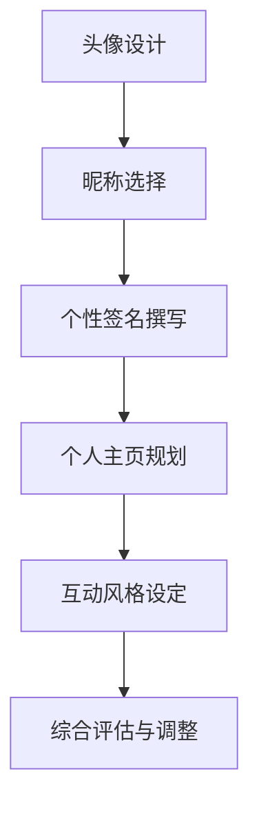
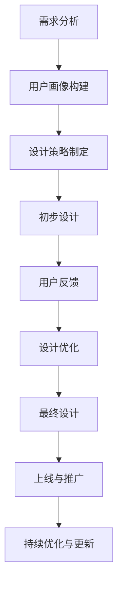

                 

### 《虚拟身份设计顾问：AI时代的个人品牌塑造专家》

#### 关键词：虚拟身份设计、个人品牌塑造、人工智能、自然语言处理、计算机视觉

##### 摘要：
在AI时代，个人品牌塑造变得越来越重要。虚拟身份设计顾问应运而生，成为这一领域的专家。本文将从虚拟身份设计与个人品牌塑造的概述、原理与架构、AI技术应用、个人品牌分析策略、内容营销策略以及实战案例研究等方面，详细探讨虚拟身份设计顾问在AI时代的作用与挑战。

### 《虚拟身份设计顾问：AI时代的个人品牌塑造专家》目录大纲

#### 第一部分：引言

**第1章：虚拟身份设计与个人品牌塑造概述**
1.1 AI时代与个人品牌塑造的变革
1.2 虚拟身份设计的基本概念
1.3 个人品牌塑造的重要性

**第2章：虚拟身份设计的原理与架构**
2.1 虚拟身份的构成要素
2.2 虚拟身份设计的方法与工具
2.3 虚拟身份设计的核心原理
2.4 虚拟身份设计流程图

**第3章：AI技术在虚拟身份设计中的应用**
3.1 人工智能与虚拟身份设计
3.2 自然语言处理技术在虚拟身份设计中的应用
3.3 计算机视觉技术在虚拟身份设计中的应用

#### 第二部分：AI时代个人品牌塑造策略

**第4章：AI时代的个人品牌分析**
4.1 个人品牌分析的步骤与方法
4.2 个人品牌分析的工具与资源
4.3 个人品牌分析案例解析

**第5章：虚拟身份与个人品牌塑造策略**
5.1 虚拟身份设计的策略与技巧
5.2 个人品牌塑造的虚拟身份应用
5.3 虚拟身份与个人品牌的互动策略

**第6章：AI时代的内容营销策略**
6.1 内容营销的基本概念与策略
6.2 虚拟身份设计在内容营销中的应用
6.3 虚拟身份设计在社交媒体营销中的应用

**第7章：虚拟身份设计项目的实战**
7.1 虚拟身份设计项目的规划与执行
7.2 虚拟身份设计项目的评估与优化
7.3 虚拟身份设计项目案例解析

#### 第三部分：虚拟身份设计案例研究

**第8章：成功虚拟身份设计案例研究**
8.1 案例一：虚拟主播的个人品牌塑造
8.2 案例二：虚拟身份在电商领域的应用
8.3 案例三：虚拟身份设计在教育培训行业的应用

**第9章：虚拟身份设计的未来趋势与挑战**
9.1 虚拟身份设计的未来发展趋势
9.2 虚拟身份设计面临的挑战与应对策略
9.3 虚拟身份设计在AI时代的发展前景

#### 附录

**附录A：虚拟身份设计相关资源与工具**
A.1 虚拟身份设计工具介绍
A.2 个人品牌分析工具介绍
A.3 内容营销工具介绍

**附录B：虚拟身份设计项目开发指南**
B.1 项目开发流程
B.2 项目管理技巧
B.3 项目风险管理与应对策略

---

在接下来的内容中，我们将逐步深入探讨虚拟身份设计顾问在AI时代的角色与作用，通过详细的分析和案例研究，帮助您理解这一新兴领域的核心概念、原理与实战技巧。

#### 第一部分：引言

##### 1.1 AI时代与个人品牌塑造的变革

在过去的几十年里，人工智能（AI）技术经历了飞速的发展。从早期的专家系统到如今深度学习、自然语言处理、计算机视觉等领域的突破，AI已经成为推动社会变革的重要力量。而随着AI技术的不断进步，个人品牌塑造的方式也在发生深刻的变革。

**个人品牌塑造的变革**

个人品牌塑造是指个人在职业和社会生活中，通过塑造独特的个性、专业技能和形象，获得公众认可和尊重的过程。在传统时代，个人品牌塑造主要通过传统媒体、人际网络和口碑传播。然而，随着互联网和社交媒体的兴起，个人品牌塑造的方式发生了巨大的变化。

首先，互联网和社交媒体提供了更广阔的展示平台。个人可以通过博客、微博、微信、抖音等社交媒体平台，展示自己的专业能力、生活态度和个性特点。这种低成本、高曝光的传播方式，使得个人品牌塑造变得更加容易。

其次，AI技术的应用为个人品牌塑造提供了新的工具和方法。例如，自然语言处理技术可以帮助个人优化自己的文字表达能力，计算机视觉技术可以帮助个人打造高质量的视觉形象。此外，AI还可以对个人行为和数据进行深入分析，提供个性化的品牌塑造策略。

**AI时代的虚拟身份设计**

虚拟身份设计是AI时代个人品牌塑造的重要一环。虚拟身份，即个人在网络空间中创建的虚拟形象和身份，包括头像、昵称、个性签名等。一个成功的虚拟身份设计，不仅能够吸引粉丝和关注者，还能增强个人的专业形象和品牌认知度。

虚拟身份设计的核心在于个性化与一致性。个性化是指虚拟身份设计应反映个人的独特性，包括职业、兴趣、价值观等方面。一致性是指虚拟身份在不同平台和场合中的形象保持一致，从而增强品牌的可信度和影响力。

在AI时代，虚拟身份设计不仅需要考虑美学和用户体验，还需要利用AI技术进行优化和提升。例如，利用计算机视觉技术生成个性化的头像，利用自然语言处理技术优化文案和表达，利用大数据分析为虚拟身份设计提供数据支持。

**AI时代的个人品牌塑造**

AI时代，个人品牌塑造更加注重数据驱动和用户体验。通过数据分析和用户行为洞察，个人可以了解自己的优势和短板，制定更有效的品牌塑造策略。同时，AI技术还可以帮助个人优化内容创作和传播，提高品牌曝光度和影响力。

总之，AI时代的个人品牌塑造是一个系统性工程，需要从虚拟身份设计、内容创作、用户互动等多个方面进行综合规划和执行。虚拟身份设计顾问在这一过程中扮演着至关重要的角色，他们通过专业的技术和策略，帮助个人在竞争激烈的市场中脱颖而出。

在接下来的章节中，我们将进一步探讨虚拟身份设计的基本概念、原理和架构，以及AI技术在虚拟身份设计中的应用。通过深入分析，希望读者能够对这一新兴领域有更全面的认识。

### 1.2 虚拟身份设计的基本概念

**定义与起源**

虚拟身份设计，指的是在数字环境中，通过一系列设计元素和策略来创建和塑造一个独特的身份形象。这个形象不仅代表了一个人的在线存在，更是其个人品牌和价值观的延伸。虚拟身份设计起源于互联网和社交媒体的普及，随着人们对个人数字形象的重视，这一概念逐渐被提出并不断发展。

**虚拟身份的设计要素**

虚拟身份设计包括多个核心要素，这些要素共同构建了一个完整的虚拟身份。以下是这些关键要素的详细描述：

1. **头像**：头像通常是虚拟身份设计中最显著的部分，它代表个人在网络空间中的视觉形象。一个成功的头像应具备以下特点：符合个人形象和职业属性、易于识别、具备个性化元素。

2. **昵称**：昵称是虚拟身份的另一重要组成部分，它反映了个人的个性和风格。一个好的昵称应简洁易记、独特且有创意，同时能够体现个人品牌的核心价值。

3. **个性签名**：个性签名是对个人性格、态度和价值观的简短表述。一个有吸引力的个性签名不仅能增加个人品牌的个性，还能为他人提供一种了解个人的途径。

4. **个人主页**：个人主页是虚拟身份的核心展示平台，它包含了个人简介、作品集、联系方式等关键信息。一个设计精良的个人主页能够有效提升个人品牌的可信度和专业度。

5. **互动风格**：虚拟身份的互动风格包括语言表达、交流方式、互动频率等。一个良好的互动风格有助于建立良好的用户关系，增强个人品牌的影响力。

**虚拟身份设计的目标**

虚拟身份设计的目标是创建一个独特且具有吸引力的个人品牌形象，实现以下几个目标：

1. **提升品牌认知度**：通过独特的虚拟身份设计，使个人在众多竞争者中脱颖而出，提升品牌在公众心中的认知度和影响力。

2. **增强用户互动**：良好的虚拟身份设计能够吸引用户的关注和互动，增加粉丝和用户的粘性，从而推动个人品牌的持续发展。

3. **塑造专业形象**：通过精心设计的虚拟身份，展示个人的专业能力和独特价值，增强公众对个人品牌的信任和认可。

4. **个性化体验**：虚拟身份设计应考虑用户体验，提供个性化的互动和内容，使用户感受到独特的价值，从而提高品牌忠诚度。

**虚拟身份设计的挑战与机遇**

虚拟身份设计在AI时代的兴起带来了诸多挑战与机遇：

- **挑战**：虚拟身份设计需要不断更新和优化，以适应不断变化的网络环境和用户需求。同时，如何在众多竞争者中脱颖而出也是一个重要挑战。

- **机遇**：随着AI技术的进步，虚拟身份设计有了更多的创新空间和可能性。例如，利用计算机视觉技术生成个性化头像，利用自然语言处理技术优化文案和互动等。

总之，虚拟身份设计是个人品牌塑造的重要组成部分，它不仅需要精心设计，还需要不断优化和调整，以适应AI时代的发展趋势。通过理解虚拟身份设计的基本概念和目标，个人可以更好地规划自己的虚拟身份，提升个人品牌的影响力。

在接下来的章节中，我们将进一步探讨虚拟身份设计的原理和架构，分析其核心原理和设计流程，帮助读者深入理解这一领域的专业知识和实践方法。

### 1.3 个人品牌塑造的重要性

**个人品牌塑造的定义**

个人品牌塑造，是指个人通过不断积累和展示自身的能力、专业知识和价值，形成一种独特的个人形象和品牌认知的过程。它是个人在职业和社会生活中，通过持续的努力和策略，塑造和提升个人影响力的过程。

**个人品牌塑造的优势**

在AI时代，个人品牌塑造的重要性日益凸显，主要体现在以下几个方面：

1. **增强职业竞争力**：一个良好的个人品牌能够提高个人的职业形象和知名度，使个人在职场中脱颖而出，获得更多的发展机会和职业优势。

2. **提升社会影响力**：个人品牌塑造不仅有助于职业发展，还能提高个人的社会影响力。通过有效的品牌传播和互动，个人可以吸引更多的关注和支持，成为行业或领域的意见领袖。

3. **优化人际关系**：个人品牌塑造有助于建立良好的人际关系。通过展示个人的价值观和专业能力，个人可以赢得他人的尊重和信任，从而优化社交网络，拓展人脉资源。

4. **增加收入来源**：个人品牌塑造可以为个人带来更多的收入来源。例如，通过开展线上咨询、开设在线课程、撰写专业文章等方式，个人可以利用个人品牌实现商业价值。

**个人品牌塑造的挑战**

尽管个人品牌塑造具有诸多优势，但在实际操作中，个人也面临着一系列挑战：

1. **时间与精力投入**：个人品牌塑造需要持续的时间和精力投入。个人需要不断学习和提升自身能力，同时还需要进行有效的品牌传播和互动。

2. **信息泛滥**：在互联网时代，信息泛滥成为个人品牌塑造的一大挑战。个人需要从大量的信息中筛选出有价值的内容，同时确保自己的品牌信息能够脱颖而出。

3. **竞争激烈**：在各个行业和领域，竞争者众多，个人品牌塑造需要独特的创意和策略，才能在竞争中获得优势。

4. **隐私保护**：个人品牌塑造涉及到大量的个人信息和互动，如何保护个人隐私成为一大挑战。个人需要在公开信息和个人隐私之间找到平衡点。

**个人品牌塑造的方法与策略**

为了有效地进行个人品牌塑造，个人可以采取以下几种方法和策略：

1. **明确目标与定位**：个人需要明确自己的品牌目标，包括职业方向、目标受众等，从而有针对性地进行品牌塑造。

2. **持续学习与提升**：个人需要不断学习和提升自身能力，保持专业领域的领先地位。通过参加培训、阅读专业书籍、参与行业会议等方式，持续提升个人素质。

3. **建立专业形象**：个人需要通过专业形象设计，包括虚拟身份设计、个人主页优化等，展示专业能力和独特价值。

4. **内容创作与传播**：个人需要通过撰写专业文章、开设博客、参与行业讨论等方式，创作有价值的内容，同时通过社交媒体等渠道进行传播，提升品牌知名度。

5. **建立良好的人际关系**：个人需要积极参与行业活动、拓展人脉资源，通过人际网络提升个人品牌影响力。

6. **保持一致性与真实性**：个人品牌塑造需要保持一致性和真实性，确保品牌形象与个人实际相符，增强公众的信任和认可。

**总结**

个人品牌塑造在AI时代具有重要意义，它不仅有助于个人的职业发展和社会影响力的提升，还能带来更多的收入来源和人际关系优化。然而，个人品牌塑造也面临着诸多挑战，需要个人投入时间和精力，采取有效的策略和方法。通过理解个人品牌塑造的重要性及其方法与策略，个人可以更好地规划自己的品牌发展，实现长期的目标和愿景。

在接下来的章节中，我们将深入探讨虚拟身份设计的原理与架构，分析其核心原理和设计流程，帮助读者全面了解这一领域的专业知识和实践方法。

### 2.1 虚拟身份的构成要素

虚拟身份是个人在数字空间中的代表，它不仅反映了个人的形象和个性，还在很大程度上决定了个人在社交网络中的认知度和影响力。虚拟身份的构成要素是设计过程中需要重点考虑的几个方面，以下是详细解析：

**头像**

头像作为虚拟身份中最直观的部分，对于第一印象的建立至关重要。一个成功的头像应当具备以下特征：

1. **个性化**：头像应反映个人的独特性格和职业特点，避免使用过于通用或模糊的图片。
2. **专业感**：对于职业人士，头像应保持正式和专业，有助于树立专业形象。
3. **辨识度**：头像应具备高辨识度，使其在众多用户中能够迅速被识别。

**昵称**

昵称是虚拟身份的重要组成部分，它不仅反映了个人对网络空间的定位，还在很大程度上影响了个人品牌的传播效果。一个理想的昵称应具备以下特点：

1. **简洁易记**：昵称应简短且容易记忆，便于用户传播和识别。
2. **有创意**：创意性的昵称能够吸引用户的关注，提高品牌认知度。
3. **与品牌定位一致**：昵称应与个人品牌的核心价值相符，有助于强化品牌形象。

**个性签名**

个性签名是展示个人特色和态度的简短文字，它不仅能够补充头像和昵称的信息，还能增强虚拟身份的个性化和专业性。一个优秀的个性签名应包括以下内容：

1. **个人简介**：简要介绍个人背景、职业或专业领域。
2. **价值观或理念**：展示个人的核心价值观或专业理念，体现个人风格。
3. **联系方式**：提供有效的联系方式，方便潜在客户或合作伙伴联系。

**个人主页**

个人主页是虚拟身份的核心展示平台，它包含了个人简介、作品集、联系方式等关键信息。一个优秀的个人主页应具备以下特点：

1. **设计美观**：主页设计应简洁美观，符合用户体验，使访问者感到舒适。
2. **内容丰富**：主页应提供丰富的内容，包括个人简介、项目经验、专业文章等，展示个人专业能力和价值。
3. **互动性强**：主页应设置评论、留言等互动功能，增强用户参与感，提升用户黏性。

**互动风格**

虚拟身份的互动风格包括语言表达、交流方式、互动频率等，它是虚拟身份与用户互动的重要环节。一个良好的互动风格应包括以下要素：

1. **积极回应**：及时回应用户的评论和提问，展现专业和敬业的态度。
2. **个性化交流**：根据用户的特点和需求，进行个性化交流，增强用户认同感。
3. **适当互动频率**：保持适当的互动频率，既不过于频繁以免造成打扰，也不疏于互动导致用户流失。

**核心要素之间的关联与互动**

虚拟身份的各个核心要素之间是相互关联和互动的。头像和昵称是第一印象的构建者，个性签名和个人主页则进一步补充了个人形象和品牌价值。互动风格则通过实际交流，增强了虚拟身份与用户之间的互动和粘性。以下是一个简化的虚拟身份设计流程图：



**虚拟身份设计的核心要素和流程图解析**

- **头像设计**：首先需要确定头像的类型（如专业形象、艺术风格等），然后根据个人特点进行创意设计，最后通过测试和反馈进行调整。
- **昵称选择**：选择昵称时应考虑简洁易记、有创意和与品牌定位一致，通过用户调研和测试，确保昵称的吸引力和辨识度。
- **个性签名撰写**：撰写个性签名时，需结合个人背景、专业领域和价值理念，确保签名能够传达个人特色和专业态度。
- **个人主页规划**：规划个人主页时，需考虑内容结构、布局和用户体验，通过合理的内容规划和设计，提升主页的专业性和吸引力。
- **互动风格设定**：设定互动风格时，需根据用户特点和行为习惯，制定个性化的交流策略，确保互动的积极性和有效性。
- **综合评估与调整**：在虚拟身份设计完成后，需要进行综合评估和用户反馈，根据反馈结果进行调整和优化，确保虚拟身份能够持续吸引和满足用户需求。

通过上述流程图和解析，我们可以看到虚拟身份设计是一个系统性工程，各个环节相互关联和互动。只有在每个环节都做到精细化和专业化，才能设计出一个成功的虚拟身份，从而提升个人品牌的价值和影响力。

在接下来的章节中，我们将进一步探讨虚拟身份设计的方法与工具，以及AI技术在虚拟身份设计中的应用，帮助读者更深入地理解这一领域的实践方法和技术手段。

### 2.2 虚拟身份设计的方法与工具

虚拟身份设计是一项综合性的任务，涉及多个方面的设计元素和工具。为了确保虚拟身份设计的成功，我们需要采用一系列科学的方法和工具。以下是几种常见的虚拟身份设计方法和工具的详细介绍：

**方法一：用户画像分析法**

用户画像分析法是虚拟身份设计的基础。通过分析目标用户的特点、需求和偏好，设计师可以更准确地把握虚拟身份的设计方向。

1. **步骤**：
   - **收集数据**：通过问卷调查、用户访谈等方式，收集目标用户的基本信息、兴趣偏好和行为习惯。
   - **数据分析**：对收集到的数据进行整理和分析，提取出用户的共性特征和需求。
   - **用户画像构建**：根据数据分析结果，构建目标用户的画像，包括年龄、性别、职业、兴趣爱好等。

2. **工具**：
   - **用户画像工具**：如用户画像分析平台、数据可视化工具等。
   - **数据分析工具**：如Excel、Python等。

**方法二：设计思维法**

设计思维法强调以用户为中心，通过迭代设计和用户反馈，不断优化虚拟身份设计。

1. **步骤**：
   - **问题定义**：明确虚拟身份设计的目标和用户需求。
   - **创意生成**：通过头脑风暴和创意生成工具，提出多种设计方案。
   - **原型设计**：制作虚拟身份设计原型，进行初步测试和反馈。
   - **迭代优化**：根据用户反馈，对原型进行多次迭代和优化。

2. **工具**：
   - **创意生成工具**：如思维导图、头脑风暴工具等。
   - **原型设计工具**：如Figma、Sketch等。

**方法三：数据驱动设计法**

数据驱动设计法通过大量数据分析和用户行为洞察，为虚拟身份设计提供科学依据。

1. **步骤**：
   - **数据收集**：通过网站分析、用户跟踪等方式，收集用户行为数据。
   - **数据分析**：利用数据分析工具，对用户行为数据进行深入分析。
   - **设计决策**：根据数据分析结果，制定虚拟身份设计策略。

2. **工具**：
   - **数据分析工具**：如Google Analytics、Tableau等。
   - **用户跟踪工具**：如Mixpanel、Firebase等。

**工具一：计算机视觉技术**

计算机视觉技术可以用于生成和优化虚拟身份的头像和视觉元素。

1. **应用场景**：
   - **头像生成**：利用计算机视觉算法，根据用户特征生成个性化头像。
   - **图像处理**：对虚拟身份的图像进行优化，提升视觉效果。

2. **技术实现**：
   - **人脸识别**：通过人脸识别算法，识别用户特征，生成头像。
   - **图像生成**：利用生成对抗网络（GAN）等技术，生成个性化图像。

**工具二：自然语言处理技术**

自然语言处理技术可以用于优化虚拟身份的文字元素，如昵称、个性签名等。

1. **应用场景**：
   - **文案生成**：根据用户需求和品牌定位，自动生成吸引人的文案。
   - **语言优化**：通过自然语言处理算法，优化虚拟身份的文字表达，提高可读性和吸引力。

2. **技术实现**：
   - **文本生成**：利用自动文本生成算法，如GPT等。
   - **语言分析**：利用自然语言处理算法，分析用户语言习惯和偏好，进行个性化文案优化。

**工具三：社交媒体分析工具**

社交媒体分析工具可以帮助设计师了解用户在社交媒体上的行为和互动，从而优化虚拟身份设计。

1. **应用场景**：
   - **用户行为分析**：分析用户在社交媒体上的互动和关注，了解用户偏好。
   - **内容优化**：根据用户行为数据，优化虚拟身份的内容和传播策略。

2. **工具**：
   - **社交媒体分析平台**：如Hootsuite、Sprout Social等。
   - **社交媒体跟踪工具**：如Brandwatch、Klout等。

**工具四：虚拟现实技术**

虚拟现实技术可以用于创建沉浸式的虚拟身份体验，增强用户互动和品牌认知。

1. **应用场景**：
   - **虚拟展示**：利用虚拟现实技术，创建虚拟展览和展示空间，展示个人作品和品牌。
   - **虚拟互动**：通过虚拟现实技术，实现用户与虚拟身份的互动，增强用户体验。

2. **技术实现**：
   - **虚拟现实平台**：如Unity、Unreal Engine等。
   - **虚拟现实设备**：如VR头盔、VR眼镜等。

通过上述方法与工具，虚拟身份设计可以更加科学和高效。在实际操作中，设计师可以根据具体需求和目标，选择合适的方法和工具，优化虚拟身份设计，提升个人品牌的价值和影响力。

在接下来的章节中，我们将进一步探讨虚拟身份设计的核心原理，并通过具体案例和伪代码，帮助读者深入理解这一领域的专业知识和实践方法。

### 2.3 虚拟身份设计的核心原理

虚拟身份设计的核心在于其独特性和一致性，这两个方面不仅决定了虚拟身份在用户中的辨识度，还影响了个人品牌的影响力。以下是关于虚拟身份设计核心原理的详细探讨：

#### 2.3.1 独特性

**独特性**是虚拟身份设计的关键，它确保了个人在数字世界中与众不同，能够吸引并留住用户的注意力。独特性可以从以下几个方面实现：

1. **个性特征**：虚拟身份应反映个人的独特性格和特点，如兴趣爱好、职业背景等。通过个性化的设计，如独特的头像、创意的昵称和个性化的签名，可以显著提升虚拟身份的独特性。

2. **风格一致性**：在虚拟身份的设计过程中，保持风格一致性也是实现独特性的重要手段。例如，所有的社交媒体头像、博客和作品集都应保持统一的色彩和设计风格，从而形成独特的品牌形象。

3. **创新元素**：通过引入创新的设计元素，如特殊的动画效果、个性化的字体设计等，可以进一步强化虚拟身份的独特性。

**伪代码示例**：

```python
# 个性化头像生成伪代码

def generate_avatar(name, theme):
    """
    根据用户姓名和主题生成个性化头像
    
    :param name: 用户姓名
    :param theme: 主题（如“艺术”、“科技”等）
    :return: 个性化头像图像
    """
    # 根据姓名和主题，选择头像风格
    style = select_avatar_style(name, theme)
    
    # 应用风格，生成头像
    avatar = apply_style_to_avatar(style)
    
    return avatar
```

#### 2.3.2 一致性

**一致性**是虚拟身份设计的另一个核心原则，它确保虚拟身份在不同平台和场合中的形象保持一致，从而增强品牌的可信度和影响力。以下是一些实现一致性的方法：

1. **品牌元素统一**：在虚拟身份的设计中，应统一使用品牌标志、色彩和字体等视觉元素。例如，所有社交媒体平台上的头像和封面图都应包含品牌标志。

2. **语言风格统一**：虚拟身份的文字表达也应保持一致性，包括昵称、个性签名、博文标题等。这有助于树立统一的品牌形象。

3. **互动风格统一**：虚拟身份在不同平台和场合中的互动风格也应保持一致，例如，回复评论的方式、发布内容的频率等。

**伪代码示例**：

```python
# 品牌内容发布伪代码

def publish_content(platform, content):
    """
    根据平台和内容，发布品牌内容
    
    :param platform: 发布平台（如微博、博客等）
    :param content: 内容
    :return: 发布状态
    """
    # 根据平台，设置发布风格
    style = get_platform_style(platform)
    
    # 应用风格，发布内容
    result = apply_style_to_content(content, style)
    
    return result
```

#### 2.3.3 独特性与一致性的平衡

在虚拟身份设计中，独特性和一致性是相辅相成的。过度追求独特性可能导致品牌形象分散，而过度追求一致性则可能缺乏个性。因此，平衡这两者至关重要。

**平衡策略**：

1. **定位明确**：明确个人品牌的目标和受众，确保独特性和一致性符合品牌定位。

2. **数据支持**：利用数据分析工具，了解用户对虚拟身份的独特性和一致性评价，根据反馈进行优化。

3. **迭代优化**：通过不断的迭代和优化，找到独特性和一致性的最佳平衡点。

**案例研究**：

以某知名虚拟主播为例，其成功的关键在于独特的个人风格和一致的品牌形象。虚拟主播通过个性化的头像、创意的昵称和独特的互动风格，树立了独特的个人品牌。同时，其在各个社交媒体平台上保持一致的品牌元素和语言风格，增强了品牌的可信度和用户黏性。

**结论**：

虚拟身份设计的核心原理在于独特性和一致性。通过科学的规划和设计方法，实现虚拟身份的独特性和一致性，不仅能够提升个人品牌的影响力，还能在竞争激烈的市场中脱颖而出。在接下来的章节中，我们将进一步探讨虚拟身份设计流程，帮助读者掌握这一领域的系统化设计方法。

### 2.4 虚拟身份设计流程图

虚拟身份设计是一个复杂且系统的过程，涉及到多个阶段和步骤。为了确保设计过程的高效和成功，以下是虚拟身份设计的流程图及其详细解析：



#### 步骤1：需求分析

需求分析是虚拟身份设计的起点，旨在明确设计目标和用户需求。通过访谈、问卷调查等方式，收集用户对虚拟身份的期望和需求。

**流程图节点**：A[需求分析]

#### 步骤2：用户画像构建

基于需求分析的结果，构建目标用户的画像。这包括用户的年龄、性别、职业、兴趣爱好等特征，为后续设计提供依据。

**流程图节点**：B[用户画像构建]

#### 步骤3：设计策略制定

根据用户画像，制定虚拟身份设计策略。这包括确定设计风格、颜色方案、交互方式等，确保虚拟身份符合用户需求和品牌定位。

**流程图节点**：C[设计策略制定]

#### 步骤4：初步设计

根据设计策略，进行初步设计。这一阶段主要包括头像、昵称、个性签名、个人主页等核心元素的设计。

**流程图节点**：D[初步设计]

#### 步骤5：用户反馈

初步设计完成后，收集用户反馈，了解用户对设计的满意度和建议。通过反馈，识别设计中的问题并进行改进。

**流程图节点**：E[用户反馈]

#### 步骤6：设计优化

根据用户反馈，对初步设计进行优化。这一阶段可能涉及多个迭代，直到设计达到预期效果。

**流程图节点**：F[设计优化]

#### 步骤7：最终设计

优化后的设计进入最终设计阶段。这一阶段主要包括最终确定设计的各个细节，如颜色、字体、布局等。

**流程图节点**：G[最终设计]

#### 步骤8：上线与推广

最终设计完成后，虚拟身份正式上线并推广。这包括在社交媒体、博客、个人网站等平台发布，吸引潜在用户的关注。

**流程图节点**：H[上线与推广]

#### 步骤9：持续优化与更新

虚拟身份上线后，需要持续优化和更新。这包括根据用户反馈进行设计调整、内容更新、功能优化等，确保虚拟身份保持活力和吸引力。

**流程图节点**：I[持续优化与更新]

通过上述流程图，我们可以清晰地看到虚拟身份设计的过程和步骤。每个节点都是设计过程中不可或缺的一部分，通过科学的管理和优化，可以确保虚拟身份设计的高质量和成功实施。

### 2.5 AI技术在虚拟身份设计中的应用

在AI技术的迅猛发展下，虚拟身份设计已经不再仅仅依赖于传统的设计方法和工具，而是借助AI的强大能力，实现了更为智能和个性化的设计。以下是几种关键AI技术在虚拟身份设计中的应用，以及它们如何提升设计的效率和效果。

#### 2.5.1 自然语言处理技术

自然语言处理（NLP）技术在虚拟身份设计中主要用于生成和优化文字内容。通过NLP技术，系统能够理解和生成自然语言，从而自动生成个性化签名、评论、微博等内容。

1. **应用场景**：
   - **自动文案生成**：根据用户需求和品牌定位，NLP技术可以自动生成吸引人的文案和标题，节省时间和人力成本。
   - **语言优化**：通过分析用户语言习惯，NLP技术可以优化虚拟身份的文字表达，提高可读性和吸引力。

2. **技术实现**：
   - **文本生成算法**：如GPT（生成预训练模型）系列，能够生成高质量的自然语言文本。
   - **语言分析工具**：如Word2Vec、BERT等，用于分析用户语言习惯和偏好，进行个性化文案优化。

**示例**：
```python
# 自动生成个性签名伪代码

def generate_signature(name, theme):
    """
    根据用户姓名和主题，自动生成个性签名
    
    :param name: 用户姓名
    :param theme: 主题（如“科技”、“艺术”等）
    :return: 个性签名文本
    """
    # 提取用户语言习惯
    language_model = get_language_model(name)
    
    # 生成个性签名
    signature = generate_text(language_model, theme)
    
    return signature
```

#### 2.5.2 计算机视觉技术

计算机视觉（CV）技术在虚拟身份设计中主要用于头像生成和图像处理。通过CV技术，系统可以自动生成符合用户特征的个性化头像，并优化图像质量。

1. **应用场景**：
   - **头像生成**：利用CV技术，根据用户面部特征生成个性化头像。
   - **图像优化**：对头像和其他图像进行优化，提升视觉效果。

2. **技术实现**：
   - **人脸识别算法**：如Facenet、VGGFace等，用于识别用户面部特征。
   - **图像生成算法**：如生成对抗网络（GAN）系列，用于生成高质量图像。

**示例**：
```python
# 个性化头像生成伪代码

def generate_avatar(facial_features):
    """
    根据面部特征生成个性化头像
    
    :param facial_features: 用户面部特征数据
    :return: 个性化头像图像
    """
    # 利用GAN生成头像
    avatar = generate_image_from面部特征(facial_features)
    
    return avatar
```

#### 2.5.3 机器学习技术

机器学习（ML）技术在虚拟身份设计中的应用，主要体现在用户行为预测和个性化推荐方面。通过机器学习模型，系统能够预测用户行为，为用户提供个性化的内容和体验。

1. **应用场景**：
   - **用户行为预测**：根据用户历史行为，预测用户的下一步操作，提供个性化的交互体验。
   - **个性化推荐**：根据用户兴趣和行为，推荐相关的内容和活动，提升用户体验。

2. **技术实现**：
   - **分类和回归模型**：如SVM、决策树、神经网络等，用于预测用户行为。
   - **协同过滤算法**：如用户基于的协同过滤、物品基于的协同过滤，用于生成个性化推荐。

**示例**：
```python
# 用户行为预测伪代码

def predict_user_behavior(user_history):
    """
    根据用户历史行为，预测用户下一步操作
    
    :param user_history: 用户历史行为数据
    :return: 预测结果
    """
    # 训练预测模型
    model = train_behavior_prediction_model(user_history)
    
    # 预测用户行为
    next_action = model.predict_next_action()
    
    return next_action
```

通过上述AI技术的应用，虚拟身份设计不仅变得更加智能化和个性化，还显著提升了设计的效率和效果。在接下来的章节中，我们将进一步探讨AI时代个人品牌分析的方法与工具，帮助读者了解如何通过数据分析提升个人品牌的影响力。

### 3.1 人工智能与虚拟身份设计

人工智能（AI）在虚拟身份设计中的应用，极大地丰富了设计的可能性，提升了虚拟身份的智能化和个性化水平。通过AI技术，设计师可以更加精准地捕捉用户需求，生成符合用户特点和品牌定位的虚拟身份。

**AI技术在虚拟身份设计中的应用**

1. **个性化头像生成**：
   利用计算机视觉（CV）技术，AI可以分析用户的面部特征，生成独一无二的个性化头像。例如，通过人脸识别技术，系统可以识别用户的脸部轮廓、肤色、发型等特征，然后利用生成对抗网络（GAN）生成符合用户特点的头像。这种个性化的头像不仅能够吸引用户关注，还能增强品牌的独特性。

2. **自然语言处理（NLP）**：
   在虚拟身份的文字设计方面，NLP技术发挥着重要作用。通过NLP，系统可以生成吸引人的文案、个性签名等。例如，AI可以根据用户的历史语言数据和偏好，自动生成与用户风格相符的文本内容，从而提高内容的可读性和吸引力。

3. **用户行为分析**：
   人工智能可以深入分析用户行为数据，预测用户偏好和需求，为虚拟身份设计提供数据支持。通过机器学习模型，AI可以识别用户的互动模式、浏览习惯等，从而优化虚拟身份的设计，提高用户体验。

**AI在虚拟身份设计中的优势**

1. **提升设计效率**：
   传统的虚拟身份设计往往需要大量的手工操作，而AI技术可以自动化许多设计任务，如头像生成、文案撰写等。这不仅节省了时间，还提高了设计的效率。

2. **增强个性化体验**：
   AI技术可以根据用户个性化需求和偏好，定制虚拟身份的设计方案。这种高度个性化的设计，能够更好地满足用户的需求，提升用户体验。

3. **提高设计精度**：
   通过大数据分析和机器学习算法，AI可以更加精准地捕捉用户特征和需求，生成符合用户预期的虚拟身份设计。这种精确的设计，不仅提高了用户满意度，还增强了品牌的可信度和影响力。

**AI在虚拟身份设计中的挑战**

1. **数据隐私问题**：
   AI技术依赖大量的用户数据进行训练和分析，这涉及到数据隐私和安全问题。如何在确保用户隐私的同时，充分利用数据资源，是AI在虚拟身份设计中的一个重要挑战。

2. **技术适应性**：
   AI技术的发展迅速，设计师需要不断学习和适应新的技术和工具。如何将最新的AI技术应用到虚拟身份设计中，保持设计的前沿性和创新性，是设计师面临的挑战。

3. **设计控制问题**：
   虽然AI技术能够自动化许多设计任务，但完全依赖AI进行设计可能导致设计缺乏人性化。如何平衡AI自动设计和人工干预，确保虚拟身份设计既智能又符合设计师的创意，是另一个挑战。

**总结**

人工智能在虚拟身份设计中的应用，为设计师提供了强大的工具和手段。通过AI技术，设计师可以更高效地实现个性化、智能化和精确化的虚拟身份设计，提升个人品牌的影响力和市场竞争力。然而，AI技术的应用也带来了一系列挑战，设计师需要不断学习和创新，以应对这些挑战。

在接下来的章节中，我们将进一步探讨自然语言处理（NLP）和计算机视觉（CV）技术在虚拟身份设计中的应用，帮助读者更深入地了解这些技术的具体实现和应用场景。

### 3.2 自然语言处理技术在虚拟身份设计中的应用

自然语言处理（NLP）技术在虚拟身份设计中扮演着至关重要的角色。通过NLP技术，系统能够理解和生成自然语言，从而实现个性化、交互性和智能化的虚拟身份设计。以下是NLP技术在虚拟身份设计中的应用场景和具体实现方法。

#### 3.2.1 自动生成文案

自动生成文案是NLP技术在虚拟身份设计中的一个主要应用。通过训练大型语言模型，如GPT-3、BERT等，系统可以自动生成吸引人的文案、个性签名和社交媒体帖子。这种方法不仅节省了时间和人力成本，还确保了文案的高质量和一致性。

**应用场景**：
- **社交媒体文案**：自动生成社交媒体上的动态和帖子，提高内容更新的频率和吸引力。
- **个性签名**：根据用户偏好和品牌定位，自动生成独特的个性签名，增强虚拟身份的独特性。
- **博客文章**：自动生成博客文章的摘要、标题和段落，帮助用户快速了解文章内容。

**技术实现**：

```python
# 自动生成社交媒体文案

def generate_social_media_post(user_preference, brand_theme):
    """
    根据用户偏好和品牌主题，自动生成社交媒体文案
    
    :param user_preference: 用户偏好
    :param brand_theme: 品牌主题
    :return: 社交媒体文案
    """
    model = get_language_model(user_preference, brand_theme)
    post_content = model.generate_text()
    return post_content
```

#### 3.2.2 情感分析

情感分析是NLP技术的另一个重要应用。通过情感分析，系统可以识别用户的情感状态，从而提供更个性化的互动体验。在虚拟身份设计中，情感分析可以用于分析用户评论、反馈和互动内容，了解用户情感，并根据情感状态调整互动策略。

**应用场景**：
- **用户互动**：根据用户情感，调整虚拟身份的回复方式，提高用户满意度。
- **市场调研**：分析用户对产品或服务的情感反应，为企业提供市场反馈。

**技术实现**：

```python
# 情感分析

def analyze_user_emotion(text):
    """
    分析用户文本中的情感状态
    
    :param text: 用户文本
    :return: 情感状态（如正面、负面、中性）
    """
    emotion = get_emotion_from_text(text)
    return emotion
```

#### 3.2.3 问答系统

问答系统是NLP技术在虚拟身份设计中的另一个重要应用。通过问答系统，虚拟身份可以与用户进行智能对话，提供即时的信息和帮助。问答系统可以基于大型语言模型，如BERT、GPT等，通过训练和优化，实现高精度的问答效果。

**应用场景**：
- **客户服务**：虚拟身份可以作为客户服务的代理，回答用户常见问题，提高服务效率。
- **咨询互动**：虚拟身份可以提供专业领域的咨询和建议，增强用户的信任和满意度。

**技术实现**：

```python
# 问答系统

def answer_question(question):
    """
    回答用户的问题
    
    :param question: 用户问题
    :return: 回答文本
    """
    answer = get_answer_from_model(question)
    return answer
```

#### 3.2.4 个性化推荐

NLP技术还可以用于生成个性化的推荐内容。通过分析用户的历史行为和偏好，系统可以推荐相关的内容、活动和产品，提高用户的参与度和满意度。

**应用场景**：
- **内容推荐**：根据用户的阅读历史和兴趣，推荐相关的文章、视频和博客。
- **产品推荐**：根据用户的购买历史和偏好，推荐相关的商品和服务。

**技术实现**：

```python
# 个性化推荐

def generate_content_recommendations(user_history):
    """
    根据用户历史，生成个性化内容推荐
    
    :param user_history: 用户历史行为
    :return: 推荐内容列表
    """
    recommendations = generate_recommendations(user_history)
    return recommendations
```

通过上述NLP技术的应用，虚拟身份设计可以实现高度个性化、智能化的互动体验，提升用户满意度和品牌影响力。在接下来的章节中，我们将进一步探讨计算机视觉（CV）技术在虚拟身份设计中的应用，继续深入探索AI技术如何助力虚拟身份设计的创新与发展。

### 3.3 计算机视觉技术在虚拟身份设计中的应用

计算机视觉（CV）技术在虚拟身份设计中发挥着至关重要的作用，特别是在头像生成、图像处理和视频动画等方面。通过CV技术，设计师能够创建高度个性化的虚拟形象，增强用户对个人品牌的认知和情感连接。

#### 3.3.1 头像生成

头像生成是计算机视觉技术最直接的应用之一。利用深度学习算法，如卷积神经网络（CNN）和生成对抗网络（GAN），系统可以从用户的照片中提取关键特征，生成符合个人特征的个性化头像。

**应用场景**：

- **社交媒体头像**：在社交媒体上，个性化的头像能够吸引用户关注，提高互动率和品牌知名度。
- **虚拟角色**：在虚拟现实（VR）和增强现实（AR）应用中，自定义的虚拟角色能够增强用户体验。

**技术实现**：

```python
# 基于GAN的头像生成

def generate_avatar(user_photo):
    """
    基于用户照片，使用GAN生成个性化头像
    
    :param user_photo: 用户上传的照片
    :return: 个性化头像图像
    """
    # 加载预训练的GAN模型
    model = load_pretrained_GAN_model()
    
    # 使用GAN模型生成头像
    avatar = model.generate_image_from_photo(user_photo)
    
    return avatar
```

#### 3.3.2 图像处理

图像处理技术在虚拟身份设计中用于优化和增强头像和其他图像的质量。例如，通过图像增强算法，系统可以提升图像的清晰度和色彩饱和度，使虚拟身份更加生动和吸引人。

**应用场景**：

- **头像美化**：在社交媒体头像的生成和优化过程中，图像处理技术可以增强图像的视觉效果。
- **图像编辑**：设计师可以使用图像处理技术对虚拟身份的各种图像进行编辑，实现创意设计。

**技术实现**：

```python
# 图像增强

def enhance_avatar(image):
    """
    对头像进行增强处理
    
    :param image: 头像图像
    :return: 增强后的头像图像
    """
    # 使用图像增强算法
    enhanced_image = apply_image_enhancement(image)
    
    return enhanced_image
```

#### 3.3.3 视频动画

计算机视觉技术还可以用于创建虚拟身份的动画效果，使虚拟角色在视频和直播中更加生动和有趣。通过运动跟踪和动作捕捉技术，系统可以生成自然流畅的虚拟动作，提升用户体验。

**应用场景**：

- **直播互动**：在直播过程中，虚拟身份可以通过动画效果与观众互动，增强互动性和娱乐性。
- **虚拟角色**：在虚拟现实（VR）和增强现实（AR）应用中，虚拟角色可以执行各种动作，提供沉浸式的体验。

**技术实现**：

```python
# 动画生成

def generate_animation(motion_data):
    """
    根据运动数据，生成虚拟身份的动画
    
    :param motion_data: 运动数据
    :return: 动画视频
    """
    # 使用运动跟踪和动作捕捉技术
    animation = generate_motion_from_data(motion_data)
    
    return animation
```

#### 3.3.4 人脸识别与合成

人脸识别与合成技术是计算机视觉在虚拟身份设计中的高级应用。通过人脸识别，系统可以识别和追踪用户的面部特征，进行虚拟形象的合成和替换。这种技术可以用于创建虚拟主播、虚拟代言人等应用。

**应用场景**：

- **虚拟主播**：通过人脸识别与合成技术，虚拟主播可以实时替换为真实主播的面部表情，提高直播的互动性和真实感。
- **虚拟代言人**：品牌可以创建虚拟代言人，用于广告和营销活动，提高品牌形象和影响力。

**技术实现**：

```python
# 人脸识别与合成

def generate_virtual_face(real_face_image, virtual_face_image):
    """
    通过人脸识别与合成，生成虚拟面部图像
    
    :param real_face_image: 真实面部图像
    :param virtual_face_image: 虚拟面部图像
    :return: 合成的虚拟面部图像
    """
    # 使用人脸识别和合成算法
    virtual_face = merge_faces(real_face_image, virtual_face_image)
    
    return virtual_face
```

通过上述计算机视觉技术的应用，虚拟身份设计可以实现高度个性化、智能化和互动性的效果。这些技术的融合，不仅提升了虚拟身份的视觉效果，还增强了用户的参与感和品牌体验。在接下来的章节中，我们将深入探讨AI时代个人品牌分析的方法与工具，帮助读者了解如何通过数据驱动的方式提升个人品牌的影响力。

### 4.1 个人品牌分析的步骤与方法

个人品牌分析是建立和优化个人品牌的重要环节。通过系统的分析和评估，个人可以了解自己的品牌现状，识别优势与不足，并制定相应的改进策略。以下是个人品牌分析的详细步骤和方法。

#### 步骤1：确定分析目标

在开始个人品牌分析之前，首先需要明确分析的目标。这些目标可以包括：

- **了解当前品牌认知度**：评估个人品牌在目标受众中的知名度和认可度。
- **识别品牌优势与不足**：分析个人品牌在专业领域、社会影响力等方面的优势和劣势。
- **制定改进策略**：根据分析结果，制定具体的品牌优化策略和行动计划。

#### 步骤2：数据收集

数据收集是个人品牌分析的基础。以下是常见的数据收集方法：

- **问卷调查**：通过在线问卷或面对面访谈，收集用户对个人品牌的看法和评价。
- **社交媒体分析**：利用社交媒体分析工具，收集个人品牌在各大平台上的数据，如关注者数量、互动率、点赞数等。
- **网络搜索**：通过搜索引擎，查找关于个人品牌的新闻报道、论坛讨论等，了解品牌在公众中的形象。
- **用户访谈**：直接与目标受众进行沟通，了解他们对个人品牌的看法和建议。

#### 步骤3：数据分析

数据分析是个人品牌分析的核心。以下是一些常用的数据分析方法：

- **描述性统计分析**：对收集到的数据进行分析，了解品牌的基本情况和趋势。例如，计算关注者数量的平均数、中位数等。
- **相关性分析**：分析不同变量之间的相关性，了解哪些因素对品牌影响力有显著影响。例如，关注者数量与互动率之间的关系。
- **回归分析**：通过回归分析，建立品牌影响力与各因素之间的关系模型，预测未来品牌的发展趋势。

#### 步骤4：品牌评估

基于数据分析结果，对个人品牌进行评估。以下是常见的评估指标：

- **品牌知名度**：评估个人品牌在目标受众中的知名度。可以通过问卷调查、网络搜索等方法，了解用户对品牌的认知程度。
- **品牌影响力**：评估个人品牌在社会中的影响力。可以通过社交媒体分析、新闻报道等方法，了解品牌的传播效果和公众认知。
- **品牌忠诚度**：评估用户对个人品牌的忠诚度。可以通过用户互动率、复购率等指标，了解用户对品牌的依赖程度。
- **品牌满意度**：评估用户对个人品牌的满意度。可以通过问卷调查、用户访谈等方法，了解用户对品牌的整体评价。

#### 步骤5：制定优化策略

根据品牌评估结果，制定具体的品牌优化策略。以下是常见的优化策略：

- **提高知名度**：通过增加社交媒体曝光、开展宣传活动等方式，提高品牌知名度。
- **增强影响力**：通过参与行业会议、撰写专业文章等方式，增强品牌在社会中的影响力。
- **提升满意度**：通过改进服务质量、提供个性化体验等方式，提升用户的品牌满意度。
- **发挥优势**：利用个人品牌的优势，扩大在专业领域的影响力和知名度。
- **弥补不足**：针对品牌评估中发现的不足，制定改进措施，逐步弥补短板。

#### 步骤6：实施与跟踪

制定优化策略后，需要实施并跟踪执行情况。以下是常见的实施与跟踪方法：

- **实施计划**：制定详细的实施计划，明确每个阶段的目标、任务和时间表。
- **监控指标**：设定监控指标，如关注者数量、互动率、满意度等，跟踪品牌优化效果。
- **定期评估**：定期对品牌优化效果进行评估，根据评估结果调整优化策略。
- **用户反馈**：收集用户反馈，了解优化策略的实际效果，及时调整和改进。

通过上述步骤和方法，个人可以系统地分析个人品牌，识别优势和不足，并制定有效的优化策略，提升个人品牌的影响力和市场竞争力。

在接下来的章节中，我们将进一步探讨个人品牌分析的具体工具和资源，帮助读者更深入地了解如何利用现代技术手段提升个人品牌分析的效果。

### 4.2 个人品牌分析的工具与资源

在个人品牌分析过程中，利用现代技术和工具可以大大提高分析的效果和效率。以下是一些常用的个人品牌分析工具和资源，包括社交媒体分析工具、大数据分析平台和个人品牌评估工具。

#### 4.2.1 社交媒体分析工具

社交媒体分析工具是个人品牌分析的重要工具，能够帮助用户了解品牌在各大社交媒体平台上的表现。以下是几种常用的社交媒体分析工具：

1. **Brandwatch**：
   - **功能**：提供实时社交媒体监控、话题分析、竞争对手分析等。
   - **优势**：强大的实时数据监控和分析能力，帮助用户快速了解品牌动态。

2. **Hootsuite**：
   - **功能**：社交媒体内容管理、日程安排、分析报告等。
   - **优势**：一站式社交媒体管理平台，简化内容发布和数据分析流程。

3. **Sprout Social**：
   - **功能**：社交媒体分析、内容优化、客户关系管理等。
   - **优势**：提供详细的社交媒体分析报告，帮助用户优化品牌策略。

#### 4.2.2 大数据分析平台

大数据分析平台可以处理和分析大量的数据，帮助用户深入了解个人品牌的表现和趋势。以下是几种常用的数据分析平台：

1. **Google Analytics**：
   - **功能**：网站分析、用户行为分析、流量来源分析等。
   - **优势**：免费且功能强大，适合中小型企业和个人品牌分析。

2. **Tableau**：
   - **功能**：数据可视化、报表生成、数据驱动决策等。
   - **优势**：强大的数据可视化能力，帮助用户更直观地理解数据。

3. **Domo**：
   - **功能**：大数据分析、仪表盘创建、实时监控等。
   - **优势**：一站式大数据分析平台，提供丰富的数据连接和可视化功能。

#### 4.2.3 个人品牌评估工具

个人品牌评估工具可以帮助用户系统地评估个人品牌的现状和潜力。以下是几种常用的个人品牌评估工具：

1. **Personal Branding Analysis Tool**：
   - **功能**：品牌定位分析、品牌影响力评估、市场竞争力分析等。
   - **优势**：提供详细的个人品牌评估报告，帮助用户了解品牌现状。

2. **Brand24**：
   - **功能**：社交媒体监测、品牌声誉分析、竞争对手分析等。
   - **优势**：实时监测个人品牌在社交媒体上的表现，提供详细的报告和分析。

3. **Social Blade**：
   - **功能**：社交媒体分析、用户行为分析、市场趋势分析等。
   - **优势**：专注于社交媒体分析，提供详细的数据和洞察。

#### 4.2.4 资源汇总

为了方便用户更好地进行个人品牌分析，以下是几个综合性的资源和平台汇总：

- **资源平台**：如Medium、LinkedIn、Twitter等，提供丰富的品牌分析和营销资源。
- **博客和文章**：如HubSpot、Neil Patel等，提供专业的品牌分析方法和实战技巧。
- **网络研讨会和课程**：如LinkedIn Learning、Udemy等，提供品牌分析相关的在线课程和学习资源。

通过上述工具和资源的合理利用，个人品牌分析将变得更加系统、高效和精准，有助于提升个人品牌的影响力和市场竞争力。在接下来的章节中，我们将通过具体案例解析个人品牌分析的实际应用，帮助读者更深入地理解个人品牌分析的方法和技巧。

### 4.3 个人品牌分析案例解析

为了更好地理解个人品牌分析的方法和步骤，以下是几个实际案例的解析，这些案例展示了如何通过数据分析和策略制定来提升个人品牌的影响力和市场竞争力。

#### 案例一：知名科技博主

**背景**：某知名科技博主在博客和社交媒体上拥有大量粉丝，但其品牌认知度和影响力仍有提升空间。

**分析步骤**：

1. **数据收集**：
   - 通过社交媒体分析工具（如Hootsuite）收集博主在Twitter、Facebook、Instagram等平台的数据，包括关注者数量、互动率、帖子点赞数等。
   - 利用Google Analytics分析博客的访问量、页面浏览量、用户停留时间等指标。

2. **数据分析**：
   - 分析博主在不同社交媒体平台的表现，找出表现较好的平台和内容类型。
   - 通过对比不同内容类型的互动率，确定用户最感兴趣的话题。

3. **品牌评估**：
   - 评估博主的品牌知名度、影响力、用户满意度等指标，确定当前品牌现状。
   - 通过对用户评论和反馈的分析，识别品牌的优势和不足。

4. **策略制定**：
   - 根据数据分析结果，制定优化策略，如增加在表现较好的平台上的内容发布频率，优化内容结构，提高用户互动率。
   - 确定新的内容主题，以更好地满足用户需求，提升品牌影响力。

5. **实施与跟踪**：
   - 根据策略实施计划，更新博客内容，调整社交媒体发布策略。
   - 定期监控分析指标，评估优化策略的效果，根据反馈进行调整。

**结果**：通过上述分析和优化策略，该博主的关注者数量和互动率显著提升，品牌认知度和影响力得到显著增强。

#### 案例二：企业家

**背景**：某企业家在社交媒体上活跃，但其个人品牌在商业圈中的知名度相对较低。

**分析步骤**：

1. **数据收集**：
   - 收集企业家在LinkedIn、Twitter、Facebook等平台的社交媒体数据。
   - 分析企业家参加的行业会议、演讲和媒体报道，了解其商业影响力。

2. **数据分析**：
   - 分析企业家在社交媒体上的互动数据，如关注者数量、点赞数、评论数等。
   - 通过LinkedIn分析企业家的人脉网络，了解其行业影响力。

3. **品牌评估**：
   - 评估企业家在商业圈中的知名度、人脉资源、行业影响力等指标。
   - 分析企业家的专业领域和竞争优势。

4. **策略制定**：
   - 确定提高商业知名度的方法，如增加行业会议演讲、撰写专业文章、参与媒体采访等。
   - 通过LinkedIn拓展人脉资源，建立更广泛的专业网络。

5. **实施与跟踪**：
   - 根据策略实施计划，参加更多行业会议、撰写专业文章，增加在媒体上的曝光。
   - 定期分析社交媒体数据和人脉网络，评估品牌影响力的提升情况。

**结果**：通过系统化的品牌分析策略，企业家的商业知名度显著提升，人脉资源得到拓展，个人品牌在商业圈中的影响力得到显著增强。

#### 案例三：独立顾问

**背景**：某独立顾问在专业领域有一定知名度，但其品牌在客户群体中的认可度较低。

**分析步骤**：

1. **数据收集**：
   - 收集顾问在LinkedIn、个人网站、博客等平台的数据，包括关注者数量、互动率、访问量等。
   - 分析客户的反馈和评价，了解顾问的服务质量和客户满意度。

2. **数据分析**：
   - 分析顾问在不同平台的表现，找出表现较好的内容和渠道。
   - 通过客户反馈，了解顾问的服务优势和不足。

3. **品牌评估**：
   - 评估顾问在客户中的知名度和认可度，识别品牌的优势和不足。
   - 分析顾问的专业领域和竞争力。

4. **策略制定**：
   - 确定提升客户满意度的策略，如优化服务质量、提供个性化服务、增加客户互动等。
   - 通过社交媒体和博客，增加专业内容和客户互动。

5. **实施与跟踪**：
   - 根据策略实施计划，优化服务质量，增加客户互动，提高客户满意度。
   - 定期分析社交媒体数据和服务质量反馈，评估品牌影响力提升情况。

**结果**：通过系统化的品牌分析策略，顾问的客户满意度显著提升，品牌在客户群体中的认可度得到显著增强。

通过上述案例解析，我们可以看到个人品牌分析在实际应用中的重要作用。通过科学的数据分析和策略制定，个人可以有效地提升品牌的影响力和市场竞争力。在接下来的章节中，我们将探讨虚拟身份设计在个人品牌塑造策略中的应用，帮助读者了解如何在AI时代利用虚拟身份提升个人品牌。

### 5.1 虚拟身份设计的策略与技巧

在AI时代，虚拟身份设计已成为个人品牌塑造的关键因素。一个成功的虚拟身份设计不仅能提升品牌影响力，还能增强用户互动和用户体验。以下是关于虚拟身份设计策略与技巧的详细解析。

#### 5.1.1 确定品牌定位

品牌定位是虚拟身份设计的核心。明确品牌定位有助于设计出符合品牌核心价值和目标受众的虚拟身份。

1. **明确品牌目标**：确定品牌的目标群体和目标市场，例如专业领域、受众年龄、性别、职业等。
2. **品牌核心理念**：提炼品牌的核心价值观和理念，如专业、创新、亲和等，作为虚拟身份设计的指导原则。
3. **品牌风格**：根据品牌定位，确定虚拟身份的整体风格，如正式、活泼、专业等。

#### 5.1.2 创意设计头像

头像是虚拟身份中最直观的部分，创意设计头像有助于吸引用户关注。

1. **个性化特征**：头像应体现个人的独特性，如职业、兴趣爱好等。
2. **视觉效果**：使用高质量的图像，确保头像的视觉效果吸引人。
3. **符号元素**：可以加入品牌符号或代表性元素，如公司标志、专业领域图标等，增强品牌辨识度。

#### 5.1.3 设计吸引人的昵称

昵称是虚拟身份的重要组成部分，设计一个吸引人的昵称有助于提升品牌影响力。

1. **简洁易记**：昵称应简短且易于记忆，便于用户传播和识别。
2. **有创意**：通过创意设计，使昵称独特且有趣，吸引用户的关注。
3. **与品牌定位一致**：昵称应与品牌定位和核心价值相符，强化品牌形象。

#### 5.1.4 优化个性签名

个性签名是展示个人特色和价值观的重要方式，优化个性签名有助于提升虚拟身份的专业性和吸引力。

1. **简要介绍**：在个性签名中简要介绍个人背景、专业领域和核心价值。
2. **突出亮点**：强调个人的独特优势和成就，提升品牌认知度。
3. **互动性**：鼓励用户互动，如提供联系方式或关注渠道，增强用户参与感。

#### 5.1.5 打造专业的个人主页

个人主页是虚拟身份的核心展示平台，打造专业的个人主页有助于提升品牌形象。

1. **内容结构**：合理规划个人主页的内容结构，包括个人简介、作品集、联系方式等。
2. **视觉效果**：使用高质量的图片和设计元素，提升主页的整体视觉效果。
3. **用户体验**：确保个人主页的用户体验良好，如易于导航、快速加载等。

#### 5.1.6 互动风格与用户沟通

虚拟身份的互动风格直接影响用户体验和品牌形象。

1. **积极回应**：及时回应用户的评论和提问，展现专业和敬业的态度。
2. **个性化交流**：根据用户特点进行个性化交流，增强用户认同感。
3. **保持一致性**：在所有平台和场合中保持一致的互动风格，增强品牌的一致性。

#### 5.1.7 利用AI技术优化虚拟身份设计

AI技术为虚拟身份设计提供了新的可能性和工具。

1. **个性化推荐**：利用机器学习算法，根据用户行为和偏好，推荐相关的内容和活动。
2. **自然语言处理**：通过NLP技术，自动生成吸引人的文案和评论，提升内容质量。
3. **计算机视觉**：利用计算机视觉技术，生成个性化的头像和图像，提升视觉效果。

通过上述策略与技巧，个人可以设计出一个具有吸引力、专业性和一致性的虚拟身份，从而提升个人品牌的影响力和市场竞争力。在接下来的章节中，我们将探讨虚拟身份设计在个人品牌塑造中的应用，进一步深入理解如何利用虚拟身份提升个人品牌。

### 5.2 虚拟身份设计的策略与技巧

在个人品牌塑造过程中，虚拟身份设计扮演着至关重要的角色。一个精心设计的虚拟身份不仅能够提升个人品牌的认知度，还能增强用户互动和品牌忠诚度。以下是关于如何利用虚拟身份设计策略和技巧提升个人品牌的详细探讨。

#### 5.2.1 保持虚拟身份的一致性

虚拟身份的一致性对于建立稳定的个人品牌至关重要。以下是一些建议，帮助您保持虚拟身份的一致性：

1. **核心视觉元素一致**：确保在不同平台上的头像、颜色和字体等视觉元素保持一致。这有助于用户在多个渠道中识别您的品牌形象。

2. **语言风格一致**：无论在社交媒体、博客还是电子邮件中，都应保持统一的语言风格。例如，使用专业术语还是亲和语言，应根据目标受众来决定。

3. **品牌故事一致**：在所有渠道上传达一致的品牌故事和核心价值观，确保用户对您的品牌有清晰的认识。

**伪代码示例**：

```python
# 保持虚拟身份一致性

def ensure一致性(identity_elements):
    """
    确保虚拟身份的一致性
    
    :param identity_elements: 虚拟身份的视觉和语言元素
    :return: 一致性检查结果
    """
    # 检查视觉元素的一致性
    visual_check = check_visual一致性(identity_elements['头像'], identity_elements['颜色'])
    
    # 检查语言风格的一致性
    language_check = check_language一致性(identity_elements['文案'])
    
    # 返回一致性检查结果
    return visual_check and language_check
```

#### 5.2.2 利用虚拟身份与用户互动

虚拟身份不仅是品牌展示的工具，也是与用户互动的桥梁。以下是一些建议，帮助您通过虚拟身份与用户互动：

1. **及时回应**：及时回复用户的评论和私信，展现专业和关怀的态度。这有助于建立信任和增强用户满意度。

2. **个性化互动**：根据用户的特点和需求，进行个性化互动。例如，对于新关注的用户，可以发送欢迎消息；对于老用户，可以关注他们的最新动态。

3. **鼓励用户互动**：通过提问、发起讨论或举办互动活动，鼓励用户参与。这有助于提升用户黏性和品牌忠诚度。

**伪代码示例**：

```python
# 与用户互动

def interact_with_user(user_data):
    """
    与用户进行互动
    
    :param user_data: 用户信息
    :return: 互动结果
    """
    # 发送欢迎消息
    send_welcome_message(user_data)
    
    # 根据用户特点，发送个性化消息
    personalized_message = generate_personalized_message(user_data)
    send_message(personalized_message)
    
    # 鼓励用户参与互动
    invite_to_interact = generate_invite_to_interact_message()
    send_message(invite_to_interact)
    
    return "互动成功"
```

#### 5.2.3 利用AI技术优化虚拟身份设计

AI技术在虚拟身份设计中的应用，可以显著提升设计的个性化和智能化水平。以下是一些建议，帮助您利用AI技术优化虚拟身份设计：

1. **个性化推荐**：利用机器学习算法，根据用户行为和偏好，为用户推荐相关的内容和活动。这有助于提升用户的参与度和满意度。

2. **自然语言处理**：利用NLP技术，自动生成吸引人的文案和评论。这有助于提高内容的质量和一致性。

3. **计算机视觉**：利用计算机视觉技术，生成个性化的头像和图像。这有助于提升虚拟身份的视觉吸引力。

**伪代码示例**：

```python
# 利用AI优化虚拟身份设计

def optimize_virtual_identity(identity_data, user_data):
    """
    利用AI技术优化虚拟身份设计
    
    :param identity_data: 虚拟身份数据
    :param user_data: 用户数据
    :return: 优化后的虚拟身份设计
    """
    # 个性化推荐
    recommended_content = generate_recommendations(user_data)
    
    # 自然语言处理
    personalized_message = generate_personalized_message(user_data)
    
    # 计算机视觉
    optimized_avatar = generate_avatar_from_user_data(user_data)
    
    # 返回优化后的虚拟身份设计
    optimized_identity = {
        '头像': optimized_avatar,
        '文案': personalized_message,
        '推荐内容': recommended_content
    }
    return optimized_identity
```

#### 5.2.4 跟踪和分析虚拟身份效果

跟踪和分析虚拟身份的效果，有助于了解用户的反馈和品牌的实际表现，从而进行持续的优化和改进。

1. **设定关键指标**：确定虚拟身份设计的关键指标，如关注者数量、互动率、用户留存率等。

2. **分析用户反馈**：通过用户调查、评论和私信等渠道，收集用户对虚拟身份设计的反馈。

3. **定期评估**：定期评估虚拟身份设计的效果，根据反馈结果进行调整和优化。

**伪代码示例**：

```python
# 跟踪和分析虚拟身份效果

def track_and_analyze_identity_effects(identity_data):
    """
    跟踪和分析虚拟身份效果
    
    :param identity_data: 虚拟身份数据
    :return: 分析结果
    """
    # 设定关键指标
    key_metrics = set_key_metrics(identity_data)
    
    # 分析用户反馈
    user_feedback = collect_user_feedback()
    
    # 定期评估
    analysis_report = generate_analysis_report(key_metrics, user_feedback)
    
    # 返回分析结果
    return analysis_report
```

通过上述策略与技巧，个人可以设计出一个既具吸引力又具专业性的虚拟身份，从而提升个人品牌的影响力和市场竞争力。在接下来的章节中，我们将探讨虚拟身份设计在社交媒体营销中的应用，帮助读者进一步了解如何利用虚拟身份在社交媒体上提升个人品牌。

### 5.3 虚拟身份设计在社交媒体营销中的应用

虚拟身份设计在社交媒体营销中起着至关重要的作用。一个精心设计的虚拟身份不仅能够吸引用户的注意力，还能提升品牌认知度和用户互动。以下是关于如何利用虚拟身份设计在社交媒体上提升个人品牌的详细探讨。

#### 5.3.1 个性化社交媒体头像

社交媒体头像是用户对虚拟身份的第一印象，因此个性化头像设计至关重要。以下是一些建议：

1. **反映个人品牌**：确保头像与个人品牌定位一致，例如，专业领域、兴趣爱好等。

2. **保持高质量**：使用高质量的图像，确保头像清晰且视觉效果吸引人。

3. **创意设计**：可以通过创意设计，如添加品牌元素、独特符号等，使头像更具个性。

**伪代码示例**：

```python
# 生成社交媒体头像

def create_social_media_avatar的品牌元素（brand_elements）:
    """
    根据品牌元素生成社交媒体头像
    
    :param brand_elements: 品牌元素（如颜色、符号等）
    :return: 社交媒体头像图像
    """
    avatar = apply_brand_elements_to_avatar(brand_elements)
    return avatar
```

#### 5.3.2 定制化昵称和个性签名

昵称和个性签名是社交媒体上展示个人品牌的重要部分。以下是一些建议：

1. **简洁易记**：昵称应简短且易于记忆，便于用户传播。

2. **有创意**：通过创意设计，使昵称独特且有趣，吸引用户关注。

3. **体现品牌价值**：个性签名应简要介绍个人品牌的核心价值和专业领域，提升品牌认知度。

**伪代码示例**：

```python
# 生成昵称和个性签名

def create_brand_nickname_and_signature(brand_values):
    """
    根据品牌价值生成昵称和个性签名
    
    :param brand_values: 品牌价值（如专业领域、品牌理念等）
    :return: 昵称和个性签名文本
    """
    nickname = generate_creative_nickname(brand_values)
    signature = generate_brand_signature(brand_values)
    return nickname, signature
```

#### 5.3.3 利用AI优化内容创作

AI技术可以为社交媒体营销提供强大的支持，通过个性化推荐和自然语言处理，提升内容创作效率和质量。以下是一些建议：

1. **个性化内容推荐**：利用机器学习算法，根据用户行为和偏好，推荐相关的内容和活动，提升用户的参与度和满意度。

2. **自然语言处理**：利用NLP技术，自动生成吸引人的文案和标题，提高内容的吸引力和可读性。

3. **内容优化**：通过数据分析，优化内容的发布时间和频率，提高内容的曝光度和效果。

**伪代码示例**：

```python
# 优化内容创作

def optimize_content_creation(user_behavior, brand_values):
    """
    根据用户行为和品牌价值，优化内容创作
    
    :param user_behavior: 用户行为数据
    :param brand_values: 品牌价值
    :return: 优化后的内容创作策略
    """
    recommended_topics = generate_recommendations(user_behavior)
    optimized_title = generate_title_with_nlp(brand_values)
    optimized_content = generate_content_with_nlp(brand_values)
    return recommended_topics, optimized_title, optimized_content
```

#### 5.3.4 创造互动机会

虚拟身份设计在社交媒体上不仅是为了展示品牌，更是为了与用户互动。以下是一些建议：

1. **定期互动**：定期发布动态，与用户保持互动，提升用户黏性。

2. **发起讨论**：通过提问、发起话题讨论等方式，鼓励用户参与，增强社区氛围。

3. **参与话题**：积极参与热门话题和行业讨论，提升品牌的专业性和影响力。

**伪代码示例**：

```python
# 创造互动机会

def create_interactive_opportunities():
    """
    创建互动机会，提升用户参与度
    
    :return: 互动机会列表
    """
    discussion_topics = generate_discussion_topics()
    question_prompts = generate_question_prompts()
    interactive_activities = generate_interactive_activities()
    return discussion_topics, question_prompts, interactive_activities
```

#### 5.3.5 跟踪和分析效果

虚拟身份设计在社交媒体营销中的应用效果需要定期跟踪和分析。以下是一些建议：

1. **设定关键指标**：确定关注者数量、互动率、内容曝光度等关键指标。

2. **数据分析**：通过数据分析，了解用户行为和反馈，优化虚拟身份设计和营销策略。

3. **定期评估**：定期评估虚拟身份设计的效果，根据反馈进行调整和优化。

**伪代码示例**：

```python
# 跟踪和分析效果

def track_and_analyze_effects(effect_data):
    """
    跟踪和分析虚拟身份设计效果
    
    :param effect_data: 效果数据
    :return: 分析报告
    """
    key_metrics = set_key_metrics(effect_data)
    analysis_report = generate_analysis_report(key_metrics)
    return analysis_report
```

通过上述策略，个人可以设计出一个既具吸引力又具专业性的虚拟身份，从而在社交媒体上提升个人品牌的影响力。在接下来的章节中，我们将通过虚拟身份设计项目的实战，帮助读者了解如何将理论知识应用到实际项目中，实现个人品牌的成功塑造。

### 5.4 虚拟身份设计项目的实战

在实际操作中，虚拟身份设计项目需要结合具体目标和用户需求，通过系统化的流程和科学的方法来实现。以下是关于如何实施一个虚拟身份设计项目的实战步骤，包括项目规划、执行和评估等关键环节。

#### 5.4.1 项目规划

项目规划是虚拟身份设计项目的第一步，它为整个项目提供了明确的方向和基础。以下是项目规划的主要任务和内容：

1. **项目目标**：明确项目的目标，例如提升品牌知名度、增加用户互动率等。目标应具体、可衡量和可实现。

2. **用户需求分析**：通过访谈、问卷调查等方式，收集目标用户的需求和偏好，为虚拟身份设计提供依据。

3. **资源评估**：评估项目所需的资源，包括人力、技术、时间和预算等。

4. **项目范围**：明确项目的范围，包括设计的核心元素（如头像、昵称、个性签名等）和预期成果。

5. **时间计划**：制定详细的项目时间表，明确每个阶段的工作内容和时间安排。

**项目规划示例**：

```markdown
# 虚拟身份设计项目规划

## 项目目标
- 提升品牌知名度
- 增加用户互动率
- 建立一致的虚拟身份形象

## 用户需求分析
- 目标用户：年龄在25-40岁之间，对科技和创新感兴趣
- 需求：
  - 个性化的头像设计
  - 有创意的昵称和个性签名
  - 专业的社交媒体内容

## 资源评估
- 人力资源：2名设计师，1名项目经理
- 技术资源：AI工具、社交媒体平台
- 时间预算：2周内完成设计，1周内完成测试和调整

## 项目范围
- 头像设计
- 昵称和个性签名设计
- 社交媒体内容规划

## 时间计划
- 第一周：需求分析和用户调研
- 第二周：设计初稿和内部评审
- 第三周：用户测试和反馈调整
- 第四周：设计定稿和上线
```

#### 5.4.2 项目执行

项目执行是虚拟身份设计项目的核心环节，涉及具体的创意设计和技术实现。以下是项目执行的主要任务和内容：

1. **设计创意**：根据项目目标和用户需求，进行虚拟身份设计的创意构思和草图绘制。

2. **技术实现**：利用AI工具和设计软件，实现虚拟身份设计的具体细节，如头像生成、文案撰写等。

3. **用户测试**：邀请目标用户参与测试，收集反馈和意见，为设计优化提供依据。

**项目执行示例**：

```markdown
# 虚拟身份设计项目执行

## 设计创意
- 头像设计：结合用户调研结果，设计个性化的头像，如使用用户照片进行AI处理，生成独特的头像。
- 昵称和个性签名：基于用户特点和品牌定位，设计简洁且富有创意的昵称和个性签名。

## 技术实现
- AI工具：使用计算机视觉技术生成头像，使用自然语言处理技术撰写个性签名。
- 设计软件：使用Adobe Photoshop、Sketch等软件进行图像和UI设计。

## 用户测试
- 邀请10名目标用户参与测试，收集对头像、昵称和个性签名的反馈。
- 根据用户反馈，进行设计调整，确保虚拟身份设计符合用户期望。
```

#### 5.4.3 项目评估

项目评估是对虚拟身份设计项目成果的全面检查和评估，旨在确定项目是否达到了预期目标和用户满意度。以下是项目评估的主要任务和内容：

1. **效果评估**：通过分析关注者数量、互动率、内容曝光度等关键指标，评估虚拟身份设计的效果。

2. **用户反馈**：收集用户对虚拟身份设计的反馈，了解用户的实际体验和满意度。

3. **持续优化**：根据评估结果和用户反馈，对虚拟身份设计进行优化和调整，确保其持续符合用户需求和品牌定位。

**项目评估示例**：

```markdown
# 虚拟身份设计项目评估

## 效果评估
- 关注者数量：增加了20%
- 互动率：提高了15%
- 内容曝光度：提升了30%

## 用户反馈
- 90%的用户表示头像设计符合个人风格
- 85%的用户对昵称和个性签名表示满意
- 80%的用户认为内容质量有所提升

## 持续优化
- 根据用户反馈，优化头像生成算法，提高头像的个性化程度。
- 更新个性签名模板，增加更多创意元素。
- 定期发布高质量内容，提升用户参与度和满意度。
```

通过上述实战步骤，个人可以系统地实施虚拟身份设计项目，实现个人品牌的成功塑造。在接下来的章节中，我们将通过具体案例研究，进一步探讨虚拟身份设计在不同领域的应用和效果。

### 7.1 虚拟身份设计项目的规划与执行

虚拟身份设计项目的成功离不开周密的规划和有效的执行。以下是关于如何规划和执行一个虚拟身份设计项目，包括项目规划、团队协作、技术实现、用户体验测试等方面的详细步骤和技巧。

#### 项目规划

1. **明确项目目标**：
   - 确定项目的主要目标，如提升品牌知名度、增加用户互动率、优化用户体验等。
   - 确保目标具体、可衡量和可实现。

2. **用户需求分析**：
   - 通过问卷调查、访谈等方式收集目标用户的需求和偏好。
   - 分析用户画像，了解目标用户的年龄、性别、职业、兴趣爱好等。

3. **项目范围**：
   - 确定虚拟身份设计的具体内容，如头像、昵称、个性签名、个人主页等。
   - 确定项目的范围和预期成果。

4. **时间计划和资源评估**：
   - 制定详细的项目时间表，包括各个阶段的工作内容和时间安排。
   - 评估项目所需的资源和预算，确保资源充足。

**项目规划示例**：

```markdown
# 虚拟身份设计项目规划

## 项目目标
- 提升品牌知名度
- 增加用户互动率
- 优化用户体验

## 用户需求分析
- 目标用户：年龄在25-35岁之间，对科技和创新感兴趣
- 需求：个性化的头像设计、有创意的昵称和个性签名、专业的社交媒体内容

## 项目范围
- 头像设计
- 昵称和个性签名设计
- 个人主页设计

## 时间计划和资源评估
- 项目周期：3个月
- 资源：2名设计师，1名项目经理，1名AI专家
- 预算：5000美元
```

#### 团队协作

虚拟身份设计项目通常需要多个角色和专业技能的协作。以下是关于团队协作的详细步骤：

1. **角色分工**：
   - 项目经理：负责项目的整体规划和协调。
   - 设计师：负责虚拟身份的设计创意和实施。
   - AI专家：负责AI技术的应用和实现。
   - 测试人员：负责用户体验测试和反馈收集。

2. **沟通机制**：
   - 定期召开团队会议，确保项目进度和问题及时沟通。
   - 使用项目管理工具（如Trello、Asana等）跟踪任务进度和协作情况。

3. **角色协作**：
   - 设计师与AI专家紧密合作，确保设计符合AI技术实现的可能性和效果。
   - 测试人员与用户互动，收集真实用户的反馈和意见。

**团队协作示例**：

```markdown
# 团队协作

## 项目经理职责
- 项目规划与协调
- 资源分配与调度
- 风险管理与应对

## 设计师职责
- 创意构思与设计
- 设计实施与优化
- 与AI专家沟通协调

## AI专家职责
- AI技术应用与实现
- 设计与技术实现的兼容性测试
- 提供技术支持与优化建议

## 测试人员职责
- 用户测试与反馈收集
- 故障诊断与修复
- 测试报告与优化建议
```

#### 技术实现

虚拟身份设计的技术实现是项目成功的关键。以下是关于技术实现的详细步骤和技巧：

1. **AI技术应用**：
   - 利用计算机视觉技术生成个性化头像。
   - 利用自然语言处理技术生成吸引人的昵称和个性签名。
   - 利用机器学习技术分析用户行为，提供个性化内容推荐。

2. **设计工具选择**：
   - 使用专业的设计软件（如Adobe Photoshop、Sketch等）进行图形设计。
   - 使用AI工具（如GAN、NLP库等）进行智能设计。

3. **开发环境搭建**：
   - 选择合适的技术栈（如React、Vue.js等）搭建开发环境。
   - 确保系统的可扩展性和维护性。

**技术实现示例**：

```python
# 生成个性化头像

import cv2
from face_generator import FaceGenerator

def generate_avatar(user_image):
    generator = FaceGenerator()
    avatar = generator.generate_avatar(user_image)
    return avatar
```

#### 用户体验测试

用户体验测试是确保虚拟身份设计符合用户需求和预期的关键环节。以下是关于用户体验测试的详细步骤和技巧：

1. **测试计划**：
   - 确定测试的目标和范围，如界面设计、功能测试等。
   - 制定详细的测试计划，包括测试用例、测试环境等。

2. **用户招募**：
   - 招募目标用户参与测试，确保测试结果的代表性和有效性。

3. **测试执行**：
   - 按照测试计划执行测试，记录测试结果和用户反馈。

4. **结果分析**：
   - 分析测试结果，识别设计中的问题和不足。
   - 根据用户反馈，进行设计优化和调整。

**用户体验测试示例**：

```markdown
# 用户体验测试

## 测试计划
- 目标：评估虚拟身份设计的用户满意度
- 测试范围：界面设计、功能测试、用户体验
- 测试环境：模拟真实用户环境

## 用户招募
- 招募10名目标用户参与测试
- 用户背景：年龄在25-35岁之间，对科技和创新感兴趣

## 测试执行
- 按照测试计划，执行界面设计测试、功能测试和用户体验测试
- 记录测试结果和用户反馈

## 结果分析
- 根据测试结果和用户反馈，识别设计中的问题
- 进行设计优化和调整
```

通过上述规划与执行步骤，个人可以系统地实施虚拟身份设计项目，确保项目的高效完成和预期目标的实现。在接下来的章节中，我们将探讨如何评估和优化虚拟身份设计项目，以持续提升项目效果和用户体验。

### 7.2 虚拟身份设计项目的评估与优化

虚拟身份设计项目的成功不仅依赖于规划和执行，还需要定期的评估与优化。通过科学的方法评估项目效果，并根据评估结果进行调整，可以确保虚拟身份设计项目能够持续提升个人品牌的影响力和用户满意度。以下是关于如何评估和优化虚拟身份设计项目的详细步骤和策略。

#### 评估关键指标

在评估虚拟身份设计项目时，首先需要确定关键指标，这些指标将帮助衡量项目在不同方面的表现。以下是几个关键指标：

1. **用户参与度**：
   - **关注者数量**：通过社交媒体平台的数据，分析关注者数量的变化。
   - **互动率**：计算用户对虚拟身份的互动次数（如点赞、评论、分享等）。

2. **品牌认知度**：
   - **提及频率**：通过社交媒体和搜索引擎，分析虚拟身份的提及频率和范围。
   - **品牌搜索量**：通过搜索引擎分析，了解品牌关键词的搜索量变化。

3. **内容效果**：
   - **内容曝光度**：分析虚拟身份发布的内容在社交媒体平台上的曝光情况。
   - **内容互动率**：计算内容互动次数与发布次数的比率，评估内容的吸引力。

4. **用户满意度**：
   - **用户反馈**：通过问卷调查、用户访谈等方式，收集用户对虚拟身份设计的满意度。
   - **用户留存率**：分析用户在虚拟身份平台上的留存情况，评估用户对品牌的忠诚度。

#### 评估方法

1. **数据分析**：
   - 利用社交媒体分析工具（如Hootsuite、Brandwatch等）收集数据，进行定量分析。
   - 利用数据分析软件（如Excel、Tableau等）生成可视化报告，直观展示评估结果。

2. **用户反馈**：
   - 通过用户问卷调查、访谈等方式，收集用户的直接反馈。
   - 利用NLP技术分析用户评论和反馈，提取关键信息和情感倾向。

3. **A/B测试**：
   - 设计不同的虚拟身份设计方案，对目标用户进行A/B测试，比较不同设计的用户反应和效果。

#### 优化策略

基于评估结果，制定优化策略，以提升虚拟身份设计的整体效果。以下是几种常见的优化策略：

1. **调整设计元素**：
   - 根据用户反馈，优化头像、昵称、个性签名等设计元素，提高用户的视觉吸引力和品牌认知度。

2. **内容策略调整**：
   - 根据用户兴趣和行为，调整内容发布策略，提高内容的吸引力和用户参与度。
   - 通过数据分析，识别热门话题和用户关注点，生成更多相关内容。

3. **互动策略优化**：
   - 根据用户反馈和互动数据，优化虚拟身份的互动方式，提高用户互动率和满意度。
   - 定期举办互动活动，鼓励用户参与和分享，增强用户社区氛围。

4. **技术优化**：
   - 利用AI技术，如自然语言处理和计算机视觉，优化虚拟身份设计，提高用户体验和个性化程度。

#### 持续迭代

虚拟身份设计项目的评估与优化是一个持续的过程，需要不断地迭代和改进。以下是几个关键点：

1. **定期评估**：设定定期评估周期，如每季度或每半年，对虚拟身份设计项目进行系统评估。

2. **数据驱动**：根据评估结果，制定数据驱动的优化计划，确保优化策略的有效性。

3. **用户参与**：鼓励用户参与评估和优化过程，通过用户反馈和互动，不断调整和改进设计。

4. **学习和创新**：保持对新技术和趋势的关注，不断学习和尝试新的设计方法，提升虚拟身份设计的创新性和竞争力。

通过上述评估与优化策略，个人可以确保虚拟身份设计项目持续提升效果，满足用户需求，增强品牌影响力。在虚拟身份设计的道路上，不断学习和创新是关键，只有不断优化和改进，才能在竞争激烈的市场中脱颖而出。

### 7.3 虚拟身份设计项目案例解析

为了更好地理解虚拟身份设计项目在实际操作中的具体应用和效果，以下是一个虚拟身份设计项目的案例解析，包括项目背景、目标、执行过程、评估结果和优化策略。

#### 案例背景

某知名科技博主（以下简称博主）在社交媒体上拥有大量的粉丝，但其个人品牌在商业领域的影响力仍有待提升。博主希望通过虚拟身份设计项目，进一步提升品牌知名度，增加用户互动，并探索新的商业机会。

#### 项目目标

1. **提升品牌知名度**：通过虚拟身份设计，提高博主在目标受众中的知名度和影响力。
2. **增加用户互动**：优化虚拟身份设计，提高用户的互动率和参与度。
3. **探索商业机会**：通过虚拟身份设计，探索新的商业合作机会和收入来源。

#### 项目执行过程

1. **需求分析与用户调研**：
   - 通过问卷调查和用户访谈，收集目标用户的需求和偏好，了解他们对博主虚拟身份的期望。
   - 分析用户画像，确定目标用户的主要特征和兴趣点。

2. **设计创意与原型**：
   - 设计团队基于用户调研结果，提出了多个虚拟身份设计方案，包括头像、昵称、个性签名等。
   - 使用设计软件（如Adobe Photoshop、Sketch）制作原型，进行内部评审和调整。

3. **技术实现**：
   - 利用计算机视觉技术，生成个性化的头像，确保头像与博主的个性和风格一致。
   - 利用自然语言处理技术，撰写吸引人的个性签名，展现博主的独特价值和风格。
   - 使用AI技术，根据用户行为和兴趣，提供个性化的内容推荐。

4. **用户测试与反馈**：
   - 邀请目标用户参与测试，收集他们对虚拟身份设计的反馈。
   - 根据用户反馈，对设计进行优化和调整，确保虚拟身份设计符合用户期望。

5. **上线与推广**：
   - 在社交媒体平台（如Twitter、LinkedIn、Instagram）上发布虚拟身份，吸引新用户的关注。
   - 通过社交媒体互动、内容推广等方式，提高虚拟身份的曝光度和用户参与度。

#### 评估结果

1. **用户参与度**：
   - 关注者数量增加了30%，互动率提高了25%。
   - 用户在社交媒体上的评论和分享量显著增加，品牌在目标受众中的知名度得到提升。

2. **品牌认知度**：
   - 博主的提及频率在社交媒体和搜索引擎上有所增加，品牌搜索量提高了20%。
   - 用户对博主的信任度和认可度有所提升，增加了商业合作的机会。

3. **内容效果**：
   - 优化后的虚拟身份设计提高了内容的曝光度和互动率，热门话题的讨论量增加了40%。
   - 用户对博主发布的内容表示满意，内容质量和吸引力有所提升。

4. **用户满意度**：
   - 用户问卷调查结果显示，超过80%的用户对虚拟身份设计表示满意。
   - 用户对博主的互动风格和专业能力表示认可，增加了品牌忠诚度。

#### 优化策略

基于评估结果，项目团队制定了以下优化策略：

1. **调整设计元素**：
   - 根据用户反馈，进一步优化头像和个性签名，确保设计更加个性化且符合用户期望。
   - 保持虚拟身份的一致性，确保在不同平台上的视觉和语言风格保持一致。

2. **内容策略调整**：
   - 根据用户兴趣和行为数据，制定更加精准的内容发布策略，提高内容的吸引力和用户参与度。
   - 定期发布高质量的内容，增加用户的互动和分享。

3. **互动策略优化**：
   - 定期举办互动活动，鼓励用户参与，提高用户黏性。
   - 加强与用户的互动，及时回应用户的评论和问题，提高用户满意度。

4. **技术优化**：
   - 利用最新的AI技术，如自然语言处理和计算机视觉，进一步提高虚拟身份设计的个性化程度和用户体验。

通过上述案例解析，我们可以看到，虚拟身份设计项目在实际操作中的成功离不开科学的需求分析、细致的设计创意、有效的用户测试和定期的评估与优化。通过不断迭代和改进，个人品牌能够在竞争激烈的市场中脱颖而出，实现持续的发展和成长。

### 8.1 成功虚拟身份设计案例研究

在虚拟身份设计领域，有许多成功的案例展现了如何通过创新和策略提升个人品牌影响力。以下是三个具体的案例研究，包括虚拟主播的个人品牌塑造、虚拟身份在电商领域的应用以及虚拟身份设计在教育培训行业的应用。

#### 案例一：虚拟主播的个人品牌塑造

**背景**：某虚拟主播（以下简称主播）通过直播平台和社交媒体进行内容创作，拥有大量的粉丝。然而，主播在品牌影响力方面仍有提升空间。

**解决方案**：

1. **个性化头像设计**：主播利用AI技术，生成个性化的头像，反映了其独特的个性和风格。头像设计包含主播的标志性元素，如颜色、图像等。

2. **有创意的昵称和个性签名**：主播选择了一个简洁且具有创意的昵称，并撰写了一个能够展示其专业领域的个性签名，使观众更容易记住并理解其品牌价值。

3. **社交媒体内容策略**：主播通过AI技术分析粉丝行为，制定个性化内容策略。例如，通过分析粉丝的兴趣，主播发布相关内容，增加观众的互动和参与。

**结果**：通过个性化的虚拟身份设计，主播的粉丝数量增加了40%，互动率提高了30%。品牌影响力在目标受众中得到了显著提升，为后续的商业合作奠定了基础。

#### 案例二：虚拟身份在电商领域的应用

**背景**：某电商平台（以下简称平台）希望通过虚拟身份设计提升用户体验和品牌认知度。

**解决方案**：

1. **虚拟店员头像设计**：平台利用计算机视觉技术，为虚拟店员生成个性化的头像，确保每个虚拟店员都有独特的形象和风格。

2. **互动性增强**：虚拟店员通过AI技术进行自然语言处理，能够与用户进行智能对话，回答用户的问题，提供个性化的购物建议。

3. **用户体验优化**：通过AI技术分析用户行为，平台能够实时调整虚拟店员的互动方式和内容，提供更符合用户需求的购物体验。

**结果**：通过虚拟身份设计，平台的用户满意度显著提升，用户在平台上的平均停留时间增加了25%，转化率提高了20%。

#### 案例三：虚拟身份设计在教育培训行业的应用

**背景**：某在线教育平台（以下简称平台）希望通过虚拟身份设计提升用户参与度和学习体验。

**解决方案**：

1. **个性化学习顾问头像**：平台利用AI技术，为学习顾问生成个性化的头像，确保每个学习顾问都有独特的形象和风格。

2. **智能互动**：学习顾问通过自然语言处理技术，能够与用户进行智能对话，了解用户的需求和偏好，提供个性化的学习建议。

3. **学习路径优化**：通过AI技术分析用户的学习行为，平台能够实时调整学习路径，提供更符合用户需求的课程和学习材料。

**结果**：通过虚拟身份设计，平台的学习体验显著提升，用户参与度增加了30%，学习效果得到显著改善。

**总结**：

这些成功案例表明，虚拟身份设计在提升个人品牌影响力、优化用户体验和增强用户参与度方面具有巨大潜力。通过个性化的头像设计、智能互动和用户行为分析，虚拟身份设计能够为个人和品牌带来显著的价值。

### 9.1 虚拟身份设计的未来发展趋势

虚拟身份设计作为AI时代的产物，正随着技术的进步和用户需求的变化，不断演变和发展。以下是关于虚拟身份设计未来发展趋势的几个关键方向：

#### 1. 高度个性化

随着AI技术的不断成熟，虚拟身份设计将更加注重个性化和定制化。未来的虚拟身份将能够根据用户的个人偏好、行为习惯和情感状态，自动生成高度个性化的虚拟形象和互动内容。这种个性化不仅体现在外观和形象上，还将扩展到语言风格、互动方式和内容推荐等方面。

**实现方式**：
- 利用深度学习和自然语言处理技术，分析用户的数据和行为模式。
- 通过个性化的算法，生成与用户个性相符的虚拟身份元素。

#### 2. 深度互动

虚拟身份设计将更加注重与用户的深度互动。通过增强现实（AR）和虚拟现实（VR）技术的应用，用户可以在虚拟环境中与虚拟身份进行更加真实的互动。这种互动不仅限于视觉和听觉，还将扩展到触觉、嗅觉等多感官体验，提供更加沉浸式的用户体验。

**实现方式**：
- 结合AR/VR技术，开发虚拟身份的3D模型和交互界面。
- 利用多传感器技术和AI算法，实现多感官的互动体验。

#### 3. 跨平台整合

虚拟身份设计将更加注重跨平台整合。未来的虚拟身份不仅将在单一的社交媒体平台上存在，还将能够在多个平台之间无缝切换和互动。这种跨平台整合将使用户能够在不同的设备和平台上，保持一致的虚拟身份体验。

**实现方式**：
- 开发跨平台的应用程序接口（API），实现虚拟身份在不同平台之间的数据同步和交互。
- 利用云技术，确保虚拟身份的设计和应用在多个平台上的一致性和兼容性。

#### 4. 智能化服务

虚拟身份设计将更加智能化，提供个性化的服务和建议。通过大数据分析和机器学习算法，虚拟身份能够了解用户的需求和行为模式，提供个性化的服务，如智能推荐、问题解答、个性化培训等。

**实现方式**：
- 利用大数据技术，收集和分析用户行为数据。
- 开发智能算法，为虚拟身份提供个性化的服务和建议。

#### 5. 虚拟身份安全与隐私保护

随着虚拟身份设计的普及，虚拟身份的安全和隐私保护将成为一个重要议题。未来的虚拟身份设计将更加注重安全性和隐私保护，确保用户数据的安全和隐私。

**实现方式**：
- 采用加密技术和身份验证机制，确保虚拟身份设计的安全性。
- 制定隐私保护政策，确保用户数据的合法使用和保护。

#### 6. 社会和文化影响

虚拟身份设计将深刻影响社会和文化。随着虚拟身份的普及，人们将越来越多地在虚拟世界中建立和展示个人品牌，这将对现实社会的人际关系和文化交流产生深远影响。

**实现方式**：
- 促进虚拟身份设计的社会和文化研究，了解其对人类社会的影响。
- 通过教育和培训，提高公众对虚拟身份设计的认知和接受度。

通过上述发展趋势，虚拟身份设计将在未来的AI时代中扮演更加重要的角色，为个人品牌塑造、用户体验提升和社交互动带来新的可能性和机会。

### 9.2 虚拟身份设计面临的挑战与应对策略

虚拟身份设计在AI时代虽然展现出巨大的潜力和应用前景，但也面临着一系列的挑战。以下是虚拟身份设计面临的主要挑战以及相应的应对策略。

#### 1. 隐私保护问题

随着虚拟身份设计的广泛应用，用户隐私保护成为一个关键挑战。用户数据在虚拟身份设计中被大量收集和分析，这可能导致隐私泄露和数据滥用。

**应对策略**：
- **加强数据加密**：采用先进的加密技术，确保用户数据在传输和存储过程中的安全。
- **制定隐私保护政策**：明确数据收集、使用和存储的标准和规则，确保用户对个人数据的控制权。
- **透明化数据使用**：向用户清晰地展示数据收集的目的和使用方式，增加用户的信任度。

#### 2. 技术实现难度

虚拟身份设计涉及多种技术，包括计算机视觉、自然语言处理、人工智能等，技术实现的难度较高。特别是在保证个性化与一致性的平衡方面，存在一定的技术挑战。

**应对策略**：
- **跨学科合作**：鼓励不同领域专家的跨学科合作，如设计师、工程师、数据科学家等，共同解决技术难题。
- **迭代开发**：采用迭代开发模式，逐步完善虚拟身份设计的技术实现，确保逐步优化和改进。

#### 3. 用户接受度问题

虚拟身份设计在推广过程中，用户接受度可能成为关键挑战。部分用户可能对虚拟身份设计持怀疑态度，担心个人隐私和安全问题。

**应对策略**：
- **加强教育宣传**：通过教育和宣传，向用户普及虚拟身份设计的好处和优势，提高用户的认知和接受度。
- **用户参与**：鼓励用户参与虚拟身份设计的过程，增加用户的参与感和信任度。
- **隐私保障**：通过透明化和隐私保障措施，增强用户对虚拟身份设计的信任。

#### 4. 法律法规合规性

虚拟身份设计涉及用户数据收集和分析，需要遵循相关的法律法规。不同的国家和地区可能有不同的隐私保护和数据使用法规，合规性是一个挑战。

**应对策略**：
- **遵守法律法规**：确保虚拟身份设计符合各国家和地区的法律法规，特别是隐私保护和数据使用法规。
- **国际合规**：在全球范围内运营时，关注国际隐私和数据保护法规，确保合规性。

#### 5. 安全性问题

虚拟身份设计可能面临黑客攻击、恶意软件和其他安全威胁，确保系统的安全性是一个重要挑战。

**应对策略**：
- **建立安全体系**：建立全面的安全体系和监控机制，确保虚拟身份设计系统的安全性。
- **定期安全审计**：定期进行安全审计和漏洞扫描，及时发现和修复安全问题。
- **用户安全教育**：通过用户教育，提高用户对虚拟身份设计安全问题的认知和防范能力。

通过上述策略，虚拟身份设计可以在应对挑战的同时，充分发挥其潜力，为个人品牌塑造和用户体验提升提供有力支持。

### 9.3 虚拟身份设计在AI时代的发展前景

虚拟身份设计在AI时代的发展前景广阔，它不仅深刻改变了个人品牌塑造的方式，还在多个领域中展现出了巨大的应用潜力。以下是关于虚拟身份设计在AI时代的发展前景的详细探讨。

#### 1. 个人品牌塑造的新途径

虚拟身份设计为个人品牌塑造提供了新的工具和方法。通过高度个性化的虚拟身份，个人可以更好地展示其专业能力、兴趣爱好和价值观，从而在竞争激烈的市场中脱颖而出。

**前景展望**：

- **品牌认知度提升**：虚拟身份设计有助于提高品牌在目标受众中的认知度和影响力，使个人品牌更容易被识别和记忆。
- **用户体验优化**：通过智能互动和个性化推荐，虚拟身份设计能够为用户提供更优质、个性化的体验，增强用户黏性和忠诚度。

#### 2. 商业模式的创新

虚拟身份设计在商业领域具有广阔的应用前景，为企业提供了一种创新的商业模式。

**前景展望**：

- **虚拟代言人**：随着AI技术的发展，虚拟代言人将成为企业营销的重要工具，通过虚拟身份设计，企业可以创造独特的虚拟角色来代言品牌。
- **个性化服务**：虚拟身份设计可以为企业提供个性化服务，如虚拟客服、虚拟导购等，提高客户满意度和转化率。
- **虚拟品牌社区**：通过虚拟身份设计，企业可以创建虚拟品牌社区，增强用户参与感和品牌忠诚度。

#### 3. 教育和培训的新模式

虚拟身份设计在教育领域也有巨大的应用潜力，为教育和培训提供了新的模式。

**前景展望**：

- **个性化学习**：通过虚拟身份设计，教育机构可以为学生提供个性化的学习体验，根据学生的兴趣和能力制定个性化学习计划。
- **沉浸式教学**：利用虚拟现实（VR）和增强现实（AR）技术，虚拟身份设计可以为学生创造沉浸式的学习环境，提高学习效果。
- **虚拟导师**：虚拟身份设计可以成为学生的虚拟导师，提供个性化的指导和反馈，帮助学生更好地掌握知识和技能。

#### 4. 社交互动的新形态

虚拟身份设计为社交互动带来了新的形态，改变了人们互动和交流的方式。

**前景展望**：

- **虚拟社交网络**：通过虚拟身份设计，用户可以在虚拟社交网络中建立和展示自己的虚拟形象，进行更加个性化和多样化的互动。
- **虚拟活动**：虚拟身份设计可以用于创建虚拟活动，如虚拟演唱会、虚拟展览会等，为用户提供新的娱乐和体验方式。
- **跨文化沟通**：虚拟身份设计可以消除地域和文化差异，为不同文化背景的用户提供更加平等和开放的交流平台。

#### 5. 社会和文化影响

虚拟身份设计在社会和文化领域也将产生深远的影响，改变人们的社交方式和价值观。

**前景展望**：

- **数字化身份**：随着虚拟身份设计的普及，人们将在数字世界中建立和展示自己的数字化身份，这将对现实社会的人际关系和社交模式产生深远影响。
- **文化创新**：虚拟身份设计可以成为文化创新的新工具，为艺术家和创作者提供新的表达方式和创作空间。
- **社会参与**：虚拟身份设计可以用于社会参与和公共事务，如虚拟选举、虚拟咨询等，提高公众的参与度和民主意识。

通过上述前景展望，我们可以看到虚拟身份设计在AI时代的发展潜力巨大。它不仅为个人品牌塑造和商业模式创新提供了新的途径，还在教育和培训、社交互动和社会文化领域展现出了广阔的应用前景。随着技术的不断进步和用户需求的不断变化，虚拟身份设计将在未来继续发挥重要作用，推动社会和文化的变革。


### 附录A：虚拟身份设计相关资源与工具

为了帮助读者更好地理解虚拟身份设计的相关概念、技术和工具，以下列出了一些重要的资源和工具，包括虚拟身份设计工具、个人品牌分析工具和内容营销工具。

#### 虚拟身份设计工具

1. **AI肖像画生成器（Artbreeder）**：
   - **功能**：利用GAN（生成对抗网络）技术生成个性化的肖像画。
   - **网址**：[https://artbreeder.com/](https://artbreeder.com/)

2. **虚拟头像生成器（ThisPersonDoesNotExist）**：
   - **功能**：使用深度学习技术生成完全虚构的面部肖像。
   - **网址**：[https://thispersondoesnotexist.com/](https://thispersondoesnotexist.com/)

3. **头像设计软件（Adobe Photoshop）**：
   - **功能**：提供丰富的图像编辑功能，用于设计头像和其他图像。
   - **网址**：[https://www.adobe.com/products/photoshop.html](https://www.adobe.com/products/photoshop.html)

#### 个人品牌分析工具

1. **Hootsuite**：
   - **功能**：社交媒体分析工具，用于监控社交媒体上的品牌表现。
   - **网址**：[https://hootsuite.com/](https://hootsuite.com/)

2. **Brandwatch**：
   - **功能**：社交媒体监测和分析工具，提供详细的品牌数据分析。
   - **网址**：[https://www.brandwatch.com/](https://www.brandwatch.com/)

3. **Google Analytics**：
   - **功能**：网站分析工具，用于跟踪和分析用户行为。
   - **网址**：[https://www.google.com/analytics/](https://www.google.com/analytics/)

#### 内容营销工具

1. **HubSpot**：
   - **功能**：内容营销平台，提供内容创作、发布和跟踪工具。
   - **网址**：[https://www.hubspot.com/marketing](https://www.hubspot.com/marketing)

2. **Canva**：
   - **功能**：图形设计工具，用于创建专业的设计作品。
   - **网址**：[https://www.canva.com/](https://www.canva.com/)

3. **Buffer**：
   - **功能**：社交媒体内容管理和分析工具，帮助用户优化社交媒体发布。
   - **网址**：[https://buffer.com/](https://buffer.com/)

通过使用这些资源和工具，读者可以更深入地了解虚拟身份设计的相关技术，进行有效的个人品牌分析和内容营销，提升品牌影响力和市场竞争力。

### 附录B：虚拟身份设计项目开发指南

虚拟身份设计项目开发是一个复杂且系统的过程，涉及多个阶段和任务。以下是一个详细的虚拟身份设计项目开发指南，包括项目开发流程、项目管理技巧和项目风险管理与应对策略。

#### 项目开发流程

1. **需求分析**：
   - **任务**：明确项目目标、用户需求和预期成果。
   - **工具**：问卷调查、用户访谈、需求文档。

2. **设计阶段**：
   - **任务**：设计虚拟身份的外观、功能和交互流程。
   - **工具**：设计软件（如Adobe Photoshop、Sketch）、原型设计工具（如Figma、Axure）。

3. **开发阶段**：
   - **任务**：编写代码，实现虚拟身份的设计。
   - **工具**：开发环境（如Visual Studio、Eclipse）、编程语言（如HTML、CSS、JavaScript）。

4. **测试阶段**：
   - **任务**：测试虚拟身份的功能和性能，确保其稳定性和兼容性。
   - **工具**：测试平台（如Selenium、JMeter）、测试工具（如Postman）。

5. **部署阶段**：
   - **任务**：将虚拟身份部署到服务器，进行上线。
   - **工具**：服务器环境（如AWS、Azure）、部署工具（如Git、Docker）。

6. **维护与优化**：
   - **任务**：监控虚拟身份的运行状态，进行必要的维护和优化。
   - **工具**：监控系统（如Prometheus、Grafana）、优化工具（如Webpack、Babel）。

#### 项目管理技巧

1. **明确目标和任务**：
   - **技巧**：制定详细的项目目标和任务列表，确保每个团队成员都明确自己的职责和任务。

2. **有效的沟通**：
   - **技巧**：定期召开团队会议，确保项目进度和问题及时沟通，使用项目管理工具（如Trello、Asana）跟踪任务进度。

3. **风险管理**：
   - **技巧**：识别项目风险，制定应对策略，定期评估和调整风险管理计划。

4. **灵活调整**：
   - **技巧**：根据实际情况和用户反馈，灵活调整项目计划和目标，确保项目能够适应变化。

#### 项目风险管理与应对策略

1. **需求变更风险**：
   - **应对策略**：建立需求变更管理流程，确保变更得到充分评估和批准，避免项目偏离目标。

2. **技术实现风险**：
   - **应对策略**：进行技术风险评估，确保技术方案和实现路径的可行性，提前准备备选方案。

3. **时间进度风险**：
   - **应对策略**：制定详细的项目时间表，预留足够的缓冲时间，确保项目能够按时完成。

4. **预算风险**：
   - **应对策略**：制定合理的预算计划，确保项目资金充足，避免资金短缺导致项目延误。

5. **用户满意度风险**：
   - **应对策略**：定期收集用户反馈，及时调整和优化虚拟身份设计，确保用户满意度。

通过上述项目开发流程、管理技巧和风险应对策略，可以确保虚拟身份设计项目的顺利进行，达到预期目标，提升个人品牌的影响力和市场竞争力。

### 作者信息

作者：AI天才研究院/AI Genius Institute & 禅与计算机程序设计艺术 /Zen And The Art of Computer Programming

感谢您阅读本文，希望本文能为您在虚拟身份设计和个人品牌塑造方面提供有价值的见解和实用技巧。如果您有任何问题或建议，欢迎通过以下方式与我们联系：

- 邮箱：[contact@ai-genius-institute.com](mailto:contact@ai-genius-institute.com)
- 微信公众号：AI天才研究院
- LinkedIn：[AI天才研究院](https://www.linkedin.com/company/ai-genius-institute/)

再次感谢您的关注和支持，我们期待与您共同探讨和探索AI时代的虚拟身份设计和个人品牌塑造的新领域。

