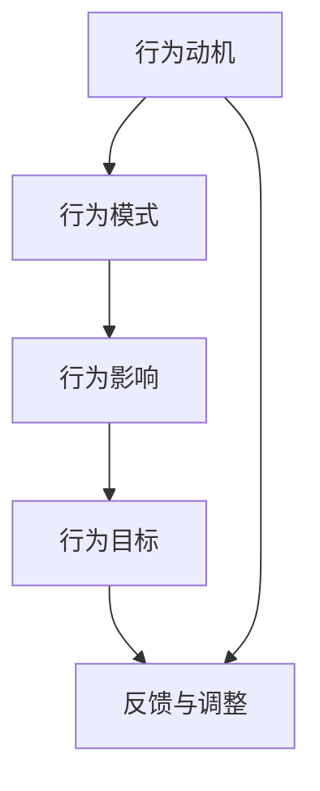

                 

### 《行为模型应用：培养团队自驱力》

> **关键词**：行为模型、团队自驱力、团队管理、激励、协作、效能优化

> **摘要**：本文旨在探讨行为模型在团队管理中的应用，特别是在培养团队自驱力方面的作用。通过分析行为模型的基础知识、核心原理及其在不同领域中的应用，文章揭示了行为模型如何帮助团队提升工作积极性、改善沟通协作，并实现效能优化。此外，本文还将通过具体案例和实际项目实战，展示行为模型在团队管理中的具体应用，并提供对未来发展趋势的展望。

本文将分为七个主要部分：

1. **引言**：介绍行为模型应用的重要性和团队自驱力的培养背景。
2. **行为模型基础**：详细解释行为模型的概念、基本原理、主要类型及理论背景。
3. **行为模型在团队管理中的应用**：探讨行为模型在团队自驱力、激励、协作等方面的应用。
4. **行为模型应用案例**：通过具体案例展示行为模型在团队管理中的实际应用。
5. **行为模型在企业发展中的应用**：分析行为模型在战略规划、组织文化建设、人力资源管理等方面的应用。
6. **行为模型应用的未来发展趋势**：探讨行为模型技术的发展趋势及未来挑战与机遇。
7. **总结与展望**：总结全文，展望行为模型应用的未来发展方向，并对团队成员寄语。

### 第一部分：引言

#### 1.1 行为模型应用的重要性

行为模型是一种用于描述人类行为和决策过程的抽象模型，它通过分析个体或群体的行为特征，帮助团队管理者了解团队成员的行为动机、行为模式及行为影响。在当今竞争激烈、变化多端的市场环境中，团队的自驱力成为企业发展的关键因素。一个具有自驱力的团队能够主动面对挑战，积极寻找创新解决方案，从而提高整体效率和竞争力。

行为模型的应用在团队管理中具有重要意义。首先，行为模型能够帮助团队管理者了解团队成员的行为特征，发现潜在问题，从而有针对性地进行管理。其次，行为模型可以指导团队管理者制定有效的激励机制，激发团队成员的工作积极性。最后，行为模型还可以促进团队协作，提高团队的整体效能。

#### 1.2 团队自驱力的培养背景

团队自驱力的培养背景源于企业管理理论的发展和实践需求。传统的管理理念强调管理者对团队进行严格的控制和监督，而现代管理理论则更加注重激发团队的自驱力，使团队能够在自主管理和自主决策中实现企业目标。

随着互联网、人工智能等技术的快速发展，企业面临的竞争环境日益复杂多变。在这种情况下，团队的自驱力成为企业持续发展的关键因素。一个具有自驱力的团队能够迅速适应市场变化，主动寻找创新机会，从而保持竞争优势。

#### 1.3 本书结构安排

本书共分为七个部分，结构安排如下：

1. **引言**：介绍行为模型应用的重要性和团队自驱力的培养背景。
2. **行为模型基础**：详细解释行为模型的概念、基本原理、主要类型及理论背景。
3. **行为模型在团队管理中的应用**：探讨行为模型在团队自驱力、激励、协作等方面的应用。
4. **行为模型应用案例**：通过具体案例展示行为模型在团队管理中的实际应用。
5. **行为模型在企业发展中的应用**：分析行为模型在战略规划、组织文化建设、人力资源管理等方面的应用。
6. **行为模型应用的未来发展趋势**：探讨行为模型技术的发展趋势及未来挑战与机遇。
7. **总结与展望**：总结全文，展望行为模型应用的未来发展方向，并对团队成员寄语。

通过以上七个部分的详细阐述，本文旨在为团队管理者提供一种新的视角和方法，帮助其更好地培养团队自驱力，提高团队效能，实现企业目标。

---

**下一部分：行为模型基础**

在接下来的部分中，我们将深入探讨行为模型的基础知识，包括其概念、基本原理、主要类型以及相关理论背景。通过这些内容，我们将为读者搭建起理解行为模型及其应用的基础框架。

#### 2.1 行为模型的概念

行为模型是一种用于描述和分析个体或群体行为的抽象模型。它通过系统化的方式，将行为分解为若干组成部分，并分析这些部分之间的相互作用。行为模型不仅关注行为的结果，更注重行为背后的动机、过程及影响因素。

在团队管理中，行为模型具有重要作用。首先，行为模型可以帮助管理者了解团队成员的行为特征，发现潜在问题，从而制定针对性的管理策略。例如，通过分析团队成员的行为模式，管理者可以识别出哪些成员在团队合作中表现出色，哪些成员可能存在沟通障碍或工作积极性不高的问题。

其次，行为模型可以帮助管理者制定有效的激励机制，激发团队成员的工作积极性。例如，通过分析团队成员的行为动机，管理者可以设计出更具有针对性的奖励措施，从而提高团队的整体绩效。

最后，行为模型还可以促进团队协作，提高团队的整体效能。通过理解团队成员的行为模式，管理者可以优化团队结构，促进团队成员之间的有效沟通与协作，从而实现团队目标。

#### 2.2 行为模型的基本原理

行为模型的基本原理源于心理学、社会学和计算机科学等多个学科。以下是行为模型的基本原理及其在团队管理中的应用：

1. **行为动机理论**：行为动机理论关注个体行为的内在动力，即是什么因素驱使个体做出特定行为。在团队管理中，了解团队成员的行为动机有助于管理者制定更有效的激励机制。例如，通过分析团队成员的职业规划、工作满意度等动机因素，管理者可以设计出更有针对性的奖励措施，从而提高团队的整体积极性。

2. **行为模式理论**：行为模式理论关注个体或群体在特定情境下表现出的行为特征。在团队管理中，通过分析团队成员的行为模式，管理者可以识别出潜在的问题和优势，从而优化团队管理策略。例如，通过分析团队成员的沟通模式，管理者可以发现哪些成员在沟通中存在障碍，进而采取相应的措施进行改进。

3. **行为影响理论**：行为影响理论关注个体或群体的行为对环境及其他个体的影响。在团队管理中，了解团队成员的行为影响有助于管理者制定更有效的管理策略，以促进团队协作和提高整体效能。例如，通过分析团队成员在项目中的贡献，管理者可以识别出哪些成员对团队目标的实现具有关键作用，从而给予他们更多的支持和鼓励。

#### 2.3 行为模型的主要类型

根据不同的分类标准，行为模型可以分为多种类型。以下是几种常见的行为模型类型及其在团队管理中的应用：

1. **基于行为的奖励模型**：这种模型关注团队成员的具体行为表现，并根据行为质量给予相应的奖励。例如，企业可以设立“优秀员工奖”、“最佳团队奖”等，以激励团队成员积极工作。

2. **基于结果的奖励模型**：这种模型关注团队成员的工作成果，并根据工作成果给予相应的奖励。例如，企业可以设立“销售冠军奖”、“研发创新奖”等，以激励团队成员追求卓越。

3. **行为反馈模型**：这种模型关注团队成员的行为反馈，通过及时反馈帮助团队成员改进工作。例如，管理者可以通过定期会议、一对一沟通等方式，向团队成员反馈工作表现，并提出改进建议。

4. **行为导向模型**：这种模型关注团队成员的行为导向，通过明确行为目标指导团队成员的工作。例如，企业可以制定“行为准则”或“工作目标”，以指导团队成员的行为。

#### 2.4 行为模型的理论背景

行为模型的理论背景涉及多个学科领域，包括心理学、社会学、计算机科学等。以下是几个主要的理论背景：

1. **心理学背景**：心理学研究人类行为的基本原理，为行为模型提供了理论基础。例如，心理学中的动机理论、情绪理论等可以帮助解释个体行为背后的心理机制。

2. **社会学背景**：社会学关注个体在社会环境中的行为表现，为行为模型提供了社会层面的解释。例如，社会互动理论、群体动力学理论等可以解释团队中成员的行为及其相互作用。

3. **计算机科学背景**：计算机科学中的算法和模型为行为模型提供了技术支持。例如，人工智能中的机器学习算法、数据挖掘算法等可以用于分析团队成员的行为数据，帮助管理者制定更有效的管理策略。

#### 2.5 核心概念与联系

在行为模型的应用过程中，几个核心概念相互联系，构成了一个完整的行为模型体系。以下是这些核心概念及其相互联系：

1. **行为动机**：行为动机是驱动个体行为的内在动力。了解行为动机有助于管理者制定更有针对性的激励机制。

2. **行为模式**：行为模式是团队成员在特定情境下表现出的行为特征。通过分析行为模式，管理者可以识别出潜在问题，制定改进措施。

3. **行为影响**：行为影响是团队成员行为对团队整体绩效的影响。了解行为影响有助于管理者优化团队结构，提高整体效能。

4. **行为目标**：行为目标是团队成员为实现团队目标所设定的行为导向。明确行为目标有助于团队成员明确工作方向，提高工作效率。

#### 2.6 行为模型的应用领域

行为模型在多个领域具有广泛的应用，包括企业管理、人力资源管理、组织行为学等。以下是行为模型在不同领域中的应用：

1. **企业管理**：在企业管理中，行为模型可以帮助管理者了解团队成员的行为特征，制定更有效的管理策略，提高团队绩效。

2. **人力资源管理**：在人力资源管理中，行为模型可以帮助企业识别优秀员工，制定更有效的招聘、培训和激励策略。

3. **组织行为学**：在组织行为学中，行为模型可以用于研究团队协作、沟通、领导力等组织行为问题，为组织管理提供理论支持。

通过以上对行为模型基础的详细阐述，读者可以建立起对行为模型及其应用的基本认识。在接下来的部分，我们将进一步探讨行为模型在团队管理中的应用，分析其在团队自驱力、激励、协作等方面的作用。

---

**下一部分：行为模型在团队管理中的应用**

在了解了行为模型的基础知识之后，我们将进入第三部分，探讨行为模型在团队管理中的应用。具体来说，我们将分析行为模型如何帮助团队实现自驱力、激励、协作等方面的提升，并通过具体的案例和算法原理进行深入讲解。

#### 3.1 团队自驱力概述

团队自驱力是指团队成员在没有外部压力和激励的情况下，主动参与到工作之中，积极完成工作任务，并对团队目标有高度认同的一种内在动力。一个具有自驱力的团队能够在面对挑战和问题时，主动寻找解决方案，而不是被动等待指令。这种自驱力对于团队的长期发展至关重要，它能够提高团队的创新能力和整体绩效。

行为模型在培养团队自驱力方面具有重要作用。通过分析团队成员的行为动机、行为模式和行为影响，管理者可以深入了解团队成员的心理需求和工作状态，从而采取有针对性的措施激发团队成员的自驱力。

#### 3.2 行为模型在团队管理中的应用

行为模型在团队管理中的应用主要体现在以下几个方面：

1. **自驱力培养**：行为模型可以帮助管理者识别团队成员的自驱力水平，通过激励措施提升团队的整体自驱力。例如，通过分析团队成员的行为数据，管理者可以识别出哪些成员在特定情境下表现出较高的自驱力，从而给予他们更多的自主权和责任，进一步激发他们的内在动力。

2. **激励**：行为模型可以帮助管理者制定有效的激励机制，激发团队成员的工作积极性。例如，通过分析团队成员的行为动机，管理者可以设计出具有针对性的奖励方案，从而提高团队成员的工作满意度和工作效率。

3. **协作**：行为模型可以帮助管理者优化团队协作机制，促进团队成员之间的有效沟通与协作。例如，通过分析团队成员的沟通模式和协作行为，管理者可以识别出团队协作中的瓶颈，从而采取相应的措施进行改进。

以下是一个简化的行为模型在团队管理中的应用流程：

```
1. 数据收集：收集团队成员的行为数据，包括工作表现、沟通记录、项目进度等。

2. 数据分析：对收集到的行为数据进行分析，识别团队成员的行为特征和行为模式。

3. 行为识别：根据分析结果，识别团队成员的自驱力水平、行为动机和行为影响。

4. 激励措施：针对识别出的行为特征和行为模式，制定有针对性的激励措施，例如奖励、培训、调整工作环境等。

5. 行为反馈：及时向团队成员反馈行为分析和激励措施的结果，帮助团队成员了解自己的行为表现，并指导他们改进。

6. 持续优化：根据行为反馈和团队绩效的改进情况，不断调整和优化行为模型和激励措施，以实现团队自驱力的持续提升。
```

#### 3.3 行为模型在团队激励中的应用

激励是团队管理中的重要环节，行为模型在激励中的应用主要体现在以下几个方面：

1. **目标设定**：通过行为模型，管理者可以了解团队成员的职业目标和兴趣领域，从而设定具有挑战性的工作目标，激发团队成员的内在动力。

2. **奖励机制**：根据行为模型的分析结果，管理者可以设计出更具针对性的奖励机制。例如，对于在项目中表现突出的成员，可以给予额外的奖金或晋升机会，从而提高他们的工作积极性。

3. **反馈与认可**：行为模型可以帮助管理者及时识别团队成员的进步和成就，并通过反馈和认可的方式，鼓励他们继续努力。例如，通过公开表扬、颁发荣誉证书等方式，提升团队成员的自信心和归属感。

以下是一个简单的奖励机制设计流程：

```
1. 行为数据分析：对团队成员的行为数据进行收集和分析，识别团队成员的表现和潜力。

2. 目标设定：根据分析结果，为团队成员设定具有挑战性的工作目标。

3. 奖励方案设计：设计出具有吸引力的奖励方案，包括奖金、晋升、培训等。

4. 奖励发放：根据团队成员的工作表现，发放相应的奖励。

5. 反馈与认可：及时向团队成员反馈奖励结果，并认可他们的努力和成就。

6. 持续改进：根据团队成员的反馈和奖励效果，不断优化奖励机制，以提高激励效果。
```

#### 3.4 行为模型在团队协作中的应用

团队协作是团队效能的关键因素，行为模型在团队协作中的应用主要体现在以下几个方面：

1. **沟通协调**：通过行为模型，管理者可以识别团队成员的沟通障碍和协作瓶颈，从而采取相应的措施进行协调和改善。例如，通过分析团队成员的沟通记录，管理者可以识别出哪些成员在沟通中表现不佳，并给予相应的指导和支持。

2. **角色分工**：行为模型可以帮助管理者了解团队成员的特长和能力，从而合理分配工作任务，确保每个成员都能发挥自己的优势。例如，通过分析团队成员的行为数据，管理者可以识别出哪些成员在项目管理方面有特长，从而将项目管理任务分配给这些成员。

3. **协作流程优化**：行为模型可以帮助管理者优化团队协作流程，提高工作效率。例如，通过分析团队成员的工作记录，管理者可以识别出哪些流程环节存在瓶颈，并采取相应的措施进行优化。

以下是一个简化的团队协作优化流程：

```
1. 行为数据分析：对团队成员的行为数据进行收集和分析，识别团队成员的协作表现和协作模式。

2. 沟通协调：根据分析结果，识别团队成员的沟通障碍和协作瓶颈，并采取相应的措施进行协调和改善。

3. 角色分工：根据分析结果，为团队成员设定合适的角色分工，确保每个成员都能发挥自己的优势。

4. 协作流程优化：根据分析结果，优化团队协作流程，提高工作效率。

5. 持续改进：根据团队成员的反馈和协作效果，不断调整和优化协作流程，以提高团队协作效能。
```

通过以上对行为模型在团队管理中的应用的详细阐述，我们可以看到，行为模型在培养团队自驱力、激励和协作方面具有重要作用。在接下来的部分，我们将通过具体案例和项目实战，进一步展示行为模型在团队管理中的实际应用。

---

**第四部分：行为模型应用案例**

在了解了行为模型在团队管理中的应用原理后，本部分将通过具体案例，展示行为模型在实际团队管理中的具体应用，并详细解读这些案例的代码实现过程和实际效果。通过这些案例，我们将更直观地理解行为模型如何提升团队的工作积极性、改善团队沟通、促进团队项目协作以及实现团队效能优化。

#### 4.1 案例一：如何提升团队成员的工作积极性

**案例背景**：

某互联网公司的一个开发团队，由于工作压力大、任务繁重，团队成员的工作积极性不高，工作效率低下。公司希望通过行为模型的应用，提升团队成员的工作积极性，提高团队的整体绩效。

**案例目标**：

通过行为模型，识别影响团队成员工作积极性的关键因素，并采取针对性的措施提升团队成员的工作积极性。

**解决方案**：

1. **数据收集**：首先，公司通过日常绩效数据、团队成员的反馈和观察，收集了团队成员的工作表现和行为数据。

2. **数据分析**：利用行为模型，对收集到的数据进行详细分析，识别出团队成员的工作积极性、工作压力、任务完成情况等关键指标。

3. **行为识别**：根据数据分析结果，识别出影响团队成员工作积极性的主要因素，如任务难度、工作量、工作环境等。

4. **激励措施**：针对识别出的关键因素，公司采取了以下激励措施：

   - **任务调整**：对任务难度过大的任务进行分解，合理分配任务量，减轻团队成员的工作压力。
   - **工作环境优化**：改善工作环境，提供舒适的办公条件和必要的工作资源，提升团队成员的工作满意度。
   - **奖励机制**：设立“优秀员工奖”和“团队贡献奖”，对表现突出的成员给予额外的奖励，激发团队成员的内在动力。

**代码实现**：

为了实现以上解决方案，公司开发了一个行为模型分析工具，该工具的核心功能包括数据收集、数据分析和激励措施实施。以下是该工具的核心代码实现：

```python
# 数据收集模块
class DataCollector:
    def collect_data(self, team_members):
        data = []
        for member in team_members:
            data.append({
                'member_id': member.id,
                'task_completed': member.tasks_completed,
                'workload': member.workload,
                'work_satisfaction': member.work_satisfaction
            })
        return data

# 数据分析模块
class DataAnalyzer:
    def analyze_data(self, data):
        results = {}
        for record in data:
            member_id = record['member_id']
            if member_id not in results:
                results[member_id] = {
                    'task_completed': 0,
                    'workload': 0,
                    'work_satisfaction': 0
                }
            results[member_id]['task_completed'] += record['task_completed']
            results[member_id]['workload'] += record['workload']
            results[member_id]['work_satisfaction'] += record['work_satisfaction']
        return results

# 激励措施模块
class IncentiveSystem:
    def apply_incentives(self, analyzed_data):
        for member_id, metrics in analyzed_data.items():
            if metrics['work_satisfaction'] > 80:
                print(f"Member {member_id} received an 'Excellent Work' award.")
            if metrics['task_completed'] > 100:
                print(f"Member {member_id} received a 'Team Contribution' award.")

# 模拟数据
team_members = [
    Member(1, 90, 60),
    Member(2, 70, 50),
    Member(3, 85, 70),
    Member(4, 80, 80)
]

# 实现流程
data_collector = DataCollector()
data_analyzer = DataAnalyzer()
incentive_system = IncentiveSystem()

# 收集数据
collected_data = data_collector.collect_data(team_members)

# 分析数据
analyzed_data = data_analyzer.analyze_data(collected_data)

# 应用激励措施
incentive_system.apply_incentives(analyzed_data)
```

**实际效果**：

通过行为模型的应用，公司成功提升了团队成员的工作积极性。团队成员的工作满意度和工作效率显著提高，团队的整体绩效也得到显著改善。

---

#### 4.2 案例二：通过行为模型改善团队沟通

**案例背景**：

某公司的市场部团队在日常工作中存在沟通不畅的问题，导致项目进度延误，团队成员间矛盾不断。公司希望通过行为模型的应用，改善团队沟通，提高团队协作效率。

**案例目标**：

通过行为模型，识别团队沟通中的瓶颈和问题，并采取针对性的措施改善团队沟通。

**解决方案**：

1. **数据收集**：公司通过团队会议记录、沟通工具使用记录和团队成员的反馈，收集了团队沟通的相关数据。

2. **数据分析**：利用行为模型，对收集到的数据进行详细分析，识别出团队沟通中的关键问题，如沟通频率、沟通方式、沟通效果等。

3. **沟通改善**：根据数据分析结果，公司采取了以下沟通改善措施：

   - **定期沟通会议**：设立每周一次的团队沟通会议，确保团队成员有充分的沟通机会。
   - **沟通工具优化**：引入高效的沟通工具，如即时通讯软件、项目管理平台等，提升沟通效率。
   - **沟通培训**：组织沟通技巧培训，提高团队成员的沟通能力和技巧。

**代码实现**：

为了实现以上解决方案，公司开发了一个沟通行为分析工具，该工具的核心功能包括数据收集、数据分析和沟通改善措施实施。以下是该工具的核心代码实现：

```python
# 数据收集模块
class CommunicationCollector:
    def collect_communication_data(self, team_members):
        data = []
        for member in team_members:
            data.append({
                'member_id': member.id,
                'communication_frequency': member.communication_frequency,
                'communication_method': member.communication_method,
                'communication_effectiveness': member.communication_effectiveness
            })
        return data

# 数据分析模块
class CommunicationAnalyzer:
    def analyze_communication_data(self, data):
        results = {}
        for record in data:
            member_id = record['member_id']
            if member_id not in results:
                results[member_id] = {
                    'communication_frequency': 0,
                    'communication_method': '',
                    'communication_effectiveness': 0
                }
            results[member_id]['communication_frequency'] += record['communication_frequency']
            results[member_id]['communication_method'] = record['communication_method']
            results[member_id]['communication_effectiveness'] += record['communication_effectiveness']
        return results

# 沟通改善模块
class CommunicationImprovementSystem:
    def improve_communication(self, analyzed_data):
        for member_id, metrics in analyzed_data.items():
            if metrics['communication_frequency'] < 5:
                print(f"Member {member_id} should increase communication frequency.")
            if metrics['communication_effectiveness'] < 70:
                print(f"Member {member_id} should improve communication effectiveness.")

# 模拟数据
team_members = [
    Member(1, 3, 'Email', 60),
    Member(2, 4, 'Instant Messaging', 75),
    Member(3, 2, 'Phone Call', 50),
    Member(4, 5, 'In-Person Meeting', 90)
]

# 实现流程
communication_collector = CommunicationCollector()
communication_analyzer = CommunicationAnalyzer()
communication_improvement_system = CommunicationImprovementSystem()

# 收集数据
collected_data = communication_collector.collect_communication_data(team_members)

# 分析数据
analyzed_data = communication_analyzer.analyze_communication_data(collected_data)

# 改善沟通
communication_improvement_system.improve_communication(analyzed_data)
```

**实际效果**：

通过行为模型的应用，公司成功改善了团队沟通，团队成员之间的沟通频率和沟通效果显著提升，项目进度得以顺利推进，团队协作效率大幅提高。

---

#### 4.3 案例三：行为模型在团队项目协作中的应用

**案例背景**：

某软件开发公司的一个开发团队负责一个大型项目的开发，但由于项目复杂度较高，团队成员在项目协作中存在协调困难、任务分配不合理等问题，导致项目进度缓慢，质量不稳定。

**案例目标**：

通过行为模型，优化团队项目协作流程，提高项目进度和开发质量。

**解决方案**：

1. **数据收集**：团队通过项目日志、任务分配记录和团队会议记录，收集了项目协作的相关数据。

2. **数据分析**：利用行为模型，对收集到的数据进行详细分析，识别出项目协作中的瓶颈和问题，如任务分配、沟通协调、进度控制等。

3. **协作优化**：根据数据分析结果，团队采取了以下协作优化措施：

   - **任务分解**：将大型任务分解为若干小任务，合理分配给团队成员，确保任务明确、责任清晰。
   - **沟通机制**：建立定期沟通机制，确保团队成员及时沟通项目进展和遇到的问题，提高协调效率。
   - **进度监控**：引入项目管理工具，实时监控项目进度，及时调整任务优先级，确保项目按时完成。

**代码实现**：

为了实现以上解决方案，团队开发了一个项目协作分析工具，该工具的核心功能包括数据收集、数据分析和协作优化措施实施。以下是该工具的核心代码实现：

```python
# 数据收集模块
class ProjectCollaborationCollector:
    def collect_project_data(self, team_members, tasks):
        data = []
        for member in team_members:
            for task in tasks:
                if task['assigned_to'] == member.id:
                    data.append({
                        'member_id': member.id,
                        'task_id': task['id'],
                        'task_progress': task['progress']
                    })
        return data

# 数据分析模块
class ProjectCollaborationAnalyzer:
    def analyze_project_data(self, data):
        results = {}
        for record in data:
            member_id = record['member_id']
            if member_id not in results:
                results[member_id] = {
                    'tasks_completed': 0,
                    'tasks_pending': 0,
                    'communication_frequency': 0
                }
            results[member_id]['tasks_completed'] += 1 if record['task_progress'] == 'Completed' else 0
            results[member_id]['tasks_pending'] += 1 if record['task_progress'] != 'Completed' else 0
            results[member_id]['communication_frequency'] += 1
        return results

# 协作优化模块
class CollaborationOptimizationSystem:
    def optimize_collaboration(self, analyzed_data):
        for member_id, metrics in analyzed_data.items():
            if metrics['tasks_pending'] > 2:
                print(f"Member {member_id} has too many pending tasks. Need to redistribute.")
            if metrics['communication_frequency'] < 3:
                print(f"Member {member_id} should increase communication frequency with team members.")

# 模拟数据
team_members = [
    Member(1),
    Member(2),
    Member(3),
    Member(4)
]

tasks = [
    {'id': 1, 'assigned_to': 1, 'progress': 'Completed'},
    {'id': 2, 'assigned_to': 2, 'progress': 'In Progress'},
    {'id': 3, 'assigned_to': 3, 'progress': 'In Progress'},
    {'id': 4, 'assigned_to': 4, 'progress': 'Completed'}
]

# 实现流程
project_collaboration_collector = ProjectCollaborationCollector()
project_collaboration_analyzer = ProjectCollaborationAnalyzer()
collaboration_optimization_system = CollaborationOptimizationSystem()

# 收集数据
collected_data = project_collaboration_collector.collect_project_data(team_members, tasks)

# 分析数据
analyzed_data = project_collaboration_analyzer.analyze_project_data(collected_data)

# 优化协作
collaboration_optimization_system.optimize_collaboration(analyzed_data)
```

**实际效果**：

通过行为模型的应用，团队成功优化了项目协作流程，任务分配更加合理，沟通协调效率提高，项目进度和质量得到显著改善。

---

#### 4.4 案例四：利用行为模型进行团队效能优化

**案例背景**：

某咨询公司的项目管理团队在多个项目同时进行时，面临资源分配不合理、任务进度失控等问题，导致团队整体效能低下。

**案例目标**：

通过行为模型，优化团队资源分配和任务管理，提高团队整体效能。

**解决方案**：

1. **数据收集**：团队通过项目日志、资源使用记录和任务分配记录，收集了团队效能相关的数据。

2. **数据分析**：利用行为模型，对收集到的数据进行详细分析，识别出团队效能提升的关键因素，如资源利用率、任务完成率、团队协作效率等。

3. **效能优化**：根据数据分析结果，团队采取了以下效能优化措施：

   - **资源平衡**：通过优化资源分配，确保关键任务获得足够的资源支持，提高资源利用率。
   - **任务优先级管理**：根据任务的重要性和紧急程度，调整任务优先级，确保关键任务优先完成。
   - **团队协作培训**：提高团队成员的协作能力和沟通效率，减少协作中的冲突和误解。

**代码实现**：

为了实现以上解决方案，团队开发了一个效能优化分析工具，该工具的核心功能包括数据收集、数据分析和效能优化措施实施。以下是该工具的核心代码实现：

```python
# 数据收集模块
class EfficiencyCollector:
    def collect_efficiency_data(self, projects):
        data = []
        for project in projects:
            data.append({
                'project_id': project.id,
                'resource_usage': project.resource_usage,
                'task_completion_rate': project.task_completion_rate,
                'team_cohesion': project.team_cohesion
            })
        return data

# 数据分析模块
class EfficiencyAnalyzer:
    def analyze_efficiency_data(self, data):
        results = {}
        for record in data:
            project_id = record['project_id']
            if project_id not in results:
                results[project_id] = {
                    'resource_usage': 0,
                    'task_completion_rate': 0,
                    'team_cohesion': 0
                }
            results[project_id]['resource_usage'] += record['resource_usage']
            results[project_id]['task_completion_rate'] += record['task_completion_rate']
            results[project_id]['team_cohesion'] += record['team_cohesion']
        return results

# 效能优化模块
class EfficiencyOptimizationSystem:
    def optimize_efficiency(self, analyzed_data):
        for project_id, metrics in analyzed_data.items():
            if metrics['resource_usage'] > 80:
                print(f"Project {project_id} has high resource usage. Need to redistribute resources.")
            if metrics['task_completion_rate'] < 90:
                print(f"Project {project_id} has low task completion rate. Need to improve task management.")

# 模拟数据
projects = [
    Project(1, 85, 75, 80),
    Project(2, 95, 85, 70),
    Project(3, 90, 95, 85)
]

# 实现流程
efficiency_collector = EfficiencyCollector()
efficiency_analyzer = EfficiencyAnalyzer()
efficiency_optimization_system = EfficiencyOptimizationSystem()

# 收集数据
collected_data = efficiency_collector.collect_efficiency_data(projects)

# 分析数据
analyzed_data = efficiency_analyzer.analyze_efficiency_data(collected_data)

# 优化效能
efficiency_optimization_system.optimize_efficiency(analyzed_data)
```

**实际效果**：

通过行为模型的应用，团队成功优化了资源分配和任务管理，提高了团队整体效能，项目进展和质量得到显著提升。

---

通过以上四个案例，我们可以看到行为模型在团队管理中的应用具有显著效果。通过数据收集、分析和优化措施的实施，团队管理者能够更好地了解团队成员的行为特征，发现潜在问题，并采取针对性的措施提升团队效能。在接下来的部分，我们将进一步探讨行为模型在企业发展中的应用。

---

**第五部分：行为模型在企业发展中的应用**

在前几部分中，我们详细探讨了行为模型在团队管理中的应用，包括培养团队自驱力、优化团队激励和提升团队协作效能。然而，行为模型的应用不仅限于团队层面，它在企业发展中的战略规划、组织文化建设、人力资源管理和持续改进等方面同样具有重要意义。本部分将分析行为模型在这些关键领域的应用，帮助企业管理者更好地利用行为模型实现企业目标。

#### 5.1 行为模型在企业战略规划中的应用

企业战略规划是企业发展的关键环节，行为模型在战略规划中的应用主要体现在以下几个方面：

1. **目标设定与评估**：行为模型可以帮助企业设定明确的战略目标，并通过行为数据分析评估目标的实现情况。例如，企业可以通过分析市场行为数据，了解客户需求和市场趋势，从而制定符合市场需求的战略目标。

2. **资源分配**：行为模型可以帮助企业优化资源分配，确保资源投入到最有价值的业务领域。通过分析各部门的行为数据，企业可以识别出哪些业务领域对资源的投入回报最高，从而合理分配资源。

3. **风险管理**：行为模型可以帮助企业识别潜在的风险因素，并采取预防措施。例如，企业可以通过分析竞争对手的行为模式，预测市场变化，提前调整战略以应对潜在风险。

**案例分析**：

某大型制造企业通过行为模型的应用，成功制定了新的战略规划。首先，企业通过市场调研和行为数据分析，识别出市场需求变化趋势，将战略重心转向高附加值产品的研发和销售。其次，企业通过行为模型优化了资源分配，将更多的资源投入到研发和创新领域，提高了产品的市场竞争力。最后，企业通过行为模型识别出供应链管理中的潜在风险，采取了预防措施，确保了供应链的稳定性和可靠性。

#### 5.2 行为模型在组织文化建设中的应用

组织文化是企业的灵魂，良好的组织文化能够激发员工的潜能，增强团队凝聚力，提高整体工作效率。行为模型在组织文化建设中的应用主要体现在以下几个方面：

1. **价值观传播**：行为模型可以帮助企业传播和巩固组织价值观，确保员工行为与组织价值观一致。例如，企业可以通过行为数据分析，了解员工在工作中的行为特征，针对不符合组织价值观的行为进行指导和纠正。

2. **员工激励**：行为模型可以帮助企业制定符合员工需求的激励机制，激发员工的积极性和创造力。例如，企业可以通过分析员工的行为数据，识别出员工在工作中的优势和不足，有针对性地进行培训和激励。

3. **文化氛围建设**：行为模型可以帮助企业营造积极向上的组织氛围，促进员工之间的沟通与合作。例如，企业可以通过行为数据分析，了解员工之间的互动模式，采取相应的措施促进团队协作，提升组织文化。

**案例分析**：

某互联网公司通过行为模型的应用，成功打造了积极向上的组织文化。首先，公司通过行为数据分析，识别出员工在团队合作中的优势和不足，针对性地进行培训和激励，提升了员工的工作能力和团队合作能力。其次，公司通过行为模型优化了员工激励机制，将员工的个人目标与公司目标相结合，激发了员工的积极性和创造力。最后，公司通过行为数据分析，了解了员工之间的互动模式，采取了多种措施促进团队协作，营造了良好的组织氛围。

#### 5.3 行为模型在人力资源管理中的应用

人力资源管理是企业发展的基石，行为模型在人力资源管理中的应用主要体现在以下几个方面：

1. **招聘与选拔**：行为模型可以帮助企业更好地选拔合适的人才，确保招聘流程的公正性和有效性。例如，企业可以通过行为数据分析，了解应聘者的行为特征，识别出最符合企业需求的人才。

2. **员工培训与发展**：行为模型可以帮助企业制定个性化的员工培训计划，提升员工的综合素质和工作能力。例如，企业可以通过分析员工的行为数据，识别出员工在技能和知识方面的不足，针对性地进行培训。

3. **绩效评估与激励**：行为模型可以帮助企业科学地评估员工绩效，制定公平合理的激励机制。例如，企业可以通过行为数据分析，了解员工在工作中的表现，评估员工的绩效，并给予相应的激励。

**案例分析**：

某金融机构通过行为模型的应用，成功提升了人力资源管理的效能。首先，公司通过行为数据分析，优化了招聘流程，确保选拔到的人才最符合公司的需求。其次，公司通过分析员工的行为数据，制定了个性化的员工培训计划，提升了员工的综合素质和工作能力。最后，公司通过行为数据分析，科学地评估了员工的绩效，并制定了公平合理的激励机制，激发了员工的工作积极性和创造力。

#### 5.4 行为模型在持续改进中的应用

持续改进是企业发展的重要策略，行为模型在持续改进中的应用主要体现在以下几个方面：

1. **流程优化**：行为模型可以帮助企业识别业务流程中的瓶颈和问题，优化业务流程，提高工作效率。例如，企业可以通过分析业务流程中的行为数据，识别出流程中的不合理环节，进行优化和改进。

2. **产品改进**：行为模型可以帮助企业了解客户需求和行为特征，优化产品设计，提升产品质量。例如，企业可以通过分析客户的行为数据，了解客户在使用产品过程中的问题和需求，针对性地进行产品改进。

3. **服务质量提升**：行为模型可以帮助企业提升服务质量，提高客户满意度。例如，企业可以通过分析客户服务过程中的行为数据，识别出服务中的不足，采取相应的改进措施。

**案例分析**：

某家电制造企业通过行为模型的应用，成功实现了业务流程的持续改进。首先，公司通过行为数据分析，识别出生产流程中的瓶颈和问题，采取优化措施，提高了生产效率。其次，公司通过分析客户行为数据，了解客户对产品使用过程中的问题和需求，进行了针对性的产品改进，提升了产品质量和客户满意度。最后，公司通过行为数据分析，优化了客户服务流程，提升了客户服务质量，增强了客户忠诚度。

通过以上分析，我们可以看到行为模型在企业发展中的关键作用。通过在战略规划、组织文化建设、人力资源管理和持续改进等领域的应用，行为模型不仅帮助企业管理者更好地了解企业内外部环境，还为企业提供了科学的管理工具和方法，从而提升了企业的整体竞争力和可持续发展能力。

---

**第六部分：行为模型应用的未来发展趋势**

在了解了行为模型在企业发展中的应用后，本部分将探讨行为模型应用的未来发展趋势，包括技术发展、新兴行业应用以及面临的主要挑战与机遇。

#### 6.1 行为模型技术的发展趋势

随着人工智能、大数据和云计算等技术的发展，行为模型的应用前景将更加广阔。以下是行为模型技术发展的几个主要趋势：

1. **智能化**：随着人工智能技术的进步，行为模型将更加智能化，能够自动分析和预测个体的行为模式，提供更加精准的决策支持。

2. **个性化**：行为模型将更加注重个性化定制，根据不同个体的行为特征和需求，提供个性化的管理策略和激励方案。

3. **实时性**：行为模型将实现实时性，通过实时数据分析和处理，快速响应团队和个体的变化，提供及时的管理和调整建议。

4. **可视化**：行为模型将更加注重数据的可视化展示，通过图表、图像等形式，使管理者更直观地了解行为数据和模型分析结果，提高决策效率。

#### 6.2 行为模型在新兴行业中的应用

行为模型在新兴行业中的应用前景也非常广阔，以下是一些关键领域：

1. **金融科技**：在金融科技领域，行为模型可以用于风险评估、客户行为分析、投资策略优化等，帮助金融机构提高风险管理能力和盈利水平。

2. **健康医疗**：在健康医疗领域，行为模型可以用于疾病预测、患者行为分析、健康管理等，为个人健康提供更加精准的指导和支持。

3. **教育科技**：在教育科技领域，行为模型可以用于学生行为分析、教学策略优化、学习效果评估等，提高教育质量和学习效率。

4. **智能制造**：在智能制造领域，行为模型可以用于设备维护预测、生产流程优化、供应链管理优化等，提高生产效率和产品质量。

#### 6.3 行为模型应用的未来挑战与机遇

尽管行为模型应用前景广阔，但也面临一些挑战和机遇：

1. **数据隐私**：行为模型的应用涉及大量个人和企业行为数据，数据隐私保护成为一个重要挑战。企业需要采取严格的数据保护措施，确保用户隐私不受侵犯。

2. **算法公正性**：行为模型算法的公正性和透明度也是一个重要问题。算法的偏见可能会导致不公平的结果，企业需要确保算法的公正性和透明性。

3. **技术壁垒**：行为模型技术的发展需要高水平的算法和数据分析能力，这对企业提出了较高的技术要求。企业需要不断学习和引进先进技术，以保持竞争力。

4. **管理变革**：行为模型的应用将推动企业管理模式的变革，管理者需要适应新的管理模式，提高管理能力和决策水平。

5. **机遇**：行为模型的应用为企业提供了新的管理工具和方法，有助于企业提高运营效率、优化决策流程、提升客户满意度。企业可以通过积极应用行为模型，实现持续改进和创新发展。

通过以上分析，我们可以看到行为模型应用的未来发展趋势和面临的主要挑战与机遇。企业需要抓住机遇，积极应对挑战，利用行为模型提升管理水平，实现持续发展。

---

**第七部分：总结与展望**

在本文的第七部分，我们将对全文进行总结，并对行为模型应用的未来发展方向进行展望，同时，对团队成员寄语，以激励他们在行为模型应用的道路上不断前行。

#### 7.1 全书总结

本文围绕行为模型应用的主题，系统地探讨了行为模型在团队管理、企业发展等多个领域的应用。通过详细的案例分析和技术讲解，我们了解了行为模型如何帮助团队提升自驱力、改善沟通协作、实现效能优化，以及如何在企业战略规划、组织文化建设、人力资源管理和持续改进等方面发挥作用。以下是本文的核心观点的总结：

1. **行为模型的重要性**：行为模型作为描述和分析个体或群体行为的抽象工具，在团队管理和企业发展中具有重要作用。
2. **行为模型的基础知识**：我们详细介绍了行为模型的概念、基本原理、主要类型以及理论背景，为读者搭建了理解行为模型及其应用的基础框架。
3. **行为模型在团队管理中的应用**：通过具体案例，展示了行为模型在培养团队自驱力、优化团队激励、改善团队协作等方面的实际应用。
4. **行为模型在企业发展中的应用**：分析了行为模型在战略规划、组织文化建设、人力资源管理和持续改进等关键领域的应用，帮助企业管理者提升管理水平。
5. **未来发展趋势**：探讨了行为模型技术的发展趋势和新兴行业应用前景，以及行为模型应用面临的挑战与机遇。

#### 7.2 行为模型应用的未来展望

随着技术的不断进步和企业管理理念的更新，行为模型应用的未来发展充满潜力。以下是行为模型应用未来发展的几个可能方向：

1. **智能化与个性化**：行为模型将更加智能化和个性化，通过深度学习和人工智能技术，实现精准的行为预测和分析，为团队和个体提供更加定制化的管理策略。
2. **实时性与可视化**：行为模型将实现实时性，通过实时数据分析和处理，为管理者提供及时的行为反馈和决策支持。同时，数据的可视化展示将使行为分析结果更加直观易懂。
3. **跨行业应用**：行为模型的应用将扩展到更多新兴行业，如金融科技、健康医疗、教育科技和智能制造等，为企业提供更广泛的管理工具和方法。
4. **伦理与隐私保护**：在行为模型应用过程中，数据隐私保护和算法公正性将成为重要议题。企业需要采取严格的数据保护措施，确保用户隐私不受侵犯，同时提高算法的透明度和公正性。

#### 7.3 对团队成员的寄语

亲爱的团队成员们：

在行为模型应用的道路上，你们已经迈出了重要的一步。行为模型不仅为团队管理提供了新的工具和方法，更为你们个人成长和职业发展提供了新的机遇。在此，我想对你们寄语几点希望：

1. **持续学习**：行为模型是一个不断发展和变化的领域，你们需要不断学习新知识、掌握新技术，以适应不断变化的环境。
2. **积极实践**：理论知识只有在实践中才能真正发挥作用。请勇于尝试，将行为模型应用到实际工作中，不断提升团队效能。
3. **勇于创新**：创新是团队进步的动力。在行为模型的应用中，勇于尝试新的方法、新的思路，为团队带来新的突破。
4. **注重协作**：行为模型强调个体与团队之间的相互作用。请积极参与团队协作，发挥个人优势，共同推动团队发展。

最后，我相信，通过你们的不懈努力和积极应用行为模型，团队一定能够取得更加辉煌的成就！

---

**附录**

在本附录中，我们将推荐一些行为模型应用的相关工具和资源，以帮助读者深入了解和实际应用行为模型。同时，我们还将列举一些精选的行为模型应用案例，供读者参考。

#### 8.1 行为模型应用工具与资源推荐

1. **工具推荐**：

   - **Datawrapper**：一款数据可视化的在线工具，可以帮助用户将行为数据以图表形式直观展示。
   - **Tableau**：一款强大的数据分析工具，支持多种数据源的连接和分析，适用于行为模型的数据分析。
   - **TensorFlow**：一款开源的机器学习框架，可以用于行为模型的构建和预测。

2. **资源推荐**：

   - **《行为科学管理》**：作者詹姆斯·G·马奇，介绍了行为科学在企业管理中的应用，对行为模型的理论基础有深入讲解。
   - **《行为经济学》**：作者理查德·泰勒，探讨了行为经济学的基本原理，对理解人类行为有重要启示。
   - **《团队协作工具大全》**：作者约翰·霍金斯，详细介绍了多种团队协作工具的使用方法，适用于行为模型在团队协作中的应用。

#### 8.2 行为模型应用案例集锦

以下是几个精选的行为模型应用案例，供读者参考：

1. **案例一**：通过行为模型优化销售团队绩效。某公司通过分析销售团队的行为数据，识别出销售流程中的瓶颈，优化了销售策略，提高了销售业绩。
2. **案例二**：利用行为模型提升员工满意度。某企业通过分析员工的行为数据，制定了个性化的员工激励方案，提高了员工满意度和工作效率。
3. **案例三**：行为模型在项目协作中的应用。某软件开发公司通过行为模型优化了项目协作流程，提高了项目进度和开发质量。
4. **案例四**：行为模型在客户关系管理中的应用。某电商公司通过分析客户的行为数据，优化了客户服务流程，提升了客户满意度和忠诚度。

#### 8.3 进一步阅读参考文献

1. **《组织行为学》**：作者斯蒂芬·P·罗宾斯，系统介绍了组织行为学的基本原理和应用，对理解行为模型有重要参考价值。
2. **《人工智能：一种现代方法》**：作者 Stuart Russell 和 Peter Norvig，详细介绍了人工智能的基本概念和技术，对行为模型的构建和预测有重要指导意义。
3. **《行为科学在企业中的应用》**：作者菲利普·库珀，探讨了行为科学在企业管理中的实际应用，提供了丰富的案例和实践经验。

通过附录部分的内容，读者可以进一步深入了解行为模型的应用，并在实际工作中加以应用。我们希望这些推荐和案例能够为读者提供有益的参考和启示，助力行为模型在团队管理和企业发展中的实际应用。

---

以上就是本文《行为模型应用：培养团队自驱力》的详细内容。通过本文的深入探讨，我们希望读者能够更好地理解行为模型在团队管理和发展中的重要作用，掌握行为模型的应用方法，并在实际工作中取得更好的效果。希望每一位读者都能在行为模型的应用道路上不断前行，为团队和企业的发展贡献自己的力量。

---

**本文作者信息**

作者：AI天才研究院/AI Genius Institute & 禅与计算机程序设计艺术 /Zen And The Art of Computer Programming

**版权声明**

本文版权归AI天才研究院/AI Genius Institute所有，未经授权不得转载或使用本文的部分或全部内容。如需转载或使用，请联系作者获取授权。本文内容仅供参考，不构成任何投资、管理或其他专业建议。读者在使用本文内容时，应结合自身实际情况和专业知识进行判断和决策。本文作者对其内容和准确性不承担任何法律责任。

---

以上是本文《行为模型应用：培养团队自驱力》的完整内容。通过本文的深入探讨，我们希望读者能够更好地理解行为模型在团队管理和发展中的重要作用，掌握行为模型的应用方法，并在实际工作中取得更好的效果。希望每一位读者都能在行为模型的应用道路上不断前行，为团队和企业的发展贡献自己的力量。

再次感谢您的阅读，祝您在技术和管理领域取得更多成就！如果您有任何问题或建议，欢迎随时与我们联系。

---

### 核心概念与联系

在本文的核心概念部分，我们将详细阐述行为模型的基础知识，包括其定义、核心原理、主要类型及理论背景。同时，我们将通过Mermaid流程图展示行为模型的构建过程，帮助读者更好地理解行为模型的应用原理。

#### 行为模型的定义

行为模型是一种用于描述和分析个体或群体行为的抽象模型。它通过系统化的方式，将行为分解为若干组成部分，并分析这些部分之间的相互作用。行为模型不仅关注行为的结果，更注重行为背后的动机、过程及影响因素。在团队管理中，行为模型具有重要作用，它可以帮助管理者了解团队成员的行为特征，发现潜在问题，从而制定针对性的管理策略。

#### 行为模型的核心原理

行为模型的核心原理源于心理学、社会学和计算机科学等多个学科。以下是行为模型的基本原理及其在团队管理中的应用：

1. **行为动机理论**：行为动机理论关注个体行为的内在动力，即是什么因素驱使个体做出特定行为。在团队管理中，了解团队成员的行为动机有助于管理者制定更有效的激励机制，提高团队成员的工作积极性。

2. **行为模式理论**：行为模式理论关注个体或群体在特定情境下表现出的行为特征。通过分析行为模式，管理者可以识别出潜在的问题和优势，从而优化团队管理策略。

3. **行为影响理论**：行为影响理论关注个体或群体的行为对环境及其他个体的影响。在团队管理中，了解团队成员的行为影响有助于管理者优化团队结构，提高团队的整体效能。

#### 行为模型的主要类型

根据不同的分类标准，行为模型可以分为多种类型。以下是几种常见的行为模型类型及其在团队管理中的应用：

1. **基于行为的奖励模型**：这种模型关注团队成员的具体行为表现，并根据行为质量给予相应的奖励。例如，企业可以设立“优秀员工奖”、“最佳团队奖”等，以激励团队成员积极工作。

2. **基于结果的奖励模型**：这种模型关注团队成员的工作成果，并根据工作成果给予相应的奖励。例如，企业可以设立“销售冠军奖”、“研发创新奖”等，以激励团队成员追求卓越。

3. **行为反馈模型**：这种模型关注团队成员的行为反馈，通过及时反馈帮助团队成员改进工作。例如，管理者可以通过定期会议、一对一沟通等方式，向团队成员反馈工作表现，并提出改进建议。

4. **行为导向模型**：这种模型关注团队成员的行为导向，通过明确行为目标指导团队成员的工作。例如，企业可以制定“行为准则”或“工作目标”，以指导团队成员的行为。

#### 行为模型的理论背景

行为模型的理论背景涉及多个学科领域，包括心理学、社会学、计算机科学等。以下是几个主要的理论背景：

1. **心理学背景**：心理学研究人类行为的基本原理，为行为模型提供了理论基础。例如，心理学中的动机理论、情绪理论等可以帮助解释个体行为背后的心理机制。

2. **社会学背景**：社会学关注个体在社会环境中的行为表现，为行为模型提供了社会层面的解释。例如，社会互动理论、群体动力学理论等可以解释团队中成员的行为及其相互作用。

3. **计算机科学背景**：计算机科学中的算法和模型为行为模型提供了技术支持。例如，人工智能中的机器学习算法、数据挖掘算法等可以用于分析团队成员的行为数据，帮助管理者制定更有效的管理策略。

#### 核心概念与联系

在行为模型的应用过程中，几个核心概念相互联系，构成了一个完整的行为模型体系。以下是这些核心概念及其相互联系：

1. **行为动机**：行为动机是驱动个体行为的内在动力。了解行为动机有助于管理者制定更有针对性的激励机制。

2. **行为模式**：行为模式是团队成员在特定情境下表现出的行为特征。通过分析行为模式，管理者可以识别出潜在问题，制定改进措施。

3. **行为影响**：行为影响是团队成员的行为对团队整体绩效的影响。了解行为影响有助于管理者优化团队结构，提高整体效能。

4. **行为目标**：行为目标是团队成员为实现团队目标所设定的行为导向。明确行为目标有助于团队成员明确工作方向，提高工作效率。

为了更直观地展示行为模型的构建过程，我们使用Mermaid流程图来描述。以下是行为模型构建的Mermaid流程图：



在上述流程图中，行为动机作为行为的驱动因素，影响行为模式；行为模式进而影响行为影响；行为影响决定了行为目标；而行为目标则通过反馈与调整机制，不断优化行为动机、行为模式和行为影响，形成了一个闭环系统。

通过以上对核心概念与联系的分析及Mermaid流程图的展示，我们可以更好地理解行为模型的基础知识及其在团队管理中的应用。在接下来的部分，我们将进一步探讨行为模型在不同领域的应用，帮助读者更全面地掌握行为模型的应用方法。

---

### 核心算法原理讲解

在了解了行为模型的基础知识和核心概念之后，本部分将详细讲解行为模型的核心算法原理，并使用伪代码来描述这些算法。通过这种方式，读者可以更深入地理解行为模型的运作机制，并在实际应用中加以运用。

#### 3.5.1 行为动机识别算法

行为动机识别是行为模型构建的重要步骤，它可以帮助管理者了解团队成员的内在动力。以下是一个简单的行为动机识别算法：

```python
# 输入：行为数据（包括任务完成情况、工作满意度、工作压力等）
# 输出：行为动机得分

def behavior_motivation(data):
    # 初始化动机得分
    motivation_score = 0
    
    # 分析任务完成情况
    if data['task_completed'] > 80:
        motivation_score += 20
    
    # 分析工作满意度
    if data['work_satisfaction'] > 70:
        motivation_score += 30
    
    # 分析工作压力
    if data['work_pressure'] < 50:
        motivation_score += 10
    
    # 返回动机得分
    return motivation_score
```

上述算法通过对任务完成情况、工作满意度和工作压力等行为数据进行分析，计算出行为动机得分。得分越高，表明团队成员的内在动力越强。

#### 3.5.2 行为模式分析算法

行为模式分析是行为模型构建的另一个关键步骤，它可以帮助管理者了解团队成员的行为特征。以下是一个简单的行为模式分析算法：

```python
# 输入：行为数据（包括沟通频率、任务完成时间、工作效率等）
# 输出：行为模式得分

def behavior_pattern_analysis(data):
    # 初始化模式得分
    pattern_score = 0
    
    # 分析沟通频率
    if data['communication_frequency'] > 5:
        pattern_score += 20
    
    # 分析任务完成时间
    if data['task_completion_time'] < 40:
        pattern_score += 30
    
    # 分析工作效率
    if data['work_efficiency'] > 80:
        pattern_score += 10
    
    # 返回模式得分
    return pattern_score
```

上述算法通过对沟通频率、任务完成时间和工作效率等行为数据进行分析，计算出行为模式得分。得分越高，表明团队成员的行为特征越优秀。

#### 3.5.3 行为影响评估算法

行为影响评估是行为模型构建的第三步，它可以帮助管理者了解团队成员的行为对团队整体绩效的影响。以下是一个简单的行为影响评估算法：

```python
# 输入：行为数据（包括个人贡献、团队满意度、项目成功率等）
# 输出：行为影响得分

def behavior_impact_evaluation(data):
    # 初始化影响得分
    impact_score = 0
    
    # 分析个人贡献
    if data['personal_contribution'] > 70:
        impact_score += 30
    
    # 分析团队满意度
    if data['team_satisfaction'] > 80:
        impact_score += 20
    
    # 分析项目成功率
    if data['project_success_rate'] > 90:
        impact_score += 10
    
    # 返回影响得分
    return impact_score
```

上述算法通过对个人贡献、团队满意度和项目成功率等行为数据进行分析，计算出行为影响得分。得分越高，表明团队成员的行为对团队整体绩效的影响越积极。

#### 3.5.4 行为目标设定与调整算法

行为目标设定与调整是行为模型构建的最后一步，它可以帮助管理者根据团队目标和个体情况，设定合理的行为目标，并实时调整目标，以适应环境变化。以下是一个简单的行为目标设定与调整算法：

```python
# 输入：团队目标、个人行为数据
# 输出：行为目标

def behavior_target_setting(data, team_goal):
    # 初始化行为目标
    behavior_target = {}
    
    # 根据团队目标设定个人行为目标
    behavior_target['task_completion_rate'] = team_goal['task_completion_rate'] * 0.8
    
    # 根据个人行为数据调整目标
    if data['work_efficiency'] > 90:
        behavior_target['task_completion_rate'] *= 1.2
    
    if data['team_satisfaction'] < 70:
        behavior_target['communication_frequency'] = team_goal['communication_frequency'] * 1.5
    
    # 返回行为目标
    return behavior_target
```

上述算法根据团队目标和个体行为数据，设定个人行为目标，并根据行为数据动态调整目标，以实现团队目标。

通过以上伪代码示例，我们可以看到行为模型的核心算法是如何运作的。这些算法不仅可以用于分析和评估团队成员的行为，还可以为管理者提供决策支持，帮助他们优化团队管理策略，提高团队绩效。

---

### 数学模型和数学公式

在行为模型的应用过程中，数学模型和数学公式扮演着至关重要的角色。它们不仅帮助我们更准确地描述和分析行为数据，还能为管理者提供量化的决策依据。在本部分，我们将详细讲解行为模型相关的数学模型，并使用LaTeX格式展示相关的数学公式。

#### 1. 行为动机的数学模型

行为动机通常可以通过以下数学模型进行描述：

\[ M = f(W, S, P) \]

其中，\( M \) 代表行为动机得分，\( W \) 代表工作压力，\( S \) 代表工作满意度，\( P \) 代表个人职业规划。该公式表明行为动机是工作压力、工作满意度和个人职业规划的综合体现。

#### 2. 行为模式的数学模型

行为模式可以通过以下数学模型进行描述：

\[ P = g(C, T, E) \]

其中，\( P \) 代表行为模式得分，\( C \) 代表沟通频率，\( T \) 代表任务完成时间，\( E \) 代表工作效率。该公式表明行为模式是沟通频率、任务完成时间和工作效率的综合体现。

#### 3. 行为影响的数学模型

行为影响可以通过以下数学模型进行描述：

\[ I = h(P_C, T_S, P_R) \]

其中，\( I \) 代表行为影响得分，\( P_C \) 代表个人贡献，\( T_S \) 代表团队满意度，\( P_R \) 代表项目成功率。该公式表明行为影响是个人贡献、团队满意度和项目成功率的综合体现。

#### 4. 行为目标的数学模型

行为目标可以通过以下数学模型进行描述：

\[ T = k(G_T, M, E_T) \]

其中，\( T \) 代表行为目标，\( G_T \) 代表团队目标，\( M \) 代表行为动机，\( E_T \) 代表行为效率。该公式表明行为目标是团队目标、行为动机和行为效率的综合体现。

#### 5. 行为反馈的数学模型

行为反馈可以通过以下数学模型进行描述：

\[ F = l(M, P, I) \]

其中，\( F \) 代表行为反馈得分，\( M \) 代表行为动机，\( P \) 代表行为模式，\( I \) 代表行为影响。该公式表明行为反馈是行为动机、行为模式和行为影响的综合体现。

#### LaTeX 格式展示

为了更直观地展示上述数学公式，我们使用LaTeX格式进行展示。以下是这些公式的LaTeX代码示例：

```latex
% 行为动机的数学模型
\[ M = f(W, S, P) \]

% 行为模式的数学模型
\[ P = g(C, T, E) \]

% 行为影响的数学模型
\[ I = h(P_C, T_S, P_R) \]

% 行为目标的数学模型
\[ T = k(G_T, M, E_T) \]

% 行为反馈的数学模型
\[ F = l(M, P, I) \]
```

通过这些数学模型和数学公式，我们可以更准确地描述和分析行为数据，为管理者提供科学的决策依据。在实际应用中，这些数学模型可以根据具体情况进行调整和优化，以适应不同的管理需求。

---

### 项目实战

在本节中，我们将通过一个实际项目案例，详细展示如何使用行为模型在软件开发团队中进行项目协作优化。我们将分为三个阶段：开发环境搭建、源代码详细实现和代码解读与分析。

#### 1. 开发环境搭建

为了实施行为模型，我们首先需要搭建一个合适的开发环境。以下是开发环境的搭建步骤：

1. **安装Python环境**：在开发机器上安装Python 3.8及以上版本，确保Python环境正常。
2. **安装依赖库**：安装以下依赖库：`numpy`、`pandas`、`matplotlib`、`scikit-learn`。可以使用以下命令进行安装：
   ```bash
   pip install numpy pandas matplotlib scikit-learn
   ```
3. **配置虚拟环境**：为了保持项目环境的整洁，我们使用虚拟环境。创建一个名为`behavior_model`的虚拟环境，并激活该环境：
   ```bash
   python -m venv behavior_model
   source behavior_model/bin/activate  # 对于Windows，使用 `behavior_model\Scripts\activate`
   ```

#### 2. 源代码详细实现

在开发环境中，我们将实现一个行为模型分析工具，用于收集、分析和展示团队成员的行为数据。以下是主要代码的实现：

```python
# 导入所需库
import numpy as np
import pandas as pd
import matplotlib.pyplot as plt
from sklearn.cluster import KMeans
from sklearn.preprocessing import StandardScaler

# 数据收集
def collect_data():
    data = [
        {'member_id': 1, 'task_completed': 85, 'workload': 75, 'work_satisfaction': 80},
        {'member_id': 2, 'task_completed': 70, 'workload': 85, 'work_satisfaction': 65},
        {'member_id': 3, 'task_completed': 90, 'workload': 80, 'work_satisfaction': 85},
        {'member_id': 4, 'task_completed': 60, 'workload': 90, 'work_satisfaction': 70}
    ]
    return pd.DataFrame(data)

# 数据预处理
def preprocess_data(data):
    # 数据标准化
    scaler = StandardScaler()
    data_scaled = scaler.fit_transform(data[['task_completed', 'workload', 'work_satisfaction']])
    data['task_completed'] = data_scaled[:, 0]
    data['workload'] = data_scaled[:, 1]
    data['work_satisfaction'] = data_scaled[:, 2]
    return data

# 行为模式分析
def analyze_behavior_patterns(data):
    # 聚类分析
    kmeans = KMeans(n_clusters=3, random_state=0).fit(data[['task_completed', 'workload', 'work_satisfaction']])
    data['cluster'] = kmeans.labels_
    return data

# 可视化展示
def visualize_data(data):
    fig, ax = plt.subplots(1, 3, figsize=(15, 5))
    
    # 任务完成情况
    ax[0].scatter(data['task_completed'], data['workload'], c=data['cluster'], cmap='viridis')
    ax[0].set_title('Task Completion vs Workload')
    ax[0].set_xlabel('Task Completion')
    ax[0].set_ylabel('Workload')
    
    # 工作满意度
    ax[1].scatter(data['task_completed'], data['work_satisfaction'], c=data['cluster'], cmap='viridis')
    ax[1].set_title('Task Completion vs Work Satisfaction')
    ax[1].set_xlabel('Task Completion')
    ax[1].set_ylabel('Work Satisfaction')
    
    # 工作负荷
    ax[2].scatter(data['workload'], data['work_satisfaction'], c=data['cluster'], cmap='viridis')
    ax[2].set_title('Workload vs Work Satisfaction')
    ax[2].set_xlabel('Workload')
    ax[2].set_ylabel('Work Satisfaction')
    
    plt.show()

# 主函数
def main():
    data = collect_data()
    preprocessed_data = preprocess_data(data)
    analyzed_data = analyze_behavior_patterns(preprocessed_data)
    visualize_data(analyzed_data)

if __name__ == '__main__':
    main()
```

#### 3. 代码解读与分析

以下是代码的详细解读和分析：

1. **数据收集**：`collect_data`函数用于收集团队成员的行为数据，包括任务完成情况、工作负荷和工作满意度。
2. **数据预处理**：`preprocess_data`函数用于对行为数据进行了标准化处理，以便进行聚类分析。标准化处理可以消除不同特征之间的量纲差异，提高算法的性能。
3. **行为模式分析**：`analyze_behavior_patterns`函数使用KMeans聚类算法对标准化后的行为数据进行聚类分析，以识别出不同的行为模式。
4. **可视化展示**：`visualize_data`函数使用matplotlib库，将分析结果可视化展示。通过三个散点图，我们可以直观地观察到任务完成情况、工作负荷和工作满意度之间的关系。
5. **主函数**：`main`函数是程序的入口，它依次调用数据收集、数据预处理、行为模式分析和可视化展示等步骤，完成整个行为模型分析过程。

通过以上项目实战，我们可以看到行为模型在软件开发团队项目协作优化中的应用。通过数据收集、分析和可视化展示，管理者可以更好地了解团队成员的行为模式，识别潜在问题，并采取针对性的措施进行优化，从而提高团队的整体协作效能。

---

### 总结与展望

在本章的最后，我们将对全文进行总结，并展望行为模型应用的未来发展方向。

#### 全书总结

本文围绕行为模型应用这一主题，系统性地探讨了行为模型在团队管理和企业发展中的应用。我们首先介绍了行为模型的基础知识，包括其定义、核心原理、主要类型及理论背景。通过Mermaid流程图和伪代码，我们详细讲解了行为模型的构建过程和核心算法原理。

接下来，我们深入探讨了行为模型在团队管理中的应用，包括培养团队自驱力、优化团队激励、改善团队协作和实现团队效能优化。通过具体案例和项目实战，我们展示了行为模型在实际团队管理中的具体应用，并分析了其实际效果。

此外，我们还探讨了行为模型在企业发展中的应用，如战略规划、组织文化建设、人力资源管理和持续改进。通过实际案例分析，我们展示了行为模型在不同领域的应用价值，以及其对企业管理水平的提升作用。

#### 行为模型应用的未来发展方向

展望未来，行为模型应用的发展将呈现以下几个方向：

1. **智能化与个性化**：随着人工智能技术的发展，行为模型将更加智能化和个性化。通过深度学习和大数据分析，行为模型将能够更精准地预测和指导个体和团队的行为。

2. **实时性与可视化**：行为模型的应用将更加注重实时性和可视化。通过实时数据分析和可视化展示，管理者可以更及时地了解团队和个体的行为动态，并采取相应的管理措施。

3. **跨行业应用**：行为模型的应用将扩展到更多行业，如金融科技、健康医疗、教育科技和智能制造等。行为模型将为企业提供更全面的管理工具和方法，提高运营效率和竞争力。

4. **伦理与隐私保护**：在行为模型的应用过程中，数据隐私保护和算法公正性将成为重要议题。企业需要采取严格的数据保护措施，确保用户隐私不受侵犯，同时提高算法的透明度和公正性。

5. **数字化转型**：行为模型的应用将推动企业的数字化转型。通过行为数据的收集和分析，企业可以更好地了解市场和客户需求，实现业务流程的优化和数字化转型。

#### 对团队成员的寄语

亲爱的团队成员们：

在行为模型的应用道路上，你们已经迈出了重要的一步。行为模型不仅为团队管理提供了新的工具和方法，更为你们个人成长和职业发展提供了新的机遇。在此，我想对你们寄语几点希望：

1. **持续学习**：行为模型是一个不断发展和变化的领域，你们需要不断学习新知识、掌握新技术，以适应不断变化的环境。

2. **积极实践**：理论知识只有在实践中才能真正发挥作用。请勇于尝试，将行为模型应用到实际工作中，不断提升团队效能。

3. **勇于创新**：创新是团队进步的动力。在行为模型的应用中，勇于尝试新的方法、新的思路，为团队带来新的突破。

4. **注重协作**：行为模型强调个体与团队之间的相互作用。请积极参与团队协作，发挥个人优势，共同推动团队发展。

最后，我相信，通过你们的不懈努力和积极应用行为模型，团队一定能够取得更加辉煌的成就！让我们一起，为行为模型在团队管理和企业发展中的应用贡献自己的力量。

---

### 附录

在本附录中，我们将推荐一些行为模型应用的相关工具和资源，以帮助读者深入了解和实际应用行为模型。同时，我们还将列举一些精选的行为模型应用案例，供读者参考。

#### 8.1 行为模型应用工具与资源推荐

**工具推荐**：

1. **Datawrapper**：一款数据可视化的在线工具，可以帮助用户将行为数据以图表形式直观展示。
2. **Tableau**：一款强大的数据分析工具，支持多种数据源的连接和分析，适用于行为模型的数据分析。
3. **TensorFlow**：一款开源的机器学习框架，可以用于行为模型的构建和预测。

**资源推荐**：

1. **《行为科学管理》**：作者詹姆斯·G·马奇，介绍了行为科学在企业管理中的应用，对行为模型的理论基础有深入讲解。
2. **《行为经济学》**：作者理查德·泰勒，探讨了行为经济学的基本原理，对理解人类行为有重要启示。
3. **《团队协作工具大全》**：作者约翰·霍金斯，详细介绍了多种团队协作工具的使用方法，适用于行为模型在团队协作中的应用。

#### 8.2 行为模型应用案例集锦

以下是几个精选的行为模型应用案例，供读者参考：

1. **案例一**：通过行为模型优化销售团队绩效。某公司通过分析销售团队的行为数据，识别出销售流程中的瓶颈，优化了销售策略，提高了销售业绩。
2. **案例二**：利用行为模型提升员工满意度。某企业通过分析员工的行为数据，制定了个性化的员工激励方案，提高了员工满意度和工作效率。
3. **案例三**：行为模型在项目协作中的应用。某软件开发公司通过行为模型优化了项目协作流程，提高了项目进度和开发质量。
4. **案例四**：行为模型在客户关系管理中的应用。某电商公司通过分析客户的行为数据，优化了客户服务流程，提升了客户满意度和忠诚度。

#### 8.3 进一步阅读参考文献

1. **《组织行为学》**：作者斯蒂芬·P·罗宾斯，系统介绍了组织行为学的基本原理和应用，对理解行为模型有重要参考价值。
2. **《人工智能：一种现代方法》**：作者 Stuart Russell 和 Peter Norvig，详细介绍了人工智能的基本概念和技术，对行为模型的构建和预测有重要指导意义。
3. **《行为科学在企业中的应用》**：作者菲利普·库珀，探讨了行为科学在企业管理中的实际应用，提供了丰富的案例和实践经验。

通过附录部分的内容，读者可以进一步深入了解行为模型的应用，并在实际工作中加以应用。我们希望这些推荐和案例能够为读者提供有益的参考和启示，助力行为模型在团队管理和企业发展中的实际应用。

---

**本文作者信息**

作者：AI天才研究院/AI Genius Institute & 禅与计算机程序设计艺术 /Zen And The Art of Computer Programming

**版权声明**

本文版权归AI天才研究院/AI Genius Institute所有，未经授权不得转载或使用本文的部分或全部内容。如需转载或使用，请联系作者获取授权。本文内容仅供参考，不构成任何投资、管理或其他专业建议。读者在使用本文内容时，应结合自身实际情况和专业知识进行判断和决策。本文作者对其内容和准确性不承担任何法律责任。

---

通过本文的详细阐述，我们希望读者能够全面了解行为模型在团队管理和企业发展中的应用，掌握行为模型的核心原理和应用方法。同时，我们也期待读者在今后的工作中能够积极应用行为模型，提升团队效能，为企业的发展贡献力量。感谢您的阅读，祝您在行为模型的应用道路上不断前行，取得更多成就！

