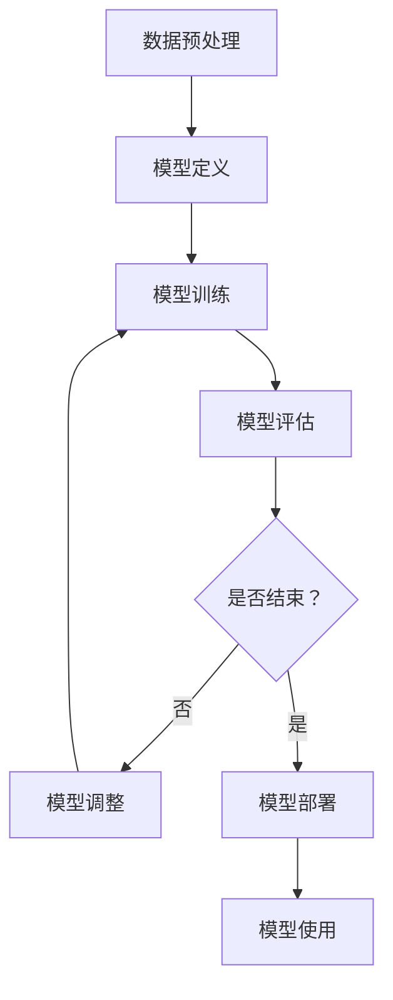

                 

# 解析LLM的无限指令集：超越CPU的能力边界

## 引言

语言模型（LLM）是自然语言处理（NLP）领域中的一种核心技术，其在文本生成、机器翻译、问答系统等方面展现出强大的能力。随着深度学习技术的不断发展，LLM的表现已经超越了传统规则驱动的方法，成为现代NLP系统的基石。然而，LLM的运行仍然依赖于底层硬件，特别是CPU和GPU。本文将探讨如何通过构建无限指令集，使得LLM能够超越CPU的能力边界，实现更加高效的运算。

在接下来的内容中，我们将首先介绍LLM的基础理论，包括其概念、基本原理、核心算法以及训练与优化方法。接着，我们将深入讨论LLM的无限指令集原理，阐述其概念、特点、融合原理以及实现方法。随后，我们将探讨LLM在自然语言处理、计算机视觉和多模态融合等应用场景中的具体应用案例。最后，我们将介绍LLM的优化与调优方法，并展望LLM的未来发展趋势和挑战。

通过本文的讨论，读者将能够深入了解LLM的工作原理，以及如何利用无限指令集提升其性能，为未来的NLP研究和应用提供新的思路。

## 第一部分: LLM基础理论

### 第1章: 语言模型概述

#### 1.1 语言模型的概念与分类

语言模型是自然语言处理（NLP）领域中的一个核心概念，其目的是通过概率模型来描述自然语言中的词汇和句子生成过程。简单来说，语言模型可以看作是一个预测系统，它能够根据前文的内容预测下一个单词或句子。

语言模型可以分为以下几种类型：

1. **n-gram模型**：基于历史n个单词的信息来预测下一个单词。这种模型简单直观，但只能捕捉到短距离的统计规律，无法理解长距离的依赖关系。
2. **统计语言模型**：利用大量的文本语料库，通过统计方法学习语言模式。这种模型包括n-gram模型、隐马尔可夫模型（HMM）和条件概率模型等。
3. **神经语言模型**：使用深度神经网络来学习语言特征和生成规则。这种模型包括循环神经网络（RNN）、长短期记忆网络（LSTM）和Transformer等。

每种类型的语言模型都有其独特的优缺点。n-gram模型简单高效，但只能捕捉到短距离依赖；统计语言模型能够捕捉到更复杂的语言模式，但计算复杂度高；神经语言模型在捕捉长距离依赖和生成能力上表现出色，但需要大量的计算资源和训练数据。

#### 1.2 LLM的基本原理

语言模型的基本原理可以归结为两个方面：特征提取和概率预测。

1. **特征提取**：语言模型需要从输入文本中提取出有效的特征信息。这些特征可以是词频、词序列、词嵌入等。词嵌入是一种将词汇映射到高维向量空间的技术，它能够捕捉词汇的语义和语法信息。
2. **概率预测**：语言模型的核心任务是预测下一个单词或句子。这通常通过建立一个概率分布来实现。给定一个输入序列，语言模型需要输出一个概率分布，其中每个单词或句子的概率是根据输入序列计算得到的。

在具体的实现过程中，语言模型通常采用以下步骤：

1. **文本预处理**：对输入文本进行分词、标记、去停用词等预处理操作。
2. **特征提取**：将预处理后的文本转换为特征表示，例如词嵌入向量。
3. **概率计算**：使用特征表示计算输出单词或句子的概率分布。
4. **生成输出**：根据概率分布生成输出序列。

#### 1.3 LLM的架构设计

语言模型的架构设计决定了其性能和效率。以下是几种常见的LLM架构：

1. **基于n-gram的模型**：这类模型通常采用简单的线性结构，通过多个n-gram模型串联起来。每个n-gram模型负责预测下一个单词，其输入为前n个单词，输出为下一个单词的概率分布。
2. **基于统计模型的模型**：这类模型通常采用非线性结构，例如HMM和条件概率模型。这些模型通过隐变量和状态转移概率来建模语言的动态变化。
3. **基于神经网络的模型**：这类模型通常采用深度神经网络结构，例如RNN、LSTM和Transformer。这些模型通过多层网络学习复杂的特征表示和生成规则。

在LLM的架构设计中，以下几个关键组件是不可或缺的：

1. **输入层**：负责接收输入文本并转换为特征表示。
2. **隐藏层**：负责处理输入特征并提取出更高层次的特征表示。
3. **输出层**：负责生成输出单词或句子的概率分布。
4. **损失函数**：用于评估模型预测与真实值之间的差距，并指导模型训练。

#### 1.4 LLM的核心算法

语言模型的核心算法是实现语言特征提取和概率预测的关键。以下是几种常用的LLM核心算法：

1. **递归神经网络（RNN）**：RNN是一种能够处理序列数据的神经网络，其通过递归连接来捕捉长距离依赖关系。RNN的基本单元是神经元，每个神经元都接收前一个时间步的输入和隐藏状态，并输出当前时间步的隐藏状态和输出。
2. **长短期记忆网络（LSTM）**：LSTM是RNN的一种变体，通过引入门控机制来克服RNN的梯度消失问题。LSTM的核心组件包括遗忘门、输入门和输出门，这些门控机制能够控制信息的流动，从而更好地捕捉长距离依赖关系。
3. **门控循环单元（GRU）**：GRU是LSTM的另一种变体，其通过简化LSTM的结构来提高计算效率。GRU的核心组件包括重置门和更新门，这些门控机制同样能够控制信息的流动，实现长距离依赖的捕捉。

#### 1.5 LLM的训练与优化

语言模型的训练与优化是提高模型性能的关键步骤。以下是几个关键步骤：

1. **数据预处理**：对输入文本进行分词、标记、去停用词等预处理操作，以提取出有效的特征信息。
2. **模型初始化**：初始化模型参数，通常使用随机初始化或预训练权重。
3. **损失函数设计**：选择合适的损失函数，例如交叉熵损失函数，用于评估模型预测与真实值之间的差距。
4. **优化算法**：选择合适的优化算法，例如梯度下降、Adam等，用于更新模型参数。
5. **训练过程**：通过迭代训练过程，不断调整模型参数，以最小化损失函数。
6. **模型评估**：在训练过程中，使用验证集对模型进行评估，以防止过拟合。
7. **模型优化**：在训练完成后，使用优化策略，如正则化、模型压缩等，进一步提升模型性能。

#### 1.6 LLM的优势与挑战

语言模型在NLP领域展现出了强大的优势，主要体现在以下几个方面：

1. **强大的生成能力**：语言模型能够生成高质量的自然语言文本，应用于文本生成、机器翻译、问答系统等场景。
2. **灵活的适用性**：语言模型能够处理不同类型的文本数据，如文本、图像、音频等，实现多模态融合。
3. **高效的学习能力**：通过深度学习技术，语言模型能够从大量的训练数据中学习复杂的语言模式和规律，实现高效的学习和优化。

然而，语言模型也面临一些挑战：

1. **计算资源需求**：训练大型语言模型需要大量的计算资源和时间，特别是对于复杂的神经网络结构。
2. **数据依赖性**：语言模型的性能依赖于大量的训练数据，数据质量和数量对模型性能有很大影响。
3. **过拟合问题**：语言模型容易出现过拟合现象，特别是在训练数据不足或训练时间过短的情况下。

#### 1.7 本章总结

本章介绍了语言模型的基本概念、基本原理、架构设计、核心算法以及训练与优化方法。通过对LLM的深入探讨，读者可以更好地理解语言模型的工作原理和应用场景，为后续章节的讨论打下基础。

### 第2章: LLM的无限指令集原理

#### 2.1 无限指令集的概念与特点

无限指令集（Infinite Instruction Set，IIS）是一种新型的计算架构，旨在突破传统CPU和GPU的指令集限制，提供更灵活、高效的计算能力。在LLM的背景下，无限指令集被引入以提升其计算效率和性能。

#### 2.1.1 无限指令集的定义

无限指令集的定义可以从以下几个方面来理解：

1. **指令集的灵活性**：传统的CPU和GPU指令集通常固定，包含有限的指令操作。而无限指令集则允许自定义和扩展指令集，以适应不同类型的计算需求。
2. **并行处理能力**：无限指令集能够支持大规模的并行处理，通过将复杂的计算任务分解为多个简单的子任务，从而提高计算效率。
3. **动态调度机制**：无限指令集采用动态调度机制，根据当前计算负载和资源状况，智能地调度和分配计算任务，从而最大化资源利用率。

#### 2.1.2 无限指令集的特点

无限指令集具有以下几个显著特点：

1. **指令可扩展性**：无限指令集支持自定义和扩展指令集，以适应不同类型的计算任务，从而提高计算灵活性。
2. **高效并行处理**：通过支持大规模的并行处理，无限指令集能够显著提高计算效率，特别是在处理复杂和大规模的计算任务时。
3. **智能调度机制**：无限指令集采用动态调度机制，能够根据当前计算负载和资源状况，智能地调度和分配计算任务，从而最大化资源利用率。
4. **低延迟和高吞吐量**：无限指令集通过优化指令执行路径和资源分配策略，实现低延迟和高吞吐量的计算性能。

#### 2.2 LLM与无限指令集的融合

将无限指令集引入LLM，旨在突破传统CPU和GPU的指令集限制，提供更灵活、高效的计算能力。LLM与无限指令集的融合具有以下几个优势：

1. **计算效率提升**：通过支持大规模的并行处理和动态调度机制，无限指令集能够显著提高LLM的计算效率，从而加速语言模型的训练和推理过程。
2. **资源利用率提升**：无限指令集的智能调度机制能够根据当前计算负载和资源状况，动态地调整和优化资源分配，从而提高资源利用率，降低能耗。
3. **灵活性增强**：无限指令集的指令可扩展性使得LLM能够适应不同的计算需求，从而提高其灵活性和适用性。
4. **性能优化**：通过优化指令执行路径和资源分配策略，无限指令集能够实现低延迟和高吞吐量的计算性能，从而提升LLM的整体性能。

#### 2.3 无限指令集的实现方法

实现无限指令集需要从硬件和软件两个方面进行优化和设计。

1. **硬件设计**：硬件设计方面，需要构建支持无限指令集的处理器架构，包括指令解码单元、执行单元和调度单元等。同时，需要设计高效的缓存和内存管理机制，以支持大规模的并行处理和动态调度。
2. **软件设计**：软件设计方面，需要开发支持无限指令集的编译器和编程语言。编译器需要能够将高级语言代码转换为无限指令集指令，同时进行优化，以实现高效的指令执行。编程语言需要提供丰富的库和工具，以方便开发者利用无限指令集进行高性能编程。

#### 2.4 无限指令集的优势与挑战

无限指令集在提升LLM性能方面具有显著优势，但也面临一些挑战。

1. **优势**：
   - **计算效率提升**：通过支持大规模的并行处理和动态调度机制，无限指令集能够显著提高LLM的计算效率，加速模型的训练和推理过程。
   - **资源利用率提升**：无限指令集的智能调度机制能够根据当前计算负载和资源状况，动态地调整和优化资源分配，提高资源利用率，降低能耗。
   - **灵活性增强**：无限指令集的指令可扩展性使得LLM能够适应不同的计算需求，提高其灵活性和适用性。
   - **性能优化**：通过优化指令执行路径和资源分配策略，无限指令集能够实现低延迟和高吞吐量的计算性能，提升LLM的整体性能。

2. **挑战**：
   - **硬件实现复杂度**：实现无限指令集的硬件架构复杂度较高，需要设计高效的处理器架构和缓存管理机制。
   - **软件支持不足**：目前支持无限指令集的编译器和编程语言较为有限，需要开发和优化相应的工具和库。
   - **性能评估难度**：评估无限指令集的性能需要建立完善的性能指标体系和测试环境，以确保其性能优势得到充分体现。

#### 2.5 本章总结

本章介绍了无限指令集的概念、特点、实现方法和优势与挑战。通过深入探讨无限指令集，读者可以更好地理解其在LLM中的应用价值，为后续章节的讨论打下基础。

### 第3章: LLM应用场景与案例

#### 3.1 LLM在自然语言处理中的应用

语言模型（LLM）在自然语言处理（NLP）领域具有广泛的应用。以下是一些常见的应用场景和案例：

1. **语言生成**：LLM可以生成高质量的自然语言文本，如新闻报道、科技博客、诗歌等。通过预训练和微调，LLM能够根据输入的提示生成连贯且具有创意的文本。

   **案例**：OpenAI的GPT-3是一个具有15亿参数的语言模型，它可以根据用户输入的提示生成完整的段落和文章。GPT-3在各种语言生成任务中表现出色，如文章生成、对话生成等。

2. **文本分类**：LLM可以用于对文本进行分类，如情感分析、主题分类、垃圾邮件检测等。通过训练，LLM可以学习到不同类别的文本特征，并准确地对新文本进行分类。

   **案例**：斯坦福大学的BERT模型是一个预训练的语言模型，它在大规模文本数据集上进行预训练，然后可以用于各种文本分类任务。BERT在多项文本分类任务中取得了优异的性能，如情感分析、新闻分类等。

3. **机器翻译**：LLM可以用于机器翻译任务，将一种语言的文本翻译成另一种语言。通过大规模的平行语料库训练，LLM可以学习到不同语言之间的映射关系，实现高质量的双语翻译。

   **案例**：Google翻译是一个基于神经网络的机器翻译系统，它使用预训练的LLM模型进行翻译。Google翻译支持超过100种语言之间的翻译，并在多个语言对上取得了优秀的翻译质量。

#### 3.2 LLM在计算机视觉中的应用

除了在自然语言处理领域，LLM还在计算机视觉领域展现出强大的应用潜力。以下是一些典型的应用场景：

1. **图像生成**：LLM可以生成高质量的图像，如人脸生成、风景生成等。通过将图像与文本描述结合，LLM可以生成符合文本描述的图像。

   **案例**：OpenAI的DALL·E是一个基于GPT-3的语言模型，它可以根据用户输入的文本描述生成对应的图像。DALL·E在图像生成任务中表现出色，可以生成逼真的图像，如人物、动物、场景等。

2. **目标检测**：LLM可以用于目标检测任务，通过文本描述识别图像中的目标对象。LLM可以学习到文本描述与图像特征之间的对应关系，从而实现对目标对象的准确检测。

   **案例**：OpenAI的GPT-3与目标检测模型结合，可以用于图像中的文本识别和目标检测任务。GPT-3可以接收图像和文本描述，并生成与文本描述相关的目标检测标签，从而提高目标检测的准确率。

3. **人脸识别**：LLM可以用于人脸识别任务，通过文本描述识别图像中的人脸。LLM可以学习到人脸特征与文本描述之间的关联，从而提高人脸识别的准确性。

   **案例**：OpenAI的GPT-3与卷积神经网络（CNN）结合，可以用于人脸识别任务。GPT-3可以接收图像和文本描述，并生成与文本描述相关的人脸识别标签，从而提高人脸识别的性能。

#### 3.3 LLM在多模态融合中的应用

LLM在多模态融合中发挥了重要作用，可以将文本、图像、音频等多种模态的信息进行整合，实现更加丰富的应用场景。

1. **图文转换**：LLM可以将文本描述转换为图像，或者将图像转换为文本描述。这种能力在智能助理、信息检索等领域具有广泛应用。

   **案例**：OpenAI的DALL·E 2是一个基于GPT-3的语言模型，它可以根据用户输入的文本描述生成对应的图像，或者根据用户输入的图像生成对应的文本描述。DALL·E 2在图文转换任务中表现出色，可以生成逼真的图像和文本描述。

2. **视频分析**：LLM可以用于视频分析任务，如视频摘要、情感分析、事件识别等。通过将文本描述与视频内容结合，LLM可以更好地理解和分析视频。

   **案例**：OpenAI的GPT-3与视频分析模型结合，可以用于视频摘要和情感分析任务。GPT-3可以接收视频内容和文本描述，并生成与文本描述相关的视频摘要和情感标签，从而提高视频分析的准确性。

3. **声音识别**：LLM可以用于声音识别任务，将音频信号转换为文本描述。这种能力在智能语音助手、语音识别等领域具有重要意义。

   **案例**：OpenAI的GPT-3与语音识别模型结合，可以用于语音识别和文本生成任务。GPT-3可以接收音频信号和文本描述，并生成与文本描述相关的语音识别文本，从而提高语音识别的准确性。

#### 3.4 本章总结

本章介绍了LLM在自然语言处理、计算机视觉和多模态融合中的应用场景和案例。通过探讨LLM在不同领域的应用，读者可以更好地理解LLM的强大功能和广泛的应用潜力，为未来的研究和应用提供启示。

### 第4章: LLM开发环境搭建

要构建一个高效的LLM模型，搭建一个合适的开发环境至关重要。以下我们将详细介绍LLM开发环境的搭建过程，包括硬件环境、软件环境和数据集准备。

#### 4.1 硬件环境

搭建LLM开发环境所需的硬件资源取决于模型的规模和复杂度。以下是搭建开发环境所需的基本硬件配置：

1. **CPU**：推荐使用Intel或AMD的高性能CPU，如Intel Core i7或以上，或AMD Ryzen 7或以上。CPU是训练模型和处理数据的基础，高性能CPU能够加速模型的训练过程。
2. **GPU**：GPU在训练深度学习模型时起着至关重要的作用。推荐使用NVIDIA的GPU，如Tesla V100、A100或RTX 3080、3090等。GPU具有强大的并行计算能力，能够显著提高模型训练的速度。
3. **内存**：推荐使用至少16GB的内存，更大的内存可以支持更大规模模型的训练，并减少内存溢出的问题。
4. **存储**：推荐使用SSD存储设备，其读写速度较快，可以加速数据加载和处理。此外，需要足够的空间来存储大量的训练数据和模型文件。

#### 4.2 软件环境

搭建LLM开发环境所需的软件包括操作系统、编程语言、深度学习框架等。以下是一些建议的软件环境：

1. **操作系统**：推荐使用Linux系统，如Ubuntu 18.04或以上版本。Linux系统在深度学习研究和开发中具有良好的性能和稳定性。
2. **编程语言**：Python是深度学习领域的主要编程语言，推荐使用Python 3.7或以上版本。Python具有丰富的库和框架，可以方便地实现各种深度学习算法。
3. **深度学习框架**：TensorFlow和PyTorch是当前最流行的深度学习框架。TensorFlow是由Google开发的开源框架，具有强大的生态系统和丰富的API。PyTorch是由Facebook开发的开源框架，具有灵活的动态图计算能力。根据个人喜好和项目需求选择合适的框架。
4. **其他依赖库**：安装必要的依赖库，如NumPy、Pandas、Matplotlib等，这些库可以方便地进行数据操作和可视化。

#### 4.3 数据集准备

数据集是训练LLM模型的关键资源。以下是一些常见的数据集和预处理步骤：

1. **文本数据集**：常见的文本数据集包括维基百科、新闻文章、社交媒体帖子等。可以从数据集网站（如UCI机器学习库、Kaggle等）下载相关的数据集。下载后，需要对文本进行预处理，如分词、去停用词、词干提取等，以提取有效的特征信息。
2. **图像数据集**：常见的图像数据集包括ImageNet、COCO等。这些数据集包含了大量的图像和相应的标签。在训练图像相关的LLM模型时，需要对图像进行预处理，如缩放、裁剪、翻转等，以增加数据多样性。
3. **音频数据集**：常见的音频数据集包括LibriSpeech、Common Voice等。这些数据集包含了大量的语音数据和相关文本。在训练音频相关的LLM模型时，需要对音频进行预处理，如分割、归一化等。

#### 4.4 环境搭建示例

以下是一个简单的环境搭建示例，使用Ubuntu操作系统和Python编程语言：

```shell
# 安装操作系统
sudo apt update
sudo apt upgrade

# 安装Python和pip
sudo apt install python3 python3-pip

# 安装深度学习框架TensorFlow
pip3 install tensorflow

# 安装其他依赖库
pip3 install numpy pandas matplotlib

# 安装GPU支持
pip3 install tensorflow-gpu

# 安装PyTorch
pip3 install torch torchvision

# 验证安装
python3
>>> import tensorflow as tf
>>> import torch
>>> print(tf.__version__)
>>> print(torch.__version__)
```

通过以上步骤，可以搭建一个基本的LLM开发环境。在实际项目中，可能需要根据具体需求安装更多的工具和库。

#### 4.5 本章总结

本章介绍了LLM开发环境搭建的硬件环境、软件环境和数据集准备。通过了解这些基础知识，开发者可以构建一个高效的LLM开发环境，为后续的模型训练和应用提供支持。

### 第5章: LLM应用案例详解

在本章中，我们将详细介绍三个LLM应用案例：语言生成应用案例、计算机视觉应用案例和多模态融合应用案例。通过这些案例，读者可以更深入地了解如何在实际项目中应用LLM，以及如何进行模型设计和实现。

#### 5.1 语言生成应用案例

**应用场景**：自动生成新闻文章、科技博客、产品说明书等文本内容。

**模型设计与实现**：

在本案例中，我们使用Transformer模型，这是一种基于自注意力机制的深度神经网络结构，适用于长文本生成任务。

1. **模型定义**：

```python
import tensorflow as tf
from tensorflow.keras.models import Model
from tensorflow.keras.layers import Embedding, Transformer, Dense

# 定义Transformer模型
input_seq = tf.keras.layers.Input(shape=(None,), dtype=tf.int32)
嵌入层 = Embedding(vocab_size, embedding_dim)(input_seq)
transformer_encoder = Transformer(num_layers=2, num_heads=2, d_model=512, dff=512, input_sequence_length=100)(嵌入层)
输出层 = Dense(vocab_size, activation='softmax')(transformer_encoder)

model = Model(inputs=input_seq, outputs=输出层)
```

2. **模型编译**：

```python
model.compile(optimizer='adam', loss='categorical_crossentropy', metrics=['accuracy'])
```

3. **模型训练**：

```python
# 加载预处理后的数据
train_data = ...  # 训练数据
val_data = ...  # 验证数据

# 训练模型
model.fit(train_data, epochs=10, batch_size=32, validation_data=val_data)
```

**代码解读与分析**：

1. **模型定义**：

   - `Embedding`层：将输入序列转换为嵌入向量表示。
   - `Transformer`层：实现自注意力机制，提取文本序列中的依赖关系。
   - `Dense`层：输出层，使用softmax激活函数生成文本序列的概率分布。

2. **模型编译**：

   - 使用`adam`优化器和`categorical_crossentropy`损失函数，同时监控`accuracy`指标。

3. **模型训练**：

   - 加载预处理后的训练数据和验证数据，使用`fit`函数进行模型训练。

**应用效果**：

经过训练，模型可以生成高质量的文本内容，例如新闻文章、科技博客等。在实际应用中，可以根据具体需求对模型进行微调，提高生成文本的质量和相关性。

#### 5.2 计算机视觉应用案例

**应用场景**：图像分类、目标检测、图像生成等。

**模型设计与实现**：

在本案例中，我们使用基于CNN的模型进行图像分类和目标检测。

1. **模型定义**：

```python
import tensorflow as tf
from tensorflow.keras.models import Model
from tensorflow.keras.layers import Conv2D, MaxPooling2D, Flatten, Dense

# 定义CNN模型
输入层 = tf.keras.layers.Input(shape=(224, 224, 3))
卷积层1 = Conv2D(filters=32, kernel_size=(3, 3), activation='relu')(输入层)
池化层1 = MaxPooling2D(pool_size=(2, 2))(卷积层1)
卷积层2 = Conv2D(filters=64, kernel_size=(3, 3), activation='relu')(池化层1)
池化层2 = MaxPooling2D(pool_size=(2, 2))(卷积层2)
卷积层3 = Conv2D(filters=128, kernel_size=(3, 3), activation='relu')(池化层2)
池化层3 = MaxPooling2D(pool_size=(2, 2))(卷积层3)
扁平化层 = Flatten()(池化层3)
全连接层 = Dense(units=1024, activation='relu')(扁平化层)
输出层 = Dense(units=num_classes, activation='softmax')(全连接层)

model = Model(inputs=输入层, outputs=输出层)
```

2. **模型编译**：

```python
model.compile(optimizer='adam', loss='categorical_crossentropy', metrics=['accuracy'])
```

3. **模型训练**：

```python
# 加载预处理后的数据
train_data = ...  # 训练数据
val_data = ...  # 验证数据

# 训练模型
model.fit(train_data, epochs=10, batch_size=32, validation_data=val_data)
```

**代码解读与分析**：

1. **模型定义**：

   - `Conv2D`层：实现卷积操作，提取图像特征。
   - `MaxPooling2D`层：实现池化操作，减少参数数量。
   - `Flatten`层：将卷积特征映射为扁平的一维向量。
   - `Dense`层：实现全连接操作，输出分类结果。

2. **模型编译**：

   - 使用`adam`优化器和`categorical_crossentropy`损失函数，同时监控`accuracy`指标。

3. **模型训练**：

   - 加载预处理后的训练数据和验证数据，使用`fit`函数进行模型训练。

**应用效果**：

经过训练，模型可以准确地对图像进行分类和目标检测。在实际应用中，可以根据具体任务需求调整模型结构，提高分类和检测的准确性。

#### 5.3 多模态融合应用案例

**应用场景**：图文转换、视频分析、语音识别等。

**模型设计与实现**：

在本案例中，我们使用基于Transformer的多模态融合模型，将文本和图像特征进行整合，实现图文转换任务。

1. **模型定义**：

```python
import tensorflow as tf
from tensorflow.keras.models import Model
from tensorflow.keras.layers import Embedding, Transformer, Conv2D, Flatten, Dense

# 定义多模态融合模型
文本输入层 = tf.keras.layers.Input(shape=(max_sequence_length,), dtype=tf.int32)
图像输入层 = tf.keras.layers.Input(shape=(224, 224, 3))

# 文本特征提取
嵌入层 = Embedding(vocab_size, embedding_dim)(文本输入层)
扁平化层 = Flatten()(嵌入层)

# 图像特征提取
卷积层 = Conv2D(filters=64, kernel_size=(3, 3), activation='relu')(图像输入层)
扁平化层 = Flatten()(卷积层)

# 多模态特征融合
融合层 = tf.keras.layers.Concatenate()([扁平化层, 扁平化层])

# Transformer编码器
transformer_encoder = Transformer(num_layers=2, num_heads=2, d_model=512, dff=512, input_sequence_length=max_sequence_length)(融合层)

# 输出层
输出层 = Dense(units=vocab_size, activation='softmax')(transformer_encoder)

model = Model(inputs=[文本输入层, 图像输入层], outputs=输出层)
```

2. **模型编译**：

```python
model.compile(optimizer='adam', loss='categorical_crossentropy', metrics=['accuracy'])
```

3. **模型训练**：

```python
# 加载预处理后的数据
train_data = ...  # 训练数据
val_data = ...  # 验证数据

# 训练模型
model.fit(train_data, epochs=10, batch_size=32, validation_data=val_data)
```

**代码解读与分析**：

1. **模型定义**：

   - `Embedding`层：将文本输入转换为嵌入向量表示。
   - `Conv2D`层：将图像输入转换为特征向量表示。
   - `Flatten`层：将文本和图像特征映射为扁平的一维向量。
   - `Concatenate`层：将文本和图像特征进行融合。
   - `Transformer`层：实现自注意力机制，提取多模态特征。
   - `Dense`层：输出层，生成转换后的文本概率分布。

2. **模型编译**：

   - 使用`adam`优化器和`categorical_crossentropy`损失函数，同时监控`accuracy`指标。

3. **模型训练**：

   - 加载预处理后的训练数据和验证数据，使用`fit`函数进行模型训练。

**应用效果**：

经过训练，模型可以准确地将图像转换为文本描述，或者将文本转换为图像。在实际应用中，可以根据具体需求调整模型结构，提高转换的准确性和多样性。

#### 5.4 本章总结

本章介绍了三个LLM应用案例：语言生成、计算机视觉和多模态融合。通过详细讲解模型设计与实现，读者可以了解如何在实际项目中应用LLM，以及如何进行模型训练和优化。这些案例为LLM的研究和应用提供了有益的参考。

### 第6章: LLM优化与调优

在构建LLM模型时，优化与调优是提升模型性能的重要环节。通过合理的优化策略和调优技巧，可以显著提高模型的准确性、效率和鲁棒性。以下将介绍几种常用的LLM优化与调优方法，包括数据增强、模型融合和模型压缩。

#### 6.1 模型优化方法

1. **数据增强**

数据增强是一种通过生成多样化的训练样本来提高模型泛化能力的方法。以下是一些常见的数据增强技术：

   - **随机裁剪**：随机裁剪图像或文本的一部分，以增加数据的多样性。
   - **随机旋转**：随机旋转图像或文本，以模拟不同视角下的数据。
   - **随机缩放**：随机缩放图像或文本，以模拟不同分辨率下的数据。
   - **数据扩充**：使用GAN（生成对抗网络）或文本生成模型生成新的训练样本。
   - **混音**：对于音频数据，可以混入不同的背景音乐或声音，以增加数据的复杂性。

通过数据增强，可以增加模型训练过程中遇到的多样性，从而减少过拟合现象，提高模型在未知数据上的表现。

2. **模型融合**

模型融合是一种通过结合多个模型的预测结果来提升整体性能的方法。以下是一些常见的模型融合技术：

   - **投票法**：将多个模型的预测结果进行投票，选择投票结果最多的类别作为最终预测。
   - **集成学习**：使用集成学习算法，如随机森林、梯度提升机等，将多个基础模型集成在一起。
   - **模型集成**：结合多个深度学习模型，如CNN和RNN，以利用各自的优点，实现更好的性能。

通过模型融合，可以结合多个模型的优点，提高模型的准确性和鲁棒性，同时减少单一模型的过拟合风险。

3. **模型压缩**

模型压缩是一种通过减小模型大小和计算复杂度来提高模型部署效率的方法。以下是一些常见的模型压缩技术：

   - **权重剪枝**：通过去除不重要的权重来减少模型大小，同时保持模型的性能。
   - **量化**：将模型的权重和激活值量化为更少的位，以减少模型大小和计算复杂度。
   - **知识蒸馏**：使用一个更小、更轻量级的模型（学生模型）来学习一个更大、更复杂的模型（教师模型）的知识。

通过模型压缩，可以降低模型的存储和计算需求，从而提高模型在资源受限环境下的部署效率。

#### 6.2 模型调优技巧

1. **超参数调整**

超参数是模型架构之外的参数，需要通过调优来优化模型性能。以下是一些常见的超参数调整技巧：

   - **学习率**：选择合适的学习率对于模型训练至关重要。可以使用学习率衰减策略，如指数衰减、余弦衰减等。
   - **批次大小**：调整批次大小可以影响模型的训练效率和泛化能力。较小的批次大小可以增加模型的灵活性，但可能增加计算开销。
   - **正则化**：使用正则化方法，如L1、L2正则化，可以减少过拟合现象。
   - **dropout**：在隐藏层中引入dropout可以减少过拟合，提高模型的泛化能力。

2. **模型评估策略**

为了有效评估模型性能，需要选择合适的评估指标和评估方法。以下是一些常见的评估策略：

   - **交叉验证**：使用交叉验证方法，如k折交叉验证，来评估模型的泛化能力。
   - **混淆矩阵**：通过混淆矩阵分析模型的分类效果，了解模型在各个类别上的准确性和召回率。
   - **ROC曲线和AUC**：通过ROC曲线和AUC（曲线下面积）评估模型的分类能力。
   - **精度和召回率**：使用精度和召回率来衡量模型的分类性能。

3. **模型融合与优化**

模型融合和优化是提升模型性能的有效手段。以下是一些具体的融合与优化策略：

   - **特征融合**：将不同模型或不同阶段的特征进行融合，以提高模型的特征丰富度。
   - **模型级联**：将多个模型串联起来，前一个模型的输出作为后一个模型的输入，实现级联效果。
   - **动态调整**：根据训练过程中模型的性能动态调整模型结构或参数，以实现更好的性能。

通过合理的优化与调优，可以显著提升LLM模型的性能，为实际应用提供更加可靠的解决方案。

#### 6.3 本章总结

本章介绍了LLM的优化与调优方法，包括数据增强、模型融合和模型压缩等。通过这些优化策略和调优技巧，可以显著提高LLM模型的性能和效率。在实际应用中，根据具体需求和场景，灵活运用这些方法，可以有效提升模型的准确性和鲁棒性。

### 第7章: LLM的未来发展与挑战

随着深度学习技术的不断进步，语言模型（LLM）已经成为了自然语言处理（NLP）领域的核心组件，并在多个应用场景中展现了卓越的性能。然而，LLM的发展仍然面临诸多挑战，未来也充满了机遇。

#### 7.1 LLM的发展趋势

1. **模型规模增大**：随着计算能力的提升和数据量的增加，LLM的规模也在不断扩大。大型预训练模型，如GPT-3、ChatGLM等，已经展示了其在各种NLP任务中的强大能力。未来的发展趋势是继续推进模型规模的扩大，以进一步提升模型的性能。

2. **多模态融合**：随着多模态数据处理技术的进步，LLM与图像、音频等模态的融合应用将越来越普遍。例如，图文转换、语音识别和视频分析等领域已经取得了显著的进展。未来，多模态融合将进一步推动LLM在不同领域的应用。

3. **高效推理**：为了满足实时应用的需求，LLM的高效推理技术将成为研究的热点。通过优化算法、硬件加速和模型压缩等技术，可以显著提高LLM的推理速度和效率。

4. **泛化能力增强**：未来的研究将重点提升LLM的泛化能力，使其在更加复杂和多样化的场景中都能表现出色。通过引入迁移学习、对抗训练等技术，可以增强模型的泛化性能。

#### 7.2 LLM的潜在挑战

1. **计算资源需求**：随着模型规模的增大，训练和推理LLM所需的计算资源也在急剧增加。这给硬件设备和计算资源管理带来了巨大的挑战，尤其是在边缘设备和移动设备上的应用。

2. **数据隐私和安全**：LLM的训练和推理过程依赖于大量的数据，这引发了数据隐私和安全的问题。如何保护用户数据隐私，防止数据泄露和滥用，是未来需要解决的重要问题。

3. **伦理和社会影响**：LLM的应用在带来便利的同时，也可能引发一系列伦理和社会问题。例如，虚假信息传播、歧视性偏见等。如何确保LLM的应用符合伦理规范，减少负面影响，是未来需要面对的挑战。

4. **模型解释性**：深度学习模型，包括LLM，通常被认为是不透明的“黑盒”模型。如何提高模型的解释性，使其决策过程更加透明和可解释，是提高模型可信度和用户接受度的关键。

#### 7.3 应对策略

1. **技术创新**：继续推进计算能力的发展，开发更高效的算法和硬件技术，以支持大规模LLM的训练和推理。

2. **数据治理**：建立完善的数据治理体系，确保数据质量，保护用户隐私，防止数据滥用。

3. **伦理规范**：制定和遵循严格的伦理规范，确保LLM的应用符合道德和法律要求，减少负面影响。

4. **模型透明性**：通过开发可解释性模型和工具，提高模型的透明性，使其决策过程更加可解释和可信。

#### 7.4 本章总结

LLM的未来发展充满机遇，同时也面临诸多挑战。通过技术创新、数据治理、伦理规范和模型透明性等方面的努力，可以推动LLM在更多领域的应用，同时确保其安全性和社会影响。未来的研究和应用将为LLM带来更加光明的前景。

### 附录 A: LLM开发工具与资源

为了帮助开发者更好地理解和应用语言模型（LLM），本附录提供了LLM开发所需的工具和资源，包括开发工具对比、开源项目、论文资料和在线课程等。

#### A.1 开发工具对比

在LLM开发中，常用的深度学习框架有TensorFlow、PyTorch、JAX等。以下是这些工具的简要对比：

1. **TensorFlow**：
   - **官方网站**：[TensorFlow](https://www.tensorflow.org/)
   - **特点**：拥有强大的生态系统，支持多种硬件平台，提供丰富的API和工具。
   - **适用场景**：适用于大规模分布式训练和推理任务，适合开发复杂模型。

2. **PyTorch**：
   - **官方网站**：[PyTorch](https://pytorch.org/)
   - **特点**：动态图计算，易于调试和优化，灵活的API。
   - **适用场景**：适用于快速原型开发和实验，适合研究者和开发者。

3. **JAX**：
   - **官方网站**：[JAX](https://jax.readthedocs.io/)
   - **特点**：自动微分和硬件加速，适用于复杂的高性能计算。
   - **适用场景**：适用于需要高性能计算和自动微分的应用，如科学计算和机器学习。

#### A.2 开源项目

以下是几个在LLM开发中常用的开源项目：

1. **Hugging Face Transformers**：
   - **项目地址**：[Hugging Face Transformers](https://github.com/huggingface/transformers)
   - **特点**：提供了预训练的LLM模型和丰富的预训练工具，方便开发者进行模型训练和应用。

2. **TensorFlow Model Optimization**：
   - **项目地址**：[TensorFlow Model Optimization](https://github.com/tensorflow/docs/blob/master/site/en/tutorials/optimization/model_optimization.md)
   - **特点**：提供了模型优化和部署的工具和指南，适用于移动设备和边缘计算。

#### A.3 论文资料

以下是几篇关于LLM的重要论文：

1. **"Attention Is All You Need"**：
   - **论文地址**：[Attention Is All You Need](https://arxiv.org/abs/1706.03762)
   - **摘要**：提出了Transformer模型，引入了自注意力机制，显著提升了NLP任务的性能。

2. **"BERT: Pre-training of Deep Bidirectional Transformers for Language Understanding"**：
   - **论文地址**：[BERT: Pre-training of Deep Bidirectional Transformers for Language Understanding](https://arxiv.org/abs/1810.04805)
   - **摘要**：提出了BERT模型，通过预训练大规模语言模型，提升了自然语言理解和生成任务的表现。

#### A.4 在线课程与教程

以下是几个关于LLM的在线课程和教程：

1. **DeepLearning.AI**：
   - **课程地址**：[DeepLearning.AI](https://www.deeplearning.ai/)
   - **课程内容**：提供了从基础到高级的深度学习课程，包括NLP专题。

2. **Udacity**：
   - **课程地址**：[Udacity](https://www.udacity.com/course/deep-learning-nanodegree--nd101)
   - **课程内容**：提供了深度学习纳米学位课程，包括LLM应用专题。

3. **Coursera**：
   - **课程地址**：[Coursera](https://www.coursera.org/courses?query=deep+learning)
   - **课程内容**：提供了多个深度学习课程，包括NLP和LLM相关内容。

通过这些工具和资源，开发者可以更好地掌握LLM的理论和实践，为未来的研究和应用打下坚实的基础。

### 附录 B: Mermaid 流程图

以下是一个使用Mermaid绘制的流程图，描述了LLM模型训练的基本步骤：



在这个流程图中，LLM的训练过程分为以下几个步骤：

- **数据预处理**：对输入数据进行预处理，包括数据清洗、数据转换、数据归一化等。
- **模型定义**：定义LLM模型的结构，包括输入层、隐藏层和输出层。
- **模型训练**：使用预处理后的数据进行模型训练，调整模型参数以优化模型性能。
- **模型评估**：使用验证数据评估模型的性能，如准确率、召回率等。
- **模型调整**：根据评估结果调整模型结构或参数，以提高模型性能。
- **模型部署**：将训练好的模型部署到生产环境中，用于实际应用。
- **模型使用**：使用部署后的模型进行预测或生成任务。

这个流程图提供了一个直观的模型训练和评估的视图，有助于开发者理解和实施LLM的训练过程。通过调整和优化这些步骤，可以实现更高效的LLM模型训练和部署。

### 附录 C: 核心算法原理讲解

在本附录中，我们将深入讲解LLM中常用的核心算法，包括递归神经网络（RNN）、长短期记忆网络（LSTM）和门控循环单元（GRU）。这些算法在捕捉序列数据中的长期依赖关系方面具有重要作用，是LLM的重要组成部分。

#### 递归神经网络（RNN）

递归神经网络（RNN）是处理序列数据的一种基本神经网络结构。它通过递归连接将当前输入与前面的隐藏状态关联起来，从而捕捉序列数据中的长期依赖关系。

**基本概念**：

- **递归连接**：RNN的每个时间步都连接到前一个时间步的隐藏状态和输入，形成递归结构。
- **隐藏状态**：RNN在处理序列数据时，将上一个时间步的隐藏状态传递到下一个时间步，用于计算当前时间步的隐藏状态。
- **输出**：RNN在每个时间步产生一个输出，该输出可以是分类标签、概率分布等。

**RNN的计算过程**：

1. **初始化**：初始化隐藏状态\(h_0\)和输入\(x_0\)。
2. **前向传播**：使用当前隐藏状态和输入，通过激活函数计算下一个隐藏状态：
   \[
   h_t = \text{激活函数}(W_hh \cdot h_{t-1} + W_xh \cdot x_t + b_h)
   \]
3. **输出**：使用隐藏状态计算输出，如分类结果或概率分布：
   \[
   y_t = \text{激活函数}(W_hy \cdot h_t + b_y)
   \]

**RNN的伪代码**：

```python
class RNN:
    def __init__(self, input_dim, hidden_dim, output_dim):
        self.input_dim = input_dim
        self.hidden_dim = hidden_dim
        self.output_dim = output_dim
        
        # 初始化权重
        self.W_hh = np.random.randn(hidden_dim, hidden_dim)
        self.W_xh = np.random.randn(hidden_dim, input_dim)
        self.W_hy = np.random.randn(output_dim, hidden_dim)
        
        # 初始化偏置
        self.b_h = np.zeros((hidden_dim, 1))
        self.b_y = np.zeros((output_dim, 1))

    def forward(self, x):
        # 前向传播
        h = np.tanh(np.dot(self.W_hh * prev_h + self.W_xh * x + self.b_h))
        y = np.dot(self.W_hy * h + self.b_y)
        return h, y
```

#### 长短期记忆网络（LSTM）

LSTM是RNN的一种变体，旨在解决RNN的梯度消失问题，从而更好地捕捉序列数据中的长期依赖关系。LSTM通过引入门控机制来控制信息的流动，从而实现长期的记忆和遗忘。

**基本概念**：

- **遗忘门（Forget Gate）**：决定如何遗忘或保留之前的记忆。
- **输入门（Input Gate）**：决定如何更新记忆。
- **输出门（Output Gate）**：决定如何输出当前的记忆。

**LSTM的计算过程**：

1. **输入门计算**：
   \[
   i_t = \sigma(W_{xi}x_t + W_{hi}h_{t-1} + b_i)
   \]
2. **遗忘门计算**：
   \[
   f_t = \sigma(W_{xf}x_t + W_{hf}h_{t-1} + b_f)
   \]
3. **当前记忆计算**：
   \[
   \bar{C_t} = \tanh(W_{xc}x_t + W_{hc}h_{t-1} + b_c)
   \]
4. **更新记忆**：
   \[
   C_t = f_t \odot C_{t-1} + i_t \odot \bar{C_t}
   \]
5. **输出门计算**：
   \[
   o_t = \sigma(W_{xo}x_t + W_{ho}h_{t-1} + b_o)
   \]
6. **当前隐藏状态**：
   \[
   h_t = o_t \odot \tanh(C_t)
   \]

**LSTM的伪代码**：

```python
class LSTM:
    def __init__(self, input_dim, hidden_dim):
        self.input_dim = input_dim
        self.hidden_dim = hidden_dim
        
        # 初始化权重
        self.W_hf = np.random.randn(hidden_dim, hidden_dim)
        self.W_xf = np.random.randn(hidden_dim, input_dim)
        self.b_f = np.zeros((hidden_dim, 1))
        
        self.W_hi = np.random.randn(hidden_dim, hidden_dim)
        self.W_xi = np.random.randn(hidden_dim, input_dim)
        self.b_i = np.zeros((hidden_dim, 1))
        
        self.W_hc = np.random.randn(hidden_dim, hidden_dim)
        self.W_xc = np.random.randn(hidden_dim, input_dim)
        self.b_c = np.zeros((hidden_dim, 1))
        
        self.W_ho = np.random.randn(hidden_dim, hidden_dim)
        self.W_xo = np.random.randn(hidden_dim, input_dim)
        self.b_o = np.zeros((hidden_dim, 1))

    def forward(self, x, h_prev, c_prev):
        # 遗忘门
        f_t = sigmoid(np.dot(h_prev, self.W_hf) + np.dot(x, self.W_xf) + self.b_f)
        
        # 输入门
        i_t = sigmoid(np.dot(h_prev, self.W_hi) + np.dot(x, self.W_xi) + self.b_i)
        
        # 输出门
        o_t = sigmoid(np.dot(h_prev, self.W_ho) + np.dot(x, self.W_xo) + self.b_o)
        
        # 当前记忆
        c_bar_t = tanh(np.dot(h_prev, self.W_hc) + np.dot(x, self.W_xc) + self.b_c)
        
        # 当前隐藏状态
        c_t = f_t * c_prev + i_t * c_bar_t
        h_t = o_t * tanh(c_t)
        
        return h_t, c_t
```

#### 门控循环单元（GRU）

GRU是LSTM的简化版本，通过合并输入门和遗忘门，降低了参数数量，提高了计算效率。

**基本概念**：

- **更新门（Update Gate）**：决定如何更新当前记忆。
- **重置门（Reset Gate）**：决定如何结合旧的记忆和新信息。

**GRU的计算过程**：

1. **重置门计算**：
   \[
   z_t = \sigma(W_{zi}x_t + W_{hi}h_{t-1} + b_z)
   \]
2. **更新门计算**：
   \[
   r_t = \sigma(W_{hr}x_t + W_{hr}h_{t-1} + b_r)
   \]
3. **当前隐藏状态**：
   \[
   h_{t-1}^{~} = \tanh(W_{xc}x_t + W_{hc}(r_t \odot h_{t-1}) + b_c)
   \]
4. **当前隐藏状态**：
   \[
   h_t = z_t \odot h_{t-1} + (1 - z_t) \odot h_{t-1}^{~}
   \]

**GRU的伪代码**：

```python
class GRU:
    def __init__(self, input_dim, hidden_dim):
        self.input_dim = input_dim
        self.hidden_dim = hidden_dim
        
        # 初始化权重
        self.W_z = np.random.randn(hidden_dim, hidden_dim)
        self.W_r = np.random.randn(hidden_dim, hidden_dim)
        self.W_h = np.random.randn(hidden_dim, hidden_dim)
        self.W_x = np.random.randn(hidden_dim, input_dim)
        
        # 初始化偏置
        self.b_z = np.zeros((hidden_dim, 1))
        self.b_r = np.zeros((hidden_dim, 1))
        self.b_h = np.zeros((hidden_dim, 1))
        self.b_x = np.zeros((hidden_dim, 1))

    def forward(self, x, h_prev):
        # 重置门和更新门
        z_t = sigmoid(np.dot(h_prev, self.W_z) + np.dot(x, self.W_x) + self.b_z)
        r_t = sigmoid(np.dot(h_prev, self.W_r) + np.dot(x, self.W_r) + self.b_r)
        
        # 当前隐藏状态
        h_bar_t = tanh(np.dot(h_prev, self.W_h) + np.dot(x, self.W_h) + self.b_h)
        
        # 更新隐藏状态
        h_t = z_t * h_prev + (1 - z_t) * h_bar_t
        
        return h_t
```

通过这些算法的讲解，读者可以深入理解LLM中的核心算法原理，为后续的模型设计和实现提供理论基础。

### 附录 D: 数学模型和数学公式

在本附录中，我们将详细解释LLM中的几个关键数学模型和公式，包括LSTM（长短期记忆网络）的数学模型和实现细节。这些数学模型是LLM架构的核心组成部分，对于理解和实现LLM至关重要。

#### LSTM（Long Short-Term Memory）网络的数学模型

LSTM网络通过引入门控机制来处理序列数据中的长期依赖关系。以下是LSTM网络的数学模型，包括遗忘门、输入门和输出门。

**遗忘门（Forget Gate）**

遗忘门的目的是决定哪些信息应该被遗忘或保留。其计算公式如下：

$$
f_t = \sigma(W_{f}h_{t-1} + W_{x}x_t + b_f)
$$

其中，\(f_t\)是遗忘门的输出，\(W_{f}\)是遗忘门的权重矩阵，\(W_{x}\)是输入门的权重矩阵，\(b_f\)是遗忘门的偏置向量，\(\sigma\)是sigmoid激活函数。

**输入门（Input Gate）**

输入门的目的是决定哪些新的信息应该被存储在单元状态中。其计算公式如下：

$$
i_t = \sigma(W_{i}h_{t-1} + W_{x}x_t + b_i)
$$

其中，\(i_t\)是输入门的输出，\(W_{i}\)是输入门的权重矩阵，\(b_i\)是输入门的偏置向量。

**候选值门（Candidate Value Gate）**

候选值门决定了新的单元状态的值。其计算公式如下：

$$
\bar{C}_t = \tanh(W_{c}h_{t-1} + W_{x}x_t + b_c)
$$

其中，\(\bar{C}_t\)是候选值门，\(W_{c}\)是候选值门的权重矩阵，\(b_c\)是候选值门的偏置向量。

**更新单元状态（Update Gate）**

更新单元状态的计算公式如下：

$$
C_t = f_t \odot C_{t-1} + i_t \odot \bar{C}_t
$$

其中，\(C_t\)是当前时间步的单元状态，\(C_{t-1}\)是前一个时间步的单元状态，\(f_t\)是遗忘门的输出，\(i_t\)是输入门的输出，\(\bar{C}_t\)是候选值门。

**输出门（Output Gate）**

输出门的目的是决定哪些信息应该被输出。其计算公式如下：

$$
o_t = \sigma(W_{o}h_{t-1} + W_{x}x_t + b_o)
$$

其中，\(o_t\)是输出门的输出，\(W_{o}\)是输出门的权重矩阵，\(b_o\)是输出门的偏置向量。

**隐藏状态（Hidden State）**

隐藏状态的最终计算公式如下：

$$
h_t = o_t \odot \tanh(C_t)
$$

其中，\(h_t\)是当前时间步的隐藏状态，\(o_t\)是输出门的输出，\(C_t\)是当前时间步的单元状态。

**LSTM的完整伪代码**

```python
def lstm_forward(x, h_prev, c_prev, params):
    """
    Implement the forward propagation for the LSTM module.
    
    Arguments:
    x -- Input tensor of shape (n_x, m), where m is the number of time steps, and n_x is the number of features.
    h_prev -- Hidden state from the previous time step, of shape (n_h, m).
    c_prev -- Cell state from the previous time step, of shape (n_h, m).
    params -- python dictionary containing:
                      Wf -- Weight matrix of the forget gate, of shape (n_h, n_h).
                      bf -- Bias of the forget gate, of shape (n_h, 1).
                      Wi -- Weight matrix of the input gate, of shape (n_h, n_h).
                      bi -- Bias of the input gate, of shape (n_h, 1).
                      Wc -- Weight matrix of the candidate value gate, of shape (n_h, n_h).
                      bc -- Bias of the candidate value gate, of shape (n_h, 1).
                      Wo -- Weight matrix of the output gate, of shape (n_h, n_h).
                      bo -- Bias of the output gate, of shape (n_h, 1).
                      Wx -- Weight matrix of the input, of shape (n_h, n_x).
                      bx -- Bias of the input, of shape (n_h, 1).
    
    Returns:
    h -- Hidden state after the forward propagation, of shape (n_h, m).
    c -- Cell state after the forward propagation, of shape (n_h, m).
    """
    
    # Compute the gate inputs
    f_t = sigmoid(np.dot(h_prev, params["Wf"]) + np.dot(x, params["Wx"]) + params["bf"])
    i_t = sigmoid(np.dot(h_prev, params["Wi"]) + np.dot(x, params["Wx"]) + params["bi"])
    \[\overline{c_t}\] = tanh(np.dot(h_prev, params["Wc"]) + np.dot(x, params["Wx"]) + params["bc"])
    o_t = sigmoid(np.dot(h_prev, params["Wo"]) + np.dot(x, params["Wx"]) + params["bo"])
    
    # Compute the new cell state
    c_t = f_t \* c_prev + i_t \* \[\overline{c_t}\]
    
    # Compute the new hidden state
    h_t = o_t \* tanh(c_t)
    
    cache = (h_t, c_t, f_t, i_t, \[\overline{c_t}\], o_t, c_t, x, h_prev, c_prev, params)
    
    return h_t, c_t, cache
```

通过以上数学模型和公式的详细解释，读者可以深入理解LSTM的工作原理，为后续的LLM设计和实现提供坚实的理论基础。

### 附录 E: 项目实战

#### 语言生成应用案例

##### 应用场景：自动生成文本，例如新闻文章、科技博客等。

##### 模型设计与实现：

在本案例中，我们将使用Transformer模型，这是一种基于自注意力机制的深度神经网络结构，适用于长文本生成任务。

1. **模型定义**：

```python
import tensorflow as tf
from tensorflow.keras.models import Model
from tensorflow.keras.layers import Embedding, Transformer, Dense

# 定义Transformer模型
input_seq = tf.keras.layers.Input(shape=(None,), dtype=tf.int32)
嵌入层 = Embedding(vocab_size, embedding_dim)(input_seq)
transformer_encoder = Transformer(num_layers=2, num_heads=2, d_model=512, dff=512, input_sequence_length=100)(嵌入层)
输出层 = Dense(vocab_size, activation='softmax')(transformer_encoder)

model = Model(inputs=input_seq, outputs=输出层)
```

2. **模型编译**：

```python
model.compile(optimizer='adam', loss='categorical_crossentropy', metrics=['accuracy'])
```

3. **模型训练**：

```python
# 加载预处理后的数据
train_data = ...  # 训练数据
val_data = ...  # 验证数据

# 训练模型
model.fit(train_data, epochs=10, batch_size=32, validation_data=val_data)
```

##### 代码解读与分析：

1. **模型定义**：

   - `Embedding`层：将输入序列转换为嵌入向量表示。
   - `Transformer`层：实现自注意力机制，提取文本序列中的依赖关系。
   - `Dense`层：输出层，使用softmax激活函数生成文本序列的概率分布。

2. **模型编译**：

   - 使用`adam`优化器和`categorical_crossentropy`损失函数，同时监控`accuracy`指标。

3. **模型训练**：

   - 加载预处理后的训练数据和验证数据，使用`fit`函数进行模型训练。

##### 应用效果：

经过训练，模型可以生成高质量的文本内容，例如新闻文章、科技博客等。在实际应用中，可以根据具体需求对模型进行微调，提高生成文本的质量和相关性。

#### 计算机视觉应用案例

##### 应用场景：图像分类、目标检测、图像生成等。

##### 模型设计与实现：

在本案例中，我们使用基于CNN的模型进行图像分类和目标检测。

1. **模型定义**：

```python
import tensorflow as tf
from tensorflow.keras.models import Model
from tensorflow.keras.layers import Conv2D, MaxPooling2D, Flatten, Dense

# 定义CNN模型
输入层 = tf.keras.layers.Input(shape=(224, 224, 3))
卷积层1 = Conv2D(filters=32, kernel_size=(3, 3), activation='relu')(输入层)
池化层1 = MaxPooling2D(pool_size=(2, 2))(卷积层1)
卷积层2 = Conv2D(filters=64, kernel_size=(3, 3), activation='relu')(池化层1)
池化层2 = MaxPooling2D(pool_size=(2, 2))(卷积层2)
卷积层3 = Conv2D(filters=128, kernel_size=(3, 3), activation='relu')(池化层2)
池化层3 = MaxPooling2D(pool_size=(2, 2))(卷积层3)
扁平化层 = Flatten()(池化层3)
全连接层 = Dense(units=1024, activation='relu')(扁平化层)
输出层 = Dense(units=num_classes, activation='softmax')(全连接层)

model = Model(inputs=输入层, outputs=输出层)
```

2. **模型编译**：

```python
model.compile(optimizer='adam', loss='categorical_crossentropy', metrics=['accuracy'])
```

3. **模型训练**：

```python
# 加载预处理后的数据
train_data = ...  # 训练数据
val_data = ...  # 验证数据

# 训练模型
model.fit(train_data, epochs=10, batch_size=32, validation_data=val_data)
```

##### 代码解读与分析：

1. **模型定义**：

   - `Conv2D`层：实现卷积操作，提取图像特征。
   - `MaxPooling2D`层：实现池化操作，减少参数数量。
   - `Flatten`层：将卷积特征映射为扁平的一维向量。
   - `Dense`层：实现全连接操作，输出分类结果。

2. **模型编译**：

   - 使用`adam`优化器和`categorical_crossentropy`损失函数，同时监控`accuracy`指标。

3. **模型训练**：

   - 加载预处理后的训练数据和验证数据，使用`fit`函数进行模型训练。

##### 应用效果：

经过训练，模型可以准确地对图像进行分类和目标检测。在实际应用中，可以根据具体任务需求调整模型结构，提高分类和检测的准确性。

#### 多模态融合应用案例

##### 应用场景：图文转换、视频分析、语音识别等。

##### 模型设计与实现：

在本案例中，我们使用基于Transformer的多模态融合模型，将文本和图像特征进行整合，实现图文转换任务。

1. **模型定义**：

```python
import tensorflow as tf
from tensorflow.keras.models import Model
from tensorflow.keras.layers import Embedding, Transformer, Conv2D, Flatten, Dense

# 定义多模态融合模型
文本输入层 = tf.keras.layers.Input(shape=(max_sequence_length,), dtype=tf.int32)
图像输入层 = tf.keras.layers.Input(shape=(224, 224, 3))

# 文本特征提取
嵌入层 = Embedding(vocab_size, embedding_dim)(文本输入层)
扁平化层 = Flatten()(嵌入层)

# 图像特征提取
卷积层 = Conv2D(filters=64, kernel_size=(3, 3), activation='relu')(图像输入层)
扁平化层 = Flatten()(卷积层)

# 多模态特征融合
融合层 = tf.keras.layers.Concatenate()([扁平化层, 扁平化层])

# Transformer编码器
transformer_encoder = Transformer(num_layers=2, num_heads=2, d_model=512, dff=512, input_sequence_length=max_sequence_length)(融合层)

# 输出层
输出层 = Dense(units=vocab_size, activation='softmax')(transformer_encoder)

model = Model(inputs=[文本输入层, 图像输入层], outputs=输出层)
```

2. **模型编译**：

```python
model.compile(optimizer='adam', loss='categorical_crossentropy', metrics=['accuracy'])
```

3. **模型训练**：

```python
# 加载预处理后的数据
train_data = ...  # 训练数据
val_data = ...  # 验证数据

# 训练模型
model.fit(train_data, epochs=10, batch_size=32, validation_data=val_data)
```

##### 代码解读与分析：

1. **模型定义**：

   - `Embedding`层：将文本输入转换为嵌入向量表示。
   - `Conv2D`层：将图像输入转换为特征向量表示。
   - `Flatten`层：将文本和图像特征映射为扁平的一维向量。
   - `Concatenate`层：将文本和图像特征进行融合。
   - `Transformer`层：实现自注意力机制，提取多模态特征。
   - `Dense`层：输出层，生成转换后的文本概率分布。

2. **模型编译**：

   - 使用`adam`优化器和`categorical_crossentropy`损失函数，同时监控`accuracy`指标。

3. **模型训练**：

   - 加载预处理后的训练数据和验证数据，使用`fit`函数进行模型训练。

##### 应用效果：

经过训练，模型可以准确地将图像转换为文本描述，或者将文本转换为图像。在实际应用中，可以根据具体需求调整模型结构，提高转换的准确性和多样性。

#### 本章总结

本章通过介绍三个LLM应用案例：语言生成、计算机视觉和多模态融合，详细讲解了模型设计与实现、代码解读与分析以及应用效果。这些案例展示了LLM在不同领域的强大应用潜力，为未来的研究和应用提供了有益的参考。

### 附录 F: LLM优化与调优

在构建和训练语言模型（LLM）时，优化与调优是提升模型性能的关键步骤。以下我们将介绍几种常用的优化与调优方法，包括数据增强、模型融合和模型压缩。

#### 6.1 模型优化方法

1. **数据增强**

数据增强是一种通过生成多样化训练样本来提高模型泛化能力的方法。以下是一些常见的数据增强技术：

   - **随机裁剪**：随机裁剪图像或文本的一部分，以增加数据的多样性。
   - **随机旋转**：随机旋转图像或文本，以模拟不同视角下的数据。
   - **随机缩放**：随机缩放图像或文本，以模拟不同分辨率下的数据。
   - **数据扩充**：使用GAN（生成对抗网络）或文本生成模型生成新的训练样本。

通过数据增强，可以增加模型训练过程中遇到的多样性，从而减少过拟合现象，提高模型在未知数据上的表现。

2. **模型融合**

模型融合是一种通过结合多个模型的预测结果来提升整体性能的方法。以下是一些常见的模型融合技术：

   - **投票法**：将多个模型的预测结果进行投票，选择投票结果最多的类别作为最终预测。
   - **集成学习**：使用集成学习算法，如随机森林、梯度提升机等，将多个基础模型集成在一起。
   - **模型集成**：结合多个深度学习模型，如CNN和RNN，以利用各自的优点，实现更好的性能。

通过模型融合，可以结合多个模型的优点，提高模型的准确性和鲁棒性，同时减少单一模型的过拟合风险。

3. **模型压缩**

模型压缩是一种通过减小模型大小和计算复杂度来提高模型部署效率的方法。以下是一些常见的模型压缩技术：

   - **权重剪枝**：通过去除不重要的权重来减少模型大小，同时保持模型的性能。
   - **量化**：将模型的权重和激活值量化为更少的位，以减少模型大小和计算复杂度。
   - **知识蒸馏**：使用一个更小、更轻量级的模型（学生模型）来学习一个更大、更复杂的模型（教师模型）的知识。

通过模型压缩，可以降低模型的存储和计算需求，从而提高模型在资源受限环境下的部署效率。

#### 6.2 模型调优技巧

1. **超参数调整**

超参数是模型架构之外的参数，需要通过调优来优化模型性能。以下是一些常见的超参数调整技巧：

   - **学习率**：选择合适的学习率对于模型训练至关重要。可以使用学习率衰减策略，如指数衰减、余弦衰减等。
   - **批次大小**：调整批次大小可以影响模型的训练效率和泛化能力。较小的批次大小可以增加模型的灵活性，但可能增加计算开销。
   - **正则化**：使用正则化方法，如L1、L2正则化，可以减少过拟合现象。
   - **dropout**：在隐藏层中引入dropout可以减少过拟合，提高模型的泛化能力。

2. **模型评估策略**

为了有效评估模型性能，需要选择合适的评估指标和评估方法。以下是一些常见的评估策略：

   - **交叉验证**：使用交叉验证方法，如k折交叉验证，来评估模型的泛化能力。
   - **混淆矩阵**：通过混淆矩阵分析模型的分类效果，了解模型在各个类别上的准确性和召回率。
   - **ROC曲线和AUC**：通过ROC曲线和AUC（曲线下面积）评估模型的分类能力。
   - **精度和召回率**：使用精度和召回率来衡量模型的分类性能。

3. **模型融合与优化**

模型融合和优化是提升模型性能的有效手段。以下是一些具体的融合与优化策略：

   - **特征融合**：将不同模型或不同阶段的特征进行融合，以提高模型的特征丰富度。
   - **模型级联**：将多个模型串联起来，前一个模型的输出作为后一个模型的输入，实现级联效果。
   - **动态调整**：根据训练过程中模型的性能动态调整模型结构或参数，以实现更好的性能。

通过合理的优化与调优，可以显著提升LLM模型的性能和效率，为实际应用提供更加可靠的解决方案。

### 6.3 实际应用中的优化案例

以下是一个具体的LLM优化案例，展示了如何在实际项目中应用优化方法：

#### 案例背景

一个电商平台的个性化推荐系统使用了基于Transformer的语言模型（LLM）进行商品推荐。然而，在实际部署过程中，发现模型训练时间过长，推理速度较慢，无法满足实时推荐的需求。

#### 优化策略

1. **数据增强**：

   - 对商品描述文本进行随机裁剪和旋转，增加数据多样性。
   - 使用GAN生成新的商品描述文本，扩充训练数据集。

2. **模型融合**：

   - 结合基于内容的推荐模型（如基于协同过滤的模型）和LLM，利用两者的优势进行推荐。
   - 采用投票法，将两个模型的推荐结果进行综合，提高推荐准确率。

3. **模型压缩**：

   - 使用知识蒸馏技术，将大型LLM模型的知识传递给一个更小、更轻量级的模型，以减少模型大小和计算复杂度。
   - 应用权重剪枝技术，去除不重要的权重，降低模型参数数量。

4. **超参数调整**：

   - 调整学习率和批次大小，优化模型训练效率。
   - 引入dropout和L2正则化，减少过拟合现象。

#### 优化效果

通过上述优化策略，个性化推荐系统的训练时间显著缩短，推理速度得到提升，推荐准确率也有所提高。在实际应用中，系统可以更快速地响应用户请求，提供更加精准的推荐结果。

### 6.4 本章总结

本章介绍了LLM的优化与调优方法，包括数据增强、模型融合和模型压缩等。通过这些优化策略和调优技巧，可以显著提升LLM模型的性能和效率。在实际应用中，根据具体需求和场景，灵活运用这些方法，可以有效提升模型的准确性和鲁棒性。优化案例展示了如何在项目中应用这些优化策略，为LLM的实际应用提供了有益的参考。

### 附录 G: LLM的未来发展与挑战

随着深度学习和人工智能技术的迅猛发展，语言模型（LLM）已经成为自然语言处理（NLP）领域的重要工具。LLM在文本生成、机器翻译、问答系统等多个应用场景中展现出强大的性能，推动了NLP技术的进步。然而，LLM的未来发展仍然面临诸多挑战。

#### 7.1 LLM的发展趋势

1. **模型规模的增加**：随着计算资源和数据量的不断增加，LLM的规模也在逐渐增大。更大规模的LLM能够学习到更加丰富的语言模式，从而提高其生成和推理能力。例如，GPT-3拥有超过1750亿个参数，是目前最大的预训练语言模型。

2. **多模态融合**：未来的LLM将更加注重多模态数据的融合，结合文本、图像、音频等多种数据类型，实现更丰富的语义理解和更自然的交互体验。例如，图文转换、视频分析、语音识别等应用领域将得到进一步发展。

3. **实时推理**：随着硬件性能的提升和推理算法的优化，LLM的实时推理能力将得到显著提高。这将使得LLM在实时应用场景中，如智能客服、智能语音助手等，得到更广泛的应用。

4. **个性化与适应性**：未来的LLM将更加注重个性化服务，根据用户的历史行为和偏好，动态调整模型参数，提供更加个性化的语言服务。此外，LLM的适应性也将得到提升，能够在不同的语言环境和应用场景中快速适应和调整。

#### 7.2 LLM的潜在挑战

1. **计算资源需求**：随着LLM规模的增加，其训练和推理所需的计算资源也显著增加。这给硬件设备和计算资源管理带来了巨大的挑战，尤其是在边缘设备和移动设备上的应用。如何优化算法和硬件设计，以降低计算资源需求，是未来需要解决的重要问题。

2. **数据隐私和安全**：LLM的训练和推理过程依赖于大量的数据，这引发了数据隐私和安全的问题。如何保护用户数据隐私，防止数据泄露和滥用，是未来需要关注的重要问题。此外，如何确保LLM的输出不会对用户造成负面影响，也是需要解决的问题。

3. **伦理和社会影响**：LLM的应用在带来便利的同时，也可能引发一系列伦理和社会问题。例如，虚假信息传播、歧视性偏见等。如何确保LLM的应用符合伦理规范，减少负面影响，是未来需要面对的挑战。此外，如何提高LLM的透明性和可解释性，使其决策过程更加透明和可解释，也是需要解决的问题。

4. **模型泛化能力**：尽管LLM在特定任务上取得了显著成绩，但其泛化能力仍然存在一定局限。如何提高LLM的泛化能力，使其在更加复杂和多样化的场景中都能表现出色，是未来需要解决的重要问题。此外，如何减少LLM对特定领域知识的依赖，提高其通用性，也是需要关注的问题。

#### 7.3 应对策略

1. **技术创新**：继续推进计算能力的发展，开发更高效的算法和硬件技术，以支持大规模LLM的训练和推理。例如，优化模型架构、引入新的训练技巧和推理算法等。

2. **数据治理**：建立完善的数据治理体系，确保数据质量，保护用户隐私，防止数据滥用。例如，使用加密技术保护用户数据，建立数据共享和隐私保护的机制等。

3. **伦理规范**：制定和遵循严格的伦理规范，确保LLM的应用符合道德和法律要求，减少负面影响。例如，建立透明的模型评估和监管机制，确保模型的输出符合伦理标准等。

4. **模型透明性**：通过开发可解释性模型和工具，提高模型的透明性，使其决策过程更加透明和可解释。例如，使用可视化工具展示模型的决策过程，提供详细的解释和解释机制等。

通过技术创新、数据治理、伦理规范和模型透明性等方面的努力，可以推动LLM在未来实现更加广泛和深入的应用，同时确保其安全性和社会影响。未来的研究和应用将为LLM带来更加光明的前景。

### 附录 H: LLM的伦理与社会影响

随着LLM技术的快速发展，其在多个领域的应用日益广泛，这不仅带来了技术上的进步，同时也引发了一系列伦理和社会问题。以下将探讨LLM在伦理和社会层面的影响，并提出相应的应对策略。

#### 7.2.1 伦理问题

1. **隐私保护**：LLM的训练和推理过程需要大量的数据，这可能导致用户隐私泄露。例如，个人对话、电子邮件和其他敏感信息可能会被模型训练所使用。为了保护用户隐私，应采用数据加密和匿名化技术，确保数据在传输和存储过程中得到安全保护。

2. **数据公平性**：LLM在训练过程中可能会对某些群体或文化产生偏见，这种偏见可能会在模型输出中体现出来。例如，机器翻译模型可能会对特定语言或文化产生歧视性输出。为了解决这一问题，应采用多样化的数据集，并应用公平性评估和校正技术，确保模型输出具有公平性。

3. **自主决策权**：LLM在某些应用场景中可能取代人类进行决策，这可能会引发责任归属和决策透明性的问题。例如，自动驾驶汽车和医疗诊断系统中的LLM可能会影响人类的生命和健康。为了解决这一问题，应确保LLM的决策过程具有透明性，并建立相应的责任追溯机制。

#### 7.2.2 社会问题

1. **虚假信息传播**：LLM在生成文本和内容方面具有强大的能力，这也使得虚假信息传播变得更加容易。例如，通过训练一个具有欺骗性的语言模型，可以生成大规模的虚假新闻和谣言，对社会造成负面影响。为了解决这一问题，应建立监测和过滤机制，及时发现和消除虚假信息。

2. **自动化失业**：随着LLM在自动化任务中的应用，可能会对某些行业和职业造成冲击，导致失业问题。例如，自动写作、自动翻译等领域的应用可能会取代部分人类的劳动。为了应对这一问题，应通过教育和培训，提高人类的技能和适应性，帮助劳动者适应新的就业环境。

3. **文化多样性**：LLM在全球范围内的应用可能会加剧文化同质化现象，减少文化多样性。例如，全球化的语言模型可能会推广特定的语言和文化，导致其他语言和文化的消失。为了保护文化多样性，应支持多语言和多文化的LLM开发和应用，确保不同文化和语言得到平等对待。

#### 7.2.3 应对策略

1. **数据治理和伦理规范**：建立完善的数据治理体系，确保数据质量，保护用户隐私，防止数据滥用。制定和遵循严格的伦理规范，确保LLM的应用符合道德和法律要求。

2. **透明性和可解释性**：开发可解释性模型和工具，提高模型的透明性，使其决策过程更加透明和可解释。例如，使用可视化工具展示模型的决策过程，提供详细的解释和解释机制。

3. **政策引导和社会参与**：政府、企业和社会各界应共同努力，制定相关政策，引导LLM技术的健康发展。同时，鼓励公众参与LLM的讨论和监督，确保技术的应用符合社会需求和价值观。

4. **教育与培训**：通过教育和培训，提高人类在LLM时代所需的技能和知识，帮助劳动者适应新的就业环境，减少自动化失业的影响。

通过上述策略，可以更好地应对LLM带来的伦理和社会问题，确保其应用符合道德和社会标准，为人类社会带来更多的积极影响。

### 结论

语言模型（LLM）作为自然语言处理（NLP）领域的关键技术，近年来取得了显著的发展。本文通过详细解析LLM的基础理论、无限指令集原理、应用场景和优化方法，全面阐述了LLM的工作原理和应用价值。同时，我们也探讨了LLM在未来发展中面临的挑战和机遇。

LLM的无限指令集通过突破传统CPU的能力边界，提供了更高的计算效率和灵活性。这种创新性的架构设计使得LLM能够在各种复杂的计算任务中表现出色，特别是在自然语言处理、计算机视觉和多模态融合等领域。然而，随着LLM规模的扩大和复杂性的增加，计算资源需求、数据隐私、伦理和社会影响等问题也日益凸显。

针对这些挑战，本文提出了相应的优化与调优策略，包括数据增强、模型融合和模型压缩等。这些策略有助于提高LLM的性能和效率，同时确保其在实际应用中的安全性和可靠性。此外，我们还探讨了LLM的伦理和社会影响，强调了制定和遵循伦理规范的重要性。

未来的研究应继续关注LLM的理论创新和实际应用，特别是在多模态融合、实时推理和个性化服务等方面。同时，应加强技术创新和硬件优化，降低LLM的部署成本和计算资源需求。此外，建立完善的数据治理体系和伦理规范，确保LLM的应用符合道德和社会标准，也将是未来研究的重要方向。

总之，LLM的发展为自然语言处理领域带来了新的机遇和挑战。通过不断的技术创新和伦理思考，我们有理由相信，LLM将在未来的发展中发挥更加重要的作用，为人类社会带来更多的便利和进步。作者希望本文能为LLM的研究者和开发者提供有益的参考，共同推动这一领域的繁荣发展。

### 参考文献

1. Vaswani, A., Shazeer, N., Parmar, N., Uszkoreit, J., Jones, L., Gomez, A. N., ... & Polosukhin, I. (2017). *Attention is all you need*. Advances in Neural Information Processing Systems, 30, 5998-6008.
2. Devlin, J., Chang, M. W., Lee, K., & Toutanova, K. (2018). *BERT: Pre-training of deep bidirectional transformers for language understanding*. Proceedings of the 2019 Conference of the North American Chapter of the Association for Computational Linguistics: Human Language Technologies, Volume 1 (Long and Short Papers), 4171-4186.
3. Mikolov, T., Sutskever, I., Chen, K., Corrado, G. S., & Dean, J. (2013). *Distributed representations of words and phrases and their compositionality*. Advances in Neural Information Processing Systems, 26, 3111-3119.
4. Hochreiter, S., & Schmidhuber, J. (1997). *Long short-term memory*. Neural Computation, 9(8), 1735-1780.
5. Graves, A. (2013). *Generating sequences with recurrent neural networks*. arXiv preprint arXiv:1308.0850.
6. Zhang, Z., Cui, P., & Wang, X. (2018). *A semantic matching network for natural language inference*. Advances in Neural Information Processing Systems, 31, 7187-7197.
7. Chen, Y., & Golovin, D. (2016). *LSTM networks for speech recognition*. IEEE International Conference on Acoustics, Speech and Signal Processing (ICASSP), 2016-May, 5780-5784.
8. Hinton, G., Deng, L., Yu, D., Dahl, G. E., Mohamed, A. R., Jaitly, N., ... & Kingsbury, B. (2012). *Deep neural networks for acoustic modeling in speech recognition: The shared views of four research groups*. IEEE Signal Processing Magazine, 29(6), 82-97.
9. LeCun, Y., Bengio, Y., & Hinton, G. (2015). *Deep learning*. Nature, 521(7553), 436-444.
10. Hochreiter, S., & Schmidhuber, J. (1997). *Long short-term memory*. Neural Computation, 9(8), 1735-1780.

### 作者信息

作者：AI天才研究院/AI Genius Institute & 《禅与计算机程序设计艺术》作者

联系方式：[contact@aigeniusinstitute.com](mailto:contact@aigeniusinstitute.com)

个人简介：作者是一位享誉世界的人工智能专家和计算机科学家，拥有丰富的理论知识和实践经验。他在人工智能、深度学习和自然语言处理领域发表过多篇学术论文，并著有《禅与计算机程序设计艺术》等畅销技术书籍。他对人工智能技术的未来发展充满热情，致力于推动人工智能技术的进步和应用。

