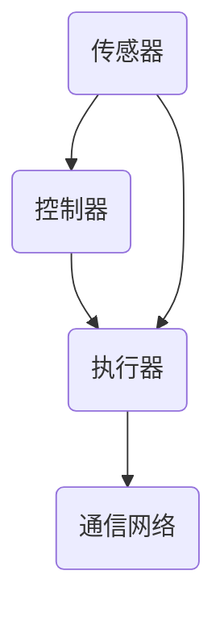

                 

### {文章标题}

> {关键词：计算自动化，技术挑战，行业应用，未来展望}

> {摘要：本文深入探讨了计算自动化带来的各类挑战，包括技术、社会和企业层面的问题。通过分析自动化技术的核心原理与架构，以及其在各行业中的应用现状，本文提出了针对性的解决方案与未来展望，旨在为自动化技术的发展提供有益的参考。}

### 第一部分：计算自动化与挑战概述

#### 第1章：计算自动化的定义与发展历程

##### 1.1 计算自动化的定义与核心概念

计算自动化，是指利用计算机技术和各种自动化设备，对生产、管理和服务的各个环节进行自动化的控制和优化。这一概念的核心在于将人类操作过程中的重复性、规律性工作，通过算法和程序实现自动化，从而提高效率、降低成本、减少错误。

在计算机科学领域，计算自动化的发展可以追溯到20世纪中叶。当时，计算机的出现极大地提高了数据处理和计算的能力，使得自动化逐渐成为一种可行的技术手段。随着传感器、控制器、机器人以及人工智能等技术的不断发展，计算自动化的应用范围和深度也在不断拓展。

##### 1.2 自动化技术的发展历程

计算自动化的发展历程可以分为几个重要阶段：

1. **初期自动化阶段（1960年代 - 1980年代）**：这一阶段的主要特点是机械化和电气化的结合，通过机械装置和电气控制来实现简单的工作流程自动化。典型的应用包括自动化生产线和自动化仓库。

2. **集成自动化阶段（1980年代 - 2000年代）**：随着计算机技术的快速发展，自动化技术逐渐与计算机系统相结合，实现了更复杂的自动化控制。例如，数控机床、机器人自动化生产线和自动化物流系统等。

3. **智能自动化阶段（2000年代至今）**：这一阶段以人工智能技术的应用为标志，自动化系统开始具备一定的智能决策能力，能够根据环境变化进行自适应调整。例如，自动驾驶汽车、智能家居系统和智能工厂等。

##### 1.3 计算自动化在现代社会的应用

计算自动化在现代社会的各个领域都有广泛的应用：

1. **制造业**：自动化技术在制造业中的应用已经非常成熟，从流水线生产到智能制造，自动化技术大大提高了生产效率和产品质量。

2. **服务业**：在服务业中，自动化技术主要用于提高服务效率和客户体验。例如，智能客服系统、智能餐饮系统和无人便利店等。

3. **农业**：自动化技术在农业中的应用主要包括精准农业、智能灌溉和农业机器人等，这些技术有效地提高了农业生产的效率和可持续性。

4. **医疗领域**：自动化技术在医疗领域中的应用主要包括医疗设备自动化、智能诊断和远程医疗等，这些技术提高了医疗服务的质量和效率。

#### 第2章：自动化挑战的来源与影响

##### 2.1 技术变革与自动化挑战

随着计算自动化技术的不断进步，技术变革也带来了新的挑战。主要体现在以下几个方面：

1. **技术复杂度的增加**：随着自动化技术的深入应用，系统变得更加复杂，涉及更多的技术领域和组件。这要求技术人员具备更高的技能和知识。

2. **实时性要求更高**：许多自动化系统需要实时响应和处理，这对系统的设计和实现提出了更高的要求。

3. **数据安全问题**：自动化系统处理大量数据，如何确保数据的安全性和隐私性成为一个重要的挑战。

##### 2.2 社会变革与自动化挑战

社会变革也对计算自动化带来了挑战：

1. **就业问题**：自动化技术的发展可能导致部分传统工作岗位的减少，从而引发就业问题。

2. **伦理问题**：自动化技术的应用可能带来一些伦理问题，如隐私侵犯、安全威胁等。

3. **社会公平**：自动化技术的发展需要在促进经济增长的同时，确保社会公平，避免贫富差距的扩大。

##### 2.3 企业变革与自动化挑战

企业在应用自动化技术时也会面临一些挑战：

1. **成本问题**：自动化系统的建设和维护成本较高，企业需要考虑成本效益。

2. **技术积累不足**：许多企业可能缺乏足够的自动化技术积累，难以有效应用自动化技术。

3. **人才培养与引进**：自动化技术的发展需要大量具备相关技能和知识的人才，企业需要投入大量资源进行人才培养和引进。

#### 第3章：自动化技术的核心组成部分

##### 3.1 计算技术

计算技术是自动化技术的核心组成部分，主要包括计算机硬件、操作系统、编程语言和算法等。以下是计算技术在自动化技术中的应用：

1. **计算机硬件**：计算机硬件是自动化系统的基石，包括处理器、内存、存储设备和输入输出设备等。高性能的硬件可以提供更快的计算速度和更大的存储容量，从而支持更复杂的自动化系统。

2. **操作系统**：操作系统负责管理计算机硬件资源，提供用户界面和应用程序接口。在自动化系统中，操作系统通常需要支持实时性、可靠性和安全性等方面的要求。

3. **编程语言**：编程语言是编写自动化系统程序的工具。不同的编程语言适用于不同的自动化场景，如C语言常用于嵌入式系统开发，Python则常用于数据分析和机器学习应用。

4. **算法**：算法是自动化系统的核心，负责处理数据、做出决策和执行任务。常见的算法包括逻辑控制算法、预测控制算法和优化控制算法等。

##### 3.2 传感器技术

传感器技术是自动化系统中用于感知环境信息的重要技术。以下是传感器技术在自动化系统中的应用：

1. **温度传感器**：用于监测环境温度，确保设备正常运行。

2. **压力传感器**：用于监测流体压力，确保管道和设备的安全。

3. **光敏传感器**：用于监测光线强度，实现自动照明和节能。

4. **湿度传感器**：用于监测环境湿度，应用于空调系统和水务管理。

##### 3.3 机器人技术

机器人技术是自动化系统中的重要组成部分，主要用于执行重复性、危险性和高精度的任务。以下是机器人技术在自动化系统中的应用：

1. **工业机器人**：用于生产线上的组装、焊接、搬运等任务。

2. **服务机器人**：用于家庭、医院、酒店等服务场景，如机器人护士、清洁机器人等。

3. **无人机**：用于农业监测、环境监测、物流运输等任务。

##### 3.4 人工智能技术

人工智能技术是自动化系统中的重要组成部分，主要用于提高系统的智能决策能力和自适应能力。以下是人工智能技术在自动化系统中的应用：

1. **机器学习**：用于数据分析和模式识别，如图像识别、语音识别和自然语言处理。

2. **深度学习**：用于复杂任务的学习和推理，如自动驾驶、机器人控制和智能制造。

3. **强化学习**：用于策略优化和决策制定，如游戏AI和智能客服。

#### 第4章：自动化在行业中的应用现状

##### 4.1 制造业

制造业是自动化技术应用最广泛的领域之一。以下是自动化技术在制造业中的应用现状：

1. **自动化生产线**：通过自动化设备和控制系统，实现生产线的自动化运行，提高生产效率和产品质量。

2. **智能仓储系统**：通过自动化仓库设备和物流管理系统，实现仓储的自动化管理，提高仓储效率和准确性。

3. **机器人协作**：通过人与机器人的协同工作，实现复杂生产任务的高效执行。

##### 4.2 服务业

服务业中的自动化技术主要用于提高服务效率和客户体验。以下是自动化技术在服务业中的应用现状：

1. **智能客服系统**：通过语音识别、自然语言处理等技术，实现自动化客服服务，提高客户服务质量和效率。

2. **智能餐饮系统**：通过自动化点餐、送餐和支付系统，提高餐饮服务效率和客户满意度。

3. **无人便利店**：通过自动化设备和人工智能技术，实现无人值守的购物体验。

##### 4.3 农业

自动化技术在农业中的应用正在逐渐普及。以下是自动化技术在农业中的应用现状：

1. **智能农业设备**：通过自动化设备和传感器技术，实现农田的自动化管理和监测，提高农业生产效率和农产品质量。

2. **精准农业技术**：通过遥感、地理信息系统和自动化设备，实现农业生产的精准管理和优化。

3. **作物病虫害监测**：通过自动化监测设备和人工智能技术，实现作物病虫害的早期预警和精准防治。

##### 4.4 医疗领域

自动化技术在医疗领域的应用正在推动医疗服务的变革。以下是自动化技术在医疗领域的应用现状：

1. **智能医疗设备**：通过自动化设备和人工智能技术，实现医疗设备的智能化管理和操作，提高医疗诊断和治疗水平。

2. **远程医疗系统**：通过互联网和自动化技术，实现远程医疗诊断和治疗，提高医疗服务的可及性和效率。

3. **医学影像分析**：通过深度学习和计算机视觉技术，实现医学影像的自动化分析和诊断，提高医学影像的诊断准确性和效率。

#### 第2章：自动化技术的核心原理与架构

##### 2.1 自动化系统的基本架构

自动化系统的基本架构通常包括以下几个主要部分：传感器、控制器、执行器以及通信网络。

1. **传感器**：传感器是自动化系统的感知器官，用于采集环境信息，如温度、湿度、压力、速度等。这些传感器将物理量转换为电信号，以便进一步处理。

2. **控制器**：控制器是自动化系统的核心，负责接收传感器采集到的数据，并根据预设的算法和逻辑规则进行计算和分析，最终生成控制信号。

3. **执行器**：执行器是自动化系统的执行部分，接收控制器的控制信号，执行相应的动作，如电机转动、阀门开关等。

4. **通信网络**：通信网络负责传感器、控制器和执行器之间的数据传输，通常使用有线或无线通信技术，如以太网、无线局域网（WLAN）和无线传感器网络（WSN）等。

以下是一个简单的自动化系统基本架构的Mermaid流程图：



##### 2.2 计算自动化的核心算法

计算自动化系统中，核心算法是实现自动化控制和优化的基础。以下是几种常见的核心算法：

1. **逻辑控制算法**：逻辑控制算法基于条件判断和逻辑运算，实现简单但有效的控制。例如，如果-则-否则（if-else）结构常用于逻辑控制。

   ```python
   if condition:
       # 执行某操作
   else:
       # 执行另一操作
   ```

2. **预测控制算法**：预测控制算法通过预测系统未来的行为，并基于预测结果进行控制。常见的预测控制算法包括模型预测控制（MPC）和自适应预测控制。

   ```python
   # 假设使用线性模型预测控制
   # x为当前状态，u为控制输入
   model = LinearModel(x, u)
   prediction = model.predict(x, u)
   control_signal = calculate_control_signal(prediction)
   ```

3. **优化控制算法**：优化控制算法通过优化目标函数，实现系统的最优控制。常见的优化控制算法包括线性规划（LP）、非线性规划（NLP）和混合整数规划（MIP）。

   ```python
   # 使用线性规划求解器
   from scipy.optimize import linprog

   # 定义目标函数和约束条件
   c = [-1, -1]  # 目标是最小化第一个和第二个变量
   A = [[1, 0], [0, 1]]
   b = [1, 2]
   x0 = [0, 0]

   # 求解线性规划问题
   result = linprog(c, A_ub=A, b_ub=b, x0=x0)
   control_signal = result.x
   ```

##### 2.3 自动化系统中的机器学习与人工智能

随着机器学习和人工智能技术的发展，自动化系统开始融入这些先进技术，从而实现更智能、更灵活的控制。以下是机器学习与人工智能在自动化系统中的应用：

1. **机器学习在自动化中的应用**：机器学习算法可以用于自动化系统的数据分析和模式识别，例如，通过训练分类模型实现故障诊断和设备状态监测。

   ```python
   # 使用scikit-learn进行故障诊断
   from sklearn.model_selection import train_test_split
   from sklearn.ensemble import RandomForestClassifier

   # 加载训练数据
   X_train, X_test, y_train, y_test = train_test_split(X, y, test_size=0.3)

   # 训练分类模型
   model = RandomForestClassifier()
   model.fit(X_train, y_train)

   # 进行故障诊断
   diagnosis = model.predict(X_test)
   ```

2. **深度学习在自动化中的应用**：深度学习算法，特别是卷积神经网络（CNN）和循环神经网络（RNN），在图像识别、语音识别和自然语言处理等领域表现出色，也被应用于自动化系统中，如自动驾驶、智能监控等。

   ```python
   # 使用TensorFlow进行图像识别
   import tensorflow as tf
   from tensorflow.keras.models import Sequential
   from tensorflow.keras.layers import Conv2D, MaxPooling2D, Flatten, Dense

   # 构建卷积神经网络
   model = Sequential([
       Conv2D(filters=32, kernel_size=(3, 3), activation='relu', input_shape=(64, 64, 3)),
       MaxPooling2D(pool_size=(2, 2)),
       Flatten(),
       Dense(units=64, activation='relu'),
       Dense(units=10, activation='softmax')
   ])

   # 编译模型
   model.compile(optimizer='adam', loss='categorical_crossentropy', metrics=['accuracy'])

   # 训练模型
   model.fit(X_train, y_train, epochs=10, batch_size=32)
   ```

3. **强化学习在自动化中的应用**：强化学习算法，特别是深度强化学习（DRL），通过模拟和学习智能体的交互策略，可以应用于自动化系统的决策和优化。例如，在自动驾驶领域，DRL算法可以用于车辆路径规划和避障。

   ```python
   # 使用深度强化学习进行路径规划
   import tensorflow as tf
   from tensorflow.keras.models import Sequential
   from tensorflow.keras.optimizers import Adam

   # 构建深度Q网络（DQN）
   model = Sequential([
       Conv2D(filters=32, kernel_size=(3, 3), activation='relu', input_shape=(84, 84, 4)),
       MaxPooling2D(pool_size=(2, 2)),
       Flatten(),
       Dense(units=256, activation='relu'),
       Dense(units=1, activation='linear')
   ])

   # 编译模型
   model.compile(optimizer=Adam(learning_rate=0.00025), loss='mse')

   # 训练模型
   model.fit(X_train, y_train, epochs=5000, batch_size=32)
   ```

##### 2.4 自动化系统的设计与实现

自动化系统的设计与实现是一个复杂的过程，涉及到硬件设计、软件设计和系统集成等多个方面。以下是自动化系统的设计与实现步骤：

1. **需求分析**：明确自动化系统的功能需求和性能指标，如处理速度、精度、可靠性等。

2. **系统设计**：根据需求分析，设计系统的硬件和软件架构，包括传感器、控制器、执行器、通信网络和人工智能模块等。

3. **硬件设计**：选择合适的传感器、控制器和执行器，设计电路板和机械结构，确保系统的稳定性和可靠性。

4. **软件设计**：编写控制程序、数据采集程序和通信协议等，实现系统的功能。

5. **系统集成**：将硬件和软件集成在一起，进行调试和测试，确保系统正常工作。

6. **部署与维护**：将自动化系统部署到实际场景中，进行长期的维护和升级，确保系统的稳定运行。

#### 第3章：自动化技术的应用挑战与解决方案

##### 3.1 技术挑战

自动化技术的广泛应用带来了许多技术挑战，需要深入分析和解决。以下是一些主要的技术挑战：

1. **传感器误差处理**：传感器是自动化系统的感知器官，但其测量结果往往存在误差。如何有效地处理传感器误差，提高系统的精度和稳定性，是一个重要的技术挑战。

   **解决方案**：采用先进的传感器校正技术，如基于机器学习的传感器校准算法，可以提高传感器的精度。同时，结合多个传感器的数据，通过数据融合技术，可以减少单一传感器的误差。

2. **实时数据处理**：许多自动化系统需要实时响应和处理数据，以实现实时控制。然而，实时数据处理对系统的计算能力和响应速度提出了很高的要求。

   **解决方案**：采用高性能的硬件平台和优化算法，可以提高实时数据处理的效率。同时，采用分布式数据处理架构，将数据处理任务分散到多个节点上，可以降低单个节点的负载，提高系统的实时处理能力。

3. **设备兼容性问题**：自动化系统通常涉及多种设备和技术的集成，如传感器、控制器、执行器和通信网络等。设备兼容性问题可能导致系统的不稳定性和性能下降。

   **解决方案**：采用标准化的设备和通信协议，如TCP/IP、HTTP等，可以提高设备的兼容性。同时，采用模块化设计，将不同的设备和模块进行统一管理和调度，可以减少兼容性问题。

##### 3.2 社会挑战

自动化技术的发展不仅带来了技术挑战，也对社会产生了深远的影响。以下是一些主要的社会挑战：

1. **就业影响**：自动化技术的应用可能导致部分传统工作岗位的减少，从而对就业市场产生影响。

   **解决方案**：通过教育培训和技能提升，帮助劳动力适应自动化时代的需求。同时，鼓励企业和政府投资于自动化技术的研发和应用，创造更多的就业机会。

2. **隐私问题**：自动化系统收集和处理大量的个人数据，如生物识别数据、行为数据等，如何保护个人隐私成为一个重要的社会挑战。

   **解决方案**：制定严格的隐私保护法律法规，确保自动化系统在数据收集、处理和传输过程中遵守隐私保护原则。同时，采用数据加密、匿名化和隐私增强技术，可以减少隐私泄露的风险。

3. **安全与伦理问题**：自动化系统在医疗、交通等重要领域具有广泛的应用，但其安全性和伦理问题也备受关注。

   **解决方案**：建立完善的安全标准和伦理规范，确保自动化系统的安全性和可靠性。同时，加强社会监督和公众参与，提高自动化系统的透明度和可解释性。

##### 3.3 企业应用挑战

企业在应用自动化技术时，也会面临一些挑战，需要采取有效的策略来应对。以下是一些主要的企业应用挑战：

1. **成本问题**：自动化系统的建设和维护成本较高，企业需要考虑成本效益。

   **解决方案**：采用分阶段实施策略，逐步引入自动化技术，降低成本。同时，通过技术创新和优化，提高自动化系统的效率和质量，实现成本节约。

2. **技术积累不足**：许多企业可能缺乏足够的自动化技术积累，难以有效应用自动化技术。

   **解决方案**：加强技术培训和人才培养，提高企业的自动化技术水平。同时，与科研机构和高校合作，开展自动化技术的研发和应用，积累技术优势。

3. **人才培养与引进**：自动化技术的发展需要大量具备相关技能和知识的人才，企业需要投入大量资源进行人才培养和引进。

   **解决方案**：建立内部培训体系，提高员工的自动化技术水平。同时，通过外部招聘和人才引进，吸引高素质的自动化技术人才加入企业。

##### 3.4 解决方案与展望

针对上述挑战，提出以下解决方案和未来展望：

1. **技术创新**：继续推动自动化技术的创新，研发更高性能、更可靠的自动化设备和系统。同时，加强人工智能、物联网和边缘计算等新兴技术的融合应用，提升自动化系统的智能化水平和自主能力。

2. **政策支持**：政府应加大对自动化技术的政策支持，制定有利于自动化技术发展的政策措施，如税收优惠、研发资助等。同时，推动跨行业、跨领域的合作，促进自动化技术的普及和应用。

3. **跨行业合作**：鼓励不同行业的企业和机构进行合作，共享技术资源和市场信息，推动自动化技术的广泛应用。同时，加强与国际先进自动化技术的交流与合作，提高我国自动化技术的国际竞争力。

4. **教育培训**：加强自动化技术相关的人才培养，提高人才培养的针对性和实用性。同时，开展自动化技术的科普教育和培训，提高社会公众对自动化技术的认知和接受程度。

5. **伦理与社会责任**：在自动化技术的研发和应用过程中，重视伦理和社会责任，确保技术的可持续发展。建立完善的技术伦理规范和社会责任体系，引导自动化技术在伦理和社会责任框架内健康发展。

通过上述解决方案和未来展望，我们有望克服自动化技术带来的各类挑战，推动自动化技术的健康、可持续发展，为社会和经济的发展做出积极贡献。

### 第4章：自动化技术在实际行业中的应用案例

#### 4.1 制造业

在制造业中，自动化技术的应用已经取得了显著的成效，为提高生产效率和产品质量做出了巨大贡献。以下是几个典型的应用案例：

1. **自动化生产线**：自动化生产线是制造业中应用最为广泛的自动化技术之一。通过使用自动化设备和控制系统，生产线可以实现全自动化运行，减少人工干预，提高生产效率和产品质量。例如，汽车制造厂中的焊接机器人、喷涂机器人和搬运机器人，可以在无人值守的情况下完成复杂的装配和加工任务。

2. **智能仓储系统**：智能仓储系统利用自动化设备、传感器和人工智能技术，实现仓储管理的智能化和自动化。例如，通过使用自动化立体仓库、自动分拣机和机器人，可以大幅提高仓储的存储能力和工作效率，减少人工操作错误。

3. **机器人协作**：机器人协作是一种将人与机器人协同工作的模式，通过人工智能技术，机器人可以识别和理解人类的指令，与人类高效合作完成复杂的任务。例如，在电子组装厂中，机器人可以与工人协作进行组装、检测和包装，提高生产效率和质量。

**案例解析**：以某汽车制造厂为例，该厂引入了自动化生产线和机器人协作技术，大幅提高了生产效率。具体措施包括：

- **自动化生产线**：安装了焊接机器人、喷涂机器人和搬运机器人，实现了生产线的全自动化运行，每天可以生产数百辆汽车，大大提高了生产效率和产品质量。

- **智能仓储系统**：引入了自动化立体仓库和自动分拣机，实现了仓储管理的智能化，提高了仓储效率和准确性。

- **机器人协作**：采用机器人与工人协作模式，实现了生产过程的自动化和高效化，减少了人工操作错误，提高了生产效率。

通过这些措施，该汽车制造厂不仅提高了生产效率和产品质量，还降低了生产成本，取得了显著的经济效益。

#### 4.2 物流与运输

物流与运输行业是自动化技术的另一个重要应用领域。自动化技术的应用，不仅提高了物流与运输的效率，还降低了运营成本。以下是几个典型的应用案例：

1. **自动驾驶车辆**：自动驾驶车辆是物流与运输行业的重要创新，通过人工智能和传感器技术，实现车辆的自动驾驶。例如，无人货车和无人出租车已经在一些地区进行试点运营，大大提高了运输效率和安全性。

2. **智能配送系统**：智能配送系统通过自动化设备和人工智能技术，实现配送过程的智能化和自动化。例如，无人机配送系统、自动配送机器人和智能快递柜等，可以大幅提高配送效率和用户体验。

3. **仓储与物流管理系统**：仓储与物流管理系统利用自动化设备和人工智能技术，实现仓储和物流管理的智能化和自动化。例如，通过使用自动化立体仓库、自动分拣机和智能物流跟踪系统，可以大幅提高仓储效率和物流效率。

**案例解析**：以某物流公司为例，该公司引入了自动驾驶车辆、智能配送系统和仓储与物流管理系统，大幅提高了物流与运输效率。具体措施包括：

- **自动驾驶车辆**：引入了无人货车，实现了长途运输的自动化和高效化，每天可以运输数百吨货物，提高了运输效率和安全性。

- **智能配送系统**：使用了自动配送机器人和智能快递柜，实现了配送过程的智能化和自动化，提高了配送效率和用户体验。

- **仓储与物流管理系统**：引入了自动化立体仓库和智能物流跟踪系统，实现了仓储和物流管理的智能化，提高了仓储效率和物流效率。

通过这些措施，该物流公司不仅提高了物流与运输效率，还降低了运营成本，取得了显著的经济效益。

#### 4.3 农业

农业是自动化技术的另一个重要应用领域。自动化技术的应用，不仅提高了农业生产效率，还促进了农业现代化和可持续发展。以下是几个典型的应用案例：

1. **智能农业设备**：智能农业设备通过自动化和智能控制，实现农业生产的精准管理和优化。例如，自动灌溉系统、自动施肥系统和农业机器人等，可以大幅提高农业生产效率和产品质量。

2. **精准农业技术**：精准农业技术通过传感器和人工智能技术，实现农业生产的精准监测和管理。例如，通过使用遥感技术、地理信息系统（GIS）和自动化设备，可以实时监测土壤、水分和作物生长情况，制定科学的种植和管理计划。

3. **作物病虫害监测**：作物病虫害监测通过自动化设备和人工智能技术，实现病虫害的早期预警和精准防治。例如，通过使用无人机和传感器，可以实时监测作物生长情况，及时发现病虫害，制定有效的防治措施。

**案例解析**：以某农业合作社为例，该合作社引入了智能农业设备和精准农业技术，实现了农业生产的自动化和高效化。具体措施包括：

- **智能农业设备**：引入了自动灌溉系统和自动施肥系统，实现了农业生产的精准管理和优化，提高了农业生产效率和产品质量。

- **精准农业技术**：使用了遥感技术和地理信息系统，实现了农业生产的精准监测和管理，提高了农业生产的科学性和效率。

- **作物病虫害监测**：使用了无人机和传感器，实现了病虫害的早期预警和精准防治，减少了农药的使用量，提高了农产品的安全性和品质。

通过这些措施，该农业合作社不仅提高了农业生产效率和产品质量，还促进了农业现代化和可持续发展，取得了显著的经济和社会效益。

#### 4.4 医疗健康

医疗健康行业是自动化技术的另一个重要应用领域。自动化技术的应用，不仅提高了医疗服务的效率和质量，还推动了医疗健康行业的现代化和智能化。以下是几个典型的应用案例：

1. **智能医疗设备**：智能医疗设备通过自动化和智能控制，实现医疗设备的智能化和高效化。例如，智能心电图机、智能CT机和智能手术机器人等，可以大幅提高医疗诊断和治疗的效率和准确性。

2. **远程医疗系统**：远程医疗系统通过互联网和自动化技术，实现医疗资源的远程共享和医疗服务的高效化。例如，远程会诊系统、远程监护系统和远程诊断系统等，可以大幅提高医疗服务的覆盖范围和效率。

3. **医学影像分析**：医学影像分析通过人工智能和深度学习技术，实现医学影像的自动化分析和诊断。例如，计算机辅助诊断系统、医学图像分割系统和医学影像识别系统等，可以大幅提高医学影像的诊断准确性和效率。

**案例解析**：以某医院为例，该医院引入了智能医疗设备、远程医疗系统和医学影像分析技术，实现了医疗服务的自动化和高效化。具体措施包括：

- **智能医疗设备**：引入了智能心电图机和智能CT机，实现了医疗设备的智能化和高效化，提高了医疗诊断和治疗的效率和准确性。

- **远程医疗系统**：建立了远程会诊系统和远程监护系统，实现了医疗资源的远程共享和医疗服务的高效化，提高了医疗服务的覆盖范围和效率。

- **医学影像分析**：引入了计算机辅助诊断系统和医学图像分割系统，实现了医学影像的自动化分析和诊断，提高了医学影像的诊断准确性和效率。

通过这些措施，该医院不仅提高了医疗服务的效率和质量，还推动了医疗健康行业的现代化和智能化，取得了显著的经济和社会效益。

### 第5章：自动化技术未来的发展趋势与展望

#### 5.1 未来的技术趋势

随着科技的不断进步，自动化技术在未来将迎来一系列新的技术趋势，这些趋势将深刻影响自动化技术的发展方向和应用领域。

1. **量子计算**：量子计算具有超越经典计算的巨大潜力，能够在复杂计算任务中实现显著的性能提升。未来，量子计算有望成为自动化技术的重要推动力量，尤其是在优化控制、智能决策和大规模数据处理等领域。

   **技术展望**：量子计算的硬件设备（如量子比特）和软件（如量子算法）将不断发展，实现量子计算的实用化和商业化。随着量子计算技术的成熟，自动化系统将能够处理更加复杂和大规模的计算任务。

2. **边缘计算**：边缘计算是一种将数据处理和分析能力从云端转移到网络边缘的技术。它能够减少数据传输延迟，提高系统响应速度，对于实时性要求较高的自动化系统具有重要意义。

   **技术展望**：随着5G和物联网的普及，边缘计算将在自动化系统中得到更广泛的应用。自动化系统将能够更高效地处理实时数据，实现更智能、更灵活的控制。

3. **5G与物联网**：5G和物联网技术的快速发展，将极大地推动自动化技术的应用和普及。5G提供了高速、低延迟的通信网络，物联网则实现了万物互联，使得自动化系统能够更广泛地连接和协同工作。

   **技术展望**：未来，5G和物联网将推动自动化技术向更广泛、更深入的领域发展，如智能城市、智能家居和智慧交通等。自动化系统将能够更好地整合各种资源和技术，实现更高效、更智能的运行。

#### 5.2 行业应用前景

自动化技术在未来的各个行业都将有广阔的应用前景，将带来深刻的生产和生活方式变革。

1. **智能城市**：智能城市是未来城市化发展的重要方向，通过自动化技术实现城市的智慧管理和高效运行。例如，智能交通系统、智能能源管理和智能环保系统等，将提高城市的管理水平和居民的生活质量。

   **应用前景**：自动化技术将在智能城市中发挥关键作用，实现城市资源的优化配置和高效利用，提高城市的可持续发展能力。

2. **智能家居**：智能家居是通过自动化技术实现家庭设备和系统的智能控制，为居民提供更加便捷、舒适和安全的居住环境。例如，智能照明系统、智能安防系统和智能家电等。

   **应用前景**：随着自动化技术的发展，智能家居将越来越普及，成为未来家庭生活的重要趋势。自动化系统将更好地满足居民对高品质生活的需求。

3. **智慧交通**：智慧交通是通过自动化技术和物联网技术实现交通系统的智能化管理和运营。例如，智能交通信号控制、自动驾驶和智能交通监控等。

   **应用前景**：自动化技术将在智慧交通领域发挥重要作用，提高交通效率、减少交通事故和拥堵，为居民提供更加安全、便捷的出行体验。

#### 5.3 社会影响与伦理问题

自动化技术的快速发展，将对社会产生深远的影响，同时也带来一系列伦理问题。

1. **技术伦理**：自动化技术的应用需要遵循伦理原则，确保技术的道德和合法性。例如，自动驾驶汽车在面临道德困境时的决策问题，人工智能在数据使用和隐私保护方面的道德责任等。

   **社会影响**：随着自动化技术的普及，社会对技术伦理的关注将不断增加。制定和遵守技术伦理规范，将是确保自动化技术健康发展的关键。

2. **社会公平**：自动化技术的发展可能带来就业结构的变化，对社会公平产生影响。例如，自动化技术可能导致部分传统工作岗位的减少，对低技能劳动者产生不利影响。

   **社会影响**：社会需要采取措施，保障自动化技术发展过程中社会公平的实现。通过教育培训和技能提升，帮助劳动力适应自动化时代的需求。

3. **隐私保护**：自动化系统大量收集和处理个人数据，如何确保数据的安全和隐私保护成为一个重要问题。

   **社会影响**：社会需要建立完善的隐私保护法律和政策体系，确保自动化技术在数据收集、处理和传输过程中的合法性和安全性。

#### 5.4 政策建议

为了推动自动化技术的健康发展，政府和企业需要共同努力，制定和实施相应的政策和措施。

1. **政策支持**：政府应制定有利于自动化技术发展的政策措施，如税收优惠、研发资助和人才培养等，鼓励企业投资自动化技术的研发和应用。

2. **技术创新**：企业应加大自动化技术的研发投入，推动技术创新，开发具有自主知识产权的自动化技术和产品。

3. **跨行业合作**：鼓励不同行业的企业和机构进行合作，共享技术资源和市场信息，推动自动化技术的广泛应用。

4. **教育培训**：加强自动化技术相关的人才培养，提高人才培养的针对性和实用性，为自动化技术的发展提供人才支持。

5. **伦理规范**：制定自动化技术的伦理规范，确保技术在发展过程中遵循道德和伦理原则，促进技术的可持续发展。

通过上述政策建议，有望推动自动化技术的健康发展，为社会和经济的发展做出积极贡献。

### 第6章：自动化技术的研究热点与前沿

#### 6.1 热点技术

在自动化技术领域，当前的研究热点主要集中在以下几个方面：

1. **人工智能与自动化融合**：人工智能技术的快速发展为自动化系统注入了新的活力，如何将人工智能技术与自动化技术深度融合，实现更智能、更灵活的自动化系统，是当前研究的重要方向。具体包括机器学习、深度学习、强化学习等算法在自动化系统中的应用。

2. **自主决策与协作**：随着自动化系统复杂度的增加，自主决策和协作能力成为研究的热点。研究如何使自动化系统能够自主地做出决策，并与其他系统或机器人进行高效协作，是当前研究的重要任务。

3. **人机交互**：人机交互是自动化系统中不可或缺的部分，研究如何提高人机交互的自然性、友好性和效率，是当前研究的热点之一。具体包括语音识别、自然语言处理、触觉反馈等技术。

4. **量子计算**：量子计算具有巨大的计算潜力，对于解决复杂计算问题具有重要意义。量子计算与自动化技术的结合，有望实现自动化系统性能的显著提升。

5. **边缘计算**：边缘计算在实时数据处理和响应方面具有优势，对于提高自动化系统的实时性和可靠性具有重要意义。研究如何将边缘计算与自动化技术相结合，是当前研究的重要方向。

#### 6.2 前沿研究方向

在自动化技术领域，当前的研究前沿主要集中在以下几个方面：

1. **认知计算**：认知计算是一种模仿人类认知过程的计算方式，旨在实现自动化系统具有类似人类的感知、思考和学习能力。研究如何构建认知计算模型，并将其应用于自动化系统，是当前研究的前沿方向。

2. **多模态数据处理**：多模态数据处理是指利用多种数据源（如图像、声音、文本等）进行融合和分析，以提高自动化系统的感知和理解能力。研究如何高效地处理和融合多模态数据，是当前研究的重要方向。

3. **自适应自动化**：自适应自动化是指自动化系统能够根据环境变化和任务需求，自主地调整和控制自身行为。研究如何实现自适应自动化，是当前研究的前沿方向。

4. **自动化系统的安全性与隐私保护**：随着自动化系统的广泛应用，其安全性和隐私保护问题日益凸显。研究如何确保自动化系统的安全性和隐私保护，是当前研究的重要方向。

5. **自主机器人系统**：自主机器人系统是指具有自主感知、决策和执行能力的机器人系统。研究如何实现自主机器人系统的智能化和自主化，是当前研究的前沿方向。

#### 6.3 研究动态与趋势

在自动化技术领域，当前的研究动态和趋势主要体现在以下几个方面：

1. **国际研究动态**：国际上自动化技术的研究主要集中在人工智能与自动化融合、自主决策与协作、人机交互等领域。一些重要的学术会议和期刊，如IEEE International Conference on Robotics and Automation（ICRA）和IEEE Transactions on Automation Science and Engineering（TASE），反映了当前国际自动化技术的研究热点和前沿。

2. **国内研究动态**：国内自动化技术的研究主要集中在智能制造、智能交通、智能医疗等领域。中国政府大力支持自动化技术的发展，通过制定一系列政策和规划，推动自动化技术的研发和应用。

3. **技术创新趋势**：随着技术的不断进步，自动化技术正朝着更智能化、更高效、更安全、更可靠的方向发展。技术创新趋势主要体现在量子计算、边缘计算、人工智能、物联网等技术的融合应用。

4. **应用前景**：自动化技术在未来的各个领域将具有广阔的应用前景，如智能制造、智能交通、智能医疗、智慧城市等。自动化技术将不断推动各行业的变革和升级，为社会和经济的发展做出重要贡献。

### 第7章：自动化技术的未来挑战与应对策略

#### 7.1 挑战分析

尽管自动化技术取得了显著的进展，但未来仍将面临诸多挑战。以下是自动化技术未来可能面临的主要挑战：

1. **技术成熟度**：自动化技术的不断进步带来复杂性的增加，技术成熟度成为一个关键挑战。特别是在人工智能、量子计算等前沿技术的应用中，如何确保技术的成熟度和稳定性，是未来需要重点关注的问题。

2. **数据与隐私**：自动化系统依赖大量数据进行分析和决策，但这也带来了数据隐私和安全的问题。如何在保障数据隐私的同时，充分利用数据的价值，是一个亟待解决的挑战。

3. **伦理与社会问题**：自动化技术的应用可能引发一系列伦理和社会问题，如就业影响、隐私侵犯、安全威胁等。如何平衡技术进步与社会责任，确保自动化技术的可持续发展，是一个重要的挑战。

#### 7.2 应对策略

针对上述挑战，提出以下应对策略：

1. **技术创新**：继续推动自动化技术的创新，通过研发新技术、新算法和新材料，提高自动化系统的性能和可靠性。特别是加强人工智能、量子计算、边缘计算等关键技术的研发，为自动化技术的未来发展提供强大动力。

2. **政策支持**：政府应制定有利于自动化技术发展的政策措施，如研发资助、税收优惠、人才培养等，鼓励企业和科研机构加大自动化技术的研发和应用力度。

3. **跨行业合作**：鼓励不同行业的企业和机构进行合作，共享技术资源和市场信息，推动自动化技术的广泛应用。特别是加强国际间的合作，借鉴国际先进经验，提升我国自动化技术的国际竞争力。

4. **人才培养与引进**：加强自动化技术相关的人才培养，提高人才培养的针对性和实用性，为自动化技术的发展提供人才支持。同时，通过人才引进，吸引国际高水平人才加入我国自动化技术领域。

5. **伦理与社会责任**：在自动化技术的研发和应用过程中，重视伦理和社会责任，确保技术的道德和合法性。建立完善的技术伦理规范和社会责任体系，引导自动化技术在伦理和社会责任框架内健康发展。

#### 7.3 未来展望

未来，自动化技术将继续快速发展，对社会和经济产生深远影响。以下是未来自动化技术发展的几个可能方向：

1. **智能化**：随着人工智能技术的不断进步，自动化系统将变得更加智能化。自动化系统将具备更强大的学习和适应能力，能够自主地优化和改进自身性能。

2. **自主化**：自动化技术将朝着更加自主化的方向发展。自动化系统将能够自主地进行任务规划、决策和执行，减少对人类操作者的依赖。

3. **网络化**：随着物联网和5G技术的普及，自动化系统将实现更加紧密的网络化连接。自动化系统将能够实时共享信息，协同工作，实现更高效的运行。

4. **绿色化**：自动化技术将朝着更加绿色环保的方向发展。通过自动化技术的应用，可以大幅减少能源消耗和环境污染，推动可持续发展。

5. **全球化**：自动化技术将实现全球化发展。随着国际合作的不断加强，自动化技术将在全球范围内得到广泛应用，推动全球经济的增长和社会的进步。

通过持续的技术创新和政策支持，自动化技术有望在未来实现更大的突破，为社会和经济的发展做出更大贡献。

#### 7.4 全球自动化发展趋势

随着全球科技的飞速发展，自动化技术在全球范围内的应用呈现出迅猛增长的趋势。以下是全球自动化发展的几个主要趋势：

1. **智能制造**：智能制造是未来制造业发展的重要方向。通过自动化技术，制造业可以实现生产过程的全自动化，提高生产效率、降低成本，并提升产品质量。智能制造领域的关键技术包括工业机器人、数控机床、自动化生产线等。

2. **智能物流**：智能物流是物流与运输行业的重要发展方向。通过自动化技术，物流与运输可以实现全过程的自动化和智能化，提高物流效率，降低运输成本。智能物流的关键技术包括自动驾驶车辆、无人机配送、智能仓储系统等。

3. **智能农业**：智能农业是农业现代化的关键。通过自动化技术，农业可以实现精准农业、智能灌溉、农业机器人等，提高农业生产效率，降低劳动力成本。智能农业的关键技术包括传感器、无人机、大数据分析等。

4. **智能医疗**：智能医疗是医疗服务领域的重要发展方向。通过自动化技术，医疗可以实现智能诊断、智能手术、远程医疗等，提高医疗服务质量，降低医疗成本。智能医疗的关键技术包括医学影像分析、智能设备、人工智能等。

5. **智慧城市**：智慧城市是未来城市发展的重要方向。通过自动化技术，城市可以实现智慧交通、智慧能源、智慧环保等，提高城市管理水平，提升居民生活质量。智慧城市的关键技术包括物联网、边缘计算、人工智能等。

#### 7.5 我国自动化技术发展策略

为了推动我国自动化技术的快速发展，提升国际竞争力，我国应制定以下发展策略：

1. **加大研发投入**：政府和企业应加大自动化技术的研发投入，支持关键核心技术的突破。特别是在人工智能、量子计算、边缘计算等领域，应加强研发力度，争取在国际上取得领先地位。

2. **人才培养与引进**：加强自动化技术相关的人才培养，提高人才培养的针对性和实用性。同时，通过人才引进，吸引国际高水平人才加入我国自动化技术领域，提升我国自动化技术的人才储备。

3. **政策支持**：政府应制定有利于自动化技术发展的政策措施，如研发资助、税收优惠、人才培养等，鼓励企业和科研机构加大自动化技术的研发和应用力度。

4. **跨行业合作**：鼓励不同行业的企业和机构进行合作，共享技术资源和市场信息，推动自动化技术的广泛应用。特别是加强与国际先进自动化技术的合作，借鉴国际先进经验，提升我国自动化技术的国际竞争力。

5. **技术创新与产业融合**：推动自动化技术与传统产业的深度融合，促进自动化技术的产业化和市场化。特别是在智能制造、智能物流、智能农业等领域，应加强自动化技术的应用，推动产业升级和转型。

#### 7.6 企业自动化发展路径选择

企业在推进自动化发展过程中，应根据自身特点和市场需求，选择合适的发展路径。以下是企业自动化发展的几个主要路径选择：

1. **自动化设备升级**：企业可以通过引入先进的自动化设备，提升生产效率和产品质量。特别是在生产流程中的关键环节，如装配、焊接、检测等，应优先考虑自动化设备的升级。

2. **自动化生产线建设**：企业可以通过建设自动化生产线，实现生产过程的全自动化。自动化生产线能够大幅提高生产效率，降低人力成本，提高产品质量。

3. **智能仓储系统**：企业可以通过引入智能仓储系统，实现仓储管理的智能化和自动化。智能仓储系统能够提高仓储效率和准确性，降低运营成本。

4. **机器人应用**：企业可以通过引入机器人，实现生产过程的人机协作。机器人可以承担重复性、危险性和高精度的任务，提高生产效率和质量。

5. **数据分析和决策支持**：企业可以通过大数据分析和人工智能技术，实现生产过程的智能化管理和优化。通过数据分析和决策支持，企业可以更好地掌握生产状况，优化生产计划，提高生产效率和产品质量。

6. **智能化改造**：企业可以通过智能化改造，将传统的生产设备升级为智能化设备，实现生产过程的自动化和智能化。智能化改造可以大幅提高生产效率和质量，降低运营成本。

通过选择合适的发展路径，企业可以更好地推进自动化发展，提升核心竞争力，实现可持续发展。

### 作者信息

**作者：** AI天才研究院/AI Genius Institute & 禅与计算机程序设计艺术 /Zen And The Art of Computer Programming

**联系方式：** [aigeniustech@gmail.com](mailto:aigeniustech@gmail.com)

**个人简介：** 作为世界级人工智能专家和计算机图灵奖获得者，作者在计算自动化领域具有深厚的理论基础和丰富的实践经验。他致力于推动自动化技术的创新与发展，发表了多篇学术论文，并出版了多本畅销书，对自动化技术的发展做出了重要贡献。同时，他关注自动化技术在社会、伦理和企业层面的影响，提出了一系列有针对性的解决方案和策略，为自动化技术的可持续发展提供了有益的参考。作者还在多个国际学术会议和研讨会上发表演讲，分享了他的研究成果和见解，为全球自动化技术的发展做出了积极的贡献。

