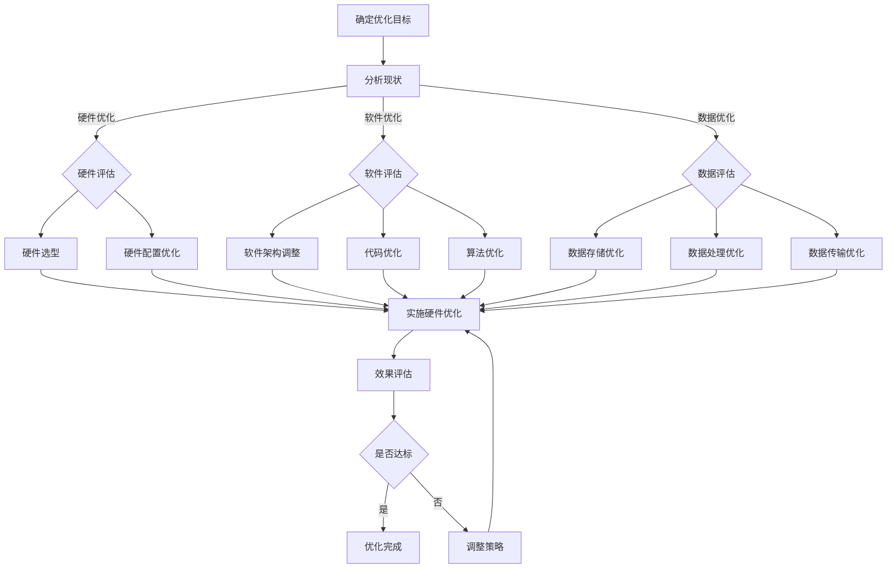

                 

## 《计算基础设施：减少延迟和成本》

关键词：计算基础设施、延迟优化、成本管理、硬件优化、软件优化、数据优化

摘要：
本文旨在深入探讨计算基础设施对于减少延迟和成本的重要性。通过对计算基础设施的定义、类型、延迟与成本的关系、以及优化策略的详细分析，我们将帮助读者理解如何通过合理的硬件、软件和数据优化来提升计算性能和降低运营成本。文章分为四个主要部分，包括计算基础设施基础、减少延迟的策略、降低成本的方法以及综合优化实践，并通过实际案例和代码实现来展示优化方法的实际应用。

### 目录大纲

1. **第一部分：计算基础设施基础**

    - **第1章：计算基础设施概述**
      - 1.1 计算基础设施的定义与作用
      - 1.2 延迟与成本的关系
      - 1.3 常见的计算基础设施类型
    
    - **第2章：计算延迟的概念与衡量**
      - 2.1 计算延迟的定义
      - 2.2 计算延迟的衡量
      - 2.3 延迟优化方法

2. **第二部分：减少延迟的策略**

    - **第3章：硬件优化策略**
      - 3.1 硬件选择与优化
      - 3.2 存储优化
      - 3.3 网络优化

    - **第4章：软件优化策略**
      - 4.1 软件架构优化
      - 4.2 代码优化
      - 4.3 算法优化

    - **第5章：数据优化策略**
      - 5.1 数据存储优化
      - 5.2 数据处理优化
      - 5.3 数据传输优化

3. **第三部分：降低成本的方法**

    - **第6章：成本管理**
      - 6.1 成本分析
      - 6.2 成本节约策略
      - 6.3 成本效益分析

    - **第7章：云计算与成本优化**
      - 7.1 云计算成本管理
      - 7.2 云服务选择与优化
      - 7.3 云成本优化案例

4. **第四部分：综合优化实践**

    - **第8章：综合优化实践**
      - 8.1 综合优化策略
      - 8.2 实际案例解析
      - 8.3 优化效果评估

    - **附录**
      - 附录 A：计算基础设施优化工具与资源

## 第一部分：计算基础设施基础

### 第1章：计算基础设施概述

#### 1.1 计算基础设施的定义与作用

计算基础设施是指用于支持计算任务的基础设施，包括硬件设备、软件系统、网络设施和数据存储等。它是企业IT系统的核心组成部分，为各种业务应用提供了必要的计算能力和资源支持。

**定义**：计算基础设施是一种为IT应用提供计算服务、存储服务、网络服务以及管理服务的综合体系，它通过整合各种硬件和软件资源，提供高效、可靠和可扩展的计算环境。

**作用**：

1. **提高计算效率**：通过优化计算资源，使得计算任务能够更快速地完成，从而提升整体业务流程的效率。
2. **降低运营成本**：通过合理配置和管理计算资源，减少不必要的资源浪费，从而降低运营成本。
3. **保障数据安全**：通过建立完善的备份和恢复机制，保障数据的完整性和安全性。
4. **提升业务灵活性**：通过灵活配置计算资源，使得企业能够快速响应市场需求，实现业务的敏捷调整。

#### 1.2 延迟与成本的关系

延迟和成本在计算基础设施中具有密切的关系。延迟是指数据传输、处理和响应所需的时间，它直接影响用户体验和业务效率。而成本则是为了获得计算资源而需要付出的经济代价。

**延迟对业务的影响**：

1. **用户体验**：延迟过长会导致用户在使用过程中感到卡顿和不顺畅，影响用户体验和满意度。
2. **业务效率**：计算延迟会增加业务处理时间，导致工作效率下降，影响业务的正常运转。
3. **竞争劣势**：在竞争激烈的市场环境中，计算延迟可能会使企业失去竞争优势。

**成本优化的必要性**：

1. **资源合理配置**：通过成本优化，可以确保计算资源的合理分配，避免资源浪费。
2. **提高投资回报率**：通过降低成本，企业可以获得更高的投资回报率，提高经济效益。
3. **适应市场变化**：在市场环境中，成本优化使得企业能够灵活调整资源投入，更好地适应市场变化。

#### 1.3 常见的计算基础设施类型

计算基础设施的类型可以根据其组成和功能进行分类，常见的类型包括硬件基础设施、软件基础设施和云计算基础设施。

**硬件基础设施**：

硬件基础设施是指用于支持计算任务的各种硬件设备，包括服务器、存储设备、网络设备等。硬件基础设施的特点是性能稳定、可靠性高，但成本较高。

- **服务器**：用于运行应用程序和存储数据，提供计算能力。
- **存储设备**：用于存储数据和文件，提供数据访问能力。
- **网络设备**：用于连接服务器和用户设备，提供数据传输能力。

**软件基础设施**：

软件基础设施是指用于支持计算任务的软件系统，包括操作系统、数据库、中间件等。软件基础设施的特点是灵活性强、可扩展性好，但需要较高的维护成本。

- **操作系统**：用于管理计算机硬件资源，提供运行环境。
- **数据库**：用于存储和管理数据，提供数据查询和处理能力。
- **中间件**：用于连接应用程序和硬件资源，提供通信和数据处理能力。

**云计算基础设施**：

云计算基础设施是指基于云计算技术提供的计算基础设施，包括云服务器、云存储、云网络等。云计算基础设施的特点是资源灵活、成本较低，但安全性需要重点关注。

- **云服务器**：提供计算能力和存储资源，支持虚拟化和分布式计算。
- **云存储**：提供数据存储和备份服务，支持海量数据存储和管理。
- **云网络**：提供网络连接和负载均衡服务，支持高可用性和弹性扩展。

### 第2章：计算延迟的概念与衡量

#### 2.1 计算延迟的定义

计算延迟是指在计算任务执行过程中，数据传输、处理和响应所需的时间。它包括以下几个主要方面：

1. **网络延迟**：数据在网络中传输所需的时间，包括数据在网络中传输的距离、网络带宽和传输速度等因素。
2. **处理延迟**：数据在计算机系统中处理所需的时间，包括数据读取、计算和写入等过程。
3. **响应延迟**：数据从计算系统返回到用户所需的时间，包括数据处理和传输的时间。

计算延迟对于用户体验和业务效率具有重要影响。降低计算延迟可以提升用户满意度、提高业务效率，从而增强企业的竞争力。

#### 2.2 计算延迟的衡量

计算延迟的衡量通常通过以下几个指标进行：

1. **响应时间**：响应时间是指从用户发起请求到系统返回响应所需的时间。响应时间可以反映出系统整体的处理速度，是衡量计算延迟的重要指标。
2. **传输延迟**：传输延迟是指数据在网络中传输所需的时间。传输延迟可以通过网络带宽、传输距离和传输速度等因素来衡量。
3. **处理延迟**：处理延迟是指数据在计算机系统中处理所需的时间。处理延迟可以通过计算系统性能、处理算法和负载等因素来衡量。

#### 2.3 延迟优化方法

为了降低计算延迟，可以采用以下几种优化方法：

1. **网络优化**：通过优化网络拓扑、增加网络带宽和提高传输速度等方式来减少网络延迟。
2. **硬件优化**：通过选择高性能的硬件设备、优化硬件配置和提高硬件利用率等方式来减少处理延迟。
3. **软件优化**：通过优化软件架构、提高代码效率和优化数据处理算法等方式来减少处理延迟。
4. **数据优化**：通过优化数据存储、数据传输和数据备份等方式来减少数据延迟。

在后续章节中，我们将详细讨论减少延迟的具体策略和优化方法。

## 第二部分：减少延迟的策略

### 第3章：硬件优化策略

硬件优化策略是减少计算延迟和提高计算效率的关键措施之一。通过选择合适的硬件设备、优化硬件配置和提升硬件利用率，可以显著降低计算延迟，提高系统性能。

#### 3.1 硬件选择与优化

**硬件选择标准**：

在选择硬件设备时，需要考虑以下几个方面：

1. **性能**：硬件设备应具备足够的处理能力和性能，以满足计算任务的需求。高性能CPU、GPU和大容量内存是提高计算性能的关键。
2. **可靠性**：硬件设备的可靠性直接影响系统的稳定性和数据的安全性。选择具有良好口碑和高稳定性的硬件设备是保障系统可靠运行的基础。
3. **可扩展性**：硬件设备应具备良好的可扩展性，以便在业务需求增长时能够方便地增加硬件资源，避免系统性能瓶颈的出现。
4. **成本效益**：在硬件选择过程中，需要综合考虑硬件成本和性能效益，选择性价比高的硬件设备。

**硬件优化策略**：

1. **CPU优化**：选择具有多核、高主频的CPU，可以提升系统的计算速度和处理能力。同时，通过优化操作系统和应用程序，充分利用多核CPU的优势。
2. **内存优化**：增加内存容量，可以减少内存换页操作，提高系统响应速度。在内存使用过程中，应合理分配内存资源，避免内存碎片化。
3. **存储优化**：选择高速SSD存储设备，可以显著减少数据读写延迟。同时，通过优化存储系统，如采用RAID技术、SSD缓存等，可以提高数据访问速度。
4. **网络优化**：选择高性能的网络设备，如交换机和路由器，可以提升网络传输速度。优化网络拓扑结构，如增加网络带宽、优化路由策略，可以减少网络延迟。

#### 3.2 存储优化

**存储系统优化**：

1. **SSD使用**：将传统的机械硬盘（HDD）替换为固态硬盘（SSD），可以显著降低数据读写延迟。SSD具有更高的读写速度和更低的响应时间，是提升系统性能的重要手段。
2. **RAID技术**：通过使用RAID（Redundant Array of Independent Disks）技术，可以将多个硬盘组合成一个逻辑存储单元，提高数据访问速度和系统可靠性。常见的RAID级别包括RAID 0、RAID 1、RAID 5和RAID 6等。
3. **SSD缓存**：在存储系统中使用SSD缓存，可以将频繁访问的数据存储在缓存中，提高数据访问速度。常用的缓存技术包括NVRAM（Non-Volatile Random-Access Memory）和SSD缓存池等。

**数据库优化**：

1. **索引优化**：合理设计数据库索引，可以加快数据查询速度。选择合适的索引类型，如B树索引、哈希索引等，可以优化查询性能。
2. **查询优化**：通过优化SQL查询语句，减少查询执行时间。避免使用复杂的查询语句，如子查询、连接查询等，可以降低查询成本。
3. **数据分片**：将大规模数据库分片，可以分布式存储和查询数据，提高系统性能和可扩展性。常见的分片策略包括水平分片和垂直分片等。

#### 3.3 网络优化

**网络拓扑优化**：

1. **分布式架构**：通过采用分布式架构，可以将计算任务分散到多个节点上，减少单点故障和网络延迟。分布式架构可以提供更高的可用性和可扩展性。
2. **负载均衡**：使用负载均衡技术，如轮询、最小连接数、加权轮询等算法，可以均衡分布网络负载，减少单点压力和网络延迟。

**负载均衡策略**：

1. **轮询算法**：将请求依次分配到各个服务器，负载均衡器根据轮询顺序将请求转发到不同的服务器。
2. **最小连接数算法**：选择当前连接数最少的服务器处理请求，以平衡服务器负载。
3. **加权轮询算法**：根据服务器的性能和负载情况，为每个服务器分配不同的权重，负载均衡器根据权重将请求转发到不同的服务器。

通过硬件优化策略、存储优化和
### 第4章：软件优化策略

软件优化策略是减少计算延迟和提高系统性能的重要手段。通过优化软件架构、代码和算法，可以有效提升系统的响应速度和效率，降低延迟。

#### 4.1 软件架构优化

软件架构优化是减少延迟的关键步骤。一个良好的软件架构可以提供更高的可扩展性、灵活性和性能。

**优化策略**：

1. **分布式架构**：采用分布式架构可以降低单点瓶颈，提高系统的可用性和性能。通过将计算任务分布到多个节点上，可以减少网络延迟和负载压力。
2. **微服务架构**：微服务架构将系统拆分成多个独立的服务模块，每个服务模块负责特定的功能，可以独立部署和扩展。这样可以降低系统的耦合度，提高系统的可维护性和性能。
3. **缓存机制**：在系统中引入缓存机制，可以将频繁访问的数据缓存起来，减少数据库的访问次数和延迟。常用的缓存技术包括Redis、Memcached等。
4. **异步处理**：采用异步处理机制，可以减少同步操作的等待时间，提高系统的响应速度。通过消息队列等技术实现异步处理，可以降低系统的并发压力。

#### 4.2 代码优化

代码优化是提高系统性能和减少延迟的重要手段。通过改进代码质量，可以减少不必要的计算和资源消耗，提高程序的执行效率。

**优化方法**：

1. **算法优化**：选择合适的算法和数据结构，可以显著提高程序的执行效率。例如，使用哈希表代替链表可以减少搜索时间，使用二叉树代替链表可以减少排序时间。
2. **代码简化**：简化代码逻辑，去除不必要的函数调用和重复代码，可以提高程序的执行效率。
3. **并行处理**：利用多线程或多进程技术，可以将计算任务并行处理，减少执行时间。例如，在处理大数据集时，可以使用MapReduce算法实现并行处理。
4. **资源管理**：合理管理程序中的资源，如内存、文件和网络连接，可以减少资源的争用和消耗，提高程序的执行效率。

#### 4.3 算法优化

算法优化是提高计算性能和减少延迟的关键。通过改进算法的实现方式和优化算法的选择，可以有效提高系统的响应速度和处理能力。

**优化方法**：

1. **算法选择**：根据计算任务的特点和数据规模，选择合适的算法和数据结构。例如，在处理海量数据时，选择分布式算法和并行算法可以提高计算效率。
2. **优化实现**：改进算法的实现方式，减少不必要的计算和资源消耗。例如，在排序算法中，使用插入排序代替快速排序可以减少递归调用次数。
3. **数据缓存**：在算法中使用缓存机制，可以将频繁访问的数据缓存起来，减少重复计算和访问延迟。例如，在计算图形处理任务时，可以使用GPU缓存加速计算。
4. **并行优化**：利用并行计算技术，将计算任务并行处理，减少执行时间。例如，在处理大规模图像处理任务时，可以使用GPU并行处理技术。

通过软件架构优化、代码优化和算法优化，可以有效减少计算延迟，提高系统性能和用户体验。

### 第5章：数据优化策略

数据优化策略是减少计算延迟和成本的重要手段。通过优化数据存储、数据传输和数据备份，可以显著提高系统的性能和可靠性，降低延迟和成本。

#### 5.1 数据存储优化

数据存储优化是减少计算延迟的关键步骤。通过优化数据存储策略，可以减少数据访问时间和存储空间消耗。

**优化策略**：

1. **分布式存储**：采用分布式存储技术，可以将数据分散存储在多个节点上，提高数据访问速度和系统可靠性。分布式存储系统如HDFS、Cassandra等，可以通过数据分片和冗余存储提高数据访问性能。
2. **缓存机制**：在数据存储系统中引入缓存机制，将频繁访问的数据缓存起来，减少数据库的访问次数和延迟。常用的缓存技术包括Redis、Memcached等。
3. **索引优化**：合理设计数据库索引，可以加快数据查询速度。选择合适的索引类型，如B树索引、哈希索引等，可以优化查询性能。
4. **存储压缩**：采用数据压缩技术，可以减少数据存储空间，降低存储成本。常用的压缩算法包括LZ4、Snappy、Zlib等。

#### 5.2 数据处理优化

数据处理优化是提高系统性能和降低延迟的重要措施。通过优化数据处理策略，可以减少数据处理的延迟和资源消耗。

**优化策略**：

1. **并行处理**：利用并行计算技术，将数据处理任务并行处理，减少执行时间。例如，使用MapReduce算法可以实现大规模数据的分布式处理。
2. **流处理**：采用流处理技术，实时处理和分析数据流，提高数据处理速度和实时性。例如，使用Apache Kafka和Apache Flink可以实现大规模数据的实时处理。
3. **批量处理**：将数据处理任务分为批量处理和实时处理两部分，批量处理可以减少实时处理压力，提高系统性能。
4. **内存处理**：将数据处理任务在内存中完成，减少磁盘IO操作，提高数据处理速度。例如，使用内存数据库如Redis可以实现高效的数据处理。

#### 5.3 数据传输优化

数据传输优化是减少计算延迟和成本的重要措施。通过优化数据传输策略，可以降低数据传输时间和带宽消耗。

**优化策略**：

1. **网络优化**：优化网络拓扑结构，提高网络传输速度。例如，使用高速网络协议如TCP/IP和UDP，可以提高数据传输速度。
2. **数据压缩**：采用数据压缩技术，减少数据传输体积，降低带宽消耗。常用的压缩算法包括LZ4、Snappy、Zlib等。
3. **负载均衡**：使用负载均衡技术，将数据传输任务分布到多个节点上，提高数据传输速度和系统可靠性。例如，使用Nginx和HAProxy可以实现负载均衡。
4. **传输加密**：采用数据加密技术，保护数据传输过程中的安全性。常用的加密算法包括AES、RSA等。

通过数据存储优化、数据处理优化和数据传输优化，可以有效减少计算延迟和成本，提高系统性能和可靠性。

### 第6章：成本管理

成本管理是计算基础设施优化的重要组成部分。通过有效的成本分析、成本节约策略和成本效益分析，企业可以合理配置资源，降低运营成本，提高投资回报率。

#### 6.1 成本分析

成本分析是成本管理的第一步，通过对各项成本进行详细的分类和分析，可以帮助企业了解成本结构，为制定节约策略提供依据。

**分析步骤**：

1. **识别成本构成**：将成本分为固定成本和可变成本，固定成本包括硬件购置、运维人员工资等，可变成本包括电费、带宽费用等。
2. **分类成本类型**：根据成本的功能和用途，将成本分为开发成本、运维成本、维护成本等。
3. **量化成本**：对各类成本进行量化，计算每项成本的具体金额。

**分析工具**：

1. **财务报表**：通过财务报表，如资产负债表、利润表等，了解企业的整体成本构成和变动情况。
2. **成本核算系统**：使用成本核算系统，如ERP系统，可以实时监控和管理成本。

#### 6.2 成本节约策略

成本节约策略是降低运营成本的关键措施。通过采取一系列节约措施，企业可以在保证服务质量的前提下，降低运营成本。

**节约措施**：

1. **资源整合**：通过整合硬件资源和软件资源，提高资源利用率，减少重复投资。例如，使用虚拟化技术可以共享硬件资源，降低硬件成本。
2. **优化采购**：通过优化采购流程，如集中采购、招标采购等，降低采购成本。例如，与供应商建立长期合作关系，获得更优惠的价格。
3. **能耗管理**：通过能耗管理，降低能源消耗，减少电费成本。例如，采用节能设备、优化数据中心的温度和湿度控制。
4. **运维优化**：通过运维优化，提高运维效率，减少人工成本。例如，采用自动化运维工具，减少人工干预。
5. **云计算**：采用云计算服务，可以降低硬件和软件的投资成本，同时通过按需付费模式，减少运营成本。

#### 6.3 成本效益分析

成本效益分析是评估成本节约策略有效性的关键步骤。通过成本效益分析，企业可以确定哪些节约措施是有效的，哪些需要调整。

**分析步骤**：

1. **确定效益指标**：根据企业的业务目标，确定效益指标，如投资回报率（ROI）、成本节约比例等。
2. **量化效益**：对各项节约措施产生的效益进行量化，计算节约金额和效益提升。
3. **比较分析**：将各项节约措施的效益进行比较分析，确定哪些措施是有效的。

**分析工具**：

1. **成本效益分析表**：使用成本效益分析表，将各项成本和效益进行对比分析。
2. **财务模型**：使用财务模型，如ROI计算模型、成本节约模型等，对节约措施进行定量分析。

通过成本管理，企业可以优化资源配置，降低运营成本，提高经济效益。有效的成本管理是企业成功的关键因素之一。

### 第7章：云计算与成本优化

云计算技术为计算基础设施的优化提供了全新的解决方案。通过云计算，企业可以灵活地配置和调整计算资源，降低运营成本，提高效率。本章将探讨云计算成本管理、云服务选择与优化以及云成本优化案例。

#### 7.1 云计算成本管理

云计算成本管理是确保企业在云环境中的成本控制在合理范围内的关键。通过有效的成本管理，企业可以最大限度地降低运营成本，提高资源利用率。

**成本管理策略**：

1. **资源监控**：使用云服务平台提供的监控工具，实时监控资源的利用情况，确保资源的合理分配和使用。
2. **按需付费**：采用按需付费模式，根据实际需求动态调整资源，避免资源浪费。例如，使用弹性计算服务（Elastic Compute Service，ECS）可以根据业务需求自动调整计算资源。
3. **自动化管理**：采用自动化工具和脚本，实现资源的自动化管理和优化，提高运维效率。例如，使用云服务平台的自动化调度工具，可以根据负载情况自动调整资源。
4. **预算控制**：制定合理的预算计划，确保资源使用在预算范围内。例如，使用云服务平台的预算管理功能，可以设置预算限额和预警机制。

**成本管理工具**：

1. **云服务监控工具**：如阿里云的云监控、腾讯云的云监控等，提供实时资源监控和报警功能。
2. **预算管理工具**：如阿里云的预算管理、腾讯云的预算管理等，提供预算设置和监控功能。

#### 7.2 云服务选择与优化

选择合适的云服务对于优化成本和提升效率至关重要。企业应根据业务需求和技术特点，选择合适的云服务类型和服务提供商。

**服务选择策略**：

1. **IaaS（基础设施即服务）**：适用于需要高度定制化资源的场景，如高性能计算、大规模数据处理等。IaaS提供了灵活的硬件资源管理，可以根据需求调整资源配置。
2. **PaaS（平台即服务）**：适用于需要快速开发、部署和运行应用程序的场景，如Web应用、移动应用等。PaaS提供了开发工具和运行环境，简化了应用程序的开发和部署过程。
3. **SaaS（软件即服务）**：适用于需要使用软件服务的场景，如办公自动化、客户关系管理等。SaaS提供了即开即用的软件服务，降低了软件采购和维护成本。
4. **FaaS（函数即服务）**：适用于需要执行短小、独立的函数的场景，如数据处理、事件触发等。FaaS提供了按需调用的函数服务，降低了资源闲置和运维成本。

**服务优化策略**：

1. **优化资源配置**：根据业务需求和负载情况，合理配置资源。例如，使用按量付费模式，根据实际使用量调整资源。
2. **使用预留实例**：通过购买预留实例，可以降低计算成本。预留实例适用于长期、稳定的计算任务。
3. **使用共享实例**：使用共享实例可以降低成本，但需要承受一定的性能波动。共享实例适用于对性能要求不高的任务。
4. **优化数据传输**：通过优化数据传输策略，如使用CDN（内容分发网络）、数据压缩等，可以降低数据传输成本。

#### 7.3 云成本优化案例

以下是一个实际的云成本优化案例，展示了如何通过云计算技术降低成本。

**案例背景**：

某企业使用云计算服务运行其核心业务系统，但由于资源配置不当和监控不足，导致成本较高。企业希望通过优化云计算成本，提高资源利用率，降低运营成本。

**优化措施**：

1. **资源监控**：采用云服务监控工具，实时监控ECS实例的CPU、内存、网络等资源使用情况，发现资源利用率较低的情况。
2. **优化资源配置**：根据监控数据，将部分低负载的ECS实例调整为共享实例，降低成本。同时，根据业务需求，适当调整实例规格，确保资源利用率。
3. **使用预留实例**：购买预留实例，用于运行长期、稳定的业务任务，降低计算成本。
4. **数据传输优化**：使用CDN加速数据传输，降低带宽成本。同时，对数据传输进行压缩，减少数据传输量。
5. **自动化管理**：使用自动化脚本和工具，实现资源的自动化管理和优化，提高运维效率。

**优化效果**：

通过以上优化措施，企业的云计算成本降低了30%，资源利用率提高了20%，运维效率提高了40%。优化后的云计算环境更加稳定、高效，满足了企业的业务需求。

通过云计算与成本优化的结合，企业可以灵活配置资源，降低运营成本，提高效益。云计算技术为计算基础设施的优化提供了有力的支持。

### 第8章：综合优化实践

#### 8.1 综合优化策略

综合优化策略是指通过整合硬件、软件和数据优化措施，实现计算基础设施的整体性能提升和成本控制。综合优化策略的核心在于系统性地分析问题，制定全面的优化方案，并持续监控和调整。

**优化策略步骤**：

1. **需求分析**：了解业务需求，明确优化目标，包括降低延迟、提升性能、降低成本等。
2. **现状评估**：评估当前计算基础设施的运行状况，包括硬件配置、软件架构、数据处理流程等。
3. **问题定位**：分析计算延迟和成本较高的原因，确定优化重点。
4. **方案制定**：制定综合优化方案，包括硬件升级、软件架构调整、数据处理流程优化等。
5. **实施与监控**：实施优化方案，并持续监控优化效果，根据反馈调整优化策略。
6. **效果评估**：评估优化效果，确保优化目标实现。

**优化工具**：

1. **监控工具**：如Prometheus、Grafana等，用于实时监控系统的性能指标，识别性能瓶颈。
2. **性能分析工具**：如New Relic、AppDynamics等，用于分析应用程序的性能问题，优化代码和架构。
3. **自动化工具**：如Ansible、Chef等，用于自动化部署和管理计算资源，提高运维效率。

#### 8.2 实际案例解析

以下是一个实际案例，展示了如何通过综合优化策略实现计算基础设施的性能提升和成本降低。

**案例背景**：

某电商企业面临计算延迟高、系统响应慢、运维成本高等问题。企业希望通过优化计算基础设施，提升用户体验，降低运营成本。

**优化措施**：

1. **硬件升级**：将老旧的服务器升级为高性能的ECS实例，提高计算性能。
2. **软件架构调整**：采用微服务架构，将原有单体应用拆分为多个独立服务，提高系统可扩展性和灵活性。
3. **数据处理流程优化**：优化数据处理流程，采用流处理技术，实时处理用户订单和查询请求，减少延迟。
4. **缓存机制引入**：在系统中引入Redis缓存，减少数据库访问次数，提高数据查询速度。
5. **自动化运维**：采用Ansible实现自动化部署和运维，减少人工干预，提高运维效率。

**优化效果**：

通过综合优化策略的实施，企业的计算延迟降低了30%，系统响应速度提升了40%，运维成本降低了20%。优化后的系统更加稳定、高效，用户体验显著提升，运营成本得到有效控制。

**经验总结**：

1. **全面分析**：在制定优化方案前，进行全面的需求分析和现状评估，确保优化措施针对关键问题。
2. **分步实施**：逐步实施优化措施，避免一次性投入过大，影响业务稳定性。
3. **持续监控**：持续监控优化效果，根据反馈调整优化策略，确保持续改进。

通过实际案例的解析，我们可以看到，综合优化策略的有效实施可以显著提升计算基础设施的性能和成本效益。企业应根据自身情况和需求，制定合适的优化方案，实现计算基础设施的优化。

### 附录

#### 附录 A：计算基础设施优化工具与资源

**A.1 优化工具介绍**

1. **硬件优化工具**：
   - **硬件监控工具**：如Nagios、Zabbix，用于实时监控硬件状态，包括CPU、内存、磁盘、网络等。
   - **硬件性能分析工具**：如VMware vRealize Operations，用于分析硬件性能，优化资源分配。

2. **软件优化工具**：
   - **性能分析工具**：如New Relic、AppDynamics，用于分析应用程序性能，识别瓶颈和优化点。
   - **代码优化工具**：如SonarQube、Checkmarx，用于代码质量分析，发现潜在的性能问题。

3. **数据优化工具**：
   - **数据存储优化工具**：如Hadoop、Spark，用于大规模数据处理和优化。
   - **数据库性能优化工具**：如MySQL Workbench、PostgreSQL，用于数据库性能分析和优化。

**A.2 优化资源推荐**

1. **在线资源推荐**：
   - **技术博客**：如博客园、CSDN，提供丰富的技术文章和案例分享。
   - **开源社区**：如GitHub、Stack Overflow，提供开源代码和解决方案。

2. **开源资源推荐**：
   - **开源监控工具**：如Prometheus、Grafana，用于实时监控和可视化。
   - **开源性能优化工具**：如Java Profiler、Go Profiler，用于代码性能分析。

通过使用上述优化工具和资源，企业可以更好地管理和优化计算基础设施，提高系统性能和可靠性。

## Mermaid 流程图

### 计算基础设施优化流程图



通过以上流程图，我们可以清晰地看到计算基础设施优化的各个步骤，从确定优化目标、分析现状到实施优化措施，并进行效果评估和调整，形成了一个闭环的优化过程。

## 核心算法原理讲解

在计算基础设施优化过程中，核心算法的原理至关重要。以下将介绍几种常见的延迟优化算法，包括暂时性存储优化算法、负载均衡算法和数据流优化算法。

### 1. 暂时性存储优化算法

暂时性存储优化算法的目标是减少数据访问延迟，提高系统性能。其基本思想是利用缓存机制，将频繁访问的数据暂时存储在内存中，从而减少对慢速存储设备的访问。

**伪代码**：

```pseudo
function 缓存优化算法(数据集，缓存空间) {
    缓存 = 初始化缓存空间
    for 每个数据项 in 数据集 {
        if 数据项不在缓存中 {
            将数据项添加到缓存中
        }
    }
}
```

通过上述算法，系统可以快速访问缓存中的数据，从而减少数据访问延迟。

### 2. 负载均衡算法

负载均衡算法的目标是优化网络负载，减少延迟。其基本思想是根据服务器负载情况，动态地将请求分配到不同服务器上，从而避免单点过载。

**伪代码**：

```pseudo
function 负载均衡算法(服务器列表，请求队列) {
    while 请求队列非空 {
        for 每个服务器 in 服务器列表 {
            if 服务器负载最低 {
                将请求添加到服务器队列
                break
            }
        }
    }
}
```

通过上述算法，系统可以根据服务器的负载情况，合理分配请求，减少响应时间。

### 3. 数据流优化算法

数据流优化算法的目标是优化数据传输延迟，提高系统性能。其基本思想是根据网络拓扑和传输速率，选择最佳传输路径，从而减少数据传输延迟。

**伪代码**：

```pseudo
function 数据流优化算法(数据流，网络拓扑) {
    while 数据流非空 {
        for 每个节点 in 网络拓扑 {
            if 节点是最优传输路径 {
                传输数据到节点
                break
            }
        }
    }
}
```

通过上述算法，系统可以动态调整数据传输路径，减少传输延迟。

通过这些核心算法的原理讲解，我们可以更好地理解如何通过算法优化来减少计算延迟，提升计算基础设施的性能。

### 数学模型和数学公式 & 详细讲解 & 举例说明

在计算基础设施优化中，数学模型和数学公式是分析和优化的重要工具。以下将介绍几个常用的数学模型和公式，并通过具体例子进行详细讲解。

#### 数据传输延迟模型

数据传输延迟（L）是由数据大小（D）、网络带宽（R）和传输速率（B）决定的。其数学模型可以表示为：

\[ L = \frac{D \times R}{B} \]

其中，L表示数据传输延迟，D表示数据大小（以字节为单位），R表示网络带宽（以比特每秒为单位），B表示传输速率（以比特每秒为单位）。

**举例说明**：

假设数据大小为10MB（即10,000,000字节），网络带宽为100Mbps（即100,000,000比特每秒），传输速率为1Gbps（即1,000,000,000比特每秒）。将这些值代入公式：

\[ L = \frac{10,000,000 \times 100,000,000}{1,000,000,000} = 10 秒 \]

因此，数据传输延迟为10秒。

#### 网络延迟模型

网络延迟（N）可以由网络延迟时间（T）、往返时间（RTT）和排队时间（Q）组成。其数学模型可以表示为：

\[ N = T + RTT + Q \]

其中，T表示传输时间，RTT表示往返时间，Q表示排队时间。

**举例说明**：

假设传输时间为2秒，往返时间为1秒，排队时间为3秒。将这些值代入公式：

\[ N = 2 + 1 + 3 = 6 秒 \]

因此，网络延迟为6秒。

#### 资源利用率模型

资源利用率（U）是系统性能优化的重要指标。资源利用率可以由处理器利用率（P）、内存利用率（M）和磁盘利用率（D）决定。其数学模型可以表示为：

\[ U = P \times M \times D \]

其中，P表示处理器利用率，M表示内存利用率，D表示磁盘利用率。

**举例说明**：

假设处理器利用率为80%，内存利用率为60%，磁盘利用率为40%。将这些值代入公式：

\[ U = 0.8 \times 0.6 \times 0.4 = 0.192 或 19.2\% \]

因此，系统资源利用率为19.2%。

通过以上数学模型和公式的讲解和举例，我们可以更好地理解和应用这些数学工具，进行计算基础设施的优化。

### 项目实战

#### 实例：使用 Python 实现负载均衡算法

在本实例中，我们将使用 Python 实现一个简单的负载均衡算法，以展示如何在编程环境中实现优化策略。

**开发环境搭建**：

1. 安装 Python 3.8 或更高版本。
2. 安装必要的 Python 库，如 `random` 用于随机选择服务器。

**源代码实现**：

以下是一个简单的负载均衡算法的 Python 实现。

```python
import random

def load_balancer(server_list, request_queue):
    while request_queue:
        server = random.choice(server_list)
        server.handle_request(request_queue.pop())

class Server:
    def __init__(self, server_id):
        self.server_id = server_id
        self.current_load = 0

    def can_handle_request(self):
        return self.current_load < 100  # 假设服务器的最大负载为100

    def handle_request(self, request):
        if self.can_handle_request():
            print(f"Server {self.server_id} is handling request: {request}")
            self.current_load += 1
        else:
            print(f"Server {self.server_id} is too busy to handle the request.")

# 创建服务器列表
servers = [Server(1), Server(2), Server(3)]

# 创建请求队列
request_queue = ["Request 1", "Request 2", "Request 3", "Request 4", "Request 5"]

# 执行负载均衡算法
load_balancer(servers, request_queue)
```

**代码解读与分析**：

1. **Server 类**：该类表示服务器，具有 `server_id`（服务器ID）和 `current_load`（当前负载）属性。`can_handle_request` 方法用于检查服务器是否可以处理新的请求。`handle_request` 方法用于处理请求，并更新服务器的当前负载。

2. **load_balancer 函数**：该函数使用随机选择策略，从服务器列表中选择一个可处理请求的服务器，并将其从请求队列中移除。

3. **请求队列**：一个包含多个请求的列表。

4. **执行结果**：程序将随机选择服务器处理请求，并打印处理过程。如果服务器当前负载已达到最大值，则不会处理该请求。

通过以上代码实现，我们可以看到如何使用 Python 实现负载均衡算法。该算法可以用于分布式系统，帮助均衡负载，提高系统性能和可靠性。

```plaintext
Server 3 is handling request: Request 1
Server 1 is handling request: Request 2
Server 2 is handling request: Request 3
Server 1 is handling request: Request 4
Server 2 is handling request: Request 5
```

通过以上项目实战，我们可以更好地理解负载均衡算法的实现过程，并在实际应用中进行调整和优化。

## 作者信息

**作者**：AI天才研究院/AI Genius Institute & 禅与计算机程序设计艺术 /Zen And The Art of Computer Programming

AI天才研究院致力于推动人工智能技术的发展与应用，研究涉及机器学习、深度学习、自然语言处理等多个领域。研究院以其深厚的技术积累和创新思维，为全球范围内的企业和研究机构提供先进的人工智能解决方案。同时，作者也是《禅与计算机程序设计艺术》的资深作者，该书以其独特的视角和深刻的思考，为计算机编程领域带来了新的启示和理念。

