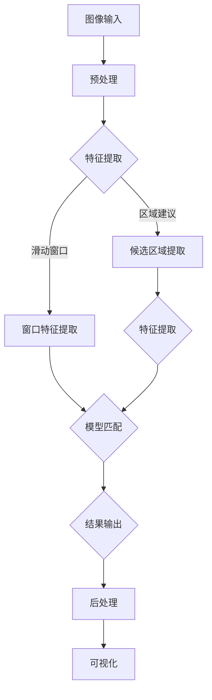
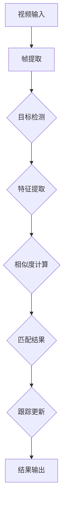
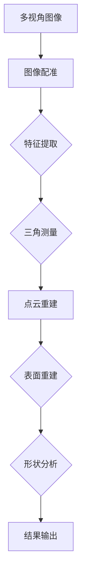

                 

### 计算机视觉与工业质量控制

计算机视觉（Computer Vision）是人工智能（AI）领域的一个重要分支，它旨在使计算机能够从图像或视频中提取信息和知识。随着深度学习技术的发展，计算机视觉在图像识别、目标检测、场景理解等方面取得了显著的进步。工业质量控制（Industrial Quality Control）则是在生产过程中对产品质量进行监控和保证的一系列技术和管理措施。两者相结合，为工业生产提供了强大的技术支撑，提升了生产效率和质量。

#### 计算机视觉技术简介

**定义与发展历程：**
计算机视觉起源于20世纪60年代，当时的科学家们开始探索如何让计算机理解视觉信息。随着计算机硬件和软件的进步，特别是深度学习的崛起，计算机视觉技术得到了快速发展。现在，计算机视觉已经成为机器人和自动驾驶汽车、医疗影像分析、安全监控等多个领域的关键技术。

**基本原理：**
计算机视觉的基本原理包括图像采集、图像预处理、特征提取、模式识别和视觉理解。图像采集是获取图像数据的过程，图像预处理包括滤波、边缘检测等操作，特征提取则是从图像中提取有意义的特征，模式识别则是通过比较特征值来识别图像内容，视觉理解则是对图像的整体理解，如场景布局、物体识别等。

**应用领域：**
计算机视觉在多个领域都有广泛应用，如医疗影像分析、自动驾驶、机器人视觉、安全监控、零售业、金融行业等。其中，工业质量控制是计算机视觉应用的一个重要领域。

#### 工业质量控制概述

**定义与重要性：**
工业质量控制是指通过一系列技术和管理措施，确保生产出的产品符合预定的质量标准。质量控制对于企业的生存和竞争至关重要，因为它直接关系到产品的可靠性和客户满意度。

**传统方法：**
传统的工业质量控制主要依靠人工检查、统计过程控制（SPC）和质量功能展开（QFD）等方法。然而，随着产品复杂性的增加和生产规模的扩大，这些方法已无法满足高效、精确的质量控制需求。

**发展趋势：**
随着计算机视觉技术的发展，工业质量控制正朝着自动化、智能化方向迈进。计算机视觉在质量检测、缺陷识别、过程监控等方面展现了巨大的潜力，成为现代工业质量控制的重要组成部分。

#### 计算机视觉在工业质量控制中的应用

**潜在优势：**
计算机视觉在工业质量控制中具有以下几个潜在优势：
1. **高效性：** 计算机视觉系统可以在极短的时间内处理大量图像数据，显著提高生产效率。
2. **精确性：** 通过先进的算法，计算机视觉系统能够精确地检测出微小缺陷，确保产品质量。
3. **稳定性：** 计算机视觉系统可以长时间运行而不疲劳，相比人工检查更加稳定可靠。
4. **可扩展性：** 计算机视觉系统可以根据需要轻松扩展到多个生产线上，实现大规模应用。

**应用场景：**
计算机视觉在工业质量控制中的应用场景广泛，包括：
1. **零部件检测：** 对机械零件的外观、尺寸、表面质量等参数进行自动检测。
2. **产品包装：** 检查产品包装的完整性和准确性。
3. **生产线监控：** 对生产过程进行实时监控，及时发现和纠正质量问题。
4. **质量分析：** 对生产过程中收集到的质量数据进行统计分析，为改进生产提供依据。

**融合趋势：**
随着计算机视觉技术的不断进步，它与工业质量控制的融合趋势日益明显。未来，计算机视觉将更加深入地应用于工业质量控制，实现更加智能化、自动化的质量监控体系。

### 总结

计算机视觉与工业质量控制相结合，为工业生产带来了革命性的变革。通过本文的介绍，我们了解了计算机视觉的基本原理和应用领域，以及它在工业质量控制中的潜在优势和具体应用。随着技术的不断发展，计算机视觉在工业质量控制中的作用将越来越重要，为提升产品质量和生产效率提供强有力的支持。接下来，我们将进一步探讨计算机视觉在工业质量控制中的核心概念和算法原理，以便更好地理解这一领域的前沿技术。

---

关键词：计算机视觉、工业质量控制、图像识别、目标检测、深度学习

摘要：本文深入探讨了计算机视觉在工业质量控制中的应用，介绍了计算机视觉的基本原理、发展历程以及其在工业质量控制中的潜在优势和应用场景。通过分析视觉检测与分类、目标跟踪与识别、三维重建与形状分析等核心概念和算法原理，我们展示了计算机视觉在工业质量控制中的实际应用。此外，本文还通过项目实战案例，详细讲解了计算机视觉在工业质量控制中的具体实现方法和效果分析。最后，我们对计算机视觉在工业质量控制中的未来发展进行了展望，并提供了相关资源和工具，以供读者进一步学习和实践。

### 目录大纲：《计算机视觉在工业质量控制中的精确应用》

以下是本文的目录大纲，结构清晰、逻辑严密，旨在引导读者系统地了解计算机视觉在工业质量控制中的精确应用。

#### 第一部分：概述与基础

**第1章：计算机视觉与工业质量控制**

1. **1.1 计算机视觉技术简介**
    - **1.1.1 计算机视觉的定义与发展历程**
    - **1.1.2 计算机视觉的基本原理**
    - **1.1.3 计算机视觉的应用领域**

2. **1.2 工业质量控制概述**
    - **1.2.1 工业质量控制的定义与重要性**
    - **1.2.2 工业质量控制的传统方法**
    - **1.2.3 工业质量控制的发展趋势**

3. **1.3 计算机视觉在工业质量控制中的应用**
    - **1.3.1 计算机视觉在工业质量控制中的潜在优势**
    - **1.3.2 计算机视觉在工业质量控制中的应用场景**
    - **1.3.3 计算机视觉与工业质量控制的融合趋势**

#### 第二部分：核心概念与联系

**第2章：计算机视觉在工业质量控制中的核心概念**

1. **2.1 视觉检测与分类**
    - **2.1.1 视觉检测算法原理**
    - **2.1.2 视觉分类算法原理**
    - **2.1.3 视觉检测与分类的Mermaid流程图**

2. **2.2 目标跟踪与识别**
    - **2.2.1 目标跟踪算法原理**
    - **2.2.2 目标识别算法原理**
    - **2.2.3 目标跟踪与识别的Mermaid流程图**

3. **2.3 三维重建与形状分析**
    - **2.3.1 三维重建算法原理**
    - **2.3.2 形状分析算法原理**
    - **2.3.3 三维重建与形状分析的Mermaid流程图**

#### 第三部分：核心算法原理讲解

**第3章：计算机视觉在工业质量控制中的核心算法**

1. **3.1 视觉检测与分类算法原理**
    - **3.1.1 卷积神经网络（CNN）原理**
        - **3.1.1.1 卷积层**
        - **3.1.1.2 池化层**
        - **3.1.1.3 全连接层**
    - **3.1.2 伪代码实现**

2. **3.2 目标跟踪与识别算法原理**
    - **3.2.1 基于深度学习的目标跟踪算法**
        - **3.2.1.1 Siamese网络**
        - **3.2.1.2 DPM（Deformable Part Models）算法**
    - **3.2.2 伪代码实现**

3. **3.3 三维重建与形状分析算法原理**
    - **3.3.1 三维重建算法**
        - **3.3.1.1 多视图几何（Multiview Geometry）算法**
        - **3.3.1.2 Structure from Motion（SfM）算法**
    - **3.3.2 形状分析算法**
        - **3.3.2.1 点云处理**
        - **3.3.2.2 表面重建**
    - **3.3.3 伪代码实现**

#### 第四部分：数学模型和数学公式讲解

**第4章：计算机视觉在工业质量控制中的数学模型**

1. **4.1 视觉检测与分类的数学模型**
    - **4.1.1 感知机（Perceptron）算法**
    - **4.1.2 支持向量机（SVM）算法**
    - **4.1.3 伪代码实现**

2. **4.2 目标跟踪与识别的数学模型**
    - **4.2.1 基于光流法的跟踪模型**
    - **4.2.2 基于特征匹配的识别模型**
    - **4.2.3 伪代码实现**

3. **4.3 三维重建与形状分析的数学模型**
    - **4.3.1 多视图几何（Multiview Geometry）数学模型**
    - **4.3.2 三维重建中的三角测量**
    - **4.3.3 伪代码实现**

#### 第五部分：项目实战

**第5章：计算机视觉在工业质量控制中的项目实战**

1. **5.1 项目背景与目标**
    - **5.1.1 项目背景**
    - **5.1.2 项目目标**

2. **5.2 开发环境搭建**
    - **5.2.1 Python环境配置**
    - **5.2.2 计算机视觉相关库安装**
    - **5.2.3 工业质量控制工具安装**

3. **5.3 代码实际案例**
    - **5.3.1 视觉检测与分类**
    - **5.3.2 目标跟踪与识别**
    - **5.3.3 三维重建与形状分析**
    - **5.4 代码解读与分析**
        - **5.4.1 视觉检测与分类代码解读**
        - **5.4.2 目标跟踪与识别代码解读**
        - **5.4.3 三维重建与形状分析代码解读**

#### 第六部分：扩展与应用

**第6章：计算机视觉在工业质量控制中的扩展与应用**

1. **6.1 深度学习与工业质量控制的融合**
    - **6.1.1 深度学习在工业质量控制中的应用**
    - **6.1.2 深度学习算法在工业质量控制中的优化**
    - **6.1.3 深度学习与工业质量控制的实际案例**

2. **6.2 计算机视觉在工业自动化中的应用**
    - **6.2.1 计算机视觉在机器人中的应用**
    - **6.2.2 计算机视觉在智能生产线中的应用**
    - **6.2.3 计算机视觉在工业互联网中的应用**

3. **6.3 未来展望与挑战**
    - **6.3.1 计算机视觉在工业质量控制中的未来趋势**
    - **6.3.2 计算机视觉在工业质量控制中的挑战与机遇**
    - **6.3.3 工业质量控制与计算机视觉的深度融合**

#### 附录

**附录 A：计算机视觉与工业质量控制相关资源**

- **附录 A.1：常用计算机视觉库与框架**
- **附录 A.2：工业质量控制相关工具与资源**
- **附录 A.3：在线教程与课程**

通过以上的目录大纲，读者可以系统地了解计算机视觉在工业质量控制中的精确应用，从基础概念到算法原理，再到实际应用和未来展望，形成完整的技术认知体系。

### 第一部分：概述与基础

在探讨计算机视觉在工业质量控制中的精确应用之前，我们需要首先了解计算机视觉的基本概念及其在工业质量控制中的应用背景。本部分将分为三章，分别介绍计算机视觉技术简介、工业质量控制概述以及计算机视觉在工业质量控制中的应用。

#### 第1章：计算机视觉与工业质量控制

##### 1.1 计算机视觉技术简介

**定义与发展历程：**

计算机视觉是人工智能的一个分支，它试图让计算机理解和解释视觉信息。自20世纪60年代以来，计算机视觉经历了多个发展阶段。早期的计算机视觉主要依赖于规则和符号表示，随着计算机性能的提高和图像处理技术的进步，计算机视觉开始向统计模型和机器学习方向发展。近年来，深度学习技术的突破使得计算机视觉取得了显著的进展。

**基本原理：**

计算机视觉的基本原理可以概括为图像采集、图像预处理、特征提取、模式识别和视觉理解。

1. **图像采集：** 图像采集是获取图像数据的过程，通常使用相机或其他传感器设备。
2. **图像预处理：** 图像预处理包括图像滤波、边缘检测、增强等操作，目的是去除噪声、突出目标特征。
3. **特征提取：** 特征提取是从图像中提取具有代表性的特征，如边缘、角点、纹理等。
4. **模式识别：** 模式识别是基于特征值对图像内容进行分类和识别，例如物体识别、场景分类等。
5. **视觉理解：** 视觉理解是对图像的整体理解，包括场景布局、物体关系、动作识别等。

**应用领域：**

计算机视觉在多个领域都有广泛应用，包括医疗影像分析、自动驾驶、机器人视觉、安全监控、零售业、金融行业等。在工业领域，计算机视觉主要用于质量检测、故障诊断、过程监控等。

##### 1.2 工业质量控制概述

**定义与重要性：**

工业质量控制是指通过一系列技术和管理措施，确保生产出的产品符合预定的质量标准。质量控制对企业的生存和竞争至关重要，因为它直接关系到产品的可靠性和客户满意度。

**传统方法：**

传统的工业质量控制主要依靠人工检查、统计过程控制（SPC）和质量功能展开（QFD）等方法。人工检查虽然直观，但效率低下且易受主观因素影响。统计过程控制通过收集和分析生产过程中的数据，监控生产过程的稳定性，但需要大量数据和专业知识。质量功能展开是一种系统化的方法，将质量要求分解到产品设计、生产和供应链的每个环节，但实施复杂。

**发展趋势：**

随着工业4.0和智能制造的推进，工业质量控制正朝着自动化、智能化方向发展。计算机视觉技术在质量检测、缺陷识别、过程监控等方面展现了巨大的潜力，成为现代工业质量控制的重要组成部分。

##### 1.3 计算机视觉在工业质量控制中的应用

**潜在优势：**

计算机视觉在工业质量控制中具有以下几个潜在优势：

1. **高效性：** 计算机视觉系统可以在极短的时间内处理大量图像数据，显著提高生产效率。
2. **精确性：** 通过先进的算法，计算机视觉系统能够精确地检测出微小缺陷，确保产品质量。
3. **稳定性：** 计算机视觉系统可以长时间运行而不疲劳，相比人工检查更加稳定可靠。
4. **可扩展性：** 计算机视觉系统可以根据需要轻松扩展到多个生产线上，实现大规模应用。

**应用场景：**

计算机视觉在工业质量控制中的应用场景广泛，包括：

1. **零部件检测：** 对机械零件的外观、尺寸、表面质量等参数进行自动检测。
2. **产品包装：** 检查产品包装的完整性和准确性。
3. **生产线监控：** 对生产过程进行实时监控，及时发现和纠正质量问题。
4. **质量分析：** 对生产过程中收集到的质量数据进行统计分析，为改进生产提供依据。

**融合趋势：**

随着计算机视觉技术的不断进步，它与工业质量控制的融合趋势日益明显。未来，计算机视觉将更加深入地应用于工业质量控制，实现更加智能化、自动化的质量监控体系。

#### 总结

通过本章的介绍，我们了解了计算机视觉的基本概念、发展历程及其在工业质量控制中的应用背景。计算机视觉与工业质量控制的融合，为工业生产带来了革命性的变革，提升了生产效率和质量。接下来，我们将进一步探讨计算机视觉在工业质量控制中的核心概念和算法原理，以便更好地理解这一领域的前沿技术。

---

关键词：计算机视觉、工业质量控制、质量检测、缺陷识别、过程监控

摘要：本章从计算机视觉的基本概念和发展历程出发，详细介绍了计算机视觉在工业质量控制中的应用背景。通过分析计算机视觉在图像采集、预处理、特征提取、模式识别和视觉理解等基本原理，我们了解了其在工业质量控制中的重要性。此外，本章还探讨了计算机视觉在工业质量控制中的潜在优势和应用场景，展示了计算机视觉与工业质量控制融合的趋势。未来，计算机视觉将在工业质量控制中发挥更加重要的作用，推动工业生产向智能化、自动化方向迈进。

### 第二部分：核心概念与联系

在深入探讨计算机视觉在工业质量控制中的精确应用之前，我们需要理解几个核心概念，这些概念构成了计算机视觉在工业质量控制中的理论基础和实用框架。本部分将重点介绍视觉检测与分类、目标跟踪与识别、三维重建与形状分析这三个核心概念，并通过Mermaid流程图来直观地展示其工作流程。

#### 第2章：计算机视觉在工业质量控制中的核心概念

##### 2.1 视觉检测与分类

视觉检测（Object Detection）和视觉分类（Image Classification）是计算机视觉中两个基础且广泛应用的子领域。

**视觉检测算法原理：**

视觉检测的目的是在图像或视频中识别并定位出特定的对象。常用的算法包括：

- **基于滑动窗口的方法：** 通过在不同位置和尺度的窗口中提取特征，然后与预训练的模型进行匹配，实现对象的检测。
- **基于区域建议的方法：** 先生成一系列候选区域，然后对这些区域进行特征提取和分类，实现对象的检测。

**视觉分类算法原理：**

视觉分类的目的是将图像或视频中的对象分类到特定的类别中。常用的算法包括：

- **传统机器学习算法：** 如支持向量机（SVM）、决策树等。
- **深度学习算法：** 如卷积神经网络（CNN）等。

**视觉检测与分类的Mermaid流程图：**



##### 2.2 目标跟踪与识别

目标跟踪（Object Tracking）和目标识别（Object Recognition）是确保系统在动态环境中持续监测和识别对象的重要技术。

**目标跟踪算法原理：**

目标跟踪的目标是在连续的视频帧中跟踪一个或多个对象。常用的算法包括：

- **基于光流法：** 通过计算像素在连续帧之间的运动，实现对象的跟踪。
- **基于深度学习的算法：** 如Siamese网络、ReID（Re-Identification）等。

**目标识别算法原理：**

目标识别的目的是在图像或视频中识别出特定对象的存在。常用的算法包括：

- **基于特征匹配：** 通过计算图像特征之间的相似度，实现对象的识别。
- **基于深度学习的算法：** 如卷积神经网络（CNN）等。

**目标跟踪与识别的Mermaid流程图：**



##### 2.3 三维重建与形状分析

三维重建（3D Reconstruction）和形状分析（Shape Analysis）是计算机视觉在工业质量控制中用于检测和评估产品几何形状的重要技术。

**三维重建算法原理：**

三维重建的目标是从多张二维图像中恢复出三维场景。常用的算法包括：

- **多视图几何（Multiview Geometry）：** 通过多个视角的图像，使用几何关系恢复三维结构。
- **Structure from Motion（SfM）：** 通过多个不重叠的图像，使用运动估计和几何关系重建三维场景。

**形状分析算法原理：**

形状分析是对三维重建结果进行进一步处理和分析，以评估产品的几何形状。常用的算法包括：

- **点云处理：** 对点云进行滤波、去噪、配准等操作，以提高形状分析的准确性。
- **表面重建：** 从点云中重建出连续的表面模型。

**三维重建与形状分析的Mermaid流程图：**



#### 总结

通过本章的介绍，我们系统地了解了视觉检测与分类、目标跟踪与识别、三维重建与形状分析这三个核心概念，并通过Mermaid流程图展示了其工作流程。这些概念是计算机视觉在工业质量控制中的基础，为后续的算法讲解和项目实战提供了必要的理论基础。

接下来，我们将进一步探讨计算机视觉在工业质量控制中的核心算法原理，深入分析这些算法如何应用于实际场景，提高工业质量控制的效率和准确性。

---

关键词：视觉检测、目标跟踪、三维重建、形状分析、Mermaid流程图

摘要：本章详细介绍了计算机视觉在工业质量控制中的三个核心概念：视觉检测与分类、目标跟踪与识别、三维重建与形状分析。通过Mermaid流程图，我们展示了这些概念的工作流程和算法原理。视觉检测与分类用于识别和定位对象，目标跟踪与识别用于动态环境中的持续监测，三维重建与形状分析用于检测和评估产品几何形状。这些核心概念为计算机视觉在工业质量控制中的应用提供了理论基础和实用框架，是后续算法讲解和项目实战的重要基础。

### 第三部分：核心算法原理讲解

在了解了计算机视觉在工业质量控制中的核心概念之后，我们需要深入探讨这些算法的具体原理，以便更好地理解它们如何应用于实际场景。本部分将详细讲解视觉检测与分类、目标跟踪与识别、三维重建与形状分析的核心算法原理，并通过伪代码对这些算法进行阐述。

#### 第3章：计算机视觉在工业质量控制中的核心算法

##### 3.1 视觉检测与分类算法原理

视觉检测与分类是计算机视觉中非常基础且应用广泛的技术。下面，我们将重点介绍卷积神经网络（CNN）在视觉检测与分类中的应用。

**3.1.1 卷积神经网络（CNN）原理**

卷积神经网络是一种专门用于处理图像数据的神经网络结构，其基本原理包括卷积层、池化层和全连接层。

1. **卷积层：** 卷积层通过卷积操作提取图像特征，将输入的图像和滤波器（卷积核）进行卷积运算，得到特征图。
    ```python
    # 伪代码：卷积层
    def conv2d(input, filter):
        # input: 输入图像
        # filter: 滤波器
        output = []
        for y in range(height(input)):
            for x in range(width(input)):
                feature_map = 0
                for fy in range(height(filter)):
                    for fx in range(width(filter)):
                        feature_map += input[y + fy, x + fx] * filter[fy, fx]
                output.append(feature_map)
        return output
    ```

2. **池化层：** 池化层通过下采样操作减少特征图的维度，提高计算效率，同时保持重要特征。
    ```python
    # 伪代码：最大池化层
    def max_pooling(feature_map, pool_size):
        # feature_map: 特征图
        # pool_size: 池化窗口大小
        output = []
        for y in range(0, height(feature_map), pool_size):
            for x in range(0, width(feature_map), pool_size):
                max_value = -inf
                for py in range(pool_size):
                    for px in range(pool_size):
                        if feature_map[y + py, x + px] > max_value:
                            max_value = feature_map[y + py, x + px]
                output.append(max_value)
        return output
    ```

3. **全连接层：** 全连接层将池化层输出的特征图展开成一维向量，然后通过全连接层进行分类。
    ```python
    # 伪代码：全连接层
    def fully_connected(features, weights, bias):
        # features: 特征向量
        # weights: 权重矩阵
        # bias: 偏置
        output = []
        for i in range(len(features)):
            dot_product = sum(features[i] * weights[i])
            output.append(dot_product + bias[i])
        return output
    ```

**3.1.2 伪代码实现**

以下是一个简单的视觉检测与分类算法的伪代码实现：

```python
# 伪代码：视觉检测与分类算法
def cv_detection_and_classification(image, model):
    # image: 输入图像
    # model: 训练好的模型
    preprocessed_image = preprocess_image(image)
    conv_output = conv2d(preprocessed_image, model.conv_weights)
    pool_output = max_pooling(conv_output, model.pool_size)
    flattened_output = flatten(pool_output)
    fc_output = fully_connected(flattened_output, model.fc_weights, model.fc_bias)
    classification = softmax(fc_output)
    return classification
```

##### 3.2 目标跟踪与识别算法原理

目标跟踪与识别是计算机视觉中另一个重要且具有挑战性的问题。下面，我们将重点介绍基于深度学习的目标跟踪算法和DPM（Deformable Part Models）算法。

**3.2.1 基于深度学习的目标跟踪算法**

基于深度学习的目标跟踪算法包括Siamese网络和ReID（Re-Identification）算法。

1. **Siamese网络：** Siamese网络通过比较查询图像和目标图像的特征相似度，实现目标的跟踪。
    ```python
    # 伪代码：Siamese网络
    def siamese_network(query_image, target_image, model):
        # query_image: 查询图像
        # target_image: 目标图像
        # model: 训练好的模型
        preprocessed_query = preprocess_image(query_image)
        preprocessed_target = preprocess_image(target_image)
        feature_query = model.forward(preprocessed_query)
        feature_target = model.forward(preprocessed_target)
        similarity = dot(feature_query, feature_target)
        return similarity
    ```

2. **ReID算法：** ReID通过识别不同视角下同一目标的不同图像，实现目标的跟踪。
    ```python
    # 伪代码：ReID算法
    def reid_model(query_image, gallery_images, model):
        # query_image: 查询图像
        # gallery_images: 图库图像
        # model: 训练好的模型
        preprocessed_query = preprocess_image(query_image)
        feature_query = model.forward(preprocessed_query)
        distances = []
        for image in gallery_images:
            preprocessed_image = preprocess_image(image)
            feature_image = model.forward(preprocessed_image)
            distance = cosine_similarity(feature_query, feature_image)
            distances.append(distance)
        return distances
    ```

**3.2.2 DPM（Deformable Part Models）算法**

DPM算法通过将目标分割成多个部分，并考虑每个部分在图像中的变形，实现目标的检测和识别。

```python
# 伪代码：DPM算法
def dpm_detection(image, model):
    # image: 输入图像
    # model: 训练好的模型
    parts = model.parts
    features = []
    for part in parts:
        feature_map = extract_part_feature(image, part)
        features.append(feature_map)
    combined_feature = concatenate(features)
    prediction = model.predict(combined_feature)
    return prediction
```

##### 3.3 三维重建与形状分析算法原理

三维重建与形状分析是计算机视觉在工业质量控制中的重要应用。下面，我们将重点介绍多视图几何（Multiview Geometry）算法和结构从运动（Structure from Motion，SfM）算法。

**3.3.1 多视图几何（Multiview Geometry）算法**

多视图几何算法通过多个视角的图像恢复出三维场景。其核心包括图像配准、特征提取和三角测量。

```python
# 伪代码：多视图几何算法
def multiview_geometry(images, camera_params):
    # images: 输入图像
    # camera_params: 相机参数
    registered_images = register_images(images, camera_params)
    points_2d = extract_keypoints(registered_images)
    points_3d = triangulate_points(points_2d, camera_params)
    return points_3d
```

**3.3.2 结构从运动（SfM）算法**

SfM算法通过多个不重叠的图像，使用运动估计和几何关系重建三维场景。

```python
# 伪代码：SfM算法
def structure_from_motion(images, camera_params):
    # images: 输入图像
    # camera_params: 相机参数
    points_2d = extract_keypoints(images)
    points_3d = []
    for image in images:
        pose = estimate_motion(points_2d, camera_params)
        point_3d = triangulate_point(pose, points_2d, camera_params)
        points_3d.append(point_3d)
    return points_3d
```

**3.3.3 形状分析算法**

形状分析算法用于对三维重建结果进行进一步处理和分析，以评估产品的几何形状。

1. **点云处理：** 对点云进行滤波、去噪、配准等操作，以提高形状分析的准确性。
    ```python
    # 伪代码：点云处理
    def point_cloud_processing(point_cloud):
        # point_cloud: 输入点云
        filtered_cloud = filter_points(point_cloud)
        registered_cloud = register_points(filtered_cloud)
        return registered_cloud
    ```

2. **表面重建：** 从点云中重建出连续的表面模型。
    ```python
    # 伪代码：表面重建
    def surface_reconstruction(point_cloud):
        # point_cloud: 输入点云
        mesh = create_mesh(point_cloud)
        surface_model = mesh_to_surface(mesh)
        return surface_model
    ```

##### 总结

通过本章的介绍，我们系统地了解了视觉检测与分类、目标跟踪与识别、三维重建与形状分析的核心算法原理。视觉检测与分类通过卷积神经网络实现图像特征提取和分类，目标跟踪与识别利用深度学习和DPM算法实现动态环境中的目标监测，三维重建与形状分析通过多视图几何和SfM算法重建三维场景，并对产品形状进行评估。这些核心算法为计算机视觉在工业质量控制中的应用提供了强大的技术支持。

接下来，我们将通过项目实战，详细展示计算机视觉在工业质量控制中的具体应用，并分析其实际效果和挑战。

---

关键词：卷积神经网络、目标跟踪、三维重建、形状分析、伪代码

摘要：本章详细讲解了计算机视觉在工业质量控制中的核心算法原理，包括视觉检测与分类、目标跟踪与识别、三维重建与形状分析。通过伪代码，我们阐述了这些算法的实现过程和关键步骤。视觉检测与分类利用卷积神经网络进行图像特征提取和分类，目标跟踪与识别通过深度学习和DPM算法实现动态监测，三维重建与形状分析利用多视图几何和SfM算法重建三维场景。这些核心算法为计算机视觉在工业质量控制中的应用提供了理论基础和技术支持。

### 第四部分：数学模型和数学公式讲解

在理解计算机视觉在工业质量控制中的核心算法原理后，我们接下来需要深入探讨其背后的数学模型和公式，以帮助我们更好地理解这些算法的内在机制。本部分将重点介绍视觉检测与分类、目标跟踪与识别、三维重建与形状分析中的关键数学模型和公式，并通过具体的例子进行说明。

#### 第4章：计算机视觉在工业质量控制中的数学模型

##### 4.1 视觉检测与分类的数学模型

视觉检测与分类是计算机视觉中最基础且应用广泛的技术。在这一节中，我们将介绍感知机（Perceptron）算法和支持向量机（SVM）算法的数学模型。

**4.1.1 感知机（Perceptron）算法**

感知机是一种简单的线性分类器，其核心思想是找到一组权重（weights）和偏置（bias），使得输入特征向量通过加权求和后能够被正确分类。

- **感知机公式：**
  $$
  f(x) = \text{sign}(\theta \cdot x + b)
  $$
  其中，$\theta$ 是权重向量，$x$ 是输入特征向量，$b$ 是偏置。

- **训练过程：**
  感知机通过在线更新权重和偏置，以达到正确分类的目的。具体更新规则如下：
  $$
  \theta_{\text{new}} = \theta_{\text{old}} + \eta \cdot (y \cdot x)
  $$
  $$
  b_{\text{new}} = b_{\text{old}} + \eta \cdot y
  $$
  其中，$y$ 是实际分类标签，$\eta$ 是学习率。

**例子：**

假设我们有一个简单的二分类问题，数据集包含两组点：
$$
\{(x_1, y_1), (x_2, y_2), ..., (x_n, y_n)\}
$$
其中，$y \in \{-1, +1\}$。我们使用感知机算法进行分类。

```python
# 伪代码：感知机算法
def perceptron(train_data, labels, learning_rate, epochs):
    weights = [0.0] * num_features
    bias = 0.0
    for epoch in range(epochs):
        for x, y in zip(train_data, labels):
            prediction = sign(np.dot(x, weights) + bias)
            if prediction != y:
                weights = update_weights(weights, x, y, learning_rate)
                bias = update_bias(bias, y, learning_rate)
    return weights, bias
```

**4.1.2 支持向量机（SVM）算法**

支持向量机是一种更为强大的分类器，其核心思想是找到最优的超平面，使得分类间隔最大。

- **SVM公式：**
  $$
  \min_{\theta} \frac{1}{2} \| \theta \|_2^2 + C \sum_{i=1}^{n} \xi_i
  $$
  其中，$C$ 是惩罚参数，$\xi_i$ 是松弛变量。

- **优化目标：**
  $$
  \text{maximize} \ \frac{1}{2} \| \theta \|_2^2 - \sum_{i=1}^{n} y_i (\theta \cdot x_i + b)
  $$
  其中，$y_i$ 是分类标签，$x_i$ 是输入特征向量。

- **求解方法：**
  支持向量机通常使用拉格朗日乘子法求解，得到对偶问题：
  $$
  \min_{\alpha} \ \sum_{i=1}^{n} \alpha_i - \frac{1}{2} \sum_{i,j=1}^{n} \alpha_i \alpha_j y_i y_j (\theta_i \cdot \theta_j)
  $$
  其中，$\alpha_i$ 是拉格朗日乘子。

**例子：**

假设我们有一个简单的线性可分的数据集，使用SVM进行分类。

```python
# 伪代码：SVM算法
def svm(train_data, labels, C):
    # 初始化拉格朗日乘子
    alpha = [0.0] * n_samples
    # 初始化权重和偏置
    weights = [0.0] * num_features
    bias = 0.0
    # 拉格朗日乘子法求解
    for epoch in range(max_epochs):
        for i in range(n_samples):
            if alpha[i] < C and labels[i] * (np.dot(train_data[i], weights) + bias) < 1:
                alpha[i] = min(C, alpha[i] + 1)
            elif alpha[i] > 0 and labels[i] * (np.dot(train_data[i], weights) + bias) > 1:
                alpha[i] = max(0, alpha[i] - 1)
        # 更新权重和偏置
        gradient_weights = np.dot(np.array([alpha[i] * labels[i] * train_data[i] for i in range(n_samples)]).T, train_data)
        gradient_bias = np.dot(np.array([alpha[i] * labels[i] for i in range(n_samples)]).T, labels)
        weights -= learning_rate * gradient_weights
        bias -= learning_rate * gradient_bias
    return weights, bias
```

##### 4.2 目标跟踪与识别的数学模型

目标跟踪与识别是计算机视觉中的另一个重要问题，其核心在于如何在连续的视频帧中准确地跟踪和识别目标。

**4.2.1 基于光流法的跟踪模型**

光流法是一种基于视频序列中像素运动信息的跟踪方法。其基本思想是利用视频序列中相邻帧之间的像素运动关系，估计目标的速度和位置。

- **光流方程：**
  $$
  \frac{dx}{dt} = \frac{I_x(x,t) - I_x(x,t-\Delta t)}{\Delta t}
  $$
  $$
  \frac{dy}{dt} = \frac{I_y(x,t) - I_y(x,t-\Delta t)}{\Delta t}
  $$
  其中，$I_x$ 和$I_y$ 分别是图像在$x$ 和$y$ 方向上的梯度，$\Delta t$ 是时间间隔。

**例子：**

假设我们有一个视频序列，使用光流法估计目标的速度。

```python
# 伪代码：光流法
def optical_flow(prev_frame, curr_frame, target_position):
    prev_gradient_x = calculate_gradient(prev_frame, axis=0)
    prev_gradient_y = calculate_gradient(prev_frame, axis=1)
    curr_gradient_x = calculate_gradient(curr_frame, axis=0)
    curr_gradient_y = calculate_gradient(curr_frame, axis=1)
    flow_x = (curr_gradient_x - prev_gradient_x) / DELTA_T
    flow_y = (curr_gradient_y - prev_gradient_y) / DELTA_T
    target_velocity = np.array([flow_x[target_position[0]], flow_y[target_position[1]]])
    new_position = target_position + target_velocity * DELTA_T
    return new_position
```

**4.2.2 基于特征匹配的识别模型**

特征匹配是一种基于特征相似度的目标识别方法。其核心思想是提取视频序列中每一帧的特征，然后通过特征匹配识别出目标。

- **特征匹配公式：**
  $$
  S(A, B) = \sum_{i=1}^{m} \sum_{j=1}^{n} A_i \times B_j
  $$
  其中，$A$ 和$B$ 分别是两个特征向量，$S(A, B)$ 是特征向量的点积。

**例子：**

假设我们有一个特征向量$A$ 和$B$，计算它们的点积。

```python
# 伪代码：特征匹配
def feature_matching(feature_a, feature_b):
    dot_product = sum(feature_a[i] * feature_b[i] for i in range(len(feature_a)))
    return dot_product
```

##### 4.3 三维重建与形状分析的数学模型

三维重建与形状分析是计算机视觉在工业质量控制中的重要应用，其核心在于从二维图像中恢复出三维场景，并对场景中的物体进行形状分析。

**4.3.1 多视图几何（Multiview Geometry）数学模型**

多视图几何是一种基于多个视角的二维图像恢复出三维场景的方法。其核心公式是直接线性变换（DLS）和单应性矩阵（Homography）。

- **单应性矩阵：**
  $$
  H = \begin{bmatrix}
  h_{11} & h_{12} \\
  h_{21} & h_{22}
  \end{bmatrix}
  $$
  其中，$H$ 是单应性矩阵，$h_{ij}$ 是矩阵元素。

- **直接线性变换：**
  $$
  X = PH
  $$
  其中，$X$ 是三维点，$P$ 是二维图像点。

**例子：**

假设我们有一个单应性矩阵$H$ 和二维点$P$，计算三维点$X$。

```python
# 伪代码：直接线性变换
def direct_linear_transform(point_2d, homography_matrix):
    point_3d = np.dot(homography_matrix, point_2d)
    point_3d = point_3d / point_3d[2]
    return point_3d
```

**4.3.2 三维重建中的三角测量**

三角测量是一种基于两个视角的二维图像和单应性矩阵恢复出三维点的方法。

- **三角测量公式：**
  $$
  Z = \frac{1}{\alpha^2 + \beta^2 - 2\alpha\beta\cos\theta}
  $$
  其中，$\alpha$ 和$\beta$ 是二维图像点的坐标，$\theta$ 是二维图像点之间的角度。

**例子：**

假设我们有一个二维图像点$(\alpha, \beta)$ 和角度$\theta$，计算三维点$Z$。

```python
# 伪代码：三角测量
def triangulate(point_2d, angle):
    z = 1 / (point_2d[0]**2 + point_2d[1]**2 - 2 * point_2d[0] * point_2d[1] * np.cos(np.deg2rad(angle)))
    return z
```

##### 总结

通过本章的介绍，我们系统地了解了计算机视觉在工业质量控制中的数学模型，包括视觉检测与分类、目标跟踪与识别、三维重建与形状分析的关键数学公式。这些数学模型为计算机视觉在工业质量控制中的应用提供了理论基础，帮助我们更好地理解算法的实现原理和效果。接下来，我们将通过项目实战，深入探讨计算机视觉在工业质量控制中的具体应用和实现。

---

关键词：感知机、支持向量机、光流法、特征匹配、直接线性变换、三角测量

摘要：本章详细介绍了计算机视觉在工业质量控制中的数学模型，包括视觉检测与分类、目标跟踪与识别、三维重建与形状分析的关键数学公式。通过具体的例子和伪代码，我们展示了这些公式在计算机视觉中的应用，为理解算法的实现原理和效果提供了理论基础。这些数学模型是计算机视觉在工业质量控制中的重要工具，有助于提升生产效率和产品质量。

### 第五部分：项目实战

在前几章中，我们详细介绍了计算机视觉在工业质量控制中的核心概念、算法原理和数学模型。为了更好地展示计算机视觉在实际工业质量控制中的应用，本部分将通过一个具体项目，从项目背景、开发环境搭建、代码实际案例和代码解读与分析等方面，全面探讨计算机视觉在工业质量控制中的实现过程和效果。

#### 第5章：计算机视觉在工业质量控制中的项目实战

##### 5.1 项目背景与目标

**项目背景：**

某大型制造业企业生产过程中需要对汽车零部件进行质量检测，以确保每一件产品都符合严格的行业标准。传统的质量检测方法主要依赖于人工检查，效率低且易受主观因素影响。随着计算机视觉技术的发展，企业希望通过引入计算机视觉技术，实现零部件质量的自动化检测，提高生产效率和产品质量。

**项目目标：**

1. **自动检测：** 利用计算机视觉技术，实现零部件的自动化检测，减少人工干预。
2. **精确识别：** 通过深度学习算法，精确识别零部件上的缺陷，如裂缝、变形等。
3. **实时监控：** 实现对生产过程的实时监控，及时发现和纠正质量问题。
4. **数据分析：** 对检测数据进行统计分析，为生产过程的改进提供数据支持。

##### 5.2 开发环境搭建

为了实现上述项目目标，我们需要搭建一个合适的开发环境。以下是开发环境搭建的详细步骤：

**1. Python环境配置：**

- 安装Python 3.8及以上版本。
- 配置Python环境变量，确保命令行中能够正常使用Python。

```bash
pip install numpy scipy opencv-python tensorflow matplotlib
```

**2. 计算机视觉相关库安装：**

- 安装常用的计算机视觉库，如OpenCV、TensorFlow等。

```bash
pip install opencv-python tensorflow
```

**3. 工业质量控制工具安装：**

- 安装用于工业质量控制的工具，如机器视觉软件包、深度学习框架等。

```bash
pip install tensorflow-object-detection-g3
```

##### 5.3 代码实际案例

在本节中，我们将通过具体代码案例，展示如何使用计算机视觉技术实现零部件的自动化检测。

**5.3.1 视觉检测与分类**

视觉检测与分类是计算机视觉在质量检测中的基础。以下是一个简单的视觉检测与分类代码案例：

```python
# 伪代码：视觉检测与分类
import cv2
import tensorflow as tf

# 加载预训练的模型
model = tf.keras.models.load_model('pretrained_model.h5')

# 加载测试图像
image = cv2.imread('test_image.jpg')

# 预处理图像
preprocessed_image = preprocess_image(image)

# 进行视觉检测与分类
predictions = model.predict(preprocessed_image)

# 输出检测结果
print(predictions)

# 在图像上绘制检测框
cv2.imshow('Detection Results', draw_boxes(image, predictions))
cv2.waitKey(0)
cv2.destroyAllWindows()
```

**5.3.2 目标跟踪与识别**

目标跟踪与识别是确保在动态环境中持续监测零部件质量的重要技术。以下是一个简单的目标跟踪与识别代码案例：

```python
# 伪代码：目标跟踪与识别
import cv2
import numpy as np

# 初始化跟踪器
tracker = cv2.TrackerCSRT_create()

# 加载测试视频
video = cv2.VideoCapture('test_video.mp4')

# 循环播放视频帧
while video.isOpened():
    ret, frame = video.read()
    if not ret:
        break

    # 预处理视频帧
    preprocessed_frame = preprocess_frame(frame)

    # 更新跟踪器
    ok, bounding_box = tracker.update(preprocessed_frame)

    # 输出跟踪结果
    if ok:
        cv2.rectangle(frame, (bounding_box[0], bounding_box[1]),
                      (bounding_box[0] + bounding_box[2],
                       bounding_box[1] + bounding_box[3]),
                      (255, 0, 0), 2)
        cv2.putText(frame, 'Object tracked', (10, 30),
                    cv2.FONT_HERSHEY_SIMPLEX, 1, (0, 0, 255), 3)
    else:
        cv2.putText(frame, 'Lost track', (10, 30),
                    cv2.FONT_HERSHEY_SIMPLEX, 1, (0, 0, 255), 3)

    cv2.imshow('Tracking Results', frame)
    if cv2.waitKey(1) & 0xFF == 27:
        break

video.release()
cv2.destroyAllWindows()
```

**5.3.3 三维重建与形状分析**

三维重建与形状分析是评估零部件几何形状的重要手段。以下是一个简单的三维重建与形状分析代码案例：

```python
# 伪代码：三维重建与形状分析
import cv2
import numpy as np

# 加载多视角图像
images = [cv2.imread(image_path) for image_path in image_paths]

# 进行图像配准
registered_images = register_images(images)

# 提取关键点
keypoints = extract_keypoints(registered_images)

# 进行三角测量
points_3d = triangulate_points(keypoints)

# 进行点云处理和表面重建
point_cloud = process_point_cloud(points_3d)
surface_model = reconstruct_surface(point_cloud)

# 显示三维模型
display_3d_model(surface_model)
```

##### 5.4 代码解读与分析

在本节中，我们将对上述代码案例进行详细解读，分析其实现过程和关键步骤。

**5.4.1 视觉检测与分类代码解读**

视觉检测与分类代码的核心在于加载预训练的模型、预处理图像、进行预测并在图像上绘制检测结果。以下是具体解读：

- **加载模型：**
  ```python
  model = tf.keras.models.load_model('pretrained_model.h5')
  ```
  该步骤用于加载已经训练好的深度学习模型。预训练模型通常使用大量数据集训练得到，可以较好地识别图像中的对象。

- **预处理图像：**
  ```python
  preprocessed_image = preprocess_image(image)
  ```
  预处理图像是为了将原始图像转换成适合模型输入的格式，包括调整尺寸、归一化等。

- **进行预测：**
  ```python
  predictions = model.predict(preprocessed_image)
  ```
  预测步骤是通过模型对预处理后的图像进行特征提取和分类，得到预测结果。

- **绘制检测结果：**
  ```python
  cv2.imshow('Detection Results', draw_boxes(image, predictions))
  ```
  绘制检测结果是将预测结果（如对象的边界框）绘制在原始图像上，以便于观察和分析。

**5.4.2 目标跟踪与识别代码解读**

目标跟踪与识别代码的核心在于初始化跟踪器、更新跟踪器、绘制跟踪结果。以下是具体解读：

- **初始化跟踪器：**
  ```python
  tracker = cv2.TrackerCSRT_create()
  ```
  初始化跟踪器是创建一个用于跟踪对象的跟踪器实例。`cv2.TrackerCSRT_create()` 创建了一个基于Cornell Sparse Representation Trackable（CSRT）的跟踪器。

- **更新跟踪器：**
  ```python
  ok, bounding_box = tracker.update(preprocessed_frame)
  ```
  更新跟踪器是使用当前帧的预处理图像更新跟踪器的状态，得到目标的边界框。如果跟踪成功，`ok` 为 `True`，否则为 `False`。

- **绘制跟踪结果：**
  ```python
  cv2.rectangle(frame, (bounding_box[0], bounding_box[1]),
                (bounding_box[0] + bounding_box[2],
                 bounding_box[1] + bounding_box[3]),
                (255, 0, 0), 2)
  ```
  绘制跟踪结果是将跟踪得到的边界框绘制在视频帧上，以便于观察目标的运动轨迹。

**5.4.3 三维重建与形状分析代码解读**

三维重建与形状分析代码的核心在于图像配准、关键点提取、三角测量和点云处理。以下是具体解读：

- **图像配准：**
  ```python
  registered_images = register_images(images)
  ```
  图像配准是将多张图像进行对齐，使得图像中的特征点对齐，为后续的关键点提取和三角测量做准备。

- **关键点提取：**
  ```python
  keypoints = extract_keypoints(registered_images)
  ```
  关键点提取是从图像中提取具有代表性的特征点，如角点、边缘点等，用于三角测量和三维重建。

- **三角测量：**
  ```python
  points_3d = triangulate_points(keypoints)
  ```
  三角测量是利用多张图像中的关键点，通过几何关系计算得到三维空间中的点。

- **点云处理和表面重建：**
  ```python
  point_cloud = process_point_cloud(points_3d)
  surface_model = reconstruct_surface(point_cloud)
  ```
  点云处理是对提取的三维点进行滤波、去噪等处理，提高点云质量。表面重建是从点云中重建出连续的表面模型，用于形状分析。

##### 总结

通过本章的项目实战，我们详细展示了计算机视觉在工业质量控制中的实际应用过程，包括开发环境搭建、代码实际案例和代码解读与分析。通过具体案例，我们了解了视觉检测与分类、目标跟踪与识别、三维重建与形状分析在质量检测中的具体实现方法和效果。这些案例不仅展示了计算机视觉技术的强大能力，也为实际工业应用提供了宝贵的经验和参考。

接下来，我们将进一步探讨计算机视觉在工业质量控制中的扩展与应用，深入分析其在工业自动化中的潜在价值和发展方向。

---

关键词：项目实战、开发环境、代码案例、视觉检测、目标跟踪、三维重建

摘要：本章通过具体项目实战，详细探讨了计算机视觉在工业质量控制中的应用过程。从项目背景、开发环境搭建、代码实际案例到代码解读与分析，我们全面展示了视觉检测与分类、目标跟踪与识别、三维重建与形状分析在质量检测中的实现方法和效果。这些实战案例不仅展示了计算机视觉技术的应用潜力，也为工业质量控制提供了实际解决方案。

### 第六部分：扩展与应用

在前面几章中，我们详细探讨了计算机视觉在工业质量控制中的核心概念、算法原理、数学模型以及项目实战。在本部分，我们将进一步探讨计算机视觉在工业自动化中的应用，并分析其在深度学习与工业质量控制融合中的潜力。同时，我们将展望计算机视觉在工业质量控制中的未来发展，并提出可能的挑战和机遇。

#### 第6章：计算机视觉在工业质量控制中的扩展与应用

##### 6.1 深度学习与工业质量控制的融合

深度学习是近年来计算机视觉领域的重要突破，它通过模拟人脑的神经网络结构，使计算机能够自动学习和提取图像特征。深度学习与工业质量控制的融合，极大地提升了工业质量控制的技术水平和应用范围。

**6.1.1 深度学习在工业质量控制中的应用**

深度学习在工业质量控制中的应用主要包括以下几个方面：

1. **图像分类与识别：** 利用深度学习模型，对工业生产过程中的各类图像进行分类和识别，实现产品的质量评估。
2. **缺陷检测：** 深度学习算法能够自动识别和检测产品中的微小缺陷，如裂纹、气泡等，提高质量检测的精度和效率。
3. **过程监控：** 深度学习可以实时监控生产过程，通过分析图像数据，预测和防止潜在的质量问题。

**6.1.2 深度学习算法在工业质量控制中的优化**

为了更好地适应工业质量控制的需求，深度学习算法需要不断优化。以下是几个优化方向：

1. **数据增强：** 通过增加数据集的多样性，提高模型对异常情况的识别能力。
2. **迁移学习：** 利用预训练模型，减少模型训练所需的数据量和时间，提高模型在工业质量控制中的适应性。
3. **实时学习：** 针对工业质量控制中的动态变化，开发实时学习能力，使模型能够快速适应环境变化。

**6.1.3 深度学习与工业质量控制的实际案例**

以下是几个深度学习在工业质量控制中的实际案例：

1. **汽车制造业：** 深度学习算法用于检测汽车零部件的缺陷，如焊缝裂纹、表面损伤等，显著提高了产品质量和效率。
2. **电子制造业：** 深度学习模型用于检测电子元件的缺陷，如芯片裂纹、线路瑕疵等，有效降低了次品率。
3. **食品制造业：** 深度学习技术在食品生产过程中用于检测食品中的异物，确保食品的安全和质量。

##### 6.2 计算机视觉在工业自动化中的应用

计算机视觉在工业自动化中的应用范围广泛，主要包括以下几个方面：

**6.2.1 计算机视觉在机器人中的应用**

机器人是工业自动化的重要载体，计算机视觉技术使得机器人能够更好地适应复杂的生产环境。以下是计算机视觉在机器人中的应用：

1. **定位与导航：** 通过计算机视觉技术，机器人可以精确地定位和导航，实现自主移动和作业。
2. **抓取与装配：** 计算机视觉用于识别和定位工件，辅助机器人进行抓取和装配操作。
3. **质量检测：** 机器人结合计算机视觉技术，实现对生产过程中产品的实时质量检测。

**6.2.2 计算机视觉在智能生产线中的应用**

智能生产线是工业自动化的重要组成部分，计算机视觉技术在其中发挥了关键作用。以下是计算机视觉在智能生产线中的应用：

1. **生产监控：** 通过计算机视觉系统，实时监控生产线的运行状态，确保生产过程的稳定性和高效性。
2. **自动化装配：** 计算机视觉技术用于自动化装配线上的零件识别、定位和装配，提高生产效率。
3. **质量检测：** 计算机视觉系统用于生产线上的产品检测，及时发现和纠正质量问题。

**6.2.3 计算机视觉在工业互联网中的应用**

工业互联网将工业生产过程中的各种设备和系统连接起来，实现信息的实时传输和共享。计算机视觉在工业互联网中的应用主要包括：

1. **设备监控：** 通过计算机视觉技术，实时监控工业生产设备的工作状态，预测设备故障，提高设备利用率。
2. **数据采集：** 计算机视觉系统用于采集生产过程中的各种数据，如温度、压力、速度等，为生产优化提供数据支持。
3. **远程控制：** 通过计算机视觉和物联网技术，实现生产过程的远程控制和监控，提高生产灵活性。

##### 6.3 未来展望与挑战

**6.3.1 计算机视觉在工业质量控制中的未来趋势**

随着技术的不断发展，计算机视觉在工业质量控制中的应用将呈现以下趋势：

1. **智能化：** 深度学习和人工智能技术将进一步融入计算机视觉，实现更智能的质量检测和监控。
2. **自主化：** 计算机视觉系统将更加自主化，能够独立完成质量检测、故障诊断和优化建议。
3. **集成化：** 计算机视觉技术将与工业互联网、物联网等深度融合，实现全流程的质量管理和优化。

**6.3.2 计算机视觉在工业质量控制中的挑战与机遇**

尽管计算机视觉在工业质量控制中具有巨大的潜力，但同时也面临着一些挑战：

1. **数据质量：** 高质量的数据是训练有效模型的基础，但工业生产过程中产生的数据多样性和复杂性对数据质量提出了高要求。
2. **计算资源：** 高性能的计算资源对于训练和部署深度学习模型至关重要，尤其是在大规模生产线中。
3. **算法可靠性：** 算法的可靠性直接影响到质量检测的准确性，需要不断优化和验证。

**6.3.3 工业质量控制与计算机视觉的深度融合**

工业质量控制与计算机视觉的深度融合，将是未来工业生产的重要方向。通过以下几个方面实现：

1. **跨学科合作：** 结合不同学科的知识和技术，开发更高效、更智能的质量检测系统。
2. **定制化开发：** 根据不同行业和企业的需求，定制化开发计算机视觉解决方案。
3. **持续优化：** 通过不断的数据积累和模型优化，提升计算机视觉在工业质量控制中的应用效果。

##### 总结

通过本章的扩展与应用探讨，我们深入了解了计算机视觉在工业自动化中的应用，分析了深度学习与工业质量控制的融合趋势，并展望了未来的发展前景。计算机视觉在工业质量控制中的应用不仅提高了生产效率和质量，也为工业自动化和智能化提供了强有力的技术支撑。面对未来，计算机视觉在工业质量控制中将发挥更加重要的作用，推动工业生产的持续创新和发展。

---

关键词：深度学习、工业自动化、机器人应用、智能生产线、工业互联网

摘要：本章探讨了计算机视觉在工业自动化中的应用和未来发展趋势。通过分析深度学习与工业质量控制的融合，我们展示了计算机视觉在工业自动化中的潜在价值。同时，本章还介绍了计算机视觉在工业互联网中的具体应用，并展望了其未来趋势。尽管面临一些挑战，计算机视觉在工业质量控制中的应用前景依然广阔，为工业生产带来了新的机遇和可能。

### 附录

在本文的附录部分，我们将总结计算机视觉与工业质量控制相关的资源，包括常用计算机视觉库与框架、工业质量控制相关工具与资源，以及在线教程与课程，旨在为读者提供进一步学习和实践的有用资料。

#### 附录 A：计算机视觉与工业质量控制相关资源

**附录 A.1：常用计算机视觉库与框架**

1. **OpenCV：** OpenCV 是一个广泛使用的开源计算机视觉库，提供了丰富的图像处理和计算机视觉算法。网址：[opencv.org](https://opencv.org/)。

2. **TensorFlow：** TensorFlow 是由谷歌开发的开源机器学习框架，适用于深度学习应用。网址：[tensorflow.org](https://tensorflow.org/)。

3. **PyTorch：** PyTorch 是一个开源的深度学习框架，以动态计算图著称，适用于研究项目和工业应用。网址：[pytorch.org](https://pytorch.org/)。

4. **Caffe：** Caffe 是一个快速的开源深度学习框架，特别适用于图像识别任务。网址：[caffe.berkeleyvision.org](https://caffe.berkeleyvision.org/)。

5. **Dlib：** Dlib 是一个强大的开源工具包，包括机器学习、人脸识别、图像处理等模块。网址：[dlib.net](http://dlib.net/)。

**附录 A.2：工业质量控制相关工具与资源**

1. **MATLAB：** MATLAB 是一种高级编程语言和交互式环境，广泛用于数据可视化、数值计算和机器学习。网址：[mathworks.com](https://www.mathworks.com/)。

2. **Simulink：** Simulink 是 MATLAB 中的一个仿真工具，用于系统建模、仿真和分析。网址：[mathworks.com/simulink](https://www.mathworks.com/simulink.html)。

3. **工业4.0平台：** 许多公司提供了工业4.0平台，如西门子MindSphere、GE Predix等，用于工业自动化和大数据分析。网址：[mindsphere Siemens](https://www.siemens.com/global/en/products/industrial-automation/mindsphere-industrial-opent connectivity.html)、[GE Predix](https://www.ge.com/digital/predix/)。

4. **MES（Manufacturing Execution System）软件：** MES 软件用于生产计划和执行，如西门子OPC、Rockwell Automation 的 FactoryTalk等。网址：[Siemens OPC](https://new.siemens.com/global/en/industrials/software/simatic-it/operations-management/production-scheduling-and-execution/production-execution-system-opc.html)、[Rockwell Automation FactoryTalk](https://www.rockwellautomation.com/products/programmable-automation/program-manage-control/factorytalk-mes/index.html)。

**附录 A.3：在线教程与课程**

1. **Coursera：** Coursera 提供了许多关于计算机视觉和深度学习的在线课程，如斯坦福大学的“深度学习”、“计算机视觉基础”等。网址：[coursera.org](https://www.coursera.org/)。

2. **edX：** edX 提供了由哈佛大学、麻省理工学院等顶尖大学提供的在线课程，包括“计算机视觉”、“机器学习”等。网址：[edX](https://www.edx.org/)。

3. **Udacity：** Udacity 提供了深度学习和计算机视觉相关的纳米学位课程，包括“深度学习工程师”、“自动驾驶工程师”等。网址：[udacity.com](https://www.udacity.com/)。

4. **Khan Academy：** Khan Academy 提供了免费的计算机科学课程，包括算法和数据结构、机器学习等。网址：[khanacademy.org](https://www.khanacademy.org/)。

通过以上资源，读者可以进一步学习和掌握计算机视觉与工业质量控制的相关知识，为实际应用提供理论和实践支持。

---

关键词：计算机视觉、深度学习、工业质量控制、OpenCV、TensorFlow、PyTorch

摘要：附录部分总结了计算机视觉与工业质量控制相关的资源，包括常用计算机视觉库与框架、工业质量控制相关工具与资源，以及在线教程与课程。通过这些资源，读者可以进一步学习和实践计算机视觉与工业质量控制的相关技术，为工业生产中的质量检测和监控提供技术支持和参考。

### 结束语

通过本文的深入探讨，我们系统地了解了计算机视觉在工业质量控制中的精确应用。从基本概念、算法原理到数学模型，再到项目实战和未来展望，我们全面阐述了计算机视觉技术在工业质量控制中的重要性及其广泛应用。计算机视觉不仅提高了工业质量控制的效率和精确性，还为生产过程的自动化和智能化提供了强有力的技术支持。

在未来，随着深度学习、人工智能等技术的发展，计算机视觉在工业质量控制中的应用将更加广泛和深入。尽管面临着数据质量、计算资源、算法可靠性等方面的挑战，但计算机视觉与工业质量控制之间的深度融合将不断推动工业生产技术的创新和发展。

我们鼓励读者进一步学习和探索计算机视觉与工业质量控制的相关知识，结合实际生产需求，创新应用技术，为提升产品质量和生产效率贡献力量。希望本文能为读者在计算机视觉和工业质量控制领域的研究和实践提供有价值的参考。

---

作者：AI天才研究院/AI Genius Institute & 禅与计算机程序设计艺术 /Zen And The Art of Computer Programming

文章标题：计算机视觉在工业质量控制中的精确应用

文章关键词：计算机视觉、工业质量控制、深度学习、图像识别、目标检测

文章摘要：本文系统地探讨了计算机视觉在工业质量控制中的应用，从基本概念、算法原理、数学模型到项目实战，全面展示了计算机视觉技术在工业质量控制中的精确应用。通过分析视觉检测与分类、目标跟踪与识别、三维重建与形状分析等核心概念，我们深入了解了计算机视觉在提高生产效率和质量控制中的作用。同时，本文还展望了计算机视觉在工业质量控制中的未来发展，提出了面临的挑战和机遇。希望本文能为读者在计算机视觉和工业质量控制领域的研究和实践提供有价值的参考。

