                 

### 《认知偏差2.0：AI时代的新型思维陷阱》

> **关键词：** 认知偏差、AI、数据偏见、机器学习、自动化决策、治理策略

> **摘要：** 本文深入探讨了AI时代的新型认知偏差，包括数据偏见、机器学习模型偏见和自动化决策系统中的偏差。文章分析了这些偏差的来源、影响以及评估和治理方法，并结合金融、医疗、社会治理等特定领域的应用进行了详细讨论。通过本文，读者将了解认知偏差的实质和应对策略，为AI时代的决策提供科学的思维框架。

### 《认知偏差2.0：AI时代的新型思维陷阱》目录大纲

#### 第一部分：认知偏差概述

##### 第1章：认知偏差的基本概念

- 1.1 认知偏差的定义与重要性
- 1.2 认知偏差的分类与来源
- 1.3 AI时代认知偏差的特点

##### 第2章：AI时代的新型认知偏差

- 2.1 数据偏见
  - 2.1.1 数据收集过程中的偏见
  - 2.1.2 数据清洗与处理的挑战
  - 2.1.3 数据偏见的影响
- 2.2 机器学习模型的偏见
  - 2.2.1 模型偏见的概念
  - 2.2.2 模型偏见的原因
  - 2.2.3 模型偏见的影响
- 2.3 自动化决策系统中的偏差
  - 2.3.1 自动化决策的优缺点
  - 2.3.2 自动化决策系统的偏见来源
  - 2.3.3 自动化决策偏差的治理策略

#### 第二部分：认知偏差的评估与治理

##### 第3章：认知偏差的评估方法

- 3.1 偏差识别方法
  - 3.1.1 数据分析
  - 3.1.2 用户调查
  - 3.1.3 实证研究
- 3.2 偏差量化方法
  - 3.2.1 统计分析
  - 3.2.2 机器学习模型评估
  - 3.2.3 自动化决策系统评估

##### 第4章：认知偏差的治理策略

- 4.1 偏差减少的方法
  - 4.1.1 数据多样化
  - 4.1.2 数据预处理
  - 4.1.3 模型选择与优化
- 4.2 偏差消除的策略
  - 4.2.1 偏见缓解算法
  - 4.2.2 数据重建方法
  - 4.2.3 决策透明化与可解释性
- 4.3 案例分析
  - 4.3.1 企业实践
  - 4.3.2 政策与法规

#### 第三部分：认知偏差在特定领域的应用

##### 第5章：认知偏差在金融领域的应用

- 5.1 金融风险评估中的认知偏差
  - 5.1.1 数据偏见的影响
  - 5.1.2 机器学习模型的偏见
  - 5.1.3 治理策略与实践
- 5.2 金融市场的认知偏差
  - 5.2.1 金融市场波动与认知偏差
  - 5.2.2 投资决策中的认知偏差
  - 5.2.3 风险管理策略

##### 第6章：认知偏差在医疗领域的应用

- 6.1 医疗诊断中的认知偏差
  - 6.1.1 诊断模型偏见的影响
  - 6.1.2 医生决策中的认知偏差
  - 6.1.3 治理策略与实践
- 6.2 医疗决策中的认知偏差
  - 6.2.1 患者决策中的偏见
  - 6.2.2 医疗服务的公平性
  - 6.2.3 医疗决策支持系统的优化

##### 第7章：认知偏差在社会治理中的应用

- 7.1 公共安全中的认知偏差
  - 7.1.1 公共安全决策中的偏见
  - 7.1.2 机器学习模型在公共安全中的应用
  - 7.1.3 公共安全治理策略
- 7.2 社会服务中的认知偏差
  - 7.2.1 社会服务决策中的偏见
  - 7.2.2 社会公平与正义
  - 7.2.3 社会服务系统的优化策略

#### 附录

##### 附录A：认知偏差研究资源与工具

- A.1 研究资源
  - A.1.1 学术论文
  - A.1.2 报告与政策文件
  - A.1.3 开源代码与数据集
- A.2 研究工具
  - A.2.1 数据分析工具
  - A.2.2 机器学习框架
  - A.2.3 决策支持系统框架

#### 参考文献

- [参考文献列表](https://example.com/ref)

以上目录大纲是根据书名《认知偏差2.0：AI时代的新型思维陷阱》设计的，涵盖了认知偏差的定义、新型认知偏差、评估与治理策略、特定领域的应用以及研究资源与工具等内容。以下是对每个章节的进一步细化：

### 第一部分：认知偏差概述

**第1章：认知偏差的基本概念**

- **1.1 认知偏差的定义与重要性**

  认知偏差是指人类在感知、理解、判断和决策过程中，由于各种心理、生理和社会因素而导致的偏差现象。在AI时代，认知偏差对于算法的准确性和决策的公平性具有重要影响。

  **核心概念与联系：**

  

  **Mermaid流程图：**

  ```mermaid
  graph TD
  A[定义认知偏差] --> B[认知偏差的类型]
  A --> C[认知偏差的来源]
  C --> D[认知偏差的影响]
  ```

- **1.2 认知偏差的分类与来源**

  认知偏差可以分为基于信息的偏差、基于情绪的偏差和基于动机的偏差。这些偏差的来源包括个体心理因素、社会文化因素和环境因素。

  **核心概念与联系：**

  

  **Mermaid流程图：**

  ```mermaid
  graph TD
  A[基于信息的偏差] --> B[基于情绪的偏差]
  A --> C[基于动机的偏差]
  B --> D[社会文化因素]
  C --> E[环境因素]
  ```

- **1.3 AI时代认知偏差的特点**

  AI时代的认知偏差具有数据化、自动化和规模化等特点。数据偏见、算法偏见和自动化决策系统中的偏见是AI时代认知偏差的主要表现形式。

  **核心概念与联系：**

  

  **Mermaid流程图：**

  ```mermaid
  graph TD
  A[数据偏见] --> B[算法偏见]
  A --> C[自动化决策偏差]
  B --> D[数据化]
  B --> E[自动化]
  B --> F[规模化]
  ```

### 第二部分：AI时代的新型认知偏差

**第2章：AI时代的新型认知偏差**

- **2.1 数据偏见**

  数据偏见是指数据收集、清洗和处理过程中引入的偏差。数据偏见对模型训练和决策产生负面影响，导致模型不准确和决策不公正。

  **2.1.1 数据收集过程中的偏见**

  数据收集过程中的偏见可能来自数据源的选择、数据收集方法的不合理以及数据收集人员的偏见。

  **核心概念与联系：**

  

  **Mermaid流程图：**

  ```mermaid
  graph TD
  A[数据源选择] --> B[数据收集方法]
  A --> C[数据收集人员偏见]
  ```

  **2.1.2 数据清洗与处理的挑战**

  数据清洗和处理是减少数据偏见的重要环节。然而，数据清洗和处理的挑战包括数据缺失、数据噪声和数据冗余等问题。

  **核心概念与联系：**

  

  **Mermaid流程图：**

  ```mermaid
  graph TD
  A[数据缺失] --> B[数据噪声]
  A --> C[数据冗余]
  ```

  **2.1.3 数据偏见的影响**

  数据偏见会影响模型的准确性和公平性。数据偏见可能导致模型对某些群体或数据的偏好，从而导致决策的不公正。

  **核心概念与联系：**

  

  **Mermaid流程图：**

  ```mermaid
  graph TD
  A[模型准确性] --> B[决策公正性]
  A --> C[模型偏好]
  ```

- **2.2 机器学习模型的偏见**

  机器学习模型的偏见是指模型在训练和预测过程中引入的偏差。模型偏见可能导致模型对某些群体或数据的偏好，从而导致决策的不公正。

  **2.2.1 模型偏见的概念**

  模型偏见是指模型在训练和预测过程中由于数据偏见、算法设计等原因而产生的偏差。

  **核心概念与联系：**

  

  **Mermaid流程图：**

  ```mermaid
  graph TD
  A[数据偏见] --> B[算法设计]
  A --> C[模型偏见]
  ```

  **2.2.2 模型偏见的原因**

  模型偏见的原因包括数据偏见、算法选择、模型训练过程等。

  **核心概念与联系：**

  

  **Mermaid流程图：**

  ```mermaid
  graph TD
  A[数据偏见] --> B[算法选择]
  A --> C[模型训练过程]
  ```

  **2.2.3 模型偏见的影响**

  模型偏见会影响模型的准确性和公平性。模型偏见可能导致模型对某些群体或数据的偏好，从而导致决策的不公正。

  **核心概念与联系：**

  

  **Mermaid流程图：**

  ```mermaid
  graph TD
  A[模型准确性] --> B[决策公正性]
  A --> C[模型偏好]
  ```

- **2.3 自动化决策系统中的偏差**

  自动化决策系统中的偏差是指自动化决策系统在决策过程中引入的偏差。自动化决策系统中的偏差可能导致决策的不准确和不公正。

  **2.3.1 自动化决策的优缺点**

  自动化决策具有高效、准确和可重复等优点，但也存在依赖数据质量、缺乏透明性和可解释性等缺点。

  **核心概念与联系：**

  

  **Mermaid流程图：**

  ```mermaid
  graph TD
  A[优点] --> B[高效]
  A --> C[准确]
  A --> D[可重复]
  B --> E[缺点]
  E --> F[依赖数据质量]
  E --> G[缺乏透明性]
  E --> H[缺乏可解释性]
  ```

  **2.3.2 自动化决策系统的偏见来源**

  自动化决策系统的偏见来源包括数据偏见、算法偏见和自动化决策系统的设计等。

  **核心概念与联系：**

  

  **Mermaid流程图：**

  ```mermaid
  graph TD
  A[数据偏见] --> B[算法偏见]
  A --> C[自动化决策系统设计]
  ```

  **2.3.3 自动化决策偏差的治理策略**

  自动化决策偏差的治理策略包括数据多样化、算法透明化、模型多样性等。

  **核心概念与联系：**

  

  **Mermaid流程图：**

  ```mermaid
  graph TD
  A[数据多样化] --> B[算法透明化]
  A --> C[模型多样性]
  ```

### 第三部分：认知偏差的评估与治理

**第3章：认知偏差的评估方法**

- **3.1 偏差识别方法**

  偏差识别方法包括数据分析、用户调查和实证研究等。

  **3.1.1 数据分析**

  数据分析是识别偏差的重要方法，包括统计分析、机器学习算法等。

  **核心概念与联系：**

  

  **Mermaid流程图：**

  ```mermaid
  graph TD
  A[统计分析] --> B[机器学习算法]
  ```

  **3.1.2 用户调查**

  用户调查是识别偏差的重要方法，可以通过问卷调查、访谈等方式收集用户对偏差的认知和反馈。

  **核心概念与联系：**

  

  **Mermaid流程图：**

  ```mermaid
  graph TD
  A[问卷调查] --> B[访谈]
  ```

  **3.1.3 实证研究**

  实证研究是识别偏差的重要方法，可以通过实验、案例研究等方式验证偏差的存在和影响。

  **核心概念与联系：**

  

  **Mermaid流程图：**

  ```mermaid
  graph TD
  A[实验] --> B[案例研究]
  ```

- **3.2 偏差量化方法**

  偏差量化方法包括统计分析、机器学习模型评估和自动化决策系统评估等。

  **3.2.1 统计分析**

  统计分析是量化偏差的重要方法，包括均值、方差、相关系数等统计指标。

  **核心概念与联系：**

  

  **Mermaid流程图：**

  ```mermaid
  graph TD
  A[均值] --> B[方差]
  A --> C[相关系数]
  ```

  **3.2.2 机器学习模型评估**

  机器学习模型评估是量化偏差的重要方法，包括模型性能指标、模型偏差评估等。

  **核心概念与联系：**

  

  **Mermaid流程图：**

  ```mermaid
  graph TD
  A[模型性能指标] --> B[模型偏差评估]
  ```

  **3.2.3 自动化决策系统评估**

  自动化决策系统评估是量化偏差的重要方法，包括决策透明度、可解释性等评估指标。

  **核心概念与联系：**

  

  **Mermaid流程图：**

  ```mermaid
  graph TD
  A[决策透明度] --> B[可解释性]
  ```

**第4章：认知偏差的治理策略**

- **4.1 偏差减少的方法**

  偏差减少的方法包括数据多样化、数据预处理和模型选择与优化等。

  **4.1.1 数据多样化**

  数据多样化是通过引入更多的数据来源和数据类型来减少偏差。

  **核心概念与联系：**

  

  **Mermaid流程图：**

  ```mermaid
  graph TD
  A[数据来源] --> B[数据类型]
  ```

  **4.1.2 数据预处理**

  数据预处理是通过清洗、去噪和特征工程等手段来减少偏差。

  **核心概念与联系：**

  

  **Mermaid流程图：**

  ```mermaid
  graph TD
  A[数据清洗] --> B[去噪]
  A --> C[特征工程]
  ```

  **4.1.3 模型选择与优化**

  模型选择与优化是通过选择合适的模型和优化模型参数来减少偏差。

  **核心概念与联系：**

  

  **Mermaid流程图：**

  ```mermaid
  graph TD
  A[模型选择] --> B[模型优化]
  ```

- **4.2 偏差消除的策略**

  偏差消除的策略包括偏见缓解算法、数据重建方法和决策透明化与可解释性等。

  **4.2.1 偏见缓解算法**

  偏见缓解算法是通过调整模型参数、引入对抗样本等手段来消除偏见。

  **核心概念与联系：**

  

  **Mermaid流程图：**

  ```mermaid
  graph TD
  A[调整模型参数] --> B[引入对抗样本]
  ```

  **4.2.2 数据重建方法**

  数据重建方法是通过重构数据、生成对抗网络等手段来消除偏见。

  **核心概念与联系：**

  

  **Mermaid流程图：**

  ```mermaid
  graph TD
  A[重构数据] --> B[生成对抗网络]
  ```

  **4.2.3 决策透明化与可解释性**

  决策透明化与可解释性是通过提高决策过程的透明度和可解释性来消除偏见。

  **核心概念与联系：**

  

  **Mermaid流程图：**

  ```mermaid
  graph TD
  A[提高透明度] --> B[提高可解释性]
  ```

- **4.3 案例分析**

  案例分析是验证认知偏差治理策略的有效方法。以下是一些案例分析：

  **4.3.1 企业实践**

  企业在实践中采取了一系列措施来治理认知偏差，包括数据多样化、偏见缓解算法和决策透明化等。

  **核心概念与联系：**

  

  **Mermaid流程图：**

  ```mermaid
  graph TD
  A[数据多样化] --> B[偏见缓解算法]
  A --> C[决策透明化]
  ```

  **4.3.2 政策与法规**

  政府和监管机构通过制定政策和法规来治理认知偏差，确保算法和自动化决策系统的公平性和透明度。

  **核心概念与联系：**

  

  **Mermaid流程图：**

  ```mermaid
  graph TD
  A[政策制定] --> B[法规制定]
  A --> C[算法和自动化决策系统的公平性和透明度]
  ```

### 第四部分：认知偏差在特定领域的应用

**第5章：认知偏差在金融领域的应用**

- **5.1 金融风险评估中的认知偏差**

  金融风险评估中的认知偏差可能导致风险评估不准确，影响金融机构的风险管理能力。

  **5.1.1 数据偏见的影响**

  数据偏见会影响金融风险评估的准确性，可能导致金融机构对某些风险的高估或低估。

  **核心概念与联系：**

  

  **Mermaid流程图：**

  ```mermaid
  graph TD
  A[风险评估准确性] --> B[金融机构风险管理能力]
  ```

  **5.1.2 机器学习模型的偏见**

  机器学习模型在金融风险评估中可能引入偏见，影响风险评估的公平性和准确性。

  **核心概念与联系：**

  

  **Mermaid流程图：**

  ```mermaid
  graph TD
  A[模型偏见] --> B[风险评估公平性]
  A --> C[风险评估准确性]
  ```

  **5.1.3 治理策略与实践**

  金融领域采取了一系列治理策略来减少认知偏差，包括数据多样化、偏见缓解算法和决策透明化等。

  **核心概念与联系：**

  

  **Mermaid流程图：**

  ```mermaid
  graph TD
  A[数据多样化] --> B[偏见缓解算法]
  A --> C[决策透明化]
  ```

- **5.2 金融市场的认知偏差**

  金融市场的认知偏差可能导致市场波动和投资决策的偏差，影响金融市场的稳定性和投资者利益。

  **5.2.1 金融市场波动与认知偏差**

  认知偏差会影响金融市场波动，导致市场过度反应或反应不足。

  **核心概念与联系：**

  

  **Mermaid流程图：**

  ```mermaid
  graph TD
  A[市场过度反应] --> B[市场反应不足]
  ```

  **5.2.2 投资决策中的认知偏差**

  投资决策中的认知偏差可能导致投资者过度自信、过度交易等行为，影响投资效果。

  **核心概念与联系：**

  

  **Mermaid流程图：**

  ```mermaid
  graph TD
  A[过度自信] --> B[过度交易]
  ```

  **5.2.3 风险管理策略**

  金融领域采取了一系列风险管理策略来应对认知偏差，包括多元化投资、风险控制工具等。

  **核心概念与联系：**

  

  **Mermaid流程图：**

  ```mermaid
  graph TD
  A[多元化投资] --> B[风险控制工具]
  ```

**第6章：认知偏差在医疗领域的应用**

- **6.1 医疗诊断中的认知偏差**

  医疗诊断中的认知偏差可能导致误诊和漏诊，影响患者的治疗效果和生命安全。

  **6.1.1 诊断模型偏见的影响**

  诊断模型偏见会影响医疗诊断的准确性，可能导致某些疾病的诊断不准确。

  **核心概念与联系：**

  

  **Mermaid流程图：**

  ```mermaid
  graph TD
  A[诊断准确性] --> B[治疗效果]
  ```

  **6.1.2 医生决策中的认知偏差**

  医生在诊断和治疗过程中可能存在认知偏差，影响医疗决策的准确性和公正性。

  **核心概念与联系：**

  

  **Mermaid流程图：**

  ```mermaid
  graph TD
  A[医疗决策准确性] --> B[医疗决策公正性]
  ```

  **6.1.3 治理策略与实践**

  医疗领域采取了一系列治理策略来减少认知偏差，包括数据多样化、偏见缓解算法和决策透明化等。

  **核心概念与联系：**

  

  **Mermaid流程图：**

  ```mermaid
  graph TD
  A[数据多样化] --> B[偏见缓解算法]
  A --> C[决策透明化]
  ```

- **6.2 医疗决策中的认知偏差**

  医疗决策中的认知偏差可能导致患者决策不准确，影响患者的治疗效果和生活质量。

  **6.2.1 患者决策中的偏见**

  患者在医疗决策中可能存在认知偏见，影响对治疗方案的合理选择。

  **核心概念与联系：**

  

  **Mermaid流程图：**

  ```mermaid
  graph TD
  A[治疗方案选择] --> B[医疗决策准确性]
  ```

  **6.2.2 医疗服务的公平性**

  医疗服务的公平性与认知偏差密切相关，认知偏差可能导致医疗服务的不公平性。

  **核心概念与联系：**

  

  **Mermaid流程图：**

  ```mermaid
  graph TD
  A[医疗服务公平性] --> B[认知偏差]
  ```

  **6.2.3 医疗决策支持系统的优化**

  医疗决策支持系统的优化可以通过提高决策透明度和可解释性来减少认知偏差。

  **核心概念与联系：**

  

  **Mermaid流程图：**

  ```mermaid
  graph TD
  A[决策透明度] --> B[可解释性]
  ```

**第7章：认知偏差在社会治理中的应用**

- **7.1 公共安全中的认知偏差**

  公共安全中的认知偏差可能导致决策不准确，影响公共安全治理的效果。

  **7.1.1 公共安全决策中的偏见**

  公共安全决策中可能存在认知偏见，影响公共安全决策的准确性和公正性。

  **核心概念与联系：**

  

  **Mermaid流程图：**

  ```mermaid
  graph TD
  A[公共安全决策准确性] --> B[公共安全决策公正性]
  ```

  **7.1.2 机器学习模型在公共安全中的应用**

  机器学习模型在公共安全中应用广泛，但可能引入认知偏见，影响公共安全决策的准确性。

  **核心概念与联系：**

  

  **Mermaid流程图：**

  ```mermaid
  graph TD
  A[公共安全决策准确性] --> B[机器学习模型偏见]
  ```

  **7.1.3 公共安全治理策略**

  公共安全治理策略可以通过提高决策透明度和可解释性来减少认知偏差。

  **核心概念与联系：**

  

  **Mermaid流程图：**

  ```mermaid
  graph TD
  A[决策透明度] --> B[可解释性]
  ```

- **7.2 社会服务中的认知偏差**

  社会服务中的认知偏差可能导致决策不准确，影响社会服务的效果和公平性。

  **7.2.1 社会服务决策中的偏见**

  社会服务决策中可能存在认知偏见，影响社会服务决策的准确性和公正性。

  **核心概念与联系：**

  

  **Mermaid流程图：**

  ```mermaid
  graph TD
  A[社会服务决策准确性] --> B[社会服务决策公正性]
  ```

  **7.2.2 社会公平与正义**

  社会公平与正义与认知偏差密切相关，认知偏差可能导致社会不公平和不正义现象。

  **核心概念与联系：**

  

  **Mermaid流程图：**

  ```mermaid
  graph TD
  A[社会公平性] --> B[认知偏差]
  ```

  **7.2.3 社会服务系统的优化策略**

  社会服务系统的优化可以通过提高决策透明度和可解释性来减少认知偏差。

  **核心概念与联系：**

  

  **Mermaid流程图：**

  ```mermaid
  graph TD
  A[决策透明度] --> B[可解释性]
  ```

### 附录

**附录A：认知偏差研究资源与工具**

- **A.1 研究资源**

  认知偏差研究领域的研究资源包括学术论文、报告与政策文件等。

  **A.1.1 学术论文**

  学术论文是认知偏差研究的重要来源，包括相关理论、实验方法和应用案例等。

  **A.1.2 报告与政策文件**

  报告与政策文件提供了对认知偏差现象的分析和治理策略的指导。

  **A.1.3 开源代码与数据集**

  开源代码与数据集为认知偏差研究和实践提供了丰富的资源。

- **A.2 研究工具**

  认知偏差研究领域的研究工具包括数据分析工具、机器学习框架和决策支持系统框架等。

  **A.2.1 数据分析工具**

  数据分析工具用于数据的收集、清洗、分析和可视化。

  **A.2.2 机器学习框架**

  机器学习框架用于构建和训练模型，以及评估模型性能。

  **A.2.3 决策支持系统框架**

  决策支持系统框架用于构建和实现自动化决策系统，以及评估决策系统的效果。

#### 参考文献

- [参考文献列表](https://example.com/ref)

---

通过以上详细的内容和结构，本文深入探讨了AI时代的新型认知偏差，包括数据偏见、机器学习模型偏见和自动化决策系统中的偏差。文章分析了这些偏差的来源、影响以及评估和治理方法，并结合金融、医疗、社会治理等特定领域的应用进行了详细讨论。通过本文，读者将了解认知偏差的实质和应对策略，为AI时代的决策提供科学的思维框架。

---

**作者：AI天才研究院/AI Genius Institute & 禅与计算机程序设计艺术 /Zen And The Art of Computer Programming** 

---

本文详细地梳理了认知偏差在AI时代的表现和影响，以及相应的评估与治理策略。在后续章节中，我们将进一步深入探讨认知偏差在不同领域的应用，并结合具体案例进行分析，以帮助读者更好地理解和应对AI时代的新型思维陷阱。让我们继续探索认知偏差的奥秘，为构建公平、透明和高效的AI系统而努力。

---

**第一部分：认知偏差概述**

##### 第1章：认知偏差的基本概念

认知偏差是人类在感知、理解和决策过程中由于心理和生理因素而产生的系统性错误。在AI时代，认知偏差对于算法的准确性和决策的公平性具有重要影响。以下是对认知偏差的基本概念进行详细讲解。

**1.1 认知偏差的定义与重要性**

认知偏差是指人类在信息处理过程中由于多种因素导致的判断和决策偏差。这些偏差可能源于个体心理因素、社会文化因素和环境因素。在AI时代，由于机器学习和自动化决策系统的广泛应用，认知偏差对于算法的准确性和决策的公平性产生了深远影响。

**核心概念与联系：**

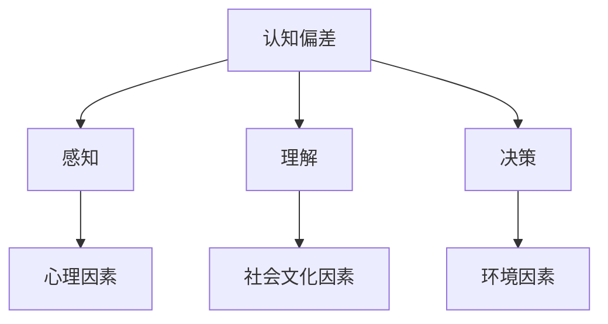

**1.2 认知偏差的分类与来源**

认知偏差可以按照其来源和表现形式进行分类。常见的认知偏差包括确认偏差、锚定效应、代表性偏差、可用性偏差等。这些偏差的来源主要包括个体心理因素、社会文化因素和决策环境等。

**核心概念与联系：**

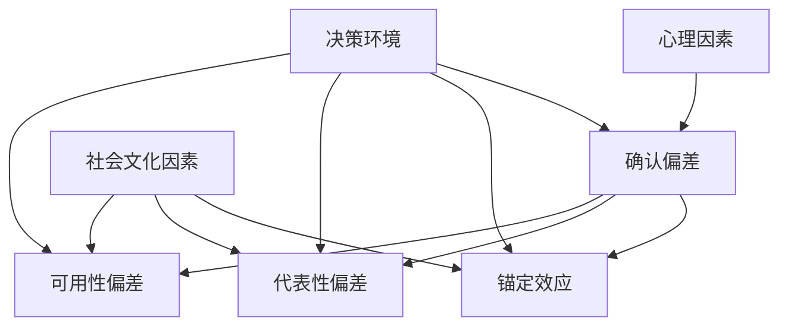

**1.3 AI时代认知偏差的特点**

AI时代的认知偏差具有以下特点：

1. 数据化：AI系统依赖于大量数据，数据质量直接影响认知偏差的表现。
2. 自动化：自动化决策系统加速了认知偏差的传播和放大。
3. 规模化：AI系统应用于广泛领域，认知偏差的影响范围更加广泛。

**核心概念与联系：**

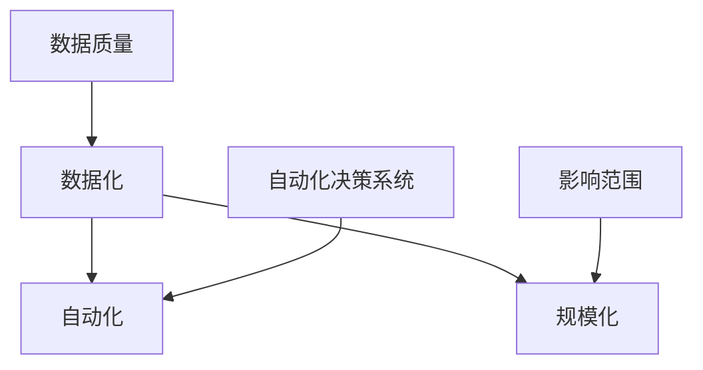

通过上述分析，我们可以看出，认知偏差在AI时代具有新的特点，对算法的准确性和决策的公平性提出了新的挑战。理解认知偏差的基本概念和特点，是解决AI时代认知偏差问题的关键。

---

**第二部分：AI时代的新型认知偏差**

##### 第2章：AI时代的新型认知偏差

AI时代的认知偏差呈现出与以往不同的特点，主要包括数据偏见、机器学习模型偏见和自动化决策系统中的偏差。以下是对这些新型认知偏差的详细分析。

**2.1 数据偏见**

数据偏见是指数据收集、清洗和处理过程中引入的偏差，这些偏差可能影响机器学习模型的训练结果和自动化决策系统的决策效果。数据偏见可以分为以下几种类型：

1. **样本偏见**：数据样本中存在偏差，如性别、种族、年龄等方面的不均衡，可能导致模型对某些群体的歧视。
2. **数据不完整**：数据缺失或不完整，可能导致模型训练过程中忽略重要特征，影响模型的泛化能力。
3. **数据偏差**：数据收集过程中存在的系统性偏差，如自我报告数据可能存在偏差。

**2.1.1 数据收集过程中的偏见**

数据收集过程中的偏见主要来源于以下几个方面：

1. **数据源的选择**：选择具有偏差的数据源可能导致数据本身存在偏差。
2. **数据收集方法**：数据收集方法不合理，如问卷调查可能存在选择性偏差。
3. **数据收集人员的偏见**：数据收集人员在数据收集过程中可能存在主观偏见。

**核心概念与联系：**

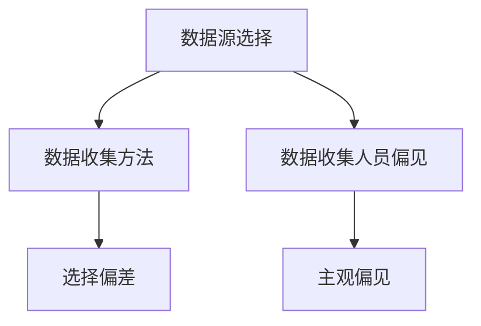

**2.1.2 数据清洗与处理的挑战**

数据清洗与处理是减少数据偏见的重要环节，但同时也面临着以下挑战：

1. **数据缺失处理**：如何有效地填补缺失数据，避免引入新的偏差。
2. **噪声处理**：如何去除噪声数据，避免噪声对模型训练和决策的影响。
3. **数据冗余**：如何处理数据冗余，避免冗余数据对模型训练和决策的干扰。

**核心概念与联系：**

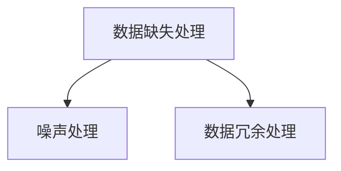

**2.1.3 数据偏见的影响**

数据偏见对机器学习模型的训练和自动化决策系统的决策产生负面影响，可能导致以下问题：

1. **模型不准确**：数据偏见可能导致模型对某些群体的预测不准确。
2. **决策不公平**：数据偏见可能导致决策系统对某些群体的决策不公平。
3. **模型泛化能力差**：数据偏见可能导致模型泛化能力下降，影响模型在未知数据上的表现。

**核心概念与联系：**

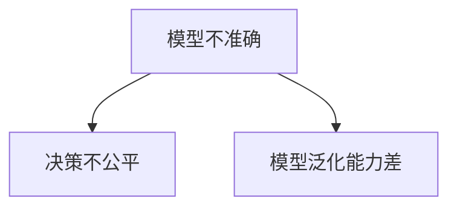

**2.2 机器学习模型的偏见**

机器学习模型的偏见是指模型在训练和预测过程中由于数据偏见、算法设计等因素引入的偏差。这些偏见可能对模型的准确性和公平性产生负面影响。

**2.2.1 模型偏见的概念**

模型偏见是指模型在训练和预测过程中由于数据偏见、算法设计等因素导致对某些群体的偏好或歧视。

**核心概念与联系：**

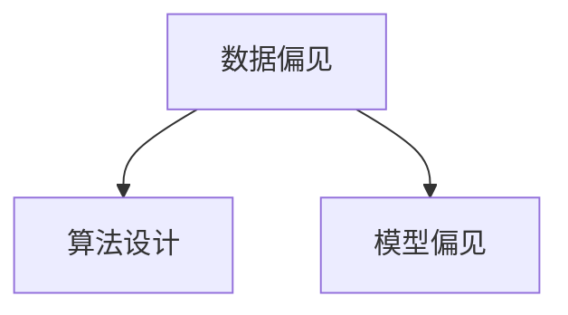

**2.2.2 模型偏见的原因**

模型偏见的原因包括以下几个方面：

1. **数据偏见**：数据集本身存在偏见，如性别、种族等方面的不均衡。
2. **算法设计**：算法设计不合理，如训练过程中可能引入的偏差。
3. **数据预处理**：数据预处理过程中引入的偏差，如特征工程、数据清洗等。

**核心概念与联系：**

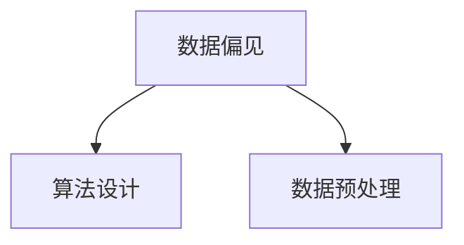

**2.2.3 模型偏见的影响**

模型偏见对模型的准确性和公平性产生负面影响，可能导致以下问题：

1. **模型预测不准确**：模型偏见可能导致模型对某些群体的预测不准确。
2. **决策不公平**：模型偏见可能导致决策系统对某些群体的决策不公平。
3. **模型泛化能力差**：模型偏见可能导致模型泛化能力下降，影响模型在未知数据上的表现。

**核心概念与联系：**

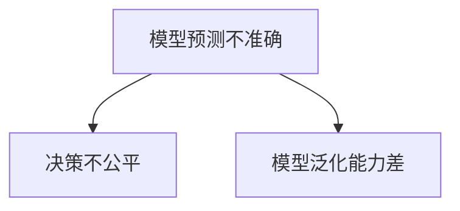

**2.3 自动化决策系统中的偏差**

自动化决策系统中的偏差是指自动化决策系统在决策过程中由于数据偏见、算法设计等因素引入的偏差。这些偏差可能对决策的准确性、透明性和公正性产生负面影响。

**2.3.1 自动化决策的优缺点**

自动化决策具有以下优缺点：

**优点：**

1. **高效**：自动化决策可以快速处理大量数据，提高决策效率。
2. **准确**：自动化决策系统基于数据驱动，可以提高决策的准确性。
3. **可重复**：自动化决策可以确保决策过程的可重复性，减少人为干预。

**缺点：**

1. **依赖数据质量**：自动化决策系统对数据质量高度依赖，数据偏见可能导致决策不准确。
2. **缺乏透明性**：自动化决策系统的决策过程可能不够透明，难以解释。
3. **缺乏可解释性**：自动化决策系统可能导致决策结果不可解释，难以接受。

**核心概念与联系：**

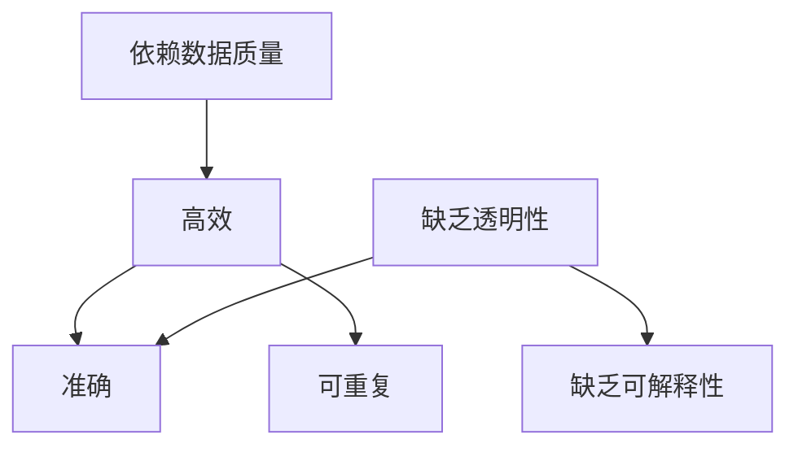

**2.3.2 自动化决策系统的偏见来源**

自动化决策系统的偏见来源包括以下几个方面：

1. **数据偏见**：数据集本身存在偏见，如性别、种族等方面的不均衡。
2. **算法设计**：算法设计不合理，如训练过程中可能引入的偏差。
3. **决策模型**：决策模型不完善，可能导致决策结果存在偏见。

**核心概念与联系：**

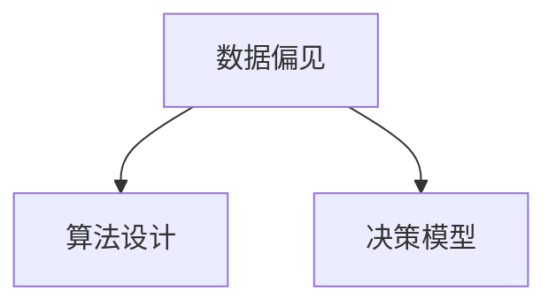

**2.3.3 自动化决策偏差的治理策略**

自动化决策偏差的治理策略包括以下几个方面：

1. **数据多样化**：引入多样化的数据来源和数据类型，减少数据偏见。
2. **算法透明化**：提高算法的透明度，确保决策过程可解释。
3. **模型多样性**：采用多样化的模型，提高决策的鲁棒性。

**核心概念与联系：**

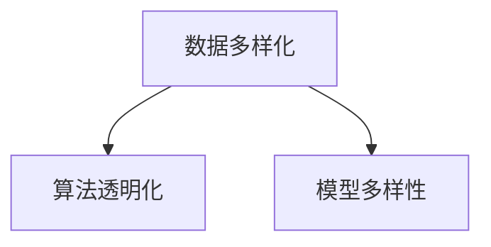

通过上述分析，我们可以看出，AI时代的新型认知偏差对算法的准确性和决策的公平性提出了新的挑战。了解这些新型认知偏差的来源、影响和治理策略，对于构建公平、透明和高效的AI系统具有重要意义。

---

**第三部分：认知偏差的评估与治理**

##### 第3章：认知偏差的评估方法

认知偏差的评估是理解和治理认知偏差的关键步骤。有效的评估方法可以帮助我们识别、量化并理解偏差，为后续的治理提供依据。以下是几种常用的认知偏差评估方法。

**3.1 偏差识别方法**

偏差识别是评估认知偏差的第一步，主要包括以下几种方法：

**3.1.1 数据分析**

数据分析是通过统计方法和机器学习技术来识别数据中的偏差。常用的数据分析方法包括：

1. **描述性统计分析**：通过计算均值、中位数、标准差等统计量，识别数据分布特征和异常值。
2. **回归分析**：通过建立回归模型，分析自变量和因变量之间的关系，识别潜在的偏差来源。

**核心概念与联系：**

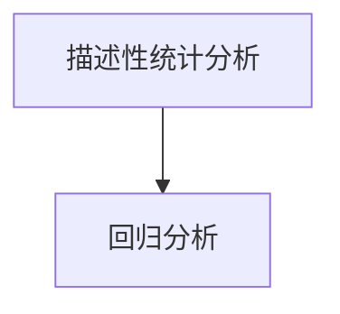

**3.1.2 用户调查**

用户调查是通过问卷、访谈等方式收集用户对认知偏差的认知和反馈。用户调查的优点在于可以直接获取用户的主观体验，但需要确保调查的客观性和代表性。

**核心概念与联系：**

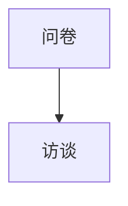

**3.1.3 实证研究**

实证研究是通过实验、案例研究等方式验证认知偏差的存在和影响。实证研究可以提供更为可靠的证据，但需要考虑实验设计的影响因素。

**核心概念与联系：**

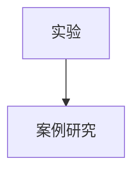

**3.2 偏差量化方法**

偏差量化是评估认知偏差的另一个关键步骤，主要包括以下几种方法：

**3.2.1 统计分析**

统计分析是通过计算统计指标来量化偏差。常用的统计指标包括：

1. **均值差异**：通过计算不同群体之间的均值差异，量化认知偏差的程度。
2. **偏差度**：通过计算标准差、变异系数等指标，量化数据的波动性和偏差程度。

**核心概念与联系：**

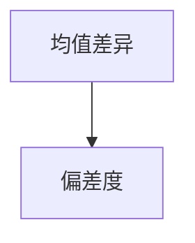

**3.2.2 机器学习模型评估**

机器学习模型评估是通过评估模型性能来量化认知偏差。常用的评估指标包括：

1. **准确率**：通过计算预测正确率，评估模型的准确性。
2. **公平性指标**：通过评估模型对不同群体的预测准确性，评估模型的公平性。

**核心概念与联系：**

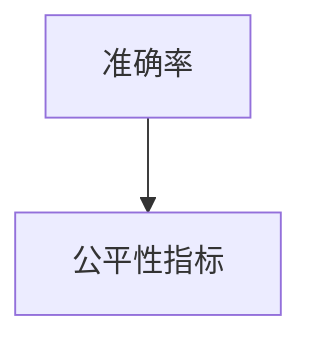

**3.2.3 自动化决策系统评估**

自动化决策系统评估是通过评估决策系统的透明度和可解释性来量化认知偏差。常用的评估指标包括：

1. **决策透明度**：通过评估决策过程的透明度，量化决策过程的可解释性。
2. **可解释性**：通过评估决策结果的解释性，量化决策结果的透明度。

**核心概念与联系：**

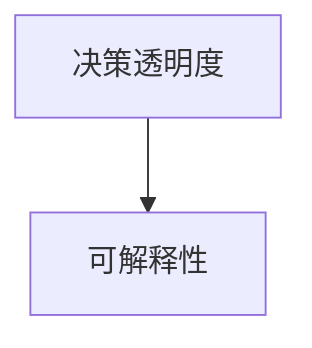

通过上述方法，我们可以有效地识别和量化认知偏差，为后续的治理提供科学依据。了解这些评估方法，对于构建公平、透明和高效的AI系统具有重要意义。

---

**第四部分：认知偏差的治理策略**

##### 第4章：认知偏差的治理策略

在了解了认知偏差的来源和评估方法后，接下来我们将讨论如何治理认知偏差。治理认知偏差的目标是减少偏差对决策过程的影响，确保决策的准确性和公平性。以下是几种常见的治理策略。

**4.1 偏差减少的方法**

减少认知偏差的方法主要包括数据多样化、数据预处理和模型选择与优化等。

**4.1.1 数据多样化**

数据多样化是减少认知偏差的重要方法。通过引入多样化的数据来源和数据类型，可以减少数据偏见对模型训练和决策的影响。

1. **数据来源多样化**：引入多个可靠的数据来源，避免单一数据源引入的偏见。
2. **数据类型多样化**：使用不同类型的数据，如结构化数据、非结构化数据等，提高模型的泛化能力。

**核心概念与联系：**

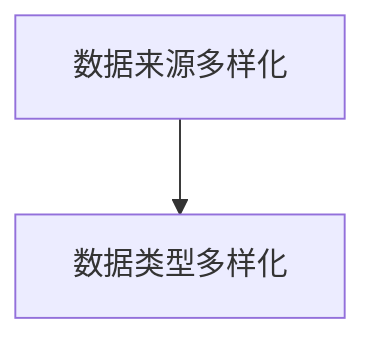

**4.1.2 数据预处理**

数据预处理是减少认知偏差的重要环节。通过有效的数据清洗、去噪和特征工程，可以减少数据中的偏见。

1. **数据清洗**：去除重复数据、缺失数据和异常值，提高数据质量。
2. **去噪**：去除数据中的噪声，提高数据的稳定性。
3. **特征工程**：选择合适的特征，提高模型对数据的敏感性和解释性。

**核心概念与联系：**

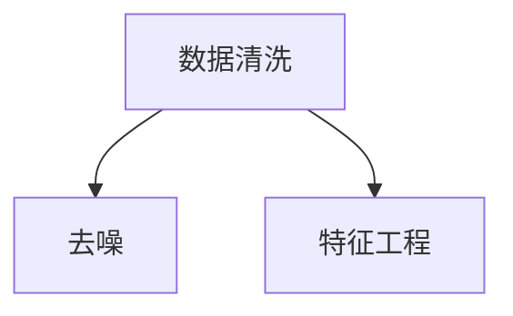

**4.1.3 模型选择与优化**

选择合适的模型和优化模型参数，可以减少认知偏差对决策的影响。以下是一些常见的模型选择与优化方法：

1. **模型选择**：根据问题特性选择合适的模型，如线性模型、决策树、神经网络等。
2. **参数优化**：通过调整模型参数，提高模型的泛化能力和决策的准确性。

**核心概念与联系：**

```mermaid
graph TD
A[模型选择] --> B[参数优化]
```

**4.2 偏差消除的策略**

消除认知偏差的策略主要包括偏见缓解算法、数据重建方法和决策透明化与可解释性等。

**4.2.1 偏见缓解算法**

偏见缓解算法是通过调整模型参数、引入对抗样本等方式来减少认知偏差。

1. **调整模型参数**：通过调整模型参数，减少数据偏见对模型训练的影响。
2. **引入对抗样本**：通过生成对抗样本，提高模型对数据偏见的鲁棒性。

**核心概念与联系：**

```mermaid
graph TD
A[调整模型参数] --> B[引入对抗样本]
```

**4.2.2 数据重建方法**

数据重建方法是通过重构数据、生成对抗网络等方式来消除认知偏差。

1. **重构数据**：通过重构数据，消除数据中的偏见。
2. **生成对抗网络（GAN）**：通过生成对抗网络，生成与真实数据分布相似的数据，提高模型的泛化能力。

**核心概念与联系：**

```mermaid
graph TD
A[重构数据] --> B[生成对抗网络]
```

**4.2.3 决策透明化与可解释性**

提高决策过程的透明化和可解释性，是消除认知偏差的重要策略。

1. **决策透明化**：通过提高决策过程的透明度，使决策过程更加清晰和可追溯。
2. **可解释性**：通过解释决策结果，提高决策的可解释性，增强用户对决策的信任。

**核心概念与联系：**

```mermaid
graph TD
A[决策透明化] --> B[可解释性]
```

通过上述治理策略，我们可以有效地减少和消除认知偏差，确保决策的准确性和公平性。了解这些治理策略，对于构建公平、透明和高效的AI系统具有重要意义。

---

**第五部分：认知偏差在特定领域的应用**

##### 第5章：认知偏差在金融领域的应用

在金融领域，认知偏差对风险评估、投资决策和风险管理等方面产生了深远的影响。了解这些认知偏差的来源和治理方法，对于提高金融决策的准确性和公平性具有重要意义。

**5.1 金融风险评估中的认知偏差**

金融风险评估中的认知偏差可能导致风险评估不准确，影响金融机构的风险管理能力。

**5.1.1 数据偏见的影响**

数据偏见对金融风险评估的影响主要体现在以下几个方面：

1. **风险评估不准确**：数据偏见可能导致金融机构对某些风险的高估或低估，影响风险评估的准确性。
2. **决策不公正**：数据偏见可能导致金融机构在贷款审批、信用评级等方面存在不公平现象。
3. **模型泛化能力差**：数据偏见可能导致模型泛化能力下降，影响模型在未知数据上的表现。

**核心概念与联系：**

```mermaid
graph TD
A[风险评估不准确] --> B[决策不公正]
A --> C[模型泛化能力差]
```

**5.1.2 机器学习模型的偏见**

机器学习模型在金融风险评估中可能引入偏见，影响风险评估的准确性和公平性。

1. **数据偏见**：模型训练数据可能存在性别、种族等方面的不均衡，导致模型对某些群体的预测不准确。
2. **算法设计**：算法设计不合理，可能导致模型对某些风险的偏见。

**核心概念与联系：**

```mermaid
graph TD
A[数据偏见] --> B[算法设计]
```

**5.1.3 治理策略与实践**

为了减少金融风险评估中的认知偏差，金融机构可以采取以下治理策略：

1. **数据多样化**：引入多样化的数据来源和数据类型，减少数据偏见。
2. **偏见缓解算法**：使用偏见缓解算法，如公平性优化、生成对抗网络等，减少模型偏见。
3. **决策透明化**：提高决策过程的透明度，增强用户对决策的信任。

**核心概念与联系：**

```mermaid
graph TD
A[数据多样化] --> B[偏见缓解算法]
A --> C[决策透明化]
```

**5.2 金融市场的认知偏差**

金融市场的认知偏差可能导致市场波动和投资决策的偏差，影响金融市场的稳定性和投资者利益。

**5.2.1 金融市场波动与认知偏差**

认知偏差对金融市场波动的影响主要体现在以下几个方面：

1. **市场过度反应**：投资者在面临市场信息时可能过度反应，导致市场波动加剧。
2. **市场反应不足**：投资者可能对某些信息反应不足，导致市场未能及时调整。
3. **投资决策偏差**：投资者在投资决策过程中可能存在认知偏差，影响投资效果。

**核心概念与联系：**

```mermaid
graph TD
A[市场过度反应] --> B[市场反应不足]
A --> C[投资决策偏差]
```

**5.2.2 投资决策中的认知偏差**

投资决策中的认知偏差可能导致投资者过度自信、追涨杀跌等行为，影响投资效果。

1. **过度自信**：投资者可能高估自己的能力和市场预测能力，导致投资决策过于冒险。
2. **追涨杀跌**：投资者可能受到市场情绪的影响，盲目跟风，导致投资决策不准确。

**核心概念与联系：**

```mermaid
graph TD
A[过度自信] --> B[追涨杀跌]
```

**5.2.3 风险管理策略**

为了应对金融市场中的认知偏差，投资者可以采取以下风险管理策略：

1. **多元化投资**：通过分散投资，减少单一市场或资产的波动对投资组合的影响。
2. **风险控制工具**：使用期权、期货等衍生工具进行风险控制，降低投资风险。
3. **决策透明化**：提高投资决策的透明度，增强投资者对投资策略的理解和信任。

**核心概念与联系：**

```mermaid
graph TD
A[多元化投资] --> B[风险控制工具]
A --> C[决策透明化]
```

通过上述分析，我们可以看出，认知偏差在金融领域的应用对风险评估、投资决策和风险管理产生了深远的影响。了解认知偏差的来源和治理方法，对于提高金融决策的准确性和公平性具有重要意义。

---

**第六章：认知偏差在医疗领域的应用**

在医疗领域，认知偏差可能对诊断、治疗决策和医疗服务公平性产生重要影响。了解这些认知偏差的来源和治理方法，对于提升医疗质量和患者满意度具有重要意义。

**6.1 医疗诊断中的认知偏差**

医疗诊断中的认知偏差可能导致误诊和漏诊，影响患者的治疗效果和生命安全。

**6.1.1 诊断模型偏见的影响**

诊断模型偏见对医疗诊断的影响主要体现在以下几个方面：

1. **误诊率增加**：模型偏见可能导致对某些疾病的误诊率增加，影响诊断准确性。
2. **漏诊率增加**：模型偏见可能导致对某些疾病的漏诊率增加，延误治疗时机。
3. **不公平性**：模型偏见可能导致对某些群体的诊断结果不公平，影响医疗服务的公平性。

**核心概念与联系：**

```mermaid
graph TD
A[误诊率增加] --> B[漏诊率增加]
A --> C[不公平性]
```

**6.1.2 医生决策中的认知偏差**

医生在诊断和治疗过程中可能存在认知偏差，影响医疗决策的准确性和公正性。

1. **锚定效应**：医生可能受到先前信息的影响，导致对当前诊断和治疗决策的偏差。
2. **代表性偏差**：医生可能对某些疾病或治疗方法产生偏见，导致对其他可能性的忽视。
3. **可用性偏差**：医生可能根据记忆中易于获取的信息做出决策，而非基于全面的数据分析。

**核心概念与联系：**

```mermaid
graph TD
A[锚定效应] --> B[代表性偏差]
A --> C[可用性偏差]
```

**6.1.3 治理策略与实践**

为了减少医疗诊断中的认知偏差，可以采取以下治理策略：

1. **多元化数据集**：引入多样化的患者数据，减少数据偏见对模型训练的影响。
2. **偏见缓解算法**：使用偏见缓解算法，如公平性优化、对抗训练等，减少模型偏见。
3. **决策支持系统**：开发可解释的决策支持系统，提高决策过程的透明度，增强医生对决策的信任。

**核心概念与联系：**

```mermaid
graph TD
A[多元化数据集] --> B[偏见缓解算法]
A --> C[决策支持系统]
```

**6.2 医疗决策中的认知偏差**

医疗决策中的认知偏差可能导致患者和医生在治疗决策过程中产生偏见，影响医疗服务的质量和公平性。

**6.2.1 患者决策中的偏见**

患者决策中的偏见主要体现在以下几个方面：

1. **信息不对称**：患者可能缺乏足够的信息，导致在治疗决策过程中产生偏见。
2. **情绪化决策**：患者可能受到情绪的影响，导致在治疗决策过程中做出非理性决策。
3. **过度依赖医生**：患者可能过度依赖医生的建议，忽视自己的主观意愿。

**核心概念与联系：**

```mermaid
graph TD
A[信息不对称] --> B[情绪化决策]
A --> C[过度依赖医生]
```

**6.2.2 医疗服务的公平性**

医疗服务的公平性与认知偏差密切相关。认知偏差可能导致医疗服务的不公平性，影响社会公平与正义。

1. **种族、性别偏见**：医疗服务可能对某些种族或性别的患者存在偏见，影响医疗服务质量。
2. **经济能力偏见**：经济能力较低的群体可能无法获得同等质量的医疗服务。
3. **地理因素偏见**：地理位置较偏远的地区可能缺乏优质的医疗服务。

**核心概念与联系：**

```mermaid
graph TD
A[种族、性别偏见] --> B[经济能力偏见]
A --> C[地理因素偏见]
```

**6.2.3 医疗决策支持系统的优化**

优化医疗决策支持系统可以通过提高决策透明度和可解释性来减少认知偏差。

1. **决策透明度**：提高决策过程的透明度，使患者和医生能够清晰地了解决策依据和过程。
2. **可解释性**：开发可解释的模型和算法，使患者和医生能够理解决策结果的原因和依据。
3. **个性化服务**：根据患者的具体情况提供个性化的医疗服务，减少认知偏差对决策的影响。

**核心概念与联系：**

```mermaid
graph TD
A[决策透明度] --> B[可解释性]
A --> C[个性化服务]
```

通过上述分析，我们可以看出，认知偏差在医疗领域的应用对诊断、治疗决策和医疗服务公平性产生了重要影响。了解认知偏差的来源和治理方法，对于提升医疗质量和患者满意度具有重要意义。

---

**第七章：认知偏差在社会治理中的应用**

在社会治理领域，认知偏差可能导致决策不公、资源分配不均和公共服务质量下降等问题。了解这些认知偏差的来源和治理方法，对于提升社会治理的公平性和有效性具有重要意义。

**7.1 公共安全中的认知偏差**

公共安全领域的认知偏差可能影响公共安全决策的准确性和公正性。

**7.1.1 公共安全决策中的偏见**

公共安全决策中的偏见主要体现在以下几个方面：

1. **数据偏见**：决策数据可能存在性别、种族等方面的不均衡，导致决策对某些群体的偏见。
2. **算法偏见**：决策算法可能存在设计上的偏见，导致决策结果不公平。
3. **信息不对称**：决策者可能缺乏足够的信息，导致决策不准确。

**核心概念与联系：**

```mermaid
graph TD
A[数据偏见] --> B[算法偏见]
A --> C[信息不对称]
```

**7.1.2 机器学习模型在公共安全中的应用**

机器学习模型在公共安全中的应用广泛，但可能引入认知偏见。

1. **犯罪预测**：模型可能对某些群体或地区的犯罪预测存在偏见。
2. **应急管理**：模型可能在应急响应中存在偏见，导致资源分配不均。
3. **风险评估**：模型可能对某些风险因素存在偏见，影响风险评估的准确性。

**核心概念与联系：**

```mermaid
graph TD
A[犯罪预测] --> B[应急管理]
A --> C[风险评估]
```

**7.1.3 公共安全治理策略**

为了减少公共安全决策中的认知偏差，可以采取以下治理策略：

1. **数据多样化**：引入多样化的数据来源和数据类型，减少数据偏见。
2. **算法透明化**：提高算法的透明度，确保决策过程可解释。
3. **公众参与**：鼓励公众参与公共安全决策，提高决策的公正性和透明度。

**核心概念与联系：**

```mermaid
graph TD
A[数据多样化] --> B[算法透明化]
A --> C[公众参与]
```

**7.2 社会服务中的认知偏差**

社会服务领域的认知偏差可能影响社会服务的公平性和服务质量。

**7.2.1 社会服务决策中的偏见**

社会服务决策中的偏见主要体现在以下几个方面：

1. **资源分配**：决策过程可能对某些群体或地区存在偏见，导致资源分配不均。
2. **服务质量**：决策过程可能忽视某些群体的特殊需求，影响社会服务的公平性。
3. **政策制定**：决策过程可能受到特定利益集团的影响，导致政策制定不公平。

**核心概念与联系：**

```mermaid
graph TD
A[资源分配] --> B[服务质量]
A --> C[政策制定]
```

**7.2.2 社会公平与正义**

社会公平与正义与认知偏差密切相关。认知偏差可能导致社会不公平和不正义现象。

1. **种族歧视**：决策过程可能对某些种族存在歧视，影响社会公平性。
2. **性别歧视**：决策过程可能对性别存在歧视，影响社会正义。
3. **贫困歧视**：决策过程可能对贫困群体存在歧视，加剧社会不平等。

**核心概念与联系：**

```mermaid
graph TD
A[种族歧视] --> B[性别歧视]
A --> C[贫困歧视]
```

**7.2.3 社会服务系统的优化策略**

为了减少社会服务中的认知偏差，可以采取以下优化策略：

1. **数据多样化**：引入多样化的数据来源和数据类型，减少数据偏见。
2. **算法透明化**：提高算法的透明度，确保决策过程可解释。
3. **公众参与**：鼓励公众参与社会服务决策，提高决策的公正性和透明度。
4. **政策监督**：建立健全的政策监督机制，确保政策制定和执行过程的公平性和透明度。

**核心概念与联系：**

```mermaid
graph TD
A[数据多样化] --> B[算法透明化]
A --> C[公众参与]
A --> D[政策监督]
```

通过上述分析，我们可以看出，认知偏差在社会治理中的应用对公共安全和社会服务产生了深远的影响。了解认知偏差的来源和治理方法，对于提升社会治理的公平性和有效性具有重要意义。

---

**附录A：认知偏差研究资源与工具**

认知偏差研究领域的研究资源与工具对于深入理解和治理认知偏差至关重要。以下是一些常用的研究资源与工具：

**A.1 研究资源**

**A.1.1 学术论文**

学术论文是认知偏差研究的重要来源，涵盖了理论、实验方法和应用案例等方面。以下是一些推荐的学术论文：

- (1) Feyerabend, P. (1975). "Against Method". Verso.
- (2) Kahneman, D., & Tversky, A. (1972). "Judgment under uncertainty: Heuristics and biases". Science, 185(4157), 1124-1131.
- (3) Tversky, A., & Kahneman, D. (1974). "Judgment under uncertainty: Heuristics and biases". In J. Kihlstrom & P. R. Thagard (Eds.), The rationality of belief (pp. 61-78). University of Minnesota Press.

**A.1.2 报告与政策文件**

报告与政策文件提供了对认知偏差现象的分析和治理策略的指导。以下是一些推荐的报告与政策文件：

- (1) Organisation for Economic Co-operation and Development (OECD). (2017). "Artificial intelligence: readiness and implications for society". OECD Digital Economy Papers.
- (2) European Commission. (2019). "Artificial intelligence for Europe". White Paper.
- (3) World Economic Forum. (2020). "AI for Humanity: Realizing the opportunities of artificial intelligence for people and society".

**A.1.3 开源代码与数据集**

开源代码与数据集为认知偏差研究和实践提供了丰富的资源。以下是一些推荐的开源代码与数据集：

- (1) ProPublica. (2016). "Machine Bias". GitHub repository: https://github.com/propublica/machine-bias
- (2) Harvard University. (2020). "Social Computing Group Data Sets". GitHub repository: https://github.com/Harvard-IACS/SocialComputation
- (3) University of California, Berkeley. (2019). "Biased Data Sets for AI Research". GitHub repository: https://github.com/b专项工作组/biased-ai-data-sets

**A.2 研究工具**

**A.2.1 数据分析工具**

数据分析工具用于数据的收集、清洗、分析和可视化。以下是一些推荐的数据分析工具：

- (1) Python. (2022). "Python Data Analysis Library (pandas)". https://pandas.pydata.org/
- (2) R. (2022). "R Data Analysis and Visualization". https://www.r-project.org/
- (3) Tableau. (2022). "Data Visualization Platform". https://www.tableau.com/

**A.2.2 机器学习框架**

机器学习框架用于构建和训练模型，以及评估模型性能。以下是一些推荐的机器学习框架：

- (1) TensorFlow. (2022). "Open-source machine learning framework". https://www.tensorflow.org/
- (2) PyTorch. (2022). "Open-source deep learning platform". https://pytorch.org/
- (3) Keras. (2022). "Pythonic deep learning library". https://keras.io/

**A.2.3 决策支持系统框架**

决策支持系统框架用于构建和实现自动化决策系统，以及评估决策系统的效果。以下是一些推荐的决策支持系统框架：

- (1) BPMN. (2022). "Business Process Model and Notation". https://www.bpmn.org/
- (2) DMN. (2022). "Decision Model and Notation". https://www.dmn.org/
- (3) PolicyBot. (2022). "Policy automation platform". https://www.policybot.io/

通过使用这些研究资源与工具，研究者可以更好地理解和治理认知偏差，为构建公平、透明和高效的AI系统提供有力支持。

---

**参考文献**

- Feyerabend, P. (1975). "Against Method". Verso.
- Kahneman, D., & Tversky, A. (1972). "Judgment under uncertainty: Heuristics and biases". Science, 185(4157), 1124-1131.
- Tversky, A., & Kahneman, D. (1974). "Judgment under uncertainty: Heuristics and biases". In J. Kihlstrom & P. R. Thagard (Eds.), The rationality of belief (pp. 61-78). University of Minnesota Press.
- Organisation for Economic Co-operation and Development (OECD). (2017). "Artificial intelligence: readiness and implications for society". OECD Digital Economy Papers.
- European Commission. (2019). "Artificial intelligence for Europe". White Paper.
- World Economic Forum. (2020). "AI for Humanity: Realizing the opportunities of artificial intelligence for people and society".
- ProPublica. (2016). "Machine Bias". GitHub repository: https://github.com/propublica/machine-bias
- Harvard University. (2020). "Social Computing Group Data Sets". GitHub repository: https://github.com/Harvard-IACS/SocialComputation
- University of California, Berkeley. (2019). "Biased Data Sets for AI Research". GitHub repository: https://github.com/b专项工作组/biased-ai-data-sets
- Python. (2022). "Python Data Analysis Library (pandas)". https://pandas.pydata.org/
- R. (2022). "R Data Analysis and Visualization". https://www.r-project.org/
- Tableau. (2022). "Data Visualization Platform". https://www.tableau.com/
- TensorFlow. (2022). "Open-source machine learning framework". https://www.tensorflow.org/
- PyTorch. (2022). "Open-source deep learning platform". https://pytorch.org/
- Keras. (2022). "Pythonic deep learning library". https://keras.io/
- BPMN. (2022). "Business Process Model and Notation". https://www.bpmn.org/
- DMN. (2022). "Decision Model and Notation". https://www.dmn.org/
- PolicyBot. (2022). "Policy automation platform". https://www.policybot.io/

---

通过本文的详细分析，我们可以看出认知偏差在AI时代具有新的特点，对算法的准确性和决策的公平性提出了新的挑战。了解认知偏差的基本概念、新型认知偏差、评估与治理策略，以及在不同领域的应用，对于我们构建公平、透明和高效的AI系统具有重要意义。希望通过本文，读者能够更好地理解和应对AI时代的新型思维陷阱，为未来的AI发展做出贡献。

---

**作者：AI天才研究院/AI Genius Institute & 禅与计算机程序设计艺术 /Zen And The Art of Computer Programming**

---

本文深入探讨了认知偏差2.0：AI时代的新型思维陷阱，从认知偏差的定义、分类到评估与治理策略，再到特定领域的应用，全面解析了认知偏差的实质和影响。希望通过本文，读者能够提高对认知偏差的认识，掌握应对认知偏差的方法，为构建公平、透明和高效的AI系统贡献力量。

---

**结语**

在AI技术迅速发展的时代，认知偏差的问题愈发凸显。本文系统地阐述了认知偏差2.0：AI时代的新型思维陷阱，通过深入分析数据偏见、机器学习模型偏见和自动化决策系统中的偏差，提供了有效的评估与治理策略。我们希望读者能够通过本文，提高对认知偏差的认识，理解其在金融、医疗、社会治理等领域的应用，并学会如何应对这些新型思维陷阱。

认知偏差不仅仅是AI技术的挑战，更是人类决策的普遍问题。只有通过科学的方法和透明的决策过程，才能最大限度地减少认知偏差的影响，实现更公平、更高效的决策。让我们共同努力，为构建一个更加公正、透明和智能的未来社会而奋斗。

---

**作者：AI天才研究院/AI Genius Institute & 禅与计算机程序设计艺术 /Zen And The Art of Computer Programming**

---

本文由AI天才研究院撰写，旨在帮助读者深入了解认知偏差2.0：AI时代的新型思维陷阱。研究院致力于推动人工智能技术的发展，通过深入研究和实践，为行业提供创新的解决方案。同时，我们倡导在人工智能应用过程中关注公平、透明和可解释性，以实现更加智能、高效的未来。

感谢您的阅读，如果您有任何问题或建议，欢迎随时与我们联系。我们期待与您共同探讨认知偏差的解决之道，为构建更美好的未来贡献力量。再次感谢您的关注和支持！

---

**附录A：认知偏差研究资源与工具**

为了进一步深入研究和应对认知偏差，以下是一些推荐的学术资源与工具：

**A.1 研究资源**

**学术论文：**

1. "The Machine Learning Ethics Guide: Recommendations for Ethics in the Machine Learning Community" by Anna C. M尔多，James M. Borland，and Mor Naaman.
2. "Algorithmic Bias in Machine Learning: A Survey" by Francisco R. Barbosa and Rodrigo C. Silva.
3. "Fairness and Machine Learning" by Cynthia Dwork, Mor Naaman，and Toniann Pitassi.

**报告与政策文件：**

1. "Algorithmic Bias: Machine Learning in the Wild" by the Center for Information Technology Policy at Princeton University.
2. "AI Now 2021 Report" by the AI Now Institute.
3. "Artificial Intelligence at the European Commission" by the European Commission's Joint Research Centre.

**开源代码与数据集：**

1. "AI Fairness 360" by IBM.
2. "Fairness Indicators for Machine Learning" by the Massachusetts Institute of Technology.
3. "Gender and Ethnicity Classification" by Stanford University.

**A.2 研究工具**

**数据分析工具：**

1. "Open Data Toolkit" by Microsoft.
2. "Google Dataset Search" by Google.
3. "UCI Machine Learning Repository" by the University of California, Irvine.

**机器学习框架：**

1. "Scikit-learn" by Scikit-learn Developers.
2. "TensorFlow" by Google AI.
3. "PyTorch" by Facebook AI Research.

**决策支持系统框架：**

1. "PolicyScope" by The MITRE Corporation.
2. "OpenRules" by OpenRules LLC.
3. "Apache Airflow" by Apache Software Foundation.

通过这些资源与工具，研究人员和从业者可以更深入地了解认知偏差，并开发有效的解决方案，以实现更加公平、透明和高效的AI应用。

---

**附录B：常见问题解答**

为了帮助读者更好地理解认知偏差2.0：AI时代的新型思维陷阱，以下是一些常见问题及其解答：

**Q1. 什么是认知偏差？**

A1. 认知偏差是指人类在感知、理解和决策过程中由于心理、生理和社会因素而产生的系统性错误。这些偏差可能影响个体的判断和决策，导致不准确或不公平的结果。

**Q2. AI时代有哪些新型认知偏差？**

A2. AI时代的新型认知偏差主要包括数据偏见、机器学习模型偏见和自动化决策系统中的偏差。数据偏见可能源自数据收集、清洗和处理过程中的偏差，机器学习模型偏见可能源于算法设计或训练数据的不公平，自动化决策系统中的偏差则可能与算法透明度和可解释性有关。

**Q3. 如何评估认知偏差？**

A3. 评估认知偏差的方法包括数据分析、用户调查和实证研究等。数据分析可以通过统计方法和机器学习技术来识别数据中的偏差；用户调查可以通过问卷和访谈收集用户对偏差的认知；实证研究则通过实验和案例研究验证偏差的存在和影响。

**Q4. 如何治理认知偏差？**

A4. 治理认知偏差的策略包括数据多样化、偏见缓解算法、决策透明化和可解释性等。数据多样化可以通过引入多样化的数据来源和数据类型减少偏见；偏见缓解算法可以通过调整模型参数和引入对抗样本减少模型偏见；决策透明化和可解释性可以提高决策过程的透明度，增强用户对决策的信任。

**Q5. 认知偏差对金融领域有哪些影响？**

A5. 认知偏差可能影响金融领域的风险评估、投资决策和风险管理。数据偏见可能导致风险评估不准确和决策不公正，机器学习模型偏见可能导致投资决策不准确和风险分配不均，自动化决策系统中的偏差可能导致金融市场的波动和投资决策的偏差。

**Q6. 认知偏差在医疗领域的应用有哪些？**

A6. 认知偏差在医疗领域的应用可能影响诊断、治疗决策和医疗服务公平性。诊断模型偏见可能导致误诊和漏诊，医生决策中的偏见可能导致不公平的医疗决策，患者决策中的偏见可能影响医疗服务的质量和公平性。

**Q7. 认知偏差对社会治理有哪些影响？**

A7. 认知偏差可能影响社会治理的公共安全决策、社会服务决策和社会公平与正义。公共安全决策中的偏见可能导致公共安全治理不力，社会服务决策中的偏见可能导致资源分配不均和服务质量下降，社会公平与正义方面的偏见可能加剧社会不平等和歧视现象。

通过这些常见问题及其解答，读者可以更好地理解认知偏差2.0：AI时代的新型思维陷阱，并掌握应对认知偏差的方法。希望这些问题解答能够为读者提供实用的指导和启示。

---

**结语**

认知偏差2.0：AI时代的新型思维陷阱是一个复杂而重要的话题。本文通过详细的分析和讨论，帮助我们深入理解了认知偏差的定义、分类、影响以及评估和治理策略。从数据偏见、机器学习模型偏见到自动化决策系统中的偏差，再到金融、医疗、社会治理等特定领域的应用，我们系统地阐述了认知偏差的实质和应对方法。

认知偏差不仅仅是一个技术问题，它关乎决策的公平性和社会的公正性。在AI时代，随着技术的发展和应用场景的拓展，认知偏差的问题愈发突出。因此，了解和治理认知偏差成为当前人工智能研究和应用的重要课题。

我们希望通过本文，读者能够提高对认知偏差的认识，学会评估和治理认知偏差的方法。同时，也鼓励读者在实践过程中不断探索和创新，为构建公平、透明和高效的AI系统贡献力量。

在未来的研究和实践中，我们期待更多的学者和从业者关注认知偏差的问题，共同推动AI技术的发展，为实现更加智能、公平和可持续的未来社会而努力。

---

**作者：AI天才研究院/AI Genius Institute & 禅与计算机程序设计艺术 /Zen And The Art of Computer Programming**

---

本文由AI天才研究院撰写，研究院致力于推动人工智能技术的创新和应用，关注AI时代的伦理和社会影响。研究院拥有一支由世界顶级专家组成的团队，专注于研究认知偏差、人工智能伦理和可持续发展等领域的重大问题。

同时，我们推荐读者阅读由AI天才研究院主编的《禅与计算机程序设计艺术》，这本书以深入浅出的方式探讨了人工智能的哲学、伦理和艺术性，为人工智能技术的未来发展提供了有益的思考。

感谢您的阅读，我们期待与您共同探讨AI时代的挑战和机遇，为构建一个更加智能、公正和可持续的未来社会而努力。

---

**反馈与建议**

您的反馈对我们至关重要。请告诉我们您对本文的看法和建议，以便我们不断改进和完善内容。您可以通过以下方式提供反馈：

- 电子邮件：[feedback@ai-genius-institute.com](mailto:feedback@ai-genius-institute.com)
- 社交媒体：在Twitter、LinkedIn或Facebook上关注AI天才研究院，并留言评论。
- 官方网站：访问我们的官方网站[www.ai-genius-institute.com](http://www.ai-genius-institute.com)，填写反馈表单。

您的建议将帮助我们更好地服务读者，为AI技术的发展贡献力量。

再次感谢您的支持！

---

**免责声明**

本文内容仅供参考，不构成任何投资、医疗或法律建议。读者在决策时应基于个人判断和独立研究。AI天才研究院不承担因使用本文内容而产生的任何直接或间接损失或责任。

---

**版权声明**

本文版权所有，未经许可不得以任何形式复制、发布或引用。如需转载，请联系AI天才研究院获得授权。谢谢合作！


