                 

# 《语音搜索：开启电商新时代，解放双手，畅享购物乐趣》

## 概述

在数字时代，语音搜索正迅速崛起，成为用户与互联网互动的重要方式之一。语音搜索不仅改变了人们的搜索习惯，还深刻影响了电商行业的运营模式。本文将探讨语音搜索在电商领域的应用，分析其技术原理、优势、挑战以及未来发展趋势。

### 关键词
- 语音搜索
- 电商
- 人工智能
- 自然语言处理
- 用户体验

### 摘要
随着人工智能技术的不断发展，语音搜索正逐渐成为电商行业的新风口。本文将详细介绍语音搜索的技术原理，分析其在电商中的应用场景，探讨语音搜索系统的开发与部署策略，并预测其未来发展趋势。通过本文的阅读，读者将全面了解语音搜索在电商领域的潜力和前景。

## 目录大纲

### 第一部分：语音搜索概述与原理

#### 1.1 语音搜索的概念与背景
#### 1.2 语音搜索的工作原理
#### 1.3 语音搜索的优势与挑战

### 第二部分：语音搜索技术基础

#### 2.1 语音识别技术详解
#### 2.2 自然语言处理在语音搜索中的应用
#### 2.3 大规模预训练模型在语音搜索中的应用

### 第三部分：电商场景下的语音搜索应用

#### 3.1 电商平台的语音搜索体验优化
#### 3.2 商品分类与推荐系统
#### 3.3 语音搜索在客服场景的应用

### 第四部分：语音搜索系统的开发与部署

#### 4.1 语音搜索系统的开发环境搭建
#### 4.2 语音搜索系统的设计与实现
#### 4.3 语音搜索系统的部署与优化

### 第五部分：语音搜索的未来发展趋势

#### 5.1 语音搜索技术的未来发展
#### 5.2 电商行业的语音搜索趋势
#### 5.3 用户体验与语音搜索的融合

### 附录

#### 附录 A：语音搜索开发资源与工具
#### 附录 B：常见问题与解答

现在，我们将按照上述目录大纲，逐一探讨每个部分的内容。

## 第一部分：语音搜索概述与原理

### 1.1 语音搜索的概念与背景

#### 语音搜索的定义
语音搜索是指用户通过语音输入来获取信息或完成任务的一种搜索方式。与传统的键盘输入相比，语音搜索具有便捷、自然和高效的优点。

#### 电商行业对语音搜索的需求
在电商行业，用户在购物过程中往往需要快速找到所需商品，语音搜索可以有效提高搜索效率和用户体验。此外，语音搜索还可以为商家提供新的营销渠道，提升销售转化率。

#### 语音搜索的发展历程
语音搜索技术的发展经历了多个阶段。从最初的语音识别技术，到后来的自然语言处理技术，再到目前的大规模预训练模型，语音搜索在准确性和智能化方面取得了显著进展。

### 1.2 语音搜索的工作原理

#### 语音识别技术原理
语音识别技术是将语音信号转换为文本的技术。其基本流程包括声学模型、语言模型和声学模型的训练与匹配。

##### 声学模型：用于将语音信号转换为声学特征。
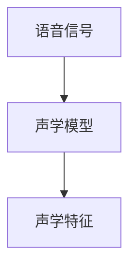

##### 语言模型：用于对声学特征进行分类和解释。
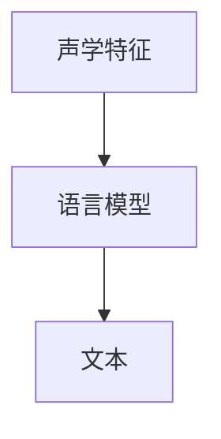

##### 声学模型与语言模型的匹配：用于确定最佳文本。
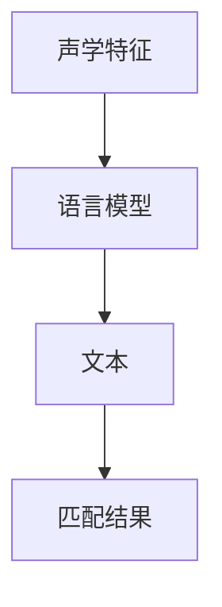

#### 自然语言处理技术
自然语言处理技术是语音搜索的关键组成部分，用于对文本进行分析、理解和生成。常见的自然语言处理技术包括词嵌入、序列模型和注意力机制。

##### 词嵌入技术
词嵌入是将单词映射为向量的技术，用于表示单词的语义信息。
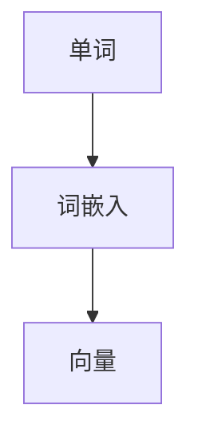

##### 序列模型与注意力机制
序列模型用于处理文本序列，注意力机制用于关注文本序列中的关键信息。
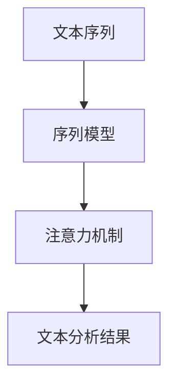

#### 语音搜索系统架构
语音搜索系统通常由语音识别模块、自然语言处理模块和搜索结果展示模块组成。
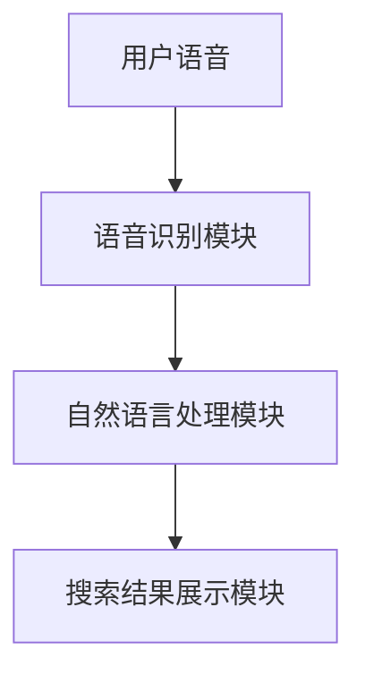

### 1.3 语音搜索的优势与挑战

#### 语音搜索的优势
- 方便快捷：用户无需手动输入，可以解放双手，提高搜索效率。
- 自然交互：语音交互更加自然，符合人类的交流习惯。
- 多样化应用：语音搜索可以应用于各种场景，如车载导航、智能家居等。

#### 语音搜索的挑战
- 识别准确率：语音识别技术尚未完全成熟，识别准确率有待提高。
- 用户体验：语音搜索的结果展示和用户体验需要进一步优化。
- 技术复杂性：语音搜索系统的开发涉及多个技术领域，技术实现较为复杂。

#### 技术与市场趋势分析
随着人工智能技术的不断发展，语音搜索技术的准确性和智能化水平不断提高。在电商行业，语音搜索正逐渐成为主流的搜索方式，未来有望实现更广泛的应用。

## 第二部分：语音搜索技术基础

### 2.1 语音识别技术详解

语音识别技术是语音搜索的基础，其主要任务是准确地识别语音并将其转换为文本。下面我们将详细讲解语音识别技术的基本流程和常见算法。

#### 语音识别的基本流程

语音识别的基本流程可以分为以下三个阶段：

1. **音频预处理**：将采集到的语音信号进行预处理，包括去噪、增益和分帧等操作。

2. **特征提取**：将预处理后的语音信号转换为特征向量，常用的特征提取方法有梅尔频率倒谱系数（MFCC）和隐马尔可夫模型（HMM）。

3. **模型训练与识别**：使用训练数据对模型进行训练，并在识别阶段将输入语音与模型进行匹配，以确定最可能的文本输出。

#### 常见语音识别算法

1. **隐马尔可夫模型（HMM）**：
   HMM 是一种统计模型，用于描述序列数据。在语音识别中，HMM 用来表示语音信号的时序特征。其主要优点是计算简单，但缺点是对连续语音的建模能力较弱。

   ```mermaid
   graph TD
   A[输入语音] --> B[HMM模型]
   B --> C[特征向量]
   C --> D[文本输出]
   ```

2. **高斯混合模型（GMM）**：
   GMM 是一种概率模型，用于表示语音信号的分布。与 HMM 相比，GMM 对连续语音的建模能力更强，但计算复杂度也更高。

   ```mermaid
   graph TD
   A[输入语音] --> B[GMM模型]
   B --> C[特征向量]
   C --> D[文本输出]
   ```

3. **深度神经网络（DNN）**：
   DNN 是一种基于神经网络的模型，可以自动学习语音特征并对其进行建模。与传统的 HMM 和 GMM 相比，DNN 具有更强的建模能力和泛化能力。

   ```mermaid
   graph TD
   A[输入语音] --> B[DNN模型]
   B --> C[特征向量]
   C --> D[文本输出]
   ```

4. **卷积神经网络（CNN）**：
   CNN 是一种用于图像识别的神经网络模型，但在语音识别中，CNN 也得到了广泛应用。CNN 可以自动学习语音信号的局部特征，并在识别过程中提高准确率。

   ```mermaid
   graph TD
   A[输入语音] --> B[CNN模型]
   B --> C[特征向量]
   C --> D[文本输出]
   ```

5. **循环神经网络（RNN）**：
   RNN 是一种用于处理序列数据的神经网络模型，可以自动学习语音信号的时序特征。RNN 的变体，如 LSTM（长短期记忆网络）和 GRU（门控循环单元），在语音识别中也得到了广泛应用。

   ```mermaid
   graph TD
   A[输入语音] --> B[RNN模型]
   B --> C[特征向量]
   C --> D[文本输出]
   ```

6. **Transformer 模型**：
   Transformer 是一种基于自注意力机制的神经网络模型，广泛应用于自然语言处理任务。在语音识别中，Transformer 模型可以显著提高识别准确率。

   ```mermaid
   graph TD
   A[输入语音] --> B[Transformer模型]
   B --> C[特征向量]
   C --> D[文本输出]
   ```

### 2.2 自然语言处理在语音搜索中的应用

自然语言处理（NLP）是语音搜索系统的重要组成部分，主要用于对语音输入进行语义理解、分析和生成。下面我们将介绍一些常见的 NLP 技术及其在语音搜索中的应用。

#### 词嵌入技术

词嵌入（Word Embedding）是一种将单词映射为向量的技术，用于表示单词的语义信息。词嵌入技术可以帮助语音搜索系统更好地理解用户的语音输入，从而提高搜索结果的准确性和相关性。

##### Word2Vec 算法

Word2Vec 是一种基于神经网络的词嵌入算法，通过训练词向量的共现关系来生成词向量。Word2Vec 算法包括两种模型：CBOW（Continuous Bag of Words）和 Skip-Gram。

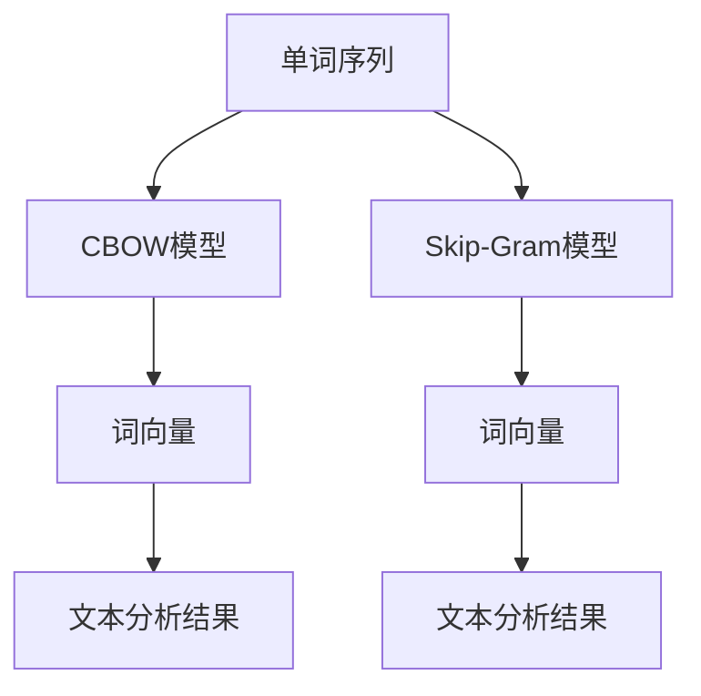

##### GloVe 算法

GloVe（Global Vectors for Word Representation）是一种基于全局统计信息的词嵌入算法，通过计算单词的共生矩阵来生成词向量。GloVe 算法能够更好地捕捉单词之间的语义关系。

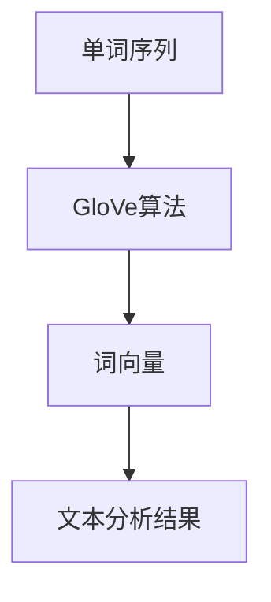

#### 序列模型与注意力机制

序列模型（Sequence Model）是一种用于处理序列数据的神经网络模型，可以自动学习语音信号的时序特征。注意力机制（Attention Mechanism）是一种在序列模型中用于关注关键信息的机制，可以提高模型的语义理解能力。

##### LSTM（长短期记忆网络）

LSTM 是一种用于处理序列数据的 RNN 变体，可以自动学习语音信号的时序特征。LSTM 通过引入门控机制，可以有效解决 RNN 的梯度消失问题。

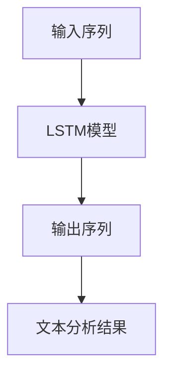

##### Transformer 模型

Transformer 是一种基于自注意力机制的神经网络模型，广泛应用于自然语言处理任务。在语音搜索中，Transformer 模型可以显著提高搜索结果的准确性和相关性。

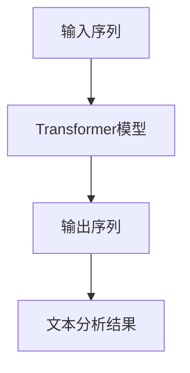

#### 转换器架构（Encoder-Decoder 架构）

转换器架构（Encoder-Decoder Architecture）是一种基于序列到序列（Sequence-to-Sequence）学习的神经网络模型，用于将输入序列转换为输出序列。在语音搜索中，Encoder 用于对语音输入进行编码，Decoder 用于对编码后的信息进行解码，以生成搜索结果。

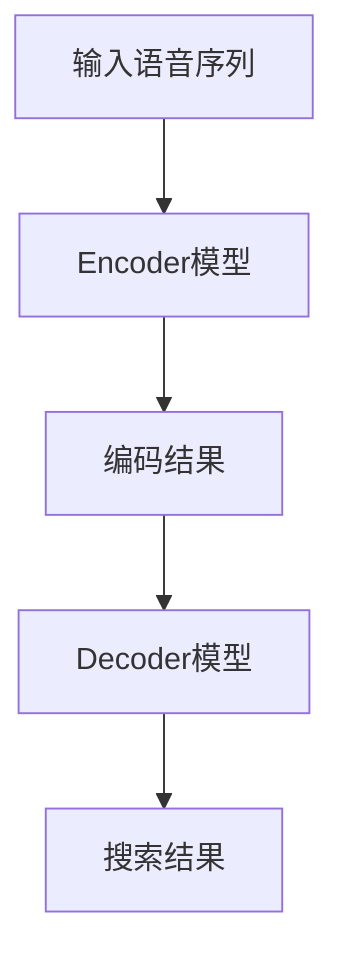

### 2.3 大规模预训练模型在语音搜索中的应用

大规模预训练模型（Large-scale Pre-trained Models）是一种通过在大量数据上进行预训练，然后微调到特定任务上的模型。在语音搜索中，大规模预训练模型可以显著提高搜索结果的准确性和用户体验。

#### 预训练模型原理

预训练模型通过在大量数据上进行预训练，学习到通用语言特征和语义关系。预训练模型的训练过程通常分为两个阶段：

1. **预训练阶段**：在大量文本数据上进行预训练，学习到通用语言特征和语义关系。
2. **微调阶段**：在特定任务数据上进行微调，以适应特定的语音搜索应用场景。

#### 自监督学习方法

自监督学习（Self-supervised Learning）是一种通过利用未标注数据进行训练的方法。在语音搜索中，自监督学习方法可以用于大规模预训练模型的训练，从而提高模型的性能和泛化能力。

##### 字符级别的自监督学习

字符级别的自监督学习方法通过利用字符的顺序信息进行训练，如 BERT 模型的训练。BERT 模型通过在输入序列中预测下一个字符，从而学习到语言的序列特性。

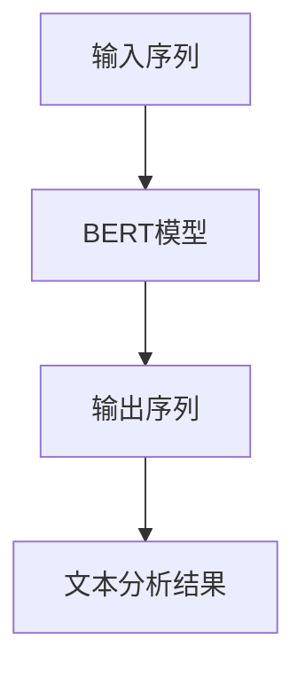

##### 词级别的自监督学习

词级别的自监督学习方法通过利用词的上下文信息进行训练，如 GPT 模型的训练。GPT 模型通过在输入序列中预测下一个词，从而学习到语言的语义关系。

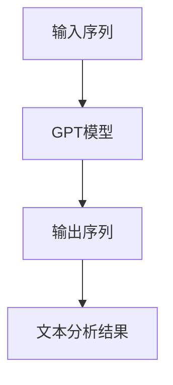

#### 迁移学习与微调技术

迁移学习（Transfer Learning）是一种将预训练模型的知识迁移到特定任务上的方法。在语音搜索中，迁移学习可以显著提高模型在特定任务上的性能。

微调技术（Fine-tuning）是一种在预训练模型的基础上，针对特定任务进行进一步训练的方法。通过微调技术，可以进一步提高模型在特定任务上的准确性和性能。

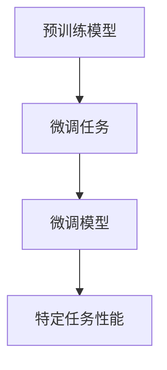

## 第三部分：电商场景下的语音搜索应用

### 3.1 电商平台的语音搜索体验优化

电商平台的语音搜索体验优化是提升用户满意度和转化率的关键。下面我们将探讨如何通过优化语音搜索结果展示和搜索广告策略来提升用户体验。

#### 用户行为分析

用户行为分析是优化语音搜索体验的基础。通过对用户搜索行为的分析，可以了解用户的需求和偏好，从而优化搜索结果展示和推荐策略。

1. **搜索意图识别**：通过分析用户的语音输入，识别用户的搜索意图，如查找商品名称、比较价格、查看商品评价等。

2. **搜索历史记录**：根据用户的搜索历史记录，为用户提供个性化的搜索建议和推荐。

3. **用户反馈机制**：建立用户反馈机制，收集用户的搜索体验和满意度，以便不断优化搜索结果展示。

#### 语音搜索结果展示与优化

语音搜索结果展示是影响用户体验的重要因素。为了提升用户体验，可以从以下几个方面进行优化：

1. **结果展示格式**：优化语音搜索结果的展示格式，使其更易于理解和操作。例如，使用列表、卡片、轮播图等形式进行展示。

2. **结果排序策略**：根据用户的搜索意图和历史记录，调整搜索结果的排序策略，使其更符合用户的需求。

3. **结果筛选与过滤**：提供筛选和过滤功能，帮助用户快速找到所需的商品或信息。

4. **结果摘要与推荐**：为用户提供结果摘要和推荐，使用户能够更快速地获取关键信息。

#### 搜索广告策略

搜索广告是电商平台的重要收入来源。为了提升广告效果和用户体验，可以从以下几个方面进行优化：

1. **广告展示位置**：合理设置广告展示位置，使其不干扰用户的搜索体验。

2. **广告内容与形式**：优化广告内容与形式，使其更具吸引力和相关性。

3. **广告竞价策略**：根据用户的行为数据和广告效果，调整广告竞价策略，提高广告投放效果。

4. **广告创意与文案**：创新广告创意和文案，提高广告的点击率和转化率。

### 3.2 商品分类与推荐系统

商品分类与推荐系统是电商平台的语音搜索应用中的重要组成部分。通过商品分类和推荐系统，可以为用户提供更准确、更个性化的搜索结果。

#### 商品分类算法

商品分类算法用于将电商平台上的商品按照一定的规则进行分类。常见的商品分类算法包括基于类比的分类算法、基于规则的分类算法和基于机器学习的分类算法。

1. **基于类比的分类算法**：通过比较新商品与已分类商品的特征，进行分类。

2. **基于规则的分类算法**：根据预定义的规则进行分类。

3. **基于机器学习的分类算法**：通过机器学习模型对新商品进行分类。

#### 基于语音搜索的个性化推荐

基于语音搜索的个性化推荐系统可以根据用户的语音输入和搜索历史，为用户提供个性化的商品推荐。常见的个性化推荐算法包括基于内容的推荐、基于协同过滤的推荐和基于深度学习的推荐。

1. **基于内容的推荐**：根据用户的历史搜索记录和商品特征，为用户推荐类似的商品。

2. **基于协同过滤的推荐**：根据用户和商品之间的交互记录，为用户推荐其他用户喜欢的商品。

3. **基于深度学习的推荐**：使用深度学习模型，根据用户的语音输入和搜索历史，为用户推荐个性化的商品。

### 3.3 语音搜索在客服场景的应用

语音搜索在客服场景中的应用可以有效提高客服效率和用户体验。下面我们将探讨语音搜索在客服场景中的应用和优势。

#### 语音客服机器人

语音客服机器人是一种基于语音搜索技术的智能客服系统。通过语音识别和自然语言处理技术，语音客服机器人可以理解用户的语音输入，并为其提供相应的回答和解决方案。

1. **问题识别**：语音客服机器人通过语音识别技术，将用户的语音输入转换为文本，并识别用户的问题。

2. **知识库查询**：语音客服机器人通过查询预定义的知识库，为用户提供问题的答案和解决方案。

3. **上下文理解**：语音客服机器人通过自然语言处理技术，理解用户的问题和上下文信息，提供更准确和个性化的回答。

#### 语音搜索在客户服务中的应用案例

1. **常见问题解答**：语音客服机器人可以快速解答用户提出的常见问题，如产品使用方法、退换货政策等。

2. **订单查询与处理**：语音客服机器人可以协助用户查询订单状态、修改订单信息等。

3. **在线咨询**：语音客服机器人可以为用户提供在线咨询，解答用户的疑问，提高用户满意度。

## 第四部分：语音搜索系统的开发与部署

### 4.1 语音搜索系统的开发环境搭建

开发语音搜索系统需要选择合适的开发工具、框架和平台。下面我们将介绍如何搭建语音搜索系统的开发环境。

#### 开发工具与框架选择

1. **编程语言**：Python 是语音搜索系统开发的主流编程语言，具有丰富的库和工具支持。

2. **语音识别框架**：如 CMU Sphinx、PyTorch、TensorFlow 等，这些框架提供了便捷的语音识别和自然语言处理接口。

3. **自然语言处理框架**：如 NLTK、spaCy、Transformers 等，这些框架提供了丰富的文本处理和语义分析功能。

4. **开发平台**：如 Jupyter Notebook、PyCharm、VSCode 等，这些平台提供了便捷的编程和调试环境。

#### 开发流程与工具链

1. **数据采集与预处理**：采集语音数据，并进行预处理，如降噪、分帧、特征提取等。

2. **模型训练与优化**：使用预处理后的数据，训练语音识别和自然语言处理模型，并进行优化。

3. **模型部署与测试**：将训练好的模型部署到生产环境中，并进行测试和验证。

4. **系统优化与维护**：根据用户反馈和测试结果，不断优化系统性能和用户体验。

### 4.2 语音搜索系统的设计与实现

#### 系统架构设计

语音搜索系统的设计包括前端、后端和数据库三部分。

1. **前端**：负责接收用户的语音输入，展示搜索结果和用户界面。

2. **后端**：负责处理语音识别、自然语言处理和搜索结果的生成。

3. **数据库**：存储用户数据、商品数据和搜索日志等。

#### 语音识别模块开发

1. **语音信号处理**：进行语音信号的预处理，如降噪、分帧和特征提取。

2. **模型训练与优化**：使用预处理后的数据，训练语音识别模型，并进行优化。

3. **语音识别接口**：提供语音识别的 API 接口，供前端调用。

#### 自然语言处理模块开发

1. **文本处理**：进行文本的分词、词性标注和句法分析。

2. **语义理解**：使用自然语言处理模型，理解用户的语音输入和搜索意图。

3. **搜索结果生成**：根据用户的语音输入和搜索意图，生成相关的搜索结果。

#### 搜索结果展示与交互

1. **结果展示**：将搜索结果以列表、卡片或轮播图的形式展示给用户。

2. **交互设计**：提供用户与搜索结果之间的交互功能，如点击、选择和筛选。

### 4.3 语音搜索系统的部署与优化

#### 部署策略

1. **云服务器部署**：使用云服务器部署语音搜索系统，提供高可用性和可扩展性。

2. **容器化部署**：使用 Docker 等容器化技术，简化部署流程，提高部署效率。

3. **负载均衡**：使用负载均衡器，实现系统的高并发处理能力。

#### 性能优化

1. **模型压缩与量化**：通过模型压缩和量化技术，降低模型的计算复杂度和存储空间需求。

2. **缓存机制**：使用缓存机制，提高系统响应速度和性能。

3. **并行处理**：使用并行处理技术，提高系统处理能力。

#### 系统维护与升级

1. **监控系统**：建立监控系统，实时监控系统运行状态和性能指标。

2. **故障处理**：制定故障处理方案，快速处理系统故障，确保系统稳定运行。

3. **版本升级**：定期进行系统升级，修复漏洞和优化功能。

## 第五部分：语音搜索的未来发展趋势

### 5.1 语音搜索技术的未来发展

随着人工智能技术的不断进步，语音搜索技术将朝着更智能、更高效的方向发展。未来，语音搜索技术将实现以下突破：

1. **更高准确率**：通过深度学习、神经网络等技术的应用，语音识别准确率将不断提高，用户可以实现更加准确、流畅的语音搜索。

2. **更丰富的语义理解**：随着自然语言处理技术的发展，语音搜索将能够更好地理解用户的语音输入和搜索意图，提供更加精准的搜索结果。

3. **个性化推荐**：通过用户行为分析和个性化推荐算法，语音搜索将能够为用户提供更加个性化的搜索体验。

### 5.2 电商行业的语音搜索趋势

在电商行业，语音搜索将成为主流的搜索方式。未来，电商行业的语音搜索趋势将包括：

1. **语音搜索入口多样化**：电商平台将提供多样化的语音搜索入口，如手机 APP、小程序、智能音箱等，满足用户在不同场景下的搜索需求。

2. **语音搜索与视觉搜索结合**：语音搜索与视觉搜索相结合，为用户提供更加全面、多模态的搜索体验。

3. **语音搜索在客服场景的应用**：语音搜索将在客服场景得到广泛应用，提高客服效率和用户体验。

### 5.3 用户体验与语音搜索的融合

随着语音搜索技术的不断发展，用户体验将变得更加自然、便捷。未来，用户体验与语音搜索将实现以下融合：

1. **无缝交互**：语音搜索将与用户的其他交互方式（如键盘输入、触摸操作）无缝融合，提供更加流畅的交互体验。

2. **多模态交互**：语音搜索将与视觉、触觉等多模态交互方式相结合，为用户提供更加丰富、沉浸的搜索体验。

3. **个性化体验**：通过用户行为分析和个性化推荐，语音搜索将为用户提供更加个性化的搜索体验，满足用户的个性化需求。

## 附录

### 附录 A：语音搜索开发资源与工具

1. **开源语音识别框架**：如 CMU Sphinx、Mozilla DeepSpeech、Kaldi 等。

2. **自然语言处理工具**：如 NLTK、spaCy、Transformers 等。

3. **电商语音搜索平台案例**：如 Amazon Alexa、Google Assistant、Apple Siri 等。

### 附录 B：常见问题与解答

1. **Q：语音搜索系统的开发难度大吗？**
   A：语音搜索系统的开发具有一定的难度，需要涉及语音识别、自然语言处理、搜索引擎等多个技术领域。但是，随着开源工具和框架的不断发展，开发语音搜索系统的难度逐渐降低。

2. **Q：语音搜索技术的准确率如何？**
   A：语音搜索技术的准确率在不断提高，目前的准确率已经可以满足大多数应用场景的需求。但是，对于特定领域的专业词汇和方言，识别准确率还有待提高。

3. **Q：语音搜索是否适用于所有用户？**
   A：语音搜索适用于大多数用户，特别是那些不擅长打字或者不方便使用键盘的用户。但是，对于听力障碍者或其他特殊需求的用户，语音搜索可能不太适用。

作者：AI天才研究院/AI Genius Institute & 禅与计算机程序设计艺术 /Zen And The Art of Computer Programming

本文从语音搜索的概念与背景、工作原理、技术基础、应用场景、开发与部署以及未来发展趋势等方面，全面探讨了语音搜索在电商领域的应用。通过本文的阅读，读者可以深入了解语音搜索技术的原理和应用，为电商平台提供语音搜索功能提供参考。同时，本文也展望了语音搜索技术的未来发展趋势，为相关领域的从业者提供了有益的启示。在数字时代，语音搜索无疑将成为电商行业的重要发展方向，为用户提供更加便捷、高效的购物体验。

