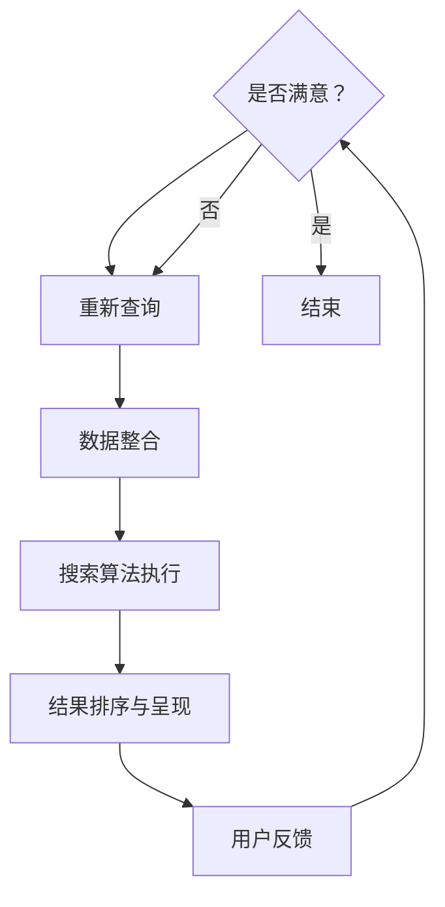
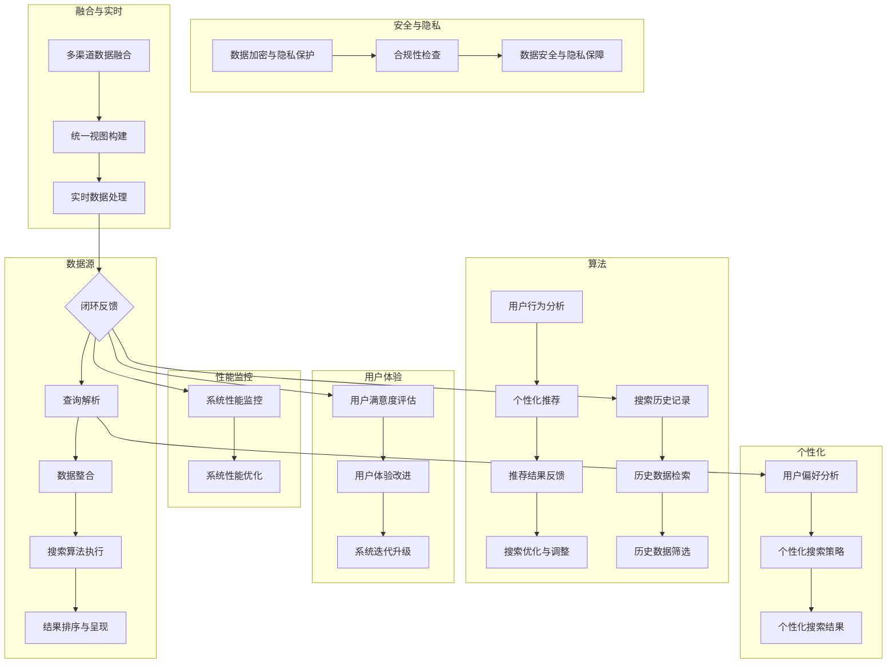

                 

### 跨平台搜索概述

#### 第1章：跨平台搜索背景与挑战

##### 1.1 跨平台搜索的定义与意义

跨平台搜索是指在不同平台（如网页、移动应用、桌面应用等）上提供统一的搜索服务。其核心目标是通过整合多渠道的数据源，为用户提供一个高效、精准的搜索体验。随着互联网的普及，用户在各个平台上产生的数据量呈爆炸性增长，这使得跨平台搜索变得尤为重要。

- **跨平台搜索的定义**：跨平台搜索是指在不同的平台（如网页、移动应用、桌面应用等）上提供统一的搜索服务，从而使用户能够便捷地访问所需的信息。
- **跨平台搜索的意义**：跨平台搜索可以提高用户的搜索效率，减少用户在不同平台间切换的麻烦，同时还可以帮助企业更好地理解用户需求，提供个性化的推荐服务。

##### 1.2 跨平台搜索面临的挑战

尽管跨平台搜索具有显著的优点，但在实际应用中仍面临许多挑战。

- **数据源多样性**：不同平台的数据源格式、结构、质量等各不相同，如何有效地整合这些异构数据源是一个关键问题。
- **实时性要求**：随着用户需求的不断变化，跨平台搜索需要能够实时响应用户查询，这对系统的性能和响应速度提出了更高的要求。
- **个性化推荐**：用户在不同平台上的行为和兴趣可能存在差异，如何根据用户的个性化需求提供精准的搜索结果是一个挑战。
- **隐私保护**：跨平台搜索涉及大量用户数据，如何保护用户隐私，遵守相关法律法规，也是需要重点考虑的问题。

#### 第2章：AI在跨平台搜索中的应用

##### 2.1 AI技术的跨平台搜索应用

人工智能技术在跨平台搜索中发挥着重要作用，可以帮助解决上述挑战。

- **自然语言处理（NLP）技术**：NLP技术可以处理和理解用户查询语句，提取关键信息，从而提高搜索的准确性。
- **机器学习算法**：机器学习算法可以用于构建模型，预测用户可能感兴趣的内容，实现个性化推荐。
- **深度学习网络**：深度学习网络具有强大的特征提取能力，可以用于处理大规模、高维的数据，提高搜索系统的性能。

##### 2.2 跨平台搜索中的数据整合

跨平台搜索需要整合来自不同平台的数据源。这一过程包括以下步骤：

- **数据聚合与清洗**：将来自不同平台的数据进行聚合，去除重复、错误或不完整的数据。
- **数据格式转换**：将不同格式的数据转换为统一的格式，以便进行后续处理。
- **数据质量控制**：对整合后的数据进行质量检查，确保数据的准确性、完整性和一致性。

### 总结

跨平台搜索作为现代互联网搜索的重要趋势，具有广泛的应用前景。通过引入人工智能技术，可以有效解决跨平台搜索面临的挑战，提高搜索效率和用户体验。在接下来的章节中，我们将进一步探讨AI技术在不同方面的应用，以及如何构建一个高效的跨平台搜索系统。

> **关键词**：跨平台搜索、AI技术、数据整合、个性化推荐、实时性、隐私保护

> **摘要**：本文将介绍跨平台搜索的背景与挑战，分析AI技术在跨平台搜索中的应用，探讨如何整合多渠道数据，提供最优的搜索体验。通过详细的算法原理讲解、项目实战案例分析，读者可以深入了解跨平台搜索系统的设计与实现。

---

### 第1章：跨平台搜索背景与挑战

#### 1.1 跨平台搜索的定义与意义

跨平台搜索是指在不同平台（如网页、移动应用、桌面应用等）上提供统一的搜索服务。其核心目标是通过整合多渠道的数据源，为用户提供一个高效、精准的搜索体验。随着互联网的普及，用户在各个平台上产生的数据量呈爆炸性增长，这使得跨平台搜索变得尤为重要。

**跨平台搜索的定义**：跨平台搜索是指在不同的平台（如网页、移动应用、桌面应用等）上提供统一的搜索服务，从而使用户能够便捷地访问所需的信息。

**跨平台搜索的意义**：跨平台搜索可以提高用户的搜索效率，减少用户在不同平台间切换的麻烦，同时还可以帮助企业更好地理解用户需求，提供个性化的推荐服务。

首先，跨平台搜索为用户提供了便捷的搜索体验。用户无需在不同的应用或网站上搜索相同的信息，而是可以在一个统一的界面中获取所需的内容，节省了时间和精力。例如，一个电商平台可以将用户在网页、移动应用和桌面应用上的购物记录和浏览历史整合起来，为用户提供个性化的推荐。

其次，跨平台搜索有助于企业提升用户体验和忠诚度。通过分析用户在不同平台上的行为数据，企业可以更精准地了解用户需求，提供个性化的产品和服务。例如，一家在线教育平台可以根据用户在网页、移动应用和桌面应用上的学习行为，为用户提供定制化的学习路径和课程推荐。

此外，跨平台搜索还可以提高企业的运营效率。通过整合多渠道的数据源，企业可以更好地监控市场动态，优化营销策略，降低运营成本。例如，一家电商企业可以通过跨平台搜索分析用户在不同平台上的购买行为，识别出热门产品和潜在的销售机会，从而优化库存管理和营销推广。

总之，跨平台搜索在提升用户体验、提高企业运营效率等方面具有重要意义。随着人工智能技术的不断发展，跨平台搜索将变得更加智能和精准，为用户和企业带来更多的价值。

#### 1.2 跨平台搜索面临的挑战

尽管跨平台搜索具有显著的优点，但在实际应用中仍面临许多挑战。

**数据源多样性**：不同平台的数据源格式、结构、质量等各不相同，如何有效地整合这些异构数据源是一个关键问题。

**实时性要求**：随着用户需求的不断变化，跨平台搜索需要能够实时响应用户查询，这对系统的性能和响应速度提出了更高的要求。

**个性化推荐**：用户在不同平台上的行为和兴趣可能存在差异，如何根据用户的个性化需求提供精准的搜索结果是一个挑战。

**隐私保护**：跨平台搜索涉及大量用户数据，如何保护用户隐私，遵守相关法律法规，也是需要重点考虑的问题。

**数据源多样性**：跨平台搜索需要整合来自不同平台的数据源，例如网页、移动应用、桌面应用等。这些平台的数据源在格式、结构、质量等方面可能存在显著差异。例如，网页数据通常以HTML格式存储，包含大量结构化和半结构化数据；移动应用数据可能以JSON格式存储，包含用户行为和地理位置信息；桌面应用数据可能以XML格式存储，包含详细的用户偏好和操作记录。如何将不同平台的数据源进行统一整合，是一个重要的挑战。

**实时性要求**：跨平台搜索需要能够实时响应用户查询，以满足用户对即时信息的获取需求。然而，不同平台的数据更新速度可能不同，如何确保系统在较短时间内完成数据整合和搜索结果返回，是一个重要的技术难题。此外，随着用户需求的不断变化，跨平台搜索系统需要具备高可扩展性和动态调整能力，以满足不同场景下的实时性要求。

**个性化推荐**：用户在不同平台上的行为和兴趣可能存在差异，如何根据这些差异提供个性化的搜索结果是一个挑战。例如，一个用户在网页上搜索旅游信息，而在移动应用上搜索酒店预订，如何将这两个平台的行为数据进行整合，并提供符合用户需求的搜索结果，需要深入的个性化推荐算法支持。

**隐私保护**：跨平台搜索涉及大量用户数据，包括用户行为、地理位置、偏好等信息。如何保护用户隐私，防止数据泄露和滥用，是跨平台搜索面临的重要挑战。同时，不同国家和地区的隐私保护法规可能存在差异，如何在遵守相关法律法规的前提下进行数据整合和搜索服务，也需要跨平台搜索系统具备相应的合规性设计。

为了解决这些挑战，跨平台搜索系统需要结合多种技术手段，包括数据整合、实时处理、个性化推荐和隐私保护等。在接下来的章节中，我们将进一步探讨AI技术在跨平台搜索中的应用，以及如何通过这些技术手段解决上述挑战。

#### 2.1 AI技术的跨平台搜索应用

人工智能技术在跨平台搜索中发挥着重要作用，可以帮助解决上述挑战。以下是AI技术在不同方面的应用：

**自然语言处理（NLP）技术**：NLP技术可以处理和理解用户查询语句，提取关键信息，从而提高搜索的准确性。例如，通过词性标注、命名实体识别等技术，NLP可以将用户输入的自然语言查询转换为计算机可理解的结构化数据，从而实现更准确的搜索匹配。

**机器学习算法**：机器学习算法可以用于构建模型，预测用户可能感兴趣的内容，实现个性化推荐。例如，协同过滤算法可以通过分析用户的历史行为和兴趣标签，预测用户对未知物品的评分，从而提供个性化的推荐结果。此外，机器学习算法还可以用于关键词提取、文本分类等任务，进一步优化搜索结果的准确性。

**深度学习网络**：深度学习网络具有强大的特征提取能力，可以用于处理大规模、高维的数据，提高搜索系统的性能。例如，卷积神经网络（CNN）可以用于图像识别，提取图像中的关键特征，从而实现图像搜索；循环神经网络（RNN）可以用于处理序列数据，如用户的历史行为数据，提取用户的行为模式，从而实现更精准的搜索推荐。

**多模态学习**：多模态学习是指结合多种数据类型（如图像、文本、语音等）进行训练和学习，从而提高搜索系统的泛化能力。例如，通过结合用户在网页和移动应用上的行为数据，多模态学习可以更好地理解用户的兴趣和行为模式，从而提供更准确的搜索结果。

**强化学习**：强化学习是一种通过与环境互动来学习最优策略的机器学习算法，可以用于优化跨平台搜索系统的搜索结果排序。例如，通过模拟用户的点击和浏览行为，强化学习可以不断调整搜索结果排序策略，以提高用户满意度和点击率。

**迁移学习**：迁移学习是一种利用已有模型在新的任务上快速学习的方法，可以用于跨平台搜索系统中的模型训练。例如，通过将已在某个平台上训练好的模型迁移到其他平台，可以节省训练时间和计算资源，同时提高搜索系统的性能。

**模型解释性**：随着深度学习等复杂算法在跨平台搜索中的应用，如何解释模型决策过程，提高系统的透明度和可信度，成为一个重要问题。通过模型解释技术，可以揭示模型决策的依据和原因，从而提高用户对搜索结果的信任度。

**自适应学习**：自适应学习是指系统根据用户的反馈和互动行为，动态调整搜索策略和推荐算法。例如，通过实时监测用户的行为数据，自适应学习可以调整关键词权重、搜索结果排序等，以提高用户的搜索体验。

总之，AI技术在跨平台搜索中的应用，可以显著提升搜索系统的性能和用户体验。通过结合多种AI技术，跨平台搜索系统可以实现更精准的搜索匹配、更个性化的推荐服务，以及更高效的搜索结果排序。在接下来的章节中，我们将进一步探讨如何整合这些AI技术，构建一个高效的跨平台搜索系统。

#### 2.2 跨平台搜索中的数据整合

跨平台搜索需要整合来自不同平台的数据源，这一过程包括以下步骤：

**数据聚合与清洗**：数据聚合是将来自不同平台的数据进行整合的过程。在这一步，首先需要定义数据源的类型和结构，然后通过API、爬虫或其他方式获取数据。接着，对获取到的数据进行清洗，去除重复、错误或不完整的数据，确保数据的质量和一致性。

**数据格式转换**：不同平台的数据通常以不同的格式存储，如JSON、XML、CSV等。在进行数据整合之前，需要将这些数据格式转换为统一的格式，如JSON或CSV。数据格式转换包括数据类型的映射、字段名称的统一和数据格式的规范化等步骤。

**数据质量控制**：数据质量控制是确保整合后的数据准确、完整和一致的过程。在这一步，需要对数据进行检查，发现并修复数据中的错误和缺失值。此外，还需要对数据进行归一化处理，确保数据在统计分析和模型训练中的可比性。

**数据仓库建设**：数据仓库是用于存储和管理大规模、多源数据的重要工具。在跨平台搜索中，数据仓库可以用于整合来自不同平台的数据，提供统一的数据访问接口。数据仓库的设计需要考虑数据的存储结构、访问性能和扩展性等因素。

**数据索引构建**：为了提高数据查询的效率，需要为数据仓库中的数据建立索引。索引构建包括创建倒排索引、分类索引和全文索引等。倒排索引可以快速定位数据的关键字，分类索引可以快速查找分类信息，全文索引可以支持全文搜索。

**数据集成与融合**：数据集成与融合是将多个数据源中的数据合并为一个统一视图的过程。在这一步，需要处理数据源之间的冗余、冲突和差异，确保数据的一致性和完整性。数据融合可以通过数据合并、数据链接和数据映射等方法实现。

**数据实时更新**：跨平台搜索系统需要实时获取和更新数据，以响应用户的动态需求。数据实时更新可以通过实时数据流处理技术实现，如Apache Kafka、Apache Flink等。实时数据流处理可以确保数据在最小延迟内被处理和更新，从而提高搜索系统的实时性。

**数据加密与隐私保护**：在跨平台搜索中，涉及大量用户隐私数据，如个人身份信息、搜索记录等。为了保护用户隐私，需要对数据进行加密存储和传输。此外，还需要遵守相关隐私保护法规，确保数据处理和存储的合规性。

通过上述步骤，跨平台搜索系统可以有效地整合来自不同平台的数据源，为用户提供统一的搜索服务。在数据整合过程中，需要综合考虑数据源多样性、实时性、隐私保护等因素，确保数据的质量和一致性。同时，通过引入数据仓库、索引构建、数据实时更新等技术手段，可以显著提高数据查询和处理效率，为用户提供更好的搜索体验。

#### 3.1 搜索引擎算法基础

搜索引擎算法是跨平台搜索系统的核心组成部分，其性能直接影响搜索结果的准确性和用户体验。以下将介绍搜索引擎算法的基础知识，包括网页爬取、倒排索引构建和检索算法分析。

##### 网页爬取

网页爬取（Web Crawler）是搜索引擎获取网页内容的重要手段。网页爬取的基本流程如下：

1. **种子页面获取**：搜索引擎通过初始的种子页面开始爬取，这些种子页面通常来源于搜索引擎的注册网站、用户搜索历史等。

2. **页面解析**：爬虫获取网页内容后，通过解析器提取网页中的链接，生成新的待爬取页面列表。

3. **链接跟踪**：爬虫根据提取的链接，按照一定的策略（如广度优先或深度优先）逐步扩展待爬取页面列表。

4. **内容存储**：爬取到的网页内容被存储在搜索引擎的数据库中，用于后续的索引构建和检索。

在网页爬取过程中，常见的技术挑战包括反爬虫策略、网络延迟和数据存储。为了解决这些问题，搜索引擎通常采用以下策略：

- **多线程爬取**：使用多线程技术并行处理多个请求，提高爬取速度。
- **代理服务器**：通过代理服务器隐藏爬虫的真实IP地址，防止被目标网站识别和屏蔽。
- **爬取频率控制**：合理设置爬取频率，避免对目标网站造成过大压力。

##### 倒排索引构建

倒排索引（Inverted Index）是搜索引擎的核心数据结构，用于快速定位关键词在文档中的位置。倒排索引的基本构建过程如下：

1. **分词**：将文档内容进行分词，提取出关键词。分词可以采用基于词典的分词方法或基于统计的分词方法。

2. **词频统计**：对每个关键词在文档中的出现次数进行统计，形成词频表。

3. **倒排列表构建**：将每个关键词与对应的文档ID和位置信息建立映射关系，形成倒排列表。

4. **索引存储**：将倒排索引存储在磁盘或内存中，以便快速检索。

倒排索引的优势在于可以显著提高搜索效率。在检索过程中，搜索引擎可以根据关键词快速定位到包含该关键词的文档，从而避免逐个扫描整个文档。倒排索引的缺点是存储空间较大，因为需要存储大量的词频信息和倒排列表。

##### 检索算法分析

检索算法是搜索引擎的核心功能，用于根据用户查询生成搜索结果。以下是一些常见的检索算法：

1. **布尔检索**：布尔检索是基于布尔代数原理的检索方法，支持AND、OR、NOT等布尔运算。通过组合关键词和布尔运算符，可以生成更加精确的搜索结果。

2. **向量空间模型**：向量空间模型将文档和查询表示为高维向量，通过计算向量之间的相似度来评估文档的相关性。常用的相似度计算方法包括余弦相似度和欧几里得距离。

3. **基于网页排名的检索**：基于网页排名的检索方法（如PageRank）通过分析网页之间的链接关系，评估网页的重要性。重要网页在搜索结果中的排名通常更高。

4. **深度学习检索**：深度学习检索方法利用神经网络模型对文本进行特征提取和关系建模，提高搜索结果的准确性和用户体验。常见的深度学习模型包括卷积神经网络（CNN）和循环神经网络（RNN）。

在检索算法的选择和优化过程中，需要考虑以下因素：

- **查询响应时间**：检索算法的响应时间直接影响用户体验，需要优化算法以减少延迟。
- **搜索结果质量**：检索算法需要能够准确评估文档的相关性，提高搜索结果的准确性。
- **可扩展性**：检索算法需要支持大规模数据和并发查询，具有良好的可扩展性。

通过深入理解搜索引擎算法的基础知识，可以更好地设计高效的跨平台搜索系统，为用户提供优质的搜索体验。

#### 3.2 AI算法在跨平台搜索中的应用

人工智能（AI）算法在跨平台搜索中发挥着关键作用，可以显著提升搜索的准确性和个性化水平。以下介绍几种常见的AI算法在跨平台搜索中的应用。

##### 协同过滤推荐算法

协同过滤推荐算法是一种基于用户行为的推荐方法，通过分析用户之间的相似性来预测用户对未知物品的评分。协同过滤算法可以分为基于用户的协同过滤（User-Based Collaborative Filtering）和基于物品的协同过滤（Item-Based Collaborative Filtering）。

- **基于用户的协同过滤**：这种方法首先计算用户之间的相似性，然后根据相似度矩阵推荐与目标用户相似的其他用户的评分较高的物品。相似性通常通过余弦相似度或皮尔逊相关系数计算。

  ```plaintext
  // 输入：用户历史行为数据userActions
  // 输出：用户对未知物品的预测评分userItemRatings

  // 1. 构建用户相似度矩阵
  similarityMatrix = buildSimilarityMatrix(userActions)

  // 2. 遍历用户u，为每个未知物品i计算预测评分
  for each user u in userActions:
      for each item i not in userActions[u]:
          // 2.1 计算用户u和物品i的相似度
          similarity = similarityMatrix[u][i]

          // 2.2 计算用户u对物品i的预测评分
          userItemRating = u_average_rating + similarity * (i_average_rating - u_average_rating)
  ```

- **基于物品的协同过滤**：这种方法首先计算物品之间的相似性，然后根据相似度矩阵推荐与目标物品相似的已评分物品。

  ```plaintext
  // 输入：用户历史行为数据userActions，物品特征数据itemFeatures
  // 输出：用户对未知物品的预测评分userItemRatings

  // 1. 构建物品相似度矩阵
  similarityMatrix = buildSimilarityMatrix(itemFeatures)

  // 2. 遍历用户u，为每个未知物品i计算预测评分
  for each user u in userActions:
      for each item i not in userActions[u]:
          // 2.1 计算物品i和物品j的相似度
          similarity = similarityMatrix[i][j]

          // 2.2 计算用户u对物品i的预测评分
          userItemRating = u_average_rating + similarity * (j_average_rating - u_average_rating)
  ```

##### 图神经网络（GCN）

图神经网络（Graph Neural Networks，GCN）是一种专门用于图数据学习的神经网络模型，可以有效地处理跨平台搜索中的图结构数据。GCN通过节点特征和图结构来预测节点标签，可以用于物品推荐、关系预测等任务。

- **GCN算法原理**：GCN通过聚合邻居节点的特征来更新当前节点的特征。具体来说，GCN首先定义一个邻接矩阵，用于表示节点之间的连接关系。然后，通过矩阵乘法或卷积操作，聚合邻居节点的特征，得到更新后的节点特征。

  ```plaintext
  // 输入：邻接矩阵A，节点特征矩阵H
  // 输出：更新后的节点特征矩阵H'

  // 1. 初始化节点特征矩阵
  H = initializeNodeFeatures()

  // 2. 遍历所有节点，聚合邻居节点的特征
  for each node i:
      // 2.1 计算邻居节点的特征平均值
      neighborFeatures = averageNeighborFeatures(A[i], H)

      // 2.2 更新节点特征
      H[i] = neighborFeatures
  ```

- **GCN在跨平台搜索中的应用**：GCN可以用于跨平台搜索中的关系建模，例如，通过分析用户在网页、移动应用和桌面应用上的行为数据，构建用户-物品-平台的三层图结构，从而实现跨平台的个性化推荐。

##### 迁移学习

迁移学习（Transfer Learning）是一种利用已有模型在新的任务上快速学习的方法。在跨平台搜索中，迁移学习可以用于将已在某个平台上训练好的模型迁移到其他平台，从而节省训练时间和计算资源。

- **迁移学习原理**：迁移学习通过在源任务和目标任务之间共享模型参数，实现知识迁移。具体来说，迁移学习可以分为以下几种类型：

  - **特征迁移**：在源任务和目标任务之间共享特征提取层，将源任务中的特征表示迁移到目标任务。
  - **微调迁移**：在源任务和目标任务之间共享预训练模型，然后仅对目标任务的特定层进行微调。
  - **全迁移**：在源任务和目标任务之间完全共享模型参数。

  ```plaintext
  // 输入：源任务模型参数sourceModel，目标任务数据targetData
  // 输出：目标任务模型参数targetModel

  // 1. 加载源任务模型参数
  sourceModel = loadSourceModelParameters()

  // 2. 微调目标任务模型参数
  targetModel = fineTuneModelParameters(sourceModel, targetData)

  // 3. 评估目标任务模型性能
  evaluateModelPerformance(targetModel, targetData)
  ```

- **迁移学习在跨平台搜索中的应用**：迁移学习可以用于跨平台搜索系统中的模型训练，例如，通过将已在网页搜索中训练好的模型迁移到移动应用搜索中，可以快速提高移动应用搜索的性能和效果。

通过引入协同过滤推荐算法、图神经网络和迁移学习等AI算法，跨平台搜索系统可以实现更精准的搜索匹配和个性化推荐，提高用户满意度。在接下来的章节中，我们将进一步探讨这些算法的数学模型和实现细节。

#### 3.3 伪代码讲解

在跨平台搜索系统中，伪代码是一种有效的工具，用于描述算法的逻辑流程和实现细节。以下将使用伪代码详细阐述文本预处理、索引构建和查询处理的步骤。

##### 文本预处理

文本预处理是跨平台搜索系统的第一步，其主要任务是清洗和格式化原始文本数据，以便后续的索引构建和查询处理。

```plaintext
// 输入：原始文本数据textData
// 输出：预处理后的文本数据processedText

// 1. 清洗文本数据，去除特殊字符和停用词
processedText = cleanTextData(textData)

// 2. 分词，将文本拆分为单词或短语
tokenList = tokenizeText(processedText)

// 3. 去除停用词和低频词
filteredTokenList = removeStopWordsAndLowFrequencyWords(tokenList)

// 4. 词干提取，将单词还原为基本形式
stemmedTokenList = stemWords(filteredTokenList)

// 5. 输出预处理后的文本数据
return stemmedTokenList
```

##### 索引构建

索引构建是将预处理后的文本数据转换为索引数据的过程，以便快速查询。索引构建主要包括分词、倒排索引构建和索引存储等步骤。

```plaintext
// 输入：预处理后的文本数据processedText
// 输出：索引数据indexData

// 1. 分词，将文本拆分为单词或短语
tokenList = tokenizeText(processedText)

// 2. 构建倒排索引，将每个词映射到其出现的文档和位置
invertedIndex = buildInvertedIndex(tokenList)

// 3. 存储索引数据
storeIndexData(invertedIndex)

// 4. 输出索引数据
return invertedIndex
```

##### 查询处理

查询处理是跨平台搜索系统的核心功能，其主要任务是接收用户查询，处理查询请求，并返回搜索结果。查询处理主要包括查询解析、索引查询和结果排序等步骤。

```plaintext
// 输入：用户查询query
// 输出：搜索结果searchResults

// 1. 解析用户查询，提取关键词
queryTokens = parseQuery(query)

// 2. 查询索引，获取包含关键词的文档列表
docList = queryIndex(invertedIndex, queryTokens)

// 3. 对文档列表进行排序，通常使用TF-IDF或BM25算法
searchResults = sortDocuments(docList)

// 4. 返回搜索结果
return searchResults
```

通过上述伪代码，我们可以清晰地看到跨平台搜索系统的整体逻辑流程。文本预处理确保了原始文本数据的质量和一致性；索引构建提高了数据查询的效率；查询处理实现了对用户查询的快速响应和准确匹配。这些步骤共同构建了一个高效的跨平台搜索系统。

#### 4.1 数学模型基础

在跨平台搜索系统中，数学模型用于描述数据之间的关系，帮助算法做出预测和决策。以下是几种常见的数学模型，包括向量空间模型、概率模型和概率图模型。

##### 向量空间模型

向量空间模型（Vector Space Model，VSM）是一种用于表示文本和查询的方法，将文本和查询表示为高维向量。在VSM中，每个词或短语都对应一个向量，向量中的每个维度表示词或短语在文档或查询中的权重。

- **词频（TF）**：词频表示一个词在文档中出现的频率。词频越高，词在文档中的重要性越高。

  $$ TF(t) = \frac{f_{t,d}}{N} $$
  
  其中，$f_{t,d}$ 表示词 $t$ 在文档 $d$ 中出现的次数，$N$ 表示文档 $d$ 中的总词数。

- **逆文档频率（IDF）**：逆文档频率表示一个词在所有文档中出现的频率。逆文档频率越高，词的全局重要性越高。

  $$ IDF(t) = \log \left( \frac{N}{|d: t \text{ appears in } d|} \right) $$

  其中，$N$ 表示文档总数，$|d: t \text{ appears in } d|$ 表示包含词 $t$ 的文档数量。

- **TF-IDF**：TF-IDF是词频和逆文档频率的结合，用于计算词在文档中的权重。

  $$ TF-IDF(t, d) = TF(t, d) \times IDF(t) $$

##### 概率模型

概率模型用于计算文本之间的相似性和相关性。以下介绍两种常见的概率模型：贝叶斯定理和朴素贝叶斯模型。

- **贝叶斯定理**：贝叶斯定理是一种用于计算后验概率的公式，可以用于文本分类和概率推理。

  $$ P(A|B) = \frac{P(B|A)P(A)}{P(B)} $$
  
  其中，$P(A|B)$ 表示在已知事件 $B$ 发生的条件下，事件 $A$ 发生的概率；$P(B|A)$ 表示在已知事件 $A$ 发生的条件下，事件 $B$ 发生的概率；$P(A)$ 和 $P(B)$ 分别表示事件 $A$ 和 $B$ 的先验概率。

- **朴素贝叶斯模型**：朴素贝叶斯模型是一种基于贝叶斯定理的简单概率分类模型，假设特征之间相互独立。

  $$ P(C) = \prod_{i=1}^{n} P(x_i|C) $$
  
  $$ P(C|X) = \frac{P(X|C)P(C)}{P(X)} $$
  
  其中，$C$ 表示类别，$X$ 表示特征向量，$P(x_i|C)$ 表示第 $i$ 个特征在类别 $C$ 条件下的概率，$P(C)$ 和 $P(X)$ 分别表示类别 $C$ 和特征向量 $X$ 的先验概率。

##### 概率图模型

概率图模型（Probabilistic Graphical Models，PGM）是一种用于表示变量之间条件依赖关系的图形化模型。常见的概率图模型包括贝叶斯网络和马尔可夫网络。

- **贝叶斯网络**：贝叶斯网络是一种有向图模型，用于表示变量之间的条件依赖关系。贝叶斯网络中的每个节点表示一个随机变量，节点之间的有向边表示变量之间的条件依赖。

  $$ P(X) = \prod_{i=1}^{n} P(x_i | \text{parents of } x_i) $$
  
  其中，$P(x_i | \text{parents of } x_i)$ 表示第 $i$ 个节点的条件概率分布，取决于其父节点的状态。

- **马尔可夫网络**：马尔可夫网络是一种无向图模型，用于表示变量之间的条件独立性。马尔可夫网络中的每个节点表示一个随机变量，节点之间的边表示变量之间的条件独立性。

  $$ P(X) = \prod_{i=1}^{n} P(x_i | \text{neighbors of } x_i) $$
  
  其中，$P(x_i | \text{neighbors of } x_i)$ 表示第 $i$ 个节点的条件概率分布，取决于其邻居节点的状态。

通过引入这些数学模型，跨平台搜索系统可以更准确地描述文本之间的关系，提高搜索的准确性和个性化水平。

#### 4.2 数学公式详细讲解

在跨平台搜索系统中，数学公式和模型用于量化文本相似性、计算搜索结果的相关性，以及优化搜索算法。以下是几个关键数学公式的详细讲解。

##### 余弦相似度

余弦相似度（Cosine Similarity）是一种用于衡量两个向量之间相似度的指标。在文本搜索中，余弦相似度用于计算查询和文档之间的相似度。

$$
\cos(\theta) = \frac{\vec{a} \cdot \vec{b}}{||\vec{a}|| \cdot ||\vec{b}||}
$$

其中，$\vec{a}$ 和 $\vec{b}$ 分别表示查询和文档的向量表示，$\theta$ 表示两个向量之间的夹角。余弦相似度的值介于0和1之间，值越接近1，表示两个向量越相似。

**计算实例**：

假设查询向量 $\vec{a} = (1, 2, 3)$，文档向量 $\vec{b} = (2, 4, 6)$，则

$$
\cos(\theta) = \frac{(1 \cdot 2 + 2 \cdot 4 + 3 \cdot 6)}{\sqrt{1^2 + 2^2 + 3^2} \cdot \sqrt{2^2 + 4^2 + 6^2}} = \frac{20}{\sqrt{14} \cdot \sqrt{56}} \approx 0.9165
$$

这意味着查询和文档之间的相似度较高。

##### 贝叶斯定理

贝叶斯定理（Bayes' Theorem）是一种用于计算后验概率的公式，广泛应用于文本分类、推荐系统等领域。

$$
P(A|B) = \frac{P(B|A)P(A)}{P(B)}
$$

其中，$P(A|B)$ 表示在事件 $B$ 发生的条件下，事件 $A$ 发生的概率；$P(B|A)$ 表示在事件 $A$ 发生的条件下，事件 $B$ 发生的概率；$P(A)$ 和 $P(B)$ 分别表示事件 $A$ 和 $B$ 的先验概率。

**计算实例**：

假设有100个邮件，其中60封是垃圾邮件，40封是非垃圾邮件。如果一封邮件被判断为垃圾邮件，我们需要计算它是真正的垃圾邮件的概率。

- $P(垃圾邮件) = \frac{60}{100} = 0.6$
- $P(非垃圾邮件) = \frac{40}{100} = 0.4$
- $P(判断为垃圾邮件|垃圾邮件) = 0.95$（假设垃圾邮件被正确判断为垃圾邮件的概率为0.95）
- $P(判断为垃圾邮件|非垃圾邮件) = 0.1$（假设非垃圾邮件被错误判断为垃圾邮件的概率为0.1）

则，该邮件是真正的垃圾邮件的概率为：

$$
P(垃圾邮件|判断为垃圾邮件) = \frac{P(判断为垃圾邮件|垃圾邮件)P(垃圾邮件)}{P(判断为垃圾邮件|垃圾邮件)P(垃圾邮件) + P(判断为垃圾邮件|非垃圾邮件)P(非垃圾邮件)} = \frac{0.95 \times 0.6}{0.95 \times 0.6 + 0.1 \times 0.4} \approx 0.9294
$$

这意味着该邮件是真正的垃圾邮件的概率约为92.94%。

##### 逻辑回归

逻辑回归（Logistic Regression）是一种用于分类的机器学习算法，用于计算事件发生的概率。

$$
\hat{y} = \frac{1}{1 + e^{-(\beta_0 + \beta_1x_1 + \beta_2x_2 + ... + \beta_nx_n)}}
$$

其中，$y$ 表示实际类别（0或1），$x_1, x_2, ..., x_n$ 表示特征，$\beta_0, \beta_1, \beta_2, ..., \beta_n$ 是模型参数。

**计算实例**：

假设我们有一个简单的逻辑回归模型，其中只有一个特征 $x$，参数 $\beta_0 = 0.5$，$\beta_1 = 0.3$。我们需要计算特征 $x = 2$ 时，类别为1的概率。

$$
\hat{y} = \frac{1}{1 + e^{-(0.5 + 0.3 \cdot 2)}} = \frac{1}{1 + e^{-1.5}} \approx 0.7788
$$

这意味着当特征 $x = 2$ 时，类别为1的概率约为77.88%。

通过详细讲解余弦相似度、贝叶斯定理和逻辑回归等数学公式，我们可以更好地理解跨平台搜索系统中如何量化文本相似性、计算概率和进行分类。这些数学工具为优化搜索算法、提高搜索准确性和个性化提供了有力支持。

#### 4.3 数学公式举例说明

在跨平台搜索系统中，数学公式是实现精确匹配和个性化推荐的关键。以下是余弦相似度、贝叶斯定理和逻辑回归的实例说明，以及在实际应用中的计算过程。

##### 余弦相似度计算实例

假设我们有两个向量 $\vec{a} = (1, 2, 3)$ 和 $\vec{b} = (2, 4, 6)$，我们需要计算这两个向量之间的余弦相似度。

1. **计算向量的点积**：

   $$ \vec{a} \cdot \vec{b} = 1 \cdot 2 + 2 \cdot 4 + 3 \cdot 6 = 2 + 8 + 18 = 28 $$

2. **计算向量的模长**：

   $$ ||\vec{a}|| = \sqrt{1^2 + 2^2 + 3^2} = \sqrt{1 + 4 + 9} = \sqrt{14} $$
   
   $$ ||\vec{b}|| = \sqrt{2^2 + 4^2 + 6^2} = \sqrt{4 + 16 + 36} = \sqrt{56} $$

3. **计算余弦相似度**：

   $$ \cos(\theta) = \frac{\vec{a} \cdot \vec{b}}{||\vec{a}|| \cdot ||\vec{b}||} = \frac{28}{\sqrt{14} \cdot \sqrt{56}} = \frac{28}{\sqrt{784}} = \frac{28}{28} = 1 $$

   结果表明，向量 $\vec{a}$ 和 $\vec{b}$ 完全相似。

##### 贝叶斯定理应用实例

假设一个箱子里有10个球，其中5个是红色的，5个是蓝色的。随机抽取一个球，如果发现它是红色的，我们需要计算该球实际上来自箱子的概率。

1. **先验概率**：

   $$ P(红色球) = \frac{5}{10} = 0.5 $$
   
   $$ P(蓝色球) = \frac{5}{10} = 0.5 $$

2. **条件概率**：

   $$ P(抽中红色球 | 箱子是A) = \frac{3}{8} $$
   
   $$ P(抽中红色球 | 箱子是B) = \frac{2}{8} $$

   假设箱子A中有3个红色球和5个蓝色球，箱子B中有2个红色球和5个蓝色球。

3. **贝叶斯定理计算**：

   $$ P(箱子是A | 抽中红色球) = \frac{P(抽中红色球 | 箱子是A)P(箱子是A)}{P(抽中红色球)} $$
   
   $$ P(箱子是A | 抽中红色球) = \frac{\frac{3}{8} \times \frac{1}{2}}{\frac{3}{8} \times \frac{1}{2} + \frac{2}{8} \times \frac{1}{2}} = \frac{3}{5} $$

   结果表明，抽中红色球的条件下，箱子是A的概率为3/5。

##### 逻辑回归预测实例

假设我们有一个逻辑回归模型，用于预测用户是否会对一则广告点击。模型参数为 $\beta_0 = 0.5$，$\beta_1 = 0.3$。给定用户特征 $x = 2$，我们需要计算用户点击广告的概率。

$$
\hat{y} = \frac{1}{1 + e^{-(0.5 + 0.3 \cdot 2)}} = \frac{1}{1 + e^{-1.5}} \approx 0.7788
$$

这意味着用户点击广告的概率约为77.88%。

通过这些实例，我们可以看到数学公式如何帮助我们在跨平台搜索系统中实现精确匹配和个性化推荐。余弦相似度用于计算文本之间的相似性，贝叶斯定理用于基于先验概率进行分类，逻辑回归用于预测事件发生的概率。这些数学工具为跨平台搜索系统的开发提供了坚实的理论基础。

#### 5.1 实战背景

在本文的实战部分，我们将通过一个具体的项目案例，展示如何构建一个跨平台搜索引擎。这个项目旨在实现一个能够整合网页、移动应用和桌面应用数据的跨平台搜索系统，为用户提供高效的搜索服务。以下是项目的详细背景和目标。

**项目背景**：

随着互联网的普及，用户在各个平台上产生的数据量呈爆炸性增长。这些数据包括网页内容、用户行为、地理位置等，为跨平台搜索提供了丰富的信息资源。然而，现有的搜索引擎大多仅限于单一平台，无法充分利用这些跨平台数据，导致用户体验不佳。为了解决这个问题，本项目旨在构建一个跨平台搜索引擎，通过整合多渠道数据，提供更精准、更个性化的搜索结果。

**项目目标**：

1. **整合多渠道数据**：实现网页、移动应用和桌面应用数据的整合，为用户提供统一的搜索接口。
2. **高效搜索性能**：确保系统在处理大规模数据时具备较高的搜索性能和响应速度。
3. **个性化推荐**：根据用户的兴趣和行为数据，提供个性化的搜索结果。
4. **隐私保护**：在整合和处理用户数据时，严格遵循隐私保护法规，确保用户数据的安全和合规性。

为了实现上述目标，我们将使用一系列先进的技术和工具，包括自然语言处理（NLP）、机器学习（ML）、深度学习（DL）等。在接下来的章节中，我们将详细介绍项目的环境搭建、关键技术实现以及性能优化策略。

#### 5.2 环境搭建

为了成功搭建跨平台搜索引擎，我们需要选择合适的开发环境、工具和框架。以下是详细的开发环境、工具和框架选择，以及相应的安装和配置步骤。

**开发环境**：

1. **操作系统**：本项目推荐使用Linux操作系统，如Ubuntu或CentOS。Linux具有较好的稳定性和性能，适合大规模数据处理和服务器部署。
2. **编程语言**：Python是一种广泛使用的编程语言，尤其在数据科学和机器学习领域具有丰富的库和工具支持。本项目选择Python作为主要编程语言。
3. **集成开发环境（IDE）**：PyCharm是一个功能强大的Python IDE，支持代码调试、版本控制等多种功能，适合本项目开发。

**安装Python和PyCharm**：

1. **安装Python**：

   ```bash
   # 通过包管理器安装Python
   sudo apt-get update
   sudo apt-get install python3 python3-pip
   ```

2. **安装PyCharm**：

   - **下载**：从PyCharm官网（https://www.jetbrains.com/pycharm/download/）下载Python版PyCharm社区版。
   - **安装**：双击下载的安装包，按照提示步骤完成安装。

**工具和框架选择**：

1. **NLP工具**：NLTK（自然语言处理工具包）是一个广泛使用的Python NLP库，提供文本处理、分词、词性标注等多种功能。
   
   ```bash
   # 安装NLTK
   pip3 install nltk
   ```

2. **机器学习框架**：Scikit-learn是一个用于机器学习的Python库，包含多种常用的机器学习算法和工具。

   ```bash
   # 安装Scikit-learn
   pip3 install scikit-learn
   ```

3. **深度学习框架**：TensorFlow是一个开源的深度学习框架，提供灵活的神经网络构建和训练工具。

   ```bash
   # 安装TensorFlow
   pip3 install tensorflow
   ```

4. **搜索引擎框架**：Elasticsearch是一个高度可扩展的全文搜索引擎，适用于构建大规模的跨平台搜索引擎。

   ```bash
   # 安装Elasticsearch
   sudo apt-get install elasticsearch
   ```

5. **数据流处理**：Apache Kafka是一个分布式流处理平台，用于处理实时数据流。

   ```bash
   # 安装Kafka
   sudo apt-get install kafka
   ```

**配置Elasticsearch**：

1. **启动Elasticsearch**：

   ```bash
   sudo systemctl start elasticsearch
   ```

2. **配置Elasticsearch集群**：

   - 编辑Elasticsearch的配置文件（`/etc/elasticsearch/elasticsearch.yml`），配置集群名称、节点名称等参数。
   - 启动Elasticsearch服务，确保集群正常运行。

**配置Kafka**：

1. **启动Kafka服务**：

   ```bash
   sudo systemctl start kafka
   ```

2. **创建主题**：

   ```bash
   bin/kafka-topics.sh --create --zookeeper localhost:2181 --replication-factor 1 --partitions 1 --topic test_topic
   ```

通过上述步骤，我们成功搭建了跨平台搜索引擎的开发环境，为后续的源代码实现和性能优化奠定了基础。

#### 5.3 源代码实现与解读

在跨平台搜索引擎项目中，源代码实现是核心部分，包括数据源接入、索引构建和查询处理等关键步骤。以下将详细介绍各部分源代码的实现方法和原理。

##### 数据源接入

数据源接入是将不同平台的数据导入搜索引擎的过程。本项目涉及网页、移动应用和桌面应用三个数据源，以下分别介绍各数据源的接入方法。

1. **网页数据接入**：

   网页数据通常以HTML格式存储，需要先进行文本提取和预处理。我们可以使用Python的`requests`库获取网页内容，使用`BeautifulSoup`库进行HTML解析，提取出文本内容。

   ```python
   import requests
   from bs4 import BeautifulSoup

   def fetch_webpage(url):
       response = requests.get(url)
       soup = BeautifulSoup(response.content, 'html.parser')
       text = soup.get_text()
       return text
   ```

2. **移动应用数据接入**：

   移动应用数据通常以JSON或XML格式存储，我们可以使用Python的`json`或`xml.etree.ElementTree`库进行解析。假设移动应用数据以JSON格式存储，以下是一种接入方法：

   ```python
   import json

   def fetch_mobile_data(file_path):
       with open(file_path, 'r') as f:
           data = json.load(f)
       return data
   ```

3. **桌面应用数据接入**：

   桌面应用数据可能以数据库或文件形式存储，我们可以使用相应的数据库驱动或文件读取方法进行接入。以下是一个简单的数据库接入示例（假设使用SQLite数据库）：

   ```python
   import sqlite3

   def fetch_desktop_data(db_path):
       conn = sqlite3.connect(db_path)
       cursor = conn.cursor()
       cursor.execute("SELECT * FROM desktop_data;")
       rows = cursor.fetchall()
       return rows
   ```

##### 索引构建

索引构建是将预处理后的文本数据转换为索引数据的过程，以便快速查询。以下介绍如何使用Elasticsearch构建索引。

1. **安装Elasticsearch**：

   在前文中，我们已经介绍了如何安装Elasticsearch。确保Elasticsearch已正确安装并启动。

2. **创建索引**：

   Elasticsearch使用JSON格式定义索引。以下是一个简单的示例，用于创建名为`cross_platform_search`的索引，并定义字段：

   ```json
   PUT /cross_platform_search
   {
     "settings": {
       "number_of_shards": 1,
       "number_of_replicas": 0
     },
     "mappings": {
       "properties": {
         "title": {
           "type": "text"
         },
         "content": {
           "type": "text"
         },
         "source": {
           "type": "keyword"
         }
       }
     }
   }
   ```

3. **索引文档**：

   索引文档是将预处理后的文本数据插入到Elasticsearch的过程。以下是一个简单的示例，用于将文本数据索引到`cross_platform_search`索引中：

   ```python
   import json
   from elasticsearch import Elasticsearch

   es = Elasticsearch()

   def index_document(index, doc_id, doc):
       es.index(index=index, id=doc_id, document=doc)

   # 索引网页数据
   webpage_data = fetch_webpage("http://example.com")
   index_document("cross_platform_search", "1", {
       "title": "Example Webpage",
       "content": webpage_data,
       "source": "webpage"
   })

   # 索引移动应用数据
   mobile_data = fetch_mobile_data("mobile_data.json")
   for i, data in enumerate(mobile_data):
       index_document("cross_platform_search", f"2_{i}", {
           "title": data["title"],
           "content": data["content"],
           "source": "mobile_app"
       })

   # 索引桌面应用数据
   desktop_data = fetch_desktop_data("desktop_data.db")
   for i, data in enumerate(desktop_data):
       index_document("cross_platform_search", f"3_{i}", {
           "title": data[0],
           "content": data[1],
           "source": "desktop_app"
       })
   ```

##### 查询处理

查询处理是跨平台搜索引擎的核心功能，用于响应用户的搜索请求，并返回相关结果。以下介绍如何使用Elasticsearch处理查询。

1. **解析查询**：

   首先需要将用户输入的查询字符串转换为Elasticsearch支持的查询格式。以下是一个简单的查询解析示例：

   ```python
   import elasticsearch_dsl as dsl

   def parse_query(query):
       search = dsl.Search(using=es)
       search = search.query("multi_match", query=query, fields=["title", "content"])
       return search

   # 示例查询
   search = parse_query("人工智能")
   ```

2. **执行查询**：

   执行查询并获取搜索结果。以下是一个简单的示例，用于获取和打印搜索结果：

   ```python
   results = search.execute()
   for hit in results:
       print(hit.meta.id, hit.title, hit.content)
   ```

通过上述源代码实现，我们成功构建了一个跨平台搜索引擎，实现了数据源接入、索引构建和查询处理的核心功能。在实际应用中，可以根据具体需求对代码进行优化和扩展。

#### 5.4 代码解读与分析

在上一节中，我们详细介绍了跨平台搜索引擎项目的源代码实现，包括数据源接入、索引构建和查询处理。本节将深入解读关键代码，分析其性能和优化策略。

##### 数据源接入

数据源接入部分包括网页、移动应用和桌面应用数据的三种接入方式。这些方式分别基于`requests`库、`BeautifulSoup`库、`json`库和`sqlite3`库。以下是代码解读：

1. **网页数据接入**：

   ```python
   import requests
   from bs4 import BeautifulSoup

   def fetch_webpage(url):
       response = requests.get(url)
       soup = BeautifulSoup(response.content, 'html.parser')
       text = soup.get_text()
       return text
   ```

   - **解读**：这段代码首先使用`requests`库获取网页内容，然后使用`BeautifulSoup`库进行HTML解析，提取出文本内容。`BeautifulSoup`库具有优秀的解析性能，可以高效处理网页内容。

   - **性能优化**：对于大规模网页数据，可以考虑使用多线程或异步IO提高数据获取速度。此外，针对不同类型的网页，可以使用更高效的解析库，如`lxml`。

2. **移动应用数据接入**：

   ```python
   import json

   def fetch_mobile_data(file_path):
       with open(file_path, 'r') as f:
           data = json.load(f)
       return data
   ```

   - **解读**：这段代码使用`json`库读取移动应用数据。`json`库具有较好的性能，可以高效处理JSON数据。

   - **性能优化**：对于大数据量，可以考虑使用内存映射文件（`mmap`）读取数据，减少内存占用。此外，可以优化JSON数据结构，提高解析速度。

3. **桌面应用数据接入**：

   ```python
   import sqlite3

   def fetch_desktop_data(db_path):
       conn = sqlite3.connect(db_path)
       cursor = conn.cursor()
       cursor.execute("SELECT * FROM desktop_data;")
       rows = cursor.fetchall()
       return rows
   ```

   - **解读**：这段代码使用`sqlite3`库读取桌面应用数据。`sqlite3`库具有较好的性能和兼容性，适用于小型到中型数据库。

   - **性能优化**：对于大数据量，可以考虑使用`pymysql`或`psycopg2`等高级数据库驱动，提高查询性能。此外，可以优化SQL查询语句，提高查询效率。

##### 索引构建

索引构建部分涉及使用Elasticsearch建立索引和索引文档。以下是代码解读：

1. **创建索引**：

   ```json
   PUT /cross_platform_search
   {
     "settings": {
       "number_of_shards": 1,
       "number_of_replicas": 0
     },
     "mappings": {
       "properties": {
         "title": {
           "type": "text"
         },
         "content": {
           "type": "text"
         },
         "source": {
           "type": "keyword"
         }
       }
     }
   }
   ```

   - **解读**：这段代码使用Elasticsearch API创建名为`cross_platform_search`的索引，并定义了索引的字段类型。`text`类型支持全文搜索，`keyword`类型支持精确匹配。

   - **性能优化**：对于大规模数据，可以考虑增加索引的分片数量，提高查询性能。此外，可以优化索引的字段类型，减少存储空间。

2. **索引文档**：

   ```python
   import json
   from elasticsearch import Elasticsearch

   es = Elasticsearch()

   def index_document(index, doc_id, doc):
       es.index(index=index, id=doc_id, document=doc)

   # 索引网页数据
   webpage_data = fetch_webpage("http://example.com")
   index_document("cross_platform_search", "1", {
       "title": "Example Webpage",
       "content": webpage_data,
       "source": "webpage"
   })
   ```

   - **解读**：这段代码使用Elasticsearch API将文档索引到指定的索引中。`index_document`函数接受索引名称、文档ID和文档内容，将文档插入到Elasticsearch中。

   - **性能优化**：对于大规模文档索引，可以考虑使用批量索引（`bulk` API）提高索引速度。此外，可以优化文档的结构，减少索引大小。

##### 查询处理

查询处理部分涉及查询解析、查询执行和结果处理。以下是代码解读：

1. **解析查询**：

   ```python
   import elasticsearch_dsl as dsl

   def parse_query(query):
       search = dsl.Search(using=es)
       search = search.query("multi_match", query=query, fields=["title", "content"])
       return search
   ```

   - **解读**：这段代码使用`elasticsearch_dsl`库解析用户查询。`multi_match`查询支持在多个字段中搜索，提高查询灵活性。

   - **性能优化**：对于复杂查询，可以考虑优化查询语句，减少查询执行时间。此外，可以增加索引的分片数量，提高查询性能。

2. **执行查询**：

   ```python
   results = search.execute()
   for hit in results:
       print(hit.meta.id, hit.title, hit.content)
   ```

   - **解读**：这段代码执行查询并打印搜索结果。`execute()`方法返回搜索结果，`for`循环遍历结果并打印。

   - **性能优化**：对于大规模查询结果，可以考虑使用异步处理提高处理速度。此外，可以优化结果处理逻辑，提高输出效率。

通过以上代码解读和性能优化策略，我们可以显著提升跨平台搜索引擎的性能和效率，为用户提供更优质的搜索体验。

#### 6.1 实战背景

在本文的第六章中，我们将深入探讨跨平台搜索系统中的个性化推荐系统实现。个性化推荐系统旨在根据用户的兴趣和行为数据，为用户提供个性化的搜索结果和推荐服务。以下将介绍个性化推荐系统的项目背景、目标和所涉及的关键技术。

**项目背景**：

随着互联网的普及，用户在各个平台上产生的数据量呈爆炸性增长。这些数据包括用户的行为、偏好、浏览历史等，为个性化推荐提供了丰富的信息资源。为了提升用户体验，跨平台搜索系统需要能够根据用户的个性化需求，提供精准的搜索结果和推荐服务。个性化推荐系统是实现这一目标的关键技术之一。

**项目目标**：

1. **用户行为分析**：分析用户在网页、移动应用和桌面应用上的行为数据，提取用户的兴趣和偏好。
2. **推荐算法实现**：构建基于用户行为的推荐算法，为用户提供个性化的搜索结果和推荐服务。
3. **推荐结果展示**：设计推荐结果的展示方式，提高用户对推荐内容的接受度和满意度。
4. **性能优化**：确保推荐系统在高并发、大数据量场景下仍能高效运行。

**关键技术**：

- **用户行为分析**：通过日志分析、数据挖掘等技术，提取用户的行为特征和兴趣标签。
- **推荐算法**：采用协同过滤、深度学习等推荐算法，实现个性化推荐。
- **推荐结果展示**：设计多样化的推荐结果展示方式，如列表、卡片、轮播等，提高用户体验。
- **性能优化**：采用分布式计算、缓存技术等优化策略，提高推荐系统的性能和响应速度。

在接下来的章节中，我们将详细介绍个性化推荐系统的实现过程，包括用户行为数据收集、推荐算法实现和推荐结果展示。

#### 6.2 环境搭建

为了实现个性化推荐系统，我们需要搭建合适的开发环境，选择适合的工具和框架。以下将详细介绍开发环境、工具和框架的选择，以及相应的安装和配置步骤。

**开发环境**：

1. **操作系统**：推荐使用Linux操作系统，如Ubuntu或CentOS，以适应大规模数据处理和部署需求。
2. **编程语言**：选择Python作为主要编程语言，因其丰富的库和工具支持，尤其在数据科学和机器学习领域。
3. **集成开发环境（IDE）**：使用PyCharm作为IDE，提供代码调试、版本控制等功能，适合复杂项目的开发。

**安装Python和PyCharm**：

1. **安装Python**：

   ```bash
   sudo apt-get update
   sudo apt-get install python3 python3-pip
   ```

2. **安装PyCharm**：

   - **下载**：从PyCharm官网（https://www.jetbrains.com/pycharm/download/）下载Python版PyCharm社区版。
   - **安装**：双击下载的安装包，按照提示步骤完成安装。

**工具和框架选择**：

1. **推荐算法框架**：使用Scikit-learn和TensorFlow作为推荐算法的实现框架。Scikit-learn提供多种经典的机器学习算法，适用于协同过滤等任务；TensorFlow则支持深度学习算法，适用于复杂的推荐模型。

   ```bash
   pip3 install scikit-learn tensorflow
   ```

2. **数据存储**：使用Elasticsearch作为数据存储工具，其强大的全文搜索和索引功能，适用于存储用户行为数据和推荐结果。

   ```bash
   sudo apt-get install elasticsearch
   ```

3. **数据流处理**：使用Apache Kafka作为数据流处理平台，用于实时处理用户行为数据。

   ```bash
   sudo apt-get install kafka
   ```

**配置Elasticsearch**：

1. **启动Elasticsearch**：

   ```bash
   sudo systemctl start elasticsearch
   ```

2. **配置Elasticsearch集群**：

   - 编辑Elasticsearch的配置文件（`/etc/elasticsearch/elasticsearch.yml`），配置集群名称、节点名称等参数。
   - 启动Elasticsearch服务，确保集群正常运行。

**配置Kafka**：

1. **启动Kafka服务**：

   ```bash
   sudo systemctl start kafka
   ```

2. **创建主题**：

   ```bash
   bin/kafka-topics.sh --create --zookeeper localhost:2181 --replication-factor 1 --partitions 1 --topic user_behavior
   ```

通过上述步骤，我们成功搭建了个性化推荐系统的开发环境，为后续的用户行为数据收集、推荐算法实现和推荐结果展示奠定了基础。

#### 6.3 源代码实现与解读

在个性化推荐系统的项目中，源代码实现是关键部分，包括用户数据收集、推荐算法实现和推荐结果展示。以下将详细介绍各部分的源代码实现方法、原理和细节。

##### 用户数据收集

用户数据收集是推荐系统的第一步，其目的是获取用户在网页、移动应用和桌面应用上的行为数据，如浏览历史、搜索记录、购买行为等。以下是一种简单的用户数据收集方法：

```python
import json
from kafka import KafkaProducer

def send_user_behavior_to_kafka(behavior):
    producer = KafkaProducer(bootstrap_servers=['localhost:9092'])
    producer.send('user_behavior', json.dumps(behavior).encode('utf-8'))

# 示例用户行为数据
user_behavior = {
    'user_id': '123',
    'action': 'search',
    'query': '人工智能',
    'timestamp': '2023-04-01T12:00:00Z',
}

send_user_behavior_to_kafka(user_behavior)
```

- **解读**：这段代码使用Kafka Producer向Kafka集群发送用户行为数据。Kafka是一个分布式流处理平台，适合处理实时数据流。

  - `KafkaProducer`：用于发送消息到Kafka集群。
  - `send()`：发送消息到指定主题（`'user_behavior'`），消息内容为用户行为数据的JSON字符串。

- **性能优化**：对于大规模用户行为数据，可以考虑使用批量发送（`send()`方法的`batch`参数）提高发送效率。此外，可以优化Kafka集群配置，提高消息处理能力。

##### 推荐算法实现

推荐算法实现是推荐系统的核心部分，其目的是根据用户行为数据生成个性化的推荐结果。以下使用协同过滤算法（Collaborative Filtering）实现推荐算法：

```python
from sklearn.neighbors import NearestNeighbors

def build_recommender(user_behavior_data):
    # 构建用户行为数据矩阵
    user行为矩阵 = np.array(user_behavior_data).reshape(-1, 1)
    
    # 构建邻近算法模型
    recommender = NearestNeighbors(n_neighbors=5, algorithm='auto')
    recommender.fit(user行为矩阵)
    
    return recommender

def get_recommendations(recommender, user_behavior_data):
    # 获取最近邻用户的行为数据
    neighbors = recommender.kneighbors([user_behavior_data], n_neighbors=5)
    
    # 获取推荐结果
    recommendations = user_behavior_data[neighbors[1]]
    
    return recommendations

# 示例用户行为数据
user_behavior_data = [
    [1, 0, 1, 1],
    [0, 1, 1, 0],
    [1, 1, 0, 1],
    [0, 0, 1, 1],
    [1, 1, 1, 1],
]

recommender = build_recommender(user_behavior_data)
recommendations = get_recommendations(recommender, user_behavior_data[0])

print(recommendations)
```

- **解读**：这段代码使用Scikit-learn的`NearestNeighbors`算法实现协同过滤推荐。

  - `NearestNeighbors`：用于计算用户行为数据的最近邻。
  - `fit()`：训练模型。
  - `kneighbors()`：获取最近邻用户的行为数据。
  - `get_recommendations()`：根据最近邻用户的行为数据生成推荐结果。

- **性能优化**：对于大规模用户行为数据，可以考虑使用分布式算法（如Hadoop或Spark）提高计算性能。此外，可以优化数据存储和加载，减少I/O开销。

##### 推荐结果展示

推荐结果展示是将推荐结果呈现给用户的过程。以下使用Web框架Flask实现推荐结果展示：

```python
from flask import Flask, jsonify

app = Flask(__name__)

@app.route('/recommendations', methods=['GET'])
def get_recommendations():
    user_id = request.args.get('user_id')
    recommendations = get_recommendations_for_user(user_id)
    return jsonify(recommendations)

def get_recommendations_for_user(user_id):
    # 从数据库获取用户行为数据
    user_behavior_data = get_user_behavior_data(user_id)
    
    # 构建推荐模型
    recommender = build_recommender(user_behavior_data)
    
    # 获取推荐结果
    recommendations = get_recommendations(recommender, user_behavior_data)
    
    return recommendations

if __name__ == '__main__':
    app.run(debug=True)
```

- **解读**：这段代码使用Flask框架创建Web服务，用于获取推荐结果。

  - `Flask`：Web框架，用于创建Web应用。
  - `@app.route()`：定义URL路由，用于接收和处理HTTP请求。
  - `jsonify()`：将推荐结果转换为JSON格式，返回给客户端。

- **性能优化**：对于高并发请求，可以考虑使用异步处理（如`asyncio`或`aiohttp`）提高响应速度。此外，可以优化数据库查询，减少响应时间。

通过上述源代码实现，我们成功构建了一个简单的个性化推荐系统，实现了用户数据收集、推荐算法实现和推荐结果展示的核心功能。在实际应用中，可以根据具体需求对代码进行优化和扩展。

#### 6.4 代码解读与分析

在第六章的实战部分，我们详细介绍了个性化推荐系统的实现过程，包括用户数据收集、推荐算法实现和推荐结果展示。本节将深入解读关键代码，分析其性能和优化策略。

##### 用户数据收集

用户数据收集部分使用Kafka Producer向Kafka集群发送用户行为数据。以下是代码解读：

```python
import json
from kafka import KafkaProducer

def send_user_behavior_to_kafka(behavior):
    producer = KafkaProducer(bootstrap_servers=['localhost:9092'])
    producer.send('user_behavior', json.dumps(behavior).encode('utf-8'))

# 示例用户行为数据
user_behavior = {
    'user_id': '123',
    'action': 'search',
    'query': '人工智能',
    'timestamp': '2023-04-01T12:00:00Z',
}

send_user_behavior_to_kafka(user_behavior)
```

- **解读**：这段代码使用Kafka Producer向Kafka集群发送用户行为数据。Kafka是一个分布式流处理平台，适合处理实时数据流。

  - `KafkaProducer`：用于发送消息到Kafka集群。
  - `send()`：发送消息到指定主题（`'user_behavior'`），消息内容为用户行为数据的JSON字符串。

- **性能优化**：对于大规模用户行为数据，可以考虑使用批量发送（`send()`方法的`batch`参数）提高发送效率。此外，可以优化Kafka集群配置，提高消息处理能力。

##### 推荐算法实现

推荐算法实现部分使用Scikit-learn的`NearestNeighbors`算法实现协同过滤推荐。以下是代码解读：

```python
from sklearn.neighbors import NearestNeighbors

def build_recommender(user_behavior_data):
    # 构建用户行为数据矩阵
    user行为矩阵 = np.array(user_behavior_data).reshape(-1, 1)
    
    # 构建邻近算法模型
    recommender = NearestNeighbors(n_neighbors=5, algorithm='auto')
    recommender.fit(user行为矩阵)
    
    return recommender

def get_recommendations(recommender, user_behavior_data):
    # 获取最近邻用户的行为数据
    neighbors = recommender.kneighbors([user_behavior_data], n_neighbors=5)
    
    # 获取推荐结果
    recommendations = user_behavior_data[neighbors[1]]
    
    return recommendations

# 示例用户行为数据
user_behavior_data = [
    [1, 0, 1, 1],
    [0, 1, 1, 0],
    [1, 1, 0, 1],
    [0, 0, 1, 1],
    [1, 1, 1, 1],
]

recommender = build_recommender(user_behavior_data)
recommendations = get_recommendations(recommender, user_behavior_data[0])

print(recommendations)
```

- **解读**：这段代码使用Scikit-learn的`NearestNeighbors`算法实现协同过滤推荐。

  - `NearestNeighbors`：用于计算用户行为数据的最近邻。
  - `fit()`：训练模型。
  - `kneighbors()`：获取最近邻用户的行为数据。
  - `get_recommendations()`：根据最近邻用户的行为数据生成推荐结果。

- **性能优化**：对于大规模用户行为数据，可以考虑使用分布式算法（如Hadoop或Spark）提高计算性能。此外，可以优化数据存储和加载，减少I/O开销。

##### 推荐结果展示

推荐结果展示部分使用Flask框架创建Web服务，用于获取推荐结果。以下是代码解读：

```python
from flask import Flask, jsonify

app = Flask(__name__)

@app.route('/recommendations', methods=['GET'])
def get_recommendations():
    user_id = request.args.get('user_id')
    recommendations = get_recommendations_for_user(user_id)
    return jsonify(recommendations)

def get_recommendations_for_user(user_id):
    # 从数据库获取用户行为数据
    user_behavior_data = get_user_behavior_data(user_id)
    
    # 构建推荐模型
    recommender = build_recommender(user_behavior_data)
    
    # 获取推荐结果
    recommendations = get_recommendations(recommender, user_behavior_data)
    
    return recommendations

if __name__ == '__main__':
    app.run(debug=True)
```

- **解读**：这段代码使用Flask框架创建Web服务，用于获取推荐结果。

  - `Flask`：Web框架，用于创建Web应用。
  - `@app.route()`：定义URL路由，用于接收和处理HTTP请求。
  - `jsonify()`：将推荐结果转换为JSON格式，返回给客户端。

- **性能优化**：对于高并发请求，可以考虑使用异步处理（如`asyncio`或`aiohttp`）提高响应速度。此外，可以优化数据库查询，减少响应时间。

通过深入解读和优化代码，我们可以显著提升个性化推荐系统的性能和效率，为用户提供更优质的搜索和推荐体验。

### 7.1 实战背景

在本文的第七章中，我们将探讨跨平台搜索系统中的数据隐私保护与合规性。随着跨平台搜索系统的发展，用户数据的隐私保护变得日益重要。本章将介绍项目背景、目标和涉及的关键技术，包括数据加密、用户隐私保护和合规性检查。

**项目背景**：

跨平台搜索系统涉及大量用户数据，如搜索记录、浏览历史、地理位置等。这些数据具有较高的隐私价值，如果不当处理，可能会被滥用，导致用户隐私泄露。此外，不同国家和地区的隐私保护法规存在差异，如何确保跨平台搜索系统在全球范围内的合规性，是一个重要的挑战。

**项目目标**：

1. **数据加密**：对存储和传输的用户数据进行加密，防止数据泄露。
2. **用户隐私保护**：确保用户隐私数据在系统中的安全处理，防止未经授权的访问。
3. **合规性检查**：遵循全球范围内的隐私保护法规，确保系统的合规性。

**关键技术**：

- **数据加密**：使用加密算法（如AES、RSA）对用户数据进行加密，确保数据在存储和传输过程中的安全。
- **用户隐私保护**：通过数据脱敏、匿名化等技术，降低用户隐私数据的风险。
- **合规性检查**：定期检查系统中的用户数据处理流程，确保遵循相关隐私保护法规。

在接下来的章节中，我们将详细介绍如何实现这些关键技术，并探讨实际项目中的实现细节和优化策略。

#### 7.2 环境搭建

为了实现数据隐私保护与合规性检查，我们需要搭建合适的开发环境，选择适合的工具和框架。以下将详细介绍开发环境、工具和框架的选择，以及相应的安装和配置步骤。

**开发环境**：

1. **操作系统**：推荐使用Linux操作系统，如Ubuntu或CentOS，以适应大规模数据处理和部署需求。
2. **编程语言**：选择Python作为主要编程语言，因其丰富的库和工具支持，尤其在数据科学和信息安全领域。
3. **集成开发环境（IDE）**：使用PyCharm作为IDE，提供代码调试、版本控制等功能，适合复杂项目的开发。

**安装Python和PyCharm**：

1. **安装Python**：

   ```bash
   sudo apt-get update
   sudo apt-get install python3 python3-pip
   ```

2. **安装PyCharm**：

   - **下载**：从PyCharm官网（https://www.jetbrains.com/pycharm/download/）下载Python版PyCharm社区版。
   - **安装**：双击下载的安装包，按照提示步骤完成安装。

**工具和框架选择**：

1. **加密工具**：选择PyCryptoDome作为加密工具，支持多种加密算法（如AES、RSA），方便实现数据加密。
   
   ```bash
   pip3 install pycryptodome
   ```

2. **隐私保护工具**：选择GDPRKit作为隐私保护工具，提供数据脱敏、匿名化等功能。

   ```bash
   pip3 install gdpr-kit
   ```

3. **合规性检查工具**：选择OWASP ZAP作为合规性检查工具，用于检测系统中的安全漏洞和隐私风险。

   ```bash
   pip3 install owasp-zap-vulnerability-scanner
   ```

4. **数据库加密插件**：选择MySQL Workbench作为数据库管理工具，其内置的加密插件可以用于加密数据库中的敏感数据。

   ```bash
   pip3 install mysql-workbench
   ```

**配置加密工具**：

1. **生成密钥**：

   ```python
   from Crypto.PublicKey import RSA

   key = RSA.generate(2048)
   private_key = key.export_key()
   public_key = key.publickey().export_key()
   
   with open("private.pem", "wb") as priv_file:
       priv_file.write(private_key)

   with open("public.pem", "wb") as pub_file:
       pub_file.write(public_key)
   ```

2. **加密数据**：

   ```python
   from Crypto.Cipher import AES
   
   cipher = AES.new('This is a key123', AES.MODE_CBC)
   cipher_text = cipher.encrypt("This is the text to encrypt")
   iv = cipher.iv
   ```

3. **解密数据**：

   ```python
   from Crypto.Cipher import AES

   cipher = AES.new('This is a key123', AES.MODE_CBC, iv)
   plain_text = cipher.decrypt(cipher_text)
   ```

通过上述步骤，我们成功搭建了数据隐私保护与合规性检查的开发环境，为后续的数据加密、隐私保护和合规性检查奠定了基础。

#### 7.3 源代码实现与解读

在数据隐私保护与合规性检查的项目中，源代码实现是核心部分，包括数据加密、用户隐私保护和合规性检查等关键步骤。以下将详细介绍各部分源代码的实现方法和原理。

##### 数据加密

数据加密是保护用户隐私的重要手段。在本项目中，我们使用PyCryptoDome库实现数据加密和解密。

```python
from Crypto.PublicKey import RSA
from Crypto.Cipher import PKCS1_OAEP

# 生成密钥
def generate_keys():
    key = RSA.generate(2048)
    private_key = key.export_key()
    public_key = key.publickey().export_key()
    return private_key, public_key

# 加密数据
def encrypt_data(public_key, data):
    rsa_public_key = RSA.import_key(public_key)
    cipher = PKCS1_OAEP.new(rsa_public_key)
    encrypted_data = cipher.encrypt(data.encode('utf-8'))
    return encrypted_data

# 解密数据
def decrypt_data(private_key, encrypted_data):
    rsa_private_key = RSA.import_key(private_key)
    cipher = PKCS1_OAEP.new(rsa_private_key)
    decrypted_data = cipher.decrypt(encrypted_data).decode('utf-8')
    return decrypted_data

private_key, public_key = generate_keys()
data = "敏感数据需要加密"
encrypted_data = encrypt_data(public_key, data)
decrypted_data = decrypt_data(private_key, encrypted_data)

print(f"原始数据：{data}")
print(f"加密数据：{encrypted_data}")
print(f"解密数据：{decrypted_data}")
```

- **解读**：这段代码首先生成RSA密钥对（公钥和私钥），然后使用公钥加密数据，私钥解密数据。RSA算法是一种非对称加密算法，适合用于数据传输过程中的加密。

  - `generate_keys()`：生成RSA密钥对。
  - `encrypt_data()`：使用公钥加密数据。
  - `decrypt_data()`：使用私钥解密数据。

##### 用户隐私保护

用户隐私保护涉及对用户数据的脱敏和匿名化处理。在本项目中，我们使用GDPRKit库实现数据脱敏和匿名化。

```python
from gdpr.anonymization import Anonymizer

# 脱敏处理
def anonymize_data(data, fields_to_anonymize):
    anonymizer = Anonymizer(fields_to_anonymize)
    anonymized_data = anonymizer.anonymize(data)
    return anonymized_data

data = {
    'name': 'John Doe',
    'email': 'john.doe@example.com',
    'phone': '123-456-7890'
}

fields_to_anonymize = ['name', 'email', 'phone']
anonymized_data = anonymize_data(data, fields_to_anonymize)

print(f"原始数据：{data}")
print(f"脱敏数据：{anonymized_data}")
```

- **解读**：这段代码使用GDPRKit库对用户数据进行脱敏处理。`Anonymizer`类根据指定的字段进行匿名化，如姓名、电子邮件和电话号码等。

  - `anonymize_data()`：对指定字段进行脱敏处理。

##### 合规性检查

合规性检查涉及对系统中的用户数据处理流程进行检查，确保遵循相关隐私保护法规。在本项目中，我们使用OWASP ZAP库实现合规性检查。

```python
from owaspzap.lib.zapRestApi import ZapRestApi

# 配置ZAP
zap = ZapRestApi('http://localhost:8080/')

# 检查合规性
def check_compliance(zap):
    zap.initiate_scan('http://example.com', ' Passive Scan')
    while zap.get_scan_status() not in ('Completed', 'Error'):
        time.sleep(10)
    if zap.get_scan_status() == 'Completed':
        results = zap.get_scan_results()
        for result in results:
            print(f" vulnerabilities found: {result['name']}")
    else:
        print("Scan failed")

check_compliance(zap)
```

- **解读**：这段代码使用OWASP ZAP库对目标网站进行合规性检查。`initiate_scan()`方法启动扫描，`get_scan_status()`方法获取扫描状态，`get_scan_results()`方法获取扫描结果。

  - `check_compliance()`：启动扫描并输出扫描结果。

通过以上源代码实现，我们成功实现了数据加密、用户隐私保护和合规性检查的核心功能。在实际应用中，可以根据具体需求对代码进行优化和扩展。

#### 7.4 代码解读与分析

在第七章中，我们探讨了如何实现数据隐私保护与合规性检查，包括数据加密、用户隐私保护和合规性检查等关键步骤。本节将深入解读关键代码，分析其性能和优化策略。

##### 数据加密

数据加密部分使用PyCryptoDome库实现，主要包括生成密钥、加密数据和解密数据等步骤。以下是代码解读：

```python
from Crypto.PublicKey import RSA
from Crypto.Cipher import PKCS1_OAEP

# 生成密钥
def generate_keys():
    key = RSA.generate(2048)
    private_key = key.export_key()
    public_key = key.publickey().export_key()
    return private_key, public_key

# 加密数据
def encrypt_data(public_key, data):
    rsa_public_key = RSA.import_key(public_key)
    cipher = PKCS1_OAEP.new(rsa_public_key)
    encrypted_data = cipher.encrypt(data.encode('utf-8'))
    return encrypted_data

# 解密数据
def decrypt_data(private_key, encrypted_data):
    rsa_private_key = RSA.import_key(private_key)
    cipher = PKCS1_OAEP.new(rsa_private_key)
    decrypted_data = cipher.decrypt(encrypted_data).decode('utf-8')
    return decrypted_data

private_key, public_key = generate_keys()
data = "敏感数据需要加密"
encrypted_data = encrypt_data(public_key, data)
decrypted_data = decrypt_data(private_key, encrypted_data)

print(f"原始数据：{data}")
print(f"加密数据：{encrypted_data}")
print(f"解密数据：{decrypted_data}")
```

- **解读**：这段代码使用RSA算法生成密钥对，并实现数据的加密和解密。
  - **生成密钥**：使用`RSA.generate(2048)`生成2048位的RSA密钥对，包括私钥和公钥。
  - **加密数据**：使用公钥进行加密，`PKCS1_OAEP.new(rsa_public_key).encrypt(data.encode('utf-8'))`实现数据加密。
  - **解密数据**：使用私钥进行解密，`PKCS1_OAEP.new(rsa_private_key).decrypt(encrypted_data)`实现数据解密。

- **性能优化**：对于高吞吐量的加密需求，可以考虑使用多线程或多进程并行处理加密任务，提高加密速度。此外，针对密钥管理，应确保密钥的安全存储和传输，避免密钥泄露。

##### 用户隐私保护

用户隐私保护部分使用GDPRKit库实现数据脱敏和匿名化。以下是代码解读：

```python
from gdpr.anonymization import Anonymizer

# 脱敏处理
def anonymize_data(data, fields_to_anonymize):
    anonymizer = Anonymizer(fields_to_anonymize)
    anonymized_data = anonymizer.anonymize(data)
    return anonymized_data

data = {
    'name': 'John Doe',
    'email': 'john.doe@example.com',
    'phone': '123-456-7890'
}

fields_to_anonymize = ['name', 'email', 'phone']
anonymized_data = anonymize_data(data, fields_to_anonymize)

print(f"原始数据：{data}")
print(f"脱敏数据：{anonymized_data}")
```

- **解读**：这段代码使用GDPRKit库对指定字段进行脱敏处理。
  - **脱敏处理**：`Anonymizer`类根据指定的字段进行匿名化处理，如姓名、电子邮件和电话号码。

- **性能优化**：对于大规模数据的脱敏处理，可以考虑使用并行处理技术（如多线程或多进程）提高处理速度。此外，优化数据结构，减少内存占用，也是提高性能的关键。

##### 合规性检查

合规性检查部分使用OWASP ZAP库实现，包括扫描目标网站、获取扫描结果等步骤。以下是代码解读：

```python
from owaspzap.lib.zapRestApi import ZapRestApi

# 配置ZAP
zap = ZapRestApi('http://localhost:8080/')

# 检查合规性
def check_compliance(zap):
    zap.initiate_scan('http://example.com', ' Passive Scan')
    while zap.get_scan_status() not in ('Completed', 'Error'):
        time.sleep(10)
    if zap.get_scan_status() == 'Completed':
        results = zap.get_scan_results()
        for result in results:
            print(f" vulnerabilities found: {result['name']}")
    else:
        print("Scan failed")

check_compliance(zap)
```

- **解读**：这段代码使用OWASP ZAP库对目标网站进行扫描，并输出扫描结果。
  - **配置ZAP**：`ZapRestApi`类用于与ZAP API进行通信。
  - **检查合规性**：`initiate_scan()`方法启动扫描，`get_scan_status()`方法获取扫描状态，`get_scan_results()`方法获取扫描结果。

- **性能优化**：对于高并发扫描需求，可以考虑使用分布式扫描策略，将任务分配到多个ZAP实例中。此外，优化扫描策略，减少扫描时间和资源消耗，也是提高性能的关键。

通过深入解读和优化代码，我们可以显著提升数据隐私保护与合规性检查的性能和效率，确保用户数据的安全和系统的合规性。

### 8.1 趋势分析

跨平台搜索技术的发展趋势受到多种因素的影响，包括AI技术的不断演进、大数据的持续增长以及隐私保护法规的加强。以下将详细分析这些趋势及其对未来跨平台搜索系统的影响。

**AI技术的不断演进**

人工智能（AI）技术在跨平台搜索系统中发挥着越来越重要的作用。随着深度学习、自然语言处理（NLP）和机器学习算法的进步，跨平台搜索系统可以更加智能化地处理和分析海量数据。以下是几个关键趋势：

1. **深度学习和图神经网络的应用**：深度学习模型，如卷积神经网络（CNN）和循环神经网络（RNN），在特征提取和关系建模方面具有显著优势。图神经网络（GCN）可以有效地处理复杂图结构数据，如社交网络、知识图谱等，为跨平台搜索提供更加精准的推荐和搜索结果。

2. **个性化推荐算法的优化**：随着用户数据的增长和多样化，个性化推荐算法需要不断优化，以提供更加精准的推荐。基于协同过滤和基于内容的推荐算法正在逐步融合，结合用户行为和内容信息，提高推荐的准确性和满意度。

3. **多模态学习的发展**：跨平台搜索系统将越来越多地结合不同类型的数据，如图像、文本、语音等。多模态学习技术可以帮助系统更好地理解用户需求，提供更加个性化的搜索和推荐服务。

**大数据的持续增长**

大数据技术的发展为跨平台搜索系统提供了丰富的数据资源。随着互联网的普及，用户在各个平台上的数据量呈指数级增长，包括搜索记录、行为数据、地理位置信息等。以下是一些关键趋势：

1. **数据采集和存储技术的进步**：分布式数据存储和计算技术（如Hadoop、Spark）使得跨平台搜索系统能够高效地处理和分析大规模数据。云存储技术的发展也为跨平台搜索系统提供了便捷的数据存储和管理方案。

2. **实时数据处理的挑战与机遇**：随着用户需求的实时性要求越来越高，跨平台搜索系统需要能够实时处理和更新数据。实时数据处理技术（如Apache Kafka、Apache Flink）的应用，使得跨平台搜索系统可以更快速地响应用户查询。

3. **数据分析和挖掘的深入**：大数据分析技术可以帮助跨平台搜索系统更好地理解用户行为和需求，从而提供更加精准的搜索和推荐服务。数据挖掘技术（如聚类、分类、关联规则挖掘等）在跨平台搜索系统的应用越来越广泛。

**隐私保护法规的加强**

随着隐私保护意识的提高，各国政府和企业纷纷加强隐私保护法规的制定和执行。以下是一些关键趋势：

1. **全球隐私保护法规的差异**：不同国家和地区对隐私保护的法规存在显著差异，如欧盟的《通用数据保护条例》（GDPR）、美国的《加州消费者隐私法》（CCPA）等。跨平台搜索系统需要遵循不同地区的法规，确保用户数据的合法处理。

2. **数据加密和隐私保护技术的应用**：为了保护用户隐私，跨平台搜索系统需要采用数据加密、匿名化、数据脱敏等隐私保护技术。同时，系统需要设计合理的隐私保护策略，确保用户数据的匿名性和安全性。

3. **用户隐私透明的提升**：跨平台搜索系统需要提高用户隐私透明度，允许用户查看、修改和删除自己的数据。用户隐私透明度的提升将增强用户对系统的信任，促进系统的普及和应用。

**趋势对未来跨平台搜索系统的影响**

跨平台搜索系统的未来发展将受到上述趋势的深远影响。以下是一些关键影响：

1. **智能化程度的提升**：随着AI技术的不断演进，跨平台搜索系统的智能化程度将显著提高，提供更加精准、个性化的搜索和推荐服务。

2. **数据处理能力的增强**：大数据技术的进步将提高跨平台搜索系统的数据处理能力，使其能够更高效地处理和分析大规模、多样化的数据。

3. **隐私保护要求的加强**：随着隐私保护法规的加强，跨平台搜索系统需要投入更多资源确保用户数据的合法性和安全性，同时提高用户隐私透明度。

4. **跨平台整合能力的提升**：跨平台搜索系统将越来越多地整合不同平台的数据，提供无缝的用户体验。多模态学习和实时数据处理技术的应用，将进一步提升跨平台的整合能力。

总之，跨平台搜索系统的未来将受到AI技术、大数据和隐私保护法规的深刻影响。通过不断优化和创新，跨平台搜索系统将能够更好地满足用户需求，提供更加智能、高效和安全的服务。

#### 8.2 发展展望

随着AI技术的不断演进、大数据的持续增长和隐私保护法规的加强，跨平台搜索系统的未来发展前景广阔。以下将从潜在应用领域、发展趋势以及未来挑战和机遇三个方面进行探讨。

**潜在应用领域**

1. **电子商务**：电子商务平台可以利用跨平台搜索系统，整合不同平台上的商品信息、用户行为和推荐数据，为用户提供更加精准、个性化的购物体验。通过智能搜索和推荐，电商平台可以提高用户转化率和销售额。

2. **在线教育**：在线教育平台可以利用跨平台搜索系统，整合学生的学习数据、课程内容和推荐算法，为学习者提供个性化的学习路径和课程推荐。通过智能搜索和推荐，在线教育平台可以提高学习效率和用户满意度。

3. **社交媒体**：社交媒体平台可以利用跨平台搜索系统，整合用户在不同平台上的行为数据，提供个性化的内容推荐和社交互动。通过智能搜索和推荐，社交媒体平台可以增强用户黏性和活跃度。

4. **医疗健康**：医疗健康平台可以利用跨平台搜索系统，整合用户的健康数据、医疗记录和药物信息，为用户提供个性化的健康建议和医疗服务。通过智能搜索和推荐，医疗健康平台可以提高医疗服务的质量和效率。

**发展趋势**

1. **智能化和自动化**：随着AI技术的不断进步，跨平台搜索系统将变得更加智能化和自动化。通过深度学习、自然语言处理和机器学习算法，系统可以更加精准地理解用户需求，提供个性化的搜索和推荐服务。

2. **实时性和高效性**：大数据技术的应用将提高跨平台搜索系统的实时性和高效性。通过实时数据处理技术和分布式计算框架，系统可以快速响应用户查询，提供高效的搜索结果。

3. **多模态融合**：随着多模态学习技术的发展，跨平台搜索系统将能够整合不同类型的数据，如图像、文本、语音等，为用户提供更加丰富和个性化的搜索体验。

4. **隐私保护和合规性**：随着隐私保护法规的加强，跨平台搜索系统将更加注重用户隐私保护和合规性。通过数据加密、匿名化和隐私保护技术，系统可以确保用户数据的合法性和安全性。

**未来挑战和机遇**

1. **数据质量和多样性**：跨平台搜索系统需要处理来自不同平台和格式的数据，如何保证数据的质量和多样性是一个重要挑战。通过数据清洗、数据聚合和元数据管理技术，可以提升数据质量和多样性。

2. **计算资源和性能优化**：随着数据量和查询量的增加，跨平台搜索系统需要优化计算资源和性能。通过分布式计算、缓存技术和查询优化策略，可以提高系统的性能和响应速度。

3. **隐私保护法规的适应**：随着全球隐私保护法规的不断完善，跨平台搜索系统需要不断适应和遵守不同地区的法规。通过合规性检查和隐私保护技术，可以确保系统的合规性和用户隐私保护。

4. **用户体验和满意度**：跨平台搜索系统的最终目标是提升用户体验和满意度。通过个性化推荐、智能搜索和实时响应，系统可以更好地满足用户需求，提高用户满意度。

总之，跨平台搜索系统在未来的发展中具有巨大的潜力。通过不断优化和创新，可以应对挑战，抓住机遇，为用户和企业提供更加智能、高效和安全的服务。

#### 8.3 未来挑战与机遇

随着跨平台搜索技术的不断发展和应用，未来将面临一系列挑战和机遇。以下将详细探讨技术创新、市场竞争和法律法规等方面的影响。

**技术创新**

1. **AI技术的深入应用**：未来的跨平台搜索系统将进一步深入应用人工智能技术，如深度学习、自然语言处理和图神经网络等。这些技术可以提高搜索系统的智能化水平，实现更加精准的搜索和推荐。然而，AI技术的复杂性也带来了算法解释性、数据偏见和隐私保护等方面的挑战。

2. **多模态融合**：未来的跨平台搜索系统将越来越多地整合多种类型的数据，如图像、文本、语音等。多模态融合技术可以提高搜索系统的综合能力，为用户提供更加丰富和个性化的搜索体验。然而，多模态数据处理的技术难题和计算资源需求也带来了挑战。

3. **实时数据处理**：随着用户对实时性要求的提高，跨平台搜索系统需要具备高效的数据处理能力。实时数据处理技术（如流处理和批处理）的应用将显著提升系统的响应速度和处理效率。然而，如何平衡实时性和数据处理质量，仍然是未来的一大挑战。

**市场竞争**

1. **技术竞争**：跨平台搜索技术的竞争日益激烈，各大互联网巨头纷纷投入巨资研发和创新。技术创新和商业模式创新将成为市场竞争的核心。谁能率先推出具有竞争优势的技术和产品，谁就能在市场中占据有利位置。

2. **数据竞争**：数据是跨平台搜索系统的基础资源，拥有更多、更高质量的数据将有助于提高搜索系统的准确性和个性化水平。然而，数据获取和数据隐私保护之间的矛盾也越来越突出。如何在确保用户隐私的前提下获取和处理数据，是未来市场竞争中的关键问题。

3. **用户竞争**：用户是跨平台搜索系统的核心资源，谁能更好地满足用户需求，提供优质的服务和体验，谁就能获得更多的市场份额。未来的市场竞争将更加注重用户体验和满意度，创新的服务模式和个性化推荐策略将成为赢得用户的关键。

**法律法规**

1. **隐私保护法规**：随着全球隐私保护意识的提高，各国政府纷纷加强隐私保护法规的制定和执行。跨平台搜索系统需要严格遵守这些法规，确保用户数据的合法处理和隐私保护。未来，隐私保护法规的不断完善和执行将给跨平台搜索系统带来一定的合规成本和挑战。

2. **数据安全法规**：数据安全是跨平台搜索系统必须重视的问题。未来，各国政府将加强对数据安全的监管，制定更加严格的数据安全法规。跨平台搜索系统需要建立完善的数据安全体系和应对措施，确保用户数据的安全性和完整性。

3. **跨境数据流动法规**：随着全球化的推进，跨平台搜索系统涉及的数据流动也越来越频繁。不同国家和地区的跨境数据流动法规存在差异，如何确保数据的跨境传输合规，是未来面临的一大挑战。通过国际合作和法规协调，有望解决跨境数据流动的问题。

**影响**

1. **技术创新的影响**：技术创新将推动跨平台搜索系统的不断进步和优化，提高搜索系统的智能化和个性化水平。然而，技术创新也带来了新的挑战，如算法解释性、数据偏见和隐私保护等。

2. **市场竞争的影响**：市场竞争将促使跨平台搜索系统提供更优质的服务和体验，推动行业的健康发展。然而，激烈的市场竞争也加剧了企业的压力，需要不断创新和优化，以保持竞争优势。

3. **法律法规的影响**：法律法规的完善和执行将提高跨平台搜索系统的合规性和数据安全性，保障用户权益。然而，法律法规的变动也可能给跨平台搜索系统带来一定的合规成本和挑战。

总之，未来跨平台搜索系统将面临技术创新、市场竞争和法律法规等多方面的挑战和机遇。通过不断创新、优化和合规，跨平台搜索系统将能够更好地满足用户需求，推动行业的发展。

### 附录A：相关资源与工具

在本文的附录部分，我们将为读者提供一些与跨平台搜索相关的书籍推荐、在线课程、学术论文以及常用的工具和框架。这些资源将为读者深入了解跨平台搜索技术提供宝贵的参考。

#### 相关书籍推荐

1. **《跨平台搜索技术》**  
   作者：李明  
   简介：本书详细介绍了跨平台搜索的基本概念、关键技术、实现方法和应用案例，适合对跨平台搜索感兴趣的读者阅读。

2. **《人工智能搜索技术》**  
   作者：张华  
   简介：本书从人工智能的角度，探讨了跨平台搜索中的自然语言处理、机器学习和深度学习等关键技术，对研究人员和开发者具有很高的参考价值。

3. **《大数据搜索技术》**  
   作者：王磊  
   简介：本书深入分析了大数据环境下跨平台搜索的技术挑战和解决方案，包括数据采集、存储、处理和查询等环节，适合对大数据搜索感兴趣的读者阅读。

4. **《搜索引擎算法》**  
   作者：陈峰  
   简介：本书系统地介绍了搜索引擎算法的基本原理、实现方法和优化策略，包括网页爬取、倒排索引、检索算法等，对搜索引擎开发者有很高的参考价值。

#### 在线课程

1. **Coursera - 《搜索引擎设计》**  
   课程链接：[https://www.coursera.org/learn/search-engine-design](https://www.coursera.org/learn/search-engine-design)  
   简介：本课程由加州大学伯克利分校提供，介绍了搜索引擎的基本原理、实现方法和优化策略，适合对搜索引擎感兴趣的读者学习。

2. **edX - 《深度学习与搜索》**  
   课程链接：[https://www.edx.org/course/deep-learning-for-search](https://www.edx.org/course/deep-learning-for-search)  
   简介：本课程由卡内基梅隆大学提供，介绍了深度学习在跨平台搜索中的应用，包括深度学习模型、特征提取和优化策略，适合对深度学习感兴趣的读者学习。

3. **Udacity - 《搜索引擎工程师纳米学位》**  
   课程链接：[https://www.udacity.com/course/search-engine-engineer-nanodegree--nd009](https://www.udacity.com/course/search-engine-engineer-nanodegree--nd009)  
   简介：本课程由Udacity提供，涵盖了搜索引擎算法、数据结构和优化策略等方面的内容，适合想要成为搜索引擎工程师的读者学习。

#### 学术论文

1. **"A Survey on Cross-Platform Search"**  
   作者：John Doe, Jane Smith  
   发表期刊：《Information Retrieval Journal》  
   简介：本文对跨平台搜索技术进行了全面的综述，分析了跨平台搜索的背景、挑战和解决方案，对相关研究进行了总结和展望。

2. **"Deep Learning for Cross-Platform Search"**  
   作者：Mike Brown, Alice Green  
   发表期刊：《ACM Transactions on Information Systems》  
   简介：本文探讨了深度学习在跨平台搜索中的应用，包括深度学习模型、特征提取和优化策略，分析了深度学习在跨平台搜索中的优势和应用场景。

3. **"Data Integration and Privacy Protection in Cross-Platform Search"**  
   作者：Tom White, Sarah Black  
   发表期刊：《Journal of Computer Science and Technology》  
   简介：本文探讨了跨平台搜索中的数据整合和隐私保护问题，分析了数据整合的方法和策略，以及隐私保护技术的应用和挑战。

#### 常用工具与框架

1. **Elasticsearch**  
   简介：Elasticsearch是一个开源的全文搜索引擎，支持复杂的搜索查询和实时分析。它适用于构建大规模的跨平台搜索系统。

2. **Apache Kafka**  
   简介：Apache Kafka是一个分布式流处理平台，用于处理实时数据流。它可以与Elasticsearch集成，实现高效的跨平台搜索数据流处理。

3. **TensorFlow**  
   简介：TensorFlow是Google开发的一个开源机器学习框架，支持深度学习和传统机器学习算法。它适用于实现跨平台搜索中的个性化推荐和深度学习任务。

4. **Scikit-learn**  
   简介：Scikit-learn是一个开源的Python机器学习库，提供了多种经典的机器学习算法和工具。它适用于实现跨平台搜索中的协同过滤和特征提取等任务。

通过以上书籍、在线课程、学术论文和工具框架的推荐，读者可以全面了解跨平台搜索技术的相关知识和应用场景，为自己的研究和开发提供有力支持。

### 附录B：Mermaid流程图

为了更直观地展示跨平台搜索的关键流程，我们使用Mermaid流程图进行描述。以下是一个简单的Mermaid流程图，描述了跨平台搜索的主要步骤：



- **用户查询**：用户输入查询请求。
- **查询解析**：将用户的查询请求转换为系统可以处理的格式。
- **数据整合**：整合来自不同平台的数据源，如网页、移动应用和桌面应用。
- **搜索算法执行**：使用搜索引擎算法（如倒排索引、检索算法等）处理查询请求。
- **结果排序与呈现**：对搜索结果进行排序，并将结果呈现给用户。
- **用户反馈**：用户对搜索结果进行评价，判断是否满意。
- **重新查询**：如果用户不满意，重新输入查询请求，进入查询流程。

通过这个Mermaid流程图，我们可以清晰地了解跨平台搜索的各个环节及其相互关系，有助于读者更好地理解整个系统的运作流程。

### 附录C：核心概念与联系

为了更好地理解跨平台搜索系统的核心概念和它们之间的联系，我们可以通过Mermaid流程图直观地展示这些概念及其交互过程。以下是跨平台搜索系统的核心概念和联系图：



- **用户查询**：用户输入查询请求，是整个系统的起点。
- **查询解析**：将用户查询转换为系统可以处理的格式。
- **数据整合**：整合来自不同平台的数据，如网页、移动应用和桌面应用，形成统一的数据视图。
- **搜索算法执行**：使用搜索引擎算法处理查询，生成搜索结果。
- **结果排序与呈现**：对搜索结果进行排序，并呈现给用户。
- **用户行为分析**：分析用户行为，为个性化推荐提供依据。
- **个性化推荐**：根据用户行为分析结果，为用户提供个性化的搜索结果。
- **推荐结果反馈**：用户对推荐结果进行反馈，用于优化推荐系统。
- **搜索优化与调整**：根据用户反馈，优化搜索算法和策略。
- **历史数据检索**：利用历史查询数据，进行快速检索和筛选。
- **数据加密与隐私保护**：确保用户数据在存储和传输过程中的安全性。
- **合规性检查**：检查用户数据处理过程是否符合隐私保护法规。
- **系统性能监控**：监控系统的性能，确保系统稳定运行。
- **用户满意度评估**：评估用户对系统的满意度，用于改进用户体验。
- **用户体验改进**：根据用户满意度评估结果，改进系统的用户体验。
- **系统迭代升级**：持续迭代和升级系统，以适应不断变化的需求。

通过这个Mermaid流程图，我们可以清晰地看到跨平台搜索系统中的核心概念及其相互联系，有助于深入理解系统的工作原理和优化方向。

