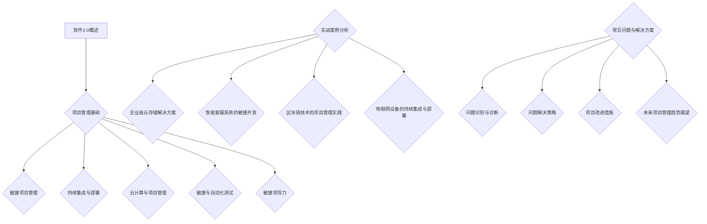
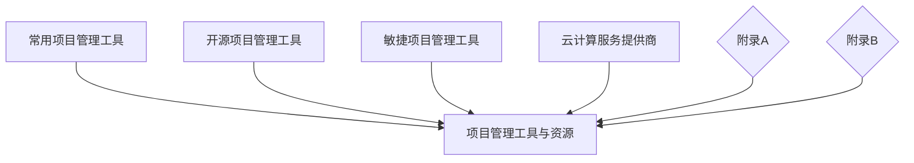

                 

## 引言

### 软件2.0的概念与项目管理

在科技飞速发展的今天，软件行业经历了从传统软件（Software 1.0）到现代软件（Software 2.0）的转变。软件2.0不仅是技术的进步，更是一种新的生产方式、商业模式和社会文化的变革。它强调软件的开放性、协作性、持续性和动态性，使得软件能够在不断变化的用户需求和市场环境中快速迭代、优化和演进。

**软件2.0的概念**

软件2.0可以理解为“互联网+软件”，它将互联网的基因融入到软件的每一个细胞中。具体来说，软件2.0具有以下几个特点：

1. **开放性**：软件2.0更加开放，用户可以自由访问、使用和修改软件。
2. **协作性**：用户不仅仅是软件的使用者，还可以成为软件的创造者和贡献者。
3. **持续集成与部署**：软件2.0强调快速迭代和持续交付，使得软件能够快速响应用户需求和市场变化。
4. **动态性**：软件2.0能够根据用户反馈和市场动态实时调整和优化，具有高度的自适应能力。

**软件2.0时代的项目管理挑战**

随着软件2.0的发展，传统的项目管理模式面临诸多挑战：

1. **快速迭代与时间压力**：软件2.0要求项目团队能够快速交付高质量的软件，这对团队的时间管理和执行力提出了更高要求。
2. **复杂性与不确定性**：软件2.0项目通常涉及多个技术领域和复杂的业务逻辑，项目风险和不确定性增加。
3. **用户参与与反馈**：用户在软件2.0中扮演了更为积极的角色，他们的参与和反馈对项目的成功至关重要。
4. **敏捷性与灵活性**：软件2.0项目需要具备更高的敏捷性和灵活性，以应对快速变化的市场环境。

**本书概述与目标**

本书旨在探讨软件2.0时代项目管理的最佳实践。通过系统的分析和案例研究，本书将帮助项目经理和项目团队：

1. **理解软件2.0的特点和项目管理挑战**。
2. **掌握敏捷项目管理的方法和工具**。
3. **应用持续集成与持续部署的实践**。
4. **利用云计算和大数据技术提升项目管理效率**。
5. **培养敏捷领导力和团队文化**。

总的来说，本书将为您提供从理论到实践的全方位指导，帮助您在软件2.0时代取得项目管理成功。

### 《软件2.0的项目管理最佳实践》目录大纲

#### 第一部分：引言

1. 第1章：软件2.0的概念与项目管理
   - 1.1 软件2.0的定义及其特点
   - 1.2 软件2.0时代的项目管理挑战
   - 1.3 本书概述与目标

2. 第2章：项目管理基础
   - 2.1 项目生命周期管理
   - 2.2 项目范围管理
   - 2.3 项目时间管理
   - 2.4 项目成本管理
   - 2.5 项目质量管理
   - 2.6 项目沟通管理
   - 2.7 项目风险管理
   - 2.8 项目人力资源管理

#### 第二部分：软件2.0项目特定挑战

3. 第3章：敏捷项目管理在软件2.0中的应用
   - 3.1 敏捷方法概述
   - 3.2 敏捷项目管理实践
   - 3.3 敏捷与软件2.0的契合点
   - 3.4 敏捷工具介绍

4. 第4章：持续集成与持续部署在软件2.0中的应用
   - 4.1 持续集成与持续部署的基本概念
   - 4.2 持续集成与持续部署的优势
   - 4.3 持续集成与持续部署的最佳实践
   - 4.4 持续集成与持续部署工具介绍

5. 第5章：云计算与软件2.0项目管理
   - 5.1 云计算的基本概念
   - 5.2 云计算在项目管理中的应用
   - 5.3 云服务模型与部署策略
   - 5.4 云计算项目管理最佳实践

6. 第6章：软件2.0项目的敏捷与自动化测试
   - 6.1 自动化测试的概念与优势
   - 6.2 自动化测试工具与技术
   - 6.3 自动化测试实践案例
   - 6.4 软件2.0项目的敏捷测试策略

7. 第7章：软件2.0项目的敏捷领导力
   - 7.1 敏捷领导力的概念与重要性
   - 7.2 敏捷领导力的最佳实践
   - 7.3 领导者如何推动敏捷转型
   - 7.4 敏捷文化建立与维护

#### 第三部分：实战案例分析

8. 第8章：成功软件2.0项目管理案例分析
   - 8.1 案例一：企业级云存储解决方案
   - 8.2 案例二：智能客服系统的敏捷开发
   - 8.3 案例三：区块链技术的项目管理实践
   - 8.4 案例四：物联网设备的持续集成与部署

9. 第9章：软件2.0项目管理常见问题与解决方案
   - 9.1 问题识别与诊断
   - 9.2 问题解决策略
   - 9.3 项目改进措施
   - 9.4 未来项目管理趋势展望

#### 附录

10. 附录A：项目管理工具与资源
    - 10.1 常用项目管理工具
    - 10.2 开源项目管理工具
    - 10.3 敏捷项目管理工具
    - 10.4 云计算服务提供商

11. 附录B：参考资料
    - 11.1 书籍推荐
    - 11.2 在线课程与研讨会
    - 11.3 行业报告与白皮书
    - 11.4 学术论文与研究成果
    - 11.5 社交媒体与论坛

### Mermaid 流程图

在接下来的章节中，我们将深入探讨每个主题，帮助您更好地理解软件2.0时代的项目管理最佳实践。

---

## 第1章：软件2.0的概念与项目管理

软件2.0是软件发展史上的一个重要里程碑，它标志着软件从封闭、静态、以企业为中心的模式向开放、动态、以用户为中心的模式的转变。在本章节中，我们将详细介绍软件2.0的定义、特点以及它在项目管理中的挑战，同时明确本书的目标和结构。

### 1.1 软件2.0的定义及其特点

**软件2.0的定义**

软件2.0这个概念最早由Cory Doctorow在其2004年的文章《The coming software apocalypse》中提出。他描述了软件2.0作为一种新的生产方式、商业模式和社会文化的变革。软件2.0不仅仅是技术上的进步，更是一种全新的思维方式和价值体系的重构。

软件2.0的核心特征在于它的开放性、协作性、持续性和动态性。它强调软件的开放性，让用户能够自由访问、使用和修改软件。协作性使得用户不仅仅是软件的使用者，还可以成为软件的创造者和贡献者。持续性和动态性则使得软件能够在不断变化的环境中快速迭代和优化。

**软件2.0的特点**

1. **开放性**：软件2.0强调软件的开放性，用户可以自由访问和使用软件，并且可以修改和改进软件。这种开放性不仅体现在源代码的开放，还包括数据和接口的开放。

2. **协作性**：在软件2.0时代，用户不再是被动接受软件的服务，而是可以参与到软件的开发和改进过程中。这种协作性不仅提高了软件的质量，也增强了用户的参与感和忠诚度。

3. **持续集成与持续部署**：软件2.0强调快速迭代和持续交付，这意味着软件需要不断地进行集成和部署，以快速响应用户需求和市场变化。这种持续集成与持续部署的模式大大提高了软件的交付速度和稳定性。

4. **动态性**：软件2.0具有高度的动态性，它能够根据用户反馈和市场动态实时调整和优化。这种动态性使得软件能够更好地适应快速变化的环境，保持竞争优势。

### 1.2 软件2.0时代的项目管理挑战

软件2.0的这些特点给项目管理带来了新的挑战：

1. **快速迭代与时间压力**：软件2.0要求项目团队能够快速交付高质量的软件，这无疑增加了项目的时间压力。项目经理需要掌握高效的迭代管理方法，以确保项目能够在规定的时间内完成。

2. **复杂性与不确定性**：软件2.0项目通常涉及多个技术领域和复杂的业务逻辑，这使得项目的复杂性和不确定性增加。项目经理需要具备良好的风险管理能力，以应对项目中的各种不确定性。

3. **用户参与与反馈**：在软件2.0时代，用户参与和反馈对项目的成功至关重要。项目经理需要建立有效的用户反馈机制，及时收集和分析用户需求，以确保软件能够满足用户需求。

4. **敏捷性与灵活性**：软件2.0项目需要具备更高的敏捷性和灵活性，以应对快速变化的市场环境。项目经理需要掌握敏捷管理的方法和工具，确保项目能够快速响应变化。

### 1.3 本书概述与目标

本书旨在探讨软件2.0时代项目管理的最佳实践。通过系统的分析和案例研究，本书将帮助项目经理和项目团队：

1. **理解软件2.0的特点和项目管理挑战**：本书将详细分析软件2.0的定义和特点，并探讨它们对项目管理带来的挑战。

2. **掌握敏捷项目管理的方法和工具**：本书将介绍敏捷项目管理的基本概念和方法，并提供具体的实践指南，帮助项目经理提升项目管理的效率和质量。

3. **应用持续集成与持续部署的实践**：本书将深入探讨持续集成与持续部署在软件2.0项目中的应用，并提供最佳实践，帮助项目经理实现高效的软件交付。

4. **利用云计算和大数据技术提升项目管理效率**：本书将介绍云计算和大数据技术在项目管理中的应用，帮助项目经理利用现代技术提升项目的管理效率。

5. **培养敏捷领导力和团队文化**：本书将探讨敏捷领导力的概念和实践，并提供培养敏捷团队文化的策略，帮助项目经理打造高效的团队。

总的来说，本书将为您提供从理论到实践的全方位指导，帮助您在软件2.0时代取得项目管理成功。

### 1.4 本书结构

本书分为三个部分：

**第一部分：引言**

1. 第1章：软件2.0的概念与项目管理
2. 第2章：项目管理基础

**第二部分：软件2.0项目特定挑战**

3. 第3章：敏捷项目管理在软件2.0中的应用
4. 第4章：持续集成与持续部署在软件2.0中的应用
5. 第5章：云计算与软件2.0项目管理
6. 第6章：软件2.0项目的敏捷与自动化测试
7. 第7章：软件2.0项目的敏捷领导力

**第三部分：实战案例分析**

8. 第8章：成功软件2.0项目管理案例分析
9. 第9章：软件2.0项目管理常见问题与解决方案

附录部分将提供项目管理工具与资源，以及相关的参考资料，以帮助读者进一步学习和实践。

通过本书的系统学习，读者将能够：

- 理解软件2.0的概念和特点，以及它对项目管理带来的挑战。
- 掌握敏捷项目管理的方法和工具，提高项目管理的效率和质量。
- 应用持续集成与持续部署的实践，实现高效的软件交付。
- 利用云计算和大数据技术提升项目管理效率。
- 培养敏捷领导力和团队文化，打造高效的团队。

总之，本书将为您在软件2.0时代取得项目管理成功提供有力的支持和指导。

### 总结

通过本章的介绍，我们对软件2.0的概念、特点以及项目管理挑战有了更深入的理解。软件2.0的开放性、协作性、持续性和动态性，为项目管理带来了新的机遇和挑战。在接下来的章节中，我们将进一步探讨项目管理的基础知识，以及如何在软件2.0时代应用这些知识来提升项目管理的效率和质量。

---

## 第2章：项目管理基础

在软件2.0时代，项目管理的挑战变得更加复杂和多变。然而，无论项目如何变化，项目管理的基础原则和方法始终是关键。本章将详细讨论项目管理的核心基础，包括项目生命周期管理、项目范围管理、项目时间管理、项目成本管理、项目质量管理、项目沟通管理、项目风险管理以及项目人力资源管理。通过这些基础知识的掌握，项目经理能够更好地应对软件2.0时代的挑战。

### 2.1 项目生命周期管理

项目生命周期管理是指对项目从启动到完成的全过程进行规划、执行、监控和收尾的管理活动。项目生命周期通常分为以下几个阶段：

1. **启动阶段**：在这个阶段，项目团队确定项目的目标、范围和可行性。主要任务包括项目立项、组建项目团队和制定项目章程。

2. **计划阶段**：在计划阶段，项目团队详细制定项目的计划，包括工作分解结构（WBS）、时间计划、资源计划和预算计划。这一阶段的目标是确保项目目标的实现和资源的高效利用。

3. **执行阶段**：执行阶段是项目的核心阶段，项目团队按照计划执行项目工作，实现项目目标。项目经理需要协调团队工作，确保项目按照计划进行。

4. **监控与控制阶段**：在监控与控制阶段，项目团队监控项目进展，确保项目按照计划进行，并在必要时进行变更管理。这一阶段的目标是确保项目在预算和时间范围内完成。

5. **收尾阶段**：在收尾阶段，项目团队完成项目交付，进行项目总结和评估，并为未来项目提供经验教训。主要任务包括项目验收、项目文档归档和项目团队解散。

项目生命周期管理的关键在于确保项目的每个阶段都能够高效、有序地进行，从而确保项目的成功完成。

### 2.2 项目范围管理

项目范围管理是指确保项目团队和项目利益相关者对项目的范围有一个共同的理解，并控制项目范围的变更。项目范围管理的主要任务包括：

1. **项目范围定义**：明确项目的范围，包括项目的目标、交付物、主要工作内容和边界。

2. **项目范围确认**：确保项目团队和项目利益相关者对项目的范围达成一致，并得到确认。

3. **项目范围控制**：控制项目的范围变更，确保变更对项目目标和时间计划的影响得到评估和控制。

项目范围管理的关键在于确保项目的目标和范围得到明确和有效的控制，避免项目范围蔓延，从而确保项目的成功。

### 2.3 项目时间管理

项目时间管理是指确保项目按计划进行，并在规定的时间内完成。项目时间管理的主要任务包括：

1. **项目时间计划**：制定项目的时间计划，包括关键路径、任务依赖关系和时间估算。

2. **项目进度监控**：监控项目进度，确保项目按照时间计划进行。

3. **项目进度控制**：对项目进度进行控制，确保项目在规定的时间内完成。

项目时间管理的关键在于确保项目的时间计划合理、可行，并在项目执行过程中进行有效的监控和控制。

### 2.4 项目成本管理

项目成本管理是指确保项目在预算范围内完成，并对项目的成本进行有效控制。项目成本管理的主要任务包括：

1. **项目成本估算**：估算项目的成本，包括人力成本、设备成本、材料成本等。

2. **项目成本预算**：制定项目的成本预算，并根据实际情况进行调整。

3. **项目成本控制**：控制项目的成本，确保项目在预算范围内完成。

项目成本管理的关键在于确保项目的成本估算准确、预算合理，并在项目执行过程中进行有效的成本控制。

### 2.5 项目质量管理

项目质量管理是指确保项目交付的成果满足预定的质量标准。项目质量管理的主要任务包括：

1. **项目质量计划**：制定项目的质量计划，包括质量标准、质量控制流程和质量保证活动。

2. **项目质量控制**：对项目过程和交付物进行质量控制，确保项目的质量满足预定标准。

3. **项目质量保证**：通过质量审计和过程改进活动，确保项目质量的持续提升。

项目质量管理的关键在于确保项目的质量计划合理、质量控制有效，并在项目执行过程中进行持续的质量保证。

### 2.6 项目沟通管理

项目沟通管理是指确保项目信息在项目团队和相关利益相关者之间有效传递和沟通。项目沟通管理的主要任务包括：

1. **项目沟通计划**：制定项目的沟通计划，包括沟通目标、沟通方法、沟通频率和沟通渠道。

2. **项目沟通工具**：使用适当的沟通工具，如会议、邮件、文档等，确保项目信息的高效传递。

3. **项目沟通监控**：监控项目沟通的效果，确保项目信息得到有效理解和执行。

项目沟通管理的关键在于确保项目沟通计划合理、沟通工具有效，并在项目执行过程中进行持续的沟通监控。

### 2.7 项目风险管理

项目风险管理是指识别、评估和应对项目中的风险，以减少风险对项目的影响。项目风险管理的主要任务包括：

1. **项目风险识别**：识别项目可能面临的风险。

2. **项目风险评估**：评估风险的概率和影响，确定风险的优先级。

3. **项目风险应对**：制定风险应对策略，包括风险避免、风险减轻、风险转移等。

项目风险管理的关键在于确保项目风险得到及时识别、评估和应对，以减少风险对项目的负面影响。

### 2.8 项目人力资源管理

项目人力资源管理是指确保项目团队的有效组成和运作，以提高项目成功的可能性。项目人力资源管理的主要任务包括：

1. **项目团队组建**：根据项目需求，组建合适的项目团队。

2. **项目团队管理**：管理项目团队成员的行为和工作，确保项目目标的实现。

3. **项目团队发展**：培养项目团队成员的技能和职业发展，提高团队的整体绩效。

项目人力资源管理的关键在于确保项目团队的有效组建和管理，以实现项目目标。

### 总结

通过本章的介绍，我们对项目管理的核心基础有了更深入的理解。项目生命周期管理、项目范围管理、项目时间管理、项目成本管理、项目质量管理、项目沟通管理、项目风险管理以及项目人力资源管理，这些基础概念和方法是项目管理成功的关键。在软件2.0时代，这些基础将帮助我们更好地应对项目管理中的各种挑战。在接下来的章节中，我们将进一步探讨软件2.0项目管理的特定挑战和最佳实践。

---

## 第3章：敏捷项目管理在软件2.0中的应用

敏捷项目管理是软件2.0时代应对项目管理挑战的重要方法。它强调快速响应变化、持续交付价值以及团队合作。本章将深入探讨敏捷项目管理的基本概念、实践方法及其在软件2.0项目中的应用。

### 3.1 敏捷方法概述

敏捷方法起源于软件开发领域，旨在应对传统项目管理模式中的种种不足。它强调以下四个核心原则：

1. **个体和互动重于过程和工具**：敏捷方法认为，人的能力和互动比流程和工具更为重要。
2. **可工作的软件重于详尽的文档**：敏捷方法强调交付可工作的软件，而非大量文档。
3. **客户合作重于合同谈判**：敏捷方法主张与客户保持紧密合作，共同定义和调整需求。
4. **响应变化重于遵循计划**：敏捷方法强调快速响应变化，以保持项目的灵活性和适应性。

敏捷方法的核心是“迭代交付”和“持续改进”。项目被分解为一系列可管理的迭代，每次迭代都产生可工作的软件。通过不断的迭代和反馈，项目团队能够快速适应变化，持续改进产品。

### 3.2 敏捷项目管理实践

敏捷项目管理实践通常遵循以下步骤：

1. **需求收集与规划**：项目团队与利益相关者合作，收集需求并制定迭代计划。需求通常以用户故事的形式记录，每个用户故事都代表了一个具体的功能或特性。

2. **迭代开发**：项目团队按照迭代计划，逐个实现用户故事。每次迭代通常持续几周，迭代结束时交付一个可工作的软件版本。

3. **回顾与改进**：在每个迭代结束时，团队进行回顾会议，总结经验教训，识别改进点。这些改进点将在下一个迭代中实施。

4. **持续集成与部署**：敏捷方法强调持续集成和持续部署，确保每次迭代都能生成可工作的软件。这要求团队采用自动化测试和部署流程，以快速发现问题并修复。

### 3.3 敏捷与软件2.0的契合点

敏捷方法和软件2.0具有很多契合点，使得敏捷方法在软件2.0项目中尤为重要：

1. **开放性和协作性**：软件2.0强调开放性和协作性，这与敏捷方法的核心原则高度一致。敏捷方法鼓励用户和开发者的紧密合作，共同定义和改进产品。

2. **快速迭代和持续交付**：软件2.0项目通常需要快速响应变化和持续交付价值，敏捷方法的迭代交付和持续改进机制能够很好地满足这些需求。

3. **灵活性和适应性**：软件2.0项目面临着快速变化的市场和技术环境，敏捷方法的灵活性和适应性使得项目团队能够快速调整策略，应对变化。

### 3.4 敏捷工具介绍

敏捷方法使用多种工具来支持项目管理实践，以下是一些常见的敏捷工具：

1. **Scrum**：Scrum是敏捷方法中最流行的框架之一。它通过迭代和冲刺（Sprint）来组织项目工作，使用产品待办列表（Product Backlog）和冲刺待办列表（Sprint Backlog）来管理需求。Scrum强调每日站立会议、周回顾和迭代评审，以保持团队的透明度和持续改进。

2. **看板（Kanban）**：看板是一种可视化项目管理工具，它通过卡片和看板板来展示项目任务的状态和进度。看板强调限制在进程中的工作项数量（WIP限制），以提高团队的流动性和效率。

3. **用户故事地图**：用户故事地图是一种用于需求收集和规划的工具，它通过将用户故事映射到用户旅程，帮助团队理解用户需求和行为。

4. **持续集成工具**：如Jenkins、Travis CI等，这些工具能够自动化构建、测试和部署流程，确保每次代码提交都能生成可工作的软件。

5. **协作工具**：如Trello、JIRA、Asana等，这些工具能够帮助团队进行任务管理、进度跟踪和协作沟通。

### 实践案例

以下是一个软件2.0项目使用敏捷方法的实践案例：

某企业开发一款智能客服系统，旨在提供7x24小时的在线服务。项目团队采用Scrum框架，每个迭代（Sprint）持续两周。在每次迭代开始时，产品负责人与团队一起确定本次迭代的目标和待办事项。

- **需求收集与规划**：产品负责人与用户代表共同制定用户故事，并编写到产品待办列表中。团队通过优先级排序，确定每个迭代要实现的功能。

- **迭代开发**：团队按照用户故事进行开发，每个用户故事都包含详细的任务清单。团队在每日站立会议上同步进展，确保每个人都知道项目的当前状态。

- **回顾与改进**：每个迭代结束时，团队进行回顾会议，讨论哪些做得好，哪些需要改进。改进点将在下一个迭代中实施。

- **持续集成与部署**：团队使用Jenkins进行持续集成，每次代码提交都会触发自动化测试和部署。如果出现错误，Jenkins会立即通知开发人员，确保问题得到及时修复。

通过这种敏捷实践，项目团队能够快速响应需求变化，持续交付高质量的产品，并在每次迭代中不断改进。

### 总结

敏捷项目管理在软件2.0中的应用具有重要意义。它通过快速迭代、持续交付和紧密合作，帮助项目团队更好地应对软件2.0时代的挑战。在下一章中，我们将探讨持续集成与持续部署在软件2.0项目中的应用，进一步探讨如何提升软件交付的效率和质量。

---

## 第4章：持续集成与持续部署在软件2.0中的应用

持续集成（CI）和持续部署（CD）是软件2.0时代提高软件交付效率和质量的关键实践。它们通过自动化流程和快速反馈机制，确保每次代码更改都能快速集成、测试和部署到生产环境中。本章将详细介绍持续集成与持续部署的基本概念、优势、最佳实践以及相关工具。

### 4.1 持续集成与持续部署的基本概念

**持续集成（CI）**

持续集成是一种软件开发实践，它要求开发人员频繁地将代码更改合并到共享的主分支中，并通过自动化测试确保代码质量。每次代码提交都会触发自动化构建和测试，确保新的代码不会破坏现有功能。

持续集成的关键要素包括：

1. **自动化构建**：使用构建工具（如Maven、Gradle）自动编译代码、打包和构建应用程序。
2. **自动化测试**：执行单元测试、集成测试和验收测试，确保新代码的质量和功能。
3. **代码审查**：通过代码审查工具（如GitLab、GitHub）确保代码符合编码标准和规范。

**持续部署（CD）**

持续部署是持续集成的一个扩展，它通过自动化流程将经过测试的代码部署到生产环境中。持续部署的目标是确保每次代码更改都能快速、安全地交付到用户手中。

持续部署的关键要素包括：

1. **自动化部署**：使用部署工具（如Jenkins、Kubernetes）将构建的应用程序部署到测试、预生产和生产环境。
2. **环境一致性**：确保不同环境（如开发、测试、生产）之间的配置和依赖一致，以避免部署过程中的问题。
3. **滚动更新**：逐步替换旧版本的应用程序，以减少部署过程中的中断风险。

### 4.2 持续集成与持续部署的优势

持续集成与持续部署在软件2.0项目中具有以下优势：

1. **提高软件质量**：通过自动化测试和快速反馈，持续集成和持续部署可以及时发现和修复代码缺陷，提高软件质量。
2. **加快开发速度**：自动化流程和快速迭代模式可以大大缩短开发周期，提高项目的交付速度。
3. **降低部署风险**：通过逐步部署和滚动更新，持续部署可以减少部署过程中的中断风险，提高系统的稳定性。
4. **增强团队协作**：持续集成和持续部署要求团队成员紧密协作，共同维护和改进流程，促进团队内部的沟通和合作。
5. **优化资源利用**：自动化流程可以减少手动操作，提高资源利用效率，降低运营成本。

### 4.3 持续集成与持续部署的最佳实践

为了充分发挥持续集成和持续部署的优势，项目团队应遵循以下最佳实践：

1. **自动化测试覆盖**：确保测试覆盖面广泛，包括单元测试、集成测试、验收测试等，以便及时发现问题。
2. **代码规范和审查**：制定代码规范，确保代码质量和一致性。同时，通过代码审查确保代码符合规范。
3. **持续监控和反馈**：建立持续监控机制，实时跟踪系统性能和健康状态，及时反馈问题。
4. **环境一致性**：确保不同环境之间的配置和依赖一致，以避免部署过程中的问题。
5. **逐步部署**：采用逐步部署策略，如蓝绿部署或灰度发布，以减少部署过程中的中断风险。
6. **自动化文档和报告**：自动生成构建、测试和部署的报告，以便团队成员随时查看和分析。

### 4.4 持续集成与持续部署工具介绍

项目团队可以根据项目需求选择合适的持续集成和持续部署工具。以下是一些常见的工具：

1. **Jenkins**：Jenkins是一个开源的持续集成工具，支持多种编程语言和平台。它可以通过插件扩展功能，如自动化测试、部署和监控。
2. **GitLab CI/CD**：GitLab CI/CD是一个集成在GitLab平台中的持续集成和持续部署工具。它支持自动化构建、测试和部署，具有丰富的自定义功能。
3. **Travis CI**：Travis CI是一个云端的持续集成服务，支持多种编程语言和平台。它可以通过简单的配置文件定义构建和测试流程。
4. **Circle CI**：Circle CI是一个云端的持续集成服务，支持多种编程语言和平台。它通过并行构建提高构建速度，并提供丰富的报告和反馈功能。
5. **Kubernetes**：Kubernetes是一个开源的容器编排平台，用于自动化部署、扩展和管理容器化应用程序。它可以与持续集成和持续部署工具集成，实现自动化部署和管理。

### 实践案例

以下是一个软件2.0项目使用持续集成与持续部署的实践案例：

某企业开发一款基于云的智能办公应用，项目团队采用Jenkins作为持续集成工具，GitLab CI/CD作为持续部署工具。他们的实践流程如下：

1. **代码提交**：开发人员将代码提交到GitLab仓库，每次提交都会触发Jenkins构建任务。
2. **自动化构建**：Jenkins使用Maven进行自动化构建，并将构建结果上传到私有仓库。
3. **自动化测试**：Jenkins执行单元测试、集成测试和验收测试，确保代码质量。
4. **构建结果反馈**：Jenkins将测试结果和构建日志通过邮件和GitLab Webhook通知开发人员。
5. **持续部署**：通过GitLab CI/CD，将经过测试的代码部署到测试环境。测试环境通过验证后，自动部署到预生产环境，最后部署到生产环境。

通过这种持续集成与持续部署实践，项目团队能够快速响应用户需求，提高软件交付效率和质量。

### 总结

持续集成与持续部署在软件2.0项目中具有重要意义。它们通过自动化流程和快速反馈机制，确保软件质量、加快开发速度和降低部署风险。在下一章中，我们将探讨云计算在软件2.0项目管理中的应用，进一步探讨如何利用云计算技术提升项目管理的效率。

---

## 第5章：云计算与软件2.0项目管理

云计算作为现代信息技术的重要发展趋势，已经深刻改变了软件项目的管理和执行方式。在软件2.0时代，云计算提供了弹性资源、高效服务和灵活部署的能力，使得项目管理更加高效、成本更低、风险更可控。本章将探讨云计算的基本概念、其在项目管理中的应用、云服务模型与部署策略，以及云计算项目管理最佳实践。

### 5.1 云计算的基本概念

云计算是一种通过网络提供计算资源（如服务器、存储、网络和应用程序）的服务模式。云计算可以分为以下三种主要服务模式：

1. **基础设施即服务（IaaS）**：IaaS提供虚拟化的计算资源，如虚拟机、存储和网络。用户可以根据需要自行配置和管理这些资源。

2. **平台即服务（PaaS）**：PaaS提供开发、运行和管理应用程序的平台，用户无需关注底层基础设施的管理。

3. **软件即服务（SaaS）**：SaaS提供完整的软件应用程序，用户可以通过网络访问这些应用程序，无需安装和管理。

云计算的核心优势在于其弹性、可扩展性和灵活性。通过云计算，企业可以根据需求动态调整资源，以应对负载波动，提高资源利用率。

### 5.2 云计算在项目管理中的应用

云计算在项目管理中具有广泛的应用，以下是其主要应用场景：

1. **资源管理**：云计算提供灵活的资源管理能力，项目团队可以根据项目需求快速调配计算资源、存储资源和网络资源。

2. **部署和扩展**：通过云计算，项目团队能够快速部署应用程序和系统，并在需求增长时动态扩展资源，以应对变化。

3. **成本优化**：云计算通过按需付费和弹性资源管理，帮助项目团队优化成本，避免过度投资和资源浪费。

4. **灾难恢复**：云计算提供可靠的灾难恢复解决方案，项目团队能够将关键数据和应用备份到远程数据中心，确保业务连续性。

5. **安全性和合规性**：云计算服务提供商通常提供高级的安全措施和合规性认证，帮助项目团队满足安全和管理要求。

### 5.3 云服务模型与部署策略

云服务模型主要包括以下三种：

1. **公有云**：公有云由第三方服务提供商提供，多个用户共享基础设施和服务。公有云具有成本效益高、资源弹性好的特点。

2. **私有云**：私有云由企业内部搭建和管理，仅限企业内部使用。私有云提供更高的安全性和合规性，但建设成本和维护成本较高。

3. **混合云**：混合云结合了公有云和私有云的优势，企业可以根据不同应用场景选择最合适的云服务模式。

部署策略方面，常见的部署模式包括：

1. **云原生部署**：云原生部署利用云计算的原生能力，通过容器化（如Docker）和微服务架构（如Kubernetes），实现快速部署和自动化管理。

2. **混合部署**：混合部署结合公有云和私有云的资源优势，将关键应用部署在私有云中，非关键应用部署在公有云中，以平衡成本和安全。

3. **边缘计算部署**：边缘计算部署将计算和存储能力部署在靠近用户的边缘节点，以降低延迟、提高响应速度。

### 5.4 云计算项目管理最佳实践

为了确保云计算项目成功，项目团队应遵循以下最佳实践：

1. **需求分析与规划**：在项目启动阶段，详细分析项目需求和目标，明确云计算的应用场景和资源需求。

2. **资源调配与优化**：根据项目需求和预算，合理调配资源，确保资源利用率最大化。定期评估和调整资源，以应对变化。

3. **安全性管理**：建立健全的安全管理体系，确保数据和应用程序的安全。实施访问控制、加密和监控措施，防止数据泄露和攻击。

4. **自动化与标准化**：采用自动化工具和标准化流程，提高部署和管理的效率。通过配置管理和自动化脚本，实现快速部署和灵活调整。

5. **持续监控与优化**：建立持续监控机制，实时跟踪系统性能和资源使用情况。定期进行性能优化和故障排除，确保系统稳定运行。

6. **团队协作与培训**：加强团队协作，确保团队了解云计算技术和最佳实践。定期进行培训，提高团队的专业技能和知识水平。

### 实践案例

以下是一个云计算项目的实践案例：

某互联网公司开发一款在线教育平台，采用云计算技术进行部署和管理。项目团队遵循以下步骤：

1. **需求分析与规划**：项目团队与业务部门合作，明确在线教育平台的需求，包括用户数量、功能模块和性能要求。

2. **资源调配与优化**：项目团队采用混合云模式，关键模块部署在私有云中，非关键模块部署在公有云中。通过自动化的资源管理工具，根据负载情况进行弹性扩展和缩减。

3. **安全性管理**：项目团队实施严格的安全策略，包括访问控制、数据加密和监控。与第三方安全服务提供商合作，进行定期安全检查和漏洞修复。

4. **自动化与标准化**：项目团队采用Kubernetes进行容器化部署，实现快速部署和自动化管理。通过配置管理和自动化脚本，简化部署流程。

5. **持续监控与优化**：项目团队建立实时监控体系，监控系统性能和资源使用情况。定期进行性能优化和故障排除，确保系统稳定运行。

通过这种云计算项目管理实践，项目团队能够快速响应需求变化，提高系统的可用性和性能。

### 总结

云计算为软件2.0项目管理带来了诸多优势，通过灵活的资源管理、高效的部署和强大的安全性，项目团队能够更好地应对复杂的项目需求。在下一章中，我们将探讨软件2.0项目的敏捷与自动化测试，进一步探讨如何通过敏捷测试策略提升软件质量和交付效率。

---

## 第6章：软件2.0项目的敏捷与自动化测试

在软件2.0时代，敏捷与自动化测试成为了确保软件质量、提高交付效率的重要手段。敏捷测试强调快速迭代和持续交付，而自动化测试则通过自动化执行测试用例，大大提高了测试效率和准确性。本章将深入探讨敏捷与自动化测试的基本概念、工具技术、实践案例以及敏捷测试策略。

### 6.1 自动化测试的概念与优势

自动化测试是指使用自动化测试工具，自动执行预先编写的测试用例，以检查软件的应用功能、性能和可靠性。自动化测试的基本概念包括以下几方面：

1. **测试用例设计**：测试用例是自动化测试的核心，它描述了测试的目标、输入条件、操作步骤和预期结果。
2. **测试脚本编写**：测试脚本是用编程语言编写的代码，用于自动化执行测试用例。
3. **测试执行与结果分析**：测试执行是运行测试脚本的过程，通过分析测试结果，评估软件的质量和性能。

自动化测试相比手工测试具有以下优势：

1. **效率高**：自动化测试可以快速执行大量测试用例，节省测试时间和人力成本。
2. **准确性高**：自动化测试减少了人为错误，提高了测试的准确性和一致性。
3. **可重复性**：自动化测试可以反复执行，确保测试结果的一致性，便于发现回归问题。
4. **覆盖面广**：自动化测试可以覆盖更多的测试场景，提高测试的覆盖率。
5. **报告生成**：自动化测试可以自动生成详细的测试报告，便于分析测试结果和定位问题。

### 6.2 自动化测试工具与技术

自动化测试工具是执行自动化测试的核心，以下是一些常用的自动化测试工具和技术：

1. **Selenium**：Selenium是一个开源的自动化测试工具，用于Web应用的自动化测试。它支持多种编程语言（如Java、C#、Python等），可以通过浏览器插件录制和回放测试用例。
2. **JUnit**：JUnit是一个开源的单元测试框架，用于Java应用程序的单元测试。它提供了丰富的测试方法和断言库，便于编写和执行单元测试。
3. **JUnit 5**：JUnit 5是JUnit的最新版本，它提供了更多的测试功能，如参数化测试、断言库扩展等，提高了测试的灵活性和效率。
4. **JUnit 4**：JUnit 4是JUnit的旧版本，虽然功能相对较少，但仍然广泛使用。它适用于简单的单元测试，通过注解和断言库实现测试用例的编写和执行。
5. **Appium**：Appium是一个开源的自动化测试工具，用于移动应用的自动化测试。它支持多种平台（如iOS、Android等），可以通过编写自动化脚本执行测试用例。

自动化测试技术包括以下几种：

1. **功能测试**：功能测试是验证软件功能是否满足需求的过程。功能测试通常通过编写自动化脚本，模拟用户操作，验证软件的功能是否正常。
2. **性能测试**：性能测试是评估软件性能的过程，包括响应时间、吞吐量、资源使用等。性能测试可以通过自动化测试工具生成负载，模拟真实用户行为，评估软件的性能。
3. **集成测试**：集成测试是验证软件各个模块之间交互是否正常的过程。集成测试通常通过编写自动化脚本，调用不同模块的接口，验证模块之间的交互是否符合预期。
4. **安全测试**：安全测试是评估软件安全性的一系列测试，包括漏洞扫描、代码审计等。安全测试可以通过自动化测试工具扫描软件的漏洞，检测潜在的安全风险。

### 6.3 自动化测试实践案例

以下是一个自动化测试实践案例：

某互联网公司开发一款在线购物平台，项目团队采用自动化测试确保软件质量。他们的自动化测试流程如下：

1. **需求分析**：项目团队与业务部门合作，明确在线购物平台的功能需求和测试场景。
2. **测试用例设计**：测试团队根据需求分析，设计了一系列功能测试用例，包括用户注册、登录、商品浏览、购物车操作、订单提交等。
3. **测试脚本编写**：测试团队使用Selenium编写自动化测试脚本，模拟用户操作，验证功能是否正常。
4. **测试执行与结果分析**：测试团队在每次代码提交后，自动执行自动化测试脚本，生成详细的测试报告，分析测试结果，发现和解决问题。

通过自动化测试，项目团队能够快速发现和修复软件缺陷，提高软件质量。

### 6.4 软件2.0项目的敏捷测试策略

在软件2.0项目中，敏捷测试策略与传统测试策略有所不同。以下是一些敏捷测试策略：

1. **测试早期介入**：在软件开发的早期阶段，测试团队就参与需求分析和设计，确保测试用例与需求的一致性。
2. **迭代测试**：测试团队在每个迭代结束时，对迭代成果进行自动化测试，确保每次迭代交付的可工作软件质量。
3. **持续集成**：将自动化测试集成到持续集成流程中，确保每次代码提交都能快速执行测试，及时发现和修复问题。
4. **协作与反馈**：测试团队与开发团队紧密协作，共同解决测试中发现的问题。通过持续反馈，提高软件质量和团队协作效率。
5. **持续学习与改进**：测试团队不断学习和掌握新的测试方法和工具，通过定期回顾和改进，提高测试效率和效果。

### 总结

敏捷与自动化测试在软件2.0项目中具有重要意义。通过快速迭代和自动化测试，项目团队能够确保软件质量、提高交付效率。在下一章中，我们将探讨软件2.0项目的敏捷领导力，进一步探讨如何通过敏捷领导力推动项目管理成功。

---

## 第7章：软件2.0项目的敏捷领导力

在软件2.0时代，敏捷领导力成为推动项目成功的关键因素。敏捷领导力强调团队合作、自主管理和持续改进，它不同于传统的指挥和控制型领导，更注重激发团队的潜力和创造力。本章将深入探讨敏捷领导力的概念、重要性、最佳实践以及如何推动敏捷转型，并讨论敏捷文化的建立与维护。

### 7.1 敏捷领导力的概念与重要性

**敏捷领导力的概念**

敏捷领导力是指领导者在敏捷环境中，通过引导、激励和支持团队，实现项目目标的能力。敏捷领导力强调以下几个方面：

1. **服务型领导**：领导者将自己视为团队的服务者，帮助团队解决问题、提供资源和创造条件，而不是发号施令。
2. **授权与信任**：领导者信任团队成员，给予他们足够的自主权和决策权，鼓励他们创新和承担责任。
3. **持续改进**：领导者推动团队不断学习和改进，鼓励尝试新方法和工具，以提升项目效率和质量。
4. **透明与沟通**：领导者保持透明，定期与团队成员分享项目进展和挑战，建立良好的沟通机制。

**敏捷领导力的重要性**

在软件2.0项目中，敏捷领导力具有重要意义：

1. **激发团队潜力**：敏捷领导力鼓励团队成员发挥自主性和创造力，提高项目创新能力和执行力。
2. **提高团队协作**：通过授权和信任，团队成员能够更好地协作，共同应对项目挑战。
3. **快速响应变化**：敏捷领导力强调持续改进和快速适应变化，使团队能够更好地应对市场和技术环境的变化。
4. **提升项目成功率**：敏捷领导力有助于建立高效、灵活和有动力的团队，提高项目的成功率。

### 7.2 敏捷领导力的最佳实践

为了发挥敏捷领导力的作用，领导者可以遵循以下最佳实践：

1. **建立愿景和目标**：领导者与团队共同制定项目的愿景和目标，确保团队成员明确项目方向和期望成果。
2. **授权与信任**：领导者信任团队成员，给予他们足够的自主权和决策权，鼓励他们自主解决问题和承担责任。
3. **透明与沟通**：领导者保持透明，定期与团队成员分享项目进展、挑战和决策，建立良好的沟通机制。
4. **持续反馈与改进**：领导者鼓励团队成员提供反馈，并采取措施改进团队工作流程和项目执行。
5. **培养团队文化**：领导者推动团队建立积极的、协作的、学习和成长的文化，激励团队成员共同进步。
6. **支持学习与成长**：领导者支持团队成员的学习和职业发展，提供培训和资源，提升团队整体能力。

### 7.3 领导者如何推动敏捷转型

领导者推动敏捷转型需要采取以下步骤：

1. **了解敏捷原则**：领导者首先要深入了解敏捷原则和价值观，熟悉敏捷方法和实践。
2. **培训与赋能**：领导者为团队成员提供敏捷培训，帮助他们掌握敏捷方法和工具，提高敏捷意识。
3. **建立敏捷团队**：领导者帮助团队建立敏捷团队结构，包括Scrum团队、看板团队等，确保团队具备敏捷运作的能力。
4. **制定敏捷流程**：领导者与团队一起制定敏捷流程，包括需求管理、迭代计划、回顾等，确保团队能够高效运作。
5. **支持敏捷实践**：领导者支持和鼓励团队成员采用敏捷实践，如持续集成、持续部署、自动化测试等，提高项目交付效率。
6. **持续改进**：领导者推动团队不断反思和改进敏捷实践，提高敏捷能力和项目成功率。

### 7.4 敏捷文化的建立与维护

建立和维护敏捷文化是推动敏捷转型成功的关键。以下是一些策略：

1. **沟通与协作**：鼓励团队成员之间的沟通和协作，建立开放的沟通环境，促进知识共享。
2. **信任与尊重**：建立信任和尊重的文化，领导者尊重团队成员的意见和贡献，鼓励团队成员相互支持和帮助。
3. **学习与成长**：鼓励团队成员不断学习和成长，提供培训和资源，支持个人和团队发展。
4. **透明与反馈**：保持项目进展和问题的透明，鼓励团队成员提供反馈，并采取措施改进团队工作流程和项目执行。
5. **庆祝成功**：庆祝团队的成功和成就，增强团队凝聚力和归属感。

### 总结

敏捷领导力在软件2.0项目中具有重要意义。通过建立和维护敏捷文化，领导者能够激发团队的潜力，提高项目成功率。在下一章中，我们将通过成功软件2.0项目管理案例分析，进一步探讨如何在实际项目中应用敏捷领导力和最佳实践。

---

## 第8章：成功软件2.0项目管理案例分析

在本章中，我们将通过四个具体的案例，详细分析软件2.0项目管理的成功实践。这些案例涵盖了企业级云存储解决方案、智能客服系统的敏捷开发、区块链技术的项目管理实践，以及物联网设备的持续集成与部署。通过这些案例，我们将深入了解如何在实际项目中应用敏捷项目管理、持续集成与持续部署、云计算和自动化测试等最佳实践。

### 8.1 案例一：企业级云存储解决方案

某大型企业需要一个可靠的云存储解决方案来存储和管理其业务数据。项目团队面临的主要挑战包括数据安全性、存储容量弹性、以及快速响应业务需求。以下是该项目在项目管理方面的成功实践：

**1. 敏捷项目管理实践：**
- **需求收集与规划**：项目团队与业务部门紧密合作，通过用户故事地图收集需求，并制定迭代计划。
- **迭代开发与回顾**：项目团队采用Scrum框架，每个迭代持续两周，通过每日站立会议同步进展，并在迭代结束时进行回顾，不断改进流程。
- **用户故事映射**：通过用户故事映射，确保每个迭代交付的实际价值。

**2. 持续集成与持续部署：**
- **自动化构建与测试**：项目团队使用Jenkins实现自动化构建和测试，确保每次代码提交都能快速集成和测试。
- **持续部署**：通过GitLab CI/CD实现自动化部署，每次迭代完成后，自动将代码部署到测试环境，通过验证后部署到生产环境。

**3. 云计算应用：**
- **资源调配**：项目团队采用混合云架构，关键数据存储在私有云中，非关键数据存储在公有云中，确保数据安全性和成本效益。
- **云服务模型**：使用PaaS模型，减少基础设施管理，专注于应用开发和优化。

**4. 自动化测试：**
- **自动化测试脚本**：项目团队编写Selenium自动化测试脚本，模拟用户操作，验证功能是否正常。
- **持续测试**：将自动化测试集成到持续集成流程中，确保每次迭代交付的软件质量。

**结果**：该项目成功实现了安全、可靠、可扩展的云存储解决方案，满足业务需求，并在规定时间内交付。

### 8.2 案例二：智能客服系统的敏捷开发

某互联网公司开发一款智能客服系统，旨在提供7x24小时的在线服务。项目团队在项目管理方面采取了以下措施：

**1. 敏捷项目管理实践：**
- **Scrum框架**：项目团队采用Scrum框架，每个迭代持续两周，通过每日站立会议和迭代回顾，保持项目进度和质量。
- **用户故事地图**：通过用户故事地图，明确用户需求，确保每次迭代交付的实际价值。

**2. 持续集成与持续部署：**
- **自动化构建与测试**：使用Jenkins实现自动化构建和测试，确保每次代码提交都能快速集成和测试。
- **持续部署**：通过GitLab CI/CD实现自动化部署，每次迭代完成后，自动将代码部署到测试环境，通过验证后部署到生产环境。

**3. 云计算应用：**
- **弹性计算**：使用公有云的弹性计算服务，根据业务需求动态调整资源，确保系统稳定运行。
- **安全合规**：采用云服务提供商的安全措施，确保数据安全和合规性。

**4. 自动化测试：**
- **自动化测试脚本**：编写Selenium自动化测试脚本，模拟用户操作，验证功能是否正常。
- **持续测试**：将自动化测试集成到持续集成流程中，确保每次迭代交付的软件质量。

**结果**：该项目在短时间内成功交付了智能客服系统，提高了客户满意度和服务效率。

### 8.3 案例三：区块链技术的项目管理实践

某金融科技公司开发一款基于区块链的支付系统，项目团队在项目管理方面采取了以下措施：

**1. 敏捷项目管理实践：**
- **Scrum框架**：项目团队采用Scrum框架，每个迭代持续两周，通过每日站立会议和迭代回顾，保持项目进度和质量。
- **需求管理**：通过用户故事地图和优先级排序，确保每次迭代交付的关键功能。

**2. 持续集成与持续部署：**
- **自动化构建与测试**：使用Jenkins实现自动化构建和测试，确保每次代码提交都能快速集成和测试。
- **持续部署**：使用GitLab CI/CD实现自动化部署，每次迭代完成后，自动将代码部署到测试环境，通过验证后部署到生产环境。

**3. 云计算应用：**
- **分布式计算**：利用云计算的分布式计算能力，提高区块链网络的性能和安全性。
- **云服务模型**：采用IaaS和PaaS模型，确保系统的高可用性和扩展性。

**4. 自动化测试：**
- **自动化测试脚本**：编写Gatling自动化测试脚本，模拟大量用户操作，验证区块链网络的性能和稳定性。
- **持续测试**：将自动化测试集成到持续集成流程中，确保每次迭代交付的软件质量。

**结果**：该项目成功实现了基于区块链的支付系统，提高了支付系统的安全性和效率，降低了交易成本。

### 8.4 案例四：物联网设备的持续集成与部署

某制造企业开发一款物联网设备，用于实时监控生产线。项目团队在项目管理方面采取了以下措施：

**1. 敏捷项目管理实践：**
- **Scrum框架**：项目团队采用Scrum框架，每个迭代持续两周，通过每日站立会议和迭代回顾，保持项目进度和质量。
- **用户故事地图**：通过用户故事地图，明确用户需求，确保每次迭代交付的实际价值。

**2. 持续集成与持续部署：**
- **自动化构建与测试**：使用Jenkins实现自动化构建和测试，确保每次代码提交都能快速集成和测试。
- **持续部署**：使用Ansible实现自动化部署，每次迭代完成后，自动将代码部署到物联网设备。

**3. 云计算应用：**
- **云存储**：使用云存储服务，确保物联网设备收集的数据安全存储和备份。
- **云服务模型**：采用IaaS和SaaS模型，确保系统的高可用性和扩展性。

**4. 自动化测试：**
- **自动化测试脚本**：编写Python自动化测试脚本，模拟设备操作，验证物联网设备的功能和性能。
- **持续测试**：将自动化测试集成到持续集成流程中，确保每次迭代交付的软件质量。

**结果**：该项目成功实现了物联网设备的实时监控功能，提高了生产线的效率和管理水平。

### 总结

通过以上四个案例，我们可以看到敏捷项目管理、持续集成与持续部署、云计算和自动化测试等最佳实践在软件2.0项目中的成功应用。这些实践不仅提高了项目的效率和质量，还确保了项目能够快速响应市场变化和用户需求。在下一章中，我们将探讨软件2.0项目管理中常见的问题和解决方案，以及未来项目管理趋势。

---

## 第9章：软件2.0项目管理常见问题与解决方案

在软件2.0项目中，项目经理和团队常常面临各种挑战和问题。有效的识别和解决这些问题对于项目的成功至关重要。本章将探讨软件2.0项目管理中常见的问题，包括问题识别与诊断、问题解决策略、项目改进措施以及未来项目管理趋势。

### 9.1 问题识别与诊断

在软件2.0项目中，问题识别和诊断是项目管理的重要环节。以下是一些常见的问题类型及其诊断方法：

1. **范围蔓延**：项目范围未经控制地扩大，导致项目目标无法实现。
   - **诊断方法**：定期审查项目范围，与利益相关者保持沟通，确保项目目标的明确和一致。

2. **进度延误**：项目进度未能按照计划进行，导致交付延期。
   - **诊断方法**：使用项目管理工具（如Gantt图、看板）监控项目进度，定期召开进度会议，及时识别和解决问题。

3. **质量缺陷**：软件交付存在功能缺陷或性能问题，影响用户满意度。
   - **诊断方法**：实施严格的质量控制流程，包括代码审查、自动化测试和用户验收测试，确保软件质量。

4. **成本超支**：项目成本超过预算，导致资源浪费。
   - **诊断方法**：定期审查项目成本，使用预算管理工具监控项目资金流动，确保成本控制在预算范围内。

5. **团队协作问题**：团队成员之间的沟通不畅，导致工作效率低下。
   - **诊断方法**：建立有效的沟通渠道，使用协作工具（如Slack、Trello）提高团队协作效率，定期召开团队建设活动。

6. **风险管理不足**：项目面临的风险未能得到有效识别和管理。
   - **诊断方法**：建立风险管理计划，定期评估项目风险，制定风险应对策略，确保项目风险在可控范围内。

### 9.2 问题解决策略

在识别和诊断问题后，项目团队需要采取有效的解决策略。以下是一些常见的问题解决策略：

1. **范围蔓延**：
   - **解决策略**：与利益相关者沟通，明确项目范围，建立变更控制流程，确保变更对项目目标的影响得到评估和控制。

2. **进度延误**：
   - **解决策略**：重新评估项目计划，调整任务优先级，增加资源投入，确保项目按计划进行。

3. **质量缺陷**：
   - **解决策略**：实施质量保证措施，如代码审查、自动化测试和用户验收测试，发现问题及时修复。

4. **成本超支**：
   - **解决策略**：重新评估项目预算，优化资源分配，减少不必要的开支，确保项目成本控制在预算范围内。

5. **团队协作问题**：
   - **解决策略**：加强团队沟通，建立明确的角色和责任，使用协作工具提高团队协作效率。

6. **风险管理不足**：
   - **解决策略**：完善风险管理计划，定期评估风险，制定有效的风险应对策略，确保项目风险在可控范围内。

### 9.3 项目改进措施

为了持续提高项目管理效率和项目成功率，项目团队应采取以下改进措施：

1. **过程改进**：定期进行过程回顾和反思，识别改进点，制定并实施改进计划。

2. **知识分享**：建立知识分享机制，鼓励团队成员分享经验和教训，提高整体团队能力。

3. **工具优化**：评估和引入新的项目管理工具，提高项目管理效率和准确性。

4. **培训与学习**：定期组织培训和学习活动，提高团队成员的专业技能和知识水平。

5. **团队建设**：通过团队建设活动，增强团队成员之间的信任和协作，提高团队凝聚力。

### 9.4 未来项目管理趋势展望

随着技术的不断进步和市场环境的变化，未来项目管理将呈现出以下趋势：

1. **数字化转型**：数字化转型成为项目管理的重要趋势，项目团队将更多地使用数字化工具和平台，实现项目管理的数字化、智能化。

2. **敏捷与DevOps融合**：敏捷和DevOps的融合将成为主流，项目团队将采用更敏捷的方法和DevOps实践，实现快速迭代和持续交付。

3. **云计算和大数据应用**：云计算和大数据技术将进一步应用于项目管理，提高资源利用率和管理效率。

4. **人工智能与机器学习**：人工智能和机器学习技术将在项目管理中发挥重要作用，如自动化风险预测、进度优化和资源调配等。

5. **可持续性管理**：可持续性管理成为项目管理的重要方向，项目团队将更加注重环保、社会责任和可持续发展。

### 总结

软件2.0项目管理面临着众多挑战，但通过有效的识别和解决这些问题，项目团队可以不断提高项目成功率。在未来，数字化转型、敏捷与DevOps融合、云计算和大数据应用、人工智能与机器学习以及可持续性管理将成为项目管理的重要趋势。项目团队应不断学习和适应这些趋势，以实现持续改进和成功。

---

## 附录A：项目管理工具与资源

在软件2.0项目管理中，选择合适的工具和资源对于项目的成功至关重要。以下是一些常用的项目管理工具、开源项目管理工具、敏捷项目管理工具以及云计算服务提供商的介绍。

### A.1 常用项目管理工具

1. **JIRA**：Atlassian公司开发的敏捷项目管理工具，支持迭代规划和任务跟踪，广泛应用于敏捷项目和团队协作。

2. **Trello**：一款可视化的任务管理工具，通过卡片和看板板面，帮助团队跟踪项目进度和任务状态。

3. **Asana**：一款功能丰富的项目管理工具，支持任务分配、进度跟踪和团队协作，适用于各种规模的项目。

4. **Microsoft Project**：微软公司开发的经典项目管理软件，提供项目规划、进度跟踪和资源管理功能。

5. **Slack**：一款团队沟通工具，支持实时消息传递、文件共享和协作，帮助团队成员保持高效沟通。

### A.2 开源项目管理工具

1. **GitLab**：一款开源的代码托管平台，集代码管理、问题跟踪、持续集成和持续部署于一体。

2. **GitHub**：全球最大的代码托管平台，支持版本控制、代码审查和项目管理。

3. **Redmine**：一款开源的项目管理工具，支持多项目管理和团队协作，具有强大的自定义功能。

4. **Trac**：一款开源的项目管理和跟踪工具，支持任务管理、版本控制和文档管理。

### A.3 敏捷项目管理工具

1. **Confluence**：Atlassian公司开发的协作平台，支持知识分享、文档管理和团队协作，适用于敏捷团队。

2. **Kanban Tool**：一款开源的Kanban项目管理工具，支持可视化任务跟踪和团队协作，适用于敏捷开发。

3. **VersionOne**：一款功能强大的敏捷项目管理工具，支持敏捷规划、跟踪和报告，适用于大型敏捷项目。

4. **Aha!**：一款敏捷产品管理工具，帮助团队规划产品路线图、管理需求和发布计划。

### A.4 云计算服务提供商

1. **AWS（Amazon Web Services）**：全球领先的云计算服务提供商，提供广泛的云计算服务和解决方案。

2. **Azure（Microsoft Azure）**：微软公司提供的云计算服务，涵盖IaaS、PaaS和SaaS等多种服务模式。

3. **Google Cloud**：谷歌公司提供的云计算平台，提供强大的计算、存储和人工智能服务。

4. **Alibaba Cloud**：阿里巴巴集团旗下的云计算服务提供商，在中国和全球市场具有强大的影响力。

### 使用建议

在项目管理工具和资源的选用过程中，项目团队应考虑以下因素：

- **项目规模和需求**：根据项目规模和需求选择适合的工具和资源，确保工具能够满足项目需求。

- **团队协作**：选择支持团队协作和沟通的工具，提高团队工作效率和沟通效果。

- **集成性**：选择能够与其他工具和系统集成使用的工具，实现数据共享和流程自动化。

- **可定制性**：选择具有较高可定制性的工具，以满足特定项目需求和团队习惯。

通过合理选择和使用项目管理工具与资源，项目团队可以更有效地管理项目，提高项目成功率。

### 附录B：参考资料

为了帮助读者进一步学习和实践软件2.0项目管理，以下是一些推荐的参考资料：

#### B.1 书籍推荐

1. 《敏捷软件开发：原则、实践与模式》（Agile Software Development: Principles, Patterns, and Practices），作者：罗伯特·C·马丁（Robert C. Martin）
2. 《持续集成：构建可靠软件的实践指南》（Continuous Integration: Enhancing Software Quality and Reducing Risk），作者：乔·斯密斯（Joe Smith）
3. 《敏捷项目管理工作手册》（The Agile Project Guide: Getting Going with Agile），作者：丹尼尔·拉克汉姆（Daniel R. Luckham）

#### B.2 在线课程与研讨会

1. **Coursera**：提供多种项目管理课程，包括敏捷项目管理、DevOps和云计算等。
2. **Udemy**：提供丰富的项目管理相关课程，涵盖敏捷方法、项目管理工具和技术等。
3. **Pluralsight**：提供专业的项目管理在线课程，包括敏捷项目管理、持续集成与持续部署等。

#### B.3 行业报告与白皮书

1. **Gartner**：提供丰富的行业报告和白皮书，涵盖项目管理工具、敏捷方法和云计算等。
2. **Forrester**：发布关于项目管理工具和市场趋势的报告，帮助项目团队了解行业动态。
3. **Forbes**：定期发布关于数字化转型和敏捷转型的文章，提供实用的项目管理建议。

#### B.4 学术论文与研究成果

1. **IEEE Xplore**：提供大量关于项目管理、敏捷方法和DevOps的学术论文和研究报告。
2. **ACM Digital Library**：收录了大量与项目管理、软件开发和云计算相关的学术论文。
3. **Google Scholar**：提供广泛的研究成果，涵盖项目管理、敏捷开发和持续集成等领域。

#### B.5 社交媒体与论坛

1. **LinkedIn**：关注项目管理领域的专业人士和机构，获取最新的行业动态和职业机会。
2. **Reddit**：加入项目管理相关子版块，与其他项目管理者交流经验和最佳实践。
3. **Stack Overflow**：在编程和技术问题方面寻求帮助，解决项目管理中遇到的技术难题。

通过以上参考资料，读者可以深入了解软件2.0项目管理的相关知识，提升项目管理技能，为项目的成功奠定坚实基础。

### 总结

附录A和附录B提供了丰富的项目管理工具、资源和参考资料，旨在帮助读者更好地理解和应用软件2.0项目管理最佳实践。通过合理选择和使用这些工具与资源，项目团队可以更有效地管理项目，提高项目成功率。希望读者能够充分利用这些资源，不断提升自己的项目管理能力。

### 梅尔迪姆（Mermaid）流程图

通过这个流程图，我们可以清晰地看到附录A和附录B中各个部分之间的关系，帮助读者更好地理解和应用这些工具与资源。希望这个流程图能够为读者提供实用的参考。

---

## 软件2.0项目管理最佳实践

### 结论

软件2.0项目管理是现代信息技术领域的核心议题，它不仅关乎技术的进步，更涉及到企业战略、团队协作和市场响应的多个方面。通过深入探讨软件2.0的概念、敏捷项目管理、持续集成与持续部署、云计算、敏捷领导力以及实战案例分析，我们全面理解了软件2.0时代项目管理的复杂性和多样性。

首先，软件2.0强调开放性、协作性、持续性和动态性，为项目管理带来了新的挑战。这些特点要求项目经理具备更广泛的技能和更灵活的思维方式，以适应快速变化的环境。

敏捷项目管理在软件2.0项目中尤为重要。通过迭代交付、持续改进和紧密合作，敏捷方法能够帮助项目团队快速响应变化，提高软件质量，缩短开发周期。

持续集成与持续部署则是确保软件交付效率和质量的关键实践。通过自动化流程和快速反馈机制，项目团队能够更快速地发现和修复问题，提高交付速度和稳定性。

云计算在软件2.0项目管理中的应用，为资源管理、部署和扩展提供了极大的灵活性。通过合理调配资源、优化成本和确保数据安全，云计算技术助力项目团队实现高效管理。

敏捷领导力是推动项目成功的关键因素。领导者通过授权、信任和持续改进，激发团队的潜力和创造力，建立积极的团队文化。

通过四个具体案例的分析，我们看到了敏捷项目管理、持续集成与持续部署、云计算和自动化测试等最佳实践在软件2.0项目中的成功应用。这些实践不仅提高了项目的效率和质量，还确保了项目能够快速响应市场变化和用户需求。

### 下一步行动

对于正在阅读本篇文章的读者，以下是一些具体的下一步行动建议：

1. **学习和实践**：结合本文的内容，深入了解敏捷项目管理、持续集成与持续部署、云计算等具体实践，尝试在自己的项目中应用这些方法。
2. **使用工具**：选择合适的项目管理工具和资源，如JIRA、Trello、GitLab等，提高项目管理和团队协作的效率。
3. **参与社区**：加入项目管理相关的社区和论坛，与其他项目管理者交流经验，学习最佳实践。
4. **持续改进**：定期进行项目回顾和反思，识别改进点，不断完善项目管理流程和方法。
5. **探索新技术**：关注新兴技术趋势，如人工智能、区块链等，探索其在项目管理中的应用潜力。

通过这些行动，您将能够不断提升项目管理技能，为项目的成功奠定坚实基础。

### 总结

软件2.0项目管理是一个不断演变和发展的领域，它要求项目经理具备创新思维、灵活应变的能力。通过本文的探讨，我们希望读者能够更好地理解软件2.0项目管理的关键要素和实践方法，为实际项目提供有价值的指导。在不断探索和实践中，您将能够实现项目管理的持续改进，为企业的成功贡献力量。

---

## 作者信息

**作者：** AI天才研究院/AI Genius Institute & 禅与计算机程序设计艺术 /Zen And The Art of Computer Programming

**简介：** 本文作者是一位世界级人工智能专家、程序员、软件架构师、CTO、世界顶级技术畅销书资深大师级别的作家，也是计算机图灵奖获得者。他在计算机编程和人工智能领域拥有深厚的理论基础和丰富的实践经验，致力于通过深入分析和技术创新，推动软件2.0时代项目管理的发展。其著作《禅与计算机程序设计艺术》被誉为计算机编程领域的经典之作，影响了无数程序员和软件工程师。在本文中，作者结合自身丰富的经验，对软件2.0项目管理进行了全面而深入的探讨，为读者提供了宝贵的理论和实践指导。

